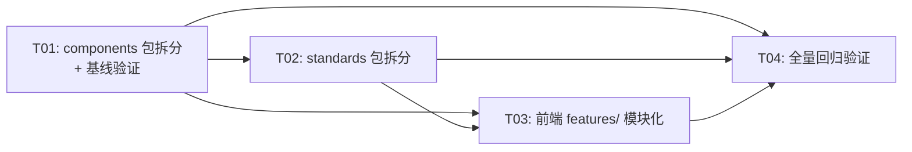

# IRIP 结构重构方案 — 2026-07-30

> 架构师：高见远（Gao）  
> 范围：packages/components 拆分 · packages/standards 拆分 · 前端 features/ 模块化  
> 原则：纯目录重组，不改业务逻辑；向后兼容（`__init__.py` re-export + barrel export）

---

## 目录

- [Part A: packages/components 包拆分方案](#part-a-packagescomponents-包拆分方案)
- [Part B: packages/standards 包拆分方案](#part-b-packagesstandards-包拆分方案)
- [Part C: 前端 features/ 模块化方案](#part-c-前端-features-模块化方案)
- [Part D: 任务列表](#part-d-任务列表)

---

## Part A: packages/components 包拆分方案

### A.1 现状概览

`packages/components/` 包含 8105 行、47 个 Python 文件，承担 4 个独立职责：

| 职责 | 核心文件 | 行数 | 说明 |
|------|---------|------|------|
| 核心 SDK 契约 | `sdk.py` | 168 | PortSpec、ComponentContext、ComponentResult、Component/ComponentRunner 协议 |
| 组件清单 | `manifest.py` | 178 | ComponentManifest 值对象 + ManifestValidator |
| 组件注册管理 | `registry.py` | 735 | Component/ComponentVersion ORM + ComponentRegistryService |
| 流程引擎 | `flow_runtime.py` | 1874 | FlowDefinition/FlowRun ORM + FlowRuntimeService |
| 流程校验 | `flow_validation.py` | 291 | FlowValidationService（DAG + 端口 + 参数校验） |
| 流程值对象 | `flows.py` | 234 | FlowNode、FlowEdge、FlowDefinitionVersion |
| 组件运行器 | `runner.py` | 577 | PythonComponentRunner + CLIComponentRunner |
| 内置组件 | `builtin/` (39 文件) | ~3848 | 30 个内置组件实现 + 共享类型 + 注册函数 |

### A.2 依赖关系分析

```
sdk.py (无内部依赖 — 基础层)
  ↑
  ├── manifest.py → sdk
  │     ↑
  │   registry.py → manifest, sdk
  │     ↑
  │   flow_validation.py → flows, manifest, registry
  │     ↑
  │   flow_runtime.py → flow_validation, flows, manifest, registry, sdk
  │
  ├── flows.py (无内部依赖 — 纯值对象)
  │
  ├── runner.py → manifest, sdk
  │
  └── builtin/ → sdk, manifest, builtin/types.py
```

**关键发现**：
- `sdk.py` 被 `builtin/` 下全部 30 个组件导入 → **必须留在根级**，移动会波及 39 个文件
- `manifest.py` 被 registry、flow、runner、builtin 共同依赖 → **留在根级**作为共享基础
- `flow_runtime.py`、`flow_validation.py`、`flows.py` 三者紧密耦合 → 合并到 `flow/` 子包
- `registry.py` 独立成 `registry/` 子包
- `runner.py` 独立成 `runner/` 子包
- `builtin/` 已按类别子目录组织 → **保持不变**

### A.3 目标子包结构

```
packages/components/
├── __init__.py               (更新：re-export 全部对外 API)
├── sdk.py                    ← 保留在根级（基础契约，被 39 个文件引用）
├── manifest.py               ← 保留在根级（共享依赖）
│
├── registry/                 ← 新建子包：组件注册管理
│   ├── __init__.py           (re-export from .registry)
│   └── registry.py           ← 移自 packages/components/registry.py
│
├── flow/                     ← 新建子包：流程引擎
│   ├── __init__.py           (re-export from .flows, .flow_validation, .flow_runtime)
│   ├── flows.py              ← 移自 packages/components/flows.py
│   ├── flow_validation.py    ← 移自 packages/components/flow_validation.py
│   └── flow_runtime.py       ← 移自 packages/components/flow_runtime.py
│
├── runner/                   ← 新建子包：组件运行器
│   ├── __init__.py           (re-export from .runner)
│   └── runner.py             ← 移自 packages/components/runner.py
│
├── flow_runtime.py           ← 兼容 shim（re-export from flow.flow_runtime）
├── flow_validation.py        ← 兼容 shim（re-export from flow.flow_validation）
├── flows.py                  ← 兼容 shim（re-export from flow.flows）
│
└── builtin/                  ← 保持不变（已按类别组织）
    ├── __init__.py
    ├── types.py
    ├── ingestion/
    ├── transform/
    ├── quality/
    ├── statistics/
    ├── output/
    └── model/
```

### A.4 文件移动清单

| 原路径 | 新路径 | 操作 |
|--------|--------|------|
| `packages/components/registry.py` | `packages/components/registry/registry.py` | 移动 |
| `packages/components/flows.py` | `packages/components/flow/flows.py` | 移动 |
| `packages/components/flow_validation.py` | `packages/components/flow/flow_validation.py` | 移动 |
| `packages/components/flow_runtime.py` | `packages/components/flow/flow_runtime.py` | 移动 |
| `packages/components/runner.py` | `packages/components/runner/runner.py` | 移动 |
| — | `packages/components/registry/__init__.py` | 新建 |
| — | `packages/components/flow/__init__.py` | 新建 |
| — | `packages/components/runner/__init__.py` | 新建 |
| — | `packages/components/flow_runtime.py` | 新建（shim） |
| — | `packages/components/flow_validation.py` | 新建（shim） |
| — | `packages/components/flows.py` | 新建（shim） |
| `packages/components/__init__.py` | 同位置 | 更置（添加 re-export） |

> `sdk.py`、`manifest.py`、`builtin/` 目录 **不动**。

### A.5 `__init__.py` re-export 方案

#### `packages/components/registry/__init__.py`

```python
"""组件注册管理子包。"""
from packages.components.registry.registry import (  # noqa: F401
    Component,
    ComponentRegistryService,
    ComponentVersion,
)
```

#### `packages/components/flow/__init__.py`

```python
"""流程引擎子包。"""
from packages.components.flow.flows import (  # noqa: F401
    FlowDefinitionVersion,
    FlowEdge,
    FlowNode,
    compute_flow_digest,
    edges_from_json,
    edges_to_json,
    nodes_from_json,
    nodes_to_json,
)
from packages.components.flow.flow_validation import (  # noqa: F401
    FlowValidationService,
    ValidationResult,
)
from packages.components.flow.flow_runtime import (  # noqa: F401
    FlowDefinition,
    FlowDefinitionVersionORM,
    FlowNodeExecution,
    FlowRun,
    FlowRuntimeService,
)
```

#### `packages/components/runner/__init__.py`

```python
"""组件运行器子包。"""
from packages.components.runner.runner import (  # noqa: F401
    CLIComponentRunner,
    PythonComponentRunner,
)
```

#### `packages/components/__init__.py`（更新）

```python
"""IRIP 组件系统包。

提供组件清单校验、注册表服务、运行器（Python / CLI）等能力，
支撑数据管线可插拔组件架构。
"""
# re-export 核心模块供 from packages.components import X 使用
from packages.components.sdk import (  # noqa: F401
    Component,
    ComponentContext,
    ComponentResult,
    ComponentRunner,
    PortSpec,
)
from packages.components.manifest import (  # noqa: F401
    ComponentManifest,
    ManifestValidator,
)
from packages.components.registry import (  # noqa: F401
    Component as _Component,
    ComponentRegistryService,
    ComponentVersion,
)
from packages.components.flow import (  # noqa: F401
    FlowDefinition,
    FlowDefinitionVersion,
    FlowDefinitionVersionORM,
    FlowEdge,
    FlowNode,
    FlowNodeExecution,
    FlowRun,
    FlowRuntimeService,
    FlowValidationService,
    ValidationResult,
)
from packages.components.runner import (  # noqa: F401
    CLIComponentRunner,
    PythonComponentRunner,
)
```

> 注意：`Component` 同时存在于 `sdk.py`（协议）和 `registry.py`（ORM），`__init__.py` 中 `sdk.Component` 优先导出，registry 的以 `_Component` 别名导入避免覆盖。

### A.6 兼容 shim 文件

以下 shim 保留旧模块路径，使外部调用方 `from packages.components.flow_runtime import X` 无需改动：

#### `packages/components/flow_runtime.py`（shim）

```python
"""兼容 shim — 已移至 packages.components.flow.flow_runtime。"""
from packages.components.flow.flow_runtime import (  # noqa: F401
    FlowDefinition,
    FlowDefinitionVersionORM,
    FlowNodeExecution,
    FlowRun,
    FlowRuntimeService,
    PROTECTED_PARAMS,
)
```

#### `packages/components/flow_validation.py`（shim）

```python
"""兼容 shim — 已移至 packages.components.flow.flow_validation。"""
from packages.components.flow.flow_validation import (  # noqa: F401
    FlowValidationService,
    ValidationResult,
)
```

#### `packages/components/flows.py`（shim）

```python
"""兼容 shim — 已移至 packages.components.flow.flows。"""
from packages.components.flow.flows import (  # noqa: F401
    FlowDefinitionVersion,
    FlowEdge,
    FlowNode,
    compute_flow_digest,
    edges_from_json,
    edges_to_json,
    nodes_from_json,
    nodes_to_json,
)
```

### A.7 需要修改的 import 路径清单

> 仅需修改 **flow 子包内部** 3 处 import；其余通过 shim / re-export 自动兼容。

| 文件（新路径） | 旧 import | 新 import |
|---------------|-----------|-----------|
| `flow/flow_validation.py` | `from packages.components.flows import FlowEdge, FlowNode` | `from packages.components.flow.flows import FlowEdge, FlowNode` |
| `flow/flow_runtime.py` | `from packages.components.flow_validation import (...)` | `from packages.components.flow.flow_validation import (...)` |
| `flow/flow_runtime.py` | `from packages.components.flows import (...)` | `from packages.components.flow.flows import (...)` |

**以下 import 无需修改**（通过 shim / re-export 自动兼容）：

| 文件 | import 语句 | 兼容方式 |
|------|------------|---------|
| `flow/flow_validation.py` | `from packages.components.manifest import ComponentManifest` | manifest.py 留在根级 |
| `flow/flow_validation.py` | `from packages.components.registry import ComponentRegistryService` | registry/__init__.py re-export |
| `flow/flow_runtime.py` | `from packages.components.manifest import ComponentManifest` | 留在根级 |
| `flow/flow_runtime.py` | `from packages.components.registry import (...)` | registry/__init__.py re-export |
| `flow/flow_runtime.py` | `from packages.components.sdk import (...)` | 留在根级 |
| `registry/registry.py` | `from packages.components.manifest import ComponentManifest` | 留在根级 |
| `runner/runner.py` | `from packages.components.manifest import ComponentManifest` | 留在根级 |
| `runner/runner.py` | `from packages.components.sdk import (...)` | 留在根级 |
| `builtin/__init__.py` | `from packages.components.manifest import ...` | 留在根级 |
| `builtin/__init__.py` | `from packages.components.sdk import Component` | 留在根级 |
| `builtin/**/*.py` (30 个) | `from packages.components.sdk import ...` | 留在根级 |
| 外部 `apps/worker/tasks/flows.py` | `from packages.components.flow_runtime import ...` | shim |
| 外部 `apps/worker/tasks/flows.py` | `from packages.components.registry import ...` | registry/__init__.py re-export |
| 外部 `apps/worker/tasks/flows.py` | `from packages.components.runner import ...` | runner/__init__.py re-export |
| 外部 `apps/api/routers/flows.py` | `from packages.components.flow_runtime import ...` | shim |
| 外部 `apps/api/routers/flows.py` | `from packages.components.flows import ...` | shim |
| 外部 `apps/api/routers/flows.py` | `from packages.components.registry import ...` | re-export |
| 外部 `apps/api/routers/components.py` | `from packages.components.manifest import ...` | 留在根级 |
| 外部 `apps/api/routers/components.py` | `from packages.components.registry import ...` | re-export |
| 外部 `apps/api/composition/flows.py` | `from packages.components.flow_runtime import ...` | shim |
| 外部 `apps/api/composition/flows.py` | `from packages.components.registry import ...` | re-export |
| 外部 `apps/api/composition/flows.py` | `from packages.components.runner import ...` | re-export |
| 外部 `apps/api/routers/facts.py` | `from packages.components.flow_runtime import ...` | shim |
| 外部 `apps/api/routers/facts.py` | `from packages.components.registry import ...` | re-export |
| 外部 `packages/jobs/service.py` | `from packages.components.flow_runtime import ...` | shim |
| 外部 tests/ | 各模块 import | shim / re-export |
| 外部 `packages/components/builtin/__init__.py` | `from packages.components.manifest import ...` | 留在根级 |
| 外部 `packages/components/builtin/__init__.py` | `from packages.components.sdk import Component` | 留在根级 |

### A.8 循环导入安全分析

`flow/__init__.py` 导入顺序必须为 `flows → flow_validation → flow_runtime`：

1. `flows.py` 无内部依赖 → 安全加载
2. `flow_validation.py` 依赖 `flow.flows`（已加载）→ 安全
3. `flow_runtime.py` 依赖 `flow.flow_validation`（已加载）+ `registry`（re-export）+ `manifest`/`sdk`（根级）→ 安全

`registry/__init__.py` 仅导入 `registry/registry.py`，后者依赖 `manifest`（根级）→ 无循环。

`runner/__init__.py` 仅导入 `runner/runner.py`，后者依赖 `manifest`、`sdk`（根级）→ 无循环。

---

## Part B: packages/standards 包拆分方案

### B.1 现状概览

`packages/standards/` 包含 5551 行、12 个 Python 文件，承担 5 个子领域：

| 子领域 | 文件 | 行数 | 说明 |
|--------|------|------|------|
| **变量** | `variables.py` | 235 | 标准变量 ORM + 枚举 |
| | `repository.py` | 609 | 标准变量数据仓库 |
| | `service.py` | 655 | 标准变量业务服务 |
| | `units.py` | 194 | 基于 Decimal 的单位转换器 |
| **方法** | `methods.py` | 722 | 方法 ORM + 服务 |
| **模板** | `templates.py` | 1043 | 事实模板 ORM + 验证器 + 服务 |
| **标准包** | `packages.py` | 995 | 标准包 ORM + 服务 |
| **对象** | `objects.py` | 204 | 工业对象 ORM + 枚举 |
| | `object_graph.py` | 790 | 工业对象图服务 |
| | `object_type_dict.py` | 36 | 实验对象类型字典 ORM |
| **共享** | `state_machine.py` | 59 | 标准状态机（被 4 个子领域引用） |
| | `__init__.py` | 9 | 包文档 |

### B.2 依赖关系分析

```
state_machine.py (无内部依赖 — 共享基础)
  ↑  ↑  ↑  ↑
  │  │  │  │
  │  │  │  ├── packages.py → state_machine, methods(lazy), templates(lazy), variables(lazy)
  │  │  ├── templates.py → state_machine, variables
  │  ├── methods.py → state_machine, repository(lazy)
  ├── service.py → repository, variables, state_machine
  │
  variables.py (无内部依赖)
    ↑
  repository.py → variables

  objects.py (无内部依赖)
    ↑
  object_graph.py → objects

  object_type_dict.py (无内部依赖)
  units.py (无内部依赖)
```

**关键发现**：
- `state_machine.py` 被变量、方法、模板、标准包 4 个子领域引用 → **留在根级**
- `variables.py`、`repository.py`、`service.py`、`units.py` 紧密耦合 → 合并到 `variables/` 子包
- `objects.py`、`object_graph.py`、`object_type_dict.py` 紧密耦合 → 合并到 `objects/` 子包
- `methods.py`、`templates.py`、`packages.py` 各自独立 → 各自子包

### B.3 目标子包结构

```
packages/standards/
├── __init__.py               (更新：re-export 全部对外 API)
├── state_machine.py          ← 保留在根级（共享基础，被 4 子领域引用）
│
├── variables/                ← 新建子包：标准变量
│   ├── __init__.py           (re-export from .variables, .repository, .service, .units)
│   ├── variables.py          ← 移自 packages/standards/variables.py
│   ├── repository.py         ← 移自 packages/standards/repository.py
│   ├── service.py            ← 移自 packages/standards/service.py
│   └── units.py              ← 移自 packages/standards/units.py
│
├── methods/                  ← 新建子包：方法
│   ├── __init__.py           (re-export from .methods)
│   └── methods.py            ← 移自 packages/standards/methods.py
│
├── templates/                ← 新建子包：模板
│   ├── __init__.py           (re-export from .templates)
│   └── templates.py          ← 移自 packages/standards/templates.py
│
├── packages/                ← 新建子包：标准包
│   ├── __init__.py           (re-export from .packages)
│   └── packages.py           ← 移自 packages/standards/packages.py
│
├── objects/                  ← 新建子包：工业对象
│   ├── __init__.py           (re-export from .objects, .object_graph, .object_type_dict)
│   ├── objects.py            ← 移自 packages/standards/objects.py
│   ├── object_graph.py       ← 移自 packages/standards/object_graph.py
│   └── object_type_dict.py   ← 移自 packages/standards/object_type_dict.py
│
├── repository.py             ← 兼容 shim（re-export from variables.repository）
├── service.py                ← 兼容 shim（re-export from variables.service）
├── units.py                  ← 兼容 shim（re-export from variables.units）
├── object_graph.py           ← 兼容 shim（re-export from objects.object_graph）
└── object_type_dict.py       ← 兼容 shim（re-export from objects.object_type_dict）
```

> `variables/`、`methods/`、`templates/`、`packages/`、`objects/` 五个子包名与原模块名相同，`__init__.py` re-export 后 `from packages.standards.variables import X` 等旧路径自动兼容（包替代模块），无需 shim。  
> `repository`、`service`、`units`、`object_graph`、`object_type_dict` 五个模块名 ≠ 子包名，需 shim。

### B.4 文件移动清单

| 原路径 | 新路径 | 操作 |
|--------|--------|------|
| `packages/standards/variables.py` | `packages/standards/variables/variables.py` | 移动 |
| `packages/standards/repository.py` | `packages/standards/variables/repository.py` | 移动 |
| `packages/standards/service.py` | `packages/standards/variables/service.py` | 移动 |
| `packages/standards/units.py` | `packages/standards/variables/units.py` | 移动 |
| `packages/standards/methods.py` | `packages/standards/methods/methods.py` | 移动 |
| `packages/standards/templates.py` | `packages/standards/templates/templates.py` | 移动 |
| `packages/standards/packages.py` | `packages/standards/packages/packages.py` | 移动 |
| `packages/standards/objects.py` | `packages/standards/objects/objects.py` | 移动 |
| `packages/standards/object_graph.py` | `packages/standards/objects/object_graph.py` | 移动 |
| `packages/standards/object_type_dict.py` | `packages/standards/objects/object_type_dict.py` | 移动 |
| — | `packages/standards/variables/__init__.py` | 新建 |
| — | `packages/standards/methods/__init__.py` | 新建 |
| — | `packages/standards/templates/__init__.py` | 新建 |
| — | `packages/standards/packages/__init__.py` | 新建 |
| — | `packages/standards/objects/__init__.py` | 新建 |
| — | `packages/standards/repository.py` | 新建（shim） |
| — | `packages/standards/service.py` | 新建（shim） |
| — | `packages/standards/units.py` | 新建（shim） |
| — | `packages/standards/object_graph.py` | 新建（shim） |
| — | `packages/standards/object_type_dict.py` | 新建（shim） |
| `packages/standards/__init__.py` | 同位置 | 更新 |
| `packages/standards/state_machine.py` | 同位置 | **不动** |

### B.5 `__init__.py` re-export 方案

#### `packages/standards/variables/__init__.py`

```python
"""标准变量子包。"""
from packages.standards.variables.variables import (  # noqa: F401
    DataType,
    Variable,
    VariableAlias,
    VariableStatus,
    VariableVersion,
)
from packages.standards.variables.repository import StandardsRepository  # noqa: F401
from packages.standards.variables.service import StandardService  # noqa: F401
from packages.standards.variables.units import UnitConverter  # noqa: F401
```

#### `packages/standards/methods/__init__.py`

```python
"""方法子包。"""
from packages.standards.methods.methods import (  # noqa: F401
    Method,
    MethodService,
    MethodStatus,
    MethodVersion,
)
```

#### `packages/standards/templates/__init__.py`

```python
"""事实模板子包。"""
from packages.standards.templates.templates import (  # noqa: F401
    Cardinality,
    FactTemplate,
    FactTemplateVersion,
    FactType,
    TemplateService,
    TemplateValidator,
)
```

> **注意**：engineer 需先读 `templates.py` 确认全部对外名称后再写 re-export 列表，上列为基于文档分析的预估。

#### `packages/standards/packages/__init__.py`

```python
"""标准包子包。"""
from packages.standards.packages.packages import (  # noqa: F401
    PackageService,
    PackageStatus,
    StandardPackage,
    StandardPackageVersion,
)
```

> **注意**：engineer 需先读 `packages.py` 确认全部对外名称。

#### `packages/standards/objects/__init__.py`

```python
"""工业对象子包。"""
from packages.standards.objects.objects import (  # noqa: F401
    HIERARCHICAL_RELATIONS,
    IndustrialObject,
    ObjectRelation,
    RelationType,
)
from packages.standards.objects.object_graph import ObjectGraphService  # noqa: F401
from packages.standards.objects.object_type_dict import ObjectTypeDict  # noqa: F401
```

#### `packages/standards/__init__.py`（更新）

```python
"""标准管理包：单位转换、标准变量、不可变版本、别名。

本包是 V1 粒度 L1→L3 证据链的基础层，提供：
- units: 基于 Decimal 的单位转换器（仿射变换 + 维度检查）；
- variables: 标准变量实体 + 不可变版本 + 别名 ORM 模型；
- state_machine: 标准状态机（draft → in_review → published → deprecated）；
- repository: 数据访问层；
- service: 业务编排服务（创建 / 提交 / 发布 / 拒绝 / 弃用 / 重提）。
"""
# re-export 各子包对外 API
from packages.standards.state_machine import (  # noqa: F401
    StandardStatus,
    assert_transition,
)
from packages.standards.variables import (  # noqa: F401
    DataType,
    StandardService,
    StandardsRepository,
    UnitConverter,
    Variable,
    VariableAlias,
    VariableStatus,
    VariableVersion,
)
from packages.standards.methods import (  # noqa: F401
    Method,
    MethodService,
    MethodStatus,
    MethodVersion,
)
from packages.standards.templates import (  # noqa: F401
    Cardinality,
    FactTemplate,
    FactTemplateVersion,
    FactType,
    TemplateService,
    TemplateValidator,
)
from packages.standards.packages import (  # noqa: F401
    PackageService,
    PackageStatus,
    StandardPackage,
    StandardPackageVersion,
)
from packages.standards.objects import (  # noqa: F401
    HIERARCHICAL_RELATIONS,
    IndustrialObject,
    ObjectGraphService,
    ObjectRelation,
    ObjectTypeDict,
    RelationType,
)
```

### B.6 兼容 shim 文件

#### `packages/standards/repository.py`（shim）

```python
"""兼容 shim — 已移至 packages.standards.variables.repository。"""
from packages.standards.variables.repository import StandardsRepository  # noqa: F401
```

#### `packages/standards/service.py`（shim）

```python
"""兼容 shim — 已移至 packages.standards.variables.service。"""
from packages.standards.variables.service import StandardService  # noqa: F401
```

#### `packages/standards/units.py`（shim）

```python
"""兼容 shim — 已移至 packages.standards.variables.units。"""
from packages.standards.variables.units import UnitConverter  # noqa: F401
```

#### `packages/standards/object_graph.py`（shim）

```python
"""兼容 shim — 已移至 packages.standards.objects.object_graph。"""
from packages.standards.objects.object_graph import ObjectGraphService  # noqa: F401
```

#### `packages/standards/object_type_dict.py`（shim）

```python
"""兼容 shim — 已移至 packages.standards.objects.object_type_dict。"""
from packages.standards.objects.object_type_dict import ObjectTypeDict  # noqa: F401
```

### B.7 需要修改的 import 路径清单

> **无需修改任何内部 import**。所有旧路径通过 shim + `__init__.py` re-export 自动兼容。

**验证逻辑**：

| 内部文件 | import 语句 | 兼容方式 |
|---------|------------|---------|
| `variables/repository.py` | `from packages.standards.variables import (...)` | variables/__init__.py re-export |
| `variables/service.py` | `from packages.standards.repository import StandardsRepository` | shim → variables/repository |
| `variables/service.py` | `from packages.standards.variables import (...)` | re-export |
| `variables/service.py` | `from packages.standards.state_machine import ...` | 留在根级 |
| `methods/methods.py` | `from packages.standards.state_machine import ...` | 留在根级 |
| `methods/methods.py` | `from packages.standards.repository import (...)` (lazy) | shim |
| `templates/templates.py` | `from packages.standards.state_machine import ...` | 留在根级 |
| `templates/templates.py` | `from packages.standards.variables import VariableVersion` | re-export |
| `packages/packages.py` | `from packages.standards.state_machine import ...` | 留在根级 |
| `packages/packages.py` | `from packages.standards.methods import MethodVersion` (lazy) | re-export |
| `packages/packages.py` | `from packages.standards.templates import FactTemplateVersion` (lazy) | re-export |
| `packages/packages.py` | `from packages.standards.variables import VariableVersion` (lazy) | re-export |
| `objects/object_graph.py` | `from packages.standards.objects import (...)` | re-export |

**外部调用方也无需修改**（apps/、tests/、packages/facts/ 等）。

### B.8 循环导入安全分析

`variables/__init__.py` 导入顺序必须为 `variables → repository → service → units`：

1. `variables.py` 无内部依赖 → 安全加载，绑定 Variable 等
2. `repository.py` 依赖 `packages.standards.variables`（已绑定 Variable 等）→ 安全
3. `service.py` 依赖 `packages.standards.repository`（shim → variables.repository，已加载）+ `packages.standards.variables`（已加载）→ 安全
4. `units.py` 无内部依赖 → 安全

`objects/__init__.py` 导入顺序 `objects → object_graph → object_type_dict`：

1. `objects.py` 无内部依赖 → 安全
2. `object_graph.py` 依赖 `packages.standards.objects`（已加载）→ 安全
3. `object_type_dict.py` 无内部依赖 → 安全

`methods/`、`templates/`、`packages/` 各单文件子包，无循环风险。

---

## Part C: 前端 features/ 模块化方案

### C.1 现状概览

`apps/web/src/` 下 73 个 tsx 文件 + 28 个 ts 文件，当前结构问题：

1. **领域目录已存在但未统一**：`auth/`、`assistant/`、`governance/`、`jobs/` 等已有领域目录，但 `pages/` 混有聚合页和废弃占位页
2. **`components/` 职责混杂**：业务组件（ComponentsPage、FlowDetail）与 UI 原子组件（components/ui/）、布局组件（components/layout/）混在同一目录
3. **`pages/` 有 6 个废弃占位页**：FactsPage、GovernancePage、JobsPage、ModelsPage、ParametersPage、StandardsPage 均为简单占位组件，未被路由或任何文件引用
4. **缺少 barrel export**：仅 `components/ui/index.ts` 有 barrel，其余领域无统一导出

### C.2 现有文件按领域归类

#### 领域目录（已有，需移入 features/）

| 领域 | 当前目录 | tsx 文件 | ts 文件 |
|------|---------|---------|---------|
| auth | `auth/` | AuthProvider, LoginPage, LoginPage.test | sessionState.ts |
| assistant | `assistant/` | AssistantPage, MessageThread, ToolTrace, ProviderStatus, CitationList | — |
| governance | `governance/` + `pages/governance/` | GovernanceConsole, AIConfigPage, AuditPage, SystemHealthPage, UsersPage, DepartmentManagement, MemberDrawer | — |
| jobs | `jobs/` | JobsPage, JobDetail, JobDrawer, JobDrawer.test | useJobStore.ts |
| models | `models/` | ModelsPage, ModelDetail, PredictionWorkbench | — |
| facts | `facts/` | FactsPage, FactDetail | — |
| parameters | `parameters/` | ParameterPage, ApprovalPanel, ApprovalPanel.test | — |
| ingestions | `ingestions/` | IngestionWizard, IngestionWizard.test | — |
| ai_tools | `ai_tools/` | AIToolsPage, BuiltinToolEditDrawer, ToolEditDrawer | types.ts |
| equipment | `equipment/` | EquipmentPage | — |
| provenance | `provenance/` | ProvenancePage | — |
| standards | `standards/` + `objects/` | StandardsPage, ExperimentalObjectPage, ObjectGraphPage | — |

#### 业务组件（混在 components/ 中，需拆出）

| 当前路径 | 文件 | 目标领域 |
|---------|------|---------|
| `components/ComponentsPage.tsx` | ComponentsPage | components（组件管理） |
| `components/ComponentDetailPanel.tsx` | ComponentDetailPanel | components |
| `components/ComponentFormFields.tsx` | ComponentFormFields | components |
| `components/FlowDetail.tsx` | FlowDetail | components |
| `components/FlowDetail.test.tsx` | FlowDetail.test | components |
| `components/StateDisplay.tsx` | StateDisplay | components |
| `components/flow/FactModal.tsx` | FactModal | components |
| `components/flow/shared.ts` | shared | components |
| `components/component-utils.ts` | component-utils | shared |

#### 共享 UI 原子组件（留在共享层）

| 当前路径 | 文件 |
|---------|------|
| `components/ui/*.tsx` (13 个) | PageIntro, DataHero, MetricStrip, OceanPanel, ActionBar, DataTableShell, StatusMark, FeedbackState, DetailSection, FlowTrack, FocusDrawer, FocusModal, OceanEmptyState, OceanSkeleton |
| `components/ui/index.ts` | barrel（已有） |
| `components/layout/ContentFrame.tsx` | ContentFrame |
| `components/layout/OceanBackdrop.tsx` | OceanBackdrop |

#### 聚合页（pages/ 中的有效页面）

| 当前路径 | 文件 | 说明 |
|---------|------|------|
| `pages/WorkbenchPage.tsx` | WorkbenchPage | 研发看板（路由直接引用） |
| `pages/LabOpsPage.tsx` | LabOpsPage | 实验室运营（Tab 聚合页） |
| `pages/PlatformPage.tsx` | PlatformPage | 平台应用（Tab 聚合页） |

#### 废弃占位页（pages/ 中未被引用的）

| 当前路径 | 文件 | 说明 |
|---------|------|------|
| `pages/FactsPage.tsx` | FactsPage | 占位，未被引用 |
| `pages/GovernancePage.tsx` | GovernancePage | 占位，未被引用 |
| `pages/JobsPage.tsx` | JobsPage | 占位，未被引用 |
| `pages/ModelsPage.tsx` | ModelsPage | 占位，未被引用 |
| `pages/ParametersPage.tsx` | ParametersPage | 占位，未被引用 |
| `pages/StandardsPage.tsx` | StandardsPage | 占位，未被引用 |

### C.3 目标 features/ 目录结构

```
apps/web/src/
├── main.tsx                         ← 不动
├── app/                             ← 不动（应用骨架）
│   ├── AppShell.tsx
│   ├── router.tsx                   ← 仅更新 import 路径
│   └── PageHeaderContext.tsx
├── api/                             ← 不动（API 客户端层）
│   ├── client.ts
│   ├── types.ts
│   └── ...（17 个模块）
├── shared/                          ← 新建：共享 UI + 布局 + 工具
│   ├── ui/                          ← 移自 components/ui/
│   │   └── index.ts                 ← 移自 components/ui/index.ts
│   ├── layout/                      ← 移自 components/layout/
│   │   ├── ContentFrame.tsx
│   │   └── OceanBackdrop.tsx
│   └── component-utils.ts           ← 移自 components/component-utils.ts
├── theme/                           ← 不动
├── styles/                          ← 不动
├── test/                            ← 不动
│
├── features/                        ← 新建：按功能领域组织
│   ├── auth/
│   │   ├── index.ts                 (barrel)
│   │   ├── AuthProvider.tsx         ← 移自 auth/
│   │   ├── LoginPage.tsx            ← 移自 auth/
│   │   ├── LoginPage.test.tsx       ← 移自 auth/
│   │   └── sessionState.ts          ← 移自 auth/
│   │
│   ├── assistant/
│   │   ├── index.ts                 (barrel)
│   │   ├── AssistantPage.tsx        ← 移自 assistant/
│   │   ├── MessageThread.tsx        ← 移自 assistant/
│   │   ├── ToolTrace.tsx            ← 移自 assistant/
│   │   ├── ProviderStatus.tsx       ← 移自 assistant/
│   │   └── CitationList.tsx         ← 移自 assistant/
│   │
│   ├── standards/
│   │   ├── index.ts                 (barrel)
│   │   ├── StandardsPage.tsx        ← 移自 standards/
│   │   ├── ExperimentalObjectPage.tsx ← 移自 objects/
│   │   └── ObjectGraphPage.tsx      ← 移自 objects/
│   │
│   ├── components/                  ← 组件 + 流程管理
│   │   ├── index.ts                 (barrel)
│   │   ├── ComponentsPage.tsx       ← 移自 components/
│   │   ├── ComponentDetailPanel.tsx ← 移自 components/
│   │   ├── ComponentFormFields.tsx  ← 移自 components/
│   │   ├── FlowDetail.tsx           ← 移自 components/
│   │   ├── FlowDetail.test.tsx      ← 移自 components/
│   │   ├── StateDisplay.tsx         ← 移自 components/
│   │   ├── FactModal.tsx            ← 移自 components/flow/
│   │   └── shared.ts                ← 移自 components/flow/
│   │
│   ├── governance/
│   │   ├── index.ts                 (barrel)
│   │   ├── GovernanceConsole.tsx   ← 移自 governance/
│   │   ├── AIConfigPage.tsx         ← 移自 governance/
│   │   ├── AuditPage.tsx            ← 移自 governance/
│   │   ├── SystemHealthPage.tsx     ← 移自 governance/
│   │   ├── UsersPage.tsx            ← 移自 governance/
│   │   ├── DepartmentManagement.tsx ← 移自 pages/governance/
│   │   └── MemberDrawer.tsx         ← 移自 pages/governance/
│   │
│   ├── jobs/
│   │   ├── index.ts                 (barrel)
│   │   ├── JobsPage.tsx             ← 移自 jobs/
│   │   ├── JobDetail.tsx            ← 移自 jobs/
│   │   ├── JobDrawer.tsx            ← 移自 jobs/
│   │   ├── JobDrawer.test.tsx       ← 移自 jobs/
│   │   └── useJobStore.ts           ← 移自 jobs/
│   │
│   ├── models/
│   │   ├── index.ts                 (barrel)
│   │   ├── ModelsPage.tsx           ← 移自 models/
│   │   ├── ModelDetail.tsx          ← 移自 models/
│   │   └── PredictionWorkbench.tsx  ← 移自 models/
│   │
│   ├── facts/
│   │   ├── index.ts                 (barrel)
│   │   ├── FactsPage.tsx            ← 移自 facts/
│   │   └── FactDetail.tsx           ← 移自 facts/
│   │
│   ├── parameters/
│   │   ├── index.ts                 (barrel)
│   │   ├── ParameterPage.tsx        ← 移自 parameters/
│   │   ├── ApprovalPanel.tsx        ← 移自 parameters/
│   │   └── ApprovalPanel.test.tsx   ← 移自 parameters/
│   │
│   ├── ingestions/
│   │   ├── index.ts                 (barrel)
│   │   ├── IngestionWizard.tsx      ← 移自 ingestions/
│   │   └── IngestionWizard.test.tsx ← 移自 ingestions/
│   │
│   ├── ai-tools/
│   │   ├── index.ts                 (barrel)
│   │   ├── AIToolsPage.tsx           ← 移自 ai_tools/
│   │   ├── BuiltinToolEditDrawer.tsx ← 移自 ai_tools/
│   │   ├── ToolEditDrawer.tsx        ← 移自 ai_tools/
│   │   └── types.ts                 ← 移自 ai_tools/
│   │
│   ├── equipment/
│   │   ├── index.ts                 (barrel)
│   │   └── EquipmentPage.tsx        ← 移自 equipment/
│   │
│   ├── provenance/
│   │   ├── index.ts                 (barrel)
│   │   └── ProvenancePage.tsx       ← 移自 provenance/
│   │
│   └── dashboard/                   ← 聚合页
│       ├── index.ts                 (barrel)
│       ├── WorkbenchPage.tsx        ← 移自 pages/
│       ├── LabOpsPage.tsx           ← 移自 pages/
│       └── PlatformPage.tsx         ← 移自 pages/
│
└── (删除：pages/FactsPage.tsx 等 6 个废弃占位页)
└── (删除：空的旧目录 auth/、assistant/ 等)
```

### C.4 barrel export 方案

每个 `features/<domain>/index.ts` 统一导出该领域的公开组件和类型。示例：

#### `features/auth/index.ts`

```typescript
export { AuthProvider, useAuthStore } from './AuthProvider';
export { LoginPage } from './LoginPage';
export type { AuthUser } from './AuthProvider';
```

> **注意**：engineer 需先读各组件确认实际导出名称后再写 barrel。

#### `features/jobs/index.ts`

```typescript
export { JobsPage } from './JobsPage';
export { JobDetail } from './JobDetail';
export { JobDrawer, JobDrawerButton } from './JobDrawer';
export { useJobStore } from './useJobStore';
```

#### `features/components/index.ts`

```typescript
export { ComponentsPage } from './ComponentsPage';
export { ComponentDetailPanel } from './ComponentDetailPanel';
export { ComponentFormFields } from './ComponentFormFields';
export { FlowDetail } from './FlowDetail';
export { StateDisplay } from './StateDisplay';
export { FactModal } from './FactModal';
```

#### `features/dashboard/index.ts`

```typescript
export { WorkbenchPage } from './WorkbenchPage';
export { LabOpsPage } from './LabOpsPage';
export { PlatformPage } from './PlatformPage';
```

#### `shared/ui/index.ts`

```typescript
// 直接移自 components/ui/index.ts，内容不变
export { PageIntro } from './PageIntro';
// ...（保持原 barrel 内容）
```

### C.5 import 路径变更清单

> 所有 `@/` 路径别名不变（tsconfig `paths: { "@/*": ["src/*"] }`），只改子路径。

| 旧路径 | 新路径 | 涉及文件 |
|--------|--------|---------|
| `@/auth/AuthProvider` | `@/features/auth/AuthProvider` 或 `@/features/auth` | router.tsx, AppShell.tsx, PlatformPage.tsx 等 |
| `@/auth/LoginPage` | `@/features/auth/LoginPage` | router.tsx |
| `@/assistant/AssistantPage` | `@/features/assistant/AssistantPage` | PlatformPage.tsx |
| `@/standards/StandardsPage` | `@/features/standards/StandardsPage` | router.tsx |
| `@/objects/ExperimentalObjectPage` | `@/features/standards/ExperimentalObjectPage` | StandardsPage.tsx |
| `@/objects/ObjectGraphPage` | `@/features/standards/ObjectGraphPage` | StandardsPage.tsx |
| `@/components/ComponentsPage` | `@/features/components/ComponentsPage` | router.tsx, PlatformPage.tsx |
| `@/components/FlowDetail` | `@/features/components/FlowDetail` | LabOpsPage.tsx |
| `@/components/ComponentDetailPanel` | `@/features/components/ComponentDetailPanel` | ComponentsPage.tsx |
| `@/components/ComponentFormFields` | `@/features/components/ComponentFormFields` | ComponentsPage.tsx |
| `@/components/StateDisplay` | `@/features/components/StateDisplay` | 引用处 |
| `@/components/flow/FactModal` | `@/features/components/FactModal` | 引用处 |
| `@/components/flow/shared` | `@/features/components/shared` | 引用处 |
| `@/components/ui` | `@/shared/ui` | 全部引用 UI 组件的文件 |
| `@/components/ui/X` | `@/shared/ui/X` | 引用处 |
| `@/components/layout/ContentFrame` | `@/shared/layout/ContentFrame` | AppShell.tsx |
| `@/components/layout/OceanBackdrop` | `@/shared/layout/OceanBackdrop` | AppShell.tsx |
| `@/components/component-utils` | `@/shared/component-utils` | 引用处 |
| `@/governance/GovernanceConsole` | `@/features/governance/GovernanceConsole` | router.tsx |
| `@/governance/X` | `@/features/governance/X` | GovernanceConsole.tsx |
| `@/pages/governance/X` | `@/features/governance/X` | 引用处 |
| `@/jobs/JobsPage` | `@/features/jobs/JobsPage` | router.tsx |
| `@/jobs/JobDetail` | `@/features/jobs/JobDetail` | router.tsx |
| `@/jobs/JobDrawer` | `@/features/jobs/JobDrawer` | AppShell.tsx |
| `@/jobs/useJobStore` | `@/features/jobs/useJobStore` | 引用处 |
| `@/models/X` | `@/features/models/X` | 引用处 |
| `@/facts/FactsPage` | `@/features/facts/FactsPage` | LabOpsPage.tsx |
| `@/facts/FactDetail` | `@/features/facts/FactDetail` | router.tsx |
| `@/parameters/ParameterPage` | `@/features/parameters/ParameterPage` | LabOpsPage.tsx |
| `@/parameters/ApprovalPanel` | `@/features/parameters/ApprovalPanel` | 引用处 |
| `@/ingestions/IngestionWizard` | `@/features/ingestions/IngestionWizard` | 引用处 |
| `@/ai_tools/AIToolsPage` | `@/features/ai-tools/AIToolsPage` | PlatformPage.tsx |
| `@/ai_tools/X` | `@/features/ai-tools/X` | 引用处 |
| `@/equipment/EquipmentPage` | `@/features/equipment/EquipmentPage` | 引用处 |
| `@/provenance/ProvenancePage` | `@/features/provenance/ProvenancePage` | 引用处 |
| `@/pages/WorkbenchPage` | `@/features/dashboard/WorkbenchPage` | router.tsx |
| `@/pages/LabOpsPage` | `@/features/dashboard/LabOpsPage` | router.tsx |
| `@/pages/PlatformPage` | `@/features/dashboard/PlatformPage` | router.tsx |

### C.6 废弃文件清理

以下 6 个占位页未被任何文件引用（已通过全文搜索确认），应删除：

- `pages/FactsPage.tsx`
- `pages/GovernancePage.tsx`
- `pages/JobsPage.tsx`
- `pages/ModelsPage.tsx`
- `pages/ParametersPage.tsx`
- `pages/StandardsPage.tsx`

删除后 `pages/` 目录仅剩 3 个聚合页（移入 `features/dashboard/`），原 `pages/` 目录可删除。

---

## Part D: 任务列表

### D.1 任务概览

| ID | 任务名 | 风险 | 预估工时 | 依赖 |
|----|--------|------|---------|------|
| T01 | components 包拆分 + 基线验证 | 低 | 2h | — |
| T02 | standards 包拆分 | 低 | 2h | T01 |
| T03 | 前端 features/ 模块化 | 中 | 3h | T01, T02 |
| T04 | 全量回归验证 + 修复 | 低 | 1h | T01, T02, T03 |

> 总预估工时：8h。按风险从低到高排列：先做后端包拆分（T01/T02，shim 保证兼容），再做前端（T03，import 路径批量修改）。

---

### T01: components 包拆分 + 基线验证

**目标**：将 `packages/components/` 拆分为 `registry/`、`flow/`、`runner/` 三个子包，保留 `sdk.py`、`manifest.py` 在根级，`builtin/` 不动。

**涉及文件**（移动 + 新建 + 修改）：

| 操作 | 文件 |
|------|------|
| 移动 | `packages/components/registry.py` → `packages/components/registry/registry.py` |
| 移动 | `packages/components/flows.py` → `packages/components/flow/flows.py` |
| 移动 | `packages/components/flow_validation.py` → `packages/components/flow/flow_validation.py` |
| 移动 | `packages/components/flow_runtime.py` → `packages/components/flow/flow_runtime.py` |
| 移动 | `packages/components/runner.py` → `packages/components/runner/runner.py` |
| 新建 | `packages/components/registry/__init__.py` |
| 新建 | `packages/components/flow/__init__.py` |
| 新建 | `packages/components/runner/__init__.py` |
| 新建 | `packages/components/flow_runtime.py`（shim） |
| 新建 | `packages/components/flow_validation.py`（shim） |
| 新建 | `packages/components/flows.py`（shim） |
| 修改 import | `packages/components/flow/flow_validation.py`（1 处：flows → flow.flows） |
| 修改 import | `packages/components/flow/flow_runtime.py`（2 处：flow_validation → flow.flow_validation, flows → flow.flows） |
| 更新 | `packages/components/__init__.py`（添加 re-export） |

**验收标准**：
- `pytest tests/unit/components/ -x` 全部通过
- `pytest tests/integration/components/ -x` 全部通过
- `python -c "from packages.components.registry import ComponentRegistryService"` 成功
- `python -c "from packages.components.flow_runtime import FlowRuntimeService"` 成功（经 shim）
- `python -c "from packages.components.runner import PythonComponentRunner"` 成功

**依赖**：无  
**优先级**：P0

---

### T02: standards 包拆分

**目标**：将 `packages/standards/` 拆分为 `variables/`、`methods/`、`templates/`、`packages/`、`objects/` 五个子包，保留 `state_machine.py` 在根级。

**涉及文件**（移动 + 新建 + 修改）：

| 操作 | 文件 |
|------|------|
| 移动 | `packages/standards/variables.py` → `packages/standards/variables/variables.py` |
| 移动 | `packages/standards/repository.py` → `packages/standards/variables/repository.py` |
| 移动 | `packages/standards/service.py` → `packages/standards/variables/service.py` |
| 移动 | `packages/standards/units.py` → `packages/standards/variables/units.py` |
| 移动 | `packages/standards/methods.py` → `packages/standards/methods/methods.py` |
| 移动 | `packages/standards/templates.py` → `packages/standards/templates/templates.py` |
| 移动 | `packages/standards/packages.py` → `packages/standards/packages/packages.py` |
| 移动 | `packages/standards/objects.py` → `packages/standards/objects/objects.py` |
| 移动 | `packages/standards/object_graph.py` → `packages/standards/objects/object_graph.py` |
| 移动 | `packages/standards/object_type_dict.py` → `packages/standards/objects/object_type_dict.py` |
| 新建 | `packages/standards/variables/__init__.py` |
| 新建 | `packages/standards/methods/__init__.py` |
| 新建 | `packages/standards/templates/__init__.py` |
| 新建 | `packages/standards/packages/__init__.py` |
| 新建 | `packages/standards/objects/__init__.py` |
| 新建 | `packages/standards/repository.py`（shim） |
| 新建 | `packages/standards/service.py`（shim） |
| 新建 | `packages/standards/units.py`（shim） |
| 新建 | `packages/standards/object_graph.py`（shim） |
| 新建 | `packages/standards/object_type_dict.py`（shim） |
| 更新 | `packages/standards/__init__.py`（添加 re-export） |

> **注意**：内部 import 无需修改（全部通过 shim + re-export 兼容）。  
> engineer 在编写各 `__init__.py` re-export 列表前，需先 `Read` 对应模块确认全部对外类/函数名。

**验收标准**：
- `pytest tests/unit/standards/ -x` 全部通过
- `pytest tests/unit/facts/ -x` 全部通过
- `pytest tests/integration/facts/ -x` 全部通过
- `python -c "from packages.standards.service import StandardService"` 成功（经 shim）
- `python -c "from packages.standards.variables import Variable"` 成功
- `python -c "from packages.standards.packages import PackageService"` 成功

**依赖**：T01  
**优先级**：P0

---

### T03: 前端 features/ 模块化

**目标**：将 `apps/web/src/` 下的领域目录移入 `features/`，UI 原子组件移入 `shared/`，添加 barrel export，更新全部 import 路径。

**涉及文件**（移动 + 新建 + 修改）：

| 操作 | 文件/目录 |
|------|---------|
| 新建目录 | `apps/web/src/features/` |
| 新建目录 | `apps/web/src/shared/` |
| 移动目录 | `auth/` → `features/auth/`（4 文件） |
| 移动目录 | `assistant/` → `features/assistant/`（5 文件） |
| 移动文件 | `standards/StandardsPage.tsx` → `features/standards/` |
| 移动文件 | `objects/ExperimentalObjectPage.tsx` → `features/standards/` |
| 移动文件 | `objects/ObjectGraphPage.tsx` → `features/standards/` |
| 移动文件 | `components/ComponentsPage.tsx` → `features/components/` |
| 移动文件 | `components/ComponentDetailPanel.tsx` → `features/components/` |
| 移动文件 | `components/ComponentFormFields.tsx` → `features/components/` |
| 移动文件 | `components/FlowDetail.tsx` → `features/components/` |
| 移动文件 | `components/FlowDetail.test.tsx` → `features/components/` |
| 移动文件 | `components/StateDisplay.tsx` → `features/components/` |
| 移动文件 | `components/flow/FactModal.tsx` → `features/components/` |
| 移动文件 | `components/flow/shared.ts` → `features/components/` |
| 移动目录 | `governance/` → `features/governance/`（5 文件） |
| 移动文件 | `pages/governance/DepartmentManagement.tsx` → `features/governance/` |
| 移动文件 | `pages/governance/MemberDrawer.tsx` → `features/governance/` |
| 移动目录 | `jobs/` → `features/jobs/`（5 文件） |
| 移动目录 | `models/` → `features/models/`（3 文件） |
| 移动目录 | `facts/` → `features/facts/`（2 文件） |
| 移动目录 | `parameters/` → `features/parameters/`（3 文件） |
| 移动目录 | `ingestions/` → `features/ingestions/`（2 文件） |
| 移动目录 | `ai_tools/` → `features/ai-tools/`（4 文件） |
| 移动目录 | `equipment/` → `features/equipment/`（1 文件） |
| 移动目录 | `provenance/` → `features/provenance/`（1 文件） |
| 移动文件 | `pages/WorkbenchPage.tsx` → `features/dashboard/` |
| 移动文件 | `pages/LabOpsPage.tsx` → `features/dashboard/` |
| 移动文件 | `pages/PlatformPage.tsx` → `features/dashboard/` |
| 移动目录 | `components/ui/` → `shared/ui/`（14 文件含 index.ts） |
| 移动目录 | `components/layout/` → `shared/layout/`（2 文件） |
| 移动文件 | `components/component-utils.ts` → `shared/component-utils.ts` |
| 新建 | `features/auth/index.ts` |
| 新建 | `features/assistant/index.ts` |
| 新建 | `features/standards/index.ts` |
| 新建 | `features/components/index.ts` |
| 新建 | `features/governance/index.ts` |
| 新建 | `features/jobs/index.ts` |
| 新建 | `features/models/index.ts` |
| 新建 | `features/facts/index.ts` |
| 新建 | `features/parameters/index.ts` |
| 新建 | `features/ingestions/index.ts` |
| 新建 | `features/ai-tools/index.ts` |
| 新建 | `features/equipment/index.ts` |
| 新建 | `features/provenance/index.ts` |
| 新建 | `features/dashboard/index.ts` |
| 删除 | `pages/FactsPage.tsx`（废弃占位页） |
| 删除 | `pages/GovernancePage.tsx`（废弃占位页） |
| 删除 | `pages/JobsPage.tsx`（废弃占位页） |
| 删除 | `pages/ModelsPage.tsx`（废弃占位页） |
| 删除 | `pages/ParametersPage.tsx`（废弃占位页） |
| 删除 | `pages/StandardsPage.tsx`（废弃占位页） |
| 修改 import | `app/router.tsx`（约 9 处） |
| 修改 import | `app/AppShell.tsx`（约 4 处） |
| 修改 import | `pages/LabOpsPage.tsx` → `features/dashboard/LabOpsPage.tsx`（约 3 处） |
| 修改 import | `pages/PlatformPage.tsx` → `features/dashboard/PlatformPage.tsx`（约 4 处） |
| 修改 import | 其余互相引用的组件（全量搜索 `@/components/`、`@/auth/`、`@/jobs/` 等旧路径并更新） |

**验收标准**：
- `npx tsc --noEmit` 零错误
- `npx vitest run` 全部通过
- 浏览器开发服务器 `npm run dev` 正常启动

**依赖**：T01, T02  
**优先级**：P1

---

### T04: 全量回归验证 + 修复

**目标**：运行完整测试套件，修复迁移遗漏的 import 路径问题。

**涉及文件**：可能涉及任意遗漏文件（预期 < 5 个）。

**执行步骤**：
1. `pytest tests/unit/ -x` — 后端单元测试
2. `pytest tests/integration/ -x` — 后端集成测试
3. `cd apps/web && npx tsc --noEmit` — 前端类型检查
4. `cd apps/web && npx vitest run` — 前端单元测试
5. 修复发现的 import 问题
6. 重复直到全绿

**验收标准**：
- 所有测试套件全绿
- 无残留的旧路径 import（全量搜索 `@/components/ComponentsPage`、`@/auth/` 等旧路径确认零命中）

**依赖**：T01, T02, T03  
**优先级**：P0

---

### D.2 任务依赖图



### D.3 共享知识

- **Python 兼容策略**：子包 `__init__.py` re-export + 旧路径 shim 文件，外部调用方零改动
- **shim 文件模板**：`from packages.xxx.yyy import Zzz  # noqa: F401`，只做 re-export，不含逻辑
- **`__init__.py` 导入顺序**：必须按依赖拓扑序排列（被依赖者优先），防止循环导入
- **前端路径别名**：`@/*` → `src/*`（tsconfig + vite.config.ts 已配置），重构不改变别名本身
- **前端 barrel export**：每个 `features/<domain>/index.ts` 导出该领域的公开 API；内部文件间引用可走 barrel 或直接路径
- **废弃占位页**：`pages/` 下 6 个未被引用的占位页直接删除，不需 shim
- **测试验证命令**：后端 `pytest tests/unit/ -x`；前端 `npx tsc --noEmit` + `npx vitest run`
- **re-export 列表确认**：engineer 编写 `__init__.py` 前，必须 `Read` 对应模块确认全部对外类/函数/常量名，不要遗漏

### D.4 不确定项与假设

1. **templates.py / packages.py 的完整导出列表**：设计文档中 `__init__.py` re-export 列表基于模块文档注释推断，engineer 需读源码确认全部公开名称（含 StrEnum、dataclass、常量等）
2. **前端组件间引用关系**：设计文档列出了主要 import 变更，但可能遗漏少量组件间的互相引用。engineer 应在移动后用 `grep -r '@/components/' apps/web/src/` 全量搜索确认
3. **`packages/standards/packages/` 路径**：`packages/standards/packages/packages.py` 路径中 "packages" 出现 3 次，略显冗余但 Python 语义正确。如团队强烈反对可改子包名为 `std_packages/`，但需同步更新 shim
4. **`features/components/` 命名**：与 React 通用概念 "components" 同名可能引起混淆，但与后端 `packages/components` 语义对齐（组件管理领域）。如团队偏好可改为 `features/component-mgmt/`
