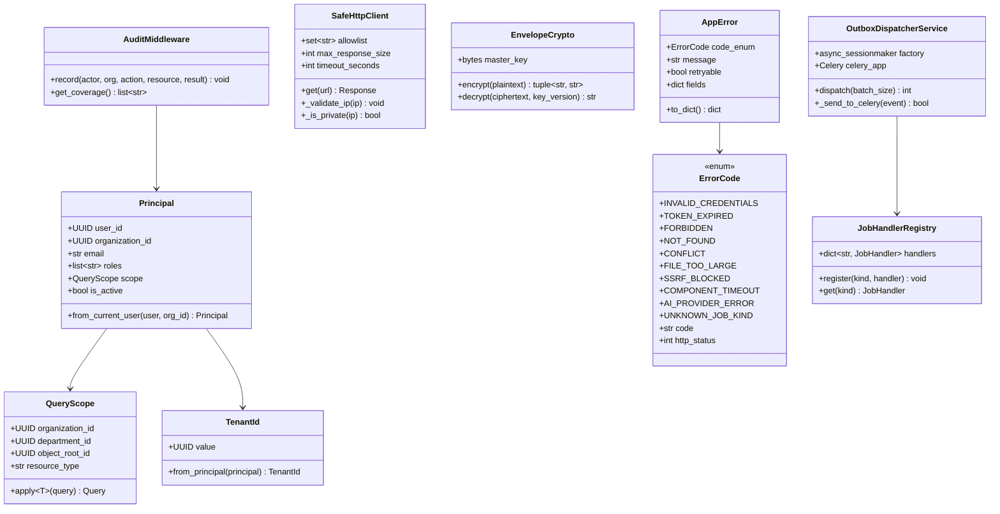
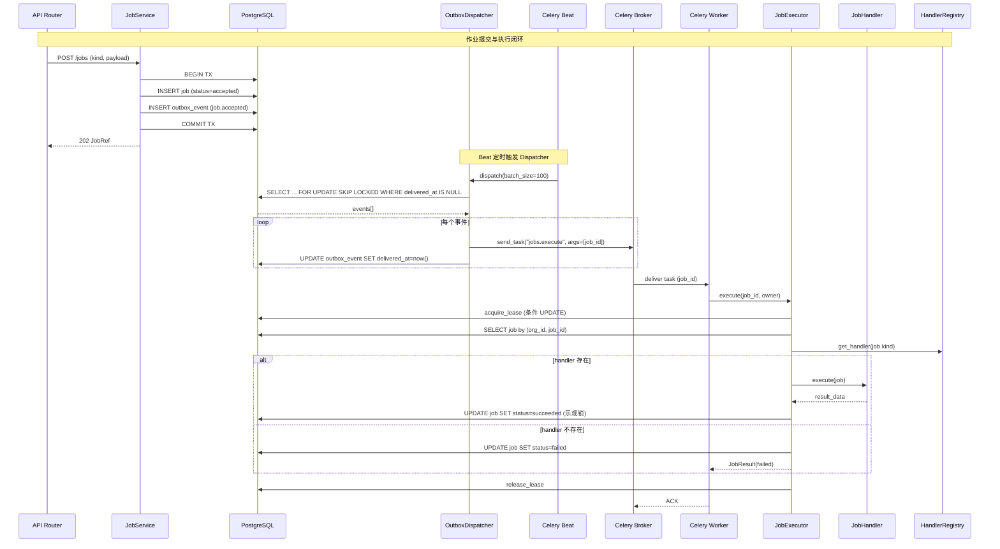
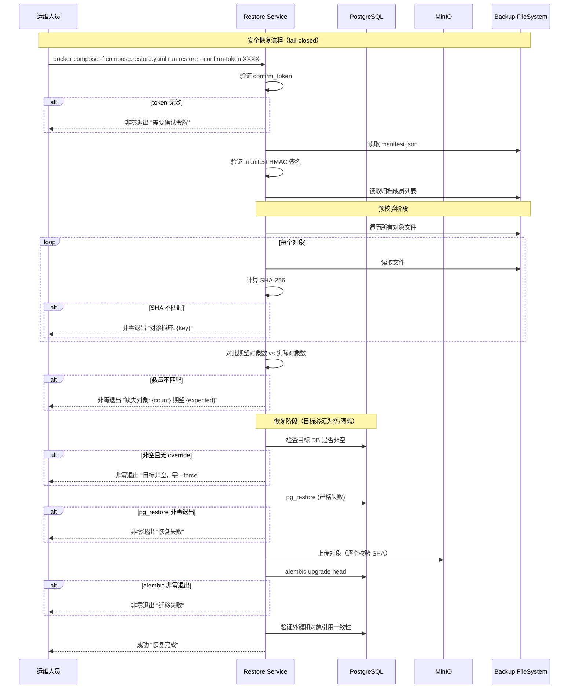
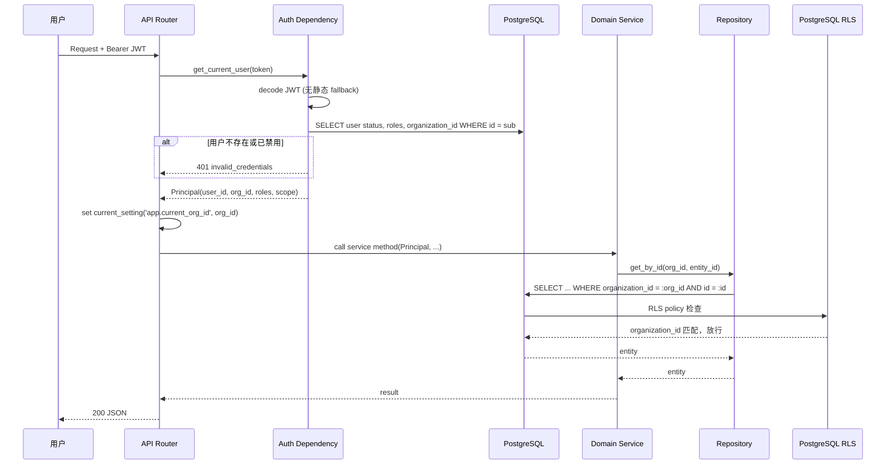

# IRIP 整改技术设计文档

> **文档版本**：v1.0
> **创建日期**：2026-07-27
> **架构师**：高见远
> **审阅基线**：`main` / `a35dd9559ad8a188300f57ca82b6e9ef9e999ac8`
> **PRD**：`/Users/shuipei/Desktop/snowSP/irip/deliverables/remediation-prd-2026-07-27.md`
> **审阅报告**：`/Users/shuipei/Desktop/snowSP/2026-07-27-irip-comprehensive-code-review.md`

---

## Part A: 系统设计

### 1. 实现方案

#### 1.1 核心技术挑战分析

IRIP 的核心问题不是宏观选型错误，而是**横切约束未形成不可绕过的运行机制**。整改的技术挑战集中在：

| 挑战 | 当前状态 | 目标状态 | 技术手段 |
|------|---------|---------|---------|
| 租户隔离 | 路由直接访问 `service._factory`，部分查询无组织条件 | 所有读写强制 `(org_id, id)` 复合键 + RLS 第二道防线 | Principal 值对象 + Repository 谓词 + PostgreSQL RLS |
| 不可变性 | 应用层 ORM 可物理删除修订/版本/证据 | 数据库层拒绝 UPDATE/DELETE | 触发器 + 最小权限角色 + tombstone 模式 |
| 异步作业闭环 | Outbox LPUSH Redis list 无消费者；双通道直接 send_task | 唯一 Outbox→Dispatcher→Celery→Handler 链路 | Celery producer 替换 LPUSH + Beat 调度 + 显式 handler 注册 |
| 密钥安全 | 明文存储 + 公开默认值 + JWT 静态 fallback | envelope encryption + 启动拒绝默认值 + JWT 查询用户状态 | AES-GCM 信封加密 + `${VAR:?required}` + token version |
| 备份完整性 | fail-open 跳过缺失对象 | fail-closed 全量校验后恢复 | 期望/完成对象计数对比 + manifest 签名 |
| 代码质量 | 8 个 F821 + 279 Ruff + 283 Mypy | F/E=0 + 按模块清零 + 阻断门 | 封闭 Enum AppError + uv lock + 统一质量门 |

#### 1.2 框架与库选型

| 库/工具 | 用途 | 选型理由 |
|---------|------|---------|
| **uv** | Python 依赖锁定 | 团队已确认使用；生成带 hash 的 lock 文件，速度快 |
| **cryptography** (Fernet/AES-GCM) | envelope encryption | Python 标准密码学库，无需引入外部 Secret Manager |
| **PostgreSQL RLS** | 租户隔离第二道防线 | 数据库原生能力，无需额外中间件 |
| **PostgreSQL 触发器** | INSERT-only 不可变表 | `BEFORE UPDATE/DELETE` RAISE EXCEPTION，数据库级强制 |
| **structlog** | 结构化日志 | 已在 pyproject.toml 声明，生产代码需实际接入 |
| **prometheus-client** | Prometheus 指标 | Python 标准 Prometheus 客户端 |
| **openapi-typescript** | 前端 API 类型生成 | 从 FastAPI OpenAPI schema 生成 TypeScript 类型 |
| **age** | 备份加密 | 备份脚本已支持 age，需在专用镜像中安装 |

#### 1.3 架构模式

保持**模块化单体**，通过以下改造收敛边界：

```
API 层（Router）→ 不直接操作 ORM，不读取 service 私有属性
    ↓
应用服务层 → 接收可信 Principal（含 user, org, roles, scope）
    ↓
统一 Policy 层 → 租户谓词 + ScopeGrant 授权 + 审计记录
    ↓
领域服务 → 聚合逻辑
    ↓
Repository Port → 强制 (org_id, id) 复合查询
    ↓
PostgreSQL → RLS + 触发器（数据库级兜底）
```

---

### 1.4 各问题技术实现方案（F-01 到 F-24）

#### F-01 [P0] 默认生产编排自动启动恢复服务

**改什么**：`compose.yaml` 中 `backup` 和 `restore` 服务加 `profiles: ["dangerous-ops"]`，使其不随默认 `docker compose up` 启动。

**改什么逻辑**：
- `compose.yaml`：为 `backup` 和 `restore` 服务添加 `profiles: ["dangerous-ops"]`
- `deployments/compose/restore.py`：添加 `--confirm-token` 参数，无 token 时非零退出；无备份时退出码改为 1
- 新增 `deployments/compose/compose.restore.yaml`：独立恢复编排文件，含维护模式和目标环境校验

**技术手段**：Docker Compose profiles 机制（原生支持，无需额外依赖）

#### F-02 [P0] 跨组织更新与删除路径

**改什么**：
1. 新增 `packages/common/principal.py`：定义 `Principal` 和 `TenantId` 值对象
2. 修改 `apps/api/main.py`：`_lookup_org_id` 失败时 fail-closed（返回 401，不回退/不生成随机 UUID）
3. 修改所有 Repository 方法：强制 `(organization_id, id)` 复合查询
4. 修改 `apps/api/routers/facts.py`：禁用硬删除端点，改为 tombstone（`status='archived'`）
5. 新增 `migrations/versions/0032_rls_policies.py`：为所有租户表创建 RLS policy

**改什么逻辑**：
- `JobRepository.get(session, job_id)` → `JobRepository.get(session, org_id, job_id)`
- `JobService.request_cancel(job_id, actor_id)` → `JobService.request_cancel(job_id, principal)`，内部验证 job.organization_id == principal.org_id
- `JobService.get_raw(job_id)` → `JobService.get_raw(job_id, org_id)`
- `_lookup_org_id` 回退逻辑全部删除，改为 `raise AppError(code="forbidden")`

**技术手段**：
- 应用层：Principal 值对象 + Repository 复合键查询
- 数据库层：PostgreSQL RLS policy（`CREATE POLICY tenant_isolation ON ... USING (organization_id = current_setting('app.current_org_id')::uuid)`）

#### F-03 [P0] 证据链和版本不可变性

**改什么**：
1. 新增 `migrations/versions/0033_immutable_tables.py`：创建 `BEFORE UPDATE OR DELETE` 触发器
2. 修改 `migrations/versions/0003_authorization_audit.py`（通过新迁移 0033 修正）：运行角色对 `fact_revision`、`component_version`、`flow_version`、`flow_node_execution`、`audit_event`、`evidence_record` 表只授 SELECT/INSERT
3. 修改 `apps/api/routers/facts.py`：删除端点改为 tombstone（`Fact.status = 'archived'`）
4. 修改 `packages/standards/object_graph.py`：删除对象时不级联删除事实和修订
5. 修改 `packages/components/registry.py`：回滚改为修改指针 `current_version_id`，不修改 `created_at`

**技术手段**：
- 数据库触发器：`CREATE TRIGGER prevent_update_delete BEFORE UPDATE OR DELETE ON fact_revision FOR EACH ROW EXECUTE FUNCTION raise_immutable_violation()`
- 角色权限：`REVOKE UPDATE, DELETE ON fact_revision FROM irip_runtime; GRANT SELECT, INSERT ON fact_revision TO irip_runtime`

#### F-04 [P0] Outbox、Celery 与 JobExecutor 闭环

**改什么**：
1. 修改 `packages/jobs/outbox.py`：`_send_to_broker` 从 LPUSH Redis list 改为 `celery_app.send_task("jobs.execute", args=[str(event.aggregate_id)])`
2. 新增 `packages/jobs/dispatcher.py`：`OutboxDispatcher` 周期调度入口，使用 `FOR UPDATE SKIP LOCKED` 拉取
3. 修改 `apps/worker/celery_app.py`：注册 Beat 调度任务（dispatch/heartbeat/reaper/retry）
4. 修改 `apps/worker/tasks/__init__.py`：注册全部 handler（flow、ingestion、model、backup、restore、audit_export）
5. 修改 `packages/jobs/worker.py`：`JobExecutor` 未知 kind 直接 failed，删除 echo fallback
6. 修改 `packages/components/flow_runtime.py` 和 `apps/api/routers/flows.py`：删除直接 `send_task` 调用，统一走 Outbox

**改什么逻辑**：
```python
# outbox.py - _send_to_broker 改为
from apps.worker.celery_app import celery_app
celery_app.send_task("jobs.execute", args=[str(event.aggregate_id)], queue="irip-jobs")
```

```python
# worker.py - 删除 echo fallback
handler = self._handlers.get(kind)
if handler is None:
    raise AppError(code="unknown_job_kind", message=f"未注册的作业类型: {kind}")
```

**技术手段**：Celery producer 替换 Redis LPUSH + Beat 定时调度 + 显式 handler 注册表

#### F-05 [P0] 审计 append-only 和组织隔离

**改什么**：
1. 新增 `migrations/versions/0034_db_roles.py`：分离 `irip_migrate`（owner）、`irip_runtime`（API/Worker 最小权限）、`irip_app`（审计只读）三类角色
2. 修改 `compose.yaml`：API/Worker 使用 `irip_runtime` 账号连接数据库
3. 修改 `apps/api/routers/audit.py`：审计查询强制 `organization_id` 过滤；导出 Job 的 `organization_id` 使用正确的组织 ID
4. 修改 `apps/api/routers/governance.py`：审计记录的 `organization_id` 使用正确的组织 ID
5. 新增 `packages/common/audit_middleware.py`：统一审计记录中间件，覆盖登录/上传/取消/发布/备份/恢复等关键动作

**技术手段**：数据库角色分离 + 审计触发器写入 + FastAPI 中间件

#### F-06 [P0] 备份恢复完整性 fail-open

**改什么**：
1. 修改 `deployments/compose/backup.py`：`_export_minio_objects` 列表/下载失败时 raise 而非 warning；manifest 记录期望对象数、完成数、失败清单
2. 修改 `deployments/compose/restore.py`：恢复前先完整验证所有对象（存在性+SHA），任一失败则退出 1；无备份时退出 1
3. 新增 `deployments/compose/backup_manifest.py`：manifest HMAC-SHA256 签名

**技术手段**：fail-closed 逻辑 + HMAC manifest 签名 + 全量预校验

#### F-07 [P0] readiness 与迁移 head 不一致

**改什么**：`apps/api/routers/health.py`

**改什么逻辑**：
```python
# 删除硬编码常量
# EXPECTED_MIGRATION_HEAD: str = "0024"

# 改为从 Alembic 运行时动态读取
from alembic.config import Config
from alembic.script import ScriptDirectory

def _get_expected_heads() -> set[str]:
    config = Config()
    config.set_main_option("script_location", "migrations")
    script_dir = ScriptDirectory.from_config(config)
    return {rev.revision for rev in script_dir.get_revisions("heads")}
```

readiness 比较数据库 `alembic_version` 表中的 head 集合与代码期望 head 集合是否一致。

**技术手段**：Alembic ScriptDirectory API 动态读取

#### F-08 [P1] ScopeGrant 接入

**改什么**：
1. 修改 `apps/api/dependencies/authorization.py`：`require_permission` 增加对象级授权检查
2. 修改 `apps/api/main.py`：注册 `get_authorization_service` 依赖覆盖
3. 新增 `packages/common/query_scope.py`：统一 `QueryScope` 类型，由所有列表/单对象查询使用
4. 修改所有列表端点：查询时注入 `QueryScope`，自动应用 scope 过滤

**技术手段**：RBAC 粗粒度入口 + ScopeGrant 细粒度资源授权 + QueryScope 查询过滤

#### F-09 [P1] Job 与 Artifact 跨租户 IDOR

**改什么**：
1. 修改 `apps/api/routers/jobs.py`：全部端点增加 `require_permission` 依赖
2. 修改 `packages/jobs/service.py`：`get`/`get_raw`/`request_cancel` 强制 `organization_id` 检查
3. 修改 `packages/common/artifacts.py`：点查/下载增加 `organization_id` 条件
4. 修改 `apps/api/routers/uploads.py` 和 `files.py`：增加写权限检查
5. `JobDetailResponse` 中 `payload`/`result`/`last_error` 按权限脱敏

**技术手段**：权限矩阵 + 组织条件联合检查 + 字段脱敏

#### F-10 [P1] AI 工具调用与真实引用

**改什么**：
1. 修改 `packages/ai/openai_compatible.py`：`_build_payload` 添加 `tools` 和 `tool_choice` 参数
2. 修改 `packages/ai/service.py`：工具调用时执行 handler 而非标记 "executed"；将工具结果以 tool message 回传模型；进行第二轮 completion
3. 合并 `packages/ai/tools.py` 和 `packages/ai/tool_registry.py` 为唯一注册表
4. 新增 `packages/ai/citation.py`：服务端生成不可伪造的结构化 citation

**技术手段**：OpenAI tools API + Handler 绑定 Principal/Scope + 结构化 citation

#### F-11 [P1] 模型执行结果进入事实和溯源链

**改什么**：
1. 修改 `apps/api/main.py`：`ModelService` 构造时注入 `FactService`
2. 修改 `apps/worker/tasks/models.py`：`fact_service` 不再传 None
3. 修改 `packages/models/service.py`：预测完成后写入 `model_execution` Fact，引用模型版本哈希、输入快照和输出工件哈希；事实写入失败使执行失败

**技术手段**：依赖注入 + Fact 写入 + 哈希引用链

#### F-12 [P0] 密钥明文持久化与默认凭据

**改什么**：
1. 新增 `packages/common/crypto.py`：envelope encryption（AES-GCM + master key 轮换）
2. 修改 `apps/api/routers/ai_config.py`：API key 加密存储
3. 修改 `packages/connectors/mapping.py`：连接器密钥加密存储
4. 修改 `compose.yaml`：所有密钥使用 `${VAR:?required}` 格式
5. 修改 `apps/api/dependencies/auth.py`：删除 JWT 静态 fallback；验证时查询用户状态和当前角色
6. 修改 `deployments/compose/api.Dockerfile`：以非 root 用户运行

**技术手段**：AES-GCM 信封加密 + 启动校验 + JWT token version + 非 root 容器

#### F-13 [P0] 流程任意文件读取与 SSRF/上传/组件执行边界

**改什么**：
1. 新增 `packages/common/safe_http.py`：SSRF-safe HTTP Client（DNS 二次校验 + 私网阻断 + allowlist + 重定向重检 + 大小/超时上限）
2. 修改 `apps/api/routers/ai_config.py`：base URL 测试使用 safe HTTP client
3. 修改 `packages/connectors/rest_connector.py`：使用 safe HTTP client
4. 修改 `apps/api/routers/files.py`：路径检查改为 `Path.resolve().is_relative_to(root)`；流式上传 + 硬限制大小
5. 修改 `packages/components/builtin/ingestion/csv_reader.py`：只接受 ArtifactRef
6. 修改 `packages/components/flow_runtime.py`：安全敏感节点参数不被 inputs 覆盖
7. 新增 `deployments/compose/cli-sandbox.Dockerfile`：CLI 组件独立非 root 容器（无网络 + 只读 FS + cap drop + seccomp）
8. 修改 `packages/components/runner.py`：CLI 组件通过子进程容器执行

**技术手段**：SSRF-safe HTTP client + Path.resolve 安全检查 + ArtifactRef 替换裸路径 + 容器沙箱

#### F-14 [P1] 静态检查运行错误与错误响应失真

**改什么**：
1. 修复 8 个 F821：`apps/api/routers/facts.py`（`func`/`AppError`/`ArtifactService`）、`apps/api/routers/flows.py`（`AppError`）、`apps/worker/tasks/flows.py`（`S3Repository`/`ArtifactService`）
2. 修改 `packages/common/errors.py`：`AppError.code` 改为封闭 Enum（`ErrorCode`），携带 `http_status` 属性
3. 修改 `apps/api/main.py`：`_STATUS_MAP` 由 `ErrorCode` enum 自动生成，删除手工映射
4. 新增缺失的错误码：`file_too_large`→413、`ssrf_blocked`→403、`component_timeout`→504、`ai_provider_error`→502、`unknown_job_kind`→422

**技术手段**：封闭 Enum + 自动映射 + 质量门阻断

#### F-15 [P1] 恢复流程吞失败与归档提取风险

**改什么**：
1. 修改 `deployments/compose/restore.py`：Alembic/pg_restore 非零退出默认失败；无备份退出 1；归档提取使用 `tar.extractall(filter='data')`（Python 3.12 安全 filter）
2. 新增 `deployments/compose/backup-restore.Dockerfile`：专用非 root 镜像，安装固定版本 `age`

**技术手段**：外部命令严格失败处理 + Python 3.12 安全 extraction filter + 专用镜像

#### F-16 [P1] 发布门脚本不可运行

**改什么**：
1. 修改 `scripts/release-gate.sh`：删除不存在的 `tests/property` 引用；先启动 Docker 基础设施再迁移和执行测试；修复迁移版本为动态读取
2. 修改 `apps/web/playwright.config.ts`：修复 E2E 路径和默认 URL
3. 修改 `.github/workflows/ci.yml`：CI 作为唯一质量入口

**技术手段**：统一 CI + 本地质量入口 + 动态迁移版本

#### F-17 [P1] 测试分类和覆盖门

**改什么**：
1. 修改 `tests/conftest.py`：DB 测试标记为 `@pytest.mark.integration`
2. 修改 `.github/workflows/ci.yml`：unit job 提供 DB（或 unit 不跑 DB 测试）；integration job 运行 DB 测试；新增 contract/acceptance/E2E/performance 独立 job
3. 新增覆盖率配置：`pyproject.toml` 添加 `coverage` 配置，设置 `fail_under`

**技术手段**：pytest mark 分类 + CI job 分离 + 覆盖率门

#### F-18 [P1] CI、依赖与制品不可重现

**改什么**：
1. 使用 `uv` 生成 `uv.lock`（带 hash）
2. 修改 `.github/workflows/ci.yml`：Actions pin 到 commit SHA；基础镜像 pin 到 digest；修复 MinIO `server /data` 命令
3. 修改 `apps/web/Dockerfile`：删除 `--no-frozen-lockfile || true`
4. 新增 SBOM 生成步骤

**技术手段**：uv lock + SHA pin + SBOM

#### F-19 [P1] 可观测性

**改什么**：
1. 新增 `packages/common/logging_setup.py`：structlog JSON 日志配置 + correlation ID 中间件
2. 新增 `packages/common/metrics.py`：Prometheus 指标（API/队列/Job/Worker/Outbox/DB/MinIO/备份 RPO/RTO）
3. 修改 `apps/worker/celery_app.py`：Worker/Beat healthcheck 端点
4. 修改 `apps/api/routers/health.py`：readiness 增加真实 Worker heartbeat 检查

**技术手段**：structlog + prometheus-client + Celery heartbeat

#### F-20 [P2] 应用层与领域层耦合

**改什么**：
1. 修改所有路由：不访问 `service._factory`、`service._org_id`
2. 拆分 `apps/api/main.py`：按领域拆分为 `apps/api/composition/` 下的 provider 模块
3. 消除 `facts`↔`standards`、`departments`↔`equipment` ORM 循环依赖
4. `ez_scan_extractor` 不再反向导入 API Router

**技术手段**：Ports/Protocols + 按领域 provider 模块 + read-model 查询包

#### F-21 [P2] 异步阻塞 I/O

**改什么**：
1. 修改 `packages/components/builtin/` 中的 CSV/JSON/Excel/PDF 读取器：放线程池执行
2. 修改 `apps/api/routers/files.py`：流式上传
3. 修改 `packages/connectors/rest_connector.py`：流式响应 + 大小限制

**技术手段**：`asyncio.to_thread()` + 流式处理 + 资源预算

#### F-22 [P2] 文档漂移

**改什么**：
1. 修改 `docs/acceptance/final-release.md`：能力标记为 Proposed/Partial/Implemented/Verified/Deprecated
2. 修改 `README.md`：标记为"内部 Alpha / 不可生产发布"
3. 新增 `scripts/generate-stats.py`：从源码自动生成组件数、AI 工具数、路由数、迁移 head
4. 验收报告由 CI 针对 commit SHA 生成

**技术手段**：CI 自动生成 + 源码统计脚本 + 能力标记规范

#### F-23 [P2] 前端 legacy 与超大客户端

**改什么**：
1. `apps/web/src/api/client.ts` 按领域拆分为多个模块
2. 使用 `openapi-typescript` 从 FastAPI OpenAPI schema 生成基础类型
3. 拆分 `FlowDetail.tsx`、`ComponentsPage.tsx` 等超大页面
4. 删除 `components/flow/legacy.tsx`

**技术手段**：OpenAPI 类型生成 + 按领域拆分 + 组件分层

#### F-24 [P2] 质量基线

**改什么**：
1. 冻结 Ruff 基线，清零 F821/F/E
2. 修改 `Makefile`：检查范围与 CI/release-gate 一致
3. 新增 ESLint、Prettier check、Ruff format check
4. 新代码不得增加 baseline

**技术手段**：基线冻结 + 统一检查范围 + 格式化门

---

### 2. 文件列表

#### 2.1 新增文件

| 文件路径 | 说明 |
|---------|------|
| `packages/common/principal.py` | Principal 和 TenantId 值对象 |
| `packages/common/query_scope.py` | 统一 QueryScope 类型 |
| `packages/common/audit_middleware.py` | 统一审计记录中间件 |
| `packages/common/safe_http.py` | SSRF-safe HTTP Client |
| `packages/common/crypto.py` | envelope encryption（AES-GCM） |
| `packages/common/logging_setup.py` | structlog JSON 日志配置 |
| `packages/common/metrics.py` | Prometheus 指标定义 |
| `packages/common/error_codes.py` | AppError 封闭 Enum 错误码 |
| `packages/jobs/dispatcher.py` | OutboxDispatcher 周期调度入口 |
| `packages/ai/citation.py` | 结构化 citation 生成 |
| `migrations/versions/0032_rls_policies.py` | PostgreSQL RLS policy |
| `migrations/versions/0033_immutable_tables.py` | 不可变表触发器 + 角色权限修正 |
| `migrations/versions/0034_db_roles.py` | 三类数据库角色分离 |
| `deployments/compose/compose.restore.yaml` | 独立恢复编排文件 |
| `deployments/compose/cli-sandbox.Dockerfile` | CLI 组件沙箱镜像 |
| `deployments/compose/backup-restore.Dockerfile` | 备份恢复专用非 root 镜像 |
| `apps/api/composition/__init__.py` | 按领域拆分的 Composition Root |
| `scripts/generate-stats.py` | 源码统计自动生成 |
| `scripts/generate-acceptance.py` | CI 验收报告生成 |

#### 2.2 修改文件

| 文件路径 | 涉及问题 |
|---------|---------|
| `compose.yaml` | F-01, F-05, F-12 |
| `apps/api/routers/health.py` | F-07, F-19 |
| `apps/api/main.py` | F-02, F-04, F-08, F-11, F-12, F-14, F-20 |
| `apps/api/dependencies/auth.py` | F-12 |
| `apps/api/dependencies/authorization.py` | F-08 |
| `apps/api/routers/facts.py` | F-02, F-03, F-14 |
| `apps/api/routers/flows.py` | F-02, F-04, F-13, F-14 |
| `apps/api/routers/jobs.py` | F-09 |
| `apps/api/routers/audit.py` | F-05 |
| `apps/api/routers/governance.py` | F-05 |
| `apps/api/routers/uploads.py` | F-09 |
| `apps/api/routers/files.py` | F-09, F-13 |
| `apps/api/routers/ai_config.py` | F-12, F-13 |
| `apps/api/routers/components.py` | F-02 |
| `packages/common/errors.py` | F-14 |
| `packages/common/artifacts.py` | F-09 |
| `packages/jobs/outbox.py` | F-04 |
| `packages/jobs/service.py` | F-02, F-09 |
| `packages/jobs/worker.py` | F-04 |
| `packages/jobs/repository.py` | F-02 |
| `packages/components/flow_runtime.py` | F-02, F-03, F-04, F-13 |
| `packages/components/registry.py` | F-03 |
| `packages/components/runner.py` | F-13 |
| `packages/components/builtin/ingestion/csv_reader.py` | F-13 |
| `packages/standards/object_graph.py` | F-03 |
| `packages/auth/scope_grants.py` | F-08 |
| `packages/ai/openai_compatible.py` | F-10 |
| `packages/ai/service.py` | F-10 |
| `packages/ai/tools.py` | F-10 |
| `packages/ai/tool_registry.py` | F-10 |
| `packages/models/service.py` | F-11 |
| `packages/connectors/mapping.py` | F-12 |
| `packages/connectors/rest_connector.py` | F-13, F-21 |
| `apps/worker/celery_app.py` | F-04, F-19 |
| `apps/worker/tasks/__init__.py` | F-04 |
| `apps/worker/tasks/models.py` | F-11 |
| `apps/worker/tasks/flows.py` | F-14 |
| `deployments/compose/backup.py` | F-06 |
| `deployments/compose/restore.py` | F-01, F-06, F-15 |
| `deployments/compose/bootstrap.py` | F-12 |
| `deployments/compose/api.Dockerfile` | F-12 |
| `deployments/compose/web.Dockerfile` | F-18 |
| `scripts/release-gate.sh` | F-16 |
| `apps/web/playwright.config.ts` | F-16 |
| `.github/workflows/ci.yml` | F-16, F-17, F-18 |
| `tests/conftest.py` | F-17 |
| `pyproject.toml` | F-14, F-17, F-18, F-24 |
| `Makefile` | F-24 |
| `apps/web/src/api/client.ts` | F-23 |
| `apps/web/src/components/FlowDetail.tsx` | F-23 |
| `apps/web/src/components/ComponentsPage.tsx` | F-23 |
| `apps/web/src/components/flow/legacy.tsx` | F-23（删除） |
| `docs/acceptance/final-release.md` | F-22 |
| `README.md` | F-22 |

---

### 3. 数据结构和接口

#### 3.1 核心值对象与服务类



#### 3.2 数据库迁移设计

**迁移 0032_rls_policies.py**：
```sql
-- 启用 RLS
ALTER TABLE fact ENABLE ROW LEVEL SECURITY;
ALTER TABLE fact_revision ENABLE ROW LEVEL SECURITY;
ALTER TABLE job ENABLE ROW LEVEL SECURITY;
ALTER TABLE artifact ENABLE ROW LEVEL SECURITY;
ALTER TABLE flow_definition ENABLE ROW LEVEL SECURITY;
ALTER TABLE audit_event ENABLE ROW LEVEL SECURITY;

-- 创建组织隔离 policy
CREATE POLICY tenant_isolation ON fact
  USING (organization_id = current_setting('app.current_org_id', true)::uuid);
-- ... 对每个租户表重复

-- 运行角色强制 RLS
ALTER TABLE fact FORCE ROW LEVEL SECURITY;
```

**迁移 0033_immutable_tables.py**：
```sql
-- 不可变表触发器函数
CREATE OR REPLACE FUNCTION raise_immutable_violation()
RETURNS trigger AS $$
BEGIN
  RAISE EXCEPTION 'Table % is immutable: UPDATE/DELETE not allowed', TG_TABLE_NAME;
END;
$$ LANGUAGE plpgsql;

-- 为不可变表创建触发器
CREATE TRIGGER prevent_modify_fact_revision
  BEFORE UPDATE OR DELETE ON fact_revision
  FOR EACH ROW EXECUTE FUNCTION raise_immutable_violation();

CREATE TRIGGER prevent_modify_component_version
  BEFORE UPDATE OR DELETE ON component_version
  FOR EACH ROW EXECUTE FUNCTION raise_immutable_violation();

CREATE TRIGGER prevent_modify_flow_version
  BEFORE UPDATE OR DELETE ON flow_version
  FOR EACH ROW EXECUTE FUNCTION raise_immutable_violation();

CREATE TRIGGER prevent_modify_audit_event
  BEFORE UPDATE OR DELETE ON audit_event
  FOR EACH ROW EXECUTE FUNCTION raise_immutable_violation();
```

**迁移 0034_db_roles.py**：
```sql
-- 分离三类数据库角色
-- 1. irip_migrate: 迁移 owner（DDL 权限）
-- 2. irip_runtime: API/Worker 运行时（最小 DML 权限）
-- 3. irip_audit_writer: 审计写入（仅 INSERT 审计表）

CREATE ROLE irip_migrate LOGIN;
CREATE ROLE irip_runtime LOGIN;
CREATE ROLE irip_audit_writer NOLOGIN;

-- irip_runtime: 业务表 CRUD，但不可变表只读
GRANT SELECT, INSERT, UPDATE, DELETE ON fact, job, artifact, flow_definition TO irip_runtime;
GRANT SELECT, INSERT ON fact_revision, component_version, flow_version, audit_event TO irip_runtime;
REVOKE UPDATE, DELETE ON fact_revision, component_version, flow_version, audit_event FROM irip_runtime;

-- irip_audit_writer: 仅审计表 INSERT
GRANT INSERT ON audit_event TO irip_audit_writer;
```

#### 3.3 新增 API 接口

| 端点 | 方法 | 说明 | 涉及问题 |
|------|------|------|---------|
| `/api/v1/health/ready` | GET | 动态读取迁移 head | F-07 |
| `/api/v1/facts/{id}/archive` | POST | 归档事实（替代硬删除） | F-03 |
| `/api/v1/worker/health` | GET | Worker heartbeat | F-19 |
| `/api/v1/metrics` | GET | Prometheus 指标 | F-19 |

---

### 4. 程序调用流程

#### 4.1 Outbox→Dispatcher→Celery→Handler 闭环



#### 4.2 备份恢复验证流程



#### 4.3 Principal 认证与租户隔离流程



---

## Part B: 任务分解

### 6. 依赖包列表

| 包 | 版本 | 用途 |
|----|------|------|
| `uv` | latest | Python 依赖锁定（已确认） |
| `cryptography` | >=43,<44 | envelope encryption (AES-GCM) |
| `prometheus-client` | >=0.20,<1 | Prometheus 指标导出 |
| `structlog` | >=24,<26 | 结构化 JSON 日志（已声明，需接入） |
| `openapi-typescript` | latest | 前端 API 类型生成（Node 包） |
| `age` | >=1.2 | 备份加密（系统包，安装到专用镜像） |

---

### 7. 任务列表（按 4 个阶段，含依赖关系）

#### 阶段 0：立即止血（7 项）

| 任务编号 | 任务名称 | 涉及文件 | 依赖 | 复杂度 | 对应问题 |
|---------|---------|---------|------|--------|---------|
| T0-1 | 默认 Compose 移除 restore/backup | `compose.yaml`, `deployments/compose/restore.py` | 无 | 低 | F-01 |
| T0-2 | 临时禁用事实/组件/流程物理删除端点 | `apps/api/routers/facts.py`, `apps/api/routers/flows.py`, `apps/api/routers/components.py` | 无 | 低 | F-02, F-03 |
| T0-3 | 修复 readiness 迁移 head 不一致 | `apps/api/routers/health.py` | 无 | 低 | F-07 |
| T0-4 | 修复 8 个 F821 未定义名称 | `apps/api/routers/facts.py`, `apps/api/routers/flows.py`, `apps/worker/tasks/flows.py` | 无 | 低 | F-14 |
| T0-5 | 生产配置拒绝默认密钥 + 非 root 容器 | `compose.yaml`, `apps/api/dependencies/auth.py`, `deployments/compose/api.Dockerfile` | 无 | 中 | F-12 |
| T0-6 | 禁止流程 inputs 覆盖路径 + 停用任意路径 reader | `packages/components/flow_runtime.py`, `packages/components/builtin/ingestion/csv_reader.py`, `apps/api/routers/flows.py` | 无 | 中 | F-13 |
| T0-7 | 标记版本不可生产发布 | `README.md`, `docs/acceptance/final-release.md` | 无 | 低 | F-22 |

#### 阶段 1：安全与可靠性闭环（9 项）

| 任务编号 | 任务名称 | 涉及文件 | 依赖 | 复杂度 | 对应问题 |
|---------|---------|---------|------|--------|---------|
| T1-1 | 引入 Principal 值对象 + 统一组织谓词 + fail-closed | `packages/common/principal.py`, `packages/common/query_scope.py`, `apps/api/main.py`, `apps/api/dependencies/auth.py`, `packages/jobs/service.py`, `packages/jobs/repository.py` | T0-2 | 高 | F-02, F-08 |
| T1-2 | 所有 Repository 强制组织条件 + 跨组织 API 测试 | `packages/jobs/repository.py`, `packages/jobs/service.py`, `packages/common/artifacts.py`, `apps/api/routers/jobs.py`, `apps/api/routers/uploads.py`, `apps/api/routers/files.py` | T1-1 | 高 | F-02, F-09 |
| T1-3 | 分离 migration/runtime 数据库账号 + 最小权限 | `migrations/versions/0034_db_roles.py`, `compose.yaml` | T0-5 | 中 | F-05, F-12 |
| T1-4 | 版本/证据/审计表 INSERT-only + 触发器 + RLS | `migrations/versions/0033_immutable_tables.py`, `migrations/versions/0032_rls_policies.py`, `apps/api/routers/facts.py`, `packages/standards/object_graph.py`, `packages/components/registry.py`, `packages/components/flow_runtime.py` | T1-3 | 高 | F-03, F-05 |
| T1-5 | 完成 Outbox→Celery→Handler 唯一链路 | `packages/jobs/outbox.py`, `packages/jobs/dispatcher.py`, `apps/worker/celery_app.py`, `apps/worker/tasks/__init__.py`, `packages/jobs/worker.py`, `packages/components/flow_runtime.py`, `apps/api/routers/flows.py` | T1-1 | 高 | F-04 |
| T1-6 | 补齐 backup/restore/audit_export handler + 删除 echo fallback | `packages/jobs/worker.py`, `apps/worker/tasks/__init__.py` | T1-5 | 中 | F-04 |
| T1-7 | 修复备份恢复 fail-open + 安全归档提取 | `deployments/compose/backup.py`, `deployments/compose/restore.py`, `deployments/compose/backup-restore.Dockerfile` | T0-1, T1-3 | 高 | F-06, F-15 |
| T1-8 | 建立 SSRF-safe HTTP Client + 文件路径安全 | `packages/common/safe_http.py`, `apps/api/routers/ai_config.py`, `packages/connectors/rest_connector.py`, `apps/api/routers/files.py` | T0-6 | 中 | F-13 |
| T1-9 | CLI 组件沙箱化 | `deployments/compose/cli-sandbox.Dockerfile`, `packages/components/runner.py` | T0-6 | 中 | F-13 |

#### 阶段 2：功能真实性与质量门（8 项）

| 任务编号 | 任务名称 | 涉及文件 | 依赖 | 复杂度 | 对应问题 |
|---------|---------|---------|------|--------|---------|
| T2-1 | AI tools schema/handler/二次调用/真实 citation | `packages/ai/openai_compatible.py`, `packages/ai/service.py`, `packages/ai/tools.py`, `packages/ai/tool_registry.py`, `packages/ai/citation.py` | T1-1 | 高 | F-10 |
| T2-2 | 模型执行写入事实/溯源链 | `apps/api/main.py`, `apps/worker/tasks/models.py`, `packages/models/service.py` | T1-1 | 中 | F-11 |
| T2-3 | envelope encryption 密钥管理 | `packages/common/crypto.py`, `apps/api/routers/ai_config.py`, `packages/connectors/mapping.py`, `deployments/compose/bootstrap.py` | T1-3 | 中 | F-12 |
| T2-4 | 修复 release gate + CI MinIO + E2E 路径/fixture | `scripts/release-gate.sh`, `apps/web/playwright.config.ts`, `.github/workflows/ci.yml` | T0-4 | 中 | F-16 |
| T2-5 | 重分类 DB 测试 + 禁止意外 skip + 覆盖率门 | `tests/conftest.py`, `.github/workflows/ci.yml`, `pyproject.toml` | T2-4 | 中 | F-17 |
| T2-6 | 清零 Ruff F/E + AppError 封闭 Enum + Mypy 按模块清零 | `packages/common/errors.py`, `packages/common/error_codes.py`, `apps/api/main.py`, `pyproject.toml`, `Makefile` | T0-4 | 中 | F-14, F-24 |
| T2-7 | 结构化日志 + Worker heartbeat + 核心指标 | `packages/common/logging_setup.py`, `packages/common/metrics.py`, `apps/worker/celery_app.py`, `apps/api/routers/health.py` | T1-5 | 中 | F-19 |
| T2-8 | 修复 AppError 错误码映射 + CI 阻断门 | `packages/common/error_codes.py`, `apps/api/main.py`, `.github/workflows/ci.yml` | T2-6 | 低 | F-14 |

#### 阶段 3：架构收敛与可维护性（8 项）

| 任务编号 | 任务名称 | 涉及文件 | 依赖 | 复杂度 | 对应问题 |
|---------|---------|---------|------|--------|---------|
| T3-1 | 路由不再访问服务私有属性/ORM | `apps/api/routers/` (全部), `packages/jobs/service.py`, `packages/components/flow_runtime.py` | T1-1, T1-2 | 高 | F-20 |
| T3-2 | 拆分 Composition Root + 超大领域文件 | `apps/api/main.py`, `apps/api/composition/` | T3-1 | 高 | F-20 |
| T3-3 | 消除领域循环依赖 + API 反向依赖 | `packages/facts/`, `packages/standards/`, `packages/departments/`, `packages/equipment/` | T3-1 | 中 | F-20 |
| T3-4 | 前端按领域拆分 API client + 清除 legacy | `apps/web/src/api/client.ts`, `apps/web/src/components/FlowDetail.tsx`, `apps/web/src/components/ComponentsPage.tsx`, `apps/web/src/components/flow/legacy.tsx` | T2-1 | 中 | F-23 |
| T3-5 | 文档自动生成 + 能力标记 | `scripts/generate-stats.py`, `scripts/generate-acceptance.py`, `docs/acceptance/final-release.md`, `README.md` | T2-4 | 中 | F-22 |
| T3-6 | 锁定依赖/镜像 digest + SBOM/签名制品 | `pyproject.toml`, `.github/workflows/ci.yml`, `deployments/compose/*.Dockerfile` | T2-5 | 中 | F-18 |
| T3-7 | 异步阻塞 I/O 修复 | `packages/components/builtin/`, `apps/api/routers/files.py`, `packages/connectors/rest_connector.py` | T1-8 | 中 | F-21 |
| T3-8 | 统一 Makefile/CI/release-gate 检查范围 | `Makefile`, `.github/workflows/ci.yml`, `scripts/release-gate.sh` | T2-6 | 低 | F-24 |

---

### 8. 共享知识（跨文件约定）

#### 8.1 Principal / TenantId 值对象约定

```python
# packages/common/principal.py

@dataclass(frozen=True)
class Principal:
    """可信身份上下文，由认证依赖构造，传入所有应用服务。"""
    user_id: UUID
    organization_id: UUID
    email: str
    roles: list[str]
    scope: QueryScope
    is_active: bool = True

    @staticmethod
    def from_current_user(user: CurrentUser, org_id: UUID, scope: QueryScope) -> "Principal":
        ...

@dataclass(frozen=True)
class TenantId:
    """租户标识值对象，强制 (org_id) 复合查询。"""
    value: UUID

    @staticmethod
    def from_principal(principal: Principal) -> "TenantId":
        return TenantId(principal.organization_id)
```

**使用约定**：
1. 所有应用服务方法**必须**接收 `Principal` 参数，**禁止**只传裸 `user_id` 或 `org_id`
2. Repository 方法**必须**接收 `(TenantId, entity_id)` 或 `(org_id, entity_id)` 复合键，**禁止**只按 `entity_id` 查询
3. `Principal` 由 `get_current_user` + `_lookup_org_id` 构造，构造失败必须 fail-closed（401/403）
4. `Principal` 是 frozen dataclass，不可在服务中修改

#### 8.2 统一组织谓词实现约定

```python
# packages/common/query_scope.py

@dataclass(frozen=True)
class QueryScope:
    """统一查询范围，自动应用组织/部门/对象根过滤。"""
    organization_id: UUID
    department_id: UUID | None = None
    object_root_id: UUID | None = None
    resource_type: str = "*"

    def apply(self, query: sa.Select) -> sa.Select:
        """将 scope 条件应用到 SQLAlchemy 查询。"""
        query = query.where(Entity.organization_id == self.organization_id)
        if self.department_id is not None:
            query = query.where(Entity.department_id == self.department_id)
        return query
```

**使用约定**：
1. 所有列表查询端点必须通过 `QueryScope.apply()` 应用过滤
2. 禁止先查全量再在 Python 中过滤
3. ScopeGrant 授权检查通过 `AuthorizationService.require(principal, action, ResourceRef)` 执行
4. 默认拒绝：无匹配 ScopeGrant 时返回 403

#### 8.3 INSERT-only 表的数据库约定

**约定**：
1. 以下表为不可变表（INSERT-only）：`fact_revision`、`component_version`、`flow_version`、`flow_node_execution`、`audit_event`、`evidence_record`
2. 不可变表通过 `BEFORE UPDATE OR DELETE` 触发器强制，触发器抛出异常
3. 运行时数据库角色 (`irip_runtime`) 对不可变表只有 `SELECT` + `INSERT` 权限
4. 业务删除通过 tombstone（`status = 'archived'`）实现，不物理删除
5. 版本回滚通过修改指针（`current_version_id`），不修改历史行内容和时间戳
6. 法务/保留期清理通过专用脚本 + 审批记录 + 不可变清理日志执行，不通过 API

#### 8.4 错误码映射约定

```python
# packages/common/error_codes.py

class ErrorCode(enum.Enum):
    """封闭错误码枚举，每个码携带 HTTP 状态。"""
    INVALID_CREDENTIALS = ("invalid_credentials", 401)
    TOKEN_EXPIRED = ("token_expired", 401)
    FORBIDDEN = ("forbidden", 403)
    NOT_FOUND = ("not_found", 404)
    CONFLICT = ("conflict", 409)
    FILE_TOO_LARGE = ("file_too_large", 413)
    SSRF_BLOCKED = ("ssrf_blocked", 403)
    COMPONENT_TIMEOUT = ("component_timeout", 504)
    AI_PROVIDER_ERROR = ("ai_provider_error", 502)
    UNKNOWN_JOB_KIND = ("unknown_job_kind", 422)
    # ... 全量枚举

    def __init__(self, code: str, http_status: int) -> None:
        self.code = code
        self.http_status = http_status
```

**使用约定**：
1. `AppError` 的 `code` 字段必须是 `ErrorCode` 枚举值
2. `apps/api/main.py` 的 `_STATUS_MAP` 由 `ErrorCode` 自动生成，删除手工映射
3. 新增错误码必须在此枚举中注册，CI 检查"所有被抛出的错误码都有映射"

#### 8.5 Outbox 投递约定

1. 所有异步任务**只**通过 Outbox→Dispatcher→Celery 一条通道
2. **禁止**在路由或服务中直接调用 `celery_app.send_task()` 或 `redis.lpush()`
3. Outbox 投递通过 `OutboxDispatcher.enqueue(session, ...)` 在业务事务中 INSERT
4. Dispatcher 通过 `FOR UPDATE SKIP LOCKED` 拉取，支持多 Dispatcher 并发
5. JobExecutor 对未知 kind **必须**失败，**禁止** echo fallback

---

### 9. 待明确事项

| 编号 | 问题 | 当前假设 | 需用户确认 |
|------|------|---------|-----------|
| D-1 | RLS 中 `current_setting('app.current_org_id')` 的设置方式 | 假设通过 SQLAlchemy session 事件在连接获取时执行 `SET LOCAL` | 确认是否通过 FastAPI 中间件在每个请求开始时设置 |
| D-2 | envelope encryption 的 master key 存储位置 | 假设通过环境变量 `IRIP_MASTER_KEY` 传入，支持 key version 轮换 | 确认 master key 的部署和轮换策略 |
| D-3 | CLI 组件沙箱的编排方式 | 假设在 Worker 容器中通过 `docker run` 启动子容器 | 确认是否使用 Docker-in-Docker 或独立的主机 Docker socket |
| D-4 | age 加密备份的 key 分发 | 假设通过 `IRIP_BACKUP_AGE_RECIPIENT` 和 `IRIP_BACKUP_AGE_IDENTITY` 环境变量 | 确认 age key 的生成和分发流程 |
| D-5 | RLS 与测试的兼容性 | 假设测试中通过 `SET app.current_org_id` 或 bypass RLS（`NOFORCE`）实现 | 确认测试数据库是否需要 RLS 或在测试中 bypass |
| D-6 | 前端 OpenAPI 类型生成的 CI 集成 | 假设在 CI 中先启动 API 服务导出 schema，再运行 `openapi-typescript` | 确认是否需要独立的 schema 导出端点 |
| D-7 | 多 Dispatcher 的数量和部署方式 | 假设单 Dispatcher 由 Beat 每 5s 触发，多 Dispatcher 为可选 | 确认是否需要多 Dispatcher 并发 |

---

### 10. 任务依赖图

```mermaid
graph TD
    subgraph "阶段0 立即止血"
        T01[T0-1 移除restore/backup]
        T02[T0-2 禁用硬删除端点]
        T03[T0-3 修复readiness]
        T04[T0-4 修复F821]
        T05[T0-5 拒绝默认密钥]
        T06[T0-6 禁止任意路径]
        T07[T0-7 标记不可发布]
    end

    subgraph "阶段1 安全闭环"
        T11[T1-1 Principal+组织谓词]
        T12[T1-2 Repository强制组织条件]
        T13[T1-3 DB账号分离]
        T14[T1-4 INSERT-only+触发器+RLS]
        T15[T1-5 Outbox闭环]
        T16[T1-6 补齐handler]
        T17[T1-7 备份恢复fail-closed]
        T18[T1-8 SSRF+路径安全]
        T19[T1-9 CLI沙箱]
    end

    subgraph "阶段2 质量门"
        T21[T2-1 AI工具真实调用]
        T22[T2-2 模型写入溯源]
        T23[T2-3 envelope加密]
        T24[T2-4 修复发布门]
        T25[T2-5 测试分类+覆盖率]
        T26[T2-6 清零Ruff/Mypy]
        T27[T2-7 可观测性]
        T28[T2-8 错误码映射]
    end

    subgraph "阶段3 架构收敛"
        T31[T3-1 路由解耦]
        T32[T3-2 拆分Composition Root]
        T33[T3-3 消除循环依赖]
        T34[T3-4 前端拆分]
        T35[T3-5 文档自动生成]
        T36[T3-6 依赖锁定+SBOM]
        T37[T3-7 异步I/O修复]
        T38[T3-8 统一检查范围]
    end

    T02 --> T11
    T05 --> T13
    T01 --> T17
    T06 --> T18
    T06 --> T19

    T11 --> T12
    T13 --> T14
    T11 --> T15
    T15 --> T16
    T13 --> T17
    T1X --> T18

    T11 --> T21
    T11 --> T22
    T13 --> T23
    T04 --> T24
    T24 --> T25
    T04 --> T26
    T15 --> T27
    T26 --> T28

    T11 --> T31
    T12 --> T31
    T31 --> T32
    T31 --> T33
    T21 --> T34
    T24 --> T35
    T25 --> T36
    T18 --> T37
    T26 --> T38

    style T01 fill:#ff6b6b,color:#fff
    style T02 fill:#ff6b6b,color:#fff
    style T03 fill:#ff6b6b,color:#fff
    style T04 fill:#ff6b6b,color:#fff
    style T05 fill:#ff6b6b,color:#fff
    style T06 fill:#ff6b6b,color:#fff
    style T07 fill:#ff6b6b,color:#fff
    style T11 fill:#feca57,color:#000
    style T12 fill:#feca57,color:#000
    style T13 fill:#feca57,color:#000
    style T14 fill:#feca57,color:#000
    style T15 fill:#feca57,color:#000
    style T16 fill:#feca57,color:#000
    style T17 fill:#feca57,color:#000
    style T18 fill:#feca57,color:#000
    style T19 fill:#feca57,color:#000
    style T21 fill:#48dbfb,color:#000
    style T22 fill:#48dbfb,color:#000
    style T23 fill:#48dbfb,color:#000
    style T24 fill:#48dbfb,color:#000
    style T25 fill:#48dbfb,color:#000
    style T26 fill:#48dbfb,color:#000
    style T27 fill:#48dbfb,color:#000
    style T28 fill:#48dbfb,color:#000
    style T31 fill:#1dd1a1,color:#fff
    style T32 fill:#1dd1a1,color:#fff
    style T33 fill:#1dd1a1,color:#fff
    style T34 fill:#1dd1a1,color:#fff
    style T35 fill:#1dd1a1,color:#fff
    style T36 fill:#1dd1a1,color:#fff
    style T37 fill:#1dd1a1,color:#fff
    style T38 fill:#1dd1a1,color:#fff
```



---

## 附录 A：F821 未定义名称修复明细

| 文件 | 行号 | 未定义名称 | 修复方式 |
|------|------|-----------|---------|
| `apps/api/routers/facts.py` | 430 | `func` | 添加 `from sqlalchemy import func` 导入 |
| `apps/api/routers/facts.py` | 485 | `AppError` | 添加 `from packages.common.errors import AppError` 导入 |
| `apps/api/routers/facts.py` | 660 | `ArtifactService` | 添加 `from packages.common.artifacts import ArtifactService` 导入 |
| `apps/api/routers/flows.py` | 896, 928 | `AppError` | 添加 `from packages.common.errors import AppError` 导入 |
| `apps/worker/tasks/flows.py` | 293 | `S3Repository` | 添加 `from packages.common.s3_repository import S3Repository` 导入 |
| `apps/worker/tasks/flows.py` | 300 | `ArtifactService` | 添加 `from packages.common.artifacts import ArtifactService` 导入 |

## 附录 B：新增 AppError 错误码映射

| 错误码 | HTTP 状态 | 说明 |
|--------|----------|------|
| `file_too_large` | 413 | 上传文件超过大小限制 |
| `ssrf_blocked` | 403 | SSRF 防护阻断请求 |
| `component_timeout` | 504 | 组件执行超时 |
| `ai_provider_error` | 502 | AI 供应商调用失败 |
| `unknown_job_kind` | 422 | 未注册的作业类型 |
| `max_retries_exceeded` | 500 | 达到最大重试次数 |
| `path_traversal_blocked` | 403 | 路径穿越防护阻断 |
| `immutable_violation` | 409 | 不可变表修改被拒 |
| `tenant_mismatch` | 403 | 租户不匹配 |

---

> **文档结束**
> 本技术设计文档基于审阅报告和整改 PRD 编制，所有 24 项问题（F-01 至 F-24）均有对应技术实现方案和任务分解。待明确事项（D-1 至 D-7）需用户决策后方可确定最终实施方案。
