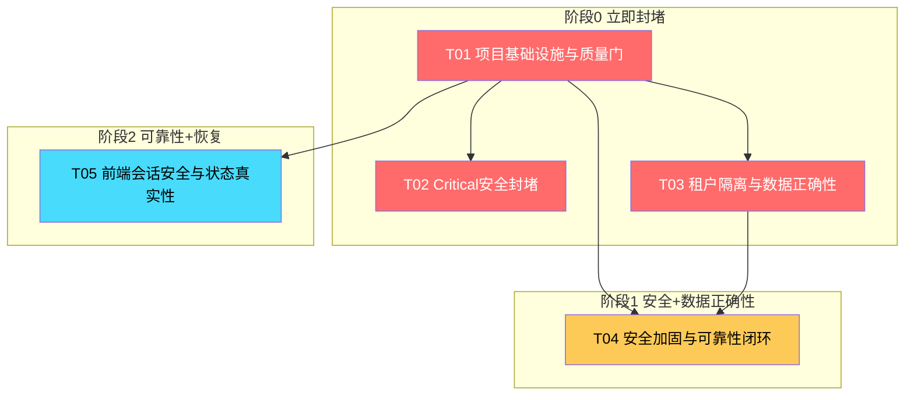

# IRIP 整改技术设计文档（阶段 0–2）

> **文档版本**：v1.0（增量）
> **创建日期**：2026-07-30
> **架构师**：高见远
> **审阅基线**：`main@915a295011c24771cdbf074c1bf2690f2db81751`
> **增量 PRD**：`/Users/shuipei/Desktop/snowSP/irip/deliverables/remediation-prd-2026-07-30.md`
> **审计报告**：`/Users/shuipei/Desktop/snowSP/2026-07-30-main-comprehensive-code-audit.md`
> **前置设计**：`/Users/shuipei/Desktop/snowSP/irip/deliverables/remediation-design-2026-07-27.md`

---

## Part A: 系统设计

### 1. 实现方案

#### 1.1 核心技术挑战分析

2026-07-30 综合审计确认 IRIP 的核心问题不是技术选型错误，而是**控制链断裂**——安全机制已编写但未闭环。本次整改的技术挑战集中在以下六个维度：

| 挑战 | 当前状态 | 目标状态 | 核心技术手段 |
|------|---------|---------|-------------|
| **摄入面任意文件读取** | `SourceFileConfig.path` 接受任意服务器路径，`FileConnector` 直接打开 | 只接受 `artifact_id`，由 `ArtifactService` 校验归属后流式读取 | artifact_id 替代裸路径 + 归属校验 + 资源预算 |
| **作业越权** | `CreateJobRequest.kind` 接受任意字符串，`LAB_MEMBER` 拥有 `JOB_SUBMIT` 可提交 backup/restore | `JobKindPolicy` allowlist + 服务端生成关键字段 + Worker 二次校验 | 策略模式 + 权限快照 + fencing token |
| **租户隔离未生效** | `session_scope` 从未设置 `app.current_org_id` GUC；多处 DML 只按全局 ID | 每事务 `SET LOCAL app.current_org_id` + 复合键查询 + RLS FORCE + 非 owner 角色 | Principal + QueryScope + SQLAlchemy event listener |
| **备份明文残留** | `backup.py` 在最终目录写 `database.dump` + `objects/`，只删 `backup.tar` | 0700 临时目录生成 → 加密 → 原子移动 → 清理 | 临时目录 + atomic move + try/finally cleanup |
| **前端 XSS 与状态残留** | `MessageThread.tsx` 正则拼 HTML + `dangerouslySetInnerHTML`；登出不清缓存 | `react-markdown` + `rehype-sanitize`；`clearSessionState()` 原子清理 | 安全渲染 + 会话隔离 |
| **质量证据链不可信** | CI `-m "integration"` deselect 安全测试；验收报告硬编码 PASS | 按目录独立执行 + 数量门 + 工件驱动报告 | CI job 分离 + JUnit/coverage 消费 |

#### 1.2 框架与库选型

保持现有技术栈不变（FastAPI + SQLAlchemy + Celery + PostgreSQL/Redis/MinIO + React/Vite），新增以下必要库：

| 库/工具 | 版本 | 用途 | 选型理由 |
|---------|------|------|---------|
| `rehype-sanitize` | ^6.0 | HTML 净化 allowlist | 配合 react-markdown 实现安全渲染 |
| `rehype-raw` | ^7.0 | 控制 HTML 处理 | 与 sanitize 配合控制原始 HTML |
| `slowapi` | ^0.1.9 | FastAPI 速率限制 | 轻量 IP+账号双维限流，与 FastAPI 原生集成 |
| `argon2-cffi` | 已有 | dummy Argon2 计算 | 恒定成本登录校验（已有依赖） |
| `sqlparse` | ^0.5 | SQL 单句解析 | PostgreSQL 数据源只读校验 |
| `age` | >=1.2 | 备份加密 | 系统包，安装到专用镜像 |
| `torch` | 无 | 不引入 | 保持现有 ML 框架不变 |

#### 1.3 架构模式

保持**模块化单体**，通过以下改造收敛边界：

```
API 层（Router）
  → 不直接操作 ORM，不读取 service 私有属性
  → 只接受 artifact_id 而非服务器路径
  → Job kind 经 JobKindPolicy allowlist 校验
    ↓
应用服务层
  → 接收可信 Principal（含 user, org, roles, token_version, scope）
  → 每事务 SET LOCAL app.current_org_id
    ↓
统一 Policy 层
  → 租户谓词 + QueryScope 授权 + 审计记录
  → 部门树权限由统一 policy 解析
    ↓
领域服务
  → 聚合逻辑，不信任客户端提交的 org/actor/path
    ↓
Repository Port
  → 强制 (org_id, id) 复合查询
  → 禁止路由层直接拼 ORM 查询
    ↓
PostgreSQL
  → irip_runtime 角色（非 owner/superuser）
  → RLS FORCE ROW LEVEL SECURITY（第二道防线）
  → 不可变触发器仅在版本/事件表上
```

---

### 2. 各需求的技术实现方案（22 项逐个说明）

#### 2.1 阶段 0 — P0 立即封堵（7 项）

##### C-01 [P0] 摄入预览可读取任意本地文件

**改什么**：
- `apps/api/routers/ingestions.py:83-87`：`SourceFileConfig.path: str` 改为 `artifact_id: UUID`
- `packages/connectors/file_connectors.py:48-65`：`FileConnector.preview()` 从 `source.config.get("path")` 改为从 artifact 流式读取
- `packages/connectors/mapping.py:818-833`：`FileConnector` 构造逻辑适配 artifact_id
- `apps/api/routers/ingestions.py:310-328`：preview 端点改为接受 `artifact_id`

**改什么逻辑**：
```python
# 修改前（ingestions.py:83-87）
class SourceFileConfig(BaseModel):
    path: str = Field(..., min_length=1)
    format: Literal["csv", "xlsx", "json"]

# 修改后
class SourceFileConfig(BaseModel):
    artifact_id: UUID = Field(..., description="本租户已上传的 artifact ID")
    format: Literal["csv", "xlsx", "json"]
```

```python
# 修改前（file_connectors.py:48）
path = source.config.get("path")
columns, rows = await self._read_rows(path, fmt, limit)

# 修改后：通过 ArtifactService 获取流式 reader
artifact_id = source.config.get("artifact_id")
reader = await artifact_service.open_stream(principal, artifact_id)
columns, rows = await self._read_rows_from_stream(reader, fmt, limit)
```

**技术手段**：
1. API 层：只接受 `artifact_id`，由 `ArtifactService` 校验 organization、department/scope、状态和媒体类型
2. 流式读取：有界迭代器，设置行数/页数/解压后大小/CPU/时间预算
3. 本地导入（如需）：独立 import root（不含秘密），`resolve()` + `is_relative_to()`，拒绝 symlink/设备文件/`/proc`/`/sys`
4. 容器：API/Worker 镜像不挂载源码、Docker socket 和宿主秘密，非 root 只读 FS

**验收要点**：绝对路径、`../`、URL 编码穿越、symlink、`/proc`、`/etc` 全部返回 403/422；跨租户 artifact 返回 404/403

---

##### C-02 [P0] 通用 Job 接口可触发备份/恢复等特权作业

**改什么**：
- `apps/api/routers/jobs.py:56-61`：`CreateJobRequest.kind: str` 改为受 `JobKindPolicy` 约束的枚举
- `apps/api/routers/jobs.py:129-155`：`create_job` 端点增加 allowlist 校验
- `packages/auth/permissions.py:241-265`：`LAB_MEMBER` 的 `JOB_SUBMIT` 权限收敛为只允许低风险 kind
- `apps/worker/tasks/__init__.py:103-118`：`_register_handlers` 增加 Worker 侧二次校验
- `apps/worker/tasks/__init__.py:142-172`：`_restore_handler` 从信任 `backup_dir` 改为使用签名 backup_id
- `apps/api/routers/backups.py`：专用备份/恢复 API 要求 `system:manage`

**改什么逻辑**：

新增 `packages/common/job_policy.py`：
```python
class JobKindPolicy:
    """服务端 Job kind 策略：每个 kind 固定权限、输入 schema、队列、超时、资源预算。"""

    POLICIES: dict[str, KindPolicy] = {
        "flow_execute": KindPolicy(
            required_permission="job:submit",
            queue="irip-jobs",
            timeout_seconds=3600,
            max_retries=3,
            allow_general_submit=True,   # 通用接口可提交
        ),
        "flow_resume": KindPolicy(
            required_permission="job:submit",
            queue="irip-jobs",
            timeout_seconds=1800,
            max_retries=2,
            allow_general_submit=True,
        ),
        "ingestion": KindPolicy(
            required_permission="job:submit",
            queue="irip-jobs",
            timeout_seconds=1800,
            max_retries=3,
            allow_general_submit=True,
        ),
        "model_train": KindPolicy(..., allow_general_submit=True),
        "model_predict": KindPolicy(..., allow_general_submit=True),
        "model_publish": KindPolicy(..., allow_general_submit=True),
        "backup": KindPolicy(
            required_permission="system:manage",
            queue="irip-ops",
            timeout_seconds=7200,
            max_retries=0,
            allow_general_submit=False,  # 必须通过专用 API
        ),
        "restore": KindPolicy(
            required_permission="system:manage",
            queue="irip-ops",
            timeout_seconds=14400,
            max_retries=0,
            allow_general_submit=False,
        ),
        "audit_export": KindPolicy(
            required_permission="system:manage",
            queue="irip-ops",
            timeout_seconds=3600,
            max_retries=0,
            allow_general_submit=False,
        ),
    }

    @classmethod
    def validate(cls, kind: str, principal: Principal, *, via_general: bool) -> KindPolicy:
        policy = cls.POLICIES.get(kind)
        if policy is None:
            raise AppError(code="unknown_job_kind", message=f"未注册的作业类型: {kind}")
        if via_general and not policy.allow_general_submit:
            raise AppError(code="forbidden", message=f"特权作业 {kind} 必须通过专用 API 提交")
        if not principal.has_permission(policy.required_permission):
            raise AppError(code="forbidden", message=f"缺少权限: {policy.required_permission}")
        return policy
```

修改 `apps/api/routers/jobs.py` 的 `create_job`：
```python
# 修改后：通用接口只允许 allowlist 中的 kind
policy = JobKindPolicy.validate(body.kind, current_user.principal, via_general=True)
# 服务端生成 organization_id、actor，不接受客户端覆盖
ref = await service.accept(
    kind=body.kind,
    payload=body.payload,
    idempotency_key=body.idempotency_key,
    principal=current_user.principal,  # 服务端注入，不从 payload 取
)
```

修改 `_restore_handler`：
```python
# 修改前（信任 backup_dir）
backup_dir_str = payload.get("backup_dir", "")
manifest = await run_restore(Path(backup_dir_str))

# 修改后（使用签名 backup_id）
backup_id = payload.get("backup_id", "")
if not backup_id:
    raise AppError(code="validation_failed", message="恢复作业缺少 backup_id")
# 通过 BackupRegistry 查找已签名的 backup 记录，不信任客户端路径
backup_record = await backup_registry.get_by_id(org_id, backup_id, verify_signature=True)
manifest = await run_restore(backup_record.encrypted_path)
```

**技术手段**：
1. 策略模式：`JobKindPolicy` 定义每个 kind 的权限、schema、队列、超时、资源预算
2. 双重校验：API 入口校验 + Worker 执行前二次校验（kind、权限快照、审批记录、目标环境锁）
3. 服务端生成关键字段：organization、actor、目标环境、backup_id 由服务器生成，不接受客户端覆盖
4. 恢复安全：使用签名 backup_id，不接受任意路径，要求维护窗口、双人审批、目标非空检查

**验收要点**：普通成员提交 `backup/restore/audit_export` 返回 403/422；篡改 org/actor/路径/队列字段无效

---

##### C-03 [P0] RLS 未生效 + 跨租户 IDOR

**改什么**：
- `packages/common/database.py:32-63`：`session_scope` 增加 `SET LOCAL app.current_org_id` GUC
- `packages/common/principal.py`（已有，需增强）：增加 `token_version` 字段
- `migrations/versions/0032_rls_policies.py`：增加 `FORCE ROW LEVEL SECURITY`
- `migrations/versions/0034_db_roles.py:35-91`：修复 `organization` 授权顺序问题
- `compose.yaml:7-18,52-70,87-104`：API/Worker 改用 `irip_runtime` 账号
- `packages/departments/repository.py:46-57`：增加 `(org_id, id)` 复合查询
- `packages/equipment/repository.py:176-205`：增加 `(org_id, id)` 复合查询
- `apps/api/routers/equipment.py:330-350`：增加 org 条件
- `apps/api/routers/flows.py:552-575`：增加 org 条件
- `packages/parameters/service.py:572-623`：reject 增加 org 条件
- `packages/components/registry.py:646-706`：activate/delete 增加 org 条件

**改什么逻辑**：

修改 `packages/common/database.py` 的 `session_scope`：
```python
@asynccontextmanager
async def session_scope(
    factory: async_sessionmaker[AsyncSession],
    *,
    principal: Principal | None = None,
) -> AsyncIterator[AsyncSession]:
    async with factory() as session:
        async with session.begin():
            # 每事务设置租户 GUC
            if principal is not None:
                await session.execute(
                    sa.text("SET LOCAL app.current_org_id = :org_id"),
                    {"org_id": str(principal.organization_id)},
                )
            yield session
```

通过 SQLAlchemy event listener 在连接获取时自动设置 GUC：
```python
@event.listens_for(Engine, "connect")
def _set_tenant_guc(dbapi_conn, _):
    # 连接级别默认值为空，事务级别由 session_scope 设置
    cursor = dbapi_conn.cursor()
    cursor.execute("SET app.current_org_id = ''")
    cursor.close()
```

修改 Repository 方法签名（示例）：
```python
# 修改前（departments/repository.py:46-57）
async def get(session, dept_id: UUID) -> Department | None:
    stmt = sa.select(Department).where(Department.id == dept_id)

# 修改后
async def get(session, org_id: UUID, dept_id: UUID) -> Department | None:
    stmt = sa.select(Department).where(
        Department.organization_id == org_id,
        Department.id == dept_id,
    )
```

修改 `0034_db_roles.py` 的迁移顺序：
```python
# 问题：0034 对 organization 表授权，但 organization 表可能由更晚的迁移创建
# 修复：将 organization 从 _BUSINESS_TABLES 中移出，改为在创建 organization 表的迁移中授权
# 或将 0034 改为依赖创建 organization 表的迁移
```

**技术手段**：
1. Principal 值对象：包含 user_id、organization_id、department_id、roles、token_version
2. 事务级 GUC：`SET LOCAL app.current_org_id` 在 `session_scope` 中设置，缺失时 fail closed
3. 复合键查询：所有 Repository 方法强制 `(org_id, resource_id)` 或显式 `QueryScope`
4. RLS FORCE：对所有租户表启用 `FORCE ROW LEVEL SECURITY`，即使 owner 也受 RLS 约束
5. 非 owner 角色：API/Worker 使用 `irip_runtime`，迁移使用 `irip_migrate`

**验收要点**：A/B 两组织、父/子/兄弟部门矩阵 100% 通过；runtime 角色未设置 GUC 时查询返回空

---

##### C-04 [P0] 加密备份明文残留

**改什么**：
- `deployments/compose/backup.py:196-239`：改为在 0700 临时目录中生成 → 加密 → 原子移动 → 清理

**改什么逻辑**：

```python
# 修改前（backup.py:190-239）
target_dir: Path = output_dir or self._config.output_dir
target_dir.mkdir(parents=True, exist_ok=True)
database_path: Path = target_dir / DATABASE_DUMP_FILENAME  # 明文写入最终目录
objects_dir: Path = target_dir / OBJECTS_DIRNAME            # 明文写入最终目录
# ... 只加密 backup.tar，不删 database.dump 和 objects/

# 修改后：在 0700 临时目录中生成
import tempfile, shutil

target_dir: Path = output_dir or self._config.output_dir
target_dir.mkdir(parents=True, exist_ok=True)

# 1. 创建 0700 临时目录
temp_dir = Path(tempfile.mkdtemp(prefix="irip-backup-"))
try:
    os.chmod(temp_dir, 0o700)

    # 2. 在临时目录中生成 dump 和 objects
    database_path = temp_dir / DATABASE_DUMP_FILENAME
    self._dump_database(database_path)

    objects_dir = temp_dir / OBJECTS_DIRNAME
    objects_dir.mkdir(parents=True, exist_ok=True)
    object_count = self._export_minio_objects(objects_dir)

    # 3. 计算 manifest
    manifest = compute_manifest(...)

    # 4. 写入 manifest（临时目录）
    save_manifest(manifest, temp_dir)

    # 5. 打包 tar（临时目录）
    tar_path = temp_dir / BACKUP_TAR_FILENAME
    self._create_tar(temp_dir, tar_path)

    # 6. 加密
    final_path = tar_path
    if self._config.age_recipient is not None:
        encrypted_path = temp_dir / BACKUP_TAR_AGE_FILENAME
        self._encrypt_tar(tar_path, encrypted_path, self._config.age_recipient)
        final_path = encrypted_path

    # 7. 原子移动唯一加密制品到最终目录
    final_dest = target_dir / final_path.name
    shutil.move(str(final_path), str(final_dest))

    # 8. 写入最小公开元数据（签名/MAC）
    public_manifest = manifest.to_public_dict()  # 只保留不敏感字段
    save_public_manifest(public_manifest, target_dir, hmac_key=self._config.manifest_hmac_key)

    return manifest

finally:
    # 9. 成功和失败路径都可靠清理临时明文
    shutil.rmtree(temp_dir, ignore_errors=True)
```

**技术手段**：
1. 0700 临时目录：`tempfile.mkdtemp(prefix="irip-backup-")` + `os.chmod(0o700)`
2. 原子移动：`shutil.move` 把唯一加密制品移到最终目录
3. try/finally 清理：无论成功失败都 `shutil.rmtree(temp_dir)`
4. 最小公开元数据：最终 manifest 只保留不敏感字段，HMAC-SHA256 签名

**验收要点**：加密备份完成后最终目录只包含 `.age` 及允许公开的最小元数据；注入加密失败/磁盘满/进程终止后也无残留明文

---

##### H-14 [P0] AI 消息 DOM XSS

**改什么**：
- `apps/web/src/assistant/MessageThread.tsx:29-199`：删除正则拼 HTML + `dangerouslySetInnerHTML`，改用 `react-markdown` + `rehype-sanitize`
- 新增 CSP 配置：禁止 inline script/event handler

**改什么逻辑**：

```tsx
// 修改前（MessageThread.tsx:29-44）
function MarkdownWithMath({ content }: { content: string }): JSX.Element {
  let processed = content
    .replace(/\$\$([\s\S]+?)\$\$/g, (_, latex: string) => {
      return `<div class="katex-math" data-latex="${escaped}" data-display="true"></div>`;
    })
    // ... 正则拼 HTML
  return <div ref={containerRef} dangerouslySetInnerHTML={{ __html: processed }} />;
}

// 修改后：使用 react-markdown + rehype-sanitize
import ReactMarkdown from 'react-markdown';
import rehypeSanitize, { defaultSchema } from 'rehype-sanitize';
import rehypeKatex from 'rehype-katex';
import remarkMath from 'remark-math';

function MarkdownWithMath({ content }: { content: string }): JSX.Element {
  // 自定义 sanitize schema：允许 katex 相关 class，禁止所有事件属性
  const sanitizeSchema = {
    ...defaultSchema,
    attributes: {
      ...defaultSchema.attributes,
      div: [...(defaultSchema.attributes?.div || []), 'className', 'dataLatex', 'dataDisplay', 'dataIdx'],
      span: [...(defaultSchema.attributes?.span || []), 'className'],
    },
    // 禁止所有协议：只允许 http/https，禁止 javascript:
    protocols: { ...defaultSchema.protocols, src: ['http', 'https', 'data'] },
  };

  return (
    <ReactMarkdown
      remarkPlugins={[remarkMath]}
      rehypePlugins={[[rehypeSanitize, sanitizeSchema], rehypeKatex]}
    >
      {content}
    </ReactMarkdown>
  );
}

// ECharts 图表数据独立解析：不经过 Markdown 渲染
function ChartBlock({ option }: { option: string }): JSX.Element {
  const parsed = useMemo(() => {
    try { return JSON.parse(option); }
    catch { return null; }
  }, [option]);
  if (!parsed) return null;
  return <EChartsReact option={parsed} />;
}
```

CSP 配置（Nginx 或 meta tag）：
```
Content-Security-Policy: default-src 'self'; script-src 'self'; style-src 'self' 'unsafe-inline'; img-src 'self' data: https:; connect-src 'self'; object-src 'none'; base-uri 'self';
```

**技术手段**：
1. `react-markdown`：默认禁止原始 HTML
2. `rehype-sanitize`：严格 allowlist，禁止所有事件属性
3. 图表数据独立解析：ECharts option 不经过 Markdown 渲染
4. CSP：禁止 inline script/event handler

**验收要点**：`img onerror`、`svg onload`、`javascript:`、畸形 Markdown/KaTeX 测试均不执行脚本；DOM 无事件属性

---

##### H-17 [P0] 质量门失败 + 运行时缺陷

**改什么**：
- `apps/api/routers/facts.py:1054`：`run` 未定义 → 改为 `run_record`
- `apps/api/routers/facts.py:1062-1067`：缩小 catch 范围，使用结构化错误
- `pyproject.toml`：设置 Ruff/Mypy 严格配置
- `.github/workflows/ci.yml`：恢复 required checks

**改什么逻辑**：

```python
# 修改前（facts.py:1054）
"run_operator": (run.input_snapshot or {}).get("_operator") if run else None,

# 修改后：使用正确的变量名 run_record
"run_operator": (run_record.input_snapshot or {}).get("_operator") if run_record else None,
```

```python
# 修改前（facts.py:1062-1067）：大范围 catch 静默吞掉
except Exception as e:
    import logging
    logging.getLogger(__name__).warning(
        f"Failed to query task info for fact {fact_id}: {e}"
    )

# 修改后：缩小 catch 范围，结构化错误
except (sa.exc.SQLAlchemyError, KeyError, ValueError) as e:
    logger.warning(
        "Failed to query task info for fact %s: %s",
        fact_id, e, exc_info=True,
    )
```

**技术手段**：
1. 修复未定义变量：`run` → `run_record`
2. 缩小 catch 范围：只捕获预期异常
3. 结构化错误：使用 logger 参数化消息，不使用 f-string
4. 质量门恢复：Ruff F/E=0，关键包 Mypy=0，覆盖率达标

**验收要点**：Ruff/format 0；关键包 Mypy 0；`facts.py` fallback 路径有回归测试并返回正确 operator

---

##### H-10 [P0] CI 跳过安全测试 + 硬编码 PASS

**改什么**：
- `.github/workflows/ci.yml:183`：删除 `-m "integration"`，按目录独立执行
- `scripts/generate-acceptance.py:125-138`：删除硬编码 PASS，从 JUnit/coverage 工件消费
- `scripts/release-gate.sh:72-86,112-135`：先启动环境和迁移，再执行测试

**改什么逻辑**：

修改 `ci.yml`：
```yaml
# 修改前（line 183）
- run: python -m pytest tests/integration tests/recovery tests/security -v -m "integration" --cov=packages --cov=apps --cov-report=term-missing --cov-fail-under=40

# 修改后：按目录独立执行，不加 marker 过滤
# Integration tests job
- run: python -m pytest tests/integration/ -v --cov=packages --cov=apps --cov-report=term-missing --cov-fail-under=40 --junit-xml=integration-results.xml

# Security tests job（独立 job）
- run: python -m pytest tests/security/ -v --junit-xml=security-results.xml
  # 数量门：检查 collected 数不下降
  # 非预期 skip 失败

# Recovery tests job（独立 job）
- run: python -m pytest tests/recovery/ -v --junit-xml=recovery-results.xml
```

修改 `generate-acceptance.py`：
```python
# 修改前（lines 129-134）：硬编码 PASS
"| Ruff F821 | PASS |",
"| Ruff E/F/I | PASS |",
"| Mypy Type Check | PASS |",
"| Error Code Exhaustiveness | PASS |",
"| Docker Compose Config | PASS |",
"| TypeScript tsc --noEmit | PASS |",

# 修改后：从 JUnit/coverage/lint/build 工件消费
def _read_junit_results(path: str) -> dict[str, str]:
    """从 JUnit XML 读取测试结果，返回 {suite: PASS/FAIL}"""
    ...

def _read_coverage(path: str) -> float:
    """从 coverage XML 读取覆盖率"""
    ...

def _run_ruff() -> str:
    """运行 Ruff，返回 PASS/FAIL"""
    result = subprocess.run(["ruff", "check", "apps", "packages", "tests"], capture_output=True)
    return "PASS" if result.returncode == 0 else "FAIL"

# 报告 job 设置 needs 依赖质量 jobs
# 缺证据为 UNKNOWN/FAIL
```

修改 `release-gate.sh`：
```bash
# 修改前：在启动基础设施前跑集成/安全/恢复测试
# 修改后：
# 1. 先启动 Docker 基础设施
# 2. 等待 migration one-shot 完成
# 3. 再执行集成/安全/恢复测试
# 4. 检查 collected 数、executed 数、skip 数
# 5. 缺少依赖导致 skip 时，pytest 返回非 0
```

**技术手段**：
1. 按目录独立执行：每类测试独立 CI job，不加 marker 过滤
2. 数量门：检查 collected 数不下降，非预期 skip 失败
3. 工件驱动报告：验收报告只消费 JUnit/coverage/lint/build 工件
4. `needs` 依赖：报告 job 依赖质量 jobs，缺证据为 UNKNOWN/FAIL

**验收要点**：故意制造安全失败、迁移失败或 collected 数下降，CI 与验收报告必须失败

---

### 2.2 阶段 1 — P1 安全+数据正确性（11 项）

##### H-01 [P1] 不可变触发器保护错表

**改什么**：
- `migrations/versions/0033_immutable_tables.py:38-45`：从 `_IMMUTABLE_TABLES` 移除 `flow_node_execution` 和 `evidence_set`
- `migrations/versions/0033_immutable_tables.py`：新增对 `evidence_set_version` 的不可变保护
- `migrations/versions/0034_db_roles.py:94-101`：同步修改 `_IMMUTABLE_TABLES`
- `packages/components/flow_runtime.py:1168-1188,1229-1240`：确认状态更新不再被触发器阻断
- `packages/provenance/evidence.py:255-277`：确认证据集状态更新不再被阻断

**改什么逻辑**：

```python
# 修改前（0033_immutable_tables.py:38-45）
_IMMUTABLE_TABLES: list[str] = [
    "fact_revision",
    "component_version",
    "flow_definition_version",
    "flow_node_execution",   # ← 错误：需要状态更新
    "audit_event",
    "evidence_set",          # ← 错误：需要状态更新
]

# 修改后：移除需要状态更新的表，添加真正的不可变表
_IMMUTABLE_TABLES: list[str] = [
    "fact_revision",
    "component_version",
    "flow_definition_version",
    "audit_event",
    "evidence_set_version",  # ← 真正不可变的是版本快照
]
```

新增迁移 `0035_fix_immutable_tables.py`：
```python
def upgrade():
    # 1. 删除错误表上的触发器
    op.execute("DROP TRIGGER IF EXISTS prevent_modify_flow_node_execution ON flow_node_execution;")
    op.execute("DROP TRIGGER IF EXISTS prevent_modify_evidence_set ON evidence_set;")
    # 2. 恢复 irip_runtime 对 flow_node_execution 和 evidence_set 的 UPDATE 权限
    op.execute("GRANT UPDATE ON TABLE flow_node_execution TO irip_runtime;")
    op.execute("GRANT UPDATE ON TABLE evidence_set TO irip_runtime;")
    # 3. 为 evidence_set_version 创建不可变触发器
    op.execute("""
        CREATE TRIGGER prevent_modify_evidence_set_version
            BEFORE UPDATE OR DELETE ON evidence_set_version
            FOR EACH ROW EXECUTE FUNCTION raise_immutable_violation();
    """)
    op.execute("REVOKE UPDATE, DELETE ON TABLE evidence_set_version FROM irip_runtime;")
    op.execute("GRANT SELECT, INSERT ON TABLE evidence_set_version TO irip_runtime;")
```

**技术手段**：把触发器移到版本/事件表；稳定身份表允许受控状态迁移

**验收要点**：runtime role 可完整执行流程和 freeze；版本快照、审计和事实修订仍不能 UPDATE/DELETE

---

##### H-02 [P1] fresh migration + schema drift + 启动顺序

**改什么**：
- `migrations/versions/0034_db_roles.py:35-91`：修复 `organization` 授权顺序
- `packages/components/registry.py:71`：`component.active_version_id` 补齐迁移
- `migrations/env.py:20,38`：完整导入所有模型
- `compose.yaml:52-170`：独立 migration 服务，API/Worker 依赖其成功完成
- `apps/api/routers/health.py`：readiness 增加迁移状态检查

**改什么逻辑**：

修复 `0034_db_roles.py`：
```python
# 问题：0034 对 organization 表授权，但 organization 表可能由更晚的迁移创建
# 方案：将 0034 拆分，或在 0034 中使用 DO 块检查表是否存在

for table in _BUSINESS_TABLES:
    op.execute(f"""
        DO $$
        BEGIN
            IF EXISTS (SELECT 1 FROM information_schema.tables
                       WHERE table_schema = 'public' AND table_name = '{table}') THEN
                GRANT SELECT, INSERT, UPDATE, DELETE ON TABLE "{table}" TO irip_runtime;
            END IF;
        END
        $$;
    """)
```

新增迁移补齐 `active_version_id`：
```python
# 0036_component_active_version.py
def upgrade():
    op.add_column("component", sa.Column("active_version_id", sa.UUID(), nullable=True))
    op.create_foreign_key(
        "fk_component_active_version",
        "component", "component_version",
        ["active_version_id"], ["id"],
    )
```

修改 `compose.yaml` 启动顺序：
```yaml
# 新增 migration one-shot 服务
migration:
  build: .
  command: ["alembic", "upgrade", "head"]
  depends_on:
    postgres:
      condition: service_healthy
  environment:
    IRIP_DATABASE_URL: postgresql+psycopg://irip_migrate:${IRIP_MIGRATE_PASSWORD:?required}@postgres:5432/irip

api:
  depends_on:
    postgres:
      condition: service_healthy
    migration:
      condition: service_completed_successfully  # 等待迁移完成
  environment:
    IRIP_DATABASE_URL: postgresql+psycopg://irip_runtime:${IRIP_RUNTIME_PASSWORD:?required}@postgres:5432/irip
```

修改 `health.py` readiness：
```python
async def readiness_check(session):
    # 检查 alembic_version 表 head 是否与代码期望一致
    result = await session.execute(sa.text("SELECT version_num FROM alembic_version"))
    db_heads = {row[0] for row in result}
    expected_heads = _get_expected_heads()  # 动态读取
    if db_heads != expected_heads:
        return {"status": "not_ready", "reason": "migration_head_mismatch"}
    return {"status": "ready"}
```

**技术手段**：organization 正式进入 Alembic；补齐字段迁移和 metadata 模型注册；独立 migration 服务；入口使用 readiness

**验收要点**：从空卷启动 100 次均成功；`alembic check` 无漂移；迁移失败时业务服务不 ready

---

##### H-03 [P1] 作业租约/重试/异步适配

**改什么**：
- `packages/jobs/worker.py:39-43,98-118,187-320`：Executor 启动独立心跳任务；增加 fencing token
- `packages/jobs/repository.py:184-213`：retry 与 outbox 重新投递同事务
- `apps/worker/celery_app.py:178-230`：retry 重新投递而非只改状态
- `apps/worker/tasks/__init__.py:47,93-113`：owner 从环境获取而非硬编码；async handler 原生 async，失败 raise

**改什么逻辑**：

修改 `JobExecutor.execute()`：
```python
async def execute(self, job_id: UUID, principal: Principal) -> JobResult | None:
    # 1. 唯一 lease owner + fencing token
    owner = f"worker-{os.getpid()}-{uuid4()}"
    fencing_token = await self._lease_manager.acquire_with_fencing(job_id, owner)
    if fencing_token is None:
        return None  # 被其他 worker 获取

    # 2. 启动独立心跳任务
    heartbeat_task = asyncio.create_task(
        self._heartbeat_loop(job_id, owner, fencing_token)
    )
    try:
        # 3. 执行 handler
        handler = self._handlers.get(job.kind)
        if handler is None:
            raise AppError(code="unknown_job_kind", message=f"未注册的作业类型: {job.kind}")
        result = await handler(job)  # 原生 async，失败必须 raise
        # 4. 乐观锁提交成功（带 fencing token）
        await self._commit_result(job_id, fencing_token, status="succeeded", result=result)
    except AppError as e:
        await self._commit_result(job_id, fencing_token, status="failed", error=e)
    except Exception as e:
        # 瞬态失败：判断是否可重试
        if self._is_retryable(e) and job.attempt < job.max_attempts:
            await self._enqueue_retry(job_id, fencing_token)
        else:
            await self._commit_result(job_id, fencing_token, status="failed", error=e)
    finally:
        heartbeat_task.cancel()
        await self._lease_manager.release(job_id, owner)
```

修改 `_register_handlers` 的 `_adapt`：
```python
# 修改前：同步 handler 用 asyncio.run，异常作为普通字典返回
def _adapt(handler):
    async def _wrapper(job):
        return handler(str(job.id), job.payload or {})
    return _wrapper

# 修改后：全部 handler 原生 async，失败必须 raise
async def _adapt_async(handler):
    async def _wrapper(job):
        return await handler(str(job.id), job.payload or {})
    return _wrapper
```

**技术手段**：唯一 lease owner + fencing token；独立心跳任务；reap/retry 与 outbox 重新投递同事务；全部 handler 原生 async

**验收要点**：超过两个 TTL 的任务只执行一次；杀死 Worker 后可恢复；任何领域失败最终状态均为 failed/retry_wait

---

##### H-04 [P1] 上传限制可绕过 + 内存耗尽

**改什么**：
- `apps/api/routers/uploads.py:97-140`：增加 `content-length-range` POST policy；complete 前 HEAD 验证
- `packages/common/s3_repository.py:193-212`：签名增加实际大小条件
- `packages/common/artifacts.py:448-508`：有界流式 hash/copy
- `packages/common/s3_repository.py:126-144`：流式读取不整对象读入内存

**改什么逻辑**：

```python
# s3_repository.py：签名增加大小条件
def create_presigned_post(self, bucket, key, *, max_size: int, content_type: str | None = None):
    policy = {
        "expiration": (datetime.utcnow() + timedelta(minutes=30)).isoformat(),
        "conditions": [
            {"bucket": bucket},
            ["starts-with", "$key", key],
            ["content-length-range", 0, max_size],  # 实际大小限制
        ],
    }
    ...

# uploads.py：complete 前 HEAD 验证
async def complete_upload(body, current_user):
    # HEAD 验证实际大小和类型
    obj_info = await s3_repo.head_object(bucket, key)
    if obj_info.size > max_upload_size:
        await s3_repo.delete_object(bucket, key)  # 清理超限对象
        raise AppError(code="file_too_large", message=f"文件超过大小限制: {obj_info.size}")
    if obj_info.content_type not in ALLOWED_TYPES:
        await s3_repo.delete_object(bucket, key)
        raise AppError(code="unsupported_media_type", ...)

# artifacts.py：有界流式 hash/copy
async def stream_copy_with_hash(src, dst, *, max_size: int) -> str:
    hasher = hashlib.sha256()
    total = 0
    while chunk := await src.read(CHUNK_SIZE):
        total += len(chunk)
        if total > max_size:
            raise AppError(code="file_too_large")
        hasher.update(chunk)
        await dst.write(chunk)
    return hasher.hexdigest()
```

**技术手段**：`content-length-range` POST policy；HEAD 验证实际大小和类型；有界流式 hash/copy；上传会话绑定 tenant/user；临时对象 TTL 与配额

**验收要点**：超限对象在读取正文前拒绝；RSS 不随对象大小线性增长

---

##### H-05 [P1] SafeHTTP 限额失效 + DNS rebinding

**改什么**：
- `packages/common/safe_http.py:205-236`：流式累计字节；分离超限异常处理；固定已验证 IP
- `apps/api/routers/component_preview.py`：使用 safe HTTP client
- `packages/ai/openai_compatible.py`：使用 safe HTTP client
- `packages/ai/service.py`：使用 safe HTTP client
- `packages/plugins/converters/llm_converter/converter.py`：使用 safe HTTP client

**改什么逻辑**：

```python
# 修改前（safe_http.py）：缓冲请求，超限异常被同一个 except ValueError 吞掉
response = await self._client.get(url)
try:
    content = await response.aread()
    if len(content) > self.max_response_size:
        raise ValueError("response too large")
except ValueError:
    return None  # 吞掉

# 修改后：流式累计字节，分离超限异常
async def safe_get(self, url: str) -> SafeResponse:
    # 1. DNS 校验
    parsed = urlparse(url)
    addrs = await asyncio.to_thread(socket.getaddrinfo, parsed.hostname, None)
    for addr in addrs:
        ip = ipaddress.ip_address(addr[4][0])
        if ip.is_private or ip.is_loopback or ip.is_link_local:
            raise AppError(code="ssrf_blocked", message=f"私网地址被阻断: {ip}")

    # 2. 固定已验证 IP（在连接层校验，防止 DNS rebinding）
    verified_ip = addrs[0][4][0]
    transport = httpx.AsyncHTTPTransport(local_address=verified_ip)

    # 3. 流式累计字节
    total = 0
    async with httpx.AsyncClient(transport=transport, follow_redirects=False) as client:
        response = await client.get(url)
        chunks = []
        async for chunk in response.aiter_bytes(CHUNK_SIZE):
            total += len(chunk)
            if total > self.max_response_size:
                raise AppError(code="ssrf_blocked", message="响应超过大小限制")
            chunks.append(chunk)
        content = b"".join(chunks)

    # 4. 每次重定向重检
    while response.is_redirect:
        redirect_url = str(response.headers["location"])
        # 重新 DNS 校验
        ...
```

**技术手段**：统一 egress client/代理；流式累计字节；固定已验证 IP 或在连接层校验；每次重定向重检；代码规则禁止直接外呼

**验收要点**：私网、链路本地、IPv6、本地 DNS、重定向、rebinding、chunked 超限测试全部阻断

---

##### H-06 [P1] 主密钥 fail-open + 撤销不生效

**改什么**：
- `compose.yaml:70,104,129,164`：非测试环境缺 key 拒绝启动
- `packages/common/crypto.py:107-155`：单例版本化 crypto；删除随机生成 fallback
- `apps/api/routers/ai_config.py:264-266,409-415,471-476`：单例 crypto；删除密文回退
- `apps/api/dependencies/auth.py:109-130`：每次认证复核 active 和 token_version
- `packages/auth/service.py:193-229`：refresh 拒绝 disabled；禁用撤销 refresh family
- `packages/auth/entities.py`（或 JWT 模型）：JWT 加 token_version claim

**改什么逻辑**：

```python
# crypto.py：删除随机生成 fallback
class EnvelopeCrypto:
    _instance: "EnvelopeCrypto | None" = None  # 单例

    @classmethod
    def from_env(cls) -> "EnvelopeCrypto":
        if cls._instance is not None:
            return cls._instance
        key = os.getenv("IRIP_MASTER_KEY")
        if not key:
            # 非测试环境拒绝启动
            if os.getenv("IRIP_ENV") != "test":
                raise RuntimeError("IRIP_MASTER_KEY is required in non-test environment")
            # 测试环境使用固定测试密钥
            key = "test-master-key-do-not-use-in-production"
        cls._instance = cls(_decode_key(key))
        return cls._instance

    def decrypt(self, ciphertext: str) -> str:
        try:
            return self._decrypt_internal(ciphertext)
        except Exception:
            # 删除密文回退：解密失败直接 raise
            raise AppError(code="decryption_failed", message="密文解密失败")
```

```python
# auth.py：每次认证复核 active 和 token_version
async def get_current_user(token: str) -> Principal:
    payload = jwt.decode(token, ...)
    user = await user_repo.get(payload["sub"])
    # 复核 active
    if not user.is_active:
        raise AppError(code="forbidden", message="用户已被禁用")
    # 复核 token_version
    if payload.get("token_version", 0) != user.token_version:
        raise AppError(code="token_expired", message="token 已被撤销")
    return Principal.from_user(user)
```

```python
# service.py：refresh 拒绝 disabled；禁用撤销 refresh family
async def refresh_access_token(refresh_token: str) -> AccessToken:
    session = await refresh_session_repo.get_by_token(hash_token(refresh_token))
    user = await user_repo.get(session.user_id)
    if not user.is_active:
        # 禁用用户不能 refresh
        await refresh_session_repo.revoke_family(session.family_id)
        raise AppError(code="forbidden", message="用户已被禁用")

async def disable_user(user_id: UUID):
    user = await user_repo.get(user_id)
    user.is_active = False
    user.token_version += 1  # 撤销全部会话
    await refresh_session_repo.revoke_family_by_user(user_id)
```

**技术手段**：非测试环境缺 key 拒绝启动；单例版本化 crypto/KMS；删除密文回退；JWT 加 token_version；禁用/改密/改角色时撤销全部会话

**验收要点**：重启可解密；缺/错 key 启动失败；禁用或降权后 access/refresh 立即失效

---

##### H-07 [P1] 登录缺少抗暴力破解

**改什么**：
- `apps/api/routers/auth.py:39-43,112-136`：密码/邮箱长度上限；IP+账号双维限流
- `packages/auth/backends.py:94-108`：不存在用户执行 dummy Argon2
- `apps/api/main.py:154-180`：注册 rate limiter

**改什么逻辑**：

```python
# auth.py：密码/邮箱长度上限 + 限流
class LoginRequest(BaseModel):
    email: EmailStr = Field(..., max_length=254)  # RFC 5321 上限
    password: str = Field(..., min_length=8, max_length=128)  # 长度上限防 DoS

@auth_router.post("/login", responses={429: {"model": RateLimitResponse}})
async def login(
    body: LoginRequest,
    request: Request,
    auth_service: AuthServiceDep,
):
    # IP+账号双维限流
    client_ip = request.client.host
    if not rate_limiter.allow(f"login:ip:{client_ip}", limit=20, window=60):
        raise AppError(code="rate_limited", message="请求过于频繁，请稍后再试")
    if not rate_limiter.allow(f"login:email:{body.email}", limit=5, window=60):
        raise AppError(code="rate_limited", message="账号登录尝试过多，请稍后再试")
    ...
```

```python
# backends.py：不存在用户执行 dummy Argon2
async def authenticate(email: str, password: str) -> User | None:
    user = await user_repo.get_by_email(email)
    if user is None:
        # 执行 dummy Argon2 以保持恒定时间
        verify_password(password, DUMMY_HASH)
        return None
    if not verify_password(password, user.password_hash):
        return None
    return user
```

**技术手段**：IP+账号双维限流（slowapi）；不存在用户执行 dummy Argon2；密码/邮箱长度上限；退避、审计和告警

**验收要点**：超阈值返回 429；两类失败时延统计接近；压测不突破 CPU 预算

---

##### H-08 [P1] PostgreSQL 数据源未限只读

**改什么**：
- `apps/api/routers/ingestions.py:90-95`：查询校验单条 SELECT
- `packages/connectors/postgres_connector.py:85-99,141-160`：READ ONLY 事务 + statement timeout + 单句校验

**改什么逻辑**：

```python
# postgres_connector.py
import sqlparse

async def preview(self, source: ConnectorSource, limit: int = 100) -> PreviewTable:
    query = source.config.get("query", "")
    secret_id = source.config.get("secret_id")

    # 1. 可靠解析单条 SELECT
    statements = sqlparse.parse(query)
    if len(statements) != 1:
        raise AppError(code="validation_failed", message="只允许单条 SQL 语句")
    stmt = statements[0]
    if stmt.get_type() != "SELECT":
        raise AppError(code="forbidden", message="只允许 SELECT 语句")
    # 检查是否有写操作关键字（防止 CTE 修改）
    normalized = sqlparse.format(query, strip_comments=True).lower()
    for forbidden in ["insert", "update", "delete", "drop", "alter", "create", "truncate", "grant", "revoke"]:
        if forbidden in normalized:
            raise AppError(code="forbidden", message=f"禁止的 SQL 操作: {forbidden}")

    # 2. 使用专用只读账号连接
    dsn = await secret_service.get_pg_readonly_dsn(secret_id)
    engine = create_async_engine(dsn, pool_size=2, max_overflow=0)

    # 3. READ ONLY 事务 + timeout
    async with engine.connect() as conn:
        await conn.execute(sa.text("SET TRANSACTION READ ONLY"))
        await conn.execute(sa.text("SET LOCAL statement_timeout = '30s'"))
        await conn.execute(sa.text("SET LOCAL lock_timeout = '5s'"))
        await conn.execute(sa.text("SET LOCAL idle_in_transaction_session_timeout = '60s'"))
        # 4. 行数/字节配额
        result = await conn.execute(sa.text(f"SELECT * FROM ({query}) AS t LIMIT {limit}"))
        rows = result.fetchall()
        # 字节配额检查
        total_bytes = sum(len(str(row)) for row in rows)
        if total_bytes > MAX_PREVIEW_BYTES:
            raise AppError(code="file_too_large", message="预览结果超过大小限制")
```

**技术手段**：仅允许专用只读账号；事务 READ ONLY；statement/lock/idle timeout；sqlparse 可靠解析单条 SELECT；连接数、行数、字节和时间配额

**验收要点**：INSERT/DELETE、修改 CTE、副作用函数、多语句和 `pg_sleep` 被拒绝或超时

---

##### H-09 [P1] 备份恢复执行面不闭环

**改什么**：
- `apps/worker/tasks/__init__.py:121-169`：backup 使用 API payload；restore 使用签名 backup_id
- `deployments/compose/restore.py:234-248,417-455`：恢复到新 DB/bucket，完整校验后切换
- `deployments/compose/restore.py:610-647`：冒烟失败非零退出
- 备份恢复多处：流式传输大对象

**改什么逻辑**：

```python
# tasks/__init__.py：backup 使用 API payload
async def _backup_handler(job):
    payload = job.payload or {}
    org_id = job.organization_id  # 服务端生成，不从 payload 取
    backup_options = BackupOptions(
        include_objects=payload.get("include_objects", True),
        compression=payload.get("compression", "default"),
    )
    manifest = await run_backup(org_id=org_id, options=backup_options)
    return {"backup_id": manifest.backup_id, ...}

# restore.py：恢复到新 DB/bucket
async def run_restore(backup_id: str, *, target_env: str):
    # 1. 验证 backup_id 签名
    backup_record = await backup_registry.verify(backup_id)
    # 2. 恢复到新 DB/bucket（隔离目标）
    temp_db = f"irip_restore_{new_id()}"
    temp_bucket = f"irip-restore-{new_id()}"
    # 3. 完整校验后切换
    await restore_database(backup_record, temp_db)
    await restore_objects(backup_record, temp_bucket)
    await verify_integrity(temp_db, temp_bucket)
    # 4. 校验通过后切换
    await switch_database(temp_db)
    await switch_bucket(temp_bucket)

# 冒烟失败非零退出
smoke_result = await run_smoke_tests()
if smoke_result.failures:
    logger.error("Smoke test failures: %s", smoke_result.failures)
    sys.exit(1)  # 非 0 退出
```

**技术手段**：独立运维队列/runner 和持久卷；只用已签名 backup_id；恢复到新 DB/bucket 校验后切换；流式传输；关键冒烟失败非零退出

**验收要点**：跨容器重启可恢复；大于内存的对象 RSS 受控；注入任一步骤失败不会污染当前生产目标

---

##### H-12 [P1] CLI 组件沙箱未接入

**改什么**：
- `packages/components/runner.py:40-50,343-360`：生产强制 fail-closed 沙箱
- `compose.yaml`：设置安全模式；接通独立沙箱执行服务

**改什么逻辑**：

```python
# runner.py
class ComponentRunner:
    def __init__(self, sandbox_mode: str | None = None):
        self._sandbox_mode = sandbox_mode or os.getenv("IRIP_SAFE_CLI_MODE", "true")

    async def execute_cli(self, command: list[str], *, timeout: int, cpu_limit: int, mem_limit: str):
        if self._sandbox_mode == "true":
            return await self._execute_in_sandbox(command, timeout, cpu_limit, mem_limit)
        elif os.getenv("IRIP_ENV") == "production":
            # 生产环境强制 fail-closed
            raise AppError(code="forbidden", message="生产环境必须启用 CLI 沙箱")
        else:
            return await self._execute_direct(command, timeout)

    async def _execute_in_sandbox(self, command, timeout, cpu_limit, mem_limit):
        # 通过独立沙箱容器执行
        # 固定 digest、非 root、无网络、只读 FS、cap drop、seccomp
        # CPU/内存/PID/输出限制
        result = await subprocess_runner.run(
            command,
            container_image="irip-cli-sandbox:fixed-digest",
            security_opts=["no-new-privileges"],
            cap_drop=["ALL"],
            network_mode="none",
            read_only=True,
            cpu_quota=cpu_limit,
            memory_limit=mem_limit,
            pids_limit=100,
            timeout=timeout,
        )
        return result
```

**技术手段**：生产强制 fail-closed 沙箱；独立执行服务或受控容器运行时；固定 digest、非 root、无网络、只读 FS、cap drop、seccomp、CPU/内存/PID/输出限制

**验收要点**：恶意组件无法读取环境、访问网络/宿主文件或突破资源限额；沙箱不可用时任务拒绝执行

---

##### H-13 [P1] 生产编排暴露内部服务 + TLS/Cookie 基线

**改什么**：
- `compose.yaml:7-40,78-79`：只暴露 443；内部服务使用 internal network
- `apps/api/routers/auth.py:94-104`：refresh cookie `secure=True` + 最小 path + SameSite
- Nginx 配置：TLS/HSTS
- 所有容器：统一 `cap_drop`、`no-new-privileges`、只读根文件系统和资源限制

**改什么逻辑**：

```yaml
# compose.yaml
services:
  postgres:
    networks: [internal]  # 不暴露宿主端口
    # 删除 ports: ["5432:5432"]

  redis:
    networks: [internal]
    command: ["redis-server", "--requirepass", "${IRIP_REDIS_PASSWORD:?required}"]
    # 删除 ports

  minio:
    networks: [internal]
    # 删除 ports

  api:
    networks: [internal, web]
    # 删除 ports，只通过 Nginx 暴露

  nginx:
    ports: ["443:443"]  # 只暴露 443
    networks: [web]
    volumes:
      - ./nginx.conf:/etc/nginx/nginx.conf:ro
      - ./certs:/etc/nginx/certs:ro

# 所有容器统一安全基线
x-security-base: &security-base
  cap_drop: ["ALL"]
  security_opt: ["no-new-privileges"]
  read_only: true
  tmpfs: ["/tmp"]
  deploy:
    resources:
      limits:
        memory: 512M
        cpus: "1.0"
```

```python
# auth.py：Secure Cookie
response.set_cookie(
    key="refresh_token",
    value=token,
    httponly=True,
    secure=True,          # 修改前 secure=False
    samesite="strict",    # 新增
    path="/api/v1/auth",  # 最小 path，不是 "/"
    max_age=7 * 24 * 3600,
)
```

**技术手段**：只暴露 443；内部服务使用 internal network；Redis ACL/TLS；生产 Secure Cookie 和最小 path；TLS/HSTS；统一容器安全与资源基线

**验收要点**：外部扫描仅见批准入口；Set-Cookie 含 Secure/HttpOnly/SameSite；容器策略扫描通过

---

### 2.3 阶段 2 — P1 可靠性+恢复能力（4 项）

##### H-15 [P1] 登出后前端缓存跨账号残留

**改什么**：
- `apps/web/src/main.tsx:15-16`：QueryClient 含 tenant+user key
- `apps/web/src/auth/AuthProvider.tsx:79-85`：登出调用 `clearSessionState()`
- `apps/web/src/jobs/useJobStore.ts:10,24-38,64-77,101-103`：localStorage key 含 tenant+user；加载失败清旧数据

**改什么逻辑**：

```tsx
// main.tsx：QueryClient 含 tenant+user key
const queryClient = new QueryClient({
  defaultOptions: {
    queries: {
      queryKey: ['irip', currentTenant, currentUser],  // 含 tenant+user
      staleTime: 30_000,
    },
  },
});

// AuthProvider.tsx：统一 clearSessionState()
function clearSessionState() {
  // 原子清 Query、Zustand 和用户级持久化
  queryClient.clear();
  useJobStore.getState().reset();
  // 清除用户级 localStorage
  const prefix = `irip:${currentTenant}:${currentUser}`;
  Object.keys(localStorage)
    .filter(k => k.startsWith(prefix))
    .forEach(k => localStorage.removeItem(k));
}

// 登出时调用
async function logout() {
  await api.logout();
  clearSessionState();
  navigate('/login');
}

// refresh 失败时也调用
if (refreshError) {
  clearSessionState();
  navigate('/login');
}

// useJobStore.ts：key 含 tenant+user，加载失败清旧数据
const storageKey = `irip:${tenant}:${user}:jobs`;
// 加载失败时
if (loadError) {
  useJobStore.getState().clear();  // 清旧数据
}
```

**技术手段**：统一 `clearSessionState()`；登出、refresh 失败、账号切换时原子清 Query、Zustand 和用户级持久化；query/storage key 含 tenant+user；加载失败清旧数据

**验收要点**：A/B 连续登录 E2E 中，B 的 DOM、缓存、store、localStorage 均无 A 数据

---

##### H-16 [P1] 批量流程失败显示"全部完成"

**改什么**：
- `apps/web/src/components/FlowDetail.tsx:538-585`：逐项维护 succeeded/failed/cancelled/timed_out；仅 succeeded 计成功

**改什么逻辑**：

```tsx
// 修改前（FlowDetail.tsx:538-585）：把 failed/cancelled 也当 done
const allDone = items.every(item => ['succeeded', 'failed', 'cancelled'].includes(item.status));
if (allDone) {
  message.success(`${items.length} 个文件处理完成`);
}

// 修改后：逐项维护状态，仅 succeeded 计成功
interface BatchResult {
  succeeded: number;
  failed: number;
  cancelled: number;
  timed_out: number;
}

const result = useMemo(() => {
  return items.reduce<BatchResult>((acc, item) => {
    switch (item.status) {
      case 'succeeded': acc.succeeded++; break;
      case 'failed': acc.failed++; break;
      case 'cancelled': acc.cancelled++; break;
      case 'timed_out': acc.timed_out++; break;
    }
    return acc;
  }, { succeeded: 0, failed: 0, cancelled: 0, timed_out: 0 });
}, [items]);

// 轮询耗尽记超时
if (pollingTimeout && hasPendingItems) {
  pendingItems.forEach(item => { item.status = 'timed_out'; });
}

// 展示准确汇总
if (result.failed > 0 || result.cancelled > 0 || result.timed_out > 0) {
  message.warning(
    `${result.succeeded} 成功, ${result.failed} 失败, ${result.cancelled} 取消, ${result.timed_out} 超时`
  );
} else {
  message.success(`${result.succeeded} 个文件处理完成`);
}

// 展示失败原因与可重试状态
{failedItems.map(item => (
  <Alert
    message={`${item.fileName} 失败: ${item.error || '未知原因'}`}
    type="error"
    action={item.retryable && <Button onClick={() => retryItem(item.id)}>重试</Button>}
  />
))}
```

**技术手段**：逐项维护 succeeded/failed/cancelled/timed_out；仅 succeeded 计成功；展示失败原因与可重试状态

**验收要点**：混合结果测试准确汇总；任何失败都不显示全成功

---

##### M-04 [P1] Token refresh 无 single-flight

**改什么**：
- `apps/web/src/api/client.ts:94-125`：统一 refresh coordinator
- `apps/web/src/auth/AuthProvider.tsx:47-76`：refresh 失败原子清会话

**改什么逻辑**：

```typescript
// client.ts：统一 refresh coordinator
let refreshPromise: Promise<AccessToken> | null = null;

async function refreshToken(refreshToken: string): Promise<AccessToken> {
  // single-flight：N 个并行 401 只刷新一次
  if (refreshPromise) {
    return refreshPromise;
  }
  refreshPromise = doRefresh(refreshToken).finally(() => {
    refreshPromise = null;  // 完成后清空
  });
  return refreshPromise;
}

// 拦截 401
client.interceptors.response.use(
  response => response,
  async error => {
    if (error.response?.status === 401 && !error.config._retried) {
      error.config._retried = true;
      try {
        const newToken = await refreshToken(getRefreshToken());
        error.config.headers.Authorization = `Bearer ${newToken.access}`;
        return client.request(error.config);
      } catch (refreshError) {
        // refresh 失败原子清会话并跳登录
        clearSessionState();
        navigate('/login');
        return Promise.reject(refreshError);
      }
    }
    return Promise.reject(error);
  }
);
```

**技术手段**：统一 refresh coordinator；N 个并行 401 只刷新一次；失败原子清会话并跳登录

**验收要点**：N 个并行 401 只触发一次 refresh；refresh 失败后用户被原子登出并跳转登录页

---

##### M-08 [P1] 摄入轮询无截止

**改什么**：
- `apps/web/src/ingestions/IngestionWizard.tsx:129-153`：退避 + 连续失败阈值 + 总超时 + 可见重试

**改什么逻辑**：

```tsx
// 修改前（IngestionWizard.tsx:129-153）：固定每 2 秒、吞错且无截止
useEffect(() => {
  const interval = setInterval(async () => {
    const result = await api.getIngestionStatus(id);
    setStatus(result.status);
  }, 2000);
  return () => clearInterval(interval);
}, [id]);

// 修改后：退避 + 连续失败阈值 + 总超时
const MAX_POLLING_DURATION = 5 * 60 * 1000;  // 总超时 5 分钟
const MAX_CONSECUTIVE_FAILURES = 5;           // 连续失败阈值
const INITIAL_INTERVAL = 2000;
const MAX_INTERVAL = 30000;

const startTime = useRef(Date.now());
const consecutiveFailures = useRef(0);
const currentInterval = useRef(INITIAL_INTERVAL);

const poll = useCallback(async () => {
  // 总超时检查
  if (Date.now() - startTime.current > MAX_POLLING_DURATION) {
    setStatus('timed_out');
    message.warning('摄入状态轮询超时，请稍后查看结果');
    return;
  }

  try {
    const result = await api.getIngestionStatus(id);
    consecutiveFailures.current = 0;
    currentInterval.current = INITIAL_INTERVAL;  // 成功后重置间隔
    setStatus(result.status);

    if (!['pending', 'running'].includes(result.status)) {
      return;  // 终态停止轮询
    }
  } catch (error) {
    consecutiveFailures.current++;
    currentInterval.current = Math.min(
      currentInterval.current * 2,  // 指数退避
      MAX_INTERVAL
    );

    if (error.response?.status === 401) {
      setStatus('auth_required');
      navigate('/login');
      return;
    }

    if (consecutiveFailures.current >= MAX_CONSECUTIVE_FAILURES) {
      setStatus('polling_failed');
      message.error('连续多次获取状态失败，请检查网络后重试');
      return;
    }
  }

  // 下一轮轮询
  timeoutRef.current = setTimeout(poll, currentInterval.current);
}, [id, navigate]);

useEffect(() => {
  startTime.current = Date.now();
  poll();
  return () => {
    if (timeoutRef.current) clearTimeout(timeoutRef.current);
  };
}, [poll]);
```

**技术手段**：退避（指数退避）；连续失败阈值；总超时；可见重试；断网/401/500 时按策略停止

**验收要点**：连续失败达到阈值后停止轮询并提示用户；总超时后停止并显示超时状态；401 时停止轮询并跳转登录

---

### 3. 文件列表

#### 3.1 新增文件

| 文件路径 | 说明 | 涉及需求 |
|---------|------|---------|
| `packages/common/job_policy.py` | JobKindPolicy：每个 kind 的权限、schema、队列、超时、资源预算 | C-02 |
| `packages/common/rate_limiter.py` | IP+账号双维速率限制 | H-07 |
| `migrations/versions/0035_fix_immutable_tables.py` | 修正不可变表清单：移除 flow_node_execution/evidence_set，添加 evidence_set_version | H-01 |
| `migrations/versions/0036_component_active_version.py` | 补齐 component.active_version_id 字段迁移 | H-02 |
| `migrations/versions/0037_fix_db_roles_order.py` | 修复 0034 对不存在表授权的问题 | H-02 |

#### 3.2 修改文件

| 文件路径 | 涉及需求 |
|---------|---------|
| `apps/api/routers/ingestions.py` | C-01, H-08 |
| `packages/connectors/file_connectors.py` | C-01 |
| `packages/connectors/mapping.py` | C-01 |
| `packages/connectors/postgres_connector.py` | H-08 |
| `apps/api/routers/jobs.py` | C-02 |
| `packages/auth/permissions.py` | C-02 |
| `apps/worker/tasks/__init__.py` | C-02, H-03, H-09 |
| `apps/api/routers/backups.py` | C-02 |
| `packages/common/database.py` | C-03, H-02 |
| `packages/common/principal.py` | C-03, H-06 |
| `packages/common/query_scope.py` | C-03 |
| `packages/common/crypto.py` | H-06 |
| `packages/common/safe_http.py` | H-05 |
| `packages/common/s3_repository.py` | H-04 |
| `packages/common/artifacts.py` | H-04 |
| `packages/departments/repository.py` | C-03 |
| `packages/departments/service.py` | C-03 |
| `packages/equipment/repository.py` | C-03 |
| `packages/parameters/service.py` | C-03 |
| `packages/components/registry.py` | C-03, H-02 |
| `packages/components/flow_runtime.py` | H-01 |
| `packages/components/runner.py` | H-12 |
| `packages/provenance/evidence.py` | H-01 |
| `packages/provenance/entities.py` | H-01 |
| `packages/jobs/worker.py` | H-03 |
| `packages/jobs/repository.py` | H-03 |
| `apps/worker/celery_app.py` | H-03 |
| `packages/auth/backends.py` | H-07 |
| `packages/auth/service.py` | H-06 |
| `apps/api/dependencies/auth.py` | H-06 |
| `apps/api/routers/auth.py` | H-07, H-13 |
| `apps/api/routers/ai_config.py` | H-06 |
| `apps/api/routers/uploads.py` | H-04 |
| `apps/api/routers/component_preview.py` | H-05 |
| `apps/api/routers/facts.py` | H-17 |
| `apps/api/routers/health.py` | H-02 |
| `apps/api/routers/equipment.py` | C-03 |
| `apps/api/routers/flows.py` | C-03 |
| `apps/api/main.py` | H-07 |
| `packages/ai/openai_compatible.py` | H-05 |
| `packages/ai/service.py` | H-05 |
| `packages/plugins/converters/llm_converter/converter.py` | H-05 |
| `deployments/compose/backup.py` | C-04, H-09 |
| `deployments/compose/restore.py` | H-09 |
| `migrations/versions/0032_rls_policies.py` | C-03 |
| `migrations/versions/0033_immutable_tables.py` | H-01 |
| `migrations/versions/0034_db_roles.py` | H-02 |
| `migrations/env.py` | H-02 |
| `compose.yaml` | C-03, H-02, H-06, H-13 |
| `pyproject.toml` | H-17 |
| `.github/workflows/ci.yml` | H-10, H-17 |
| `scripts/generate-acceptance.py` | H-10 |
| `scripts/release-gate.sh` | H-10 |
| `apps/web/src/assistant/MessageThread.tsx` | H-14 |
| `apps/web/src/main.tsx` | H-15 |
| `apps/web/src/auth/AuthProvider.tsx` | H-15, M-04 |
| `apps/web/src/jobs/useJobStore.ts` | H-15 |
| `apps/web/src/components/FlowDetail.tsx` | H-16 |
| `apps/web/src/api/client.ts` | M-04 |
| `apps/web/src/ingestions/IngestionWizard.tsx` | M-08 |

#### 3.3 删除文件

无文件需要删除。

---

### 4. 数据结构和接口

详见 `docs/class-diagram.mermaid`。

#### 4.1 核心新增数据结构

**Principal**（增强现有）：
```python
@dataclass(frozen=True)
class Principal:
    user_id: UUID
    organization_id: UUID
    email: str
    roles: list[str]
    scope: QueryScope
    token_version: int  # 新增：用于 JWT 撤销
    is_active: bool = True

    def has_permission(self, perm: str) -> bool: ...
```

**JobKindPolicy**（新增）：
```python
@dataclass(frozen=True)
class KindPolicy:
    required_permission: str
    queue: str
    timeout_seconds: int
    max_retries: int
    allow_general_submit: bool
    payload_schema: dict | None = None
    resource_budget: dict | None = None

class JobKindPolicy:
    POLICIES: dict[str, KindPolicy] = { ... }
    @classmethod
    def validate(cls, kind: str, principal: Principal, *, via_general: bool) -> KindPolicy: ...
```

**QueryScope**（增强现有）：
```python
@dataclass(frozen=True)
class QueryScope:
    organization_id: UUID
    department_id: UUID | None = None
    object_root_id: UUID | None = None
    resource_type: str = "*"

    def apply(self, query: sa.Select) -> sa.Select: ...
```

#### 4.2 修改的接口签名

| 接口 | 修改前 | 修改后 |
|------|--------|--------|
| `session_scope()` | `(factory)` | `(factory, *, principal=None)` |
| `JobRepository.get()` | `(session, job_id)` | `(session, org_id, job_id)` |
| `DepartmentRepository.get()` | `(session, dept_id)` | `(session, org_id, dept_id)` |
| `JobService.accept()` | `(kind, payload, idempotency_key)` | `(kind, payload, idempotency_key, *, principal)` |
| `SourceFileConfig` | `path: str` | `artifact_id: UUID` |
| `CreateJobRequest` | `kind: str` | `kind: str`（经 JobKindPolicy 校验） |
| `EnvelopeCrypto.from_env()` | 允许随机生成 | 非 test 环境缺 key 拒绝启动 |
| `login()` | 无限流 | IP+账号双维限流 + 长度上限 |

---

### 5. 程序调用流程

详见 `docs/sequence-diagram.mermaid`。

#### 5.1 摄入预览改为 artifact-only 流程

```
用户 → API: POST /ingestions/preview { artifact_id, format }
API → ArtifactService: open_stream(principal, artifact_id)
ArtifactService → DB: SELECT artifact WHERE org_id=? AND id=?
DB → ArtifactService: artifact record
ArtifactService → S3: get_object_stream(bucket, key)
S3 → ArtifactService: 流式 reader
ArtifactService → FileConnector: preview(stream, format, limit)
FileConnector → API: PreviewTable (有界)
API → 用户: 200 PreviewTable
```

#### 5.2 Job 提交增加 allowlist 校验流程

```
用户 → API: POST /jobs { kind, payload, idempotency_key }
API → JobKindPolicy: validate(kind, principal, via_general=True)
  → 检查 kind 在 allowlist 中
  → 检查 principal 有 required_permission
  → allow_general_submit=True
JobKindPolicy → API: KindPolicy
API → JobService: accept(kind, payload, idempotency_key, principal=principal)
  → 服务端生成 organization_id, actor
JobService → DB: INSERT job + outbox_event (同事务)
DB → JobService: JobRef
JobService → API: 202 JobRef

# Worker 侧二次校验
Celery → JobExecutor: execute(job_id, principal)
JobExecutor → JobKindPolicy: validate(job.kind, principal, via_general=False)
JobExecutor → DB: acquire_lease(job_id, owner, fencing_token)
JobExecutor → Handler: execute(job)
Handler → JobExecutor: result (raise on failure)
JobExecutor → DB: commit_result(job_id, fencing_token, status)
```

#### 5.3 租户隔离 GUC 设置流程

```
请求 → API: Bearer JWT
API → AuthDep: get_current_user(token)
  → decode JWT
  → 复核 active + token_version
AuthDep → API: Principal(org_id, user_id, roles, token_version)
API → Service: method(principal, ...)
Service → session_scope(factory, principal=principal)
  → SET LOCAL app.current_org_id = principal.organization_id
Service → Repository: get(org_id, resource_id)
Repository → DB: SELECT ... WHERE organization_id=? AND id=?
  → RLS policy: organization_id = current_setting('app.current_org_id')
DB → Repository: entity (或空)
```

#### 5.4 备份明文清理流程

```
backup.py → temp_dir = mkdtemp(0700)
backup.py → pg_dump → temp_dir/database.dump
backup.py → export_minio → temp_dir/objects/
backup.py → compute_manifest(temp_dir)
backup.py → tar → temp_dir/backup.tar
backup.py → age encrypt → temp_dir/backup.tar.age
backup.py → shutil.move(temp_dir/backup.tar.age → target_dir/)
backup.py → write public manifest (HMAC signed)
finally:
  shutil.rmtree(temp_dir)  # 成功和失败都清理
```

---

## Part B: 任务分解

### 6. 依赖包列表

#### Python 新增包

| 包 | 版本 | 用途 |
|----|------|------|
| `sqlparse` | ^0.5 | SQL 单句解析（H-08 PostgreSQL 只读校验） |
| `slowapi` | ^0.1.9 | FastAPI IP+账号双维速率限制（H-07） |

#### Node 新增包

| 包 | 版本 | 用途 |
|----|------|------|
| `rehype-sanitize` | ^6.0 | HTML 净化 allowlist（H-14） |
| `rehype-katex` | ^7.0 | KaTeX 渲染（H-14，配合 react-markdown） |
| `remark-math` | ^6.0 | 数学公式 Markdown 插件（H-14） |

#### 系统包

| 包 | 用途 |
|----|------|
| `age` | 备份加密（已有，需确认专用镜像安装） |

### 7. 任务列表（有序、含依赖关系）

#### T01: 项目基础设施与质量门修复

| 项目 | 内容 |
|------|------|
| **任务 ID** | T01 |
| **任务名称** | 项目基础设施与质量门修复 |
| **阶段** | 0 |
| **对应需求** | H-17, H-10, C-03（基础设施部分） |
| **涉及文件** | `packages/common/principal.py`, `packages/common/query_scope.py`, `packages/common/job_policy.py`, `packages/common/database.py`, `apps/api/routers/facts.py`, `pyproject.toml`, `.github/workflows/ci.yml`, `scripts/generate-acceptance.py`, `scripts/release-gate.sh` |
| **描述** | 1. 定义 Principal（含 token_version）、QueryScope、JobKindPolicy 核心类型；2. 修改 `session_scope` 增加 `SET LOCAL app.current_org_id` GUC 设置；3. 修复 `facts.py:1054` 未定义变量 `run` → `run_record`；缩小 catch 范围；4. CI 按目录独立执行安全测试（删除 `-m "integration"`）；验收报告从 JUnit/coverage 工件消费（删除硬编码 PASS）；5. release-gate 先启动环境和迁移再执行测试；6. pyproject.toml 设置 Ruff/Mypy 严格配置 |
| **依赖任务** | 无 |
| **预估工时** | 3–5 人日 |
| **优先级** | P0 |

#### T02: Critical 安全封堵（摄入/作业/备份/XSS）

| 项目 | 内容 |
|------|------|
| **任务 ID** | T02 |
| **任务名称** | Critical 安全封堵（摄入/作业/备份/XSS） |
| **阶段** | 0 |
| **对应需求** | C-01, C-02, C-04, H-14 |
| **涉及文件** | `apps/api/routers/ingestions.py`, `packages/connectors/file_connectors.py`, `packages/connectors/mapping.py`, `apps/api/routers/jobs.py`, `packages/auth/permissions.py`, `apps/worker/tasks/__init__.py`, `apps/api/routers/backups.py`, `deployments/compose/backup.py`, `apps/web/src/assistant/MessageThread.tsx` |
| **描述** | 1. C-01: `SourceFileConfig.path` 改为 `artifact_id`，`FileConnector` 从 artifact 流式读取，设置资源预算；2. C-02: `CreateJobRequest.kind` 经 `JobKindPolicy.validate()` 校验，特权 kind 不允许通用接口提交，服务端生成 org/actor/backup_id；Worker 二次校验；`_restore_handler` 使用签名 backup_id；3. C-04: `backup.py` 在 0700 临时目录生成 → 加密 → 原子移动 → try/finally 清理；4. H-14: `MessageThread.tsx` 改用 `react-markdown` + `rehype-sanitize`，ECharts 数据独立解析，添加 CSP 基线 |
| **依赖任务** | T01（需要 Principal 和 JobKindPolicy 类型定义） |
| **预估工时** | 8–15 人日 |
| **优先级** | P0 |

#### T03: 租户隔离与数据正确性

| 项目 | 内容 |
|------|------|
| **任务 ID** | T03 |
| **任务名称** | 租户隔离与数据正确性 |
| **阶段** | 0–1 |
| **对应需求** | C-03, H-01, H-02, H-08 |
| **涉及文件** | `migrations/versions/0032_rls_policies.py`, `migrations/versions/0033_immutable_tables.py`, `migrations/versions/0034_db_roles.py`, `migrations/versions/0035_fix_immutable_tables.py`（新）, `migrations/versions/0036_component_active_version.py`（新）, `migrations/versions/0037_fix_db_roles_order.py`（新）, `migrations/env.py`, `packages/departments/repository.py`, `packages/equipment/repository.py`, `packages/parameters/service.py`, `packages/components/registry.py`, `packages/components/flow_runtime.py`, `packages/provenance/evidence.py`, `apps/api/routers/health.py`, `apps/api/routers/equipment.py`, `apps/api/routers/flows.py`, `packages/connectors/postgres_connector.py`, `compose.yaml` |
| **描述** | 1. C-03: 所有 Repository 方法强制 `(org_id, id)` 复合查询；RLS 启用 `FORCE ROW LEVEL SECURITY`；compose.yaml API/Worker 改用 `irip_runtime` 账号；修复部门/设备/流程/参数/组件的跨租户 IDOR；2. H-01: 从 `_IMMUTABLE_TABLES` 移除 `flow_node_execution` 和 `evidence_set`，添加 `evidence_set_version`；恢复 irip_runtime 对两个表的 UPDATE 权限；3. H-02: 修复 0034 对不存在表授权；补齐 `component.active_version_id` 迁移；env.py 完整导入模型；compose.yaml 独立 migration one-shot 服务 + readiness；4. H-08: PostgreSQL 数据源 READ ONLY 事务 + statement timeout + sqlparse 单句 SELECT 校验 |
| **依赖任务** | T01（需要 Principal 和 session_scope GUC） |
| **预估工时** | 12–20 人日 |
| **优先级** | P0/P1 |

#### T04: 安全加固与可靠性闭环

| 项目 | 内容 |
|------|------|
| **任务 ID** | T04 |
| **任务名称** | 安全加固与可靠性闭环 |
| **阶段** | 1 |
| **对应需求** | H-03, H-04, H-05, H-06, H-07, H-09, H-12, H-13 |
| **涉及文件** | `packages/jobs/worker.py`, `packages/jobs/repository.py`, `apps/worker/celery_app.py`, `apps/api/routers/uploads.py`, `packages/common/s3_repository.py`, `packages/common/artifacts.py`, `packages/common/safe_http.py`, `packages/common/crypto.py`, `packages/common/rate_limiter.py`（新）, `apps/api/routers/auth.py`, `packages/auth/backends.py`, `packages/auth/service.py`, `apps/api/dependencies/auth.py`, `apps/api/routers/ai_config.py`, `apps/api/main.py`, `deployments/compose/restore.py`, `packages/components/runner.py`, `apps/api/routers/component_preview.py`, `packages/ai/openai_compatible.py`, `packages/ai/service.py`, `packages/plugins/converters/llm_converter/converter.py`, `compose.yaml` |
| **描述** | 1. H-03: JobExecutor 启动独立心跳任务 + fencing token；reap/retry 与 outbox 同事务；全部 handler 原生 async，失败必须 raise；2. H-04: 上传 POST policy 加 `content-length-range`；complete 前 HEAD 验证；有界流式 hash/copy；3. H-05: SafeHTTP 流式累计字节 + 固定已验证 IP + 每次重定向重检；所有直接 httpx 调用改走 SafeHTTP；4. H-06: 非 test 环境缺 key 拒绝启动；单例 crypto；删除密文回退；JWT 加 token_version；禁用撤销 refresh family；每次认证复核 active + token_version；5. H-07: IP+账号双维限流（slowapi）；不存在用户执行 dummy Argon2；密码/邮箱长度上限；6. H-09: backup 使用 API payload；restore 使用签名 backup_id 恢复到隔离目标；冒烟失败非零退出；流式传输；7. H-12: CLI 组件生产强制 fail-closed 沙箱；8. H-13: 只暴露 443；内部服务 internal network；Redis ACL；Secure Cookie + SameSite + 最小 path；TLS/HSTS；统一容器安全基线 |
| **依赖任务** | T01（需要 Principal）、T03（需要 irip_runtime 角色和 RLS） |
| **预估工时** | 30–50 人日 |
| **优先级** | P1 |

#### T05: 前端会话安全与状态真实性

| 项目 | 内容 |
|------|------|
| **任务 ID** | T05 |
| **任务名称** | 前端会话安全与状态真实性 |
| **阶段** | 2 |
| **对应需求** | H-15, H-16, M-04, M-08 |
| **涉及文件** | `apps/web/src/main.tsx`, `apps/web/src/auth/AuthProvider.tsx`, `apps/web/src/jobs/useJobStore.ts`, `apps/web/src/components/FlowDetail.tsx`, `apps/web/src/api/client.ts`, `apps/web/src/ingestions/IngestionWizard.tsx` |
| **描述** | 1. H-15: 统一 `clearSessionState()`；登出、refresh 失败、账号切换时原子清 Query/Zustand/localStorage；query/storage key 含 tenant+user；加载失败清旧数据；2. H-16: 逐项维护 succeeded/failed/cancelled/timed_out；仅 succeeded 计成功；轮询耗尽记超时；展示失败原因与可重试状态；3. M-04: 统一 refresh coordinator（single-flight）；N 个并行 401 只刷新一次；refresh 失败原子清会话跳登录；4. M-08: 摄入轮询指数退避 + 连续失败阈值 + 总超时 + 可见重试；401/500/断网按策略停止 |
| **依赖任务** | T01（无强依赖，可与 T02–T04 并行） |
| **预估工时** | 6–10 人日 |
| **优先级** | P1 |

### 8. 共享知识（跨文件约定）

#### 8.1 Principal 传递约定

```python
# packages/common/principal.py

@dataclass(frozen=True)
class Principal:
    """可信身份上下文，由认证依赖构造，传入所有应用服务。"""
    user_id: UUID
    organization_id: UUID
    email: str
    roles: list[str]
    scope: QueryScope
    token_version: int  # 用于 JWT 撤销
    is_active: bool = True
```

**使用约定**：
1. 所有应用服务方法**必须**接收 `Principal` 参数，**禁止**只传裸 `user_id` 或 `org_id`
2. `Principal` 由 `get_current_user` + `_lookup_org_id` 构造，构造失败必须 fail-closed（401/403）
3. `Principal` 是 frozen dataclass，不可在服务中修改
4. `token_version` 每次认证必须复核，不匹配时拒绝（token 已被撤销）

#### 8.2 QueryScope 使用约定

```python
# packages/common/query_scope.py

@dataclass(frozen=True)
class QueryScope:
    organization_id: UUID
    department_id: UUID | None = None
    object_root_id: UUID | None = None
    resource_type: str = "*"

    def apply(self, query: sa.Select) -> sa.Select:
        query = query.where(Entity.organization_id == self.organization_id)
        if self.department_id is not None:
            query = query.where(Entity.department_id == self.department_id)
        return query
```

**使用约定**：
1. 所有列表查询端点必须通过 `QueryScope.apply()` 应用过滤
2. 禁止先查全量再在 Python 中过滤
3. Repository 方法**必须**接收 `(org_id, entity_id)` 或 `(QueryScope, entity_id)`，**禁止**只按 `entity_id` 查询
4. 默认拒绝：无匹配 ScopeGrant 时返回 403

#### 8.3 session_scope GUC 约定

**使用约定**：
1. 每个事务开始时**必须**设置 `SET LOCAL app.current_org_id`
2. `session_scope(factory, principal=principal)` 自动设置 GUC
3. 缺失 principal 时 fail closed（返回空或失败，绝不返回全量）
4. RLS policy `USING (organization_id = current_setting('app.current_org_id', true)::uuid)` 作为第二道防线

#### 8.4 JobKindPolicy 约定

**使用约定**：
1. 通用 `POST /jobs` 接口只允许 `allow_general_submit=True` 的 kind
2. 特权 kind（backup/restore/audit_export）必须通过专用 API 提交
3. Worker 执行前必须二次校验 kind、权限快照和 fencing token
4. 服务端生成 organization_id、actor、backup_id，不接受客户端覆盖
5. 未知 kind 直接 failed，**禁止** echo fallback

#### 8.5 错误处理约定

**使用约定**：
1. 领域失败必须 `raise AppError`，由 Executor 统一提交状态
2. **禁止** handler 内部 catch 异常后返回 `{"error": ...}` 字典（Executor 会误判为成功）
3. 缩小 catch 范围：只捕获预期异常，**禁止**裸 `except Exception` 静默吞掉
4. 使用结构化日志（logger 参数化消息），不使用 f-string

#### 8.6 测试约定

**使用约定**：
1. 每个改动都必须有对应的回归测试
2. 安全测试在 CI 中独立执行，**禁止**用 marker 过滤 deselect
3. CI 数量门：检查 collected 数不下降，非预期 skip 失败
4. 验收报告只消费 JUnit/coverage/lint/build 工件，缺证据为 UNKNOWN/FAIL
5. 跨租户测试：A/B 两组织、父/子/兄弟部门矩阵全覆盖

### 9. 任务依赖图

详见下方 Mermaid 图。

### 10. 待明确事项

| 编号 | 问题 | 当前假设 | 需确认 |
|------|------|---------|--------|
| Q-1 | C-03: 是否启用 `FORCE ROW LEVEL SECURITY`？ | 假设全表 FORCE RLS | 确认运维复杂度是否可接受 |
| Q-2 | C-03: 数据库账号分离方案？ | 假设 migrate/runtime/audit 三类 | 确认是否需要 audit 独立写入路径 |
| Q-3 | H-06: 密钥管理方案选择 | 假设 envelope encryption（DB 存密文+key version） | 确认是否引入外部 Secret Manager |
| Q-4 | H-12: CLI 组件沙箱方案 | 假设独立沙箱容器 | 确认是否使用 Docker-in-Docker 或独立主机 |
| Q-5 | H-09: 备份恢复目标策略 | 假设恢复到新 DB/bucket 校验后切换 | 确认是否有资源冗余 |
| Q-6 | H-01: 节点执行是否改为 append-only 事件表？ | 假设保留行更新但加受控状态迁移（方案 B） | 确认领域模型是否允许 append-only |
| Q-7 | H-02: `component.active_version_id` 迁移策略 | 假设新增迁移补字段 | 确认是否从 ORM 移除改用查询 |
| Q-8 | H-08: PostgreSQL 数据源是否支持非 SELECT？ | 假设严格只读 SELECT only | 确认是否需要白名单函数 |
| Q-9 | H-03: 作业重试策略 | 假设基于错误类型分级重试 | 确认瞬态/永久错误分类 |
| Q-10 | H-16: 批量流程长期方案 | 假设短期前端准确显示，长期服务端批处理 | 确认优先级 |
| Q-11 | M-08: 摄入轮询截止时间 | 假设固定 5 分钟超时 | 确认是否需要可配置 |
| Q-12 | H-10: CI 测试分类策略 | 假设按目录独立 job | 确认是否与现有 marker 兼容 |
| Q-13 | H-17: Mypy 清零策略 | 假设关键包先清零，其余分批 baseline | 确认关键包范围 |
| Q-14 | H-05: SafeHTTP 统一方式 | 假设运行时强制 + lint 检查双重保障 | 确认是否需要代码规则禁止 |
| Q-15 | 当前版本是否曾在可被非可信用户访问的环境运行？ | 假设仅内部 | 如是，需检查访问日志并轮换凭据 |

---

### 11. 任务依赖图



---

> **文档结束**
> 本技术设计文档基于 2026-07-30 综合审计报告和增量 PRD 编制，覆盖 22 项需求（7 P0 + 15 P1）。待明确事项（Q-1 至 Q-15）需用户决策后方可确定最终实施方案。
