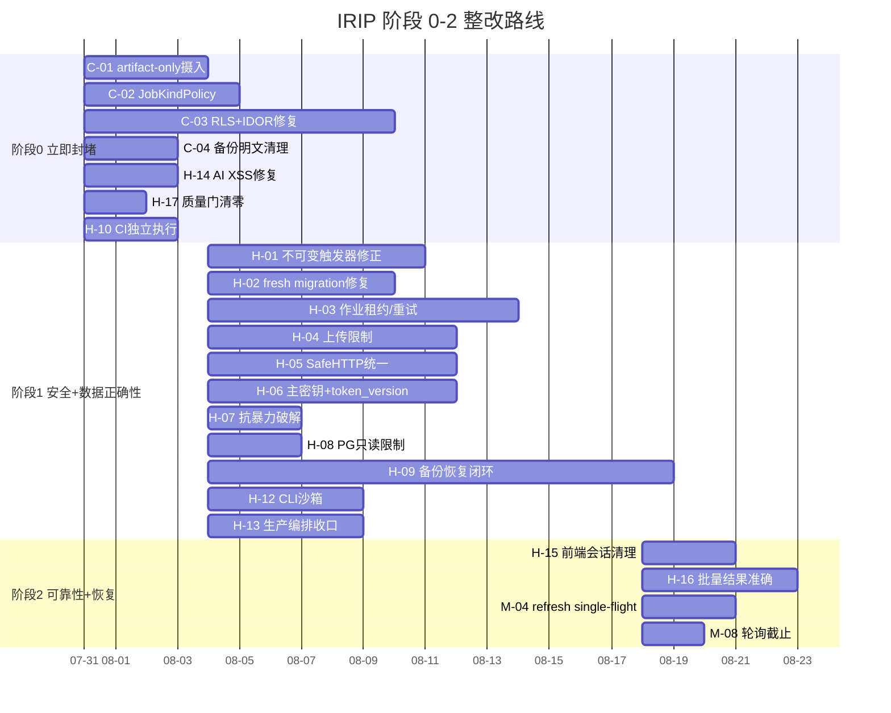

# IRIP 整改增量 PRD（阶段 0–2）

> **文档版本**：v1.0（增量）
> **创建日期**：2026-07-30
> **产品经理**：许清楚
> **审阅基线**：`main@915a295011c24771cdbf074c1bf2690f2db81751`
> **审计报告**：`/Users/shuipei/Desktop/snowSP/2026-07-30-main-comprehensive-code-audit.md`
> **前置文档**：`deliverables/remediation-prd-2026-07-27.md`（v1.0，24 项发现）
> **当前成熟度**：内部 Alpha / 功能原型
> **生产发布结论**：No-Go

---

## 1. 项目信息

| 项目 | 内容 |
|---|---|
| **Language** | 中文 |
| **Programming Language** | Python 3.12+ / TypeScript（现有技术栈不变） |
| **Project Name** | irip_remediation_phase_0_2 |
| **原始需求** | 基于 2026-07-30 综合代码审计报告（36 项风险：4 Critical / 17 High / 12 Medium / 3 Low），处理阶段 0（立即封堵）+ 阶段 1（安全+数据正确性）+ 阶段 2（可靠性+恢复能力）的所有发现项，将 IRIP 从"内部 Alpha / 功能原型"推进到生产准入门槛 |

### 1.1 与 2026-07-27 PRD 的关系

2026-07-27 的 PRD 已识别 24 项问题并实施部分整改。本次复核发现：多项控制未接入真实生产执行链，部分控制与领域生命周期冲突，新增实现引入 fresh migration 失败、字段漂移、测试 API 漂移等回归，CI 没有真正执行用于证明整改有效的测试。本次增量 PRD 不重复 07-27 的需求，而是针对 07-30 审计新发现和回归问题定义整改需求。

### 1.2 原始需求复述

2026-07-30 综合代码审计确认 `main` 分支存在 36 项风险。核心问题是"控制链断裂"——安全机制已编写但未闭环：授权未覆盖全部 Job kind，RLS 未进入真实事务，迁移与 ORM 不一致，安全测试在 CI 被 deselect，验收报告无条件写 PASS。用户要求处理阶段 0–2 共 22 项发现（7 项 P0 + 11 项 P1 安全 + 4 项 P1 可靠性），阶段 3–4 不在本 PRD 范围。

---

## 2. 产品目标

| 编号 | 目标 | 衡量标准 |
|---|---|---|
| **G-1** | 封堵所有可直接利用的攻击入口，确保不会误发布 | 阶段 0 全部 7 项 P0 验收通过；发布系统标记 No-Go；分支保护恢复 |
| **G-2** | 建立不可绕过的租户、权限和数据生命周期边界 | 跨组织/部门矩阵测试 100% 通过；fresh migration 从空卷启动成功；不可变触发器不阻断正常业务 |
| **G-3** | 作业、备份恢复和前端状态能真实表达结果 | 故障注入下无重复执行、无失败记成功；恢复演练输出可信 RPO/RTO；前端无跨账号数据残留 |

---

## 3. 用户故事

| 编号 | 角色 | 需求 | 价值 |
|---|---|---|---|
| **US-1** | 平台管理员 | 我希望普通用户无法通过通用 Job 接口提交备份/恢复等特权作业，这样我不会担心数据被恶意覆盖 | 消除最高破坏性越权风险 |
| **US-2** | 科研人员 | 我希望摄入预览只能读取我自己上传的 artifact，这样我的操作不会泄露服务器上的敏感文件 | 防止凭据和科研数据泄露 |
| **US-3** | 多组织管理员 | 我希望每个组织的数据在数据库层和应用层都被强制隔离，这样 A 组织用户绝不能读写 B 组织数据 | 数据安全合规 |
| **US-4** | 系统运维工程师 | 我希望加密备份完成后最终目录不残留任何明文，这样即使备份介质泄露也不会暴露科研数据 | 静态数据保密 |
| **US-5** | 科研人员 | 我希望 AI 助手消息不会执行恶意脚本，这样我使用 AI 分析时不会遭遇会话劫持 | 前端安全 |
| **US-6** | 系统运维工程师 | 我希望 CI 真正执行所有安全测试且验收报告反映真实结果，这样我能信任发布门禁 | 发布可信度 |
| **US-7** | 科研人员 | 我希望批量流程失败时界面准确显示失败而非"全部完成"，这样我不会把失败结果当成功使用 | 科研数据完整性 |
| **US-8** | 平台管理员 | 我希望登出后下一个用户看不到我的缓存和作业状态，这样共享浏览器不会泄露信息 | 账号隔离 |
| **US-9** | 系统运维工程师 | 我希望作业租约和重试机制可靠工作，这样长任务不会重复执行或永久卡住 | 系统可靠性 |
| **US-10** | 安全工程师 | 我希望生产环境拒绝弱密钥并以最小权限运行，这样系统不会被已知凭据接管 | 系统安全 |

---

## 4. 需求池（按优先级分层）

### 4.0 需求总览

| 优先级 | 阶段 | 数量 | 需求编号 |
|---|---|---:|---|
| **P0** | 阶段 0 立即封堵 | 7 | C-01, C-02, C-03, C-04, H-14, H-17, H-10 |
| **P1** | 阶段 1 安全+数据正确性 | 11 | H-01, H-02, H-03, H-04, H-05, H-06, H-07, H-08, H-09, H-12, H-13 |
| **P1** | 阶段 2 可靠性+恢复能力 | 4 | H-15, H-16, M-04, M-08 |
| **合计** | | **22** | |

### 4.1 P0 需求（Must Have — 立即封堵，7 项）

#### C-01 [P0] 摄入预览可读取进程有权访问的本地文件

| 项目 | 内容 |
|---|---|
| **需求 ID** | C-01 |
| **优先级** | P0 |
| **阶段** | 0 |
| **标题** | 摄入预览接口接受任意服务器路径，普通用户可读取 `/etc/passwd`、`/proc/self/environ`、`.env` 等敏感文件 |
| **问题描述** | `apps/api/routers/ingestions.py` 接受客户端传入任意 `file.path`，普通 `ingestion:write` 用户即可调用 preview；`packages/connectors/file_connectors.py` 直接打开路径，无导入根目录、realpath、工件归属或符号链接约束。攻击者可把 `/etc/passwd`、`/proc/self/environ`、挂载的 `.env` 声明为 CSV/JSON/XLSX，preview 将内容作为样本返回 |
| **整改要求** | 1. API 不再接受服务器路径，只接受本租户 `artifact_id`；2. 由 `ArtifactService` 校验 organization、department/scope、状态和媒体类型后流式读取；3. 如确需本地导入，使用独立、不可包含秘密的 import root，执行 `resolve()` + `is_relative_to()`，拒绝 symlink、设备文件、socket、`/proc`、`/sys`；4. API/Worker 镜像不挂载源码、Docker socket 和宿主秘密，使用非 root 只读文件系统；5. 对 CSV/XLSX/JSON/PDF 分别设置行数、页数、解压后大小、CPU 和时间预算 |
| **验收标准** | • 绝对路径、`../`、URL 编码穿越、symlink、`/proc`、`/etc` 全部返回 403/422；• 其他租户/部门 artifact 返回 404/403；• 只有本租户授权 artifact 可以预览；• 自动化测试证明 API/Worker 文件系统不含生产 secret |
| **关联文件** | `apps/api/routers/ingestions.py`、`packages/connectors/mapping.py`、`packages/connectors/file_connectors.py` |
| **建议角色** | 后端/安全 |

---

#### C-02 [P0] 通用 Job 接口可触发备份/恢复等特权作业

| 项目 | 内容 |
|---|---|
| **需求 ID** | C-02 |
| **优先级** | P0 |
| **阶段** | 0 |
| **标题** | 通用 Job 接口接受任意 `kind` 和 `payload`，普通 `job:submit` 权限即可触发备份、恢复等特权作业 |
| **问题描述** | `apps/api/routers/jobs.py` 接受任意 `kind` 和 `payload`，只要求 `job:submit`；`packages/auth/permissions.py` 给普通实验室成员该权限；Worker 注册 `backup`、`restore`、`audit_export` 且恢复处理器信任 payload 中的 `backup_dir`。普通用户可绕过治理路由，提交破坏性恢复、数据导出或高资源作业 |
| **整改要求** | 1. 建立服务端 `JobKindPolicy`：每个 kind 固定权限、输入 schema、队列、超时、资源预算、审计级别；2. 通用 submit 只允许明确的低风险 allowlist，特权 kind 必须通过专用命令 API；3. organization、actor、目标环境、备份 ID 由服务器生成，不接受客户端覆盖；4. Worker 执行前二次校验 job kind、提交人权限快照、审批记录和目标环境锁；5. restore 使用 backup ID，不接受任意路径，并要求维护窗口、双人审批、目标非空检查与审计 |
| **验收标准** | • 普通成员提交 `backup/restore/audit_export` 返回 403/422；• 篡改 org、actor、路径、队列字段无效；• Worker 对伪造数据库行也 fail closed；• 恢复演练只能在隔离目标执行 |
| **关联文件** | `apps/api/routers/jobs.py`、`packages/auth/permissions.py`、`apps/worker/tasks/__init__.py`、`apps/api/routers/backups.py` |
| **建议角色** | 后端/安全 |

---

#### C-03 [P0] 默认运行链路无法依赖 RLS，并叠加多处跨租户/跨部门 IDOR

| 项目 | 内容 |
|---|---|
| **需求 ID** | C-03 |
| **优先级** | P0 |
| **阶段** | 0 |
| **标题** | RLS 策略依赖 `app.current_org_id` GUC 但从未在事务中设置；API/Worker 使用 owner/superuser 可绕过 RLS；多处 DML 只按全局 ID 形成跨租户 IDOR |
| **问题描述** | `migrations/versions/0032_rls_policies.py` 的策略依赖 `app.current_org_id`；`packages/common/database.py` 从未在事务设置该 GUC；Compose 的 API/Worker 使用 PostgreSQL 初始化用户（owner/superuser）可绕过 RLS；部门、设备、流程、参数 reject、组件 activate/delete 存在只按全局 ID 的 DML |
| **整改要求** | 1. 定义可信 `Principal`，包含 user、organization、department、roles、token_version；2. API/Worker 使用非 owner、非 superuser 的 `irip_runtime` 账号，迁移只使用 `irip_migrate`；3. 每个事务开始时 `SET LOCAL app.current_org_id`，缺失时 fail closed；4. 所有 repository 方法强制以 `(organization_id, resource_id)` 或显式 `QueryScope` 查询；5. 部门树权限由统一 policy 解析，不信任客户端提交的新 department；6. 逐表确认 RLS 是否需要 `FORCE ROW LEVEL SECURITY`，并用真实 runtime role 测试；7. 禁止路由层直接拼 ORM 查询绕过 repository/scope |
| **验收标准** | • A/B 两组织、父/子/兄弟部门的列表、详情、更新、归档、删除、审批矩阵全部通过；• 捕获 SQL 证明租户表显式含 organization 条件；• runtime 角色未设置 GUC 时查询返回空或失败，绝不返回全量；• owner/superuser 不用于 API、Worker、Scheduler |
| **关联文件** | `migrations/versions/0032_rls_policies.py`、`packages/common/database.py`、`compose.yaml`、`migrations/versions/0034_db_roles.py`、`packages/departments/repository.py`、`packages/departments/service.py`、`apps/api/routers/equipment.py`、`packages/equipment/repository.py`、`apps/api/routers/flows.py`、`packages/parameters/service.py`、`packages/components/registry.py` |
| **建议角色** | 安全 + 后端 + DBA |

---

#### C-04 [P0] 加密备份仍在最终目录保留完整明文

| 项目 | 内容 |
|---|---|
| **需求 ID** | C-04 |
| **优先级** | P0 |
| **阶段** | 0 |
| **标题** | 备份脚本将 `database.dump` 和 `objects/` 写入最终挂载目录，只加密 `backup.tar` 但不删除原始明文 |
| **问题描述** | `deployments/compose/backup.py` 将 `database.dump` 和 `objects/` 写入最终挂载目录；只加密并删除 `backup.tar`，没有删除原始 dump 与对象目录。即使配置 `IRIP_BACKUP_AGE_RECIPIENT`，宿主备份目录仍包含完整科研数据明文 |
| **整改要求** | 1. 在权限为 0700 的临时目录中生成 dump、对象和 manifest；2. 完成完整性校验和 age 加密后，把唯一加密制品原子移动到最终目录；3. 成功和失败路径都可靠清理临时明文；4. 最终 manifest 若需公开，只保留不敏感字段并进行签名/MAC；5. 备份目录、日志、临时卷和 crash dump 纳入数据保留策略 |
| **验收标准** | • 加密备份完成后最终目录只包含 `.age` 及允许公开的最小元数据；• 自动扫描不存在 `database.dump`、`objects/` 或明文 tar；• 注入加密失败、磁盘满、进程终止后也无残留明文；• 恢复前验证签名、哈希和预期对象集合 |
| **关联文件** | `deployments/compose/backup.py` |
| **建议角色** | SRE/后端 |

---

#### H-14 [P0] AI 消息渲染存在持久型 DOM XSS

| 项目 | 内容 |
|---|---|
| **需求 ID** | H-14 |
| **优先级** | P0 |
| **阶段** | 0 |
| **标题** | AI 消息用正则拼 HTML 未整体转义/净化，最终 `dangerouslySetInnerHTML`，存在持久型 DOM XSS |
| **问题描述** | `apps/web/src/assistant/MessageThread.tsx` 用正则拼 HTML，未整体转义/净化，最终 `dangerouslySetInnerHTML`；模型和工具输出会持久化。模型提示注入或恶意数据可执行同源脚本，读取页面数据、发起同源请求并劫持会话 |
| **整改要求** | 1. 改用现有 `react-markdown`，默认禁止原始 HTML；2. 如必须支持 HTML 则严格 `rehype-sanitize` allowlist；3. 图表数据独立解析；4. CSP 禁止 inline script/event handler |
| **验收标准** | • `img onerror`、`svg onload`、`javascript:`、畸形 Markdown/KaTeX 测试均不执行脚本；• DOM 无事件属性 |
| **关联文件** | `apps/web/src/assistant/MessageThread.tsx` |
| **建议角色** | 前端/安全 |

---

#### H-17 [P0] 当前质量门已经确认失败，且存在真实运行时缺陷

| 项目 | 内容 |
|---|---|
| **需求 ID** | H-17 |
| **优先级** | P0 |
| **阶段** | 0 |
| **标题** | Ruff 7 项失败 + 3 文件未格式化；Mypy 266 项错误含真实运行时风险；CI 覆盖率 25% 低于 30% 门槛 |
| **问题描述** | Ruff 7 项失败含 `apps/api/routers/facts.py:1054` 未定义 `run`；`apps/api/routers/facts.py` 异常被大范围 catch 后静默丢失 task info；Mypy 266 项错误包含接口签名不一致、None callable、缺字段等真实风险；CI unit 覆盖率 25% 低于 30% |
| **整改要求** | 1. 立即恢复 required checks；2. 先清零 F/E/undefined name 和真实类型冲突；3. 第三方 stub 与业务错误分开 baseline；4. 禁止新增债务；5. 缩小 catch 范围并使用结构化错误 |
| **验收标准** | • Ruff/format 0；• 关键包 Mypy 0；• 覆盖率达到门槛；• `apps/api/routers/facts.py` fallback 路径有回归测试并返回正确 operator |
| **关联文件** | `apps/api/routers/facts.py`、`pyproject.toml`、`.github/workflows/ci.yml` |
| **建议角色** | 工程效能/后端 |

---

#### H-10 [P0] CI、发布门和验收报告组成不可信证据链

| 项目 | 内容 |
|---|---|
| **需求 ID** | H-10 |
| **优先级** | P0 |
| **阶段** | 0 |
| **标题** | CI 统一加 `-m integration` 导致 security 146 项全部 deselect、integration 85/133 项 deselect；验收报告硬编码 PASS；发布门脚本顺序错误 |
| **问题描述** | `.github/workflows/ci.yml` 统一加 `-m integration`，导致 security 146 项全部 deselect、integration 85/133 项 deselect；`scripts/generate-acceptance.py` 硬编码 PASS；报告 job 不依赖质量 jobs；`scripts/release-gate.sh` 在启动基础设施前跑集成/安全/恢复测试，若缺少依赖导致用例 skip 但 pytest 返回 0，仍会记录"100% pass" |
| **整改要求** | 1. 每类目录独立执行；2. 零收集/数量下降/非预期 skip 失败；3. 先启动环境和迁移；4. 报告只消费 JUnit/coverage/lint/build 工件并设置 `needs`；5. 缺证据为 UNKNOWN/FAIL |
| **验收标准** | • 故意制造安全失败、迁移失败或 collected 数下降，CI 与验收报告必须失败；• 报告可追溯 commit、workflow、原始工件 |
| **关联文件** | `.github/workflows/ci.yml`、`scripts/generate-acceptance.py`、`scripts/release-gate.sh` |
| **建议角色** | 工程效能/平台 |

---

### 4.2 P1 需求 — 阶段 1 安全+数据正确性（11 项）

#### H-01 [P1] 不可变触发器保护错表，阻断正常业务状态机

| 项目 | 内容 |
|---|---|
| **需求 ID** | H-01 |
| **优先级** | P1 |
| **阶段** | 1 |
| **标题** | 不可变触发器禁止更新 `flow_node_execution` 和 `evidence_set`，但这两个表必须更新状态；真正不可变的是 `EvidenceSetVersion` |
| **问题描述** | `migrations/versions/0033_immutable_tables.py` 禁止更新 `flow_node_execution` 和 `evidence_set`；而 `packages/components/flow_runtime.py` 必须把 pending 更新为 running/succeeded，`packages/provenance/evidence.py` 必须更新证据集状态；真正不可变的是 `EvidenceSetVersion`。迁移生效后流程执行和 evidence freeze 可能事务回滚，核心证据链不可用 |
| **整改要求** | 1. 把触发器移到版本/事件表；2. 稳定身份表允许受控状态迁移；3. 节点执行若要求 append-only，应改为状态事件表，而不是更新同一行 |
| **验收标准** | • runtime role 可完整执行流程和 freeze；• 版本快照、审计和事实修订仍不能 UPDATE/DELETE |
| **关联文件** | `migrations/versions/0033_immutable_tables.py`、`packages/components/flow_runtime.py`、`packages/provenance/evidence.py`、`packages/provenance/entities.py` |
| **建议角色** | DBA + 后端 |

---

#### H-02 [P1] fresh migration、ORM schema 与启动顺序均不可靠

| 项目 | 内容 |
|---|---|
| **需求 ID** | H-02 |
| **优先级** | P1 |
| **阶段** | 1 |
| **标题** | 全新数据库 `alembic upgrade head` 在 0034 因 `organization` 不存在失败；`component.active_version_id` 无迁移；env.py 未完整导入模型；启动顺序不等待 migration |
| **问题描述** | `migrations/versions/0034_db_roles.py` 对尚未由迁移创建的 `organization` 授权，fresh DB 实测失败；`packages/components/registry.py` 的 `component.active_version_id` 无迁移；`migrations/env.py` 未完整导入模型；`compose.yaml` 业务服务只等基础设施，不等 migration one-shot 完成；API healthcheck 使用始终成功的 liveness |
| **整改要求** | 1. organization 正式进入 Alembic；2. 补齐字段迁移和 metadata 模型注册；3. 独立 migration 服务，API/Worker 依赖其成功完成；4. 入口使用 readiness |
| **验收标准** | • 从空卷启动 100 次均成功；• `alembic check` 无漂移；• 迁移失败时业务服务不 ready、不消费任务 |
| **关联文件** | `migrations/versions/0034_db_roles.py`、`packages/components/registry.py`、`migrations/env.py`、`compose.yaml`、`apps/api/routers/health.py` |
| **建议角色** | DBA + 平台/SRE |

---

#### H-03 [P1] 作业租约、重试和异步适配造成重复执行、卡死或失败记成功

| 项目 | 内容 |
|---|---|
| **需求 ID** | H-03 |
| **优先级** | P1 |
| **阶段** | 1 |
| **标题** | 租约定义了但 Executor 不启动心跳；重试只改状态不重新投递；异步 handler 内部 `asyncio.run` 异常被吞导致失败记成功 |
| **问题描述** | `packages/jobs/worker.py` 定义 30 秒租约和 heartbeat，但 Executor 不启动心跳；`packages/jobs/repository.py` 和 `apps/worker/celery_app.py` 只把状态改 queued，不重新投递；`apps/worker/tasks/__init__.py` 在异步 handler 调用内部 `asyncio.run`，异常又作为普通字典返回，Executor 会提交 succeeded。长任务可能并发重复执行；重试永久卡住；实际失败被报告为成功 |
| **整改要求** | 1. 唯一 lease owner + fencing token；2. 执行期间独立心跳；3. reap/retry 与 outbox 重新投递同事务；4. 全部 handler 原生 async；5. 失败必须 raise，由 Executor 统一提交状态 |
| **验收标准** | • 超过两个 TTL 的任务只执行一次；• 杀死 Worker 后可恢复；• 瞬态失败真实重试；• 任何领域失败最终状态均为 failed/retry_wait |
| **关联文件** | `packages/jobs/worker.py`、`packages/jobs/repository.py`、`apps/worker/celery_app.py`、`apps/worker/tasks/__init__.py` |
| **建议角色** | 后端/平台 |

---

#### H-04 [P1] 上传限制可绕过，并存在对象存储与 API 内存耗尽

| 项目 | 内容 |
|---|---|
| **需求 ID** | H-04 |
| **优先级** | P1 |
| **阶段** | 1 |
| **标题** | 上传只信声明大小，签名无实际大小条件；complete 未先 HEAD；下载整对象读入内存 |
| **问题描述** | `apps/api/routers/uploads.py` 只信声明大小；`packages/common/s3_repository.py` 的签名没有实际大小条件；complete 未先 HEAD；`packages/common/artifacts.py` 和 `packages/common/s3_repository.py` 会整对象读入内存。攻击者可声明 1 字节、实际上传数 GB；临时对象占满存储，complete 触发 API OOM |
| **整改要求** | 1. 带 `content-length-range` 的 POST policy 或受控 multipart；2. HEAD 验证实际大小和类型；3. 有界流式 hash/copy；4. 上传会话绑定 tenant/user；5. 临时对象 TTL 与租户配额 |
| **验收标准** | • 超限对象在读取正文前拒绝；• chunked/multipart 均受限；• 临时对象自动清理；• RSS 不随对象大小线性增长 |
| **关联文件** | `apps/api/routers/uploads.py`、`packages/common/s3_repository.py`、`packages/common/artifacts.py` |
| **建议角色** | 后端/安全 |

---

#### H-05 [P1] SafeHTTP 限额失效且存在 DNS rebinding 窗口

| 项目 | 内容 |
|---|---|
| **需求 ID** | H-05 |
| **优先级** | P1 |
| **阶段** | 1 |
| **标题** | SafeHTTP 使用缓冲请求，超限异常被吞；DNS 校验后 httpx 再解析；多处直接使用 httpx 绕过统一客户端 |
| **问题描述** | `packages/common/safe_http.py` 使用缓冲请求；超限异常被同一个 `except ValueError` 吞掉；DNS 校验后 httpx 再解析；`apps/api/routers/component_preview.py`、`packages/ai/openai_compatible.py`、`packages/ai/service.py`、`packages/plugins/converters/llm_converter/converter.py` 仍直接使用 httpx。大响应导致内存耗尽；DNS rebinding、重定向或绕过统一客户端可访问内网元数据/管理面 |
| **整改要求** | 1. 统一 egress client/代理；2. 流式累计字节；3. 固定已验证 IP 或在连接层校验；4. 每次重定向重检；5. 代码规则禁止直接外呼 |
| **验收标准** | • 私网、链路本地、IPv6、本地 DNS、重定向、rebinding、chunked 超限测试全部阻断 |
| **关联文件** | `packages/common/safe_http.py`、`apps/api/routers/component_preview.py`、`packages/ai/openai_compatible.py`、`packages/ai/service.py`、`packages/plugins/converters/llm_converter/converter.py` |
| **建议角色** | 安全 + 后端 |

---

#### H-06 [P1] 主密钥 fail-open，密钥撤销和账号禁用不能及时生效

| 项目 | 内容 |
|---|---|
| **需求 ID** | H-06 |
| **优先级** | P1 |
| **阶段** | 1 |
| **标题** | 允许空 master key 且每次随机生成；解密失败回退密文；不复核用户 active/当前角色；禁用不撤销 refresh family |
| **问题描述** | `compose.yaml` 允许空 master key；`packages/common/crypto.py` 每次随机生成；`apps/api/routers/ai_config.py` 每次新建 crypto 且解密失败回退密文；`apps/api/dependencies/auth.py` 不复核用户 active/当前角色，`packages/auth/service.py` refresh 不拒绝 disabled，禁用不撤销 refresh family。凭据重启后不可恢复，密文可能被作为 API key 外发；被禁用或降权用户仍使用旧权限并持续刷新 |
| **整改要求** | 1. 非测试环境缺 key 拒绝启动；2. 单例版本化 crypto/KMS；3. 删除密文回退；4. JWT 加 token_version，禁用/改密/改角色时撤销全部会话；5. 每次认证至少复核 active 和版本 |
| **验收标准** | • 重启可解密；• 缺/错 key 启动失败；• 禁用或降权后 access/refresh 立即失效 |
| **关联文件** | `compose.yaml`、`packages/common/crypto.py`、`apps/api/routers/ai_config.py`、`apps/api/dependencies/auth.py`、`packages/auth/service.py` |
| **建议角色** | 安全 + 后端 |

---

#### H-07 [P1] 登录缺少抗暴力破解与恒定成本处理

| 项目 | 内容 |
|---|---|
| **需求 ID** | H-07 |
| **优先级** | P1 |
| **阶段** | 1 |
| **标题** | 登录无长度上限和速率限制；不存在用户直接返回，存在用户才运行 Argon2；无 rate limiter |
| **问题描述** | `apps/api/routers/auth.py` 无长度上限和速率限制；`packages/auth/backends.py` 不存在用户直接返回，存在用户才运行 Argon2；`apps/api/main.py` 无 rate limiter。密码喷洒、凭据填充、Argon2 CPU 耗尽和时序枚举 |
| **整改要求** | 1. 边缘和应用层 IP+账号双维限流；2. 不存在用户执行 dummy Argon2；3. 密码/邮箱长度上限；4. 退避、审计和告警 |
| **验收标准** | • 超阈值返回 429；• 两类失败时延统计接近；• 压测不突破 CPU 预算 |
| **关联文件** | `apps/api/routers/auth.py`、`packages/auth/backends.py`、`apps/api/main.py` |
| **建议角色** | 安全 + 后端 |

---

#### H-08 [P1] PostgreSQL 数据源查询未真正限制为只读

| 项目 | 内容 |
|---|---|
| **需求 ID** | H-08 |
| **优先级** | P1 |
| **阶段** | 1 |
| **标题** | 摄入接口接收任意 query 原样执行，无 read-only transaction、statement timeout 和可靠 SQL 单句策略 |
| **问题描述** | `apps/api/routers/ingestions.py` 接收任意 query；`packages/connectors/postgres_connector.py` 原样执行，只用字符串包裹 LIMIT，没有 read-only transaction、statement timeout 和可靠 SQL 单句策略。高权限 DSN 可执行写操作、副作用函数和长查询，破坏外部科研数据库或拖垮 API |
| **整改要求** | 1. 仅允许专用只读账号；2. 事务 `READ ONLY`；3. statement/lock/idle timeout；4. 可靠解析单条 SELECT；5. 连接数、行数、字节和时间配额 |
| **验收标准** | • INSERT/DELETE、修改 CTE、副作用函数、多语句和 `pg_sleep` 被拒绝或超时 |
| **关联文件** | `apps/api/routers/ingestions.py`、`packages/connectors/postgres_connector.py` |
| **建议角色** | 安全 + 后端 |

---

#### H-09 [P1] 备份恢复执行面不闭环，且大对象/部分失败不安全

| 项目 | 内容 |
|---|---|
| **需求 ID** | H-09 |
| **优先级** | P1 |
| **阶段** | 1 |
| **标题** | 备份忽略 API payload、restore 信任路径；普通 Worker 未挂载持久备份目录；恢复先覆盖 DB 再传对象；冒烟失败只 warning；大对象读内存 |
| **问题描述** | `apps/worker/tasks/__init__.py` 的 backup 忽略 API payload、restore 信任路径；普通 Worker 未挂载持久备份目录；`deployments/compose/restore.py` 先覆盖数据库再传对象；冒烟失败只 warning；S3 和备份恢复多处整对象读内存。API 触发的备份可能随容器消失，恢复常规路径失败；部分恢复污染目标；大文件导致 OOM；关键查询失败仍可能报告成功 |
| **整改要求** | 1. 独立运维队列/runner 和持久卷；2. 只用已签名 backup ID；3. 恢复到新 DB/bucket，完整校验后切换；4. 流式传输；5. 关键冒烟失败非零退出 |
| **验收标准** | • 跨容器重启可恢复；• 大于内存的对象 RSS 受控；• 注入任一步骤失败不会污染当前生产目标 |
| **关联文件** | `apps/worker/tasks/__init__.py`、`deployments/compose/restore.py` |
| **建议角色** | SRE/DBA + 后端 |

---

#### H-12 [P1] CLI 组件沙箱未接入生产

| 项目 | 内容 |
|---|---|
| **需求 ID** | H-12 |
| **优先级** | P1 |
| **阶段** | 1 |
| **标题** | CLI 组件默认 `IRIP_SAFE_CLI_MODE=false` 并在 Worker 容器直接执行，无 OS 级隔离 |
| **问题描述** | `packages/components/runner.py` 默认 `IRIP_SAFE_CLI_MODE=false` 并在 Worker 容器直接执行；Compose 不设置安全模式，也未接通独立沙箱执行服务。不可信组件命令可访问 Worker 文件系统、网络、环境变量和进程权限 |
| **整改要求** | 1. 生产强制 fail-closed 沙箱；2. 独立执行服务或受控容器运行时；3. 固定 digest、非 root、无网络、只读 FS、cap drop、seccomp、CPU/内存/PID/输出限制；4. 不要给主 Worker 高权限 Docker socket |
| **验收标准** | • 恶意组件无法读取环境、访问网络/宿主文件或突破资源限额；• 沙箱不可用时任务拒绝执行 |
| **关联文件** | `packages/components/runner.py`、`compose.yaml` |
| **建议角色** | 安全 + 平台 |

---

#### H-13 [P1] 生产编排暴露内部服务且 TLS/Cookie 基线不足

| 项目 | 内容 |
|---|---|
| **需求 ID** | H-13 |
| **优先级** | P1 |
| **阶段** | 1 |
| **标题** | PostgreSQL、Redis、MinIO、API 绑定宿主端口；refresh cookie `secure=False`；Nginx 只监听 HTTP；容器缺少统一安全基线 |
| **问题描述** | `compose.yaml` 将 PostgreSQL、无认证 Redis、MinIO、API 绑定宿主端口；`apps/api/routers/auth.py` refresh cookie `secure=False` 且 path `/`；Nginx 只监听 HTTP；容器缺少统一 `cap_drop`、`no-new-privileges`、只读根文件系统和资源限制。宿主防火墙配置不严时，broker/数据库/对象存储暴露；网络监听可窃取刷新会话；容器失陷横向移动面大 |
| **整改要求** | 1. 只暴露 443；2. 内部服务使用 internal network；3. Redis ACL/TLS；4. 生产 Secure Cookie 和最小 path；5. TLS/HSTS；6. 统一容器安全与资源基线 |
| **验收标准** | • 外部扫描仅见批准入口；• Set-Cookie 含 Secure/HttpOnly/SameSite；• 容器策略扫描通过 |
| **关联文件** | `compose.yaml`、`apps/api/routers/auth.py`、Nginx 配置 |
| **建议角色** | SRE/安全 |

---

### 4.3 P1 需求 — 阶段 2 可靠性+恢复能力（4 项）

#### H-15 [P1] 登出后前端缓存和作业状态可跨账号残留

| 项目 | 内容 |
|---|---|
| **需求 ID** | H-15 |
| **优先级** | P1 |
| **阶段** | 2 |
| **标题** | 登出不清缓存；全局 localStorage key 不重置；Job 加载失败保留旧状态 |
| **问题描述** | `apps/web/src/main.tsx` 复用全局 QueryClient；`apps/web/src/auth/AuthProvider.tsx` 登出不清缓存；`apps/web/src/jobs/useJobStore.ts` 使用全局 localStorage key 且不重置；Job 加载失败保留旧状态。共享浏览器 A 登出、B 登录后，B 可能看到 A 的缓存或作业详情 |
| **整改要求** | 1. 统一 `clearSessionState()`；2. 登出、refresh 失败、账号切换时原子清 Query、Zustand 和用户级持久化；3. query/storage key 含 tenant+user；4. 加载失败清旧数据 |
| **验收标准** | • A/B 连续登录 E2E 中，B 的 DOM、缓存、store、localStorage 均无 A 数据 |
| **关联文件** | `apps/web/src/main.tsx`、`apps/web/src/auth/AuthProvider.tsx`、`apps/web/src/jobs/useJobStore.ts` |
| **建议角色** | 前端 |

---

#### H-16 [P1] 批量流程失败、取消或超时仍显示"全部完成"

| 项目 | 内容 |
|---|---|
| **需求 ID** | H-16 |
| **优先级** | P1 |
| **阶段** | 2 |
| **标题** | 批量流程把 failed/cancelled 也当 done，轮询耗尽不记超时，最终无条件提示 N 个文件完成 |
| **问题描述** | `apps/web/src/components/FlowDetail.tsx` 把 failed/cancelled 也当 done，轮询耗尽不记超时，最终无条件提示 N 个文件完成。研究人员会把失败结果当成功，直接影响科研数据完整性和判断 |
| **整改要求** | 1. 逐项维护 succeeded/failed/cancelled/timed_out；2. 仅 succeeded 计成功；3. 展示失败原因与可重试状态；4. 长期改为服务端批处理作业 |
| **验收标准** | • 混合结果测试准确汇总；• 任何失败都不显示全成功 |
| **关联文件** | `apps/web/src/components/FlowDetail.tsx` |
| **建议角色** | 前端 |

---

#### M-04 [P1] Token refresh 没有 single-flight

| 项目 | 内容 |
|---|---|
| **需求 ID** | M-04 |
| **优先级** | P1 |
| **阶段** | 2 |
| **标题** | 并发 401 直接失败；refresh 失败不原子清 user/cache |
| **问题描述** | `apps/web/src/api/client.ts` 并发 401 直接失败，refresh 失败不原子清 user/cache：`apps/web/src/auth/AuthProvider.tsx`。多个并行请求收到 401 时各自触发 refresh，导致 refresh 互相竞争或失效 |
| **整改要求** | 1. 统一 refresh coordinator；2. N 个并行 401 只刷新一次；3. 失败原子清会话并跳登录 |
| **验收标准** | • N 个并行 401 只触发一次 refresh；• refresh 失败后用户被原子登出并跳转登录页 |
| **关联文件** | `apps/web/src/api/client.ts`、`apps/web/src/auth/AuthProvider.tsx` |
| **建议角色** | 前端 |

---

#### M-08 [P1] 摄入轮询无截止

| 项目 | 内容 |
|---|---|
| **需求 ID** | M-08 |
| **优先级** | P1 |
| **阶段** | 2 |
| **标题** | 摄入轮询固定每 2 秒、吞错且无截止 |
| **问题描述** | `apps/web/src/ingestions/IngestionWizard.tsx` 摄入轮询固定每 2 秒、吞错且无截止。断网/401/500 时持续轮询，浪费资源且用户体验差 |
| **整改要求** | 1. 退避；2. 连续失败阈值；3. 总超时；4. 可见重试；5. 断网/401/500 时按策略停止 |
| **验收标准** | • 连续失败达到阈值后停止轮询并提示用户；• 总超时后停止并显示超时状态；• 401 时停止轮询并跳转登录 |
| **关联文件** | `apps/web/src/ingestions/IngestionWizard.tsx` |
| **建议角色** | 前端 |

---

## 5. 整改路线

### 5.1 阶段 0：立即封堵（24–72 小时）

**目标**：停止可直接利用的入口，确保不会误发布。

| 序号 | 整改项 | 对应需求 | 预期工时 | 退出标准 |
|---|---|---|---|---|
| 0-1 | 禁止生产接入真实数据，冻结发布 | 全局 | 0.5d | 发布系统标记 No-Go，分支保护恢复 |
| 0-2 | 关闭任意 file.path 摄入，只允许 artifact | C-01 | 2–4d | C-01 全部恶意路径测试通过 |
| 0-3 | Job kind 改 allowlist，禁普通用户提交特权作业 | C-02 | 3–5d | C-02 403/422 与 Worker 二次校验通过 |
| 0-4 | DB 账号分离、tenant GUC、RLS/IDOR 修复 | C-03 | 8–15d | C-03 跨组织矩阵 100% 通过 |
| 0-5 | 加密备份临时目录与明文清理 | C-04 | 2–4d | C-04 最终目录无任何明文 |
| 0-6 | 前端 AI 消息禁用原始 HTML | H-14 | 2–3d | H-14 XSS 载荷回归通过并上线 CSP 基线 |
| 0-7 | 清零 Ruff/Mypy 阻断项，恢复 required checks | H-17 | 1–2d | H-17 Ruff F/E=0，关键 Mypy=0 |
| 0-8 | CI 独立执行安全测试，停发硬编码 PASS | H-10 | 2–3d | H-10 失败测试无法生成 PASS 报告 |
| 0-9 | 生产外部端口临时收口，Redis 不得公网可达 | C-03/H-13 | 1d | 外部扫描只见批准入口 |

**阶段 0 退出条件**：
- ✅ 4 个 Critical 全部关闭
- ✅ H-14 XSS 回归通过
- ✅ H-17 质量门阻断项清零
- ✅ H-10 CI 安全测试真实执行
- ✅ 发布系统标记 No-Go

**预计总工时**：约 20–35 人日

---

### 5.2 阶段 1：安全与数据正确性（1–2 周）

**目标**：建立不可绕过的租户、权限和数据生命周期边界。

| 序号 | 整改项 | 对应需求 | 预期工时 | 退出标准 |
|---|---|---|---|---|
| 1-1 | 修正不可变表清单与流程/证据生命周期 | H-01 | 4–7d | H-01 runtime role 可执行流程和 freeze |
| 1-2 | 正式迁移 organization、active_version_id 和 schema drift | H-02 | 3–6d | H-02 从空卷启动 100 次均成功 |
| 1-3 | 作业租约/重试/异步适配闭环 | H-03 | 6–10d | H-03 超过两个 TTL 只执行一次 |
| 1-4 | 上传会话、流式 hash、配额和清理 | H-04 | 5–8d | H-04 超限对象在读取正文前拒绝 |
| 1-5 | SafeHTTP/egress 统一及 SSRF 测试 | H-05 | 5–8d | H-05 私网/rebinding 测试全部阻断 |
| 1-6 | KMS/master key 与 token_version | H-06 | 5–8d | H-06 重启可解密，禁用立即失效 |
| 1-7 | 登录抗暴力破解与恒定成本 | H-07 | 2–3d | H-07 超阈值返回 429 |
| 1-8 | PostgreSQL 数据源只读限制 | H-08 | 2–3d | H-08 写操作和 pg_sleep 被拒绝 |
| 1-9 | 备份恢复隔离目标、流式和演练 | H-09 | 8–15d | H-09 跨容器重启可恢复 |
| 1-10 | CLI 组件沙箱化 | H-12 | 3–5d | H-12 恶意组件无法突破 |
| 1-11 | 生产编排收口、TLS/Cookie/容器安全基线 | H-13 | 3–5d | H-13 外部扫描仅见 443 |

**阶段 1 退出条件**：
- ✅ 4 个 Critical 关闭
- ✅ 跨租户/部门矩阵 100% 通过
- ✅ fresh migration 成功
- ✅ 无核心业务被不可变触发器阻断
- ✅ token_version/账号 active/角色撤销闭环
- ✅ 上传、SSRF、PostgreSQL connector、CLI sandbox 统一 fail closed
- ✅ 备份/恢复只接受签名 backup ID 和隔离目标

**预计总工时**：约 46–78 人日

---

### 5.3 阶段 2：可靠性与恢复能力（2–4 周）

**目标**：作业、备份恢复和前端状态能够真实表达结果。

| 序号 | 整改项 | 对应需求 | 预期工时 | 退出标准 |
|---|---|---|---|---|
| 2-1 | 前端会话原子清理与跨账号隔离 | H-15 | 2–3d | H-15 A/B 连续登录 E2E 无残留 |
| 2-2 | 批量执行真实结果与统一错误 UI | H-16 | 3–5d | H-16 混合结果准确汇总 |
| 2-3 | Token refresh single-flight | M-04 | 2–3d | M-04 N 个并行 401 只刷新一次 |
| 2-4 | 摄入轮询退避与截止 | M-08 | 1–2d | M-08 连续失败阈值停止 |

**阶段 2 退出条件**：
- ✅ 故障注入下无重复副作用、无失败记成功
- ✅ 恢复演练通过并输出可信 RPO/RTO
- ✅ 前端无跨账号数据残留
- ✅ 批量流程准确区分 success/fail/cancel/timeout
- ✅ Token refresh 无竞争
- ✅ 轮询有截止和退避

**预计总工时**：约 8–13 人日

---

### 5.4 整改路线总览

---

## 6. 需求优先级总览

| 优先级 | 阶段 | 数量 | 需求编号 |
|---|---|---:|---|
| **P0** | 阶段 0 立即封堵 | 7 | C-01, C-02, C-03, C-04, H-14, H-17, H-10 |
| **P1** | 阶段 1 安全+数据正确性 | 11 | H-01, H-02, H-03, H-04, H-05, H-06, H-07, H-08, H-09, H-12, H-13 |
| **P1** | 阶段 2 可靠性+恢复能力 | 4 | H-15, H-16, M-04, M-08 |
| **合计** | | **22** | |

---

## 7. 待确认问题

以下问题需要用户/技术负责人确认后才能确定具体实施方案：

### 7.1 安全架构决策

| 编号 | 问题 | 选项 | 影响 | 建议 |
|---|---|---|---|---|
| **Q-1** | C-03: 是否启用 `FORCE ROW LEVEL SECURITY`？ | A) 全表 FORCE RLS / B) 仅敏感表 | A 防护最强但运维复杂；B 灵活但有遗漏风险 | 建议 A，作为深度防御第二道防线 |
| **Q-2** | C-03: 数据库账号分离方案？ | A) migrate/runtime/audit 三类 / B) owner + runtime 两类 | A 权限最细粒度；B 简化运维 | 建议 A，审计表需独立写入路径 |
| **Q-3** | H-06: 密钥管理方案选择 | A) 外部 Secret Manager（AWS SM/Vault）/ B) envelope encryption（DB 存密文+key version） | A 安全性最高但引入外部依赖；B 自主可控但需自行管理 rotation | 生产建议 A，过渡期可用 B |
| **Q-4** | H-12: CLI 组件沙箱方案 | A) 独立沙箱容器（无网络、只读FS、cap drop）/ B) 主 Worker 容器内限制 | A 安全性最高但增加调度复杂度；B 简单但爆炸半径大 | 建议 A，安全敏感场景必须 |
| **Q-5** | H-09: 备份恢复目标策略 | A) 恢复到新 DB/bucket 校验后切换 / B) 原地恢复 + 维护窗口 | A 最安全但需要资源冗余；B 快但风险高 | 建议 A，生产环境必须 |

### 7.2 数据正确性决策

| 编号 | 问题 | 选项 | 影响 | 建议 |
|---|---|---|---|---|
| **Q-6** | H-01: 节点执行是否改为 append-only 事件表？ | A) 改为状态事件表（append-only）/ B) 保留行更新但加受控状态迁移 | A 完全不可变但改动大；B 改动小但需精确控制允许的状态迁移 | 建议 A，若领域模型允许；否则 B |
| **Q-7** | H-02: `component.active_version_id` 字段的迁移策略 | A) 新增迁移补字段 / B) 从 ORM 移除改用查询 | A 保留现有设计；B 改变数据访问模式 | 建议 A，补齐迁移并同步 ORM |
| **Q-8** | H-08: PostgreSQL 数据源是否支持非 SELECT 查询？ | A) 严格只读 SELECT only / B) 允许白名单函数 | A 最安全；B 灵活但有风险 | 建议 A，科研数据源不应有写权限 |

### 7.3 可靠性决策

| 编号 | 问题 | 选项 | 影响 | 建议 |
|---|---|---|---|---|
| **Q-9** | H-03: 作业重试策略 | A) 固定次数+指数退避 / B) 基于错误类型分级重试 | A 简单可控；B 精细但复杂 | 建议 B，瞬态错误重试，永久错误直接失败 |
| **Q-10** | H-16: 批量流程长期方案 | A) 保持前端轮询但准确显示 / B) 改为服务端批处理作业 | A 快速修复；B 架构更优但改动大 | 短期 A，长期 B |
| **Q-11** | M-08: 摄入轮询截止时间 | A) 固定超时（如 5 分钟）/ B) 可配置+服务端预估 | A 简单；B 体验更好 | 建议 A 作为基线，后续优化 B |

### 7.4 工程决策

| 编号 | 问题 | 选项 | 影响 | 建议 |
|---|---|---|---|---|
| **Q-12** | H-10: CI 测试分类策略 | A) 按 marker 独立 job / B) 按目录独立 job | A 与现有 marker 一致；B 更清晰 | 建议 B，按目录独立避免 marker 漂移 |
| **Q-13** | H-17: Mypy 清零策略 | A) 全包一次性清零 / B) 按模块分批 baseline 收紧 | A 一次性但工作量大；B 渐进但需维护 baseline | 建议 B，关键包先清零，其余分批 |
| **Q-14** | H-05: SafeHTTP 统一方式 | A) 强制所有外呼走 SafeHTTP 代理 / B) 代码规则禁止 + lint 检查 | A 运行时强制；B 编译时检查 | 建议 A+B 双重保障 |

### 7.5 事件响应决策

| 编号 | 问题 | 选项 | 影响 | 建议 |
|---|---|---|---|---|
| **Q-15** | 当前版本是否曾在可被非可信用户访问的环境运行？ | A) 是，需要事件响应 / B) 否，仅内部 | A 需检查访问日志并轮换凭据；B 仅修复 | 如 A：检查摄入 preview、Job kind、备份目录和异常出网，轮换 JWT/DB/MinIO/AI/master key |

---

## 8. 风险处置顺序

| 顺序 | 风险 | 对应需求 | 建议责任角色 | 完成标志 |
|---|---|---|---|---|
| 1 | 任意文件读取 + 特权作业 | C-01, C-02 | 后端/安全 | 危险入口下线 |
| 2 | 跨租户 IDOR + RLS 未生效 | C-03 | 安全 + 后端 + DBA | 跨组织矩阵 100% 通过 |
| 3 | 备份明文残留 | C-04 | SRE/后端 | 最终目录无明文 |
| 4 | 前端 XSS + 质量门 + CI | H-14, H-17, H-10 | 前端/工程效能 | XSS 回归 + CI 可信 |
| 5 | 不可变表 + migration + 作业租约 | H-01, H-02, H-03 | DBA + 后端 | fresh migration 成功 + 流程不阻断 |
| 6 | 上传 + SSRF + 密钥 + 暴力破解 | H-04, H-05, H-06, H-07 | 安全 + 后端 | 统一 fail closed |
| 7 | PG 只读 + 备份恢复 + CLI 沙箱 + 编排 | H-08, H-09, H-12, H-13 | SRE + 安全 + 后端 | 生产基线达标 |
| 8 | 前端会话 + 批量结果 + refresh + 轮询 | H-15, H-16, M-04, M-08 | 前端 | 前端状态真实 |

---

## 9. 阶段退出门定义

### 9.1 阶段 0 退出门

- [ ] 4 个 Critical（C-01~C-04）全部验收通过
- [ ] H-14 AI XSS 回归测试通过，CSP 基线上线
- [ ] H-17 Ruff F/E=0，关键包 Mypy=0，覆盖率达标
- [ ] H-10 CI 安全测试真实执行，硬编码 PASS 移除
- [ ] 发布系统标记 No-Go，分支保护恢复
- [ ] 生产外部端口收口

### 9.2 阶段 1 退出门

- [ ] 跨租户/部门 A/B 矩阵 100% 通过
- [ ] fresh DB `upgrade head` 从空卷启动成功
- [ ] 无核心业务被不可变触发器阻断
- [ ] token_version/账号 active/角色撤销闭环
- [ ] 上传、SSRF、PG connector、CLI sandbox 统一 fail closed
- [ ] 备份/恢复只接受签名 backup ID 和隔离目标
- [ ] 生产编排仅暴露 443，Secure Cookie + TLS + 容器安全基线

### 9.3 阶段 2 退出门

- [ ] 故障注入下无重复执行、无失败记成功
- [ ] 恢复演练通过并输出可信 RPO/RTO
- [ ] 前端 A/B 连续登录无跨账号残留
- [ ] 批量流程准确区分 success/fail/cancel/timeout
- [ ] Token refresh single-flight，N 个并行 401 只刷新一次
- [ ] 摄入轮询有退避、截止和可见重试

---

## 10. 附录

### 10.1 P0 需求速查表

| 编号 | 标题（简） | 阶段 | 核心风险 |
|---|---|---|---|
| C-01 | 摄入预览任意文件读取 | 0 | 凭据/科研数据泄露 |
| C-02 | 通用 Job 特权作业越权 | 0 | 数据被恶意覆盖/导出 |
| C-03 | RLS 未生效 + 跨租户 IDOR | 0 | 跨组织数据泄露/破坏 |
| C-04 | 加密备份明文残留 | 0 | 备份介质泄露暴露全量数据 |
| H-14 | AI 消息 DOM XSS | 0 | 会话劫持 |
| H-17 | 质量门失败 + 运行时缺陷 | 0 | NameError + 虚假安全感 |
| H-10 | CI 跳过安全测试 + 硬编码 PASS | 0 | 发布证据不可信 |

### 10.2 P1 需求速查表 — 阶段 1

| 编号 | 标题（简） | 阶段 | 核心风险 |
|---|---|---|---|
| H-01 | 不可变触发器保护错表 | 1 | 流程执行和证据链被阻断 |
| H-02 | fresh migration + schema drift | 1 | 全新安装不可用 |
| H-03 | 作业租约/重试/异步适配 | 1 | 重复执行/卡死/失败记成功 |
| H-04 | 上传限制可绕过 | 1 | OOM + 存储耗尽 |
| H-05 | SafeHTTP 限额失效 + DNS rebinding | 1 | SSRF + 内存耗尽 |
| H-06 | 主密钥 fail-open | 1 | 凭据不可恢复 + 禁用不生效 |
| H-07 | 登录无抗暴力破解 | 1 | 密码喷洒 + CPU 耗尽 |
| H-08 | PG 数据源未限只读 | 1 | 外部数据库被破坏 |
| H-09 | 备份恢复执行面不闭环 | 1 | 部分恢复污染 + OOM |
| H-12 | CLI 组件沙箱未接入 | 1 | 不可信组件访问 Worker |
| H-13 | 生产编排暴露内部服务 | 1 | 内部服务公网可达 |

### 10.3 P1 需求速查表 — 阶段 2

| 编号 | 标题（简） | 阶段 | 核心风险 |
|---|---|---|---|
| H-15 | 登出后缓存跨账号残留 | 2 | 共享浏览器信息泄露 |
| H-16 | 批量流程失败显示"全部完成" | 2 | 科研数据完整性受损 |
| M-04 | Token refresh 无 single-flight | 2 | 并发 401 竞争失效 |
| M-08 | 摄入轮询无截止 | 2 | 资源浪费 + 体验差 |

### 10.4 审计报告中未纳入本 PRD 的发现

以下发现属于阶段 3–4，不在本 PRD 范围，但需在后续迭代中处理：

| 编号 | 标题（简） | 阶段 |
|---|---|---|
| H-11 | Python/Node 依赖不可复现且含已知漏洞 | 3 |
| M-01 | 审计 organization 错用 user ID | 4 |
| M-02 | manifest 契约漂移 | 3 |
| M-03 | 参数审批 UI 不检查 reviewer 权限 | 4 |
| M-05 | 成员部门无版本条件 | 4 |
| M-06 | 前端请求失败显示空列表或永久 loading | 4 |
| M-07 | 审计筛选输入即请求 | 4 |
| M-09 | PageHeader Context 跨路由保留 | 4 |
| M-10 | 前端 lint 只是 tsc，测试严重不足 | 3 |
| M-11 | SBOM 可在未安装依赖时生成 | 3 |
| M-12 | 文档命令拼写错误和路径硬编码 | 4 |
| L-01 | 点击区域不支持键盘 | 4 |
| L-02 | Sider 响应式收起后内容固定 | 4 |
| L-03 | ECharts effect 不 dispose | 4 |

---
