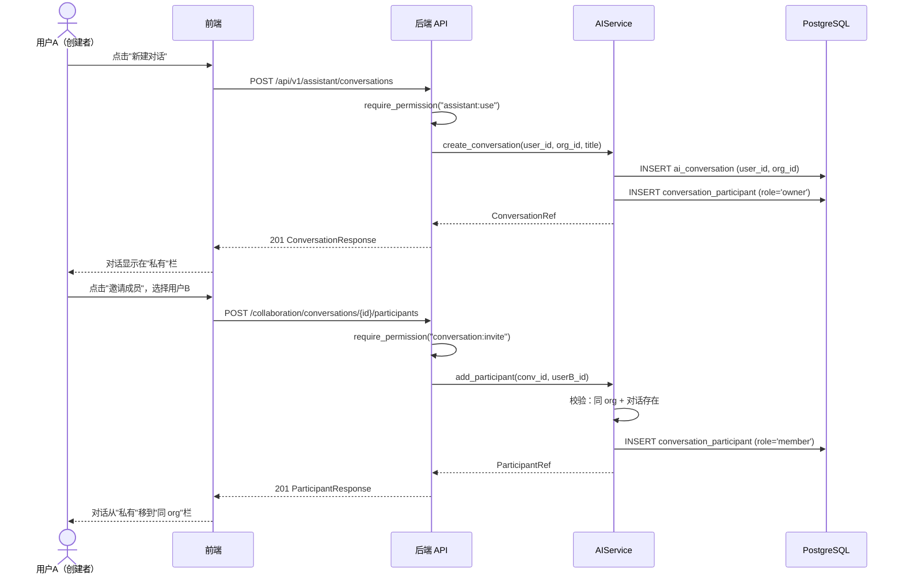
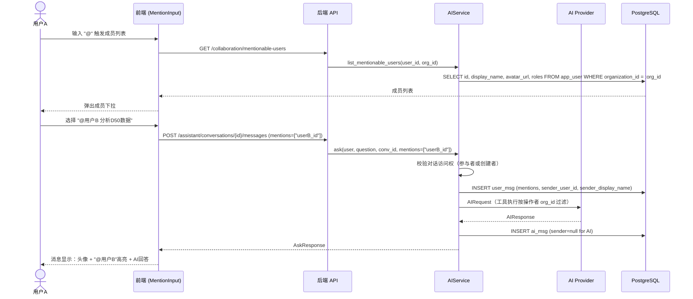
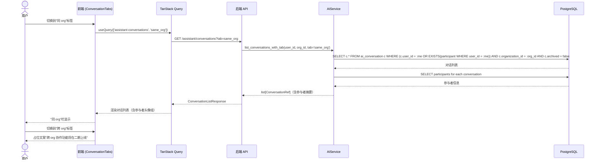
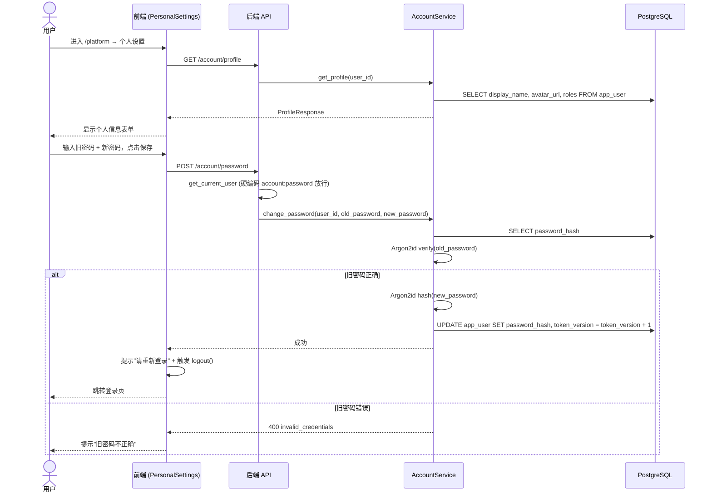

# IRIP AI 助手协作功能 — 架构设计 + 任务分解

> 文档语言：中文
> 项目名称：`irip-ai-collab`
> 改造性质：增量升级（基于现有 AI 助手模块 + 分析橱窗模块）
> 设计依据：`docs/prd-ai-collab.md` + 主理人已拍板决策
> 最新迁移编号：0052（本次新增 0053）

---

## 目录

1. [实现方案 + 框架选型](#1-实现方案--框架选型)
2. [文件列表及相对路径](#2-文件列表及相对路径)
3. [数据结构和接口（类图）](#3-数据结构和接口类图)
4. [程序调用流程（时序图）](#4-程序调用流程时序图)
5. [任务列表](#5-任务列表)
6. [依赖包列表](#6-依赖包列表)
7. [共享知识（跨文件约定）](#7-共享知识跨文件约定)
8. [待明确事项](#8-待明确事项)

---

## 1. 实现方案 + 框架选型

### 1.1 整体架构设计思路

本次改造为**增量升级**，在现有 AI 助手对话模型上扩展多人协作能力，不另起炉灶。核心思路：**对话共享，数据隔离**——对话是协作空间，数据按操作者 `org_id` 隔离，两者正交。

```
┌─────────────────────────────────────────────────────────────────────────────────┐
│                          前端 (React 18 + TypeScript + Ant Design 5)                │
│                                                                                   │
│  ┌────────────────┐  ┌──────────────────────┐  ┌──────────────────────────────┐    │
│  │  左栏 260px     │  │    中栏 flex:1       │  │      右栏 ~360px             │    │
│  │                │  │                      │  │   分析橱窗 (现有，不变)       │    │
│  │ 三栏筛选标签    │  │  对话头部             │  │                              │    │
│  │ 私有|同org|跨org│  │  ┌─参与者头像组──┐   │  │  ShowcasePanel (现有)        │    │
│  │                │  │  │  3人 + 数量    │   │  │                              │    │
│  │ 对话列表        │  │  └──────────────┘   │  │                              │    │
│  │ + 参与者头像组  │  │  消息列表             │  │                              │    │
│  │ + 搜索框       │  │  ┌─发送者头像──┐     │  │                              │    │
│  │                │  │  │ 姓名+角色标签│     │  │                              │    │
│  │                │  │  │ @人高亮     │     │  │                              │    │
│  │                │  │  └────────────┘     │  │                              │    │
│  │                │  │  输入框               │  │                              │    │
│  │                │  │  + @人提及弹窗        │  │                              │    │
│  └───────┬────────┘  └──────────┬───────────┘  └──────────────────────────────┘    │
│          │                      │                        │                         │
│          ▼                      ▼                        ▼                         │
│  ┌─────────────────────────────────────────────────────────────────────────────┐  │
│  │               TanStack Query + Axios (client.ts)                             │  │
│  │  models-ai.ts (修改)   collaboration.ts (新建)   account.ts (新建)             │  │
│  └─────────────────────────────────────────┬───────────────────────────────────┘  │
└────────────────────────────────────────────┼──────────────────────────────────────┘
                                             │ HTTP REST
                                             ▼
┌─────────────────────────────────────────────────────────────────────────────────┐
│                    后端 (FastAPI + SQLAlchemy async + PostgreSQL 16)                │
│                                                                                   │
│  ┌──────────────────┐  ┌──────────────────┐  ┌──────────────────────────────┐     │
│  │ assistant.py      │  │ collaboration.py  │  │ account.py (新建)            │     │
│  │ (修改)            │  │ (新建)            │  │ - POST /account/password    │     │
│  │ - 对话列表+三栏   │  │ - POST .../part.  │  │ - PATCH /account/profile    │     │
│  │ - 消息+mentions  │  │ - GET .../part.    │  │ - POST /account/avatar      │     │
│  │ - 权限改造       │  │ - DELETE .../part.│  │ - GET /account/profile      │     │
│  └────────┬─────────┘  └────────┬─────────┘  └────────────┬─────────────────┘     │
│           │                      │                          │                      │
│           ▼                      ▼                          ▼                      │
│  ┌──────────────────────────────────────────────────────────────────────────────┐ │
│  │                    AIService (service.py 修改 + 扩展)                          │ │
│  │  - 对话管理 (现有)                                                             │ │
│  │  + list_conversations_with_tab(user_id, org_id, tab) (新增)                   │ │
│  │  + add_participant / remove_participant / leave (新增)                        │ │
│  │  + list_participants (新增)                                                   │ │
│  │  + list_mentionable_users (新增)                                             │ │
│  │  + ask() 改造：参与者访问校验 + mentions 持久化 + 数据按操作者 org_id 隔离     │ │
│  └──────────────────────────────┬───────────────────────────────────────────────┘ │
│                                 │                                                  │
│                                 ▼                                                  │
│  ┌──────────────────────────────────────────────────────────────────────────────┐ │
│  │           PostgreSQL 16 (pgvector)                                             │ │
│  │  ai_conversation (现有)  ai_message (修改+mentions)                            │ │
│  │  conversation_participant (新增)  app_user (修改+avatar_url)                   │ │
│  └──────────────────────────────────────────────────────────────────────────────┘ │
│                                                                                   │
│  ┌──────────────────────────────────────────────────────────────────────────────┐ │
│  │  auth.py (修改: MeResponse+avatar_url)  governance.py (修改: lab_director)    │ │
│  │  permissions.py (修改: +conversation:* +account:*)  authorization.py (修改)   │ │
│  └──────────────────────────────────────────────────────────────────────────────┘ │
└─────────────────────────────────────────────────────────────────────────────────┘
```

### 1.2 关键设计决策

| 决策点 | 方案 | 理由 |
|--------|------|------|
| 参与者关联 | 新增 `conversation_participant` 表，联合主键 `(conversation_id, user_id)` | PRD 明确要求，支持多用户参与同一对话 |
| 创建者即 owner | 创建对话时自动插入 `conversation_participant (role='owner')` | PRD 9.1「对话创建者自动成为 owner」 |
| 现有对话兼容 | 现有对话无 participant 记录，查询逻辑兼容处理（`user_id == me OR participant`） | PRD 11「现有对话自动转为'私有'」 |
| @ 人存储 | `ai_message.mentions JSONB` 存 user_id 数组 `["uuid1", "uuid2"]` | PRD 6.2，复用现有消息表，不新建实体 |
| 消息发送者标识 | `ai_message` 新增 `sender_user_id` + `sender_display_name` + `sender_avatar_url` 冗余字段 | 多人对话需区分发送者，冗余存储避免每次 JOIN 查用户表 |
| 基础权限放行 | 在 `require_permission()` 中硬编码 `account:profile` 和 `account:password` 始终放行 | PRD 5.1「所有角色拥有，不通过角色分配」 |
| 协作权限 | 新增 `conversation:create/invite/remove_member/delete/manage` 到 `BUILTIN_ROLES` | PRD 5.2，按角色矩阵分配 |
| 角色管理扩展 | `lab_director` 增加 `role:assign` 权限，端点层增加 org 范围 + 角色限制校验 | PRD 5.3「lab_director 可分配本 org 成员 lab_member/viewer」 |
| 对话三栏筛选 | `list_conversations` 新增 `tab` 参数（private / same_org / cross_org） | PRD P0-09，后端按 SQL 条件过滤 |
| 跨 org 占位 | `tab=cross_org` 返回空列表 + 前端灰色占位 | PRD「一期不做跨 org 对话」 |
| 数据隔离 | AI 工具执行时 `org_id` 取自**当前操作者**（已有逻辑），不取对话 org_id | PRD 9.2「数据按当前操作者 org_id 隔离」 |
| 通知机制 | 一期用 TanStack Query 轮询 `refetchInterval` | PRD 9.4「一期用轮询」 |
| 头像上传 | 复用现有 MinIO + uploads 路由模式 | 已有 `files/upload` 端点和 MinIO 集成 |
| 密码修改后失效 | 修改密码时 `token_version + 1`，使旧 JWT 失效 | 已有 H-06 机制 |
| 迁移编号 | **0053**（最新为 0052） | 实际代码库已有 52 个迁移 |

### 1.3 架构模式

沿用项目现有模式：
- **后端**：分层架构（Router → Service → Entity/DB），Composition Root 依赖注入
- **前端**：Feature-based 模块组织，TanStack Query 数据获取，Zustand 本地状态管理
- **数据流**：单向数据流，前端 TanStack Query 管理服务端缓存，Zustand 管理 UI 状态

### 1.4 新增/修改模块说明

#### 后端新增模块

| 模块 | 职责 |
|------|------|
| `packages/ai/collaboration_entities.py` | `ConversationParticipant` ORM 模型 + `ParticipantRef` / `MentionableUserRef` 值对象 |
| `apps/api/routers/collaboration.py` | 协作 API 路由：参与者 CRUD、@人列表、退出对话 |
| `apps/api/routers/account.py` | 账户管理 API 路由：改密码、改头像、改显示名、查个人信息 |

#### 后端修改模块

| 模块 | 修改内容 |
|------|---------|
| `packages/auth/permissions.py` | 新增 `conversation:*` 和 `account:*` 权限常量；更新 `BUILTIN_ROLES` 权限矩阵 |
| `apps/api/dependencies/authorization.py` | `require_permission()` 硬编码放行 `account:profile` / `account:password` |
| `packages/auth/entities.py` | `AppUser` 新增 `avatar_url` 字段 |
| `packages/ai/service.py` | `AIMessage` 新增 `mentions` / `sender_user_id` 等字段；`AIService` 新增协作方法 + 对话查询改造 + `ask()` 改造 |
| `apps/api/routers/assistant.py` | 对话列表增加 `tab` 参数 + 参与者信息；消息请求/响应增加 `mentions` 和发送者信息 |
| `apps/api/routers/auth.py` | `MeResponse` 增加 `avatar_url` 和 `organization_id` |
| `apps/api/routers/governance.py` | 允许 `lab_director` 访问用户管理 + org 范围校验 + 角色限制 |
| `apps/api/main.py` | 注册 `collaboration_router` 和 `account_router` |
| `apps/api/composition/ai.py` | 注册协作路由的 session_factory |

#### 前端新增模块

| 模块 | 职责 |
|------|------|
| `apps/web/src/api/collaboration.ts` | 协作 API 类型 + 请求函数（参与者 CRUD、@人列表） |
| `apps/web/src/api/account.ts` | 账户 API 类型 + 请求函数（改密码、改头像、改显示名） |
| `apps/web/src/features/assistant/MentionInput.tsx` | @人输入组件（输入框 + @触发 + 成员下拉列表） |
| `apps/web/src/features/assistant/ConversationTabs.tsx` | 对话列表三栏筛选标签（私有/同 org/跨 org 占位） |
| `apps/web/src/features/assistant/ParticipantPanel.tsx` | 对话参与者列表面板（头像组 + 成员列表抽屉） |
| `apps/web/src/features/platform/PersonalSettings.tsx` | 个人设置页（改密码 + 改头像 + 改显示名） |

#### 前端修改模块

| 模块 | 修改内容 |
|------|---------|
| `apps/web/src/api/models-ai.ts` | `AssistantMessage` 增加 `mentions` / 发送者字段；`apiListConversations` 增加 `tab` 参数；`ConversationSummary` 增加参与者信息 |
| `apps/web/src/api/client.ts` | `CurrentUser` / `MeApiResponse` 增加 `avatar_url` 和 `organization_id` |
| `apps/web/src/features/assistant/AssistantPage.tsx` | 集成三栏标签 + MentionInput + ParticipantPanel + 参与者头像组 |
| `apps/web/src/features/assistant/MessageThread.tsx` | 消息渲染增加发送者头像/姓名/角色标签 + @人高亮 |
| `apps/web/src/features/assistant/index.ts` | 导出新增组件 |
| `apps/web/src/features/dashboard/PlatformPage.tsx` | 新增「个人设置」Tab |
| `apps/web/src/features/governance/UsersPage.tsx` | 允许 `lab_director` 访问 + org 范围过滤 + 角色限制 |
| `apps/web/src/features/governance/GovernanceConsole.tsx` | `lab_director` 可见用户管理入口 |

---

## 2. 文件列表及相对路径

### 2.1 后端文件

| # | 文件路径 | 状态 | 职责 |
|---|---------|------|------|
| B1 | `packages/ai/collaboration_entities.py` | 【新建】 | `ConversationParticipant` ORM 模型 + `ParticipantRef` / `MentionableUserRef` 值对象 |
| B2 | `migrations/versions/0053_ai_collaboration.py` | 【新建】 | Alembic 迁移：创建 `conversation_participant` 表 + `ai_message` 加 `mentions` + `app_user` 加 `avatar_url` |
| B3 | `packages/auth/permissions.py` | 【修改】 | 新增 `conversation:*` / `account:*` 权限常量；更新 `BUILTIN_ROLES` 权限矩阵（lab_director / lab_member 增加协作权限） |
| B4 | `apps/api/dependencies/authorization.py` | 【修改】 | `require_permission()` 硬编码放行 `account:profile` / `account:password` |
| B5 | `packages/auth/entities.py` | 【修改】 | `AppUser` 新增 `avatar_url: Mapped[str \| None]` 字段 |
| B6 | `packages/ai/service.py` | 【修改】 | `AIMessage` 新增 `mentions` / `sender_user_id` / `sender_display_name` / `sender_avatar_url` 字段；`AIService` 新增协作方法 + 对话查询改造 + `ask()` 改造 |
| B7 | `apps/api/routers/collaboration.py` | 【新建】 | 协作 API 路由（参与者 CRUD、@人列表、退出对话） |
| B8 | `apps/api/routers/account.py` | 【新建】 | 账户管理 API 路由（改密码、改头像、改显示名、查个人信息） |
| B9 | `apps/api/routers/assistant.py` | 【修改】 | 对话列表增加 `tab` 参数 + 参与者信息；`SendMessageRequest` 增加 `mentions`；`MessageResponse` 增加 `mentions` + 发送者信息；`ConversationResponse` 增加 `participants` |
| B10 | `apps/api/routers/auth.py` | 【修改】 | `MeResponse` 增加 `avatar_url` 和 `organization_id` 字段 |
| B11 | `apps/api/routers/governance.py` | 【修改】 | 允许 `lab_director` 访问用户管理 + org 范围过滤 + 角色限制（仅 lab_member/lab_viewer） |
| B12 | `apps/api/main.py` | 【修改】 | 注册 `collaboration_router` 和 `account_router` |
| B13 | `apps/api/composition/ai.py` | 【修改】 | 注册协作路由和账户路由的 session_factory |

### 2.2 前端文件

| # | 文件路径 | 状态 | 职责 |
|---|---------|------|------|
| F1 | `apps/web/src/api/collaboration.ts` | 【新建】 | 协作 API 类型定义 + 请求函数（参与者 CRUD、@人列表） |
| F2 | `apps/web/src/api/account.ts` | 【新建】 | 账户 API 类型定义 + 请求函数（改密码、改头像、改显示名、查个人信息） |
| F3 | `apps/web/src/api/models-ai.ts` | 【修改】 | `AssistantMessage` / `ConversationSummary` 类型扩展；`apiListConversations` 增加 `tab` 参数；`apiSendMessage` 增加 `mentions` 参数 |
| F4 | `apps/web/src/api/client.ts` | 【修改】 | `CurrentUser` / `MeApiResponse` 增加 `avatar_url` 和 `organization_id` |
| F5 | `apps/web/src/features/assistant/AssistantPage.tsx` | 【修改】 | 集成三栏标签 + MentionInput + ParticipantPanel + 参与者头像组 + 发送者信息传递 |
| F6 | `apps/web/src/features/assistant/MessageThread.tsx` | 【修改】 | 消息渲染增加发送者头像/姓名/角色标签 + @人高亮渲染 |
| F7 | `apps/web/src/features/assistant/MentionInput.tsx` | 【新建】 | @人输入组件（TextArea + @触发 + 成员下拉列表 + 选中插入） |
| F8 | `apps/web/src/features/assistant/ConversationTabs.tsx` | 【新建】 | 对话列表三栏筛选标签（私有 / 同 org / 跨 org 占位） |
| F9 | `apps/web/src/features/assistant/ParticipantPanel.tsx` | 【新建】 | 对话参与者列表面板（头像组 + 成员列表 Drawer） |
| F10 | `apps/web/src/features/assistant/index.ts` | 【修改】 | 导出新增组件 |
| F11 | `apps/web/src/features/platform/PersonalSettings.tsx` | 【新建】 | 个人设置页（改密码 + 改头像 + 改显示名） |
| F12 | `apps/web/src/features/dashboard/PlatformPage.tsx` | 【修改】 | 新增「个人设置」Tab，所有用户可见 |
| F13 | `apps/web/src/features/governance/UsersPage.tsx` | 【修改】 | 允许 `lab_director` 访问 + org 范围过滤 + 角色选项限制 |
| F14 | `apps/web/src/features/governance/GovernanceConsole.tsx` | 【修改】 | `lab_director` 可见用户管理入口 |

### 2.3 文件总数

- 后端：13 个文件（3 新建 + 10 修改）
- 前端：14 个文件（6 新建 + 8 修改）
- **合计 27 个文件**

---

## 3. 数据结构和接口（类图）

### 3.1 数据库表 DDL

```sql
-- 0053 迁移：AI 助手协作功能

-- 1. 新增 conversation_participant 表
CREATE TABLE conversation_participant (
    conversation_id UUID NOT NULL REFERENCES ai_conversation(id) ON DELETE CASCADE,
    user_id UUID NOT NULL REFERENCES app_user(id) ON DELETE CASCADE,
    role VARCHAR(20) NOT NULL DEFAULT 'member',  -- owner / member
    joined_at TIMESTAMPTZ NOT NULL DEFAULT now(),
    PRIMARY KEY (conversation_id, user_id)
);

CREATE INDEX idx_conv_participant_user ON conversation_participant(user_id);

-- 2. ai_message 新增字段
ALTER TABLE ai_message ADD COLUMN mentions JSONB NOT NULL DEFAULT '[]'::jsonb;
ALTER TABLE ai_message ADD COLUMN sender_user_id UUID;
ALTER TABLE ai_message ADD COLUMN sender_display_name TEXT;
ALTER TABLE ai_message ADD COLUMN sender_avatar_url TEXT;

-- 3. app_user 新增头像字段
ALTER TABLE app_user ADD COLUMN avatar_url TEXT;
```

### 3.2 SQLAlchemy 模型

```python
# packages/ai/collaboration_entities.py

class ConversationParticipant(Base):
    """对话参与者实体（对应 conversation_participant 表）。

    联合主键 (conversation_id, user_id)，role 区分 owner/member。
    """
    __tablename__ = "conversation_participant"

    conversation_id: Mapped[UUID] = mapped_column(
        GUID,
        sa.ForeignKey("ai_conversation.id", ondelete="CASCADE"),
        primary_key=True,
    )
    user_id: Mapped[UUID] = mapped_column(
        GUID,
        sa.ForeignKey("app_user.id", ondelete="CASCADE"),
        primary_key=True,
    )
    role: Mapped[str] = mapped_column(sa.String(20), nullable=False, default="member")
    joined_at: Mapped[datetime] = mapped_column(UTCDateTime, nullable=False)


@dataclass(frozen=True)
class ParticipantRef:
    """参与者引用（不可变值对象）。"""
    conversation_id: UUID
    user_id: UUID
    role: str
    joined_at: datetime


@dataclass(frozen=True)
class MentionableUserRef:
    """可 @ 的用户引用（不可变值对象）。"""
    id: UUID
    display_name: str
    avatar_url: str | None
    roles: list[str]
```

```python
# packages/ai/service.py 中 AIMessage 新增字段

class AIMessage(Base):
    __tablename__ = "ai_message"
    # ... 现有字段 ...
    mentions: Mapped[list] = mapped_column(
        JSONB, nullable=False, default=list, server_default=sa.text("'[]'::jsonb")
    )
    sender_user_id: Mapped[UUID | None] = mapped_column(GUID, nullable=True)
    sender_display_name: Mapped[str | None] = mapped_column(sa.Text, nullable=True)
    sender_avatar_url: Mapped[str | None] = mapped_column(sa.Text, nullable=True)
```

```python
# packages/auth/entities.py 中 AppUser 新增字段

class AppUser(Base):
    __tablename__ = "app_user"
    # ... 现有字段 ...
    avatar_url: Mapped[str | None] = mapped_column(sa.Text, nullable=True)
```

### 3.3 权限常量新增

```python
# packages/auth/permissions.py 中 Permission 类新增

class Permission:
    # ... 现有权限 ...

    # AI 助手协作（本次新增）
    CONVERSATION_CREATE: str = "conversation:create"
    CONVERSATION_INVITE: str = "conversation:invite"
    CONVERSATION_REMOVE_MEMBER: str = "conversation:remove_member"
    CONVERSATION_DELETE: str = "conversation:delete"
    CONVERSATION_MANAGE: str = "conversation:manage"

    # 个人账户（所有角色，硬编码放行）
    ACCOUNT_PROFILE: str = "account:profile"
    ACCOUNT_PASSWORD: str = "account:password"
```

### 3.4 BUILTIN_ROLES 权限矩阵变更

```python
# BUILTIN_ROLES 中各角色新增权限

# lab_director 新增：
CONVERSATION_CREATE, CONVERSATION_INVITE, CONVERSATION_REMOVE_MEMBER,
CONVERSATION_DELETE, CONVERSATION_MANAGE, ROLE_ASSIGN

# lab_member 新增：
CONVERSATION_CREATE, CONVERSATION_INVITE, CONVERSATION_DELETE

# lab_viewer：不变（无协作权限，@人通过 assistant:use）
# platform_administrator：已有 _ALL_PERMISSIONS，自动包含新权限
# platform_auditor：不变
```

### 3.5 类图

完整类图见 `docs/class-diagram-ai-collab.mermaid`，此处展示核心结构：

```mermaid
classDiagram
    class ConversationParticipant {
        +UUID conversation_id PK
        +UUID user_id PK
        +str role
        +datetime joined_at
    }

    class AIMessage {
        +UUID id
        +UUID conversation_id
        +str role
        +str content
        +list mentions_json
        +UUID|None sender_user_id
        +str|None sender_display_name
        +str|None sender_avatar_url
        +datetime created_at
    }

    class AppUser {
        +UUID id
        +UUID|None organization_id
        +str email
        +str display_name
        +str|None avatar_url
        +list roles
    }

    class AIConversation {
        +UUID id
        +UUID organization_id
        +UUID user_id
        +str title
        +bool pinned
        +bool archived
    }

    AIConversation "1" --> "*" ConversationParticipant : conversation_id CASCADE
    AppUser "1" --> "*" ConversationParticipant : user_id CASCADE
    AIConversation "1" --> "*" AIMessage : conversation_id CASCADE

    class AIService {
        +list_conversations_with_tab() list~ConversationRef~
        +add_participant() ParticipantRef
        +remove_participant() None
        +leave_conversation() None
        +list_participants() list~ParticipantRef~
        +list_mentionable_users() list~MentionableUserRef~
        +ask() AIResponse
    }

    class AccountService {
        +change_password() None
        +update_profile() ProfileRef
        +get_profile() ProfileRef
    }

    class CollaborationRouter {
        +POST /conversations/{id}/participants
        +GET /conversations/{id}/participants
        +DELETE /conversations/{id}/participants/{user_id}
        +POST /conversations/{id}/leave
        +GET /mentionable-users
    }

    class AccountRouter {
        +GET /account/profile
        +PATCH /account/profile
        +POST /account/password
        +POST /account/avatar
    }

    CollaborationRouter --> AIService : 调用
    AccountRouter --> AccountService : 调用
```

### 3.6 前端 TypeScript 类型定义

```typescript
// apps/web/src/api/collaboration.ts

/** 对话参与者 */
export type Participant = {
  user_id: string;
  display_name: string;
  avatar_url: string | null;
  role: 'owner' | 'member';
  joined_at: string;
};

/** 可 @ 的用户 */
export type MentionableUser = {
  id: string;
  display_name: string;
  avatar_url: string | null;
  roles: string[];
};

/** 对话三栏筛选 */
export type ConversationTab = 'private' | 'same_org' | 'cross_org';

// API 函数
export async function apiListParticipants(convId: string): Promise<Participant[]>
export async function apiInviteParticipant(convId: string, userId: string): Promise<Participant>
export async function apiRemoveParticipant(convId: string, userId: string): Promise<void>
export async function apiLeaveConversation(convId: string): Promise<void>
export async function apiListMentionableUsers(): Promise<MentionableUser[]>
```

```typescript
// apps/web/src/api/account.ts

/** 个人信息 */
export type Profile = {
  id: string;
  email: string;
  display_name: string;
  avatar_url: string | null;
  roles: string[];
};

// API 函数
export async function apiGetProfile(): Promise<Profile>
export async function apiUpdateProfile(params: { display_name?: string; avatar_url?: string }): Promise<Profile>
export async function apiChangePassword(params: { old_password: string; new_password: string }): Promise<void>
export async function apiUploadAvatar(file: File): Promise<{ avatar_url: string }>
```

```typescript
// apps/web/src/api/models-ai.ts 修改

export type AssistantMessage = {
  id: string;
  conversation_id: string;
  role: 'user' | 'assistant' | 'tool';
  content: string;
  tool_calls: ToolCallSummary[];
  citations: Citation[];
  mentions: string[];                    // 新增：@ 的人 ID 数组
  sender_user_id: string | null;         // 新增：发送者 ID
  sender_display_name: string | null;    // 新增：发送者显示名
  sender_avatar_url: string | null;      // 新增：发送者头像
  uncertainty: string | null;
  created_at: string;
};

export type ConversationSummary = {
  id: string;
  title: string;
  provider_mode: string;
  pinned: boolean;
  archived: boolean;
  created_at: string;
  updated_at: string;
  system_context: string | null;
  participants: { user_id: string; display_name: string; avatar_url: string | null }[]; // 新增
};

// apiListConversations 增加 tab 参数
export async function apiListConversations(params?: {
  limit?: number;
  includeArchived?: boolean;
  archivedOnly?: boolean;
  keyword?: string;
  tab?: ConversationTab;  // 新增
}): Promise<ConversationSummary[]>

// apiSendMessage 增加 mentions 参数
export async function apiSendMessage(
  conversationId: string,
  body: {
    question: string;
    provider_name?: string;
    thinking_enabled?: boolean;
    system_context?: string;
    mentions?: string[];  // 新增
  },
  signal?: AbortSignal,
): Promise<AskResponse>
```

```typescript
// apps/web/src/api/client.ts 修改

export type CurrentUser = {
  id: string;
  displayName: string;
  roles: string[];
  permissions: string[];
  organizationId?: string;
  avatarUrl?: string;       // 新增
};

type MeApiResponse = {
  id: string;
  email: string;
  display_name: string;
  roles: string[];
  permissions: string[];
  organization_id?: string;
  avatar_url?: string;      // 新增
};
```

---

## 4. 程序调用流程（时序图）

完整时序图见 `docs/sequence-diagram-ai-collab.mermaid`，以下为关键流程摘要。

### 4.1 创建对话 + 邀请成员



### 4.2 @人发送消息



### 4.3 对话列表三栏查询



### 4.4 个人设置改密码



---

## 5. 任务列表

> 以下任务按实现顺序排列（先底层后上层，先后端后前端）。
> 每个任务标注依赖关系，工程师按序执行。
> 全部为 P0 优先级。

### T01：后端数据模型 + 迁移 + 权限体系 + 实体扩展

| 项 | 内容 |
|----|------|
| **任务编号** | T01 |
| **任务标题** | 后端数据模型 + 迁移 + 权限体系 + 实体扩展 |
| **依赖** | 无 |
| **优先级** | P0 |
| **涉及文件** | `packages/ai/collaboration_entities.py`【新建】, `migrations/versions/0053_ai_collaboration.py`【新建】, `packages/auth/permissions.py`【修改】, `apps/api/dependencies/authorization.py`【修改】, `packages/auth/entities.py`【修改】, `packages/ai/service.py`【修改】 |
| **任务描述** | **1. 新建 `packages/ai/collaboration_entities.py`**：定义 `ConversationParticipant(Base)` ORM 模型（联合主键 `conversation_id` + `user_id`，`role VARCHAR(20)` 默认 `'member'`，`joined_at UTCDateTime`），继承 `packages.common.database.Base`，列类型使用 `GUID` / `UTCDateTime`（参照现有 `service.py` 中的 `AIConversation` 模式）。定义 `ParticipantRef` 和 `MentionableUserRef` frozen dataclass 值对象。**2. 新建迁移 `0053_ai_collaboration.py`**：`revision="0053"`, `down_revision="0052"`。包含：(a) 创建 `conversation_participant` 表（联合主键 + FK CASCADE + `idx_conv_participant_user` 索引）；(b) `ALTER TABLE ai_message ADD COLUMN mentions JSONB DEFAULT '[]'::jsonb` + `sender_user_id UUID` + `sender_display_name TEXT` + `sender_avatar_url TEXT`；(c) `ALTER TABLE app_user ADD COLUMN avatar_url TEXT`。编写 `downgrade()` 回滚。**3. 修改 `packages/auth/permissions.py`**：在 `Permission` 类新增 `CONVERSATION_CREATE` / `CONVERSATION_INVITE` / `CONVERSATION_REMOVE_MEMBER` / `CONVERSATION_DELETE` / `CONVERSATION_MANAGE` / `ACCOUNT_PROFILE` / `ACCOUNT_PASSWORD` 常量；更新 `Permission.all()` 列表；更新 `BUILTIN_ROLES`：`lab_director` 增加 `CONVERSATION_*` + `ROLE_ASSIGN`；`lab_member` 增加 `CONVERSATION_CREATE` / `CONVERSATION_INVITE` / `CONVERSATION_DELETE`。**4. 修改 `apps/api/dependencies/authorization.py`**：在 `require_permission()` 的 `_dependency()` 函数中，检查 `action in ("account:profile", "account:password")` 时直接返回 `user`（硬编码放行，不查角色）。**5. 修改 `packages/auth/entities.py`**：`AppUser` 类新增 `avatar_url: Mapped[str | None] = mapped_column(sa.Text, nullable=True)`。**6. 修改 `packages/ai/service.py`**：`AIMessage` 类新增 `mentions: Mapped[list] = mapped_column(JSONB, ...)` + `sender_user_id: Mapped[UUID | None]` + `sender_display_name: Mapped[str | None]` + `sender_avatar_url: Mapped[str | None]` 字段。 |

### T02：后端 API + 服务方法（协作管理 + 账户管理 + 角色管理 + 对话改造）

| 项 | 内容 |
|----|------|
| **任务编号** | T02 |
| **任务标题** | 后端 API 路由 + 服务方法（协作管理 + 账户管理 + 角色管理 + 对话查询改造） |
| **依赖** | T01 |
| **优先级** | P0 |
| **涉及文件** | `packages/ai/service.py`【修改】, `apps/api/routers/collaboration.py`【新建】, `apps/api/routers/account.py`【新建】, `apps/api/routers/assistant.py`【修改】, `apps/api/routers/auth.py`【修改】, `apps/api/routers/governance.py`【修改】, `apps/api/main.py`【修改】, `apps/api/composition/ai.py`【修改】 |
| **任务描述** | **1. 修改 `packages/ai/service.py`** 中 `AIService` 新增方法：(a) `list_conversations_with_tab(user_id, org_id, tab, limit, include_archived, archived_only, keyword)` — 按 tab 过滤：`private`=`user_id==me AND 无其他参与者`；`same_org`=`(user_id==me OR participant) AND org==my_org`；`cross_org`=返回空列表。搜索逻辑复用现有 `search_conversations` 的 ILIKE。查询结果附带参与者摘要（批量查询 `conversation_participant` JOIN `app_user`）。(b) `add_participant(conversation_id, inviter_user_id, target_user_id)` — 校验对话存在 + inviter 是 owner + target 同 org + 未已是参与者 → INSERT `ConversationParticipant(role='member')`。(c) `remove_participant(conversation_id, owner_user_id, target_user_id)` — 校验 owner 权限 → DELETE。(d) `leave_conversation(conversation_id, user_id)` — 校验参与者 → DELETE（owner 不能退出，需先转让或删除对话）。(e) `list_participants(conversation_id, user_id)` — 校验访问权 → 查询参与者 JOIN app_user（含 display_name, avatar_url）。(f) `list_mentionable_users(user_id, org_id)` — 查 `app_user WHERE organization_id = org_id AND status='active'` 返回 id/display_name/avatar_url/roles。(g) 修改 `create_conversation()` — 创建对话后自动 INSERT `ConversationParticipant(role='owner')`。(h) 修改 `list_messages()` — 访问权从 `conv.user_id == user_id` 改为 `conv.user_id == user_id OR EXISTS(participant WHERE user_id == user_id)`。(i) 修改 `ask()` — 访问权校验同 `list_messages`；持久化用户消息时填充 `mentions` + `sender_user_id` + `sender_display_name` + `sender_avatar_url`（从 current_user 获取）；AI 消息 sender 字段为 None。**2. 新建 `apps/api/routers/collaboration.py`**：`collaboration_router = APIRouter(prefix="/api/v1/collaboration", tags=["collaboration"])`。端点：(a) `POST /conversations/{id}/participants` — `require_permission("conversation:invite")`，body `InviteMemberRequest(user_id: str)` → `service.add_participant()`。(b) `GET /conversations/{id}/participants` — `require_permission("assistant:use")` → `service.list_participants()`。(c) `DELETE /conversations/{id}/participants/{user_id}` — `require_permission("conversation:remove_member")` → `service.remove_participant()`。(d) `POST /conversations/{id}/leave` — `require_permission("assistant:use")` → `service.leave_conversation()`。(e) `GET /mentionable-users` — `require_permission("assistant:use")` → `service.list_mentionable_users()`。定义 Pydantic 请求/响应模型。**3. 新建 `apps/api/routers/account.py`**：`account_router = APIRouter(prefix="/api/v1/account", tags=["account"])`。端点：(a) `GET /profile` — `get_current_user` → 查询用户信息返回 `ProfileResponse`。(b) `PATCH /profile` — 硬编码 `account:profile` 放行 → 更新 `display_name` 和/或 `avatar_url`。(c) `POST /password` — 硬编码 `account:password` 放行 → body `ChangePasswordRequest(old_password, new_password)` → Argon2id 验证旧密码 + 更新密码哈希 + `token_version + 1`。(d) `POST /avatar` — 硬编码 `account:profile` 放行 → 接收文件上传到 MinIO → 返回 `avatar_url`。使用 `CurrentUserDep`（仅认证，不查角色权限）。**4. 修改 `apps/api/routers/assistant.py`**：(a) `list_conversations` 端点增加 `tab: str | None = Query(None)` 参数，有 tab 时调 `service.list_conversations_with_tab()`。(b) `SendMessageRequest` 增加 `mentions: list[str] = Field(default_factory=list)`。(c) `MessageResponse` 增加 `mentions: list[str]` + `sender_user_id: str | None` + `sender_display_name: str | None` + `sender_avatar_url: str | None`。(d) `ConversationResponse` 增加 `participants: list[ParticipantSummary]`。(e) `send_message` 端点传递 `mentions` 到 `service.ask()`。**5. 修改 `apps/api/routers/auth.py`**：`MeResponse` 增加 `avatar_url: str | None` 和 `organization_id: str | None`；`me()` 端点查询并返回这些字段。**6. 修改 `apps/api/routers/governance.py`**：用户列表端点允许 `lab_director` 访问（使用 `require_permission("role:assign")` 代替 `require_permission("user:manage")`）；当调用者是 `lab_director` 时：(a) 只返回同 `organization_id` 的用户；(b) 角色分配端点限制只能分配 `lab_member` / `lab_viewer`。**7. 修改 `apps/api/main.py`**：`import` 并 `app.include_router(collaboration_router)` + `app.include_router(account_router)`。**8. 修改 `apps/api/composition/ai.py`**：`import` 并调用 `collaboration.py` 的 `set_collaboration_session_factory(ctx.session_factory)` + `account.py` 的 `set_account_session_factory(ctx.session_factory)`。 |

### T03：前端数据层 + API + 类型定义

| 项 | 内容 |
|----|------|
| **任务编号** | T03 |
| **任务标题** | 前端类型定义 + API 层 + 客户端扩展 |
| **依赖** | T02 |
| **优先级** | P0 |
| **涉及文件** | `apps/web/src/api/collaboration.ts`【新建】, `apps/web/src/api/account.ts`【新建】, `apps/web/src/api/models-ai.ts`【修改】, `apps/web/src/api/client.ts`【修改】 |
| **任务描述** | **1. 新建 `apps/web/src/api/collaboration.ts`**：定义 `Participant` / `MentionableUser` / `ConversationTab` TypeScript 类型。实现 API 函数：`apiListParticipants(convId)` / `apiInviteParticipant(convId, userId)` / `apiRemoveParticipant(convId, userId)` / `apiLeaveConversation(convId)` / `apiListMentionableUsers()`，使用现有 `http` 客户端，遵循 `models-ai.ts` 编码风格。**2. 新建 `apps/web/src/api/account.ts`**：定义 `Profile` 类型。实现 `apiGetProfile()` / `apiUpdateProfile({ display_name?, avatar_url? })` / `apiChangePassword({ old_password, new_password })` / `apiUploadAvatar(file: File)`。**3. 修改 `apps/web/src/api/models-ai.ts`**：(a) `AssistantMessage` 类型增加 `mentions: string[]` / `sender_user_id: string | null` / `sender_display_name: string | null` / `sender_avatar_url: string | null`。(b) `ConversationSummary` 类型增加 `participants: { user_id, display_name, avatar_url }[]`。(c) `apiListConversations` 函数增加 `tab?: ConversationTab` 参数。(d) `apiSendMessage` 函数 body 增加 `mentions?: string[]` 参数。同步修改 `ConversationApiResponse` / `MessageListApiResponse` 内部类型。**4. 修改 `apps/web/src/api/client.ts`**：`CurrentUser` 类型增加 `avatarUrl?: string`；`MeApiResponse` 增加 `avatar_url?: string` 和 `organization_id?: string`；`apiGetMe()` 返回值增加 `avatarUrl` 和 `organizationId` 映射。 |

### T04：前端协作 UI（对话三栏 + @人 + 发送者展示 + 参与者面板）

| 项 | 内容 |
|----|------|
| **任务编号** | T04 |
| **任务标题** | 前端协作 UI（对话三栏 + @人输入 + 发送者展示 + 参与者面板） |
| **依赖** | T03 |
| **优先级** | P0 |
| **涉及文件** | `apps/web/src/features/assistant/AssistantPage.tsx`【修改】, `apps/web/src/features/assistant/MessageThread.tsx`【修改】, `apps/web/src/features/assistant/MentionInput.tsx`【新建】, `apps/web/src/features/assistant/ConversationTabs.tsx`【新建】, `apps/web/src/features/assistant/ParticipantPanel.tsx`【新建】, `apps/web/src/features/assistant/index.ts`【修改】 |
| **任务描述** | **1. 新建 `ConversationTabs.tsx`**：三栏筛选标签组件（Ant Design `Segmented` 或 `Tabs`），props 含 `activeTab` / `onTabChange`。三个选项：`私有` / `同 org` / `跨 org`（跨 org 灰色 + `Tooltip`「二期上线」+ 禁用点击）。**2. 新建 `MentionInput.tsx`**：@人输入组件，基于 Ant Design `TextArea` 扩展。输入 `@` 时触发查询 `apiListMentionableUsers()`（TanStack Query 缓存），弹出 `Dropdown` 成员列表（头像 + 显示名 + 角色标签）。选中后将 `@显示名` 插入文本并记录 `mention_user_ids`。提供 `value` / `onChange` / `mentions` / `onMentionsChange` 受控接口。删除 `@显示名` 时同步移除对应 user_id。**3. 新建 `ParticipantPanel.tsx`**：对话参与者面板。对话头部显示参与者头像组（Ant Design `Avatar.Group`，最多 3 个 + `+N`），点击展开 `Drawer` 成员列表（头像 + 显示名 + 角色 Tag + 加入时间）。owner 显示皇冠图标。调用 `apiListParticipants(convId)` 加载数据。owner 可见「邀请成员」按钮（弹出成员选择 Modal）和「移除」按钮（Popconfirm 确认）。**4. 修改 `AssistantPage.tsx`**：(a) 在对话列表 Card 标题下方加入 `ConversationTabs`，`activeTab` 状态管理，切换时传入 `tab` 参数给 `apiListConversations`。(b) 将输入区 `TextArea` 替换为 `MentionInput`，管理 `mentions` 状态，发送时传入 `apiSendMessage`。(c) 在对话区头部加入 `ParticipantPanel`（当 `selectedConvId` 存在时）。(d) 对话列表每条对话增加参与者头像组显示（从 `ConversationSummary.participants` 读取）。(e) 跨 org 标签被选中时显示占位文案。**5. 修改 `MessageThread.tsx`**：(a) `role === 'user'` 的消息渲染增加发送者头像（`Avatar` src=`sender_avatar_url`）+ 显示名（`Text`）+ 角色 Tag（根据 `sender_user_id` 对应角色推断，或后端返回角色标签）。AI 消息保持现有「小艾」标识。(b) 消息内容中 `@人名` 高亮渲染（蓝色背景 + `@` 符号），通过 `mentions` 数组与 `sender_display_name` 匹配实现。(c) 用户消息和 AI 消息视觉区分（用户消息右对齐浅蓝背景，AI 消息左对齐灰色背景）。**6. 修改 `index.ts`**：导出 `MentionInput` / `ConversationTabs` / `ParticipantPanel`。 |

### T05：前端个人设置 + 角色管理 + 集成调试

| 项 | 内容 |
|----|------|
| **任务编号** | T05 |
| **任务标题** | 前端个人设置页 + 角色管理改造 + 端到端集成调试 |
| **依赖** | T04 |
| **优先级** | P0 |
| **涉及文件** | `apps/web/src/features/platform/PersonalSettings.tsx`【新建】, `apps/web/src/features/dashboard/PlatformPage.tsx`【修改】, `apps/web/src/features/governance/UsersPage.tsx`【修改】, `apps/web/src/features/governance/GovernanceConsole.tsx`【修改】 |
| **任务描述** | **1. 新建 `apps/web/src/features/platform/PersonalSettings.tsx`**：个人设置页组件。三个 `Card` 区域：(a) **头像设置**：当前头像预览（`Avatar` size=64）+ 上传按钮（`Upload` 组件，限制 jpg/png，<2MB）→ 调用 `apiUploadAvatar` → 更新预览。(b) **显示名设置**：`Input` + 保存按钮 → 调用 `apiUpdateProfile({ display_name })`。(c) **密码修改**：`Form`（旧密码 `Input.Password` + 新密码 + 确认新密码 + 校验）→ 调用 `apiChangePassword` → 成功后 `message.success` + 触发 `useAuthStore.logout()` 跳转登录页。使用 `useQuery(['account-profile'])` 加载当前信息。**2. 修改 `apps/web/src/features/dashboard/PlatformPage.tsx`**：`VALID_TABS` 增加 `'personal-settings'`；`tabs` 数组增加 `{ key: 'personal-settings', label: '个人设置' }`（所有用户可见，不需要 admin 判断）；渲染区增加 `activeTab === 'personal-settings'` 时渲染 `<PersonalSettings />`。**3. 修改 `apps/web/src/features/governance/UsersPage.tsx`**：(a) 权限判断从 `isAdmin` 改为 `canManageRoles` = `roles.includes('platform_administrator') || roles.includes('lab_director')`。(b) `lab_director` 登录时：`apiListUsers` 请求增加 org 过滤参数（后端自动按 org_id 过滤）；角色 `Select` 选项限制为 `lab_member` / `lab_viewer`（`platform_administrator` 可选全部角色）。(c) 表格列隐藏对 `lab_director` 不可操作的列（如删除用户按钮仅 `platform_administrator` 可见）。(d) 新建账号 Modal 仅 `platform_administrator` 可见。**4. 修改 `apps/web/src/features/governance/GovernanceConsole.tsx`**：用户管理 Tab 的可见性判断增加 `lab_director`（当前仅 `platform_administrator`）。**5. 端到端集成调试**：(a) 验证现有单人对话不受影响（现有对话在「私有」栏正常显示）。(b) 验证创建对话 → 邀请成员 → 对话移到「同 org」栏。(c) 验证 @人输入 → 成员列表弹出 → 选中 → 发送消息 → 消息显示 @高亮。(d) 验证消息发送者头像/姓名/角色标签正确显示。(e) 验证个人设置改密码 → 旧密码校验 → 修改成功 → 跳转登录。(f) 验证个人设置改头像 → 上传 → 预览更新。(g) 验证 `lab_director` 登录 → 治理页可见用户管理 → 只能看本 org 成员 → 只能分配 lab_member/lab_viewer。(h) 验证跨 org 标签占位文案。(i) 验证橱窗、搜索、Plotly 等现有功能不受影响。 |

---

## 6. 依赖包列表

### 后端（uv，中科大镜像 `pypi.mirrors.ustc.edu.cn`）

无需新增 Python 依赖包。现有技术栈（FastAPI + SQLAlchemy async + PostgreSQL JSONB + Argon2id + MinIO）已满足全部需求。

### 前端（pnpm，阿里云镜像 `registry.npmmirror.com`）

无需新增 npm 依赖包。现有技术栈（React 18 + Ant Design 5 + TanStack Query + Axios）已满足全部需求：
- @人下拉列表：复用 Ant Design `Dropdown` / `AutoComplete`
- 头像组：复用 Ant Design `Avatar.Group`
- 文件上传：复用 Ant Design `Upload`
- 三栏标签：复用 Ant Design `Segmented` 或 `Tabs`

---

## 7. 共享知识（跨文件约定）

### 7.1 API 接口约定

```
API 前缀:
  - 协作路由: /api/v1/collaboration
  - 账户路由: /api/v1/account
  - 助手路由: /api/v1/assistant（现有，修改）

权限:
  - 协作端点: require_permission("conversation:invite" / "conversation:remove_member")
  - 账户端点: 硬编码 account:profile / account:password 放行（不经 require_permission 查角色）
  - 现有端点: 保持 assistant:use 不变

认证: JWT Bearer Token（由 client.ts 拦截器自动添加）
错误格式: { "error": { "code", "message", "retryable", "fields" } }
时间格式: ISO 8601 UTC
ID 格式: UUID 字符串

响应模型统一格式:
  - 列表: { "items": [...] }
  - 单项: 直接返回对象
  - 删除: 204 No Content
  - 创建: 201 Created + 对象
```

### 7.2 对话三栏分类逻辑

```
tab=private:
  条件: user_id == me AND NOT EXISTS (
    SELECT 1 FROM conversation_participant
    WHERE conversation_id = c.id AND user_id != :me
  )
  含义: 我创建的、没有其他参与者的对话

tab=same_org:
  条件: (user_id == me OR EXISTS (
    SELECT 1 FROM conversation_participant
    WHERE conversation_id = c.id AND user_id = :me
  )) AND organization_id == :my_org
  含义: 我创建的或我参与的，且属于我的 org 的对话

tab=cross_org:
  条件: 返回空列表（二期实现）
  含义: 跨 org 协作对话（占位）
```

### 7.3 消息发送者冗余字段约定

```
ai_message 表新增的发送者字段：
  - sender_user_id:    发送者 UUID（user 消息填用户 ID，assistant/tool 消息填 NULL）
  - sender_display_name: 发送者显示名（写入时从 app_user.display_name 快照，避免 JOIN）
  - sender_avatar_url:   发送者头像 URL（写入时从 app_user.avatar_url 快照）

写入时机: _persist_messages() 方法中，用户消息从 current_user 获取并填充，
          AI 消息 sender_* 字段为 NULL。
读取时机: list_messages() 返回 MessageRef 时附带 sender_* 字段，
          前端 MessageThread 直接使用，无需再查用户表。
```

### 7.4 @人 mentions 存储约定

```
ai_message.mentions (JSONB) 结构:
  ["user_uuid_1", "user_uuid_2", ...]

写入: SendMessageRequest.mentions → ask() → _persist_messages() → ai_message.mentions
读取: list_messages() → MessageRef.mentions → 前端高亮渲染

前端 @人输入流程:
  1. 用户输入 @ 触发 → 查 apiListMentionableUsers() → 弹出成员列表
  2. 选中成员 → 插入 @显示名 到文本 + 记录 user_id 到 mentions 数组
  3. 发送时 mentions 数组随 question 一起提交
  4. 删除 @显示名 时同步从 mentions 数组移除对应 user_id
```

### 7.5 密码修改安全约定

```
流程:
  1. 后端 Argon2id verify(old_password, password_hash)
  2. 验证通过 → Argon2id hash(new_password)
  3. UPDATE app_user SET password_hash = new_hash, token_version = token_version + 1
  4. 前端收到成功响应 → 触发 logout() → 清空 access_token → 跳转登录页
  5. 旧 JWT 因 token_version 不匹配被拒绝（H-06 机制）

约束:
  - 旧密码错误返回 400 invalid_credentials
  - 新密码最短 6 位（与现有建账号一致）
  - 改密码后必须重新登录
```

### 7.6 角色管理范围约定

```
platform_administrator:
  - 可管理全部用户
  - 可分配全部 5 个角色
  - 可新建/删除/禁用用户

lab_director:
  - 只能管理同 organization_id 的用户
  - 只能分配 lab_member / lab_viewer 角色
  - 不能新建/删除/禁用用户（仅角色分配）
  - 前端角色 Select 选项过滤为 lab_member / lab_viewer
```

### 7.7 前端 TanStack Query Key 约定

```
对话列表: ['assistant-conversations', showArchived, searchKeyword, activeTab]
消息列表: ['assistant-messages', conversationId]
参与者列表: ['participants', conversationId]
可@成员列表: ['mentionable-users']
个人信息: ['account-profile']
用户列表（治理）: ['governance', 'users', statusFilter]
```

### 7.8 前端通知轮询约定

```
一期用 TanStack Query refetchInterval 实现轮询通知：
  - 对话列表: refetchInterval = 30_000（30秒刷新一次，获取新对话/新参与者）
  - 消息列表: 当对话被选中时 refetchInterval = 10_000（10秒刷新，获取新消息）
  - 参与者列表: 不轮询，进入对话时加载一次
  - 被 @ 通知: 通过对话列表的 refetch 获取（消息中 mentions 含自己时前端标记红点）

二期升级 WebSocket/SSE 后移除轮询。
```

---

## 8. 待明确事项

| # | 事项 | 影响范围 | 建议处理 |
|---|------|----------|----------|
| 1 | **现有对话的参与者回填** | 现有对话无 `conversation_participant` 记录，创建者不自动成为 owner | 首期不回填。查询逻辑兼容处理：`user_id == me` 即视为 owner。后续可选执行数据迁移脚本批量回填 |
| 2 | **`Principal.has_permission()` 不存在** | PRD 5.1 提到「在 `Principal.has_permission()` 中硬编码放行」，但代码库中无 `Principal` 类，实际权限检查在 `require_permission()` 中 | 已在 `require_permission()` 的 `_dependency()` 中实现硬编码放行，效果等价 |
| 3 | **头像上传 MinIO 集成** | `account.py` 的 `POST /account/avatar` 需要上传文件到 MinIO，需确认现有 MinIO 客户端配置和 uploads 路由的复用方式 | 参照现有 `apps/api/routers/uploads.py` 的文件上传模式，使用相同 MinIO 客户端和 bucket 配置。头像存储路径 `avatars/{user_id}/{timestamp}.{ext}` |
| 4 | **`AppUser` 无 `organization_id` 在 MeResponse** | 当前 `MeResponse` 不返回 `organization_id`，前端 `CurrentUser.organizationId` 可能为空 | 修改 `auth.py` 的 `me()` 端点从数据库查询并返回 `organization_id`（已有 `CurrentUser.organization_id`，只需在 `MeResponse` 中增加并填充） |
| 5 | **消息发送者角色标签** | `ai_message` 冗余了 `sender_display_name` 和 `sender_avatar_url`，但未冗余角色。前端需要显示角色标签 | 方案A（推荐）：后端 `MessageResponse` 增加计算字段 `sender_role_label`（从 `conversation_participant.role` 推导 owner/member 标签）。方案B：前端通过 `participants` 列表查找角色。首期用方案B减少后端改动 |
| 6 | **@人文本解析** | 前端 `MentionInput` 需要将 `@显示名` 文本与 `user_id` 数组同步。用户手动删除 `@显示名` 部分文字时如何检测 | 首期用简单方案：维护 `mentions: { userId, displayName, startIdx, endIdx }` 元数据数组，`onChange` 时检测文本中 `@displayName` 是否完整存在，不存在则移除对应 mention。后续可升级为富文本编辑器 |
| 7 | **owner 退出对话** | PRD P0-01 说「成员可退出」，但 owner 退出后对话无 owner。PRD 未明确 owner 退出逻辑 | 首期：owner 不能退出，只能删除对话或移除其他成员后删除对话。前端「退出」按钮对 owner 隐藏，显示提示「请先删除对话或移除其他成员」 |
| 8 | **对话删除权限** | 现有 `delete_conversation` 仅检查 `user_id == me`（创建者）。协作模式下参与者可能需要删除权限 | 现有删除逻辑保持不变（仅创建者可删除）。新增的 `conversation:delete` 权限用于二期跨 org 场景。首期删除仍由 `assistant:use` + `user_id == me` 控制 |
| 9 | **`lab_director` 访问治理页** | 当前 `GovernanceConsole` 仅 `platform_administrator` 可见。需确认 `lab_director` 可见的 Tab 范围 | `lab_director` 可见「用户管理」Tab（角色分配），不可见「审计日志」「系统健康」「AI 配置」Tab |
| 10 | **前端 `Upload` 组件裁剪** | PRD 8.3 提到「裁剪为方形」，但 Ant Design `Upload` 无内置裁剪功能 | 首期不做前端裁剪，上传时后端用 Pillow 等裁剪为方形（如已安装），或直接接受原图由 CSS `border-radius: 50%` 显示为圆形。二期可引入 `react-image-crop` |
