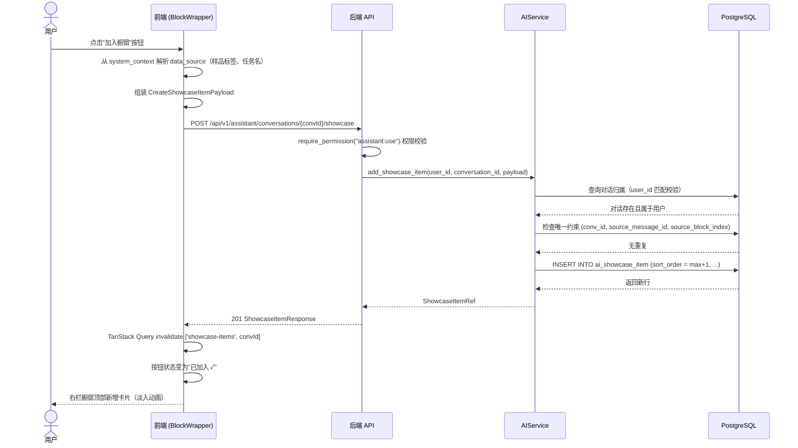
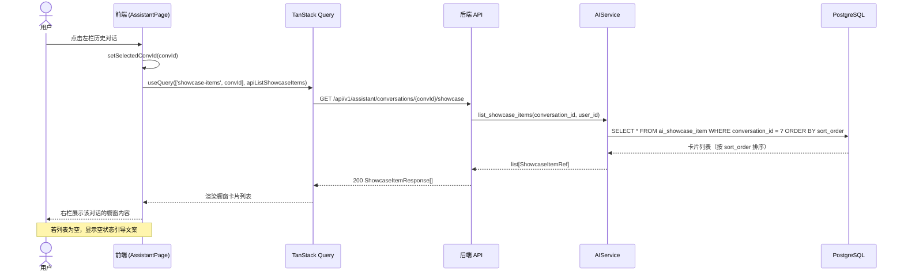
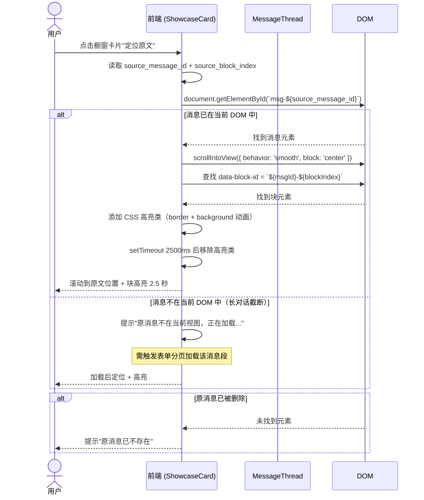
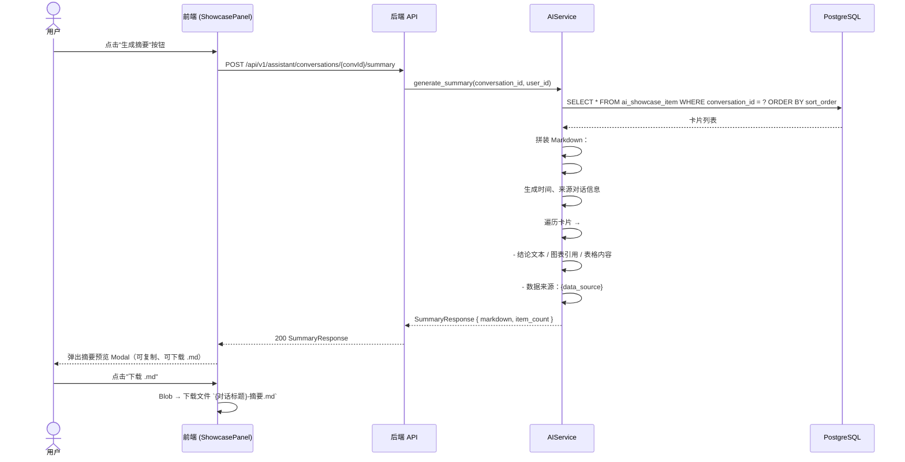

# IRIP AI 助手分析橱窗及可视化升级 — 架构设计 + 任务分解

> 文档语言：中文
> 项目名称：`irip-ai-showcase`
> 改造性质：增量升级（基于现有 AI 助手模块）
> 设计依据：`docs/prd-ai-showcase.md` + 主理人已拍板决策

---

## 目录

1. [实现方案 + 框架选型](#1-实现方案--框架选型)
2. [文件列表及相对路径](#2-文件列表及相对路径)
3. [数据结构和接口（类图）](#3-数据结构和接口类图)
4. [程序调用流程（时序图）](#4-程序调用流程时序图)
5. [任务列表](#5-任务列表)
6. [共享知识（跨文件约定）](#6-共享知识跨文件约定)
7. [待明确事项](#7-待明确事项)

---

## 1. 实现方案 + 框架选型

### 1.1 整体架构设计思路

本次改造为**增量升级**，不另起炉灶。核心思路：

```
┌─────────────────────────────────────────────────────────────────────────────┐
│                          前端 (React 18 + TypeScript)                          │
│                                                                               │
│  ┌──────────────┐  ┌──────────────────────┐  ┌─────────────────────────────┐  │
│  │  左栏 260px  │  │    中栏 flex:1       │  │      右栏 ~360px            │  │
│  │              │  │                      │  │   分析橱窗 (可收起 48px)     │  │
│  │ 对话列表     │  │  消息列表             │  │                             │  │
│  │ + 搜索框     │  │  (内容块化渲染)       │  │  ShowcasePanel             │  │
│  │              │  │  BlockWrapper         │  │  ├─ 卡片列表 (拖拽排序)     │  │
│  │              │  │  ├─ echarts block     │  │  ├─ 类型筛选               │  │
│  │              │  │  ├─ plotly block      │  │  ├─ 展开 Modal             │  │
│  │              │  │  ├─ table block       │  │  ├─ 定位原文               │  │
│  │              │  │  └─ conclusion block  │  │  ├─ 生成摘要 / 导出        │  │
│  │              │  │  [加入橱窗] 按钮      │  │  └─ 删除 / 重命名          │  │
│  └──────┬───────┘  └──────────┬───────────┘  └──────────┬──────────────────┘  │
│         │                     │                         │                     │
│         ▼                     ▼                         ▼                     │
│  ┌─────────────────────────────────────────────────────────────────────────┐ │
│  │                    TanStack Query + Axios (client.ts)                     │ │
│  │     models-ai.ts (现有)        showcase.ts (新建)                         │ │
│  └─────────────────────────────────┬───────────────────────────────────────┘ │
└──────────────────────────────────────┼──────────────────────────────────────┘
                                       │ HTTP REST
                                       ▼
┌─────────────────────────────────────────────────────────────────────────────┐
│                          后端 (FastAPI + SQLAlchemy async)                     │
│                                                                               │
│  ┌──────────────────────┐    ┌──────────────────────────────────────────┐    │
│  │  assistant.py (现有)   │    │  showcase.py (新建)                        │    │
│  │  - 对话 CRUD           │    │  - POST   /conversations/{id}/showcase    │    │
│  │  - 消息发送/列表       │    │  - GET    /conversations/{id}/showcase    │    │
│  │  + 搜索端点 (新增)     │    │  - PATCH  /showcase/{item_id}             │    │
│  │  GET /conversations    │    │  - DELETE /showcase/{item_id}             │    │
│  │    ?keyword=q          │    │  - PATCH  /showcase/{item_id}/reorder     │    │
│  │    (ILIKE 搜索)        │    │  - POST   /conversations/{id}/summary    │    │
│  └──────────┬───────────┘    └──────────────┬───────────────────────────┘    │
│             │                                │                                │
│             ▼                                ▼                                │
│  ┌──────────────────────────────────────────────────────────────────────┐   │
│  │                      AIService (service.py 现有 + 扩展)                  │   │
│  │  - 对话/消息管理 (现有)                                                 │   │
│  │  + search_conversations(keyword) (新增)                               │   │
│  │  + ShowcaseItem CRUD + reorder (新增)                                │   │
│  │  + generate_summary(conversation_id) (新增)                           │   │
│  └──────────────────────────────┬───────────────────────────────────────┘   │
│                                 │                                              │
│                                 ▼                                              │
│  ┌──────────────────────────────────────────────────────────────────────┐   │
│  │           PostgreSQL 16 (pgvector)                                      │   │
│  │  ai_conversation (现有)  ai_message (现有)  ai_showcase_item (新增)     │   │
│  └──────────────────────────────────────────────────────────────────────┘   │
└─────────────────────────────────────────────────────────────────────────────┘
```

**关键设计决策：**

| 决策点 | 方案 | 理由 |
|--------|------|------|
| 橱窗数据存储 | 新增 `ai_showcase_item` 表，`conversation_id` 外键 CASCADE | 满足 P0-03/P0-05 持久化要求，与对话独立绑定 |
| 块标识方案 | 前端解析 Markdown 时按块出现顺序生成 `block_index`，橱窗存 `message_id + block_index` | 已拍板方案A，不改消息表结构 |
| 搜索实现 | 后端 ILIKE（`title ILIKE '%q%'` + 子查询 `ai_message.content`） | 已拍板，首期数据量可控 |
| Plotly 引入 | `react-plotly.js` + `plotly.js-dist-min` | 已拍板，CodeBlockRenderer 增加 `plotly` 语言分支 |
| 图表缩略预览 | 实时渲染小尺寸图表（复用渲染组件，高度 120px） | 已拍板，不存图片 |
| 成果导出 | Markdown 摘要（可下载 .md） | 已拍板，图片打包留 P2 |
| 拖拽排序 | `@dnd-kit/sortable` | 已拍板，轻量、现代、无额外 peer dep |
| 后端路由文件 | 新建 `showcase.py` 独立路由文件 | `assistant.py` 已 550+ 行，拆分降低维护复杂度 |
| 前端 API 文件 | 新建 `showcase.ts` 独立 API 模块 | 与现有 `models-ai.ts` 分离，职责清晰 |
| 后端实体文件 | 新建 `packages/ai/showcase_entities.py` | 与现有 `service.py` 中的实体分离，避免文件过大 |
| 迁移编号 | **0052**（非 0043，因实际最新为 0051） | 实际代码库已有 51 个迁移 |

### 1.2 新增依赖包

#### 前端（pnpm，阿里云镜像 `registry.npmmirror.com`）

```
@dnd-kit/core@^6.1.0          — 拖拽核心库（无额外 peer dep）
@dnd-kit/sortable@^8.0.0      — 拖拽排序组件
@dnd-kit/utilities@^3.2.2     — 拖拽工具函数
react-plotly.js@^2.6.0        — Plotly React 封装组件
plotly.js-dist-min@^2.35.0   — Plotly 精简构建版（按需引入减少体积）
@types/react-plotly.js@^2.6.3 — Plotly 类型声明（devDep）
```

> **镜像验证**：以上包均在 npm registry 有源，阿里云 npmmirror 自动同步。

#### 后端（uv，中科大镜像 `pypi.mirrors.ustc.edu.cn`）

无需新增 Python 依赖包。现有技术栈（FastAPI + SQLAlchemy async + PostgreSQL JSONB）已满足全部需求。

### 1.3 架构模式

沿用项目现有模式：
- **后端**：分层架构（Router → Service → Entity/DB），Composition Root 依赖注入
- **前端**：Feature-based 模块组织（`features/assistant/` 目录下按组件拆分），TanStack Query 数据获取，Zustand 本地状态管理
- **数据流**：单向数据流，前端 TanStack Query 管理服务端缓存，Zustand 管理 UI 状态

---

## 2. 文件列表及相对路径

### 2.1 后端文件

| # | 文件路径 | 状态 | 职责 |
|---|---------|------|------|
| B1 | `packages/ai/showcase_entities.py` | 【新建】 | `ShowcaseItem` SQLAlchemy 模型 + `ShowcaseItemRef` 值对象 |
| B2 | `migrations/versions/0052_ai_showcase_item.py` | 【新建】 | Alembic 迁移：创建 `ai_showcase_item` 表 |
| B3 | `apps/api/routers/showcase.py` | 【新建】 | 橱窗 API 路由（CRUD + 排序 + 摘要生成 + 搜索） |
| B4 | `apps/api/main.py` | 【修改】 | 注册 `showcase_router` 到 FastAPI app |
| B5 | `packages/ai/service.py` | 【修改】 | AIService 新增橱窗 CRUD + 搜索 + 摘要方法 |
| B6 | `apps/api/composition/ai.py` | 【修改】 | 注册 showcase 路由的 session_factory |
| B7 | `packages/ai/openai_compatible.py` | 【修改】 | system prompt 增加 Plotly 图表类型指引 |

### 2.2 前端文件

| # | 文件路径 | 状态 | 职责 |
|---|---------|------|------|
| F1 | `apps/web/src/api/showcase.ts` | 【新建】 | 橱窗 API 定义（类型 + 请求函数） |
| F2 | `apps/web/src/features/assistant/ShowcasePanel.tsx` | 【新建】 | 右栏橱窗面板主组件（收起/展开、卡片列表、筛选、底部操作） |
| F3 | `apps/web/src/features/assistant/ShowcaseCard.tsx` | 【新建】 | 橱窗卡片组件（缩略预览、展开 Modal、定位原文、删除、重命名） |
| F4 | `apps/web/src/features/assistant/ShowcaseSortableList.tsx` | 【新建】 | @dnd-kit 拖拽排序列表容器 |
| F5 | `apps/web/src/features/assistant/PlotlyBlock.tsx` | 【新建】 | Plotly 图表渲染组件（复用于消息区 + 橱窗缩略图） |
| F6 | `apps/web/src/features/assistant/BlockWrapper.tsx` | 【新建】 | 内容块包装器（悬浮操作按钮组 + block_index 生成 + DOM 标识） |
| F7 | `apps/web/src/features/assistant/SummaryModal.tsx` | 【新建】 | 摘要预览 Modal（复制 / 下载 .md） |
| F8 | `apps/web/src/features/assistant/ConversationSearch.tsx` | 【新建】 | 左栏搜索输入框组件 |
| F9 | `apps/web/src/features/assistant/AssistantPage.tsx` | 【修改】 | 两栏 → 三栏布局改造，集成搜索/橱窗/块化组件 |
| F10 | `apps/web/src/features/assistant/MessageThread.tsx` | 【修改】 | 消息渲染内容块化改造（BlockWrapper + Plotly 支持） |
| F11 | `apps/web/src/features/assistant/index.ts` | 【修改】 | 导出新增组件 |
| F12 | `apps/web/package.json` | 【修改】 | 新增前端依赖包声明 |

### 2.3 文件总数

- 后端：7 个文件（3 新建 + 4 修改）
- 前端：12 个文件（8 新建 + 4 修改）
- **合计 19 个文件**

---

## 3. 数据结构和接口（类图）

### 3.1 数据库表 DDL

```sql
-- 0052 迁移：创建 ai_showcase_item 表
CREATE TABLE ai_showcase_item (
    id              UUID PRIMARY KEY DEFAULT gen_random_uuid(),
    conversation_id UUID NOT NULL REFERENCES ai_conversation(id) ON DELETE CASCADE,
    user_id         UUID NOT NULL,
    sort_order      INTEGER NOT NULL DEFAULT 0,
    block_type      VARCHAR(32) NOT NULL,  -- echarts / plotly / table / conclusion / formula / text
    title           VARCHAR(200) NOT NULL DEFAULT '',
    content_snapshot TEXT NOT NULL,         -- 块内容的完整快照（Markdown 原文 / JSON 配置）
    source_message_id UUID NOT NULL,
    source_block_index INTEGER NOT NULL DEFAULT 0,
    data_source     JSONB NOT NULL DEFAULT '{}'::jsonb,
    created_at      TIMESTAMPTZ NOT NULL DEFAULT now(),
    updated_at      TIMESTAMPTZ NOT NULL DEFAULT now()
);

-- 唯一约束：同一对话内 message_id + block_index 去重（防重复加入）
CREATE UNIQUE INDEX uq_showcase_conv_msg_block
    ON ai_showcase_item (conversation_id, source_message_id, source_block_index);

-- 排序查询索引
CREATE INDEX idx_showcase_conv_sort
    ON ai_showcase_item (conversation_id, sort_order);
```

### 3.2 SQLAlchemy 模型

```python
# packages/ai/showcase_entities.py

class ShowcaseItem(Base):
    """橱窗卡片实体（对应 ai_showcase_item 表）。"""
    __tablename__ = "ai_showcase_item"

    id: Mapped[UUID] = mapped_column(GUID, primary_key=True, default=new_id)
    conversation_id: Mapped[UUID] = mapped_column(
        GUID, sa.ForeignKey("ai_conversation.id", ondelete="CASCADE"), nullable=False
    )
    user_id: Mapped[UUID] = mapped_column(GUID, nullable=False)
    sort_order: Mapped[int] = mapped_column(sa.Integer, nullable=False, default=0)
    block_type: Mapped[str] = mapped_column(sa.String(32), nullable=False)
    title: Mapped[str] = mapped_column(sa.String(200), nullable=False, default="")
    content_snapshot: Mapped[str] = mapped_column(sa.Text, nullable=False)
    source_message_id: Mapped[UUID] = mapped_column(GUID, nullable=False)
    source_block_index: Mapped[int] = mapped_column(sa.Integer, nullable=False, default=0)
    data_source: Mapped[dict] = mapped_column(
        JSONB, nullable=False, default=dict, server_default=sa.text("'{}'::jsonb")
    )
    created_at: Mapped[datetime] = mapped_column(UTCDateTime, nullable=False)
    updated_at: Mapped[datetime] = mapped_column(UTCDateTime, nullable=False)


@dataclass(frozen=True)
class ShowcaseItemRef:
    """橱窗卡片引用（不可变值对象）。"""
    id: UUID
    conversation_id: UUID
    sort_order: int
    block_type: str
    title: str
    content_snapshot: str
    source_message_id: UUID
    source_block_index: int
    data_source: dict[str, Any]
    created_at: datetime
    updated_at: datetime
```

### 3.3 类图

```mermaid
classDiagram
    %% ===== 后端实体层 =====
    class AIConversation {
        +UUID id
        +UUID organization_id
        +UUID user_id
        +str title
        +str provider_mode
        +bool pinned
        +bool archived
        +str|None system_context
        +datetime created_at
        +datetime updated_at
    }

    class AIMessage {
        +UUID id
        +UUID conversation_id
        +str role
        +str content
        +list tool_calls_json
        +list citations_json
        +str|None uncertainty
        +datetime created_at
    }

    class ShowcaseItem {
        +UUID id
        +UUID conversation_id
        +UUID user_id
        +int sort_order
        +str block_type
        +str title
        +str content_snapshot
        +UUID source_message_id
        +int source_block_index
        +dict data_source
        +datetime created_at
        +datetime updated_at
    }

    AIConversation "1" --> "*" AIMessage : conversation_id CASCADE
    AIConversation "1" --> "*" ShowcaseItem : conversation_id CASCADE

    %% ===== 值对象 =====
    class ShowcaseItemRef {
        +UUID id
        +UUID conversation_id
        +int sort_order
        +str block_type
        +str title
        +str content_snapshot
        +UUID source_message_id
        +int source_block_index
        +dict data_source
        +datetime created_at
        +datetime updated_at
    }

    class ConversationRef {
        +UUID id
        +str title
        +str provider_mode
        +bool pinned
        +bool archived
        +datetime created_at
        +datetime updated_at
        +str|None system_context
    }

    class MessageRef {
        +UUID id
        +UUID conversation_id
        +str role
        +str content
        +list tool_calls
        +list citations
        +str|None uncertainty
        +datetime created_at
    }

    %% ===== 服务层 =====
    class AIService {
        -AIProvider _provider
        -ToolRegistry _tool_registry
        -async_sessionmaker _factory
        -Clock _clock
        +create_conversation() ConversationRef
        +list_conversations() list~ConversationRef~
        +toggle_pin() bool
        +toggle_archive() bool
        +delete_conversation() None
        +list_messages() list~MessageRef~
        +ask() AIResponse
        +search_conversations(keyword) list~ConversationRef~
        +add_showcase_item(item) ShowcaseItemRef
        +list_showcase_items(conv_id) list~ShowcaseItemRef~
        +update_showcase_item(item_id, title) ShowcaseItemRef
        +delete_showcase_item(item_id) None
        +reorder_showcase_items(conv_id, item_ids) None
        +generate_summary(conv_id) str
    }

    ShowcaseItem ..> ShowcaseItemRef : 映射为
    AIConversation ..> ConversationRef : 映射为
    AIMessage ..> MessageRef : 映射为

    %% ===== 后端路由层 =====
    class ShowcaseRouter {
        +POST /conversations/{id}/showcase
        +GET /conversations/{id}/showcase
        +PATCH /showcase/{item_id}
        +DELETE /showcase/{item_id}
        +PATCH /showcase/{item_id}/reorder
        +POST /conversations/{id}/summary
    }

    class AssistantRouter {
        +GET /conversations?keyword=q
        +POST /conversations
        +GET /conversations
        +POST /conversations/{id}/messages
        +GET /conversations/{id}/messages
    }

    ShowcaseRouter --> AIService : 调用
    AssistantRouter --> AIService : 调用

    %% ===== Pydantic Schema =====
    class CreateShowcaseItemRequest {
        +str block_type
        +str title
        +str content_snapshot
        +str source_message_id
        +int source_block_index
        +dict data_source
    }

    class UpdateShowcaseItemRequest {
        +str|None title
    }

    class ReorderShowcaseRequest {
        +list~str~ item_ids
    }

    class ShowcaseItemResponse {
        +str id
        +str conversation_id
        +int sort_order
        +str block_type
        +str title
        +str content_snapshot
        +str source_message_id
        +int source_block_index
        +dict data_source
        +datetime created_at
        +datetime updated_at
    }

    class SummaryResponse {
        +str markdown
        +int item_count
    }

    CreateShowcaseItemRequest ..> ShowcaseItemResponse : 创建→返回
    UpdateShowcaseItemRequest ..> ShowcaseItemResponse : 更新→返回
```

### 3.4 前端 TypeScript 类型定义

```typescript
// apps/web/src/api/showcase.ts

/** 橱窗卡片类型 */
export type ShowcaseBlockType = 'echarts' | 'plotly' | 'table' | 'conclusion' | 'formula' | 'text';

/** 数据来源信息 */
export type DataSourceInfo = {
  sample_labels: string[];      // 样品标签列表
  task_name: string;            // 任务名称
  fields: string[];             // 字段/检测指标
  source_tag: string;           // 数据来源标识
  data_range: string;           // 数据范围摘要
};

/** 橱窗卡片（前端类型） */
export type ShowcaseItem = {
  id: string;
  conversation_id: string;
  sort_order: number;
  block_type: ShowcaseBlockType;
  title: string;
  content_snapshot: string;
  source_message_id: string;
  source_block_index: number;
  data_source: DataSourceInfo;
  created_at: string;
  updated_at: string;
};

/** 创建橱窗卡片请求 */
export type CreateShowcaseItemPayload = {
  block_type: ShowcaseBlockType;
  title: string;
  content_snapshot: string;
  source_message_id: string;
  source_block_index: number;
  data_source: DataSourceInfo;
};

/** 更新橱窗卡片请求 */
export type UpdateShowcaseItemPayload = {
  title?: string;
};

/** 重排序请求 */
export type ReorderShowcasePayload = {
  item_ids: string[];
};

/** 摘要响应 */
export type SummaryResponse = {
  markdown: string;
  item_count: number;
};

/** 搜索结果对话 */
export type ConversationSearchResult = ConversationSummary; // 复用现有类型
```

---

## 4. 程序调用流程（时序图）

### 4.1 加入橱窗流程



### 4.2 切换对话恢复橱窗流程



### 4.3 定位原文流程



### 4.4 生成摘要流程



---

## 5. 任务列表

> 以下任务按实现顺序排列（先底层后上层，先后端后前端）。
> 每个任务标注依赖关系，工程师按序执行。

### T01：后端数据模型 + 迁移 + 实体

| 项 | 内容 |
|----|------|
| **任务编号** | T01 |
| **任务标题** | 后端数据模型 + 迁移 + 实体定义 |
| **依赖** | 无 |
| **涉及文件** | `packages/ai/showcase_entities.py`【新建】, `migrations/versions/0052_ai_showcase_item.py`【新建】 |
| **任务描述** | 1. 在 `packages/ai/showcase_entities.py` 中定义 `ShowcaseItem` SQLAlchemy 模型（字段：id / conversation_id FK CASCADE / user_id / sort_order / block_type / title / content_snapshot / source_message_id / source_block_index / data_source JSONB / created_at / updated_at）和 `ShowcaseItemRef` frozen dataclass 值对象。模型继承 `packages.common.database.Base`，列类型使用 `GUID` / `UTCDateTime` / `JSONB`（参照现有 `service.py` 中的 `AIConversation` / `AIMessage` 模式）。2. 创建 Alembic 迁移 `0052_ai_showcase_item.py`，`revision="0052"`，`down_revision="0051"`，包含建表 DDL + 唯一索引 `uq_showcase_conv_msg_block (conversation_id, source_message_id, source_block_index)` + 排序索引 `idx_showcase_conv_sort (conversation_id, sort_order)`，同时编写 `downgrade()` 回滚函数。 |
| **优先级** | P0 |

### T02：后端 API 端点 + 服务层 + 搜索

| 项 | 内容 |
|----|------|
| **任务编号** | T02 |
| **任务标题** | 后端 API 端点 + 服务层方法 + 对话搜索 |
| **依赖** | T01 |
| **涉及文件** | `packages/ai/service.py`【修改】, `apps/api/routers/showcase.py`【新建】, `apps/api/main.py`【修改】, `apps/api/composition/ai.py`【修改】, `packages/ai/openai_compatible.py`【修改】 |
| **任务描述** | 1. 在 `service.py` 的 `AIService` 类中新增方法：`search_conversations(user_id, org_id, keyword, archived_only)` — 用 ILIKE 搜索对话标题 + 子查询 `ai_message.content`；`add_showcase_item(user_id, conversation_id, payload)` — 校验对话归属 + 唯一约束去重 + INSERT；`list_showcase_items(conversation_id, user_id)` — 校验对话归属 + ORDER BY sort_order 查询；`update_showcase_item(item_id, user_id, title)` — 校验归属 + UPDATE title；`delete_showcase_item(item_id, user_id)` — 校验归属 + DELETE；`reorder_showcase_items(conversation_id, user_id, item_ids)` — 批量更新 sort_order；`generate_summary(conversation_id, user_id)` — 查询全部卡片 + 拼装 Markdown 字符串。2. 新建 `showcase.py` 路由文件，定义 `showcase_router = APIRouter(prefix="/api/v1/assistant")`，实现端点：`POST /conversations/{id}/showcase`、`GET /conversations/{id}/showcase`、`PATCH /showcase/{item_id}`、`DELETE /showcase/{item_id}`、`PATCH /showcase/{item_id}/reorder`、`POST /conversations/{id}/summary`，每个端点使用 `AssistantUserDep` 权限依赖，定义对应 Pydantic 请求/响应模型。3. 在 `assistant.py` 的 `list_conversations` 端点增加 `keyword: str | None = Query(None)` 参数，传入 `service.search_conversations()` 或 `service.list_conversations()`（有 keyword 时走搜索，无 keyword 走原逻辑）。4. 在 `main.py` 中 import 并 `app.include_router(showcase_router)`。5. 在 `composition/ai.py` 中 import `showcase.py` 的 `set_showcase_session_factory` 并调用。6. 在 `openai_compatible.py` 的 `_build_payload` 方法中，system prompt 增加 Plotly 图表指引：当需要误差棒图、箱线图、三维散点图等科研图表时使用 ` ```plotly ` 代码块，附 Plotly JSON 配置示例。 |
| **优先级** | P0 |

### T03：前端类型 + API 层 + 依赖安装

| 项 | 内容 |
|----|------|
| **任务编号** | T03 |
| **任务标题** | 前端类型定义 + API 层 + 依赖包安装 |
| **依赖** | T02 |
| **涉及文件** | `apps/web/src/api/showcase.ts`【新建】, `apps/web/src/api/models-ai.ts`【修改】, `apps/web/package.json`【修改】, `apps/web/src/features/assistant/index.ts`【修改】 |
| **任务描述** | 1. 新建 `showcase.ts`：定义 `ShowcaseBlockType` / `DataSourceInfo` / `ShowcaseItem` / `CreateShowcaseItemPayload` / `UpdateShowcaseItemPayload` / `ReorderShowcasePayload` / `SummaryResponse` TypeScript 类型；实现 API 函数：`apiListShowcaseItems(convId)` / `apiAddShowcaseItem(convId, payload)` / `apiUpdateShowcaseItem(itemId, payload)` / `apiDeleteShowcaseItem(itemId)` / `apiReorderShowcaseItems(convId, itemIds)` / `apiGenerateSummary(convId)`，使用现有 `http` 客户端（从 `./client` import），遵循现有 `models-ai.ts` 的编码风格。2. 在 `models-ai.ts` 中修改 `apiListConversations` 函数签名，增加 `keyword?: string` 参数，传递给后端 `?keyword=q`；同时修改返回的 `ConversationSummary` 类型如需调整。3. 在 `package.json` 的 `dependencies` 中添加 `@dnd-kit/core` / `@dnd-kit/sortable` / `@dnd-kit/utilities` / `react-plotly.js` / `plotly.js-dist-min`，在 `devDependencies` 中添加 `@types/react-plotly.js`，执行 `pnpm install`。4. 在 `index.ts` 中导出新增组件（`ShowcasePanel` / `BlockWrapper` / `PlotlyBlock` 等，待后续任务创建后补充导出）。 |
| **优先级** | P0 |

### T04：前端三栏布局 + 搜索 + 内容块化 + Plotly

| 项 | 内容 |
|----|------|
| **任务编号** | T04 |
| **任务标题** | 前端三栏布局改造 + 搜索 + 消息内容块化 + Plotly 渲染 |
| **依赖** | T03 |
| **涉及文件** | `apps/web/src/features/assistant/AssistantPage.tsx`【修改】, `apps/web/src/features/assistant/MessageThread.tsx`【修改】, `apps/web/src/features/assistant/ConversationSearch.tsx`【新建】, `apps/web/src/features/assistant/BlockWrapper.tsx`【新建】, `apps/web/src/features/assistant/PlotlyBlock.tsx`【新建】 |
| **任务描述** | 1. **AssistantPage.tsx 改造**：将现有两栏布局（`display: flex`，左 260px + 中 flex:1）改为三栏（左 260px + 中 flex:1 + 右 360px 可收起）。新增 `showcaseCollapsed` state 控制右栏收起/展开（收起时宽 48px 显示图标+数量）。在左栏 Card 内顶部加入 `ConversationSearch` 组件。修改 `apiListConversations` 调用，传入 `keyword` 参数。在右侧渲染 `ShowcasePanel` 组件（本任务先放占位，T05 实现）。使用 TanStack Query 的 `useQuery(['showcase-items', selectedConvId])` 加载橱窗数据（T05 完成 ShowCasePanel 后生效）。2. **ConversationSearch.tsx**：搜索输入框组件（Ant Design `Input` + `SearchOutlined` 图标 + `allowClear`），输入时 debounce 300ms 后触发 `setSearchKeyword` 回调（由 AssistantPage 传入），清空时恢复完整列表。3. **MessageThread.tsx 改造**：将 AI 消息的 `MarkdownWithMath` 渲染改为块化渲染。使用 react-markdown 的 `components` 自定义渲染：对 `code` 节点，`lang === 'echarts'` 时用 `BlockWrapper` 包裹 `ChartBlock`；`lang === 'plotly'` 时用 `BlockWrapper` 包裹 `PlotlyBlock`；对 `table` 节点用 `BlockWrapper` 包裹（类型 `table`）；对 `h2`/`h3` 节点用 `BlockWrapper` 包裹（类型 `conclusion`）；对 KaTeX display 公式用 `BlockWrapper` 包裹（类型 `formula`）。每个 `BlockWrapper` 生成 `block_index`（在当前消息内的序号），设置 `data-block-id` DOM 属性。4. **BlockWrapper.tsx**：通用内容块包装器组件，props 含 `messageId` / `blockIndex` / `blockType` / `children`。渲染内容 + 右上角悬浮操作按钮组（加入橱窗 / 导出图片 / 查看数据）。"加入橱窗"按钮点击后调用 `apiAddShowcaseItem`，成功后状态变"已加入 ✓"（通过查询橱窗列表判断当前块是否已加入）。从 `system_context`（通过 props 或 context 传入）解析 `data_source`。5. **PlotlyBlock.tsx**：Plotly 图表渲染组件，props 含 `optionStr`（Plotly JSON 配置字符串）和可选 `height`（默认 400，缩略图模式 120）。使用 `react-plotly.js` 的 `Plot` 组件 + `plotly.js-dist-min`。包含 JSON 宽松解析（复用 `ChartBlock` 的 lenient parser 逻辑）、防抖渲染、resize 响应、复制配置按钮。 |
| **优先级** | P0 |

### T05：前端橱窗面板 + 拖拽排序 + 摘要导出 + 定位原文

| 项 | 内容 |
|----|------|
| **任务编号** | T05 |
| **任务标题** | 前端橱窗面板 + 拖拽排序 + 缩略预览 + 摘要导出 + 定位原文 |
| **依赖** | T04 |
| **涉及文件** | `apps/web/src/features/assistant/ShowcasePanel.tsx`【新建】, `apps/web/src/features/assistant/ShowcaseCard.tsx`【新建】, `apps/web/src/features/assistant/ShowcaseSortableList.tsx`【新建】, `apps/web/src/features/assistant/SummaryModal.tsx`【新建】 |
| **任务描述** | 1. **ShowcasePanel.tsx**：右栏橱窗面板主组件，props 含 `conversationId` / `systemContext` / `onLocateMessage(messageId, blockIndex)`。标题栏："分析橱窗" + 卡片数量 `Badge` + 收起/展开 `Button`。使用 `useQuery(['showcase-items', conversationId], apiListShowcaseItems)` 加载数据。卡片列表区域用 `ShowcaseSortableList` 渲染。底部操作栏："生成摘要"按钮（空橱窗禁用）→ 调用 `apiGenerateSummary` → 弹出 `SummaryModal`。空状态：引导文案"在对话中点击「加入橱窗」将重要内容留存到这里"。收起态：窄边条显示橱窗图标 + 数字角标。使用 `useMutation` 处理删除/重命名/排序的乐观更新。2. **ShowcaseCard.tsx**：单张橱窗卡片组件，props 含 `item` / `onLocate` / `onDelete` / `onRename`。顶部：类型图标 + 标题（双击进入编辑模式）+ 类型 `Tag`。中部：缩略预览（`block_type === 'echarts'` → 复用 `ChartBlock` 高度 120px；`plotly` → 复用 `PlotlyBlock` 高度 120px；`table` → 表格前 3 行；`conclusion`/`formula`/`text` → 前 2 行文本）。底部：数据来源摘要 + 创建时间。操作区：展开（弹出全屏 `Modal` 显示完整内容）、定位原文（调用 `onLocate`）、删除（`Popconfirm` 二次确认）。3. **ShowcaseSortableList.tsx**：使用 `@dnd-kit/sortable` 的 `DndContext` + `SortableContext` + `useSortable` 实现拖拽排序。拖拽结束后调用 `apiReorderShowcaseItems` 持久化新顺序，失败时回滚。4. **SummaryModal.tsx**：摘要预览 Modal，props 含 `open` / `markdown` / `onClose`。用 `react-markdown` 渲染 Markdown 预览。底部操作：复制到剪贴板（`navigator.clipboard.writeText`）、下载 .md（`Blob` + `a.download`）。5. **AssistantPage.tsx 集成**（配合 T04 已改造的布局）：将 `onLocateMessage` 回调传入 `ShowcasePanel`，实现定位原文功能：`document.getElementById('msg-${messageId}')` → `scrollIntoView` → 查找 `data-block-id` → 高亮 2.5 秒。 |
| **优先级** | P0 |

### T06：前端原文定位 + 状态一致性 + 集成调试

| 项 | 内容 |
|----|------|
| **任务编号** | T06 |
| **任务标题** | 原文定位完整实现 + 块加入状态一致性 + 端到端集成调试 |
| **依赖** | T05 |
| **涉及文件** | `apps/web/src/features/assistant/AssistantPage.tsx`【修改】, `apps/web/src/features/assistant/MessageThread.tsx`【修改】, `apps/web/src/features/assistant/BlockWrapper.tsx`【修改】 |
| **任务描述** | 1. **原文定位**：在 `AssistantPage.tsx` 中实现 `handleLocateMessage(messageId, blockIndex)` 函数：用 `document.getElementById('msg-${messageId}')` 查找消息 DOM 节点 → `scrollIntoView({ behavior: 'smooth', block: 'center' })` → 查找 `data-block-id="${messageId}-${blockIndex}"` 子元素 → 添加 CSS 高亮类（边框 + 背景渐变动画）→ `setTimeout(2500)` 后移除。若未找到消息节点，提示"原消息已不存在"。2. **块加入状态一致性**：`BlockWrapper` 在渲染时通过 `useQuery(['showcase-items', conversationId])` 的缓存数据判断当前块是否已加入橱窗（遍历 `source_message_id === messageId && source_block_index === blockIndex`）。加入成功后 `invalidateQueries` 刷新缓存，按钮自动变"已加入 ✓"。删除橱窗卡片后同样 `invalidateQueries`，对应块的按钮恢复为"加入橱窗"。3. **端到端集成调试**：验证三栏布局在不同窗口宽度下的自适应（中部不溢出）；验证数据加载 Modal 不被三栏布局遮挡；验证现有 ECharts 渲染不受 Plotly 引入影响；验证流式输出中内容块化渲染不导致闪烁；验证搜索 → 点击对话 → 橱窗恢复的完整链路；验证加入橱窗 → 刷新页面 → 橱窗内容保持的持久化链路。4. **types.ts 辅助**（如需）：补充前端共享类型（如 `BlockType` 枚举常量映射），确保 `showcase.ts` 和 `BlockWrapper.tsx` 中的类型定义一致。 |
| **优先级** | P0 |

---

## 6. 共享知识（跨文件约定）

### 6.1 块标识方案（block_index 生成规则）

```
规则：
- 前端在 react-markdown 渲染 AI 消息时，对每个"可操作块"按出现顺序分配 block_index
- block_index 从 0 开始，同一消息内唯一递增
- 可操作块类型及识别方式：
  - echarts: ```echarts 代码块
  - plotly:  ```plotly 代码块
  - table:   Markdown 表格节点
  - conclusion: h2/h3 标题段落（标题 + 其后的正文段落作为一个块）
  - formula:    KaTeX display 公式
  - text:       用户框选文字（P1，首期可不做）
- DOM 标识：data-block-id="{messageId}-{blockIndex}"
- 橱窗去重：后端唯一索引 uq_showcase_conv_msg_block (conversation_id, source_message_id, source_block_index)
```

### 6.2 橱窗卡片数据结构约定

```json
// ai_showcase_item.data_source (JSONB) 结构
{
  "sample_labels": ["样品A", "样品B"],     // 从 system_context 的 "### 样品: XXX" 提取
  "task_name": "任务XXX",                   // 从 system_context 中任务分组提取
  "fields": ["D50", "比表面积"],             // 检测指标/字段（首期可从 content_snapshot 粗略提取或留空）
  "source_tag": "实验数据",                  // 数据来源标识
  "data_range": "样品A-B"                    // 数据范围摘要
}

// ai_showcase_item.content_snapshot 存储内容：
// - echarts/plotly: 完整的 JSON 配置字符串（原样保存，非截图）
// - table: Markdown 表格原文（| ... | ... |）
// - conclusion: Markdown 标题 + 正文段落原文
// - formula: KaTeX 原文（$$ ... $$）
// - text: 选中文本
```

### 6.3 前后端接口约定

```
API 前缀: /api/v1/assistant（复用现有 assistant 路由前缀）
权限: 所有端点需 require_permission("assistant:use")
认证: JWT Bearer Token（由 client.ts 拦截器自动添加）
错误格式: { "error": { "code", "message", "retryable", "fields" } }
时间格式: ISO 8601 UTC（后端 datetime → Pydantic 自动序列化）
ID 格式: UUID 字符串

响应模型统一格式:
  - 列表: { "items": [...] }
  - 单项: 直接返回对象
  - 删除: 204 No Content
  - 创建: 201 Created + 对象

前端 TanStack Query Key 约定:
  - 橱窗卡片列表: ['showcase-items', conversationId]
  - 对话列表: ['assistant-conversations', showArchived, keyword?]
  - 消息列表: ['assistant-messages', conversationId]

前端乐观更新策略:
  - 拖拽排序: onMutate 先更新缓存中的 sort_order，失败时 rollback
  - 删除卡片: onMutate 先从缓存移除，失败时恢复
  - 重命名: onMutate 先更新 title，失败时恢复
```

### 6.4 System Prompt Plotly 指引（追加内容）

在 `openai_compatible.py` 的 `_build_payload` 方法中，system_content 追加以下内容：

```
\n\n科研可视化指引：
当需要绘制误差棒图、箱线图、三维散点图、分布图、热力图等
ECharts 难以胜任的科研图表时，使用 ```plotly 代码块包裹 Plotly JSON 配置。
Plotly 配置示例（误差棒图）：
```plotly
{"data":[{"x":["A","B","C"],"y":[10,20,15],"error_y":{"type":"data","array":[1,2,1.5],"visible":true},"type":"bar"}],"layout":{"title":"误差棒图"}}
```
支持的 Plotly 图表类型：
- error bar（误差棒图）: type="bar" + error_y
- box plot（箱线图）: type="box"
- 3D scatter（三维散点图）: type="scatter3d"
- heatmap（热力图）: type="heatmap"
普通二维图表（折线/柱状/饼图/散点图）仍使用 ECharts。
```

---

## 7. 待明确事项

| # | 事项 | 影响范围 | 建议处理 |
|---|------|----------|----------|
| 1 | **迁移编号实际为 0052** | 团队 lead 通知中说"0043"，但实际最新迁移为 0051 | 已在设计中使用 0052，需通知团队 lead 更正 |
| 2 | **block_index 稳定性** | 方案A 依赖 AI 回答中块的顺序稳定。如果 AI 重新生成回答，block_index 可能变化，导致橱窗卡片的 `source_block_index` 失效 | 首期接受此风险（快照语义），后续可考虑在 content 中加唯一锚点 |
| 3 | **长对话分页加载** | PRD P0-07 AC4 提到"来源消息不在当前已加载消息中时先触发加载"，但现有前端一次性加载全部消息（`apiListMessages`），无分页机制 | 首期：消息全部加载，不存在截断场景；后续如消息量大需分页时再处理 |
| 4 | **content_snapshot 大小限制** | ECharts/Plotly JSON 配置可能较大，`content_snapshot` 为 TEXT 类型无大小限制，但前端渲染大量图表缩略图可能影响性能 | 首期数据量可控；橱窗面板为纵向滚动，仅可见区域渲染，使用虚拟列表可优化（留 P2） |
| 5 | **plotly.js-dist-min 体积** | plotly.js 精简版约 3.5MB（gzip ~1MB），对首次加载有影响 | 使用动态 `import()` 按需加载（在 `PlotlyBlock.tsx` 中用 `React.lazy` 或 `import()`），不影响初始包体积 |
| 6 | **@dnd-kit 版本兼容性** | 需验证 @dnd-kit/core@6 + @dnd-kit/sortable@8 + React 18 兼容 | 已确认兼容，@dnd-kit 官方支持 React 18 |
| 7 | **system_context 解析 data_source** | `data_source` 需从 `system_context` 字符串中提取样品标签和任务名称，解析逻辑依赖 `system_context` 的文本格式（`### 样品: XXX` 模式） | 首期用正则提取（与 AssistantPage 现有 `conv.system_context.match(/### 样品: (.+)/g)` 逻辑一致）；后续可结构化 system_context |
