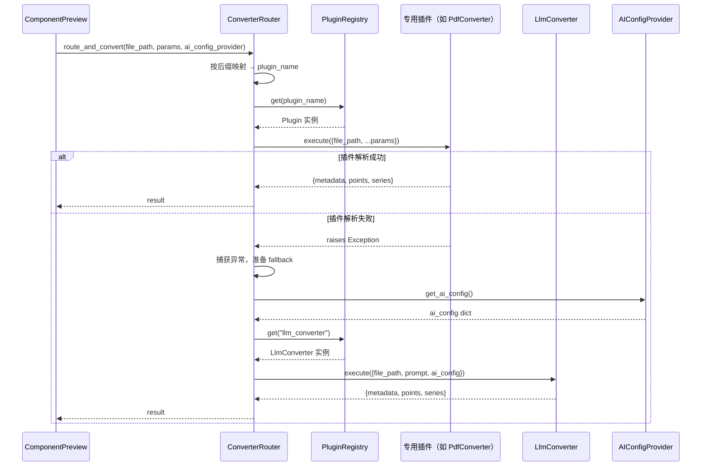
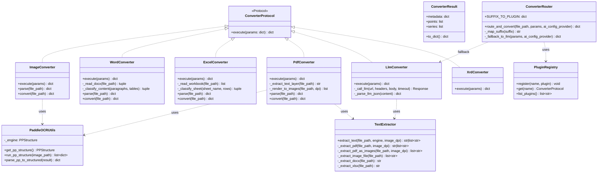
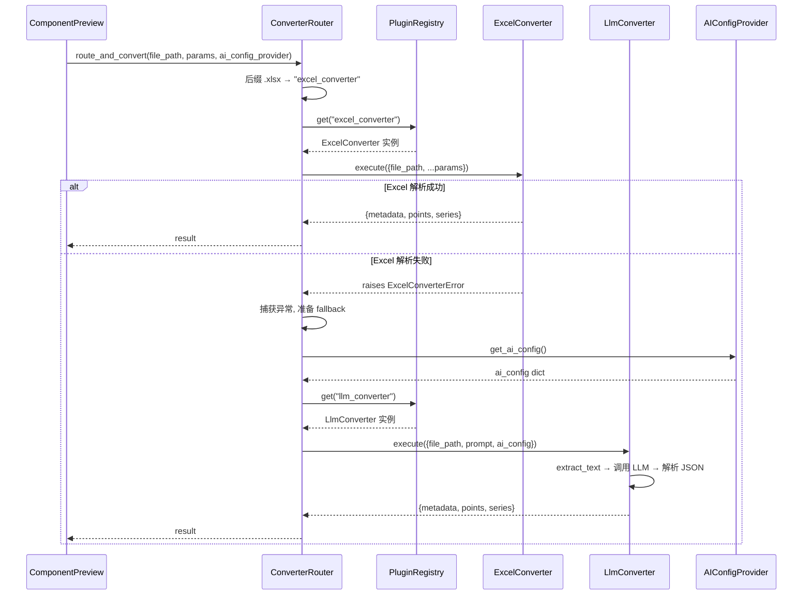
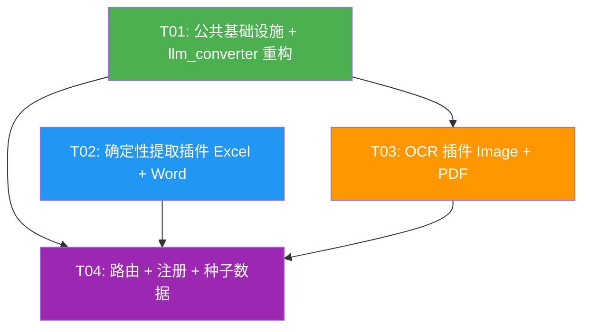

# IRIP Converter 插件化重构 + PaddleOCR 集成 — 架构设计文档

> **文档版本**：v1.0  
> **编写人**：架构师 高见远（Gao）  
> **日期**：2025-07-11  
> **输入**：`docs/prd-converter-refactor.md` + 技术调研结论

---

## 目录

1. [实现方案概述](#1-实现方案概述)
2. [文件列表](#2-文件列表)
3. [各插件设计](#3-各插件设计)
4. [公共模块设计](#4-公共模块设计)
5. [路由与 Fallback 设计](#5-路由与-fallback-设计)
6. [registry.py 和 tools.py 更新](#6-registrypy-和-toolspy-更新)
7. [任务列表](#7-任务列表)
8. [依赖包列表](#8-依赖包列表)
9. [共享知识](#9-共享知识跨文件约定)
10. [待明确事项](#10-待明确事项)

---

## 1. 实现方案概述

### 1.1 整体策略

| 类别 | 文件 | 说明 |
|------|------|------|
| **新建** | 4 个 converter 插件目录 | `pdf_converter`、`excel_converter`、`word_converter`、`image_converter`，各含 `__init__.py` + `converter.py` |
| **新建** | 1 个公共模块目录 | `converters/common/`，含 `__init__.py`、`text_extractor.py`、`paddle_ocr_utils.py` |
| **新建** | 1 个路由模块 | `packages/plugins/router.py`，统一路由 + fallback |
| **修改** | `llm_converter/converter.py` | 重构为兜底：移除 `_extract_text` 及子函数，改为从 `common.text_extractor` 导入；补全异常定义、`parse()`/`convert()` 分层 |
| **修改** | `registry.py` | `_auto_register()` 新增 4 个插件注册行 |
| **修改** | `tools.py` | `PLUGIN_TOOLS` 新增 4 个 `ToolSpec(category="ingestion")` |
| **修改** | `component_preview.py` | `_extract_file_content()` 的 import 路径从 `llm_converter._extract_text` 改为 `common.text_extractor.extract_text` |
| **不动** | `xrd_converter/` | 已有，无需改动 |
| **不动** | `ez_scan_extractor.py` | 组件层，主系统零改动 |
| **不动** | `xrd_tool_component.py` | 组件层，主系统零改动 |
| **不动** | `flow_runtime.py` | 流程引擎，主系统零改动 |

### 1.2 核心技术挑战

| 挑战 | 解决方案 |
|------|----------|
| PaddleOCR Python 3.13 兼容性 | PaddlePaddle 3.3.0 + PaddleOCR 3.7.0 已验证支持 cp313 macOS arm64；使用 3.x API |
| PaddleOCR 模型懒加载 | `paddle_ocr_utils.py` 单例模式，首次调用时加载，避免启动阻塞 |
| Excel/Word 纯确定性提取的分类 | 启发式规则：键值对→metadata、单值→points、多行表格→series |
| `.doc` 旧格式 python-docx 不支持 | `word_converter` 抛 `UnsupportedFileFormatError`，由调用方 fallback 到 `llm_converter` |
| Fallback 时 `ai_config` 注入 | `router.py` 接受可选 `ai_config_provider` 回调，fallback 时调用获取 ai_config（详见 §5） |
| `component_preview.py` 跨模块私有引用 | 提取 `_extract_text` 到 `common/text_extractor.py` 公共模块，消除技术债 |

### 1.3 架构模式

延续现有**插件注册表模式**（Registry Pattern）：
- 每个 converter 是一个独立插件，实现 `ConverterProtocol`
- `registry.py` 集中注册，`tools.py` 定义种子数据
- 新增 `router.py` 作为可选的路由层，封装"后缀映射 + fallback"逻辑
- 调用方（`ez_scan_extractor.py`）不感知新增插件的存在，通过 `tool_type` 参数选择

```
调用方（ez_scan_extractor / component_preview）
    │
    ├─ 直接调用：registry.get(tool_type).execute(params)     ← 现有模式，不改
    │
    └─ 路由调用：router.route_and_convert(file_path, params)  ← 新增，component_preview 可选使用
         │
         ├─ 后缀映射 → 专用插件
         ├─ 专用插件成功 → 返回
         └─ 专用插件失败 → fallback 到 llm_converter
```

---

## 2. 文件列表

### 2.1 新建文件

| # | 绝对路径 | 说明 |
|---|----------|------|
| 1 | `/Users/shuipei/Desktop/snowSP/irip/packages/plugins/converters/common/__init__.py` | 公共模块包初始化 |
| 2 | `/Users/shuipei/Desktop/snowSP/irip/packages/plugins/converters/common/text_extractor.py` | 文本提取公共模块（从 llm_converter 迁移） |
| 3 | `/Users/shuipei/Desktop/snowSP/irip/packages/plugins/converters/common/paddle_ocr_utils.py` | PaddleOCR PP-StructureV3 懒加载 + 调用封装 |
| 4 | `/Users/shuipei/Desktop/snowSP/irip/packages/plugins/converters/pdf_converter/__init__.py` | PDF 插件包初始化 |
| 5 | `/Users/shuipei/Desktop/snowSP/irip/packages/plugins/converters/pdf_converter/converter.py` | PDF 解析器（pymupdf + PaddleOCR） |
| 6 | `/Users/shuipei/Desktop/snowSP/irip/packages/plugins/converters/excel_converter/__init__.py` | Excel 插件包初始化 |
| 7 | `/Users/shuipei/Desktop/snowSP/irip/packages/plugins/converters/excel_converter/converter.py` | Excel 解析器（openpyxl） |
| 8 | `/Users/shuipei/Desktop/snowSP/irip/packages/plugins/converters/word_converter/__init__.py` | Word 插件包初始化 |
| 9 | `/Users/shuipei/Desktop/snowSP/irip/packages/plugins/converters/word_converter/converter.py` | Word 解析器（python-docx） |
| 10 | `/Users/shuipei/Desktop/snowSP/irip/packages/plugins/converters/image_converter/__init__.py` | 图片插件包初始化 |
| 11 | `/Users/shuipei/Desktop/snowSP/irip/packages/plugins/converters/image_converter/converter.py` | 图片解析器（PaddleOCR PP-StructureV3） |
| 12 | `/Users/shuipei/Desktop/snowSP/irip/packages/plugins/router.py` | 统一路由 + fallback 模块 |

### 2.2 修改文件

| # | 绝对路径 | 修改内容 |
|---|----------|----------|
| 13 | `/Users/shuipei/Desktop/snowSP/irip/packages/plugins/converters/llm_converter/converter.py` | 移除 `_extract_text` 及 5 个子函数到 `common.text_extractor`；补异常定义；补 `parse()`/`convert()` 分层；execute 改为薄封装 |
| 14 | `/Users/shuipei/Desktop/snowSP/irip/packages/plugins/registry.py` | `_auto_register()` 新增 4 行 `register(...)` |
| 15 | `/Users/shuipei/Desktop/snowSP/irip/packages/ai/tools.py` | `PLUGIN_TOOLS` 新增 4 个 `ToolSpec` |
| 16 | `/Users/shuipei/Desktop/snowSP/irip/apps/api/routers/component_preview.py` | `_extract_file_content()` import 路径改为 `common.text_extractor` |

### 2.3 不动文件

| 绝对路径 | 理由 |
|----------|------|
| `packages/plugins/converters/xrd_converter/converter.py` | 已有，确定性解析，无需改动 |
| `packages/components/builtin/ingestion/ez_scan_extractor.py` | 组件层，主系统零改动原则 |
| `packages/components/builtin/ingestion/xrd_tool_component.py` | 组件层，主系统零改动原则 |
| `packages/components/flow/flow_runtime.py` | 流程引擎，主系统零改动原则 |
| `packages/plugins/protocol.py` | 接口定义不变 |
| `packages/ai/tool_seeding.py` | 种子机制不变（自动从 `ALL_TOOLS` 读取新增 ToolSpec） |

---

## 3. 各插件设计

### 3.1 通用设计约定

所有新建插件遵循 `xrd_converter` 的分层模式，`converter.py` 内部结构固定为：

```
1. 模块文档字符串
2. 异常定义（基础异常 + 子异常）
3. 内部工具函数（下划线前缀）
4. 核心解析函数 parse(file_path) → dict
5. 入口函数 convert(file_path) → dict
6. 插件类 XxxConverter.execute(params) → dict
7. 命令行入口（可选）
```

**execute 薄封装模式**：
```python
class XxxConverter:
    async def execute(self, params: dict[str, Any]) -> dict[str, Any]:
        file_path = params["file_path"]
        result = await asyncio.to_thread(convert, str(file_path))
        return ConverterResult(
            metadata=result.get("metadata", {}),
            points=result.get("points", []),
            series=result.get("series", []),
        ).to_dict()
```

---

### 3.2 excel_converter（Excel 确定性提取）

#### 异常体系

```python
class ExcelConverterError(Exception):
    """Excel 转换器基础异常类。"""

class UnsupportedFileFormatError(ExcelConverterError):
    """不支持的文件格式（仅支持 .xls/.xlsx）。"""

class FileReadError(ExcelConverterError):
    """文件读取失败。"""

class DependencyMissingError(ExcelConverterError):
    """依赖未安装（openpyxl）。"""
```

#### 核心解析逻辑 `parse(file_path)`

```
1. 检查后缀：仅支持 .xls / .xlsx，否则抛 UnsupportedFileFormatError
2. openpyxl.load_workbook(read_only=True, data_only=True) 读取工作簿
3. 遍历每个 worksheet：
   a. 读取全部行 → rows (list of tuples)
   b. 启发式分类（见下方规则）
4. 合并所有 sheet 的分类结果
5. 返回 {metadata, points, series}
```

#### 启发式分类规则

| 数据特征 | 分类 | 示例 |
|----------|------|------|
| 前 N 行（默认 5）中，某行恰好 2 个非空单元格，第一列为文本标签 | → `metadata` | `["委托单号", "ABC-2024-001"]` → `metadata["委托单号"] = "ABC-2024-001"` |
| 表头行（第一行多数单元格为非空文本）+ 后续多行数据 | → `series` | `["元素", "含量%", "单位"]` + 3 行数据 → `series = {name: sheet名, columns: [...], rows: [...]}` |
| 孤立的单值单元格（不在键值对区域、不在表格区域） | → `points` | `["硬度", 45, "HRC"]` → `points.append({name: "硬度", value: 45, unit: "HRC"})` |
| 空行 | 分隔符，标记区域切换 | — |

**分类算法**（伪代码）：
```python
def _classify_sheet(sheet_name, rows):
    metadata, points, series = {}, [], []
    row_idx = 0
    # Phase 1: 扫描前 5 行，提取键值对 → metadata
    while row_idx < min(5, len(rows)):
        row = [c for c in rows[row_idx] if c is not None]
        if len(row) == 2 and isinstance(row[0], str) and not _is_number(row[0]):
            metadata[str(row[0])] = _convert_value(row[1])
            row_idx += 1
        else:
            break
    # Phase 2: 剩余行按表格区域切分为 series
    remaining = rows[row_idx:]
    table_regions = _split_by_empty_rows(remaining)
    for region in table_regions:
        if len(region) >= 2:  # 至少 1 行表头 + 1 行数据
            header = [str(c) if c else f"col_{i}" for i, c in enumerate(region[0])]
            data_rows = [list(r) for r in region[1:]]
            series.append({"name": sheet_name, "columns": header, "rows": data_rows})
        elif len(region) == 1 and len([c for c in region[0] if c]) == 3:
            # 单行 3 列 → point (name, value, unit)
            cells = [c for c in region[0] if c is not None]
            points.append({"name": str(cells[0]), "value": _convert_value(cells[1]), "unit": str(cells[2]) if len(cells) > 2 else ""})
    return metadata, points, series
```

#### 依赖

- `openpyxl`（已有依赖）

---

### 3.3 word_converter（Word 确定性提取）

#### 异常体系

```python
class WordConverterError(Exception):
    """Word 转换器基础异常类。"""

class UnsupportedFileFormatError(WordConverterError):
    """不支持的文件格式（.doc 不支持，仅 .docx；.doc 需 fallback 到 llm_converter）。"""

class FileReadError(WordConverterError):
    """文件读取失败。"""

class DependencyMissingError(WordConverterError):
    """依赖未安装（python-docx）。"""
```

#### 核心解析逻辑 `parse(file_path)`

```
1. 检查后缀：
   - .docx → 继续
   - .doc → 抛 UnsupportedFileFormatError（python-docx 不支持二进制 .doc 格式）
   - 其他 → 抛 UnsupportedFileFormatError
2. python-docx.Document(file_path) 打开文档
3. 提取段落列表 paragraphs + 表格列表 tables
4. 启发式分类（见下方规则）
5. 返回 {metadata, points, series}
```

#### 启发式分类规则

| 数据特征 | 分类 | 示例 |
|----------|------|------|
| 段落匹配 `key: value` 或 `key：value` 格式 | → `metadata` | `"委托单号：ABC-2024-001"` → `metadata["委托单号"] = "ABC-2024-001"` |
| 段落匹配 `指标名: 数值 单位` 格式 | → `points` | `"硬度值: 45 HRC"` → `points.append({name: "硬度值", value: 45, unit: "HRC"})` |
| 表格（docx Table 对象） | → `series` | 第一行作 columns，后续行作 rows |
| 纯文本段落（无键值对模式） | → 忽略或追加到 metadata["备注"] | — |

**分类算法**（伪代码）：
```python
_KV_PATTERN = re.compile(r"^(.+?)\s*[:：]\s*(.+)$")

def _classify_content(paragraphs, tables):
    metadata, points, series = {}, [], []
    for p in paragraphs:
        text = p.text.strip()
        if not text:
            continue
        match = _KV_PATTERN.match(text)
        if match:
            key, val = match.group(1).strip(), match.group(2).strip()
            parsed = _try_parse_point(key, val)  # 尝试拆分 "数值 单位"
            if parsed:
                points.append(parsed)
            else:
                metadata[key] = _convert_value(val)
    for table in tables:
        rows = [[cell.text.strip() for cell in row.cells] for row in table.rows]
        if len(rows) >= 2:
            series.append({
                "name": f"表格{len(series)+1}",
                "columns": rows[0],
                "rows": rows[1:],
            })
    return metadata, points, series
```

#### 依赖

- `python-docx`（已有依赖）

---

### 3.4 image_converter（图片 OCR + 表格识别）

#### 异常体系

```python
class ImageConverterError(Exception):
    """图片转换器基础异常类。"""

class UnsupportedFileFormatError(ImageConverterError):
    """不支持的图片格式（仅 .jpg/.jpeg/.png）。"""

class FileReadError(ImageConverterError):
    """文件读取失败。"""

class OCRError(ImageConverterError):
    """OCR 识别失败。"""

class DependencyMissingError(ImageConverterError):
    """依赖未安装（PaddleOCR / PaddlePaddle）。"""
```

#### 核心解析逻辑 `parse(file_path)`

```
1. 检查后缀：仅支持 .jpg / .jpeg / .png
2. 调用 paddle_ocr_utils.run_pp_structure(file_path) 获取 PP-StructureV3 识别结果
3. 将识别结果分类为 {metadata, points, series}（见下方规则）
4. 返回结果
```

#### PaddleOCR PP-StructureV3 输出分类规则

PaddleOCR PP-StructureV3 对每页返回一个列表，每个元素是 dict，含 `type`（"text" / "title" / "table" / "figure" / "header" 等）和区域内容。

| PP-StructureV3 输出类型 | 分类 | 处理 |
|--------------------------|------|------|
| `type="text"` + 单行键值对 | → `metadata` | 正则匹配 `key: value` |
| `type="text"` + 单值指标 | → `points` | `{name, value, unit}` |
| `type="text"` + 多行连续文本 | → `series`（单列序列） | `columns: ["text"], rows: [[line1], [line2], ...]` |
| `type="table"` | → `series` | 从 HTML 表格解析为 `{name, columns, rows}` |
| `type="title"` | → `metadata["title"]` | 标题文本 |
| `type="figure"` | 忽略 | 图片区域不提取数据 |

#### 依赖

- `paddleocr`（新增，3.7.0）
- `paddlepaddle`（新增，3.3.0）
- `paddle_ocr_utils.py`（公共模块）

---

### 3.5 pdf_converter（PDF 文字提取 + 表格识别）

#### 异常体系

```python
class PDFConverterError(Exception):
    """PDF 转换器基础异常类。"""

class UnsupportedFileFormatError(PDFConverterError):
    """不支持的文件格式（仅 .pdf）。"""

class FileReadError(PDFConverterError):
    """文件读取失败。"""

class DependencyMissingError(PDFConverterError):
    """依赖未安装（pymupdf 或 PaddleOCR）。"""
```

#### 核心解析逻辑 `parse(file_path, text_threshold=50)`

```
1. 检查后缀：仅支持 .pdf
2. pymupdf 打开 PDF，提取文字层
3. 计算每页平均字符数 avg_chars = total_chars / page_count
4. 分支判断：
   a. avg_chars >= text_threshold（文字层充足）：
      → 文本内容做启发式分类 → {metadata, points, series}
      → 同时检测页面中的表格区域（pymupdf page.find_tables()），有表格则提取为 series
   b. avg_chars < text_threshold（文字层不足，可能是扫描件）：
      → pymupdf 将每页渲染为图片（默认 DPI=200）
      → 对每页图片调用 paddle_ocr_utils.run_pp_structure()
      → 合并所有页的 OCR 分类结果 → {metadata, points, series}
5. 返回结果
```

**关键参数**：

| 参数 | 默认值 | 说明 |
|------|--------|------|
| `text_threshold` | 50 | 每页平均字符数阈值，低于此值触发 OCR 模式 |
| `image_dpi` | 200 | PDF 渲染为图片的 DPI |

#### 依赖

- `pymupdf`（fitz，已有依赖）
- `paddleocr` + `paddlepaddle`（新增，通过 `paddle_ocr_utils` 调用）
- `text_extractor.py`（公共模块，用于文本提取辅助）

---

### 3.6 llm_converter（重构为兜底）

#### 变更说明

| 变更项 | 变更前 | 变更后 |
|--------|--------|--------|
| `_extract_text` 及 5 个子函数 | 定义在 `llm_converter/converter.py` 内 | **移除**，改从 `common.text_extractor` 导入 |
| 异常定义 | 无自定义异常 | 新增 `LlmConverterError` 基础异常 |
| `parse()` / `convert()` 分层 | 无，全在 `execute()` 内联 | 新增 `parse()` 和 `convert()` 函数 |
| `execute()` | 逻辑重（提取+构建+调用+解析） | 薄封装：`asyncio.to_thread(convert, ...)` → `ConverterResult(...).to_dict()` |
| `_call_llm` | 模块级函数 | 保留，不改动 |
| `_parse_llm_json` | 模块级函数 | 保留，不改动 |

#### 异常体系

```python
class LlmConverterError(Exception):
    """大模型转换器基础异常类。"""
```

#### 重构后结构

```python
# converter.py 结构（重构后）

# 1. 异常定义
class LlmConverterError(Exception): ...

# 2. 内部工具函数
async def _call_llm(url, headers, body, timeout) -> httpx.Response: ...  # 保留不变
def _parse_llm_json(content: str) -> dict: ...  # 保留不变

# 3. 核心解析函数
def parse(file_path: Path, prompt: str, ai_config: dict, engine: str = "auto",
          image_dpi: int = 200, max_chars: int = 999999999, timeout: int = 300) -> dict[str, Any]:
    """提取文本 → 构建 LLM 请求 → 调用 → 解析 JSON → 返回 {metadata, points, series}。"""
    # 调用 common.text_extractor.extract_text() 替代原 _extract_text
    content = extract_text(file_path, engine, image_dpi)
    # ... 构建 messages、调用 _call_llm（同步包装）、解析 _parse_llm_json ...
    return {"metadata": ..., "points": ..., "series": ...}

# 4. 入口函数
def convert(file_path: str, prompt: str, ai_config: dict, **kwargs) -> dict[str, Any]:
    """入口函数，调用 parse()。"""
    return parse(Path(file_path), prompt, ai_config, **kwargs)

# 5. 插件类
class LlmConverter:
    async def execute(self, params: dict[str, Any]) -> dict[str, Any]:
        file_path = Path(params["file_path"])
        prompt = params.get("prompt", "")
        ai_config = params.get("ai_config")
        # ... 参数校验 ...
        result = await asyncio.to_thread(
            convert, str(file_path), prompt, ai_config,
            engine=params.get("file_engine", "auto"),
            image_dpi=params.get("image_dpi", 200),
            max_chars=params.get("max_content_chars", 999999999),
            timeout=params.get("timeout", 300),
        )
        return ConverterResult(
            metadata=result.get("metadata", {}),
            points=result.get("points", []),
            series=result.get("series", []),
        ).to_dict()
```

> **注意**：`_call_llm` 是 async 函数，但 `parse()` / `convert()` 是同步函数（在 `asyncio.to_thread` 中运行）。`_call_llm` 内部使用 `httpx.AsyncClient`，在同步线程中需用 `asyncio.run()` 或改为同步 `httpx.Client`。**推荐方案**：将 `_call_llm` 改为同步版本（使用 `httpx.Client` 替代 `httpx.AsyncClient`），因为 `parse()` 在 `to_thread` 线程中执行，无法直接 `await`。或者保持 `execute()` 中的 LLM 调用为 async，仅文本提取部分用 `to_thread`。

**推荐方案细化**（保持 async LLM 调用）：

```python
class LlmConverter:
    async def execute(self, params: dict[str, Any]) -> dict[str, Any]:
        file_path = Path(params["file_path"])
        prompt = params.get("prompt", "")
        ai_config = params.get("ai_config")
        engine = params.get("file_engine", "auto")
        image_dpi = params.get("image_dpi", 200)
        timeout = params.get("timeout", 300)
        max_chars = params.get("max_content_chars", 999999999)

        # 参数校验 ...

        # 1. 文本提取（同步，在 to_thread 中执行）
        content = await asyncio.to_thread(extract_text, file_path, engine, image_dpi)
        if isinstance(content, str) and len(content) > max_chars:
            content = content[:max_chars]

        # 2. 空内容检查
        is_image_mode = isinstance(content, list)
        if (is_image_mode and not content) or (not is_image_mode and not content.strip()):
            return ConverterResult().to_dict()

        # 3. 构建 LLM 请求（保持现有逻辑）
        # 4. 调用 LLM（保持 async _call_llm）
        # 5. 解析返回（保持 _parse_llm_json）
        return ConverterResult(...).to_dict()
```

这样 `execute()` 保持 async，LLM 调用保持 async，仅文本提取部分用 `to_thread`。`parse()` / `convert()` 可作为纯同步辅助函数供测试使用（不含 LLM 调用），或仅保留 `execute()` 作为唯一入口。

---

## 4. 公共模块设计

### 4.1 text_extractor.py

**位置**：`packages/plugins/converters/common/text_extractor.py`

**职责**：从文件中提取文本/图片内容，供 `llm_converter` 和 `component_preview.py` 共享。从原 `llm_converter._extract_text` 及其 5 个子函数迁移而来。

**接口定义**：

```python
def extract_text(file_path: Path, engine: str = "auto", image_dpi: int = 200) -> str | list[str]:
    """从文件中提取文本内容。

    Args:
        file_path: 文件路径。
        engine: 提取引擎（auto / pymupdf / image / raw）。
        image_dpi: PDF 转图片的 DPI。

    Returns:
        str: 文本内容（文本模式）。
        list[str]: base64 data URL 图片列表（图片模式）。
    """
```

**内部函数**（从 llm_converter 迁移，签名不变）：

| 函数 | 说明 |
|------|------|
| `extract_text(file_path, engine, image_dpi)` | 主入口，按 engine 和后缀分发 |
| `_extract_pdf(file_path, image_dpi)` | PDF 自动检测：先提取文字层，文字太少则切图片模式 |
| `_extract_pdf_as_images(file_path, image_dpi)` | PDF 渲染为 base64 图片列表 |
| `_extract_image_file(file_path)` | 图片文件转 base64 data URL |
| `_extract_docx(file_path)` | Word 文档文本提取 |
| `_extract_xlsx(file_path)` | Excel 文件文本提取 |

**迁移注意**：
- `_extract_docx` / `_extract_xlsx` 中的 `ImportError` 处理保留不变
- 所有函数从 `llm_converter` 移除，`llm_converter` 改为 `from packages.plugins.converters.common.text_extractor import extract_text`
- `component_preview.py` 的 `_extract_file_content()` 改为 `from packages.plugins.converters.common.text_extractor import extract_text` + `return extract_text(file_path, engine="auto")`

### 4.2 paddle_ocr_utils.py

**位置**：`packages/plugins/converters/common/paddle_ocr_utils.py`

**职责**：PaddleOCR PP-StructureV3 模型懒加载、调用封装、结果解析。供 `image_converter` 和 `pdf_converter` 共享。

**接口定义**：

```python
def get_pp_structure() -> "PPStructure":
    """获取 PP-StructureV3 引擎实例（单例，懒加载）。

    首次调用时加载模型（约 2-3 秒），后续调用直接返回缓存实例。
    若 PaddleOCR / PaddlePaddle 未安装，抛出 DependencyMissingError。
    """

def run_pp_structure(image_path: str | Path) -> list[dict[str, Any]]:
    """对图片执行 PP-StructureV3 识别，返回结构化结果。

    Args:
        image_path: 图片文件路径。

    Returns:
        list[dict]: 每个元素含 type（text/title/table/figure/header）、
                    res（OCR 文本或表格 HTML）、bbox（边界框坐标）。
    """

def parse_pp_to_structured(result: list[dict[str, Any]]) -> dict[str, Any]:
    """将 PP-StructureV3 原始输出分类为 {metadata, points, series}。

    分类规则：
    - type="title" → metadata["title"]
    - type="text" + 键值对 → metadata
    - type="text" + 单值 → points
    - type="text" + 多行 → series（单列）
    - type="table" → series（从 HTML 解析行列）
    - type="figure" → 忽略
    """
```

**懒加载实现**：

```python
_pp_engine: "PPStructure | None" = None

def get_pp_structure() -> "PPStructure":
    global _pp_engine
    if _pp_engine is not None:
        return _pp_engine
    try:
        from paddleocr import PPStructure
    except ImportError:
        raise DependencyMissingError(
            "PaddleOCR 未安装，请执行: pip install paddleocr==3.7.0"
        ) from None
    _pp_engine = PPStructure(
        layout=True,
        table=True,
        ocr=True,
        show_log=False,
        # 模型路径通过环境变量 PADDLEOCR_MODELS_DIR 配置，默认 ~/.paddleocr/
    )
    return _pp_engine
```

**表格 HTML 解析**：PP-StructureV3 表格输出为 HTML 字符串，需用 `html.parser` 或正则解析为 `{columns, rows}`。

---

## 5. 路由与 Fallback 设计

### 5.1 router.py 统一路由模块

**位置**：`packages/plugins/router.py`

**职责**：按文件后缀自动选择 converter 插件，失败时 fallback 到 `llm_converter`。

**接口定义**：

```python
from typing import Any, Awaitable, Callable

async def route_and_convert(
    file_path: str,
    params: dict[str, Any],
    ai_config_provider: Callable[[], Awaitable[dict[str, Any] | None]] | None = None,
) -> dict[str, Any]:
    """按文件后缀路由到对应 converter 插件，失败时 fallback 到 llm_converter。

    Args:
        file_path: 文件路径。
        params: 参数字典（含 prompt、file_engine 等可选参数）。
        ai_config_provider: AI 配置异步获取回调（fallback 到 llm_converter 时需要）。
            若为 None 且需要 fallback，则使用 params 中的 ai_config（可能为 None）。

    Returns:
        dict: {metadata, points, series}
    """
```

### 5.2 后缀映射表

```python
SUFFIX_TO_PLUGIN: dict[str, str] = {
    ".ras": "xrd_converter",
    ".raw": "xrd_converter",
    ".pdf": "pdf_converter",
    ".xls": "excel_converter",
    ".xlsx": "excel_converter",
    ".doc": "word_converter",
    ".docx": "word_converter",
    ".jpg": "image_converter",
    ".jpeg": "image_converter",
    ".png": "image_converter",
}
```

未匹配的后缀 → 直接路由到 `llm_converter`。

### 5.3 Fallback 逻辑

```python
async def route_and_convert(file_path, params, ai_config_provider=None):
    suffix = Path(file_path).suffix.lower()
    plugin_name = SUFFIX_TO_PLUGIN.get(suffix, "llm_converter")

    # 1. 尝试目标插件
    if plugin_name != "llm_converter":
        converter = plugin_registry.get(plugin_name)
        if converter is not None:
            try:
                return await converter.execute({**params, "file_path": file_path})
            except Exception as exc:
                logger.warning("插件 %s 解析失败，fallback 到 llm_converter: %s", plugin_name, exc)

    # 2. Fallback 到 llm_converter
    llm_converter = plugin_registry.get("llm_converter")
    if llm_converter is None:
        raise AppError(code="missing_dependency", message="llm_converter 插件未注册")

    # 3. 注入 ai_config
    ai_config = params.get("ai_config")
    if ai_config is None and ai_config_provider is not None:
        ai_config = await ai_config_provider()

    if ai_config is None:
        raise AppError(
            code="ai_not_configured",
            message="Fallback 到 LLM 解析器需要 AI 配置，但未配置大模型",
        )

    return await llm_converter.execute({**params, "file_path": file_path, "ai_config": ai_config})
```

### 5.4 ai_config 注入方案

| 调用方 | 能否改？ | ai_config 来源 | Fallback 行为 |
|--------|----------|----------------|----------------|
| `ez_scan_extractor.py` | ❌ 不能改 | 仅 `tool_type == "llm_converter"` 时注入 | **无自动 fallback**：用户选择的插件失败时错误直接传播（与现有 xrd_converter 行为一致）。用户可手动切换 tool_type 为 `llm_converter` 重试。 |
| `component_preview.py` | ✅ 可改 | 已有 `get_active_ai_config()` | **有自动 fallback**：改用 `router.route_and_convert()`，传入 `ai_config_provider=get_active_ai_config`。 |
| 未来新调用方 | — | 传入 `ai_config_provider` 回调 | 有自动 fallback。 |

> **设计决策**：由于 `ez_scan_extractor.py` 不能改，其 fallback 逻辑维持现状（无自动 fallback）。`router.py` 供 `component_preview.py` 及未来新调用方使用。若将来需要对 `ez_scan_extractor.py` 也支持自动 fallback，可在该文件中引入 router 调用（属于后续迭代，不在本次范围）。

### 5.5 component_preview.py 的 _extract_text 引用更新

**修改前**（第 114-118 行）：
```python
def _extract_file_content(file_path: Path) -> str | list[str]:
    from packages.plugins.converters.llm_converter.converter import (
        _extract_text,
    )
    return _extract_text(file_path, engine="auto")
```

**修改后**：
```python
def _extract_file_content(file_path: Path) -> str | list[str]:
    from packages.plugins.converters.common.text_extractor import extract_text
    return extract_text(file_path, engine="auto")
```

> 此修改仅改 import 路径，消除跨模块私有函数引用的技术债，不改变任何业务逻辑。

### 5.6 路由调用流程图



---

## 6. registry.py 和 tools.py 更新

### 6.1 registry.py 更新

`_auto_register()` 函数新增 4 个注册行：

```python
def _auto_register() -> None:
    """注册全部内置解析器插件。"""
    from packages.plugins.converters.excel_converter.converter import ExcelConverter
    from packages.plugins.converters.image_converter.converter import ImageConverter
    from packages.plugins.converters.llm_converter.converter import LlmConverter
    from packages.plugins.converters.pdf_converter.converter import PdfConverter
    from packages.plugins.converters.word_converter.converter import WordConverter
    from packages.plugins.converters.xrd_converter.converter import XrdConverter

    register("xrd_converter", XrdConverter())
    register("pdf_converter", PdfConverter())
    register("excel_converter", ExcelConverter())
    register("word_converter", WordConverter())
    register("image_converter", ImageConverter())
    register("llm_converter", LlmConverter())
```

### 6.2 tools.py 更新

`PLUGIN_TOOLS` 元组新增 4 个 `ToolSpec`：

```python
PLUGIN_TOOLS: tuple[ToolSpec, ...] = (
    # --- 已有 ---
    ToolSpec(
        name="xrd_converter",
        display_name="XRD 解析器",
        description="解析 XRD RAS/RAW 文件，提取衍射数据（metadata/points/series）。"
        "支持 Rigaku 等仪器的原始数据格式，输出结构化 JSON。",
        required_permission="",
        parameters_schema={
            "type": "object",
            "properties": {
                "file_path": {
                    "type": "string",
                    "description": "XRD RAS/RAW 文件路径（artifact: 前缀或本地路径）",
                },
            },
            "required": ["file_path"],
        },
        category="ingestion",
    ),
    ToolSpec(
        name="llm_converter",
        display_name="大模型解析器",
        description="用于大模型对数据的解析。",
        required_permission="",
        parameters_schema={},
        category="ingestion",
    ),
    # --- 新增 ---
    ToolSpec(
        name="pdf_converter",
        display_name="PDF 解析器",
        description="解析 PDF 文件，先提取文字层，文字不足时用 PaddleOCR 识别表格，"
        "输出结构化 JSON（metadata/points/series）。",
        required_permission="",
        parameters_schema={
            "type": "object",
            "properties": {
                "file_path": {
                    "type": "string",
                    "description": "PDF 文件路径",
                },
            },
            "required": ["file_path"],
        },
        category="ingestion",
    ),
    ToolSpec(
        name="excel_converter",
        display_name="Excel 解析器",
        description="解析 Excel 文件（.xls/.xlsx），用 openpyxl 直接提取单元格数据，"
        "自动分类为 metadata/points/series，无需大模型。",
        required_permission="",
        parameters_schema={
            "type": "object",
            "properties": {
                "file_path": {
                    "type": "string",
                    "description": "Excel 文件路径",
                },
            },
            "required": ["file_path"],
        },
        category="ingestion",
    ),
    ToolSpec(
        name="word_converter",
        display_name="Word 解析器",
        description="解析 Word 文件（.docx），用 python-docx 直接提取段落和表格，"
        "自动分类为 metadata/points/series，无需大模型。",
        required_permission="",
        parameters_schema={
            "type": "object",
            "properties": {
                "file_path": {
                    "type": "string",
                    "description": "Word 文件路径",
                },
            },
            "required": ["file_path"],
        },
        category="ingestion",
    ),
    ToolSpec(
        name="image_converter",
        display_name="图片解析器",
        description="解析图片文件（.jpg/.jpeg/.png），用 PaddleOCR PP-StructureV3 "
        "识别文字和表格，输出结构化 JSON（metadata/points/series）。",
        required_permission="",
        parameters_schema={
            "type": "object",
            "properties": {
                "file_path": {
                    "type": "string",
                    "description": "图片文件路径",
                },
            },
            "required": ["file_path"],
        },
        category="ingestion",
    ),
)
```

### 6.3 种子数据写入机制

`tool_seeding.py` 的 `seed_tools_if_empty(session)` **不需要修改**：
- 它从 `ALL_TOOLS = WHITELIST_TOOLS + CANDIDATE_TOOLS + PLUGIN_TOOLS` 读取
- 新增的 4 个 `ToolSpec` 自动包含在 `PLUGIN_TOOLS` 中
- 启动时若 `ai_tool` 表为空，自动写入全部记录（含新增 4 个）
- 若表已有数据（非空），不会自动写入新记录 → **需要手动执行 SQL 或清空表重启**

> **注意**：现有环境 `ai_tool` 表已有数据，新增的 4 条记录不会自动 seed。需手动 INSERT 或 `TRUNCATE ai_tool` 后重启让 `seed_tools_if_empty` 重新写入。此为运维操作，不属于代码改动。

---

## 7. 任务列表

### 7.1 类图



### 7.2 核心调用序列图

```mermaid
sequenceDiagram
    participant U as 用户
    participant EZ as EZScanExtractor
    participant Reg as PluginRegistry
    participant PC as PdfConverter
    participant TE as TextExtractor
    participant POCR as PaddleOCRUtils
    participant LLM as LlmConverter

    U->>EZ: 上传 PDF, 选择 tool_type=pdf_converter
    EZ->>EZ: 下载 artifact 到临时文件
    EZ->>EZ: tool_type != llm_converter → ai_config = None
    EZ->>Reg: get("pdf_converter")
    Reg-->>EZ: PdfConverter 实例
    EZ->>PC: execute({file_path, ai_config: None})

    PC->>PC: asyncio.to_thread(convert, file_path)
    PC->>PC: parse(file_path)
    PC->>PC: pymupdf 提取文字层
    alt 文字层充足 (avg_chars >= 50)
        PC->>PC: 启发式分类文本 → {metadata, points, series}
    else 文字层不足
        PC->>PC: pymupdf 渲染页面为图片
        PC->>POCR: run_pp_structure(image_path)
        POCR->>POCR: 懒加载 PP-StructureV3 模型
        POCR-->>PC: OCR + 表格识别结果
        PC->>PC: parse_pp_to_structured() → {metadata, points, series}
    end

    PC-->>EZ: {metadata, points, series}
    EZ->>EZ: 构建 ObservationTable
    EZ-->>U: ComponentResult
```



### 7.3 Fallback 序列图（component_preview 调用路由器）



### 7.4 任务分解

| 任务 ID | 任务名 | 源文件 | 依赖 | 优先级 |
|---------|--------|--------|------|--------|
| **T01** | 公共基础设施 + llm_converter 重构 | `common/__init__.py`、`common/text_extractor.py`、`common/paddle_ocr_utils.py`、`llm_converter/converter.py`、`component_preview.py` | 无 | P0 |
| **T02** | 确定性提取插件（Excel + Word） | `excel_converter/__init__.py`、`excel_converter/converter.py`、`word_converter/__init__.py`、`word_converter/converter.py` | 无 | P0 |
| **T03** | OCR 插件（Image + PDF） | `image_converter/__init__.py`、`image_converter/converter.py`、`pdf_converter/__init__.py`、`pdf_converter/converter.py` | T01 | P0 |
| **T04** | 路由 + 注册 + 种子数据 | `router.py`、`registry.py`、`tools.py` | T01、T02、T03 | P0 |

### 7.5 任务依赖图



### 7.6 各任务详细说明

#### T01: 公共基础设施 + llm_converter 重构

| 项 | 内容 |
|----|------|
| **文件** | `common/__init__.py` [新建]、`common/text_extractor.py` [新建]、`common/paddle_ocr_utils.py` [新建]、`llm_converter/converter.py` [修改]、`component_preview.py` [修改] |
| **依赖** | 无 |
| **工作内容** | 1. 创建 `common/` 目录及 `__init__.py`；2. 将 `llm_converter` 的 `_extract_text` 及 5 个子函数迁移到 `text_extractor.py`（函数名去掉下划线前缀变公开）；3. 创建 `paddle_ocr_utils.py`（懒加载 + PP-StructureV3 调用 + 结果解析）；4. 重构 `llm_converter/converter.py`：移除迁移的函数，改为 import，补异常定义，保持 execute 逻辑；5. 修改 `component_preview.py` 的 import 路径 |
| **验收** | `llm_converter` 功能不变（文本提取 → LLM → 解析）；`component_preview.py` 的 `recommend_prompt` 端点正常工作；`paddle_ocr_utils.get_pp_structure()` 能懒加载模型 |

#### T02: 确定性提取插件（Excel + Word）

| 项 | 内容 |
|----|------|
| **文件** | `excel_converter/__init__.py` [新建]、`excel_converter/converter.py` [新建]、`word_converter/__init__.py` [新建]、`word_converter/converter.py` [新建] |
| **依赖** | 无（不依赖 T01，Excel/Word 不使用 text_extractor 或 PaddleOCR） |
| **工作内容** | 1. 创建 `excel_converter/`：异常定义 → `_read_workbook` → `_classify_sheet`（启发式分类）→ `parse()` → `convert()` → `ExcelConverter.execute()`；2. 创建 `word_converter/`：异常定义 → `_read_docx` → `_classify_content`（键值对/表格分类）→ `parse()` → `convert()` → `WordConverter.execute()`；3. `.doc` 格式抛 `UnsupportedFileFormatError` |
| **验收** | `.xlsx` 文件能正确提取为 {metadata, points, series}；`.docx` 文件能正确提取；`.doc` 文件抛异常；openpyxl/python-docx 未安装时抛 `DependencyMissingError` |

#### T03: OCR 插件（Image + PDF）

| 项 | 内容 |
|----|------|
| **文件** | `image_converter/__init__.py` [新建]、`image_converter/converter.py` [新建]、`pdf_converter/__init__.py` [新建]、`pdf_converter/converter.py` [新建] |
| **依赖** | T01（依赖 `paddle_ocr_utils.py` 和 `text_extractor.py`） |
| **工作内容** | 1. 创建 `image_converter/`：异常定义 → `parse()`（调用 `paddle_ocr_utils.run_pp_structure` + `parse_pp_to_structured`）→ `convert()` → `ImageConverter.execute()`；2. 创建 `pdf_converter/`：异常定义 → `_extract_text_layer`（pymupdf）→ `_render_to_images`（pymupdf）→ `parse()`（文字充足时分类，不足时调 PaddleOCR）→ `convert()` → `PdfConverter.execute()` |
| **验收** | `.jpg/.png` 图片能 OCR 识别为 {metadata, points, series}；`.pdf` 文字充足时直接分类、不足时走 OCR；PaddleOCR 未安装时抛 `DependencyMissingError` |

#### T04: 路由 + 注册 + 种子数据

| 项 | 内容 |
|----|------|
| **文件** | `router.py` [新建]、`registry.py` [修改]、`tools.py` [修改] |
| **依赖** | T01、T02、T03（所有插件就绪后才能注册和路由） |
| **工作内容** | 1. 创建 `router.py`：`SUFFIX_TO_PLUGIN` 映射表 + `route_and_convert()` + fallback 逻辑；2. 修改 `registry.py` 的 `_auto_register()` 新增 4 行注册；3. 修改 `tools.py` 的 `PLUGIN_TOOLS` 新增 4 个 `ToolSpec` |
| **验收** | `registry.list_plugins()` 返回 6 个插件名；`PLUGIN_TOOLS` 含 6 个 `ToolSpec`；`router.route_and_convert()` 能按后缀路由并 fallback |

---

## 8. 依赖包列表

### 8.1 新增 Python 包

| 包 | 版本 | 用途 | 安装命令 |
|----|------|------|----------|
| `paddlepaddle` | 3.3.0 | PaddleOCR 底层框架 | `pip install paddlepaddle==3.3.0 -i https://www.paddlepaddle.org.cn/packages/stable/cpu/` |
| `paddleocr` | 3.7.0 | PP-StructureV3 OCR + 表格识别 | `pip install paddleocr`（PyPI 或清华镜像） |

> **注意**：用户需求中写的 `pip install paddleocr paddlepaddle -i https://mirror.baidu.com/pypi/simple` 不可用（百度 pypi 镜像缺包），需改用官方源或清华镜像。

### 8.2 已有依赖（无需新增）

| 包 | 用途 | 使用方 |
|----|------|--------|
| `pymupdf` (fitz) | PDF 文字层提取 + 渲染图片 | `pdf_converter`、`text_extractor` |
| `openpyxl` | Excel 读取 | `excel_converter`、`text_extractor` |
| `python-docx` | Word 读取 | `word_converter`、`text_extractor` |
| `httpx` | LLM API 调用 | `llm_converter` |
| `Pillow` (PIL) | 图片处理（PaddleOCR 依赖） | `image_converter`、`pdf_converter` |

### 8.3 安装顺序

```bash
# 1. 先装 PaddlePaddle（底层框架）
pip install paddlepaddle==3.3.0 -i https://www.paddlepaddle.org.cn/packages/stable/cpu/

# 2. 再装 PaddleOCR
pip install paddleocr

# 3. 验证
python -c "import paddleocr; print(paddleocr.__version__)"
python -c "import paddle; print(paddle.__version__)"
```

### 8.4 macOS arm64 注意事项

- macOS arm64 **仅 CPU 版**（无 GPU），安装 `paddlepaddle` CPU 版即可
- PaddleOCR 3.x 与 2.x 接口差异大，使用 3.x API（`PPStructure` 类）
- 模型文件首次运行时自动下载，存储路径默认 `~/.paddleocr/`，可通过环境变量 `PADDLEOCR_MODELS_DIR` 配置

---

## 9. 共享知识（跨文件约定）

### 9.1 统一输出格式

所有 converter 插件返回 `ConverterResult.to_dict()`：

```json
{
  "metadata": {"key": "value", ...},
  "points": [{"name": "指标名", "value": 42, "unit": "HRC"}, ...],
  "series": [{"name": "序列名", "columns": ["col1", "col2"], "rows": [[1, 2], [3, 4]]}, ...]
}
```

| 字段 | 类型 | 说明 |
|------|------|------|
| `metadata` | `dict[str, Any]` | 单值标头（报告级公共信息） |
| `points` | `list[dict]` | 单点指标，每项 `{name: str, value: Any, unit: str}` |
| `series` | `list[dict]` | 序列数据，每项 `{name: str, columns: list[str], rows: list[list]}` |

**三类字段必须始终存在**（即使为空 `{}`/`[]`）。

### 9.2 异常处理约定

| 约定 | 说明 |
|------|------|
| 每个插件定义自己的异常体系 | 基础异常 `XxxConverterError(Exception)` + 子异常 |
| 插件异常不直接传播到调用方 | 由 `execute()` 捕获并包装为 `AppError`，或由 `router.py` 捕获后 fallback |
| 依赖缺失抛 `DependencyMissingError` | 不影响其他插件，给出明确安装提示 |
| 格式不支持抛 `UnsupportedFileFormatError` | 由 router 触发 fallback 到 llm_converter |
| 文件读取失败抛 `FileReadError` | 由 router 触发 fallback 到 llm_converter |

### 9.3 PaddleOCR 模型懒加载约定

| 约定 | 说明 |
|------|------|
| 单例模式 | `paddle_ocr_utils._pp_engine` 全局变量，首次调用 `get_pp_structure()` 时加载 |
| 线程安全 | `asyncio.to_thread` 在独立线程中执行，PaddleOCR 推理本身是线程安全的（GIL 保护） |
| 模型路径 | 默认 `~/.paddleocr/`，可通过环境变量 `PADDLEOCR_MODELS_DIR` 覆盖 |
| 错误处理 | PaddleOCR/PaddlePaddle 未安装时抛 `DependencyMissingError`，不阻塞其他插件 |
| 日志 | 懒加载时记录 `logger.info("PaddleOCR 模型加载完成, 耗时 %.1fs", elapsed)` |

### 9.4 execute 薄封装约定

所有新插件的 `execute()` 方法为薄封装：

```python
async def execute(self, params: dict[str, Any]) -> dict[str, Any]:
    file_path = params["file_path"]
    result = await asyncio.to_thread(convert, str(file_path))
    return ConverterResult(
        metadata=result.get("metadata", {}),
        points=result.get("points", []),
        series=result.get("series", []),
    ).to_dict()
```

- `convert()` 是同步入口函数，`parse()` 是核心解析函数
- `execute()` 仅负责：取参数 → `to_thread` → 包 `ConverterResult`
- 不在 `execute()` 中做业务逻辑

### 9.5 新插件不需要 ai_config

| 插件 | 需要 ai_config | 说明 |
|------|----------------|------|
| `xrd_converter` | 否 | 确定性算法 |
| `pdf_converter` | 否 | pymupdf + PaddleOCR，不调 LLM |
| `excel_converter` | 否 | openpyxl 确定性提取 |
| `word_converter` | 否 | python-docx 确定性提取 |
| `image_converter` | 否 | PaddleOCR，不调 LLM |
| `llm_converter` | 是 | LLM 调用需要 ai_config |

`ez_scan_extractor.py` 仅在 `tool_type == "llm_converter"` 时注入 `ai_config`，新插件收到 `ai_config: None` 但忽略它。

---

## 10. 待明确事项

| 编号 | 事项 | 影响范围 | 假设/决策 |
|------|------|----------|-----------|
| Q-01 | **ez_scan_extractor.py 的自动 fallback**：该文件不能改（主系统零改动），新插件失败时无自动 fallback 到 llm_converter。 | `ez_scan_extractor.py` 的调用路径 | **决策**：当前不做自动 fallback。用户选择的插件失败时错误直接传播（与 xrd_converter 现有行为一致）。`router.py` 供 `component_preview.py` 和未来新调用方使用。若将来需要在 ez_scan_extractor 中支持自动 fallback，需修改该文件引入 router 调用（属于后续迭代）。 |
| Q-02 | **ai_tool 表已有数据时新记录写入**：`seed_tools_if_empty` 仅空表时写入，现有环境表已有数据，新增 4 条记录不会自动 seed。 | 数据库运维 | **决策**：需要手动执行 SQL INSERT 或 `TRUNCATE ai_tool` 后重启让种子重新写入。此为部署运维操作，不属于代码改动。 |
| Q-03 | **PaddleOCR PP-StructureV3 API 细节**：3.x 版本的 `PPStructure` 构造参数、返回格式可能与文档有差异。 | `image_converter`、`pdf_converter`、`paddle_ocr_utils.py` | **假设**：基于 PaddleOCR 3.7.0 官方文档设计 API 调用。工程师实现时需验证实际 API 签名和返回格式，可能需微调 `paddle_ocr_utils.py` 的解析逻辑。 |
| Q-04 | **PDF 表格提取方式**：pymupdf 自身有 `page.find_tables()` 能力，是否在文字层充足时也用 pymupdf 提取表格？还是统一用 PaddleOCR？ | `pdf_converter` | **建议**：文字层充足时优先用 pymupdf `find_tables()`（轻量、快），文字层不足时才用 PaddleOCR（重量、精确）。两者结果统一分类为 series。工程师实现时可根据 pymupdf 表格提取效果决定。 |
| Q-05 | **Excel/Word 启发式分类的精度**：纯启发式规则可能无法处理所有真实文件结构（合并单元格、多层表头、跨表引用等）。 | `excel_converter`、`word_converter` | **决策**：P0 用启发式规则（满足 80% 场景），复杂文件由用户手动选择 `llm_converter`。后续可迭代优化规则或引入 LLM 辅助分类。 |
| Q-06 | **前端 tool_type 下拉选项更新**：新增 4 个插件后，前端下拉框是否自动从 `ai_tool` 表读取 `category='ingestion'` 记录？ | 前端 UI | **假设**：前端已从 `ai_tool` 表动态加载 `category='ingestion'` 的选项。新增 ToolSpec 后表数据更新，前端自动显示新选项。若前端硬编码了选项列表，需同步修改前端（不在本次后端改动范围）。 |
| Q-07 | **PaddleOCR 模型首次下载耗时**：PP-StructureV3 模型文件较大（数百 MB），首次运行下载可能耗时较长。 | 部署环境 | **建议**：部署文档中提示预先下载模型，或在 Docker 镜像中预置模型文件。环境变量 `PADDLEOCR_MODELS_DIR` 指定存储路径。 |
| Q-08 | **router.py 是否注册为插件**：是否将 router 封装为 `AutoConverter` 注册到 registry，让用户可从下拉框选择"自动路由"模式？ | `registry.py`、前端 UI | **决策**：本次不注册 AutoConverter。router.py 仅供 component_preview.py 直接调用。若未来需要"自动路由"选项，可注册 AutoConverter 并加 ToolSpec（但需解决 ai_config 注入问题——ez_scan_extractor 不对非 llm_converter 注入 ai_config）。 |

---

## 附录 A：完整文件目录结构（重构后）

```
packages/plugins/
├── __init__.py
├── protocol.py                           # [不动] ConverterProtocol + ConverterResult
├── registry.py                           # [修改] _auto_register() 新增 4 行
├── router.py                             # [新建] 统一路由 + fallback
├── converters/
│   ├── __init__.py
│   ├── common/                            # [新建] 公共模块
│   │   ├── __init__.py
│   │   ├── text_extractor.py             # 文本提取（从 llm_converter 迁移）
│   │   └── paddle_ocr_utils.py           # PaddleOCR 懒加载 + PP-StructureV3
│   ├── xrd_converter/                    # [不动]
│   │   ├── __init__.py
│   │   └── converter.py
│   ├── llm_converter/                    # [修改]
│   │   ├── __init__.py
│   │   └── converter.py                  # 重构为兜底
│   ├── pdf_converter/                   # [新建]
│   │   ├── __init__.py
│   │   └── converter.py
│   ├── excel_converter/                  # [新建]
│   │   ├── __init__.py
│   │   └── converter.py
│   ├── word_converter/                   # [新建]
│   │   ├── __init__.py
│   │   └── converter.py
│   └── image_converter/                  # [新建]
│       ├── __init__.py
│       └── converter.py
```

## 附录 B：Mermaid 源文件

本文档中的类图和序列图的 Mermaid 源码已嵌入上文（§7.1 类图、§7.2 核心调用序列图、§7.3 Fallback 序列图、§7.5 任务依赖图）。
