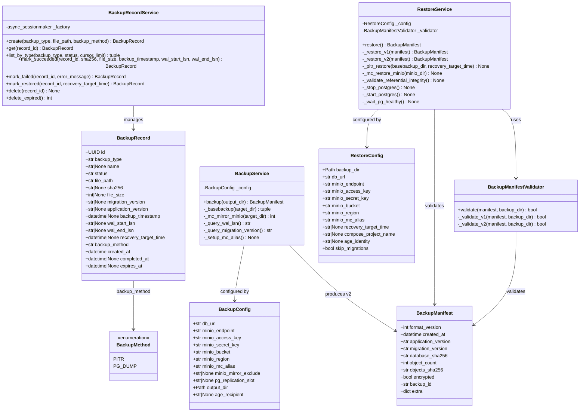
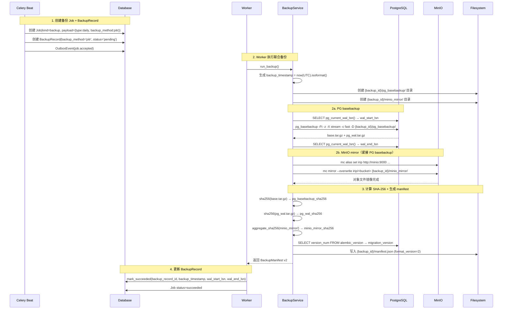
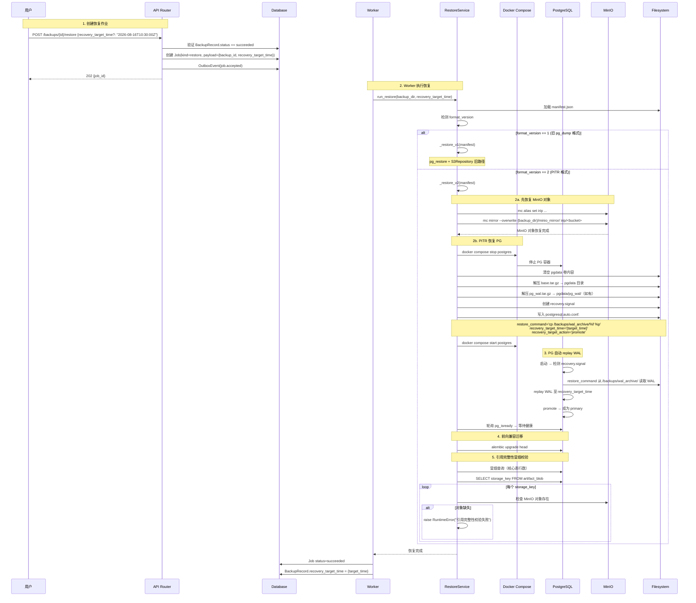
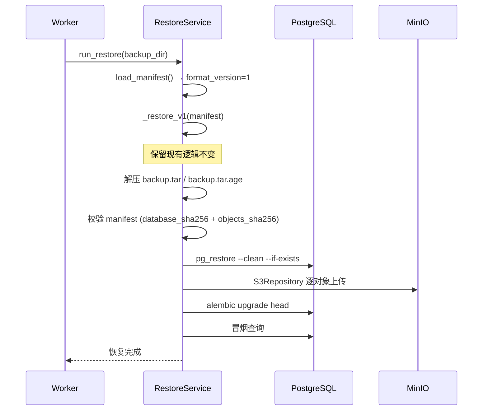
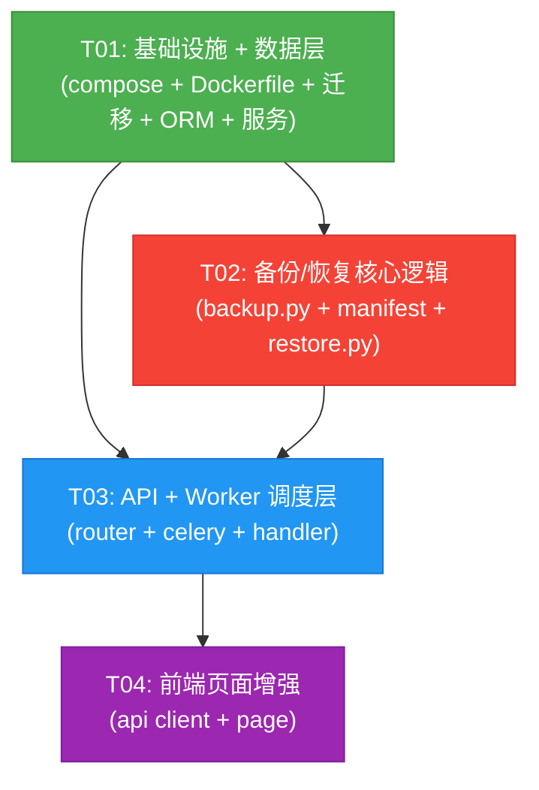

# 数据库备份升级架构设计 — PG PITR + WAL 归档 + MinIO mc mirror

> 基线文档: `docs/arch-db-backup.md`（pg_dump + S3Repository 方案，commit 4eab3c6）  
> 增量 PRD: `docs/prd-db-backup-pitr-upgrade.md`  
> 版本: 2.0 | 日期: 2026-08-16  
> 架构师: 高见远 (Bob)

---

## 目录

1. [实现方案](#1-实现方案)
2. [文件列表](#2-文件列表)
3. [数据结构变更](#3-数据结构变更)
4. [程序调用流程](#4-程序调用流程)
5. [任务列表](#5-任务列表)
6. [compose.yaml 变更](#6-composeyaml-变更)
7. [依赖包列表](#7-依赖包列表)
8. [共享知识](#8-共享知识跨文件约定)
9. [待明确事项](#9-待明确事项)

---

## 1. 实现方案

### 1.1 核心技术挑战

| 挑战 | 说明 | 方案 |
|------|------|------|
| 物理备份替代逻辑备份 | `pg_dump` 产出逻辑 SQL，无法做时间点恢复；需改用 `pg_basebackup` 物理基础备份 | `pg_basebackup -Ft -z -X stream` 产出 `base.tar.gz` + `pg_wal.tar.gz` |
| WAL 持续归档独立于应用层 | API/Worker 容器停止后，PG 仍需持续归档 WAL | 在 PG 容器内通过 `archive_command` 配置，WAL 段写入共享卷，不依赖 API 容器 |
| Docker 环境内 PITR 恢复 | 物理恢复需停 PG、替换 data 目录、配置 recovery，Docker 环境下需控制容器生命周期 | 恢复脚本通过 `docker compose` 子进程命令编排 PG 容器 stop/start，需 docker socket |
| MinIO 大对象集高效备份 | 逐对象下载列举性能差，需原子快照 | `mc mirror` 原子镜像 bucket 到本地目录 |
| 联合时间戳一致性 | PG basebackup 与 MinIO mirror 需同一时间戳 | 备份开始时生成 `backup_timestamp`，PG basebackup 完成后立即执行 mc mirror，记录两者的开始/结束时间 |
| 联合恢复引用完整性 | PG 中引用的 MinIO 对象必须先就位 | 恢复顺序调整为 MinIO → PG，恢复后冒烟校验引用完整性 |
| 旧格式向后兼容 | 升级前的 `format_version=1` (pg_dump) 备份仍需可恢复 | `RestoreService` 检测 `manifest.format_version`：v1 走 `pg_restore` + S3Repository 旧路径，v2 走 PITR + mc mirror 新路径 |
| 复制槽生命周期管理 | 使用 `--slot` 创建的物理复制槽需在备份删除时清理 | 备份删除/过期清理时调用 `pg_drop_replication_slot` 清理对应复制槽 |

### 1.2 PITR 配置方案

#### 1.2.1 PG 容器配置（compose.yaml postgres service）

通过 `command` 参数注入 PostgreSQL 配置（无需修改 postgresql.conf 文件）：

```yaml
postgres:
  command: >
    postgres
    -c archive_mode=on
    -c wal_level=replica
    -c archive_command='test ! -f /backups/wal_archive/%f && cp %p /backups/wal_archive/%f'
    -c max_wal_senders=3
  volumes:
    - pgdata:/var/lib/postgresql/data
    - pgrun:/var/run/postgresql
    - ${IRIP_WAL_ARCHIVE_HOST_DIR:-./backups/wal_archive}:/backups/wal_archive
    - ${IRIP_BACKUP_HOST_DIR:-./backups}:/backups
```

**配置说明**：

| 参数 | 值 | 说明 |
|------|-----|------|
| `archive_mode` | `on` | 启用 WAL 归档，PG 自动将已完成 WAL 段拷贝到归档目录 |
| `wal_level` | `replica` | 逻辑备份基础级别，支持物理复制 + PITR |
| `archive_command` | `test ! -f /backups/wal_archive/%f && cp %p /backups/wal_archive/%f` | 幂等拷贝：仅当目标不存在时拷贝，避免重复归档 |
| `max_wal_senders` | `3` | 允许 3 个 WAL 发送连接（pg_basebackup -X stream 使用 1 个） |

**WAL 归档目录**：`/backups/wal_archive/`（容器内路径），映射到宿主机 `${IRIP_WAL_ARCHIVE_HOST_DIR:-./backups/wal_archive}`。该目录与备份目录同级，独立于 API/Worker 容器存活。

**archive_command 幂等性说明**：
- `%p` = WAL 段文件路径（如 `/var/lib/postgresql/data/pg_wal/000000010000000000000001`）
- `%f` = WAL 段文件名（如 `000000010000000000000001`）
- `test ! -f` 先检查目标是否存在：不存在则 `cp`（返回 0 = 成功）；已存在则跳过 `cp`（返回 1 = 告知 PG 该段已归档）
- PG 对每个 WAL 段仅调用一次 `archive_command`，返回 0 后标记该段为已归档

#### 1.2.2 PG 用户权限

`pg_basebackup` 需要连接用户具备 `REPLICATION` 权限。在 `deployments/compose/bootstrap.py` 中新增：

```python
# 赋予 irip 用户 REPLICATION 权限（pg_basebackup 需要）
await conn.execute(text("ALTER USER irip REPLICATION;"))
```

> **注意**：`archive_mode=on` 需要重启 PG 实例才生效（非 reload 参数）。首次升级时需停 PG 容器并以新配置启动。现有 pgdata 卷无需重新初始化。

### 1.3 pg_basebackup 命令设计

```bash
pg_basebackup \
  -h postgres \
  -U irip \
  -D ${target_dir} \
  -Ft \            # tar 格式：产出 base.tar.gz + pg_wal.tar.gz
  -z \             # gzip 压缩
  -P \             # 进度报告
  -X stream \       # 流式传输 WAL（使用额外 WAL 接收连接）
  -c fast \         # 快速 checkpoint（立即触发 checkpoint，缩短备份窗口）
  ${IRIP_PG_REPLICATION_SLOT:+-C -S ${IRIP_PG_REPLICATION_SLOT}}  # 可选复制槽
```

**参数选择说明**：

| 参数 | 值 | 理由 |
|------|-----|------|
| `-Ft` | tar 格式 | 产出 `base.tar.gz`（数据目录）+ `pg_wal.tar.gz`（备份期间的 WAL），便于解压恢复 |
| `-z` | gzip 压缩 | 减小备份体积，与现有 age 加密兼容 |
| `-X stream` | 流式 WAL | 使用额外连接实时接收 WAL，不依赖 `archive_command`，备份期间 WAL 不丢失 |
| `-c fast` | 快速 checkpoint | 立即完成 checkpoint，缩短备份窗口（生产环境 IO 突发可控） |
| `-C -S <slot>` | 可选复制槽 | 环境变量 `IRIP_PG_REPLICATION_SLOT` 设置时启用，自动创建命名复制槽；未设置时使用临时复制连接 |

**复制槽策略**（QU-02 决策）：
- 默认不使用复制槽（`IRIP_PG_REPLICATION_SLOT` 未设置），使用临时连接，简单且无需生命周期管理
- 集群环境或需保证 WAL 连续性时，设置 `IRIP_PG_REPLICATION_SLOT=irip_backup_slot`，`-C` 自动创建
- 复制槽清理：备份删除/过期清理时，若记录了 `replication_slot`，调用 `pg_drop_replication_slot()` 清理

**WAL LSN 记录**：
- 备份开始后查询 `pg_current_wal_lsn()` → `wal_start_lsn`
- 备份结束后查询 `pg_current_wal_lsn()` → `wal_end_lsn`
- 两者记录到 `BackupManifest` 和 `BackupRecord`

### 1.4 mc mirror 命令设计

#### 1.4.1 mc 客户端安装

在 `deployments/compose/api.Dockerfile` 中新增 mc 客户端安装（所有使用同一镜像的容器均可使用）：

```dockerfile
# 安装 MinIO mc 客户端
RUN curl -fsSL https://dl.min.io/client/mc/release/linux-amd64/mc \
      -o /usr/local/bin/mc && \
    chmod +x /usr/local/bin/mc
```

#### 1.4.2 mc alias 配置

每次 mc 操作前先配置 alias（通过子进程执行）：

```bash
mc alias set ${IRIP_MINIO_MC_ALIAS:-irip} \
  ${IRIP_MINIO_ENDPOINT:-http://minio:9000} \
  ${IRIP_MINIO_ACCESS_KEY:-irip} \
  ${IRIP_MINIO_SECRET_KEY}
```

alias 名称通过环境变量 `IRIP_MINIO_MC_ALIAS` 配置，默认 `irip`。

#### 1.4.3 备份命令（mc mirror 导出）

```bash
mc alias set irip http://minio:9000 ${ACCESS_KEY} ${SECRET_KEY}
mc mirror --overwrite \
  ${IRIP_MINIO_MC_ALIAS:-irip}/${IRIP_MINIO_BUCKET} \
  ${backup_dir}/minio_mirror/ \
  ${IRIP_MINIO_MIRROR_EXCLUDE:+--exclude "${IRIP_MINIO_MIRROR_EXCLUDE}"}
```

**参数说明**：
- `--overwrite`：覆盖已存在的文件（幂等重试）
- `--exclude "tmp/*"`：排除临时对象前缀（通过 `IRIP_MINIO_MIRROR_EXCLUDE` 环境变量配置，P1-UP-06）
- `mc mirror` 原生支持 multipart upload，大对象（> 5GB）无需特殊处理（QU-04）

#### 1.4.4 恢复命令（mc mirror 回放）

```bash
mc alias set irip http://minio:9000 ${ACCESS_KEY} ${SECRET_KEY}
mc mirror --overwrite \
  ${backup_dir}/minio_mirror/ \
  ${IRIP_MINIO_MC_ALIAS:-irip}/${IRIP_MINIO_BUCKET}
```

恢复时从本地 `minio_mirror/` 目录镜像回 MinIO bucket，`--overwrite` 确保替换现有对象。

### 1.5 联合备份流程

```
备份开始
  │
  ├─ 1. 生成联合时间戳 backup_timestamp (UTC ISO 8601, 毫秒精度)
  │     └─ datetime.now(UTC).isoformat(timespec='milliseconds')
  │
  ├─ 2. 记录 wal_start_lsn = pg_current_wal_lsn()
  │
  ├─ 3. PG basebackup
  │     └─ pg_basebackup -Ft -z -X stream -c fast → {backup_id}/pg_basebackup/
  │        ├─ base.tar.gz
  │        └─ pg_wal.tar.gz
  │
  ├─ 4. 记录 wal_end_lsn = pg_current_wal_lsn()
  │
  ├─ 5. MinIO mirror（紧接 PG basebackup 完成）
  │     └─ mc mirror --overwrite irip/<bucket> → {backup_id}/minio_mirror/
  │
  ├─ 6. 计算 SHA-256
  │     ├─ pg_basebackup_sha256 = sha256(base.tar.gz)
  │     ├─ pg_wal_sha256 = sha256(pg_wal.tar.gz)
  │     └─ minio_mirror_sha256 = aggregate_sha256(minio_mirror/)
  │
  ├─ 7. 查询 migration_version (alembic_version)
  │
  ├─ 8. 生成 BackupManifest v2
  │     └─ format_version=2, backup_timestamp, backup_method='pitr',
  │        pg_basebackup_sha256, pg_wal_sha256, minio_mirror_sha256,
  │        minio_mirror_object_count, wal_start_lsn, wal_end_lsn
  │
  └─ 9. 写入 {backup_id}/manifest.json
```

**时间戳一致性保证（QU-09）**：
- `backup_timestamp` 以 Python 进程时钟为准（worker 容器与 PG 容器同一宿主机，时钟偏差 < 1s）
- PG basebackup 完成后**立即**执行 mc mirror，两者间隔 < 5s（UG-3 要求）
- 联合时间戳记录 PG basebackup 开始时间，MinIO mirror 在 PG 完成后立即开始

### 1.6 联合恢复流程

```
恢复开始
  │
  ├─ 0. 加载 manifest.json → 检测 format_version
  │     ├─ v1 → 旧路径: pg_restore + S3Repository (向后兼容)
  │     └─ v2 → 新路径: PITR + mc mirror ↓
  │
  ├─ 1. MinIO 恢复（先恢复对象，保证引用完整性）
  │     └─ mc mirror --overwrite {backup_dir}/minio_mirror/ irip/<bucket>
  │
  ├─ 2. PG PITR 恢复
  │     ├─ 2a. docker compose stop postgres
  │     ├─ 2b. 清空 pgdata 卷（rm -rf /var/lib/postgresql/data/*）
  │     ├─ 2c. 解压 base.tar.gz → pgdata 目录
  │     ├─ 2d. 解压 pg_wal.tar.gz → pgdata/pg_wal/（如有）
  │     ├─ 2e. 创建 recovery.signal
  │     ├─ 2f. 配置 postgresql.auto.conf:
  │     │     restore_command='cp /backups/wal_archive/%f %p'
  │     │     recovery_target_time='{recovery_target_time 或 backup_timestamp}'
  │     │     recovery_target_action='promote'
  │     ├─ 2g. docker compose start postgres
  │     └─ 2h. 等待 PG 健康（pg_isready 轮询）
  │
  ├─ 3. PG 自动 replay WAL 至 recovery_target_time → promote 为 primary
  │
  ├─ 4. 前向兼容迁移（alembic upgrade head）
  │
  ├─ 5. 引用完整性冒烟校验
  │     ├─ 5a. 核心表行数查询（复用现有 SMOKE_QUERIES）
  │     └─ 5b. PG → MinIO 引用完整性校验（P0-UP-08）
  │         └─ SELECT storage_key FROM artifact_blob → 逐 key 检查 MinIO 对象存在
  │
  └─ 恢复完成 / 校验失败则中止
```

**Docker 环境 PITR 特殊性**：
- 恢复脚本需通过 `docker compose stop/start postgres` 控制 PG 容器生命周期
- 需 docker CLI + docker socket 挂载到 worker/restore 容器
- pgdata 卷需挂载到恢复容器（或通过 docker cp 拷贝）
- `restore_command` 中的 WAL 归档路径 `/backups/wal_archive/` 需在 PG 容器内可访问（已通过 compose volume 挂载）

**recovery_target_time 处理**：
- API 传入 `recovery_target_time`（ISO 8601）时，恢复到指定时间点
- 未传入时，使用 `manifest.backup_timestamp`（恢复到备份时间点，等价全量恢复）
- 写入 `postgresql.auto.conf` 的 `recovery_target_time` 格式：`2026-08-16 02:00:00.000000+00:00`

### 1.7 旧格式兼容方案

#### 1.7.1 manifest 版本路由

`RestoreService.restore()` 入口根据 `manifest.format_version` 分流：

```python
async def restore(self) -> BackupManifest:
    manifest = load_manifest(self._config.backup_dir)
    if manifest.format_version == 1:
        return await self._restore_v1(manifest)  # 旧路径: pg_restore + S3Repository
    elif manifest.format_version == 2:
        return await self._restore_v2(manifest)  # 新路径: PITR + mc mirror
    else:
        raise RuntimeError(f"不支持的 manifest 版本: {manifest.format_version}")
```

**v1 旧路径**（完整保留现有逻辑）：
1. 解压 backup.tar / backup.tar.age
2. 校验 manifest（database_sha256 + objects_sha256）
3. `pg_restore --clean --if-exists` 恢复数据库
4. S3Repository 逐对象上传恢复 MinIO
5. 前向兼容迁移
6. 冒烟查询

**v2 新路径**（PITR + mc mirror）：
1. 校验 manifest（pg_basebackup_sha256 + pg_wal_sha256 + minio_mirror_sha256）
2. mc mirror 恢复 MinIO（先）
3. PITR 恢复 PG（后）
4. 前向兼容迁移
5. 冒烟查询 + 引用完整性校验

#### 1.7.2 BackupRecord 兼容

- 存量记录 `backup_method` 回填为 `'pg_dump'`（Alembic 迁移中处理）
- 新记录默认 `backup_method = 'pitr'`
- UI 展示备份方法标签：PITR=blue / pg_dump=gray

#### 1.7.3 备份目录结构对比

```
v1 (pg_dump 格式):                    v2 (PITR 格式):
{backup_id}/                          {backup_id}/
  manifest.json                         manifest.json
  backup.tar.age (或 backup.tar)        pg_basebackup/
  (解压后: database.dump + objects/)      base.tar.gz
                                          pg_wal.tar.gz
                                        minio_mirror/
                                          <object files...>
```

---

## 2. 文件列表

### 新建文件

| 路径 | 操作 | 说明 |
|------|------|------|
| `migrations/versions/0061_alter_backup_record_pitr.py` | 新建 | Alembic 迁移：为 `backup_record` 表新增 PITR 字段（backup_timestamp、wal_start_lsn、wal_end_lsn、recovery_target_time、backup_method），回填存量记录 backup_method='pg_dump' |
| `deployments/compose/pg_pitr_entrypoint.sh` | 新建 | PG 容器自定义入口脚本（可选）：检测恢复模式标记，自动执行 basebackup 解压 + recovery 配置，简化 PITR 恢复编排 |

### 修改文件

| 路径 | 操作 | 说明 |
|------|------|------|
| `compose.yaml` | 修改 | postgres: 新增 WAL 归档配置（command 参数 + 卷挂载）；worker/restore: 新增 docker socket 挂载 + WAL 归档卷；新增 wal_archive 卷定义 |
| `deployments/compose/postgres.Dockerfile` | 修改 | 基于 pgvector/pgvector:pg16，可选 COPY 自定义入口脚本 |
| `deployments/compose/api.Dockerfile` | 修改 | 安装 MinIO mc 客户端二进制 + docker CLI（用于 PITR 恢复编排） |
| `packages/backups/entities.py` | 修改 | `BackupRecord` 新增字段：`backup_timestamp`、`wal_start_lsn`、`wal_end_lsn`、`recovery_target_time`、`backup_method`；新增 `BackupMethod` 枚举 |
| `packages/backups/service.py` | 修改 | `mark_succeeded()` 新增 PITR 元数据参数；`create()` 新增 `backup_method` 参数；新增 `mark_restored()` 方法记录恢复目标时间 |
| `deployments/compose/backup_manifest.py` | 修改 | `BackupManifest` 新增 v2 字段；`MANIFEST_FORMAT_VERSION` 升级至 2；新增 `compute_manifest_v2()` 函数；`BackupManifestValidator` 支持 v1/v2 双版本校验 |
| `deployments/compose/backup.py` | 修改 | 新增 `_basebackup()` 替代 `_dump_database()`；新增 `_mc_mirror_minio()` 替代 `_export_minio_objects()`；新增 `_query_wal_lsn()` 查询 WAL LSN；`backup()` 方法重构为联合备份流程；新增 `BackupConfig` 的 mc 相关配置 |
| `deployments/compose/restore.py` | 修改 | 新增 `_pitr_restore()` 替代 `_restore_database()`；新增 `_mc_restore_minio()` 替代 `_restore_minio_objects()`；`restore()` 方法重构为版本路由 + MinIO→PG 顺序；新增引用完整性校验 `_validate_referential_integrity()`；新增 `RestoreConfig` 的 `recovery_target_time` 字段 |
| `apps/api/routers/backups.py` | 修改 | `CreateRestoreRequest` 新增 `recovery_target_time` 可选字段；`BackupRecordResponse` 新增 `backup_method` + `backup_timestamp` 字段；`create_restore()` 将 recovery_target_time 写入 Job payload |
| `apps/worker/celery_app.py` | 修改 | `daily_backup` 任务：Job payload 新增 `backup_method: 'pitr'`；beat 调度注释更新 |
| `apps/worker/tasks/__init__.py` | 修改 | `_backup_handler`：调用 `run_backup()` 后记录 PITR 元数据（backup_timestamp、wal LSN）；`_restore_handler`：从 payload 读取 `recovery_target_time` 传给 `run_restore()` |
| `apps/web/src/api/backups.ts` | 修改 | 新增类型字段 `backup_method`、`backup_timestamp`；`RestoreBackupBody` 新增 `recovery_target_time` 可选字段 |
| `apps/web/src/features/governance/DatabaseBackupPage.tsx` | 修改 | 备份列表新增"备份方法"列（PITR=blue / pg_dump=gray Tag）；恢复对话框新增"恢复到指定时间点"开关 + 日期时间选择器 |
| `deployments/compose/bootstrap.py` | 修改 | 新增 `ALTER USER irip REPLICATION;` 赋予 pg_basebackup 所需权限 |

---

## 3. 数据结构变更

### 3.1 BackupRecord 表新增字段

```sql
ALTER TABLE backup_record ADD COLUMN backup_timestamp TIMESTAMPTZ;
ALTER TABLE backup_record ADD COLUMN wal_start_lsn TEXT;
ALTER TABLE backup_record ADD COLUMN wal_end_lsn TEXT;
ALTER TABLE backup_record ADD COLUMN recovery_target_time TIMESTAMPTZ;
ALTER TABLE backup_record ADD COLUMN backup_method VARCHAR(20) DEFAULT 'pitr';
```

| 字段 | 类型 | 可空 | 说明 |
|------|------|------|------|
| `backup_timestamp` | `TIMESTAMPTZ` | YES | 联合时间戳（PG basebackup + MinIO mirror 共用），UTC ISO 8601 毫秒精度 |
| `wal_start_lsn` | `TEXT` | YES | pg_basebackup 开始时的 WAL LSN（如 `0/2000000`） |
| `wal_end_lsn` | `TEXT` | YES | pg_basebackup 结束时的 WAL LSN |
| `recovery_target_time` | `TIMESTAMPTZ` | YES | 恢复时填写的目标时间点（仅恢复作业写入） |
| `backup_method` | `VARCHAR(20)` | NO | 备份方法：`'pitr'`（新备份）或 `'pg_dump'`（存量备份），默认 `'pitr'` |

### 3.2 BackupManifest v2 结构

```python
@dataclass(frozen=True)
class BackupManifest:
    # ---- v1 字段（向后兼容）----
    format_version: int                    # v1=1, v2=2
    created_at: datetime
    application_version: str
    migration_version: str
    database_sha256: str                   # v1: pg_dump sha256; v2: base.tar.gz sha256
    object_count: int                      # v1: MinIO 对象数; v2: minio_mirror 对象数
    objects_sha256: str                    # v1: 对象聚合 sha256; v2: minio_mirror 聚合 sha256
    encrypted: bool = False
    backup_id: str = ""
    extra: dict = field(default_factory=dict)

    # ---- v2 新增字段（format_version=2 时有值）----
    # 以下字段存储在 extra dict 中（保持 dataclass 兼容性）
    # extra = {
    #     "backup_timestamp": "2026-08-16T02:00:00.000+00:00",
    #     "backup_method": "pitr",
    #     "pg_basebackup_sha256": "<sha256 of base.tar.gz>",
    #     "pg_wal_sha256": "<sha256 of pg_wal.tar.gz>",
    #     "minio_mirror_sha256": "<aggregate sha256 of minio_mirror/>",
    #     "minio_mirror_object_count": 1234,
    #     "wal_start_lsn": "0/2000000",
    #     "wal_end_lsn": "0/2000123",
    # }
```

**设计决策**：v2 新增字段存储在已有的 `extra` dict 中，不修改 `BackupManifest` dataclass 的字段定义，确保反序列化 v1 manifest 时不会报错（缺失字段不影响）。`compute_manifest_v2()` 函数负责填充 `extra` 字典。

### 3.3 备份目录结构（v2）

```
{IRIP_BACKUP_OUTPUT_DIR}/
  {backup_id}/
    manifest.json              ← BackupManifest v2 JSON
    pg_basebackup/
      base.tar.gz              ← pg_basebackup -Ft -z 产出（数据目录）
      pg_wal.tar.gz            ← pg_basebackup -X stream 产出（备份期间 WAL）
    minio_mirror/              ← mc mirror 产出的对象目录
      <object_key_path_1>
      <object_key_path_2>
      ...
  wal_archive/                 ← 全局 WAL 归档目录（非每备份独立）
    000000010000000000000001
    000000010000000000000002
    ...
```

**与 v1 差异**：
- v1: `manifest.json` + `backup.tar.age`（打包 tar 含 `database.dump` + `objects/`）
- v2: `manifest.json` + `pg_basebackup/` + `minio_mirror/`（不打包为单一 tar，各组件独立存储）
- v2 不再使用 tar 打包 + age 加密（物理备份组件较大，独立存储便于 PITR 解压）

### 3.4 类图



### 3.5 API 契约变更

| 端点 | 变更 |
|------|------|
| `POST /api/v1/backups` | 请求体不变；响应新增 `backup_method` 字段 |
| `GET /api/v1/backups` | 响应 `BackupRecordResponse` 新增 `backup_method` + `backup_timestamp` 字段 |
| `POST /api/v1/backups/{id}/restore` | 请求体新增可选 `recovery_target_time`（ISO 8601 字符串）；不传时默认恢复到备份时间点 |
| `DELETE /api/v1/backups/{id}` | 不变 |
| `GET /api/v1/backups/stats` | 不变 |

**`CreateRestoreRequest` 变更**：
```python
class CreateRestoreRequest(BaseModel):
    skip_migrations: bool = Field(False, description="是否跳过迁移步骤")
    recovery_target_time: str | None = Field(
        None, description="PITR 恢复目标时间（ISO 8601），不传时恢复到备份时间点"
    )
```

**`BackupRecordResponse` 新增字段**：
```python
class BackupRecordResponse(BaseModel):
    # ... 现有字段 ...
    backup_method: str | None = Field(None, description="备份方法: pitr | pg_dump")
    backup_timestamp: datetime | None = Field(None, description="联合时间戳")
```

### 3.6 Alembic 迁移设计

**迁移文件**：`migrations/versions/0061_alter_backup_record_pitr.py`

```python
revision = "0061"
down_revision = "0060"

def upgrade():
    # 1. 新增字段（先添加为 nullable，回填后再设约束）
    op.add_column("backup_record", 
        sa.Column("backup_timestamp", sa.TIMESTAMP(timezone=True), nullable=True))
    op.add_column("backup_record", 
        sa.Column("wal_start_lsn", sa.String(64), nullable=True))
    op.add_column("backup_record", 
        sa.Column("wal_end_lsn", sa.String(64), nullable=True))
    op.add_column("backup_record", 
        sa.Column("recovery_target_time", sa.TIMESTAMP(timezone=True), nullable=True))
    op.add_column("backup_record", 
        sa.Column("backup_method", sa.String(20), nullable=True))

    # 2. 回填存量记录为 pg_dump
    op.execute("UPDATE backup_record SET backup_method = 'pg_dump' WHERE backup_method IS NULL")

    # 3. 设置默认值 + NOT NULL
    op.alter_column("backup_record", "backup_method",
        server_default="pitr", nullable=False)

    # 4. 新增索引（按备份方法查询）
    op.create_index("idx_backup_record_method", "backup_record", ["backup_method"])

def downgrade():
    op.drop_index("idx_backup_record_method", table_name="backup_record")
    op.drop_column("backup_record", "backup_method")
    op.drop_column("backup_record", "recovery_target_time")
    op.drop_column("backup_record", "wal_end_lsn")
    op.drop_column("backup_record", "wal_start_lsn")
    op.drop_column("backup_record", "backup_timestamp")
```

---

## 4. 程序调用流程

### 4.1 联合备份流程时序图



### 4.2 PITR 恢复流程时序图



### 4.3 旧格式兼容恢复流程（v1 路径）



---

## 5. 任务列表

> 以下任务按依赖关系排序，工程师寇豆码按此顺序实现。

### T01: 基础设施 + 数据层（compose 配置 + 迁移 + ORM + 服务）

| 字段 | 值 |
|------|-----|
| **任务编号** | T01 |
| **任务描述** | 项目基础设施变更：compose.yaml PG WAL 归档配置 + Dockerfile mc 安装 + Alembic 迁移 + ORM 模型扩展 + 服务层方法签名更新 |
| **涉及文件** | `compose.yaml`、`deployments/compose/api.Dockerfile`、`deployments/compose/postgres.Dockerfile`、`migrations/versions/0061_alter_backup_record_pitr.py`（新建）、`packages/backups/entities.py`、`packages/backups/service.py`、`deployments/compose/bootstrap.py` |
| **依赖任务** | 无 |
| **预计复杂度** | 中等 |
| **优先级** | P0 |

**实现要点**：

1. **`compose.yaml`**：
   - `postgres` service：新增 `command` 参数注入 `archive_mode=on` + `wal_level=replica` + `archive_command`；新增 `${IRIP_WAL_ARCHIVE_HOST_DIR:-./backups/wal_archive}:/backups/wal_archive` 卷挂载；新增 `${IRIP_BACKUP_HOST_DIR:-./backups}:/backups` 卷挂载
   - `worker` service：新增 `/var/run/docker.sock:/var/run/docker.sock` 卷挂载（PITR 恢复需控制 PG 容器）；新增 `${IRIP_WAL_ARCHIVE_HOST_DIR:-./backups/wal_archive}:/backups/wal_archive` 卷挂载；新增环境变量 `IRIP_WAL_ARCHIVE_DIR`、`IRIP_MINIO_MC_ALIAS`、`IRIP_PG_REPLICATION_SLOT`、`IRIP_MINIO_MIRROR_EXCLUDE`
   - `restore` service：同 worker，新增 docker socket + WAL 归档卷
   - `scheduler` service：新增 WAL 归档卷（beat 任务可能需要查询 WAL 状态）
   - `backup` service：新增 WAL 归档卷
   - 新增 `volumes` 定义：`wal_archive`（如使用命名卷）或依赖宿主机目录绑定

2. **`deployments/compose/api.Dockerfile`**：
   - 新增 MinIO mc 客户端安装：`curl -fsSL https://dl.min.io/client/mc/release/linux-amd64/mc -o /usr/local/bin/mc && chmod +x /usr/local/bin/mc`
   - 新增 docker CLI 安装（PITR 恢复编排用）：在 apt-get install 中添加 `docker.io` 或从官方源安装

3. **`deployments/compose/postgres.Dockerfile`**：
   - 保持基于 `pgvector/pgvector:pg16`
   - 可选：COPY 自定义入口脚本（如使用 pg_pitr_entrypoint.sh 方案）

4. **`migrations/versions/0061_alter_backup_record_pitr.py`**（新建）：
   - `revision = "0061"`, `down_revision = "0060"`
   - 5 个 `ADD COLUMN`：backup_timestamp、wal_start_lsn、wal_end_lsn、recovery_target_time、backup_method
   - 回填 `UPDATE backup_record SET backup_method = 'pg_dump' WHERE backup_method IS NULL`
   - `ALTER COLUMN backup_method SET DEFAULT 'pitr'` + `NOT NULL`
   - 新增索引 `idx_backup_record_method`
   - downgrade: 反向操作

5. **`packages/backups/entities.py`**：
   - 新增 `BackupMethod` 枚举：`PITR = "pitr"`, `PG_DUMP = "pg_dump"`
   - `BackupRecord` 新增 Mapped 字段：`backup_timestamp: Mapped[datetime | None]`、`wal_start_lsn: Mapped[str | None]`、`wal_end_lsn: Mapped[str | None]`、`recovery_target_time: Mapped[datetime | None]`、`backup_method: Mapped[str]`（`server_default="pitr"`）

6. **`packages/backups/service.py`**：
   - `create()` 方法新增 `backup_method: str = "pitr"` 参数，写入 `BackupRecord.backup_method`
   - `mark_succeeded()` 方法新增可选参数：`backup_timestamp: datetime | None`、`wal_start_lsn: str | None`、`wal_end_lsn: str | None`，写入对应字段
   - 新增 `mark_restored(record_id, recovery_target_time)` 方法：恢复完成后更新 `recovery_target_time` 字段

7. **`deployments/compose/bootstrap.py`**：
   - 在初始化逻辑中新增 `ALTER USER irip REPLICATION;`（pg_basebackup 需要）

---

### T02: 备份/恢复核心逻辑（PITR + mc mirror）

| 字段 | 值 |
|------|-----|
| **任务编号** | T02 |
| **任务描述** | 备份脚本升级：pg_basebackup 替代 pg_dump + mc mirror 替代 S3 导出 + manifest v2；恢复脚本升级：PITR 替代 pg_restore + mc mirror 替代 S3 上传 + 版本路由 + 引用完整性校验 |
| **涉及文件** | `deployments/compose/backup.py`、`deployments/compose/backup_manifest.py`、`deployments/compose/restore.py` |
| **依赖任务** | T01 |
| **预计复杂度** | 复杂 |
| **优先级** | P0 |

**实现要点**：

1. **`deployments/compose/backup_manifest.py`**：
   - `MANIFEST_FORMAT_VERSION` 升级至 `2`
   - 新增 `compute_manifest_v2()` 函数：计算 `pg_basebackup_sha256`、`pg_wal_sha256`、`minio_mirror_sha256`、`minio_mirror_object_count`，填充 `extra` dict
   - `BackupManifest.from_dict()`：兼容 v1/v2 反序列化（v2 字段从 `extra` 读取）
   - `BackupManifestValidator`：新增 `_validate_v1()` 和 `_validate_v2()` 分支
     - v1 校验：`database_sha256` + `objects_sha256`（现有逻辑）
     - v2 校验：`pg_basebackup_sha256` + `pg_wal_sha256` + `minio_mirror_sha256`（从 `extra` 读取期望值，重算比对）

2. **`deployments/compose/backup.py`**：
   - `BackupConfig` 新增字段：`minio_mc_alias: str`、`minio_mirror_exclude: str | None`、`pg_replication_slot: str | None`
   - `build_backup_config_from_env()`：从环境变量读取 mc 配置
   - `BackupService.backup()` 方法重构：
     - 创建 `{backup_id}/pg_basebackup/` + `{backup_id}/minio_mirror/` 子目录
     - 生成 `backup_timestamp = datetime.now(UTC).isoformat(timespec='milliseconds')`
     - 调用 `_basebackup()` → 调用 `_mc_mirror_minio()` → 计算 SHA-256 → 生成 manifest v2
     - **不再**打包为 tar.age（v2 不打包，各组件独立存储）
   - 新增 `_basebackup(target_dir)` 方法：
     - 查询 `wal_start_lsn = pg_current_wal_lsn()`
     - 执行 `pg_basebackup -Ft -z -X stream -c fast [-C -S slot] -D target_dir`
     - 查询 `wal_end_lsn = pg_current_wal_lsn()`
     - 返回 `(wal_start_lsn, wal_end_lsn)`
   - 新增 `_mc_mirror_minio(target_dir)` 方法：
     - `_setup_mc_alias()` 设置 mc alias
     - 执行 `mc mirror --overwrite irip/<bucket> target_dir/ [--exclude ...]`
     - 返回对象数（通过 `mc mirror --json` 输出解析或目录扫描）
   - 新增 `_query_wal_lsn()` 方法：`SELECT pg_current_wal_lsn()`
   - 新增 `_setup_mc_alias()` 方法：执行 `mc alias set ...`
   - 保留 `_dump_database()` 和 `_export_minio_objects()` 方法（不删除，v1 兼容可能需要）

3. **`deployments/compose/restore.py`**：
   - `RestoreConfig` 新增字段：`minio_mc_alias: str`、`recovery_target_time: str | None`
   - `build_restore_config_from_env()`：从环境变量读取 `recovery_target_time`
   - `RestoreService.restore()` 方法重构为版本路由：
     ```python
     manifest = load_manifest(backup_dir)
     if manifest.format_version == 1:
         return await self._restore_v1(manifest)
     return await self._restore_v2(manifest)
     ```
   - 新增 `_restore_v1(manifest)` 方法：现有 `restore()` 逻辑提取（pg_restore + S3Repository，保持不变）
   - 新增 `_restore_v2(manifest)` 方法：
     1. `_validator._validate_v2(manifest, backup_dir)` 校验完整性
     2. `_mc_restore_minio(backup_dir / "minio_mirror")` 恢复 MinIO（先）
     3. `_pitr_restore(backup_dir / "pg_basebackup", recovery_target_time)` 恢复 PG（后）
     4. 前向兼容迁移（alembic upgrade head）
     5. 冒烟查询 + `_validate_referential_integrity()` 引用完整性校验
   - 新增 `_pitr_restore(basebackup_dir, recovery_target_time)` 方法：
     - `docker compose stop postgres`（subprocess）
     - 清空 pgdata 目录（通过挂载的 pgdata 卷或 docker exec）
     - 解压 `base.tar.gz` 到 pgdata
     - 解压 `pg_wal.tar.gz` 到 `pgdata/pg_wal/`（如有）
     - 创建 `recovery.signal` 文件
     - 写入 `postgresql.auto.conf`：`restore_command` + `recovery_target_time` + `recovery_target_action='promote'`
     - `docker compose start postgres`
     - 轮询 `pg_isready` 等待 PG 健康
   - 新增 `_mc_restore_minio(minio_dir)` 方法：
     - `_setup_mc_alias()` 设置 mc alias
     - 执行 `mc mirror --overwrite minio_dir/ irip/<bucket>`
   - 新增 `_validate_referential_integrity()` 方法（P0-UP-08）：
     - 查询 `SELECT storage_key FROM artifact_blob`
     - 逐 key 调用 S3Repository `head_object` 或 mc ls 检查 MinIO 对象存在
     - 任一缺失则 `raise RuntimeError`
   - 新增 `_stop_postgres()` / `_start_postgres()` / `_wait_pg_healthy()` 辅助方法
   - `run_restore(backup_dir, recovery_target_time=None)` 函数签名新增 `recovery_target_time` 参数

---

### T03: API + Worker 调度层

| 字段 | 值 |
|------|-----|
| **任务编号** | T03 |
| **任务描述** | API 端点新增 recovery_target_time 参数 + backup_method 响应字段；Worker handler 传递 PITR 元数据；Celery beat 调度注释更新 |
| **涉及文件** | `apps/api/routers/backups.py`、`apps/worker/celery_app.py`、`apps/worker/tasks/__init__.py` |
| **依赖任务** | T01、T02 |
| **预计复杂度** | 中等 |
| **优先级** | P0 |

**实现要点**：

1. **`apps/api/routers/backups.py`**：
   - `CreateRestoreRequest` 新增 `recovery_target_time: str | None` 字段
   - `BackupRecordResponse` 新增 `backup_method: str | None` + `backup_timestamp: datetime | None` 字段
   - `_to_record_response()` 映射新增字段
   - `create_backup()`：创建 `BackupRecord` 时设置 `backup_method='pitr'`
   - `create_restore()`：将 `body.recovery_target_time` 写入 Job payload

2. **`apps/worker/celery_app.py`**：
   - `daily_backup()` 任务：`Job.payload` 新增 `"backup_method": "pitr"`；`BackupRecord` 创建时设置 `backup_method='pitr'`
   - beat 调度条目注释更新（`daily-backup` 描述从 "pg_dump 快照" 改为 "PITR 基础备份"）

3. **`apps/worker/tasks/__init__.py`**：
   - `_backup_handler`：
     - 调用 `run_backup()` 后，从 manifest.extra 读取 `backup_timestamp`、`wal_start_lsn`、`wal_end_lsn`
     - 调用 `service.mark_succeeded()` 时传入 PITR 元数据
   - `_restore_handler`：
     - 从 `payload` 读取 `recovery_target_time`
     - 调用 `run_restore(backup_dir, recovery_target_time=...)` 传入恢复目标时间
     - 恢复成功后调用 `service.mark_restored(backup_id, recovery_target_time)` 记录恢复时间点
   - `_resolve_backup_dir_by_id()`：无需修改（已通过 manifest.json 搜索 backup_id）

---

### T04: 前端页面增强

| 字段 | 值 |
|------|-----|
| **任务编号** | T04 |
| **任务描述** | 备份列表新增"备份方法"列（PITR/pg_dump 标签）；恢复对话框新增"恢复到指定时间点"开关 + 日期时间选择器 |
| **涉及文件** | `apps/web/src/api/backups.ts`、`apps/web/src/features/governance/DatabaseBackupPage.tsx` |
| **依赖任务** | T03 |
| **预计复杂度** | 简单 |
| **优先级** | P1 |

**实现要点**：

1. **`apps/web/src/api/backups.ts`**：
   - `BackupRecordItem` 类型新增字段：`backup_method: 'pitr' | 'pg_dump' | null`、`backup_timestamp: string | null`
   - `RestoreBackupBody` 类型新增可选字段：`recovery_target_time?: string`
   - `apiRestoreBackup()` 函数：将 `recovery_target_time` 传入请求体

2. **`apps/web/src/features/governance/DatabaseBackupPage.tsx`**：
   - 新增备份方法标签映射：`pitr` → `<Tag color="blue">PITR</Tag>`，`pg_dump` → `<Tag color="default">pg_dump</Tag>`
   - 每日镜像表格 + 里程碑表格新增"备份方法"列
   - 恢复确认 Modal 新增：
     - "恢复到指定时间点"开关（`Switch` 组件），默认关闭
     - 开启后展示 `DatePicker` + `TimePicker`（或 `DatePicker showTime`），选择恢复目标时间
     - 确认时将 ISO 8601 时间字符串传入 `apiRestoreBackup(id, { recovery_target_time })`
   - 恢复 Modal 提示文案更新：说明 PITR 恢复将先恢复 MinIO 对象再恢复 PG

---

### 任务依赖图



**依赖说明**：
- T01 是基础：提供 ORM 模型、服务层方法、compose 配置、Dockerfile
- T02 依赖 T01：备份/恢复逻辑需要新的 ORM 字段、BackupConfig、compose 配置
- T03 依赖 T01 + T02：API 和 Worker handler 需要调用新的备份/恢复逻辑 + 使用新 ORM 字段
- T04 依赖 T03：前端需要 API 端点就绪（新增 recovery_target_time 参数）

---

## 6. compose.yaml 变更

### 6.1 postgres service 变更

```yaml
postgres:
  image: docker.m.daocloud.io/pgvector/pgvector:pg16
  # 新增：PITR 配置通过 command 参数注入
  command: >
    postgres
    -c archive_mode=on
    -c wal_level=replica
    -c archive_command='test ! -f /backups/wal_archive/%f && cp %p /backups/wal_archive/%f'
    -c max_wal_senders=3
  environment:
    POSTGRES_USER: ${IRIP_DATABASE_USER:-irip}
    POSTGRES_PASSWORD: ${IRIP_DATABASE_PASSWORD:?IRIP_DATABASE_PASSWORD is required}
    POSTGRES_DB: ${IRIP_DATABASE_NAME:-irip}
  volumes:
    - pgdata:/var/lib/postgresql/data
    - pgrun:/var/run/postgresql
    # 新增：WAL 归档目录（archive_command 写入此处）
    - ${IRIP_WAL_ARCHIVE_HOST_DIR:-./backups/wal_archive}:/backups/wal_archive
    # 新增：备份目录（PG 容器需访问 WAL 归档 + basebackup 产物）
    - ${IRIP_BACKUP_HOST_DIR:-./backups}:/backups
  healthcheck:
    test: ["CMD-SHELL", "pg_isready -U ${IRIP_DATABASE_USER:-irip} -d ${IRIP_DATABASE_NAME:-irip}"]
    interval: 5s
    timeout: 5s
    retries: 10
  restart: unless-stopped
```

### 6.2 worker service 变更

```yaml
worker:
  # ... 现有配置 ...
  environment:
    # ... 现有环境变量 ...
    # 新增：PITR + mc mirror 相关
    IRIP_BACKUP_OUTPUT_DIR: ${IRIP_BACKUP_OUTPUT_DIR:-/backups}
    IRIP_BACKUP_AGE_RECIPIENT: ${IRIP_BACKUP_AGE_RECIPIENT:-}
    IRIP_WAL_ARCHIVE_DIR: ${IRIP_WAL_ARCHIVE_DIR:-/backups/wal_archive}
    IRIP_MINIO_MC_ALIAS: ${IRIP_MINIO_MC_ALIAS:-irip}
    IRIP_PG_REPLICATION_SLOT: ${IRIP_PG_REPLICATION_SLOT:-}
    IRIP_MINIO_MIRROR_EXCLUDE: ${IRIP_MINIO_MIRROR_EXCLUDE:-}
  volumes:
    # 现有
    - ${IRIP_BACKUP_HOST_DIR:-./backups}:/backups
    # 新增：WAL 归档目录
    - ${IRIP_WAL_ARCHIVE_HOST_DIR:-./backups/wal_archive}:/backups/wal_archive
    # 新增：Docker socket（PITR 恢复需控制 PG 容器 stop/start）
    - /var/run/docker.sock:/var/run/docker.sock
```

### 6.3 restore service 变更

```yaml
restore:
  # ... 现有配置 ...
  environment:
    # ... 现有环境变量 ...
    # 新增
    IRIP_WAL_ARCHIVE_DIR: ${IRIP_WAL_ARCHIVE_DIR:-/backups/wal_archive}
    IRIP_MINIO_MC_ALIAS: ${IRIP_MINIO_MC_ALIAS:-irip}
    IRIP_MINIO_MIRROR_EXCLUDE: ${IRIP_MINIO_MIRROR_EXCLUDE:-}
  volumes:
    # 现有
    - ${IRIP_BACKUP_HOST_DIR:-./backups}:/backups
    # 新增：WAL 归档目录（PITR 恢复时 PG 从此处读取 WAL）
    - ${IRIP_WAL_ARCHIVE_HOST_DIR:-./backups/wal_archive}:/backups/wal_archive
    # 新增：Docker socket
    - /var/run/docker.sock:/var/run/docker.sock
    # 新增：pgdata 卷（PITR 恢复需写入 PG data 目录）
    - pgdata:/var/lib/postgresql/data
```

### 6.4 backup / scheduler service 变更

```yaml
backup:
  # ... 现有配置 ...
  volumes:
    - ${IRIP_BACKUP_HOST_DIR:-./backups}:/backups
    # 新增：WAL 归档目录（备份时可能需要查询 WAL 状态）
    - ${IRIP_WAL_ARCHIVE_HOST_DIR:-./backups/wal_archive}:/backups/wal_archive
  environment:
    # 新增
    IRIP_WAL_ARCHIVE_DIR: ${IRIP_WAL_ARCHIVE_DIR:-/backups/wal_archive}
    IRIP_MINIO_MC_ALIAS: ${IRIP_MINIO_MC_ALIAS:-irip}
    IRIP_PG_REPLICATION_SLOT: ${IRIP_PG_REPLICATION_SLOT:-}
    IRIP_MINIO_MIRROR_EXCLUDE: ${IRIP_MINIO_MIRROR_EXCLUDE:-}

scheduler:
  # ... 现有配置 ...
  volumes:
    - ${IRIP_BACKUP_HOST_DIR:-./backups}:/backups
    # 新增：WAL 归档目录
    - ${IRIP_WAL_ARCHIVE_HOST_DIR:-./backups/wal_archive}:/backups/wal_archive
```

### 6.5 新增环境变量汇总

| 环境变量 | 默认值 | 说明 |
|----------|--------|------|
| `IRIP_WAL_ARCHIVE_HOST_DIR` | `./backups/wal_archive` | WAL 归档宿主机目录 |
| `IRIP_WAL_ARCHIVE_DIR` | `/backups/wal_archive` | WAL 归档容器内路径 |
| `IRIP_MINIO_MC_ALIAS` | `irip` | mc 客户端 alias 名称 |
| `IRIP_PG_REPLICATION_SLOT` | (空) | pg_basebackup 复制槽名（空=不使用） |
| `IRIP_MINIO_MIRROR_EXCLUDE` | (空) | mc mirror 排除规则（如 `tmp/*`） |

---

## 7. 依赖包列表

| 包/工具 | 用途 | 安装方式 | 新增/现有 |
|---------|------|----------|----------|
| `MinIO mc` 客户端 | `mc mirror` 对象存储备份/恢复 | api.Dockerfile 中 curl 下载二进制 | **新增** |
| `docker CLI` | PITR 恢复编排（stop/start postgres 容器） | api.Dockerfile 中 apt-get install | **新增** |
| `postgresql-client-16` | pg_basebackup 命令 | api.Dockerfile 已安装 | 现有（已包含 pg_dump/pg_restore） |
| `age` | 备份加密（v1 使用，v2 不再打包 tar.age） | api.Dockerfile 可选安装 | 现有 |
| `celery` | 异步任务队列 + beat 调度 | pyproject.toml | 现有 |
| `sqlalchemy` | ORM + 异步会话 | pyproject.toml | 现有 |
| `alembic` | 数据库迁移 | pyproject.toml | 现有 |
| `psycopg` | PostgreSQL 驱动 | pyproject.toml | 现有 |
| `boto3` | MinIO S3 兼容客户端（v1 恢复路径保留） | pyproject.toml | 现有 |

**Dockerfile 新增安装片段**（api.Dockerfile）：

```dockerfile
# 安装 MinIO mc 客户端
RUN curl -fsSL https://dl.min.io/client/mc/release/linux-amd64/mc \
      -o /usr/local/bin/mc && \
    chmod +x /usr/local/bin/mc

# 安装 docker CLI（PITR 恢复需控制 PG 容器）
RUN apt-get update && \
    apt-get install -y --no-install-recommends docker.io && \
    rm -rf /var/lib/apt/lists/*
```

---

## 8. 共享知识（跨文件约定）

### 8.1 备份目录结构约定

```
/backups/                                      ← IRIP_BACKUP_OUTPUT_DIR (Docker 卷)
  {backup_id_1}/                               ← 每个备份独立子目录
    manifest.json                              ← v2 manifest (format_version=2)
    pg_basebackup/
      base.tar.gz                              ← pg_basebackup -Ft -z 数据目录
      pg_wal.tar.gz                            ← pg_basebackup -X stream WAL
    minio_mirror/                              ← mc mirror 对象目录
      <object_key_path>
  {backup_id_2}/                               ← v1 旧格式备份（升级前创建）
    manifest.json                              ← v1 manifest (format_version=1)
    backup.tar.age                             ← 加密归档
  wal_archive/                                 ← 全局 WAL 归档目录
    000000010000000000000001                   ← WAL 段文件
    000000010000000000000002
    000000010000000000000003.00000028.backup   ← .backup 标记文件
```

### 8.2 时间戳格式约定

```
backup_timestamp: UTC ISO 8601, 毫秒精度
  格式: "2026-08-16T02:00:00.123+00:00"
  生成: datetime.now(UTC).isoformat(timespec='milliseconds')

recovery_target_time: UTC ISO 8601, 秒精度
  格式: "2026-08-16T10:30:00+00:00"
  写入 postgresql.auto.conf: "2026-08-16 10:30:00.000000+00:00"
```

### 8.3 WAL 归档文件命名约定

```
WAL 段文件: 24 字符十六进制
  格式: 000000010000000000000001
  命名规则: {timeline}{logid}{recid} (PG 内部命名)

.backup 标记文件:
  格式: 000000010000000000000003.00000028.backup
  含义: basebackup 完成时的 WAL 位置标记，PG 恢复时据此判断 WAL 范围

archive_command 参数:
  %p = WAL 段文件完整路径 (如 /var/lib/postgresql/data/pg_wal/000000010000000000000001)
  %f = WAL 段文件名 (如 000000010000000000000001)
```

### 8.4 mc alias 配置约定

```
alias 名称: IRIP_MINIO_MC_ALIAS 环境变量配置，默认 "irip"
配置命令: mc alias set {alias} {endpoint} {access_key} {secret_key}
  示例: mc alias set irip http://minio:9000 irip irip_dev_password

备份: mc mirror --overwrite {alias}/{bucket} {local_dir}/
恢复: mc mirror --overwrite {local_dir}/ {alias}/{bucket}
排除: --exclude "tmp/*" (通过 IRIP_MINIO_MIRROR_EXCLUDE 配置)
```

### 8.5 PITR 恢复配置约定

```
recovery.signal 文件:
  位置: {pgdata}/recovery.signal
  内容: 空文件（存在即触发恢复模式）

postgresql.auto.conf 追加内容:
  restore_command = 'cp /backups/wal_archive/%f %p'
  recovery_target_time = '2026-08-16 10:30:00.000000+00:00'
  recovery_target_action = 'promote'

恢复后 PG 自动:
  1. 读取 recovery.signal → 进入恢复模式
  2. 执行 restore_command 读取 WAL 段
  3. replay WAL 至 recovery_target_time
  4. recovery_target_action='promote' → 提升为 primary
  5. 删除 recovery.signal → 正常运行
```

### 8.6 format_version 路由约定

```
manifest.format_version == 1:
  备份方法: pg_dump (逻辑备份)
  恢复路径: pg_restore --clean --if-exists + S3Repository 逐对象上传
  目录结构: {backup_id}/manifest.json + backup.tar.age

manifest.format_version == 2:
  备份方法: pitr (物理备份)
  恢复路径: mc mirror + PITR (pg_basebackup 恢复)
  目录结构: {backup_id}/manifest.json + pg_basebackup/ + minio_mirror/

BackupRecord.backup_method:
  'pitr'   → format_version=2 备份
  'pg_dump' → format_version=1 存量备份
```

### 8.7 API 响应约定（不变）

```
- 所有 API 响应使用 {code, data, message} 或 AppError 格式
- 备份/恢复作业 kind 为 "backup" / "restore"，已在 JobKindPolicy 注册
- backup_record.id == manifest.backup_id == 备份子目录名（三者一致）
- Worker handler 通过 payload.backup_record_id 关联 Job 与 backup_record
```

---

## 9. 待明确事项

### 9.1 已做假设

| 假设 | 说明 |
|------|------|
| WAL 归档存储使用本地卷 | 单机部署使用宿主机目录 `./backups/wal_archive`；集群部署可通过环境变量切换为 MinIO（archive_command 调用 mc cp），P2 实现 |
| 不使用复制槽（默认） | `IRIP_PG_REPLICATION_SLOT` 未设置时使用临时复制连接；设置时使用 `-C -S` 自动创建命名复制槽 |
| v2 备份不再打包 tar.age | 物理备份组件较大（base.tar.gz 可能 GB 级），独立存储便于 PITR 解压；age 加密仅在 v1 路径保留 |
| 恢复期间进入维护模式 | PITR 恢复需停 PG 实例，与基线 PRD Q2 一致，恢复后解除 |
| 引用完整性校验仅覆盖 artifact_blob | P0 覆盖核心引用表 `artifact_blob`，P2 扩展为全表扫描可配置（QU-07） |
| 联合时间戳以 Python 进程时钟为准 | Worker 容器与 PG 容器同一宿主机，NTP 同步，时钟偏差 < 1s（QU-09） |
| pgdata 卷在恢复时需挂载到 worker/restore 容器 | PITR 恢复需直接操作 PG data 目录；通过 Docker named volume 挂载实现 |
| docker socket 挂载到 worker/restore 容器 | PITR 恢复需通过 `docker compose stop/start` 控制 PG 容器生命周期；安全风险已记录 |
| WAL 归档保留 14 天 | 与 daily 保留一致，超期 WAL 自动清理；清理逻辑在 P1-UP-04 中实现 |

### 9.2 待确认

| 问题 | 影响范围 | 建议 |
|------|----------|------|
| PITR 恢复时 pgdata 卷操作方式：直接挂载 vs docker exec | 恢复脚本复杂度 | 建议直接挂载 pgdata 卷到 restore 容器（简单直接），如安全要求高可改用 docker exec |
| docker socket 安全风险评估 | 安全合规 | worker 容器挂载 docker socket 等于 root 权限，建议仅在 restore handler 中使用，或改为独立的 restore 容器执行 PITR |
| WAL 归档目录磁盘空间监控 | 存储可靠性 | 建议在 SystemHealth 新增 WAL 归档目录磁盘使用率检查（P1-UP-02 相关） |
| pg_basebackup 对生产负载的影响 | 性能 | `-c fast` 立即 checkpoint 可能造成短暂 IO 突发，建议低峰期执行（02:00 UTC 已满足） |
| 升级过渡期是否并行运行 pg_dump + PITR | 升级风险 | 建议升级后观察 1 个保留周期（14 天），验证 PITR 可靠性后停用 pg_dump 路径（QU-10） |
| recovery_target_time 时区处理 | 恢复准确性 | API 传入的时间应为 UTC，前端 DatePicker 需明确标注 UTC 或做时区转换 |
| pg_wal.tar.gz 是否包含恢复所需全部 WAL | 恢复成功率 | `-X stream` 包含备份期间的 WAL，但恢复到更晚的时间点需要 archive_command 归档的 WAL 段；需确保 WAL 归档目录包含足够范围 |

---

## 附录：关键命令速查

### pg_basebackup（备份）

```bash
pg_basebackup \
  -h postgres -U irip \
  -D /backups/{backup_id}/pg_basebackup \
  -Ft -z -P -X stream -c fast \
  ${IRIP_PG_REPLICATION_SLOT:+-C -S ${IRIP_PG_REPLICATION_SLOT}}
```

### mc mirror（备份 MinIO）

```bash
mc alias set irip http://minio:9000 ${IRIP_MINIO_ACCESS_KEY} ${IRIP_MINIO_SECRET_KEY}
mc mirror --overwrite irip/${IRIP_MINIO_BUCKET} /backups/{backup_id}/minio_mirror/ \
  ${IRIP_MINIO_MIRROR_EXCLUDE:+--exclude "${IRIP_MINIO_MIRROR_EXCLUDE}"}
```

### mc mirror（恢复 MinIO）

```bash
mc alias set irip http://minio:9000 ${IRIP_MINIO_ACCESS_KEY} ${IRIP_MINIO_SECRET_KEY}
mc mirror --overwrite /backups/{backup_id}/minio_mirror/ irip/${IRIP_MINIO_BUCKET}
```

### PITR 恢复（PG 容器编排）

```bash
# 1. 停止 PG
docker compose stop postgres

# 2. 清空 pgdata
rm -rf /var/lib/postgresql/data/*

# 3. 解压 basebackup
tar xzf /backups/{backup_id}/pg_basebackup/base.tar.gz -C /var/lib/postgresql/data/

# 4. 解压 WAL（如有）
tar xzf /backups/{backup_id}/pg_basebackup/pg_wal.tar.gz -C /var/lib/postgresql/data/pg_wal/

# 5. 配置恢复
touch /var/lib/postgresql/data/recovery.signal
cat >> /var/lib/postgresql/data/postgresql.auto.conf <<EOF
restore_command = 'cp /backups/wal_archive/%f %p'
recovery_target_time = '2026-08-16 10:30:00.000000+00:00'
recovery_target_action = 'promote'
EOF

# 6. 启动 PG
docker compose start postgres

# 7. 等待健康
pg_isready -h postgres -U irip
```
