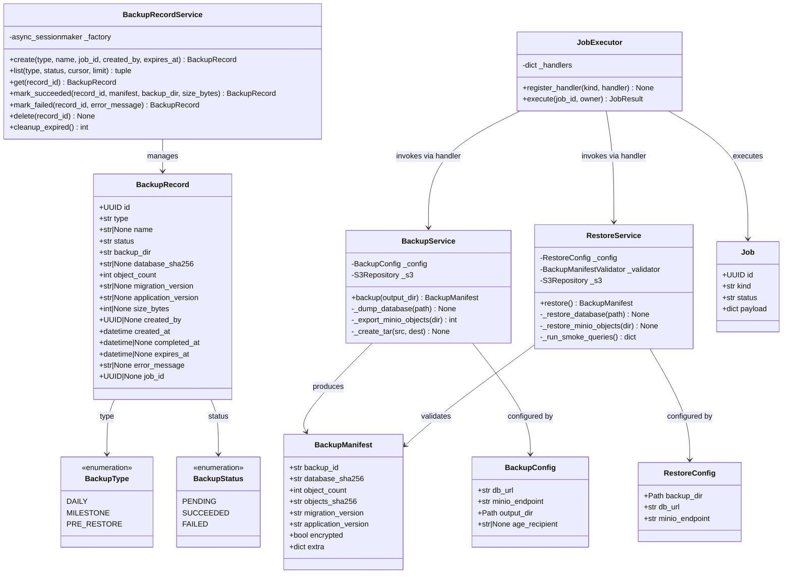
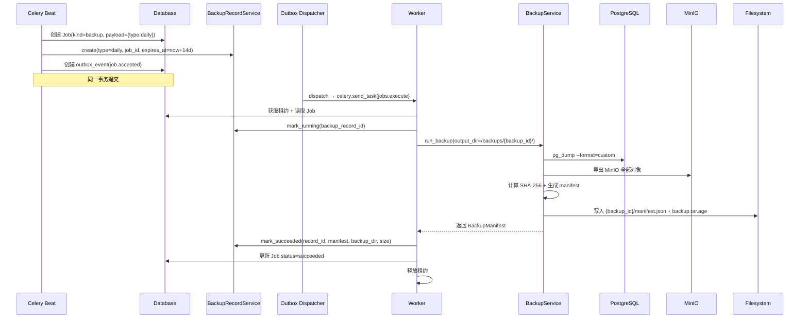
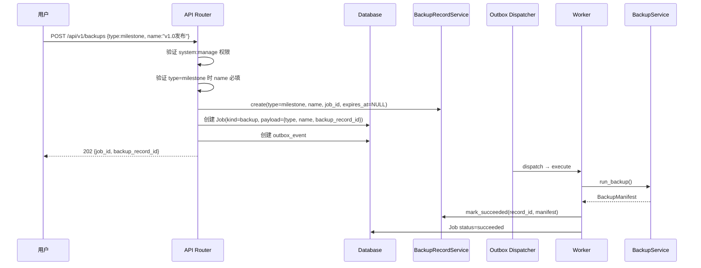
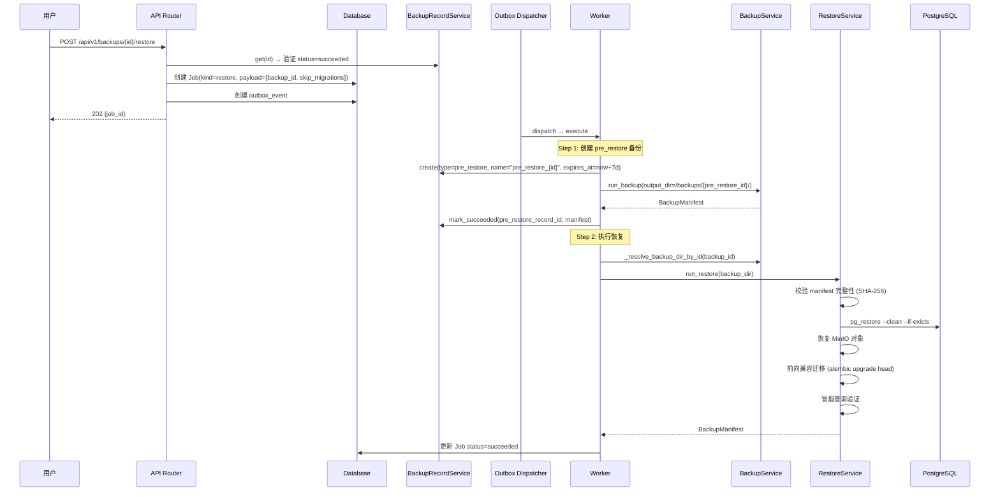
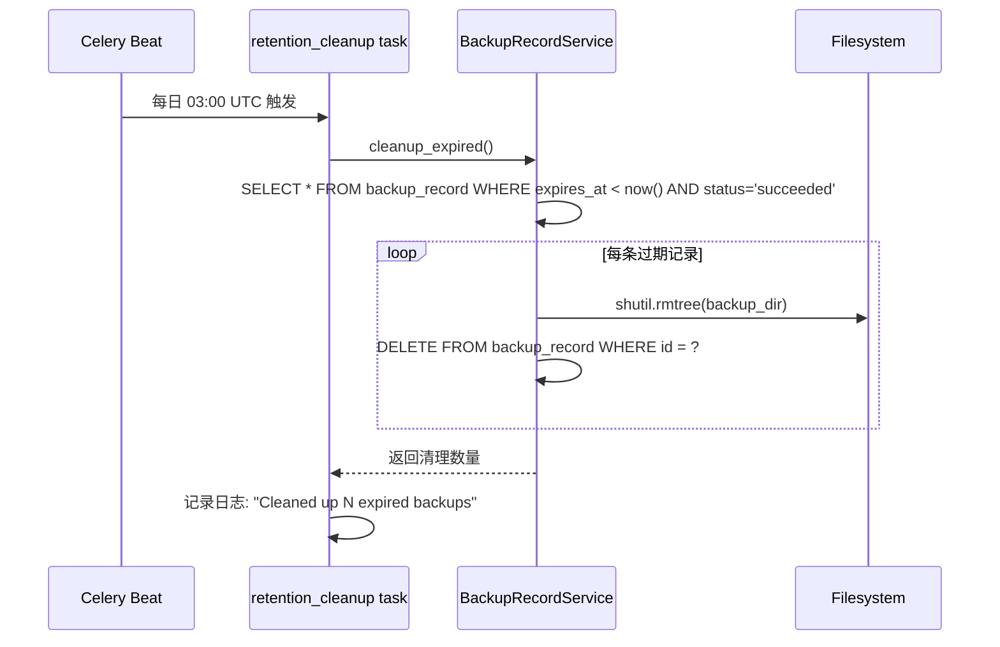
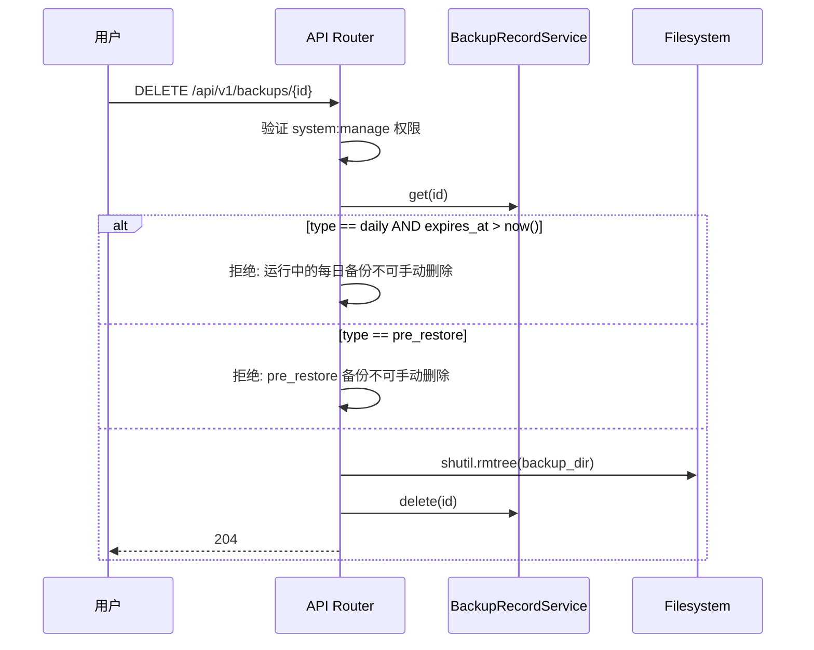
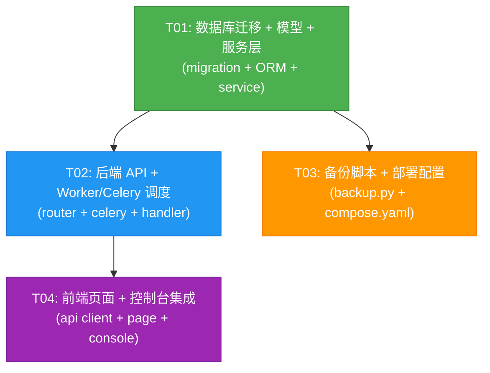

# 数据库备份系统架构设计

> IRIP 平台治理 — 数据库备份与恢复功能  
> 版本: 1.0 | 日期: 2026-08-15

---

## 目录

1. [实现方案](#1-实现方案)
2. [文件列表](#2-文件列表)
3. [数据结构和接口](#3-数据结构和接口)
4. [程序调用流程](#4-程序调用流程)
5. [依赖包](#5-依赖包)
6. [任务列表](#6-任务列表)
7. [共享知识](#7-共享知识)
8. [任务依赖图](#8-任务依赖图)
9. [待明确事项](#9-待明确事项)

---

## 1. 实现方案

### 1.1 核心技术挑战

| 挑战 | 说明 | 方案 |
|------|------|------|
| 每日自动备份 | 需 Celery beat 定时触发 pg_dump + MinIO 导出 | 复用现有 `BackupService`，新增 Celery beat 定时任务创建 backup 类型 Job |
| 14天保留策略 | 每日备份仅保留 14 天，到期自动清理 | `backup_record` 表记录 `expires_at`，Celery beat 定时清理任务删除过期记录和文件 |
| 里程碑永久备份 | 手动创建命名备份，永久保留 | `backup_record.type = 'milestone'`，`expires_at = NULL`，不参与自动清理 |
| 回滚前自动备份 | 恢复前自动创建 pre_restore 备份 | `_restore_handler` 执行 `run_restore()` 前先调用 `run_backup()` 创建 pre_restore 备份 |
| 备份元数据持久化 | 需记录每次备份的类型、状态、路径、校验和 | 新增 `backup_record` 表 + `BackupRecordService` |
| 备份目录隔离 | 现有代码所有备份写入同一目录会互相覆盖 | 修改 `BackupService.backup()` 为每个备份创建 `{output_dir}/{backup_id}/` 子目录 |
| Worker 访问备份卷 | Worker 容器需访问备份存储卷才能执行 pg_dump/restore | `compose.yaml` 中为 worker 服务挂载 `${IRIP_BACKUP_HOST_DIR}:/backups` 卷 |

### 1.2 框架与库选型

| 组件 | 选型 | 理由 |
|------|------|------|
| 数据库备份 | `pg_dump --format=custom` | **复用现有 `BackupService`**，custom 格式支持并行恢复、选择性恢复 |
| 数据库恢复 | `pg_restore --clean --if-exists` | **复用现有 `RestoreService`**，含 manifest 校验 + 冒烟测试 |
| 对象存储导出 | `S3Repository` (boto3) | **复用现有** MinIO 客户端 |
| 完整性校验 | SHA-256 逐 payload 校验 | **复用现有 `BackupManifestValidator`** |
| 定时调度 | Celery beat + crontab | **复用现有 Celery 基础设施**，新增 2 个 beat 条目 |
| 异步作业 | 现有 Job + Outbox 模式 | **复用现有**，backup/restore kind 已在 `JobKindPolicy` 注册 |
| ORM | SQLAlchemy 2.0 + `Base` | **复用现有** `packages.common.database.Base` |
| 迁移 | Alembic | **复用现有**，新增迁移 `0060_create_backup_record` |
| 前端 | React 18 + Ant Design 5 + TanStack Query | **复用现有技术栈** |

### 1.3 备份存储策略

```
/backups/                          ← IRIP_BACKUP_OUTPUT_DIR (Docker 卷挂载)
  {backup_id_1}/                   ← 每个备份独立子目录
    manifest.json                  ← 完整性清单 (SHA-256 + 版本元数据)
    backup.tar.age                 ← 加密归档 (或 backup.tar 未加密)
  {backup_id_2}/
    manifest.json
    backup.tar.age
  ...
```

**保留策略**：
- `daily`（每日自动）: `expires_at = created_at + 14 days`，到期自动清理
- `milestone`（里程碑手动）: `expires_at = NULL`，永久保留
- `pre_restore`（回滚前自动）: `expires_at = created_at + 7 days`，自动清理

### 1.4 备份类型设计

| 类型 | 触发方式 | 保留期 | name 字段 | created_by |
|------|----------|--------|-----------|------------|
| `daily` | Celery beat (每日 02:00 UTC) | 14 天 | NULL | NULL (系统自动) |
| `milestone` | API 手动创建 | 永久 | 用户指定 (必填) | 用户 ID |
| `pre_restore` | Worker 恢复前自动创建 | 7 天 | `"pre_restore_{source_backup_id}"` | NULL (系统自动) |

### 1.5 架构模式

- **后端**: 分层架构 (Router → Service → Repository/ORM)，复用现有 Job + Outbox 异步模式
- **前端**: 组件化 (Page → Table + Modal + Drawer)，TanStack Query 数据获取

---

## 2. 文件列表

### 新建文件

| 文件路径 | 说明 |
|----------|------|
| `migrations/versions/0060_create_backup_record.py` | Alembic 迁移：创建 `backup_record` 表 |
| `packages/backups/__init__.py` | 备份领域包初始化 |
| `packages/backups/entities.py` | `BackupRecord` ORM 模型 + `BackupType` 枚举 |
| `packages/backups/service.py` | `BackupRecordService`：备份记录 CRUD + 保留策略 |
| `apps/web/src/api/backups.ts` | 前端备份 API 客户端 |
| `apps/web/src/features/governance/DatabaseBackupPage.tsx` | 数据库备份管理页面 |

### 修改文件

| 文件路径 | 修改内容 |
|----------|----------|
| `apps/api/routers/backups.py` | 增强 API：支持 type/name 参数、按类型列表、删除备份、pre-restore 自动备份 |
| `apps/worker/celery_app.py` | 新增 `daily-backup` + `backup-retention-cleanup` beat 调度条目 |
| `apps/worker/tasks/__init__.py` | 新增 `daily_backup` / `retention_cleanup` beat 任务；增强 `_backup_handler` 记录元数据；增强 `_restore_handler` 先创建 pre_restore 备份 |
| `deployments/compose/backup.py` | `BackupService.backup()` 改为每个备份创建 `{output_dir}/{backup_id}/` 子目录 |
| `compose.yaml` | 为 worker 服务挂载备份卷 `${IRIP_BACKUP_HOST_DIR}:/backups` |
| `apps/web/src/features/governance/GovernanceConsole.tsx` | 新增"数据库备份" Tab |

---

## 3. 数据结构和接口

### 3.1 类图



### 3.2 backup_record 表结构

```sql
CREATE TABLE backup_record (
    id              UUID PRIMARY KEY,          -- = manifest.backup_id
    type            TEXT NOT NULL,             -- 'daily' | 'milestone' | 'pre_restore'
    name            TEXT,                      -- 里程碑名称 (milestone 必填)
    status          TEXT NOT NULL DEFAULT 'pending',  -- 'pending' | 'succeeded' | 'failed'
    backup_dir      TEXT NOT NULL,             -- 备份文件系统路径
    database_sha256 TEXT,                      -- 数据库 dump SHA-256
    object_count    INTEGER NOT NULL DEFAULT 0,
    migration_version TEXT,
    application_version TEXT,
    size_bytes      BIGINT,
    created_by      UUID REFERENCES app_user(id),  -- NULL = 系统自动
    created_at      TIMESTAMPTZ NOT NULL DEFAULT now(),
    completed_at    TIMESTAMPTZ,
    expires_at      TIMESTAMPTZ,               -- NULL = 永久保留
    error_message   TEXT,
    job_id          UUID REFERENCES job(id),
    CONSTRAINT chk_backup_type CHECK (type IN ('daily', 'milestone', 'pre_restore')),
    CONSTRAINT chk_backup_status CHECK (status IN ('pending', 'succeeded', 'failed'))
);

CREATE INDEX idx_backup_record_type ON backup_record (type);
CREATE INDEX idx_backup_record_status ON backup_record (status);
CREATE INDEX idx_backup_record_expires ON backup_record (expires_at) WHERE expires_at IS NOT NULL;
```

### 3.3 API 端点设计

| 方法 | 路径 | 说明 | 请求体 | 响应 |
|------|------|------|--------|------|
| POST | `/api/v1/backups` | 创建备份作业 | `{type: "daily"\|"milestone", name?: string}` | 202 `{job_id, backup_record_id, status, kind}` |
| GET | `/api/v1/backups` | 列出备份记录 | Query: `type`, `status`, `cursor`, `limit` | 200 `{items: BackupRecord[], next_cursor, has_more}` |
| GET | `/api/v1/backups/{id}` | 备份记录详情 | — | 200 `BackupRecordDetail` |
| POST | `/api/v1/backups/{id}/restore` | 从备份恢复 | `{skip_migrations?: bool}` | 202 `{job_id, status, kind}` |
| DELETE | `/api/v1/backups/{id}` | 删除备份 | — | 204 |

**权限**: 全部端点需 `system:manage` 权限（仅 `platform_administrator`）。

### 3.4 响应模型

```python
class BackupRecordResponse(BaseModel):
    id: str
    type: str                    # daily | milestone | pre_restore
    name: str | None
    status: str                  # pending | succeeded | failed
    backup_dir: str
    database_sha256: str | None
    object_count: int
    migration_version: str | None
    application_version: str | None
    size_bytes: int | None
    created_by: str | None
    created_at: datetime
    completed_at: datetime | None
    expires_at: datetime | None
    error_message: str | None
    job_id: str | None

class CreateBackupRequest(BaseModel):
    type: str = Field(..., description="备份类型: daily | milestone")
    name: str | None = Field(None, description="里程碑名称 (type=milestone 时必填)")

class CreateBackupResponse(BaseModel):
    job_id: str
    backup_record_id: str
    status: str
    kind: str
    created_at: datetime
```

### 3.5 Job Payload 结构

```python
# 备份作业 payload (kind="backup")
{
    "type": "daily" | "milestone" | "pre_restore",
    "name": "v1.0发布前备份",          # milestone 时有值
    "backup_record_id": "<uuid>",      # 关联的 backup_record.id
    "triggered_by": "<uuid>",           # 用户 ID (daily/pre_restore 时为 system)
}

# 恢复作业 payload (kind="restore")
{
    "backup_id": "<uuid>",              # 要恢复的 backup_record.id
    "skip_migrations": false,
    "triggered_by": "<uuid>",
    "pre_restore_created": false,        # 内部标记：是否已创建 pre_restore 备份
}
```

---

## 4. 程序调用流程

### 4.1 每日自动备份流程



### 4.2 里程碑手动备份流程



### 4.3 回滚恢复流程（含 pre_restore 自动备份）



### 4.4 保留策略清理流程



### 4.5 删除备份流程



---

## 5. 依赖包

本功能完全复用现有依赖，无需新增第三方包。

| 包 | 用途 | 已在项目中 |
|---|------|-----------|
| `celery` | 异步任务队列 + beat 调度 | ✓ |
| `sqlalchemy` | ORM + 异步会话 | ✓ |
| `alembic` | 数据库迁移 | ✓ |
| `psycopg` | PostgreSQL 驱动 (pg_dump/pg_restore 通过 subprocess 调用) | ✓ |
| `boto3` | MinIO S3 兼容客户端 | ✓ |
| `fastapi` | API 框架 | ✓ |
| `pydantic` | 请求/响应模型 | ✓ |
| `redis` | Celery broker/backend | ✓ |
| `antd` (前端) | UI 组件库 | ✓ |
| `@tanstack/react-query` (前端) | 数据获取 + 缓存 | ✓ |

---

## 6. 任务列表

### T01: 数据库迁移 + 备份记录模型 + 服务层

| 字段 | 值 |
|------|-----|
| **Task ID** | T01 |
| **Task Name** | 数据库迁移 + 备份记录模型 + 服务层 |
| **Source Files** | `migrations/versions/0060_create_backup_record.py` (新建), `packages/backups/__init__.py` (新建), `packages/backups/entities.py` (新建), `packages/backups/service.py` (新建) |
| **Dependencies** | 无 |
| **Priority** | P0 |

**实现要点**:
1. **Alembic 迁移** `0060_create_backup_record.py`:
   - `revision = "0060"`, `down_revision = "0059"`
   - 创建 `backup_record` 表（字段见 §3.2）
   - 创建索引：`idx_backup_record_type`, `idx_backup_record_status`, `idx_backup_record_expires`
   - downgrade: DROP TABLE backup_record

2. **ORM 模型** `packages/backups/entities.py`:
   - `BackupType` 枚举 (DAILY, MILESTONE, PRE_RESTORE)
   - `BackupStatus` 枚举 (PENDING, SUCCEEDED, FAILED)
   - `BackupRecord(Base)` ORM 类，字段与迁移对齐
   - 继承 `packages.common.database.Base`
   - 使用 `GUID` / `UTCDateTime` 自定义类型

3. **服务层** `packages/backups/service.py`:
   - `BackupRecordService` 类，依赖注入 `async_sessionmaker`
   - `create()`: INSERT backup_record，计算 expires_at（daily=+14d, milestone=NULL, pre_restore=+7d）
   - `list()`: 分页查询，支持 type/status 过滤，按 created_at DESC
   - `get()`: 按 ID 查询，不存在抛 AppError(not_found)
   - `mark_succeeded()`: 更新 status=succeeded + manifest 信息 + completed_at
   - `mark_failed()`: 更新 status=failed + error_message + completed_at
   - `delete()`: DELETE record（调用方负责删除文件）
   - `cleanup_expired()`: 查询 expires_at < now() 的记录，删除文件 + 删除记录，返回清理数

4. **包初始化** `packages/backups/__init__.py`: 空文件或导出主要类

---

### T02: 后端 API 增强 + Worker/Celery 调度

| 字段 | 值 |
|------|-----|
| **Task ID** | T02 |
| **Task Name** | 后端 API 增强 + Worker/Celery 调度 |
| **Source Files** | `apps/api/routers/backups.py` (修改), `apps/worker/celery_app.py` (修改), `apps/worker/tasks/__init__.py` (修改) |
| **Dependencies** | T01 |
| **Priority** | P0 |

**实现要点**:
1. **API 增强** `apps/api/routers/backups.py`:
   - 修改 `CreateBackupRequest`: 新增 `type` (daily/milestone) + `name` 字段
   - 修改 `create_backup()`: 创建 Job 时写入 `payload.type` + `payload.name` + `payload.backup_record_id`；同时调用 `BackupRecordService.create()` 创建记录
   - 修改 `list_backups()`: 改为查询 `backup_record` 表（而非 Job 表），支持 type/status 过滤
   - 修改 `get_backup_detail()`: 查询 `backup_record` 详情
   - 修改 `create_restore()`: 验证 backup_record.status == succeeded；Job payload 写入 backup_id
   - 新增 `delete_backup()`: `DELETE /api/v1/backups/{id}`，验证类型（仅 milestone 可删，daily 运行中不可删，pre_restore 不可删），删除文件 + 记录

2. **Celery beat 调度** `apps/worker/celery_app.py`:
   - 新增 beat 条目:
     ```python
     "daily-backup": {
         "task": "backup.daily",
         "schedule": crontab(hour=2, minute=0),  # 每日 02:00 UTC
     },
     "backup-retention-cleanup": {
         "task": "backup.retention_cleanup",
         "schedule": crontab(hour=3, minute=0),  # 每日 03:00 UTC
     },
     ```
   - 新增 `@celery_app.task(name="backup.daily")`: 创建 Job(kind=backup, payload={type:daily}) + outbox event + backup_record
   - 新增 `@celery_app.task(name="backup.retention_cleanup")`: 调用 `BackupRecordService.cleanup_expired()`

3. **Worker handler 增强** `apps/worker/tasks/__init__.py`:
   - 增强 `_backup_handler`:
     - 从 payload 读取 `type`, `name`, `backup_record_id`
     - 调用 `run_backup()` 后，调用 `BackupRecordService.mark_succeeded()` 记录 manifest 信息
     - 失败时调用 `BackupRecordService.mark_failed()`
   - 增强 `_restore_handler`:
     - Step 1: 创建 pre_restore 备份（调用 `run_backup()` + `BackupRecordService.create(type=pre_restore)` + `mark_succeeded()`）
     - Step 2: 通过 backup_id 解析备份目录，调用 `run_restore()`
     - 将 pre_restore 逻辑内联在 handler 中（不创建额外的 Job，避免多 Job 链式依赖）

---

### T03: 备份脚本增强 + 部署配置

| 字段 | 值 |
|------|-----|
| **Task ID** | T03 |
| **Task Name** | 备份脚本增强 + 部署配置 |
| **Source Files** | `deployments/compose/backup.py` (修改), `deployments/compose/backup_manifest.py` (修改), `compose.yaml` (修改) |
| **Dependencies** | T01 |
| **Priority** | P1 |

**实现要点**:
1. **备份脚本** `deployments/compose/backup.py`:
   - 修改 `BackupService.backup()` 方法: 在 `target_dir` 下创建 `{backup_id}/` 子目录
     ```python
     # 修改前: target_dir = output_dir or self._config.output_dir
     # 修改后:
     target_base = output_dir or self._config.output_dir
     backup_id = str(new_id())
     target_dir = target_base / backup_id
     target_dir.mkdir(parents=True, exist_ok=True)
     ```
   - 确保所有产物（manifest.json, backup.tar.age）写入子目录
   - 返回的 `BackupManifest.backup_id` 已有值，与子目录名一致

2. **备份清单** `deployments/compose/backup_manifest.py`:
   - `BackupManifest.extra` 字段已存在（`field(default_factory=dict)`），无需修改结构
   - 在 `compute_manifest()` 中可选传入 `extra={"backup_type": ..., "name": ...}`（向后兼容）

3. **部署配置** `compose.yaml`:
   - 在 `worker` 服务下新增卷挂载:
     ```yaml
     worker:
       # ... 现有配置 ...
       volumes:
         - ${IRIP_BACKUP_HOST_DIR:-./backups}:/backups
       environment:
         IRIP_BACKUP_OUTPUT_DIR: ${IRIP_BACKUP_OUTPUT_DIR:-/backups}
     ```
   - 确保 worker 容器能访问备份目录（pg_dump 输出 + pg_restore 读取）

---

### T04: 前端备份管理页面 + 治理控制台集成

| 字段 | 值 |
|------|-----|
| **Task ID** | T04 |
| **Task Name** | 前端备份管理页面 + 治理控制台集成 |
| **Source Files** | `apps/web/src/api/backups.ts` (新建), `apps/web/src/features/governance/DatabaseBackupPage.tsx` (新建), `apps/web/src/features/governance/GovernanceConsole.tsx` (修改) |
| **Dependencies** | T02 |
| **Priority** | P1 |

**实现要点**:
1. **API 客户端** `apps/web/src/api/backups.ts`:
   - 类型定义: `BackupRecordItem`, `BackupRecordListResponse`, `BackupRecordDetail`
   - `apiListBackups(params)`: GET `/backups` — 列出备份记录
   - `apiCreateBackup(body)`: POST `/backups` — 创建备份作业
   - `apiGetBackupDetail(id)`: GET `/backups/{id}` — 备份详情
   - `apiRestoreBackup(id, body)`: POST `/backups/{id}/restore` — 从备份恢复
   - `apiDeleteBackup(id)`: DELETE `/backups/{id}` — 删除备份
   - 复用 `http` axios 实例 from `./client`

2. **备份管理页面** `apps/web/src/features/governance/DatabaseBackupPage.tsx`:
   - **备份列表**: Ant Design `Table`，列：类型(Tag)、名称、状态(StatusMark)、创建时间、过期时间、操作(恢复/删除)
   - **创建里程碑备份**: `Modal` + `Form`，输入名称，确认后调用 `apiCreateBackup({type:milestone, name})`
   - **恢复确认**: `Modal.confirm`，二次确认后调用 `apiRestoreBackup(id)`
   - **删除确认**: `Modal.confirm`，二次确认后调用 `apiDeleteBackup(id)`
   - **数据获取**: TanStack Query `useQuery` + `useMutation`
   - **自动刷新**: `refetchInterval: 10000`（备份/恢复进行中时 10s 刷新）
   - **权限检查**: 仅 `platform_administrator` 可见（由 GovernanceConsole 控制 Tab 可见性）
   - **复用样式**: `OceanPanel`, `StatusMark`, `QueryStateDisplay` 等共享组件

3. **治理控制台** `apps/web/src/features/governance/GovernanceConsole.tsx`:
   - 在 `tabs` 数组中新增: `{ key: 'db-backup', label: '数据库备份' }` (仅 `isAdmin`)
   - 在 render 区域新增: `{activeTab === 'db-backup' && isAdmin && <DatabaseBackupPage />}`

---

## 7. 共享知识

### 7.1 跨文件约定

```
- 所有 API 响应使用 {code, data, message} 或 AppError 格式（复用现有 packages.common.errors.AppError）
- 所有时间戳为 UTC timestamptz，应用层使用 datetime.now(UTC)
- 所有 UUID 主键通过 packages.common.ids.new_id() 生成
- 备份/恢复作业 kind 为 "backup" / "restore"，已在 JobKindPolicy 注册（required_permission="system:manage"）
- 备份文件存储路径: {IRIP_BACKUP_OUTPUT_DIR}/{backup_id}/manifest.json + backup.tar.age
- backup_record.id == manifest.backup_id == 备份子目录名（三者一致）
- Worker handler 通过 payload.backup_record_id 关联 Job 与 backup_record
- pre_restore 备份在 restore handler 内联创建（不创建额外 Job），避免多 Job 链式依赖
- retention_cleanup 不走 Job 机制，直接由 Celery beat 任务执行（轻量级文件清理）
```

### 7.2 权限约定

```
- 所有备份 API 端点需 system:manage 权限（仅 platform_administrator 拥有）
- 复用现有 require_permission("system:manage") 依赖注入
- Worker handler 通过 _validate_job_kind() 二次校验 kind 合法性
- backup/restore 作业不允许通过通用 POST /jobs 接口提交（allow_general_submit=False）
```

### 7.3 错误处理约定

```
- 备份失败: backup_record.status=failed, error_message 记录失败原因, Job status=failed
- 恢复失败: pre_restore 备份仍保留（供分析），Job status=failed
- 清理失败: 记录日志但继续处理下一条（不中断清理批次）
- pg_dump/pg_restore 非零退出: 直接 raise RuntimeError（fail-closed，复用现有策略）
```

### 7.4 前端约定

```
- API 客户端复用 apps/web/src/api/client.ts 的 http axios 实例
- 数据获取使用 TanStack Query (useQuery / useMutation)
- UI 组件使用 Ant Design 5 + Ocean 主题组件 (OceanPanel, StatusMark, QueryStateDisplay)
- 备份类型标签颜色: daily=blue, milestone=gold, pre_restore=purple
- 备份状态标签: pending=processing, succeeded=success, failed=error
- 恢复操作需二次确认 (Modal.confirm)，提示"将先创建 pre_restore 备份"
```

---

## 8. 任务依赖图



**依赖说明**:
- T01 是基础，T02 和 T03 依赖 T01（需要 ORM 模型和 Service）
- T02 和 T03 之间无直接依赖，可并行
- T04 依赖 T02（需要 API 端点就绪才能联调）

---

## 9. 待明确事项

### 9.1 已做假设

| 假设 | 说明 |
|------|------|
| 备份存储使用本地卷 | `IRIP_BACKUP_HOST_DIR` 挂载到容器 `/backups`，未使用 MinIO 存储备份包本身（MinIO 仅存储业务对象） |
| pre_restore 保留 7 天 | 假设 pre_restore 备份在恢复成功后仍有诊断价值，保留 7 天后自动清理 |
| 每日备份时间 02:00 UTC | 避开业务高峰，可后续通过环境变量配置 |
| 清理时间 03:00 UTC | 在每日备份之后执行，确保清理的是前一天的过期备份 |
| 备份包加密 | 复用现有 `IRIP_BACKUP_AGE_RECIPIENT` 环境变量控制是否加密 |
| daily 备份不可手动删除 | 防止误删导致保留策略缺失；只能等自动过期或通过数据库直接操作 |
| pre_restore 不可手动删除 | 防止恢复前安全网被删除 |
| 备份目录结构 | 每个备份创建 `{backup_id}/` 子目录，解决现有代码多备份互相覆盖问题 |

### 9.2 待确认

| 问题 | 影响范围 | 建议 |
|------|----------|------|
| 是否需要备份/恢复进度条 | 前端 UX | 当前 Job 模型无 stage/progress 实时更新，建议 V2 迭代增加 |
| 是否需要备份下载功能 | API + 前端 | 当前不支持下载备份包（安全考虑），如需可后续增加签名 URL 下载 |
| 每日备份是否需要在系统健康页展示 | 前端 | 建议在 `SystemHealthPage` 新增"最近备份"检查项，展示最后成功备份时间 |
| 并发备份/恢复控制 | Worker | 当前 JobExecutor 已有租约机制，但备份/恢复 max_retries=0 且 queue=irip-ops，建议确认是否需要串行化 |
| 备份失败告警 | 运维 | 建议后续在 SystemHealthPage 或通知系统增加备份失败告警 |
