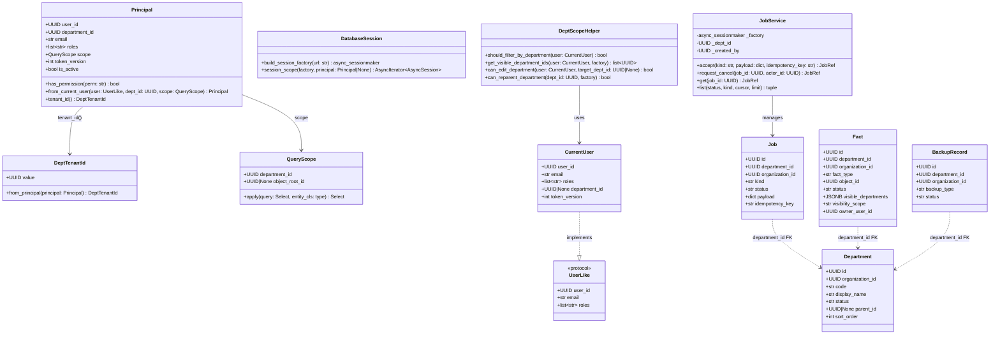
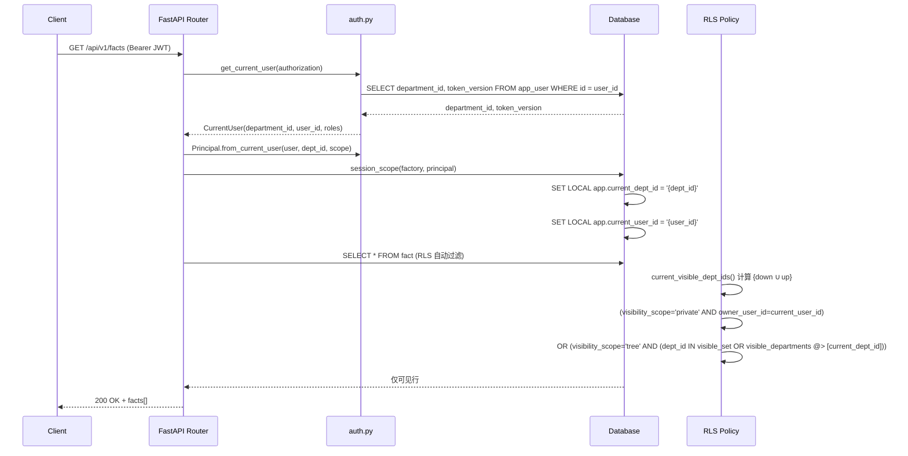
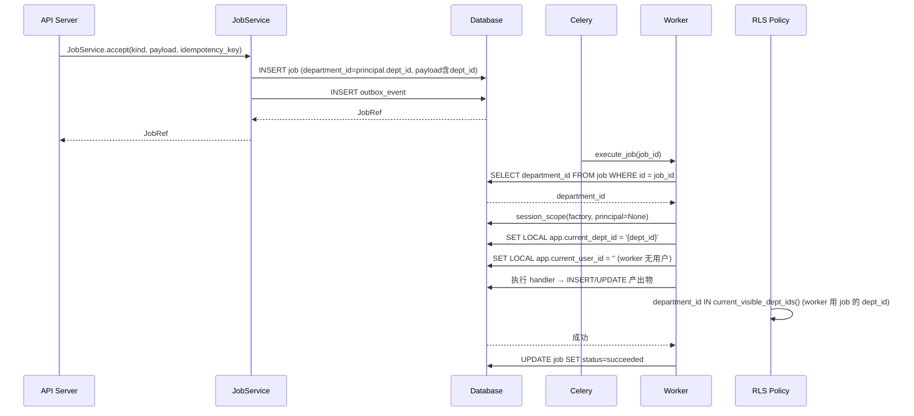
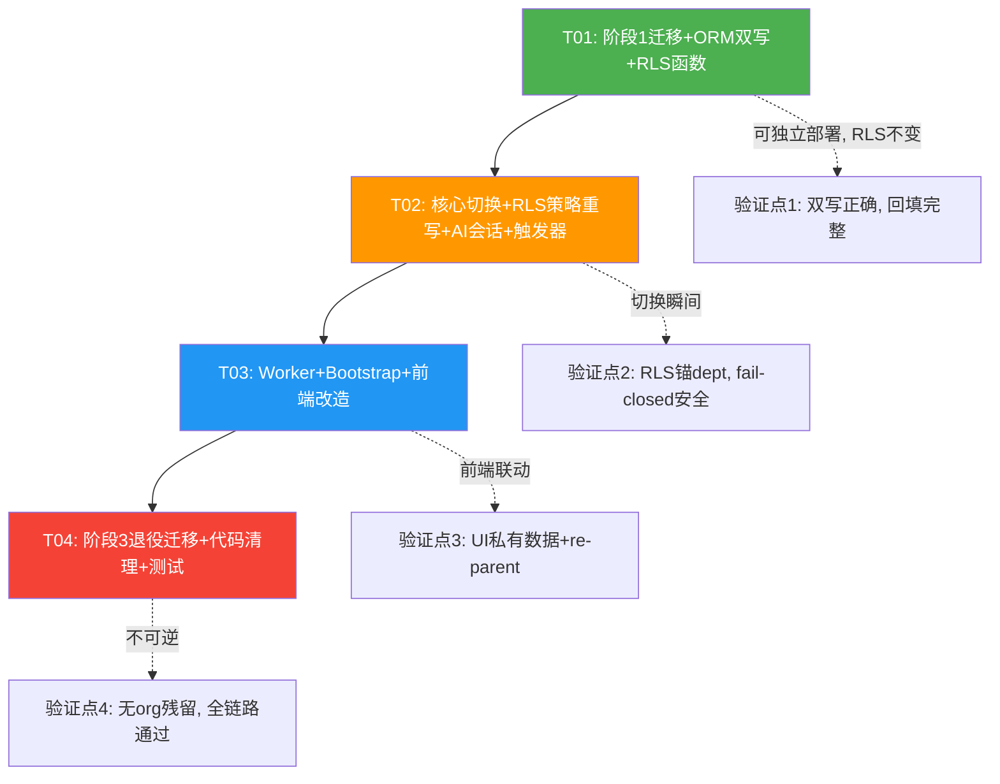

# IRIP 多租户隔离键升级 — 实现设计 + 任务分解

> 架构师：高见远（Bob） | 基线：ADR `docs/arch-department-tenant.md`（已冻结）+ PRD `docs/prd-department-tenant-upgrade.md`
> 当前迁移版本：0061 | 目标：Department 扶正为唯一隔离键，Organization 退役

---

## 1. 实现方案概述

采用**三阶段迁移 + 双跑保障**策略：阶段 1 加列回填（RLS 仍锚 `organization_id`，行为不变，可随时中止）→ 阶段 2 切换（GUC/Principal/RLS 策略换锚 `department_id`，fail-closed 方向安全）→ 阶段 3 退役（DROP `organization_id` 列 + `organization` 表）。阶段 1-2 之间应用层双写 `department_id`，确保切换瞬间数据完整。

---

## 2. 文件列表及相对路径

### 2.1 新建文件

| 文件路径 | 操作 | 说明 |
|---------|------|------|
| `migrations/versions/0062_dept_add_columns.py` | 新建 | 阶段1：A/B 类表 ADD COLUMN `department_id`（先 NULL）+ A 类表加 `visible_departments JSONB DEFAULT '[]'` + `visibility_scope TEXT DEFAULT 'tree'` + `owner_user_id UUID`；department 表加 root/system 哨兵行 + 唯一约束 `(parent_id, code)` |
| `migrations/versions/0063_dept_backfill.py` | 新建 | 阶段1：存量回填 `department_id`（按 ADR §4 依据：用户数据→primary dept；公共档→root；敏感档→system）+ 逐表审计报告输出 |
| `migrations/versions/0064_dept_set_notnull.py` | 新建 | 阶段1：`SET NOT NULL` + 创建 `current_visible_dept_ids()` 函数（STABLE, SECURITY DEFINER）+ GIN 索引 `visible_departments jsonb_path_ops` + RLS 策略（不激活，仅创建备用） |
| `migrations/versions/0065_dept_rls_switch.py` | 新建 | 阶段2：DROP 旧 `tenant_isolation` 策略（锚 org）→ CREATE 新策略（锚 dept）+ A 类私有分支 + B 类层级可见 + AI 会话 participant 策略 + `forbid_reprivatize()` 触发器 + 哨兵保护触发器 |
| `migrations/versions/0066_retire_organization.py` | 新建 | 阶段3：DROP `organization_id` 列（所有表）+ DROP `organization` 表 + DROP `app.current_org_id` GUC + 清理旧唯一约束 |
| `packages/common/tenant_guc.py` | 新建 | GUC 常量定义 + 安全设置辅助函数（`set_dept_guc`/`set_user_guc`），集中管理 GUC 命名 |
| `apps/web/src/shared/DepartmentSelector.tsx` | 新建 | 可复用部门树选择器（Ant Design TreeSelect），root 显示"公共（{机构名}）"，system 不出现，多部门用户可见 |
| `apps/web/src/shared/PrivateBadge.tsx` | 新建 | 私有数据徽标组件（红色 Tag + 🔒 图标） |
| `apps/web/src/shared/PublishPrivateToggle.tsx` | 新建 | "发布为私有"勾选框 + 提示文案组件 |
| `docs/sequence-diagram-dept-tenant-impl.mermaid` | 新建 | 本文时序图独立文件 |
| `docs/class-diagram-dept-tenant-impl.mermaid` | 新建 | 本文类图独立文件 |

### 2.2 修改文件

| 文件路径 | 操作 | 说明 |
|---------|------|------|
| `packages/common/database.py` | 修改 | GUC `app.current_org_id` → `app.current_dept_id` + `app.current_user_id`；`build_session_factory` 连接默认 SET 两 GUC 为空串；`session_scope` 从 principal 设置 `SET LOCAL app.current_dept_id` + `SET LOCAL app.current_user_id` |
| `packages/common/principal.py` | 修改 | `Principal` 字段 `organization_id` → `department_id`（primary 部门）；新增 `user_id`（已有但提升为一级字段用于私有 RLS）；`from_current_user` 签名改收 `department_id`；`TenantId` → `DeptTenantId`（包 `department_id`） |
| `packages/common/query_scope.py` | 修改 | `QueryScope` 字段 `organization_id` → `department_id`；`apply()` 改按 `department_id` + `visible_departments @>` 白名单过滤；删除 `object_root_id`/`resource_type`（简化为 dept + whitelist） |
| `apps/api/dependencies/dept_scope.py` | 修改 | 重写 `should_filter_by_department`（root 成员 → False 自动全可见）；`get_visible_department_ids` → 调用 DB 函数 `current_visible_dept_ids()`；`can_edit_department` → 基于层级可见集判断；新增 `can_reparent_department`（哨兵保护） |
| `apps/api/dependencies/auth.py` | 修改 | `CurrentUser` 字段 `organization_id` → `department_id`（primary）；查询 app_user 时取 `department_id`；JWT claims 增加 `department_id` |
| `deployments/compose/bootstrap.py` | 修改 | 删除 `OrganizationRepository`/`Organization`；改建 root 部门（code='root', parent_id=NULL）+ system 部门（code='system', parent_id=root）；admin 用户挂 root；`DepartmentSeeder` 改用 `(parent_id, code)` 唯一约束 |
| `apps/worker/tasks.py` | 修改 | `_execute_job_async` 从 job payload 读取 `department_id`，构造无 Principal 的 session_scope（设置 GUC） |
| `packages/jobs/entities.py` | 修改 | Job ORM 增加 `department_id: Mapped[UUID]`（B 类表）；`organization_id` 保留至阶段 3 |
| `packages/jobs/service.py` | 修改 | `JobService.__init__` 参数 `organization_id` → `department_id`；accept/create/list/get 方法全部改用 `department_id` |
| `packages/jobs/worker.py` | 修改 | `session_scope` 调用传入 department GUC（从 job 读取 `department_id`） |
| `packages/facts/entities.py` | 修改 | Fact ORM 增加 `department_id` + `visible_departments` + `visibility_scope` + `owner_user_id`（A 类表） |
| `packages/parameters/entities.py` | 修改 | Parameter ORM 增加 A 类四列 |
| `packages/provenance/entities.py` | 修改 | EvidenceSet + TransformationRecipe 增加 A 类四列；DerivationRun 增加 `department_id`（B 类） |
| `packages/models/entities.py` | 修改 | Model ORM 增加 A 类四列 |
| `packages/equipment/entities.py` | 修改 | Equipment ORM `department_id` 改 NOT NULL + 增加 A 类其余三列 |
| `packages/components/flow/flow_runtime.py` | 修改 | FlowDefinition 增加 A 类四列；FlowRun 增加 `department_id`（B 类）；FlowService 参数 `organization_id` → `department_id` |
| `packages/components/registry/registry.py` | 修改 | Component ORM 增加 A 类四列；ComponentService 参数改 `department_id` |
| `packages/auth/entities.py` | 修改 | AppUser ORM 增加 `department_id`（B 类，已有则改 NOT NULL） |
| `packages/connectors/entities.py` | 修改 | Secret ORM 增加 `department_id`（B 类） |
| `packages/backups/entities.py` | 修改 | BackupRecord ORM 增加 `department_id`（B 类） |
| `packages/ai/collaboration_entities.py` | 修改 | ConversationParticipant 无需改列，但 RLS 策略由迁移 0065 处理 |
| `packages/departments/entities.py` | 修改 | Department ORM 删除 `organization_id` 列（阶段3，阶段1先保留）；唯一约束改为 `(parent_id, code)` |
| `packages/departments/service.py` | 修改 | re-parent 增加哨兵保护检查 + 影响预览查询 + 审计日志；CRUD 改用 `department_id` |
| `apps/api/routers/departments.py` | 修改 | re-parent 端点增加二次确认 + 影响预览端点 |
| `apps/api/composition/infrastructure.py` | 修改 | session factory 构建适配新 GUC |
| `apps/web/src/api/types.ts` | 修改 | 增加 `visibility_scope`、`owner_user_id`、`department_id` 字段到相关类型 |
| `apps/web/src/api/departments.ts` | 修改 | 增加 re-parent 影响预览 API + 哨兵标记字段 |
| `apps/web/src/features/governance/DepartmentManagement.tsx` | 修改 | 树形视图加哨兵 🔒 图标 + "不可移动"标签；re-parent 二次确认弹窗 + 影响预览面板 |
| `apps/web/src/features/facts/FactsPage.tsx` | 修改 | 私有数据行红色"私有" Tag（P1） |
| `apps/web/src/features/facts/FactDetail.tsx` | 修改 | 私有数据标题标红 + 🔒 标签 + "公开"按钮 + 二次确认 |
| `apps/web/src/features/facts/FactModal.tsx` | 修改 | 集成部门选择器 + "发布为私有"勾选框 |
| `apps/web/src/features/components/FlowDetail.tsx` | 修改 | 同 FactDetail，私有流程标红 + 公开按钮 |
| `apps/web/src/features/equipment/EquipmentPage.tsx` | 修改 | 集成部门选择器（设备不暴露私有勾选） |

### 2.3 删除文件（阶段 3 标注）

| 文件路径 | 操作 | 说明 |
|---------|------|------|
| 无独立文件删除 | — | `organization` 表由迁移 0066 DROP；`organization_id` 列由迁移 0066 DROP；旧 GUC `app.current_org_id` 由迁移 0066 清理；代码中 `organization_id` 引用在阶段 2-3 逐步清除 |

---

## 3. 数据结构和接口



### 3.1 Principal 新结构

```python
@dataclass(frozen=True)
class Principal:
    user_id: UUID           # 原有，提升为 RLS 私有分支键
    department_id: UUID     # 替代 organization_id（primary 部门）
    email: str
    roles: list[str]
    scope: QueryScope
    token_version: int = 0
    is_active: bool = True

    @staticmethod
    def from_current_user(user: UserLike, dept_id: UUID, scope: QueryScope) -> "Principal":
        ...

    def tenant_id(self) -> "DeptTenantId":
        return DeptTenantId(self.department_id)
```

### 3.2 QueryScope 新结构

```python
@dataclass(frozen=True)
class QueryScope:
    department_id: UUID                 # 必填，替代 organization_id
    object_root_id: UUID | None = None  # 保留对象级过滤（可选）

    def apply(self, query: sa.Select, entity_cls: type | None = None) -> sa.Select:
        # 1. department_id 等值过滤（应用层快路径）
        # 2. RLS 在 DB 层做完整层级可见 + 白名单 + 私有分支
        ...
```

### 3.3 新增 SQL 函数 / 触发器签名

```sql
-- 可见部门集函数（阶段1创建，阶段2激活）
CREATE FUNCTION current_visible_dept_ids() RETURNS SETOF uuid
  LANGUAGE sql SECURITY DEFINER STABLE AS $$ ... $$;

-- AI 会话可见性函数（防两表互引用递归）
CREATE FUNCTION current_user_conversations() RETURNS SETOF uuid
  LANGUAGE sql SECURITY DEFINER STABLE AS $$ ... $$;

-- 单向阀触发器（A 类表，禁止 tree→private + owner_user_id 不可改）
CREATE FUNCTION forbid_reprivatize() RETURNS trigger
  LANGUAGE plpgsql AS $$ ... $$;

-- 哨兵保护触发器（禁止 re-parent / 禁用 / 删除 root 和 system）
CREATE FUNCTION protect_sentinel_dept() RETURNS trigger
  LANGUAGE plpgsql AS $$ ... $$;
```

---

## 4. 程序调用流程

### 4.1 请求级：API 请求 → RLS 过滤



### 4.2 Worker 级：Job 提交 → Worker 写入



---

## 5. 任务列表（有序、含依赖关系、按实现顺序）

### 阶段 1：加列回填（双跑，RLS 仍锚 org）

| ID | 任务名 | 涉及文件 | 依赖 | 优先级 | 说明 |
|----|--------|---------|------|--------|------|
| T01 | 阶段1迁移 + ORM 双写 + RLS 函数创建 | `migrations/versions/0062_dept_add_columns.py`, `migrations/versions/0063_dept_backfill.py`, `migrations/versions/0064_dept_set_notnull.py`, `packages/facts/entities.py`, `packages/parameters/entities.py`, `packages/provenance/entities.py`, `packages/models/entities.py`, `packages/equipment/entities.py`, `packages/components/flow/flow_runtime.py`, `packages/components/registry/registry.py`, `packages/auth/entities.py`, `packages/connectors/entities.py`, `packages/backups/entities.py`, `packages/jobs/entities.py`, `packages/departments/entities.py` | 无 | P0 | 0062: A/B 类表 ADD COLUMN department_id（先 NULL）+ A 类加 visible_departments/visibility_scope/owner_user_id + department 表加 root/system 哨兵 + 唯一约束改 (parent_id, code)；0063: 回填 department_id（用户→primary dept，公共档→root，敏感档→system）；0064: SET NOT NULL + 创建 current_visible_dept_ids() 函数 + GIN 索引 + 创建新 RLS 策略（不激活）。ORM 双写：所有 entity 增加 department_id 列映射，写入时同时填 department_id 和 organization_id。 |

### 阶段 2：切换（GUC/Principal/策略换锚）

| ID | 任务名 | 涉及文件 | 依赖 | 优先级 | 说明 |
|----|--------|---------|------|--------|------|
| T02 | 核心切换 + RLS 策略重写 + AI 会话 + 私有触发器 + 哨兵保护 | `packages/common/database.py`, `packages/common/principal.py`, `packages/common/query_scope.py`, `packages/common/tenant_guc.py`, `apps/api/dependencies/dept_scope.py`, `apps/api/dependencies/auth.py`, `packages/jobs/service.py`, `packages/jobs/worker.py`, `apps/api/composition/infrastructure.py`, `migrations/versions/0065_dept_rls_switch.py`, `packages/departments/service.py`, `apps/api/routers/departments.py` | T01 | P0 | database.py: GUC 换锚 current_dept_id + current_user_id；principal.py: department_id 替代 organization_id；query_scope.py: dept + whitelist 过滤；dept_scope.py: 调用 DB 函数 + root 成员全可见；auth.py: CurrentUser 改 department_id + JWT claims；0065 迁移: DROP 旧策略 → CREATE 新策略（A 类含私有分支，B 类层级可见）+ AI 会话 participant 策略 + forbid_reprivatize 触发器 + protect_sentinel_dept 触发器；departments service/router: re-parent 二次确认 + 影响预览 + 审计日志 + 哨兵保护。 |

### 附加任务：Worker + Bootstrap + 前端

| ID | 任务名 | 涉及文件 | 依赖 | 优先级 | 说明 |
|----|--------|---------|------|--------|------|
| T03 | Worker 改造 + Bootstrap 重写 + 前端改造 | `apps/worker/tasks.py`, `deployments/compose/bootstrap.py`, `apps/web/src/api/types.ts`, `apps/web/src/api/departments.ts`, `apps/web/src/features/governance/DepartmentManagement.tsx`, `apps/web/src/features/facts/FactsPage.tsx`, `apps/web/src/features/facts/FactDetail.tsx`, `apps/web/src/features/facts/FactModal.tsx`, `apps/web/src/shared/DepartmentSelector.tsx`, `apps/web/src/shared/PrivateBadge.tsx`, `apps/web/src/shared/PublishPrivateToggle.tsx`, `apps/web/src/features/equipment/EquipmentPage.tsx`, `apps/web/src/features/components/FlowDetail.tsx` | T02 | P0 | Worker: payload 带 department_id → session_scope 设置 GUC；Bootstrap: 删 organization 逻辑，改建 root + system 哨兵，admin 挂 root；前端: 部门选择器（TreeSelect, root 特殊标签, system 不出现）+ 私有勾选 + 私有徽标/标红 + 公开按钮（二次确认）+ re-parent 树形视图（哨兵 🔒 不可移动 + 影响预览面板 + 二次确认）。 |

### 阶段 3：退役

| ID | 任务名 | 涉及文件 | 依赖 | 优先级 | 说明 |
|----|--------|---------|------|--------|------|
| T04 | 阶段3退役迁移 + 代码清理 + 测试 | `migrations/versions/0066_retire_organization.py`, `packages/common/principal.py`, `packages/common/query_scope.py`, `packages/jobs/service.py`, `packages/jobs/entities.py`, `packages/facts/entities.py`, `packages/departments/entities.py`, `packages/components/flow/flow_runtime.py`, `packages/components/registry/registry.py` | T03 | P1 | 0066: DROP organization_id 列（所有表）+ DROP organization 表 + DROP app.current_org_id GUC + 清理旧唯一约束；代码: 删除所有 organization_id 引用、删除旧 GUC 引用、ORM 删除 organization_id 列映射；测试: 全链路验证对称可见性 + 私有数据隔离 + 哨兵保护 + AI 会话可见性。 |

---

## 6. 依赖包列表

本次升级无需新增第三方包。所有依赖（SQLAlchemy / Alembic / FastAPI / Celery / React / Ant Design / TanStack Query）已在项目 `pyproject.toml` / `package.json` 中声明。

---

## 7. 共享知识（跨文件约定）

### 7.1 GUC 命名约定

| GUC 名称 | 用途 | 设置时机 | 默认值 |
|----------|------|---------|--------|
| `app.current_dept_id` | RLS 隔离主键（替代 `app.current_org_id`） | `session_scope` 从 `principal.department_id` SET LOCAL | `''`（空串，fail closed） |
| `app.current_user_id` | 私有数据 owner 判断 | `session_scope` 从 `principal.user_id` SET LOCAL | `''`（空串，私有分支不匹配） |
| ~~`app.current_org_id`~~ | 阶段 3 退役 | — | — |

> **关键**：`current_setting('app.current_dept_id', true)` 使用 `true` 参数，缺失时返回 NULL 而非报错。`NULLIF(..., '')::uuid` 处理空串。RLS 中 NULL = uuid 为假 → fail closed。

### 7.2 哨兵部门 code 约定

| code | display_name | parent_id | 用途 | 保护级别 |
|------|-------------|----------|------|---------|
| `root` | 环境变量 `IRIP_ROOT_DEPT_NAME`（默认 "IRIP 研究院"） | NULL | 顶层公共部门，成员=管理员 | 不可 re-parent / 不可禁用 / 不可删除 |
| `system` | "系统室" | root.id | 敏感数据归属（secret/audit_event/backup_record/connector） | 不可 re-parent / 不可禁用 / 不可删除 |

> 哨兵保护由 DB 触发器 `protect_sentinel_dept()` 兜底，应用层 `can_reparent_department()` 前置检查。`code` 列创建后锁定不可修改（服务层 UPDATE 不写 code 列）。

### 7.3 RLS 策略命名约定

| 策略名 | 适用表类 | USING 子句 |
|--------|---------|-----------|
| `tenant_isolation` | A 类表（fact, parameter, evidence_set, artifact, model, transformation_recipe, component, flow_definition, industrial_object, equipment） | `(visibility_scope='private' AND owner_user_id=current_user_id) OR (visibility_scope='tree' AND (department_id IN (SELECT current_visible_dept_ids()) OR visible_departments @> jsonb_build_array(current_dept_id)))` |
| `tenant_isolation` | B 类表（job, flow_run, derivation_run, audit_event, scope_grant, secret, backup_record, connector各表, app_user） | `department_id IN (SELECT current_visible_dept_ids())` |
| `ai_conversation_isolation` | ai_conversation, ai_message | `owner_user_id = current_user_id OR id IN (SELECT current_user_conversations())` |
| 无策略 | C 类表（provenance_edge, object_relation, object_type_dict, department 自身） | 全员可读（不设 RLS） |

### 7.4 迁移脚本编号约定

| 编号 | 阶段 | 内容 | 可中止性 |
|------|------|------|---------|
| 0062 | 阶段1 | ADD COLUMN（NULL 允许）+ 哨兵行 + 约束改造 | ✅ 可中止，RLS 仍锚 org |
| 0063 | 阶段1 | 回填 department_id | ✅ 可中止，输出审计报告 |
| 0064 | 阶段1 | SET NOT NULL + RLS 函数 + GIN 索引 | ✅ 可中止，策略未激活 |
| 0065 | 阶段2 | RLS 策略切换 + 触发器 | ⚠️ 切换点，有快速回滚迁移 |
| 0066 | 阶段3 | DROP org 列 + DROP org 表 | ❌ 不可逆，需确认阶段2稳定后执行 |

### 7.5 表分类速查

| 分类 | 表名 | 新增列 | RLS | 私有 |
|------|------|--------|-----|------|
| A 类 | fact, parameter, evidence_set, artifact, model, transformation_recipe, component, flow_definition, industrial_object, equipment | department_id NOT NULL + visible_departments JSONB + visibility_scope TEXT + owner_user_id UUID | 层级可见 + 白名单 + 私有分支 | ✅ |
| B 类 | job, flow_run, derivation_run, audit_event, scope_grant, secret, backup_record, connector各表, app_user | department_id NOT NULL | 层级可见 | ❌ |
| C 类 | provenance_edge, object_relation, object_type_dict等字典, department自身 | 无租户列 | 无 RLS | ❌ |
| D 类 | organization | — | 退役 | — |

### 7.6 应用层服务参数切换约定

所有 Service 类构造函数参数 `organization_id: UUID` → `department_id: UUID`，在 T02 中统一切换。涉及：
- `JobService.__init__(..., department_id, ...)`
- `FlowService.__init__(..., department_id, ...)`
- `ComponentService.__init__(..., department_id, ...)`
- 所有 Repository 方法的 `org_id` 参数 → `dept_id`

---

## 8. 待明确事项

| 编号 | 问题 | 影响 | 建议 |
|------|------|------|------|
| UN-01 | PRD QU-03：普通用户创建数据时是否允许选择 root（公共）作为归属？ | 部门选择器过滤逻辑 | 建议：普通用户不可选 root，仅管理员可挂 root；选择器中 root 对普通用户禁用 |
| UN-02 | PRD QU-08：JWT claims 中 primary department_id 刷新时机 | 可见性实时性 | 建议：登录/refresh 时签发；admin 变更用户部门后需用户重新登录或主动 refresh |
| UN-03 | 阶段 2 切换的快速回滚机制具体形态（feature flag 还是单独回滚迁移）？ | 迁移安全 | 建议：单独回滚迁移（0065 的 downgrade 重建旧策略），比 feature flag 更简单可靠 |
| UN-04 | `ai_conversation` 表当前 RLS 策略锚 `organization_id`，阶段 2 切换时是否需要保留 `organization_id` 列用于 AI 会话旧策略过渡？ | AI 会话 RLS | 建议：ai_conversation 在阶段 2 直接切换为 participant 策略，不走双跑（AI 会话无存量数据迁移压力） |
| UN-05 | `flow_definition` 的 `department_id` 回填来源：当前按 organization_id 对应的 department 回填，但 flow_definition 可能跨部门使用，是否需要额外白名单回填？ | 回填策略 | 建议：先按创建者 primary department 回填，后续由管理员通过数据移交工具修正（T1-03） |
| UN-06 | `component` 表的 `organization_id` 唯一约束 `(organization_id, code)` 切换为 `(department_id, code)` 后，跨部门同名组件是否冲突？ | 唯一约束 | 建议：内置组件挂 root，用户自定义组件按 department 隔离，约束改为 `(department_id, code)` |

---

## 9. 任务依赖图



---

## 附录：关键 SQL 片段

### A. current_visible_dept_ids() 函数

```sql
CREATE OR REPLACE FUNCTION current_visible_dept_ids()
RETURNS SETOF uuid
LANGUAGE sql SECURITY DEFINER STABLE AS $$
  WITH RECURSIVE down AS (
    SELECT id FROM department
    WHERE id = NULLIF(current_setting('app.current_dept_id', true), '')::uuid
    UNION ALL
    SELECT d.id FROM department d JOIN down s ON d.parent_id = s.id
  ), up AS (
    SELECT d.parent_id AS id FROM department d
    WHERE d.id = NULLIF(current_setting('app.current_dept_id', true), '')::uuid
      AND d.parent_id IS NOT NULL
    UNION ALL
    SELECT d.parent_id FROM department d JOIN up ON d.id = up.id
    WHERE d.parent_id IS NOT NULL
  )
  SELECT id FROM down
  UNION
  SELECT id FROM up
$$;
```

### B. A 类表 RLS 策略

```sql
CREATE POLICY tenant_isolation ON fact USING (
  (visibility_scope = 'private'
    AND owner_user_id = NULLIF(current_setting('app.current_user_id', true), '')::uuid)
  OR (visibility_scope = 'tree' AND (
    department_id IN (SELECT current_visible_dept_ids())
    OR visible_departments @> jsonb_build_array(current_setting('app.current_dept_id', true))
  ))
);
```

### C. forbid_reprivatize() 触发器

```sql
CREATE OR REPLACE FUNCTION forbid_reprivatize()
RETURNS trigger LANGUAGE plpgsql AS $$
BEGIN
  IF OLD.visibility_scope = 'tree' AND NEW.visibility_scope = 'private' THEN
    RAISE EXCEPTION 'visibility_scope 不允许 tree → private 回退';
  END IF;
  IF NEW.owner_user_id IS DISTINCT FROM OLD.owner_user_id THEN
    RAISE EXCEPTION 'owner_user_id 不可修改';
  END IF;
  RETURN NEW;
END $$;
```

### D. protect_sentinel_dept() 触发器

```sql
CREATE OR REPLACE FUNCTION protect_sentinel_dept()
RETURNS trigger LANGUAGE plpgsql AS $$
BEGIN
  IF OLD.code IN ('root', 'system') THEN
    IF TG_OP = 'UPDATE' AND NEW.parent_id IS DISTINCT FROM OLD.parent_id THEN
      RAISE EXCEPTION '哨兵部门 % 不可 re-parent', OLD.code;
    END IF;
    IF TG_OP = 'UPDATE' AND NEW.status != OLD.status AND OLD.code = 'root' THEN
      RAISE EXCEPTION 'root 部门不可禁用';
    END IF;
  END IF;
  RETURN NEW;
END $$;
```

### E. AI 会话可见性函数

```sql
CREATE OR REPLACE FUNCTION current_user_conversations()
RETURNS SETOF uuid
LANGUAGE sql SECURITY DEFINER STABLE AS $$
  SELECT conversation_id FROM conversation_participant
  WHERE user_id = NULLIF(current_setting('app.current_user_id', true), '')::uuid
$$;
```
