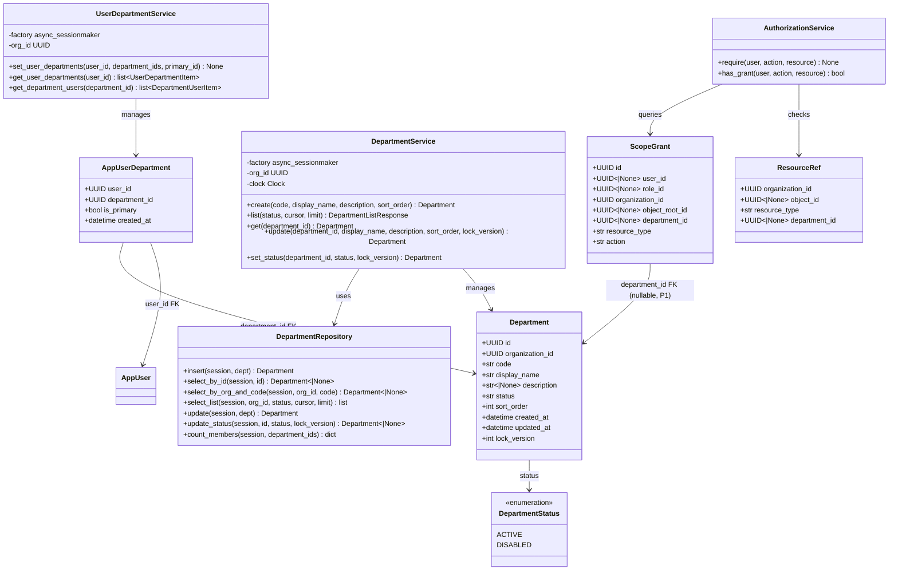
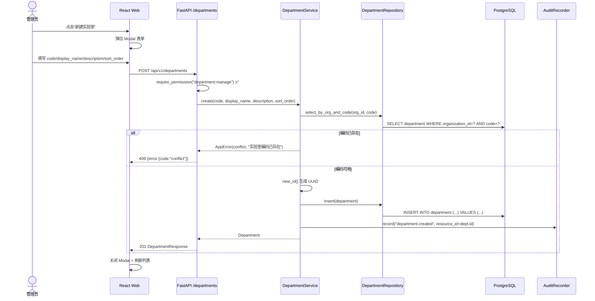
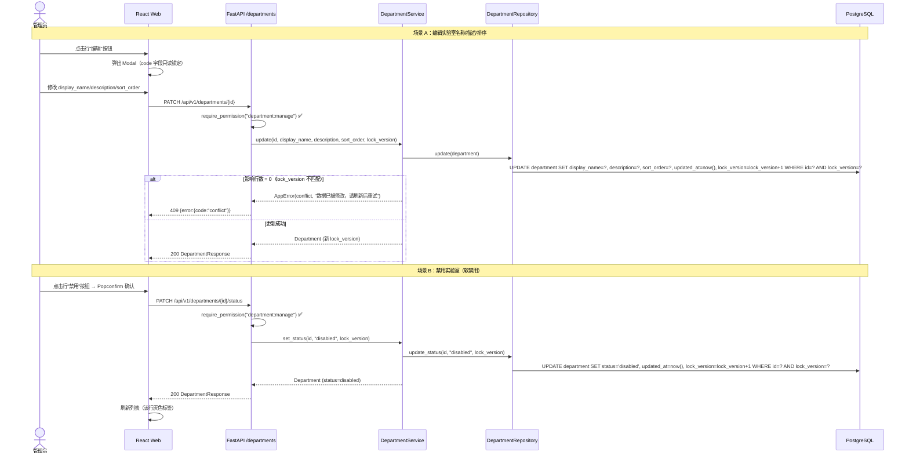
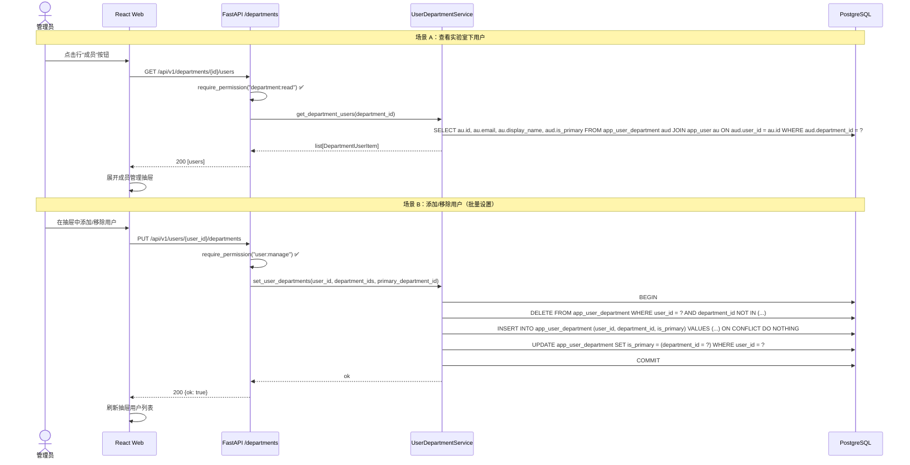
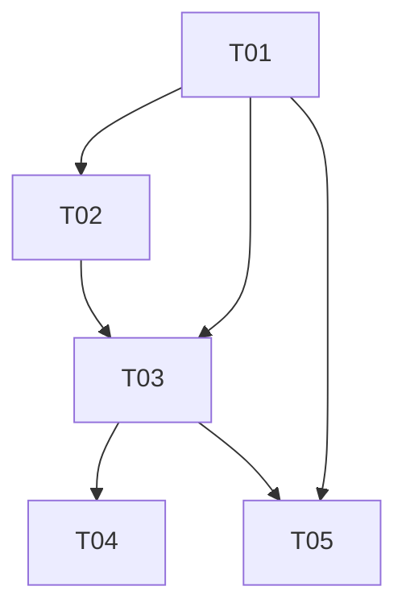

# IRIP 增量架构设计 — 机构/实验室管理

> **作者：** 高见远（Gao, 架构师）
> **范围：** 增量设计 — 机构/实验室管理模块（PRD D1–D12，P0 + P1）
> **上游输入：** `docs/prd-department.md`（增量 PRD）、`docs/arch-v0.md`（V0 架构）
> **项目根：** `irip/`（下文所有相对路径均以此为准）
> **基线：** V0 Phase Skeleton（迁移 0001–0005 已完成）

---

## 1. 实现方案与框架选型

### 1.1 增量策略

本增量在 V0 平台骨架上**纵向叠加**机构/实验室管理模块，不修改 V0 已有的认证、授权、作业、工件等核心流程。策略要点：

| 维度 | 决策 | 说明 |
|---|---|---|
| **新增模块** | `packages/departments/` | 独立领域包，与 `packages/auth/`、`packages/jobs/` 平级 |
| **修改现有模块** | `packages/auth/permissions.py`、`packages/auth/scope_grants.py` | 仅追加权限常量 + 扩展 ResourceRef/AuthorizationService（P1），不破坏现有 API |
| **迁移策略** | 单次迁移 `0006` | 覆盖 P0（department 表）+ P1（app_user_department 表、scope_grant.department_id）；P1 部分在迁移内分段注释，可独立回滚 |
| **权限回写** | 迁移内 re-seed `role` 表 | 与 0003 相同的 `ON CONFLICT DO UPDATE` 模式，将新增权限写入已有角色行 |
| **前端策略** | 原地升级 `GovernancePage` | 从占位卡片改为 Ant Design `Tabs` 布局，首期"机构管理"Tab，预留"审计日志""授权管理"Tab |
| **FK 约束** | department→organization **不加 FK** | V0 约定：`organization` 表由 bootstrap 创建，不在 Alembic 中，故 `organization_id` 列无 FK（与 `app_user.organization_id`、`job.organization_id` 一致） |

### 1.2 核心技术挑战与应对

| 挑战 | 应对策略 |
|---|---|
| **实验室编码锁定** | 创建后 `code` 不可修改——`UpdateDepartmentRequest` 不含 `code` 字段，服务层 UPDATE 语句不写 `code` 列，从 API 层到 DB 层双重保障 |
| **软禁用 vs 硬删除** | `status = 'disabled'` 即软禁用；无 DELETE API 端点；禁用后历史数据保留 FK 关联不变；新数据录入时 `WHERE status = 'active'` 过滤 |
| **乐观锁并发控制** | 编辑/状态切换请求必须携带 `lock_version`；UPDATE 语句 `WHERE id = ? AND lock_version = ?`，影响行数 0 → 409 `conflict` |
| **用户-实验室多对多** | `app_user_department` 关联表，复合主键 `(user_id, department_id)`；`is_primary` 唯一性通过应用层保证（同一 user 仅一条 `is_primary = true`） |
| **scope_grant 部门级授权** | `scope_grant.department_id` 可选列；`NULL` = 全组织（保持现有行为）；非 `NULL` = 仅该实验室范围；`AuthorizationService.has_grant()` 扩展匹配条件 |
| **member_count 聚合** | 列表 API 通过 `LEFT JOIN app_user_department GROUP BY department.id COUNT(*)` 一次查询返回，避免 N+1 |

### 1.3 复用现有模块

| 现有模块 | 复用方式 |
|---|---|
| `packages/common/database.py` `Base` | Department / AppUserDepartment ORM 模型继承 `Base`，Alembic 读取 `metadata` |
| `packages/common/db_types.py` `GUID` / `UTCDateTime` | 所有 UUID 列用 `GUID`，所有时间戳用 `UTCDateTime`（强制 UTC，拒绝 naive datetime） |
| `packages/common/ids.py` `new_id()` | ORM `default=new_id` 生成 UUIDv7 |
| `packages/common/errors.py` `AppError` | 服务层错误统一抛 `AppError`，由 `main.py` 全局处理器映射 HTTP 状态码 |
| `packages/common/pagination.py` `PageCursor` | 列表分页复用 base64url 游标 |
| `packages/common/clock.py` `Clock` | `DepartmentService` 注入 `Clock`，测试用 `FixedClock` |
| `packages/auth/permissions.py` | 追加 `DEPARTMENT_MANAGE` / `DEPARTMENT_READ` 常量 + 更新 `BUILTIN_ROLES` |
| `packages/auth/scope_grants.py` | 扩展 `ResourceRef` 增加 `department_id`；`AuthorizationService.has_grant()` 增加部门匹配条件 |
| `apps/api/dependencies/authorization.py` `require_permission()` | 路由层用 `require_permission("department:manage")` / `require_permission("department:read")` 做角色级守卫 |
| `apps/api/main.py` lifespan DI 模式 | 新增 `DepartmentService` 依赖覆盖，参考现有 `_get_job_service` 按请求构造模式 |
| `apps/web/src/api/client.ts` `http` Axios 实例 | 新增 department API 函数复用现有 `http` 实例（含 401 自动刷新拦截器） |
| `deployments/compose/bootstrap.py` 幂等模式 | 新增 `DepartmentRepository.seed_departments()`，复用 `ON CONFLICT DO NOTHING` 模式 |

---

## 2. 文件列表

按模块分组；标 `[NEW]` / `[MODIFY]`，并标注所属任务编号。

### 2.1 数据库迁移

```
[T01] migrations/versions/0006_department.py          [NEW]  — department + app_user_department(P1) + scope_grant.department_id(P1) + re-seed roles
```

### 2.2 `packages/auth/`（权限与授权扩展）

```
[T01] packages/auth/permissions.py                    [MODIFY] — 追加 DEPARTMENT_MANAGE / DEPARTMENT_READ 常量 + 更新 BUILTIN_ROLES
[T02] packages/auth/scope_grants.py                   [MODIFY] — ResourceRef 追加 department_id(P1) + AuthorizationService.has_grant() 扩展部门匹配(P1)
```

### 2.3 `packages/departments/`（机构/实验室领域包）

```
[T01] packages/departments/__init__.py                [NEW]  — 包初始化
[T01] packages/departments/entities.py                [NEW]  — Department + AppUserDepartment ORM 模型 + DepartmentStatus 枚举
[T02] packages/departments/repository.py              [NEW]  — DepartmentRepository（CRUD DAO）
[T02] packages/departments/service.py                 [NEW]  — DepartmentService（create/list/get/update/set_status）
[T02] packages/departments/user_departments.py        [NEW]  — UserDepartmentService(P1)（set_user_departments/get_user_departments/get_department_users）
```

### 2.4 `apps/api/`（FastAPI 路由与依赖）

```
[T03] apps/api/routers/departments.py                 [NEW]  — /api/v1/departments CRUD + status 端点
[T03] apps/api/routers/user_departments.py            [NEW]  — /api/v1/users/{id}/departments + /api/v1/departments/{id}/users(P1)
[T03] apps/api/dependencies/departments.py            [NEW]  — get_department_service / get_user_department_service 依赖
[T03] apps/api/main.py                                [MODIFY] — 注册新路由 + lifespan 内追加 DI 覆盖
```

### 2.5 `apps/web/`（React 前端）

```
[T04] apps/web/src/api/client.ts                     [MODIFY] — 追加 Department 类型定义 + API 函数
[T04] apps/web/src/pages/GovernancePage.tsx          [MODIFY] — 升级为 Tabs 布局，嵌入 DepartmentManagement
[T04] apps/web/src/pages/governance/DepartmentManagement.tsx [NEW]  — 实验室列表 + 创建/编辑弹窗 + 启用/禁用
[T04] apps/web/src/pages/governance/MemberDrawer.tsx  [NEW]  — 成员管理抽屉(P1)
```

### 2.6 `deployments/` + `tests/`（部署与测试）

```
[T05] deployments/compose/bootstrap.py                [MODIFY] — 新增 seed_departments 步骤（读 IRIP_SEED_DEPARTMENTS 环境变量）
[T05] tests/integration/departments/test_department_crud.py      [NEW] — P0 CRUD + 状态切换 + 乐观锁集成测试
[T05] tests/integration/departments/test_user_department.py     [NEW] — P1 用户-实验室关联集成测试
[T05] tests/unit/auth/test_department_permissions.py           [NEW] — 权限矩阵单元测试（BUILTIN_ROLES 含 department 权限）
```

**文件总数：** 15 个（8 NEW + 4 MODIFY + 3 NEW tests）

---

## 3. 数据结构与接口

### 3.1 `department` 表 DDL（P0）

> 遵循 V0 迁移约定：`sa.UUID` + `server_default=sa.text("gen_random_uuid()")`，`sa.TIMESTAMP(timezone=True)` + `server_default=sa.text("now()")`，命名 `ix_<table>_<col>` / `uq_<table>_<col>`。

```python
# migrations/versions/0006_department.py — P0 部分

op.create_table(
    "department",
    sa.Column("id", sa.UUID, server_default=sa.text("gen_random_uuid()"), primary_key=True),
    sa.Column("organization_id", sa.UUID, nullable=False),  # 无 FK（V0 约定，organization 表由 bootstrap 创建）
    sa.Column("code", sa.TEXT, nullable=False),             # 创建后锁定不可改
    sa.Column("display_name", sa.TEXT, nullable=False),
    sa.Column("description", sa.TEXT, nullable=True),
    sa.Column("status", sa.TEXT, server_default=sa.text("'active'"), nullable=False),  # active / disabled
    sa.Column("sort_order", sa.INTEGER, server_default=sa.text("0"), nullable=False),
    sa.Column("created_at", sa.TIMESTAMP(timezone=True), server_default=sa.text("now()"), nullable=False),
    sa.Column("updated_at", sa.TIMESTAMP(timezone=True), server_default=sa.text("now()"), nullable=False),
    sa.Column("lock_version", sa.INTEGER, server_default=sa.text("0"), nullable=False),
    sa.UniqueConstraint("organization_id", "code", name="uq_department_org_code"),
)
op.create_index("ix_department_organization_id", "department", ["organization_id"])
op.create_index("ix_department_status", "department", ["status"])
```

### 3.2 `app_user_department` 关联表 DDL（P1）

```python
# migrations/versions/0006_department.py — P1 部分

op.create_table(
    "app_user_department",
    sa.Column("user_id", sa.UUID, nullable=False),
    sa.Column("department_id", sa.UUID, nullable=False),
    sa.Column("is_primary", sa.Boolean, server_default=sa.text("false"), nullable=False),
    sa.Column("created_at", sa.TIMESTAMP(timezone=True), server_default=sa.text("now()"), nullable=False),
    sa.ForeignKeyConstraint(
        ["user_id"], ["app_user.id"], name="fk_app_user_department_user_id",
        ondelete="CASCADE",
    ),
    sa.ForeignKeyConstraint(
        ["department_id"], ["department.id"], name="fk_app_user_department_department_id",
        ondelete="CASCADE",
    ),
    sa.UniqueConstraint("user_id", "department_id", name="uq_user_department"),
)
op.create_index("ix_user_department_department_id", "app_user_department", ["department_id"])
op.create_index("ix_user_department_user_id", "app_user_department", ["user_id"])
```

### 3.3 `scope_grant` 扩展 DDL（P1）

```python
# migrations/versions/0006_department.py — P1 部分

# 新增可选列 department_id（NULL = 全组织范围，保持现有行为；非 NULL = 特定实验室范围）
op.add_column("scope_grant", sa.Column("department_id", sa.UUID, nullable=True))
op.create_foreign_key(
    "fk_scope_grant_department_id",
    "scope_grant", "department",
    ["department_id"], ["id"],
    ondelete="SET NULL",
)
op.create_index("ix_scope_grant_department_id", "scope_grant", ["department_id"])
```

### 3.4 irip_app 权限 + 角色种子回写

```python
# migrations/versions/0006_department.py — 权限与种子

# 新表 irip_app GRANT
op.execute(
    "GRANT SELECT, INSERT, UPDATE, DELETE "
    "ON department, app_user_department TO irip_app"
)

# scope_grant 新列已有 irip_app 权限（0003 已 GRANT），无需追加

# Re-seed 7 个内置角色（ON CONFLICT DO UPDATE，与 0003 模式一致）
# BUILTIN_ROLES 此时已含 department 权限（代码先于迁移修改）
from packages.auth.permissions import BUILTIN_ROLES
import json

for code, info in BUILTIN_ROLES.items():
    display_name = info["display_name"]
    permissions = info["permissions"]
    op.execute(
        sa.text(
            "INSERT INTO role (code, display_name, permissions) "
            "VALUES (:code, :display_name, CAST(:permissions AS jsonb)) "
            "ON CONFLICT (code) DO UPDATE SET "
            "display_name = EXCLUDED.display_name, "
            "permissions = EXCLUDED.permissions"
        ).bindparams(
            code=code,
            display_name=display_name,
            permissions=json.dumps([str(p) for p in permissions]),
        )
    )
```

### 3.5 ORM 模型定义

> 风格参考 `packages/auth/entities.py`：继承 `Base`，使用 `GUID` / `UTCDateTime` 自定义类型，`Mapped[]` + `mapped_column()`，`default=new_id`。

```python
# packages/departments/entities.py

from datetime import datetime
from enum import StrEnum
from uuid import UUID

import sqlalchemy as sa
from sqlalchemy.orm import Mapped, mapped_column

from packages.common.database import Base
from packages.common.db_types import GUID, UTCDateTime
from packages.common.ids import new_id


class DepartmentStatus(StrEnum):
    """实验室状态枚举。"""

    ACTIVE = "active"
    DISABLED = "disabled"


class Department(Base):
    """实验室/机构实体（对应 department 表）。

    organization_id 不设 FK（V0 约定：organization 表由 bootstrap 创建，不在 Alembic 中）。
    code 创建后锁定不可修改（服务层 UPDATE 语句不写 code 列）。

    Attributes:
        id: 实验室 UUID。
        organization_id: 所属顶层组织 ID。
        code: 实验室编码（组织内唯一，创建后锁定）。
        display_name: 中文显示名。
        description: 描述（可选）。
        status: 状态（active / disabled）。
        sort_order: 排序权重（默认 0）。
        created_at: 创建时间。
        updated_at: 更新时间。
        lock_version: 乐观锁版本号。
    """

    __tablename__ = "department"

    id: Mapped[UUID] = mapped_column(GUID, primary_key=True, default=new_id)
    organization_id: Mapped[UUID] = mapped_column(GUID, nullable=False)
    code: Mapped[str] = mapped_column(sa.Text, nullable=False)
    display_name: Mapped[str] = mapped_column(sa.Text, nullable=False)
    description: Mapped[str | None] = mapped_column(sa.Text, nullable=True)
    status: Mapped[str] = mapped_column(
        sa.Text, nullable=False, server_default=sa.text("'active'")
    )
    sort_order: Mapped[int] = mapped_column(
        sa.Integer, nullable=False, server_default=sa.text("0")
    )
    created_at: Mapped[datetime] = mapped_column(
        UTCDateTime, server_default=sa.func.now(), nullable=False
    )
    updated_at: Mapped[datetime] = mapped_column(
        UTCDateTime, server_default=sa.func.now(), nullable=False
    )
    lock_version: Mapped[int] = mapped_column(
        sa.Integer, nullable=False, server_default=sa.text("0")
    )

    def __repr__(self) -> str:
        return (
            f"Department(id={self.id!r}, code={self.code!r}, "
            f"display_name={self.display_name!r}, status={self.status!r})"
        )


class AppUserDepartment(Base):
    """用户-实验室关联实体（对应 app_user_department 表，P1）。

    复合主键 (user_id, department_id)。is_primary 由应用层保证唯一性
    （同一 user 最多一条 is_primary = true）。

    Attributes:
        user_id: 用户 ID（PK + FK→app_user.id）。
        department_id: 实验室 ID（PK + FK→department.id）。
        is_primary: 是否主要实验室（默认 false）。
        created_at: 关联创建时间。
    """

    __tablename__ = "app_user_department"

    user_id: Mapped[UUID] = mapped_column(
        GUID, sa.ForeignKey("app_user.id", ondelete="CASCADE"), primary_key=True
    )
    department_id: Mapped[UUID] = mapped_column(
        GUID, sa.ForeignKey("department.id", ondelete="CASCADE"), primary_key=True
    )
    is_primary: Mapped[bool] = mapped_column(
        sa.Boolean, nullable=False, server_default=sa.text("false")
    )
    created_at: Mapped[datetime] = mapped_column(
        UTCDateTime, server_default=sa.func.now(), nullable=False
    )

    def __repr__(self) -> str:
        return (
            f"AppUserDepartment(user_id={self.user_id!r}, "
            f"department_id={self.department_id!r}, is_primary={self.is_primary!r})"
        )
```

### 3.6 权限常量增量

> 在 `packages/auth/permissions.py` 的 `Permission` 类中追加两个常量，并更新 `all()` 方法和 `BUILTIN_ROLES`。

```python
# packages/auth/permissions.py — 增量修改

class Permission:
    # ... 现有权限保持不变 ...

    # 机构/实验室管理（新增）
    DEPARTMENT_MANAGE: str = "department:manage"
    DEPARTMENT_READ: str = "department:read"

    @classmethod
    def all(cls) -> list[str]:
        return [
            # ... 现有 20 个权限保持不变 ...
            cls.DEPARTMENT_MANAGE,    # 新增
            cls.DEPARTMENT_READ,       # 新增
        ]
```

**BUILTIN_ROLES 更新（department:read 授予全部角色）：**

```python
BUILTIN_ROLES = {
    RoleCode.PLATFORM_ADMINISTRATOR.value: {
        "display_name": "平台管理员",
        "permissions": list(_ALL_PERMISSIONS),  # 自动包含 DEPARTMENT_MANAGE + DEPARTMENT_READ
    },
    RoleCode.STANDARD_OWNER.value: {
        "display_name": "标准负责人",
        "permissions": [
            Permission.STANDARD_READ,
            Permission.STANDARD_WRITE,
            Permission.STANDARD_PUBLISH,
            Permission.DEPARTMENT_READ,   # 新增
        ],
    },
    RoleCode.DATA_STEWARD.value: {
        "display_name": "数据管家",
        "permissions": [
            Permission.FACT_READ,
            Permission.FACT_WRITE,
            Permission.ARTIFACT_READ,
            Permission.ARTIFACT_UPLOAD,
            Permission.ARTIFACT_DOWNLOAD,
            Permission.DEPARTMENT_READ,   # 新增
        ],
    },
    RoleCode.RESEARCHER.value: {
        "display_name": "研究员",
        "permissions": [
            Permission.FACT_READ,
            Permission.ARTIFACT_READ,
            Permission.ARTIFACT_DOWNLOAD,
            Permission.JOB_READ,
            Permission.JOB_SUBMIT,
            Permission.DEPARTMENT_READ,   # 新增
        ],
    },
    RoleCode.MODEL_ENGINEER.value: {
        "display_name": "模型工程师",
        "permissions": [
            Permission.MODEL_READ,
            Permission.MODEL_WRITE,
            Permission.MODEL_PUBLISH,
            Permission.MODEL_PREDICT,
            Permission.DEPARTMENT_READ,   # 新增
        ],
    },
    RoleCode.REVIEWER.value: {
        "display_name": "审核员",
        "permissions": [
            Permission.PARAMETER_READ,
            Permission.PARAMETER_REVIEW,
            Permission.PARAMETER_APPROVE,
            Permission.DEPARTMENT_READ,   # 新增
        ],
    },
    RoleCode.READ_ONLY_USER.value: {
        "display_name": "只读用户",
        "permissions": [
            Permission.FACT_READ,
            Permission.STANDARD_READ,
            Permission.PARAMETER_READ,
            Permission.DEPARTMENT_READ,   # 新增
        ],
    },
}
```

### 3.7 scope_grants 扩展（P1）

> 在 `packages/auth/scope_grants.py` 中扩展 `ResourceRef` 和 `AuthorizationService.has_grant()`。

```python
# packages/auth/scope_grants.py — 增量修改（P1）

@dataclass(frozen=True)
class ResourceRef:
    """资源引用（授权检查的目标）— 扩展 department_id。"""

    organization_id: UUID
    object_id: UUID | None
    resource_type: str
    department_id: UUID | None = None  # 新增（P1）：None = 不按部门过滤；非 None = 需匹配部门


class ScopeGrant(Base):
    """对象级授权实体 — 新增 department_id 列（P1）。"""

    __tablename__ = "scope_grant"

    # ... 现有字段保持不变 ...

    department_id: Mapped[UUID | None] = mapped_column(GUID, nullable=True)  # 新增（P1）


class AuthorizationService:
    async def has_grant(
        self, user: _AuthorizedUser, action: str, resource: ResourceRef
    ) -> bool:
        # ... 现有 common_conditions 构建 ...

        # 新增（P1）：department_id 匹配条件
        if resource.department_id is not None:
            department_condition = sa.or_(
                ScopeGrant.department_id.is_(None),   # NULL = 全组织范围（兼容）
                ScopeGrant.department_id == resource.department_id,  # 精确匹配实验室
            )
            common_conditions.append(department_condition)

        # ... 后续 user grant / role grant 查询逻辑不变 ...
```

### 3.8 API 请求/响应 Pydantic 模型

```python
# apps/api/routers/departments.py

from datetime import datetime
from typing import Literal
from pydantic import BaseModel, Field


# ---- 请求模型 ----

class CreateDepartmentRequest(BaseModel):
    """创建实验室请求。"""
    code: str = Field(..., min_length=1, max_length=64,
                     pattern=r"^[a-z][a-z0-9_]*$",
                     description="实验室编码，仅小写字母/数字/下划线，创建后锁定")
    display_name: str = Field(..., min_length=1, max_length=200)
    description: str | None = Field(None, max_length=2000)
    sort_order: int = Field(0, ge=0)


class UpdateDepartmentRequest(BaseModel):
    """编辑实验室请求（code 不可修改，不在请求体中）。"""
    display_name: str = Field(..., min_length=1, max_length=200)
    description: str | None = Field(None, max_length=2000)
    sort_order: int = Field(0, ge=0)
    lock_version: int = Field(..., ge=0)


class UpdateDepartmentStatusRequest(BaseModel):
    """启用/禁用实验室请求。"""
    status: Literal["active", "disabled"]
    lock_version: int = Field(..., ge=0)


# ---- 响应模型 ----

class DepartmentResponse(BaseModel):
    """实验室详情响应。"""
    id: str
    organization_id: str
    code: str
    display_name: str
    description: str | None
    status: str
    sort_order: int
    created_at: datetime
    updated_at: datetime
    lock_version: int


class DepartmentListItem(BaseModel):
    """实验室列表项（含成员数）。"""
    id: str
    code: str
    display_name: str
    status: str
    sort_order: int
    member_count: int


class DepartmentListResponse(BaseModel):
    """实验室分页列表响应。"""
    items: list[DepartmentListItem]
    next_cursor: str | None
    has_more: bool
```

```python
# apps/api/routers/user_departments.py — P1

class SetUserDepartmentsRequest(BaseModel):
    """批量设置用户所属实验室。"""
    department_ids: list[str]
    primary_department_id: str | None = None


class UserDepartmentItem(BaseModel):
    """用户-实验室关联项。"""
    user_id: str
    department_id: str
    department_code: str
    department_display_name: str
    is_primary: bool


class DepartmentUserItem(BaseModel):
    """实验室下用户项。"""
    user_id: str
    email: str
    display_name: str
    is_primary: bool
```

### 3.9 类图

见 `docs/class-diagram-department.mermaid`（同内容嵌入下方）。



---

## 4. 程序调用流程

> 完整时序图源文件：`docs/sequence-diagram-department.mermaid`

### 4.1 创建实验室（P0 — D2）



### 4.2 编辑/禁用实验室（P0 — D2/D4）



### 4.3 用户-实验室关联管理（P1 — D9/D11）



---

## 5. 任务列表（5 个，按实现顺序）

> **依赖原则：** T01 是数据层基础；T02 依赖 T01（需 ORM 模型）；T03 依赖 T01+T02（需服务层）；T04 依赖 T03（需 API 契约）；T05 依赖 T01+T03（需迁移 + API 做测试）。

### T01: 数据层基础 — Alembic 迁移 + ORM 模型 + 权限常量

| 项 | 内容 |
|---|---|
| **任务编号** | T01 |
| **优先级** | P0 |
| **涉及文件** | `migrations/versions/0006_department.py` [NEW]<br>`packages/auth/permissions.py` [MODIFY]<br>`packages/departments/__init__.py` [NEW]<br>`packages/departments/entities.py` [NEW] |
| **依赖** | — |
| **实现内容** | 1. 创建 Alembic 迁移 0006：`department` 表（P0）+ `app_user_department` 表（P1）+ `scope_grant.department_id` 列（P1）+ irip_app GRANT + re-seed 角色权限<br>2. `Permission` 类追加 `DEPARTMENT_MANAGE` / `DEPARTMENT_READ` 常量，更新 `all()` 方法<br>3. `BUILTIN_ROLES` 更新：`department:read` 授予全部 7 个角色，`department:manage` 仅 `platform_administrator`（通过 `_ALL_PERMISSIONS` 自动包含）<br>4. 创建 `packages/departments/` 包：`Department` ORM 模型（含 `DepartmentStatus` 枚举）+ `AppUserDepartment` ORM 模型（P1） |
| **验证命令** | `alembic upgrade head && pytest tests/unit/auth/test_department_permissions.py -v` |

### T02: 服务层 + 授权扩展 — 机构服务 + 用户关联服务 + scope_grant 扩展

| 项 | 内容 |
|---|---|
| **任务编号** | T02 |
| **优先级** | P0 + P1 |
| **涉及文件** | `packages/departments/repository.py` [NEW]<br>`packages/departments/service.py` [NEW]<br>`packages/departments/user_departments.py` [NEW] (P1)<br>`packages/auth/scope_grants.py` [MODIFY] (P1) |
| **依赖** | T01 |
| **实现内容** | 1. `DepartmentRepository`：`insert` / `select_by_id` / `select_by_org_and_code` / `select_list`（含 member_count 聚合）/ `update`（乐观锁）/ `update_status`（乐观锁）<br>2. `DepartmentService`：`create`（编码唯一性校验 + 审计）/ `list`（分页游标）/ `get`（404 检查）/ `update`（code 不可改 + 乐观锁）/ `set_status`（软禁用 + 乐观锁）<br>3. `UserDepartmentService`（P1）：`set_user_departments`（批量增删 + is_primary 唯一性）/ `get_user_departments` / `get_department_users`<br>4. `scope_grants.py` 扩展（P1）：`ResourceRef` 追加 `department_id` 字段；`ScopeGrant` ORM 追加 `department_id` 列；`AuthorizationService.has_grant()` 增加 `department_id` 匹配条件（`NULL = 全组织`，非 `NULL = 精确匹配`） |
| **验证命令** | `pytest tests/unit/departments -v && mypy packages/departments packages/auth/scope_grants.py` |

### T03: API 层 — 路由 + 依赖注入 + 应用注册

| 项 | 内容 |
|---|---|
| **任务编号** | T03 |
| **优先级** | P0 + P1 |
| **涉及文件** | `apps/api/routers/departments.py` [NEW]<br>`apps/api/routers/user_departments.py` [NEW] (P1)<br>`apps/api/dependencies/departments.py` [NEW]<br>`apps/api/main.py` [MODIFY] |
| **依赖** | T01, T02 |
| **实现内容** | 1. `departments.py` 路由（P0）：<br>&nbsp;&nbsp;&nbsp;• `POST /api/v1/departments` — `require_permission("department:manage")`，创建实验室<br>&nbsp;&nbsp;&nbsp;• `GET /api/v1/departments` — `require_permission("department:read")`，分页列表（status 筛选 + member_count）<br>&nbsp;&nbsp;&nbsp;• `GET /api/v1/departments/{id}` — `require_permission("department:read")`，详情<br>&nbsp;&nbsp;&nbsp;• `PATCH /api/v1/departments/{id}` — `require_permission("department:manage")`，编辑（不含 code）<br>&nbsp;&nbsp;&nbsp;• `PATCH /api/v1/departments/{id}/status` — `require_permission("department:manage")`，启用/禁用<br>2. `user_departments.py` 路由（P1）：<br>&nbsp;&nbsp;&nbsp;• `PUT /api/v1/users/{id}/departments` — `require_permission("user:manage")`，批量设置<br>&nbsp;&nbsp;&nbsp;• `GET /api/v1/users/{id}/departments` — `require_permission("user:manage")` 或本人<br>&nbsp;&nbsp;&nbsp;• `GET /api/v1/departments/{id}/users` — `require_permission("department:read")`，实验室下用户<br>3. `dependencies/departments.py`：`get_department_service` / `get_user_department_service` 依赖占位（按请求构造，参考现有 `_get_job_service` 模式）<br>4. `main.py` 修改：`lifespan` 内追加 `DepartmentService` / `UserDepartmentService` DI 覆盖；`create_app` 内 `include_router` 注册新路由 |
| **验证命令** | `pytest tests/integration/departments -v && curl -X POST http://localhost:8000/api/v1/departments -H "Authorization: Bearer ..." -d '{"code":"test_lab","display_name":"测试实验室"}'` |

### T04: 前端 — 治理页面升级 + 机构管理 + 成员管理

| 项 | 内容 |
|---|---|
| **任务编号** | T04 |
| **优先级** | P0 + P1 |
| **涉及文件** | `apps/web/src/api/client.ts` [MODIFY]<br>`apps/web/src/pages/GovernancePage.tsx` [MODIFY]<br>`apps/web/src/pages/governance/DepartmentManagement.tsx` [NEW]<br>`apps/web/src/pages/governance/MemberDrawer.tsx` [NEW] (P1) |
| **依赖** | T03 |
| **实现内容** | 1. `client.ts` 追加：`Department` / `DepartmentListItem` / `DepartmentListResponse` TypeScript 类型；`apiListDepartments` / `apiGetDepartment` / `apiCreateDepartment` / `apiUpdateDepartment` / `apiUpdateDepartmentStatus` API 函数；P1 追加 `apiGetDepartmentUsers` / `apiSetUserDepartments`<br>2. `GovernancePage.tsx` 升级为 Ant Design `Tabs` 布局：首期 "机构管理" Tab 渲染 `<DepartmentManagement/>`，预留 "审计日志" "授权管理" Tab（占位）<br>3. `DepartmentManagement.tsx`（P0）：Ant Design `Table` 列表（列：编码 / 名称 / 状态 / 成员数 / 操作），按 `sort_order + created_at` 排序；顶部 "新建实验室" 按钮 + 状态筛选 `Select`；`Modal + Form` 创建/编辑弹窗（code 字段编辑时 `disabled`）；`Popconfirm` 启用/禁用确认；禁用行灰色标签<br>4. `MemberDrawer.tsx`（P1）：Ant Design `Drawer` 从右滑出（宽 480px），展示实验室下用户列表，支持添加/移除用户（调用 `PUT /api/v1/users/{id}/departments`） |
| **验证命令** | `pnpm --dir apps/web test --run && pnpm --dir apps/web build` |

### T05: Bootstrap 扩展 + 测试 + 验收

| 项 | 内容 |
|---|---|
| **任务编号** | T05 |
| **优先级** | P0 + P1 |
| **涉及文件** | `deployments/compose/bootstrap.py` [MODIFY]<br>`tests/integration/departments/test_department_crud.py` [NEW]<br>`tests/integration/departments/test_user_department.py` [NEW] (P1)<br>`tests/unit/auth/test_department_permissions.py` [NEW] |
| **依赖** | T01, T03 |
| **实现内容** | 1. `bootstrap.py` 扩展：在 `bootstrap_platform()` 中 `ensure_admin` 之后、`ensure_buckets` 之前新增 `seed_departments` 步骤；读取 `IRIP_SEED_DEPARTMENTS` 环境变量（JSON 数组），幂等创建种子实验室（`ON CONFLICT (organization_id, code) DO NOTHING`）；未设置环境变量时跳过<br>2. `test_department_crud.py`：P0 集成测试——创建/列表/详情/编辑/禁用全链路；编码唯一性冲突；乐观锁冲突；禁用后不出现在 active 列表<br>3. `test_user_department.py`（P1）：P1 集成测试——设置用户实验室关联；查询实验室下用户；is_primary 唯一性；移除关联<br>4. `test_department_permissions.py`：单元测试——验证 `BUILTIN_ROLES` 中 7 个角色均含 `department:read`；仅 `platform_administrator` 含 `department:manage`；`Permission.all()` 包含两个新权限 |
| **验证命令** | `docker compose run --rm bootstrap && pytest tests/integration/departments tests/unit/auth/test_department_permissions.py -v` |

### 任务依赖图



**关键路径：** `T01 → T02 → T03 → T04`（前端 4 步）。T05 可与 T04 并行（仅依赖 T01+T03）。

---

## 6. 依赖包列表

本增量**不需要新增第三方包**。所有依赖已在 V0 `pyproject.toml` 和 `apps/web/package.json` 中声明：

| 依赖 | 版本约束 | 用途 | 来源 |
|---|---|---|---|
| SQLAlchemy 2.0 | `>=2.0,<3` | ORM 查询（DepartmentRepository） | V0 已有 |
| Alembic | `>=1.13,<2` | 迁移 0006 | V0 已有 |
| Pydantic 2.9+ | `>=2.9,<3` | API 请求/响应模型 | V0 已有 |
| FastAPI 0.115+ | `>=0.115,<1` | API 路由 | V0 已有 |
| Ant Design 5 | `^5.22.0` | Tabs / Table / Modal / Drawer / Form / Popconfirm | V0 已有 |
| TanStack Query 5 | `^5.62.0` | 列表数据获取 + 缓存 | V0 已有 |

---

## 7. 共享知识（跨文件约定）

### 7.1 department_id 在业务表中的 FK 约定（D6）

所有后续业务表（`fact`、`standard`、`model` 等）在创建时**必须**包含以下列：

```sql
department_id UUID NOT NULL,
-- FK 约束在业务表迁移中定义：fk_<table>_department_id → department.id
```

- `department_id` 为 **NOT NULL**——业务数据必须归属到某个实验室。
- FK 引用 `department.id`，`ON DELETE RESTRICT`（实验室不可硬删除，仅可软禁用）。
- 业务列表查询 API 支持 `?department_id={uuid}` 筛选参数。
- 此约定在 V1 Task 15（Facts 模块）及后续业务模块迁移中强制执行。

### 7.2 权限检查模式

| 操作类型 | 检查方式 | 示例 |
|---|---|---|
| **角色级守卫**（非资源特定） | `require_permission("department:manage")` FastAPI Depends | 创建/编辑/禁用实验室 |
| **角色级读** | `require_permission("department:read")` FastAPI Depends | 列表/详情查询 |
| **对象级授权**（P1，按实验室隔离） | `AuthorizationService.require(user, action, ResourceRef(department_id=...))` | 业务数据按实验室筛选 |
| **scope_grant 部门匹配**（P1） | `scope_grant.department_id IS NULL`（全组织）或 `= resource.department_id`（特定实验室） | AuthorizationService.has_grant() |

### 7.3 前端 API client 模式

- 所有 department API 函数复用 `apps/web/src/api/client.ts` 中的 `http` Axios 实例（含 401 自动刷新拦截器）。
- 响应字段 snake_case（与后端一致），前端在组件内按需转换。
- 列表分页使用 `cursor` + `limit` 参数，与 V0 `/jobs` 端点模式一致。
- 创建/编辑使用 Ant Design `Form`，提交前前端校验 `code` 格式（`/^[a-z][a-z0-9_]*$/`）。
- 禁用操作使用 `Popconfirm` 二次确认，避免误操作。

### 7.4 乐观锁模式

- 所有可变实体（`Department`）的编辑/状态切换请求必须携带 `lock_version`。
- UPDATE 语句：`WHERE id = ? AND lock_version = ?`，同时 `SET lock_version = lock_version + 1, updated_at = now()`。
- 影响行数 0 → 先查询是否存在：存在则 409 `conflict`（数据已被修改），不存在则 404 `not_found`。
- 前端编辑弹窗打开时缓存当前 `lock_version`，提交时回传。

### 7.5 编码锁定约定

- `code` 字段仅在 `POST /api/v1/departments`（创建）时可设。
- `UpdateDepartmentRequest` Pydantic 模型不含 `code` 字段——从请求体层面排除。
- `DepartmentService.update()` 的 UPDATE 语句不写 `code` 列——从 DB 层面排除。
- 前端编辑弹窗 `code` 字段 `disabled`——从 UI 层面排除。
- 三层保障，无需 DB CHECK 约束。

### 7.6 软禁用约定

- 禁用 = `status = 'disabled'`，非 DELETE。
- 无 DELETE API 端点。
- 禁用后：历史数据 FK 关联不变；新数据录入时 `WHERE status = 'active'` 过滤可选列表。
- 前端列表中禁用行以灰色 `Tag` 标签区分。
- 可重新启用（`status = 'active'`），无需迁移数据。

### 7.7 is_primary 唯一性约定（P1）

- 同一 user 最多一条 `app_user_department.is_primary = true`。
- `set_user_departments()` 在事务内执行：
  1. `DELETE FROM app_user_department WHERE user_id = ? AND department_id NOT IN (...)` — 移除不在新列表中的关联
  2. `INSERT ... ON CONFLICT DO NOTHING` — 添加新关联
  3. `UPDATE app_user_department SET is_primary = (department_id = ?) WHERE user_id = ?` — 保证仅指定实验室为 primary
- 无 DB 级唯一索引（允许多条 `is_primary = false`），由应用层保证语义。

---

## 8. 待明确事项

### 8.1 设计过程中发现的问题

| # | 问题 | 当前假设 | 影响范围 | 建议决策人 |
|---|---|---|---|---|
| 1 | **`updated_at` 自动更新机制**：V0 未设 `BEFORE UPDATE` 触发器，`updated_at` 仅在 INSERT 时 `server_default=now()`。编辑实验室时 `updated_at` 需要更新。 | 服务层 UPDATE 语句显式写 `updated_at = now()`（与 V0 `JobService` 一致）。不加 DB 触发器，保持与 V0 统一。 | DepartmentService.update / set_status | 架构师 |
| 2 | **`member_count` 查询性能**：列表 API 需返回每个实验室的成员数。实验室数量预计 < 100，`LEFT JOIN + GROUP BY + COUNT` 可接受。 | 使用单次 `LEFT JOIN app_user_department GROUP BY department.id` 查询，避免 N+1。若未来实验室数量增长，可加物化视图或缓存。 | DepartmentRepository.select_list | 架构师 |
| 3 | **`scope_grant.department_id` 对现有授权查询的影响**：新增列默认 NULL，对现有数据无影响。但 `has_grant()` 增加匹配条件后，如果 `resource.department_id` 非 None 但 `scope_grant.department_id` 全为 NULL，查询仍会匹配（`NULL = 全组织`语义）。 | `has_grant()` 中 `department_id IS NULL` 条件确保全组织授权兼容。仅当 resource 显式传入 `department_id` 时才触发部门过滤。现有调用点不传 `department_id`（默认 None），行为不变。 | AuthorizationService.has_grant | 架构师 |
| 4 | **`GET /api/v1/users/{id}/departments` 权限**：PRD 写"user:manage 或本人"。"本人"如何判断？ | 路由层先 `require_permission("user:manage")`；若不满足，再检查 `current_user.user_id == path_param user_id`。两条件满足其一即放行。 | user_departments.py 路由 | PM 确认 |
| 5 | **`IRIP_SEED_DEPARTMENTS` 环境变量格式**：PRD 给出 JSON 数组示例。bootstrap 脚本如何处理解析失败？ | 解析失败时 `logger.warning` 并跳过种子创建（不阻塞 bootstrap），与 V0 容错策略一致。 | bootstrap.py | 架构师 |
| 6 | **`compose.yaml` 是否需要新增 `IRIP_SEED_DEPARTMENTS` 环境变量**？ | 在 `compose.yaml` 的 `bootstrap` 服务 `environment` 段新增可选变量（注释示例），不影响现有部署。 | compose.yaml（T05 可能涉及） | 架构师 |

### 8.2 PRD 待确认问题的默认假设确认

PRD §9 的 7 个待确认问题，本设计采用以下默认假设（与主理人指令一致）：

| PRD # | 问题 | 默认假设 |
|---|---|---|
| 1 | 实验室编码是否允许修改？ | **创建后锁定不可改**（三层保障：API 模型不含 code + 服务层不写 code + 前端 disabled） |
| 2 | 实验室是否支持层级结构？ | **扁平结构**，无 parent_id 列，不支持子组 |
| 3 | 禁用后已关联数据如何处理？ | **不迁移数据**，软禁用，历史数据保留 FK 不变 |
| 4 | 用户与实验室的关系是否需要审批流？ | **无需审批**，管理员直接分配 |
| 5 | "主要实验室"的用途？ | **仅用于默认选中**（录入数据时默认选中 primary lab），不做权限隔离 |
| 6 | 种子实验室列表是否固化？ | **通过 `IRIP_SEED_DEPARTMENTS` 环境变量可选创建**，不强制 |
| 7 | UI 统一用"机构"还是"实验室"？ | **统一用"实验室"**（Tab 标题为"机构管理"，列表/表单/按钮中的实体称"实验室"） |

---

**文档版本：** v1.0 · 2026-07-21
**下一步：** 主理人评审 → 交予工程师（T01 起步）
