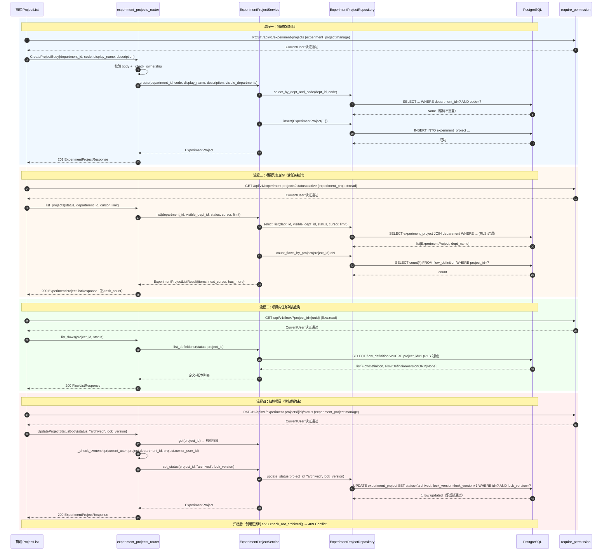

# IRIP 实验项目管理 — 系统架构设计 + 任务分解

> 架构师：高见远  
> 基于文档：`docs/prd-experiment-project.md`  
> 技术上下文：已确认的 A 类多租户模式 + 前端 Tab/路由/API 客户端模式

---

## 1. 实现方案 + 框架选型

### 1.1 总体方案

本次增量将实验项目从 `FlowDefinition.project_name` 文本字段提级为独立实体 `experiment_project`，采用与 Equipment 完全一致的 A 类多租户模式，实现「实验项目 → 实验任务」两级管理。整体改动分后端三层 + 前端两层：

| 层次 | 方案 | 复用模式 |
|------|------|----------|
| 数据层 | 新建 `experiment_project` 表（A 类 4 列 + RLS），`flow_definition` 增 `project_id` 外键 | 同 `equipment` 表结构 + 0062/0064/0065 迁移三步法 |
| 服务层 | 新建 `ExperimentProjectService`（create/list/get/update/set_status）+ 仓库类 | 同 `EquipmentService` / `EquipmentRepository` |
| API 层 | 新建 `experiment_projects` 路由，扩展 `flows` 路由支持 `project_id` 筛选 | 同 `equipment_router` / `flows_router` |
| 前端 API | 新增 `experiment-projects.ts` API 客户端，扩展 `equipment-flows.ts` | 同 `equipment-flows.ts` 纯 async 函数模式 |
| 前端页面 | `FlowDetail` 拆为 `ProjectList`（卡片列表）+ `ProjectDetail`（复用任务列表逻辑） | 同 `LabOpsPage` Tab 切换 + URL 参数 |

### 1.2 核心技术挑战

1. **存量数据迁移**：扫描 `flow_definition.project_name` 非空记录，按 `(department_id, project_name)` 去重创建 `experiment_project` 记录并回填 `project_id`。需保证幂等（重复执行不重复创建）。
2. **A 类表多租户一致性**：新表必须完整具备 A 类 4 列（`department_id` NOT NULL FK + `visible_departments` JSONB NOT NULL DEFAULT '[]' + `visibility_scope` TEXT NOT NULL DEFAULT 'tree' + `owner_user_id` UUID NOT NULL FK）+ RLS 4 分支策略 + `forbid_reprivatize()` 触发器，与现有 A 类表完全一致。
3. **归档约束**：项目 `status='archived'` 时，后端拒绝在该项目下创建新任务（409 Conflict），前端禁用「新建任务」按钮。
4. **前后端字段衔接**：`flow_definition` 新增 `project_id`（nullable），`project_name` 列保留并标 deprecated；新建任务的 `project_name` 文本输入替换为 `project_id` 关联。

### 1.3 框架与库选择

- **后端**：完全复用现有技术栈，无新增依赖
  - FastAPI + SQLAlchemy 2.0（Mapped[] + mapped_column()）+ Alembic + Pydantic v2
  - 复用 `packages.common` 的 `GUID`/`UTCDateTime`/`new_id`/`gen_code`/`AppError`/`session_scope`/`compute_visible_dept_ids`/`check_management_permission`
- **前端**：完全复用现有技术栈，无新增依赖
  - React 18 + Ant Design 5（Card/Modal/Form/Popconfirm）+ TanStack Router + TanStack Query + Axios

### 1.4 架构模式

沿用现有 **分层架构 + 依赖注入** 模式：
- `packages/<domain>/entities.py`（ORM 实体）→ `packages/<domain>/repository.py`（数据仓库）→ `packages/<domain>/service.py`（业务服务）
- `apps/api/routers/<domain>.py`（路由 + 请求/响应模型）
- `apps/api/composition/standards.py`（DI 注册）
- `apps/web/src/api/<domain>.ts`（API 客户端）→ `apps/web/src/features/`（页面组件）

---

## 2. 文件列表及相对路径

### 2.1 后端新建文件

| 文件路径 | 说明 |
|----------|------|
| `packages/experiment_project/__init__.py` | 包初始化 |
| `packages/experiment_project/entities.py` | `ExperimentProject` ORM 实体 + `ExperimentProjectStatus` 枚举 |
| `packages/experiment_project/repository.py` | `ExperimentProjectRepository` 数据仓库 |
| `packages/experiment_project/service.py` | `ExperimentProjectService` 业务服务 |
| `apps/api/routers/experiment_projects.py` | `experiment_projects_router` 路由（CRUD + 状态切换） |
| `migrations/versions/0069_experiment_project.py` | 建表 + 加列 + 数据迁移 + RLS 策略 + 触发器 |

### 2.2 后端修改文件

| 文件路径 | 修改内容 |
|----------|----------|
| `packages/components/flow/flow_runtime.py` [MODIFY] | `FlowDefinition` 增加 `project_id` 列；`create_definition()` 增加 `project_id` 参数；`list_definitions()` 增加 `project_id` 筛选参数；新增 `update_definition_project()` 方法 |
| `apps/api/routers/flows.py` [MODIFY] | `CreateFlowRequest` 增加 `project_id` 字段；`UpdateFlowRequest` 增加 `project_id` 字段；`FlowDefinitionResponse` 增加 `project_id` 字段；`list_flows` 端点增加 `project_id` Query 参数；创建任务时校验项目非归档 |
| `apps/api/composition/standards.py` [MODIFY] | 注册 `get_experiment_project_service` 依赖覆盖 |
| `apps/api/main.py` [MODIFY] | `app.include_router(experiment_projects_router)` |
| `packages/auth/permissions.py` [MODIFY] | 新增 `EXPERIMENT_PROJECT_MANAGE` / `EXPERIMENT_PROJECT_READ` 权限常量 + 角色矩阵更新 |

### 2.3 前端新建文件

| 文件路径 | 说明 |
|----------|------|
| `apps/web/src/api/experiment-projects.ts` | 实验项目 API 客户端（list/get/create/update/set_status） |
| `apps/web/src/features/experiment-project/ProjectList.tsx` | 项目列表卡片视图 |
| `apps/web/src/features/experiment-project/ProjectDetail.tsx` | 项目详情页（复用 FlowDetail 任务列表逻辑） |
| `apps/web/src/features/experiment-project/CreateProjectModal.tsx` | 新建项目弹窗 |

### 2.4 前端修改文件

| 文件路径 | 修改内容 |
|----------|----------|
| `apps/web/src/features/dashboard/LabOpsPage.tsx` [MODIFY] | Tab 名称改为「实验项目」；`flows` Tab 渲染 `ProjectList` 替代 `FlowDetail`；支持 `?project=` URL 参数切换项目详情 |
| `apps/web/src/features/components/FlowDetail.tsx` [MODIFY] | 接收 `projectId` props，列表筛选绑定 `project_id`；新建任务弹窗移除 `project_name` 文本输入，改为项目下拉选择器或自动填充；归档项目禁用新建 |
| `apps/web/src/api/equipment-flows.ts` [MODIFY] | `FlowSummary` 类型增加 `project_id` 字段；`apiListFlows` 增加 `project_id` 参数；`apiCreateFlow` / `apiUpdateFlow` 增加 `project_id` 参数 |
| `apps/web/src/app/router.tsx` [MODIFY] | `labOpsRoute` 的 `validateSearch` 增加 `project` 字段 |

---

## 3. 数据结构和接口（类图）

```mermaid
classDiagram
    direction TB

    class ExperimentProjectStatus {
        <<enumeration>>
        ACTIVE
        ARCHIVED
    }

    class ExperimentProject {
        +UUID id
        +UUID department_id
        +str code
        +str display_name
        +str~|None~ description
        +str status
        +list~str~ visible_departments
        +str visibility_scope
        +UUID owner_user_id
        +datetime created_at
        +datetime updated_at
        +int lock_version
        +__repr__() str
    }

    class FlowDefinition {
        +UUID id
        +UUID department_id
        +list visible_departments
        +str visibility_scope
        +UUID owner_user_id
        +str~|None~ project_name
        +UUID~|None~ project_id
        +str~|None~ operator
        +str~|None~ experimental_object_code
        +str code
        +str display_name
        +str status
        +int lock_version
        +datetime created_at
        +datetime updated_at
    }

    class ExperimentProjectRepository {
        <<static methods>>
        +insert(session, project) ExperimentProject
        +select_by_id(session, project_id) ExperimentProject~|None~
        +select_by_dept_and_code(session, dept_id, code) ExperimentProject~|None~
        +select_list(session, dept_id, visible_dept_id, status, cursor, limit) list~tuple~
        +count_flows_by_project(session, project_id) int
        +update(session, project_id, display_name, description, lock_version) ExperimentProject~|None~
        +update_status(session, project_id, status, lock_version) ExperimentProject~|None~
    }

    class ExperimentProjectService {
        +async_sessionmaker _factory
        +UUID _dept_id
        +UUID~|None~ _actor_id
        +Clock _clock
        +__init__(session_factory, department_id, clock, actor_id)
        +department_id UUID
        +actor_id UUID~|None~
        +session_factory async_sessionmaker
        +create(department_id, code, display_name, description, visible_departments) ExperimentProject
        +list(department_id, visible_dept_id, status, cursor, limit) ExperimentProjectListResult
        +get(project_id) ExperimentProject
        +get_with_stats(project_id) tuple~ExperimentProject, int~
        +update(project_id, display_name, description, lock_version, visible_departments) ExperimentProject
        +set_status(project_id, status, lock_version) ExperimentProject
        +check_not_archived(project_id) None
    }

    class ExperimentProjectListResult {
        +list items
        +str~|None~ next_cursor
        +bool has_more
    }

    class ExperimentProjectRouter {
        +APIRouter prefix: /api/v1/experiment-projects
        +create_project(body, current_user, service) ExperimentProjectResponse
        +list_projects(current_user, service, status, department_id, cursor, limit) ExperimentProjectListResponse
        +get_project(project_id, current_user, service) ExperimentProjectDetailResponse
        +update_project(project_id, body, current_user, service) ExperimentProjectResponse
        +update_project_status(project_id, body, current_user, service) ExperimentProjectResponse
    }

    class FlowRuntimeService {
        +create_definition(code, display_name, nodes, edges, department_id, project_id, operator, experimental_object_code) FlowDefinition
        +list_definitions(status, project_id) list~tuple~
        +update_definition_project(flow_id, project_id) FlowDefinition
    }

    ExperimentProject --> ExperimentProjectStatus : status
    ExperimentProject }--.. ExperimentProjectRepository : persisted by
    ExperimentProjectRepository ..> ExperimentProject : operates on
    ExperimentProjectService --> ExperimentProjectRepository : uses
    ExperimentProjectService ..> ExperimentProject : manages
    ExperimentProjectService ..> ExperimentProjectListResult : returns
    ExperimentProjectRouter --> ExperimentProjectService : depends
    FlowDefinition --> ExperimentProject : project_id FK
    FlowRuntimeService ..> FlowDefinition : manages
```

---

## 4. 程序调用流程（时序图）



---

## 5. 任务列表

```json
[
  {
    "id": "T01",
    "name": "数据层：建表迁移 + ORM 实体 + 权限常量",
    "description": "创建 0069 迁移：建 experiment_project 表（A 类 4 列 + 唯一约束 + RLS 策略 + forbid_reprivatize 触发器）；flow_definition 加 project_id 列；存量数据迁移（按 department_id+project_name 去重创建项目，code 用 gen_code('proj')，owner_user_id 取最早创建任务的 owner，回填 project_id，幂等）。创建 ExperimentProject ORM 实体 + ExperimentProjectStatus 枚举。修改 FlowDefinition 增加 project_id 列。在 permissions.py 新增 EXPERIMENT_PROJECT_MANAGE/READ 权限常量并更新 BUILTIN_ROLES 角色矩阵（manage→platform_administrator+lab_director，read→全部角色）。",
    "files": [
      "migrations/versions/0069_experiment_project.py",
      "packages/experiment_project/__init__.py",
      "packages/experiment_project/entities.py",
      "packages/components/flow/flow_runtime.py",
      "packages/auth/permissions.py"
    ],
    "depends_on": []
  },
  {
    "id": "T02",
    "name": "后端服务层 + API 路由 + 依赖注入",
    "description": "创建 ExperimentProjectRepository（insert/select_by_id/select_by_dept_and_code/select_list/count_flows_by_project/update/update_status，复用 EquipmentRepository 的 _get_descendant_dept_ids + 可见性过滤模式）。创建 ExperimentProjectService（create/list/get/get_with_stats/update/set_status/check_not_archived，复用 EquipmentService 的 session_factory+department_id+actor_id+clock 模式 + 乐观锁）。创建 experiment_projects_router（POST/GET 列表/GET 详情/PATCH 编辑/PATCH status，复用 equipment_router 的 ManageUserDep/ReadUserDep + _check_ownership 模式）。修改 flows_router：CreateFlowRequest/UpdateFlowRequest 增加 project_id；FlowDefinitionResponse 增加 project_id；list_flows 增加 project_id Query 筛选；create_flow 校验项目非归档（调 ExperimentProjectService.check_not_archived）。在 standards.py 注册 get_experiment_project_service 依赖覆盖。在 main.py 注册 experiment_projects_router。",
    "files": [
      "packages/experiment_project/repository.py",
      "packages/experiment_project/service.py",
      "apps/api/routers/experiment_projects.py",
      "apps/api/routers/flows.py",
      "apps/api/composition/standards.py",
      "apps/api/main.py"
    ],
    "depends_on": ["T01"]
  },
  {
    "id": "T03",
    "name": "前端 API 客户端 + 类型定义",
    "description": "创建 experiment-projects.ts API 客户端：ExperimentProject/ExperimentProjectListItem/ExperimentProjectListResponse 类型定义；apiListExperimentProjects/apiGetExperimentProject/apiCreateExperimentProject/apiUpdateExperimentProject/apiUpdateExperimentProjectStatus 纯 async 函数（复用 equipment-flows.ts 的 http 实例模式）。修改 equipment-flows.ts：FlowSummary 类型增加 project_id 字段；apiListFlows 增加 project_id 可选参数；apiCreateFlow/apiUpdateFlow 增加 project_id 可选参数。",
    "files": [
      "apps/web/src/api/experiment-projects.ts",
      "apps/web/src/api/equipment-flows.ts"
    ],
    "depends_on": ["T02"]
  },
  {
    "id": "T04",
    "name": "前端项目列表页 + 详情页 + 新建弹窗",
    "description": "创建 ProjectList.tsx：项目卡片网格视图（Card 组件，展示项目名称/编码/任务数量/状态标签/所属部门），活跃/归档切换，部门筛选（DepartmentSelector），新建项目按钮，点击卡片导航到 ?project={id}。创建 ProjectDetail.tsx：项目信息区（名称/编码/描述/负责人/状态 + 编辑/归档按钮），内嵌 FlowDetail 组件（传 projectId props，任务列表筛选绑定 project_id，归档时禁用新建任务按钮，新建任务自动填充 project_id，移除 project_name 文本输入改为项目下拉选择）。创建 CreateProjectModal.tsx：表单（所属单位 DepartmentSelector + 编码 Input + 名称 Input + 描述 TextArea + 负责人），提交调用 apiCreateExperimentProject。修改 LabOpsPage.tsx：Tab 名称改为「实验项目」，flows Tab 渲染 ProjectList，读取 ?project= 参数渲染 ProjectDetail 或 ProjectList。修改 FlowDetail.tsx：接收 projectId props 并绑定筛选 + 归档禁用。修改 router.tsx：labOpsRoute validateSearch 增加 project 字段。",
    "files": [
      "apps/web/src/features/experiment-project/ProjectList.tsx",
      "apps/web/src/features/experiment-project/ProjectDetail.tsx",
      "apps/web/src/features/experiment-project/CreateProjectModal.tsx",
      "apps/web/src/features/dashboard/LabOpsPage.tsx",
      "apps/web/src/features/components/FlowDetail.tsx",
      "apps/web/src/app/router.tsx"
    ],
    "depends_on": ["T03"]
  }
]
```

---

## 6. 依赖包列表

本次增量**无需新增任何 pip/pnpm 依赖**，全部复用现有技术栈：

- 后端：FastAPI、SQLAlchemy 2.0、Alembic、Pydantic v2、psycopg（均已在项目中）
- 前端：React 18、Ant Design 5、TanStack Router、TanStack Query、Axios（均已在项目中）

---

## 7. 共享知识（跨文件约定）

### 7.1 命名约定

- **表名**：`experiment_project`（单数，snake_case，与 `equipment` 一致）
- **ORM 类名**：`ExperimentProject`（PascalCase）
- **服务类名**：`ExperimentProjectService`
- **仓库类名**：`ExperimentProjectRepository`
- **路由变量名**：`experiment_projects_router`
- **路由前缀**：`/api/v1/experiment-projects`（kebab-case 复数，与 `/api/v1/equipment` 一致）
- **权限常量**：`EXPERIMENT_PROJECT_MANAGE = "experiment_project:manage"`、`EXPERIMENT_PROJECT_READ = "experiment_project:read"`（snake_case 资源名 + 冒号操作）
- **迁移编码**：`code` 使用 `gen_code("proj")` → `proj_<8位UUID hex前缀>`（如 `proj_a1b2c3d4`）

### 7.2 API 响应格式

- 所有 API 响应统一使用 Pydantic 模型序列化
- 错误响应统一使用 `AppError` → `{error: {code, message, fields}}` 格式
- HTTP 状态码映射由 `ErrorCode.to_status_map()` 自动生成

### 7.3 错误码约定

| 场景 | AppError code | HTTP 状态码 |
|------|--------------|------------|
| 项目不存在 | `not_found` | 404 |
| 编码已存在 | `conflict` | 409 |
| 乐观锁冲突 | `conflict` | 409 |
| 归档项目下创建任务 | `conflict` | 409 |
| 无管理权限 | `forbidden` | 403 |
| 分页游标无效 | `invalid_cursor` | 400 |

### 7.4 GUC 设置约定

- RLS 策略依赖 GUC `app.current_user_id` 和 `app.current_dept_id`
- 服务层通过 `set_user_guc(session, user_id)` 在 session_scope 内设置 GUC
- `compute_visible_dept_ids()` 读取 GUC 返回可见部门 ID 集合

### 7.5 A 类表 4 列约束

`experiment_project` 表必须具备：
- `department_id` UUID NOT NULL FK→department.id
- `visible_departments` JSONB NOT NULL DEFAULT '[]'
- `visibility_scope` TEXT NOT NULL DEFAULT 'tree'
- `owner_user_id` UUID NOT NULL FK→app_user.id
- RLS 策略 4 分支：private（owner 可见）+ tree（层级+白名单）+ explicit（白名单）+ all
- `forbid_reprivatize()` 触发器：BEFORE UPDATE，禁止 private→tree 不可逆 + 禁止改 owner_user_id

### 7.6 乐观锁约定

- 编辑/状态切换操作 WHERE 条件含 `lock_version = ?`
- 影响 0 行时：先查是否存在 → 存在则 409（lock_version 不匹配），不存在则 404
- 更新成功后 `lock_version = lock_version + 1`

### 7.7 编码锁定约定

- `code` 创建后不可修改（`UpdateProjectBody` 不含 `code`，UPDATE 不写 `code` 列），与 Equipment 一致

### 7.8 前端路由约定

- 项目列表：`/lab-ops?tab=flows`
- 项目详情：`/lab-ops?tab=flows&project={project_id}`
- 未归类任务：`/lab-ops?tab=flows&project=unassigned`（P1 阶段实现）

---

## 8. 待明确事项

1. **项目详情页任务统计的数据源**：`count_flows_by_project` 需要查询 `flow_definition` 表中 `project_id` 匹配的记录数。由于 `flow_definition` 也启用了 RLS，此查询需在设置 GUC 的 session 中执行，确保计数结果与用户可见范围一致。**假设**：统计仅计入当前用户可见的任务数（而非项目下全部任务数），与 RLS 一致。

2. **`project_name` 列 deprecated 标记方式**：PRD 决策 7 保留 `project_name` 列但标 deprecated。**假设**：在 ORM 实体注释中标注 `# DEPRECATED: 由 project_id 替代，后续版本清理`，迁移脚本中加 `COMMENT ON COLUMN flow_definition.project_name IS 'DEPRECATED: replaced by project_id'`，不改变列的 nullable 属性。

3. **前端 FlowDetail 组件复用方式**：`ProjectDetail` 需复用 `FlowDetail` 的任务列表表格、运行管理、新建/编辑/执行弹窗等约 1000 行逻辑。**假设**：通过给 `FlowDetail` 增加 `projectId?: string` props 实现条件筛选，而非完全重写；`FlowDetail` 在无 `projectId` 时保持原有全量列表行为（向后兼容）。

4. **新建任务时的项目归属**：在项目详情页内新建任务，`project_id` 自动填充为当前项目。但用户可能需要在「未归类」入口创建无项目任务。**假设**：P0 阶段在项目详情页内新建任务时 `project_id` 必填为当前项目；P1 阶段提供「未归类任务」入口后，再支持 `project_id` 可空创建。

---

## 9. 任务依赖图


**说明**：4 个任务呈线性依赖链。T01（数据层基础）→ T02（后端业务层）→ T03（前端 API 层）→ T04（前端页面层）。这是增量功能开发的自然依赖顺序，每个任务粒度足够大（含 5-6 个文件），避免单文件拆分。
