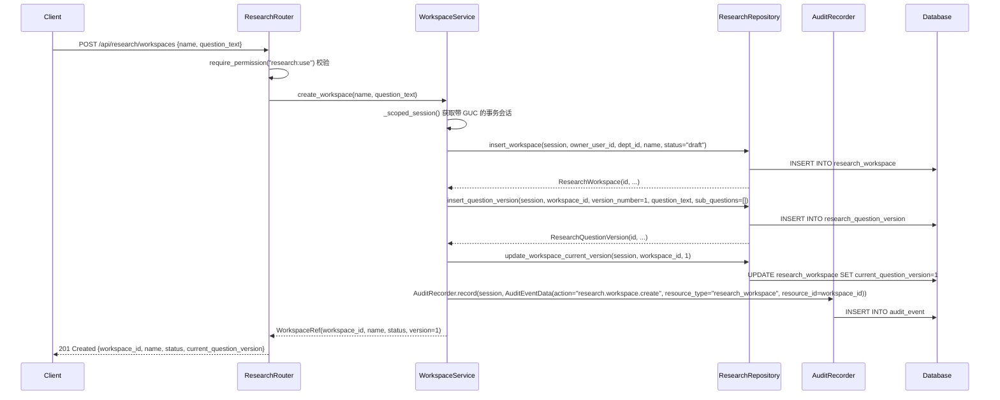
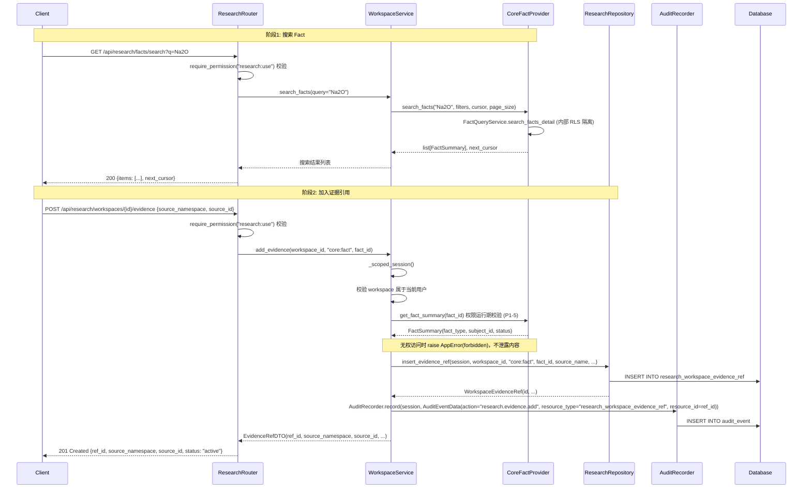
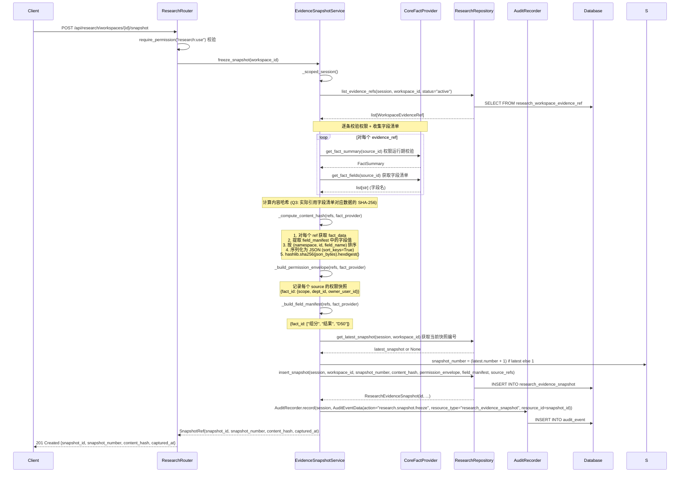
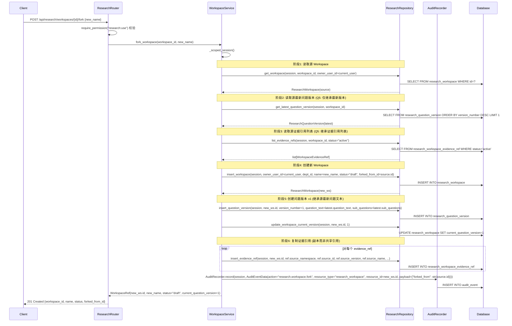
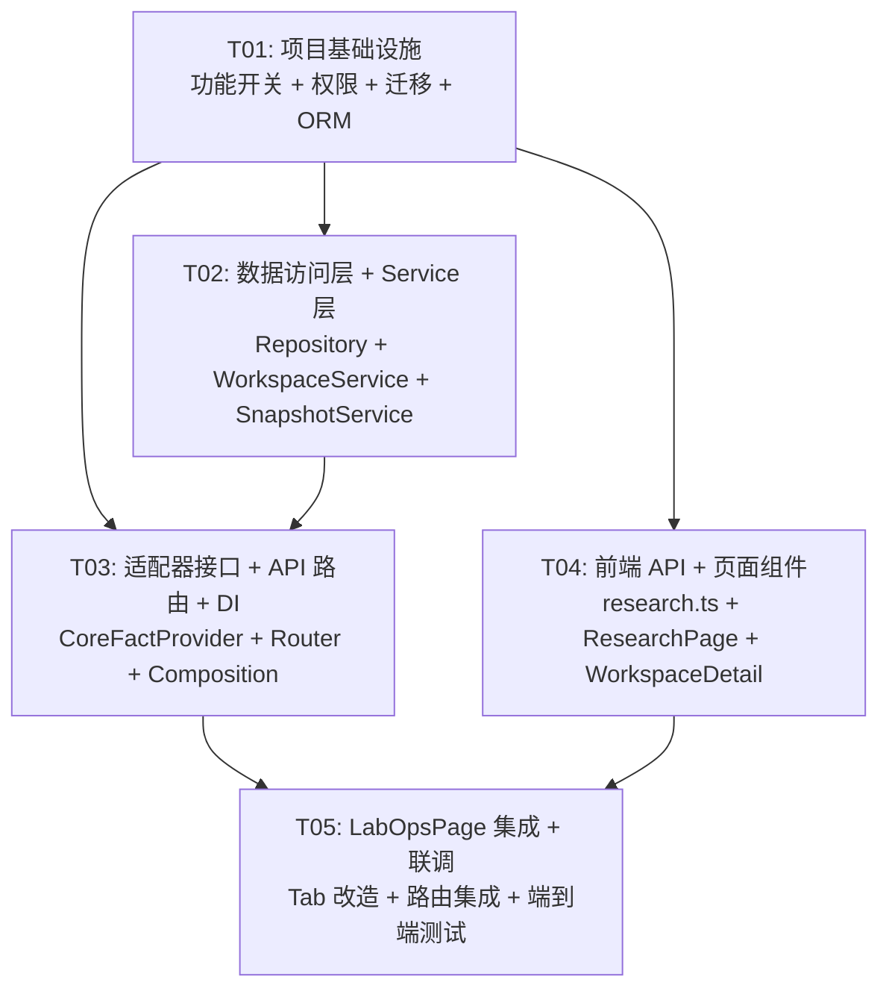

# 架构设计：研究域基础（子项目 1）

> **项目名称**: irip_research_foundation
>
> **技术栈**: 后端 Python 3.12+ / FastAPI / SQLAlchemy(异步) / PostgreSQL 16 / Redis 7；前端 React 18 + TS / Vite / Ant Design 5 / TanStack Router+Query
>
> **日期**: 2026-08-05
>
> **状态**: 评审稿
>
> **关联 PRD**: `docs/prd-research-foundation.md`

---

## 目录

- [1. 实现方案与框架选型](#1-实现方案与框架选型)
- [2. 文件列表及相对路径](#2-文件列表及相对路径)
- [3. 数据结构和接口（类图）](#3-数据结构和接口类图)
- [4. 程序调用流程（时序图）](#4-程序调用流程时序图)
- [5. 任务列表（有序，含依赖关系）](#5-任务列表有序含依赖关系)
- [6. 依赖包列表](#6-依赖包列表)
- [7. 共享知识（跨文件约定）](#7-共享知识跨文件约定)
- [8. 待明确事项](#8-待明确事项)

---

## 1. 实现方案与框架选型

### 1.1 技术栈确认

与现有 IRIP 系统完全一致，不引入新的技术栈：

| 层 | 技术 | 说明 |
|----|------|------|
| 后端框架 | FastAPI + SQLAlchemy 异步 | 延续现有 `apps/api/` 模式 |
| 数据库 | PostgreSQL 16 | 延续现有 `packages/<domain>/` 包结构 |
| ORM 类型 | `Mapped[] + mapped_column()` + `GUID` / `UTCDateTime` | 延续 `packages/common/db_types.py` |
| Service 模式 | `ScopedSessionMixin` + `session_factory / department_id / actor_id` | 延续 `packages/facts/service.py` |
| DI 模式 | Composition Root + provider `register(ctx)` | 延续 `apps/api/composition/` |
| 权限 | `require_permission("xxx:yyy")` 依赖 | 延续 `apps/api/dependencies/authorization.py` |
| 审计 | `AuditRecorder.record(session, event)` 静态方法 | 延续 `packages/audit/repository.py` |
| 迁移 | Alembic `op.execute()` 原生 SQL，编号 0074+ | 延续 `migrations/versions/` |
| 前端框架 | React 18 + Vite + Ant Design 5 | 延续 `apps/web/` |
| 前端路由 | TanStack Router `createRoute` | 延续 `apps/web/src/app/router.tsx` |
| 前端数据 | Axios `http` 实例 + 纯 async 函数 | 延续 `apps/web/src/api/client.ts` |

**无新增第三方依赖。** 研究域基础所需功能完全可用现有技术栈实现。

### 1.2 功能开关实现方案

**已拍板决策（Q1）**：使用环境变量 `RESEARCH_MODULE_ENABLED`（默认 `true`）。

新增 `packages/common/feature_flags.py`，集中管理功能开关常量：

```python
import os

RESEARCH_MODULE_ENABLED: bool = os.getenv("RESEARCH_MODULE_ENABLED", "true").lower() == "true"
```

#### 后端开关控制点

1. **API 路由注册**（`apps/api/main.py`）：`create_app()` 中条件 `include_router`：
   ```python
   if RESEARCH_MODULE_ENABLED:
       from apps.api.routers.research import research_router
       app.include_router(research_router)
   ```

2. **Composition provider 注册**（`apps/api/composition/__init__.py`）：`register_all()` 中条件调用：
   ```python
   if RESEARCH_MODULE_ENABLED:
       from apps.api.composition.research import register as register_research
       register_research(ctx)
   ```

3. **功能开关状态暴露**（新增 `apps/api/routers/health.py` 或在 `/me` 端点扩展）：前端通过 API 获取开关状态，而非直接读取环境变量。在 `GET /api/v1/me` 响应中新增 `feature_flags` 字段：
   ```json
   { "feature_flags": { "research_module": true } }
   ```
   或新增 `GET /api/v1/feature-flags` 端点。推荐方案：在现有 `/me` 响应中附加 `feature_flags` 对象，避免额外请求。

#### 前端开关控制点

1. **LabOpsPage Tab 条件渲染**（`apps/web/src/features/dashboard/LabOpsPage.tsx`）：
   - 开关开启：Tab 定义为 `['flows', 'research', 'publication']`
   - 开关关闭：保持原 `['flows', 'parameters', 'models']`

2. **前端开关来源**：从 `apiGetMe()` 返回的 `feature_flags.research_module` 字段获取（在 AuthProvider 中存储到会话状态）。

### 1.3 模块隔离策略

#### 数据库隔离

- 所有研究域表以 `research_` 前缀命名，与核心表（`fact`、`evidence_set` 等）完全分离。
- **核心表无到研究表的外键约束**。研究表通过 `source_namespace` + `source_id` 逻辑引用核心表，不建立数据库级 FK。
- 研究表到 `app_user` 的 FK 允许保留（`owner_user_id` / `created_by` → `app_user.id`），因为 `app_user` 是稳定的基础表。
- 研究表到 `department` 的 FK 允许保留（`department_id` → `department.id`），用于 RLS 部门隔离。
- 迁移编号延续 `0074+`（已拍板 Q2），down migration 可完整回滚。

#### 代码隔离

- 后端独立包 `packages/research/`，不导入 `packages/facts/` 的内部模块。
- `CoreFactProvider` 是唯一跨模块桥接接口：研究域通过此接口只读访问 Fact 数据，**不暴露核心数据库会话**。
- `CoreFactProvider` 实现类内部使用 `packages/facts/query_service.FactQueryService` 的只读方法，但返回值是研究域定义的数据类，不泄露 Fact ORM 对象或 session 引用。
- API 路由独立 `apps/api/routers/research.py`，功能开关控制注册。
- 前端独立 `apps/web/src/features/research/`，路由在 LabOpsPage Tab 内挂载。

#### 移除安全

关闭或移除研究模块的步骤：
1. 设置 `RESEARCH_MODULE_ENABLED=false` → API 路由不注册，前端 Tab 恢复原状。
2. 执行 `alembic downgrade 0073` → 研究表全部删除。
3. 核心系统完全不受影响。

---

## 2. 文件列表及相对路径

### 2.1 后端新增文件

| # | 文件路径 | 职责 |
|---|---------|------|
| 1 | `packages/common/feature_flags.py` | 功能开关常量定义（`RESEARCH_MODULE_ENABLED`） |
| 2 | `packages/research/__init__.py` | 研究域包初始化 |
| 3 | `packages/research/entities.py` | ORM 模型：`ResearchWorkspace` / `ResearchQuestionVersion` / `WorkspaceEvidenceRef` / `ResearchEvidenceSnapshot` |
| 4 | `packages/research/repository.py` | 数据访问层：`ResearchRepository`（静态方法，操作 session） |
| 5 | `packages/research/service.py` | 业务编排：`WorkspaceService`（创建/列表/详情/归档/删除/分叉/问题版本） |
| 6 | `packages/research/snapshots.py` | 业务编排：`EvidenceSnapshotService`（冻结逻辑 + 哈希计算） |
| 7 | `packages/research/core_adapter.py` | 只读适配：`CoreFactProvider` 接口 + 实现（封装 FactQueryService 只读调用） |
| 8 | `packages/research/catalog.py` | 接口占位：`ResearchCatalog`（搜索已发布衍生数据，本期返回空列表） |
| 9 | `packages/research/models.py` | 请求/响应数据类（`CreateWorkspaceCommand` / `WorkspaceRef` / `EvidenceRefDTO` / `SnapshotRef` 等） |
| 10 | `apps/api/routers/research.py` | API 路由：Workspace + 证据引用 + 快照的 CRUD 端点 |
| 11 | `apps/api/composition/research.py` | Composition provider：研究域依赖注入注册 |
| 12 | `migrations/versions/0074_research_foundation.py` | Alembic 迁移：创建 4 张研究表 + 索引 |

### 2.2 后端修改文件

| # | 文件路径 | 修改内容 |
|---|---------|---------|
| 13 | `packages/auth/permissions.py` | 新增 `RESEARCH_USE = "research:use"` 权限常量；`Permission.all()` 追加；`BUILTIN_ROLES` 中 `lab_director` / `lab_member` 追加该权限 |
| 14 | `apps/api/main.py` | `create_app()` 中条件 `include_router(research_router)` |
| 15 | `apps/api/composition/__init__.py` | `register_all()` 中条件调用 `register_research(ctx)` |
| 16 | `apps/api/routers/auth.py` 或 `apps/api/routers/me.py` | `/me` 响应附加 `feature_flags` 对象（含 `research_module` 布尔值） |

### 2.3 前端新增文件

| # | 文件路径 | 职责 |
|---|---------|------|
| 17 | `apps/web/src/api/research.ts` | 研究 API 客户端：类型定义 + async 函数（Workspace CRUD / 证据引用 / 快照） |
| 18 | `apps/web/src/features/research/ResearchPage.tsx` | 研究分析首页（Workspace 列表 + 筛选 + 新建按钮） |
| 19 | `apps/web/src/features/research/WorkspaceDetail.tsx` | Workspace 三栏布局容器 |
| 20 | `apps/web/src/features/research/EvidencePanel.tsx` | 左栏：证据搜索 + 已选证据列表 + 冻结按钮 |
| 21 | `apps/web/src/features/research/ResearchCanvas.tsx` | 中栏：主研究问题 + 子问题 + 证据集状态 |
| 22 | `apps/web/src/features/research/AiAssistantPanel.tsx` | 右栏：AI 助手占位 |
| 23 | `apps/web/src/features/research/WorkspaceCard.tsx` | 列表卡片组件 |
| 24 | `apps/web/src/features/research/CreateWorkspaceModal.tsx` | 创建 Workspace 对话框 |

### 2.4 前端修改文件

| # | 文件路径 | 修改内容 |
|---|---------|---------|
| 25 | `apps/web/src/features/dashboard/LabOpsPage.tsx` | 功能开关条件渲染 Tab（`research` / `publication` vs `parameters` / `models`） |
| 26 | `apps/web/src/api/client.ts` | `CurrentUser` 类型新增 `featureFlags` 可选字段；`apiGetMe()` 映射 `feature_flags` |
| 27 | `apps/web/src/features/auth/AuthProvider.tsx` | 会话状态存储 `featureFlags`（供 LabOpsPage 读取） |

---

## 3. 数据结构和接口（类图）

### 3.1 类图（Mermaid）

```mermaid
classDiagram
    direction TB

    %% ===== ORM 实体 =====

    class ResearchWorkspace {
        +UUID id
        +UUID owner_user_id
        +UUID department_id
        +str name
        +str status
        +int current_question_version
        +UUID forked_from_id
        +datetime created_at
        +datetime updated_at
        +int lock_version
    }

    class ResearchQuestionVersion {
        +UUID id
        +UUID workspace_id
        +int version_number
        +str question_text
        +list sub_questions
        +datetime created_at
        +UUID created_by
    }

    class WorkspaceEvidenceRef {
        +UUID id
        +UUID workspace_id
        +str source_namespace
        +UUID source_id
        +str source_version
        +str source_name
        +datetime added_at
        +UUID added_by
        +str status
    }

    class ResearchEvidenceSnapshot {
        +UUID id
        +UUID workspace_id
        +int snapshot_number
        +str content_hash
        +datetime captured_at
        +dict permission_envelope
        +dict field_manifest
        +list source_refs
        +UUID created_by
    }

    ResearchWorkspace "1" --> "many" ResearchQuestionVersion : workspace_id
    ResearchWorkspace "1" --> "many" WorkspaceEvidenceRef : workspace_id
    ResearchWorkspace "1" --> "many" ResearchEvidenceSnapshot : workspace_id
    ResearchWorkspace --> ResearchWorkspace : forked_from_id (nullable)

    %% ===== Repository =====

    class ResearchRepository {
        <<static>>
        +insert_workspace(session, **kwargs) ResearchWorkspace
        +get_workspace(session, workspace_id, owner_user_id) ResearchWorkspace
        +list_workspaces(session, owner_user_id, status, cursor, page_size) tuple
        +update_workspace_status(session, workspace_id, status) void
        +delete_workspace(session, workspace_id) void
        +insert_question_version(session, **kwargs) ResearchQuestionVersion
        +get_latest_question_version(session, workspace_id) ResearchQuestionVersion
        +list_question_versions(session, workspace_id) list
        +insert_evidence_ref(session, **kwargs) WorkspaceEvidenceRef
        +list_evidence_refs(session, workspace_id, status) list
        +update_evidence_ref_status(session, ref_id, status) void
        +insert_snapshot(session, **kwargs) ResearchEvidenceSnapshot
        +list_snapshots(session, workspace_id) list
        +get_latest_snapshot(session, workspace_id) ResearchEvidenceSnapshot
    }

    %% ===== Service 层 =====

    class WorkspaceService {
        +async_sessionmaker _factory
        +UUID _dept_id
        +UUID _actor_id
        +CoreFactProvider _fact_provider
        +__init__(session_factory, department_id, actor_id, fact_provider)
        +create_workspace(name, question_text) WorkspaceRef
        +list_workspaces(status, cursor, page_size) tuple
        +get_workspace(workspace_id) WorkspaceDetail
        +archive_workspace(workspace_id) void
        +delete_workspace(workspace_id) void
        +fork_workspace(workspace_id, new_name) WorkspaceRef
        +update_question(workspace_id, question_text, sub_questions) QuestionVersionRef
        +add_evidence(workspace_id, source_namespace, source_id) EvidenceRefDTO
        +remove_evidence(workspace_id, ref_id) void
        +list_evidence(workspace_id) list
    }

    class EvidenceSnapshotService {
        +async_sessionmaker _factory
        +UUID _dept_id
        +UUID _actor_id
        +CoreFactProvider _fact_provider
        +__init__(session_factory, department_id, actor_id, fact_provider)
        +freeze_snapshot(workspace_id) SnapshotRef
        +list_snapshots(workspace_id) list
        +_compute_content_hash(refs, fact_provider) str
        +_build_permission_envelope(refs, fact_provider) dict
        +_build_field_manifest(refs, fact_provider) dict
    }

    %% ===== 适配器接口 =====

    class CoreFactProvider {
        <<interface>>
        +search_facts(query, filters, cursor, page_size) tuple
        +get_fact_summary(fact_id) FactSummary
        +get_fact_fields(fact_id) list
    }

    class CoreFactProviderImpl {
        +FactQueryService _query_service
        +__init__(query_service)
        +search_facts(query, filters, cursor, page_size) tuple
        +get_fact_summary(fact_id) FactSummary
        +get_fact_fields(fact_id) list
    }

    class ResearchCatalog {
        <<interface>>
        +search_derived_data(query, filters) list
    }

    class ResearchCatalogStub {
        +search_derived_data(query, filters) list
    }

    CoreFactProviderImpl ..|> CoreFactProvider
    ResearchCatalogStub ..|> ResearchCatalog
    WorkspaceService --> CoreFactProvider : 使用
    EvidenceSnapshotService --> CoreFactProvider : 使用
    WorkspaceService --> ResearchRepository : 调用
    EvidenceSnapshotService --> ResearchRepository : 调用

    %% ===== 请求/响应模型 =====

    class CreateWorkspaceCommand {
        +str name
        +str question_text
    }

    class WorkspaceRef {
        +UUID workspace_id
        +str name
        +str status
        +int current_question_version
    }

    class WorkspaceDetail {
        +UUID workspace_id
        +str name
        +str status
        +QuestionVersionRef current_question
        +int evidence_count
        +list snapshots
    }

    class EvidenceRefDTO {
        +UUID ref_id
        +str source_namespace
        +UUID source_id
        +str source_version
        +str source_name
        +str status
    }

    class SnapshotRef {
        +UUID snapshot_id
        +int snapshot_number
        +str content_hash
        +datetime captured_at
    }

    class FactSummary {
        +UUID fact_id
        +str fact_type
        +str subject_id
        +str status
        +str department_name
    }

    CreateWorkspaceCommand --> WorkspaceService : create_workspace()
    WorkspaceService ..> WorkspaceRef : 返回
    WorkspaceService ..> WorkspaceDetail : 返回
    WorkspaceService ..> EvidenceRefDTO : 返回
    EvidenceSnapshotService ..> SnapshotRef : 返回
    CoreFactProvider ..> FactSummary : 返回
```



### 3.2 ORM 实体详细定义

#### 3.2.1 ResearchWorkspace（`research_workspace`）

```python
class ResearchWorkspace(Base):
    __tablename__ = "research_workspace"

    id: Mapped[UUID] = mapped_column(GUID, primary_key=True, default=new_id)
    owner_user_id: Mapped[UUID] = mapped_column(GUID, sa.ForeignKey("app_user.id"), nullable=False)
    department_id: Mapped[UUID] = mapped_column(GUID, sa.ForeignKey("department.id"), nullable=False)
    name: Mapped[str] = mapped_column(sa.Text, nullable=False)
    status: Mapped[str] = mapped_column(sa.Text, nullable=False, server_default=sa.text("'draft'"))
    current_question_version: Mapped[int] = mapped_column(sa.Integer, nullable=False, server_default=sa.text("0"))
    forked_from_id: Mapped[UUID | None] = mapped_column(GUID, nullable=True)
    created_at: Mapped[datetime] = mapped_column(UTCDateTime, server_default=sa.func.now(), nullable=False)
    updated_at: Mapped[datetime] = mapped_column(UTCDateTime, server_default=sa.func.now(), nullable=False)
    lock_version: Mapped[int] = mapped_column(sa.Integer, nullable=False, server_default=sa.text("0"))
```

- `status`: `draft`（活跃） / `archived`（归档）
- `forked_from_id`: 逻辑引用源 Workspace ID（不建 FK，因为分叉后独立运行）
- `current_question_version`: 当前最新问题版本号（冗余缓存，避免每次 JOIN 查询）

#### 3.2.2 ResearchQuestionVersion（`research_question_version`）

```python
class ResearchQuestionVersion(Base):
    __tablename__ = "research_question_version"

    id: Mapped[UUID] = mapped_column(GUID, primary_key=True, default=new_id)
    workspace_id: Mapped[UUID] = mapped_column(GUID, sa.ForeignKey("research_workspace.id", ondelete="CASCADE"), nullable=False)
    version_number: Mapped[int] = mapped_column(sa.Integer, nullable=False)
    question_text: Mapped[str] = mapped_column(sa.Text, nullable=False)
    sub_questions: Mapped[list] = mapped_column(JSONB, nullable=False, server_default=sa.text("'[]'::jsonb"))
    created_at: Mapped[datetime] = mapped_column(UTCDateTime, server_default=sa.func.now(), nullable=False)
    created_by: Mapped[UUID] = mapped_column(GUID, sa.ForeignKey("app_user.id"), nullable=False)
```

- **不可变**：创建后不允许 UPDATE（应用层保证，迁移注释标注）
- `sub_questions`: JSONB 数组，如 `["温度梯度的影响", "原料批次差异"]`
- `workspace_id` FK 到 `research_workspace.id`，`ON DELETE CASCADE`

#### 3.2.3 WorkspaceEvidenceRef（`research_workspace_evidence_ref`）

```python
class WorkspaceEvidenceRef(Base):
    __tablename__ = "research_workspace_evidence_ref"

    id: Mapped[UUID] = mapped_column(GUID, primary_key=True, default=new_id)
    workspace_id: Mapped[UUID] = mapped_column(GUID, sa.ForeignKey("research_workspace.id", ondelete="CASCADE"), nullable=False)
    source_namespace: Mapped[str] = mapped_column(sa.Text, nullable=False)  # "core:fact"
    source_id: Mapped[UUID] = mapped_column(GUID, nullable=False)  # 逻辑引用，不建 FK
    source_version: Mapped[str] = mapped_column(sa.Text, nullable=True)
    source_name: Mapped[str] = mapped_column(sa.Text, nullable=True)
    added_at: Mapped[datetime] = mapped_column(UTCDateTime, server_default=sa.func.now(), nullable=False)
    added_by: Mapped[UUID] = mapped_column(GUID, sa.ForeignKey("app_user.id"), nullable=False)
    status: Mapped[str] = mapped_column(sa.Text, nullable=False, server_default=sa.text("'active'"))  # active / removed
```

- `source_namespace`: `"core:fact"`（当前唯一来源，后续可扩展 `research:derivation` 等）
- `source_id`: 逻辑引用 Fact ID，**不建数据库级 FK**
- `status`: 草稿期软删除使用 `removed`，不物理删除

#### 3.2.4 ResearchEvidenceSnapshot（`research_evidence_snapshot`）

```python
class ResearchEvidenceSnapshot(Base):
    __tablename__ = "research_evidence_snapshot"

    id: Mapped[UUID] = mapped_column(GUID, primary_key=True, default=new_id)
    workspace_id: Mapped[UUID] = mapped_column(GUID, sa.ForeignKey("research_workspace.id", ondelete="CASCADE"), nullable=False)
    snapshot_number: Mapped[int] = mapped_column(sa.Integer, nullable=False)
    content_hash: Mapped[str] = mapped_column(sa.Text, nullable=False)
    captured_at: Mapped[datetime] = mapped_column(UTCDateTime, server_default=sa.func.now(), nullable=False)
    permission_envelope: Mapped[dict] = mapped_column(JSONB, nullable=False)  # 权限快照
    field_manifest: Mapped[dict] = mapped_column(JSONB, nullable=False)  # 字段清单
    source_refs: Mapped[list] = mapped_column(JSONB, nullable=False)  # [{namespace, id, version}]
    created_by: Mapped[UUID] = mapped_column(GUID, sa.ForeignKey("app_user.id"), nullable=False)
```

- **不可变**：创建后不允许 UPDATE / DELETE（应用层保证）
- `content_hash`: 实际引用字段清单对应数据的 SHA-256 哈希（已拍板 Q3）
- `permission_envelope`: 冻结时的权限快照，如 `{"fact_id": {"scope": "tree", "dept_id": "..."}}`
- `field_manifest`: 引用字段的清单，如 `{"fact_id": ["组分", "结果", "D50"]}`
- `source_refs`: 源对象引用列表，如 `[{"namespace": "core:fact", "id": "...", "version": "..."}]`

### 3.3 适配器接口定义

#### CoreFactProvider（只读适配接口）

```python
class CoreFactProvider(Protocol):
    """只读访问 Fact 数据的适配器接口。

    研究域通过此接口搜索和获取 Fact 数据，不暴露核心数据库会话。
    """

    async def search_facts(
        self,
        query: str,
        filters: dict | None = None,
        cursor: str | None = None,
        page_size: int = 20,
    ) -> tuple[list[FactSummary], str | None]:
        """搜索当前用户有权访问的 Fact。"""
        ...

    async def get_fact_summary(self, fact_id: UUID) -> FactSummary:
        """获取 Fact 摘要（不含完整数据内容）。"""
        ...

    async def get_fact_fields(self, fact_id: UUID) -> list[str]:
        """获取 Fact 的字段清单（用于快照字段清单记录）。"""
        ...
```

`CoreFactProviderImpl` 内部调用 `FactQueryService` 的只读方法，将结果转换为研究域定义的 `FactSummary` 数据类。调用方无法获得核心 session 引用。

#### ResearchCatalog（接口占位）

```python
class ResearchCatalog(Protocol):
    """搜索已发布衍生数据的只读接口（本期占位）。"""

    async def search_derived_data(
        self,
        query: str,
        filters: dict | None = None,
    ) -> list[dict]:
        """搜索已发布的衍生数据。本期返回空列表。"""
        ...
```

`ResearchCatalogStub` 实现返回空列表，后续子项目 4 实现时无需修改接口签名。

---

## 4. 程序调用流程（时序图）

### 4.1 创建 Workspace + 研究问题



### 4.2 搜索并加入证据



### 4.3 冻结证据快照



### 4.4 分叉 Workspace



---

## 5. 任务列表（有序，含依赖关系）

### 任务依赖图



---

### T01: 项目基础设施（功能开关 + 权限 + 迁移 + ORM 实体）

| 项目 | 内容 |
|------|------|
| **任务描述** | 建立研究域模块的地基：功能开关常量、`research:use` 权限点、4 张研究表的 Alembic 迁移、ORM 实体类定义、研究域包初始化文件 |
| **涉及文件** | `packages/common/feature_flags.py`（新增）<br/>`packages/auth/permissions.py`（修改）<br/>`migrations/versions/0074_research_foundation.py`（新增）<br/>`packages/research/__init__.py`（新增）<br/>`packages/research/entities.py`（新增）<br/>`packages/research/models.py`（新增） |
| **依赖前序任务** | 无 |
| **优先级** | P0 |
| **验收标准** | 1. `RESEARCH_MODULE_ENABLED` 可读取环境变量，默认 true<br/>2. `Permission.RESEARCH_USE = "research:use"` 已定义并加入 `Permission.all()`<br/>3. `BUILTIN_ROLES` 中 `lab_director` / `lab_member` 拥有 `research:use`，`lab_viewer` / `platform_auditor` 不拥有<br/>4. `alembic upgrade 0074` 成功创建 4 张表 + 索引<br/>5. `alembic downgrade 0073` 成功删除全部研究表<br/>6. ORM 实体继承 `Base`，使用 `GUID` / `UTCDateTime` / `Mapped[]` + `mapped_column()`，`Base.metadata` 包含全部研究表<br/>7. `models.py` 中定义全部请求/响应数据类<br/>8. 核心表无到研究表的外键 |

**详细实现要点**：

1. **`packages/common/feature_flags.py`**：
   ```python
   import os
   RESEARCH_MODULE_ENABLED: bool = os.getenv("RESEARCH_MODULE_ENABLED", "true").lower() == "true"
   ```

2. **`packages/auth/permissions.py` 修改**：
   - `Permission` 类新增：`RESEARCH_USE: str = "research:use"`
   - `Permission.all()` 追加 `cls.RESEARCH_USE`
   - `BUILTIN_ROLES["lab_director"]["permissions"]` 追加 `Permission.RESEARCH_USE`
   - `BUILTIN_ROLES["lab_member"]["permissions"]` 追加 `Permission.RESEARCH_USE`
   - `lab_viewer` / `platform_auditor` 不追加

3. **`migrations/versions/0074_research_foundation.py`**：
   - `revision = "0074"; down_revision = "0073"`
   - `upgrade()`: 用 `op.execute()` 原生 SQL 创建 4 张表 + 索引
   - 表定义严格按 3.2 节的 ORM 定义
   - `research_workspace` → 索引 `ix_research_workspace_owner_user_id`
   - `research_question_version` → 索引 `ix_research_question_version_workspace_id` + 唯一约束 `uq_rqv_workspace_version`
   - `research_workspace_evidence_ref` → 索引 `ix_research_evidence_ref_workspace_id` + 唯一约束 `uq_evidence_ref_workspace_source`（workspace_id + source_namespace + source_id + status='active'）
   - `research_evidence_snapshot` → 索引 `ix_research_snapshot_workspace_id`
   - `downgrade()`: 反序 DROP 全部表

4. **`packages/research/entities.py`**：
   - 导入 `packages.auth.entities`（app_user 表注册）+ `packages.departments.entities`（department 表注册）
   - 4 个 ORM 类按 3.2 节定义
   - 研究表之间的 FK（`workspace_id` → `research_workspace.id ON DELETE CASCADE`）使用 `sa.ForeignKey`
   - 跨模块引用（`source_id`）不建 FK，纯 `GUID` 列

5. **`packages/research/models.py`**：
   - `CreateWorkspaceCommand`（dataclass, frozen）
   - `WorkspaceRef`（dataclass, frozen）
   - `WorkspaceDetail`（dataclass, frozen）
   - `QuestionVersionRef`（dataclass, frozen）
   - `EvidenceRefDTO`（dataclass, frozen）
   - `SnapshotRef`（dataclass, frozen）
   - `FactSummary`（dataclass, frozen）

---

### T02: 数据访问层 + Service 层

| 项目 | 内容 |
|------|------|
| **任务描述** | 实现 ResearchRepository 数据访问层（静态方法）、WorkspaceService（创建/列表/详情/归档/删除/分叉/问题版本/证据引用管理）、EvidenceSnapshotService（冻结快照 + 哈希计算 + 权限包络 + 字段清单） |
| **涉及文件** | `packages/research/repository.py`（新增）<br/>`packages/research/service.py`（新增）<br/>`packages/research/snapshots.py`（新增） |
| **依赖前序任务** | T01 |
| **优先级** | P0 |
| **验收标准** | 1. `ResearchRepository` 全部方法为 `@staticmethod`，接受 `AsyncSession` 参数，不自行管理事务<br/>2. `WorkspaceService` 继承 `ScopedSessionMixin`，构造函数注入 `session_factory` / `department_id` / `actor_id` / `fact_provider`<br/>3. 所有写操作使用 `self._scoped_session()` 获取带 GUC 的事务会话<br/>4. 创建 Workspace 时同步创建 `ResearchQuestionVersion` v1<br/>5. 更新研究问题生成新版本（version_number 递增），旧版本不可变<br/>6. 证据引用软删除（status → `removed`），不物理删除<br/>7. 删除 Workspace 时级联删除（DB CASCADE 处理 question_version / evidence_ref / snapshot）<br/>8. 归档 Workspace 仅改 status → `archived`<br/>9. 分叉仅继承主研究问题最新版本 + 证据引用列表（Q5），证据引用为副本<br/>10. 快照冻结：逐条校验权限 → 计算 SHA-256 哈希 → 记录权限包络 + 字段清单 → 不可变<br/>11. 哈希计算范围：实际引用字段清单对应数据的 SHA-256（Q3）<br/>12. 所有操作产生审计记录（`AuditRecorder.record`）<br/>13. Workspace 只属于创建者本人，无成员列表 |

**详细实现要点**：

1. **`packages/research/repository.py`**：
   - `ResearchRepository` 类，全部 `@staticmethod async` 方法
   - `insert_workspace(session, *, owner_user_id, department_id, name, status, forked_from_id=None) -> ResearchWorkspace`
   - `get_workspace(session, workspace_id, owner_user_id) -> ResearchWorkspace | None`（按 owner 过滤）
   - `list_workspaces(session, owner_user_id, status, cursor, page_size) -> tuple[list, str | None]`（keyset 分页，同 FactRepository 模式）
   - `update_workspace_status(session, workspace_id, status) -> void`
   - `update_workspace_timestamp(session, workspace_id) -> void`（更新 `updated_at`）
   - `delete_workspace(session, workspace_id) -> void`（物理删除，CASCADE 级联）
   - `insert_question_version(session, *, workspace_id, version_number, question_text, sub_questions, created_by) -> ResearchQuestionVersion`
   - `get_latest_question_version(session, workspace_id) -> ResearchQuestionVersion | None`
   - `list_question_versions(session, workspace_id) -> list[ResearchQuestionVersion]`
   - `insert_evidence_ref(session, *, workspace_id, source_namespace, source_id, source_version, source_name, added_by) -> WorkspaceEvidenceRef`
   - `list_evidence_refs(session, workspace_id, status=None) -> list[WorkspaceEvidenceRef]`
   - `get_evidence_ref(session, ref_id, workspace_id) -> WorkspaceEvidenceRef | None`
   - `update_evidence_ref_status(session, ref_id, status) -> void`
   - `count_active_evidence_refs(session, workspace_id) -> int`
   - `insert_snapshot(session, *, workspace_id, snapshot_number, content_hash, permission_envelope, field_manifest, source_refs, created_by) -> ResearchEvidenceSnapshot`
   - `list_snapshots(session, workspace_id) -> list[ResearchEvidenceSnapshot]`
   - `get_latest_snapshot(session, workspace_id) -> ResearchEvidenceSnapshot | None`

2. **`packages/research/service.py` — WorkspaceService**：
   - 继承 `ScopedSessionMixin`
   - `__init__(self, session_factory, department_id, actor_id, fact_provider)`：额外注入 `CoreFactProvider`
   - `create_workspace(name, question_text) -> WorkspaceRef`：创建 workspace + question version v1 + 审计
   - `list_workspaces(status=None, cursor=None, page_size=20) -> tuple[list[WorkspaceRef], str | None]`：按 `owner_user_id` 过滤
   - `get_workspace(workspace_id) -> WorkspaceDetail`：含当前问题版本 + 证据数 + 快照数
   - `archive_workspace(workspace_id) -> void`：status → `archived` + 审计
   - `delete_workspace(workspace_id) -> void`：物理删除（CASCADE）+ 审计（Q6：本期无发布成果引用检查，允许无限制删除）
   - `fork_workspace(workspace_id, new_name) -> WorkspaceRef`：Q5 继承规则
   - `update_question(workspace_id, question_text, sub_questions) -> QuestionVersionRef`：创建新版本（version_number = current + 1）+ 更新 workspace.current_question_version + 审计
   - `add_evidence(workspace_id, source_namespace, source_id) -> EvidenceRefDTO`：校验 workspace 归属 → CoreFactProvider 权限校验 → 插入 evidence_ref + 审计
   - `remove_evidence(workspace_id, ref_id) -> void`：软删除 status → `removed` + 审计
   - `list_evidence(workspace_id) -> list[EvidenceRefDTO]`：列出 active 状态的证据引用
   - `search_facts(query, filters, cursor, page_size)`：委托 `CoreFactProvider.search_facts`

3. **`packages/research/snapshots.py` — EvidenceSnapshotService**：
   - 继承 `ScopedSessionMixin`
   - `__init__(self, session_factory, department_id, actor_id, fact_provider)`
   - `freeze_snapshot(workspace_id) -> SnapshotRef`：
     1. 列出 active 证据引用
     2. 逐条通过 CoreFactProvider 校验权限（P1-5）
     3. 逐条获取字段清单
     4. 计算内容哈希（SHA-256）
     5. 构建权限包络
     6. 构建字段清单
     7. 获取当前快照编号 + 1
     8. 插入 snapshot 记录
     9. 审计
   - `list_snapshots(workspace_id) -> list[SnapshotRef]`
   - `_compute_content_hash(refs, fact_provider) -> str`：
     - 对每个 ref 获取 `get_fact_fields(fact_id)` → 字段列表
     - 对每个 ref 获取 fact 数据（通过 FactQueryService 内部只读方法）
     - 按 `(namespace, id, field_name)` 排序
     - 序列化为 JSON（`sort_keys=True, ensure_ascii=False`）
     - `hashlib.sha256(json_bytes).hexdigest()`
   - `_build_permission_envelope(refs, fact_provider) -> dict`：
     - `{fact_id: {scope, dept_id, owner_user_id, visible_departments}}`
   - `_build_field_manifest(refs, fact_provider) -> dict`：
     - `{fact_id: ["字段名1", "字段名2", ...]}`

---

### T03: 适配器接口 + API 路由 + DI 组装

| 项目 | 内容 |
|------|------|
| **任务描述** | 实现 CoreFactProvider 只读适配器（封装 FactQueryService）、ResearchCatalog 接口占位、Research API 全部端点路由、Composition provider 依赖注入注册、main.py 条件注册路由 |
| **涉及文件** | `packages/research/core_adapter.py`（新增）<br/>`packages/research/catalog.py`（新增）<br/>`apps/api/routers/research.py`（新增）<br/>`apps/api/composition/research.py`（新增）<br/>`apps/api/main.py`（修改）<br/>`apps/api/composition/__init__.py`（修改） |
| **依赖前序任务** | T01, T02 |
| **优先级** | P0 |
| **验收标准** | 1. `CoreFactProvider` 接口定义清晰，`CoreFactProviderImpl` 封装 `FactQueryService` 只读方法，不暴露核心 session<br/>2. `ResearchCatalog` 接口占位，`ResearchCatalogStub` 返回空列表<br/>3. API 路由全部端点按 PRD 6.2 节定义，prefix `/api/v1/research`<br/>4. 所有写端点使用 `require_permission("research:use")` 依赖<br/>5. 搜索端点也使用 `require_permission("research:use")`（模块入口控制）<br/>6. DI 占位函数模式：`def get_workspace_service() -> WorkspaceService: raise NotImplementedError(...)`<br/>7. Composition provider `register(ctx)` 注册依赖覆盖，参照 `facts.py` 模式<br/>8. `main.py` 中 `if RESEARCH_MODULE_ENABLED: app.include_router(research_router)`<br/>9. `register_all()` 中 `if RESEARCH_MODULE_ENABLED: register_research(ctx)`<br/>10. 功能开关关闭时，研究 API 路由不注册，请求返回 404<br/>11. `CoreFactProvider` 内部校验数据级权限（fact:read + 可见性）（Q4 两层校验） |

**详细实现要点**：

1. **`packages/research/core_adapter.py`**：
   - `CoreFactProvider` Protocol（如 3.3 节）
   - `CoreFactProviderImpl`：
     - `__init__(self, query_service: FactQueryService)`：注入 FactQueryService
     - `search_facts()`: 调用 `query_service.search_facts_detail()`，结果转为 `list[FactSummary]`
     - `get_fact_summary()`: 调用 `query_service.get_fact_detail()`，转为 `FactSummary`
     - `get_fact_fields()`: 调用 `query_service.get_fact_data()` 获取 metadata/points/series，提取字段名列表
     - **不暴露** `query_service` 的 session 引用给调用方

2. **`packages/research/catalog.py`**：
   - `ResearchCatalog` Protocol
   - `ResearchCatalogStub`：`search_derived_data()` 返回 `[]`

3. **`apps/api/routers/research.py`**：
   - `research_router = APIRouter(prefix="/api/v1/research", tags=["research"])`
   - DI 占位：`get_workspace_service()` / `get_snapshot_service()` / `get_fact_provider()`
   - 请求/响应 Pydantic 模型（参照 `facts.py` 的 `CreateFactRequest` / `FactResponse` 模式）
   - 端点列表：
     ```
     POST   /workspaces                    # 创建
     GET    /workspaces                     # 列表（status/cursor/page_size）
     GET    /workspaces/{id}                # 详情
     PATCH  /workspaces/{id}                # 更新名称
     DELETE /workspaces/{id}                # 删除
     POST   /workspaces/{id}/archive        # 归档
     POST   /workspaces/{id}/fork           # 分叉
     PUT    /workspaces/{id}/question        # 更新研究问题（新版本）
     POST   /workspaces/{id}/evidence       # 加入证据
     DELETE /workspaces/{id}/evidence/{ref_id}  # 移除证据
     GET    /workspaces/{id}/evidence        # 证据列表
     POST   /workspaces/{id}/snapshot        # 冻结快照
     GET    /workspaces/{id}/snapshots       # 快照列表
     GET    /facts/search                    # 搜索 Fact（委托 CoreFactProvider）
     ```
   - 所有端点使用 `Annotated[CurrentUser, Depends(require_permission("research:use"))]`

4. **`apps/api/composition/research.py`**：
   - `register(ctx: CompositionContext)`：
     - `_get_workspace_service_dep(current_user) -> WorkspaceService`：
       - `dept_id = await lookup_dept_id(ctx.session_factory, current_user.user_id)`
       - `fact_query_service = FactQueryService(session_factory=ctx.session_factory, department_id=dept_id, actor_id=current_user.user_id, s3_repo=ctx.s3_repo, rls_dept_id=get_rls_dept_id(current_user, ctx.root_dept_id))`
       - `fact_provider = CoreFactProviderImpl(query_service=fact_query_service)`
       - `service = WorkspaceService(session_factory=ctx.session_factory, department_id=dept_id, actor_id=current_user.user_id, fact_provider=fact_provider)`
       - 设置 `service._rls_dept_id`
     - `_get_snapshot_service_dep(current_user) -> EvidenceSnapshotService`（同上模式）
     - 注册 `dependency_overrides`

5. **`apps/api/main.py` 修改**：
   - 顶部 import 区新增条件 import：
     ```python
     from packages.common.feature_flags import RESEARCH_MODULE_ENABLED
     ```
   - 路由注册区新增：
     ```python
     if RESEARCH_MODULE_ENABLED:
         from apps.api.routers.research import research_router
         app.include_router(research_router)
     ```

6. **`apps/api/composition/__init__.py` 修改**：
   - `register_all()` 末尾新增：
     ```python
     from packages.common.feature_flags import RESEARCH_MODULE_ENABLED
     if RESEARCH_MODULE_ENABLED:
         from apps.api.composition.research import register as register_research
         register_research(ctx)
     ```

---

### T04: 前端 API + 页面组件

| 项目 | 内容 |
|------|------|
| **任务描述** | 实现前端研究域 API 客户端（类型定义 + async 函数）、研究分析首页（Workspace 列表）、Workspace 三栏布局（证据面板 + 研究画布 + AI 助手占位）、创建对话框、卡片组件 |
| **涉及文件** | `apps/web/src/api/research.ts`（新增）<br/>`apps/web/src/features/research/ResearchPage.tsx`（新增）<br/>`apps/web/src/features/research/WorkspaceDetail.tsx`（新增）<br/>`apps/web/src/features/research/EvidencePanel.tsx`（新增）<br/>`apps/web/src/features/research/ResearchCanvas.tsx`（新增）<br/>`apps/web/src/features/research/AiAssistantPanel.tsx`（新增）<br/>`apps/web/src/features/research/WorkspaceCard.tsx`（新增）<br/>`apps/web/src/features/research/CreateWorkspaceModal.tsx`（新增） |
| **依赖前序任务** | T01（ORM 实体定义确定 API 数据结构） |
| **优先级** | P0 |
| **验收标准** | 1. `research.ts` 定义全部类型 + async API 函数，使用 `http` 实例（延续 `client.ts` 模式）<br/>2. `ResearchPage` 展示当前用户 Workspace 列表，支持活跃/归档筛选 + 搜索 + 排序<br/>3. 新用户看到空状态引导 + "新建 Workspace" 主操作按钮<br/>4. `WorkspaceCard` 显示名称、主研究问题摘要、证据数量、更新时间<br/>5. `CreateWorkspaceModal` 包含名称输入 + 研究问题文本输入<br/>6. `WorkspaceDetail` 三栏布局：左栏 Evidence Set + 中栏 ResearchCanvas + 右栏 AiAssistantPanel<br/>7. `EvidencePanel` 顶部搜索框 + 已选证据列表 + 删除按钮 + 冻结快照按钮<br/>8. `ResearchCanvas` 展示主研究问题 + 版本号 + 子问题 + 证据集状态<br/>9. `AiAssistantPanel` 显示占位文本"AI 科研助手将在后续版本中启用"<br/>10. 冻结后左栏切换为只读快照视图<br/>11. 组件使用 Ant Design 5 组件库<br/>12. 所有交互组件有 loading / error 状态处理 |

**详细实现要点**：

1. **`apps/web/src/api/research.ts`**：
   - 延续 `experiment-projects.ts` 模式：纯 async 函数 + `http` 实例
   - 类型：`Workspace` / `WorkspaceListItem` / `WorkspaceListResponse` / `EvidenceRef` / `Snapshot` / `FactSearchResult` 等
   - API 函数：
     - `apiCreateWorkspace(body)` → POST /research/workspaces
     - `apiListWorkspaces(params)` → GET /research/workspaces
     - `apiGetWorkspace(id)` → GET /research/workspaces/{id}
     - `apiUpdateWorkspace(id, body)` → PATCH /research/workspaces/{id}
     - `apiDeleteWorkspace(id)` → DELETE /research/workspaces/{id}
     - `apiArchiveWorkspace(id)` → POST /research/workspaces/{id}/archive
     - `apiForkWorkspace(id, body)` → POST /research/workspaces/{id}/fork
     - `apiUpdateQuestion(id, body)` → PUT /research/workspaces/{id}/question
     - `apiAddEvidence(id, body)` → POST /research/workspaces/{id}/evidence
     - `apiRemoveEvidence(id, refId)` → DELETE /research/workspaces/{id}/evidence/{refId}
     - `apiListEvidence(id)` → GET /research/workspaces/{id}/evidence
     - `apiFreezeSnapshot(id)` → POST /research/workspaces/{id}/snapshot
     - `apiListSnapshots(id)` → GET /research/workspaces/{id}/snapshots
     - `apiSearchFacts(params)` → GET /research/facts/search

2. **`ResearchPage.tsx`**：
   - 使用 `apiListWorkspaces` 获取列表
   - 筛选：全部 / 活跃 / 归档
   - 排序：更新时间
   - 搜索：按名称
   - 空状态：`<Empty>` + "新建 Workspace" 按钮
   - 卡片网格：`<Row gutter={[16,16]}>` + `<Col>` + `WorkspaceCard`
   - 新建按钮弹出 `CreateWorkspaceModal`

3. **`WorkspaceDetail.tsx`**：
   - 接收 `workspaceId` prop
   - 三栏布局：`<Row>` + 3 个 `<Col>`（flex 比例 6:12:6 或 5:14:5）
   - 左栏 `<EvidencePanel workspaceId={id} />`
   - 中栏 `<ResearchCanvas workspaceId={id} />`
   - 右栏 `<AiAssistantPanel />`
   - 调用 `apiGetWorkspace` 获取详情

4. **`EvidencePanel.tsx`**：
   - 顶部 `<Input.Search>` 搜索框，调用 `apiSearchFacts`
   - 搜索结果列表，每项有"加入"按钮 → `apiAddEvidence`
   - 已选证据列表，每项显示源名称 / 版本 / 权限状态 + 删除按钮 → `apiRemoveEvidence`
   - 底部"冻结快照"按钮 → `apiFreezeSnapshot`
   - 冻结后切换为只读快照视图（显示快照时间戳 + 哈希摘要）
   - P1-4 源数据新版本提示：在证据旁显示提示图标（本期简化为静态展示，实际版本检测需后续实现）

5. **`ResearchCanvas.tsx`**：
   - 顶部展示主研究问题文本 + 版本号（如 `v2`）
   - 编辑按钮 → 弹出编辑弹窗 → `apiUpdateQuestion`（生成新版本）
   - 下方列出子问题
   - 证据集区域展示当前引用数量和快照状态

6. **`AiAssistantPanel.tsx`**：
   - 静态占位：`<Empty description="AI 科研助手将在后续版本中启用" />`

7. **`WorkspaceCard.tsx`**：
   - `<Card>` 组件
   - 显示名称、主研究问题摘要（截断）、证据数量、更新时间
   - 点击跳转 WorkspaceDetail

8. **`CreateWorkspaceModal.tsx`**：
   - `<Modal>` + `<Form>`
   - 名称输入 + 研究问题文本输入
   - 确定后调用 `apiCreateWorkspace`

---

### T05: LabOpsPage 集成 + /me 扩展 + 端到端联调

| 项目 | 内容 |
|------|------|
| **任务描述** | 改造 LabOpsPage 支持功能开关条件渲染 Tab（研究分析 / 发布成果 vs 衍生数据 / 模型发布）；后端 `/me` 端点附加 `feature_flags` 对象；前端 `client.ts` / `AuthProvider` 传递开关状态；LabOpsPage 根据开关条件挂载 ResearchPage；端到端联调验证功能开关开启/关闭行为 |
| **涉及文件** | `apps/web/src/features/dashboard/LabOpsPage.tsx`（修改）<br/>`apps/web/src/api/client.ts`（修改）<br/>`apps/web/src/features/auth/AuthProvider.tsx`（修改）<br/>`apps/api/routers/auth.py` 或 `apps/api/routers/me.py`（修改） |
| **依赖前序任务** | T03（后端 API 就绪）、T04（前端组件就绪） |
| **优先级** | P0 |
| **验收标准** | 1. `GET /api/v1/me` 响应包含 `feature_flags.research_module` 布尔字段<br/>2. `client.ts` 的 `CurrentUser` 类型新增 `featureFlags` 可选字段，`apiGetMe()` 正确映射<br/>3. `AuthProvider` 会话状态存储 `featureFlags`<br/>4. LabOpsPage 读取 `featureFlags.research_module`：<br/>   - `true` 时 Tab 定义为 `['flows', 'research', 'publication']`，`research` Tab 渲染 `ResearchPage`，`publication` Tab 显示占位<br/>   - `false` 时恢复原 `['flows', 'parameters', 'models']` 行为<br/>5. 功能开关开启时 `/lab-ops?tab=research` 深链正常工作<br/>6. 功能开关关闭时 `/lab-ops?tab=parameters` 恢复原 ParameterPage<br/>7. 端到端验证：开关开启 → 研究 API 可访问、前端 Tab 切换正常；开关关闭 → 研究 API 返回 404、前端 Tab 恢复原状<br/>8. 核心系统（实验项目、参数管理、模型发布）不受影响 |

**详细实现要点**：

1. **后端 `/me` 扩展**（`apps/api/routers/auth.py` 或 `me.py`）：
   - 在 `/me` 响应中新增 `feature_flags` 字段：
     ```python
     from packages.common.feature_flags import RESEARCH_MODULE_ENABLED
     # 在 me 端点响应中添加：
     "feature_flags": {"research_module": RESEARCH_MODULE_ENABLED}
     ```

2. **`apps/web/src/api/client.ts` 修改**：
   - `MeApiResponse` 新增 `feature_flags?: { research_module?: boolean }`
   - `CurrentUser` 新增 `featureFlags?: { researchModule: boolean }`
   - `apiGetMe()` 映射：
     ```typescript
     featureFlags: {
       researchModule: res.data.feature_flags?.research_module ?? false,
     },
     ```

3. **`apps/web/src/features/auth/AuthProvider.tsx` 修改**：
   - 会话状态对象新增 `featureFlags` 字段
   - `apiGetMe()` 结果存储到会话状态

4. **`apps/web/src/features/dashboard/LabOpsPage.tsx` 修改**：
   - 从会话状态读取 `featureFlags.researchModule`
   - 条件定义 Tab 列表和渲染逻辑：
     ```typescript
     const isResearchEnabled = featureFlags?.researchModule ?? false;
     const VALID_TABS = isResearchEnabled
       ? ['flows', 'research', 'publication'] as const
       : ['flows', 'parameters', 'models'] as const;
     ```
   - `research` Tab 渲染 `<ResearchPage />`
   - `publication` Tab 显示占位 `<FeedbackState title="发布成果" description="开发中" />`
   - `flows` Tab 保持原有 ProjectList / ProjectDetail 逻辑
   - Tab 标签：`research` → "研究分析"，`publication` → "发布成果"

---

## 6. 依赖包列表

### 6.1 新增 Python 依赖

**无新增。** 研究域基础所需功能完全使用现有依赖实现：
- `sqlalchemy`（ORM + 异步 session）
- `fastapi`（API 路由）
- `pydantic`（请求/响应模型）
- `hashlib`（标准库，SHA-256 哈希计算）
- `json`（标准库，快照序列化）

### 6.2 新增前端依赖

**无新增。** 前端使用现有依赖：
- `axios`（HTTP 客户端，已有 `http` 实例）
- `antd`（Ant Design 5 组件库）
- `@tanstack/react-router`（路由）
- `@tanstack/react-query`（数据查询，如已在其他 feature 中使用）

---

## 7. 共享知识（跨文件约定）

### 7.1 命名空间约定

研究域通过 `source_namespace` 逻辑引用核心域对象：

| 命名空间 | 含义 | source_id 格式 |
|----------|------|----------------|
| `core:fact` | 核心事实表（`fact`） | Fact UUID |
| `research:derivation` | 研究域衍生数据（子项目 3+ 预留） | Derivation UUID |

当前版本仅使用 `core:fact`。后续子项目扩展时新增命名空间，不需修改现有代码。

### 7.2 哈希计算约定

**内容哈希计算规则**（已拍板 Q3）：

1. 范围：实际引用字段清单对应的数据
2. 流程：
   - 对每个 evidence_ref，通过 `CoreFactProvider.get_fact_fields(fact_id)` 获取字段清单
   - 通过 `CoreFactProvider` 获取对应字段的实际数据值
   - 按 `(namespace, id, field_name)` 排序所有 `(namespace, source_id, field_name, value)` 元组
   - 序列化为 JSON（`sort_keys=True, ensure_ascii=False, separators=(",", ":")`）
   - 计算 `hashlib.sha256(json_bytes).hexdigest()`
3. 存储位置：`research_evidence_snapshot.content_hash`（64 字符十六进制字符串）
4. 不变性保证：快照创建后 content_hash 不可修改

### 7.3 功能开关读取约定

| 层 | 读取方式 | 代码位置 |
|----|---------|---------|
| 后端 Python | `from packages.common.feature_flags import RESEARCH_MODULE_ENABLED` | 模块级常量，进程启动时读取一次 |
| 后端 API 响应 | `/me` 端点 `feature_flags.research_module` | 布尔值，前端读取 |
| 前端 TS | `featureFlags?.researchModule`（来自 AuthProvider 会话状态） | 全局可读 |

**注意**：环境变量变更需重启后端进程。前端通过 `/me` API 获取最新状态（登录时刷新）。

### 7.4 研究表与核心表隔离约定

1. **无数据库级 FK**：`research_workspace_evidence_ref.source_id` 不建 FK 到 `fact.id`。跨模块引用为逻辑引用（`source_namespace` + `source_id`）。
2. **允许的 FK**：研究表到 `app_user`（`owner_user_id` / `created_by` / `added_by`）和 `department`（`department_id`）的 FK 允许保留，因为这些是稳定基础表。
3. **只读访问核心数据**：研究域通过 `CoreFactProvider` 接口只读访问 Fact 数据，不修改、不暴露核心 session。
4. **迁移独立性**：研究域迁移 `0074` 可独立 `downgrade` 到 `0073`，不影响核心表。核心表迁移不引用研究表。

### 7.5 权限校验两层约定

**已拍板 Q4**：两层校验。

| 层 | 校验内容 | 实现位置 |
|----|---------|---------|
| 第一层 | `research:use` 控制模块入口 | `require_permission("research:use")` 依赖 |
| 第二层 | `fact:read` + 可见性 控制数据级访问 | `CoreFactProvider` 内部通过 `FactQueryService` 的 RLS 隔离 + 可见性过滤 |

- 第一层在路由入口校验角色级权限（`BUILTIN_ROLES` 矩阵）
- 第二层在 `CoreFactProvider` 内部通过 `FactQueryService` 的 `ScopedSessionMixin`（RLS GUC）和 Fact 表的 `visible_departments` / `visibility_scope` 自动过滤
- 调用方（WorkspaceService）无需手动校验数据级权限，CoreFactProvider 内部已保证

### 7.6 审计事件命名约定

| 操作 | action 字符串 | resource_type |
|------|--------------|---------------|
| 创建 Workspace | `research.workspace.create` | `research_workspace` |
| 归档 Workspace | `research.workspace.archive` | `research_workspace` |
| 删除 Workspace | `research.workspace.delete` | `research_workspace` |
| 分叉 Workspace | `research.workspace.fork` | `research_workspace` |
| 更新研究问题 | `research.question.update` | `research_question_version` |
| 加入证据 | `research.evidence.add` | `research_workspace_evidence_ref` |
| 移除证据 | `research.evidence.remove` | `research_workspace_evidence_ref` |
| 冻结快照 | `research.snapshot.freeze` | `research_evidence_snapshot` |

审计 payload 仅含脱敏信息（ID、名称），不含大体积数据内容。

### 7.7 API 响应格式约定

延续现有 IRIP API 约定：
- 成功：直接返回 Pydantic 模型（FastAPI 自动序列化）
- 错误：`{"error": {"code", "message", "retryable", "fields"}}`（由 `AppError` 异常处理器统一处理）
- 列表分页：`{"items": [...], "next_cursor": str | null}`

---

## 8. 待明确事项

以下设计点在当前阶段无需澄清，但工程师实现时需注意：

| # | 事项 | 影响 | 当前处理 |
|---|------|------|---------|
| 1 | **前端开关状态刷新时机**：用户登录后环境变量变更，前端如何感知？ | 前端 Tab 列表 | 当前方案：登录时通过 `/me` 获取。如需运行时切换，需后续增加定期轮询或 WebSocket 推送。本期可接受重启后端生效。 |
| 2 | **快照哈希计算的 Fact 数据获取方式**：`CoreFactProvider.get_fact_fields()` 需要获取 Fact 完整数据（metadata/points/series）来提取字段名。当前 `FactQueryService.get_fact_data()` 从 S3 下载 JSON，大 Fact 可能较慢。 | 快照冻结性能 | 当前方案：逐条获取。大证据集（>50 条）冻结可能需要数秒。后续可优化为批量获取或后台任务。 |
| 3 | **ResearchPage 在 LabOpsPage 中的路由方式**：ResearchPage 作为 Tab 内容渲染在 LabOpsPage 内，还是独立路由？ | 前端路由结构 | 当前方案：ResearchPage 作为 LabOpsPage 的 `research` Tab 内容渲染。WorkspaceDetail 需要在 Tab 内切换（使用内部状态或子路由）。如需独立 URL 深链，可在 LabOpsPage 内使用 `?tab=research&workspace={id}` 搜索参数。 |
| 4 | **证据引用的唯一性约束**：同一 Workspace 中同一 `source_namespace + source_id` 是否允许重复加入？ | 数据库约束 | 当前方案：在 `research_workspace_evidence_ref` 上建立唯一约束 `uq_evidence_ref_workspace_source`（`workspace_id + source_namespace + source_id` WHERE `status = 'active'`）。重复加入返回已有引用。 |
| 5 | **子问题的管理交互**：PRD P1-2 提到子问题支持，但未详细定义前端交互（添加/编辑/删除子问题的 UI）。 | 前端组件 | 当前方案：子问题在 `ResearchCanvas` 中以列表展示，支持添加（输入框）和删除（删除按钮）。编辑子问题不形成新版本（仅主问题版本化）。 |

---

## 附录：Mermaid 图独立文件

- 类图：`docs/class-diagram-research-foundation.mermaid`
- 时序图：`docs/sequence-diagram-research-foundation.mermaid`
