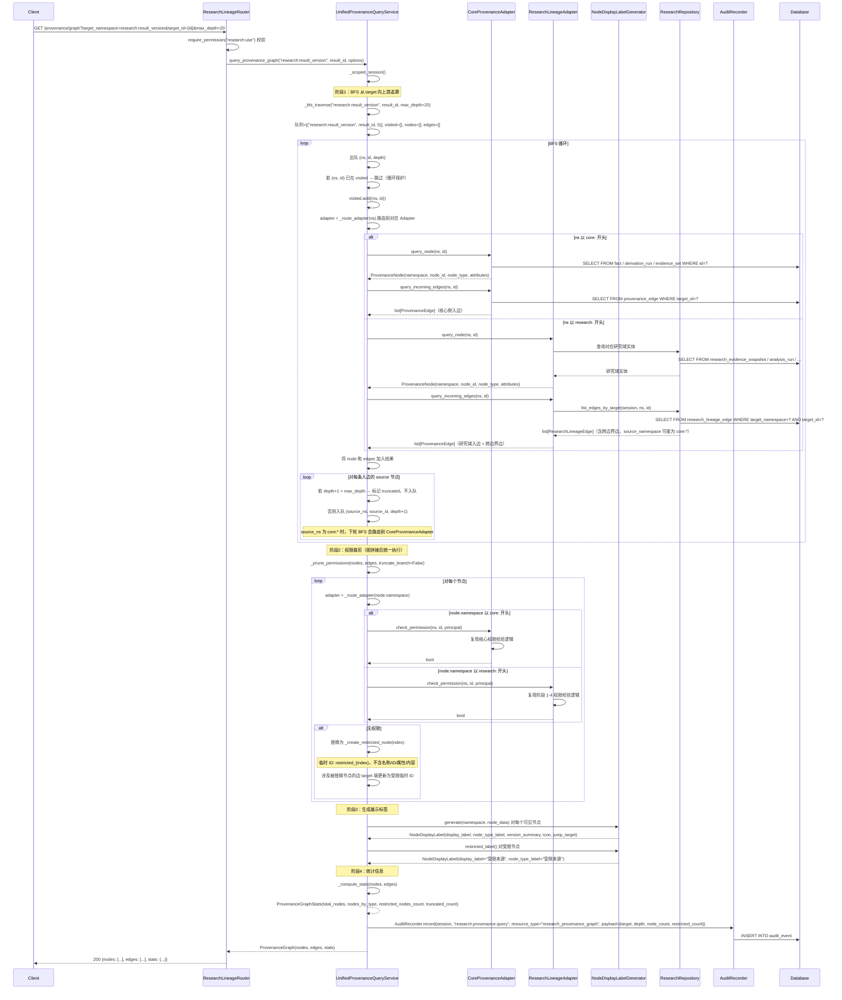
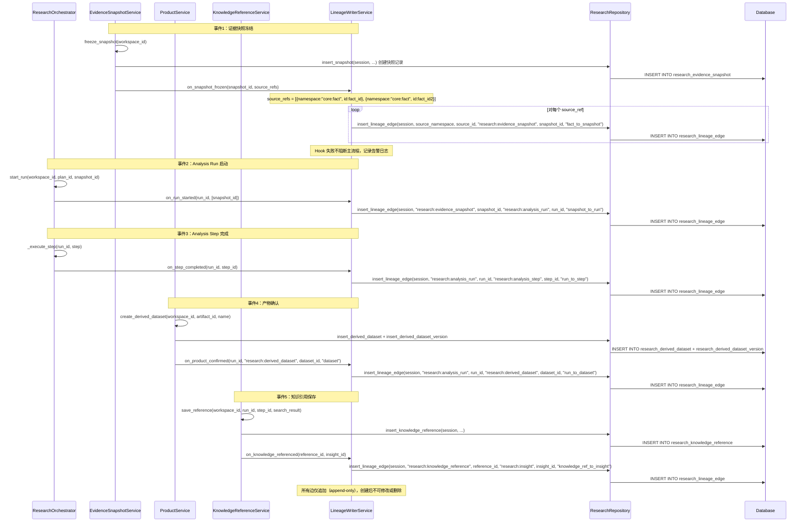
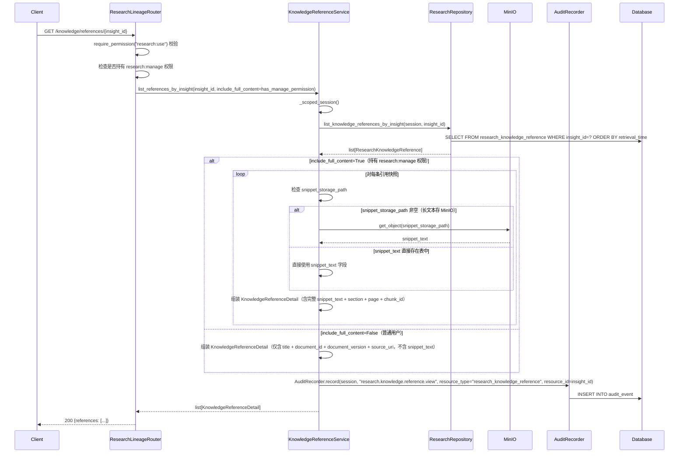
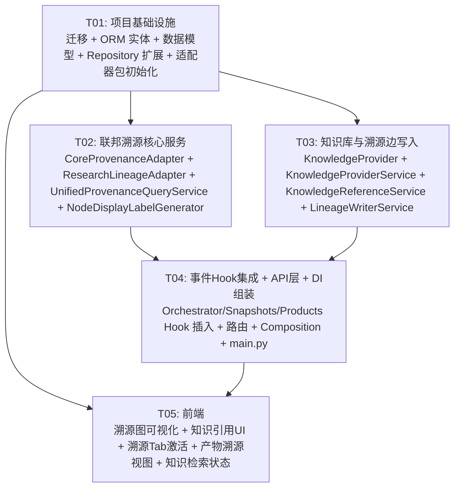

# 架构设计：统一溯源与知识接口（子项目 5）

> **项目名称**: irip_research_lineage

> **技术栈**: 后端 Python 3.12+ / FastAPI / SQLAlchemy(异步) / PostgreSQL 16(pgvector) / Redis 7 / Celery；前端 React 18 + TS / Vite / Ant Design 5 / TanStack Router+Query / AntV G6

> **日期**: 2026-08-06

> **状态**: 评审稿

> **依赖基线**: 阶段 1"研究域基础" + 阶段 2"可信执行" + 阶段 3"研究产物" + 阶段 4"发布与复用"已完成并上线（`docs/prd-research-foundation.md` / `docs/arch-research-foundation.md` / `docs/prd-research-trusted-execution.md` / `docs/arch-research-trusted-execution.md` / `docs/prd-research-products.md` / `docs/arch-research-products.md` / `docs/prd-research-publish.md` / `docs/arch-research-publish.md`）

> **关联 PRD**: `docs/prd-research-lineage.md`

---

## 目录

- [1. 实现方案与框架选型](#1-实现方案与框架选型)
  - [1.1 技术挑战分析](#11-技术挑战分析)
  - [1.2 框架选型](#12-框架选型)
  - [1.3 架构模式](#13-架构模式)
  - [1.4 模块隔离策略](#14-模块隔离策略)
- [2. 文件列表及相对路径](#2-文件列表及相对路径)
  - [2.1 后端新增文件](#21-后端新增文件)
  - [2.2 后端修改文件](#22-后端修改文件)
  - [2.3 前端新增文件](#23-前端新增文件)
  - [2.4 前端修改文件](#24-前端修改文件)
- [3. 数据结构和接口（类图）](#3-数据结构和接口类图)
- [4. 程序调用流程（时序图）](#4-程序调用流程时序图)
- [5. 任务列表（有序，含依赖关系）](#5-任务列表有序含依赖关系)
- [6. 依赖包列表](#6-依赖包列表)
- [7. 共享知识（跨文件约定）](#7-共享知识跨文件约定)
- [8. 待明确事项](#8-待明确事项)

---

## 1. 实现方案与框架选型

### 1.1 技术挑战分析

| 挑战 | 难点 | 方案 |
|------|------|------|
| **联邦溯源图拼接** | UnifiedProvenanceQueryService 需协调 CoreProvenanceAdapter（只读核心 Provenance 节点）和 ResearchLineageAdapter（只读研究域 Lineage 节点 + research_lineage_edge），跨边界边（如 `core:fact:<id> → research:evidence_snapshot:<id>`）需正确识别并跨越，拼接为完整 DAG | 采用 BFS 从 target 向上游追溯：队列初始化 → 已访问集合（循环保护）→ 根据 namespace 路由到对应 Adapter → Adapter.query_node + query_incoming_edges → 入边 source 节点入队 → 跨边界边由 ResearchLineageAdapter 返回（source_namespace 为 `core:*` 时自动路由到 CoreProvenanceAdapter 继续追溯）。深度限制默认 20 层，超出标记为"已截断" |
| **循环保护与深度限制** | 溯源图中可能存在环路（如 A → B → A），需防止无限递归；同时需限制最大追溯深度防止性能问题 | BFS 过程维护 `visited: set[tuple[str, UUID]]` 已访问集合（namespace + node_id），遇到已访问节点跳过该分支；深度计数器 `depth` 随队列传递，`depth + 1 > max_depth` 时不入队并在结果中标记为 `truncated=True`。默认 `max_depth=20`，前端展示默认 5 层可展开更多 |
| **权限裁剪与受限占位** | 图拼接后需统一对每个节点校验 principal 权限，无权节点替换为不含名称/ID/属性/内容的 RestrictedNode。权限策略支持 truncate_branch 截断分支。权限裁剪在图拼接后统一执行（不在递归中提前判断，避免权限检查次数过多） | `UnifiedProvenanceQueryService._prune_permissions()` 在 BFS 完成后遍历全部节点 → 路由到对应 Adapter.check_permission → 无权节点生成临时 ID `restricted_{index}`（每次查询重新生成，不可枚举）→ 替换为 `{node_type: "restricted", display_label: "受限来源", attributes: {}}` → 涉及被替换节点的边 target 端更新为受限临时 ID。truncate_branch 模式下递归移除被截断节点的全部上游分支 |
| **溯源边补充创建（事件驱动 Hook）** | 阶段 4 仅在发布时创建了部分溯源边（workspace→result, products→result）。阶段 5 需在关键事件（快照冻结/Run启动/步骤完成/产物确认/知识引用）补充创建溯源边，且不修改阶段 1-4 已上线核心代码 | `LineageWriterService` 封装溯源边写入逻辑，通过 Event Hook 在已有流程关键节点插入调用。Hook 点：(1) `EvidenceSnapshotService.freeze_snapshot()` 后调用 `on_snapshot_frozen()` 创建 fact→snapshot 跨边界边；(2) `ResearchOrchestrator.start_run()` 后调用 `on_run_started()` 创建 snapshot→run 边；(3) 步骤完成后创建 run→step 边；(4) `ProductService.create_*()` 后创建 run→product 边；(5) 知识引用保存时创建 knowledge_ref→insight 边。Hook 为可选调用（失败不阻断主流程，记录告警日志） |
| **KnowledgeProvider 只读接入合同** | 外部知识库的只读检索接口合同需返回 document_id / document_version / title / section / page / chunk_id / relevance_score / source_uri / content_hash / snippet。检索时仅发送研究问题和关键词（不发送 Fact 原始数据）。Provider 不可用时按降级策略处理 | `KnowledgeProvider` 定义为 Python Protocol（`search` / `get_document` / `health_check`）。`KnowledgeProviderService` 编排多 Provider 并行检索 + 合并去重（按 content_hash）。`MockKnowledgeProvider` 用于测试。ContextRouter 标记知识库检索步骤为 `keyword_only` 模式。降级策略：非必要步骤降级为仅数据分析并标注，必要步骤失败 |
| **知识引用快照保存** | 模型引用知识库时保存被实际引用的段落快照（snippet_text）、文档版本和哈希，确保外部知识库更新后已发布 Insight 仍能解释当时依据。短文本(≤4KB)直接存 PostgreSQL，长文本(>4KB)存 MinIO | `KnowledgeReferenceService.save_reference()` 编排快照保存：判断 snippet_text 长度 → 短文本直接存 `research_knowledge_reference.snippet_text` → 长文本存 MinIO 路径 `research/knowledge_refs/{workspace_id}/{run_id}/{reference_id}.json` → 记录 snippet_storage_path → 同时创建溯源边 knowledge_ref→insight（通过 LineageWriterService）。单条快照限制 64KB（超出截断并标注） |
| **溯源图可视化** | 溯源图需以 DAG 可视化展示（节点 + 有向边），支持层次布局、折叠/展开、深度控制、搜索高亮、导出（PNG/JSON），且需处理受限占位节点。需选择合适的前端图可视化库 | 采用 AntV G6（与 Ant Design 生态一致，原生支持 DAG 层次布局和大规模图渲染）。`ProvenanceGraphView` 封装 G6 实例，节点按类型着色（Fact 深蓝/Snapshot 浅蓝/Run 绿色/Dataset 蓝色/View 青色/Insight 橙色/ResultVersion 紫色/KnowledgeRef 紫色/Restricted 灰色），可见节点可点击跳转，受限节点不可点击 |
| **节点命名空间与展示标签** | 不同模块 UUID 可能语义冲突，需使用命名空间 ID（如 `core:fact:<id>`、`research:evidence_snapshot:<id>`）。每个节点需生成统一展示标签（display_label / node_type_label / version_summary） | `NodeDisplayLabelGenerator` 静态工具类，按命名空间映射到类型标签和图标。命名空间前缀 `core:` 路由到 CoreProvenanceAdapter，`research:` 路由到 ResearchLineageAdapter。受限节点统一返回 `display_label: "受限来源"` |

### 1.2 框架选型

| 层 | 技术 | 说明 |
|----|------|------|
| 后端框架 | FastAPI + SQLAlchemy 异步 | 延续阶段 1-4 模式 |
| ORM 类型 | `Mapped[] + mapped_column()` + `GUID` / `UTCDateTime` / `JSONB` | 延续 `packages/common/db_types.py` |
| Service 模式 | `ScopedSessionMixin` + `session_factory / department_id / actor_id` | 延续 `packages/facts/service.py` |
| Repository 模式 | 静态方法，操作 session | 延续 `packages/research/repository.py` |
| DI 模式 | Composition Root + provider `register(ctx)` | 延续 `apps/api/composition/` |
| 权限 | `require_permission("research:use")` / `require_permission("research:manage")` 依赖 | 延续阶段 1-4（阶段 5 不新增权限点） |
| 审计 | `AuditRecorder.record(session, event)` 静态方法 | 延续 `packages/audit/repository.py` |
| 迁移 | Alembic `op.execute()` 原生 SQL，编号 0078 | 延续 `migrations/versions/`（阶段 4 为 0077） |
| Protocol 接口 | Python `typing.Protocol`（PEP 544） | KnowledgeProvider / CoreProvenanceAdapter / ResearchLineageAdapter 均为 Protocol |
| 对象存储 | MinIO（S3Repository） | 知识引用快照长文本存储 |
| 前端框架 | React 18 + Vite + Ant Design 5 | 延续 `apps/web/` |
| 前端图可视化 | **AntV G6 5.x** | **新增依赖**。溯源图 DAG 可视化（层次布局 + 节点交互 + 大规模图渲染） |
| 前端数据 | Axios `http` 实例 + 纯 async 函数 | 延续 `apps/web/src/api/client.ts` |

**新增第三方依赖**：

| 包 | 版本 | 用途 |
|----|------|------|
| `@antv/g6` | ^5.0.0 | 溯源图 DAG 可视化（层次布局 / 力导向布局 / 节点交互 / 折叠展开） |

其余功能完全使用现有技术栈实现。

### 1.3 架构模式

延续阶段 1-4 的 **ScopedSessionMixin + Composition Root** 模式，新增服务遵循同样的依赖注入模式：

- **Service 层**：`UnifiedProvenanceQueryService` / `KnowledgeReferenceService` / `KnowledgeProviderService` / `LineageWriterService` 继承 `ScopedSessionMixin` 或独立封装
- **Adapter 模式**：`CoreProvenanceAdapter` 和 `ResearchLineageAdapter` 为只读适配器，分别封装核心域和研究域的节点查询和权限校验，不暴露各自域的 DB session
- **Protocol 模式**：`KnowledgeProvider` / `CoreProvenanceAdapter` / `ResearchLineageAdapter` 定义为 `typing.Protocol`，实现类通过 DI 注入
- **Strategy 模式**：`NodeDisplayLabelGenerator` 静态工具类，按命名空间生成展示标签
- **Event Hook 模式**：`LineageWriterService` 提供事件钩子方法（`on_snapshot_frozen` / `on_run_started` / `on_step_completed` / `on_product_confirmed` / `on_knowledge_referenced`），在已有流程关键节点插入调用，Hook 失败不阻断主流程

### 1.4 模块隔离策略

延续阶段 1-4 原则：
- 新增 1 张表以 `research_` 前缀命名：`research_knowledge_reference`
- `research_lineage_edge` 表结构不变（阶段 4 已创建），阶段 5 新增 edge_type `knowledge_ref_to_insight` 并补充数据
- 研究表之间 FK 允许保留（`research_knowledge_reference.workspace_id → research_workspace.id ON DELETE CASCADE` 等）
- 跨模块引用保存为逻辑引用（命名空间 + UUID），不建数据库级 FK
- `CoreProvenanceAdapter` 只读查询核心表，不产生 INSERT/UPDATE/DELETE，不暴露核心 DB session
- 迁移编号延续 `0078`（阶段 1 为 `0074`，阶段 2 为 `0075`，阶段 3 为 `0076`，阶段 4 为 `0077`）
- 关闭 `RESEARCH_MODULE_ENABLED` 后研究 API 路由不注册，原系统正常
- 阶段 5 不新增权限点，复用 `research:use` / `research:manage`（知识引用快照完整查看需 `research:manage`）
- `LineageWriterService` 的 Event Hook 为可选调用，失败时记录告警日志不阻断主流程

---

## 2. 文件列表及相对路径

### 2.1 后端新增文件

| # | 文件路径 | 职责 |
|---|---------|------|
| 1 | `packages/research/provenance.py` | **UnifiedProvenanceQueryService** — 联邦溯源图查询编排（BFS 追溯 + 跨边界边拼接 + 循环保护 + 深度限制 + 权限裁剪 + 展示标签生成 + 统计信息） |
| 2 | `packages/research/adapters/__init__.py` | 适配器包初始化 |
| 3 | `packages/research/adapters/core_provenance.py` | **CoreProvenanceAdapter** — 只读核心 Provenance 适配器（查询 Fact / DerivationRun / EvidenceSet 节点 + 入边 + 权限校验，不修改核心表） |
| 4 | `packages/research/adapters/research_lineage.py` | **ResearchLineageAdapter** — 只读研究 Lineage 适配器（查询 EvidenceSnapshot / AnalysisRun / Step / DerivedDataset / View / Insight / ResultVersion / Workspace / KnowledgeReference 节点 + research_lineage_edge 入边 + 权限校验） |
| 5 | `packages/research/knowledge.py` | **KnowledgeProviderService** — 知识库检索编排（多 Provider 并行检索 + 合并去重 + 降级处理） |
| 6 | `packages/research/knowledge_provider.py` | **KnowledgeProvider Protocol** + **MockKnowledgeProvider** — 外部知识库只读检索接口合同 + 测试用 Mock 实现 |
| 7 | `packages/research/knowledge_reference.py` | **KnowledgeReferenceService** — 知识引用快照管理（保存引用快照 + 查看快照列表 + 快照详情 + 权限控制） |
| 8 | `packages/research/lineage_writer.py` | **LineageWriterService** — 溯源边写入（事件驱动 Hook：快照冻结/Run启动/步骤完成/产物确认/知识引用时创建溯源边） |
| 9 | `packages/research/node_labels.py` | **NodeDisplayLabelGenerator** — 节点展示标签生成（命名空间 → 类型标签 + 图标 + 跳转目标映射） |
| 10 | `apps/api/routers/research_lineage.py` | API 路由：联邦溯源查询 + 便捷端点 + 单节点查询 + 知识库检索 + 知识引用快照 + 溯源导出 全部端点 |
| 11 | `apps/api/composition/research_lineage.py` | Composition provider：溯源与知识域依赖注入注册 |

### 2.2 后端修改文件

| # | 文件路径 | 修改内容 |
|---|---------|---------|
| 12 | `migrations/versions/0078_research_lineage.py` | Alembic 迁移：创建 1 张新表 `research_knowledge_reference` + 索引 + 约束；研究 `research_lineage_edge` 表新增 edge_type `knowledge_ref_to_insight`（通过注释/应用层保证，表结构不变） |
| 13 | `packages/research/entities.py` | 新增 1 个 ORM 实体：`ResearchKnowledgeReference` |
| 14 | `packages/research/models.py` | 新增 dataclass：`ProvenanceNode` / `ProvenanceEdge` / `ProvenanceGraph` / `RestrictedNode` / `KnowledgeSearchResult` / `KnowledgeDocument` / `KnowledgeSearchOptions` / `KnowledgeReferenceRef` / `KnowledgeReferenceDetail` / `NodeDisplayLabel` / `ProvenanceGraphStats` / `ProvenanceQueryOptions` 等 |
| 15 | `packages/research/repository.py` | 扩展 `ResearchRepository` 新增方法：knowledge_reference CRUD / lineage_edge 按 source 和 target 查询（含跨边界边）/ knowledge_reference 按 insight_id 和 run_id 查询 |
| 16 | `packages/research/orchestrator.py` | (1) `start_run()` 后调用 `LineageWriterService.on_run_started()` 创建 snapshot→run 边；(2) `_execute_step()` 完成后调用 `on_step_completed()` 创建 run→step 边；(3) 知识库检索步骤中调用 `KnowledgeProviderService` 检索并保存 `KnowledgeReference`；(4) 知识引用保存后调用 `on_knowledge_referenced()` 创建 knowledge_ref→insight 边 |
| 17 | `packages/research/snapshots.py` | `EvidenceSnapshotService.freeze_snapshot()` 完成后调用 `LineageWriterService.on_snapshot_frozen()` 创建 fact→snapshot 跨边界边（source_namespace 为 `core:fact` 或 `research:published_derived`） |
| 18 | `packages/research/products.py` | `ProductService.create_derived_dataset()` / `create_view()` / `create_insight_from_accept()` / `create_insight_from_modify()` 完成后调用 `LineageWriterService.on_product_confirmed()` 创建 run→product 溯源边 |
| 19 | `apps/api/main.py` | 条件注册 `research_lineage_router` |
| 20 | `apps/api/composition/__init__.py` | `register_all()` 中条件调用 `register_research_lineage(ctx)` |

### 2.3 前端新增文件

| # | 文件路径 | 职责 |
|---|---------|------|
| 21 | `apps/web/src/features/research/ProvenanceGraphView.tsx` | 联邦溯源图可视化组件（AntV G6 封装：DAG 层次布局 / 节点交互 / 折叠展开 / 深度控制 / 搜索高亮） |
| 22 | `apps/web/src/features/research/ProvenanceNodeCard.tsx` | 溯源节点卡片（类型标签 + 名称 + 版本摘要 + 跳转链接） |
| 23 | `apps/web/src/features/research/RestrictedNodeCard.tsx` | 受限占位节点卡片（"🔒 受限来源"，不可点击） |
| 24 | `apps/web/src/features/research/ProvenanceControls.tsx` | 溯源图控制栏（深度选择 / 布局切换 / 搜索框 / 导出 PNG/JSON） |
| 25 | `apps/web/src/features/research/ProvenanceStats.tsx` | 节点统计摘要（总节点数 / 各类型节点数 / 受限节点数） |
| 26 | `apps/web/src/features/research/ResultProvenanceTab.tsx` | 成果详情页溯源 Tab（激活）：调用溯源图查询 API + 渲染 ProvenanceGraphView + 控制栏 + 统计 |
| 27 | `apps/web/src/features/research/ProductProvenanceSection.tsx` | 产物溯源视图（Workspace 内）：产物详情页中的"数据溯源"区域 |
| 28 | `apps/web/src/features/research/KnowledgeReferenceList.tsx` | 知识引用快照列表组件（Insight 详情中展示关联的 KnowledgeReference） |
| 29 | `apps/web/src/features/research/KnowledgeReferenceCard.tsx` | 知识引用快照卡片（文档标题 / 版本 / 检索时间 / 来源 / 引用段落文本 / 位置信息 / content_hash / 来源链接） |
| 30 | `apps/web/src/features/research/KnowledgeSearchStatus.tsx` | 知识库检索覆盖声明组件（右栏 AI 助手覆盖声明区新增"知识库检索"状态） |
| 31 | `apps/web/src/api/researchLineage.ts` | 溯源和知识库相关 API 函数：溯源图查询 / 便捷端点 / 单节点查询 / 知识库检索 / 知识引用快照 / 溯源导出 全部端点 |

### 2.4 前端修改文件

| # | 文件路径 | 修改内容 |
|---|---------|---------|
| 32 | `apps/web/src/features/research/ResultDetailView.tsx` | 阶段 4 预留的"溯源"Tab 激活为 `ResultProvenanceTab` 组件 |
| 33 | `apps/web/src/features/research/ProductDetailView.tsx` | 新增"数据溯源"区域，集成 `ProductProvenanceSection` |
| 34 | `apps/web/src/features/research/InsightDetailView.tsx` | 新增知识引用快照区域，集成 `KnowledgeReferenceList` |
| 35 | `apps/web/src/features/research/AiAssistantPanel.tsx` | 覆盖声明区新增 `KnowledgeSearchStatus` 组件（知识库检索状态） |

---

## 3. 数据结构和接口（类图）

### 3.1 类图（Mermaid）

```mermaid
classDiagram
    direction TB

    %% ===== 新增 ORM 实体 =====

    class ResearchKnowledgeReference {
        +UUID id
        +UUID workspace_id
        +UUID run_id
        +UUID step_id
        +UUID insight_id
        +str document_id
        +str document_version
        +str title
        +str section
        +int page
        +str chunk_id
        +str snippet_text
        +str snippet_storage_path
        +str content_hash
        +str source_uri
        +datetime retrieval_time
        +str provider_name
        +str research_question_context
        +datetime created_at
    }

    %% ===== 阶段 4 已有实体（引用） =====

    class ResearchLineageEdge {
        +UUID id
        +str source_namespace
        +UUID source_id
        +int source_version
        +str target_namespace
        +UUID target_id
        +int target_version
        +str edge_type
        +datetime created_at
    }

    class ResearchWorkspace {
        +UUID id
        +UUID owner_user_id
        +str status
    }

    class ResearchAnalysisRun {
        +UUID id
        +str status
    }

    class ResearchAnalysisStep {
        +UUID id
        +UUID run_id
        +str step_key
    }

    class ResearchInsight {
        +UUID id
        +UUID workspace_id
        +int current_version
    }

    class ResearchEvidenceSnapshot {
        +UUID id
        +str content_hash
        +dict permission_envelope
        +list source_refs
    }

    class ResearchResultVersion {
        +UUID id
        +UUID result_id
        +int version_number
        +str title
    }

    ResearchKnowledgeReference --> ResearchWorkspace : workspace_id
    ResearchKnowledgeReference --> ResearchAnalysisRun : run_id
    ResearchKnowledgeReference --> ResearchAnalysisStep : step_id (nullable)
    ResearchKnowledgeReference --> ResearchInsight : insight_id (nullable, 逻辑引用)
    ResearchLineageEdge --> ResearchKnowledgeReference : source_id (source_namespace=research:knowledge_reference, edge_type=knowledge_ref_to_insight)

    %% ===== Protocol 接口 =====

    class KnowledgeProvider {
        <<interface>>
        +search(query, options) list~KnowledgeSearchResult~
        +get_document(document_id) KnowledgeDocument
        +health_check() bool
    }

    class CoreProvenanceAdapter {
        <<interface>>
        +query_node(namespace, node_id) ProvenanceNode
        +query_incoming_edges(namespace, node_id) list~ProvenanceEdge~
        +check_permission(namespace, node_id, principal) bool
    }

    class ResearchLineageAdapter {
        <<interface>>
        +query_node(namespace, node_id) ProvenanceNode
        +query_incoming_edges(namespace, node_id) list~ProvenanceEdge~
        +check_permission(namespace, node_id, principal) bool
    }

    %% ===== Service 层 =====

    class UnifiedProvenanceQueryService {
        +async_sessionmaker _factory
        +UUID _dept_id
        +UUID _actor_id
        +CoreProvenanceAdapter _core_adapter
        +ResearchLineageAdapter _research_adapter
        +NodeDisplayLabelGenerator _label_gen
        +__init__(factory, dept_id, actor_id, core_adapter, research_adapter)
        +query_provenance_graph(target_namespace, target_id, options) ProvenanceGraph
        +query_node_detail(namespace, node_id) ProvenanceNode
        +_route_adapter(namespace) CoreProvenanceAdapter|ResearchLineageAdapter
        +_bfs_traverse(target_namespace, target_id, max_depth) tuple
        +_prune_permissions(nodes, edges, principal) tuple
        +_generate_display_labels(nodes) list
        +_compute_stats(nodes, edges) ProvenanceGraphStats
        +_create_restricted_node(index) RestrictedNode
    }

    class CoreProvenanceAdapterImpl {
        +async_sessionmaker _factory
        +__init__(factory)
        +query_node(namespace, node_id) ProvenanceNode
        +query_incoming_edges(namespace, node_id) list~ProvenanceEdge~
        +check_permission(namespace, node_id, principal) bool
        +_query_fact(fact_id) ProvenanceNode
        +_query_derivation_run(run_id) ProvenanceNode
        +_query_evidence_set(evidence_set_id) ProvenanceNode
        +_query_fact_incoming_edges(fact_id) list~ProvenanceEdge~
        +_query_derivation_run_incoming_edges(run_id) list~ProvenanceEdge~
        +_check_fact_permission(fact_id, principal) bool
        +_check_derivation_run_permission(run_id, principal) bool
    }

    class ResearchLineageAdapterImpl {
        +async_sessionmaker _factory
        +__init__(factory)
        +query_node(namespace, node_id) ProvenanceNode
        +query_incoming_edges(namespace, node_id) list~ProvenanceEdge~
        +check_permission(namespace, node_id, principal) bool
        +_query_evidence_snapshot(snapshot_id) ProvenanceNode
        +_query_analysis_run(run_id) ProvenanceNode
        +_query_analysis_step(step_id) ProvenanceNode
        +_query_derived_dataset(dataset_id) ProvenanceNode
        +_query_derived_dataset_version(dataset_id, version_number) ProvenanceNode
        +_query_view(view_id) ProvenanceNode
        +_query_view_version(view_id, version_number) ProvenanceNode
        +_query_insight(insight_id) ProvenanceNode
        +_query_insight_version(insight_id, version_number) ProvenanceNode
        +_query_result_version(result_id, version_number) ProvenanceNode
        +_query_workspace(workspace_id) ProvenanceNode
        +_query_knowledge_reference(reference_id) ProvenanceNode
        +_check_evidence_snapshot_permission(snapshot_id, principal) bool
        +_check_analysis_run_permission(run_id, principal) bool
        +_check_product_permission(namespace, node_id, principal) bool
        +_check_result_version_permission(result_id, version_number, principal) bool
        +_check_knowledge_reference_permission(reference_id, principal) bool
    }

    class KnowledgeProviderService {
        +dict _providers
        +async_sessionmaker _factory
        +__init__(factory, providers)
        +search(query, options, provider_names) list~KnowledgeSearchResult~
        +search_all(query, options) list~KnowledgeSearchResult~
        +get_document(document_id, provider_name) KnowledgeDocument
        +health_check_all() dict
        +_merge_and_deduplicate(results) list~KnowledgeSearchResult~
        +_handle_provider_error(provider_name, error, is_required) KnowledgeSearchResult
    }

    class MockKnowledgeProvider {
        +str provider_name
        +__init__(provider_name)
        +search(query, options) list~KnowledgeSearchResult~
        +get_document(document_id) KnowledgeDocument
        +health_check() bool
    }

    class KnowledgeReferenceService {
        +async_sessionmaker _factory
        +UUID _dept_id
        +UUID _actor_id
        +LineageWriterService _lineage_writer
        +S3Repository _s3
        +__init__(factory, dept_id, actor_id, lineage_writer, s3)
        +save_reference(workspace_id, run_id, step_id, search_result, research_question_context) KnowledgeReferenceRef
        +list_references_by_insight(insight_id, include_full_content) list~KnowledgeReferenceDetail~
        +list_references_by_run(run_id, step_id) list~KnowledgeReferenceRef~
        +get_reference(reference_id, include_full_content) KnowledgeReferenceDetail
        +_store_snippet(reference_id, snippet_text, workspace_id, run_id) str
        +_retrieve_snippet(snippet_storage_path) str
        +_truncate_snippet(snippet_text) str
    }

    class LineageWriterService {
        +async_sessionmaker _factory
        +__init__(factory)
        +on_snapshot_frozen(snapshot_id, source_refs) void
        +on_run_started(run_id, snapshot_ids) void
        +on_step_completed(run_id, step_id) void
        +on_product_confirmed(run_id, product_namespace, product_id, product_type) void
        +on_knowledge_referenced(reference_id, insight_id) void
        +record_edge(source_namespace, source_id, target_namespace, target_id, edge_type, source_version, target_version) void
        +list_edges_by_source(source_namespace, source_id) list~LineageEdgeRef~
        +list_edges_by_target(target_namespace, target_id) list~LineageEdgeRef~
    }

    class NodeDisplayLabelGenerator {
        <<static>>
        +generate(namespace, node_data) NodeDisplayLabel
        +get_type_label(namespace) str
        +get_icon(namespace) str
        +get_jump_target(namespace, node_id) str
        +restricted_label() NodeDisplayLabel
    }

    %% ===== 关系 =====

    CoreProvenanceAdapterImpl ..|> CoreProvenanceAdapter
    ResearchLineageAdapterImpl ..|> ResearchLineageAdapter
    MockKnowledgeProvider ..|> KnowledgeProvider
    UnifiedProvenanceQueryService --> CoreProvenanceAdapter : 协调核心域
    UnifiedProvenanceQueryService --> ResearchLineageAdapter : 协调研究域
    UnifiedProvenanceQueryService --> NodeDisplayLabelGenerator : 生成展示标签
    KnowledgeProviderService --> KnowledgeProvider : 编排多 Provider
    KnowledgeReferenceService --> LineageWriterService : 创建溯源边
    KnowledgeReferenceService --> S3Repository : 长文本快照存储
    LineageWriterService --> ResearchRepository : 写入 research_lineage_edge

    %% ===== 值对象 =====

    class ProvenanceNode {
        +str namespace
        +UUID node_id
        +int version
        +str node_type
        +NodeDisplayLabel display_label
        +dict attributes
        +bool is_restricted
    }

    class ProvenanceEdge {
        +str source_namespace
        +UUID source_id
        +int source_version
        +str target_namespace
        +UUID target_id
        +int target_version
        +str edge_type
        +str edge_type_label
    }

    class ProvenanceGraph {
        +list~ProvenanceNode~ nodes
        +list~ProvenanceEdge~ edges
        +ProvenanceGraphStats stats
    }

    class RestrictedNode {
        +str node_type
        +str display_label
        +dict attributes
        +str temp_id
    }

    class ProvenanceGraphStats {
        +int total_nodes
        +dict nodes_by_type
        +int restricted_nodes_count
        +int truncated_count
    }

    class ProvenanceQueryOptions {
        +int max_depth
        +bool truncate_branch
        +str layout
    }

    class NodeDisplayLabel {
        +str display_label
        +str node_type_label
        +str version_summary
        +str namespace
        +str icon
        +str jump_target
    }

    class KnowledgeSearchResult {
        +str document_id
        +str document_version
        +str title
        +str section
        +int page
        +str chunk_id
        +float relevance_score
        +str source_uri
        +str content_hash
        +str snippet
    }

    class KnowledgeDocument {
        +str document_id
        +str document_version
        +str title
        +str source_uri
    }

    class KnowledgeSearchOptions {
        +int max_results
        +list filter_tags
        +int timeout
    }

    class KnowledgeReferenceRef {
        +UUID reference_id
        +UUID workspace_id
        +UUID run_id
        +UUID step_id
        +UUID insight_id
        +str document_id
        +str document_version
        +str title
        +str content_hash
        +str source_uri
        +datetime retrieval_time
        +str provider_name
    }

    class KnowledgeReferenceDetail {
        +KnowledgeReferenceRef ref
        +str snippet_text
        +str section
        +int page
        +str chunk_id
        +str research_question_context
    }

    class LineageEdgeRef {
        +str source_namespace
        +UUID source_id
        +int source_version
        +str target_namespace
        +UUID target_id
        +int target_version
        +str edge_type
    }
```

### 3.2 ORM 实体详细定义

#### 3.2.1 ResearchKnowledgeReference（`research_knowledge_reference`）

```python
class ResearchKnowledgeReference(Base):
    __tablename__ = "research_knowledge_reference"

    id: Mapped[UUID] = mapped_column(GUID, primary_key=True, default=new_id)
    workspace_id: Mapped[UUID] = mapped_column(
        GUID, sa.ForeignKey("research_workspace.id", ondelete="CASCADE"), nullable=False
    )
    run_id: Mapped[UUID] = mapped_column(
        GUID, sa.ForeignKey("research_analysis_run.id"), nullable=False
    )
    step_id: Mapped[UUID | None] = mapped_column(
        GUID, sa.ForeignKey("research_analysis_step.id"), nullable=True
    )
    insight_id: Mapped[UUID | None] = mapped_column(GUID, nullable=True)  # 逻辑引用 research_insight，不建 FK
    document_id: Mapped[str] = mapped_column(sa.Text, nullable=False)
    document_version: Mapped[str] = mapped_column(sa.Text, nullable=False)
    title: Mapped[str] = mapped_column(sa.Text, nullable=False)
    section: Mapped[str | None] = mapped_column(sa.Text, nullable=True)
    page: Mapped[int | None] = mapped_column(sa.Integer, nullable=True)
    chunk_id: Mapped[str | None] = mapped_column(sa.Text, nullable=True)
    snippet_text: Mapped[str | None] = mapped_column(sa.Text, nullable=True)  # ≤4KB 直接存储
    snippet_storage_path: Mapped[str | None] = mapped_column(sa.Text, nullable=True)  # >4KB 存 MinIO 路径
    content_hash: Mapped[str] = mapped_column(sa.Text, nullable=False)
    source_uri: Mapped[str] = mapped_column(sa.Text, nullable=False)
    retrieval_time: Mapped[datetime] = mapped_column(
        UTCDateTime, server_default=sa.func.now(), nullable=False
    )
    provider_name: Mapped[str] = mapped_column(sa.Text, nullable=False)
    research_question_context: Mapped[str | None] = mapped_column(sa.Text, nullable=True)
    created_at: Mapped[datetime] = mapped_column(
        UTCDateTime, server_default=sa.func.now(), nullable=False
    )
```

- **仅追加**：创建后不允许 UPDATE / DELETE（应用层保证）
- `insight_id`：逻辑引用 `research_insight.id`，不建数据库级 FK（Insight 可能为空——知识引用在 Run 执行时保存，此时 Insight 候选可能尚未接受为正式 Insight）
- `snippet_text`：引用段落文本，≤4KB 直接存储在表中；>4KB 存 MinIO，`snippet_storage_path` 记录路径
- `snippet_storage_path`：MinIO 路径格式 `research/knowledge_refs/{workspace_id}/{run_id}/{reference_id}.json`
- `content_hash`：引用段落文本的 SHA-256 哈希（64 字符十六进制）
- `research_question_context`：检索时的研究问题上下文（用于审计和解释当时检索意图）
- 索引：`(insight_id)`、`(run_id, step_id)`、`(document_id, document_version)`
- 单条快照限制 64KB（超出截断并在 `snippet_text` 末尾标注"[已截断]"）

### 3.3 接口与 Service 定义

#### UnifiedProvenanceQueryService（联邦溯源图查询编排）

```python
class UnifiedProvenanceQueryService(ScopedSessionMixin):
    """联邦式统一溯源查询服务。

    协调 CoreProvenanceAdapter 和 ResearchLineageAdapter，
    跨边界拼接为完整溯源图。

    查询流程（PRD 6.5 节）：
    1. 确定起始节点：根据 target_namespace 路由到对应 Adapter
    2. BFS 从 target 向上游追溯（循环保护 + 深度限制）
    3. 权限裁剪（图拼接后统一执行）
    4. 生成展示标签
    5. 统计信息
    6. 返回 ProvenanceGraph
    """

    def __init__(
        self,
        session_factory: async_sessionmaker,
        department_id: UUID,
        actor_id: UUID,
        core_adapter: CoreProvenanceAdapter,
        research_adapter: ResearchLineageAdapter,
    ):
        ...

    async def query_provenance_graph(
        self,
        target_namespace: str,
        target_id: UUID,
        options: ProvenanceQueryOptions | None = None,
    ) -> ProvenanceGraph:
        """查询联邦溯源图。

        1. 初始化 options（max_depth 默认 20, truncate_branch 默认 False）
        2. BFS 遍历：
           a. 队列 = [(target_namespace, target_id, depth=0)]
           b. visited = set()
           c. 循环直到队列为空：
              i.   出队 (ns, id, depth)
              ii.  若 (ns, id) 已在 visited → 跳过
              iii. 标记 visited.add((ns, id))
              iv.  adapter = _route_adapter(ns)
              v.   node = adapter.query_node(ns, id)
              vi.  edges = adapter.query_incoming_edges(ns, id)
              vii. 将 node 和 edges 加入结果
              viii.对每条入边的 source：
                   - 若 depth+1 > max_depth → 标记 truncated
                   - 否则入队 (source_ns, source_id, depth+1)
        3. 权限裁剪：
           a. 对每个节点校验 adapter.check_permission(ns, id, principal)
           b. 无权节点 → 替换为 RestrictedNode
           c. truncate_branch=True → 递归移除被截断节点的全部上游分支
        4. 生成展示标签（NodeDisplayLabelGenerator）
        5. 统计信息（total_nodes, nodes_by_type, restricted_nodes_count, truncated_count）
        6. 审计 research.provenance.query
        7. 返回 ProvenanceGraph
        """
        ...

    async def query_node_detail(
        self, namespace: str, node_id: UUID,
    ) -> ProvenanceNode:
        """查询单个溯源节点详情（校验权限）。"""
        ...

    def _route_adapter(self, namespace: str):
        """根据命名空间路由到对应 Adapter。core:* → CoreAdapter, research:* → ResearchAdapter"""
        ...

    async def _bfs_traverse(
        self, target_namespace: str, target_id: UUID, max_depth: int,
    ) -> tuple[list[ProvenanceNode], list[ProvenanceEdge], int]:
        """BFS 遍历，返回 (nodes, edges, truncated_count)。"""
        ...

    async def _prune_permissions(
        self, nodes: list, edges: list, truncate_branch: bool,
    ) -> tuple[list, list]:
        """权限裁剪，返回裁剪后的 (nodes, edges)。"""
        ...

    def _create_restricted_node(self, index: int) -> RestrictedNode:
        """生成受限占位节点（临时 ID: restricted_{index}）。"""
        ...
```

#### CoreProvenanceAdapterImpl（只读核心 Provenance 适配器）

```python
class CoreProvenanceAdapterImpl:
    """只读核心 Provenance 适配器。

    查询核心系统的 Fact、DerivationRun、EvidenceSet 等节点，
    不修改核心表，不暴露核心数据库会话。

    namespace 取值：core:fact / core:derivation_run / core:evidence_set
    """

    def __init__(self, session_factory: async_sessionmaker):
        self._factory = session_factory

    async def query_node(self, namespace: str, node_id: UUID) -> ProvenanceNode | None:
        """查询单个核心节点的展示信息（不返回内容数据）。"""
        ...

    async def query_incoming_edges(self, namespace: str, node_id: UUID) -> list[ProvenanceEdge]:
        """查询节点的入边（上游来源）。

        core:fact: 通常无上游（实验事实是溯源链的根）
        core:derivation_run: 上游为 EvidenceSet / EvidenceSetVersion
        core:evidence_set: 上游为其他 Fact 或 DerivationRun
        """
        ...

    async def check_permission(self, namespace: str, node_id: UUID, principal) -> bool:
        """校验 principal 对核心节点的访问权限（复用核心权限系统）。"""
        ...
```

#### ResearchLineageAdapterImpl（只读研究 Lineage 适配器）

```python
class ResearchLineageAdapterImpl:
    """只读研究 Lineage 适配器。

    查询研究域节点和溯源边（research_lineage_edge 表）。
    跨边界边（source_namespace 为 core:*）由本方法返回，
    统一服务根据 source_namespace 路由到 CoreProvenanceAdapter 继续追溯。

    namespace 取值：
    research:evidence_snapshot / research:analysis_run / research:analysis_step /
    research:derived_dataset / research:derived_dataset_version /
    research:view / research:view_version /
    research:insight / research:insight_version /
    research:result_version / research:workspace / research:knowledge_reference
    """

    def __init__(self, session_factory: async_sessionmaker):
        self._factory = session_factory

    async def query_node(self, namespace: str, node_id: UUID) -> ProvenanceNode | None:
        """查询单个研究域节点的展示信息。"""
        ...

    async def query_incoming_edges(self, namespace: str, node_id: UUID) -> list[ProvenanceEdge]:
        """查询节点的入边（上游来源）。

        从 research_lineage_edge 表查询 target_namespace + target_id 匹配的边。
        跨边界边（source_namespace 为 core:*）由本方法返回，
        统一服务根据 source_namespace 路由到 CoreProvenanceAdapter 继续追溯。
        """
        ...

    async def check_permission(self, namespace: str, node_id: UUID, principal) -> bool:
        """校验 principal 对研究域节点的访问权限。

        复用阶段 1-4 权限校验逻辑：
        - Evidence Snapshot: 校验源数据当前权限
        - Analysis Run: 校验 Workspace 归属或成果包 ACL
        - 产物: 校验成果包 ACL 或 Workspace 归属
        - 成果版本: 校验成果包 ACL
        - Knowledge Reference: 校验关联 Insight 的访问权限
        """
        ...
```

#### KnowledgeProvider Protocol + KnowledgeProviderService

```python
class KnowledgeProvider(Protocol):
    """外部知识库只读检索接口合同。

    研究模块不维护知识库内容，只消费只读接口。
    """

    async def search(
        self, query: str, options: KnowledgeSearchOptions | None = None,
    ) -> list[KnowledgeSearchResult]:
        """检索知识库。query 仅包含研究问题和用户确认的关键词。"""
        ...

    async def get_document(self, document_id: str) -> KnowledgeDocument | None:
        """获取文档元数据（不含全文内容）。"""
        ...

    async def health_check(self) -> bool:
        """健康检查。"""
        ...


class KnowledgeProviderService:
    """知识库检索编排服务。

    管理多个 KnowledgeProvider 实例，并行检索 + 合并去重 + 降级处理。
    """

    def __init__(
        self,
        session_factory: async_sessionmaker,
        providers: dict[str, KnowledgeProvider],  # {provider_name: provider_instance}
    ):
        ...

    async def search(
        self, query: str, options: KnowledgeSearchOptions | None,
        provider_names: list[str] | None = None,
    ) -> list[KnowledgeSearchResult]:
        """检索知识库（支持指定 provider 或全部 provider 并行检索）。

        1. 确定参与的 providers（指定 provider_names 或全部 enabled providers）
        2. 并行调用各 provider.search()（超时独立控制）
        3. 合并结果：按 relevance_score 排序，按 content_hash 去重
        4. 返回合并后的结果列表
        """
        ...

    async def search_all(
        self, query: str, options: KnowledgeSearchOptions | None,
    ) -> list[KnowledgeSearchResult]:
        """全部 enabled providers 并行检索。"""
        ...

    def _merge_and_deduplicate(
        self, results: list[list[KnowledgeSearchResult]],
    ) -> list[KnowledgeSearchResult]:
        """合并去重：按 relevance_score 排序，按 content_hash 去重。"""
        ...

    def _handle_provider_error(
        self, provider_name: str, error: Exception, is_required: bool,
    ) -> None:
        """Provider 错误处理：非必要降级标注，必要步骤失败。"""
        ...
```

#### KnowledgeReferenceService（知识引用快照管理）

```python
class KnowledgeReferenceService(ScopedSessionMixin):
    """知识引用快照管理服务。

    保存 AI 引用知识库时的段落快照、文档版本和哈希。
    快照创建后不可变。
    """

    def __init__(
        self,
        session_factory: async_sessionmaker,
        department_id: UUID,
        actor_id: UUID,
        lineage_writer: LineageWriterService,
        s3: S3Repository,
    ):
        ...

    async def save_reference(
        self,
        workspace_id: UUID,
        run_id: UUID,
        step_id: UUID | None,
        search_result: KnowledgeSearchResult,
        research_question_context: str | None = None,
    ) -> KnowledgeReferenceRef:
        """保存知识引用快照。

        1. 判断 snippet_text 长度：
           - ≤4KB → 直接存 snippet_text 字段
           - >4KB → 存 MinIO（research/knowledge_refs/{workspace_id}/{run_id}/{reference_id}.json）
           - >64KB → 截断至 64KB 并标注"[已截断]"
        2. 计算 content_hash（snippet_text SHA-256）
        3. 创建 research_knowledge_reference 记录（仅追加）
        4. 审计 research.knowledge.reference_saved
        5. 返回 KnowledgeReferenceRef
        """
        ...

    async def list_references_by_insight(
        self, insight_id: UUID, include_full_content: bool = False,
    ) -> list[KnowledgeReferenceDetail]:
        """查看 Insight 关联的知识引用快照列表。

        include_full_content=True 需要 research:manage 权限（返回完整 snippet_text）
        include_full_content=False 仅返回文档标题和来源链接（普通用户可见）
        """
        ...

    async def list_references_by_run(
        self, run_id: UUID, step_id: UUID | None = None,
    ) -> list[KnowledgeReferenceRef]:
        """按 Run（和可选 Step）查询知识引用快照列表。"""
        ...

    async def get_reference(
        self, reference_id: UUID, include_full_content: bool = False,
    ) -> KnowledgeReferenceDetail:
        """查看单个知识引用快照详情。

        include_full_content=True 需要 research:manage 权限
        """
        ...

    def _store_snippet(
        self, reference_id: UUID, snippet_text: str,
        workspace_id: UUID, run_id: UUID,
    ) -> str | None:
        """存储长文本快照到 MinIO，返回路径（或 None 表示直接存储在表中）。"""
        ...

    def _retrieve_snippet(self, snippet_storage_path: str) -> str:
        """从 MinIO 读取长文本快照。"""
        ...

    def _truncate_snippet(self, snippet_text: str) -> str:
        """截断至 64KB 并标注。"""
        ...
```

#### LineageWriterService（溯源边写入服务）

```python
class LineageWriterService:
    """溯源边写入服务。

    通过事件驱动 Hook 在关键事件中创建溯源边（仅追加）。
    Hook 为可选调用，失败时记录告警日志不阻断主流程。
    """

    def __init__(self, session_factory: async_sessionmaker):
        self._factory = session_factory

    async def on_snapshot_frozen(
        self, snapshot_id: UUID, source_refs: list[dict],
    ) -> None:
        """证据快照冻结时创建溯源边。

        对每个 source_ref 创建边：
        {source_namespace}:{source_id} → research:evidence_snapshot:{snapshot_id}
        edge_type: fact_to_snapshot（core:fact → research:evidence_snapshot）
                   或 published_derived_to_snapshot（research:published_derived → research:evidence_snapshot）
        """
        ...

    async def on_run_started(
        self, run_id: UUID, snapshot_ids: list[UUID],
    ) -> None:
        """Analysis Run 启动时创建溯源边。

        对每个 snapshot_id 创建边：
        research:evidence_snapshot:{snapshot_id} → research:analysis_run:{run_id}
        edge_type: snapshot_to_run
        """
        ...

    async def on_step_completed(
        self, run_id: UUID, step_id: UUID,
    ) -> None:
        """Analysis Step 完成时创建溯源边。

        research:analysis_run:{run_id} → research:analysis_step:{step_id}
        edge_type: run_to_step
        """
        ...

    async def on_product_confirmed(
        self, run_id: UUID, product_namespace: str,
        product_id: UUID, product_type: str,
    ) -> None:
        """产物确认时创建溯源边。

        research:analysis_run:{run_id} → {product_namespace}:{product_id}
        edge_type: run_to_dataset / run_to_view / run_to_insight
        """
        ...

    async def on_knowledge_referenced(
        self, reference_id: UUID, insight_id: UUID,
    ) -> None:
        """知识引用保存时创建溯源边。

        research:knowledge_reference:{reference_id} → research:insight:{insight_id}
        edge_type: knowledge_ref_to_insight
        """
        ...

    async def record_edge(
        self, source_namespace: str, source_id: UUID,
        target_namespace: str, target_id: UUID,
        edge_type: str,
        source_version: int | None = None,
        target_version: int | None = None,
    ) -> None:
        """记录单条溯源边（仅追加）。"""
        ...

    async def list_edges_by_source(
        self, source_namespace: str, source_id: UUID,
    ) -> list[LineageEdgeRef]:
        """按源节点查询溯源边。"""
        ...

    async def list_edges_by_target(
        self, target_namespace: str, target_id: UUID,
    ) -> list[LineageEdgeRef]:
        """按目标节点查询溯源边。"""
        ...
```

#### NodeDisplayLabelGenerator（节点展示标签生成器）

```python
class NodeDisplayLabelGenerator:
    """节点展示标签生成器（静态工具类）。

    按命名空间映射到类型标签、图标和跳转目标。
    """

    @staticmethod
    def generate(namespace: str, node_data: dict) -> NodeDisplayLabel:
        """生成节点展示标签。

        返回 NodeDisplayLabel(display_label, node_type_label, version_summary, namespace, icon, jump_target)
        """
        ...

    @staticmethod
    def get_type_label(namespace: str) -> str:
        """命名空间 → 类型标签映射。

        core:fact → "实验事实"
        core:derivation_run → "核心推导"
        core:evidence_set → "证据集"
        research:evidence_snapshot → "证据快照"
        research:analysis_run → "分析运行"
        research:analysis_step → "分析步骤"
        research:derived_dataset → "衍生数据"
        research:derived_dataset_version → "衍生数据版本"
        research:view → "图表"
        research:view_version → "图表版本"
        research:insight → "Insight"
        research:insight_version → "Insight 版本"
        research:result_version → "成果版本"
        research:workspace → "研究空间"
        research:knowledge_reference → "知识库引用"
        restricted → "受限来源"
        """
        ...

    @staticmethod
    def get_icon(namespace: str) -> str:
        """命名空间 → 图标映射（🔬 ⚙️ 📋 ▶️ 📊 📈 💡 📦 🏠 📚 🔒）。"""
        ...

    @staticmethod
    def get_jump_target(namespace: str, node_id: UUID) -> str | None:
        """命名空间 → 跳转目标 URL 映射（受限节点返回 None）。"""
        ...

    @staticmethod
    def restricted_label() -> NodeDisplayLabel:
        """生成受限占位节点的展示标签。"""
        ...
```

---

## 4. 程序调用流程（时序图）

### 4.1 联邦溯源图查询流程



### 4.2 溯源边补充创建流程（事件驱动 Hook）



### 4.3 知识库检索与引用快照保存流程

```mermaid
sequenceDiagram
    participant Orch as ResearchOrchestrator
    participant KPS as KnowledgeProviderService
    participant KP as KnowledgeProvider
    participant KRS as KnowledgeReferenceService
    participant LWS as LineageWriterService
    participant S3 as MinIO
    participant Rep as ResearchRepository
    participant A as AuditRecorder
    participant DB as Database

    Note over Orch: 知识库检索步骤（ContextRouter 标记 keyword_only 模式）
    Orch->>Orch: _execute_step(run_id, step) method=knowledge_search
    Note over Orch: query 仅包含研究问题和用户确认的关键词（不含 Fact 原始数据）

    Orch->>KPS: search(query=research_question + keywords, options, provider_names)
    KPS->>KPS: 确定参与的 providers

    par 并行调用各 Provider
        KPS->>KP: provider.search(query, options)
        KP-->>KPS: list[KnowledgeSearchResult]
    and
        KPS->>KP: provider2.search(query, options)
        KP-->>KPS: list[KnowledgeSearchResult]
    end

    alt Provider 检索失败
        KPS->>KPS: _handle_provider_error(provider_name, error, is_required)
        alt 非必要步骤
            KPS->>KPS: 降级为仅数据分析并标注"知识库不可用，已降级"
            KPS->>A: AuditRecorder.record("research.knowledge.provider_degraded")
        else 必要步骤
            KPS-->>Orch: 步骤标记为 failed
        end
    end

    KPS->>KPS: _merge_and_deduplicate(results) 按 relevance_score 排序，按 content_hash 去重
    KPS-->>Orch: list[KnowledgeSearchResult]

    Note over Orch: 将检索结果传递给后续 LLM 步骤作为上下文

    Note over Orch,KRS: 模型引用知识库段落时保存引用快照
    Orch->>KRS: save_reference(workspace_id, run_id, step_id, search_result, research_question_context)
    KRS->>KRS: _scoped_session()

    KRS->>KRS: 判断 snippet_text 长度
    alt snippet_text ≤ 4KB
        KRS->>KRS: 直接存 snippet_text 字段
    else snippet_text > 4KB 且 ≤ 64KB
        KRS->>S3: put_object("research/knowledge_refs/{ws_id}/{run_id}/{ref_id}.json", snippet_text)
        S3-->>KRS: 存储成功
        KRS->>KRS: snippet_storage_path = "research/knowledge_refs/..."
    else snippet_text > 64KB
        KRS->>KRS: _truncate_snippet(snippet_text) 截断至 64KB + 标注"[已截断]"
        KRS->>S3: put_object(...) 存储截断后文本
    end

    KRS->>KRS: 计算 content_hash = SHA-256(snippet_text)
    KRS->>Rep: insert_knowledge_reference(session, workspace_id, run_id, step_id, document_id, document_version, title, snippet_text, snippet_storage_path, content_hash, source_uri, retrieval_time, provider_name, research_question_context)
    Rep->>DB: INSERT INTO research_knowledge_reference
    Rep-->>KRS: ResearchKnowledgeReference(id)

    KRS->>LWS: on_knowledge_referenced(reference_id, insight_id)
    LWS->>Rep: insert_lineage_edge(session, "research:knowledge_reference", reference_id, "research:insight", insight_id, "knowledge_ref_to_insight")
    Rep->>DB: INSERT INTO research_lineage_edge

    KRS->>A: AuditRecorder.record(session, "research.knowledge.reference_saved", resource_type="research_knowledge_reference", resource_id=reference_id)
    A->>DB: INSERT INTO audit_event

    KRS-->>Orch: KnowledgeReferenceRef(reference_id, ...)
```



### 4.4 知识引用快照查看流程



---

## 5. 任务列表（有序，含依赖关系）

### 任务依赖图



**依赖说明**：
- T01 为地基，所有后续任务依赖它（ORM 实体、数据模型、Repository 方法、适配器包初始化）
- T02 和 T03 可并行开发（T02 实现联邦溯源查询，T03 实现知识库接入和溯源边写入，两者依赖 T01）
- T04 依赖 T02 + T03（需要服务和适配器实现才能插入 Hook 和编写路由）
- T05 依赖 T01 + T04（前端基于 API 数据结构开发，需 API 就绪后联调，但可先用 mock 数据并行开发）

---

### T01: 项目基础设施（迁移 + ORM 实体 + 数据模型 + Repository 扩展 + 适配器包初始化）

| 项目 | 内容 |
|------|------|
| **任务描述** | 建立统一溯源与知识接口模块的数据层地基：1 张新表 `research_knowledge_reference` 的 Alembic 迁移（编号 0078）、1 个 ORM 实体类定义、请求/响应数据类、Repository 扩展方法、适配器包初始化 |
| **涉及文件** | `migrations/versions/0078_research_lineage.py`（新增）<br/>`packages/research/entities.py`（修改：+1 ORM 实体）<br/>`packages/research/models.py`（修改：+新 dataclass）<br/>`packages/research/repository.py`（修改：+knowledge reference + lineage edge 查询方法）<br/>`packages/research/adapters/__init__.py`（新增） |
| **依赖前序任务** | 无（阶段 1-4 已提供基线） |
| **优先级** | P0 |

**详细实现要点**：

1. **迁移 `0078`**：
   - `revision = "0078"; down_revision = "0077"`
   - `upgrade()`: 创建 1 张表 + 索引 + 约束（用 `op.execute()` 原生 SQL）
   - 关键索引和约束：
     - `research_knowledge_reference`: `ix_rkr_workspace_id` + `ix_rkr_run_id` + `ix_rkr_insight_id` + `ix_rkr_document` (document_id + document_version) + `ix_rkr_run_step` (run_id + step_id)
   - `downgrade()`: DROP TABLE `research_knowledge_reference`
   - `research_lineage_edge` 表结构不变（阶段 4 已创建），阶段 5 新增 edge_type `knowledge_ref_to_insight` 通过应用层使用即可（表结构中的 edge_type 为 TEXT 无枚举约束）

2. **ORM 实体**（`entities.py` 新增 1 个类）：按 3.2 节定义 `ResearchKnowledgeReference`，使用 `Mapped[] + mapped_column()` + `GUID` / `UTCDateTime`

3. **数据模型**（`models.py` 新增）：
   - `ProvenanceNode`（frozen dataclass）— 溯源节点
   - `ProvenanceEdge`（frozen dataclass）— 溯源边
   - `ProvenanceGraph`（frozen dataclass）— 溯源图（nodes + edges + stats）
   - `RestrictedNode`（frozen dataclass）— 受限占位节点
   - `ProvenanceGraphStats`（frozen dataclass）— 统计信息
   - `ProvenanceQueryOptions`（frozen dataclass）— 查询选项（max_depth / truncate_branch / layout）
   - `NodeDisplayLabel`（frozen dataclass）— 节点展示标签
   - `KnowledgeSearchResult`（frozen dataclass）— 知识库检索结果
   - `KnowledgeDocument`（frozen dataclass）— 文档元数据
   - `KnowledgeSearchOptions`（frozen dataclass）— 检索选项
   - `KnowledgeReferenceRef`（frozen dataclass）— 引用快照引用
   - `KnowledgeReferenceDetail`（frozen dataclass）— 引用快照详情
   - `LineageEdgeRef`（frozen dataclass）— 溯源边引用（阶段 4 已定义，如不存在则新增）
   - `ProvenanceNamespace`（Enum）— `core_fact` / `core_derivation_run` / `core_evidence_set` / `research_evidence_snapshot` / `research_analysis_run` / `research_analysis_step` / `research_derived_dataset` / `research_view` / `research_insight` / `research_result_version` / `research_workspace` / `research_knowledge_reference` / `restricted`
   - `EdgeType`（Enum）— 阶段 4 已有的 edge_type + 新增 `knowledge_ref_to_insight` / `run_to_step` / `published_derived_to_snapshot`

4. **Repository 扩展**（`repository.py` 新增静态方法）：
   - KnowledgeReference: `insert_knowledge_reference` / `get_knowledge_reference` / `list_knowledge_references_by_insight` / `list_knowledge_references_by_run`
   - LineageEdge（阶段 4 已有 insert + list_by_source + list_by_target，确认方法签名兼容阶段 5 使用）

5. **适配器包初始化**（`adapters/__init__.py` 新增空文件）

**验收标准**：
1. `alembic upgrade 0078` 成功创建 `research_knowledge_reference` 表 + 全部索引
2. `alembic downgrade 0077` 成功删除新表
3. ORM 实体继承 `Base`，`Base.metadata` 包含全部研究表（阶段 1 4 + 阶段 2 6 + 阶段 3 7 + 阶段 4 5 + 阶段 5 1 = 23 张）
4. `research_knowledge_reference` 表有 `(insight_id)` 和 `(run_id, step_id)` 和 `(document_id, document_version)` 索引
5. Repository 新增方法全部为 `@staticmethod async`
6. KnowledgeReference Repository 不提供 update/delete 方法（仅追加保证）
7. 全部新增 dataclass 为 `@dataclass(frozen=True)`

---

### T02: 联邦溯源核心服务（CoreProvenanceAdapter + ResearchLineageAdapter + UnifiedProvenanceQueryService + NodeDisplayLabelGenerator）

| 项目 | 内容 |
|------|------|
| **任务描述** | 实现联邦溯源查询核心逻辑：CoreProvenanceAdapter（只读核心 Provenance 适配器，查询 Fact/DerivationRun/EvidenceSet 节点）、ResearchLineageAdapter（只读研究 Lineage 适配器，查询研究域节点 + research_lineage_edge 入边）、UnifiedProvenanceQueryService（BFS 追溯 + 跨边界边拼接 + 循环保护 + 深度限制 + 权限裁剪 + 展示标签）、NodeDisplayLabelGenerator（节点展示标签生成） |
| **涉及文件** | `packages/research/adapters/core_provenance.py`（新增）<br/>`packages/research/adapters/research_lineage.py`（新增）<br/>`packages/research/provenance.py`（新增）<br/>`packages/research/node_labels.py`（新增） |
| **依赖前序任务** | T01 |
| **优先级** | P0 |

**详细实现要点**：

1. **`packages/research/adapters/core_provenance.py` — CoreProvenanceAdapterImpl**：
   - 实现 `CoreProvenanceAdapter` 接口（Protocol）
   - `query_node(namespace, node_id)`:
     - `core:fact`: 查询 `fact` 表，返回 `ProvenanceNode(namespace="core:fact", node_type="fact", attributes={name, fact_type, status})`，不返回 points/series 原始数据
     - `core:derivation_run`: 查询核心推导表，返回节点展示信息
     - `core:evidence_set`: 查询证据集表，返回节点展示信息
   - `query_incoming_edges(namespace, node_id)`:
     - `core:fact`: 返回空列表（Fact 是溯源链的根，无上游）
     - `core:derivation_run`: 查询核心 Provenance 边表（如 `provenance_edge`），返回上游 EvidenceSet/EvidenceSetVersion 边
     - `core:evidence_set`: 返回上游 Fact 或 DerivationRun 边
   - `check_permission(namespace, node_id, principal)`:
     - 复用核心系统现有权限校验逻辑（Fact 的可见范围 / DerivationRun 的权限）
   - **只读保证**：全部方法为 SELECT 查询，不产生 INSERT/UPDATE/DELETE

2. **`packages/research/adapters/research_lineage.py` — ResearchLineageAdapterImpl**：
   - 实现 `ResearchLineageAdapter` 接口（Protocol）
   - `query_node(namespace, node_id)`:
     - 按 namespace 路由到对应研究域实体查询方法
     - `research:evidence_snapshot`: 查询 `research_evidence_snapshot` 表
     - `research:analysis_run`: 查询 `research_analysis_run` 表
     - `research:analysis_step`: 查询 `research_analysis_step` 表
     - `research:derived_dataset` / `research:derived_dataset_version`: 查询 `research_derived_dataset` / `research_derived_dataset_version` 表
     - `research:view` / `research:view_version`: 查询 `research_view` / `research_view_version` 表
     - `research:insight` / `research:insight_version`: 查询 `research_insight` / `research_insight_version` 表
     - `research:result_version`: 查询 `research_result_version` 表
     - `research:workspace`: 查询 `research_workspace` 表
     - `research:knowledge_reference`: 查询 `research_knowledge_reference` 表
   - `query_incoming_edges(namespace, node_id)`:
     - 从 `research_lineage_edge` 表查询 `WHERE target_namespace=? AND target_id=?`
     - 返回入边列表（含跨边界边，source_namespace 可能为 `core:*`）
   - `check_permission(namespace, node_id, principal)`:
     - `research:evidence_snapshot`: 校验源数据当前权限（通过 snapshot 的 source_refs 和 permission_envelope 动态校验）
     - `research:analysis_run`: 校验 Workspace 归属（owner_user_id）或关联成果包 ACL
     - 产物（dataset/view/insight）: 校验成果包 ACL（如已发布）或 Workspace 归属（如未发布）
     - `research:result_version`: 校验成果包 ACL（复用 ResultSearchService._check_result_visible 逻辑）
     - `research:knowledge_reference`: 校验关联 Insight 的访问权限

3. **`packages/research/provenance.py` — UnifiedProvenanceQueryService**：
   - 继承 `ScopedSessionMixin`
   - 构造函数注入 `session_factory` / `department_id` / `actor_id` / `CoreProvenanceAdapter` / `ResearchLineageAdapter`
   - `query_provenance_graph(target_namespace, target_id, options)`:
     - 按 4.1 时序图编排完整查询流程
     - `_route_adapter(namespace)`: `core:*` → CoreAdapter, `research:*` → ResearchAdapter
     - `_bfs_traverse(target_namespace, target_id, max_depth)`:
       - 队列初始化 `[(target_ns, target_id, 0)]`
       - `visited: set[tuple[str, UUID]]` 循环保护
       - 出队 → 跳过已访问 → adapter.query_node + query_incoming_edges → 入队 source 节点
       - `depth + 1 > max_depth` 时标记 truncated 不入队
     - `_prune_permissions(nodes, edges, truncate_branch)`:
       - 遍历节点 → adapter.check_permission → 无权节点 → `_create_restricted_node(index)`
       - 受限节点临时 ID `restricted_{index}`（每次查询重新生成）
       - 涉及被替换节点的边 target 端更新为受限临时 ID
       - `truncate_branch=True` → 递归移除被截断节点的全部上游分支
     - 生成展示标签（`NodeDisplayLabelGenerator.generate()`）
     - 统计信息（total_nodes, nodes_by_type, restricted_nodes_count, truncated_count）
     - 审计 `research.provenance.query`（不含溯源图具体内容，仅含统计摘要）
   - `query_node_detail(namespace, node_id)`: 单节点详情查询（校验权限）

4. **`packages/research/node_labels.py` — NodeDisplayLabelGenerator**：
   - 纯静态方法类
   - `generate(namespace, node_data)`: 按 PRD 6.13 节命名空间映射表生成 `NodeDisplayLabel`
   - `get_type_label(namespace)`: 命名空间 → 中文类型标签
   - `get_icon(namespace)`: 命名空间 → 图标 emoji
   - `get_jump_target(namespace, node_id)`: 命名空间 → 跳转 URL（受限节点返回 None）
   - `restricted_label()`: 返回 `{display_label: "受限来源", node_type_label: "受限来源", icon: "🔒", jump_target: None}`

**验收标准**：
1. `CoreProvenanceAdapterImpl.query_node` 查询 Fact/DerivationRun/EvidenceSet 返回展示信息，不返回内容数据
2. `CoreProvenanceAdapterImpl` 全部方法为只读（无 INSERT/UPDATE/DELETE）
3. `ResearchLineageAdapterImpl.query_incoming_edges` 从 `research_lineage_edge` 表查询入边，含跨边界边
4. `UnifiedProvenanceQueryService.query_provenance_graph` BFS 从 target 向上游追溯，跨边界边正确跨越
5. 循环保护生效：已访问节点不重复处理
6. 深度限制生效：超过 max_depth 的分支标记为 truncated
7. 权限裁剪生效：无权节点替换为 RestrictedNode（不含名称/ID/属性/内容）
8. 受限节点临时 ID 不可枚举（每次查询重新生成 `restricted_{index}`）
9. `truncate_branch=True` 时递归移除被截断节点的全部上游分支
10. 展示标签正确生成（display_label / node_type_label / version_summary / icon / jump_target）
11. 统计信息正确计算（total_nodes / nodes_by_type / restricted_nodes_count / truncated_count）
12. 审计记录包含操作者、时间、查询目标、深度、节点数、受限节点数，不含溯源图具体内容

---

### T03: 知识库与溯源边写入（KnowledgeProvider + KnowledgeProviderService + KnowledgeReferenceService + LineageWriterService）

| 项目 | 内容 |
|------|------|
| **任务描述** | 实现知识库接入和溯源边写入逻辑：KnowledgeProvider Protocol + MockKnowledgeProvider（测试用 Mock）、KnowledgeProviderService（多 Provider 并行检索 + 合并去重 + 降级处理）、KnowledgeReferenceService（知识引用快照保存 + 查看 + 权限控制 + MinIO 长文本存储）、LineageWriterService（事件驱动 Hook 在关键事件中创建溯源边） |
| **涉及文件** | `packages/research/knowledge_provider.py`（新增）<br/>`packages/research/knowledge.py`（新增）<br/>`packages/research/knowledge_reference.py`（新增）<br/>`packages/research/lineage_writer.py`（新增） |
| **依赖前序任务** | T01 |
| **优先级** | P0 |

**详细实现要点**：

1. **`packages/research/knowledge_provider.py` — KnowledgeProvider Protocol + MockKnowledgeProvider**：
   - `KnowledgeProvider` 定义为 `typing.Protocol`
   - `search(query, options)` → `list[KnowledgeSearchResult]`
   - `get_document(document_id)` → `KnowledgeDocument | None`
   - `health_check()` → `bool`
   - `MockKnowledgeProvider` 实现：
     - 预置 Mock 文档列表（铝合金热处理工艺规范、材料力学性能手册等）
     - `search()` 按关键词匹配返回 Mock 结果
     - `health_check()` 返回 True
   - `KnowledgeSearchResult` / `KnowledgeDocument` / `KnowledgeSearchOptions` 按 PRD 6.8 节定义

2. **`packages/research/knowledge.py` — KnowledgeProviderService**：
   - 构造函数注入 `session_factory` + `providers: dict[str, KnowledgeProvider]`
   - `search(query, options, provider_names)`:
     - 确定参与 providers（指定 provider_names 或全部 enabled）
     - 并行调用各 `provider.search()`（`asyncio.gather` + 超时独立控制）
     - 合并去重：按 `relevance_score` 排序，按 `content_hash` 去重
     - 单个 provider 超时不影响其他
   - `search_all(query, options)`: 全部 enabled providers 并行检索
   - `_handle_provider_error(provider_name, error, is_required)`:
     - 非必要步骤：降级为仅数据分析并标注
     - 必要步骤：标记失败
     - 审计 `research.knowledge.provider_degraded`

3. **`packages/research/knowledge_reference.py` — KnowledgeReferenceService**：
   - 继承 `ScopedSessionMixin`
   - 构造函数注入 `session_factory` / `department_id` / `actor_id` / `LineageWriterService` / `S3Repository`
   - `save_reference(workspace_id, run_id, step_id, search_result, research_question_context)`:
     - 判断 snippet_text 长度：≤4KB 直接存 → >4KB 存 MinIO → >64KB 截断标注
     - 计算 content_hash（SHA-256）
     - 创建 `research_knowledge_reference` 记录
     - 调用 `LineageWriterService.on_knowledge_referenced()` 创建溯源边
     - 审计 `research.knowledge.reference_saved`
   - `list_references_by_insight(insight_id, include_full_content)`:
     - `include_full_content=True` 需 `research:manage` 权限（返回完整 snippet_text）
     - `include_full_content=False` 仅返回文档标题和来源链接
     - 长文本从 MinIO 读取
   - `list_references_by_run(run_id, step_id)`: 按 Run（和可选 Step）查询
   - `get_reference(reference_id, include_full_content)`: 单条快照详情
   - `_store_snippet()`: 存储 MinIO，路径 `research/knowledge_refs/{workspace_id}/{run_id}/{reference_id}.json`
   - `_retrieve_snippet()`: 从 MinIO 读取
   - `_truncate_snippet()`: 截断至 64KB + 标注"[已截断]"

4. **`packages/research/lineage_writer.py` — LineageWriterService**：
   - 构造函数注入 `session_factory`
   - 事件 Hook 方法：
     - `on_snapshot_frozen(snapshot_id, source_refs)`: 为每个 source_ref 创建 `{source_namespace}:{source_id} → research:evidence_snapshot:{snapshot_id}` 边（edge_type: `fact_to_snapshot` 或 `published_derived_to_snapshot`）
     - `on_run_started(run_id, snapshot_ids)`: 为每个 snapshot 创建 `research:evidence_snapshot → research:analysis_run` 边（edge_type: `snapshot_to_run`）
     - `on_step_completed(run_id, step_id)`: 创建 `research:analysis_run → research:analysis_step` 边（edge_type: `run_to_step`）
     - `on_product_confirmed(run_id, product_namespace, product_id, product_type)`: 创建 `research:analysis_run → {product_namespace}:{product_id}` 边（edge_type: `run_to_dataset` / `run_to_view` / `run_to_insight`）
     - `on_knowledge_referenced(reference_id, insight_id)`: 创建 `research:knowledge_reference → research:insight` 边（edge_type: `knowledge_ref_to_insight`）
   - **Hook 失败处理**：try/except 包裹，失败时记录 `logger.warning()` 不阻断主流程
   - `record_edge()`: 记录单条溯源边（仅追加）
   - `list_edges_by_source()` / `list_edges_by_target()`: 查询方法

**验收标准**：
1. `KnowledgeProvider` Protocol 定义 search / get_document / health_check 三个方法
2. `KnowledgeSearchResult` 包含全部字段（document_id / document_version / title / section / page / chunk_id / relevance_score / source_uri / content_hash / snippet）
3. `MockKnowledgeProvider.search` 返回预置 Mock 结果
4. `KnowledgeProviderService.search` 并行检索多个 Provider，结果按 relevance_score 排序去重
5. 单个 Provider 超时不影响其他 Provider
6. Provider 不可用时非必要步骤降级标注，必要步骤失败
7. `KnowledgeReferenceService.save_reference` 正确保存引用快照（短文本直接存 / 长文本存 MinIO）
8. 超过 64KB 的 snippet_text 被截断并标注
9. `list_references_by_insight` 持有 `research:manage` 权限时返回完整 snippet_text，普通用户仅返回标题和来源链接
10. `LineageWriterService` 全部 Hook 方法创建正确的溯源边（edge_type 正确）
11. Hook 失败不阻断主流程，记录告警日志
12. 溯源边仅追加，不可 UPDATE/DELETE
13. 知识引用快照创建后不可 UPDATE/DELETE

---

### T04: 事件Hook集成 + API层 + DI组装（Orchestrator/Snapshots/Products Hook 插入 + 路由 + Composition + main.py）

| 项目 | 内容 |
|------|------|
| **任务描述** | 将 LineageWriterService 和 KnowledgeProviderService 的 Hook 插入阶段 1-3 已有流程的关键节点（快照冻结、Run 启动、步骤完成、产物确认、知识引用），实现溯源和知识库的全部 API 端点，Composition 依赖注入注册，main.py 条件注册路由 |
| **涉及文件** | `packages/research/orchestrator.py`（修改：+Hook 插入 + 知识库检索步骤）<br/>`packages/research/snapshots.py`（修改：+Hook 插入）<br/>`packages/research/products.py`（修改：+Hook 插入）<br/>`apps/api/routers/research_lineage.py`（新增）<br/>`apps/api/composition/research_lineage.py`（新增）<br/>`apps/api/main.py`（修改）<br/>`apps/api/composition/__init__.py`（修改） |
| **依赖前序任务** | T02, T03 |
| **优先级** | P0 |

**详细实现要点**：

1. **`packages/research/snapshots.py` 修改**：
   - `freeze_snapshot()` 完成后调用 `LineageWriterService.on_snapshot_frozen(snapshot_id, source_refs)`
   - `source_refs` 从快照的 `source_refs` 字段获取（已包含 namespace + id）
   - Hook 调用为 try/except 包裹，失败记录告警日志

2. **`packages/research/orchestrator.py` 修改**：
   - 构造函数新增注入 `LineageWriterService` 和 `KnowledgeProviderService` 和 `KnowledgeReferenceService`
   - `start_run()` 完成后调用 `LineageWriterService.on_run_started(run_id, [snapshot_id])`
   - `_execute_step()` 完成后调用 `LineageWriterService.on_step_completed(run_id, step_id)`
   - 知识库检索步骤（method=knowledge_search）：
     - 调用 `KnowledgeProviderService.search()` 检索
     - 将检索结果传递给后续 LLM 步骤
     - 模型引用知识库段落时调用 `KnowledgeReferenceService.save_reference()` 保存快照
   - ContextRouter 标记知识库检索步骤为 `keyword_only` 模式

3. **`packages/research/products.py` 修改**：
   - `create_derived_dataset()` 完成后调用 `LineageWriterService.on_product_confirmed(run_id, "research:derived_dataset", dataset_id, "dataset")`
   - `create_view()` 完成后调用 `LineageWriterService.on_product_confirmed(run_id, "research:view", view_id, "view")`
   - `create_insight_from_accept()` / `create_insight_from_modify()` 完成后调用 `LineageWriterService.on_product_confirmed(run_id, "research:insight", insight_id, "insight")`

4. **`apps/api/routers/research_lineage.py`**：
   - `research_lineage_router = APIRouter(prefix="/api/v1/research", tags=["research-lineage"])`
   - DI 占位函数：`get_provenance_service()` / `get_knowledge_provider_service()` / `get_knowledge_reference_service()`
   - Pydantic 请求/响应模型
   - 端点列表（按 PRD 6.2 节定义）：
     ```
     # ── 联邦溯源查询 ──
     GET    /provenance/graph
            # 查询联邦溯源图（query: target_namespace, target_id, max_depth?）
     GET    /provenance/graph/result/{result_id}/version/{version_number}
            # 查询成果版本的溯源图（便捷端点）
     GET    /provenance/graph/dataset/{dataset_id}/version/{version_number}
     GET    /provenance/graph/view/{view_id}/version/{version_number}
     GET    /provenance/graph/insight/{insight_id}/version/{version_number}
     GET    /provenance/node/{namespace}/{node_id}
            # 查询单个溯源节点详情（校验权限）

     # ── 知识库检索 ──
     GET    /knowledge/search
            # 检索知识库（query: search_query, provider_name?）
     GET    /knowledge/references/{insight_id}
            # 查看 Insight 关联的知识引用快照列表
     GET    /knowledge/references/{reference_id}
            # 查看单个知识引用快照详情

     # ── 溯源导出 ──
     POST   /provenance/graph/export
            # 导出溯源图（body: {target_namespace, target_id, format: png/json}）
     ```
   - 权限校验：
     - 溯源查询：`require_permission("research:use")`
     - 知识引用快照完整查看：`require_permission("research:manage")`
     - 溯源导出：`require_permission("research:use")`

5. **`apps/api/composition/research_lineage.py`**：
   - `register(ctx: CompositionContext)`:
     - 构建 `CoreProvenanceAdapterImpl`（注入 session_factory）
     - 构建 `ResearchLineageAdapterImpl`（注入 session_factory）
     - 构建 `LineageWriterService`（注入 session_factory）
     - 构建 `MockKnowledgeProvider`（或从配置加载外部 KnowledgeProvider）
     - 构建 `KnowledgeProviderService`（注入 providers）
     - 构建 `KnowledgeReferenceService`（注入 lineage_writer + s3）
     - 构建 `UnifiedProvenanceQueryService`（注入 core_adapter + research_adapter）
     - 注册 `dependency_overrides`

6. **`apps/api/main.py` 修改**：
   ```python
   if RESEARCH_MODULE_ENABLED:
       from apps.api.routers.research import research_router
       from apps.api.routers.research_run import research_run_router
       from apps.api.routers.research_products import research_products_router
       from apps.api.routers.research_publish import research_publish_router
       from apps.api.routers.research_lineage import research_lineage_router
       app.include_router(research_router)
       app.include_router(research_run_router)
       app.include_router(research_products_router)
       app.include_router(research_publish_router)
       app.include_router(research_lineage_router)
   ```

7. **`apps/api/composition/__init__.py` 修改**：
   ```python
   if RESEARCH_MODULE_ENABLED:
       from apps.api.composition.research import register as register_research
       from apps.api.composition.research_run import register as register_research_run
       from apps.api.composition.research_products import register as register_research_products
       from apps.api.composition.research_publish import register as register_research_publish
       from apps.api.composition.research_lineage import register as register_research_lineage
       register_research(ctx)
       register_research_run(ctx)
       register_research_products(ctx)
       register_research_publish(ctx)
       register_research_lineage(ctx)
   ```

**验收标准**：
1. `snapshots.py` 冻结快照后调用 `on_snapshot_frozen` 创建 fact→snapshot 跨边界边
2. `orchestrator.py` Run 启动后调用 `on_run_started` 创建 snapshot→run 边
3. `orchestrator.py` 步骤完成后调用 `on_step_completed` 创建 run→step 边
4. `products.py` 产物确认后调用 `on_product_confirmed` 创建 run→product 边
5. 知识库检索步骤正确调用 KnowledgeProviderService 检索
6. 知识引用保存后调用 `on_knowledge_referenced` 创建 knowledge_ref→insight 边
7. Hook 失败不阻断主流程
8. 全部 API 端点按 PRD 6.2 节定义实现，prefix `/api/v1/research`
9. 溯源查询端点使用 `require_permission("research:use")`
10. 知识引用快照完整查看端点使用 `require_permission("research:manage")`
11. Composition provider 正确注册全部新服务依赖覆盖
12. `UnifiedProvenanceQueryService` 正确注入两个 Adapter
13. 功能开关关闭时新路由不注册，请求返回 404
14. KnowledgeProvider 配置从平台配置加载（provider_name / endpoint / enabled）

---

### T05: 前端（溯源图可视化 + 知识引用UI + 溯源Tab激活 + 产物溯源视图 + 知识检索状态）

| 项目 | 内容 |
|------|------|
| **任务描述** | 实现前端统一溯源与知识接口全部 UI：溯源图可视化组件（AntV G6 DAG 层次布局 + 节点交互 + 折叠展开 + 深度控制 + 搜索高亮 + 导出）、溯源节点卡片、受限占位节点卡片、控制栏、统计摘要、成果详情页溯源 Tab 激活、产物溯源视图、知识引用快照列表与卡片、知识库检索覆盖声明、前端 API 客户端 |
| **涉及文件** | `apps/web/src/api/researchLineage.ts`（新增）<br/>`apps/web/src/features/research/ProvenanceGraphView.tsx`（新增）<br/>`apps/web/src/features/research/ProvenanceNodeCard.tsx`（新增）<br/>`apps/web/src/features/research/RestrictedNodeCard.tsx`（新增）<br/>`apps/web/src/features/research/ProvenanceControls.tsx`（新增）<br/>`apps/web/src/features/research/ProvenanceStats.tsx`（新增）<br/>`apps/web/src/features/research/ResultProvenanceTab.tsx`（新增）<br/>`apps/web/src/features/research/ProductProvenanceSection.tsx`（新增）<br/>`apps/web/src/features/research/KnowledgeReferenceList.tsx`（新增）<br/>`apps/web/src/features/research/KnowledgeReferenceCard.tsx`（新增）<br/>`apps/web/src/features/research/KnowledgeSearchStatus.tsx`（新增）<br/>`apps/web/src/features/research/ResultDetailView.tsx`（修改）<br/>`apps/web/src/features/research/ProductDetailView.tsx`（修改）<br/>`apps/web/src/features/research/InsightDetailView.tsx`（修改）<br/>`apps/web/src/features/research/AiAssistantPanel.tsx`（修改） |
| **依赖前序任务** | T01（API 数据结构确定）, T04（API 就绪后联调） |
| **优先级** | P0 |

**详细实现要点**：

1. **`apps/web/src/api/researchLineage.ts`**：
   - 延续 `researchPublish.ts` 模式：纯 async 函数 + `http` 实例
   - 类型：`ProvenanceNode` / `ProvenanceEdge` / `ProvenanceGraph` / `ProvenanceGraphStats` / `RestrictedNode` / `NodeDisplayLabel` / `ProvenanceQueryOptions` / `KnowledgeSearchResult` / `KnowledgeReferenceDetail` / `KnowledgeReferenceRef` / `ExportFormat`
   - API 函数：
     - `apiQueryProvenanceGraph(targetNamespace, targetId, options?)` → GET /provenance/graph
     - `apiQueryResultProvenance(resultId, versionNumber, maxDepth?)` → GET /provenance/graph/result/{resultId}/version/{versionNumber}
     - `apiQueryDatasetProvenance(datasetId, versionNumber, maxDepth?)` → GET /provenance/graph/dataset/{datasetId}/version/{versionNumber}
     - `apiQueryViewProvenance(viewId, versionNumber, maxDepth?)` → GET /provenance/graph/view/{viewId}/version/{versionNumber}
     - `apiQueryInsightProvenance(insightId, versionNumber, maxDepth?)` → GET /provenance/graph/insight/{insightId}/version/{versionNumber}
     - `apiQueryProvenanceNode(namespace, nodeId)` → GET /provenance/node/{namespace}/{nodeId}
     - `apiSearchKnowledge(query, providerName?)` → GET /knowledge/search
     - `apiListKnowledgeReferences(insightId)` → GET /knowledge/references/{insightId}
     - `apiGetKnowledgeReference(referenceId)` → GET /knowledge/references/{referenceId}
     - `apiExportProvenanceGraph(targetNamespace, targetId, format)` → POST /provenance/graph/export

2. **`ProvenanceGraphView.tsx`**（核心可视化组件）：
   - Props: `graph: ProvenanceGraph` / `onNodeClick` / `maxDepth` / `onExpandDepth`
   - 使用 AntV G6 5.x 创建 DAG 图实例
   - 默认层次布局（DAG 从上到下），P2 支持力导向布局切换
   - 节点按类型着色：Fact 深蓝 / Snapshot 浅蓝 / Run 绿色 / Dataset 蓝色 / View 青色 / Insight 橙色 / ResultVersion 紫色 / KnowledgeRef 紫色 / Restricted 灰色
   - 节点显示类型标签 + 名称 + 版本摘要
   - 受限节点显示"🔒 受限来源"，不可点击
   - 可见节点可点击跳转（通过 `jump_target` URL）
   - 超过当前深度的节点显示"展开更多层级"按钮
   - 搜索高亮：匹配节点高亮，非匹配节点降低透明度（受限节点不参与匹配）
   - 导出 PNG / JSON

3. **`ProvenanceNodeCard.tsx`**：
   - Props: `node: ProvenanceNode` / `onClick`
   - 展示：类型图标 + 类型标签 + display_label + version_summary
   - 可见节点有 hover 效果和点击跳转
   - 使用 Ant Design Card 组件

4. **`RestrictedNodeCard.tsx`**：
   - Props: 无（固定展示）
   - 展示：🔒 受限来源（灰色卡片）
   - 不可点击，无 hover 效果

5. **`ProvenanceControls.tsx`**：
   - Props: `maxDepth` / `onDepthChange` / `layout` / `onLayoutChange` / `searchQuery` / `onSearchChange` / `onExportPng` / `onExportJson`
   - 深度选择下拉框（默认 5 层，可选 10/15/20/全部）
   - 布局切换下拉框（层次/力导向，P2）
   - 搜索框
   - 导出 PNG / JSON 按钮

6. **`ProvenanceStats.tsx`**：
   - Props: `stats: ProvenanceGraphStats`
   - 展示：总节点数 + 各类型节点数 + 受限节点数
   - 受限节点数单独标注（提示链路中有不可见部分）

7. **`ResultProvenanceTab.tsx`**（成果详情页溯源 Tab 激活）：
   - Props: `resultId` / `versionNumber`
   - 调用 `apiQueryResultProvenance` 查询溯源图
   - 渲染 `ProvenanceStats` + `ProvenanceControls` + `ProvenanceGraphView`
   - loading / error / empty 状态处理

8. **`ProductProvenanceSection.tsx`**（产物溯源视图）：
   - Props: `productType` / `productId` / `versionNumber`
   - 根据 productType 调用对应便捷端点查询溯源图
   - 渲染 `ProvenanceStats` + `ProvenanceControls` + `ProvenanceGraphView`
   - 展示范围与成果详情页溯源图一致

9. **`KnowledgeReferenceList.tsx`**（知识引用快照列表）：
   - Props: `insightId`
   - 调用 `apiListKnowledgeReferences` 查询快照列表
   - 按 `research:manage` 权限决定展示完整内容或仅标题和来源链接
   - 渲染 `KnowledgeReferenceCard` 列表
   - 无快照时显示空状态

10. **`KnowledgeReferenceCard.tsx`**：
    - Props: `reference: KnowledgeReferenceDetail` / `hasManagePermission`
    - 展示：文档标题 / 文档版本 / 检索时间 / 来源 provider / 引用段落文本（`hasManagePermission` 时展示）/ 位置信息（Section/Page/Chunk）/ content_hash / "查看来源文档"链接
    - `hasManagePermission=False` 时仅展示文档标题和来源链接

11. **`KnowledgeSearchStatus.tsx`**（知识库检索覆盖声明）：
    - Props: `status: "searched" | "degraded" | "not_applicable"` / `documentCount?: number`
    - 展示：✅ 已检索（N 篇文献）/ ⚠ 降级（知识库不可用）/ — 不适用

12. **`ResultDetailView.tsx` 修改**：
    - 阶段 4 预留的"溯源"Tab 从占位激活为 `ResultProvenanceTab` 组件

13. **`ProductDetailView.tsx` 修改**：
    - 新增"数据溯源"区域，集成 `ProductProvenanceSection`

14. **`InsightDetailView.tsx` 修改**：
    - 新增知识引用快照区域，集成 `KnowledgeReferenceList`

15. **`AiAssistantPanel.tsx` 修改**：
    - 覆盖声明区新增 `KnowledgeSearchStatus` 组件

**验收标准**：
1. `researchLineage.ts` 定义全部类型 + async API 函数
2. `ProvenanceGraphView` 使用 AntV G6 渲染 DAG 溯源图（层次布局）
3. 节点按类型着色，可见节点可点击跳转
4. 受限节点显示"🔒 受限来源"，不可点击
5. 超过当前深度的节点显示"展开更多层级"按钮
6. 搜索高亮生效（受限节点不参与匹配）
7. 导出 PNG / JSON 功能正常
8. `ProvenanceStats` 展示节点统计摘要（总节点数 / 各类型 / 受限节点数）
9. `ResultProvenanceTab` 激活成果详情页溯源 Tab
10. `ProductProvenanceSection` 在产物详情页展示溯源链路
11. `KnowledgeReferenceList` 在 Insight 详情中展示关联的知识引用快照
12. `KnowledgeReferenceCard` 持有 `research:manage` 权限时展示完整快照内容
13. `KnowledgeSearchStatus` 在覆盖声明区展示知识库检索状态
14. 所有交互组件有 loading / error 状态处理
15. 组件使用 Ant Design 5 组件库 + AntV G6 5.x

---

## 6. 依赖包列表

### 6.1 新增 Python 依赖

**无新增。** 统一溯源与知识接口所需后端功能完全使用现有依赖实现：
- `sqlalchemy`（ORM + 异步 session）
- `fastapi`（API 路由）
- `pydantic`（请求/响应模型）
- `typing.Protocol`（标准库，Protocol 接口定义）
- `hashlib`（标准库，SHA-256 哈希计算）
- `json`（标准库，JSONB 序列化）
- `asyncio`（标准库，并行检索）
- `minio` / `S3Repository`（已有，知识引用快照长文本存储）

### 6.2 新增前端依赖

| 包 | 版本 | 用途 |
|----|------|------|
| `@antv/g6` | ^5.0.0 | 溯源图 DAG 可视化（层次布局 / 力导向布局 / 节点交互 / 折叠展开 / 大规模图渲染） |

其余前端使用现有依赖：
- `axios`（HTTP 客户端，已有 `http` 实例）
- `antd`（Ant Design 5 组件库）
- `@tanstack/react-router`（路由）
- `@tanstack/react-query`（数据查询）

### 6.3 复用现有依赖

| 包 | 用途 |
|----|------|
| `packages/research/repository.py` | ResearchRepository 扩展（knowledge reference + lineage edge 查询） |
| `packages/research/orchestrator.py` | ResearchOrchestrator（Hook 插入 + 知识库检索步骤） |
| `packages/research/snapshots.py` | EvidenceSnapshotService（快照冻结 Hook 插入） |
| `packages/research/products.py` | ProductService（产物确认 Hook 插入） |
| `packages/research/service.py` | WorkspaceService（Workspace 归属校验） |
| `packages/research/catalog.py` | ResearchCatalogImpl（已发布数据查询） |
| `packages/research/envelope.py` | PermissionEnvelopeCalculator（权限包络校验复用） |
| `packages/audit/` | 审计记录 |
| `packages/common/` | ScopedSessionMixin / GUID / UTCDateTime / errors |
| `packages/auth/permissions.py` | 权限点定义（复用 research:use / research:manage） |
| `packages/common/feature_flags.py` | 功能开关 |
| `packages/facts/query_service.py` | FactQueryService（CoreProvenanceAdapter 复用只读查询逻辑） |

---

## 7. 共享知识（跨文件约定）

### 7.1 命名空间约定

溯源图中节点使用命名空间 ID，避免不同模块 UUID 语义冲突：

| 命名空间 | 含义 | 路由 Adapter |
|----------|------|-------------|
| `core:fact` | 核心事实表（`fact`） | CoreProvenanceAdapter |
| `core:derivation_run` | 核心推导（`derivation_run`） | CoreProvenanceAdapter |
| `core:evidence_set` | 核心证据集（`evidence_set`） | CoreProvenanceAdapter |
| `research:evidence_snapshot` | 研究域证据快照 | ResearchLineageAdapter |
| `research:analysis_run` | 研究域分析运行 | ResearchLineageAdapter |
| `research:analysis_step` | 研究域分析步骤 | ResearchLineageAdapter |
| `research:derived_dataset` | 研究域衍生数据 | ResearchLineageAdapter |
| `research:derived_dataset_version` | 研究域衍生数据版本 | ResearchLineageAdapter |
| `research:view` | 研究域图表 | ResearchLineageAdapter |
| `research:view_version` | 研究域图表版本 | ResearchLineageAdapter |
| `research:insight` | 研究域 Insight | ResearchLineageAdapter |
| `research:insight_version` | 研究域 Insight 版本 | ResearchLineageAdapter |
| `research:result_version` | 研究域成果版本 | ResearchLineageAdapter |
| `research:workspace` | 研究域研究空间 | ResearchLineageAdapter |
| `research:knowledge_reference` | 研究域知识库引用 | ResearchLineageAdapter |
| `restricted` | 受限占位节点（临时） | 无（查询时生成） |

`UnifiedProvenanceQueryService._route_adapter(namespace)` 根据前缀路由：`core:*` → CoreProvenanceAdapter，`research:*` → ResearchLineageAdapter。

### 7.2 溯源边 edge_type 约定

| edge_type | 源节点命名空间 | 目标节点命名空间 | 创建时机 |
|-----------|--------------|----------------|---------|
| `workspace_to_result` | `research:workspace` | `research:result_version` | 发布时（阶段 4 已实现） |
| `dataset_to_result` | `research:derived_dataset_version` | `research:result_version` | 发布时（阶段 4 已实现） |
| `view_to_result` | `research:view_version` | `research:result_version` | 发布时（阶段 4 已实现） |
| `insight_to_result` | `research:insight_version` | `research:result_version` | 发布时（阶段 4 已实现） |
| `fact_to_snapshot` | `core:fact` | `research:evidence_snapshot` | 快照冻结时（阶段 5 新增 Hook） |
| `published_derived_to_snapshot` | `research:published_derived` | `research:evidence_snapshot` | 快照冻结时（阶段 5 新增 Hook） |
| `snapshot_to_run` | `research:evidence_snapshot` | `research:analysis_run` | Run 启动时（阶段 5 新增 Hook） |
| `run_to_step` | `research:analysis_run` | `research:analysis_step` | 步骤完成时（阶段 5 新增 Hook） |
| `run_to_dataset` | `research:analysis_run` | `research:derived_dataset` | 产物确认时（阶段 5 新增 Hook） |
| `run_to_view` | `research:analysis_run` | `research:view` | 产物确认时（阶段 5 新增 Hook） |
| `run_to_insight` | `research:analysis_run` | `research:insight` | 产物确认时（阶段 5 新增 Hook） |
| `knowledge_ref_to_insight` | `research:knowledge_reference` | `research:insight` | 知识引用保存时（阶段 5 新增） |
| `dataset_to_insight` | `research:derived_dataset` | `research:insight` | Insight 绑定数据时（阶段 3 已有，阶段 5 补充边） |
| `view_to_insight` | `research:view` | `research:insight` | Insight 绑定图表时（阶段 3 已有，阶段 5 补充边） |

所有溯源边仅追加（append-only），创建后不可 UPDATE/DELETE。

### 7.3 受限占位节点约定

**RestrictedNode 生成规则**：
- 临时 ID：`restricted_{index}`（每次查询重新生成，不可枚举）
- `node_type`：`"restricted"`
- `display_label`：`"受限来源"`
- `attributes`：`{}`（空，不含任何可识别信息）
- 不保留原节点的任何信息（名称、ID、属性、内容）

**截断分支（truncate_branch）**：
- 权限策略配置为截断时，移除无权节点及其全部上游分支
- 截断后的图比占位模式更小，但不会暴露任何存在信息
- 截断模式下的边一并移除

**权限裁剪时机**：
- 在图拼接完成后统一执行（不在 BFS 递归过程中提前判断）
- 避免权限检查次数过多
- 权限校验动态执行（不依赖创建时的静态权限快照）

### 7.4 知识引用快照存储约定

| snippet_text 长度 | 存储方式 | 字段 |
|-------------------|---------|------|
| ≤ 4KB | 直接存储在表中 | `snippet_text` |
| > 4KB 且 ≤ 64KB | 存 MinIO | `snippet_storage_path` = `research/knowledge_refs/{workspace_id}/{run_id}/{reference_id}.json` |
| > 64KB | 截断至 64KB + 标注"[已截断]" | 存 MinIO（截断后文本） |

- `content_hash`：`snippet_text` 的 SHA-256 哈希（64 字符十六进制）
- 快照创建后不可变（仅追加，不提供 update/delete）
- `research:manage` 权限可查看完整 `snippet_text`；普通用户仅可见文档标题和来源链接

### 7.5 知识库检索安全约定

- **查询内容限制**：`KnowledgeProvider.search()` 的 `query` 参数仅包含研究问题文本和用户确认的关键词，**不发送 Fact 的 points/series 原始数据**
- **keyword_only 模式**：ContextRouter 在路由到知识库检索步骤时标记为 `keyword_only` 模式
- **审计**：检索请求记录发送内容摘要（不含原始数据）用于审计
- **降级策略**：KnowledgeProvider 不可用时，非必要步骤降级为仅数据分析并标注，必要步骤失败

### 7.6 证据来源标签约定

知识库、实验数据和模型推测使用不同证据标签，不能混写：

| 证据来源 | evidence_source_label（Insight 字段） | 溯源图节点类型标签 |
|---------|---------------------------------------|-------------------|
| 实验数据 | `experimental_data` | "实验数据" / "衍生数据" |
| 知识库 | `knowledge_base` | "知识库引用" |
| 模型推测 | `model_inference` | "Insight" |

溯源图中 KnowledgeReference 节点的 `node_type_label` 为"知识库引用"，与实验数据节点和模型推测节点区分。溯源图边类型区分 `knowledge_ref_to_insight` 与 `dataset_to_insight` / `view_to_insight`。

### 7.7 审计事件命名约定

| 操作 | action 字符串 | resource_type |
|------|--------------|---------------|
| 溯源图查询 | `research.provenance.query` | `research_provenance_graph` |
| 溯源图导出 | `research.provenance.export` | `research_provenance_graph` |
| 知识库检索 | `research.knowledge.search` | `research_knowledge_reference` |
| 知识引用快照保存 | `research.knowledge.reference_saved` | `research_knowledge_reference` |
| 知识引用快照查看 | `research.knowledge.reference.view` | `research_knowledge_reference` |
| 溯源边创建 | `research.lineage.edge_created` | `research_lineage_edge` |
| KnowledgeProvider 降级 | `research.knowledge.provider_degraded` | `research_knowledge_provider` |

审计 payload 仅含脱敏信息（操作者、时间、查询目标、统计摘要），不含溯源图具体内容（防止审计日志泄露被裁剪的信息）。

### 7.8 溯源边写入 Hook 约定

**事件驱动 Hook 设计原则**：
- Hook 为**可选调用**：`try/except` 包裹，失败时记录 `logger.warning()` 不阻断主流程
- Hook 在已有流程**关键节点**插入，尽量不修改已有核心代码逻辑
- 所有边**仅追加**（append-only），创建后不可修改或删除

**Hook 插入点**：

| 阶段 1-3 组件 | Hook 方法 | 插入位置 | 创建的边 |
|-------------|---------|---------|---------|
| EvidenceSnapshotService（阶段 1） | `on_snapshot_frozen` | `freeze_snapshot()` 完成后 | fact→snapshot / published_derived→snapshot |
| ResearchOrchestrator（阶段 2） | `on_run_started` | `start_run()` 完成后 | snapshot→run |
| ResearchOrchestrator（阶段 2） | `on_step_completed` | `_execute_step()` 完成后 | run→step |
| ProductService（阶段 3） | `on_product_confirmed` | `create_*()` 完成后 | run→dataset / run→view / run→insight |
| KnowledgeReferenceService（阶段 5） | `on_knowledge_referenced` | `save_reference()` 完成后 | knowledge_ref→insight |

### 7.9 API 响应格式约定

延续阶段 1-4 约定：
- 成功：直接返回 Pydantic 模型（FastAPI 自动序列化）
- 错误：`{"error": {"code", "message", "retryable", "fields"}}`（由 `AppError` 异常处理器统一处理）
- 溯源图响应：`{"nodes": [...], "edges": [...], "stats": {...}}`
- 列表分页：`{"items": [...], "total": int, "page": int, "page_size": int}`
- 导出文件：`FileResponse`（Content-Type: image/png 或 application/json）
- 权限不足：403 + `{"error": {"code": "permission_denied", "message": "需要 research:manage 权限"}}`
- Provider 不可用：200 + `{"degraded": true, "message": "知识库不可用，已降级"}`

### 7.10 与阶段 1-4 的集成点约定

| 阶段 1-4 组件 | 阶段 5 集成方式 |
|------------|---------------|
| ResearchLineageEdge（阶段 4 已创建表） | ResearchLineageAdapter 读取溯源边；LineageWriterService 补充创建缺失的溯源边 |
| EvidenceSnapshotService（阶段 1） | 冻结快照时通过 LineageWriterService 创建 fact→snapshot 跨边界边 |
| ResearchOrchestrator（阶段 2） | Run 启动、步骤完成时通过 LineageWriterService 创建溯源边；知识库检索步骤调用 KnowledgeProviderService |
| ProductService（阶段 3） | 产物确认时通过 LineageWriterService 创建 run→product 溯源边 |
| PublicationService（阶段 4） | 发布时已创建溯源边（阶段 4 已实现），阶段 5 不修改 |
| ModelGateway（阶段 2） | 知识库检索步骤通过 KnowledgeProviderService 调用 KnowledgeProvider |
| ContextRouter（阶段 2） | 知识库检索步骤标记为 `keyword_only` 模式 |
| InsightVersion（阶段 3） | evidence_source_label = knowledge_base 的 Insight 关联 KnowledgeReference |
| 成果详情页"溯源"Tab（阶段 4 预留） | 阶段 5 激活为完整联邦溯源图（ResultProvenanceTab） |
| 成果详情页 P2-4 受限溯源节点预览（阶段 4 预留） | 阶段 5 完整实现受限占位节点 |
| ResearchMemoryService（阶段 2 已交付） | 知识引用事件更新研究记忆文档（新增 knowledge.referenced 事件类型） |
| CoreFactProvider（阶段 1） | CoreProvenanceAdapter 可复用 CoreFactProvider 的只读查询逻辑 |
| 权限模型（阶段 1-4） | 溯源图权限裁剪复用现有权限校验；`research:manage` 控制知识引用快照完整查看 |
| PermissionEnvelopeCalculator（阶段 4） | ResearchLineageAdapter 权限校验可复用权限包络计算逻辑 |

### 7.11 环境变量

阶段 5 **无新增环境变量**，延续阶段 1-4 配置。KnowledgeProvider 配置通过平台配置管理（provider_name / endpoint / auth_config / enabled），不通过环境变量硬编码。

---

## 8. 待明确事项

| # | 事项 | 影响 | 当前处理 |
|---|------|------|---------|
| 1 | **CoreProvenanceAdapter 的核心节点覆盖范围**（PRD Q1）：是否需要覆盖 EvidenceSet / EvidenceSetVersion？ParameterVersion 是否接入？ | P0-1, P0-4 | 采用 PRD 建议：首期覆盖 Fact 和现有 DerivationRun（作为 Fact 的上游推导），ParameterVersion 暂不接入。EvidenceSet / EvidenceSetVersion 可作为 Fact 的上游节点展示（如果存在 L2.5 推导链），但不在首期强制实现。CoreProvenanceAdapter 接口预留扩展能力。 |
| 2 | **溯源图的图布局技术选型**（PRD Q2）：ECharts Graph、AntV G6 还是 D3.js？ | P0-17, P0-18 | 采用 PRD 建议：使用 AntV G6 5.x（与 Ant Design 生态一致，原生支持 DAG 布局和大规模图渲染）。阶段 1-3 已使用 ECharts 做交互图表，但溯源图更适合专用图可视化库。 |
| 3 | **KnowledgeProvider 的具体实现来源**（PRD Q3）：是否已有可接入的知识库？还是需要 Mock？ | P0-10, P0-11 | 采用 PRD 建议：首期定义接口合同和 MockKnowledgeProvider，同时提供一个内部 KnowledgeProvider 适配器（对接 IRIP 现有文档管理系统如果存在）。具体外部知识库接入在后续根据实际系统对接。 |
| 4 | **知识引用快照的存储位置和大小控制**（PRD Q4）：快照存 MinIO 还是 PostgreSQL？最大长度限制？ | P0-12, P0-13 | 采用 PRD 建议：短文本（≤4KB）直接存储在 PostgreSQL research_knowledge_reference 表的 snippet_text 字段；长文本（>4KB）存储到 MinIO（`research/knowledge_refs/`），表中存路径。单条快照限制 64KB（超出截断并标注）。 |
| 5 | **溯源边的补充创建时机**（PRD Q5）：阶段 5 新增代码创建还是回溯修改阶段 1-3 代码？ | P0-21 | 采用 PRD 建议：事件驱动方式，在 ResearchOrchestrator 的关键事件中新增溯源边创建逻辑。通过 Event Hook 或 Service 包装层在已有流程的关键节点插入边创建调用，尽量不修改已有核心代码逻辑。 |
| 6 | **跨边界边的创建时机**（PRD Q6）：`core:fact → research:evidence_snapshot` 边在证据选择时还是快照冻结时创建？ | P0-22 | 采用 PRD 建议：在快照冻结时创建（EvidenceSnapshotService.freeze_snapshot 中），因为此时确定了实际使用的 Fact ID 和版本。证据选择时 Fact 可能被移除，不宜提前创建边。 |
| 7 | **KnowledgeProvider 检索的 token 消耗归属**（PRD Q7）：是否消耗 500K 数据预算？检索片段是否计入 LLM 上下文？ | P0-14 | 采用 PRD 建议：知识库检索本身不消耗 500K 数据预算（检索是独立步骤，不是 LLM 调用）。但检索返回的片段在后续 LLM 步骤中作为上下文输入时，计入该步骤的有效数据预算。覆盖声明中知识库检索覆盖率与数据覆盖率分开统计。 |
| 8 | **溯源图查询的性能基准**（PRD Q8）：目标响应时间？是否需要缓存？ | P0-3, P0-6 | 采用 PRD 建议：目标响应时间 P95 < 2 秒（含权限裁剪）。对热点成果包的溯源图查询结果可缓存（按 target + principal 权限维度缓存，TTL 5 分钟，权限变化时失效）。首期可不实现缓存，性能不达标时再增加。 |

---

## 附录：Mermaid 图独立文件

- 类图：`docs/class-diagram-research-lineage.mermaid`
- 时序图：`docs/sequence-diagram-research-lineage.mermaid`
