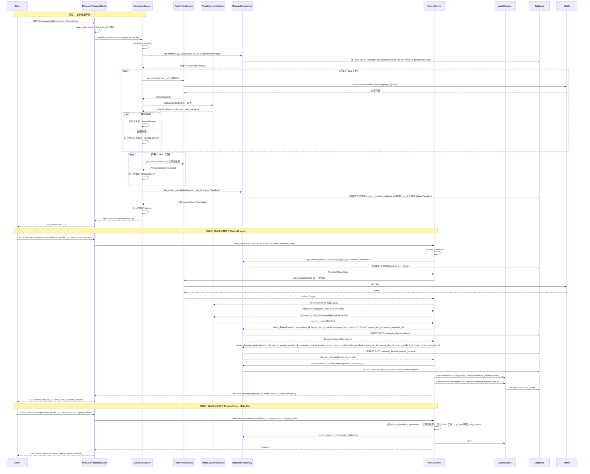
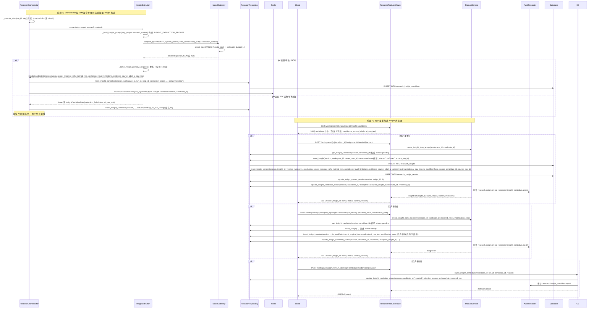
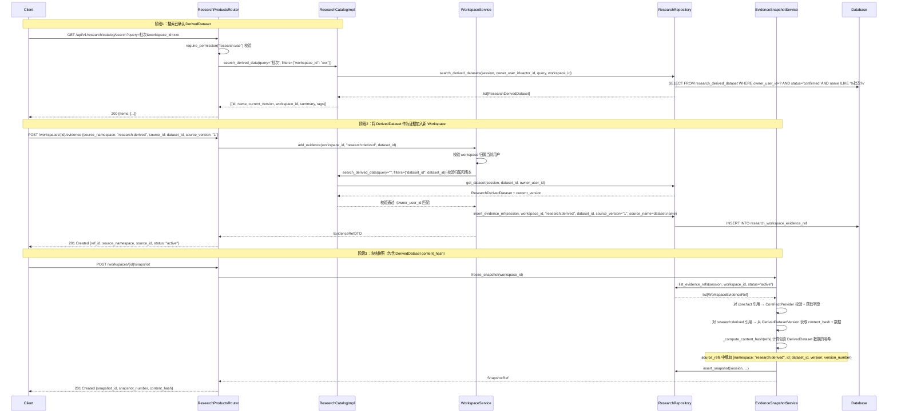
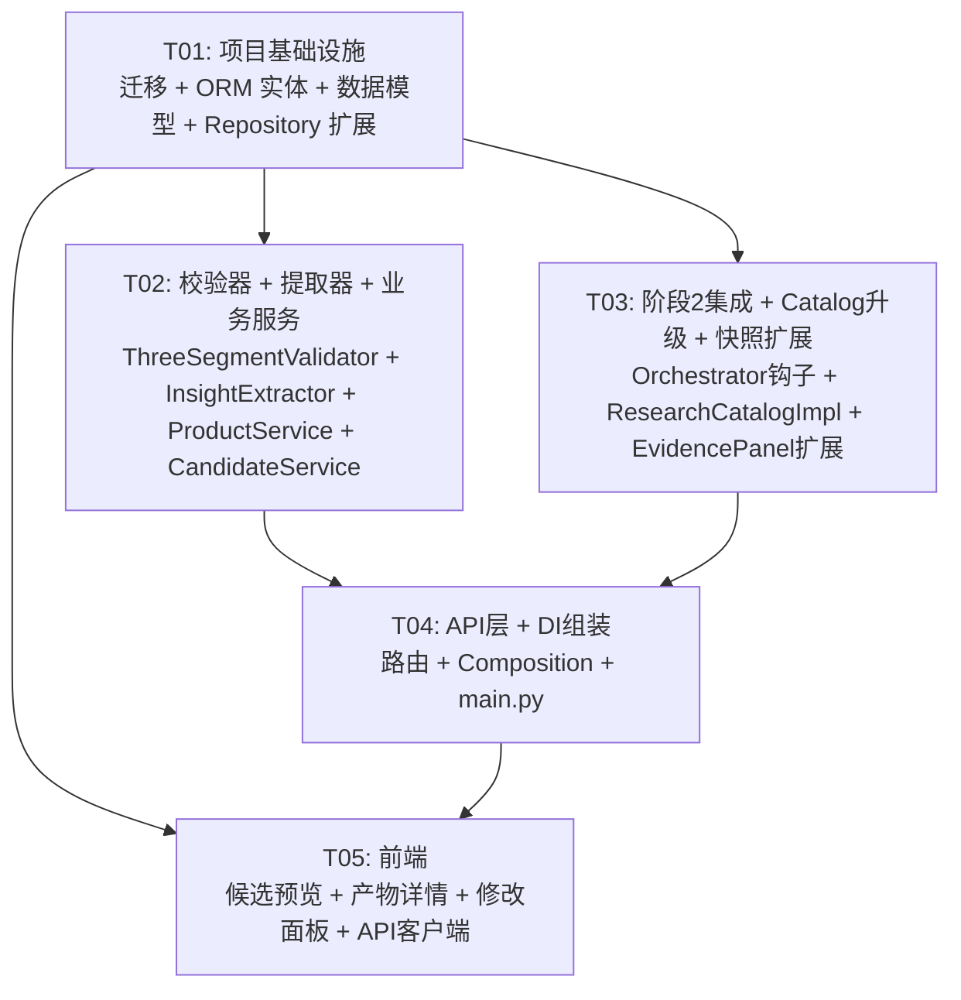

# 架构设计：研究产物（子项目 3）

> **项目名称**: irip_research_products
>
> **技术栈**: 后端 Python 3.12+ / FastAPI / SQLAlchemy(异步) / PostgreSQL 16 / Redis 7 / Celery；沙箱 Kubernetes Pod 或等效容器调度器（延续阶段 2）；前端 React 18 + TS / Vite / Ant Design 5 / TanStack Router+Query
>
> **日期**: 2026-08-06
>
> **状态**: 评审稿
>
> **依赖基线**: 阶段 1"研究域基础" + 阶段 2"可信执行"已完成并上线（`docs/prd-research-foundation.md` / `docs/arch-research-foundation.md` / `docs/prd-research-trusted-execution.md` / `docs/arch-research-trusted-execution.md`）
>
> **关联 PRD**: `docs/prd-research-products.md`

---

## 目录

- [1. 实现方案与框架选型](#1-实现方案与框架选型)
  - [1.1 技术挑战分析](#11-技术挑战分析)
  - [1.2 框架选型](#12-框架选型)
  - [1.3 架构模式](#13-架构模式)
  - [1.4 模块隔离策略](#14-模块隔离策略)
- [2. 文件列表及相对路径](#2-文件列表及相对路径)
  - [2.1 后端新增文件](#21-后端新增文件)
  - [2.2 后端修改文件](#22-后端修改文件)
  - [2.3 前端新增文件](#23-前端新增文件)
  - [2.4 前端修改文件](#24-前端修改文件)
- [3. 数据结构和接口（类图）](#3-数据结构和接口类图)
- [4. 程序调用流程（时序图）](#4-程序调用流程时序图)
- [5. 任务列表（有序，含依赖关系）](#5-任务列表有序含依赖关系)
- [6. 依赖包列表](#6-依赖包列表)
- [7. 共享知识（跨文件约定）](#7-共享知识跨文件约定)
- [8. 待明确事项](#8-待明确事项)

---

## 1. 实现方案与框架选型

### 1.1 技术挑战分析

| 挑战 | 难点 | 方案 |
|------|------|------|
| **候选产物识别与三段式数据校验** | Run 完成后需从 `research_run_artifact` 中筛选 `is_publishable=true` 的 data/chart 工件，下载 MinIO 内容并解析为三段式结构（metadata/points/series），同时自动推断 field_manifest | `CandidateService` 负责候选识别：查询工件 → 下载内容 → `ThreeSegmentValidator` 解析校验 → 组装预览数据。校验不通过的工件标记为不可用候选并附带错误原因 |
| **版本不可变保证** | DerivedDatasetVersion / ResearchViewVersion / InsightVersion 三类版本实体创建后不允许 UPDATE/DELETE，应用层拦截非法操作 | Repository 层不提供版本实体的 update/delete 方法；Service 层仅通过 `create_new_version()` 创建新版本行；旧版本通过 `lock_version` + 应用层保证只读 |
| **Insight 候选提取与 LLM 集成** | Orchestrator 在 LLM/混合步骤完成后需调用 ModelGateway INSIGHT 任务类型提取结构化候选，AI 输出 JSON 需校验 6 字段完整性 | `InsightExtractor` 封装提取逻辑：构建 INSIGHT_EXTRACTION_PROMPT → 调用 `ModelGateway.call(INSIGHT)` → 解析 JSON → 校验字段 → 创建 InsightCandidate。解析失败时保留 AI 原始文本并标记生成失败 |
| **ResearchCatalog 从 Stub 升级为 Impl** | 阶段 1 的 `ResearchCatalogStub` 返回空列表，需替换为 `ResearchCatalogImpl` 搜索当前用户已确认 DerivedDataset（跨 Workspace，owner_user_id 过滤） | `ResearchCatalogImpl` 注入 `session_factory`，通过 `ResearchRepository.search_derived_datasets()` 查询。接口签名与阶段 1 一致，Composition Root 中替换 Stub 注册 |
| **WorkspaceEvidenceRef 扩展 research:derived** | 证据引用需支持将已确认 DerivedDataset 作为新分析输入，证据快照冻结时需捕获 DerivedDatasetVersion 的 content_hash | `WorkspaceService.add_evidence()` 增加 `research:derived` 命名空间分支 → 通过 `ResearchCatalogImpl` 校验归属和版本 → 快照冻结时从 DerivedDatasetVersion 获取 content_hash 并纳入哈希计算 |
| **产物列表与详情聚合** | 需在单一 Workspace 内聚合展示全部已确认产物（DerivedDataset/ResearchView/Insight），按类型分组，并支持版本历史和详情查看 | `ProductService.list_products()` 统一查询三种产物，返回 `ProductSummary` 列表；前端按 `product_type` 分组渲染。详情视图按类型加载对应版本数据 |

### 1.2 框架选型

| 层 | 技术 | 说明 |
|----|------|------|
| 后端框架 | FastAPI + SQLAlchemy 异步 | 延续阶段 1-2 模式 |
| ORM 类型 | `Mapped[] + mapped_column()` + `GUID` / `UTCDateTime` / `JSONB` | 延续 `packages/common/db_types.py` |
| Service 模式 | `ScopedSessionMixin` + `session_factory / department_id / actor_id` | 延续 `packages/facts/service.py` |
| Repository 模式 | 静态方法，操作 session | 延续 `packages/research/repository.py` |
| DI 模式 | Composition Root + provider `register(ctx)` | 延续 `apps/api/composition/` |
| 权限 | `require_permission("research:use")` 依赖 | 延续阶段 1（阶段 3 不新增权限点） |
| 审计 | `AuditRecorder.record(session, event)` 静态方法 | 延续 `packages/audit/repository.py` |
| 迁移 | Alembic `op.execute()` 原生 SQL，编号 0076 | 延续 `migrations/versions/` |
| 对象存储 | MinIO（S3Repository） | 延续阶段 2 RunArtifactService 的 MinIO 路径约定 |
| 前端框架 | React 18 + Vite + Ant Design 5 | 延续 `apps/web/` |
| 前端数据 | Axios `http` 实例 + 纯 async 函数 | 延续 `apps/web/src/api/client.ts` |

**无新增第三方依赖。** 研究产物所需功能完全使用现有技术栈实现。

### 1.3 架构模式

延续阶段 1-2 的 **ScopedSessionMixin + Composition Root** 模式，新增服务遵循同样的依赖注入模式：

- **Service 层**：`ScopedSessionMixin` 子类，构造函数注入 `session_factory / department_id / actor_id / 依赖服务`
- **Repository 层**：`ResearchRepository` / `ResearchRepositoryTrusted` 静态方法扩展，新增产物 CRUD 方法
- **Strategy 模式**：`ThreeSegmentValidator` 负责三段式数据校验与 field_manifest 推断，独立于 Service
- **Extractor 模式**：`InsightExtractor` 封装从 LLM 响应中提取结构化 Insight 候选的逻辑
- **升级替换**：`ResearchCatalogImpl` 替换 `ResearchCatalogStub`，接口签名不变

### 1.4 模块隔离策略

延续阶段 1-2 原则：
- 新增 7 张表均以 `research_` 前缀命名
- 研究表之间 FK 允许保留（`dataset_id → research_derived_dataset.id ON DELETE CASCADE` 等）
- 研究表到 `research_workspace` / `research_analysis_run` / `research_analysis_step` / `research_run_artifact` 的 FK 允许保留（同为研究域内部表）
- 跨模块引用不建 FK（`bound_dataset_version_id` 为逻辑引用 DerivedDatasetVersion，不建数据库级 FK）
- 迁移编号延续 `0076`（阶段 1 为 `0074`，阶段 2 为 `0075`）
- 关闭 `RESEARCH_MODULE_ENABLED` 后研究 API 路由不注册，原系统正常
- 新增 `ResearchCatalog` 实现替换 Stub，不影响已使用此接口的调用方

---

## 2. 文件列表及相对路径

### 2.1 后端新增文件

| # | 文件路径 | 职责 |
|---|---------|------|
| 1 | `packages/research/products.py` | **ProductService** — DerivedDataset/ResearchView/Insight 生命周期管理（创建稳定身份+版本、列表、详情、编辑元数据、版本历史、产物列表） |
| 2 | `packages/research/candidates.py` | **CandidateService** — 候选产物识别（从 RunArtifact 筛选 + InsightCandidate 查询 + 预览数据组装 + 确认/接受/修改/拒绝操作） |
| 3 | `packages/research/insight_extractor.py` | **InsightExtractor** — 从 LLM 响应提取结构化 Insight 候选（构建提示词 + 调用 ModelGateway INSIGHT + 解析 JSON + 校验 6 字段） |
| 4 | `packages/research/validation.py` | **ThreeSegmentValidator** — 三段式数据校验 + field_manifest 自动推断 + content_hash 计算 |
| 5 | `apps/api/routers/research_products.py` | API 路由：候选产物 + DerivedDataset + ResearchView + Insight + InsightCandidate + 产物列表 + ResearchCatalog 搜索的 CRUD 端点 |
| 6 | `apps/api/composition/research_products.py` | Composition provider：产物域依赖注入注册 |
| 7 | `migrations/versions/0076_research_products.py` | Alembic 迁移：创建 7 张新表 + 索引 + 约束 |

### 2.2 后端修改文件

| # | 文件路径 | 修改内容 |
|---|---------|---------|
| 8 | `packages/research/entities.py` | 新增 7 个 ORM 实体：`ResearchDerivedDataset` / `ResearchDerivedDatasetVersion` / `ResearchView` / `ResearchViewVersion` / `ResearchInsight` / `ResearchInsightVersion` / `ResearchInsightCandidate` |
| 9 | `packages/research/models.py` | 新增 dataclass：`DerivedDatasetRef` / `DatasetVersionRef` / `DatasetDetail` / `ViewRef` / `ViewVersionRef` / `ViewDetail` / `InsightRef` / `InsightVersionRef` / `InsightDetail` / `InsightCandidateRef` / `CandidateProductSummary` / `ThreeSegmentData` / `FieldManifestEntry` / `ProductSummary` 等 |
| 10 | `packages/research/repository.py` | 扩展 `ResearchRepository` 新增方法：derived dataset CRUD / view CRUD / insight CRUD / insight candidate CRUD / product list 查询 |
| 11 | `packages/research/catalog.py` | 新增 `ResearchCatalogImpl`（搜索当前用户已确认 DerivedDataset），保留 `ResearchCatalogStub` |
| 12 | `packages/research/orchestrator.py` | 在 `_execute_step()` 完成后（method=llm 或 mixed）增加 Insight 候选提取钩子，调用 `InsightExtractor` |
| 13 | `packages/research/snapshots.py` | `EvidenceSnapshotService.freeze_snapshot()` 增加 `research:derived` 命名空间分支：从 DerivedDatasetVersion 获取 content_hash 纳入哈希计算 |
| 14 | `packages/research/service.py` | `WorkspaceService.add_evidence()` 增加 `research:derived` 命名空间分支：通过 ResearchCatalog 校验归属和版本 |
| 15 | `apps/api/main.py` | 条件注册 `research_products_router` |
| 16 | `apps/api/composition/__init__.py` | `register_all()` 中条件调用 `register_research_products(ctx)`，并替换 `ResearchCatalogStub` 为 `ResearchCatalogImpl` |

### 2.3 前端新增文件

| # | 文件路径 | 职责 |
|---|---------|------|
| 17 | `apps/web/src/features/research/CandidatePreviewPanel.tsx` | 中栏候选产物预览区（增强版）：候选数据/候选图表/候选 Insight 三种类型的结构化预览 + 操作按钮 |
| 18 | `apps/web/src/features/research/CandidateDataCard.tsx` | 候选数据卡片：三段式结构摘要 + 字段清单 + 来源步骤 + 确认按钮 |
| 19 | `apps/web/src/features/research/CandidateChartCard.tsx` | 候选图表卡片：PNG 缩略图 + 绑定信息 + 确认按钮 |
| 20 | `apps/web/src/features/research/CandidateInsightCard.tsx` | 候选 Insight 卡片：6 个结构化字段 + 证据来源标签 + 接受/修改/拒绝按钮 |
| 21 | `apps/web/src/features/research/InsightModifyModal.tsx` | Insight 修改面板：AI 原稿只读 + 6 字段编辑 + 修改原因 |
| 22 | `apps/web/src/features/research/ConfirmedProductsPanel.tsx` | 已确认产物列表：按类型分组展示 |
| 23 | `apps/web/src/features/research/ProductDetailView.tsx` | 产物详情视图（Workspace 内）：根据类型渲染 DatasetPreview / ViewPreview / InsightDetailView |
| 24 | `apps/web/src/features/research/DatasetPreview.tsx` | DerivedDataset 三段式数据预览组件（metadata/points/series 表格 + field_manifest） |
| 25 | `apps/web/src/features/research/ViewPreview.tsx` | ResearchView 静态图预览组件（高清 PNG + 版本缩略图列表） |
| 26 | `apps/web/src/features/research/InsightDetailView.tsx` | Insight 详情组件（结构化字段 + 证据来源标签 + AI 原稿 + 修改记录 + 版本历史） |
| 27 | `apps/web/src/api/researchProducts.ts` | 产物相关 API 函数：候选产物/DerivedDataset/View/Insight/Candidate/Catalog 全部端点 |

### 2.4 前端修改文件

| # | 文件路径 | 修改内容 |
|---|---------|---------|
| 28 | `apps/web/src/features/research/ResearchCanvas.tsx` | 集成 `CandidatePreviewPanel` 和 `ConfirmedProductsPanel`，替换阶段 2 的基础缩略卡片 |
| 29 | `apps/web/src/features/research/EvidencePanel.tsx` | 左栏扩展：新增类型筛选（实验事实/衍生数据），衍生数据搜索调用 ResearchCatalog API |
| 30 | `apps/web/src/api/research.ts` | 新增 `research:derived` 证据加入相关类型和 API 函数 |

---

## 3. 数据结构和接口（类图）

### 3.1 类图（Mermaid）

```mermaid
classDiagram
    direction TB

    %% ===== 新增 ORM 实体 =====

    class ResearchDerivedDataset {
        +UUID id
        +UUID workspace_id
        +UUID owner_user_id
        +str name
        +str summary
        +list tags
        +str status
        +int current_version
        +UUID source_run_id
        +UUID source_snapshot_id
        +datetime created_at
        +datetime updated_at
        +int lock_version
    }

    class ResearchDerivedDatasetVersion {
        +UUID id
        +UUID dataset_id
        +int version_number
        +dict metadata_content
        +list points_content
        +list series_content
        +dict field_manifest
        +UUID source_run_id
        +UUID source_step_id
        +UUID source_artifact_id
        +str content_hash
        +datetime created_at
        +UUID created_by
    }

    class ResearchView {
        +UUID id
        +UUID workspace_id
        +UUID owner_user_id
        +str name
        +str caption
        +int display_order
        +str status
        +int current_version
        +UUID source_run_id
        +datetime created_at
        +datetime updated_at
        +int lock_version
    }

    class ResearchViewVersion {
        +UUID id
        +UUID view_id
        +int version_number
        +str image_storage_path
        +str image_format
        +int image_width
        +int image_height
        +str image_content_hash
        +UUID chart_code_artifact_id
        +str image_digest
        +UUID source_run_id
        +UUID source_step_id
        +UUID source_artifact_id
        +UUID bound_dataset_version_id
        +str chart_description
        +datetime created_at
        +UUID created_by
    }

    class ResearchInsight {
        +UUID id
        +UUID workspace_id
        +UUID owner_user_id
        +str name
        +str status
        +int current_version
        +UUID source_run_id
        +datetime created_at
        +datetime updated_at
        +int lock_version
    }

    class ResearchInsightVersion {
        +UUID id
        +UUID insight_id
        +int version_number
        +str conclusion
        +str scope
        +list evidence_refs
        +list method_refs
        +str confidence_level
        +str limitations
        +str evidence_source_label
        +str ai_original_text
        +bool is_modified
        +str modification_note
        +UUID source_candidate_id
        +UUID source_run_id
        +datetime created_at
        +UUID created_by
    }

    class ResearchInsightCandidate {
        +UUID id
        +UUID workspace_id
        +UUID run_id
        +UUID step_id
        +str conclusion
        +str scope
        +list evidence_refs
        +list method_refs
        +str confidence_level
        +str limitations
        +str evidence_source_label
        +str ai_raw_text
        +str status
        +UUID accepted_insight_id
        +str rejection_reason
        +datetime created_at
        +datetime reviewed_at
        +UUID reviewed_by
    }

    %% ===== 与阶段 2 实体的关系 =====

    class ResearchRunArtifact {
        +UUID id
        +UUID run_id
        +UUID step_id
        +str artifact_type
        +str artifact_key
        +str storage_path
        +str content_hash
        +int size_bytes
        +bool is_publishable
    }

    class ResearchAnalysisRun {
        +UUID id
        +UUID workspace_id
        +str status
        +str image_digest
    }

    class ResearchAnalysisStep {
        +UUID id
        +UUID run_id
        +str step_key
        +str status
        +str method
    }

    ResearchDerivedDataset "1" --> "many" ResearchDerivedDatasetVersion : dataset_id
    ResearchView "1" --> "many" ResearchViewVersion : view_id
    ResearchInsight "1" --> "many" ResearchInsightVersion : insight_id
    ResearchDerivedDatasetVersion --> ResearchAnalysisRun : source_run_id
    ResearchDerivedDatasetVersion --> ResearchRunArtifact : source_artifact_id
    ResearchViewVersion --> ResearchAnalysisRun : source_run_id
    ResearchViewVersion --> ResearchRunArtifact : source_artifact_id
    ResearchViewVersion --> ResearchRunArtifact : chart_code_artifact_id
    ResearchViewVersion --> ResearchDerivedDatasetVersion : bound_dataset_version_id (逻辑引用)
    ResearchInsightVersion --> ResearchInsightCandidate : source_candidate_id (逻辑引用)
    ResearchInsightVersion --> ResearchAnalysisRun : source_run_id
    ResearchInsightCandidate --> ResearchAnalysisRun : run_id
    ResearchInsightCandidate --> ResearchAnalysisStep : step_id
    ResearchInsightCandidate --> ResearchInsight : accepted_insight_id

    %% ===== Service 层 =====

    class ProductService {
        +async_sessionmaker _factory
        +UUID _dept_id
        +UUID _actor_id
        +RunArtifactService _artifact_service
        +__init__(factory, dept_id, actor_id, artifact_service)
        +create_dataset(workspace_id, artifact_id, name, summary, tags) DerivedDatasetRef
        +list_datasets(workspace_id) list~DerivedDatasetRef~
        +get_dataset(workspace_id, dataset_id) DatasetDetail
        +update_dataset_metadata(workspace_id, dataset_id, name, summary, tags) DerivedDatasetRef
        +list_dataset_versions(workspace_id, dataset_id) list~DatasetVersionRef~
        +get_dataset_version(workspace_id, dataset_id, version_number) DatasetVersionDetail
        +create_view(workspace_id, artifact_id, name, caption, display_order) ViewRef
        +list_views(workspace_id) list~ViewRef~
        +get_view(workspace_id, view_id) ViewDetail
        +update_view_metadata(workspace_id, view_id, name, caption, display_order) ViewRef
        +list_view_versions(workspace_id, view_id) list~ViewVersionRef~
        +get_view_version(workspace_id, view_id, version_number) ViewVersionDetail
        +create_insight_from_accept(workspace_id, candidate_id) InsightRef
        +create_insight_from_modify(workspace_id, candidate_id, modified_fields, modification_note) InsightRef
        +list_insights(workspace_id) list~InsightRef~
        +get_insight(workspace_id, insight_id) InsightDetail
        +update_insight_metadata(workspace_id, insight_id, name) InsightRef
        +list_insight_versions(workspace_id, insight_id) list~InsightVersionRef~
        +list_products(workspace_id) list~ProductSummary~
    }

    class CandidateService {
        +async_sessionmaker _factory
        +UUID _dept_id
        +UUID _actor_id
        +RunArtifactService _artifact_service
        +__init__(factory, dept_id, actor_id, artifact_service)
        +identify_candidates(workspace_id, run_id) list~CandidateProductSummary~
        +get_candidate_detail(workspace_id, run_id, candidate_id) CandidateDetail
        +reject_insight_candidate(workspace_id, run_id, candidate_id, reason) void
        +_identify_data_candidates(run_id) list~CandidateSummary~
        +_identify_chart_candidates(run_id) list~CandidateSummary~
        +_identify_insight_candidates(run_id) list~CandidateSummary~
        +_download_and_parse_artifact(artifact_id) ThreeSegmentData
    }

    class InsightExtractor {
        +ModelGateway _model_gateway
        +__init__(model_gateway)
        +extract(step_output, research_context) InsightCandidateData
        +_build_insight_prompt(step_output, research_context) str
        +_parse_insight_json(raw_response) InsightCandidateData
        +_validate_fields(data) bool
    }

    class ThreeSegmentValidator {
        <<static>>
        +validate(data) ValidationResult
        +infer_field_manifest(points, series) list~FieldManifestEntry~
        +compute_content_hash(metadata, points, series) str
        +_infer_type(value) str
    }

    class ResearchCatalogImpl {
        +async_sessionmaker _factory
        +UUID _actor_id
        +__init__(factory, actor_id)
        +search_derived_data(query, filters) list~dict~
    }

    class ResearchCatalogStub {
        +search_derived_data(query, filters) list~dict~
    }

    %% ===== 关系 =====

    class ResearchCatalog {
        <<interface>>
        +search_derived_data(query, filters) list~dict~
    }

    ResearchCatalogImpl ..|> ResearchCatalog
    ResearchCatalogStub ..|> ResearchCatalog
    ProductService --> RunArtifactService : 读取工件内容
    ProductService --> ThreeSegmentValidator : 校验三段式
    ProductService --> ResearchRepository : 调用
    CandidateService --> RunArtifactService : 下载工件
    CandidateService --> ThreeSegmentValidator : 解析校验
    CandidateService --> ResearchRepository : 调用
    InsightExtractor --> ModelGateway : INSIGHT 任务类型

    %% ===== 值对象 =====

    class ThreeSegmentData {
        +dict metadata
        +list points
        +list series
    }

    class FieldManifestEntry {
        +str field_name
        +str inferred_type
        +str unit
        +str description
        +str source_step
        +int column_order
        +str shape
    }

    class CandidateProductSummary {
        +str candidate_type
        +UUID source_artifact_id
        +UUID source_run_id
        +UUID source_step_id
        +str step_name
        +str step_status
        +dict preview_data
        +str status
    }

    class ProductSummary {
        +str product_type
        +UUID product_id
        +str name
        +str status
        +int current_version
    }

    class ValidationResult {
        +bool valid
        +list errors
        +ThreeSegmentData data
        +list field_manifest
    }
```



### 3.2 ORM 实体详细定义

#### 3.2.1 ResearchDerivedDataset（`research_derived_dataset`）

```python
class ResearchDerivedDataset(Base):
    __tablename__ = "research_derived_dataset"

    id: Mapped[UUID] = mapped_column(GUID, primary_key=True, default=new_id)
    workspace_id: Mapped[UUID] = mapped_column(
        GUID, sa.ForeignKey("research_workspace.id", ondelete="CASCADE"), nullable=False
    )
    owner_user_id: Mapped[UUID] = mapped_column(
        GUID, sa.ForeignKey("app_user.id"), nullable=False
    )
    name: Mapped[str] = mapped_column(sa.Text, nullable=False)
    summary: Mapped[str | None] = mapped_column(sa.Text, nullable=True)
    tags: Mapped[list] = mapped_column(
        JSONB, nullable=False, server_default=sa.text("'[]'::jsonb")
    )
    status: Mapped[str] = mapped_column(
        sa.Text, nullable=False, server_default=sa.text("'confirmed'")
    )
    current_version: Mapped[int] = mapped_column(
        sa.Integer, nullable=False, server_default=sa.text("0")
    )
    source_run_id: Mapped[UUID] = mapped_column(
        GUID, sa.ForeignKey("research_analysis_run.id"), nullable=False
    )
    source_snapshot_id: Mapped[UUID | None] = mapped_column(GUID, nullable=True)
    created_at: Mapped[datetime] = mapped_column(
        UTCDateTime, server_default=sa.func.now(), nullable=False
    )
    updated_at: Mapped[datetime] = mapped_column(
        UTCDateTime, server_default=sa.func.now(), nullable=False
    )
    lock_version: Mapped[int] = mapped_column(
        sa.Integer, nullable=False, server_default=sa.text("0")
    )
```

- `status`: `confirmed`（已确认产物）/ `draft`（草稿，预留）
- `source_snapshot_id`: 逻辑引用 EvidenceSnapshot，不建 FK
- `tags`: JSONB 数组，如 `["峰值分析", "Q2批次"]`
- 可编辑字段：`name` / `summary` / `tags`（仅 stable identity）

#### 3.2.2 ResearchDerivedDatasetVersion（`research_derived_dataset_version`）

```python
class ResearchDerivedDatasetVersion(Base):
    __tablename__ = "research_derived_dataset_version"

    id: Mapped[UUID] = mapped_column(GUID, primary_key=True, default=new_id)
    dataset_id: Mapped[UUID] = mapped_column(
        GUID, sa.ForeignKey("research_derived_dataset.id", ondelete="CASCADE"), nullable=False
    )
    version_number: Mapped[int] = mapped_column(sa.Integer, nullable=False)
    metadata_content: Mapped[dict] = mapped_column(JSONB, nullable=False)
    points_content: Mapped[list] = mapped_column(
        JSONB, nullable=False, server_default=sa.text("'[]'::jsonb")
    )
    series_content: Mapped[list] = mapped_column(
        JSONB, nullable=False, server_default=sa.text("'[]'::jsonb")
    )
    field_manifest: Mapped[list] = mapped_column(
        JSONB, nullable=False, server_default=sa.text("'[]'::jsonb")
    )
    source_run_id: Mapped[UUID] = mapped_column(
        GUID, sa.ForeignKey("research_analysis_run.id"), nullable=False
    )
    source_step_id: Mapped[UUID | None] = mapped_column(
        GUID, sa.ForeignKey("research_analysis_step.id"), nullable=True
    )
    source_artifact_id: Mapped[UUID | None] = mapped_column(
        GUID, sa.ForeignKey("research_run_artifact.id"), nullable=True
    )
    content_hash: Mapped[str] = mapped_column(sa.Text, nullable=False)
    created_at: Mapped[datetime] = mapped_column(
        UTCDateTime, server_default=sa.func.now(), nullable=False
    )
    created_by: Mapped[UUID] = mapped_column(
        GUID, sa.ForeignKey("app_user.id"), nullable=False
    )
```

- **不可变**：创建后不允许 UPDATE / DELETE（应用层保证，Repository 不提供 update/delete 方法）
- `metadata_content`: JSONB dict，报告级描述
- `points_content`: JSONB list of `{name, value, unit}`
- `series_content`: JSONB list of `{name, columns, rows}`
- `field_manifest`: JSONB list of `{field_name, inferred_type, unit, description, source_step, column_order, shape}`
- `content_hash`: 三段式数据 SHA-256
- 唯一约束：`UNIQUE (dataset_id, version_number)`

#### 3.2.3 ResearchView（`research_view`）

```python
class ResearchView(Base):
    __tablename__ = "research_view"

    id: Mapped[UUID] = mapped_column(GUID, primary_key=True, default=new_id)
    workspace_id: Mapped[UUID] = mapped_column(
        GUID, sa.ForeignKey("research_workspace.id", ondelete="CASCADE"), nullable=False
    )
    owner_user_id: Mapped[UUID] = mapped_column(
        GUID, sa.ForeignKey("app_user.id"), nullable=False
    )
    name: Mapped[str] = mapped_column(sa.Text, nullable=False)
    caption: Mapped[str | None] = mapped_column(sa.Text, nullable=True)
    display_order: Mapped[int] = mapped_column(
        sa.Integer, nullable=False, server_default=sa.text("0")
    )
    status: Mapped[str] = mapped_column(
        sa.Text, nullable=False, server_default=sa.text("'confirmed'")
    )
    current_version: Mapped[int] = mapped_column(
        sa.Integer, nullable=False, server_default=sa.text("0")
    )
    source_run_id: Mapped[UUID] = mapped_column(
        GUID, sa.ForeignKey("research_analysis_run.id"), nullable=False
    )
    created_at: Mapped[datetime] = mapped_column(
        UTCDateTime, server_default=sa.func.now(), nullable=False
    )
    updated_at: Mapped[datetime] = mapped_column(
        UTCDateTime, server_default=sa.func.now(), nullable=False
    )
    lock_version: Mapped[int] = mapped_column(
        sa.Integer, nullable=False, server_default=sa.text("0")
    )
```

- 可编辑字段：`name` / `caption` / `display_order`（仅 stable identity）

#### 3.2.4 ResearchViewVersion（`research_view_version`）

```python
class ResearchViewVersion(Base):
    __tablename__ = "research_view_version"

    id: Mapped[UUID] = mapped_column(GUID, primary_key=True, default=new_id)
    view_id: Mapped[UUID] = mapped_column(
        GUID, sa.ForeignKey("research_view.id", ondelete="CASCADE"), nullable=False
    )
    version_number: Mapped[int] = mapped_column(sa.Integer, nullable=False)
    image_storage_path: Mapped[str] = mapped_column(sa.Text, nullable=False)
    image_format: Mapped[str] = mapped_column(
        sa.Text, nullable=False, server_default=sa.text("'png'")
    )
    image_width: Mapped[int | None] = mapped_column(sa.Integer, nullable=True)
    image_height: Mapped[int | None] = mapped_column(sa.Integer, nullable=True)
    image_content_hash: Mapped[str] = mapped_column(sa.Text, nullable=False)
    chart_code_artifact_id: Mapped[UUID | None] = mapped_column(
        GUID, sa.ForeignKey("research_run_artifact.id"), nullable=True
    )
    image_digest: Mapped[str | None] = mapped_column(sa.Text, nullable=True)
    source_run_id: Mapped[UUID] = mapped_column(
        GUID, sa.ForeignKey("research_analysis_run.id"), nullable=False
    )
    source_step_id: Mapped[UUID | None] = mapped_column(
        GUID, sa.ForeignKey("research_analysis_step.id"), nullable=True
    )
    source_artifact_id: Mapped[UUID | None] = mapped_column(
        GUID, sa.ForeignKey("research_run_artifact.id"), nullable=True
    )
    bound_dataset_version_id: Mapped[UUID | None] = mapped_column(GUID, nullable=True)
    chart_description: Mapped[str | None] = mapped_column(sa.Text, nullable=True)
    created_at: Mapped[datetime] = mapped_column(
        UTCDateTime, server_default=sa.func.now(), nullable=False
    )
    created_by: Mapped[UUID] = mapped_column(
        GUID, sa.ForeignKey("app_user.id"), nullable=False
    )
```

- **不可变**：创建后不允许 UPDATE / DELETE
- `image_storage_path`: MinIO 路径（复用工件路径或复制到独立路径）
- `image_format`: `png` / `pdf`
- `bound_dataset_version_id`: 逻辑引用 DerivedDatasetVersion，不建 FK
- `image_digest`: 从 Run 记录继承（沙箱镜像 digest）
- 唯一约束：`UNIQUE (view_id, version_number)`

#### 3.2.5 ResearchInsight（`research_insight`）

```python
class ResearchInsight(Base):
    __tablename__ = "research_insight"

    id: Mapped[UUID] = mapped_column(GUID, primary_key=True, default=new_id)
    workspace_id: Mapped[UUID] = mapped_column(
        GUID, sa.ForeignKey("research_workspace.id", ondelete="CASCADE"), nullable=False
    )
    owner_user_id: Mapped[UUID] = mapped_column(
        GUID, sa.ForeignKey("app_user.id"), nullable=False
    )
    name: Mapped[str] = mapped_column(sa.Text, nullable=False)
    status: Mapped[str] = mapped_column(
        sa.Text, nullable=False, server_default=sa.text("'confirmed'")
    )
    current_version: Mapped[int] = mapped_column(
        sa.Integer, nullable=False, server_default=sa.text("0")
    )
    source_run_id: Mapped[UUID | None] = mapped_column(
        GUID, sa.ForeignKey("research_analysis_run.id"), nullable=True
    )
    created_at: Mapped[datetime] = mapped_column(
        UTCDateTime, server_default=sa.func.now(), nullable=False
    )
    updated_at: Mapped[datetime] = mapped_column(
        UTCDateTime, server_default=sa.func.now(), nullable=False
    )
    lock_version: Mapped[int] = mapped_column(
        sa.Integer, nullable=False, server_default=sa.text("0")
    )
```

- 可编辑字段：`name`（仅 stable identity）

#### 3.2.6 ResearchInsightVersion（`research_insight_version`）

```python
class ResearchInsightVersion(Base):
    __tablename__ = "research_insight_version"

    id: Mapped[UUID] = mapped_column(GUID, primary_key=True, default=new_id)
    insight_id: Mapped[UUID] = mapped_column(
        GUID, sa.ForeignKey("research_insight.id", ondelete="CASCADE"), nullable=False
    )
    version_number: Mapped[int] = mapped_column(sa.Integer, nullable=False)
    conclusion: Mapped[str] = mapped_column(sa.Text, nullable=False)
    scope: Mapped[str] = mapped_column(sa.Text, nullable=False)
    evidence_refs: Mapped[list] = mapped_column(JSONB, nullable=False)
    method_refs: Mapped[list] = mapped_column(JSONB, nullable=False)
    confidence_level: Mapped[str] = mapped_column(sa.Text, nullable=False)
    limitations: Mapped[str] = mapped_column(sa.Text, nullable=False)
    evidence_source_label: Mapped[str] = mapped_column(sa.Text, nullable=False)
    ai_original_text: Mapped[str | None] = mapped_column(sa.Text, nullable=True)
    is_modified: Mapped[bool] = mapped_column(
        sa.Boolean, nullable=False, server_default=sa.text("false")
    )
    modification_note: Mapped[str | None] = mapped_column(sa.Text, nullable=True)
    source_candidate_id: Mapped[UUID | None] = mapped_column(GUID, nullable=True)
    source_run_id: Mapped[UUID | None] = mapped_column(
        GUID, sa.ForeignKey("research_analysis_run.id"), nullable=True
    )
    created_at: Mapped[datetime] = mapped_column(
        UTCDateTime, server_default=sa.func.now(), nullable=False
    )
    created_by: Mapped[UUID] = mapped_column(
        GUID, sa.ForeignKey("app_user.id"), nullable=False
    )
```

- **不可变**：创建后不允许 UPDATE / DELETE
- 6 个必填字段：`conclusion` / `scope` / `evidence_refs` / `method_refs` / `confidence_level` / `limitations`
- `evidence_source_label`: `experimental_data` / `knowledge_base` / `model_inference`
- `evidence_refs`: JSONB list of `{type, id, version}` 或 `{type, name, version}`
- `method_refs`: JSONB list of `{run_id, step_id, artifact_id}` 或 `{run_id, step_key}`
- `source_candidate_id`: 逻辑引用 InsightCandidate，不建 FK
- 唯一约束：`UNIQUE (insight_id, version_number)`

#### 3.2.7 ResearchInsightCandidate（`research_insight_candidate`）

```python
class ResearchInsightCandidate(Base):
    __tablename__ = "research_insight_candidate"

    id: Mapped[UUID] = mapped_column(GUID, primary_key=True, default=new_id)
    workspace_id: Mapped[UUID] = mapped_column(
        GUID, sa.ForeignKey("research_workspace.id", ondelete="CASCADE"), nullable=False
    )
    run_id: Mapped[UUID] = mapped_column(
        GUID, sa.ForeignKey("research_analysis_run.id", ondelete="CASCADE"), nullable=False
    )
    step_id: Mapped[UUID | None] = mapped_column(
        GUID, sa.ForeignKey("research_analysis_step.id"), nullable=True
    )
    conclusion: Mapped[str] = mapped_column(sa.Text, nullable=False)
    scope: Mapped[str] = mapped_column(sa.Text, nullable=False)
    evidence_refs: Mapped[list] = mapped_column(JSONB, nullable=False)
    method_refs: Mapped[list] = mapped_column(JSONB, nullable=False)
    confidence_level: Mapped[str] = mapped_column(sa.Text, nullable=False)
    limitations: Mapped[str] = mapped_column(sa.Text, nullable=False)
    evidence_source_label: Mapped[str] = mapped_column(sa.Text, nullable=False)
    ai_raw_text: Mapped[str] = mapped_column(sa.Text, nullable=False)
    status: Mapped[str] = mapped_column(
        sa.Text, nullable=False, server_default=sa.text("'pending'")
    )
    accepted_insight_id: Mapped[UUID | None] = mapped_column(GUID, nullable=True)
    rejection_reason: Mapped[str | None] = mapped_column(sa.Text, nullable=True)
    created_at: Mapped[datetime] = mapped_column(
        UTCDateTime, server_default=sa.func.now(), nullable=False
    )
    reviewed_at: Mapped[datetime | None] = mapped_column(UTCDateTime, nullable=True)
    reviewed_by: Mapped[UUID | None] = mapped_column(
        GUID, sa.ForeignKey("app_user.id"), nullable=True
    )
```

- `status`: `pending`（待处理）/ `accepted`（已接受）/ `modified`（已修改）/ `rejected`（已拒绝）
- `accepted_insight_id`: 逻辑引用 Insight，不建 FK
- 候选由 Orchestrator 在 LLM/混合步骤完成后通过 InsightExtractor 提取
- `evidence_source_label`: `experimental_data` / `knowledge_base` / `model_inference`

### 3.3 接口与 Service 定义

#### ThreeSegmentValidator（三段式数据校验）

```python
class ThreeSegmentValidator:
    """三段式数据校验 + field_manifest 自动推断 + content_hash 计算。

    校验规则（PRD 6.8 节 / 设计文档 8.3 节）：
    - metadata: dict，报告级描述
    - points: list of {name, value, unit}，独立单值指标
    - series: list of {name, columns, rows}，普通表格/时间序列/曲线/多批次
    - 空 series 或空 points 允许
    """

    @staticmethod
    def validate(data: dict) -> ValidationResult:
        """校验三段式数据结构，返回校验结果 + field_manifest。"""
        ...

    @staticmethod
    def infer_field_manifest(points: list, series: list) -> list[dict]:
        """自动推断 field_manifest。

        返回 [{field_name, inferred_type, unit, description, source_step, column_order, shape}]
        类型推断使用 int/float/str/bool/null（Q5 简单类型推断）。
        """
        ...

    @staticmethod
    def compute_content_hash(metadata: dict, points: list, series: list) -> str:
        """计算三段式数据 SHA-256。

        序列化 JSON (sort_keys=True, ensure_ascii=False, separators=(",",":"))
        → hashlib.sha256 → 64 字符十六进制。
        """
        ...
```

#### InsightExtractor（Insight 候选提取）

```python
class InsightExtractor:
    """从 LLM 响应提取结构化 Insight 候选。

    在 Orchestrator._execute_step 完成后（method=llm 或 mixed）调用：
    1. 构建 INSIGHT_EXTRACTION_PROMPT（要求 AI 输出 6 字段 JSON + evidence_source_label）
    2. 调用 ModelGateway.call(task_type=INSIGHT, ...)
    3. 解析 AI 返回的结构化 JSON
    4. 校验 6 个必填字段 + evidence_source_label 存在
    5. 解析成功 → 返回 InsightCandidateData
    6. 解析失败 → 保留 AI 原始文本，标记为生成失败
    """

    INSIGHT_EXTRACTION_PROMPT = """..."""  # 专门提示词，要求输出结构化 JSON

    def __init__(self, model_gateway: ModelGateway):
        self._model_gateway = model_gateway

    async def extract(
        self,
        step_output: str,
        research_context: str,
    ) -> InsightCandidateData | None:
        """从步骤输出中提取 Insight 候选。"""
        ...

    def _build_insight_prompt(self, step_output: str, research_context: str) -> str:
        """构建 Insight 提取提示词。"""
        ...

    def _parse_insight_json(self, raw_response: str) -> InsightCandidateData | None:
        """解析 AI 返回的 JSON，校验字段完整性。"""
        ...
```

#### ProductService（产物生命周期管理）

```python
class ProductService(ScopedSessionMixin):
    """DerivedDataset / ResearchView / Insight 生命周期管理。

    职责：
    - 从 RunArtifact 创建 DerivedDataset（稳定身份 + v1 不可变版本）
    - 从 RunArtifact 创建 ResearchView（稳定身份 + v1 不可变版本）
    - 从 InsightCandidate 接受/修改创建 Insight（稳定身份 + v1 不可变版本）
    - 列表 / 详情 / 版本历史
    - 编辑元数据（仅 stable identity 字段）
    - 产物列表（按类型分组）
    """

    def __init__(
        self,
        session_factory: async_sessionmaker,
        department_id: UUID,
        actor_id: UUID,
        artifact_service: RunArtifactService,
    ):
        ...

    # ── DerivedDataset ──
    async def create_dataset(
        self, workspace_id: UUID, artifact_id: UUID,
        name: str, summary: str | None, tags: list[str],
    ) -> DerivedDatasetRef:
        """从 RunArtifact 创建 DerivedDataset。

        1. 获取工件（校验 is_publishable=true, artifact_type=data）
        2. 下载工件内容（MinIO）
        3. ThreeSegmentValidator.validate() 校验三段式
        4. ThreeSegmentValidator.infer_field_manifest() 推断字段清单
        5. ThreeSegmentValidator.compute_content_hash() 计算哈希
        6. 创建 ResearchDerivedDataset（stable identity）
        7. 创建 ResearchDerivedDatasetVersion v1（不可变）
        8. 更新 dataset.current_version=1
        9. 审计 research.derived_dataset.create + research.derived_dataset.version
        """
        ...

    async def list_datasets(self, workspace_id: UUID) -> list[DerivedDatasetRef]: ...
    async def get_dataset(self, workspace_id: UUID, dataset_id: UUID) -> DatasetDetail: ...
    async def update_dataset_metadata(
        self, workspace_id: UUID, dataset_id: UUID,
        name: str | None, summary: str | None, tags: list[str] | None,
    ) -> DerivedDatasetRef:
        """编辑元数据（仅 stable identity 字段，不触碰 version 内容）。"""
        ...
    async def list_dataset_versions(self, workspace_id: UUID, dataset_id: UUID) -> list[DatasetVersionRef]: ...
    async def get_dataset_version(self, workspace_id: UUID, dataset_id: UUID, version_number: int) -> DatasetVersionDetail: ...

    # ── ResearchView ──
    async def create_view(
        self, workspace_id: UUID, artifact_id: UUID,
        name: str, caption: str | None, display_order: int,
    ) -> ViewRef:
        """从 RunArtifact 创建 ResearchView。

        1. 获取工件（校验 is_publishable=true, artifact_type=chart）
        2. 读取工件元数据（格式、尺寸、content_hash）
        3. 查找同步骤的 code 工件作为 chart_code_artifact_id
        4. 从 Run 记录获取 image_digest
        5. 创建 ResearchView（stable identity）
        6. 创建 ResearchViewVersion v1（不可变）
        7. 更新 view.current_version=1
        8. 审计 research.view.create + research.view.version
        """
        ...
    async def list_views(self, workspace_id: UUID) -> list[ViewRef]: ...
    async def get_view(self, workspace_id: UUID, view_id: UUID) -> ViewDetail: ...
    async def update_view_metadata(
        self, workspace_id: UUID, view_id: UUID,
        name: str | None, caption: str | None, display_order: int | None,
    ) -> ViewRef: ...
    async def list_view_versions(self, workspace_id: UUID, view_id: UUID) -> list[ViewVersionRef]: ...
    async def get_view_version(self, workspace_id: UUID, view_id: UUID, version_number: int) -> ViewVersionDetail: ...

    # ── Insight ──
    async def create_insight_from_accept(
        self, workspace_id: UUID, candidate_id: UUID,
    ) -> InsightRef:
        """接受候选 → 创建 Insight + v1（is_modified=false，保留 AI 原稿）。

        1. 获取 InsightCandidate（校验 status=pending）
        2. 创建 ResearchInsight（stable identity, name=conclusion 摘要）
        3. 创建 ResearchInsightVersion v1（is_modified=false, ai_original_text=candidate.ai_raw_text）
        4. 更新候选 status=accepted, accepted_insight_id, reviewed_at, reviewed_by
        5. 审计 research.insight.create + research.insight_candidate.accept
        """
        ...
    async def create_insight_from_modify(
        self, workspace_id: UUID, candidate_id: UUID,
        modified_fields: dict, modification_note: str,
    ) -> InsightRef:
        """修改候选 → 创建 Insight + v1（is_modified=true，保留 AI 原稿 + 修改记录）。

        1. 获取 InsightCandidate（校验 status=pending）
        2. 创建 ResearchInsight（stable identity）
        3. 创建 ResearchInsightVersion v1（is_modified=true, ai_original_text, modification_note, 用户修改后的字段值）
        4. 更新候选 status=modified, accepted_insight_id, reviewed_at, reviewed_by
        5. 审计 research.insight.create + research.insight_candidate.modify
        """
        ...
    async def list_insights(self, workspace_id: UUID) -> list[InsightRef]: ...
    async def get_insight(self, workspace_id: UUID, insight_id: UUID) -> InsightDetail: ...
    async def update_insight_metadata(self, workspace_id: UUID, insight_id: UUID, name: str) -> InsightRef: ...
    async def list_insight_versions(self, workspace_id: UUID, insight_id: UUID) -> list[InsightVersionRef]: ...

    # ── 产物列表 ──
    async def list_products(self, workspace_id: UUID) -> list[ProductSummary]:
        """列出 Workspace 全部已确认产物（按类型分组）。"""
        ...
```

#### CandidateService（候选产物识别）

```python
class CandidateService(ScopedSessionMixin):
    """候选产物识别服务。

    职责：
    - Run 完成后识别候选产物（data 工件 → 候选 DerivedDataset / chart 工件 → 候选 ResearchView / Insight 候选）
    - 组装预览数据
    - 处理 Insight 候选拒绝
    """

    def __init__(
        self,
        session_factory: async_sessionmaker,
        department_id: UUID,
        actor_id: UUID,
        artifact_service: RunArtifactService,
    ):
        ...

    async def identify_candidates(
        self, workspace_id: UUID, run_id: UUID,
    ) -> list[CandidateProductSummary]:
        """识别 Run 的全部候选产物。

        1. 查询 research_run_artifact WHERE run_id=? AND is_publishable=true
        2. data 工件 → 下载内容 → ThreeSegmentValidator.validate() → 候选 DerivedDataset
        3. chart 工件 → 读取元数据 → 候选 ResearchView
        4. 查询 research_insight_candidate WHERE run_id=? AND status='pending'
        5. 汇总返回候选列表
        """
        ...

    async def get_candidate_detail(
        self, workspace_id: UUID, run_id: UUID, candidate_id: UUID,
    ) -> CandidateDetail: ...

    async def reject_insight_candidate(
        self, workspace_id: UUID, run_id: UUID,
        candidate_id: UUID, reason: str | None,
    ) -> None:
        """拒绝 Insight 候选 → 标记 status=rejected。"""
        ...
```

#### ResearchCatalogImpl（搜索已确认 DerivedDataset）

```python
class ResearchCatalogImpl:
    """ResearchCatalog 实现：搜索当前用户已确认 DerivedDataset。

    从阶段 1 的空占位升级为可搜索（PRD P0-13）。
    搜索范围：当前用户拥有的全部 Workspace 中的已确认 DerivedDataset（跨 Workspace）。
    """

    def __init__(self, session_factory: async_sessionmaker, actor_id: UUID):
        self._factory = session_factory
        self._actor_id = actor_id

    async def search_derived_data(
        self, query: str, filters: dict | None = None,
    ) -> list[dict]:
        """搜索已确认 DerivedDataset。

        返回 [{id, name, current_version, workspace_id, owner_user_id, summary, tags}]
        仅返回 owner_user_id = 当前用户的已确认 DerivedDataset。
        """
        ...
```

---

## 4. 程序调用流程（时序图）

### 4.1 候选产物识别与确认流程



### 4.2 Insight 候选提取与处理流程



### 4.3 ResearchCatalog 搜索 + 衍生数据作为证据加入流程



---

## 5. 任务列表（有序，含依赖关系）

### 任务依赖图



**依赖说明**：
- T01 为地基，所有后续任务依赖它（ORM 实体、数据模型、Repository 方法定义）
- T02 和 T03 可并行开发（T02 依赖 T01 实现业务逻辑，T03 依赖 T01 做集成改造）
- T04 依赖 T02 + T03（需要服务类实现才能注册 DI 和编写路由）
- T05 依赖 T01 + T04（前端基于 API 数据结构开发，需 API 就绪后联调，但可先用 mock 数据并行开发）

---

### T01: 项目基础设施（迁移 + ORM 实体 + 数据模型 + Repository 扩展）

| 项目 | 内容 |
|------|------|
| **任务描述** | 建立研究产物模块的数据层地基：7 张新表的 Alembic 迁移（编号 0076）、7 个 ORM 实体类定义、请求/响应数据类、Repository 扩展方法 |
| **涉及文件** | `migrations/versions/0076_research_products.py`（新增）<br/>`packages/research/entities.py`（修改：+7 ORM 实体）<br/>`packages/research/models.py`（修改：+新 dataclass）<br/>`packages/research/repository.py`（修改：+产物 CRUD 方法） |
| **依赖前序任务** | 无（阶段 1-2 已提供基线） |
| **优先级** | P0 |

**详细实现要点**：

1. **迁移 `0076`**：
   - `revision = "0076"; down_revision = "0075"`
   - `upgrade()`: 创建 7 张表 + 索引 + 约束（用 `op.execute()` 原生 SQL）
   - 关键索引：
     - `research_derived_dataset`: `ix_rdd_workspace_id` + `ix_rdd_owner_user_id` + `ix_rdd_status`
     - `research_derived_dataset_version`: `ix_rddv_dataset_id` + `uq_rddv_dataset_version`（UNIQUE dataset_id + version_number）
     - `research_view`: `ix_rv_workspace_id` + `ix_rv_owner_user_id`
     - `research_view_version`: `ix_rvv_view_id` + `uq_rvv_view_version`（UNIQUE view_id + version_number）
     - `research_insight`: `ix_ri_workspace_id` + `ix_ri_owner_user_id`
     - `research_insight_version`: `ix_riv_insight_id` + `uq_riv_insight_version`（UNIQUE insight_id + version_number）
     - `research_insight_candidate`: `ix_ric_run_id` + `ix_ric_status` + `ix_ric_workspace_id`
   - `downgrade()`: 反序 DROP 全部 7 张表

2. **ORM 实体**（`entities.py` 新增 7 个类）：按 3.2 节定义，使用 `Mapped[] + mapped_column()` + `GUID` / `UTCDateTime` / `JSONB`

3. **数据模型**（`models.py` 新增）：
   - `ThreeSegmentData`（frozen dataclass）— 三段式数据
   - `FieldManifestEntry`（frozen dataclass）— 字段清单条目
   - `DerivedDatasetRef` / `DatasetVersionRef` / `DatasetDetail` / `DatasetVersionDetail`
   - `ViewRef` / `ViewVersionRef` / `ViewDetail` / `ViewVersionDetail`
   - `InsightRef` / `InsightVersionRef` / `InsightDetail`
   - `InsightCandidateRef` / `InsightCandidateData`
   - `CandidateProductSummary` / `CandidateDetail`
   - `ProductSummary` — 产物列表条目
   - `ValidationResult` — 三段式校验结果
   - `EvidenceSourceLabel`（Enum）— `experimental_data` / `knowledge_base` / `model_inference`
   - `CandidateStatus`（Enum）— `pending` / `accepted` / `modified` / `rejected`
   - `ProductType`（Enum）— `derived_dataset` / `view` / `insight`

4. **Repository 扩展**（`repository.py` 新增静态方法）：
   - Dataset: `insert_dataset` / `get_dataset` / `list_datasets` / `update_dataset_metadata` / `update_dataset_current_version` / `search_derived_datasets`
   - DatasetVersion: `insert_dataset_version` / `get_dataset_version` / `list_dataset_versions`（不提供 update/delete）
   - View: `insert_view` / `get_view` / `list_views` / `update_view_metadata` / `update_view_current_version`
   - ViewVersion: `insert_view_version` / `get_view_version` / `list_view_versions`
   - Insight: `insert_insight` / `get_insight` / `list_insights` / `update_insight_metadata` / `update_insight_current_version`
   - InsightVersion: `insert_insight_version` / `get_insight_version` / `list_insight_versions`
   - InsightCandidate: `insert_insight_candidate` / `get_insight_candidate` / `list_insight_candidates` / `update_insight_candidate_status`

**验收标准**：
1. `alembic upgrade 0076` 成功创建 7 张表 + 全部索引/约束
2. `alembic downgrade 0075` 成功删除全部新表
3. ORM 实体继承 `Base`，`Base.metadata` 包含全部研究表（阶段 1 4 张 + 阶段 2 6 张 + 阶段 3 7 张 = 17 张）
4. 版本实体表有 `UNIQUE (parent_id, version_number)` 约束
5. Repository 新增方法全部为 `@staticmethod async`
6. 版本实体 Repository 不提供 update/delete 方法（不可变保证）

---

### T02: 校验器 + 提取器 + 业务服务（ThreeSegmentValidator + InsightExtractor + ProductService + CandidateService）

| 项目 | 内容 |
|------|------|
| **任务描述** | 实现研究产物的核心业务逻辑：三段式数据校验器（校验 + field_manifest 推断 + 哈希计算）、Insight 候选提取器（LLM 集成）、ProductService（DerivedDataset/View/Insight 生命周期管理）、CandidateService（候选产物识别 + 预览数据组装） |
| **涉及文件** | `packages/research/validation.py`（新增）<br/>`packages/research/insight_extractor.py`（新增）<br/>`packages/research/products.py`（新增）<br/>`packages/research/candidates.py`（新增） |
| **依赖前序任务** | T01 |
| **优先级** | P0 |

**详细实现要点**：

1. **`packages/research/validation.py` — ThreeSegmentValidator**：
   - `validate(data)`: 校验 metadata(dict) / points(list of {name, value, unit}) / series(list of {name, columns, rows})
   - 空 series 或空 points 允许
   - metadata 不可保存大量分析结果（仅报告级描述）
   - `infer_field_manifest(points, series)`: 自动推断字段名、类型(int/float/str/bool/null)、单位、列顺序、基本形状(行数/列数)
   - `compute_content_hash(metadata, points, series)`: 序列化 JSON(sort_keys=True) → SHA-256

2. **`packages/research/insight_extractor.py` — InsightExtractor**：
   - 构造函数注入 `ModelGateway`
   - `INSIGHT_EXTRACTION_PROMPT`: 专门系统提示词，要求 AI 输出包含 6 字段 + evidence_source_label 的 JSON
   - `extract(step_output, research_context)`: 构建提示词 → 调用 `ModelGateway.call(INSIGHT)` → 解析 JSON → 校验字段
   - 解析失败时保留 AI 原始文本，返回带 `extraction_failed=true` 标记的数据
   - 提示词版本记录在 ModelGateway 调用元数据中

3. **`packages/research/products.py` — ProductService**：
   - 继承 `ScopedSessionMixin`
   - 构造函数注入 `session_factory` / `department_id` / `actor_id` / `RunArtifactService`
   - DerivedDataset 生命周期：`create_dataset` / `list_datasets` / `get_dataset` / `update_dataset_metadata` / `list_dataset_versions` / `get_dataset_version`
   - ResearchView 生命周期：`create_view` / `list_views` / `get_view` / `update_view_metadata` / `list_view_versions` / `get_view_version`
   - Insight 生命周期：`create_insight_from_accept` / `create_insight_from_modify` / `list_insights` / `get_insight` / `update_insight_metadata` / `list_insight_versions`
   - 产物列表：`list_products`（聚合三种产物）
   - 编辑 API 仅接受 stable identity 元数据字段更新，不触碰 version 内容
   - 创建操作：下载工件内容 → 校验 → 创建 stable identity → 创建 v1 不可变版本 → 审计
   - 接受/修改 Insight：从候选复制结构化字段 → 创建 Insight + v1 → 更新候选状态

4. **`packages/research/candidates.py` — CandidateService**：
   - 继承 `ScopedSessionMixin`
   - 构造函数注入 `session_factory` / `department_id` / `actor_id` / `RunArtifactService`
   - `identify_candidates(workspace_id, run_id)`:
     1. 查询 `research_run_artifact WHERE run_id=? AND is_publishable=true`
     2. data 工件 → 下载内容 → `ThreeSegmentValidator.validate()` → 校验通过标记为候选 DerivedDataset，失败标记为不可用
     3. chart 工件 → 读取元数据 → 标记为候选 ResearchView
     4. 查询 `research_insight_candidate WHERE run_id=? AND status='pending'`
     5. 汇总返回 `CandidateProductSummary` 列表
   - `get_candidate_detail` / `reject_insight_candidate`

**验收标准**：
1. `ThreeSegmentValidator.validate` 正确校验三段式结构，校验失败返回字段级错误信息
2. `ThreeSegmentValidator.infer_field_manifest` 正确推断字段类型(int/float/str/bool/null)和列顺序
3. `ThreeSegmentValidator.compute_content_hash` 生成稳定 SHA-256 哈希
4. `InsightExtractor.extract` 调用 ModelGateway INSIGHT 任务类型并解析结构化 JSON
5. `InsightExtractor` 解析失败时保留 AI 原始文本
6. `ProductService.create_dataset` 从 publishable data 工件创建 DerivedDataset + v1
7. 非 publishable 工件不允许创建产物
8. `ProductService.update_dataset_metadata` 仅修改 stable identity 字段，不触碰 version 内容
9. `ProductService.create_insight_from_accept` 创建 Insight + v1（is_modified=false, ai_original_text 保留）
10. `ProductService.create_insight_from_modify` 创建 Insight + v1（is_modified=true, ai_original_text + modification_note 保留）
11. `CandidateService.identify_candidates` 正确识别三种候选类型
12. 校验不通过的 data 工件标记为不可用候选并附带错误原因
13. 所有操作产生审计记录

---

### T03: 阶段2集成 + Catalog升级 + 快照扩展

| 项目 | 内容 |
|------|------|
| **任务描述** | 实现阶段 3 与阶段 2 的集成点：Orchestrator 增加 Insight 候选提取钩子、ResearchCatalog 从 Stub 升级为 Impl、WorkspaceEvidenceRef 支持 research:derived 命名空间、证据快照冻结扩展 |
| **涉及文件** | `packages/research/catalog.py`（修改：+ResearchCatalogImpl）<br/>`packages/research/orchestrator.py`（修改：+Insight提取钩子）<br/>`packages/research/snapshots.py`（修改：+research:derived分支）<br/>`packages/research/service.py`（修改：+research:derived分支） |
| **依赖前序任务** | T01 |
| **优先级** | P0 |

**详细实现要点**：

1. **`packages/research/catalog.py` 修改**：
   - 新增 `ResearchCatalogImpl`（如 3.3 节定义）
   - 注入 `session_factory` / `actor_id`
   - `search_derived_data()`: 查询 `owner_user_id = actor_id AND status = 'confirmed'` 的 DerivedDataset
   - 支持 `query` 关键词搜索（name ILIKE）和 `workspace_id` 筛选
   - 返回 `[{id, name, current_version, workspace_id, owner_user_id, summary, tags}]`
   - 保留 `ResearchCatalogStub`（Composition Root 中按条件替换）

2. **`packages/research/orchestrator.py` 修改**：
   - 构造函数新增注入 `InsightExtractor`
   - 在 `_execute_step()` 中，当 `step.method == "llm"` 或 `step.method == "mixed"` 且步骤成功后：
     ```python
     # 步骤成功后提取 Insight 候选
     if step.method in ("llm", "mixed") and step.status == "succeeded":
         candidate_data = await self._insight_extractor.extract(
             step_output=step_result.output,
             research_context=self._build_research_context(run, plan),
         )
         if candidate_data:
             await ResearchRepository.insert_insight_candidate(
                 session, workspace_id=run.workspace_id, run_id=run.id,
                 step_id=step.id, **candidate_data.__dict__, status="pending"
             )
             self._publish_event(run.id, "insight.candidate.created", {...})
     ```
   - 新增 `_build_research_context(run, plan)` 辅助方法，构建主问题+计划+已完成步骤摘要

3. **`packages/research/snapshots.py` 修改**：
   - `freeze_snapshot()` 中对 `research:derived` 命名空间的 evidence_ref：
     - 通过 Repository 查询 `DerivedDatasetVersion`（按 `source_id` + `source_version`）
     - 获取 `content_hash` 纳入哈希计算
     - `source_refs` 中增加 `{namespace: "research:derived", id: dataset_id, version: version_number}`
   - `_compute_content_hash()` 扩展：对 `research:derived` 引用，将 DerivedDatasetVersion 的三段式数据纳入哈希计算

4. **`packages/research/service.py` 修改**：
   - `add_evidence()` 增加 `research:derived` 命名空间分支：
     - 通过 `ResearchCatalog` 校验 `source_id`（dataset_id）归属和版本
     - 校验 `owner_user_id` 匹配当前用户
     - 插入 evidence_ref（`source_namespace="research:derived"`, `source_id=dataset_id`, `source_version=str(version_number)`）

**验收标准**：
1. `ResearchCatalogImpl.search_derived_data` 返回当前用户已确认的 DerivedDataset
2. Orchestrator 在 LLM/混合步骤成功后调用 InsightExtractor 提取候选
3. 提取成功时创建 InsightCandidate（status=pending）并发布 SSE 事件
4. 提取失败时保留 AI 原始文本创建 InsightCandidate
5. 证据快照冻结时正确捕获 `research:derived` 引用的 DerivedDatasetVersion content_hash
6. `add_evidence` 支持 `research:derived` 命名空间
7. 非 owner 的 DerivedDataset 不允许加入证据
8. ResearchCatalog 接口签名与阶段 1 占位一致

---

### T04: API层 + DI组装（路由 + Composition + main.py）

| 项目 | 内容 |
|------|------|
| **任务描述** | 实现研究产物全部 API 端点（候选产物/DerivedDataset/View/Insight/Candidate/产物列表/Catalog搜索）、Composition 依赖注入注册、main.py 条件注册路由 |
| **涉及文件** | `apps/api/routers/research_products.py`（新增）<br/>`apps/api/composition/research_products.py`（新增）<br/>`apps/api/main.py`（修改）<br/>`apps/api/composition/__init__.py`（修改） |
| **依赖前序任务** | T02, T03 |
| **优先级** | P0 |

**详细实现要点**：

1. **`apps/api/routers/research_products.py`**：
   - `research_products_router = APIRouter(prefix="/api/v1/research", tags=["research-products"])`
   - DI 占位函数：`get_product_service()` / `get_candidate_service()` / `get_catalog()`
   - Pydantic 请求/响应模型
   - 端点列表（按 PRD 6.2 节定义）：
     ```
     # ── 候选产物 ──
     GET    /workspaces/{id}/runs/{run_id}/candidates
     GET    /workspaces/{id}/runs/{run_id}/candidates/{candidate_id}

     # ── Derived Dataset ──
     POST   /workspaces/{id}/derived-datasets
     GET    /workspaces/{id}/derived-datasets
     GET    /workspaces/{id}/derived-datasets/{dataset_id}
     PATCH  /workspaces/{id}/derived-datasets/{dataset_id}
     GET    /workspaces/{id}/derived-datasets/{dataset_id}/versions
     GET    /workspaces/{id}/derived-datasets/{dataset_id}/versions/{version_number}

     # ── ResearchView ──
     POST   /workspaces/{id}/views
     GET    /workspaces/{id}/views
     GET    /workspaces/{id}/views/{view_id}
     PATCH  /workspaces/{id}/views/{view_id}
     GET    /workspaces/{id}/views/{view_id}/versions
     GET    /workspaces/{id}/views/{view_id}/versions/{version_number}
     GET    /workspaces/{id}/views/{view_id}/versions/{version_number}/image

     # ── Insight ──
     GET    /workspaces/{id}/insights
     GET    /workspaces/{id}/insights/{insight_id}
     PATCH  /workspaces/{id}/insights/{insight_id}
     GET    /workspaces/{id}/insights/{insight_id}/versions

     # ── Insight Candidate ──
     GET    /workspaces/{id}/runs/{run_id}/insight-candidates
     GET    /workspaces/{id}/runs/{run_id}/insight-candidates/{candidate_id}
     POST   /workspaces/{id}/runs/{run_id}/insight-candidates/{candidate_id}/accept
     POST   /workspaces/{id}/runs/{run_id}/insight-candidates/{candidate_id}/modify
     POST   /workspaces/{id}/runs/{run_id}/insight-candidates/{candidate_id}/reject

     # ── 产物列表 ──
     GET    /workspaces/{id}/products

     # ── ResearchCatalog ──
     GET    /catalog/search
     ```
   - 所有端点使用 `require_permission("research:use")`
   - 图片下载端点返回 `FileResponse`（从 MinIO 读取 PNG/PDF）

2. **`apps/api/composition/research_products.py`**：
   - `register(ctx: CompositionContext)`:
     - `_get_product_service_dep(current_user)`: 构建 `ProductService`（注入 `RunArtifactService`）
     - `_get_candidate_service_dep(current_user)`: 构建 `CandidateService`（注入 `RunArtifactService`）
     - `_get_catalog_dep(current_user)`: 构建 `ResearchCatalogImpl`（替换 Stub）
     - 构建 `InsightExtractor`（注入 `ModelGateway`）→ 供 Orchestrator 使用
     - 注册 `dependency_overrides`

3. **`apps/api/main.py` 修改**：
   ```python
   if RESEARCH_MODULE_ENABLED:
       from apps.api.routers.research import research_router
       from apps.api.routers.research_run import research_run_router
       from apps.api.routers.research_products import research_products_router
       app.include_router(research_router)
       app.include_router(research_run_router)
       app.include_router(research_products_router)
   ```

4. **`apps/api/composition/__init__.py` 修改**：
   ```python
   if RESEARCH_MODULE_ENABLED:
       from apps.api.composition.research import register as register_research
       from apps.api.composition.research_run import register as register_research_run
       from apps.api.composition.research_products import register as register_research_products
       register_research(ctx)
       register_research_run(ctx)
       register_research_products(ctx)
   ```
   - `register_research_products` 中替换 `ResearchCatalogStub` 为 `ResearchCatalogImpl`

**验收标准**：
1. 全部 API 端点按 PRD 6.2 节定义实现，prefix `/api/v1/research`
2. 所有写端点使用 `require_permission("research:use")`
3. Composition provider 正确注册全部新服务依赖覆盖
4. `ResearchCatalogImpl` 替换 `ResearchCatalogStub`（Composition 中条件替换）
5. `InsightExtractor` 注入到 `ResearchOrchestrator`
6. 功能开关关闭时新路由不注册，请求返回 404
7. 图片下载端点正确从 MinIO 返回 PNG/PDF 文件

---

### T05: 前端（候选预览 + 产物详情 + 修改面板 + API客户端 + 证据面板扩展）

| 项目 | 内容 |
|------|------|
| **任务描述** | 实现前端研究产物全部 UI：候选产物预览区增强（数据/图表/Insight 三种卡片 + 操作按钮）、Insight 修改面板、已确认产物列表、产物详情视图（DatasetPreview/ViewPreview/InsightDetailView）、前端 API 客户端、左栏证据面板扩展（支持衍生数据搜索） |
| **涉及文件** | `apps/web/src/api/researchProducts.ts`（新增）<br/>`apps/web/src/features/research/CandidatePreviewPanel.tsx`（新增）<br/>`apps/web/src/features/research/CandidateDataCard.tsx`（新增）<br/>`apps/web/src/features/research/CandidateChartCard.tsx`（新增）<br/>`apps/web/src/features/research/CandidateInsightCard.tsx`（新增）<br/>`apps/web/src/features/research/InsightModifyModal.tsx`（新增）<br/>`apps/web/src/features/research/ConfirmedProductsPanel.tsx`（新增）<br/>`apps/web/src/features/research/ProductDetailView.tsx`（新增）<br/>`apps/web/src/features/research/DatasetPreview.tsx`（新增）<br/>`apps/web/src/features/research/ViewPreview.tsx`（新增）<br/>`apps/web/src/features/research/InsightDetailView.tsx`（新增）<br/>`apps/web/src/features/research/ResearchCanvas.tsx`（修改）<br/>`apps/web/src/features/research/EvidencePanel.tsx`（修改）<br/>`apps/web/src/api/research.ts`（修改） |
| **依赖前序任务** | T01（API 数据结构确定）, T04（API 就绪后联调） |
| **优先级** | P0 |

**详细实现要点**：

1. **`apps/web/src/api/researchProducts.ts`**：
   - 延续 `research.ts` 模式：纯 async 函数 + `http` 实例
   - 类型：`CandidateProduct` / `DerivedDataset` / `DatasetVersion` / `View` / `ViewVersion` / `Insight` / `InsightVersion` / `InsightCandidate` / `ProductSummary` / `CatalogSearchResult` / `ThreeSegmentData` / `FieldManifestEntry`
   - API 函数：
     - `apiGetCandidates(workspaceId, runId)` → GET /runs/{runId}/candidates
     - `apiGetCandidateDetail(workspaceId, runId, candidateId)` → GET /runs/{runId}/candidates/{candidateId}
     - `apiCreateDataset(workspaceId, body)` → POST /derived-datasets
     - `apiListDatasets(workspaceId)` → GET /derived-datasets
     - `apiGetDataset(workspaceId, datasetId)` → GET /derived-datasets/{datasetId}
     - `apiUpdateDatasetMetadata(workspaceId, datasetId, body)` → PATCH /derived-datasets/{datasetId}
     - `apiListDatasetVersions(workspaceId, datasetId)` → GET /derived-datasets/{datasetId}/versions
     - `apiGetDatasetVersion(workspaceId, datasetId, versionNumber)` → GET /derived-datasets/{datasetId}/versions/{versionNumber}
     - `apiCreateView(workspaceId, body)` → POST /views
     - `apiListViews(workspaceId)` → GET /views
     - `apiGetView(workspaceId, viewId)` → GET /views/{viewId}
     - `apiUpdateViewMetadata(workspaceId, viewId, body)` → PATCH /views/{viewId}
     - `apiListViewVersions(workspaceId, viewId)` → GET /views/{viewId}/versions
     - `apiGetViewImage(workspaceId, viewId, versionNumber)` → GET /views/{viewId}/versions/{versionNumber}/image
     - `apiListInsights(workspaceId)` → GET /insights
     - `apiGetInsight(workspaceId, insightId)` → GET /insights/{insightId}
     - `apiUpdateInsightMetadata(workspaceId, insightId, body)` → PATCH /insights/{insightId}
     - `apiListInsightVersions(workspaceId, insightId)` → GET /insights/{insightId}/versions
     - `apiListInsightCandidates(workspaceId, runId)` → GET /runs/{runId}/insight-candidates
     - `apiAcceptCandidate(workspaceId, runId, candidateId)` → POST /runs/{runId}/insight-candidates/{candidateId}/accept
     - `apiModifyCandidate(workspaceId, runId, candidateId, body)` → POST /runs/{runId}/insight-candidates/{candidateId}/modify
     - `apiRejectCandidate(workspaceId, runId, candidateId, body?)` → POST /runs/{runId}/insight-candidates/{candidateId}/reject
     - `apiListProducts(workspaceId)` → GET /products
     - `apiSearchCatalog(query, workspaceId?)` → GET /catalog/search

2. **`CandidatePreviewPanel.tsx`**：
   - Props: `workspaceId` / `runId`
   - 三个分区：候选数据 / 候选图表 / 候选 Insight
   - 候选数据区：渲染 `CandidateDataCard` 列表
   - 候选图表区：渲染 `CandidateChartCard` 列表
   - 候选 Insight 区：渲染 `CandidateInsightCard` 列表
   - 已确认产物区：渲染 `ConfirmedProductsPanel`
   - 确认/接受/修改/拒绝操作后实时更新预览区状态

3. **`CandidateDataCard.tsx`**：
   - Props: `candidate` / `onConfirm`
   - 展示 metadata 关键字段（截断）、points 指标列表（name + value + unit）、series 表格摘要（行数 × 列数 + 列名）
   - 显示自动推断的 field_manifest（字段名列表）
   - 显示来源步骤名称和状态
   - "确认"按钮 → `apiCreateDataset` → 成功后卡片变为"已确认"状态

4. **`CandidateChartCard.tsx`**：
   - Props: `candidate` / `onConfirm`
   - 展示 PNG 缩略图（从 MinIO URL 加载）
   - 显示绑定信息（关联数据版本、来源步骤、图表说明）
   - "确认"按钮 → `apiCreateView` → 成功后卡片移入"已确认产物"区

5. **`CandidateInsightCard.tsx`**：
   - Props: `candidate` / `onAccept` / `onModify` / `onReject`
   - 顶部显示证据来源标签（颜色编码：实验数据=蓝 / 知识库=紫 / 模型推测=橙）
   - 展示 6 个结构化字段（结论、适用范围、证据引用、方法引用、置信说明、限制条件）
   - 展示 AI 原稿摘要（可展开查看完整原文）
   - 三个操作按钮："接受" / "修改"（打开 InsightModifyModal）/ "拒绝"（可选填写拒绝原因）

6. **`InsightModifyModal.tsx`**：
   - Props: `candidate` / `onConfirm` / `onCancel`
   - AI 原稿始终只读展示
   - 6 个必填字段可编辑（标 * 为必填）
   - 证据来源下拉选择
   - 证据引用和方法引用以标签形式展示，支持添加/删除
   - 修改原因为必填（modification_note）
   - 确认后调用 `apiModifyCandidate`

7. **`ConfirmedProductsPanel.tsx`**：
   - Props: `workspaceId`
   - 列出当前 Workspace 已确认的全部产物（按类型分组）
   - 每项显示类型图标、名称、当前版本号
   - 点击进入 `ProductDetailView`

8. **`ProductDetailView.tsx`**：
   - Props: `workspaceId` / `productType` / `productId`
   - 根据 `productType` 渲染 `DatasetPreview` / `ViewPreview` / `InsightDetailView`
   - 通用头部：名称 + 状态 + 当前版本号 + 编辑按钮
   - 来源信息区：Run / Step / Artifact / Evidence Snapshot
   - 版本历史列表

9. **`DatasetPreview.tsx`**：
   - 展示三段式数据：metadata（JSON 格式化）/ points（指标表格）/ series（数据表格，前 N 行 + 分页）
   - 展示 field_manifest（字段名/类型/单位/说明表格）

10. **`ViewPreview.tsx`**：
    - 展示当前版本的高分辨率 PNG 图片（可放大查看）
    - 展示来源信息（image_digest、绑定数据版本）
    - 版本历史列表（每个版本有缩略图 + 创建时间）

11. **`InsightDetailView.tsx`**：
    - 展示当前版本的结构化字段（结论/适用范围/证据引用/方法引用/置信说明/限制条件）
    - 展示证据来源标签（颜色编码）
    - 展示 AI 原稿（只读）和修改记录（如果有修改）
    - 版本历史列表

12. **`ResearchCanvas.tsx` 修改**：
    - 在 Run 完成后集成 `CandidatePreviewPanel`（替换阶段 2 的基础缩略卡片）
    - 在预览区下方集成 `ConfirmedProductsPanel`

13. **`EvidencePanel.tsx` 修改**：
    - 搜索区新增类型筛选：实验事实（Fact）/ 衍生数据（Derived Dataset）
    - 选择"衍生数据"时调用 `apiSearchCatalog` 搜索当前用户已确认的 DerivedDataset
    - 已选证据列表中 Derived Dataset 显示"衍生:"前缀 + 名称 + 版本号 + 权限状态

14. **`research.ts` 修改**：
    - 新增 `research:derived` 证据加入相关类型和 API 函数（`apiAddDerivedEvidence`）

**验收标准**：
1. `researchProducts.ts` 定义全部类型 + async API 函数
2. `CandidatePreviewPanel` 在 Run 完成后自动填充候选产物列表
3. `CandidateDataCard` 展示三段式结构摘要 + 字段清单 + 确认按钮
4. `CandidateChartCard` 展示 PNG 缩略图 + 绑定信息 + 确认按钮
5. `CandidateInsightCard` 展示 6 字段 + 证据来源标签 + 三种操作按钮
6. `InsightModifyModal` AI 原稿只读 + 6 字段编辑 + 修改原因必填
7. 确认/接受/修改/拒绝操作后实时更新预览区状态
8. `ConfirmedProductsPanel` 按类型分组展示已确认产物
9. `ProductDetailView` 根据 productType 渲染对应详情组件
10. `DatasetPreview` 以表格渲染 points 和 series 内容
11. `ViewPreview` 展示高分辨率 PNG + 版本缩略图
12. `InsightDetailView` 展示结构化字段 + 证据来源标签 + AI 原稿 + 修改记录
13. `EvidencePanel` 支持衍生数据类型筛选和搜索
14. 所有交互组件有 loading / error 状态处理
15. 组件使用 Ant Design 5 组件库

---

## 6. 依赖包列表

### 6.1 新增 Python 依赖

**无新增。** 研究产物所需功能完全使用现有依赖实现：
- `sqlalchemy`（ORM + 异步 session）
- `fastapi`（API 路由）
- `pydantic`（请求/响应模型）
- `hashlib`（标准库，SHA-256 哈希计算）
- `json`（标准库，三段式数据序列化）

### 6.2 新增前端依赖

**无新增。** 前端使用现有依赖：
- `axios`（HTTP 客户端，已有 `http` 实例）
- `antd`（Ant Design 5 组件库）
- `@tanstack/react-router`（路由）
- `@tanstack/react-query`（数据查询）

### 6.3 复用现有依赖

| 包 | 用途 |
|----|------|
| `packages/research/artifact_service.py` | RunArtifactService（工件内容读取和下载） |
| `packages/research/model_gateway.py` | ModelGateway INSIGHT 任务类型（Insight 候选提取） |
| `packages/research/orchestrator.py` | ResearchOrchestrator（Insight 提取钩子） |
| `packages/research/repository.py` | ResearchRepository 扩展（产物 CRUD） |
| `packages/research/repository_trusted.py` | ResearchRepositoryTrusted（工件查询） |
| `packages/research/snapshots.py` | EvidenceSnapshotService（快照冻结扩展） |
| `packages/research/service.py` | WorkspaceService（证据引用扩展） |
| `packages/audit/` | 审计记录 |
| `packages/common/` | ScopedSessionMixin / GUID / UTCDateTime / errors |

---

## 7. 共享知识（跨文件约定）

### 7.1 命名空间约定

研究域通过 `source_namespace` 逻辑引用核心域和研究域对象：

| 命名空间 | 含义 | source_id 格式 |
|----------|------|----------------|
| `core:fact` | 核心事实表（`fact`） | Fact UUID |
| `research:derived` | 研究域衍生数据（DerivedDataset） | DerivedDataset UUID |

阶段 3 新增 `research:derived` 命名空间。WorkspaceEvidenceRef 的 `source_version` 存储 DerivedDataset 的 `version_number`（字符串形式）。

### 7.2 三段式数据校验约定

**校验规则**（PRD 6.8 节 / 设计文档 8.3 节）：

| 段 | 类型 | 约束 |
|----|------|------|
| `metadata` | dict | 报告级描述，不保存大量分析结果 |
| `points` | list of `{name, value, unit}` | 独立单值指标，可为空 |
| `series` | list of `{name, columns, rows}` | 普通表格/时间序列/曲线/多批次，可为空 |

**field_manifest 推断规则**（Q5 简单类型推断）：
- 字段类型：`int` / `float` / `str` / `bool` / `null`
- 列顺序：按 series 中首次出现的列顺序
- 基本形状：行数 / 列数
- 单位：从 points 的 `unit` 字段推断（如适用）
- 描述：首期为空字符串，后续可由 AI 补充

**content_hash 计算规则**：
1. 序列化三段式数据为 JSON（`sort_keys=True, ensure_ascii=False, separators=(",",":")`）
2. `hashlib.sha256(json_bytes).hexdigest()`
3. 64 字符十六进制字符串
4. 存储位置：`research_derived_dataset_version.content_hash`

### 7.3 版本不可变保证约定

| 实体 | 可变性 | 保证方式 |
|------|--------|---------|
| ResearchDerivedDataset | stable identity，可编辑元数据 | Repository 提供 update_metadata |
| ResearchDerivedDatasetVersion | 不可变 | Repository 不提供 update/delete 方法 |
| ResearchView | stable identity，可编辑元数据 | Repository 提供 update_metadata |
| ResearchViewVersion | 不可变 | Repository 不提供 update/delete 方法 |
| ResearchInsight | stable identity，可编辑 name | Repository 提供 update_metadata |
| ResearchInsightVersion | 不可变 | Repository 不提供 update/delete 方法 |
| ResearchInsightCandidate | 可更新 status | Repository 提供 update_status |

修正正式内容产生新版本（v2, v3...），旧版本保留。版本号严格递增。

### 7.4 编辑规则约定

**可编辑字段**（仅 stable identity）：

| 产物类型 | 可编辑字段 |
|---------|-----------|
| DerivedDataset | `name` / `summary` / `tags` |
| ResearchView | `name` / `caption` / `display_order` |
| Insight | `name` |

**不可编辑**（version 内容）：
- DerivedDatasetVersion 的 `metadata_content` / `points_content` / `series_content` / `field_manifest`
- ResearchViewVersion 的 `image_storage_path` / `image_format` / `bound_dataset_version_id` 等
- InsightVersion 的 `conclusion` / `scope` / `evidence_refs` / `method_refs` / `confidence_level` / `limitations`

编辑 API 和 Service 层双重校验：API 层 Pydantic 模型仅接受元数据字段；Service 层拒绝修改 version 内容的请求。

### 7.5 证据来源标签约定

`evidence_source_label` 取值和颜色编码：

| 标签 | 值 | 颜色 | 含义 |
|------|-----|------|------|
| 实验数据 | `experimental_data` | 蓝 | 基于实验 Fact 数据分析得出 |
| 知识库 | `knowledge_base` | 紫 | 基于内部知识库引用得出 |
| 模型推测 | `model_inference` | 橙 | 基于模型推理（无直接数据支撑） |

前端在候选预览和正式 Insight 详情中均以颜色标签显示。

### 7.6 审计事件命名约定

| 操作 | action 字符串 | resource_type |
|------|--------------|---------------|
| 创建 DerivedDataset | `research.derived_dataset.create` | `research_derived_dataset` |
| DerivedDataset 新版本 | `research.derived_dataset.version` | `research_derived_dataset_version` |
| 编辑 DerivedDataset 元数据 | `research.derived_dataset.edit` | `research_derived_dataset` |
| 创建 ResearchView | `research.view.create` | `research_view` |
| ResearchView 新版本 | `research.view.version` | `research_view_version` |
| 编辑 ResearchView 元数据 | `research.view.edit` | `research_view` |
| 创建 Insight | `research.insight.create` | `research_insight` |
| Insight 新版本 | `research.insight.version` | `research_insight_version` |
| 编辑 Insight 元数据 | `research.insight.edit` | `research_insight` |
| Insight 候选接受 | `research.insight_candidate.accept` | `research_insight_candidate` |
| Insight 候选修改 | `research.insight_candidate.modify` | `research_insight_candidate` |
| Insight 候选拒绝 | `research.insight_candidate.reject` | `research_insight_candidate` |

审计 payload 仅含脱敏信息（ID、名称），不含大体积数据内容。

### 7.7 权限集成约定

延续阶段 1-2 权限模型，阶段 3 **不新增权限点**：

- `research:use`：控制产物创建和管理操作（已在阶段 1 定义并分配给 `lab_director` / `lab_member`）
- 所有产物管理 API 使用 `require_permission("research:use")` 依赖
- ResearchCatalog 搜索结果仅返回当前用户拥有的 DerivedDataset（通过 `owner_user_id` 过滤）
- 产物创建时记录 `source_snapshot_id`（逻辑引用），继承 Evidence Snapshot 的权限包络
- 阶段 3 不做动态权限收紧（Q6），在发布时（阶段 4）完整实现权限包络交集校验

### 7.8 API 响应格式约定

延续阶段 1-2 约定：
- 成功：直接返回 Pydantic 模型（FastAPI 自动序列化）
- 错误：`{"error": {"code", "message", "retryable", "fields"}}`（由 `AppError` 异常处理器统一处理）
- 列表分页：`{"items": [...], "next_cursor": str | null}`
- 图片下载：`FileResponse`（Content-Type: image/png 或 application/pdf）

### 7.9 与阶段 2 的集成点约定

| 阶段 2 组件 | 阶段 3 集成方式 |
|------------|---------------|
| ResearchRunArtifact | 候选产物来源：`artifact_type=data` + `is_publishable=true` → 候选 DerivedDataset；`artifact_type=chart` + `is_publishable=true` → 候选 ResearchView |
| ResearchOrchestrator | Insight 候选提取钩子：LLM/混合步骤完成后调用 InsightExtractor |
| ModelGateway | INSIGHT 任务类型用于结构化候选提取 |
| RunArtifactService | 产物创建时读取工件内容（MinIO 下载），解析三段式数据或图片元数据 |
| AnalysisRunService | `check_publish_eligibility` 用于校验候选产物的依赖闭包完整性 |
| ResearchMemoryService | 产物确认事件更新研究记忆文档（`insight.accepted` / `insight.rejected` 事件已在阶段 2 预留） |

### 7.10 环境变量

阶段 3 **无新增环境变量**，延续阶段 1-2 配置。

---

## 8. 待明确事项

| # | 事项 | 影响 | 当前处理 |
|---|------|------|---------|
| 1 | **Insight 候选提取时机**（Q1）：逐步提取还是统一提取？ | P0-8, P0-10 | 采用逐步提取：LLM/混合步骤完成后立即通过 ModelGateway INSIGHT 任务类型提取。Run 结束后用户看到全部候选。用户在 Run 进行中就能预览已产生的候选。 |
| 2 | **三段式数据存储方式**（Q2）：JSONB 直接存储还是大体积 series 存 MinIO？ | P0-1, P0-3 | JSONB 直接存储在 PostgreSQL（与 Fact 详情结构一致）。单条 DerivedDatasetVersion 限制 series 总行数 ≤10000 行以控制体积。超出限制的工件提示用户截断或分拆。 |
| 3 | **View 重新生成编排方式**（Q3）：复用原 Run 沙箱还是新建 Run？ | P1-4, P0-12 | 阶段 3 首期不实现 AI 对话触发重绘。图表调整通过用户新建 Run 步骤实现，生成新 ViewVersion。保温窗口内快速调整作为后续增强。 |
| 4 | **ResearchCatalog 搜索范围**（Q4）：跨 Workspace 还是仅限当前？ | P0-13, P0-14 | 跨 Workspace：搜索当前用户拥有的全部 Workspace 中的已确认 DerivedDataset。不做跨用户搜索（阶段 4 发布后实现）。 |
| 5 | **field_manifest 类型推断精确度**（Q5）：简单类型还是科学类型？ | P0-1, P0-3 | 简单类型推断（int/float/str/bool/null），辅以列顺序和基本形状（行数/列数）。更细粒度的科学类型推断后续增强。 |
| 6 | **权限继承动态校验**（Q6）：产物权限是否需动态校验？ | P0-16 | 阶段 3 产物创建时记录来源 source_snapshot_id，不做动态收紧。发布时（阶段 4）完整实现权限包络交集校验。 |
| 7 | **人工数据修订记录**（P1-2）：points/series 人工修订如何记录？ | P1-2 | 阶段 3 首期不实现人工数据修订 API。必要修订通过新建 Run 步骤产生新版本。P1-2 人工修订 API 作为后续增强。 |
| 8 | **PDF 导出**（P1-1）：沙箱同时输出 PNG 和 PDF 还是后续转换？ | P1-1 | 沙箱步骤可同时输出 PNG 和 PDF（matplotlib `savefig` 支持多格式）。PDF 工件作为 RunArtifact 存储，ResearchViewVersion 的 `image_format` 支持 `pdf`。 |

---

## 附录：Mermaid 图独立文件

- 类图：`docs/class-diagram-research-products.mermaid`
- 时序图：`docs/sequence-diagram-research-products.mermaid`
