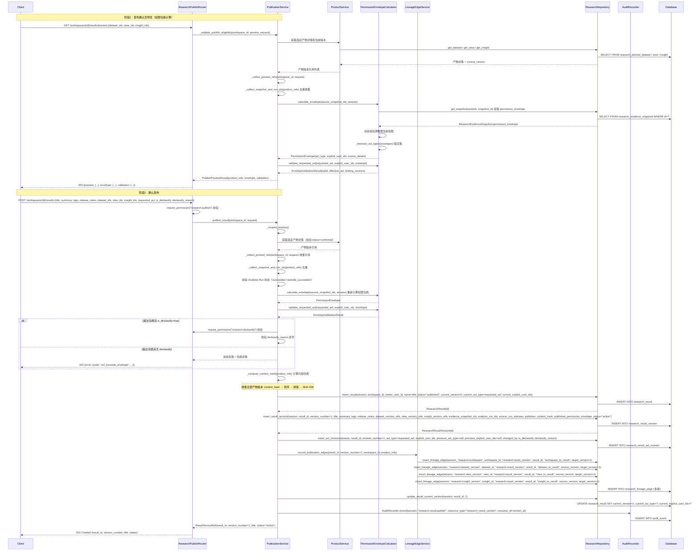
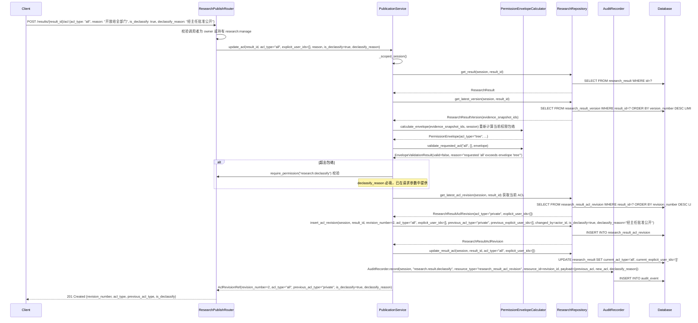
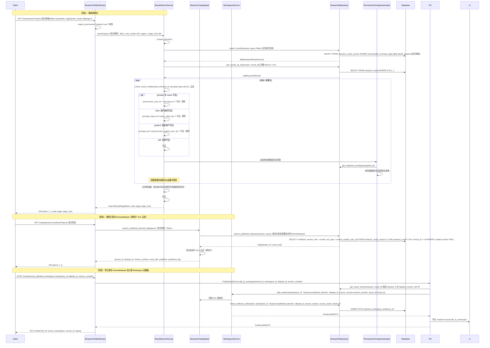
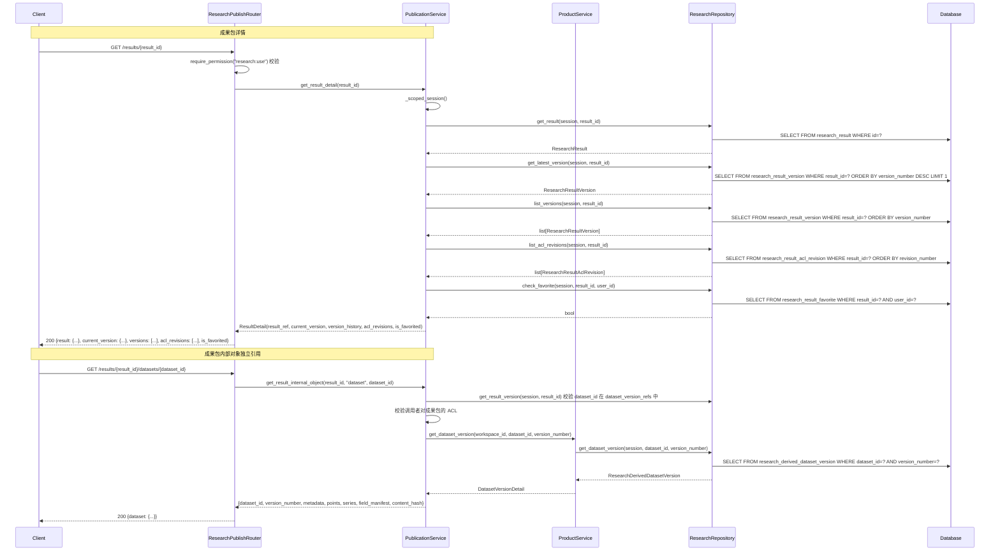
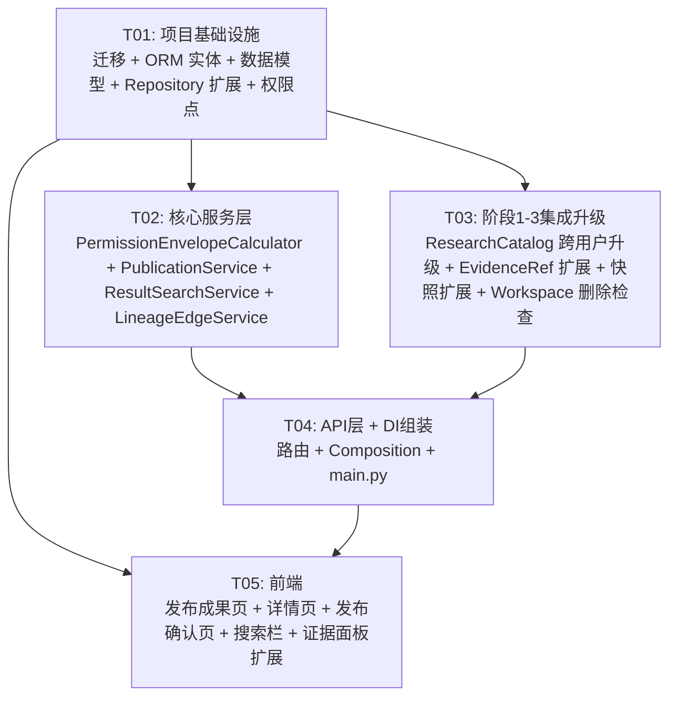

# 架构设计：发布与复用（子项目 4）

> **项目名称**: irip_research_publish
>
> **技术栈**: 后端 Python 3.12+ / FastAPI / SQLAlchemy(异步) / PostgreSQL 16(pgvector) / Redis 7 / Celery；前端 React 18 + TS / Vite / Ant Design 5 / TanStack Router+Query
>
> **日期**: 2026-08-06
>
> **状态**: 评审稿
>
> **依赖基线**: 阶段 1"研究域基础" + 阶段 2"可信执行" + 阶段 3"研究产物"已完成并上线（`docs/prd-research-foundation.md` / `docs/arch-research-foundation.md` / `docs/prd-research-trusted-execution.md` / `docs/arch-research-trusted-execution.md` / `docs/prd-research-products.md` / `docs/arch-research-products.md`）
>
> **关联 PRD**: `docs/prd-research-publish.md`

---

## 目录

- [1. 实现方案与框架选型](#1-实现方案与框架选型)
  - [1.1 技术挑战分析](#11-技术挑战分析)
  - [1.2 框架选型](#12-框架选型)
  - [1.3 架构模式](#13-架构模式)
  - [1.4 模块隔离策略](#14-模块隔离策略)
- [2. 文件列表及相对路径](#2-文件列表及相对路径)
  - [2.1 后端新增文件](#21-后端新增文件)
  - [2.2 后端修改文件](#22-后端修改文件)
  - [2.3 前端新增文件](#23-前端新增文件)
  - [2.4 前端修改文件](#24-前端修改文件)
- [3. 数据结构和接口（类图）](#3-数据结构和接口类图)
- [4. 程序调用流程（时序图）](#4-程序调用流程时序图)
- [5. 任务列表（有序，含依赖关系）](#5-任务列表有序含依赖关系)
- [6. 依赖包列表](#6-依赖包列表)
- [7. 共享知识（跨文件约定）](#7-共享知识跨文件约定)
- [8. 待明确事项](#8-待明确事项)

---

## 1. 实现方案与框架选型

### 1.1 技术挑战分析

| 挑战 | 难点 | 方案 |
|------|------|------|
| **成果包组装与版本不可变** | 从 Workspace 中勾选已确认的 DerivedDataset/ResearchView/Insight，收集各产物当前版本引用，组装为 ResearchResult（稳定身份）+ ResearchResultVersion（不可变发布版本）。版本创建后不允许 UPDATE/DELETE，旧版本可标记 superseded/withdrawn 但不物理删除 | `PublicationService.publish_result()` 编排完整发布流程：校验产物 → 收集引用 → 计算权限包络 → 校验 ACL → 计算内容哈希 → 创建 Result + Version + AclRevision + LineageEdge。Repository 层不提供版本实体的 update/delete 方法（`status` 字段除外，仅由 `research:manage` 权限操作） |
| **权限包络交集计算与动态校验** | 发布时需校验 `requested_acl` 不超过全部源数据当前权限包络的交集。运行时搜索/详情/下载按当前权限动态过滤，不依赖创建时静态授权快照。源权限收紧后成果有效可见范围同步收紧 | `PermissionEnvelopeCalculator` 静态工具类：从 Evidence Snapshot 的 `permission_envelope` 获取源权限包络 → 动态校验源数据当前权限 → 计算交集 → 返回 `PermissionEnvelope`。`validate_requested_acl()` 校验请求 ACL 是否在包络内（private 始终在包络内，all 需包络为 all）。`ResultSearchService` 每次请求动态过滤 |
| **ACL 修改与 declassify 审计** | ACL 修改不产生数据版本，而产生独立 `ResultAclRevision`（仅追加）。扩大到权限包络之外需 `research:declassify` 权限 + 理由 + 审计 | `PublicationService.update_acl()` 编排 ACL 修改：校验权限 → 权限包络校验 → 超出包络则校验 `research:declassify` + 理由 → 创建新 AclRevision（记录前后值 + is_declassify + declassify_reason）→ 更新 Result.current_acl_type/current_explicit_user_ids → 审计。AclRevision 仅追加，Repository 不提供 update/delete 方法 |
| **ResearchCatalog 跨用户 ACL 过滤升级** | 阶段 3 的 ResearchCatalogImpl 仅搜索当前用户已确认 DerivedDataset（owner 过滤），需升级为跨用户 ACL 过滤搜索已发布成果包中的 DerivedDataset | `ResearchCatalogImpl` 新增 `search_published_derived_data()` 方法：查询 `research_result_version` 的 `dataset_version_refs` → JOIN `research_result` 获取 ACL → 按当前用户权限动态过滤（private/tree/explicit/all + 源数据权限动态校验）→ 返回包含 result_id/dataset_id/version_number/result_title/publisher/published_at 的结果 |
| **已发布 DerivedDataset 作为新 Workspace 证据** | WorkspaceEvidenceRef 的 source_namespace 扩展支持 `research:published_derived`，加入时需校验成果包 ACL 和版本，快照冻结时捕获已发布 DerivedDataset 版本和内容哈希 | `WorkspaceService.add_evidence()` 增加 `research:published_derived` 命名空间分支 → 通过 ResearchCatalog 校验 ACL 和版本 → 插入 evidence_ref（记录 result_id + dataset_id + version_number）→ 快照冻结时从 ResearchResultVersion 的 dataset_version_refs 解析获取 DerivedDatasetVersion 的 content_hash 纳入哈希计算 |
| **发布时内容哈希与溯源边记录** | content_hash 为全部选定产物版本引用内容的 SHA-256 哈希；发布时创建细粒度溯源边（workspace→result_version, dataset_version→result_version, view_version→result_version, insight_version→result_version），为阶段 5 联邦溯源预留数据入口 | `PublicationService._compute_content_hash()` 收集全部产物版本的已有 content_hash → 按引用列表排序 → 拼接 → SHA-256。`LineageEdgeService.record_publication_edges()` 创建细粒度溯源边记录（仅追加） |
| **发布成果页搜索与权限过滤** | 发布成果页支持关键词/筛选/权限过滤，搜索结果按当前权限实时过滤。三种视图（全部成果/我发布的/我收藏的）。P1 支持基于 pgvector 的语义搜索 | `ResultSearchService.search()` 基础查询用 PostgreSQL 全文索引（title/summary/tags）→ 权限过滤（动态，按 current_acl_type + 源数据当前权限）→ 筛选器应用（发布者/时间/来源任务/数据类型/标签）→ 分页。P1 语义搜索用 pgvector 向量相似度排序，发布时异步生成向量 |

### 1.2 框架选型

| 层 | 技术 | 说明 |
|----|------|------|
| 后端框架 | FastAPI + SQLAlchemy 异步 | 延续阶段 1-3 模式 |
| ORM 类型 | `Mapped[] + mapped_column()` + `GUID` / `UTCDateTime` / `JSONB` | 延续 `packages/common/db_types.py` |
| Service 模式 | `ScopedSessionMixin` + `session_factory / department_id / actor_id` | 延续 `packages/facts/service.py` |
| Repository 模式 | 静态方法，操作 session | 延续 `packages/research/repository.py` |
| DI 模式 | Composition Root + provider `register(ctx)` | 延续 `apps/api/composition/` |
| 权限 | `require_permission("research:publish")` / `require_permission("research:declassify")` 依赖 | 阶段 4 新增 2 个权限点 |
| 审计 | `AuditRecorder.record(session, event)` 静态方法 | 延续 `packages/audit/repository.py` |
| 迁移 | Alembic `op.execute()` 原生 SQL，编号 0077 | 延续 `migrations/versions/` |
| 全文搜索 | PostgreSQL `tsvector` + `GIN` 索引 | 发布时同步写入基础索引 |
| 语义搜索（P1） | pgvector + 异步向量生成 | 发布时异步生成嵌入向量 |
| 前端框架 | React 18 + Vite + Ant Design 5 | 延续 `apps/web/` |
| 前端数据 | Axios `http` 实例 + 纯 async 函数 | 延续 `apps/web/src/api/client.ts` |

**无新增第三方依赖。** 发布与复用所需功能完全使用现有技术栈实现（pgvector 已在阶段 1 基线中作为 PostgreSQL 16 扩展启用）。

### 1.3 架构模式

延续阶段 1-3 的 **ScopedSessionMixin + Composition Root** 模式，新增服务遵循同样的依赖注入模式：

- **Service 层**：`PublicationService` / `ResultSearchService` 继承 `ScopedSessionMixin`，构造函数注入 `session_factory / department_id / actor_id / 依赖服务`
- **Repository 层**：`ResearchRepository` 静态方法扩展，新增成果包 CRUD 方法
- **Strategy 模式**：`PermissionEnvelopeCalculator` 负责权限包络交集计算与动态校验，独立于 Service（纯静态方法）
- **Service 模式**：`LineageEdgeService` 封装溯源边记录逻辑，为阶段 5 ResearchLineageAdapter 提供数据源
- **升级扩展**：`ResearchCatalogImpl` 新增跨用户 ACL 过滤搜索方法，保留原有"我的衍生"搜索

### 1.4 模块隔离策略

延续阶段 1-3 原则：
- 新增 5 张表均以 `research_` 前缀命名
- 研究表之间 FK 允许保留（`research_result_acl_revision.result_id → research_result.id ON DELETE CASCADE` 等）
- 研究表到 `research_workspace` / `app_user` 的 FK 允许保留（同为研究域内部表 / 稳定基础表）
- 跨模块引用（如 Evidence Snapshot ID）保存为逻辑引用（JSONB），不建数据库级 FK
- 迁移编号延续 `0077`（阶段 1 为 `0074`，阶段 2 为 `0075`，阶段 3 为 `0076`）
- 关闭 `RESEARCH_MODULE_ENABLED` 后研究 API 路由不注册，原系统正常
- 新增 `research:publish` / `research:declassify` 权限点，在 `packages/auth/permissions.py` 中定义
- `ResearchCatalog` 接口签名扩展（新增 `search_published_derived_data` 方法），不影响已有调用方

---

## 2. 文件列表及相对路径

### 2.1 后端新增文件

| # | 文件路径 | 职责 |
|---|---------|------|
| 1 | `packages/research/publication.py` | **PublicationService** — 成果包组装/发布/版本/ACL 修改/撤回（编排完整发布流程：校验产物→收集引用→权限包络校验→内容哈希→创建 Result+Version+AclRevision+LineageEdge） |
| 2 | `packages/research/search.py` | **ResultSearchService** — 成果包搜索/筛选/权限过滤（PostgreSQL 全文索引 + 动态 ACL 过滤 + 源数据权限动态校验） |
| 3 | `packages/research/envelope.py` | **PermissionEnvelopeCalculator** — 权限包络交集计算/动态校验（从 Evidence Snapshot 获取源权限包络 + 交集计算 + requested_acl 校验） |
| 4 | `packages/research/lineage.py` | **LineageEdgeService** — 溯源边记录（发布时创建细粒度溯源边：workspace→result_version, products→result_version） |
| 5 | `apps/api/routers/research_publish.py` | API 路由：成果包发布/查询/管理/内部对象引用/搜索/复用操作/ResearchCatalog 跨用户搜索 全部端点 |
| 6 | `apps/api/composition/research_publish.py` | Composition provider：发布域依赖注入注册 |

### 2.2 后端修改文件

| # | 文件路径 | 修改内容 |
|---|---------|---------|
| 7 | `migrations/versions/0077_research_publish.py` | Alembic 迁移：创建 5 张新表 + 索引 + 约束 + 全文搜索索引 + pgvector 索引（P1） |
| 8 | `packages/research/entities.py` | 新增 5 个 ORM 实体：`ResearchResult` / `ResearchResultVersion` / `ResearchResultAclRevision` / `ResearchLineageEdge` / `ResearchResultFavorite` |
| 9 | `packages/research/models.py` | 新增 dataclass：`ResultRef` / `ResultVersionRef` / `ResultDetail` / `ResultVersionDetail` / `AclRevisionRef` / `SearchResultItem` / `PublishRequest` / `PermissionEnvelope` / `LineageEdgeRef` / `EnvelopeValidationResult` 等 |
| 10 | `packages/research/repository.py` | 扩展 `ResearchRepository` 新增方法：result CRUD / result_version CRUD / acl_revision CRUD / lineage_edge CRUD / favorite CRUD / search_published |
| 11 | `packages/research/catalog.py` | `ResearchCatalogImpl` 新增 `search_published_derived_data()` 方法（跨用户 ACL 过滤搜索已发布 DerivedDataset） |
| 12 | `packages/research/service.py` | `WorkspaceService.add_evidence()` 增加 `research:published_derived` 命名空间分支；`delete_workspace()` 升级删除检查（检查已发布成果包） |
| 13 | `packages/research/snapshots.py` | `EvidenceSnapshotService.freeze_snapshot()` 增加 `research:published_derived` 命名空间分支：从 ResearchResultVersion 的 dataset_version_refs 解析获取 DerivedDatasetVersion content_hash |
| 14 | `packages/auth/permissions.py` | 新增 `RESEARCH_PUBLISH` / `RESEARCH_DECLASSIFY` 权限点常量 |
| 15 | `apps/api/main.py` | 条件注册 `research_publish_router` |
| 16 | `apps/api/composition/__init__.py` | `register_all()` 中条件调用 `register_research_publish(ctx)` |

### 2.3 前端新增文件

| # | 文件路径 | 职责 |
|---|---------|------|
| 17 | `apps/web/src/features/research/PublicationPage.tsx` | 发布成果页（Tab 激活）：三种视图（全部成果/我发布的/我收藏的）+ 搜索 + 筛选 + 成果包卡片列表 + 分页 |
| 18 | `apps/web/src/features/research/ResultCard.tsx` | 成果包列表卡片：标题/摘要/发布者/时间/版本号/产物数量/权限标识 |
| 19 | `apps/web/src/features/research/ResultDetailView.tsx` | 成果包详情页：左侧衍生来源（Workspace/研究问题/源数据/Snapshot/Run/版本历史/权限变更记录）+ 右侧版本内容（metadata/points/series/Views/Insights Tab） |
| 20 | `apps/web/src/features/research/ResultVersionHistory.tsx` | 版本历史组件：版本列表 + 版本对比（P1） |
| 21 | `apps/web/src/features/research/AclRevisionList.tsx` | 权限变更记录组件：ACL Revision 历史（前后值 + 操作者 + 时间 + 原因 + declassify 标记） |
| 22 | `apps/web/src/features/research/PublishConfirmModal.tsx` | 发布确认页：选定成果区 + 成果包信息区 + 权限与可见范围区 + 溯源引用区 |
| 23 | `apps/web/src/features/research/PermissionEnvelopeView.tsx` | 权限包络计算结果展示：源数据权限交集 vs 请求范围 vs 有效范围 |
| 24 | `apps/web/src/features/research/ResultSearchBar.tsx` | 成果包搜索栏：关键词搜索 + 筛选器（发布者/时间/来源任务/数据类型/标签）+ 语义搜索切换（P1） |
| 25 | `apps/web/src/features/research/PublishButton.tsx` | Workspace 内发布入口按钮：已确认产物列表下方"发布研究成果包"按钮 |
| 26 | `apps/web/src/api/researchPublish.ts` | 成果包相关 API 函数：发布/查询/版本/ACL/搜索/收藏/复用/Catalog 全部端点 |

### 2.4 前端修改文件

| # | 文件路径 | 修改内容 |
|---|---------|---------|
| 27 | `apps/web/src/features/research/EvidencePanel.tsx` | 左栏扩展：搜索类型筛选新增"已发布"选项；选择"已发布"时调用跨用户 ACL 过滤搜索；已选证据列表中已发布 DerivedDataset 显示"已发布:"前缀 + 成果包 ACL |
| 28 | `apps/web/src/features/research/ResearchCanvas.tsx` | 集成 `PublishButton` 到已确认产物列表下方 |
| 29 | `apps/web/src/features/dashboard/LabOpsPage.tsx` | "发布成果"Tab 从空占位激活为 `PublicationPage`（功能开关开启时） |
| 30 | `apps/web/src/api/research.ts` | 新增 `research:published_derived` 证据加入相关类型和 API 函数 |

---

## 3. 数据结构和接口（类图）

### 3.1 类图（Mermaid）

```mermaid
classDiagram
    direction TB

    %% ===== 新增 ORM 实体 =====

    class ResearchResult {
        +UUID id
        +UUID workspace_id
        +UUID owner_user_id
        +str name
        +str status
        +int current_version
        +str current_acl_type
        +list current_explicit_user_ids
        +datetime created_at
        +datetime updated_at
        +int lock_version
    }

    class ResearchResultVersion {
        +UUID id
        +UUID result_id
        +int version_number
        +str title
        +str summary
        +list tags
        +str release_notes
        +list dataset_version_refs
        +list view_version_refs
        +list insight_version_refs
        +list evidence_snapshot_ids
        +list analysis_run_ids
        +dict source_run_statuses
        +UUID publisher
        +datetime published_at
        +str content_hash
        +dict published_permission_envelope
        +str status
        +datetime created_at
    }

    class ResearchResultAclRevision {
        +UUID id
        +UUID result_id
        +int revision_number
        +str acl_type
        +list explicit_user_ids
        +str previous_acl_type
        +list previous_explicit_user_ids
        +UUID changed_by
        +datetime changed_at
        +str change_reason
        +bool is_declassify
        +str declassify_reason
    }

    class ResearchLineageEdge {
        +UUID id
        +str source_namespace
        +UUID source_id
        +int source_version
        +str target_namespace
        +UUID target_id
        +int target_version
        +str edge_type
        +datetime created_at
    }

    class ResearchResultFavorite {
        +UUID id
        +UUID result_id
        +UUID user_id
        +datetime created_at
    }

    %% ===== 与阶段 1-3 实体的关系 =====

    class ResearchWorkspace {
        +UUID id
        +UUID owner_user_id
        +str name
        +str status
    }

    class ResearchDerivedDatasetVersion {
        +UUID id
        +UUID dataset_id
        +int version_number
        +str content_hash
    }

    class ResearchViewVersion {
        +UUID id
        +UUID view_id
        +int version_number
        +str image_content_hash
    }

    class ResearchInsightVersion {
        +UUID id
        +UUID insight_id
        +int version_number
    }

    class ResearchEvidenceSnapshot {
        +UUID id
        +dict permission_envelope
    }

    class ResearchAnalysisRun {
        +UUID id
        +str status
    }

    ResearchResult "1" --> "many" ResearchResultVersion : result_id
    ResearchResult "1" --> "many" ResearchResultAclRevision : result_id
    ResearchResult "1" --> "many" ResearchResultFavorite : result_id
    ResearchResult --> ResearchWorkspace : workspace_id
    ResearchResultVersion --> ResearchResult : result_id (逻辑引用 dataset/view/insight version refs)
    ResearchResultVersion --> ResearchEvidenceSnapshot : evidence_snapshot_ids (JSONB 逻辑引用)
    ResearchResultVersion --> ResearchAnalysisRun : analysis_run_ids (JSONB 逻辑引用)
    ResearchLineageEdge --> ResearchResultVersion : target_id (target_namespace=research:result_version)
    ResearchLineageEdge --> ResearchWorkspace : source_id (source_namespace=research:workspace)
    ResearchLineageEdge --> ResearchDerivedDatasetVersion : source_id (source_namespace=research:dataset_version)
    ResearchLineageEdge --> ResearchViewVersion : source_id (source_namespace=research:view_version)
    ResearchLineageEdge --> ResearchInsightVersion : source_id (source_namespace=research:insight_version)

    %% ===== Service 层 =====

    class PublicationService {
        +async_sessionmaker _factory
        +UUID _dept_id
        +UUID _actor_id
        +ProductService _product_service
        +LineageEdgeService _lineage_service
        +__init__(factory, dept_id, actor_id, product_service, lineage_service)
        +publish_result(workspace_id, request) ResultVersionRef
        +publish_new_version(result_id, workspace_id, request) ResultVersionRef
        +update_acl(result_id, acl_type, explicit_user_ids, reason, is_declassify, declassify_reason) AclRevisionRef
        +withdraw_result(result_id, version_number) void
        +update_result_metadata(result_id, name) ResultRef
        +add_to_workspace(result_id, workspace_id, dataset_id, version_number) EvidenceRefDTO
        +new_workspace_from_result(result_id, workspace_name, question_text) WorkspaceRef
        +toggle_favorite(result_id, is_favorite) void
        +get_result_detail(result_id) ResultDetail
        +get_version_detail(result_id, version_number) ResultVersionDetail
        +list_versions(result_id) list~ResultVersionRef~
        +list_acl_revisions(result_id) list~AclRevisionRef~
        +get_result_internal_object(result_id, object_type, object_id) dict
        +_validate_publish_eligibility(workspace_id, request) ValidationResult
        +_collect_product_refs(workspace_id, request) ProductRefCollection
        +_collect_snapshot_and_run_ids(product_refs) tuple
        +_compute_content_hash(product_refs) str
        +_validate_acl_against_envelope(requested_acl, envelope, is_declassify) EnvelopeValidationResult
    }

    class ResultSearchService {
        +async_sessionmaker _factory
        +UUID _dept_id
        +UUID _actor_id
        +__init__(factory, dept_id, actor_id)
        +search(query, filters, view_mode, page, page_size) SearchResultPage
        +list_results(view_mode, page, page_size) SearchResultPage
        +_filter_by_acl(results, principal) list
        +_filter_by_source_permission(results) list
        +_apply_filters(query, filters) Query
        +_check_result_visible(result, principal) bool
    }

    class PermissionEnvelopeCalculator {
        <<static>>
        +calculate_envelope(source_snapshot_ids, session) PermissionEnvelope
        +validate_requested_acl(requested_acl, explicit_user_ids, envelope) EnvelopeValidationResult
        +intersect_envelopes(envelopes) PermissionEnvelope
        +_get_snapshot_envelope(snapshot_id, session) dict
        +_dynamically_validate_source(snapshot_id, session) bool
        +_acl_rank(acl_type) int
        +_intersect_acl_types(types) str
    }

    class LineageEdgeService {
        +async_sessionmaker _factory
        +__init__(factory)
        +record_publication_edges(result_id, version_number, workspace_id, product_refs) void
        +record_edge(source_namespace, source_id, target_namespace, target_id, edge_type, source_version, target_version) void
        +list_edges_by_source(source_namespace, source_id) list~LineageEdgeRef~
        +list_edges_by_target(target_namespace, target_id) list~LineageEdgeRef~
    }

    %% ===== 值对象 =====

    class PublishRequest {
        +str title
        +str summary
        +list tags
        +str release_notes
        +list dataset_ids
        +list view_ids
        +list insight_ids
        +str requested_acl
        +list explicit_user_ids
        +bool is_declassify
        +str declassify_reason
    }

    class PermissionEnvelope {
        +str acl_type
        +list explicit_user_ids
        +list source_details
    }

    class EnvelopeValidationResult {
        +bool valid
        +str effective_acl
        +str reason
        +list limiting_sources
    }

    class ProductRefCollection {
        +list dataset_version_refs
        +list view_version_refs
        +list insight_version_refs
        +list evidence_snapshot_ids
        +list analysis_run_ids
        +dict source_run_statuses
    }

    class ResultRef {
        +UUID result_id
        +str name
        +str status
        +int current_version
        +str current_acl_type
    }

    class ResultVersionRef {
        +UUID result_id
        +int version_number
        +str title
        +str status
        +datetime published_at
    }

    class ResultDetail {
        +ResultRef result_ref
        +ResultVersionDetail current_version
        +list version_history
        +list acl_revisions
        +bool is_favorited
    }

    class ResultVersionDetail {
        +UUID result_id
        +int version_number
        +str title
        +str summary
        +list tags
        +str release_notes
        +list dataset_version_refs
        +list view_version_refs
        +list insight_version_refs
        +list evidence_snapshot_ids
        +list analysis_run_ids
        +dict source_run_statuses
        +UUID publisher
        +datetime published_at
        +str content_hash
        +dict published_permission_envelope
        +str status
    }

    class AclRevisionRef {
        +int revision_number
        +str acl_type
        +list explicit_user_ids
        +str previous_acl_type
        +list previous_explicit_user_ids
        +UUID changed_by
        +datetime changed_at
        +str change_reason
        +bool is_declassify
        +str declassify_reason
    }

    class SearchResultItem {
        +UUID result_id
        +str name
        +str title
        +str summary
        +list tags
        +UUID publisher
        +datetime published_at
        +int current_version
        +str current_acl_type
        +int dataset_count
        +int view_count
        +int insight_count
    }

    class SearchResultPage {
        +list items
        +int total
        +int page
        +int page_size
    }

    class LineageEdgeRef {
        +str source_namespace
        +UUID source_id
        +int source_version
        +str target_namespace
        +UUID target_id
        +int target_version
        +str edge_type
    }

    %% ===== 关系 =====

    PublicationService --> ProductService : 获取产物详情和版本
    PublicationService --> PermissionEnvelopeCalculator : 权限包络校验
    PublicationService --> LineageEdgeService : 溯源边记录
    PublicationService --> ResearchRepository : 调用
    ResultSearchService --> PermissionEnvelopeCalculator : 动态权限校验
    ResultSearchService --> ResearchRepository : 调用
    LineageEdgeService --> ResearchRepository : 调用
    PublicationService ..> PublishRequest : 接收
    PublicationService ..> ProductRefCollection : 内部组装
    PublicationService ..> ResultVersionRef : 返回
    PublicationService ..> ResultDetail : 返回
    ResultSearchService ..> SearchResultPage : 返回
    PermissionEnvelopeCalculator ..> PermissionEnvelope : 返回
    PermissionEnvelopeCalculator ..> EnvelopeValidationResult : 返回
```

### 3.2 ORM 实体详细定义

#### 3.2.1 ResearchResult（`research_result`）

```python
class ResearchResult(Base):
    __tablename__ = "research_result"

    id: Mapped[UUID] = mapped_column(GUID, primary_key=True, default=new_id)
    workspace_id: Mapped[UUID] = mapped_column(
        GUID, sa.ForeignKey("research_workspace.id", ondelete="CASCADE"), nullable=False
    )
    owner_user_id: Mapped[UUID] = mapped_column(
        GUID, sa.ForeignKey("app_user.id"), nullable=False
    )
    name: Mapped[str] = mapped_column(sa.Text, nullable=False)
    status: Mapped[str] = mapped_column(
        sa.Text, nullable=False, server_default=sa.text("'published'")
    )
    current_version: Mapped[int] = mapped_column(
        sa.Integer, nullable=False, server_default=sa.text("0")
    )
    current_acl_type: Mapped[str] = mapped_column(
        sa.Text, nullable=False, server_default=sa.text("'private'")
    )
    current_explicit_user_ids: Mapped[list] = mapped_column(
        JSONB, nullable=False, server_default=sa.text("'[]'::jsonb")
    )
    created_at: Mapped[datetime] = mapped_column(
        UTCDateTime, server_default=sa.func.now(), nullable=False
    )
    updated_at: Mapped[datetime] = mapped_column(
        UTCDateTime, server_default=sa.func.now(), nullable=False
    )
    lock_version: Mapped[int] = mapped_column(
        sa.Integer, nullable=False, server_default=sa.text("0")
    )
```

- `status`: `published`（已发布）/ `withdrawn`（已撤回）
- `current_acl_type`: `private` / `tree` / `explicit` / `all`（冗余存储最新 ACL 状态，从最新 AclRevision 同步，便于快速查询）
- `current_explicit_user_ids`: JSONB 数组，`explicit` 模式下指定用户 ID 列表
- 可编辑字段：`name`（仅 stable identity）

#### 3.2.2 ResearchResultVersion（`research_result_version`）

```python
class ResearchResultVersion(Base):
    __tablename__ = "research_result_version"

    id: Mapped[UUID] = mapped_column(GUID, primary_key=True, default=new_id)
    result_id: Mapped[UUID] = mapped_column(
        GUID, sa.ForeignKey("research_result.id", ondelete="CASCADE"), nullable=False
    )
    version_number: Mapped[int] = mapped_column(sa.Integer, nullable=False)
    title: Mapped[str] = mapped_column(sa.Text, nullable=False)
    summary: Mapped[str | None] = mapped_column(sa.Text, nullable=True)
    tags: Mapped[list] = mapped_column(
        JSONB, nullable=False, server_default=sa.text("'[]'::jsonb")
    )
    release_notes: Mapped[str | None] = mapped_column(sa.Text, nullable=True)
    dataset_version_refs: Mapped[list] = mapped_column(
        JSONB, nullable=False, server_default=sa.text("'[]'::jsonb")
    )
    view_version_refs: Mapped[list] = mapped_column(
        JSONB, nullable=False, server_default=sa.text("'[]'::jsonb")
    )
    insight_version_refs: Mapped[list] = mapped_column(
        JSONB, nullable=False, server_default=sa.text("'[]'::jsonb")
    )
    evidence_snapshot_ids: Mapped[list] = mapped_column(
        JSONB, nullable=False, server_default=sa.text("'[]'::jsonb")
    )
    analysis_run_ids: Mapped[list] = mapped_column(
        JSONB, nullable=False, server_default=sa.text("'[]'::jsonb")
    )
    source_run_statuses: Mapped[dict] = mapped_column(
        JSONB, nullable=False, server_default=sa.text("'{}'::jsonb")
    )
    publisher: Mapped[UUID] = mapped_column(
        GUID, sa.ForeignKey("app_user.id"), nullable=False
    )
    published_at: Mapped[datetime] = mapped_column(
        UTCDateTime, server_default=sa.func.now(), nullable=False
    )
    content_hash: Mapped[str] = mapped_column(sa.Text, nullable=False)
    published_permission_envelope: Mapped[dict] = mapped_column(
        JSONB, nullable=False, server_default=sa.text("'{}'::jsonb")
    )
    status: Mapped[str] = mapped_column(
        sa.Text, nullable=False, server_default=sa.text("'active'")
    )
    created_at: Mapped[datetime] = mapped_column(
        UTCDateTime, server_default=sa.func.now(), nullable=False
    )
```

- **不可变**：创建后不允许 UPDATE / DELETE（`status` 字段由 `research:manage` 权限操作除外）
- `dataset_version_refs`: JSONB list of `{dataset_id, version_number}`
- `view_version_refs`: JSONB list of `{view_id, version_number}`
- `insight_version_refs`: JSONB list of `{insight_id, version_number}`（可为空数组）
- `evidence_snapshot_ids`: JSONB list of UUID（从选定产物关联的 snapshot 收集去重）
- `analysis_run_ids`: JSONB list of UUID（从选定产物关联的 run 收集去重）
- `source_run_statuses`: JSONB dict of `{run_id: status}`（部分成功 Run 标注）
- `content_hash`: 全部产物版本引用内容的 SHA-256 哈希
- `published_permission_envelope`: 发布时的权限包络快照（仅供审计参考，运行时以当前权限为准）
- `status`: `active`（活跃）/ `superseded`（已被新版本替代）/ `withdrawn`（已撤回）
- 唯一约束：`UNIQUE (result_id, version_number)`
- 全文搜索索引：`tsvector` 基于 `title` / `summary` / `tags` 生成

#### 3.2.3 ResearchResultAclRevision（`research_result_acl_revision`）

```python
class ResearchResultAclRevision(Base):
    __tablename__ = "research_result_acl_revision"

    id: Mapped[UUID] = mapped_column(GUID, primary_key=True, default=new_id)
    result_id: Mapped[UUID] = mapped_column(
        GUID, sa.ForeignKey("research_result.id", ondelete="CASCADE"), nullable=False
    )
    revision_number: Mapped[int] = mapped_column(sa.Integer, nullable=False)
    acl_type: Mapped[str] = mapped_column(sa.Text, nullable=False)
    explicit_user_ids: Mapped[list] = mapped_column(
        JSONB, nullable=False, server_default=sa.text("'[]'::jsonb")
    )
    previous_acl_type: Mapped[str | None] = mapped_column(sa.Text, nullable=True)
    previous_explicit_user_ids: Mapped[list | None] = mapped_column(JSONB, nullable=True)
    changed_by: Mapped[UUID] = mapped_column(
        GUID, sa.ForeignKey("app_user.id"), nullable=False
    )
    changed_at: Mapped[datetime] = mapped_column(
        UTCDateTime, server_default=sa.func.now(), nullable=False
    )
    change_reason: Mapped[str | None] = mapped_column(sa.Text, nullable=True)
    is_declassify: Mapped[bool] = mapped_column(
        sa.Boolean, nullable=False, server_default=sa.text("false")
    )
    declassify_reason: Mapped[str | None] = mapped_column(sa.Text, nullable=True)
```

- **仅追加**：创建后不允许 UPDATE / DELETE
- `acl_type`: `private` / `tree` / `explicit` / `all`
- `explicit_user_ids`: JSONB list of UUID（`explicit` 模式下指定用户）
- `previous_acl_type` / `previous_explicit_user_ids`: 记录变更前的 ACL 值（首个 Revision 为 null）
- `is_declassify`: 是否为 declassify 操作（突破权限包络）
- `declassify_reason`: declassify 理由（`is_declassify=true` 时必填）
- 唯一约束：`UNIQUE (result_id, revision_number)`

#### 3.2.4 ResearchLineageEdge（`research_lineage_edge`）

```python
class ResearchLineageEdge(Base):
    __tablename__ = "research_lineage_edge"

    id: Mapped[UUID] = mapped_column(GUID, primary_key=True, default=new_id)
    source_namespace: Mapped[str] = mapped_column(sa.Text, nullable=False)
    source_id: Mapped[UUID] = mapped_column(GUID, nullable=False)
    source_version: Mapped[int | None] = mapped_column(sa.Integer, nullable=True)
    target_namespace: Mapped[str] = mapped_column(sa.Text, nullable=False)
    target_id: Mapped[UUID] = mapped_column(GUID, nullable=False)
    target_version: Mapped[int | None] = mapped_column(sa.Integer, nullable=True)
    edge_type: Mapped[str] = mapped_column(sa.Text, nullable=False)
    created_at: Mapped[datetime] = mapped_column(
        UTCDateTime, server_default=sa.func.now(), nullable=False
    )
```

- **仅追加**：创建后不允许 UPDATE / DELETE
- `source_namespace` / `target_namespace`: 命名空间标识（如 `research:workspace` / `research:dataset_version` / `research:result_version`）
- `edge_type`: `workspace_to_result` / `dataset_to_result` / `view_to_result` / `insight_to_result` / `fact_to_snapshot` / `snapshot_to_run` / `run_to_dataset` / `run_to_view` / `dataset_to_insight` / `view_to_insight`
- 索引：`(source_namespace, source_id)` 和 `(target_namespace, target_id)`
- 为阶段 5 `ResearchLineageAdapter` 提供数据源

#### 3.2.5 ResearchResultFavorite（`research_result_favorite`）

```python
class ResearchResultFavorite(Base):
    __tablename__ = "research_result_favorite"

    id: Mapped[UUID] = mapped_column(GUID, primary_key=True, default=new_id)
    result_id: Mapped[UUID] = mapped_column(
        GUID, sa.ForeignKey("research_result.id", ondelete="CASCADE"), nullable=False
    )
    user_id: Mapped[UUID] = mapped_column(
        GUID, sa.ForeignKey("app_user.id"), nullable=False
    )
    created_at: Mapped[datetime] = mapped_column(
        UTCDateTime, server_default=sa.func.now(), nullable=False
    )
```

- 唯一约束：`UNIQUE (result_id, user_id)`

### 3.3 接口与 Service 定义

#### PermissionEnvelopeCalculator（权限包络计算器）

```python
class PermissionEnvelopeCalculator:
    """权限包络计算器。

    计算成果包的有效可见范围：
    effective_result_access = requested_result_acl ∩ current_source_permission_envelopes

    源数据权限包络来源：
    - Evidence Snapshot 的 permission_envelope（阶段 1 冻结时记录）
    - Derived Dataset 的 source_snapshot_id 对应的 permission_envelope
    - 动态校验源数据当前权限（不依赖快照时的静态权限）

    ACL 严格度排序（rank 越高越宽松）：
    private(0) < explicit(1) < tree(2) < all(3)
    """

    @staticmethod
    async def calculate_envelope(
        source_snapshot_ids: list[UUID],
        session: AsyncSession,
    ) -> PermissionEnvelope:
        """计算全部源数据的权限包络交集。

        1. 查询全部 Evidence Snapshot 的 permission_envelope
        2. 对每个 snapshot 动态校验源数据当前权限
        3. 取全部权限范围的交集（取最严格的 ACL）
        4. 返回 PermissionEnvelope(acl_type, explicit_user_ids, source_details)
        """
        ...

    @staticmethod
    def validate_requested_acl(
        requested_acl: str,
        explicit_user_ids: list[UUID],
        envelope: PermissionEnvelope,
    ) -> EnvelopeValidationResult:
        """校验请求的 ACL 是否在权限包络内。

        private: 始终在包络内（最严格）
        tree: 需包络 ACL rank >= tree(2)
        explicit: 需包络 ACL rank >= explicit(1)（且指定用户在包络范围内）
        all: 需包络 ACL rank >= all(3)
        """
        ...

    @staticmethod
    def _acl_rank(acl_type: str) -> int:
        """返回 ACL 严格度排序值。"""
        ...

    @staticmethod
    def _intersect_acl_types(types: list[str]) -> str:
        """取多个 ACL 类型的交集（返回最严格的 ACL 类型）。"""
        ...
```

#### PublicationService（成果包生命周期管理）

```python
class PublicationService(ScopedSessionMixin):
    """研究成果包生命周期管理。

    职责：
    - 成果包组装与发布（创建 ResearchResult + ResearchResultVersion v1）
    - 发布新版本（旧版本标记 superseded，创建新版本）
    - ACL 修改（创建 ResultAclRevision，更新 Result.current_acl_*）
    - 成果撤回（标记版本为 withdrawn）
    - 编辑元数据（仅 stable identity name）
    - 成果包详情 / 版本历史 / ACL 变更记录
    - 成果包内部对象独立引用
    - 复用操作（加入 Workspace / 基于此成果新建 Workspace）
    - 收藏 / 取消收藏
    """

    def __init__(
        self,
        session_factory: async_sessionmaker,
        department_id: UUID,
        actor_id: UUID,
        product_service: ProductService,
        lineage_service: LineageEdgeService,
    ):
        ...

    async def publish_result(
        self, workspace_id: UUID, request: PublishRequest,
    ) -> ResultVersionRef:
        """组装并发布研究成果包。

        流程（PRD 6.9 节）：
        1. 校验 research:publish 权限
        2. 校验选定产物全部属于该 Workspace 且 status=confirmed
           - 通过 ProductService 获取产物详情和当前版本
        3. 收集 Evidence Snapshot ID 和 Analysis Run ID（从选定产物的来源去重）
        4. 校验 Analysis Run 状态（succeeded / partially_succeeded）
        5. 计算权限包络
           - PermissionEnvelopeCalculator.calculate_envelope(source_snapshot_ids)
        6. 校验 requested_acl 不超过包络交集
           - 超出 → 校验 research:declassify 权限 + 理由
        7. 计算内容哈希
           - 收集全部产物版本的 content_hash → 排序 → 拼接 → SHA-256
        8. 创建 ResearchResult（stable identity）
        9. 创建 ResearchResultVersion v1（不可变）
        10. 创建 ResultAclRevision #1（记录初始 ACL）
        11. 创建 ResearchLineageEdge 记录（workspace→result, products→result）
        12. 更新 ResearchResult.current_version=1, current_acl_type, current_explicit_user_ids
        13. 审计 research.result.publish
        14. 返回 ResultVersionRef
        """
        ...

    async def publish_new_version(
        self, result_id: UUID, workspace_id: UUID, request: PublishRequest,
    ) -> ResultVersionRef:
        """发布新版本。

        1. 获取 ResearchResult（校验归属和状态）
        2. 校验 research:publish 权限
        3. 校验选定产物（同 publish_result）
        4. 计算权限包络（重新校验当前源数据权限）
        5. 校验 requested_acl（同上）
        6. 计算内容哈希
        7. 标记旧版本为 superseded
        8. 创建 ResearchResultVersion (version_number+1)
        9. 创建 ResearchLineageEdge 记录
        10. 更新 ResearchResult.current_version
        11. 审计 research.result.new_version
        """
        ...

    async def update_acl(
        self, result_id: UUID, acl_type: str,
        explicit_user_ids: list[UUID] | None, reason: str | None,
        is_declassify: bool, declassify_reason: str | None,
    ) -> AclRevisionRef:
        """修改成果包 ACL。

        1. 校验调用者为 owner 或持有 research:manage
        2. 计算当前权限包络（重新校验当前源数据权限）
        3. 校验新 ACL 不超过包络交集
           - 超出 → 校验 research:declassify 权限 + declassify_reason 必填
        4. 创建 ResultAclRevision（记录前后值 + is_declassify + declassify_reason）
        5. 更新 ResearchResult.current_acl_type / current_explicit_user_ids
        6. 审计 research.result.acl_change（或 research.result.declassify）
        """
        ...

    async def withdraw_result(
        self, result_id: UUID, version_number: int | None,
    ) -> None:
        """撤回成果包。

        1. 校验 research:manage 权限
        2. 标记 ResearchResultVersion.status = 'withdrawn'
        3. 若 version_number 为 None，撤回全部版本
        4. 审计 research.result.withdraw
        5. 更新 ResearchResult.status = 'withdrawn'（如全部版本撤回）
        """
        ...

    async def update_result_metadata(
        self, result_id: UUID, name: str,
    ) -> ResultRef:
        """编辑成果包元数据（仅 stable identity name）。"""
        ...

    async def add_to_workspace(
        self, result_id: UUID, workspace_id: UUID,
        dataset_id: UUID, version_number: int,
    ) -> EvidenceRefDTO:
        """将成果包内 DerivedDataset 加入指定 Workspace 证据集。

        1. 校验成果包 ACL（当前用户有权查看）
        2. 校验 dataset_id 在成果包版本的 dataset_version_refs 中
        3. 通过 WorkspaceService.add_evidence() 加入（source_namespace="research:published_derived"）
        4. 审计 research.result.add_to_workspace
        """
        ...

    async def new_workspace_from_result(
        self, result_id: UUID, workspace_name: str, question_text: str,
    ) -> WorkspaceRef:
        """基于此成果新建 Workspace。

        1. 校验成果包 ACL
        2. 创建新 Workspace
        3. 将成果包内全部 DerivedDataset 作为证据加入
        """
        ...

    async def toggle_favorite(
        self, result_id: UUID, is_favorite: bool,
    ) -> None:
        """收藏 / 取消收藏成果包。"""
        ...

    async def get_result_detail(self, result_id: UUID) -> ResultDetail:
        """获取成果包详情（含当前版本内容 + 衍生来源 + 权限状态）。"""
        ...

    async def get_version_detail(
        self, result_id: UUID, version_number: int,
    ) -> ResultVersionDetail:
        """获取版本详情。"""
        ...

    async def list_versions(self, result_id: UUID) -> list[ResultVersionRef]:
        """版本历史列表。"""
        ...

    async def list_acl_revisions(self, result_id: UUID) -> list[AclRevisionRef]:
        """权限变更记录列表。"""
        ...

    async def get_result_internal_object(
        self, result_id: UUID, object_type: str, object_id: UUID,
    ) -> dict:
        """获取成果包内指定对象（校验成果包 ACL）。

        object_type: 'dataset' / 'view' / 'insight'
        """
        ...
```

#### ResultSearchService（成果包搜索）

```python
class ResultSearchService(ScopedSessionMixin):
    """成果包搜索服务。

    职责：
    - 成果包列表（三种视图：全部成果/我发布的/我收藏的）
    - 关键词搜索（PostgreSQL 全文索引匹配 title/summary/tags）
    - 筛选器（发布者/时间/来源任务/数据类型/标签）
    - 权限过滤（动态，按 current_acl_type + 源数据当前权限）
    - P1: pgvector 语义搜索
    """

    def __init__(
        self,
        session_factory: async_sessionmaker,
        department_id: UUID,
        actor_id: UUID,
    ):
        ...

    async def search(
        self, query: str | None, filters: dict | None,
        view_mode: str, page: int, page_size: int,
    ) -> SearchResultPage:
        """关键词搜索成果包。

        流程（PRD 6.10 节）：
        1. 基础查询：PostgreSQL 全文索引匹配 title/summary/tags
        2. 权限过滤（动态）：
           a. 获取全部 research_result 的 current_acl_type
           b. 对每个成果包按 ACL 过滤：
              - private: 仅 owner 可见
              - tree: principal 在 owner 的部门树内可见
              - explicit: principal 在 explicit_user_ids 内可见
              - all: 全部可见
           c. 源数据权限动态校验：
              - 获取成果包版本的 evidence_snapshot_ids
              - 动态校验源数据当前权限
              - 权限收紧的成果包从结果中排除
        3. 筛选器应用（发布者/时间/来源任务/数据类型/标签）
        4. 分页返回
        """
        ...

    async def list_results(
        self, view_mode: str, page: int, page_size: int,
    ) -> SearchResultPage:
        """成果包列表（无关键词搜索）。"""
        ...

    def _check_result_visible(
        self, result: ResearchResult, principal_id: UUID, principal_dept_id: UUID,
    ) -> bool:
        """校验当前用户是否有权查看成果包（基于 ACL）。"""
        ...
```

#### LineageEdgeService（溯源边记录）

```python
class LineageEdgeService:
    """研究侧溯源边记录服务。

    为阶段 5 ResearchLineageAdapter 提供数据源。
    溯源边仅追加（append-only），创建后不允许 UPDATE/DELETE。
    """

    def __init__(self, session_factory: async_sessionmaker):
        self._factory = session_factory

    async def record_publication_edges(
        self, result_id: UUID, version_number: int,
        workspace_id: UUID, product_refs: ProductRefCollection,
    ) -> None:
        """发布时创建溯源边记录。

        创建以下细粒度边（Q6 决策）：
        - workspace → result_version (edge_type: workspace_to_result)
        - dataset_version → result_version (edge_type: dataset_to_result)
        - view_version → result_version (edge_type: view_to_result)
        - insight_version → result_version (edge_type: insight_to_result)
        """
        ...

    async def record_edge(
        self, source_namespace: str, source_id: UUID,
        target_namespace: str, target_id: UUID,
        edge_type: str,
        source_version: int | None = None,
        target_version: int | None = None,
    ) -> None:
        """记录单条溯源边。"""
        ...

    async def list_edges_by_source(
        self, source_namespace: str, source_id: UUID,
    ) -> list[LineageEdgeRef]:
        """按源节点查询溯源边（阶段 5 使用）。"""
        ...

    async def list_edges_by_target(
        self, target_namespace: str, target_id: UUID,
    ) -> list[LineageEdgeRef]:
        """按目标节点查询溯源边（阶段 5 使用）。"""
        ...
```

---

## 4. 程序调用流程（时序图）

### 4.1 成果包发布流程



### 4.2 ACL 修改与 declassify 流程



### 4.3 成果包搜索与复用流程



### 4.4 成果包详情与内部对象引用流程



---

## 5. 任务列表（有序，含依赖关系）

### 任务依赖图



**依赖说明**：
- T01 为地基，所有后续任务依赖它（ORM 实体、数据模型、Repository 方法、权限点定义）
- T02 和 T03 可并行开发（T02 依赖 T01 实现核心业务逻辑，T03 依赖 T01 做集成改造）
- T04 依赖 T02 + T03（需要服务类实现才能注册 DI 和编写路由）
- T05 依赖 T01 + T04（前端基于 API 数据结构开发，需 API 就绪后联调，但可先用 mock 数据并行开发）

---

### T01: 项目基础设施（迁移 + ORM 实体 + 数据模型 + Repository 扩展 + 权限点）

| 项目 | 内容 |
|------|------|
| **任务描述** | 建立发布与复用模块的数据层地基：5 张新表的 Alembic 迁移（编号 0077）、5 个 ORM 实体类定义、请求/响应数据类、Repository 扩展方法、2 个新权限点定义 |
| **涉及文件** | `migrations/versions/0077_research_publish.py`（新增）<br/>`packages/research/entities.py`（修改：+5 ORM 实体）<br/>`packages/research/models.py`（修改：+新 dataclass）<br/>`packages/research/repository.py`（修改：+成果包 CRUD 方法）<br/>`packages/auth/permissions.py`（修改：+2 权限点） |
| **依赖前序任务** | 无（阶段 1-3 已提供基线） |
| **优先级** | P0 |

**详细实现要点**：

1. **迁移 `0077`**：
   - `revision = "0077"; down_revision = "0076"`
   - `upgrade()`: 创建 5 张表 + 索引 + 约束（用 `op.execute()` 原生 SQL）
   - 关键索引和约束：
     - `research_result`: `ix_rr_workspace_id` + `ix_rr_owner_user_id` + `ix_rr_status`
     - `research_result_version`: `ix_rrv_result_id` + `uq_rrv_result_version`（UNIQUE result_id + version_number）+ `tsvector` GIN 索引（`title` / `summary` / `tags`）+ `ix_rrv_status`
     - `research_result_acl_revision`: `ix_rrar_result_id` + `uq_rrar_result_revision`（UNIQUE result_id + revision_number）
     - `research_lineage_edge`: `ix_rle_source`（source_namespace + source_id）+ `ix_rle_target`（target_namespace + target_id）+ `ix_rle_edge_type`
     - `research_result_favorite`: `uq_rrf_result_user`（UNIQUE result_id + user_id）+ `ix_rrf_user_id`
   - `downgrade()`: 反序 DROP 全部 5 张表

2. **ORM 实体**（`entities.py` 新增 5 个类）：按 3.2 节定义，使用 `Mapped[] + mapped_column()` + `GUID` / `UTCDateTime` / `JSONB`

3. **数据模型**（`models.py` 新增）：
   - `PublishRequest`（frozen dataclass）— 发布请求
   - `PermissionEnvelope`（frozen dataclass）— 权限包络
   - `EnvelopeValidationResult`（frozen dataclass）— 权限校验结果
   - `ProductRefCollection`（frozen dataclass）— 产物引用集合
   - `ResultRef` / `ResultVersionRef` / `ResultDetail` / `ResultVersionDetail`
   - `AclRevisionRef` — ACL 变更记录引用
   - `SearchResultItem` / `SearchResultPage` — 搜索结果
   - `LineageEdgeRef` — 溯源边引用
   - `PublishPreviewResult` — 发布预览结果
   - `AclType`（Enum）— `private` / `tree` / `explicit` / `all`
   - `ResultVersionStatus`（Enum）— `active` / `superseded` / `withdrawn`
   - `LineageEdgeType`（Enum）— `workspace_to_result` / `dataset_to_result` / `view_to_result` / `insight_to_result` 等
   - `ViewMode`（Enum）— `all` / `mine` / `favorites`

4. **Repository 扩展**（`repository.py` 新增静态方法）：
   - Result: `insert_result` / `get_result` / `update_result_current_version` / `update_result_acl` / `update_result_metadata` / `update_result_status`
   - ResultVersion: `insert_result_version` / `get_result_version` / `get_latest_version` / `list_versions` / `update_version_status`（仅 status）/ `search_versions`（全文搜索）
   - AclRevision: `insert_acl_revision` / `get_latest_acl_revision` / `list_acl_revisions`
   - LineageEdge: `insert_lineage_edge` / `list_edges_by_source` / `list_edges_by_target`
   - Favorite: `insert_favorite` / `delete_favorite` / `check_favorite` / `list_favorites`
   - PublishedSearch: `search_published_datasets`（跨用户 ACL 过滤搜索已发布 DerivedDataset）
   - 版本实体 Repository 不提供 update/delete 方法（不可变保证，`update_version_status` 仅修改 status 字段）

5. **权限点**（`packages/auth/permissions.py` 修改）：
   ```python
   RESEARCH_PUBLISH: str = "research:publish"
   RESEARCH_DECLASSIFY: str = "research:declassify"
   ```

**验收标准**：
1. `alembic upgrade 0077` 成功创建 5 张表 + 全部索引/约束
2. `alembic downgrade 0076` 成功删除全部新表
3. ORM 实体继承 `Base`，`Base.metadata` 包含全部研究表（阶段 1 4 张 + 阶段 2 6 张 + 阶段 3 7 张 + 阶段 4 5 张 = 22 张）
4. 版本实体表有 `UNIQUE (result_id, version_number)` 约束
5. AclRevision 表有 `UNIQUE (result_id, revision_number)` 约束
6. LineageEdge 表有 `(source_namespace, source_id)` 和 `(target_namespace, target_id)` 索引
7. Repository 新增方法全部为 `@staticmethod async`
8. 版本实体 Repository 不提供 update/delete 方法（`update_version_status` 仅修改 status 字段，不可变保证）
9. `packages/auth/permissions.py` 新增 `RESEARCH_PUBLISH` / `RESEARCH_DECLASSIFY` 常量
10. 全文搜索索引正确创建（tsvector + GIN）

---

### T02: 核心服务层（PermissionEnvelopeCalculator + PublicationService + ResultSearchService + LineageEdgeService）

| 项目 | 内容 |
|------|------|
| **任务描述** | 实现发布与复用的核心业务逻辑：权限包络计算器（交集计算 + 动态校验）、成果包发布服务（组装/发布/版本/ACL/撤回/复用/收藏）、成果包搜索服务（全文搜索 + 动态权限过滤）、溯源边记录服务（发布时创建细粒度溯源边） |
| **涉及文件** | `packages/research/envelope.py`（新增）<br/>`packages/research/publication.py`（新增）<br/>`packages/research/search.py`（新增）<br/>`packages/research/lineage.py`（新增） |
| **依赖前序任务** | T01 |
| **优先级** | P0 |

**详细实现要点**：

1. **`packages/research/envelope.py` — PermissionEnvelopeCalculator**：
   - 纯静态方法类，无状态
   - `calculate_envelope(source_snapshot_ids, session)`:
     1. 查询全部 Evidence Snapshot 的 `permission_envelope`（通过 `ResearchRepository.get_snapshot()`）
     2. 对每个 snapshot 动态校验源数据当前权限（通过 CoreFactProvider / ResearchCatalogImpl 查询源数据当前 ACL）
     3. 取全部权限范围的交集（`_intersect_acl_types` 取最严格的 ACL 类型）
     4. 返回 `PermissionEnvelope(acl_type, explicit_user_ids, source_details)`
   - `validate_requested_acl(requested_acl, explicit_user_ids, envelope)`:
     - private(0): 始终在包络内
     - tree(2): 需 `_acl_rank(envelope.acl_type) >= 2`
     - explicit(1): 需 `_acl_rank(envelope.acl_type) >= 1`（且指定用户在包络范围内）
     - all(3): 需 `_acl_rank(envelope.acl_type) >= 3`
     - 返回 `EnvelopeValidationResult(valid, effective_acl, reason, limiting_sources)`
   - `_acl_rank(acl_type)`: `private=0, explicit=1, tree=2, all=3`

2. **`packages/research/publication.py` — PublicationService**：
   - 继承 `ScopedSessionMixin`
   - 构造函数注入 `session_factory` / `department_id` / `actor_id` / `ProductService` / `LineageEdgeService`
   - `publish_result(workspace_id, request)`: 按 4.1 时序图编排完整发布流程
     - 校验 `research:publish` 权限（通过 `require_permission` 依赖在路由层校验，Service 层二次校验）
     - `_validate_publish_eligibility()`: 校验选定产物属于该 Workspace 且 status=confirmed
     - `_collect_product_refs()`: 通过 ProductService 获取产物当前版本引用
     - `_collect_snapshot_and_run_ids()`: 从选定产物的来源去重收集 Evidence Snapshot ID 和 Analysis Run ID
     - 校验 Analysis Run 状态（succeeded / partially_succeeded），记录 `source_run_statuses`
     - `PermissionEnvelopeCalculator.calculate_envelope()` 计算权限包络
     - `PermissionEnvelopeCalculator.validate_requested_acl()` 校验 requested_acl
     - 超出包络 → 校验 `research:declassify` + `declassify_reason` 非空
     - `_compute_content_hash()`: 收集全部产物版本的 content_hash（DerivedDatasetVersion.content_hash / ViewVersion.image_content_hash / InsightVersion 字段哈希）→ 按引用列表排序 → 拼接 → SHA-256
     - 创建 ResearchResult（stable identity）
     - 创建 ResearchResultVersion v1（不可变）
     - 创建 ResultAclRevision #1
     - `LineageEdgeService.record_publication_edges()` 创建溯源边
     - 更新 ResearchResult.current_version / current_acl_type / current_explicit_user_ids
     - 审计 `research.result.publish`
   - `publish_new_version()`: 标记旧版本 superseded → 创建新版本 → 溯源边 → 审计
   - `update_acl()`: 按 4.2 时序图编排 ACL 修改流程
   - `withdraw_result()`: 标记版本 withdrawn → 审计
   - `update_result_metadata()`: 仅修改 stable identity name
   - `add_to_workspace()`: 校验成果包 ACL → 校验 dataset_id 在版本引用中 → 调用 `WorkspaceService.add_evidence("research:published_derived")` → 审计
   - `new_workspace_from_result()`: 创建 Workspace → 将成果包内全部 DerivedDataset 作为证据加入
   - `toggle_favorite()`: 收藏 / 取消收藏
   - `get_result_detail()` / `get_version_detail()` / `list_versions()` / `list_acl_revisions()`: 查询方法
   - `get_result_internal_object()`: 校验成果包 ACL → 返回内部对象详情

3. **`packages/research/search.py` — ResultSearchService**：
   - 继承 `ScopedSessionMixin`
   - 构造函数注入 `session_factory` / `department_id` / `actor_id`
   - `search(query, filters, view_mode, page, page_size)`: 按 4.3 时序图编排搜索流程
     - 基础查询：PostgreSQL 全文索引匹配 title/summary/tags
     - `_filter_by_acl()`: 按 current_acl_type 动态过滤
       - private: 仅 owner 可见
       - tree: principal 在 owner 的部门树内可见
       - explicit: principal 在 explicit_user_ids 内可见
       - all: 全部可见
     - `_filter_by_source_permission()`: 获取成果包版本的 evidence_snapshot_ids → 动态校验源数据当前权限 → 权限收紧的成果包排除
     - 应用筛选器：发布者 / 时间范围 / 来源任务 / 数据类型 / 标签
     - 分页返回 `SearchResultPage`
   - `list_results(view_mode, page, page_size)`: 无关键词列表
   - `_check_result_visible(result, principal_id, principal_dept_id)`: ACL 可见性校验

4. **`packages/research/lineage.py` — LineageEdgeService**：
   - 构造函数注入 `session_factory`
   - `record_publication_edges(result_id, version_number, workspace_id, product_refs)`:
     - 创建 workspace → result_version 边
     - 对每个 dataset_version_ref 创建 dataset_to_result 边
     - 对每个 view_version_ref 创建 view_to_result 边
     - 对每个 insight_version_ref 创建 insight_to_result 边
   - `record_edge()`: 记录单条溯源边
   - `list_edges_by_source()` / `list_edges_by_target()`: 查询方法（阶段 5 使用）

**验收标准**：
1. `PermissionEnvelopeCalculator.calculate_envelope` 正确计算源数据权限包络交集
2. `PermissionEnvelopeCalculator.validate_requested_acl` 正确校验 private 始终在包络内、all 需包络为 all
3. `PublicationService.publish_result` 创建 ResearchResult + ResearchResultVersion v1 + AclRevision #1 + LineageEdge
4. 版本创建后不可 UPDATE/DELETE（Repository 不提供方法）
5. 超出权限包络且无 declassify 时发布失败并返回包络详情
6. 超出权限包络且有 declassify + 理由时发布成功，AclRevision 记录 is_declassify=true
7. `PublicationService.publish_new_version` 标记旧版本 superseded + 创建新版本
8. `PublicationService.update_acl` 创建新 AclRevision + 更新 Result.current_acl_type
9. `PublicationService.withdraw_result` 标记版本 withdrawn
10. `PublicationService.add_to_workspace` 校验成果包 ACL + 调用 WorkspaceService.add_evidence
11. `ResultSearchService.search` 按当前 ACL 动态过滤，不依赖创建时静态授权
12. `ResultSearchService._check_result_visible` 正确实现 private/tree/explicit/all 四种 ACL 过滤
13. `LineageEdgeService.record_publication_edges` 创建细粒度溯源边（每条产物→result_version 一条边）
14. 溯源边仅追加，不可 UPDATE/DELETE
15. 所有操作产生审计记录
16. content_hash 计算正确（全部产物版本 content_hash 排序拼接 SHA-256）

---

### T03: 阶段1-3集成升级（ResearchCatalog 跨用户升级 + EvidenceRef 扩展 + 快照扩展 + Workspace 删除检查）

| 项目 | 内容 |
|------|------|
| **任务描述** | 实现阶段 4 与阶段 1-3 的集成点：ResearchCatalog 升级为跨用户 ACL 过滤搜索已发布 DerivedDataset、WorkspaceEvidenceRef 支持 `research:published_derived` 命名空间、证据快照冻结支持已发布 DerivedDataset、Workspace 删除检查升级为检查已发布成果包 |
| **涉及文件** | `packages/research/catalog.py`（修改：+search_published_derived_data）<br/>`packages/research/service.py`（修改：+research:published_derived 分支 + 删除检查升级）<br/>`packages/research/snapshots.py`（修改：+research:published_derived 分支） |
| **依赖前序任务** | T01 |
| **优先级** | P0 |

**详细实现要点**：

1. **`packages/research/catalog.py` 修改**：
   - `ResearchCatalogImpl` 新增 `search_published_derived_data(query, filters)` 方法：
     - 查询 `research_result_version` 的 `dataset_version_refs`（WHERE status='active'）
     - JOIN `research_result` 获取 `current_acl_type` / `current_explicit_user_ids`
     - 按当前用户 ACL 动态过滤（private: 仅 owner / tree: 部门树 / explicit: 指定用户 / all: 全部）
     - 动态校验源数据当前权限
     - 返回 `[{result_id, dataset_id, version_number, result_title, publisher, published_at}]`
   - 保留原有 `search_derived_data()` 方法（阶段 3 的"我的衍生"搜索模式）

2. **`packages/research/service.py` 修改**：
   - `add_evidence()` 增加 `research:published_derived` 命名空间分支：
     - 通过 `ResearchCatalogImpl.search_published_derived_data()` 校验 ACL 和版本
     - 校验 `result_id` + `dataset_id` + `version_number` 存在且用户有权查看
     - 插入 evidence_ref（`source_namespace="research:published_derived"`, `source_id=dataset_id`, `source_version=str(version_number)`）
     - evidence_ref 额外记录 `result_id`（在 source_name 或额外字段中）
   - `delete_workspace()` 升级删除检查：
     - 检查是否有已发布成果包（`research_result WHERE workspace_id=?`）
     - 有已发布成果包的 Workspace 只能归档不能删除
     - 返回明确错误信息

3. **`packages/research/snapshots.py` 修改**：
   - `freeze_snapshot()` 中对 `research:published_derived` 命名空间的 evidence_ref：
     - 通过 Repository 查询 `ResearchResultVersion`（按 result_id）获取 `dataset_version_refs`
     - 从 `dataset_version_refs` 中解析出 `{dataset_id, version_number}`
     - 通过 Repository 查询 `DerivedDatasetVersion`（按 dataset_id + version_number）获取 `content_hash`
     - 将 `content_hash` 纳入哈希计算
     - `source_refs` 中增加 `{namespace: "research:published_derived", result_id, id: dataset_id, version: version_number}`
   - `_compute_content_hash()` 扩展：对 `research:published_derived` 引用，将 DerivedDatasetVersion 的三段式数据 content_hash 纳入计算

**验收标准**：
1. `ResearchCatalogImpl.search_published_derived_data` 返回已发布成果包中当前用户有权查看的 DerivedDataset
2. 搜索结果包含 result_id / dataset_id / version_number / result_title / publisher / published_at
3. 跨用户 ACL 过滤正确（private 仅 owner / tree 部门树 / explicit 指定用户 / all 全部）
4. `add_evidence` 支持 `research:published_derived` 命名空间
5. 非 owner 且无 ACL 权限的已发布 DerivedDataset 不允许加入证据
6. 证据快照冻结时正确捕获 `research:published_derived` 引用的 DerivedDatasetVersion content_hash
7. `delete_workspace` 检查已发布成果包，有成果包的 Workspace 不能删除
8. ResearchCatalog 原有 `search_derived_data` 方法不受影响

---

### T04: API层 + DI组装（路由 + Composition + main.py）

| 项目 | 内容 |
|------|------|
| **任务描述** | 实现发布与复用全部 API 端点（成果包发布/查询/版本/ACL/搜索/收藏/复用/内部对象引用/ResearchCatalog 跨用户搜索）、Composition 依赖注入注册、main.py 条件注册路由 |
| **涉及文件** | `apps/api/routers/research_publish.py`（新增）<br/>`apps/api/composition/research_publish.py`（新增）<br/>`apps/api/main.py`（修改）<br/>`apps/api/composition/__init__.py`（修改） |
| **依赖前序任务** | T02, T03 |
| **优先级** | P0 |

**详细实现要点**：

1. **`apps/api/routers/research_publish.py`**：
   - `research_publish_router = APIRouter(prefix="/api/v1/research", tags=["research-publish"])`
   - DI 占位函数：`get_publication_service()` / `get_search_service()` / `get_catalog()`
   - Pydantic 请求/响应模型
   - 端点列表（按 PRD 6.2 节定义）：
     ```
     # ── 成果包发布 ──
     POST   /workspaces/{id}/results
            # 组装并发布研究成果包（body: {title, summary, tags, release_notes,
            #   dataset_ids, view_ids, insight_ids, requested_acl, is_declassify, declassify_reason}）
     GET    /workspaces/{id}/results/preview
            # 发布预览（权限包络计算 + 产物引用收集）

     # ── 成果包查询 ──
     GET    /results
            # 成果包列表（支持视图: all/mine/favorites + 筛选 + 分页）
     GET    /results/{result_id}
            # 成果包详情（含当前版本内容 + 衍生来源 + 权限状态）
     GET    /results/{result_id}/versions
            # 版本历史列表
     GET    /results/{result_id}/versions/{version_number}
            # 版本详情
     GET    /results/{result_id}/acl-revisions
            # 权限变更记录列表

     # ── 成果包内部对象独立引用 ──
     GET    /results/{result_id}/datasets/{dataset_id}
     GET    /results/{result_id}/views/{view_id}
     GET    /results/{result_id}/insights/{insight_id}
     GET    /results/{result_id}/views/{view_id}/image

     # ── 成果包搜索 ──
     GET    /results/search
            # 关键词搜索（query, filters, view_mode, page, page_size）按权限过滤

     # ── 成果包管理 ──
     PATCH  /results/{result_id}
            # 编辑成果包元数据（仅 stable identity name）
     POST   /results/{result_id}/acl
            # 修改 ACL（body: {acl_type, explicit_user_ids?, reason?, is_declassify?}）
     POST   /results/{result_id}/withdraw
            # 撤回成果包（需 research:manage 权限）
     POST   /results/{result_id}/favorite
     DELETE /results/{result_id}/favorite

     # ── 复用操作 ──
     POST   /results/{result_id}/add-to-workspace
     POST   /results/{result_id}/new-workspace

     # ── ResearchCatalog（升级） ──
     GET    /catalog/search-published
            # 搜索已发布成果包中的 DerivedDataset（跨用户 ACL 过滤）
     ```
   - 权限校验：
     - 发布操作：`require_permission("research:publish")`
     - ACL 修改：`require_permission("research:use")` + Service 层校验 owner 或 `research:manage`
     - declassify：`require_permission("research:declassify")`（Service 层二次校验）
     - 撤回：`require_permission("research:manage")`
     - 搜索/查看/引用：`require_permission("research:use")` + Service 层动态 ACL 过滤
   - 图片下载端点返回 `FileResponse`（从 MinIO 读取 PNG/PDF）

2. **`apps/api/composition/research_publish.py`**：
   - `register(ctx: CompositionContext)`:
     - `_get_publication_service_dep(current_user)`: 构建 `PublicationService`（注入 `ProductService` + `LineageEdgeService`）
     - `_get_search_service_dep(current_user)`: 构建 `ResultSearchService`
     - `_get_lineage_service_dep()`: 构建 `LineageEdgeService`
     - 注册 `dependency_overrides`

3. **`apps/api/main.py` 修改**：
   ```python
   if RESEARCH_MODULE_ENABLED:
       from apps.api.routers.research import research_router
       from apps.api.routers.research_run import research_run_router
       from apps.api.routers.research_products import research_products_router
       from apps.api.routers.research_publish import research_publish_router
       app.include_router(research_router)
       app.include_router(research_run_router)
       app.include_router(research_products_router)
       app.include_router(research_publish_router)
   ```

4. **`apps/api/composition/__init__.py` 修改**：
   ```python
   if RESEARCH_MODULE_ENABLED:
       from apps.api.composition.research import register as register_research
       from apps.api.composition.research_run import register as register_research_run
       from apps.api.composition.research_products import register as register_research_products
       from apps.api.composition.research_publish import register as register_research_publish
       register_research(ctx)
       register_research_run(ctx)
       register_research_products(ctx)
       register_research_publish(ctx)
   ```

**验收标准**：
1. 全部 API 端点按 PRD 6.2 节定义实现，prefix `/api/v1/research`
2. 发布端点使用 `require_permission("research:publish")`
3. 撤回端点使用 `require_permission("research:manage")`
4. 搜索/查看/引用端点使用 `require_permission("research:use")` + Service 层动态 ACL 过滤
5. 无 `research:publish` 权限的用户调用发布 API 返回 403 + 明确权限提示
6. Composition provider 正确注册全部新服务依赖覆盖
7. `PublicationService` 正确注入 `ProductService` 和 `LineageEdgeService`
8. 功能开关关闭时新路由不注册，请求返回 404
9. 图片下载端点正确从 MinIO 返回 PNG/PDF 文件

---

### T05: 前端（发布成果页 + 详情页 + 发布确认页 + 搜索栏 + 证据面板扩展）

| 项目 | 内容 |
|------|------|
| **任务描述** | 实现前端发布与复用全部 UI：发布成果页（Tab 激活）、成果包列表卡片、成果包详情页（衍生来源 + 版本内容 + 版本历史 + 权限变更记录）、发布确认页（选定成果 + 信息填写 + 权限选择 + 溯源引用）、权限包络展示、搜索栏、发布按钮、前端 API 客户端、左栏证据面板扩展（支持已发布 DerivedDataset 搜索） |
| **涉及文件** | `apps/web/src/api/researchPublish.ts`（新增）<br/>`apps/web/src/features/research/PublicationPage.tsx`（新增）<br/>`apps/web/src/features/research/ResultCard.tsx`（新增）<br/>`apps/web/src/features/research/ResultDetailView.tsx`（新增）<br/>`apps/web/src/features/research/ResultVersionHistory.tsx`（新增）<br/>`apps/web/src/features/research/AclRevisionList.tsx`（新增）<br/>`apps/web/src/features/research/PublishConfirmModal.tsx`（新增）<br/>`apps/web/src/features/research/PermissionEnvelopeView.tsx`（新增）<br/>`apps/web/src/features/research/ResultSearchBar.tsx`（新增）<br/>`apps/web/src/features/research/PublishButton.tsx`（新增）<br/>`apps/web/src/features/research/EvidencePanel.tsx`（修改）<br/>`apps/web/src/features/research/ResearchCanvas.tsx`（修改）<br/>`apps/web/src/features/dashboard/LabOpsPage.tsx`（修改）<br/>`apps/web/src/api/research.ts`（修改） |
| **依赖前序任务** | T01（API 数据结构确定）, T04（API 就绪后联调） |
| **优先级** | P0 |

**详细实现要点**：

1. **`apps/web/src/api/researchPublish.ts`**：
   - 延续 `researchProducts.ts` 模式：纯 async 函数 + `http` 实例
   - 类型：`PublishRequest` / `ResultSummary` / `ResultDetail` / `ResultVersionDetail` / `AclRevision` / `SearchResultItem` / `SearchResultPage` / `PermissionEnvelope` / `EnvelopeValidationResult` / `PublishPreviewResult` / `PublishedDatasetSearchResult`
   - API 函数：
     - `apiPublishResult(workspaceId, body)` → POST /workspaces/{id}/results
     - `apiPreviewPublish(workspaceId, body)` → GET /workspaces/{id}/results/preview
     - `apiListResults(viewMode, page, pageSize)` → GET /results
     - `apiSearchResults(query, filters, viewMode, page, pageSize)` → GET /results/search
     - `apiGetResultDetail(resultId)` → GET /results/{resultId}
     - `apiListResultVersions(resultId)` → GET /results/{resultId}/versions
     - `apiGetResultVersion(resultId, versionNumber)` → GET /results/{resultId}/versions/{versionNumber}
     - `apiListAclRevisions(resultId)` → GET /results/{resultId}/acl-revisions
     - `apiGetResultDataset(resultId, datasetId)` → GET /results/{resultId}/datasets/{datasetId}
     - `apiGetResultView(resultId, viewId)` → GET /results/{resultId}/views/{viewId}
     - `apiGetResultInsight(resultId, insightId)` → GET /results/{resultId}/insights/{insightId}
     - `apiGetResultViewImage(resultId, viewId)` → GET /results/{resultId}/views/{viewId}/image
     - `apiUpdateResultMetadata(resultId, body)` → PATCH /results/{resultId}
     - `apiUpdateAcl(resultId, body)` → POST /results/{resultId}/acl
     - `apiWithdrawResult(resultId, body?)` → POST /results/{resultId}/withdraw
     - `apiFavoriteResult(resultId)` → POST /results/{resultId}/favorite
     - `apiUnfavoriteResult(resultId)` → DELETE /results/{resultId}/favorite
     - `apiAddToWorkspace(resultId, body)` → POST /results/{resultId}/add-to-workspace
     - `apiNewWorkspaceFromResult(resultId, body)` → POST /results/{resultId}/new-workspace
     - `apiSearchPublishedCatalog(query, filters?)` → GET /catalog/search-published

2. **`PublicationPage.tsx`**：
   - Props: 无（从路由参数获取 viewMode）
   - 三种视图 Tab：全部成果 / 我发布的 / 我收藏的
   - 搜索栏：`ResultSearchBar` 组件
   - 成果包列表：`ResultCard` 组件网格
   - 空状态引导文案："你还没有发布任何研究成果，在研究分析中完成分析后即可发布"
   - 分页控件
   - 功能开关关闭时恢复原"模型发布"占位（由 LabOpsPage 控制）

3. **`ResultCard.tsx`**：
   - Props: `result` / `onClick`
   - 展示：标题、摘要（截断）、发布者、发布时间、最新版本号、产物数量（📊数据 📈图表 💡Insight）、权限标识
   - 权限标识：private / tree / explicit / all 对应不同颜色标签

4. **`ResultDetailView.tsx`**：
   - Props: `resultId`
   - 左侧"衍生来源"：Workspace、研究问题、源 Fact/Derived、Evidence Snapshot、Analysis Run、发布者、版本、权限状态、版本历史（`ResultVersionHistory`）、权限变更记录（`AclRevisionList`）
   - 右侧"版本内容"：metadata/points/series Tab + Views Tab + Insights Tab + 溯源 Tab（预留入口）
   - 底部操作栏：加入当前 Workspace / 基于此成果新建 Workspace / 收藏 / 分享（P1）
   - 部分成功标注：源 Run 为 partially_succeeded 时显示"源 Run 部分成功"标注

5. **`ResultVersionHistory.tsx`**：
   - Props: `resultId` / `versions`
   - 版本列表：版本号 + 发布时间 + 发布者 + 状态（active/superseded/withdrawn）
   - P1: 版本对比（展示新增/移除/修改的产物差异）

6. **`AclRevisionList.tsx`**：
   - Props: `resultId` / `revisions`
   - ACL 变更记录列表：前后值 + 操作者 + 时间 + 原因 + declassify 标记
   - declassify 记录高亮显示（橙色标签）

7. **`PublishConfirmModal.tsx`**：
   - Props: `workspaceId` / `onClose` / `onPublished`
   - 选定成果区：列出 Workspace 内全部已确认产物（按类型分组：📊Derived Datasets / 📈Views / 💡Insights），用户勾选（至少 1 个 Dataset 或 View，Q1 决策）
   - 成果包信息区：标题（必填）、摘要、标签、发布说明
   - 权限与可见范围区：可见范围选择器（private/tree/explicit/all）+ `PermissionEnvelopeView` + 扩大到包络之外选项（需 declassify 权限 + 理由）
   - 溯源引用区：展示 Evidence Snapshot 和 Analysis Run 引用
   - "确认发布"按钮：需用户主动点击，无 AI 自动发布路径
   - 发布预览：打开时调用 `apiPreviewPublish` 获取权限包络计算结果

8. **`PermissionEnvelopeView.tsx`**：
   - Props: `envelope` / `validation` / `requestedAcl`
   - 展示每个源数据的当前权限范围
   - 展示交集结果
   - 展示请求范围 vs 有效范围
   - 超出包络时显示具体限制来源

9. **`ResultSearchBar.tsx`**：
   - Props: `onSearch` / `onFilterChange`
   - 关键词搜索框
   - 筛选器：发布者、时间范围、来源任务、数据类型、标签
   - P1: 语义搜索切换开关

10. **`PublishButton.tsx`**：
    - Props: `workspaceId` / `onPublished`
    - 在已确认产物列表下方显示"📦 发布研究成果包"按钮
    - 点击后打开 `PublishConfirmModal`
    - 已发布过的成果包在产物列表中显示已发布标记

11. **`EvidencePanel.tsx` 修改**：
    - 搜索区类型筛选新增"已发布"选项（区别于"实验事实"和"我的衍生"）
    - 选择"已发布"时调用 `apiSearchPublishedCatalog` 搜索已发布成果包中的 DerivedDataset
    - 已选证据列表中已发布 DerivedDataset 显示"已发布:"前缀 + 名称 + 版本号 + 成果包 ACL

12. **`ResearchCanvas.tsx` 修改**：
    - 在已确认产物列表下方集成 `PublishButton`

13. **`LabOpsPage.tsx` 修改**：
    - "发布成果"Tab 从空占位激活为 `PublicationPage`（功能开关开启时）
    - 功能开关关闭时恢复原占位行为

14. **`research.ts` 修改**：
    - 新增 `research:published_derived` 证据加入相关类型和 API 函数

**验收标准**：
1. `researchPublish.ts` 定义全部类型 + async API 函数
2. `PublicationPage` 支持三种视图切换 + 搜索 + 筛选 + 分页
3. `ResultCard` 展示成果包标题/摘要/发布者/时间/版本号/产物数量/权限标识
4. `ResultDetailView` 左侧展示衍生来源 + 版本历史 + 权限变更记录，右侧展示版本内容
5. `ResultVersionHistory` 展示版本列表 + 状态标记
6. `AclRevisionList` 展示 ACL 变更记录 + declassify 高亮
7. `PublishConfirmModal` 展示选定成果 + 信息填写 + 权限选择 + 溯源引用
8. `PermissionEnvelopeView` 展示权限包络计算过程和限制来源
9. 发布确认页"确认发布"按钮需用户主动点击
10. `ResultSearchBar` 支持关键词搜索 + 筛选器
11. `PublishButton` 在已确认产物列表下方显示
12. `EvidencePanel` 支持"已发布"类型筛选和搜索
13. `LabOpsPage` "发布成果"Tab 激活为 `PublicationPage`
14. 部分成功 Run 的成果包详情显示"源 Run 部分成功"标注
15. 所有交互组件有 loading / error 状态处理
16. 组件使用 Ant Design 5 组件库

---

## 6. 依赖包列表

### 6.1 新增 Python 依赖

**无新增。** 发布与复用所需功能完全使用现有依赖实现：
- `sqlalchemy`（ORM + 异步 session）
- `fastapi`（API 路由）
- `pydantic`（请求/响应模型）
- `hashlib`（标准库，SHA-256 哈希计算）
- `json`（标准库，JSONB 序列化）
- `pgvector`（PostgreSQL 16 扩展，已在阶段 1 基线中启用，P1 语义搜索使用）

### 6.2 新增前端依赖

**无新增。** 前端使用现有依赖：
- `axios`（HTTP 客户端，已有 `http` 实例）
- `antd`（Ant Design 5 组件库）
- `@tanstack/react-router`（路由）
- `@tanstack/react-query`（数据查询）

### 6.3 复用现有依赖

| 包 | 用途 |
|----|------|
| `packages/research/products.py` | ProductService（获取产物详情和当前版本引用） |
| `packages/research/repository.py` | ResearchRepository 扩展（成果包 CRUD） |
| `packages/research/catalog.py` | ResearchCatalogImpl（跨用户 ACL 过滤搜索） |
| `packages/research/service.py` | WorkspaceService（证据引用扩展 + 删除检查升级） |
| `packages/research/snapshots.py` | EvidenceSnapshotService（快照冻结扩展） |
| `packages/research/artifact_service.py` | RunArtifactService（View 图片下载） |
| `packages/audit/` | 审计记录 |
| `packages/common/` | ScopedSessionMixin / GUID / UTCDateTime / errors |
| `packages/auth/permissions.py` | 权限点定义 |

---

## 7. 共享知识（跨文件约定）

### 7.1 命名空间约定

研究域通过 `source_namespace` 逻辑引用核心域和研究域对象：

| 命名空间 | 含义 | source_id 格式 |
|----------|------|----------------|
| `core:fact` | 核心事实表（`fact`） | Fact UUID |
| `research:derived` | 研究域衍生数据（DerivedDataset，阶段 3） | DerivedDataset UUID |
| `research:published_derived` | 已发布成果包中的 DerivedDataset（阶段 4 新增） | DerivedDataset UUID（额外记录 result_id） |

阶段 4 新增 `research:published_derived` 命名空间。WorkspaceEvidenceRef 的 `source_version` 存储 DerivedDataset 的 `version_number`（字符串形式）。额外的 `result_id` 记录在 evidence_ref 的元数据中。

### 7.2 权限包络计算约定

**ACL 严格度排序**（rank 越高越宽松）：

| ACL 类型 | rank | 含义 |
|----------|------|------|
| `private` | 0 | 仅自己可见（最严格） |
| `explicit` | 1 | 指定用户可见 |
| `tree` | 2 | 部门树内可见 |
| `all` | 3 | 全部可见（最宽松） |

**交集规则**：取多个 ACL 类型的最严格值（rank 最低者）。

**校验规则**：
- `private`: 始终在包络内
- `tree`: 需 `rank(envelope.acl_type) >= 2`
- `explicit`: 需 `rank(envelope.acl_type) >= 1`（且指定用户在包络范围内）
- `all`: 需 `rank(envelope.acl_type) >= 3`

**动态校验**：运行时按当前权限动态过滤，不依赖创建时静态授权快照。

### 7.3 版本不可变保证约定

| 实体 | 可变性 | 保证方式 |
|------|--------|---------|
| ResearchResult | stable identity，可编辑 name | Repository 提供 update_metadata / update_acl / update_status |
| ResearchResultVersion | 不可变（status 字段除外） | Repository 不提供 update/delete 方法（仅 `update_version_status`） |
| ResearchResultAclRevision | 仅追加 | Repository 不提供 update/delete 方法 |
| ResearchLineageEdge | 仅追加 | Repository 不提供 update/delete 方法 |
| ResearchResultFavorite | 可增删 | Repository 提供 insert/delete |

修正正式内容产生新版本（v2, v3...），旧版本保留。旧版本可标记 superseded 或 withdrawn，但不物理删除。ACL 修改不产生数据版本，而产生独立 AclRevision。

### 7.4 content_hash 计算约定

**计算范围**（Q2 决策）：
1. 收集全部产物版本引用的已有 content_hash：
   - DerivedDatasetVersion.content_hash（阶段 3 计算）
   - ResearchViewVersion.image_content_hash（阶段 3 计算）
   - InsightVersion 的 6 字段内容哈希（阶段 3 计算）
2. 按引用列表排序（dataset_version_refs → view_version_refs → insight_version_refs，每组内按 ID 排序）
3. 拼接为字符串
4. `hashlib.sha256(concatenated.encode()).hexdigest()`
5. 64 字符十六进制字符串
6. 存储位置：`research_result_version.content_hash`

### 7.5 审计事件命名约定

| 操作 | action 字符串 | resource_type |
|------|--------------|---------------|
| 发布成果包 | `research.result.publish` | `research_result_version` |
| 发布新版本 | `research.result.new_version` | `research_result_version` |
| 编辑成果包元数据 | `research.result.edit` | `research_result` |
| ACL 修改 | `research.result.acl_change` | `research_result_acl_revision` |
| 权限包络自动收紧 | `research.result.envelope_tighten` | `research_result` |
| declassify 使用 | `research.result.declassify` | `research_result_acl_revision` |
| 成果撤回 | `research.result.withdraw` | `research_result_version` |
| 成果收藏 | `research.result.favorite` | `research_result_favorite` |
| 成果包引用到 Workspace | `research.result.add_to_workspace` | `research_workspace_evidence_ref` |

审计 payload 仅含脱敏信息（ID、名称、ACL 变更前后值），不含大体积数据内容。

### 7.6 权限集成约定

阶段 4 **新增 2 个权限点**：

| 权限点 | 分配角色 | 用途 |
|--------|---------|------|
| `research:publish` | lab_director / lab_member | 自行发布成果（独立于 `research:use`） |
| `research:declassify` | lab_director | 突破源数据默认权限上限 |

已有权限点（阶段 1）：
- `research:use`：模块入口 + 搜索/查看/引用
- `research:manage`：撤回成果、处理归属和异常内容

权限校验流程：
```
发布操作:
  1. require_permission("research:use")        → 模块入口校验
  2. require_permission("research:publish")    → 发布权限校验
  3. 权限包络校验                                 → requested_acl ∩ source_envelopes
  4. 若超出包络 → require_permission("research:declassify") + 理由

ACL 修改:
  1. 校验调用者为 owner 或持有 research:manage
  2. 权限包络校验（同上）
  3. 若超出包络 → require_permission("research:declassify") + 理由

撤回:
  1. require_permission("research:manage")

搜索/查看/引用:
  1. require_permission("research:use")
  2. 按当前 ACL 动态过滤（不依赖创建时静态授权）
  3. 源数据权限收紧时同步收紧
```

### 7.7 溯源边记录约定

**细粒度溯源边**（Q6 决策）：发布时创建以下溯源边：

| 源节点 | 目标节点 | edge_type |
|--------|---------|-----------|
| `research:workspace` | `research:result_version` | `workspace_to_result` |
| `research:dataset_version` | `research:result_version` | `dataset_to_result` |
| `research:view_version` | `research:result_version` | `view_to_result` |
| `research:insight_version` | `research:result_version` | `insight_to_result` |

溯源边仅追加（append-only），为阶段 5 `ResearchLineageAdapter` 提供数据源。

### 7.8 API 响应格式约定

延续阶段 1-3 约定：
- 成功：直接返回 Pydantic 模型（FastAPI 自动序列化）
- 错误：`{"error": {"code", "message", "retryable", "fields"}}`（由 `AppError` 异常处理器统一处理）
- 列表分页：`{"items": [...], "total": int, "page": int, "page_size": int}`
- 图片下载：`FileResponse`（Content-Type: image/png 或 application/pdf）
- 权限不足：403 + `{"error": {"code": "permission_denied", "message": "需要 research:publish 权限"}}`
- ACL 超出包络：422 + `{"error": {"code": "acl_exceeds_envelope", "message": "...", "fields": {"envelope": {...}}}}`

### 7.9 与阶段 1-3 的集成点约定

| 阶段 1-3 组件 | 阶段 4 集成方式 |
|------------|---------------|
| ProductService（阶段 3） | 发布时通过 ProductService 获取选定产物的当前版本引用和详情 |
| ResearchCatalogImpl（阶段 3） | 升级为跨用户 ACL 过滤搜索已发布 DerivedDataset；保留原有"我的衍生"搜索模式 |
| WorkspaceEvidenceRef（阶段 1） | source_namespace 新增 `research:published_derived`，记录 result_id + dataset_id + version_number |
| EvidenceSnapshotService（阶段 1） | 冻结快照时支持 `research:published_derived` 命名空间，从已发布 DerivedDatasetVersion 获取 content_hash |
| WorkspaceService（阶段 1） | Workspace 删除检查升级为检查是否有已发布成果包（而非仅检查证据快照） |
| AnalysisRunService（阶段 2） | 发布时校验 Run 状态和依赖闭包；部分成功 Run 发布标注 |
| RunArtifactService（阶段 2） | 成果包内 View 图片通过 RunArtifactService 获取 |
| 发布成果 Tab（阶段 1） | 从空占位激活为功能页面（PublicationPage） |
| 搜索基础设施 | 复用现有 PostgreSQL 全文索引 + pgvector（P1 语义搜索） |

### 7.10 环境变量

阶段 4 **无新增环境变量**，延续阶段 1-3 配置。

---

## 8. 待明确事项

| # | 事项 | 影响 | 当前处理 |
|---|------|------|---------|
| 1 | **成果包发布的最小内容要求**（PRD Q1）：是否要求至少包含 1 个 DerivedDataset？还是可以只发布 View 或只发布 Insight？ | P0-2, P0-4 | 采用 PRD 建议：最小要求为至少 1 个 DerivedDataset 或 1 个 ResearchView（确保成果包有实质性内容）。Insight 为可选（零或多个）。纯 Insight 无数据/图表的成果包不具备复用价值。 |
| 2 | **content_hash 计算粒度**（PRD Q2）：复用各产物版本已有 content_hash 还是将完整内容重新哈希？ | P0-16 | 采用 PRD 建议：复用各产物版本已有的 content_hash（DerivedDatasetVersion.content_hash / ViewVersion.image_content_hash / InsightVersion 字段哈希），按引用列表排序后拼接计算 SHA-256。这样既快又能检测到任何产物版本变化。 |
| 3 | **ACL explicit 模式的用户搜索范围**（PRD Q3）：全局搜索还是仅限当前部门？ | P0-7, P0-8 | 采用 PRD 建议：首期 explicit 模式仅限当前部门内用户（通过部门成员列表选择），跨部门指定需 `research:declassify` 权限。后续可扩展。 |
| 4 | **发布后的源数据权限变化处理**（PRD Q4）：已发布版本是否记录"发布时权限包络"作为历史参考？ | P0-6, P1-6 | 采用 PRD 建议：版本记录 `published_permission_envelope`（发布时的权限包络快照），但运行时以当前权限动态校验为准。历史记录仅供审计参考，不作为放行依据。 |
| 5 | **已发布 DerivedDataset 版本更新后的证据引用**（PRD Q5）：引用了 v1 的 Workspace 证据是否需要提示更新？ | P0-15 | 采用 PRD 建议：引用保持绑定 v1（不可变），Workspace 提示"已发布成果有新版本可用"（类似阶段 1 的源数据新版本提示）。用户主动刷新后生成新快照和新引用。 |
| 6 | **ResearchLineageEdge 的存储粒度**（PRD Q6）：每条产物→成果包一条边还是只记录成果包级别？ | P0-22 | 采用 PRD 建议：记录细粒度边（每条 dataset_version/view_version/insight_version → result_version 一条边），因为阶段 5 需要精确拼接到产物级别。溯源边为轻量记录（仅 namespace + source_id + target_id + edge_type），数据量可控。 |
| 7 | **搜索索引的更新时机**（PRD Q7）：发布时立即生成还是异步更新？ | P0-12, P1-1 | 采用 PRD 建议：发布时同步写入基础索引（PostgreSQL 全文索引），异步生成 pgvector 语义向量（P1 语义搜索使用）。基础搜索无延迟，语义搜索有短暂延迟。 |
| 8 | **成果包删除策略**（PRD Q8）：成果包是否可以物理删除？还是只能 withdrawn？ | P0-5, P0-20 | 采用 PRD 建议：成果包只能 withdrawn 不能物理删除（保留溯源完整性）。Workspace 的删除检查在阶段 4 升级为检查是否有已发布成果包。 |
| 9 | **阶段 5 联邦溯源对接**：ResearchLineageEdge 的 edge_type 是否足够覆盖阶段 5 的拼接需求？ | P0-22 | 当前 edge_type 覆盖发布场景的全部溯源边（workspace→result, products→result）。阶段 5 可能需要新增更多 edge_type（如 result→workspace 引用边），但阶段 4 仅记录发布时的溯源边，不影响阶段 5 扩展。 |
| 10 | **聊天分享引用实现**（P1-2）：聊天中分享成果引用的前端集成方式？ | P1-2 | P1 需求，本期预留 API 端点（成果包内部对象独立引用端点已实现），前端聊天集成在 P1 阶段实现。引用为动态版本引用，查看时实时校验 ACL。 |

---

## 附录：Mermaid 图独立文件

- 类图：`docs/class-diagram-research-publish.mermaid`
- 时序图：`docs/sequence-diagram-research-publish.mermaid`
