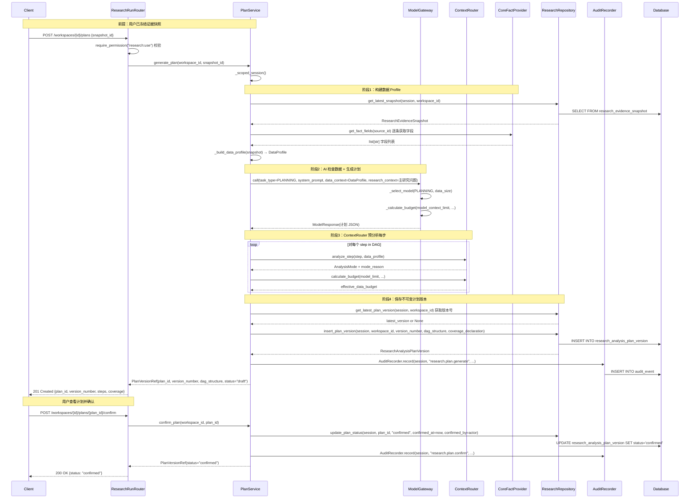
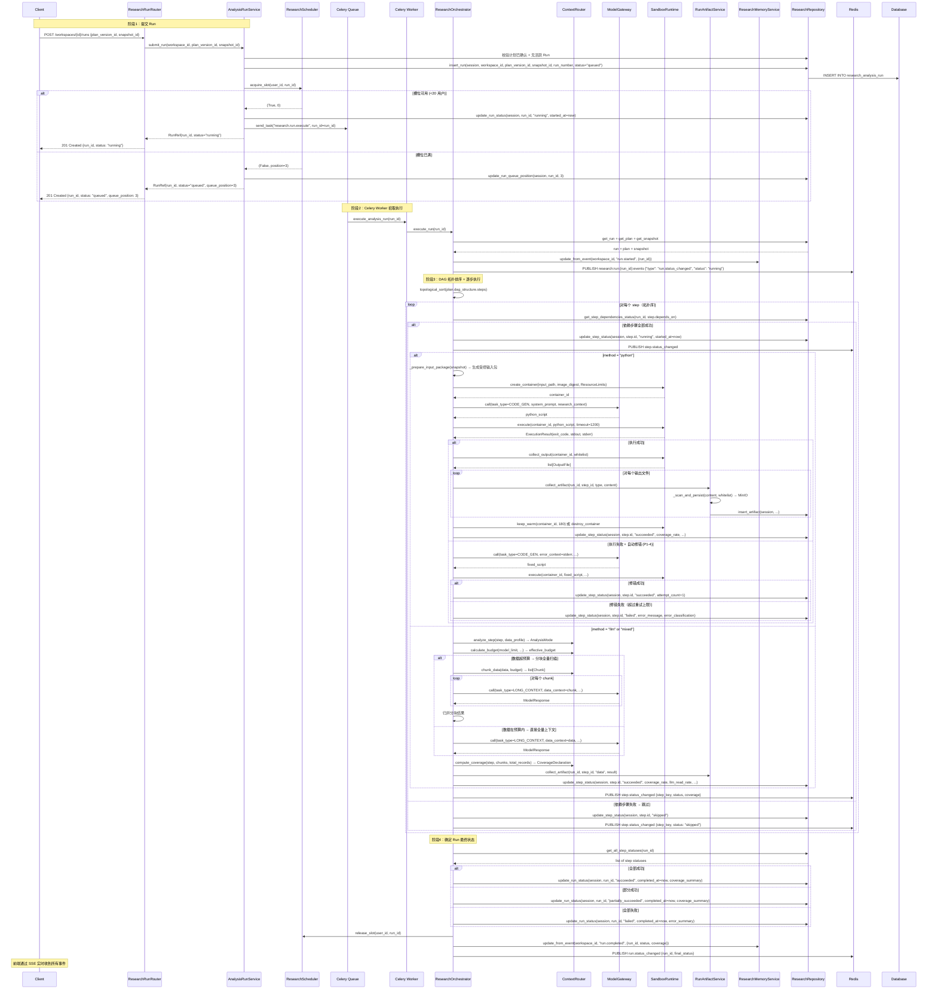
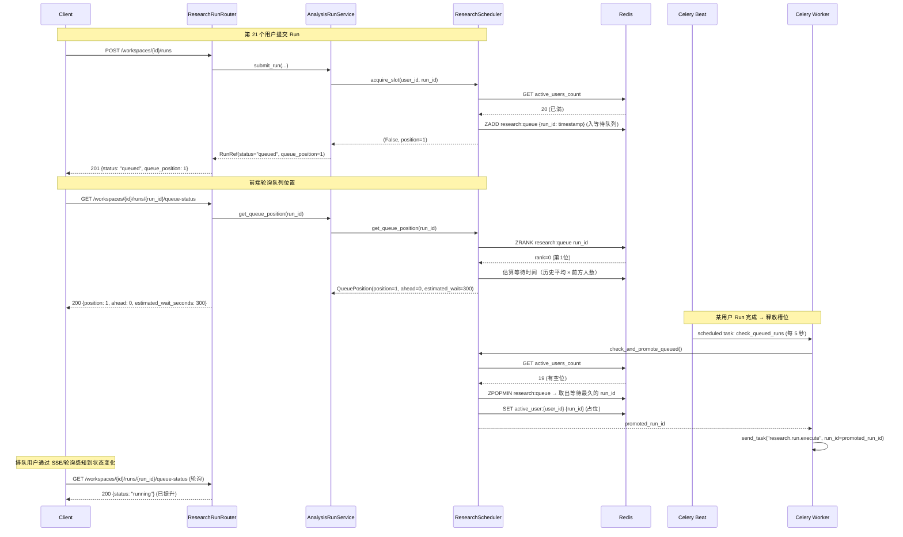
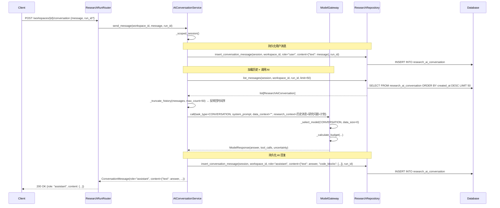
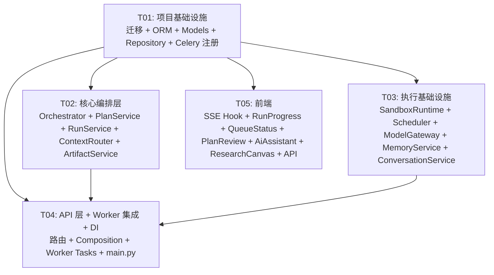

# 架构设计：可信执行（子项目 2）

> **项目名称**: irip_research_trusted_execution
>
> **技术栈**: 后端 Python 3.12+ / FastAPI / SQLAlchemy(异步) / PostgreSQL 16 / Redis 7 / Celery / aiodocker（沙箱容器管理）；前端 React 18 + TS / Vite / Ant Design 5 / TanStack Router+Query
>
> **日期**: 2026-08-05
>
> **状态**: 评审稿
>
> **依赖基线**: 阶段 1"研究域基础"已完成并上线（`docs/arch-research-foundation.md`）
>
> **关联 PRD**: `docs/prd-research-trusted-execution.md`

---

## 目录

- [1. 实现方案与框架选型](#1-实现方案与框架选型)
- [2. 文件列表及相对路径](#2-文件列表及相对路径)
- [3. 数据结构和接口（类图）](#3-数据结构和接口类图)
- [4. 程序调用流程（时序图）](#4-程序调用流程时序图)
- [5. 待明确事项](#5-待明确事项)
- [6. 依赖包列表](#6-依赖包列表)
- [7. 任务列表（有序，含依赖关系）](#7-任务列表有序含依赖关系)
- [8. 共享知识（跨文件约定）](#8-共享知识跨文件约定)
- [9. 任务依赖图](#9-任务依赖图)

---

## 1. 实现方案与框架选型

### 1.1 技术挑战分析

| 挑战 | 难点 | 方案 |
|------|------|------|
| **AI 计划生成与 DAG 编排** | AI 需检查证据快照的数据结构与质量后生成步骤化计划，以 DAG 持久化，执行时按拓扑序编排 | `ResearchOrchestrator` 负责计划生成（调用 ModelGateway）+ DAG 拓扑排序 + 步骤执行。DAG 结构以 JSONB 存 `research_analysis_plan_version`，步骤高频状态单独建 `research_analysis_step` 表 |
| **后台持久运行与恢复** | Run 需脱离前端会话独立运行，关页面不中断，重新进入可恢复进度 | Celery Worker 执行 Run；PostgreSQL 为权威状态源；Redis 仅承担 Celery 队列 + SSE pub/sub + 调度锁。Worker 崩溃后 heartbeat 检测并标记 failed |
| **Python 沙箱安全** | 每次 Python 执行需隔离容器：断网、非 root、只读快照、资源限制 | `SandboxRuntime` Protocol 接口抽象；`DockerSandboxRuntime` 开发环境实现（aiodocker）；生产可替换 K8s Pod 实现。Orchestrator 生成受控输入包，沙箱不直接访问老系统 |
| **20 用户公平调度** | 最多 20 用户同时活跃，第 21 个排队，用户间轮询公平、用户内 FIFO | `ResearchScheduler` 管理 Redis 分布式锁 + PostgreSQL 持久队列；等待时间老化优先级避免饥饿 |
| **500K token 硬上限与上下文路由** | 单次模型调用数据部分 ≤500K tokens，超预算自动切块，不允许静默抽样 | `ContextRouter` 计算有效数据预算 + 自动分析模式选择 + 分块策略；`ModelGateway` 扩展现有 AI 调用层强制执行预算 |
| **SSE 实时进度推送** | 前端需实时查看 Run 进度、步骤状态变更 | SSE（Server-Sent Events）端点订阅 Redis pub/sub 频道；Celery Worker 发布事件到 Redis；前端 SSE 失败时自动降级为轮询 |
| **计划级授权与范围越界检测** | 用户确认计划后 AI 可连续执行，但新增数据/改变目标/首次知识库/扩大资源需重新确认 | `ScopeBoundary` 数据类记录计划边界；Orchestrator 执行前检查越界；越界时暂停 Run 并通知用户 |

### 1.2 框架选型

| 层 | 技术 | 说明 |
|----|------|------|
| 后端框架 | FastAPI + SQLAlchemy 异步 | 延续阶段 1 模式 |
| 异步任务 | Celery + Redis | 延续 `apps/worker/celery_app.py`，新增研究域 Celery 任务 |
| 沙箱容器管理 | `aiodocker` | 异步 Docker SDK，用于 `DockerSandboxRuntime` 创建/执行/销毁容器。接口层 `SandboxRuntime` Protocol 抽象，生产可替换 K8s |
| SSE 推送 | `sse-starlette` | FastAPI SSE 端点支持，订阅 Redis pub/sub 转发事件 |
| 模型网关 | 扩展 `packages/ai/` | 在现有 `AIProvider` Protocol 基础上增加 `ModelGateway` 封装层，实现预算计算 + 模式路由 + 调用元数据记录 + 故障切换 |
| 状态推送 | SSE + 轮询 fallback | 主推 SSE（`sse-starlette`），前端失败时降级为 5 秒轮询 |
| DAG 存储 | PostgreSQL JSONB + 高频状态表 | DAG 结构存 `research_analysis_plan_version.dag_structure`（JSONB）；步骤状态存 `research_analysis_step`（行级高频更新） |
| 研究记忆 | PostgreSQL JSONB | `research_memory_document` 表，每 Workspace 一行，JSONB 存文档 |
| 前端框架 | React 18 + Ant Design 5 | 延续阶段 1 |
| 前端实时 | 原生 `EventSource` API | 浏览器内置 SSE 客户端，无需额外依赖 |

### 1.3 架构模式

延续阶段 1 的 **ScopedSessionMixin + Composition Root** 模式，新增服务遵循同样的依赖注入模式：

- **Service 层**：`ScopedSessionMixin` 子类，构造函数注入 `session_factory / department_id / actor_id / 依赖服务`
- **Repository 层**：`ResearchRepository` 静态方法，扩展新实体 CRUD
- **Orchestrator 模式**：`ResearchOrchestrator` 作为执行引擎，协调 `ModelGateway`、`SandboxRuntime`、`ContextRouter`、`RunArtifactService`
- **Strategy 模式**：`SandboxRuntime` Protocol 接口，`DockerSandboxRuntime` 为开发实现
- **Gateway 模式**：`ModelGateway` 封装现有 `AIProvider`，增加预算计算和模式路由
- **Event-driven**：Celery Worker 发布事件到 Redis pub/sub → SSE 端点转发给前端

### 1.4 模块隔离策略

延续阶段 1 原则：
- 新增 6 张表均以 `research_` 前缀命名
- 研究表之间 FK 允许保留（`workspace_id → research_workspace.id ON DELETE CASCADE`）
- 跨模块引用不建 FK
- 迁移编号延续 `0075`（阶段 1 为 `0074`）
- 关闭 `RESEARCH_MODULE_ENABLED` 后研究 API 路由不注册，原系统正常
- `ModelGateway` 扩展 `packages/ai/` 但不修改现有 `AIProvider` Protocol 签名

---

## 2. 文件列表及相对路径

### 2.1 后端新增文件

| # | 文件路径 | 职责 |
|---|---------|------|
| 1 | `packages/research/orchestrator.py` | **ResearchOrchestrator** — 计划生成、DAG 步骤编排、上下文路由、模型与沙箱编排、范围越界检测 |
| 2 | `packages/research/plan_service.py` | **PlanService** — 计划生成 API（调 AI 检查数据 → 生成 DAG）、计划确认、版本管理 |
| 3 | `packages/research/run_service.py` | **AnalysisRunService** — Run 生命周期管理（提交/取消/状态/进度/列表/发布资格校验） |
| 4 | `packages/research/scheduler.py` | **ResearchScheduler** — 20 用户许可管理、公平队列、资源档位、心跳回收 |
| 5 | `packages/research/sandbox.py` | **SandboxRuntime** Protocol + **DockerSandboxRuntime** 实现 + **WarmPoolManager** |
| 6 | `packages/research/model_gateway.py` | **ModelGateway** — 扩展现有 AI 调用层，增加预算计算、模式路由、调用记录、故障切换 |
| 7 | `packages/research/context_router.py` | **ContextRouter** — 自动分析模式选择 + 有效数据预算计算 + 分块策略 + 覆盖率计算 |
| 8 | `packages/research/artifacts.py` | **RunArtifactService** — 工件收集、白名单扫描、MinIO 持久化 |
| 9 | `packages/research/memory.py` | **ResearchMemoryService** — 后台研究记忆文档 CRUD + 事件驱动自动更新 |
| 10 | `packages/research/conversation.py` | **AIConversationService** — AI 对话持久化 + 长对话截断（保留最近 N 条） |
| 11 | `apps/api/routers/research_run.py` | API 路由：计划/Run/步骤/工件/对话/SSE 端点 |
| 12 | `apps/api/composition/research_run.py` | Composition provider：新服务依赖注入注册 |
| 13 | `apps/worker/tasks/research_orchestrator.py` | Celery 任务：`execute_analysis_run` + heartbeat + warm container cleanup |
| 14 | `migrations/versions/0075_research_trusted_execution.py` | Alembic 迁移：创建 6 张新表 + 索引 |

### 2.2 后端修改文件

| # | 文件路径 | 修改内容 |
|---|---------|---------|
| 15 | `packages/research/entities.py` | 新增 6 个 ORM 实体：`ResearchAnalysisPlanVersion` / `ResearchAnalysisRun` / `ResearchAnalysisStep` / `ResearchRunArtifact` / `ResearchAiConversation` / `ResearchMemoryDocument` |
| 16 | `packages/research/models.py` | 新增 dataclass：`PlanStep` / `DagStructure` / `PlanVersionRef` / `RunRef` / `RunStatus` / `RunProgress` / `StepStatus` / `CoverageDeclaration` / `ArtifactRef` / `ConversationMessage` / `QueuePosition` 等 |
| 17 | `packages/research/repository.py` | 扩展 `ResearchRepository` 新增方法：plan CRUD / run CRUD / step CRUD / artifact CRUD / conversation CRUD / memory CRUD |
| 18 | `apps/api/main.py` | 条件注册 `research_run_router` |
| 19 | `apps/api/composition/__init__.py` | `register_all()` 中条件调用 `register_research_run(ctx)` |
| 20 | `apps/worker/celery_app.py` | `include` 列表追加 `"apps.worker.tasks.research_orchestrator"`；`beat_schedule` 新增 heartbeat / warm container cleanup 调度 |

### 2.3 前端新增文件

| # | 文件路径 | 职责 |
|---|---------|------|
| 21 | `apps/web/src/features/research/useRunSSE.ts` | 自定义 Hook：SSE 连接管理 + 轮询 fallback |
| 22 | `apps/web/src/features/research/RunProgressPanel.tsx` | Run 进度条 + 步骤状态列表 + 运行时长 + 取消按钮 |
| 23 | `apps/web/src/features/research/QueueStatus.tsx` | 排队 UI：位置 + 前方用户数 + 预计等待 + 取消排队 |
| 24 | `apps/web/src/features/research/PlanReviewCard.tsx` | 计划确认卡片：步骤摘要 + 覆盖声明预览 + 确认/调整按钮 |

### 2.4 前端修改文件

| # | 文件路径 | 修改内容 |
|---|---------|---------|
| 25 | `apps/web/src/api/research.ts` | 新增 API 函数：plan CRUD / run CRUD / step / artifact / conversation / queue-status / SSE endpoint |
| 26 | `apps/web/src/features/research/AiAssistantPanel.tsx` | 从占位激活为持续对话区 + 计划说明卡片 + 覆盖声明 + 主动建议 |
| 27 | `apps/web/src/features/research/ResearchCanvas.tsx` | 增加分析计划区（DAG 步骤列表 + 状态着色）+ Run 进度区 + 覆盖声明条 + 候选输出预览 |

---

## 3. 数据结构和接口（类图）

### 3.1 类图（Mermaid）

```mermaid
classDiagram
    direction TB

    %% ===== 新增 ORM 实体 =====

    class ResearchAnalysisPlanVersion {
        +UUID id
        +UUID workspace_id
        +int version_number
        +dict dag_structure
        +dict coverage_declaration
        +str status
        +datetime confirmed_at
        +UUID confirmed_by
        +datetime created_at
        +UUID created_by
    }

    class ResearchAnalysisRun {
        +UUID id
        +UUID workspace_id
        +UUID plan_version_id
        +UUID snapshot_id
        +int run_number
        +str status
        +int queue_position
        +datetime submitted_at
        +datetime started_at
        +datetime completed_at
        +datetime cancelled_at
        +UUID cancelled_by
        +str error_summary
        +dict coverage_summary
        +str image_digest
        +UUID created_by
    }

    class ResearchAnalysisStep {
        +UUID id
        +UUID run_id
        +str step_key
        +int step_index
        +str status
        +str method
        +str analysis_mode
        +int data_budget_tokens
        +float coverage_rate
        +float llm_read_rate
        +bool is_sampled
        +str mode_reason
        +int attempt_count
        +datetime started_at
        +datetime completed_at
        +str error_message
        +str error_classification
        +list depends_on
    }

    class ResearchRunArtifact {
        +UUID id
        +UUID run_id
        +UUID step_id
        +str artifact_type
        +str artifact_key
        +str storage_path
        +str content_hash
        +int size_bytes
        +bool is_publishable
    }

    class ResearchAiConversation {
        +UUID id
        +UUID workspace_id
        +str role
        +dict content
        +UUID run_id
        +datetime created_at
        +UUID created_by
    }

    class ResearchMemoryDocument {
        +UUID id
        +UUID workspace_id
        +dict document
        +int version
        +datetime updated_at
    }

    ResearchAnalysisPlanVersion "1" --> "many" ResearchAnalysisRun : plan_version_id
    ResearchAnalysisRun "1" --> "many" ResearchAnalysisStep : run_id
    ResearchAnalysisRun "1" --> "many" ResearchRunArtifact : run_id
    ResearchAnalysisStep "1" --> "many" ResearchRunArtifact : step_id
    ResearchAnalysisRun "1" --> "many" ResearchAiConversation : run_id (nullable)

    %% ===== Service 层 =====

    class PlanService {
        +async_sessionmaker _factory
        +UUID _dept_id
        +UUID _actor_id
        +ModelGateway _model_gateway
        +ContextRouter _context_router
        +CoreFactProvider _fact_provider
        +__init__(factory, dept_id, actor_id, model_gateway, context_router, fact_provider)
        +generate_plan(workspace_id, snapshot_id) PlanVersionRef
        +confirm_plan(workspace_id, plan_id) PlanVersionRef
        +list_plans(workspace_id) list~PlanVersionRef~
        +get_plan(workspace_id, plan_id) PlanDetail
        +_build_data_profile(snapshot) DataProfile
    }

    class AnalysisRunService {
        +async_sessionmaker _factory
        +UUID _dept_id
        +UUID _actor_id
        +ResearchScheduler _scheduler
        +__init__(factory, dept_id, actor_id, scheduler)
        +submit_run(workspace_id, plan_version_id, snapshot_id) RunRef
        +cancel_run(run_id) void
        +get_run_status(run_id) RunStatus
        +get_run_progress(run_id) RunProgress
        +list_runs(workspace_id) list~RunRef~
        +get_queue_position(run_id) QueuePosition
        +check_publish_eligibility(run_id, step_keys) EligibilityResult
    }

    class ResearchOrchestrator {
        +ResearchRepository _repo
        +ModelGateway _model_gateway
        +SandboxRuntime _sandbox
        +ContextRouter _context_router
        +RunArtifactService _artifact_service
        +ResearchMemoryService _memory_service
        +__init__(repo, model_gateway, sandbox, context_router, artifact_service, memory_service)
        +execute_run(run_id) void
        +cancel_run(run_id) void
        +_execute_step(run_id, step) StepResult
        +_check_scope(plan, current_state) ScopeCheckResult
        +_prepare_input_package(snapshot) str
        +_publish_event(run_id, event_type, payload) void
    }

    class ResearchScheduler {
        +Redis _redis
        +int _max_concurrent_users
        +int _warm_pool_limit
        +__init__(redis_client, max_users=20, warm_limit=5)
        +acquire_slot(user_id, run_id) tuple~bool, int~
        +release_slot(user_id, run_id) void
        +get_queue_position(run_id) QueuePosition
        +register_heartbeat(run_id) void
        +check_heartbeats() list~str~
        +acquire_warm_slot(container_id) bool
        +release_warm_slot(container_id) void
    }

    class ContextRouter {
        +analyze_step(step, data_profile) AnalysisMode
        +calculate_budget(model_limit, system_tokens, research_tokens, output_tokens, safety_margin) int
        +chunk_data(data, budget, strategy) list~Chunk~
        +compute_coverage(step, chunks, total_records) CoverageDeclaration
        +_select_mode(requires_full, per_record_semantic, cross_record_reasoning, allows_sampling, budget) AnalysisMode
    }

    class ModelGateway {
        +AIProvider _provider
        +AuditRecorder _audit
        +dict _model_registry
        +__init__(provider, audit_recorder, model_registry)
        +call(task_type, system_prompt, data_context, research_context, tools) ModelResponse
        +call_with_failover(task_type, ...) ModelResponse
        +_select_model(task_type, data_size) ModelConfig
        +_calculate_budget(model_config, system_tokens, research_tokens, output_tokens) int
        +_record_call(metadata) void
        +_get_backup_model(task_type) ModelConfig
    }

    class RunArtifactService {
        +async_sessionmaker _factory
        +S3Repository _s3_repo
        +__init__(factory, s3_repo)
        +collect_artifact(run_id, step_id, artifact_type, content) ArtifactRef
        +list_artifacts(run_id, step_id, type) list~ArtifactRef~
        +get_artifact(artifact_id) ArtifactContent
        +_scan_and_persist(content, whitelist) str
    }

    class ResearchMemoryService {
        +async_sessionmaker _factory
        +__init__(factory)
        +get_or_create(workspace_id) MemoryDocument
        +update_from_event(workspace_id, event_type, event_data) void
        +rebuild_from_events(workspace_id) MemoryDocument
    }

    class AIConversationService {
        +async_sessionmaker _factory
        +UUID _dept_id
        +UUID _actor_id
        +ModelGateway _model_gateway
        +__init__(factory, dept_id, actor_id, model_gateway)
        +send_message(workspace_id, message, run_id) ConversationMessage
        +list_messages(workspace_id, run_id) list~ConversationMessage~
        +_truncate_history(messages, max_count=50) list~ConversationMessage~
    }

    %% ===== 接口 =====

    class SandboxRuntime {
        <<interface>>
        +create_container(input_package_path, image_digest, resource_limits) str
        +execute(container_id, script_content, timeout_seconds) ExecutionResult
        +cancel(container_id) void
        +collect_output(container_id, whitelist) list~OutputFile~
        +destroy_container(container_id) void
        +keep_warm(container_id, duration_seconds) void
    }

    class DockerSandboxRuntime {
        +DockerClient _client
        +WarmPoolManager _warm_pool
        +__init__(docker_url, warm_pool)
        +create_container(input_package_path, image_digest, resource_limits) str
        +execute(container_id, script_content, timeout_seconds) ExecutionResult
        +cancel(container_id) void
        +collect_output(container_id, whitelist) list~OutputFile~
        +destroy_container(container_id) void
        +keep_warm(container_id, duration_seconds) void
        +_build_container_config(input_path, image, limits) dict
    }

    DockerSandboxRuntime ..|> SandboxRuntime
    ResearchOrchestrator --> SandboxRuntime : 使用
    ResearchOrchestrator --> ModelGateway : 使用
    ResearchOrchestrator --> ContextRouter : 使用
    ResearchOrchestrator --> RunArtifactService : 使用
    ResearchOrchestrator --> ResearchMemoryService : 使用
    PlanService --> ModelGateway : 使用
    PlanService --> ContextRouter : 使用
    AnalysisRunService --> ResearchScheduler : 使用
    AIConversationService --> ModelGateway : 使用

    %% ===== 值对象 =====

    class PlanStep {
        +str step_key
        +str question
        +list evidence_refs
        +str method
        +str strategy
        +str expected_output
        +list risks
        +list dependencies
        +bool requires_full
        +bool per_record_semantic
        +bool cross_record_reasoning
        +bool allows_sampling
        +int estimated_tokens
        +str resource_tier
    }

    class CoverageDeclaration {
        +AnalysisMode mode
        +float data_coverage_rate
        +float llm_read_rate
        +bool is_sampled
        +int batch_count
        +int batch_progress
        +str mode_reason
        +to_display_string() str
    }

    class ResourceLimits {
        +float cpu_count
        +int memory_mb
        +int timeout_seconds
        +int disk_gb
        +int output_size_mb
    }

    class ExecutionResult {
        +int exit_code
        +str stdout
        +str stderr
        +bool timed_out
        +int duration_seconds
    }

    class ScopeBoundary {
        +UUID snapshot_id
        +int question_version
        +set methods_allowed
        +str resource_tier
        +bool knowledge_base_used
    }

    class QueuePosition {
        +int position
        +int ahead_count
        +int estimated_wait_seconds
    }
```



### 3.2 ORM 实体详细定义

#### 3.2.1 ResearchAnalysisPlanVersion（`research_analysis_plan_version`）

```python
class ResearchAnalysisPlanVersion(Base):
    __tablename__ = "research_analysis_plan_version"

    id: Mapped[UUID] = mapped_column(GUID, primary_key=True, default=new_id)
    workspace_id: Mapped[UUID] = mapped_column(
        GUID, sa.ForeignKey("research_workspace.id", ondelete="CASCADE"), nullable=False
    )
    version_number: Mapped[int] = mapped_column(sa.Integer, nullable=False)
    dag_structure: Mapped[dict] = mapped_column(JSONB, nullable=False)
    coverage_declaration: Mapped[dict | None] = mapped_column(JSONB, nullable=True)
    status: Mapped[str] = mapped_column(
        sa.Text, nullable=False, server_default=sa.text("'draft'")
    )
    confirmed_at: Mapped[datetime | None] = mapped_column(UTCDateTime, nullable=True)
    confirmed_by: Mapped[UUID | None] = mapped_column(
        GUID, sa.ForeignKey("app_user.id"), nullable=True
    )
    created_at: Mapped[datetime] = mapped_column(
        UTCDateTime, server_default=sa.func.now(), nullable=False
    )
    created_by: Mapped[UUID] = mapped_column(
        GUID, sa.ForeignKey("app_user.id"), nullable=False
    )
```

- **不可变**：`dag_structure` 创建后不可修改。`status` 仅允许 `draft → confirmed → superseded` 转换
- `dag_structure` JSONB 格式：
  ```json
  {
    "steps": [
      {
        "step_key": "step_1",
        "question": "数据完整性如何？",
        "evidence_refs": ["ref_id_1", "ref_id_2"],
        "method": "python",
        "strategy": "full",
        "expected_output": "数据质量报告",
        "risks": ["缺失值可能导致统计偏差"],
        "dependencies": [],
        "requires_full": true,
        "per_record_semantic": false,
        "cross_record_reasoning": false,
        "allows_sampling": false,
        "estimated_tokens": 50000,
        "resource_tier": "standard"
      }
    ]
  }
  ```
- `status`: `draft`（待确认）/ `confirmed`（已确认）/ `superseded`（被新版本替代）
- 唯一约束：`UNIQUE (workspace_id, version_number)`

#### 3.2.2 ResearchAnalysisRun（`research_analysis_run`）

```python
class ResearchAnalysisRun(Base):
    __tablename__ = "research_analysis_run"

    id: Mapped[UUID] = mapped_column(GUID, primary_key=True, default=new_id)
    workspace_id: Mapped[UUID] = mapped_column(
        GUID, sa.ForeignKey("research_workspace.id", ondelete="CASCADE"), nullable=False
    )
    plan_version_id: Mapped[UUID] = mapped_column(
        GUID, sa.ForeignKey("research_analysis_plan_version.id"), nullable=False
    )
    snapshot_id: Mapped[UUID] = mapped_column(
        GUID, sa.ForeignKey("research_evidence_snapshot.id"), nullable=False
    )
    run_number: Mapped[int] = mapped_column(sa.Integer, nullable=False)
    status: Mapped[str] = mapped_column(
        sa.Text, nullable=False, server_default=sa.text("'queued'")
    )
    queue_position: Mapped[int | None] = mapped_column(sa.Integer, nullable=True)
    submitted_at: Mapped[datetime] = mapped_column(
        UTCDateTime, server_default=sa.func.now(), nullable=False
    )
    started_at: Mapped[datetime | None] = mapped_column(UTCDateTime, nullable=True)
    completed_at: Mapped[datetime | None] = mapped_column(UTCDateTime, nullable=True)
    cancelled_at: Mapped[datetime | None] = mapped_column(UTCDateTime, nullable=True)
    cancelled_by: Mapped[UUID | None] = mapped_column(
        GUID, sa.ForeignKey("app_user.id"), nullable=True
    )
    error_summary: Mapped[str | None] = mapped_column(sa.Text, nullable=True)
    coverage_summary: Mapped[dict | None] = mapped_column(JSONB, nullable=True)
    image_digest: Mapped[str] = mapped_column(sa.Text, nullable=False)
    created_by: Mapped[UUID] = mapped_column(
        GUID, sa.ForeignKey("app_user.id"), nullable=False
    )
```

- `status`: `queued` / `planning` / `running` / `partially_succeeded` / `succeeded` / `failed` / `cancelled`
- 部分唯一索引：`CREATE UNIQUE INDEX uq_rar_workspace_active ON research_analysis_run(workspace_id) WHERE status IN ('queued', 'planning', 'running')` — 每 Workspace 最多 1 个活跃 Run
- `image_digest`: 固定版本科学计算镜像的 Docker digest，旧 Run 永久记录
- 重跑创建新 Run（run_number 递增），不覆盖旧 Run

#### 3.2.3 ResearchAnalysisStep（`research_analysis_step`）

```python
class ResearchAnalysisStep(Base):
    __tablename__ = "research_analysis_step"

    id: Mapped[UUID] = mapped_column(GUID, primary_key=True, default=new_id)
    run_id: Mapped[UUID] = mapped_column(
        GUID, sa.ForeignKey("research_analysis_run.id", ondelete="CASCADE"), nullable=False
    )
    step_key: Mapped[str] = mapped_column(sa.Text, nullable=False)
    step_index: Mapped[int] = mapped_column(sa.Integer, nullable=False)
    status: Mapped[str] = mapped_column(
        sa.Text, nullable=False, server_default=sa.text("'pending'")
    )
    method: Mapped[str] = mapped_column(sa.Text, nullable=False)
    analysis_mode: Mapped[str | None] = mapped_column(sa.Text, nullable=True)
    data_budget_tokens: Mapped[int | None] = mapped_column(sa.Integer, nullable=True)
    coverage_rate: Mapped[float | None] = mapped_column(sa.Float, nullable=True)
    llm_read_rate: Mapped[float | None] = mapped_column(sa.Float, nullable=True)
    is_sampled: Mapped[bool] = mapped_column(
        sa.Boolean, nullable=False, server_default=sa.text("false")
    )
    mode_reason: Mapped[str | None] = mapped_column(sa.Text, nullable=True)
    attempt_count: Mapped[int] = mapped_column(
        sa.Integer, nullable=False, server_default=sa.text("0")
    )
    started_at: Mapped[datetime | None] = mapped_column(UTCDateTime, nullable=True)
    completed_at: Mapped[datetime | None] = mapped_column(UTCDateTime, nullable=True)
    error_message: Mapped[str | None] = mapped_column(sa.Text, nullable=True)
    error_classification: Mapped[str | None] = mapped_column(sa.Text, nullable=True)
    depends_on: Mapped[list] = mapped_column(
        JSONB, nullable=False, server_default=sa.text("'[]'::jsonb")
    )
    created_at: Mapped[datetime] = mapped_column(
        UTCDateTime, server_default=sa.func.now(), nullable=False
    )
    updated_at: Mapped[datetime] = mapped_column(
        UTCDateTime, server_default=sa.func.now(), nullable=False
    )
```

- **高频更新表**：步骤状态变更频繁（pending → running → succeeded/failed），单独建表避免更新 JSONB
- `status`: `pending` / `running` / `succeeded` / `failed` / `skipped`（依赖失败）/ `cancelled`
- `method`: `python` / `llm` / `knowledge` / `mixed`
- `analysis_mode`: `full_compute` / `chunked_full_scan` / `direct_full_context` / `retrieval` / `mixed`
- `error_classification`: `syntax_error` / `dependency_error` / `timeout` / `resource_exceeded` / `permission_denied` / `model_error` / `worker_crashed` / `unknown`
- `depends_on`: JSONB 数组，存前置步骤的 `step_key` 列表

#### 3.2.4 ResearchRunArtifact（`research_run_artifact`）

```python
class ResearchRunArtifact(Base):
    __tablename__ = "research_run_artifact"

    id: Mapped[UUID] = mapped_column(GUID, primary_key=True, default=new_id)
    run_id: Mapped[UUID] = mapped_column(
        GUID, sa.ForeignKey("research_analysis_run.id", ondelete="CASCADE"), nullable=False
    )
    step_id: Mapped[UUID | None] = mapped_column(
        GUID, sa.ForeignKey("research_analysis_step.id", ondelete="CASCADE"), nullable=True
    )
    artifact_type: Mapped[str] = mapped_column(sa.Text, nullable=False)
    artifact_key: Mapped[str] = mapped_column(sa.Text, nullable=False)
    storage_path: Mapped[str] = mapped_column(sa.Text, nullable=False)
    content_hash: Mapped[str | None] = mapped_column(sa.Text, nullable=True)
    size_bytes: Mapped[int | None] = mapped_column(sa.BigInteger, nullable=True)
    is_publishable: Mapped[bool] = mapped_column(
        sa.Boolean, nullable=False, server_default=sa.text("false")
    )
    created_at: Mapped[datetime] = mapped_column(
        UTCDateTime, server_default=sa.func.now(), nullable=False
    )
```

- `artifact_type`: `code` / `log` / `chart` / `data` / `intermediate`
- `storage_path`: MinIO 路径，前缀 `research/artifacts/{run_id}/{step_id}/`
- `is_publishable`: 仅依赖闭包全部成功的步骤输出为 `true`

#### 3.2.5 ResearchAiConversation（`research_ai_conversation`）

```python
class ResearchAiConversation(Base):
    __tablename__ = "research_ai_conversation"

    id: Mapped[UUID] = mapped_column(GUID, primary_key=True, default=new_id)
    workspace_id: Mapped[UUID] = mapped_column(
        GUID, sa.ForeignKey("research_workspace.id", ondelete="CASCADE"), nullable=False
    )
    role: Mapped[str] = mapped_column(sa.Text, nullable=False)
    content: Mapped[dict] = mapped_column(JSONB, nullable=False)
    run_id: Mapped[UUID | None] = mapped_column(
        GUID, sa.ForeignKey("research_analysis_run.id"), nullable=True
    )
    created_at: Mapped[datetime] = mapped_column(
        UTCDateTime, server_default=sa.func.now(), nullable=False
    )
    created_by: Mapped[UUID | None] = mapped_column(
        GUID, sa.ForeignKey("app_user.id"), nullable=True
    )
```

- `role`: `user` / `assistant` / `system`
- `content` JSONB 格式：`{"text": "...", "code_blocks": [...], "plan_ref": "plan_id", "artifact_refs": [...]}`
- `run_id`: 关联的 Run（可空，非 Run 期间对话不关联）
- 长对话截断策略（Q8）：查询时仅返回最近 50 条，旧消息保留在表中不删除

#### 3.2.6 ResearchMemoryDocument（`research_memory_document`）

```python
class ResearchMemoryDocument(Base):
    __tablename__ = "research_memory_document"

    id: Mapped[UUID] = mapped_column(GUID, primary_key=True, default=new_id)
    workspace_id: Mapped[UUID] = mapped_column(
        GUID, sa.ForeignKey("research_workspace.id", ondelete="CASCADE"), nullable=False
    )
    document: Mapped[dict] = mapped_column(
        JSONB, nullable=False, server_default=sa.text("'{}'::jsonb")
    )
    version: Mapped[int] = mapped_column(
        sa.Integer, nullable=False, server_default=sa.text("1")
    )
    updated_at: Mapped[datetime] = mapped_column(
        UTCDateTime, server_default=sa.func.now(), nullable=False
    )
```

- 每 Workspace 一行（唯一约束 `UNIQUE (workspace_id)`）
- `document` JSONB 格式：
  ```json
  {
    "main_question": "...",
    "current_scope": "...",
    "evidence_summary": [...],
    "confirmed_plan": {"version": 1, "steps": [...]},
    "key_methods": [...],
    "completed_runs": [...],
    "accepted_insights": [...],
    "rejected_insights": [...],
    "limitations": [...],
    "next_steps": [...]
  }
  ```
- 由事件自动更新（Run 提交/完成/取消、计划确认、Insight 接受/否决）
- 文档与原始事件冲突时以原始事件为准

### 3.3 接口定义

#### SandboxRuntime（沙箱运行时接口）

```python
class SandboxRuntime(Protocol):
    """沙箱运行时接口抽象。

    开发环境使用 DockerSandboxRuntime，生产环境可替换为 K8sPodRuntime。
    接口隔离容器调度细节，Orchestrator 不感知底层实现。
    """

    async def create_container(
        self,
        input_package_path: str,
        image_digest: str,
        resource_limits: ResourceLimits,
    ) -> str:
        """创建隔离容器并挂载只读输入包。

        Args:
            input_package_path: 受控输入包路径（只读挂载到 /input）。
            image_digest: 固定版本科学计算镜像 digest。
            resource_limits: CPU/内存/时间/磁盘/输出限制。

        Returns:
            container_id: 容器标识符。
        """
        ...

    async def execute(
        self,
        container_id: str,
        script_content: str,
        timeout_seconds: int = 1200,
    ) -> ExecutionResult:
        """在容器中执行 Python 脚本。

        Args:
            container_id: 容器标识符。
            script_content: Python 脚本内容。
            timeout_seconds: 超时秒数（默认 20 分钟）。

        Returns:
            ExecutionResult: 执行结果（exit_code, stdout, stderr, timed_out）。
        """
        ...

    async def cancel(self, container_id: str) -> None:
        """取消容器中的执行。"""
        ...

    async def collect_output(
        self,
        container_id: str,
        whitelist: list[str],
    ) -> list[OutputFile]:
        """收集白名单输出文件。"""
        ...

    async def destroy_container(self, container_id: str) -> None:
        """销毁容器。"""
        ...

    async def keep_warm(
        self,
        container_id: str,
        duration_seconds: int = 180,
    ) -> None:
        """将容器标记为保温状态（Q7：不计入槽位，独立上限 5 个）。"""
        ...
```

`DockerSandboxRuntime` 实现关键点：
- `network_mode='none'`（断网）
- `user='nonroot'`（非 root）
- `read_only=True`（只读基础镜像）
- `volumes={input_package_path: {'bind': '/input', 'mode': 'ro'}}`（只读输入挂载）
- `tmpfs={'/workspace': f'size={disk_gb}g'}`（临时工作目录）
- `cpu_period` + `cpu_quota` 限制 CPU
- `mem_limit` 限制内存
- 保温容器通过 `WarmPoolManager` 管理（Redis TTL 跟踪，独立上限 5 个）

#### ModelGateway（模型网关）

```python
class ModelGateway:
    """模型网关：扩展现有 AI 调用层。

    在 AIProvider Protocol 基础上封装：
    1. 按任务类型自动选择模型（planning/code_gen/long_context/insight/conversation）
    2. 计算有效数据预算（500K 硬上限）
    3. 记录调用元数据（供应商、模型、版本、提示词版本、时间）
    4. 故障切换备用模型
    """

    async def call(
        self,
        task_type: TaskType,
        system_prompt: str,
        data_context: str,
        research_context: str,
        tools: list[dict] | None = None,
    ) -> ModelResponse:
        """调用模型并记录元数据。

        Args:
            task_type: 任务类型（planning/code_gen/long_context/insight/conversation）。
            system_prompt: 系统提示词。
            data_context: 数据部分（受 500K 硬上限约束）。
            research_context: 研究上下文（问题、计划、先前结果）。
            tools: 工具列表（可选）。

        Returns:
            ModelResponse: 模型响应 + 元数据（provider, model, version, tokens）。
        """
        ...

    async def call_with_failover(self, **kwargs) -> ModelResponse:
        """调用模型，故障时自动切换备用模型。"""
        ...
```

`TaskType` 枚举：
- `PLANNING` — 计划生成（需长上下文理解数据结构）
- `CODE_GEN` — Python 代码生成
- `LONG_CONTEXT` — 长上下文分析（分块归并）
- `INSIGHT` — Insight 分析
- `CONVERSATION` — AI 助手对话

#### ContextRouter（上下文路由器）

```python
class ContextRouter:
    """上下文路由器：自动分析模式选择 + 预算计算 + 分块策略。"""

    def analyze_step(
        self, step: PlanStep, data_profile: DataProfile
    ) -> AnalysisMode:
        """根据步骤需求和数据特征自动选择分析模式。

        决策逻辑：
        - requires_full=True + cross_record_reasoning=False → FULL_COMPUTE
        - requires_full=True + per_record_semantic=True → CHUNKED_FULL_SCAN
        - requires_full=True + cross_record_reasoning=True + fits_budget → DIRECT_FULL_CONTEXT
        - allows_sampling=False + not fits_budget → CHUNKED_FULL_SCAN
        - 混合需求 → MIXED
        """
        ...

    def calculate_budget(
        self,
        model_context_limit: int,
        system_and_tool_tokens: int,
        research_context_tokens: int,
        reserved_output_tokens: int,
        safety_margin: int = 5000,
    ) -> int:
        """计算有效数据预算。

        effective_data_budget = min(500_000, model_context_limit - system_and_tool_tokens - research_context_tokens - reserved_output_tokens - safety_margin)
        """
        ...

    def chunk_data(
        self, data: str, budget: int, strategy: ChunkStrategy = ChunkStrategy.TOKEN_BUDGET
    ) -> list[Chunk]:
        """按 token 预算切分数据（Q6：默认按 token 预算，允许步骤级覆盖）。"""
        ...
```

---

## 4. 程序调用流程（时序图）

### 4.1 计划生成与确认



### 4.2 Run 提交 → 调度 → DAG 执行 → 沙箱运行 → 结果收集



### 4.3 排队与调度流程



### 4.4 AI 对话流程



---

## 5. 待明确事项

| # | 事项 | 影响 | 当前处理 |
|---|------|------|---------|
| 1 | **科学计算镜像维护**：固定版本镜像（NumPy/Pandas/SciPy/statsmodels/scikit-learn/Matplotlib/Seaborn）的构建和版本升级流程 | 沙箱执行 | 本期假设镜像已由 DevOps 构建并推送，`image_digest` 通过环境变量 `RESEARCH_SANDBOX_IMAGE_DIGEST` 配置。代码中引用此环境变量 |
| 2 | **K8s PodRuntime 实现**：生产环境替换 DockerSandboxRuntime 的 K8s 实现 | 沙箱执行 | `SandboxRuntime` Protocol 已抽象，T03 仅实现 `DockerSandboxRuntime`。K8s 实现作为后续 DevOps 任务，接口兼容 |
| 3 | **知识库接入**：PRD 提到"首次调用知识库需重新确认"，但 KnowledgeProvider 接口在子项目 5 实现 | 计划范围检测 | `ScopeBoundary` 预留 `knowledge_base_used` 字段。本期 Orchestrator 中知识库相关步骤标记为不可执行（method="knowledge" 时跳过并记录），实际接入在子项目 5 |
| 4 | **重型任务资源池**（P2-1）：需要更多 CPU/内存的任务进入独立低并发队列 | 调度 | `ResearchScheduler` 预留 `resource_tier` 参数和 `heavy` 队列逻辑占位。本期仅实现标准档位 |
| 5 | **DAG 可视化**（P2-4）：中栏图形化展示 DAG 步骤及依赖关系 | 前端 | 本期使用线性列表展示 DAG 步骤（带状态着色）。图形化 DAG 可视化作为 P2 后续增强 |
| 6 | **图表渲染失败处理**（P1-7）：数据结果可保留，View 不可发布 | 工件管理 | `RunArtifactService` 预留 `is_publishable` 字段。渲染失败的 chart 工件标记 `is_publishable=false`，数据工件保持 `is_publishable=true`（依赖闭包成功的前提下） |
| 7 | **权限中途撤销**（P1-8）：源权限在 Run 中途被撤销时，后续步骤在检查点停止 | 执行安全 | Orchestrator 在每步执行前通过 `CoreFactProvider.get_fact_summary()` 校验权限。权限撤销时标记步骤 `failed`（error_classification="permission_denied"），已产生输出标记 `is_publishable=false` |
| 8 | **保温容器跨 Run 复用**：保温容器是否可在不同 Run 间复用？ | 资源管理 | 本期限同一 Run 内复用。`WarmPoolManager` 以 `run_id` 为 key 管理保温容器，跨 Run 不复用 |

---

## 6. 依赖包列表

### 6.1 新增 Python 依赖

```
aiodocker>=0.21.0: 异步 Docker 客户端，用于 DockerSandboxRuntime 容器生命周期管理
sse-starlette>=1.6.0: FastAPI SSE 端点支持，用于实时 Run 进度推送
```

### 6.2 新增前端依赖

**无新增。** 前端使用浏览器原生 `EventSource` API 实现 SSE 客户端，现有 Ant Design 5 + React 18 已满足全部 UI 需求。

### 6.3 复用现有依赖

| 包 | 用途 |
|----|------|
| `celery` | 异步任务队列（已有 `apps/worker/celery_app.py`） |
| `redis` (Python) | 分布式锁 + pub/sub + 队列管理 |
| `sqlalchemy` | ORM + 异步 session |
| `fastapi` | API 路由 |
| `pydantic` | 请求/响应模型 |
| `packages/ai/` | 现有 AI 调用层（ModelGateway 扩展此包） |
| `packages/audit/` | 审计记录 |
| `packages/common/` | ScopedSessionMixin / GUID / UTCDateTime / errors |

---

## 7. 任务列表（有序，含依赖关系）

### T01: 项目基础设施（迁移 + ORM 实体 + 数据模型 + Repository + Celery 注册）

| 项目 | 内容 |
|------|------|
| **任务描述** | 建立可信执行模块的数据层地基：6 张新表的 Alembic 迁移、ORM 实体类定义、请求/响应数据类、Repository 扩展方法、Celery 任务注册和 Beat 调度配置 |
| **涉及文件** | `migrations/versions/0075_research_trusted_execution.py`（新增）<br/>`packages/research/entities.py`（修改：+6 ORM 实体）<br/>`packages/research/models.py`（修改：+新 dataclass）<br/>`packages/research/repository.py`（修改：+新 Repository 方法）<br/>`apps/worker/celery_app.py`（修改：include + beat_schedule） |
| **依赖前序任务** | 无 |
| **优先级** | P0 |

**详细实现要点**：

1. **迁移 `0075`**：
   - `revision = "0075"; down_revision = "0074"`
   - `upgrade()`: 创建 6 张表 + 索引 + 约束
   - 关键索引：
     - `research_analysis_plan_version`: `ix_rapv_workspace_id` + `uq_rapv_workspace_version`
     - `research_analysis_run`: `ix_rar_workspace_id` + `ix_rar_status` + `uq_rar_workspace_active`（部分唯一索引 WHERE status IN ('queued','planning','running')）+ `uq_rar_workspace_run`
     - `research_analysis_step`: `ix_ras_run_id` + `ix_ras_run_status`
     - `research_run_artifact`: `ix_rra_run_id` + `ix_rra_step_id`
     - `research_ai_conversation`: `ix_rac_workspace_id` + `ix_rac_run_id`
     - `research_memory_document`: `uq_rmd_workspace`（UNIQUE workspace_id）
   - `downgrade()`: 反序 DROP 全部表

2. **ORM 实体**（`entities.py` 新增 6 个类）：按 3.2 节定义

3. **数据模型**（`models.py` 新增）：
   - `PlanStep`（frozen dataclass）— DAG 步骤定义
   - `DagStructure`（frozen dataclass）— 包含 steps 列表
   - `PlanVersionRef` / `PlanDetail` — 计划版本引用/详情
   - `RunRef` / `RunStatus` / `RunProgress` — Run 引用/状态/进度
   - `StepRef` / `StepProgress` — 步骤引用/进度
   - `CoverageDeclaration` — 覆盖声明（含 `to_display_string()` 方法）
   - `ArtifactRef` / `ArtifactContent` — 工件引用/内容
   - `ConversationMessage` — 对话消息
   - `QueuePosition` — 排队位置
   - `ResourceLimits` / `ExecutionResult` / `OutputFile` — 沙箱值对象
   - `ScopeBoundary` / `ScopeCheckResult` — 计划范围边界
   - `AnalysisMode`（Enum）/ `RunStatus`（Enum）/ `StepStatus`（Enum）/ `PlanStatus`（Enum）/ `TaskType`（Enum）/ `ChunkStrategy`（Enum）/ `ErrorClassification`（Enum）

4. **Repository 扩展**（`repository.py` 新增静态方法）：
   - Plan: `insert_plan_version` / `get_plan` / `list_plans` / `get_latest_plan_version` / `update_plan_status`
   - Run: `insert_run` / `get_run` / `list_runs` / `update_run_status` / `update_run_queue_position` / `get_active_run_for_workspace` / `get_next_run_number`
   - Step: `insert_step` / `get_step` / `list_steps_by_run` / `update_step_status` / `update_step_progress` / `batch_insert_steps`
   - Artifact: `insert_artifact` / `get_artifact` / `list_artifacts_by_run` / `list_artifacts_by_step`
   - Conversation: `insert_conversation_message` / `list_messages` / `count_messages`
   - Memory: `get_memory` / `upsert_memory` / `update_memory_version`

5. **Celery 注册**（`celery_app.py` 修改）：
   - `include` 列表追加 `"apps.worker.tasks.research_orchestrator"`
   - `beat_schedule` 新增：
     ```python
     "research-heartbeat": {"task": "research.heartbeat", "schedule": 30.0},
     "research-cleanup-warm": {"task": "research.cleanup_warm", "schedule": 60.0},
     ```

**验收标准**：
1. `alembic upgrade 0075` 成功创建 6 张表 + 全部索引/约束
2. `alembic downgrade 0074` 成功删除全部新表
3. ORM 实体继承 `Base`，`Base.metadata` 包含全部 10 张研究表（4 旧 + 6 新）
4. `uq_rar_workspace_active` 部分唯一索引确保每 Workspace 最多 1 个活跃 Run
5. `uq_rmd_workspace` 唯一约束确保每 Workspace 最多 1 个记忆文档
6. Repository 新增方法全部为 `@staticmethod async`
7. Enum 定义与 PRD 状态机一致
8. Celery Beat 调度配置正确

---

### T02: 核心编排层（ResearchOrchestrator + PlanService + AnalysisRunService + ContextRouter + RunArtifactService）

| 项目 | 内容 |
|------|------|
| **任务描述** | 实现可信执行的核心编排引擎：计划生成服务、Run 生命周期管理、DAG 步骤编排引擎、上下文路由器（500K 预算 + 模式选择 + 分块）、工件收集服务 |
| **涉及文件** | `packages/research/orchestrator.py`（新增）<br/>`packages/research/plan_service.py`（新增）<br/>`packages/research/run_service.py`（新增）<br/>`packages/research/context_router.py`（新增）<br/>`packages/research/artifacts.py`（新增） |
| **依赖前序任务** | T01 |
| **优先级** | P0 |

**详细实现要点**：

1. **`packages/research/orchestrator.py` — ResearchOrchestrator**：
   - 构造函数注入：`ResearchRepository` / `ModelGateway` / `SandboxRuntime` / `ContextRouter` / `RunArtifactService` / `ResearchMemoryService`
   - `execute_run(run_id)`:
     1. 加载 Run + Plan + Snapshot
     2. 拓扑排序 DAG 步骤
     3. 初始化 `ResearchAnalysisStep` 行（batch_insert_steps）
     4. 逐步执行：`_execute_step(run_id, step)`
     5. 每步前检查依赖闭包状态
     6. 每步前检查 `ScopeBoundary`（Q1/Q2/Q5：新增数据/改变目标/扩大资源需重新确认）
     7. 每步后发布 SSE 事件到 Redis pub/sub
     8. 全部完成后聚合覆盖率 → 确定 Run 最终状态
     9. 释放调度槽位
     10. 更新研究记忆文档
   - `_execute_step(run_id, step)`:
     - `method="python"`: `_prepare_input_package(snapshot)` → `sandbox.create_container()` → `model_gateway.call(CODE_GEN)` → `sandbox.execute()` → 成功：`collect_output()` + `artifact_service.collect_artifact()` → 失败：自动修错（P1-4，最多 3 次）→ `keep_warm()` 或 `destroy_container()`
     - `method="llm"`: `context_router.analyze_step()` → `calculate_budget()` → 超预算分块 → `model_gateway.call(LONG_CONTEXT)` per chunk → 归并 → `compute_coverage()`
     - `method="mixed"`: Python 先行计算 → LLM 阅读结果
     - `method="knowledge"`: 本期跳过并记录（子项目 5 接入）
   - `cancel_run(run_id)`: 标记当前步骤 cancelled → 下游步骤 skipped → Run cancelled → 销毁活跃容器 → 释放槽位
   - `_check_scope(plan, current_state)`: 对比 snapshot_id / question_version / resource_tier / knowledge_base_used → 返回 ScopeCheckResult
   - `_prepare_input_package(snapshot)`: 从 CoreFactProvider 获取快照数据 → 序列化为 JSON → 写入临时目录 → 返回路径（沙箱只读挂载）
   - `_publish_event(run_id, event_type, payload)`: Redis PUBLISH `research:run:{run_id}:events`

2. **`packages/research/plan_service.py` — PlanService**：
   - 继承 `ScopedSessionMixin`
   - 构造函数注入：`session_factory` / `department_id` / `actor_id` / `ModelGateway` / `ContextRouter` / `CoreFactProvider`
   - `generate_plan(workspace_id, snapshot_id)`:
     1. 获取快照 + 字段清单 → 构建 `DataProfile`
     2. 调用 `ModelGateway.call(PLANNING, data_context=DataProfile, research_context=研究问题)`
     3. AI 返回 DAG 步骤 JSON
     4. `ContextRouter.analyze_step()` 预分析每步 → 填入 `analysis_mode` / `data_budget_tokens` / `mode_reason`
     5. 计算预估计覆盖声明
     6. 保存为不可变 `ResearchAnalysisPlanVersion`
     7. 审计 `research.plan.generate`
   - `confirm_plan(workspace_id, plan_id)`:
     1. 校验计划状态为 `draft`
     2. 更新 `status='confirmed'`, `confirmed_at=now()`, `confirmed_by=actor_id`
     3. 审计 `research.plan.confirm`
   - `list_plans(workspace_id)` / `get_plan(workspace_id, plan_id)`

3. **`packages/research/run_service.py` — AnalysisRunService**：
   - 继承 `ScopedSessionMixin`
   - 构造函数注入：`session_factory` / `department_id` / `actor_id` / `ResearchScheduler`
   - `submit_run(workspace_id, plan_version_id, snapshot_id)`:
     1. 校验计划已确认（`status='confirmed'`）
     2. 校验无活跃 Run（`get_active_run_for_workspace` 返回 None）
     3. 获取 `run_number`（递增）
     4. `insert_run(status='queued')`
     5. `scheduler.acquire_slot(user_id, run_id)` → 有槽位：`update_run_status('running')` + `send_task("research.run.execute")` → 无槽位：保持 `queued` + `update_run_queue_position`
     6. 审计 `research.run.submit`
   - `cancel_run(run_id)`: 校验活跃状态 → `update_run_status('cancelled')` → Orchestrator 在下个检查点感知 → 审计
   - `get_run_status(run_id)` → `RunStatus`
   - `get_run_progress(run_id)` → `RunProgress`（含步骤状态列表 + 覆盖声明）
   - `get_queue_position(run_id)` → `QueuePosition`
   - `check_publish_eligibility(run_id, step_keys)` → 校验依赖闭包完整性

4. **`packages/research/context_router.py` — ContextRouter**：
   - `analyze_step(step, data_profile)`: 按 3.3 节决策逻辑选择 `AnalysisMode`
   - `calculate_budget(...)`: `min(500_000, model_limit - system - research - output - safety)`
   - `chunk_data(data, budget, strategy=TOKEN_BUDGET)`: 按 token 预算切分（Q6 默认，允许步骤级覆盖）
   - `compute_coverage(step, chunks, total_records)`: 计算 `data_coverage_rate` + `llm_read_rate` + `is_sampled`

5. **`packages/research/artifacts.py` — RunArtifactService**：
   - 继承 `ScopedSessionMixin`
   - 构造函数注入：`session_factory` / `S3Repository`
   - `collect_artifact(run_id, step_id, artifact_type, content)`:
     1. 白名单扫描（不允许 .py 可执行脚本之外的脚本类型、不允许路径穿越）
     2. 上传到 MinIO `research/artifacts/{run_id}/{step_id}/{key}`
     3. 计算 `content_hash`（SHA-256）
     4. `insert_artifact` 记录
   - `list_artifacts(run_id, step_id, type)` / `get_artifact(artifact_id)`

**验收标准**：
1. `ResearchOrchestrator.execute_run` 按 DAG 拓扑序执行步骤
2. 某步失败后其依赖步骤标记 `skipped`，无依赖分支继续执行
3. Python 步骤通过 SandboxRuntime 执行，自动修错最多 3 次（P1-4）
4. LLM 步骤通过 ContextRouter 计算预算，超预算自动分块
5. 每步记录 `analysis_mode` / `data_budget_tokens` / `coverage_rate` / `llm_read_rate` / `is_sampled` / `mode_reason`
6. 500K 硬上限在 `calculate_budget` 中强制执行
7. 不允许静默抽样（`allows_sampling=False` 时不分块不抽样，只能分块全量扫描）
8. 覆盖声明如实计算（数据覆盖率与 LLM 阅读率独立）
9. Run 最终状态正确（succeeded / partially_succeeded / failed）
10. SSE 事件通过 Redis pub/sub 发布
11. 计划级授权：确认后 `ScopeBoundary` 记录边界，越界暂停 Run
12. 重跑创建新 Run，旧 Run 不变
13. 取消后已完成输出标记 `is_publishable=false`
14. 工件经白名单扫描后持久化到 MinIO

---

### T03: 执行基础设施（SandboxRuntime + DockerSandboxRuntime + ResearchScheduler + ModelGateway + ResearchMemoryService + AIConversationService）

| 项目 | 内容 |
|------|------|
| **任务描述** | 实现执行层基础设施：沙箱运行时接口与 Docker 实现、20 用户公平调度器、模型网关（扩展现有 AI 调用层）、研究记忆服务、AI 对话服务 |
| **涉及文件** | `packages/research/sandbox.py`（新增）<br/>`packages/research/scheduler.py`（新增）<br/>`packages/research/model_gateway.py`（新增）<br/>`packages/research/memory.py`（新增）<br/>`packages/research/conversation.py`（新增） |
| **依赖前序任务** | T01 |
| **优先级** | P0 |

**详细实现要点**：

1. **`packages/research/sandbox.py` — SandboxRuntime + DockerSandboxRuntime + WarmPoolManager**：
   - `SandboxRuntime` Protocol（如 3.3 节）
   - `ResourceLimits` 默认值：`cpu_count=2.0, memory_mb=4096, timeout_seconds=1200, disk_gb=10, output_size_mb=100`（P0-16）
   - `DockerSandboxRuntime`:
     - 使用 `aiodocker.Docker()` 客户端
     - `create_container()`:
       - `network_mode='none'`（断网）
       - `user='nonroot:nonroot'`（非 root）
       - `read_only=True`（只读基础镜像）
       - `volumes={input_package_path: {'bind': '/input', 'mode': 'ro'}}`
       - `tmpfs={'/workspace': f'size={disk_gb}g'}`
       - `cpu_period=100000` + `cpu_quota=int(cpu_count * 100000)` 限制 CPU
       - `mem_limit=f'{memory_mb}m'`
       - `pids_limit=100`（防止 fork 炸弹）
       - `cap_drop=['ALL']`（移除所有 Linux capabilities）
       - `security_opt=['no-new-privileges']`
     - `execute()`: `docker exec` 运行 `python /workspace/script.py`，超时通过 `timeout` 参数控制
     - `collect_output()`: 读取 `/workspace/output/` 目录，按白名单 glob 过滤
     - `keep_warm()`: 注册到 `WarmPoolManager`，设置 Redis TTL=180 秒
     - `destroy_container()`: `docker rm -f`
   - `WarmPoolManager`:
     - Redis 跟踪保温容器：`SET research:warm:{container_id} {run_id} EX 180`
     - `acquire_warm_slot(run_id)`: 查找该 Run 的保温容器，TTL 内返回 container_id
     - 独立上限 5 个（Q7：不计入 20 用户槽位）
     - `cleanup_expired()`: 清理 TTL 过期的保温容器记录

2. **`packages/research/scheduler.py` — ResearchScheduler**：
   - 构造函数注入：`redis_client` / `max_concurrent_users=20` / `warm_pool_limit=5`
   - `acquire_slot(user_id, run_id)`:
     1. `GET active_users_count` → 当前活跃用户数
     2. `< 20` → `SET active_user:{user_id} {run_id}` + `INCR active_users_count` → 返回 `(True, 0)`
     3. `>= 20` → `ZADD research:queue {run_id: timestamp}` → 返回 `(False, ZCARD research:queue)`
     4. 同一用户已有活跃 Run → 拒绝（P0-17：每用户最多 1 个活跃 Run）
   - `release_slot(user_id, run_id)`:
     1. `DEL active_user:{user_id}` + `DECR active_users_count`
     2. `ZPOPMIN research:queue` → 取出等待最久的 run → 触发提升（通过 Celery send_task）
   - `get_queue_position(run_id)`: `ZRANK research:queue {run_id}` → 位置 + 前方人数 + 估算等待
   - `register_heartbeat(run_id)`: `SET research:heartbeat:{run_id} {timestamp} EX 60`
   - `check_heartbeats()`: 扫描活跃 Run 心跳，超时（>90 秒无心跳）标记 `failed` + 释放槽位（P0-20）
   - 公平策略：用户间轮询（ZRANK 按时间排序），用户内 FIFO，等待时间老化优先级

3. **`packages/research/model_gateway.py` — ModelGateway**：
   - 构造函数注入：`AIProvider` / `AuditRecorder` / `model_registry`（dict: task_type → ModelConfig）
   - `call(task_type, system_prompt, data_context, research_context, tools)`:
     1. `_select_model(task_type, len(data_context))` → 选择模型
     2. `_calculate_budget(model_config, system_tokens, research_tokens, output_tokens)` → 有效预算
     3. 如果 `len(data_context) > budget` → raise `DataBudgetExceeded`（ContextRouter 已预先分块，此处为硬防线）
     4. 构建 `AIRequest` → 调用 `provider.complete()`
     5. `_record_call(metadata)` → 审计记录（供应商、模型、版本、提示词版本、工具版本、时间、tokens）
   - `call_with_failover()`: 捕获 `ModelError` → `_get_backup_model(task_type)` → 重试 → 记录切换
   - `_select_model(task_type, data_size)`: 按 task_type 从 registry 选取，考虑 data_size 和模型 context_limit
   - `_model_registry` 配置通过环境变量或配置文件：
     ```python
     {
       TaskType.PLANNING: ModelConfig(provider="openai", model="gpt-4o", version="2024-08", context_limit=128000),
       TaskType.CODE_GEN: ModelConfig(provider="openai", model="gpt-4o", version="2024-08", context_limit=128000),
       TaskType.LONG_CONTEXT: ModelConfig(provider="openai", model="gpt-4o", version="2024-08", context_limit=128000),
       TaskType.INSIGHT: ModelConfig(provider="openai", model="gpt-4o", version="2024-08", context_limit=128000),
       TaskType.CONVERSATION: ModelConfig(provider="openai", model="gpt-4o-mini", version="2024-07", context_limit=128000),
     }
     ```

4. **`packages/research/memory.py` — ResearchMemoryService**：
   - 继承 `ScopedSessionMixin`
   - `get_or_create(workspace_id)`: 查询 `research_memory_document`，不存在则创建空文档
   - `update_from_event(workspace_id, event_type, event_data)`:
     - `run.started` → 记录 run_id 到 completed_runs
     - `run.completed` → 更新 completed_runs + coverage + key_methods
     - `plan.confirmed` → 更新 confirmed_plan
     - `insight.accepted` → 加入 accepted_insights
     - `insight.rejected` → 加入 rejected_insights
     - 递增 version + 更新 updated_at
   - `rebuild_from_events(workspace_id)`: 从审计事件重建文档（文档可重建，非权威源）

5. **`packages/research/conversation.py` — AIConversationService**：
   - 继承 `ScopedSessionMixin`
   - 构造函数注入：`session_factory` / `department_id` / `actor_id` / `ModelGateway`
   - `send_message(workspace_id, message, run_id=None)`:
     1. 持久化用户消息
     2. 加载最近 50 条历史（Q8：长对话截断保留最近 N=50 条）
     3. 构建研究上下文（主问题 + 计划 + 已完成步骤摘要）
     4. 调用 `ModelGateway.call(CONVERSATION, ...)`
     5. 持久化 AI 回复
   - `list_messages(workspace_id, run_id=None, limit=50)`: 按时间正序返回最近 N 条

**验收标准**：
1. `DockerSandboxRuntime.create_container` 创建的容器：断网、非 root、只读基础、只读输入、tmpfs 工作目录、资源限制
2. 容器超时（20 分钟）被终止，保留错误分类 `timeout`
3. `WarmPoolManager` 保温容器独立上限 5 个，TTL 180 秒后自动清理
4. `ResearchScheduler.acquire_slot` 在 20 用户满时返回 `(False, position)`
5. 同一用户已有活跃 Run 时 `acquire_slot` 被拒绝
6. 心跳丢失（>90 秒）后 Run 标记 `failed` + 槽位释放
7. `ModelGateway.call` 记录完整调用元数据（供应商、模型、版本、时间、tokens）
8. `ModelGateway.call_with_failover` 故障时切换备用模型并记录
9. `ModelGateway._calculate_budget` 确保有效预算 ≤ 500K
10. `ResearchMemoryService.update_from_event` 随事件自动更新文档
11. `AIConversationService` 持久化对话到 `research_ai_conversation` 表
12. 长对话截断保留最近 50 条，旧消息保留在表中不删除

---

### T04: API 层 + Worker 集成 + DI（路由 + Composition + Worker Tasks + main.py + composition/__init__.py）

| 项目 | 内容 |
|------|------|
| **任务描述** | 实现新增 API 端点（计划/Run/步骤/工件/对话/排队/SSE）、Composition 依赖注入注册、Celery Worker 任务函数、main.py 条件注册路由 |
| **涉及文件** | `apps/api/routers/research_run.py`（新增）<br/>`apps/api/composition/research_run.py`（新增）<br/>`apps/worker/tasks/research_orchestrator.py`（新增）<br/>`apps/api/main.py`（修改）<br/>`apps/api/composition/__init__.py`（修改） |
| **依赖前序任务** | T01, T02, T03 |
| **优先级** | P0 |

**详细实现要点**：

1. **`apps/api/routers/research_run.py`**：
   - `research_run_router = APIRouter(prefix="/api/v1/research", tags=["research-run"])`
   - DI 占位函数：`get_plan_service()` / `get_run_service()` / `get_conversation_service()`
   - Pydantic 请求/响应模型（参照 `research.py` 模式）
   - 端点列表：
     ```
     POST   /workspaces/{id}/plans                          # 生成分析计划
     GET    /workspaces/{id}/plans                           # 列出计划
     GET    /workspaces/{id}/plans/{plan_id}                  # 获取计划详情
     POST   /workspaces/{id}/plans/{plan_id}/confirm         # 确认计划
     POST   /workspaces/{id}/runs                            # 提交 Run
     GET    /workspaces/{id}/runs                            # 列出 Run
     GET    /workspaces/{id}/runs/{run_id}                    # 获取 Run 详情 + 进度
     POST   /workspaces/{id}/runs/{run_id}/cancel             # 取消 Run
     GET    /workspaces/{id}/runs/{run_id}/steps              # 获取步骤状态
     GET    /workspaces/{id}/runs/{run_id}/artifacts          # 列出工件
     GET    /workspaces/{id}/runs/{run_id}/artifacts/{aid}    # 获取工件
     GET    /workspaces/{id}/runs/{run_id}/queue-status       # 排队状态
     GET    /workspaces/{id}/runs/{run_id}/events             # SSE 端点
     POST   /workspaces/{id}/conversation                     # 发送 AI 消息
     GET    /workspaces/{id}/conversation                      # 获取对话历史
     ```
   - SSE 端点实现（`sse-starlette`）：
     ```python
     from sse_starlette.sse import EventSourceResponse

     @router.get("/workspaces/{id}/runs/{run_id}/events")
     async def run_events(workspace_id: str, run_id: str):
         async def event_generator():
             # 订阅 Redis pub/sub 频道 research:run:{run_id}:events
             async for message in redis_pubsub.subscribe(f"research:run:{run_id}:events"):
                 yield {"event": message["type"], "data": json.dumps(message["payload"])}
         return EventSourceResponse(event_generator())
     ```
   - 所有写端点使用 `require_permission("research:use")`

2. **`apps/api/composition/research_run.py`**：
   - `register(ctx: CompositionContext)`:
     - `_get_plan_service_dep(current_user)` → 构建 `PlanService`（注入 `ModelGateway` + `ContextRouter` + `CoreFactProvider`）
     - `_get_run_service_dep(current_user)` → 构建 `AnalysisRunService`（注入 `ResearchScheduler`）
     - `_get_conversation_service_dep(current_user)` → 构建 `AIConversationService`（注入 `ModelGateway`）
     - 构建 `ModelGateway`（注入 `AIProvider` + `AuditRecorder` + model_registry）
     - 构建 `ContextRouter`（无状态，单例）
     - 构建 `ResearchScheduler`（注入 `redis_client`）
     - 构建 `RunArtifactService`（注入 `session_factory` + `S3Repository`）
     - 构建 `ResearchMemoryService`（注入 `session_factory`）
     - 构建 `ResearchOrchestrator`（注入全部执行层依赖）→ 供 Worker 使用
     - 注册 `dependency_overrides`

3. **`apps/worker/tasks/research_orchestrator.py`**：
   - `@celery_app.task(name="research.run.execute", bind=True)`
     ```python
     def execute_analysis_run(self, run_id: str) -> str:
         orchestrator = _build_orchestrator()
         asyncio.run(orchestrator.execute_run(UUID(run_id)))
         return run_id
     ```
   - `@celery_app.task(name="research.heartbeat")`: 扫描活跃 Run 心跳，超时标记 failed
   - `@celery_app.task(name="research.cleanup_warm")`: 清理过期保温容器
   - `@celery_app.task(name="research.promote_queued")`: 检查队列并提升等待 Run
   - `_build_orchestrator()`: 从环境变量构建 `ResearchOrchestrator`（注入 Repository + ModelGateway + SandboxRuntime + ContextRouter + ArtifactService + MemoryService）

4. **`apps/api/main.py` 修改**：
   ```python
   if RESEARCH_MODULE_ENABLED:
       from apps.api.routers.research import research_router
       from apps.api.routers.research_run import research_run_router
       app.include_router(research_router)
       app.include_router(research_run_router)
   ```

5. **`apps/api/composition/__init__.py` 修改**：
   ```python
   if RESEARCH_MODULE_ENABLED:
       from apps.api.composition.research import register as register_research
       from apps.api.composition.research_run import register as register_research_run
       register_research(ctx)
       register_research_run(ctx)
   ```

**验收标准**：
1. 全部 API 端点按定义实现，prefix `/api/v1/research`
2. SSE 端点正确订阅 Redis pub/sub 并转发事件
3. 所有写端点使用 `require_permission("research:use")`
4. Composition provider 正确注册全部新服务依赖覆盖
5. `ModelGateway` 注入现有 `AIProvider` 实例
6. `DockerSandboxRuntime` 注入 `aiodocker.Docker()` 客户端
7. `ResearchScheduler` 注入 Redis 客户端
8. Celery 任务 `research.run.execute` 可被 `send_task` 触发
9. Celery Beat 定时任务正确注册（heartbeat / cleanup_warm / promote_queued）
10. 功能开关关闭时新路由不注册，请求返回 404

---

### T05: 前端（SSE Hook + Run 进度 + 排队 UI + 计划确认卡片 + AI 助手激活 + 研究画布改造 + API 扩展）

| 项目 | 内容 |
|------|------|
| **任务描述** | 实现前端可信执行全部 UI：SSE 连接管理 Hook、Run 进度面板、排队状态组件、计划确认卡片、AI 助手从占位激活为持续对话、研究画布增加 Run 进度和 DAG 步骤状态、API 客户端扩展 |
| **涉及文件** | `apps/web/src/features/research/useRunSSE.ts`（新增）<br/>`apps/web/src/features/research/RunProgressPanel.tsx`（新增）<br/>`apps/web/src/features/research/QueueStatus.tsx`（新增）<br/>`apps/web/src/features/research/PlanReviewCard.tsx`（新增）<br/>`apps/web/src/features/research/AiAssistantPanel.tsx`（修改：从占位激活）<br/>`apps/web/src/features/research/ResearchCanvas.tsx`（修改：+Run 进度）<br/>`apps/web/src/api/research.ts`（修改：+新 API 函数） |
| **依赖前序任务** | T01（API 数据结构确定） |
| **优先级** | P0 |

**详细实现要点**：

1. **`useRunSSE.ts`**（自定义 Hook）：
   - 参数：`workspaceId` / `runId` / `onEvent`（回调）
   - 使用 `EventSource` API 连接 SSE 端点
   - 自动重连（最多 3 次，指数退避）
   - 失败后降级为轮询（5 秒间隔调用 `apiGetRunStatus`）
   - 组件卸载时关闭连接
   - 返回 `{ connected, fallbackToPolling }`

2. **`RunProgressPanel.tsx`**：
   - Props: `runId` / `runStatus` / `steps` / `coverageDeclaration` / `onCancel`
   - 总体进度条（已完成步骤数 / 总步骤数）
   - 步骤状态列表（DAG 线性展示）：
     - 状态图标：✓ succeeded / ● running + 进度% / ✗ failed / ○ pending / ⊘ skipped
     - 每步显示：步骤名称、问题摘要、执行方式、分析模式
   - 运行时长计时器
   - 覆盖声明条："自动模式: 混合分析 | 数据覆盖率 100% | LLM 阅读率 75% | 是否抽样: 否"
   - 取消按钮 → `apiCancelRun`

3. **`QueueStatus.tsx`**：
   - Props: `runId` / `queuePosition` / `onCancel`
   - 排队位置显示（"第 3 位"）
   - 前方用户数（"前方 2 位"）
   - 预计等待时间（"~8 分钟"）
   - 队列进度示意条
   - 取消排队按钮 → `apiCancelRun`
   - 位置实时更新（通过 SSE 事件或 5 秒轮询 `apiGetQueueStatus`）

4. **`PlanReviewCard.tsx`**：
   - Props: `plan` / `onConfirm` / `onAdjust`
   - 计划标题 + 版本号
   - 步骤摘要列表（每步：问题、方式 Python/LLM/混合、策略 全量/分块/抽样）
   - 覆盖声明预览
   - "确认计划"按钮（主操作）→ `apiConfirmPlan` → 确认后折叠为"已确认计划 vN"状态条
   - "调整计划"按钮 → 触发重新生成计划

5. **`AiAssistantPanel.tsx`（修改：从占位激活）**：
   - 移除占位 `Empty` 组件
   - 持续对话区：
     - 消息列表（用户 + AI 消息），支持多轮上下文
     - 底部输入框 + 发送按钮 → `apiSendMessage`
     - 消息可包含代码块（只读展示 AI 生成的 Python）
     - 消息可包含计划引用、工件引用
   - `PlanReviewCard` 集成（AI 生成计划后在对话区上方显示）
   - 覆盖声明固定条（分析进行中显示在对话区底部）
   - 主动建议（可折叠提示气泡）
   - 分块进度显示（"批次 3/8 进行中"）
   - 加载历史消息（`apiListMessages`，最近 50 条）
   - 使用 `useRunSSE` 在 Run 进行时接收实时更新

6. **`ResearchCanvas.tsx`（修改：+Run 进度）**：
   - 保留现有：主研究问题 + 子问题 + 数据集状态
   - 新增分析计划区：
     - DAG 步骤线性列表（每步：名称、问题、方式、状态图标）
     - 未确认时显示"确认计划"/"调整计划"按钮
   - 新增 Run 进度区：
     - `<RunProgressPanel>` 组件嵌入
     - Run 编号 + 状态标签（颜色按 PRD 4.5 节色板）
     - 或 `<QueueStatus>` 组件（当 Run 在排队中）
   - 新增覆盖声明条（与右栏同步）
   - 新增候选输出预览区（已完成步骤输出缩略卡片，点击展开预览）

7. **`research.ts`（修改：+新 API 函数）**：
   - 新增类型：`Plan` / `PlanStep` / `Run` / `RunProgress` / `Step` / `Artifact` / `ConversationMessage` / `QueueStatus` / `CoverageDeclaration`
   - 新增 API 函数：
     - `apiGeneratePlan(workspaceId, snapshotId)` → POST /plans
     - `apiListPlans(workspaceId)` → GET /plans
     - `apiGetPlan(workspaceId, planId)` → GET /plans/{planId}
     - `apiConfirmPlan(workspaceId, planId)` → POST /plans/{planId}/confirm
     - `apiSubmitRun(workspaceId, planVersionId, snapshotId)` → POST /runs
     - `apiListRuns(workspaceId)` → GET /runs
     - `apiGetRun(workspaceId, runId)` → GET /runs/{runId}
     - `apiCancelRun(workspaceId, runId)` → POST /runs/{runId}/cancel
     - `apiGetRunSteps(workspaceId, runId)` → GET /runs/{runId}/steps
     - `apiListRunArtifacts(workspaceId, runId)` → GET /runs/{runId}/artifacts
     - `apiGetRunArtifact(workspaceId, runId, artifactId)` → GET /runs/{runId}/artifacts/{artifactId}
     - `apiGetQueueStatus(workspaceId, runId)` → GET /runs/{runId}/queue-status
     - `apiSendMessage(workspaceId, message, runId?)` → POST /conversation
     - `apiListMessages(workspaceId, runId?)` → GET /conversation
   - SSE 端点 URL：`/api/v1/research/workspaces/${workspaceId}/runs/${runId}/events`

**验收标准**：
1. `useRunSSE` 正确连接 SSE 端点，失败时降级为轮询
2. `RunProgressPanel` 实时显示进度条、步骤状态、覆盖率、运行时长
3. `QueueStatus` 显示排队位置、前方人数、预计等待，取消按钮可用
4. `PlanReviewCard` 显示步骤摘要和覆盖声明，确认后折叠
5. `AiAssistantPanel` 支持持续对话、消息持久化、重新进入恢复对话
6. `AiAssistantPanel` 集成 `PlanReviewCard` 和覆盖声明
7. `ResearchCanvas` 展示分析计划 + Run 进度 + DAG 步骤状态 + 候选输出预览
8. `ResearchCanvas` 在排队时显示 `QueueStatus`
9. 所有交互组件有 loading / error 状态处理
10. 组件使用 Ant Design 5 组件库，延续现有 CSS 变量风格
11. API 函数使用 `http` 实例，延续 `research.ts` 现有模式

---

## 8. 共享知识（跨文件约定）

### 8.1 状态机定义

#### Run 状态机

```
queued → planning → running → succeeded
                           → partially_succeeded
                           → failed
queued → cancelled
running → cancelled
planning → failed
```

非法转换被拒绝并产生审计记录。

#### Step 状态机

```
pending → running → succeeded
                  → failed
pending → skipped (依赖步骤失败)
running → cancelled (Run 被取消)
```

#### Plan 状态机

```
draft → confirmed → superseded (新版本生成时)
```

### 8.2 审计事件命名约定

| 操作 | action 字符串 | resource_type |
|------|--------------|---------------|
| 生成计划 | `research.plan.generate` | `research_analysis_plan_version` |
| 确认计划 | `research.plan.confirm` | `research_analysis_plan_version` |
| 提交 Run | `research.run.submit` | `research_analysis_run` |
| 取消 Run | `research.run.cancel` | `research_analysis_run` |
| Run 完成 | `research.run.complete` | `research_analysis_run` |
| 模型切换 | `research.model.failover` | `research_analysis_step` |
| 沙箱超限 | `research.sandbox.timeout` | `research_analysis_step` |
| Run 异常终止 | `research.run.crash` | `research_analysis_run` |
| 范围越界 | `research.scope.violation` | `research_analysis_run` |

审计 payload 仅含脱敏摘要（ID、状态），不含大体积模型上下文或完整输出。

### 8.3 SSE 事件格式

```json
{
  "event": "step.status_changed",
  "data": "{\"run_id\": \"...\", \"step_key\": \"step_1\", \"status\": \"succeeded\", \"coverage_rate\": 1.0, \"llm_read_rate\": 0.75}"
}
```

事件类型：
- `run.status_changed` — Run 状态变更
- `step.status_changed` — 步骤状态变更
- `step.progress` — 步骤进度更新
- `coverage.updated` — 覆盖声明更新
- `artifact.created` — 新工件创建
- `queue.position_changed` — 排队位置变更

### 8.4 覆盖声明格式

```python
CoverageDeclaration(
    mode=AnalysisMode.MIXED,
    data_coverage_rate=1.0,   # Python 全量计算的数据覆盖率
    llm_read_rate=0.75,       # LLM 逐条语义阅读的记录比例
    is_sampled=False,          # 是否抽样
    batch_count=8,             # 分块总数（None=非分块）
    batch_progress=3,          # 当前批次（None=非分块）
    mode_reason="数据需 Python 全量计算 + LLM 语义分析混合"
)
```

显示字符串：`"自动模式: 混合分析 | 数据覆盖率 100% | LLM 阅读率 75% | 是否抽样: 否"`

### 8.5 沙箱安全清单

| 检查项 | 实现 |
|--------|------|
| 断网 | `network_mode='none'` |
| 非 root | `user='nonroot:nonroot'` |
| 只读基础镜像 | `read_only=True` |
| 只读输入挂载 | `volumes={input: {'bind': '/input', 'mode': 'ro'}}` |
| 临时工作目录 | `tmpfs={'/workspace': 'size=10g'}` |
| 无核心凭据 | 不注入 `IRIP_DATABASE_URL` / `MINIO_*` 等环境变量 |
| CPU 限制 | `cpu_quota = cpu_count * 100000` |
| 内存限制 | `mem_limit = '{memory_mb}m'` |
| 时间限制 | `timeout_seconds = 1200`（20 分钟） |
| 输出限制 | `collect_output` 白名单扫描 |
| PID 限制 | `pids_limit=100` |
| capability | `cap_drop=['ALL']` + `security_opt=['no-new-privileges']` |

### 8.6 受控输入包格式

Orchestrator 生成一次性输入包（JSON），结构：

```json
{
  "snapshot_id": "...",
  "workspace_id": "...",
  "evidence": [
    {
      "source_namespace": "core:fact",
      "source_id": "...",
      "source_name": "...",
      "field_manifest": ["组分", "结果", "D50"],
      "data": {
        "metadata": {...},
        "points": [...],
        "series": [...]
      }
    }
  ]
}
```

输入包写入临时目录，沙箱只读挂载到 `/input`。沙箱内 Python 通过 `json.load(open('/input/evidence.json'))` 读取。

### 8.7 调度策略约定

- **用户间**：轮询公平调度（Redis Sorted Set 按入队时间排序）
- **用户内**：FIFO（同一用户的 Run 按提交顺序）
- **老化优先级**：等待时间越长优先级越高（ZSET score = timestamp + aging_factor * wait_time）
- **交互优先**：交互步骤（AI 修错/重试）不重新排到队尾，但受步骤重试上限约束
- **心跳回收**：30 秒 Beat 检查心跳，90 秒无心跳标记 failed + 释放槽位
- **保温容器**：不计入 20 用户槽位，独立上限 5 个，TTL 180 秒

### 8.8 计划级授权与范围越界

确认后的计划记录 `ScopeBoundary`：

```python
ScopeBoundary(
    snapshot_id=snapshot.id,
    question_version=workspace.current_question_version,
    methods_allowed={"python", "llm", "mixed"},  # 不含 "knowledge"（首次使用需重新确认）
    resource_tier="standard",
    knowledge_base_used=False
)
```

越界检测：
- `snapshot_id` 变更 → 新增数据 → 重新确认
- `question_version` 变更 → 改变研究目标 → 重新确认
- `method="knowledge"` 且 `knowledge_base_used=False` → 首次知识库 → 重新确认
- `resource_tier > "standard"` → 扩大资源级别 → 重新确认

越界时 Orchestrator 暂停 Run（status 保持 running 但停止调度新步骤），发布 `scope.violation` 事件，前端提示用户重新确认。

### 8.9 API 响应格式

延续阶段 1 约定：
- 成功：直接返回 Pydantic 模型
- 错误：`{"error": {"code", "message", "retryable", "fields"}}`
- 列表分页：`{"items": [...], "next_cursor": str | null}`
- SSE：`text/event-stream`，每条 `event: <type>\ndata: <json>\n\n`

### 8.10 环境变量

| 变量 | 默认值 | 说明 |
|------|--------|------|
| `RESEARCH_MODULE_ENABLED` | `true` | 功能开关（阶段 1 已有） |
| `RESEARCH_SANDBOX_IMAGE_DIGEST` | `sha256:...` | 科学计算镜像 digest |
| `RESEARCH_MAX_CONCURRENT_USERS` | `20` | 最大并发用户数 |
| `RESEARCH_WARM_POOL_LIMIT` | `5` | 保温容器上限 |
| `RESEARCH_WARM_TTL_SECONDS` | `180` | 保温 TTL |
| `RESEARCH_STEP_TIMEOUT_SECONDS` | `1200` | 单步超时（20 分钟） |
| `RESEARCH_MAX_RETRY_ATTEMPTS` | `3` | 自动修错重试上限 |
| `RESEARCH_CONVERSATION_MAX_HISTORY` | `50` | 对话历史截断条数 |
| `RESEARCH_HEARTBEAT_TIMEOUT_SECONDS` | `90` | 心跳超时阈值 |

---

## 9. 任务依赖图



**依赖说明**：
- T01 为地基，所有后续任务依赖它（ORM 实体、数据模型、Repository 方法定义）
- T02 和 T03 可并行开发（分别依赖 T01，互不依赖）
- T04 依赖 T02 + T03（需要服务类实现才能注册 DI 和编写 Worker 任务）
- T05 仅依赖 T01（前端基于 API 数据结构开发，可与后端 T02-T04 并行，使用 mock 数据联调）

---

## 附录：Mermaid 图独立文件

- 类图：`docs/class-diagram-research-trusted-execution.mermaid`
- 时序图：`docs/sequence-diagram-research-trusted-execution.mermaid`
