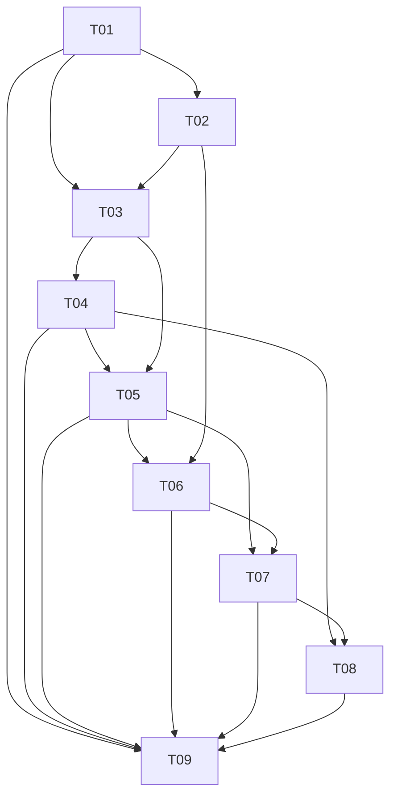

# IRIP Phase V0 系统架构设计

> **作者：** 高见远（Gao, 架构师）
> **范围：** Phase V0 — Platform Skeleton（实施计划任务 1–9）
> **上游输入：** 《IRIP完整工程逐任务实施计划》L60-730；《irip/docs/prd-v0.md》
> **项目根：** `irip/`（下文所有相对路径均以此为准）

---

## 1. 实现方案与框架选型确认

### 1.1 总体架构

采用 **FastAPI 模块化单体 + Celery Worker + React 控制台** 的经典三段式架构，以 PostgreSQL 16 为唯一权威存储，通过 **Outbox 模式 + 幂等提交** 保证异步作业的可恢复性。

```
┌─────────┐   HTTPS    ┌──────────────┐   SQL    ┌────────────────┐
│  React  │ ◄────────► │   FastAPI    │ ◄──────► │  PostgreSQL 16 │
│  (Web)  │            │   (API 单体) │          │  + pgvector    │
└─────────┘            └──────┬───────┘          └───────△────────┘
                              │                          │
                              │ S3 (boto3)               │ 租约/Outbox
                              ▼                          │
                       ┌──────────────┐                  │
                       │   MinIO      │                  │
                       │ (内容寻址)    │                  │
                       └──────────────┘                  │
                              ▲                          │
                              │ Celery (Redis broker)    │
                       ┌──────┴───────┐                  │
                       │ Celery Worker│ ◄────────────────┘
                       └──────────────┘
```

### 1.2 核心技术挑战与应对

| 挑战 | 应对策略 |
|---|---|
| 异步作业可恢复（worker 崩溃/重启/重复投递） | PostgreSQL Outbox + 唯一幂等键 + Worker 租约（含过期与心跳） + 同事务提交 |
| 权限细粒度（行级 + 对象子树） | RBAC 7 角色 + `scope_grant` 表（组织 + 可选对象子树根 + 资源类型 + 动作 + 生效区间），授权在服务层强制 |
| 刷新令牌安全 | 仅持久化 SHA-256 摘要 + 家族 ID + 单用途旋转 + 重放即家族撤销 |
| 审计不可篡改 | `audit_event` 仅追加；应用数据库角色被 `REVOKE UPDATE, DELETE`；写入前字段脱敏 |
| 大文件去重 | MinIO 对象键 `sha256/<前2位>/<digest>`，业务表 `artifact` 与 blob 表 `artifact_blob` 分离，多 artifact 可共享同一 blob |
| 时钟一致性 | `Clock` Protocol 注入；生产用 `SystemClock`，测试用 `FixedClock`；所有 ORM `timestamptz` 默认 `now() AT TIME ZONE 'utc'` |

### 1.3 框架与库选型（与实施计划对齐）

**后端（Python ≥3.12）：**
- **FastAPI 0.115+** — 异步 Web 框架，原生 OpenAPI 生成
- **Pydantic 2.9+ / pydantic-settings** — 数据校验、配置管理
- **SQLAlchemy 2.0（async）+ psycopg 3 + Alembic** — ORM / 迁移
- **Celery 5.4 + Redis 5** — 任务队列（Redis 仅作 broker，不作权威存储）
- **boto3** — MinIO S3 兼容客户端
- **PyJWT 2.9** — access token 签发
- **argon2-cffi** — Argon2id 密码哈希
- **structlog** — 结构化日志（统一 JSON 输出，便于审计追溯）
- **pytest + pytest-asyncio + Hypothesis + testcontainers + respx** — 测试栈

**前端（TypeScript + React 18）：**
- **Vite 5** — 构建工具
- **React 18 + TypeScript 5** — UI 框架
- **Ant Design 5** — 中文优先组件库
- **TanStack Router + TanStack Query** — 路由 / 数据获取（Query 用于轮询 job 状态）
- **Zustand**（轻量）— 内存态 access token + job ID 列表
- **Vitest + Testing Library + Playwright** — 单元 + E2E

### 1.4 环境适配决策（与本机 macOS / Python 3.13 / 包管理器现实对齐）

| 项目 | 计划值 | 实际决策 | 理由 |
|---|---|---|---|
| Python | 3.12（`requires-python = ">=3.12,<3.13"`） | **`requires-python = ">=3.12"`**（放开上限） | 本机为 Python 3.13.12；FastAPI/SQLAlchemy/Celery 已支持 3.13；上限锁死反而阻碍开发 |
| pnpm | 锁定 `pnpm-lock.yaml` | **使用 corepack 启用 pnpm**（`corepack enable pnpm && corepack prepare pnpm@9.15.0 --activate`） | 与计划保持 lockfile 一致，避免 npm/pnpm 混用 |
| Docker Compose 全量验收 | 在 macOS 本机直接跑 | **降级方案：单元/集成测试走 testcontainers；本机仅启动 postgres+redis+minio 三个容器；完整 `docker compose up` 在 Linux CI 上执行** | macOS 沙箱对 volume 挂载、网络端口、文件事件存在限制，完整一键验收属高风险 |
| pip 源 | 默认 PyPI | **清华镜像** `https://pypi.tuna.tsinghua.edu.cn/simple`（写入 `pip.conf` 与 `pyproject.toml` 的 `[[tool.uv.index]]`） | 国内网络加速 |
| npm 源 | 默认 registry | **npmmirror** `https://registry.npmmirror.com`（写入 `apps/web/.npmrc`） | 同上 |
| Docker registry mirror | 默认 Docker Hub | 在 `~/.docker/daemon.json` 配置国内 mirror（如 `https://docker.m.daocloud.io`）；镜像 tag 全部固定 | 同上 |

---

## 2. 文件列表（Phase V0 全量）

按模块分组；标 `[T]` 前缀表示所属任务编号。

### 2.1 项目根
```
[T1] .gitignore
[T1] .env.example
[T1] pyproject.toml
[T1] Makefile
[T1] README.md                       # 项目说明（如何启动）
[T9] compose.yaml                    # 生产 Compose（web/api/worker/scheduler/postgres/redis/minio/bootstrap）
[T9] .github/workflows/ci.yml        # CI: lint + unit + integration + e2e
[T3] alembic.ini
[T3] migrations/env.py
[T3] migrations/versions/0001_platform_base.py
[T4] migrations/versions/0002_authentication.py
[T5] migrations/versions/0003_authorization_audit.py
[T6] migrations/versions/0004_artifacts.py
[T7] migrations/versions/0005_jobs_outbox.py
```

### 2.2 `packages/common/`（通用内核）
```
[T1] packages/__init__.py
[T1] packages/common/__init__.py
[T2] packages/common/ids.py          # new_id() -> UUID（UUIDv7）
[T2] packages/common/clock.py        # Clock Protocol, SystemClock, FixedClock
[T2] packages/common/errors.py       # AppError(code, message, retryable, fields)
[T2] packages/common/hashing.py      # sha256_bytes/hex、refresh token digest
[T2] packages/common/pagination.py   # PageCursor（base64url JSON）
[T3] packages/common/database.py     # build_session_factory, session_scope
[T3] packages/common/db_types.py     # UTCDateTime、GUID TypeDecorator
[T6] packages/common/artifacts.py    # ArtifactService、ArtifactRef
[T6] packages/common/s3_repository.py# boto3 MinIO 封装
```

### 2.3 `packages/auth/`（认证 + 授权）
```
[T1] packages/auth/__init__.py
[T4] packages/auth/entities.py       # User, RefreshSession, Role, ScopeGrant (dataclass / ORM)
[T4] packages/auth/backends.py       # AuthBackend Protocol, LocalAuthBackend
[T4] packages/auth/passwords.py      # Argon2id hasher/verifier
[T4] packages/auth/tokens.py         # JWT 签发/校验、TokenPair、refresh 旋转
[T4] packages/auth/repository.py     # 用户/会话/角色/授权的持久化
[T4] packages/auth/service.py        # AuthService.login/refresh/logout
[T5] packages/auth/permissions.py    # Action/ResourceType 常量、7 角色矩阵
[T5] packages/auth/scope_grants.py   # ScopeGrant 评估、子树展开
```

### 2.4 `packages/audit/`（审计）
```
[T1] packages/audit/__init__.py
[T5] packages/audit/events.py        # AuditEvent 实体、AuditRecorder
[T5] packages/audit/redaction.py     # 敏感字段脱敏（password/token/secret/key）
[T5] packages/audit/repository.py    # 仅 INSERT 的 DAO
```

### 2.5 `packages/jobs/`（异步作业）
```
[T1] packages/jobs/__init__.py
[T7] packages/jobs/entities.py       # Job, JobStateHistory, OutboxEvent, WorkerLease, JobStatus
[T7] packages/jobs/repository.py     # Job/Outbox 持久化
[T7] packages/jobs/outbox.py         # OutboxDispatcher（标记已投递）
[T7] packages/jobs/service.py        # JobService.accept/request_cancel/get
[T7] packages/jobs/worker.py         # 租约获取/心跳/续期、幂等提交
```

### 2.6 `apps/api/`（FastAPI 单体）
```
[T1] apps/__init__.py
[T1] apps/api/__init__.py
[T9] apps/api/main.py                # create_app、CORS、中间件、异常→AppError 映射
[T9] apps/api/container.py           # ApplicationContainer（DI）
[T4] apps/api/routers/__init__.py
[T4] apps/api/routers/auth.py        # /api/v1/auth/{login,refresh,logout}
[T6] apps/api/routers/uploads.py     # /api/v1/artifacts/{presign-upload,complete,download}
[T7] apps/api/routers/jobs.py        # /api/v1/jobs、/api/v1/jobs/{id}/events
[T9] apps/api/routers/health.py      # /api/v1/health/{live,ready}
[T4] apps/api/dependencies/__init__.py
[T4] apps/api/dependencies/auth.py   # CurrentUser 依赖
[T5] apps/api/dependencies/authorization.py # require(action, resource) 依赖
```

### 2.7 `apps/worker/`（Celery Worker）
```
[T1] apps/worker/__init__.py
[T7] apps/worker/celery_app.py       # Celery 实例、broker/backend 配置（Redis）
[T7] apps/worker/tasks.py            # echo 任务、调度入口、心跳线程
```

### 2.8 `apps/web/`（React 控制台）
```
[T1] apps/web/package.json
[T1] apps/web/tsconfig.json
[T1] apps/web/vite.config.ts
[T1] apps/web/.npmrc                 # registry=https://registry.npmmirror.com
[T1] apps/web/index.html
[T8] apps/web/src/main.tsx
[T8] apps/web/src/app/router.tsx     # TanStack Router 路由树、守卫
[T8] apps/web/src/app/AppShell.tsx   # 主布局（导航 + 顶栏 + 内容）
[T8] apps/web/src/auth/AuthProvider.tsx # access token 内存管理、refresh 旋转
[T8] apps/web/src/auth/LoginPage.tsx
[T8] apps/web/src/jobs/JobDrawer.tsx # 全局作业抽屉
[T8] apps/web/src/jobs/useJobStore.ts # job ID 列表（localStorage）
[T8] apps/web/src/api/client.ts      # fetch 封装、自动 401→refresh→retry
[T8] apps/web/src/pages/WorkbenchPage.tsx  # 占位工作台
[T8] apps/web/src/pages/FactsPage.tsx      # 占位实验与事实
[T8] apps/web/src/pages/JobsPage.tsx       # 占位作业中心
[T8] apps/web/src/auth/LoginPage.test.tsx
[T8] apps/web/src/jobs/JobDrawer.test.tsx
[T9] apps/web/Dockerfile             # 多阶段构建（Node 22 构建 + nginx serve）
```

### 2.9 `deployments/compose/`（部署）
```
[T3] deployments/compose/postgres.Dockerfile  # postgres:16 + pgvector
[T3] deployments/compose/test.compose.yaml    # 本地开发测试用（postgres-test）
[T9] deployments/compose/api.Dockerfile
[T9] deployments/compose/worker.Dockerfile
[T9] deployments/compose/web.Dockerfile
[T9] deployments/compose/bootstrap.py         # 幂等初始化（组织/角色/管理员/bucket）
```

### 2.10 `tests/`（测试）
```
[T1] tests/__init__.py
[T1] tests/unit/test_repository_contract.py
[T2] tests/unit/common/test_common_kernel.py
[T3] tests/integration/conftest.py            # testcontainers fixtures
[T3] tests/integration/test_database_bootstrap.py
[T4] tests/unit/auth/test_tokens.py
[T4] tests/integration/auth/test_login_flow.py
[T5] tests/unit/auth/test_permissions.py
[T5] tests/security/test_object_scope_enforcement.py
[T6] tests/integration/storage/test_artifacts.py
[T7] tests/integration/jobs/test_job_lifecycle.py
[T7] tests/recovery/test_duplicate_delivery.py
[T9] tests/integration/test_v0_bootstrap.py
[T9] tests/e2e/v0-login.spec.ts               # Playwright
```

**Phase V0 文件总数估算：** ~80 个文件（后端 ~45、前端 ~20、部署/CI ~8、测试 ~7）。

---

## 3. 数据结构与接口

### 3.1 核心实体字段级定义

> 命名规范：表名 snake_case 单数；主键统一 `id UUID PK DEFAULT gen_random_uuid()`；时间戳统一 `timestamptz NOT NULL DEFAULT now()`；乐观锁 `lock_version INT NOT NULL DEFAULT 0`（仅可变实体）。

#### `app_user`（用户）
| 字段 | 类型 | 说明 |
|---|---|---|
| id | UUID PK | |
| organization_id | UUID FK→organization | 单组织模型 |
| email | CITEXT UNIQUE NOT NULL | 登录名 |
| display_name | TEXT NOT NULL | 中文显示名 |
| password_hash | TEXT NOT NULL | Argon2id |
| status | TEXT NOT NULL | `active` / `disabled` |
| created_at / updated_at | timestamptz | UTC |
| lock_version | INT | 乐观锁 |

#### `refresh_session`（刷新会话 — 家族化）
| 字段 | 类型 | 说明 |
|---|---|---|
| id | UUID PK | 本次会话 ID |
| family_id | UUID NOT NULL | 同一次登录的家族 ID |
| user_id | UUID FK→app_user | |
| token_digest | TEXT UNIQUE NOT NULL | refresh token 的 SHA-256 hex（不存明文） |
| issued_at / expires_at | timestamptz | 7 天有效期 |
| revoked_at | timestamptz NULL | 撤销时间（家族撤销时整族回填） |
| replaced_by | UUID NULL FK→refresh_session.id | 旋转后的下一棒 |
| created_ip / user_agent | TEXT | 审计辅助 |

**索引：** `(family_id)`、`(user_id, revoked_at)`、`(expires_at)`。

#### `role`（内置角色，7 个）
| 字段 | 类型 | 说明 |
|---|---|---|
| id | UUID PK | |
| code | TEXT UNIQUE | `platform_administrator` / `standard_owner` / `data_steward` / `researcher` / `model_engineer` / `reviewer` / `read_only_user` |
| display_name | TEXT | 中文名 |
| permissions | JSONB | `["fact:read", "fact:write", ...]` |

#### `scope_grant`（对象级授权）
| 字段 | 类型 | 说明 |
|---|---|---|
| id | UUID PK | |
| user_id | UUID FK→app_user NULL | 与 role_id 二选一 |
| role_id | UUID FK→role NULL | |
| organization_id | UUID NOT NULL | |
| object_root_id | UUID NULL | NULL = 全组织；否则子树根 |
| resource_type | TEXT NOT NULL | `fact` / `artifact` / `job` / `standard` … |
| action | TEXT NOT NULL | `fact:read` / `fact:write` / `artifact:download` … |
| effective_from / effective_to | timestamptz | 生效区间 |

**索引：** `(user_id, resource_type, action)`、`(role_id, resource_type, action)`。

#### `audit_event`（仅追加）
| 字段 | 类型 | 说明 |
|---|---|---|
| id | UUID PK | |
| occurred_at | timestamptz | UTC |
| actor_user_id | UUID NULL | 系统事件可为 NULL |
| organization_id | UUID | |
| action | TEXT | `auth.login` / `artifact.upload` / `job.cancel` … |
| resource_type / resource_id | TEXT / UUID | |
| payload | JSONB | **已脱敏** |
| ip / user_agent | TEXT | |

**约束：** 应用角色 `REVOKE UPDATE, DELETE ON audit_event`；仅 `INSERT` + `SELECT`。

#### `artifact_blob` + `artifact`
- **`artifact_blob`**：`sha256 TEXT PK`、`object_key TEXT UNIQUE`、`size_bytes BIGINT`、`media_type TEXT`、`created_at`
- **`artifact`**：`id UUID PK`、`organization_id`、`sha256 FK→artifact_blob`、`filename`、`media_type`、`size_bytes`、`uploaded_by UUID FK→app_user`、`created_at`

**设计要点：** 相同内容多业务引用共享同一 `artifact_blob`；`object_key = sha256/<前2位>/<digest>`。

#### `job`
| 字段 | 类型 | 说明 |
|---|---|---|
| id | UUID PK | |
| organization_id | UUID NOT NULL | |
| kind | TEXT NOT NULL | `echo` / `parse_excel` / … |
| status | TEXT NOT NULL | `accepted/queued/running/retry_wait/succeeded/failed/cancel_requested/cancelled` |
| payload | JSONB | 输入快照 |
| idempotency_key | TEXT NOT NULL | 与 organization_id 组成 UNIQUE |
| attempt | INT DEFAULT 0 | |
| max_attempts | INT DEFAULT 3 | |
| run_after | timestamptz | 重试退避 |
| lease_owner / lease_expires_at | TEXT / timestamptz | worker 租约 |
| result | JSONB NULL | 终态结果 |
| last_error | JSONB NULL | AppError 序列化 |
| created_by | UUID FK→app_user | |
| created_at / updated_at | timestamptz | |
| lock_version | INT | 乐观锁 |

**UNIQUE：** `(organization_id, idempotency_key)`。

#### `outbox_event`
| 字段 | 类型 | 说明 |
|---|---|---|
| id | UUID PK | |
| aggregate_type / aggregate_id | TEXT / UUID | `job` / `<job_id>` |
| event_type | TEXT | `job.accepted` / `job.cancel_requested` |
| payload | JSONB | |
| occurred_at | timestamptz | |
| delivered_at | timestamptz NULL | dispatcher 投递成功后回填 |

**索引：** `(delivered_at NULLS FIRST, occurred_at)` — 拉取未投递事件。

### 3.2 类图

见 `docs/class-diagram.mermaid`（同内容嵌入下方）。

```mermaid
classDiagram
    class Clock {
        <<Protocol>>
        +now() datetime
    }
    class SystemClock {
        +now() datetime
    }
    class FixedClock {
        +instant datetime
        +now() datetime
    }
    Clock <|.. SystemClock
    Clock <|.. FixedClock

    class AppError {
        +code str
        +message str
        +retryable bool
        +fields dict
        +to_dict() dict
    }

    class User {
        +UUID id
        +UUID organization_id
        +str email
        +str display_name
        +str password_hash
        +str status
    }
    class RefreshSession {
        +UUID id
        +UUID family_id
        +UUID user_id
        +str token_digest
        +datetime expires_at
        +datetime revoked_at
        +UUID replaced_by
    }
    class Role {
        +UUID id
        +str code
        +list permissions
    }
    class ScopeGrant {
        +UUID id
        +UUID user_id
        +UUID role_id
        +UUID organization_id
        +UUID object_root_id
        +str resource_type
        +str action
    }
    class AuditEvent {
        +UUID id
        +datetime occurred_at
        +UUID actor_user_id
        +str action
        +dict payload
    }
    class Artifact {
        +UUID id
        +str sha256
        +str filename
        +str media_type
        +int size_bytes
    }
    class Job {
        +UUID id
        +str kind
        +JobStatus status
        +dict payload
        +str idempotency_key
        +int attempt
        +str lease_owner
        +datetime lease_expires_at
        +dict result
    }
    class OutboxEvent {
        +UUID id
        +str aggregate_type
        +UUID aggregate_id
        +str event_type
        +dict payload
        +datetime delivered_at
    }

    User "1" --> "*" RefreshSession : owns
    User "*" --> "*" Role : via user_role
    ScopeGrant --> User : subject
    ScopeGrant --> Role : subject
    Job "1" --> "*" OutboxEvent : emits
    Artifact "*" --> "1" ArtifactBlob : references

    class AuthService {
        +login(email, password) TokenPair
        +refresh(refresh_token) TokenPair
        +logout(refresh_token) None
    }
    class AuthBackend {
        <<Protocol>>
        +authenticate(credentials) AuthenticatedIdentity
    }
    class LocalAuthBackend
    AuthBackend <|.. LocalAuthBackend
    AuthService --> AuthBackend

    class AuthorizationService {
        +require(user, action, resource) None
    }
    class AuditRecorder {
        +record(event) None
    }
    class ArtifactService {
        +put_bytes(data, media_type, filename) ArtifactRef
        +presign_upload(meta) PresignedURL
        +presign_download(artifact_id) PresignedURL
        +verify(artifact_id) bool
    }
    class JobService {
        +accept(kind, payload, idempotency_key) JobRef
        +request_cancel(job_id, actor_id) JobRef
        +get(job_id) Job
    }
    class OutboxDispatcher {
        +dispatch_pending() int
    }
    class WorkerLease {
        +acquire(job_id, owner, ttl) bool
        +heartbeat(job_id, owner) bool
        +release(job_id, owner) None
        +reap_expired() int
    }
```



---

## 4. 程序调用流程

> 完整时序图源文件：`docs/sequence-diagram.mermaid`

### 4.1 登录 + 刷新（旋转 + 重放检测）

```mermaid
sequenceDiagram
    actor U as 用户
    participant W as React Web
    participant API as FastAPI /auth
    participant SVC as AuthService
    participant DB as PostgreSQL
    participant AUD as AuditRecorder

    U->>W: 提交邮箱+密码
    W->>API: POST /api/v1/auth/login
    API->>SVC: login(email, password)
    SVC->>DB: SELECT app_user WHERE email
    SVC->>SVC: argon2.verify(password_hash, password)
    alt 校验失败 / 用户禁用
        SVC-->>API: AppError(invalid_credentials)
        API-->>W: 401 {error:{code:"invalid_credentials"}}
    else 校验通过
        SVC->>DB: INSERT refresh_session(family_id=new, token_digest, expires_at=+7d)
        SVC->>SVC: JWT 签发 access_token(15min)
        SVC->>AUD: record(auth.login, user_id)
        SVC-->>API: TokenPair
        API-->>W: 200 {access_token, expires_in} + Set-Cookie: irip_refresh=HttpOnly;SameSite=Strict
    end

    Note over W,DB: 15 分钟后 access_token 过期
    W->>API: POST /api/v1/auth/refresh (Cookie)
    API->>SVC: refresh(token)
    SVC->>DB: SELECT refresh_session WHERE token_digest=sha256(token)
    alt 记录存在 且 revoked_at IS NULL 且未过期
        SVC->>DB: UPDATE 当前行 revoked_at=now, replaced_by=new_id; INSERT 新行(同 family_id)
        SVC->>SVC: 签发新 access_token
        SVC-->>API: TokenPair
        API-->>W: 200 + 新 Cookie
    else 记录已撤销 (重放攻击)
        SVC->>DB: UPDATE refresh_session SET revoked_at=now WHERE family_id=? (整族撤销)
        SVC->>AUD: record(auth.refresh_replayed)
        SVC-->>API: AppError(refresh_replayed)
        API-->>W: 401 {error:{code:"refresh_replayed"}}
    end
```

### 4.2 作业提交 → Outbox → Celery → 租约 → 幂等提交

```mermaid
sequenceDiagram
    actor U as 用户
    participant W as React Web
    participant API as FastAPI /jobs
    participant JS as JobService
    participant DB as PostgreSQL
    participant DSP as OutboxDispatcher
    participant R as Redis (broker)
    participant WK as Celery Worker
    participant L as WorkerLease
    participant ART as ArtifactService

    U->>W: 提交作业 (kind, payload)
    W->>API: POST /api/v1/jobs {kind, payload, idempotency_key}
    API->>JS: accept(kind, payload, key)
    JS->>DB: BEGIN; INSERT job(status=accepted); INSERT outbox_event(job.accepted); COMMIT
    JS-->>API: JobRef(id, status=accepted)
    API-->>W: 202 {job_id}

    loop 每 200ms 轮询
        DSP->>DB: SELECT * FROM outbox_event WHERE delivered_at IS NULL
        DSP->>R: celery.send_task(job.id)
        DSP->>DB: UPDATE outbox_event SET delivered_at=now
    end

    WK->>L: acquire(job_id, owner=worker_id, ttl=30s)
    L->>DB: UPDATE job SET lease_owner, lease_expires_at, status=running WHERE id AND (lease_expires_at < now OR lease_owner IS NULL)
    alt 租约获取失败 (他人在跑)
        L-->>WK: false → WK 丢弃任务 (不 ACK → Redis 重投)
    else 租约获取成功
        loop 每 10s 心跳
            WK->>L: heartbeat(job_id, owner) → 延长 lease_expires_at
        end
        WK->>ART: 写中间产物到 tmp/jobs/<job_id>/...
        WK->>DB: BEGIN; UPDATE job SET status=succeeded, result=? WHERE id AND lock_version=?; INSERT audit_event; COMMIT
        Note over WK,DB: 幂等键唯一约束 → 重复投递被 UNIQUE 拦截, 二次提交变 no-op
        WK->>L: release(job_id, owner)
    end

    Note over WK,DB: Worker 崩溃 → 心跳停止 → 租约到期
    DSP->>L: reap_expired() (周期任务)
    L->>DB: UPDATE job SET status=queued, lease_owner=NULL WHERE lease_expires_at < now AND status=running
    Note over DSP,DB: 下一次 dispatcher 拉取 → 重新投递
```

### 4.3 工件上传（预签名 + 去重 + 鉴权）

```mermaid
sequenceDiagram
    actor U as 用户
    participant W as Web
    participant API as FastAPI /artifacts
    participant AZ as AuthorizationService
    participant AS as ArtifactService
    participant S3 as MinIO
    participant DB as PostgreSQL

    U->>W: 选择文件
    W->>API: POST /artifacts/presign-upload {filename, size, media_type, sha256}
    API->>AZ: require(user, "artifact:write", org)
    AZ-->>API: ok
    API->>AS: presign_upload(meta)
    AS->>DB: SELECT artifact_blob WHERE sha256=?
    alt 已存在 (秒传)
        AS->>DB: INSERT artifact (指向已有 blob)
        AS-->>API: ArtifactRef(artifact_id)
        API-->>W: 201 {artifact_id, deduplicated: true}
    else 不存在
        AS->>S3: presign PUT sha256/<前2>/<digest>
        AS-->>API: {upload_url, object_key}
        API-->>W: 200 {upload_url}
        W->>S3: PUT 文件 (直传 MinIO)
        W->>API: POST /artifacts/complete {object_key, sha256}
        API->>AS: 校验 S3 head 大小 + sha256 + media_type allowlist
        AS->>DB: BEGIN; INSERT artifact_blob; INSERT artifact; COMMIT
        AS-->>API: ArtifactRef
        API-->>W: 201 {artifact_id}
    end
```

---

## 5. 任务列表（9 个，按实现顺序）

> **依赖原则：** 仅 T01 是基础设施；T02-T08 之间尽量浅依赖；T09 是验收汇总。

| Task ID | 名称 | 预估文件数 | 依赖 | 验证命令 |
|---|---|---:|---|---|
| **T01** | 项目基础设施（依赖锁定 + 目录骨架 + 质量入口） | 10 | — | `pytest tests/unit/test_repository_contract.py -v && ruff check apps packages tests` |
| **T02** | 通用内核（ID/时钟/错误/哈希/分页） | 6 | T01 | `pytest tests/unit/common -v && mypy packages/common` |
| **T03** | PostgreSQL 会话 + 初始迁移 | 9 | T01, T02 | `docker compose -f deployments/compose/test.compose.yaml up -d postgres-test && alembic upgrade head && pytest tests/integration/test_database_bootstrap.py -v` |
| **T04** | 认证与会话生命周期（Argon2id + JWT + 旋转刷新） | 10 | T01, T02, T03 | `alembic upgrade head && pytest tests/unit/auth tests/integration/auth -v` |
| **T05** | RBAC + 对象 Scope + 仅追加审计 | 9 | T01, T02, T03, T04 | `pytest tests/unit/auth tests/security/test_object_scope_enforcement.py -v` |
| **T06** | MinIO 内容寻址工件服务 | 5 | T01, T02, T03, T05 | `pytest tests/integration/storage/test_artifacts.py -v` |
| **T07** | 可靠作业 + Outbox + 租约 + 幂等 | 9 | T01, T02, T03, T05, T06 | `pytest tests/integration/jobs tests/recovery/test_duplicate_delivery.py -v` |
| **T08** | React 控制台外壳（登录/守卫/作业抽屉） | 15 | T01, T04, T07 | `pnpm --dir apps/web test --run && pnpm --dir apps/web build` |
| **T09** | Docker Compose + Bootstrap + 健康检查 + V0 验收 | 9 | T01–T08 全部 | `docker compose up --build -d && docker compose run --rm bootstrap (×2) && pytest tests/integration/test_v0_bootstrap.py -v && pnpm --dir apps/web e2e tests/e2e/v0-login.spec.ts` |

**任务依赖图：**



**关键路径：** `T01 → T02 → T03 → T04 → T05 → T06 → T07 → T09`（约 8 步）。T08 可与 T05/T06 并行启动。

---

## 6. 依赖包列表

### 6.1 Python（写入 `pyproject.toml`，使用 `uv` 或 `pip-tools` 生成 lockfile）

**运行时：**
```
fastapi>=0.115,<1
pydantic>=2.9,<3
pydantic-settings>=2.5,<3
sqlalchemy[asyncio]>=2.0,<3
alembic>=1.13,<2
psycopg[binary]>=3.2,<4
celery>=5.4,<6
redis>=5,<6
boto3>=1.35,<2
pyjwt>=2.9,<3
argon2-cffi>=23,<24
httpx>=0.27,<1
uvicorn[standard]>=0.30,<1
python-multipart>=0.0.9,<1
structlog>=24,<26
```

**开发/测试：**
```
pytest>=8,<9
pytest-asyncio>=0.24,<1
pytest-cov>=5,<7
hypothesis>=6.112,<7
testcontainers[postgres,redis,minio]>=4.8,<5
respx>=0.21,<1
ruff>=0.6,<1
mypy>=1.11,<2
```

**pip 国内镜像（`~/.pip/pip.conf` 或项目级 `pip.conf`）：**
```ini
[global]
index-url = https://pypi.tuna.tsinghua.edu.cn/simple
extra-index-url = https://mirrors.aliyun.com/pypi/simple/
```

### 6.2 前端（`apps/web/package.json`，pnpm 锁定）

```json
{
  "dependencies": {
    "react": "^18.3.1",
    "react-dom": "^18.3.1",
    "antd": "^5.22.0",
    "@tanstack/react-router": "^1.85.0",
    "@tanstack/react-query": "^5.62.0",
    "zustand": "^5.0.0",
    "axios": "^1.7.9",
    "dayjs": "^1.11.13"
  },
  "devDependencies": {
    "@types/react": "^18.3.12",
    "@types/react-dom": "^18.3.1",
    "@vitejs/plugin-react": "^4.3.4",
    "typescript": "^5.7.0",
    "vite": "^5.4.11",
    "vitest": "^2.1.8",
    "@testing-library/react": "^16.1.0",
    "@testing-library/user-event": "^14.5.2",
    "@playwright/test": "^1.49.0",
    "jsdom": "^25.0.1"
  }
}
```

**npm 国内镜像（`apps/web/.npmrc`）：**
```
registry=https://registry.npmmirror.com
```

### 6.3 Docker 基础镜像（全部固定 tag，禁用 `latest`）

| 镜像 | Tag | 用途 |
|---|---|---|
| `python` | `3.12-slim-bookworm` | api / worker / bootstrap |
| `node` | `22.11.0-alpine3.20` | web 构建阶段 |
| `nginx` | `1.27.3-alpine` | web 运行阶段 |
| `postgres` | `16.6-bookworm` + 自编译 pgvector 0.8.0 | 数据库 |
| `redis` | `7.4.1-alpine` | broker / cache |
| `minio/minio` | `RELEASE.2024-11-07T00-52-20Z` | 对象存储 |

**Docker registry mirror（`~/.docker/daemon.json`）：**
```json
{
  "registry-mirrors": [
    "https://docker.m.daocloud.io",
    "https://dockerproxy.com"
  ]
}
```

---

## 7. 共享知识（跨文件约定）

### 7.1 命名规范
- **数据库：** 表/列 snake_case 单数（`app_user`、`refresh_session`）；索引 `ix_<表>_<列>`；唯一约束 `uq_<表>_<列>`；外键 `fk_<表>_<被引表>_<列>`。
- **Python：** 模块 snake_case；类 PascalCase；常量 UPPER_SNAKE；私有前缀 `_`。
- **TypeScript：** 文件 kebab-case 或 PascalCase（组件用 PascalCase）；变量 camelCase；类型 PascalCase。
- **API 字段：** snake_case（与 OpenAPI 一致）；URL 路径 kebab-case。
- **稳定代码 / 错误码 / 事件类型：** 英文；UI 显示文本：中文。

### 7.2 错误码规范
统一格式：`{error: {code, message, retryable, fields}}`，HTTP 状态与错误码对照：

| HTTP | code | 触发 |
|---|---|---|
| 400 | `invalid_request` / `invalid_cursor` | 参数错、游标错 |
| 401 | `invalid_credentials` / `token_expired` / `refresh_replayed` | 认证失败 |
| 403 | `forbidden` | 授权拒绝 |
| 404 | `not_found` | 资源不存在 |
| 409 | `conflict` / `idempotency_conflict` | 乐观锁/幂等冲突 |
| 422 | `validation_failed` | Pydantic 校验失败 |
| 500 | `internal_error` | 未捕获异常 |
| 503 | `dependency_unavailable` | DB/Redis/MinIO 不可达 |

### 7.3 时间与 ID
- 所有持久化时间戳为 `timestamptz`，应用层只允许 `datetime.now(UTC)` 或 `Clock.now()`。
- API 输出 RFC 3339（`2026-07-15T08:30:00Z`），由 Pydantic 序列化器统一处理。
- ID 使用 UUIDv7（时间有序，索引友好），由 `packages/common/ids.new_id()` 生成。

### 7.4 分页游标
- 格式：base64url 编码的 JSON `{"v": <稳定排序值>, "id": "<UUID>"}`。
- 例：`?cursor=eyJ2IjoiMjAyNi0wNy0xNVQwODozMDowMFoiLCJpZCI6IjAxOTM...`。
- 服务端校验失败抛 `AppError(code="invalid_cursor")`。
- 默认页大小 20，最大 100。

### 7.5 鉴权与审计
- 所有 `/api/v1/*`（除 `/auth/login` 与 `/health/*`）必须经过 `CurrentUser` 依赖。
- 写操作必须通过 `AuthorizationService.require(user, action, resource)`。
- 关键事件（登录、刷新重放、授权拒绝、工件上传、作业状态变更）必须写 `audit_event`。
- `audit_event.payload` 在写入前必须经 `redact()` 处理（密码、token、secret、key、authorization 等字段替换为 `[REDACTED]`）。

### 7.6 异步与事务
- 所有数据库写操作走 `session_scope()`（自动 commit / rollback）。
- 任何"写业务表 + 触发异步事件"必须同事务插入 `outbox_event`。
- Celery 任务命名：`<domain>.<verb>`（如 `jobs.echo`、`facts.parse_excel`）。
- Worker 心跳间隔 10s，租约 TTL 30s，到期后由 `reaper` 重新入队。

### 7.7 前端
- access token 仅存于 React state（`AuthProvider`），刷新页面 → 调用 `/auth/refresh`（HttpOnly Cookie）→ 重新拉 `/me`。
- API 客户端在 401 时自动调用 `/auth/refresh` 并重试一次；重试仍 401 → 跳登录页。
- 所有时间戳用 `dayjs` 本地化为 `YYYY-MM-DD HH:mm:ss` 显示。
- 作业 ID 列表存 `localStorage.irip.job_ids`，重启后从 API 拉取权威状态。

---

## 8. 待明确事项与风险清单

### 8.1 待确认问题

| # | 问题 | 建议 | 决策人 |
|---|---|---|---|
| 1 | 默认管理员密码是否首次登录强制修改？ | V0 不强制；V1 加 `must_change_password` 标记 | PM |
| 2 | Scope Grant 是否提供 UI 管理界面？ | V0 仅 API + 种子；UI 延后至 V1/V3 | PM |
| 3 | 审计日志是否提供查询页面？ | V0 仅 DB 层；查询 UI 延后 | PM |
| 4 | Python 上限是否放开到 `<3.14`？ | 建议放开，已在 §1.4 决策 | Tech Lead |
| 5 | CI 是否跑完整 Docker Compose 验收？ | 建议：PR 跑 testcontainers；merge 到 main 跑完整 compose | Tech Lead |

### 8.2 风险清单

| 风险 | 等级 | 缓解 |
|---|---|---|
| **macOS 本机 Docker Compose 全量验收受限**（volume 挂载、网络、文件事件） | 🔴 高 | 本机仅跑 postgres+redis+minio 三容器 + testcontainers；完整 `docker compose up` 验收挪到 Linux CI（GitHub Actions `ubuntu-latest`） |
| **Python 3.13 与 Celery 5.4 兼容性** | 🟡 中 | Celery 5.4.0 起正式支持 3.13；CI 同时跑 3.12 + 3.13 矩阵；锁文件在 3.12 下生成 |
| **pnpm 未安装导致 `pnpm install` 失败** | 🟡 中 | 在 README 与 Makefile 中明确 `corepack enable pnpm` 前置步骤；CI 镜像自带 corepack |
| **testcontainers 在 macOS 上启动 pgvector 镜像慢** | 🟢 低 | 第一次拉取后镜像缓存；测试用 `postgres:16-pgvector` 自定义镜像（含扩展） |
| **MinIO 直传 presigned URL 跨域** | 🟢 低 | MinIO 容器配置 CORS allow `http://localhost:5173`；生产同源 nginx 反代 |
| **Celery + Redis 在 Mac 沙箱下网络不通** | 🟡 中 | 开发时使用 `docker compose -f test.compose.yaml up` 仅起依赖；worker 在本机进程跑（`celery -A apps.worker worker`） |
| **refresh token 重放检测竞态**（并发 refresh 同一 token） | 🟡 中 | 在 `refresh_session` 行上加 `SELECT ... FOR UPDATE`；被锁定的并发请求等第一个完成后再判定 |
| **Outbox dispatcher 单点** | 🟢 低（V0） | V0 单实例即可；V3 引入 leader election（Redis SETNX） |

---

## 9. 验收标准（V0 评审门）

在 **干净的 Linux 主机** 上依次执行：

1. `git clone` + `docker compose up --build -d` → 所有服务健康
2. `docker compose run --rm bootstrap` 连跑两次 → 均 exit 0；`app_user` 中 `admin@irip.local` 仅 1 行
3. 浏览器登录 → 成功进入工作台；F5 刷新 → 会话保持
4. 用研究员账号尝试访问未授权对象 → 403 `forbidden`
5. 上传同一文件两次 → `artifact_blob` 表仅 1 行，`artifact` 表 2 行
6. 提交 echo 作业 → 作业抽屉中观察 `accepted → queued → running → succeeded` 全链路
7. 重启 worker 容器 → 作业在 30s 内被重新接管并完成
8. `pytest tests/integration tests/recovery tests/security` 全绿
9. `pnpm --dir apps/web e2e tests/e2e/v0-login.spec.ts` 全绿

通过上述 9 项 → V0 评审门通过，进入 V1（粒度 L1→L3 证据链）。

---

**文档版本：** v1.0 · 2026-07-15
**下一步：** 主理人评审 → 交予工程师（T01 起步）
