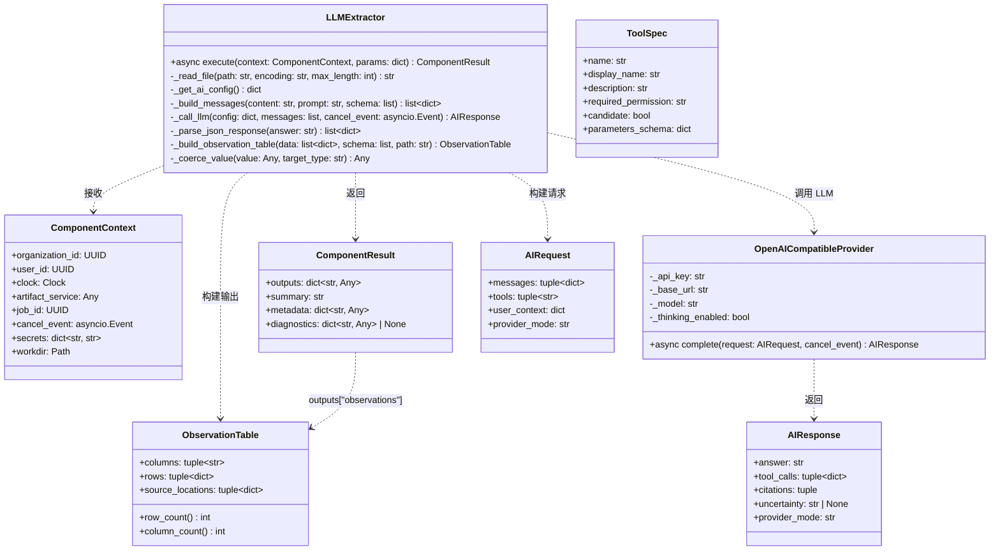
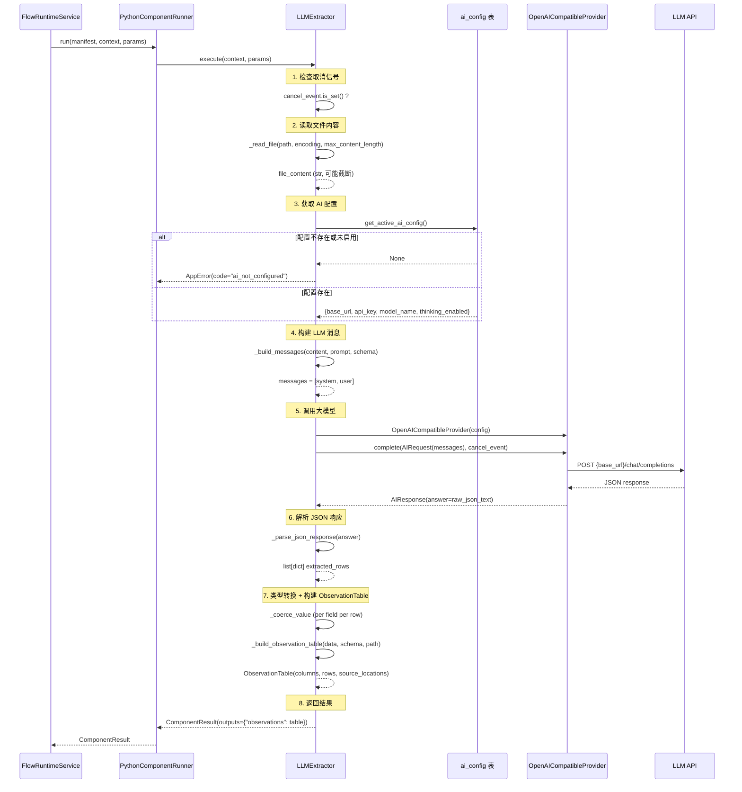
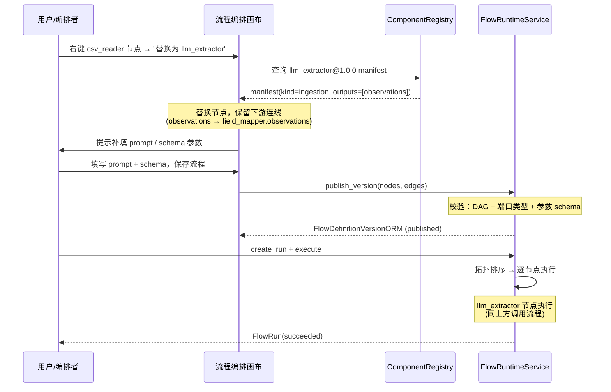
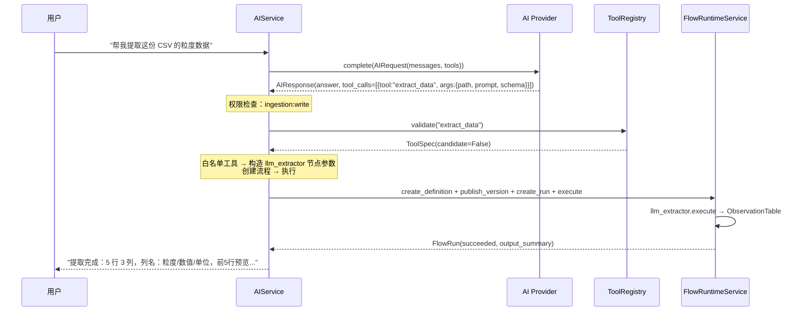
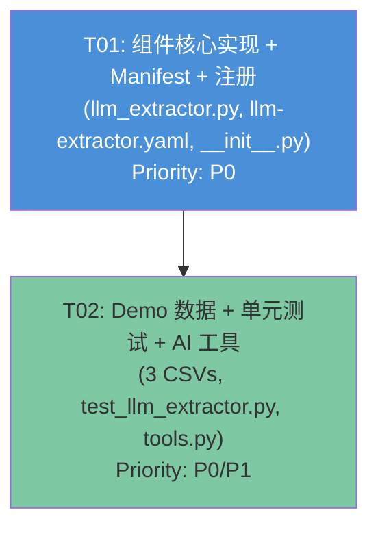

# 系统设计：LLM 数据提取组件（llm_extractor）

> 架构师：高见远（Bob）  
> 基于 PRD：`docs/prd/llm-extractor-prd.md`  
> 代码库路径：`/Users/shuipei/Desktop/snowSP/irip/`

---

## Part A: System Design

### 1. 实现方案

#### 1.1 核心技术挑战

| 挑战 | 分析 | 方案 |
|------|------|------|
| **AI 配置获取** | 组件运行在 FlowRuntimeService 中，需读取 `ai_config` 表的 base_url/api_key/model_name。`get_active_ai_config()` 位于 `apps/api/routers/ai_config.py`，使用模块级 session_factory（app 启动时注入），组件可直接调用 | 组件导入并调用 `get_active_ai_config()`；未配置时抛 `AppError(code="ai_not_configured")`；测试时 mock 该函数 |
| **LLM 响应解析** | 大模型返回的 JSON 可能被 markdown 代码块包裹（```json ... ```），或含多余说明文字 | 正则提取首个 JSON 对象/数组；提取失败时抛 `AppError(code="llm_parse_error")`，diagnostics 中保留截断的原始响应 |
| **与现有组件协议对齐** | 必须输出 `ObservationTable`，输出端口名 `observations`，与 csv_reader 完全一致 | 复用 `ObservationTable` frozen dataclass；columns 来自 schema 字段名；source_locations 标注文件名+行号 |
| **密钥安全** | api_key 不能出现在日志/summary/metadata/diagnostics 中 | 组件仅将 api_key 传给 `OpenAICompatibleProvider` 构造函数；summary/metadata 只记录 model_name 和行数；diagnostics 截断时不含请求头 |
| **取消信号响应** | FlowRuntimeService 通过 `context.cancel_event` 实现协作式取消 | 在文件读取前、LLM 调用前检查 `cancel_event.is_set()`；将 cancel_event 透传给 `provider.complete()` |

#### 1.2 框架与库选择

| 库 | 用途 | 选择理由 |
|----|------|---------|
| `httpx`（已有） | 异步 HTTP 调用 LLM API | 项目已依赖，`OpenAICompatibleProvider` 已封装 |
| `packages.ai.openai_compatible.OpenAICompatibleProvider` | LLM 调用 | 现有实现，支持 thinking 模式、cancel_event、错误处理 |
| `packages.ai.providers.AIRequest` / `AIResponse` | 请求/响应值对象 | 现有协议，不可变 dataclass |
| `apps.api.routers.ai_config.get_active_ai_config` | 读取 AI 配置 | 现有函数，返回 `{base_url, api_key, model_name, thinking_enabled}` |
| 标准库 `pathlib` / `json` / `re` | 文件读取 / JSON 解析 | 无新增依赖 |

**无新增第三方包**——全部基于现有技术栈实现。

#### 1.3 架构模式

采用 **现有组件协议模式**（与 CSVReader / ExcelReader 一致）：

```
FlowRuntimeService
  └─ PythonComponentRunner.run(manifest, context, params)
       └─ LLMExtractor.execute(context, params)
            ├─ 1. 读取文件内容（pathlib）
            ├─ 2. 获取 AI 配置（get_active_ai_config → DB）
            ├─ 3. 构建 LLM 消息（system + user）
            ├─ 4. 调用 LLM（OpenAICompatibleProvider.complete）
            ├─ 5. 解析 JSON 响应（re + json）
            ├─ 6. 类型转换（根据 schema 字段类型）
            └─ 7. 构建 ObservationTable → ComponentResult
```

---

### 2. 文件列表

| # | 文件路径 | 操作 | 说明 |
|---|---------|------|------|
| 1 | `packages/components/builtin/ingestion/llm_extractor.py` | 新建 | LLMExtractor 组件实现 |
| 2 | `schemas/component-manifest/llm-extractor.yaml` | 新建 | 组件 manifest 清单 |
| 3 | `packages/components/builtin/__init__.py` | 修改 | 注册 llm_extractor 到 `_BUILTIN_COMPONENTS` + `_YAML_FILES` |
| 4 | `examples/demo-data/particle_size_sample1.csv` | 新建 | 标准 CSV（D10/D50/D90 + 单位） |
| 5 | `examples/demo-data/particle_size_sample2.csv` | 新建 | 非标准列名 CSV（中文表头/不同分隔） |
| 6 | `examples/demo-data/particle_size_sample3.csv` | 新建 | 带注释行的 CSV（# 开头注释 + 数据混合） |
| 7 | `tests/unit/components/test_llm_extractor.py` | 新建 | 单元测试（mock LLM 响应） |
| 8 | `packages/ai/tools.py` | 修改 | 新增 `extract_data` 白名单工具（P1） |

---

### 3. 数据结构与接口



#### 3.1 LLMExtractor 参数 Schema

manifest `parameters` 定义（JSON Schema）：

```yaml
parameters:
  type: object
  required:
    - path
    - prompt
    - schema
  properties:
    path:
      type: string
      description: "文件路径（CSV/JSON/纯文本等）"
    prompt:
      type: string
      description: "提取指令，指导大模型如何从文件中提取数据"
    schema:
      type: array
      description: "目标字段定义列表"
      items:
        type: object
        required:
          - name
        properties:
          name:
            type: string
            description: "字段名（输出列名）"
          type:
            type: string
            enum: [string, number, integer, boolean]
            default: string
            description: "字段类型"
      minItems: 1
    encoding:
      type: string
      default: utf-8
      description: "文件编码"
    max_content_length:
      type: integer
      default: 8000
      minimum: 100
      description: "发送给 LLM 的最大文件内容字符数（超出截断）"
```

#### 3.2 LLM 消息构造

**System 消息**（固定）：
```
你是一个数据提取助手。请根据用户的提取指令，从给定的文件内容中提取结构化数据。
严格按照目标字段 schema 输出 JSON，格式为：{"rows": [{字段1: 值1, 字段2: 值2}, ...]}
只返回 JSON，不要包含任何解释文字或 markdown 标记。
如果文件内容为空或无法提取数据，返回 {"rows": []}。
```

**User 消息**（动态拼接）：
```
提取指令：{prompt}

目标字段 schema：
{json.dumps(schema, ensure_ascii=False)}

文件内容：
---文件开始---
{file_content}
---文件结束---
```

#### 3.3 响应解析逻辑

```python
def _parse_json_response(self, answer: str) -> list[dict]:
    """从 LLM 回答中提取 JSON 数据。
    
    策略：
    1. 尝试直接 json.loads(answer)
    2. 失败则用正则提取 {...} 或 [...] JSON 片段
    3. 解析后取 {"rows": [...]} 中的 rows，或直接取列表
    4. 全部失败抛 AppError(code="llm_parse_error")
    """
```

#### 3.4 类型转换

| schema type | 转换逻辑 | 失败处理 |
|-------------|---------|---------|
| `string` | `str(value)` | 保留原值 |
| `number` | `float(value)` | 保留原值，diagnostics 告警 |
| `integer` | `int(value)` | 保留原值，diagnostics 告警 |
| `boolean` | `"true"/"1"/"yes"` → True, 其余 False | 保留原值 |

#### 3.5 AI 助手工具定义（P1）

```python
ToolSpec(
    name="extract_data",
    display_name="提取数据",
    description="根据文件路径和提取指令，使用大模型从文件中提取结构化数据。",
    required_permission="ingestion:write",
    candidate=False,
    parameters_schema={
        "type": "object",
        "required": ["path", "prompt", "schema"],
        "properties": {
            "path": {"type": "string", "description": "文件路径"},
            "prompt": {"type": "string", "description": "提取指令"},
            "schema": {
                "type": "array",
                "description": "目标字段定义",
                "items": {"type": "object"},
            },
        },
    },
)
```

---

### 4. 程序调用流程



#### 4.1 关键操作：csv_reader 节点替换



#### 4.2 关键操作：AI 助手触发提取



---

### 5. 待明确事项

| # | 事项 | 当前假设 | 影响范围 |
|---|------|---------|---------|
| U1 | `get_active_ai_config()` 位于 `apps/api/routers/ai_config.py`（API 层），组件导入它形成 components → apps 反向依赖 | P0 阶段直接导入使用（利用模块级 session_factory）；未来可提取到 `packages/ai/config.py` 解耦 | llm_extractor.py 导入路径；测试 mock 方式 |
| U2 | AI 助手工具 `extract_data` 的实际执行逻辑（构造流程节点、创建/运行流程）在 AIService 中尚未实现 | P1 阶段仅在 `tools.py` 注册 ToolSpec；实际执行逻辑待 AIService 后续迭代 | tools.py 新增 ToolSpec；AIService 执行逻辑不在本次范围 |
| U3 | manifest `network_policy.allowed_hosts` 是否支持动态值 | manifest 中不声明具体 host（留空或注释）；运行时由 FlowRuntimeService 的网络策略控制 | llm-extractor.yaml |
| U4 | 大文件分块（P1-3）超出 P0 范围 | P0 阶段通过 `max_content_length` 参数截断文件内容；不做分块 | llm_extractor.py `_read_file` 方法 |
| U5 | source_locations 的 row 字段 | P0 用输出序号（从 1 递增）；非 LLM 推断的原始行号 | llm_extractor.py `_build_observation_table` |
| U6 | Manifest 契约测试（P0-11）和端到端测试（P0-12）目录 | 本次设计聚焦 `tests/unit/components/test_llm_extractor.py`；契约测试和 e2e 测试待后续补充 | 测试覆盖范围 |

---

## Part B: Task Decomposition

### 6. Required Packages

**无新增第三方包**——全部基于现有技术栈：

```
- httpx（已有）: 异步 HTTP 客户端，OpenAICompatibleProvider 内部使用
- jsonschema（已有）: manifest 参数校验
- pyyaml（已有）: manifest YAML 解析
- 标准库 pathlib/json/re: 文件读取、JSON 解析、正则提取
```

---

### 7. Task List（按依赖顺序）

#### T01: LLMExtractor 组件核心实现 + Manifest + 注册

| 项 | 值 |
|---|---|
| **Task ID** | T01 |
| **Task Name** | LLMExtractor 组件核心实现 + Manifest + 注册 |
| **Source Files** | `packages/components/builtin/ingestion/llm_extractor.py`（新建）<br/>`schemas/component-manifest/llm-extractor.yaml`（新建）<br/>`packages/components/builtin/__init__.py`（修改） |
| **Dependencies** | 无 |
| **Priority** | P0 |

**工作内容**：

1. **`llm_extractor.py`** — 实现 `LLMExtractor` 类：
   - `async execute(context, params) -> ComponentResult`：主流程
   - `_read_file(path, encoding, max_length) -> str`：读取文件内容，超出 max_content_length 截断
   - `_build_messages(content, prompt, schema) -> list[dict]`：构建 system + user 消息
   - `_parse_json_response(answer) -> list[dict]`：从 LLM 回答提取 JSON（支持 markdown 包裹容错）
   - `_build_observation_table(data, schema, path) -> ObservationTable`：构建输出表
   - `_coerce_value(value, target_type) -> Any`：按 schema 类型转换
   - 导入并调用 `get_active_ai_config()` 获取 AI 配置
   - 使用 `OpenAICompatibleProvider` 调用 LLM
   - 错误处理：`ai_not_configured` / `llm_parse_error` / `llm_call_error`
   - 密钥安全：summary/metadata 中不含 api_key

2. **`llm-extractor.yaml`** — Manifest 清单：
   - name: `llm_extractor`，version: `1.0.0`，kind: `ingestion`，runtime: `python`
   - inputs: `[]`（无输入端口）
   - outputs: `[{name: observations, data_type: observation_table, required: true}]`
   - parameters: `path`(required) / `prompt`(required) / `schema`(required) / `encoding` / `max_content_length`
   - timeout_seconds: 120
   - 必须通过 `ManifestValidator.validate()` 校验

3. **`__init__.py`** — 注册组件：
   - 新增 `from packages.components.builtin.ingestion.llm_extractor import LLMExtractor`
   - 在 `_BUILTIN_COMPONENTS` 中添加 `"llm_extractor": ("1.0.0", LLMExtractor)`
   - 在 `_YAML_FILES` 中添加 `"llm_extractor": "llm-extractor.yaml"`

**验收标准**：
- `ManifestValidator.validate(yaml_text)` 不报错
- `register_builtin_components(runner)` 后 runner 可找到 `llm_extractor@1.0.0`
- `list_builtin_components()` 包含 `llm_extractor`
- 组件 `execute()` 返回 `ComponentResult`，`outputs["observations"]` 为 `ObservationTable`

---

#### T02: Demo 数据 + 单元测试 + AI 助手工具集成

| 项 | 值 |
|---|---|
| **Task ID** | T02 |
| **Task Name** | Demo 数据 + 单元测试 + AI 助手工具集成 |
| **Source Files** | `examples/demo-data/particle_size_sample1.csv`（新建）<br/>`examples/demo-data/particle_size_sample2.csv`（新建）<br/>`examples/demo-data/particle_size_sample3.csv`（新建）<br/>`tests/unit/components/test_llm_extractor.py`（新建）<br/>`packages/ai/tools.py`（修改） |
| **Dependencies** | T01 |
| **Priority** | P0（demo + 测试）/ P1（AI 工具） |

**工作内容**：

1. **`particle_size_sample1.csv`** — 标准格式粒度数据：
   ```
   粒度,数值,单位
   D10,5.2,um
   D50,12.5,um
   D90,25.0,um
   ```

2. **`particle_size_sample2.csv`** — 非标准列名/格式：
   ```
   粒径区间,体积百分比(%),累积百分比(%)
   0-5,10.2,10.2
   5-10,25.5,35.7
   10-20,40.3,76.0
   ```

3. **`particle_size_sample3.csv`** — 带注释行：
   ```
   # 粒度分析报告 - 样品编号 S2024-001
   # 检测日期: 2024-07-22
   # 仪器: 激光粒度分析仪
   粒径(um),频率,累积
   2.0,0.05,0.05
   5.0,0.12,0.17
   10.0,0.30,0.47
   ```

4. **`test_llm_extractor.py`** — 单元测试（mock LLM 响应）：
   - `test_extract_csv_basic`：mock provider 返回 `{"rows": [...]}`，验证 ObservationTable 列/行
   - `test_extract_with_type_coercion`：schema 含 number 类型，验证 float 转换
   - `test_empty_file`：空文件 → LLM 返回 `{"rows": []}`，验证空 ObservationTable
   - `test_ai_not_configured`：mock `get_active_ai_config` 返回 None，验证 AppError
   - `test_json_parse_with_markdown`：mock provider 返回 ```json ... ```，验证容错解析
   - `test_source_locations`：验证 source_locations 含 file + row 字段
   - `test_cancel_event`：预设 cancel_event，验证快速退出
   - 使用 `unittest.mock.patch` mock `get_active_ai_config` 和 `OpenAICompatibleProvider`
   - 复用 `tests/unit/components/conftest.py` 的 `make_test_context()`

5. **`tools.py`** — 新增 `extract_data` 工具：
   - 在 `WHITELIST_TOOLS` 元组中追加 `ToolSpec(name="extract_data", ...)`
   - `required_permission="ingestion:write"`，`candidate=False`
   - parameters_schema 含 path / prompt / schema

**验收标准**：
- 3 个 demo CSV 文件可被 LLMExtractor 正确读取
- 所有单元测试通过（mock 模式，不依赖真实 LLM API）
- `ToolRegistry` 中包含 `extract_data` 工具
- `WHITELIST_TOOL_NAMES` 包含 `extract_data`

---

### 8. Shared Knowledge

#### 8.1 组件协议约定

```
- 所有组件实现 async execute(context: ComponentContext, params: dict) -> ComponentResult
- params 在执行前已通过 manifest parameters JSON Schema 校验
- 返回的 ComponentResult.outputs["observations"] 必须是 ObservationTable 实例
- ObservationTable 为 frozen dataclass，columns/rows/source_locations 均为 tuple
- source_locations 每项为 dict，至少含 "file"（文件名）和 "row"（行号，从 1 递增）键
```

#### 8.2 AI 配置读取

```
- get_active_ai_config() 返回 {base_url, api_key, model_name, thinking_enabled} 或 None
- 使用模块级 session_factory（app 启动时通过 set_session_factory() 注入）
- 未配置/未启用时返回 None → 组件抛 AppError(code="ai_not_configured")
- 测试时 mock: patch("packages.components.builtin.ingestion.llm_extractor.get_active_ai_config")
```

#### 8.3 LLM 调用

```
- 使用 OpenAICompatibleProvider(api_key, base_url, model, thinking_enabled) 构造 provider
- AIRequest.messages 为 OpenAI 格式：[{"role": "system", "content": "..."}, {"role": "user", "content": "..."}]
- AIResponse.answer 为 LLM 返回的文本（可能含 JSON）
- cancel_event 透传给 provider.complete()，支持协作式取消
- api_key 不出现在日志/summary/metadata/diagnostics 中
```

#### 8.4 JSON 响应解析

```
- LLM 应返回 {"rows": [{...}, ...]} 格式
- 解析策略：直接 json.loads → 失败则正则提取 JSON 片段 → 取 "rows" 字段或直接取列表
- 解析失败抛 AppError(code="llm_parse_error")，diagnostics 含截断的原始响应（不含请求头/密钥）
```

#### 8.5 Manifest 注册

```
- _BUILTIN_COMPONENTS: dict[name, (version, impl_class)]
- _YAML_FILES: dict[name, yaml_filename]
- YAML 文件位于 schemas/component-manifest/ 目录
- 组件名使用下划线（llm_extractor），YAML 文件名使用连字符（llm-extractor.yaml）
- kind 必须为 ingestion/transform/quality/statistics/output/model 之一
```

#### 8.6 AI 助手工具

```
- 工具注册在 WHITELIST_TOOLS 元组中，ToolSpec(name, display_name, description, required_permission, candidate, parameters_schema)
- extract_data 为白名单工具（candidate=False），可直接执行
- required_permission="ingestion:write"
- ALL_TOOLS / WHITELIST_TOOL_NAMES / ALL_TOOL_NAMES 等集合自动从元组派生，无需手动更新
```

#### 8.7 测试约定

```
- 单元测试位于 tests/unit/components/，文件名 test_llm_extractor.py
- 使用 make_test_context() 构建测试上下文（来自 conftest.py）
- mock 策略：
  - get_active_ai_config → patch 返回 mock config dict 或 None
  - OpenAICompatibleProvider.complete → patch 返回 mock AIResponse
  - 或直接 patch provider 实例的 complete 方法
- 测试不依赖真实 LLM API、数据库、MinIO
```

---

### 9. Task Dependency Graph



**依赖说明**：
- T02 依赖 T01：单元测试需要 import LLMExtractor 类；AI 工具需要理解组件参数结构
- 两个任务可串行执行：先完成 T01（核心组件），再完成 T02（测试 + demo + 工具）
