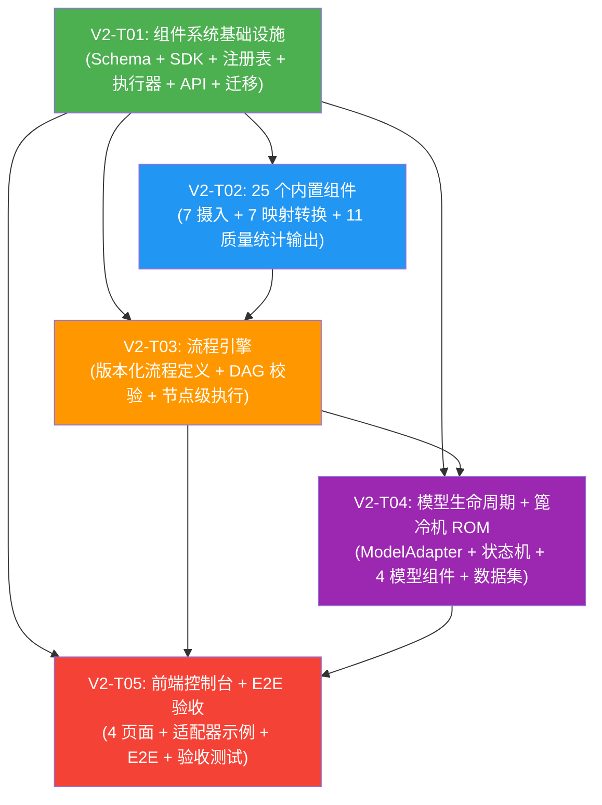

# IRIP Phase V2 系统架构设计

> **架构师**: 高见远（Gao）
> **版本**: v2.0
> **日期**: 2026-07-22
> **上游文档**: `docs/prd/v2-prd.md`、`docs/arch-v0.md`、`docs/acceptance/v1-particle-size.md`
> **关联图表**: `docs/arch/v2-class-diagram.mermaid`、`docs/arch/v2-sequence-diagram.mermaid`

---

## Part A: 系统设计

### 1. 实现方案

#### 1.1 核心技术挑战

V2 在 V1 粒度分析全链路（标准变量→对象→模板→事实→证据集→推导运行→参数审批）之上，引入三大子系统：

| 挑战 | 描述 | 解决方案 |
|------|------|---------|
| **组件不可变版本化** | 组件发布后版本不可变，支持按 kind+version 查询，状态流转 draft→published→deprecated | 复用 V1 "稳定身份表 + 不可变版本表" 模式（参考 `evidence_set` / `evidence_set_version`） |
| **统一组件执行协议** | Python 进程内执行和命令行子进程执行需要同一套接口 | 定义 `Component` Protocol + `ComponentRunner` 抽象层，Python runner 直接调用，CLI runner 通过 stdin/stdout JSON 通信 |
| **组件执行安全** | 超时、取消、网络策略、沙箱化 | `ComponentContext` 携带 `asyncio.Event` 取消信号；CLI runner 使用 `subprocess` + 超时 + 受限环境；PostgreSQL 组件仅允许 SELECT（SQL 解析拦截）；REST 组件防 SSRF（IP 黑名单/环回地址拦截） |
| **DAG 流程编排** | 流程定义需 DAG 校验（无环、端口类型匹配、参数 schema），节点级可恢复执行 | `FlowValidationService` 使用 Kahn 算法做拓扑排序和环检测；`FlowRuntimeService` 按拓扑序逐节点执行，每节点记录 `FlowNodeExecution` 状态，恢复时跳过已成功节点 |
| **流程确定性** | 相同输入（组件版本+参数+输入快照）→相同输出摘要 | 每个节点输出做 SHA-256 摘要，FlowRun 计算 `output_digest`（所有节点输出摘要的聚合 SHA-256），与 V1 `DerivationRun.output_digest` 原则一致 |
| **模型生命周期** | 状态机 draft→pending_validation→validated→published→deprecated，发布指针，回滚 | 复用 V1 "稳定身份表 + 版本表" 模式 + `current_version_id` 发布指针；回滚仅更新指针（版本不可变） |
| **预测结果写事实** | predict 组件将预测写为 L2 `model_execution` 事实，纳入 V1 证据链 | 复用 V1 `FactService.create_fact()`，`fact_type=model_execution`，`derivation_ref` 指向模型版本 |
| **确定性数据集** | 篦冷机数据集 240 行，固定种子，可复现 | 参考 V1 `examples/particle-size/generate.py` 的确定性生成模式，使用固定 `random.Random(seed)` |

#### 1.2 框架与库选型

| 库 | 版本 | 用途 | 选型理由 |
|----|------|------|---------|
| **jsonschema** | >=4.23 | 组件清单 Schema 验证 | V0 已引入，用于 mapping-profile schema |
| **PyYAML** | >=6.0 | 组件清单 YAML 解析 | manifest 采用 YAML 格式（人类可读 + 支持注释） |
| **scikit-learn** | >=1.5 | 篦冷机 ROM 模型（RandomForestRegressor） | 工业标准 ML 库，多输出回归支持 |
| **numpy** | >=2.0 | 数值计算 | scikit-learn 依赖 |
| **pandas** | >=2.2 | 数据处理（数据集生成、表格操作） | 统计组件、数据摄入组件使用 |
| **scipy** | >=1.14 | 曲线拟合组件（curve_fit） | scipy.optimize.curve_fit |
| **tabulate** | >=0.9 | 报告草稿 Markdown 生成 | 轻量表格格式化 |
| **pdfplumber** | >=0.11 | PDF 表格读取组件 | 提取 PDF 中的表格数据 |
| **React Flow** | ^11.x | 前端 DAG 可视化（FlowDetail 页面） | React 生态最成熟的 DAG 可视化库 |

> **不新增的依赖**：V2 不引入 Docker SDK（命令行组件沙箱化在 V2 范围内采用操作系统级限制——`subprocess` + `resource.setrlimit` + 受限环境变量，不依赖容器隔离，降低部署复杂度）。

#### 1.3 架构模式

延续 V0/V1 的架构分层模式：

```
┌─────────────────────────────────────────────────────────┐
│  apps/web (React + Ant Design + TanStack Query/Router)   │
│  ┌────────────┬────────────┬─────────────┬─────────────┐ │
│  │ComponentsPg│ FlowDetail │ ModelsPage   │PredictionWB  │ │
│  └────────────┴────────────┴─────────────┴─────────────┘ │
├─────────────────────────────────────────────────────────┤
│  apps/api (FastAPI)                                      │
│  routers: components / flows / models                    │
├─────────────────────────────────────────────────────────┤
│  apps/worker (Celery)                                    │
│  tasks: flows / models                                   │
├─────────────────────────────────────────────────────────┤
│  packages/components   packages/models                   │
│  ├─ manifest.py         ├─ contracts.py                   │
│  ├─ registry.py         ├─ adapters.py                    │
│  ├─ sdk.py              ├─ entities.py                    │
│  ├─ runner.py           ├─ service.py                     │
│  ├─ flows.py            └─ applicability.py               │
│  ├─ flow_validation.py                                   │
│  ├─ flow_runtime.py                                      │
│  └─ builtin/ (29 组件)                                    │
│      ├─ ingestion/ (7)                                   │
│      ├─ transform/ (7)                                   │
│      ├─ quality/ (4)                                     │
│      ├─ statistics/ (4)                                  │
│      ├─ output/ (3)                                      │
│      └─ model/ (4)                                       │
├─────────────────────────────────────────────────────────┤
│  packages/common / auth / jobs / connectors (V0/V1 复用)   │
└─────────────────────────────────────────────────────────┘
```

**设计原则**：
1. **V1 复用优先**：组件系统复用 V0 `ArtifactService`（模型文件/数据集存储）、`JobService`（流程节点子作业）、`AppError`（错误契约）；复用 V1 `Connector` 协议（数据摄入组件底层）、`FactService`（预测事实写入）、`DerivationExecutor`（统计组件算法参考）。
2. **不可变版本化**：所有三个子系统（组件、流程、模型）均采用"稳定身份表 + 不可变版本表"模式——与 V1 `evidence_set`/`evidence_set_version`、`transformation_recipe`/`transformation_recipe_version` 结构一致。
3. **Protocol 优先**：组件执行接口（`Component`、`ComponentRunner`、`ModelAdapter`）使用 `typing.Protocol` + `@runtime_checkable`，与 V1 `Connector`、`DerivationExecutor` 风格一致。
4. **frozen dataclass 值对象**：`ComponentManifest`、`ComponentContext`、`ComponentResult`、`FlowNode`、`FlowEdge`、`ModelContract`、`ApplicabilityResult` 均为 `@dataclass(frozen=True)`，与 V1 `ArtifactRef`、`JobRef`、`ParameterCandidateOutput` 一致。

---

### 2. 文件列表

#### 2.1 V2 新增文件

```
schemas/
├── component-manifest/
│   └── v1.schema.json                        # 组件清单 JSON Schema v1
└── model-contract/
    └── v1.schema.json                         # 模型契约 JSON Schema v1

packages/components/
├── __init__.py                                # 包导出
├── manifest.py                                # ComponentManifest + PortSpec + ManifestValidator
├── registry.py                                # ComponentRegistryService + Component/ComponentVersion ORM
├── sdk.py                                     # ComponentContext, ComponentResult, Component Protocol
├── runner.py                                  # PythonComponentRunner + CLIComponentRunner
├── flows.py                                   # FlowNode, FlowEdge, FlowDefinitionVersion
├── flow_validation.py                         # FlowValidationService + ValidationResult
├── flow_runtime.py                            # FlowRuntimeService + FlowRun/FlowNodeExecution ORM
└── builtin/
    ├── __init__.py                             # 内置组件自动注册
    ├── ingestion/
    │   ├── __init__.py
    │   ├── excel_reader.py                    # Excel 读取组件 + .yaml manifest
    │   ├── csv_reader.py                      # CSV 读取组件 + .yaml manifest
    │   ├── json_reader.py                     # JSON 读取组件 + .yaml manifest
    │   ├── pdf_table_reader.py                # PDF 表格读取组件 + .yaml manifest
    │   ├── postgres_query.py                  # PostgreSQL 查询组件 + .yaml manifest
    │   ├── rest_fetch.py                      # REST 获取组件 + .yaml manifest
    │   └── minio_object.py                    # MinIO 对象读取组件 + .yaml manifest
    ├── transform/
    │   ├── __init__.py
    │   ├── field_mapper.py                    # 字段映射器 + .yaml manifest
    │   ├── unit_converter.py                  # 单位转换器 + .yaml manifest
    │   ├── missing_values.py                  # 缺失值处理器 + .yaml manifest
    │   ├── time_alignment.py                  # 时间对齐器 + .yaml manifest
    │   ├── resampler.py                       # 重采样器 + .yaml manifest
    │   ├── mad_outliers.py                    # MAD 异常值检测器 + .yaml manifest
    │   └── steady_window.py                   # 稳态窗口识别器 + .yaml manifest
    ├── quality/
    │   ├── __init__.py
    │   ├── schema_check.py                    # Schema 检查 + .yaml manifest
    │   ├── range_check.py                     # 范围检查 + .yaml manifest
    │   ├── particle_order.py                  # 粒度序检查 + .yaml manifest
    │   └── relation_completeness.py           # 关系完整性检查 + .yaml manifest
    ├── statistics/
    │   ├── __init__.py
    │   ├── descriptive.py                     # 描述性统计 + .yaml manifest
    │   ├── robust_estimator.py                # 稳健估计器 + .yaml manifest
    │   ├── bootstrap_interval.py              # Bootstrap 置信区间 + .yaml manifest
    │   └── curve_fit.py                       # 曲线拟合 + .yaml manifest
    ├── output/
    │   ├── __init__.py
    │   ├── parameter_card.py                  # 参数卡片 + .yaml manifest
    │   ├── experiment_comparison.py           # 实验对比 + .yaml manifest
    │   └── report_draft.py                    # 报告草稿 + .yaml manifest
    └── model/
        ├── __init__.py
        ├── train.py                           # 模型训练组件 + .yaml manifest
        ├── evaluate.py                        # 模型评估组件 + .yaml manifest
        ├── applicability.py                   # 适用域检查组件 + .yaml manifest
        └── predict.py                         # 模型预测组件 + .yaml manifest

packages/models/
├── __init__.py                                # 包导出
├── contracts.py                               # ModelContract + ModelAdapter Protocol
├── adapters.py                                # CLIModelAdapter 实现
├── entities.py                                # Model/ModelVersion ORM
├── service.py                                 # ModelService (train/evaluate/publish/predict/rollback)
└── applicability.py                           # ApplicabilityChecker + ApplicabilityResult

apps/api/routers/
├── components.py                              # 组件管理 API 路由
├── flows.py                                   # 流程管理 API 路由
└── models.py                                  # 模型管理 API 路由

apps/worker/tasks/
├── flows.py                                   # 流程执行 Celery 任务
└── models.py                                   # 模型训练/评估/预测 Celery 任务

apps/web/src/
├── components/
│   ├── ComponentsPage.tsx                     # 组件管理页
│   └── FlowDetail.tsx                         # 流程详情页
├── models/
│   ├── ModelsPage.tsx                         # 模型管理页
│   ├── ModelDetail.tsx                        # 模型详情页
│   └── PredictionWorkbench.tsx                # 预测工作台
└── api/
    └── client.ts                              # (追加 V2 API 函数)

migrations/versions/
├── 0018_components.py                          # component + component_version 表
├── 0019_flows.py                              # flow_definition + flow_definition_version + flow_run + flow_node_execution 表
└── 0020_models.py                             # model + model_version 表

examples/
├── grate-cooler-rom/
│   ├── generate.py                            # 确定性数据集生成器
│   ├── train.py                               # ROM 模型训练器
│   ├── contract.json                          # 模型输入/输出契约
│   └── expected_metrics.json                  # 预期评估指标
└── model-adapter-command/
    └── adapter.py                             # 命令行适配器示例

tests/
├── contract/
│   ├── test_component_manifest.py             # 组件清单 Schema 契约测试
│   └── test_model_adapter.py                  # 模型适配器契约测试
├── unit/
│   ├── components/
│   │   ├── test_ingestion_components.py       # 7 个摄入组件单元测试
│   │   ├── test_transform_components.py       # 7 个映射转换组件单元测试
│   │   ├── test_scientific_components.py       # 11 个质量统计输出组件单元测试
│   │   └── test_flow_validation.py            # 流程 DAG 校验单元测试
│   └── examples/
│       └── test_grate_cooler_fixture.py        # 篦冷机数据集 fixture 测试
├── integration/
│   ├── components/
│   │   └── test_registry.py                   # 组件注册表集成测试
│   ├── components/
│   │   └── test_flow_runtime.py               # 流程运行时集成测试
│   └── models/
│       └── test_model_lifecycle.py            # 模型生命周期集成测试
├── security/
│   └── test_ingestion_component_security.py    # 摄入组件安全测试（SSRF/SQL注入）
├── e2e/
│   └── grate-cooler-rom.spec.ts               # V2 端到端验收测试
└── acceptance/
    └── test_v2_model_execution.py              # V2 验收门测试
```

#### 2.2 V1 复用文件（仅引用，不修改）

| 文件 | 复用点 |
|------|--------|
| `packages/common/artifacts.py` | `ArtifactService` — 模型文件/数据集的内容寻址存储 |
| `packages/common/errors.py` | `AppError` — 统一错误契约 |
| `packages/common/ids.py` | `new_id()` — UUID 生成 |
| `packages/common/database.py` | `Base`, `session_scope`, `build_session_factory` |
| `packages/common/db_types.py` | `GUID`, `UTCDateTime` — 自定义列类型 |
| `packages/common/clock.py` | `Clock` — `ComponentContext` 时钟引用 |
| `packages/jobs/service.py` | `JobService` — 流程节点子作业、模型训练作业 |
| `packages/jobs/entities.py` | `Job`, `JobStatus`, `WorkerLease` — 作业实体 |
| `packages/jobs/repository.py` | `JobRepository` — 作业持久化 |
| `packages/connectors/contracts.py` | `Connector`, `ConnectorSource` — 摄入组件底层连接器协议 |
| `packages/connectors/file_connectors.py` | `FileConnector` — Excel/CSV/JSON 读取组件复用 |
| `packages/connectors/postgres_connector.py` | `PostgresConnector` — PostgreSQL 组件复用 |
| `packages/connectors/rest_connector.py` | `RestConnector` — REST 组件复用 |
| `packages/connectors/mapping.py` | `SecretStore` — 凭据安全引用 |
| `packages/facts/service.py` | `FactService` — 预测结果写事实 |
| `packages/provenance/algorithms.py` | `RobustParameterEstimator` — 稳健估计器组件算法参考 |
| `apps/api/dependencies/auth.py` | `CurrentUser` — 认证上下文 |
| `apps/api/dependencies/authorization.py` | `require_permission` — 权限校验 |
| `apps/worker/celery_app.py` | `celery_app` — Celery 实例 |
| `apps/web/src/api/client.ts` | `http` — API 客户端（追加 V2 函数） |
| `apps/web/src/app/router.tsx` | 路由注册（追加 V2 路由） |

---

### 3. 数据结构和接口

> 完整类图见 `docs/arch/v2-class-diagram.mermaid`

#### 3.1 组件 SDK 核心

```python
# packages/components/sdk.py

@dataclass(frozen=True)
class PortSpec:
    """组件端口规格（不可变值对象）。
    Attributes:
        name: 端口名称。
        data_type: 端口数据类型（observation_table / diagnostic_report / scalar / file_ref 等）。
        required: 是否必须连接。
        schema: 端口 JSON Schema（描述端口数据结构）。
    """
    name: str
    data_type: str
    required: bool
    schema: dict

@dataclass(frozen=True)
class ComponentContext:
    """组件执行上下文（不可变值对象）。
    Attributes:
        organization_id: 当前组织 ID。
        user_id: 当前用户 ID（权限继承）。
        clock: 时钟引用（确定性时间注入）。
        artifact_service: 工件服务引用（上传/下载模型文件、数据集）。
        job_id: 关联作业 ID（可选，用于进度报告）。
        cancel_event: 取消信号（asyncio.Event，协作式取消）。
        secrets: 密钥映射（secret_id → 凭据值，不记录日志）。
        workdir: 工作目录（临时文件隔离）。
    """
    organization_id: UUID
    user_id: UUID
    clock: Clock
    artifact_service: ArtifactService
    job_id: UUID | None
    cancel_event: asyncio.Event
    secrets: dict[str, str]
    workdir: Path

@dataclass(frozen=True)
class ComponentResult:
    """组件执行结果（不可变值对象）。
    Attributes:
        outputs: 输出端口名→值的映射。
        summary: 人类可读摘要（如 "检出 3 条异常值"）。
        metadata: 执行元数据（耗时、资源占用等）。
        diagnostics: 诊断报告（如适用，质量检查组件产出）。
    """
    outputs: dict[str, object]
    summary: str
    metadata: dict
    diagnostics: dict | None = None

@runtime_checkable
class Component(Protocol):
    """组件执行协议。
    所有内置组件和自定义组件必须实现此协议。
    """
    def execute(
        self,
        context: ComponentContext,
        params: dict[str, object],
    ) -> ComponentResult: ...

@runtime_checkable
class ComponentRunner(Protocol):
    """组件运行器协议（抽象执行层）。"""
    def run(
        self,
        manifest: ComponentManifest,
        context: ComponentContext,
        params: dict[str, object],
    ) -> ComponentResult: ...
```

#### 3.2 组件清单与注册表

```python
# packages/components/manifest.py

@dataclass(frozen=True)
class ComponentManifest:
    """组件清单（不可变值对象，从 YAML 解析）。
    Attributes:
        name: 组件名称（组织内唯一）。
        version: 语义化版本号（如 "1.0.0"）。
        kind: 组件类型（ingestion/transform/quality/statistics/output/model）。
        runtime: 运行时类型（python/cli）。
        inputs: 输入端口规格元组。
        outputs: 输出端口规格元组。
        parameters: 参数 JSON Schema（描述组件可接受的参数）。
        dependencies: 依赖的其他组件版本元组（如 ["field_mapper@1.0.0"]）。
        raw_yaml: 原始 YAML 文本（用于存储和 SHA-256 校验）。
        sha256: 原始 YAML 的 SHA-256 摘要。
    """
    name: str
    version: str
    kind: str
    runtime: str
    inputs: tuple[PortSpec, ...]
    outputs: tuple[PortSpec, ...]
    parameters: dict
    dependencies: tuple[str, ...]
    raw_yaml: str
    sha256: str

class ManifestValidator:
    """组件清单验证器。
    加载 JSON Schema v1，验证 YAML manifest 合法性，
    返回 ComponentManifest frozen dataclass。
    """
    def __init__(self, schema_path: Path) -> None: ...
    def validate(self, yaml_text: str) -> ComponentManifest: ...

# packages/components/registry.py

class Component(Base):
    """组件稳定身份表（ORM: component）。
    一个组件（name）一行，status: draft→published→deprecated。
    """
    __tablename__ = "component"
    id: Mapped[UUID] = mapped_column(GUID, primary_key=True, default=new_id)
    organization_id: Mapped[UUID] = mapped_column(GUID, nullable=False)
    name: Mapped[str] = mapped_column(sa.Text, nullable=False)
    kind: Mapped[str] = mapped_column(sa.Text, nullable=False)
    status: Mapped[str] = mapped_column(sa.Text, nullable=False, server_default=sa.text("'draft'"))
    lock_version: Mapped[int] = mapped_column(sa.Integer, nullable=False, server_default=sa.text("0"))
    created_at: Mapped[datetime] = mapped_column(UTCDateTime, server_default=sa.func.now(), nullable=False)
    updated_at: Mapped[datetime] = mapped_column(UTCDateTime, server_default=sa.func.now(), nullable=False)
    __table_args__ = (
        sa.UniqueConstraint("organization_id", "name", name="uq_component_org_name"),
    )

class ComponentVersion(Base):
    """组件版本表（ORM: component_version，不可变）。
    发布后不可修改，保证确定性回放。
    """
    __tablename__ = "component_version"
    id: Mapped[UUID] = mapped_column(GUID, primary_key=True, default=new_id)
    component_id: Mapped[UUID] = mapped_column(GUID, sa.ForeignKey("component.id", ondelete="CASCADE"), nullable=False)
    version: Mapped[str] = mapped_column(sa.Text, nullable=False)
    manifest_yaml: Mapped[str] = mapped_column(sa.Text, nullable=False)
    manifest_sha256: Mapped[str] = mapped_column(sa.Text, nullable=False)
    runtime: Mapped[str] = mapped_column(sa.Text, nullable=False)
    port_schemas: Mapped[dict] = mapped_column(JSONB, nullable=False)
    status: Mapped[str] = mapped_column(sa.Text, nullable=False, server_default=sa.text("'published'"))
    published_at: Mapped[datetime] = mapped_column(UTCDateTime, server_default=sa.func.now(), nullable=False)
    created_at: Mapped[datetime] = mapped_column(UTCDateTime, server_default=sa.func.now(), nullable=False)
    __table_args__ = (
        sa.UniqueConstraint("component_id", "version", name="uq_component_version"),
    )

class ComponentRegistryService:
    """组件注册表服务。
    依赖注入: session_factory, organization_id。
    """
    def __init__(self, session_factory: async_sessionmaker[AsyncSession], organization_id: UUID) -> None: ...
    async def publish(self, manifest: ComponentManifest) -> ComponentVersion: ...
    async def get(self, name: str, version: str) -> ComponentVersion: ...
    async def list(self, kind: str | None = None, status: str | None = None) -> list[ComponentVersion]: ...
    async def deprecate(self, name: str, version: str) -> Component: ...
```

#### 3.3 组件执行器

```python
# packages/components/runner.py

class PythonComponentRunner:
    """Python 运行时组件执行器。
    维护 (name, version) → Component 实例的内存注册表，
    直接在进程内调用 Component.execute()。
    支持超时（asyncio.wait_for）和取消（context.cancel_event）。
    """
    def __init__(self) -> None: ...
    def register(self, manifest: ComponentManifest, impl: Component) -> None: ...
    async def run(self, manifest: ComponentManifest, context: ComponentContext, params: dict) -> ComponentResult: ...

class CLIComponentRunner:
    """命令行运行时组件执行器。
    通过 subprocess + stdin/stdout JSON 通信执行组件。
    安全策略：超时、取消（SIGTERM）、受限环境变量、网络白名单。
    """
    def __init__(self, timeout: float = 300.0, network_allowlist: tuple[str, ...] = ()) -> None: ...
    async def run(self, manifest: ComponentManifest, context: ComponentContext, params: dict) -> ComponentResult: ...
```

#### 3.4 流程引擎

```python
# packages/components/flows.py

@dataclass(frozen=True)
class FlowNode:
    """流程节点（不可变值对象）。
    Attributes:
        node_id: 节点唯一标识（流程内唯一）。
        component_name: 组件名称。
        component_version: 组件版本。
        params: 节点参数（覆盖组件默认参数）。
        input_bindings: 输入端口名→上游节点输出引用（如 {"data": "node1.output_table"}）。
    """
    node_id: str
    component_name: str
    component_version: str
    params: dict
    input_bindings: dict[str, str]

@dataclass(frozen=True)
class FlowEdge:
    """流程边（不可变值对象）。
    Attributes:
        source_node: 源节点 ID。
        source_port: 源输出端口名。
        target_node: 目标节点 ID。
        target_port: 目标输入端口名。
    """
    source_node: str
    source_port: str
    target_node: str
    target_port: str

@dataclass(frozen=True)
class FlowDefinitionVersion:
    """流程定义版本（不可变值对象）。
    Attributes:
        version: 版本号。
        nodes: 节点元组。
        edges: 边元组。
        random_seed: 随机种子（保证确定性）。
        sha256: 整个定义的 SHA-256 摘要。
    """
    version: int
    nodes: tuple[FlowNode, ...]
    edges: tuple[FlowEdge, ...]
    random_seed: int
    sha256: str

# packages/components/flow_validation.py

@dataclass(frozen=True)
class ValidationResult:
    """校验结果（不可变值对象）。"""
    valid: bool
    errors: tuple[str, ...]
    warnings: tuple[str, ...]

class FlowValidationService:
    """流程校验服务。
    DAG 校验三步：无环检测（Kahn）、端口类型匹配、参数 schema 校验。
    """
    def validate_dag(self, nodes: list[FlowNode], edges: list[FlowEdge]) -> ValidationResult: ...
    def check_port_types(self, nodes: list[FlowNode], edges: list[FlowEdge], registry: ComponentRegistryService) -> ValidationResult: ...
    def check_param_schema(self, node: FlowNode, manifest: ComponentManifest) -> ValidationResult: ...

# packages/components/flow_runtime.py

class FlowDefinition(Base):
    """流程定义稳定身份表（ORM: flow_definition）。"""
    __tablename__ = "flow_definition"
    id: Mapped[UUID] = mapped_column(GUID, primary_key=True, default=new_id)
    organization_id: Mapped[UUID] = mapped_column(GUID, nullable=False)
    code: Mapped[str] = mapped_column(sa.Text, nullable=False)
    display_name: Mapped[str] = mapped_column(sa.Text, nullable=False)
    status: Mapped[str] = mapped_column(sa.Text, nullable=False, server_default=sa.text("'draft'"))
    lock_version: Mapped[int] = mapped_column(sa.Integer, nullable=False, server_default=sa.text("0"))
    created_at: Mapped[datetime] = mapped_column(UTCDateTime, server_default=sa.func.now(), nullable=False)
    updated_at: Mapped[datetime] = mapped_column(UTCDateTime, server_default=sa.func.now(), nullable=False)
    __table_args__ = (sa.UniqueConstraint("organization_id", "code", name="uq_flow_org_code"),)

class FlowDefinitionVersionORM(Base):
    """流程定义版本表（ORM: flow_definition_version，不可变）。"""
    __tablename__ = "flow_definition_version"
    id: Mapped[UUID] = mapped_column(GUID, primary_key=True, default=new_id)
    flow_definition_id: Mapped[UUID] = mapped_column(GUID, sa.ForeignKey("flow_definition.id", ondelete="CASCADE"), nullable=False)
    version: Mapped[int] = mapped_column(sa.Integer, nullable=False)
    nodes_json: Mapped[list] = mapped_column(JSONB, nullable=False)
    edges_json: Mapped[list] = mapped_column(JSONB, nullable=False)
    random_seed: Mapped[int] = mapped_column(sa.Integer, nullable=False)
    digest: Mapped[str] = mapped_column(sa.Text, nullable=False)
    status: Mapped[str] = mapped_column(sa.Text, nullable=False, server_default=sa.text("'published'"))
    published_at: Mapped[datetime] = mapped_column(UTCDateTime, server_default=sa.func.now(), nullable=False)
    __table_args__ = (sa.UniqueConstraint("flow_definition_id", "version", name="uq_flow_version"),)

class FlowRun(Base):
    """流程运行记录（ORM: flow_run）。"""
    __tablename__ = "flow_run"
    id: Mapped[UUID] = mapped_column(GUID, primary_key=True, default=new_id)
    organization_id: Mapped[UUID] = mapped_column(GUID, nullable=False)
    flow_version_id: Mapped[UUID] = mapped_column(GUID, sa.ForeignKey("flow_definition_version.id"), nullable=False)
    status: Mapped[str] = mapped_column(sa.Text, nullable=False, server_default=sa.text("'pending'"))
    job_id: Mapped[UUID | None] = mapped_column(GUID, sa.ForeignKey("job.id"), nullable=True)
    input_snapshot: Mapped[dict] = mapped_column(JSONB, nullable=False)
    output_digest: Mapped[str | None] = mapped_column(sa.Text, nullable=True)
    started_at: Mapped[datetime | None] = mapped_column(UTCDateTime, nullable=True)
    completed_at: Mapped[datetime | None] = mapped_column(UTCDateTime, nullable=True)
    created_at: Mapped[datetime] = mapped_column(UTCDateTime, server_default=sa.func.now(), nullable=False)

class FlowNodeExecution(Base):
    """流程节点执行记录（ORM: flow_node_execution）。"""
    __tablename__ = "flow_node_execution"
    id: Mapped[UUID] = mapped_column(GUID, primary_key=True, default=new_id)
    flow_run_id: Mapped[UUID] = mapped_column(GUID, sa.ForeignKey("flow_run.id", ondelete="CASCADE"), nullable=False)
    node_id: Mapped[str] = mapped_column(sa.Text, nullable=False)
    status: Mapped[str] = mapped_column(sa.Text, nullable=False, server_default=sa.text("'pending'"))
    input_summary: Mapped[dict | None] = mapped_column(JSONB, nullable=True)
    output_summary: Mapped[dict | None] = mapped_column(JSONB, nullable=True)
    diagnostics: Mapped[dict | None] = mapped_column(JSONB, nullable=True)
    started_at: Mapped[datetime | None] = mapped_column(UTCDateTime, nullable=True)
    completed_at: Mapped[datetime | None] = mapped_column(UTCDateTime, nullable=True)
    duration_ms: Mapped[int | None] = mapped_column(sa.Integer, nullable=True)

class FlowRuntimeService:
    """流程运行时服务。
    依赖注入: session_factory, organization_id, registry, runner, job_service。
    """
    def __init__(self, session_factory, organization_id, registry, runner, job_service) -> None: ...
    async def create_run(self, flow_version_id: UUID, inputs: dict) -> FlowRun: ...
    async def execute(self, run_id: UUID) -> None: ...
    async def resume(self, run_id: UUID) -> None: ...
    async def cancel(self, run_id: UUID) -> None: ...
    async def retry_node(self, run_id: UUID, node_id: str) -> None: ...
```

#### 3.5 模型生命周期

```python
# packages/models/contracts.py

@dataclass(frozen=True)
class ModelContract:
    """模型契约（不可变值对象，从 JSON 解析）。
    Attributes:
        name: 模型名称。
        version: 契约版本。
        input_schema: 输入参数 JSON Schema（用于表单动态生成）。
        output_schema: 输出参数 JSON Schema。
        applicability_domain: 适用域定义（各输入维度 min/max）。
        sha256: 契约文件 SHA-256 摘要。
    """
    name: str
    version: str
    input_schema: dict
    output_schema: dict
    applicability_domain: dict
    sha256: str

@runtime_checkable
class ModelAdapter(Protocol):
    """模型适配器协议。
    所有模型执行方式（CLI、Python 库、远程服务）必须实现此协议。
    """
    def load(self, model_path: str, contract: ModelContract) -> None: ...
    def validate_input(self, inputs: dict) -> ValidationResult: ...
    def predict(self, inputs: dict) -> dict: ...
    def healthcheck(self) -> bool: ...

# packages/models/entities.py

class Model(Base):
    """模型稳定身份表（ORM: model）。
    status: draft→pending_validation→validated→published→deprecated
    """
    __tablename__ = "model"
    id: Mapped[UUID] = mapped_column(GUID, primary_key=True, default=new_id)
    organization_id: Mapped[UUID] = mapped_column(GUID, nullable=False)
    code: Mapped[str] = mapped_column(sa.Text, nullable=False)
    display_name: Mapped[str] = mapped_column(sa.Text, nullable=False)
    status: Mapped[str] = mapped_column(sa.Text, nullable=False, server_default=sa.text("'draft'"))
    current_version_id: Mapped[UUID | None] = mapped_column(GUID, nullable=True)
    lock_version: Mapped[int] = mapped_column(sa.Integer, nullable=False, server_default=sa.text("0"))
    created_at: Mapped[datetime] = mapped_column(UTCDateTime, server_default=sa.func.now(), nullable=False)
    updated_at: Mapped[datetime] = mapped_column(UTCDateTime, server_default=sa.func.now(), nullable=False)
    __table_args__ = (sa.UniqueConstraint("organization_id", "code", name="uq_model_org_code"),)

class ModelVersionORM(Base):
    """模型版本表（ORM: model_version，不可变）。
    """
    __tablename__ = "model_version"
    id: Mapped[UUID] = mapped_column(GUID, primary_key=True, default=new_id)
    model_id: Mapped[UUID] = mapped_column(GUID, sa.ForeignKey("model.id", ondelete="CASCADE"), nullable=False)
    version: Mapped[int] = mapped_column(sa.Integer, nullable=False)
    contract_json: Mapped[dict] = mapped_column(JSONB, nullable=False)
    artifact_id: Mapped[UUID] = mapped_column(GUID, sa.ForeignKey("artifact.id"), nullable=False)
    adapter_type: Mapped[str] = mapped_column(sa.Text, nullable=False)
    adapter_config: Mapped[dict] = mapped_column(JSONB, nullable=False)
    metrics_json: Mapped[dict | None] = mapped_column(JSONB, nullable=True)
    applicability_json: Mapped[dict | None] = mapped_column(JSONB, nullable=True)
    status: Mapped[str] = mapped_column(sa.Text, nullable=False, server_default=sa.text("'draft'"))
    created_by: Mapped[UUID | None] = mapped_column(GUID, nullable=True)
    created_at: Mapped[datetime] = mapped_column(UTCDateTime, server_default=sa.func.now(), nullable=False)
    published_at: Mapped[datetime | None] = mapped_column(UTCDateTime, nullable=True)
    __table_args__ = (sa.UniqueConstraint("model_id", "version", name="uq_model_version"),)

# packages/models/service.py

class ModelService:
    """模型生命周期服务。
    依赖注入: session_factory, organization_id, actor_id, artifact_service, audit_service。
    """
    def __init__(self, session_factory, organization_id, actor_id, artifact_service, audit_service) -> None: ...
    async def create_model(self, code: str, display_name: str) -> Model: ...
    async def train(self, model_id: UUID, dataset_artifact_id: UUID, params: dict) -> ModelVersionORM: ...
    async def evaluate(self, model_version_id: UUID, test_artifact_id: UUID) -> dict: ...
    async def publish(self, model_version_id: UUID) -> Model: ...
    async def predict(self, model_version_id: UUID, inputs: dict) -> dict: ...
    async def rollback(self, model_id: UUID, target_version_id: UUID) -> Model: ...
    async def deprecate(self, model_id: UUID) -> Model: ...

# packages/models/applicability.py

@dataclass(frozen=True)
class ApplicabilityResult:
    """适用域检查结果（不可变值对象）。"""
    in_domain: bool
    violations: tuple[str, ...]
    per_dimension: dict

class ApplicabilityChecker:
    """适用域检查器（边界检查 + 越界标记，不阻止预测）。"""
    def check(self, inputs: dict, domain: dict) -> ApplicabilityResult: ...
```

---

### 4. 程序调用流程

> 完整时序图见 `docs/arch/v2-sequence-diagram.mermaid`

#### 4.1 组件发布流程

```
管理员 → POST /api/v1/components (YAML manifest)
  → ManifestValidator.validate(yaml_text)
    → 加载 JSON Schema v1
    → jsonschema.validate(manifest_dict, schema)
    → 返回 ComponentManifest (frozen)
  → ComponentRegistryService.publish(manifest)
    → SELECT component WHERE name=? AND org_id=?
    → 若不存在: INSERT component (status=draft)
    → SELECT component_version WHERE component_id=? AND version=?
    → 若已存在: raise AppError(code=version_exists)
    → 计算 sha256(manifest_yaml)
    → INSERT component_version (immutable, status=published)
    → UPDATE component SET status=published
  → 201 Created (component detail + manifest)
```

#### 4.2 流程执行流程（含恢复）

```
数据工程师 → POST /api/v1/flows (code, nodes, edges)
  → FlowValidationService.validate_dag(nodes, edges)
    → Kahn 算法：环检测 + 拓扑排序
  → FlowValidationService.check_port_types(nodes, edges, registry)
    → 查询每个节点的 ComponentManifest
    → 验证边连接的端口 data_type 兼容
  → FlowValidationService.check_param_schema(node, manifest)
    → 验证节点参数符合组件 parameters JSON Schema
  → INSERT flow_definition (status=draft)
  → INSERT flow_definition_version (immutable, status=published)
  → 201 Created

数据工程师 → POST /api/v1/flows/{id}/runs (inputs)
  → FlowRuntimeService.create_run(flow_version_id, inputs)
    → INSERT flow_run (status=pending, input_snapshot=inputs)
    → JobService.accept(kind=flow_execute, payload)
    → UPDATE flow_run SET job_id=?
  → 202 Accepted (run_id, job_id)

Celery Worker → lease(job_id)
  → FlowRuntimeService.execute(run_id)
    → SELECT flow_run, flow_definition_version
    → topological_sort(nodes, edges)
    → FOR each node in topo order:
      → SELECT flow_node_execution WHERE run_id=? AND node_id=?
      → IF already succeeded: skip (recovery)
      → ELSE:
        → ComponentRegistryService.get(component_name, version)
        → resolve input bindings from upstream outputs
        → INSERT flow_node_execution (status=running)
        → ComponentRunner.run(manifest, context, params)
          → apply timeout (asyncio.wait_for)
          → check cancel_event
        → UPDATE flow_node_execution (status=succeeded, summary)
    → compute output_digest (SHA-256 of all node outputs)
    → UPDATE flow_run (status=succeeded, output_digest)
  → JobService.complete(job_id, result)
```

#### 4.3 模型预测流程（含事实写回）

```
研究员 → 预测工作台选择模型 grate_cooler v2
  → GET /api/v1/models/{id} → ModelDetail (contract.input_schema)

研究员 → 输入参数 → POST /api/v1/models/{version_id}/predict (inputs)
  → ModelService.predict(model_version_id, inputs)
    → SELECT model_version (contract, adapter_config, artifact_id)
    → ArtifactService.presign_download(artifact_id)
    → ModelAdapter.load(model_path, contract)
    → ModelAdapter.validate_input(inputs)
    → ApplicabilityChecker.check(inputs, applicability_domain)
      → 逐维度 min/max 边界检查
      → 返回 ApplicabilityResult(in_domain, violations)
    → ModelAdapter.predict(inputs)
      → 返回 outputs dict
    → FactService.create_fact(
        fact_type=model_execution,
        subject_id=model_id,
        value=outputs,
        conditions=inputs_snapshot,
        derivation_ref=model_version_id
      )
      → INSERT fact + fact_revision (immutable)
    → INSERT prediction_record (inputs, outputs, applicability, fact_id)
  → 200 OK (outputs + applicability + fact_ref + provenance_link)
```

---

### 5. 待明确事项

| # | 问题 | 当前假设 | 影响范围 |
|---|------|---------|---------|
| 1 | 组件注册的权限模型 | PRD §7.1 未确认。架构假设新增 `component:manage` 权限授予 platform_administrator 和 model_engineer | `apps/api/routers/components.py` 权限声明 |
| 2 | 流程定义的权限模型 | PRD §7.2 未确认。架构假设新增 `flow:manage`（创建/编辑）和 `flow:execute`（执行）权限 | `apps/api/routers/flows.py` 权限声明 |
| 3 | 模型管理的权限模型 | PRD §7.3 未确认。架构假设新增 `model:manage`（训练/评估）和 `model:publish`（发布/回滚）权限；审批分离：训练者不能自己发布 | `apps/api/routers/models.py` 权限声明 |
| 4 | YAML manifest 字段结构 | PRD §7.4 未确认。架构在 `schemas/component-manifest/v1.schema.json` 中定义字段结构，包含: name/version/kind/runtime/inputs/outputs/parameters/dependencies | `schemas/component-manifest/v1.schema.json` |
| 5 | 命令行组件沙箱化方案 | PRD §7.5 未确认。架构采用操作系统级限制（subprocess + resource.setrlimit + 受限环境变量），不依赖 Docker 容器隔离 | `packages/components/runner.py` CLIComponentRunner |
| 6 | 预测结果写入事实的粒度 | PRD §7.6 未确认。架构假设每次预测创建一条 model_execution 事实修订；高频场景可后续引入批量合并 | `packages/models/service.py` predict 方法 |
| 7 | 适用域判定标准 | PRD §7.7 未确认。架构采用简单边界检查（各输入维度 min/max），越界标记不阻止预测 | `packages/models/applicability.py` |
| 8 | V2 验收门路径 | PRD §7.8 未确认。架构假设验收路径为: 组件注册→流程编排执行→模型训练发布→预测工作台推理→预测事实溯源 | `tests/acceptance/test_v2_model_execution.py` |
| 9 | 内置组件分组方式 | PRD §7.9 未确认。架构在 ComponentsPage 中按 kind 分组（ingestion/transform/quality/statistics/output/model） | `apps/web/src/components/ComponentsPage.tsx` |
| 10 | 流程可视化编辑器 | PRD §7.10 确认为 P2。V2 通过 API/YAML 定义流程，可视化编辑器不在 V2 验收范围 | 不影响 V2 核心实现 |

---

## Part B: 任务分解

### 6. 依赖包列表

以下为 V2 新增的第三方包（在 `pyproject.toml` 的 `dependencies` 中追加）：

```
PyYAML>=6.0,<7: YAML manifest 解析（组件清单）
scikit-learn>=1.5,<2: 篦冷机 ROM 模型（RandomForestRegressor 多输出回归）
numpy>=2.0,<3: 数值计算基础（统计组件、数据集生成）
pandas>=2.2,<3: 数据处理（表格操作、数据集生成）
scipy>=1.14,<2: 曲线拟合组件（scipy.optimize.curve_fit）
tabulate>=0.9,<1: 报告草稿组件（Markdown 表格格式化）
pdfplumber>=0.11,<1: PDF 表格读取组件
```

前端新增依赖（在 `apps/web/package.json` 中追加）：

```
reactflow@^11.11.0: DAG 可视化（FlowDetail 页面）
```

> **注意**：`jsonschema`、`openpyxl`、`boto3` 等已在 V0 `pyproject.toml` 中声明，V2 复用不重复添加。

---

### 7. 任务列表（按依赖顺序）

> **约束说明**: PRD 定义了 8 个任务（Task 21-28），架构按照"功能模块/层次"分组原则压缩为 5 个实施任务（V2-T01~V2-T05），每个任务至少包含 3 个文件，遵循"第一个任务为基础设施"原则。

---

#### V2-T01: 组件系统基础设施（Schema + SDK + 注册表 + 执行器 + API + 迁移）

**对应 PRD**: Task 21

**源文件**:
- `schemas/component-manifest/v1.schema.json`
- `packages/components/__init__.py`
- `packages/components/manifest.py`
- `packages/components/registry.py`
- `packages/components/sdk.py`
- `packages/components/runner.py`
- `apps/api/routers/components.py`
- `migrations/versions/0018_components.py`
- `tests/contract/test_component_manifest.py`
- `tests/integration/components/test_registry.py`

**依赖**: 无（V2 起点，复用 V0/V1 基础设施）

**优先级**: P0

**描述**:
建立组件系统的完整基础设施层：
1. **JSON Schema v1**: 定义组件清单的字段结构（name/version/kind/runtime/inputs/outputs/parameters/dependencies），参考 V1 `schemas/mapping-profile/v1.schema.json` 风格。
2. **ComponentManifest + ManifestValidator**: 从 YAML 解析为 frozen dataclass，通过 jsonschema 验证合法性，计算 SHA-256 摘要。
3. **ComponentRegistryService + ORM**: 两表设计（`component` 稳定身份 + `component_version` 不可变版本），与 V1 `evidence_set`/`evidence_set_version` 模式一致。publish 方法实现版本不可变写入；get/list 方法支持按 kind+version 查询。
4. **ComponentContext + ComponentResult + Component Protocol**: 统一执行接口。Context 携带 organization_id/user_id/clock/artifact_service/cancel_event/secrets/workdir。
5. **PythonComponentRunner + CLIComponentRunner**: Python runner 维护内存注册表直接调用；CLI runner 通过 subprocess + stdin/stdout JSON 通信，实现超时（asyncio.wait_for）、取消（asyncio.Event → SIGTERM）、受限环境变量。
6. **API 路由**: `GET /api/v1/components`（列表/筛选 kind）、`GET /api/v1/components/{id}`（详情含 manifest）、`POST /api/v1/components`（注册发布）。使用 `require_permission("component:manage")` 权限声明。DI 模式与 V1 routers 一致（`get_xxx_service` → `NotImplementedError` → `dependency_overrides`）。
7. **迁移 0018**: 创建 `component` + `component_version` 两张表，索引（organization_id+name UNIQUE, component_id+version UNIQUE）。

---

#### V2-T02: 25 个内置组件（7 摄入 + 7 映射转换 + 11 质量统计输出）

**对应 PRD**: Task 22 + Task 23 + Task 24

**源文件**:
- `packages/components/builtin/__init__.py`
- `packages/components/builtin/ingestion/__init__.py` + `excel_reader.py` + `csv_reader.py` + `json_reader.py` + `pdf_table_reader.py` + `postgres_query.py` + `rest_fetch.py` + `minio_object.py`（各含 `.yaml` manifest）
- `packages/components/builtin/transform/__init__.py` + `field_mapper.py` + `unit_converter.py` + `missing_values.py` + `time_alignment.py` + `resampler.py` + `mad_outliers.py` + `steady_window.py`（各含 `.yaml` manifest）
- `packages/components/builtin/quality/__init__.py` + `schema_check.py` + `range_check.py` + `particle_order.py` + `relation_completeness.py`（各含 `.yaml` manifest）
- `packages/components/builtin/statistics/__init__.py` + `descriptive.py` + `robust_estimator.py` + `bootstrap_interval.py` + `curve_fit.py`（各含 `.yaml` manifest）
- `packages/components/builtin/output/__init__.py` + `parameter_card.py` + `experiment_comparison.py` + `report_draft.py`（各含 `.yaml` manifest）
- `tests/unit/components/test_ingestion_components.py`
- `tests/unit/components/test_transform_components.py`
- `tests/unit/components/test_scientific_components.py`
- `tests/security/test_ingestion_component_security.py`

**依赖**: V2-T01（依赖组件 SDK + 注册表 + 执行器）

**优先级**: P0

**描述**:
实现全部 25 个内置组件，每个组件包含 Python 实现文件 + YAML manifest 文件，在 `packages/components/builtin/__init__.py` 中自动注册到 PythonComponentRunner：

**7 个数据摄入组件**（`ingestion/`）:
- `excel_reader`: 复用 V1 `FileConnector`，使用 openpyxl 读取 .xlsx，输出 ObservationTable 端口。
- `csv_reader`: 标准库 csv 模块读取，支持分隔符/编码参数。
- `json_reader`: 读取 JSON 文件（对象或数组），展平为表格。
- `pdf_table_reader`: 使用 pdfplumber 提取 PDF 表格。
- `postgres_query`: 复用 V1 `PostgresConnector`，SQL 解析仅允许 SELECT（sqlparse 解析拦截非查询语句），凭据通过 secret_id 引用。
- `rest_fetch`: 复用 V1 `RestConnector`，SSRF 防护（IP 地址黑名单：禁止 127.0.0.0/8、10.0.0.0/8、172.16.0.0/12、192.168.0.0/16），强制 HTTPS（可配置豁免 localhost），响应大小限制。
- `minio_object`: 复用 V0 `ArtifactService` + `S3Repository`，按 object_key 读取对象内容。

**7 个映射与转换组件**（`transform/`）:
- `field_mapper`: 源字段→目标标准变量的映射，输出 ObservationTable。
- `unit_converter`: 复用 V1 单位仿射变换（`/standards/units/convert`），批量单位转换。
- `missing_values`: 缺失值处理（reject/null/default 策略），输出 DiagnosticReport。
- `time_alignment`: 时间戳对齐（统一时区/采样间隔）。
- `resampler`: 时间序列重采样（上采样/下采样/插值）。
- `mad_outliers`: MAD 异常值检测（参考 V1 `RobustParameterEstimator` 算法），输出 DiagnosticReport + 过滤后 ObservationTable。
- `steady_window`: 稳态窗口识别（滑动窗口方差阈值），输出稳态区间标记。

**4 个质量检查组件**（`quality/`）:
- `schema_check`: 字段类型/约束检查，输出 DiagnosticReport。
- `range_check`: 值域边界检查，输出 DiagnosticReport。
- `particle_order`: 粒度序检查（L1→L2 层级一致性，如 D10<D50<D90）。
- `relation_completeness`: 外键/引用有效性检查。

**4 个统计组件**（`statistics/`）:
- `descriptive`: 描述性统计（均值/标准差/分位数/偏度/峰度）。
- `robust_estimator`: 稳健估计器（中位数/MAD，参考 V1 `RobustParameterEstimator`）。
- `bootstrap_interval`: Bootstrap 置信区间（固定种子，确定性）。
- `curve_fit`: 曲线拟合（scipy.optimize.curve_fit）。

**3 个输出组件**（`output/`）:
- `parameter_card`: 生成 L3 参数候选（输出 ParameterCandidate 格式，不直接写参数，由下游流程或独立步骤完成）。
- `experiment_comparison`: 多实验对照表生成。
- `report_draft`: Markdown 报告草稿生成（使用 tabulate 格式化表格）。

**安全测试**（`tests/security/test_ingestion_component_security.py`）:
- PostgreSQL 组件: 注入 DROP/DELETE/UPDATE 语句验证被拦截。
- REST 组件: 验证 SSRF 防护（内网/环回地址请求被拒绝）。
- 凭据不泄露: 验证 secret 值不出现在日志/输出/错误信息中。

---

#### V2-T03: 流程引擎（版本化流程定义 + DAG 校验 + 节点级执行 + API + Worker + 迁移）

**对应 PRD**: Task 25

**源文件**:
- `packages/components/flows.py`
- `packages/components/flow_validation.py`
- `packages/components/flow_runtime.py`
- `apps/api/routers/flows.py`
- `apps/worker/tasks/flows.py`
- `migrations/versions/0019_flows.py`
- `tests/unit/components/test_flow_validation.py`
- `tests/integration/components/test_flow_runtime.py`

**依赖**: V2-T01（组件 SDK + 注册表）、V2-T02（内置组件，流程节点引用组件）

**优先级**: P0

**描述**:
实现完整的流程编排引擎：

1. **FlowNode + FlowEdge + FlowDefinitionVersion**: frozen dataclass 值对象。FlowNode 携带 component_name/component_version/params/input_bindings；FlowEdge 描述端口连接关系；FlowDefinitionVersion 包含 nodes/edges/random_seed/sha256。

2. **FlowValidationService**: DAG 三步校验：
   - `validate_dag`: Kahn 算法实现拓扑排序 + 环检测（若存在环则返回 errors）。
   - `check_port_types`: 查询每个节点的 ComponentManifest（通过 ComponentRegistryService），验证边连接的端口 data_type 兼容（如 `observation_table` → `observation_table`）。
   - `check_param_schema`: 验证节点参数符合组件 parameters JSON Schema。

3. **FlowRuntimeService**: 节点级调度执行：
   - `create_run`: 创建 FlowRun 记录 + input_snapshot + JobService.accept(kind=flow_execute)。
   - `execute`: 拓扑排序 → 逐节点执行 → 每节点通过 ComponentRunner.run() 调用组件 → 记录 FlowNodeExecution（input_summary/output_summary/diagnostics/duration_ms）→ 恢复时跳过已成功节点 → 计算 output_digest（SHA-256）。
   - `resume`: 重新执行失败的 FlowRun，跳过 status=succeeded 的节点。
   - `cancel`: 设置 cancel_event，协作式取消。
   - `retry_node`: 重试单个失败节点。
   - Worker 任务（`apps/worker/tasks/flows.py`）: 包装 FlowRuntimeService 为 Celery 任务，模式与 V1 `apps/worker/tasks/derivation.py` 一致（asyncio.run() 在同步 Celery 上下文中执行异步流程）。

4. **API 路由**（`apps/api/routers/flows.py`）:
   - `POST /api/v1/flows` — 创建流程定义（含 DAG 校验）
   - `POST /api/v1/flows/{id}/publish` — 发布流程版本（不可变）
   - `GET /api/v1/flows` — 列表
   - `GET /api/v1/flows/{id}` — 详情
   - `POST /api/v1/flows/{id}/runs` — 创建执行（202 Accepted）
   - `POST /api/v1/flows/runs/{run_id}/resume` — 恢复
   - `POST /api/v1/flows/runs/{run_id}/cancel` — 取消
   - `POST /api/v1/flows/runs/{run_id}/retry/{node_id}` — 重试节点
   - `GET /api/v1/flows/runs/{run_id}` — 运行详情（含节点状态）
   - 权限: `flow:manage`（创建/编辑）、`flow:execute`（执行）

5. **迁移 0019**: 创建 `flow_definition` + `flow_definition_version` + `flow_run` + `flow_node_execution` 四张表。

---

#### V2-T04: 模型生命周期 + 篦冷机 ROM 示例（ModelAdapter + 状态机 + 4 个模型组件 + 数据集 + API + Worker + 迁移）

**对应 PRD**: Task 26 + Task 27

**源文件**:
- `schemas/model-contract/v1.schema.json`
- `packages/models/__init__.py`
- `packages/models/contracts.py`
- `packages/models/adapters.py`
- `packages/models/entities.py`
- `packages/models/service.py`
- `packages/models/applicability.py`
- `packages/components/builtin/model/__init__.py` + `train.py` + `evaluate.py` + `applicability.py` + `predict.py`（各含 `.yaml` manifest）
- `apps/api/routers/models.py`
- `apps/worker/tasks/models.py`
- `migrations/versions/0020_models.py`
- `examples/grate-cooler-rom/generate.py`
- `examples/grate-cooler-rom/train.py`
- `examples/grate-cooler-rom/contract.json`
- `examples/grate-cooler-rom/expected_metrics.json`
- `tests/contract/test_model_adapter.py`
- `tests/integration/models/test_model_lifecycle.py`
- `tests/unit/examples/test_grate_cooler_fixture.py`

**依赖**: V2-T01（组件 SDK）、V2-T03（流程引擎，模型组件可通过流程编排）

**优先级**: P0

**描述**:
实现模型全生命周期管理和篦冷机 ROM 示例：

1. **ModelContract + ModelAdapter Protocol**（`contracts.py`）:
   - `ModelContract`: frozen dataclass，从 JSON 解析，包含 input_schema/output_schema/applicability_domain/sha256。
   - `ModelAdapter`: Protocol，定义 load/validate_input/predict/healthcheck 四个方法。
   - JSON Schema v1（`schemas/model-contract/v1.schema.json`）定义契约字段结构。

2. **CLIModelAdapter**（`adapters.py`）: 命令行适配器实现，通过 subprocess 调用外部模型程序，stdin 传输入 JSON，stdout 读输出 JSON。支持 load（验证模型文件存在）、validate_input（JSON Schema 校验）、predict（子进程执行）、healthcheck（检查模型可加载）。

3. **Model/ModelVersion ORM**（`entities.py`）: 两表设计。`model` 稳定身份表（status: draft→pending_validation→validated→published→deprecated，`current_version_id` 发布指针）；`model_version` 不可变版本表（contract_json/artifact_id/adapter_type/adapter_config/metrics_json/applicability_json/status）。

4. **ModelService**（`service.py`）:
   - `create_model`: 创建模型稳定身份。
   - `train`: 下载数据集 → sklearn 训练 → 上传模型文件（ArtifactService 内容寻址）→ INSERT model_version (status=draft) → UPDATE model SET status=pending_validation。
   - `evaluate`: 下载测试集 → predict → 计算 R²/RMSE/MAE → UPDATE model_version SET metrics_json。
   - `publish`: UPDATE model_version SET status=published → UPDATE model SET current_version_id → INSERT audit_event。
   - `predict`: 下载模型 → ModelAdapter.load → validate_input → ApplicabilityChecker.check → predict → FactService.create_fact(model_execution) → INSERT prediction_record。
   - `rollback`: UPDATE model SET current_version_id=target → INSERT audit_event（回滚前后指针）。
   - `deprecate`: UPDATE model SET status=deprecated。

5. **ApplicabilityChecker**（`applicability.py`）: 逐输入维度 min/max 边界检查，越界标记不阻止预测，返回 ApplicabilityResult(in_domain, violations, per_dimension)。

6. **4 个模型组件**（`builtin/model/`）:
   - `train`: 封装 ModelService.train 为 Component，可在流程中编排。
   - `evaluate`: 封装 ModelService.evaluate 为 Component。
   - `applicability`: 封装 ApplicabilityChecker 为 Component。
   - `predict`: 封装 ModelService.predict 为 Component，写 model_execution 事实。

7. **API 路由**（`apps/api/routers/models.py`）:
   - `POST /api/v1/models` — 创建模型
   - `POST /api/v1/models/{id}/train` — 训练（202 Accepted）
   - `POST /api/v1/models/{version_id}/evaluate` — 评估
   - `POST /api/v1/models/{version_id}/publish` — 发布
   - `POST /api/v1/models/{version_id}/predict` — 预测
   - `POST /api/v1/models/{id}/rollback` — 回滚
   - `POST /api/v1/models/{id}/deprecate` — 废弃
   - `GET /api/v1/models` — 列表
   - `GET /api/v1/models/{id}` — 详情（含状态机时间线、版本列表、评估指标）
   - 权限: `model:manage`（训练/评估）、`model:publish`（发布/回滚）

8. **Worker 任务**（`apps/worker/tasks/models.py`）: 包装 ModelService.train/evaluate/predict 为 Celery 任务，模式与 V1 derivation worker 一致。

9. **迁移 0020**: 创建 `model` + `model_version` 两张表。

10. **篦冷机确定性数据集**（`examples/grate-cooler-rom/`）:
    - `generate.py`: 生成 240 行数据集，5 输入（篦床风速/料层厚度/熟料产量/入料温度/环境温度）× 4 输出（二次风温/三次风温/篦下压力/篦上压差），80/20 训练测试分割，固定种子 `random.Random(20260715)`，参考 V1 `examples/particle-size/generate.py` 确定性生成模式。
    - `train.py`: 使用 `sklearn.ensemble.RandomForestRegressor` 训练多输出模型，保存模型文件 + 元数据 + SHA-256 校验和。
    - `contract.json`: 模型输入/输出契约（输入字段 schema + 输出字段 schema + 适用域 min/max）。
    - `expected_metrics.json`: 预期评估指标（R²/RMSE/MAE 阈值，用于验收测试断言）。

---

#### V2-T05: 前端控制台 + E2E 验收（4 个页面 + 适配器示例 + E2E + 验收测试）

**对应 PRD**: Task 28

**源文件**:
- `apps/web/src/components/ComponentsPage.tsx`
- `apps/web/src/components/FlowDetail.tsx`
- `apps/web/src/models/ModelsPage.tsx`
- `apps/web/src/models/ModelDetail.tsx`
- `apps/web/src/models/PredictionWorkbench.tsx`
- `apps/web/src/api/client.ts`（追加 V2 API 函数）
- `apps/web/src/app/router.tsx`（追加 V2 路由）
- `examples/model-adapter-command/adapter.py`
- `tests/e2e/grate-cooler-rom.spec.ts`
- `tests/acceptance/test_v2_model_execution.py`

**依赖**: V2-T01（组件 API）、V2-T03（流程 API）、V2-T04（模型 API）

**优先级**: P0

**描述**:
实现 V2 前端控制台和验收测试：

1. **ComponentsPage**（`components/ComponentsPage.tsx`）:
   - 组件列表（按 kind 分组：ingestion/transform/quality/statistics/output/model），展示 name/version/kind/runtime/status。
   - 筛选器：按 kind、runtime 筛选。
   - 详情抽屉：展示完整 YAML manifest，端口 schema 以树形/表格可视化。
   - 使用 TanStack Query 拉取 `GET /api/v1/components`。

2. **FlowDetail**（`components/FlowDetail.tsx`）:
   - DAG 可视化：使用 React Flow 渲染有向无环图，节点状态用颜色/图标区分（成功/运行中/等待/失败/跳过）。
   - 节点详情：点击节点展示输入/输出摘要、执行时长、DiagnosticReport（如适用）。
   - 操作按钮：恢复（跳过成功节点重跑）、取消、重试（单节点或全量），权限根据流程归属用户判断。
   - 使用 TanStack Query 轮询 `GET /api/v1/flows/runs/{run_id}` 更新节点状态。

3. **ModelsPage + ModelDetail**（`models/ModelsPage.tsx` + `ModelDetail.tsx`）:
   - 模型列表：展示 code/current_version/status/发布指针。
   - ModelDetail: 状态机时间线（draft→pending_validation→validated→published→deprecated，每步含操作人/时间/审计链接）、版本管理（标记发布指针，支持回滚）、评估指标（R²/RMSE/MAE，多输出按维度展示）、适用域配置展示。

4. **PredictionWorkbench**（`models/PredictionWorkbench.tsx`）:
   - 模型选择器：下拉仅展示 published 状态模型（名称+版本）。
   - 参数输入表单：根据模型 contract.input_schema 动态生成表单字段（类型/范围/单位提示）。
   - 预测结果展示：预测值、置信区间（如支持）、适用域检查结果（在域/越界标记）。
   - 预测历史：列出历史预测记录，每条可跳转溯源图查看 model_execution 事实。
   - 调用 `POST /api/v1/models/{version_id}/predict`。

5. **API 客户端扩展**（`api/client.ts` 追加）:
   - 新增 V2 API 函数：`apiListComponents`、`apiGetComponent`、`apiRegisterComponent`、`apiListFlows`、`apiCreateFlow`、`apiPublishFlow`、`apiCreateFlowRun`、`apiResumeFlowRun`、`apiCancelFlowRun`、`apiGetFlowRun`、`apiListModels`、`apiGetModel`、`apiTrainModel`、`apiEvaluateModel`、`apiPublishModel`、`apiPredictModel`、`apiRollbackModel`。
   - 类型定义：`ComponentSummary`、`FlowRunDetail`、`FlowNodeStatus`、`ModelDetail`、`ModelVersion`、`PredictionResult` 等。

6. **路由扩展**（`app/router.tsx` 追加）:
   - `/components` → ComponentsPage
   - `/flows` → 流程列表页（重定向到 FlowDetail 或列表）
   - `/flows/$flowId` → FlowDetail
   - `/models` → ModelsPage（替换 V0 placeholder）
   - `/models/$modelId` → ModelDetail
   - `/workbench` → PredictionWorkbench（扩展 V0 WorkbenchPage 或新增）

7. **命令行适配器示例**（`examples/model-adapter-command/adapter.py`）:
   - 演示如何通过 CLI 运行时接入外部模型：读取 stdin JSON → 验证输入 → 执行预测 → 输出 stdout JSON。
   - 包含 healthcheck 模式（`--healthcheck` 参数）。

8. **E2E 测试**（`tests/e2e/grate-cooler-rom.spec.ts`）:
   - 覆盖 V2 完整验收路径：组件注册 → 流程编排执行（数据摄入→映射转换→质量统计）→ 模型训练发布 → 预测工作台推理 → 预测事实溯源。

9. **验收测试**（`tests/acceptance/test_v2_model_execution.py`）:
   - V2 验收门不变量测试：组件可注册并发布、流程可执行/恢复/重试、模型可训练/评估/发布/回滚、预测可执行并写 model_execution 事实、预测可溯源。

---

### 8. 共享知识

以下为跨文件、跨任务的约定，所有 V2 实现必须遵守：

```
## 通用约定（继承 V0/V1）

- 所有 ID 通过 packages.common.ids.new_id() 生成（UUIDv4），禁止散落 uuid4() 调用。
- 所有 ORM 模型继承 packages.common.database.Base，使用 GUID/UTCDateTime 自定义列类型。
- 所有数据库写操作走 session_scope(factory)，事务级自动 commit/rollback。
- 所有可预期业务错误使用 packages.common.errors.AppError，API 层映射为 {"error": {"code", "message", "retryable", "fields"}}。
- 所有时间使用 UTC，存储为 UTCDateTime 列类型。
- 所有 API 路由使用 FastAPI APIRouter，DI 模式: get_xxx_service() → NotImplementedError → dependency_overrides 注入。
- 所有 Worker 任务通过 asyncio.run() 在同步 Celery 上下文中执行异步逻辑。
- 所有前端 API 调用通过 apps/web/src/api/client.ts 的 http 实例（自动 JWT + refresh）。
- 权限校验通过 require_permission("xxx:yyy") 依赖注入，与 V0/V1 一致。

## V2 特有约定

- 组件不可变性: 组件版本发布后不可修改（component_version 表只 INSERT 不 UPDATE），修改需创建新版本。
- 组件安全: 凭据（DSN/token）仅以 secret_id 引用，绝不内联明文，不出现在日志/输出/错误信息中。
- 流程确定性: FlowRun 的 output_digest = SHA-256(所有节点输出摘要的有序拼接)，相同输入 → 相同 digest。
- 事实写入边界: 映射/转换组件产出 ObservationTable + DiagnosticReport，不直接写事实；只有 predict 组件写 model_execution 事实。
- 模型确定性: 篦冷机数据集固定种子 (20260715)，模型训练/评估/预测可复现，模型文件附 SHA-256 校验。
- 组件注册表查询: 组件解析流程为 (name, version) → ComponentRegistryService.get() → ComponentManifest → ComponentRunner.run()。
- 端口数据类型: 预定义端口类型常量 — observation_table / diagnostic_report / scalar / file_ref / parameter_candidate / model_output。
- 审计: 模型状态机流转、发布指针变更、回滚操作均记录审计事件（复用 V0 审计服务，仅追加不可篡改）。
- 前端分组: ComponentsPage 按 kind 分组（ingestion/transform/quality/statistics/output/model），模型选择器仅展示 published 状态。
- 命令行组件通信协议: stdin 收到 JSON {"context": {...}, "params": {...}}，stdout 返回 JSON {"outputs": {...}, "summary": "...", "metadata": {...}}。
- YAML manifest 文件命名: 与 Python 实现文件同目录同名，扩展名 .yaml（如 excel_reader.py → excel_reader.yaml）。
```

---

### 9. 任务依赖图



**依赖关系说明**:

| 任务 | 依赖 | 依赖原因 |
|------|------|---------|
| V2-T01 | 无 | V2 基础设施，复用 V0/V1 |
| V2-T02 | V2-T01 | 内置组件需依赖 Component Protocol + ComponentRunner + 注册表 |
| V2-T03 | V2-T01, V2-T02 | 流程节点引用组件，需注册表解析 manifest + 内置组件可供编排 |
| V2-T04 | V2-T01, V2-T03 | 模型组件需依赖组件 SDK；模型训练/预测可通过流程编排 |
| V2-T05 | V2-T01, V2-T03, V2-T04 | 前端需调用组件/流程/模型 API；E2E 覆盖全链路 |

> **并行机会**: V2-T02 与 V2-T03 的 DAG 校验部分可并行（T03 的 `FlowValidationService.validate_dag` 不依赖具体组件实现，仅依赖 manifest 结构）；V2-T04 的数据集生成（Task 26 部分）可与 V2-T02 并行。

---

## 附录: PRD 任务映射

| PRD Task | 架构任务 | 映射说明 |
|----------|---------|---------|
| Task 21: 组件清单 Schema、注册表和 SDK | V2-T01 | 完整对应 |
| Task 22: 七个数据摄入组件 | V2-T02 | 合并到内置组件任务 |
| Task 23: 七个映射与转换组件 | V2-T02 | 合并到内置组件任务 |
| Task 24: 质量、统计和输出组件 | V2-T02 | 合并到内置组件任务 |
| Task 25: 版本化流程定义和节点级执行 | V2-T03 | 完整对应 |
| Task 26: 篦冷机确定性数据集和示例 ROM 包 | V2-T04 | 合并到模型生命周期任务 |
| Task 27: ModelAdapter、模型生命周期、四个模型组件 | V2-T04 | 合并到模型生命周期任务 |
| Task 28: 前端控制台 + V2 验收 | V2-T05 | 完整对应 |
