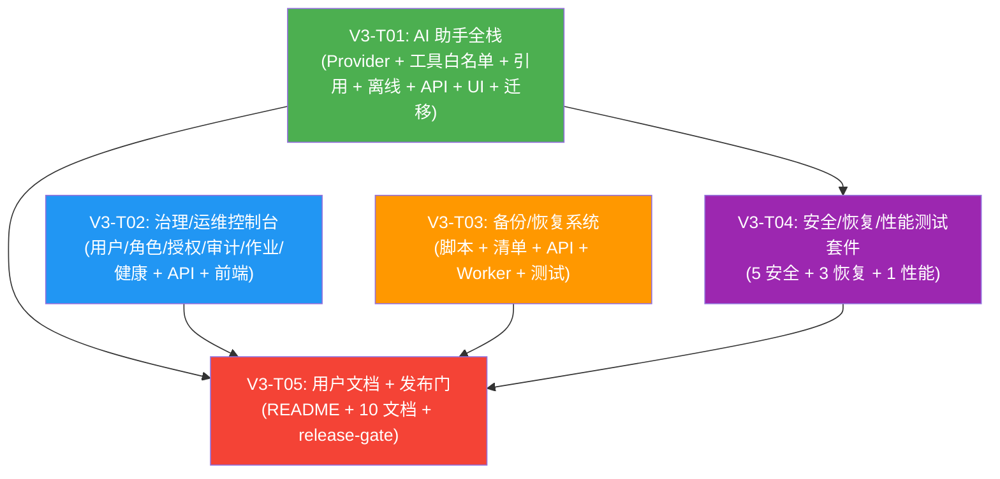

# IRIP Phase V3 系统架构设计

> **架构师**: 高见远（Gao）
> **版本**: v3.0
> **日期**: 2026-07-25
> **上游文档**: `docs/prd/v2-prd.md`、`docs/arch/v2-architecture.md`、IRIP V3 实施计划
> **关联图表**: `docs/arch/v3-class-diagram.mermaid`、`docs/arch/v3-sequence-diagram.mermaid`

---

## Part A: 系统设计

### 1. 实现方案

#### 1.1 核心技术挑战

V3 在 V0（平台骨架）+ V1（粒度分析全链路）+ V2（组件系统 + 流程引擎 + ROM 模型生命周期）之上，引入五大子系统：

| 挑战 | 描述 | 解决方案 |
|------|------|---------|
| **AI Provider 可插拔** | AI 服务需支持 OpenAI 兼容 API 和离线确定性模拟两种模式，通过环境变量切换 | 定义 `AIProvider` Protocol + `AIRequest`/`AIResponse` frozen dataclass；`OpenAICompatibleProvider` 用 httpx 调用 REST API；`OfflineProvider` 返回确定性响应（无网络依赖） |
| **AI 工具白名单安全** | AI 助手只能调用预定义的只读数据查询工具，禁止任意代码执行/数据修改 | `ToolRegistry` 维护 7 个白名单工具 + 候选工具；每次 tool_call 在执行前校验工具名是否在白名单中；所有工具为只读（复用 V0-V2 查询服务），不暴露写操作 |
| **AI 引用可溯源** | AI 回复中的每个事实声明必须附带引用，引用指向平台真实数据（事实/参数/模型/溯源） | `Citation` frozen dataclass 携带 source_type + source_id + snippet；工具执行结果自动生成引用；`CitationCollector` 聚合工具调用产生的引用列表 |
| **治理控制台统一** | 用户管理/角色分配/范围授权/审计查询/作业监控/系统健康需统一管理入口 | 新增 `governance` 和 `audit` API 路由，复用 V0 `AppUser`/`Role`/`ScopeGrant`/`AuditEvent` ORM；前端新增 6 个治理页面 |
| **备份恢复完整性** | PostgreSQL + MinIO + Redis 三组件备份需原子性，恢复需校验完整性 | `BackupManifest` 携带各组件 SHA-256 校验和；`backup.py` 串联 pg_dump + MinIO 同步；`restore.py` 恢复前验证 manifest 完整性 |
| **安全测试覆盖** | Token 重放、上传限制、路径穿越、SQL 注入、AI 工具逃逸需系统化测试 | 复用 V0 `testcontainers` 环境模式；安全测试标记 `@pytest.mark.security`；AI 工具逃逸测试验证白名单强制执行 |
| **恢复测试覆盖** | Redis 丢失、MinIO 中断、迁移回滚需验证平台韧性 | testcontainers 动态启停容器模拟中断；迁移回滚测试验证 `alembic downgrade` 可逆性 |
| **发布门自动化** | 所有质量检查（lint/typecheck/unit/integration/security/recovery/performance/web）需一键执行 | `scripts/release-gate.sh` 串联 Makefile 目标 + k6 性能测试 + 前端构建，任一失败即阻塞发布 |

#### 1.2 框架与库选型

| 库 | 版本 | 用途 | 选型理由 |
|----|------|------|---------|
| **httpx** | >=0.27（已有） | OpenAI 兼容 API 调用 | 已在 V0 引入，用于 REST connector；OpenAI 兼容 API 为标准 REST，无需引入 `openai` SDK |
| **react-markdown** | ^9.0.0 | AI 回复 Markdown 渲染 | AI 回复含 Markdown 格式（表格/列表/代码块），需前端渲染 |
| **remark-gfm** | ^4.0.0 | GitHub Flavored Markdown | 支持 AI 回复中的表格/任务列表等 GFM 扩展语法 |
| **k6** | >=0.50（外部工具） | 性能冒烟测试 | Grafana k6 是业界标准负载测试工具，JS 脚本编写，独立安装 |

> **不新增的 Python 依赖**：V3 后端不引入 `openai` SDK（使用 httpx 直接调用 OpenAI 兼容 REST API，与 V0 `RestConnector` 模式一致）；不引入 Docker SDK（备份脚本通过 `subprocess` 调用 `pg_dump` / `aws s3` CLI）。

#### 1.3 架构模式

延续 V0-V2 的分层模式，V3 新增 `packages/ai` 包和治理/备份 API 层：

```
┌──────────────────────────────────────────────────────────────────┐
│  apps/web (React + Ant Design + TanStack Query/Router)            │
│  ┌───────────┬───────────┬───────────┬───────────┬──────────────┐ │
│  │AssistantPg │ UsersPage │ AuditPage  │ JobsPage  │SystemHealth │ │
│  │MessageThr  │ ScopeGrnts│            │ JobDetail │  Page       │ │
│  │ToolTrace   │           │            │           │             │ │
│  │CitationList│           │            │           │             │ │
│  │ProviderStat│           │            │           │             │ │
│  └───────────┴───────────┴───────────┴───────────┴──────────────┘ │
├──────────────────────────────────────────────────────────────────┤
│  apps/api (FastAPI)                                               │
│  routers: assistant / governance / audit / backups                │
├──────────────────────────────────────────────────────────────────┤
│  apps/worker (Celery) — backup/restore 异步作业                   │
├──────────────────────────────────────────────────────────────────┤
│  packages/ai              packages/auth (V0 复用)                  │
│  ├─ providers.py          ├─ entities.py (AppUser/Role)            │
│  ├─ openai_compatible.py  ├─ permissions.py (V3 扩展)             │
│  ├─ offline_provider.py   ├─ scope_grants.py (V0 复用)            │
│  ├─ tools.py              └─ service.py (V0 复用)                 │
│  ├─ citations.py                                                  │
│  ├─ service.py                                                    │
│  └─ entities.py (AIConversation/AIMessage)                        │
│  packages/audit (V0 复用)                                          │
│  ├─ events.py (AuditEvent ORM)                                    │
│  └─ repository.py (AuditRecorder)                                  │
├──────────────────────────────────────────────────────────────────┤
│  deployments/compose                                               │
│  ├─ backup.py / restore.py / backup_manifest.py                   │
│  └─ (V0 Dockerfile/nginx 复用)                                    │
├──────────────────────────────────────────────────────────────────┤
│  packages/common / jobs / connectors / standards / facts /         │
│  provenance / parameters / components / models (V0-V2 复用)         │
└──────────────────────────────────────────────────────────────────┘
```

**设计原则**：
1. **V0-V2 复用优先**：AI 工具白名单复用 V0-V2 查询服务（FactService、ParameterService、ModelService、ProvenanceGraphService）；治理 API 复用 V0 `AppUser`/`Role`/`ScopeGrant` ORM；审计查询复用 V0 `AuditEvent` ORM；备份脚本复用 V0 `S3Repository`。
2. **Protocol 优先**：`AIProvider` 使用 `typing.Protocol` + `@runtime_checkable`，与 V1 `Connector`、V2 `Component`/`ModelAdapter` 风格一致。
3. **frozen dataclass 值对象**：`AIRequest`、`AIResponse`、`ToolDefinition`、`ToolResult`、`Citation`、`BackupManifest` 均为 `@dataclass(frozen=True)`。
4. **只读工具边界**：AI 工具仅暴露查询操作（read），不暴露创建/修改/删除操作——与 V2 "映射/转换组件不直接写事实" 原则一致。
5. **审计仅追加**：治理控制台的审计查询为只读（`audit_event` 表 REVOKE UPDATE/DELETE，V0 已实现）。

---

### 2. 文件列表

#### 2.1 V3 新增文件

```
packages/ai/
├── __init__.py                                # 包导出
├── providers.py                                # AIProvider Protocol + AIRequest/AIResponse
├── openai_compatible.py                        # OpenAICompatibleProvider (httpx)
├── offline_provider.py                         # OfflineProvider (确定性模拟)
├── tools.py                                     # ToolDefinition + ToolRegistry + 7 白名单工具
├── citations.py                                # Citation frozen dataclass + CitationCollector
├── service.py                                  # AIService (对话编排 + 工具调度 + 引用聚合)
└── entities.py                                 # AIConversation + AIMessage ORM

apps/api/routers/
├── assistant.py                                # AI 助手 API (对话 CRUD + 消息发送)
├── governance.py                                # 用户管理/角色分配/范围授权 API
├── audit.py                                    # 审计事件查询 API (只读)
└── backups.py                                  # 备份/恢复 API (异步作业触发)

apps/web/src/
├── assistant/
│   ├── AssistantPage.tsx                        # AI 助手主页面 (对话列表 + 聊天区)
│   ├── MessageThread.tsx                        # 消息线程 (Markdown 渲染)
│   ├── ToolTrace.tsx                            # 工具调用追踪可视化
│   ├── CitationList.tsx                         # 引用列表 (可跳转溯源)
│   └── ProviderStatus.tsx                       # AI Provider 状态指示器
├── governance/
│   ├── UsersPage.tsx                            # 用户管理页 (列表/角色分配/启禁用)
│   ├── ScopeGrantsPage.tsx                      # 范围授权管理页
│   ├── AuditPage.tsx                            # 审计事件查询页
│   └── SystemHealthPage.tsx                    # 系统健康仪表盘
└── jobs/
    ├── JobsPage.tsx                             # 作业中心页 (全量列表)
    └── JobDetail.tsx                            # 作业详情页 (状态时间线)

deployments/compose/
├── backup.py                                    # 备份脚本 (pg_dump + MinIO sync)
├── restore.py                                  # 恢复脚本 (校验 + 恢复)
└── backup_manifest.py                           # BackupManifest 数据结构 + 完整性校验

migrations/versions/
└── 0021_ai_conversations.py                    # ai_conversation + ai_message 表

tests/
├── unit/
│   └── ai/
│       └── test_tool_policy.py                 # 工具白名单策略单元测试
├── integration/
│   └── ai/
│       └── test_offline_citations.py           # 离线模式引用集成测试
├── security/
│   ├── test_ai_scope_enforcement.py            # AI 工具范围强制 (组织隔离)
│   ├── test_token_replay.py                    # JWT token 重放防护
│   ├── test_upload_limits.py                   # 上传大小/类型限制
│   ├── test_path_traversal.py                  # 路径穿越防护
│   ├── test_sql_injection.py                   # SQL 注入防护
│   └── test_ai_tool_escape.py                  # AI 工具白名单逃逸防护
├── recovery/
│   ├── test_backup_restore.py                  # 备份恢复完整性
│   ├── test_redis_loss.py                      # Redis 丢失恢复
│   ├── test_minio_outage.py                    # MinIO 中断恢复
│   └── test_migration_rollback.py              # 迁移回滚可逆性
└── performance/
    └── k6-smoke.js                              # k6 性能冒烟测试

docs/
├── architecture/
│   ├── system-overview.md                       # 系统架构总览
│   └── domain-invariants.md                     # 领域不变量
├── user-guide/
│   ├── particle-size.md                         # 粒度分析使用指南
│   └── grate-cooler-rom.md                      # 篦冷机 ROM 使用指南
├── data-onboarding/
│   └── mapping-profile.md                       # 数据上线 — 映射配置
├── model-onboarding/
│   └── model-adapter.md                         # 模型上线 — 适配器开发
├── operations/
│   ├── install-upgrade.md                       # 安装与升级
│   ├── monitoring.md                            # 监控运维
│   └── backup-restore.md                        # 备份恢复操作手册
└── acceptance/
    └── final-release.md                         # V3 最终发布验收标准

scripts/
└── release-gate.sh                              # 发布门 (全量质量检查)
```

#### 2.2 V0-V2 复用文件（仅引用/追加，不重写）

| 文件 | 复用点 |
|------|--------|
| `packages/common/errors.py` | `AppError` — 统一错误契约 |
| `packages/common/ids.py` | `new_id()` — UUID 生成 |
| `packages/common/database.py` | `Base`, `session_scope`, `build_session_factory` |
| `packages/common/db_types.py` | `GUID`, `UTCDateTime` — 自定义列类型 |
| `packages/common/clock.py` | `Clock` — 时钟依赖 |
| `packages/common/s3_repository.py` | `S3Repository` — MinIO 对象存储 |
| `packages/auth/entities.py` | `AppUser`, `RefreshSession` — 用户实体 |
| `packages/auth/permissions.py` | `Permission`, `Role`, `BUILTIN_ROLES` — 权限模型（V3 追加权限） |
| `packages/auth/scope_grants.py` | `ScopeGrant`, `AuthorizationService` — 对象级授权 |
| `packages/auth/service.py` | `AuthService` — 认证服务 |
| `packages/audit/events.py` | `AuditEvent`, `AuditEventData` — 审计事件实体 |
| `packages/audit/repository.py` | `AuditRecorder` — 审计记录器 |
| `packages/jobs/service.py` | `JobService` — 作业服务（备份/恢复异步作业） |
| `packages/facts/service.py` | `FactService` — AI 工具 search_facts/get_fact |
| `packages/parameters/service.py` | `ParameterService` — AI 工具 list_parameters/get_parameter |
| `packages/models/service.py` | `ModelService` — AI 工具 list_models/get_model_detail |
| `packages/provenance/graph.py` | `ProvenanceGraphService` — AI 工具 get_provenance |
| `apps/api/dependencies/auth.py` | `CurrentUser`, `get_current_user` — 认证上下文 |
| `apps/api/dependencies/authorization.py` | `require_permission` — 权限校验 |
| `apps/api/main.py` | 应用工厂（V3 追加路由注册 + 依赖覆盖） |
| `apps/worker/celery_app.py` | `celery_app` — Celery 实例 |
| `apps/web/src/api/client.ts` | `http` — API 客户端（V3 追加 API 函数） |
| `apps/web/src/app/router.tsx` | 路由注册（V3 追加路由） |
| `apps/web/src/app/AppShell.tsx` | 导航菜单（V3 追加导航项） |
| `apps/web/src/jobs/JobDrawer.tsx` | 作业抽屉组件（JobsPage 复用） |

---

### 3. 数据结构和接口

> 完整类图见 `docs/arch/v3-class-diagram.mermaid`

#### 3.1 AI Provider 抽象层

```python
# packages/ai/providers.py

@dataclass(frozen=True)
class AIRequest:
    """AI 请求（不可变值对象）。
    Attributes:
        messages: 对话消息列表（role + content）。
        tools: 可用工具定义列表（JSON Schema 格式，传给 LLM）。
        model: 模型标识（如 "gpt-4o-mini"）。
        temperature: 采样温度（默认 0.7）。
        max_tokens: 最大生成 token 数。
        organization_id: 当前组织 ID（工具执行范围隔离）。
        user_id: 当前用户 ID（权限继承）。
    """
    messages: tuple[dict, ...]
    tools: tuple[dict, ...]
    model: str
    temperature: float = 0.7
    max_tokens: int = 2048
    organization_id: UUID = field(default_factory=new_id)
    user_id: UUID = field(default_factory=new_id)

@dataclass(frozen=True)
class AIResponse:
    """AI 响应（不可变值对象）。
    Attributes:
        content: 助手回复文本（Markdown 格式）。
        tool_calls: 工具调用请求列表（name + arguments）。
        citations: 引用列表（从工具调用结果聚合）。
        usage: token 用量统计（prompt_tokens/completion_tokens）。
        provider: provider 标识（"openai" / "offline"）。
        model: 实际使用的模型。
    """
    content: str
    tool_calls: tuple[dict, ...]
    citations: tuple["Citation", ...]
    usage: dict
    provider: str
    model: str

@runtime_checkable
class AIProvider(Protocol):
    """AI Provider 协议。
    所有 AI 后端（OpenAI 兼容、离线模拟）必须实现此协议。
    """
    async def complete(self, request: AIRequest) -> AIResponse: ...
    def healthcheck(self) -> bool: ...
```

#### 3.2 AI 工具白名单

```python
# packages/ai/tools.py

@dataclass(frozen=True)
class ToolDefinition:
    """工具定义（不可变值对象）。
    Attributes:
        name: 工具名称（白名单中的唯一标识）。
        description: 工具描述（传给 LLM 的 function description）。
        parameters_schema: 工具参数 JSON Schema（传给 LLM 的 function parameters）。
        handler: 工具执行处理器（ToolHandler 协议实例）。
        enabled: 是否启用（候选工具默认 False）。
    """
    name: str
    description: str
    parameters_schema: dict
    handler: "ToolHandler"
    enabled: bool = True

@dataclass(frozen=True)
class ToolResult:
    """工具执行结果（不可变值对象）。
    Attributes:
        name: 工具名称。
        result: 工具返回数据（dict，序列化为 JSON 传回 LLM）。
        citations: 工具产生的引用列表。
        error: 错误信息（None 表示成功）。
    """
    name: str
    result: dict
    citations: tuple["Citation", ...]
    error: str | None = None

@runtime_checkable
class ToolHandler(Protocol):
    """工具执行处理器协议。"""
    async def execute(self, arguments: dict, org_id: UUID, user_id: UUID) -> ToolResult: ...

class ToolRegistry:
    """工具注册表 — 白名单强制执行。
    维护 7 个白名单工具 + 候选工具，校验 tool_call 合法性。
    """
    def __init__(self) -> None: ...
    def register(self, tool: ToolDefinition) -> None: ...
    def get_enabled_tools(self) -> list[ToolDefinition]: ...
    def get_tool_schemas_for_llm(self) -> list[dict]: ...
    def is_allowed(self, tool_name: str) -> bool: ...
    async def execute_tool(self, tool_name: str, arguments: dict, org_id: UUID, user_id: UUID) -> ToolResult: ...

# 7 个白名单工具（只读查询，复用 V0-V2 服务）
WHITELIST_TOOLS: list[ToolDefinition] = [
    ToolDefinition(name="search_facts",       description="按关键词搜索实验事实", ...),  # → FactService.search()
    ToolDefinition(name="get_fact",          description="获取事实详情", ...),            # → FactService.get()
    ToolDefinition(name="list_parameters",   description="列出已发布参数", ...),        # → ParameterService.list()
    ToolDefinition(name="get_parameter",     description="获取参数详情", ...),          # → ParameterService.get()
    ToolDefinition(name="list_models",       description="列出已发布模型", ...),        # → ModelService.list()
    ToolDefinition(name="get_model_detail",  description="获取模型详情", ...),          # → ModelService.get()
    ToolDefinition(name="get_provenance",    description="获取推导溯源图", ...),        # → ProvenanceGraphService.get()
]

# 候选工具（默认禁用，可配置启用）
CANDIDATE_TOOLS: list[ToolDefinition] = [
    ToolDefinition(name="search_standards",  description="搜索标准变量", ..., enabled=False),
    ToolDefinition(name="list_components",   description="列出组件", ..., enabled=False),
    ToolDefinition(name="get_flow_run",       description="获取流程运行详情", ..., enabled=False),
]
```

#### 3.3 引用数据结构

```python
# packages/ai/citations.py

@dataclass(frozen=True)
class Citation:
    """引用（不可变值对象）。
    每条引用指向平台真实数据，支持溯源跳转。
    Attributes:
        source_type: 引用源类型（fact / parameter / model / provenance）。
        source_id: 引用源 ID（UUID 字符串）。
        snippet: 引用内容摘要（人类可读的简短描述）。
        metadata: 附加元数据（如 fact_type、model_version 等）。
    """
    source_type: str
    source_id: str
    snippet: str
    metadata: dict

class CitationCollector:
    """引用收集器。
    从工具执行结果中提取引用，聚合成去重列表。
    """
    def __init__(self) -> None: ...
    def add(self, citation: Citation) -> None: ...
    def add_from_tool_result(self, result: ToolResult) -> None: ...
    def collect(self) -> tuple[Citation, ...]: ...
```

#### 3.4 AI 服务 + 对话实体

```python
# packages/ai/entities.py

class AIConversation(Base):
    """AI 对话（ORM: ai_conversation）。
    一个用户的一个对话线程。
    """
    __tablename__ = "ai_conversation"
    id: Mapped[UUID] = mapped_column(GUID, primary_key=True, default=new_id)
    organization_id: Mapped[UUID] = mapped_column(GUID, nullable=False)
    user_id: Mapped[UUID] = mapped_column(GUID, sa.ForeignKey("app_user.id"), nullable=False)
    title: Mapped[str] = mapped_column(sa.Text, nullable=False, server_default=sa.text("'新对话'"))
    provider: Mapped[str] = mapped_column(sa.Text, nullable=False, server_default=sa.text("'offline'"))
    created_at: Mapped[datetime] = mapped_column(UTCDateTime, server_default=sa.func.now(), nullable=False)
    updated_at: Mapped[datetime] = mapped_column(UTCDateTime, server_default=sa.func.now(), nullable=False)
    __table_args__ = (sa.Index("ix_ai_conv_org_user", "organization_id", "user_id"),)

class AIMessage(Base):
    """AI 消息（ORM: ai_message）。
    对话中的每条消息（user / assistant / tool）。
    """
    __tablename__ = "ai_message"
    id: Mapped[UUID] = mapped_column(GUID, primary_key=True, default=new_id)
    conversation_id: Mapped[UUID] = mapped_column(GUID, sa.ForeignKey("ai_conversation.id", ondelete="CASCADE"), nullable=False)
    role: Mapped[str] = mapped_column(sa.Text, nullable=False)  # user / assistant / tool
    content: Mapped[str] = mapped_column(sa.Text, nullable=False)
    tool_calls_json: Mapped[list | None] = mapped_column(JSONB, nullable=True)
    citations_json: Mapped[list | None] = mapped_column(JSONB, nullable=True)
    created_at: Mapped[datetime] = mapped_column(UTCDateTime, server_default=sa.func.now(), nullable=False)
    __table_args__ = (sa.Index("ix_ai_msg_conv", "conversation_id", "created_at"),)

# packages/ai/service.py

class AIService:
    """AI 助手服务 — 对话编排 + 工具调度 + 引用聚合。
    依赖注入: session_factory, organization_id, user_id, provider, tool_registry。
    """
    def __init__(self, session_factory, organization_id, user_id, provider: AIProvider, tool_registry: ToolRegistry) -> None: ...
    async def create_conversation(self, title: str = "新对话") -> AIConversation: ...
    async def list_conversations(self) -> list[AIConversation]: ...
    async def get_conversation(self, conversation_id: UUID) -> AIConversation: ...
    async def delete_conversation(self, conversation_id: UUID) -> None: ...
    async def get_messages(self, conversation_id: UUID) -> list[AIMessage]: ...
    async def send_message(self, conversation_id: UUID, content: str) -> AIMessage: ...
        # 1. INSERT user message
        # 2. Load conversation history
        # 3. Build AIRequest (messages + tool schemas)
        # 4. provider.complete(request) → AIResponse
        # 5. FOR each tool_call: tool_registry.execute_tool() → ToolResult → CitationCollector
        # 6. If tool_calls: feed tool results back to provider for final response
        # 7. INSERT assistant message (content + tool_calls + citations)
        # 8. Return assistant message
```

#### 3.5 治理服务 + 审计查询

```python
# apps/api/routers/governance.py

class GovernanceService:
    """治理服务 — 用户管理 / 角色分配 / 范围授权。
    依赖注入: session_factory, actor_id。
    复用 V0 AppUser / Role / ScopeGrant ORM。
    """
    def __init__(self, session_factory, actor_id: UUID) -> None: ...
    async def list_users(self, status: str | None = None) -> list[AppUser]: ...
    async def get_user(self, user_id: UUID) -> AppUser: ...
    async def update_user_roles(self, user_id: UUID, roles: list[str]) -> AppUser: ...
    async def set_user_status(self, user_id: UUID, status: str) -> AppUser: ...
    async def list_roles(self) -> list[Role]: ...
    async def list_scope_grants(self, user_id: UUID | None = None) -> list[ScopeGrant]: ...
    async def create_scope_grant(self, grant: dict) -> ScopeGrant: ...
    async def revoke_scope_grant(self, grant_id: UUID) -> None: ...

# apps/api/routers/audit.py

class AuditQueryService:
    """审计查询服务 — 只读查询 audit_event 表。
    依赖注入: session_factory, organization_id。
    """
    def __init__(self, session_factory, organization_id: UUID) -> None: ...
    async def query_events(
        self,
        action: str | None = None,
        resource_type: str | None = None,
        actor_user_id: UUID | None = None,
        start_time: datetime | None = None,
        end_time: datetime | None = None,
        cursor: str | None = None,
        limit: int = 50,
    ) -> tuple[list[AuditEvent], str | None]: ...
```

#### 3.6 备份/恢复

```python
# deployments/compose/backup_manifest.py

@dataclass(frozen=True)
class BackupManifest:
    """备份清单（不可变值对象）。
    Attributes:
        backup_id: 备份唯一标识（UUID）。
        created_at: 备份创建时间（UTC）。
        components: 各组件备份信息（db / minio / redis）。
        checksums: 各组件 SHA-256 校验和。
        irip_version: 备份时的 IRIP 版本。
        migration_head: 备份时的 Alembic 迁移版本。
    """
    backup_id: str
    created_at: str
    components: dict  # {"db": {...}, "minio": {...}, "redis": {...}}
    checksums: dict  # {"db": "sha256:...", "minio": "sha256:..."}
    irip_version: str
    migration_head: str

class BackupManifestValidator:
    """备份清单完整性校验器。"""
    def validate(self, manifest: BackupManifest, backup_dir: Path) -> bool: ...
    def verify_checksum(self, component: str, file_path: Path, expected: str) -> bool: ...

# deployments/compose/backup.py

class BackupService:
    """备份服务 — 串联 pg_dump + MinIO 同步。
    通过 subprocess 调用 pg_dump 和 aws s3 sync CLI。
    """
    def __init__(self, db_url: str, minio_endpoint: str, minio_bucket: str) -> None: ...
    async def backup(self, output_dir: Path) -> BackupManifest: ...
        # 1. pg_dump → output_dir/db/dump.sql.gz
        # 2. aws s3 sync → output_dir/minio/
        # 3. 计算各组件 SHA-256
        # 4. 查询 alembic_version
        # 5. 生成 BackupManifest → manifest.json

# deployments/compose/restore.py

class RestoreService:
    """恢复服务 — 校验 manifest + 恢复各组件。
    恢复前验证校验和，任一不匹配则中止。
    """
    def __init__(self, db_url: str, minio_endpoint: str, minio_bucket: str) -> None: ...
    async def restore(self, backup_dir: Path) -> None: ...
        # 1. 读取 manifest.json → BackupManifest
        # 2. BackupManifestValidator.validate() → 校验所有组件
        # 3. pg_restore < dump.sql.gz
        # 4. aws s3 sync → MinIO bucket
        # 5. 验证 alembic_version 匹配
```

---

### 4. 程序调用流程

> 完整时序图见 `docs/arch/v3-sequence-diagram.mermaid`

#### 4.1 AI 助手对话流程（含工具调用 + 引用聚合）

```
研究员 → POST /api/v1/assistant/conversations/{id}/messages (content)
  → AIService.send_message(conversation_id, content)
    → INSERT ai_message (role=user, content)
    → SELECT ai_message WHERE conversation_id=? ORDER BY created_at → history
    → ToolRegistry.get_tool_schemas_for_llm() → 7 个工具的 JSON Schema
    → AIRequest(messages=history+new, tools=schemas)
    → AIProvider.complete(request) → AIResponse(content, tool_calls, citations)
    
    IF tool_calls 非空:
      → FOR each tool_call in tool_calls:
        → ToolRegistry.is_allowed(tool_name)? 
          → False: raise AppError(code="tool_not_allowed")
          → True: ToolRegistry.execute_tool(tool_name, arguments, org_id, user_id)
          → ToolHandler.execute(arguments, org_id, user_id)
            → 调用 V0-V2 查询服务 (FactService/ParameterService/...)
          → ToolResult(name, result, citations)
          → CitationCollector.add_from_tool_result(result)
      → 将工具结果作为 tool 消息追加到对话
      → AIProvider.complete(updated_request) → AIResponse(final_content)
      → citations = CitationCollector.collect()
    
    → INSERT ai_message (role=assistant, content, tool_calls_json, citations_json)
    → 200 OK (assistant message + citations + tool_traces)
```

#### 4.2 治理 — 用户角色分配流程

```
平台管理员 → PATCH /api/v1/governance/users/{id}/roles (roles=["researcher","data_steward"])
  → require_permission("governance:manage")
  → GovernanceService.update_user_roles(user_id, roles)
    → SELECT app_user WHERE id=? → user
    → 校验 roles 中的每个 code 是否在 BUILTIN_ROLES 中
    → UPDATE app_user SET roles=? WHERE id=? (乐观锁 lock_version)
    → AuditRecorder.record(action="governance.role_update", resource_type="user", resource_id=user_id)
  → 200 OK (updated user)
```

#### 4.3 备份 → 恢复流程

```
运维人员 → POST /api/v1/backups (trigger backup)
  → require_permission("backup:manage")
  → JobService.accept(kind="backup", payload={output_dir})
  → 202 Accepted (job_id)

Celery Worker → lease(job_id)
  → BackupService.backup(output_dir)
    → subprocess: pg_dump --dbname=$DB_URL --format=custom → db.dump
    → subprocess: aws s3 sync s3://$BUCKET minio_objects/
    → compute SHA-256 for each component
    → SELECT version_num FROM alembic_version
    → write manifest.json (BackupManifest)
  → JobService.complete(job_id, result={backup_id, manifest_path})

运维人员 → POST /api/v1/backups/{backup_id}/restore
  → require_permission("backup:restore")
  → JobService.accept(kind="restore", payload={backup_dir})
  → 202 Accepted (job_id)

Celery Worker → lease(job_id)
  → RestoreService.restore(backup_dir)
    → read manifest.json → BackupManifest
    → BackupManifestValidator.validate() → verify all checksums
    → IF any checksum mismatch: raise AppError(code="backup_corrupted")
    → subprocess: pg_restore --dbname=$DB_URL --clean db.dump
    → subprocess: aws s3 sync minio_objects/ s3://$BUCKET
    → verify alembic_version == manifest.migration_head
  → JobService.complete(job_id)
```

---

### 5. 待明确事项

| # | 问题 | 当前假设 | 影响范围 |
|---|------|---------|---------|
| 1 | OpenAI 兼容 API 的认证方式 | 架构假设通过环境变量 `IRIP_AI_API_KEY` + `IRIP_AI_BASE_URL` 配置，使用 Bearer token 认证 | `packages/ai/openai_compatible.py` |
| 2 | 离线 provider 的响应规则 | 架构假设 OfflineProvider 基于关键词匹配返回确定性响应（如包含"粒度"→调用 search_facts 并返回摘要），不依赖网络 | `packages/ai/offline_provider.py` |
| 3 | AI 工具的速率限制 | 实施计划未确认。架构假设每用户每分钟最多 20 次工具调用，超限返回 429 | `apps/api/routers/assistant.py` |
| 4 | 治理控制台的权限模型 | 架构假设新增 `governance:manage`（用户/角色/范围授权管理）和 `governance:read`（只读查看）权限，授予 platform_administrator | `packages/auth/permissions.py` |
| 5 | 审计查询的时间范围限制 | 架构假设单次查询最多返回 90 天内的事件，超过需分批查询 | `apps/api/routers/audit.py` |
| 6 | 备份存储位置 | 架构假设备份文件存储在 MinIO 的 `irip-backups` bucket 中，按日期目录组织 | `deployments/compose/backup.py` |
| 7 | Redis 是否纳入备份 | 架构假设 Redis 仅作为缓存/队列，不纳入备份（Celery 任务可重放）；如需备份通过 `redis-cli --rdb` | `deployments/compose/backup.py` |
| 8 | k6 性能测试的执行环境 | 架构假设 k6 独立安装（非 Python 依赖），通过 `scripts/release-gate.sh` 调用 | `tests/performance/k6-smoke.js` |
| 9 | 发布门的最小通过标准 | 架构假设 release-gate.sh 要求：lint 0 errors + typecheck 0 errors + unit 100% pass + integration 100% pass + security 100% pass + recovery 100% pass + web-build 成功 + k6 P95 < 500ms | `scripts/release-gate.sh` |
| 10 | AI 对话历史保留策略 | 实施计划未确认。架构假设对话历史永久保留（不自动清理），可手动删除 | `packages/ai/entities.py` |

---

## Part B: 任务分解

### 6. 依赖包列表

V3 新增的第三方包（在 `pyproject.toml` 的 `dependencies` 中追加）：

```
# 无新增 Python 后端依赖
# httpx (>=0.27) 已在 V0 引入，用于 OpenAI 兼容 API 调用
# 备份脚本通过 subprocess 调用 pg_dump / aws s3 CLI，无需额外 Python 包
```

前端新增依赖（在 `apps/web/package.json` 中追加）：

```
react-markdown@^9.0.0: AI 回复 Markdown 渲染（AssistantPage / MessageThread）
remark-gfm@^4.0.0: GitHub Flavored Markdown 支持（表格/任务列表/删除线）
```

外部工具（非包管理器安装，在 `docs/operations/install-upgrade.md` 中文档化）：

```
k6 >=0.50: 性能冒烟测试工具（Grafana k6，通过包管理器或 Docker 安装）
pg_dump (PostgreSQL 客户端工具): 备份脚本依赖
aws-cli >=2.x: MinIO 对象同步（兼容 S3 协议）
```

> **注意**：V3 后端不引入 `openai` Python SDK——`OpenAICompatibleProvider` 使用已有的 `httpx` 直接调用 OpenAI 兼容 REST API（POST `/v1/chat/completions`），与 V0 `RestConnector` 模式一致，避免引入重量级 SDK 依赖。

---

### 7. 任务列表（按依赖顺序）

> **约束说明**: 实施计划定义了 6 个任务（Task 29-34），架构按照"功能模块/层次"分组原则压缩为 5 个实施任务（V3-T01~V3-T05），每个任务至少包含 3 个文件，遵循"第一个任务为基础设施"原则。

---

#### V3-T01: AI 助手全栈（Provider 抽象 + 工具白名单 + 引用 + 离线模拟 + API + 前端 UI + 迁移 + 测试）

**对应 PRD**: Task 29 + Task 30

**源文件**:
- `packages/ai/__init__.py`
- `packages/ai/providers.py`
- `packages/ai/openai_compatible.py`
- `packages/ai/offline_provider.py`
- `packages/ai/tools.py`
- `packages/ai/citations.py`
- `packages/ai/service.py`
- `packages/ai/entities.py`
- `apps/api/routers/assistant.py`
- `apps/api/main.py`（追加 assistant_router 注册 + AI 依赖覆盖）
- `migrations/versions/0021_ai_conversations.py`
- `packages/auth/permissions.py`（追加 V3 权限：ai:chat, governance:read, governance:manage, audit:read, backup:manage, backup:restore）
- `apps/web/src/assistant/AssistantPage.tsx`
- `apps/web/src/assistant/MessageThread.tsx`
- `apps/web/src/assistant/ToolTrace.tsx`
- `apps/web/src/assistant/CitationList.tsx`
- `apps/web/src/assistant/ProviderStatus.tsx`
- `apps/web/src/api/client.ts`（追加 V3 AI API 函数）
- `apps/web/src/app/router.tsx`（追加 /assistant 路由）
- `apps/web/src/app/AppShell.tsx`（追加"AI 助手"导航项）
- `apps/web/package.json`（追加 react-markdown + remark-gfm）
- `pyproject.toml`（无需追加——httpx 已存在）
- `tests/unit/ai/test_tool_policy.py`
- `tests/integration/ai/test_offline_citations.py`
- `tests/security/test_ai_scope_enforcement.py`

**依赖**: 无（V3 基础设施，复用 V0-V2 全部服务层）

**优先级**: P0

**描述**:
建立 AI 助手的完整全栈实现，作为 V3 的基础设施任务（包含包初始化、迁移、入口注册、依赖声明）：

1. **AIProvider Protocol + AIRequest/AIResponse**（`providers.py`）:
   - `AIProvider`: `@runtime_checkable` Protocol，定义 `async def complete(request) -> response` + `def healthcheck() -> bool`。
   - `AIRequest`: frozen dataclass，携带 messages tuple、tools tuple（JSON Schema 格式）、model、temperature、max_tokens、organization_id、user_id。
   - `AIResponse`: frozen dataclass，携带 content（Markdown）、tool_calls tuple、citations tuple、usage dict、provider 标识、model 标识。

2. **OpenAICompatibleProvider**（`openai_compatible.py`）: 使用 httpx 调用 OpenAI 兼容 REST API（POST `{base_url}/v1/chat/completions`）。通过环境变量 `IRIP_AI_BASE_URL` + `IRIP_AI_API_KEY` + `IRIP_AI_MODEL` 配置。支持 tool_choice="auto"，解析返回的 tool_calls。healthcheck 检查 base_url 可达。

3. **OfflineProvider**（`offline_provider.py`）: 确定性模拟，无网络依赖。基于用户消息关键词匹配返回预设响应：如包含"粒度"→模拟调用 search_facts 工具→返回摘要+引用；包含"模型"→模拟调用 list_models→返回模型列表+引用。响应内容固定（相同输入→相同输出），用于测试和离线开发。通过环境变量 `IRIP_AI_PROVIDER=offline` 启用（默认）。

4. **ToolDefinition + ToolRegistry + 7 白名单工具**（`tools.py`）:
   - `ToolDefinition`: frozen dataclass（name/description/parameters_schema/handler/enabled）。
   - `ToolRegistry`: 维护白名单 + 候选工具注册表。`is_allowed()` 校验工具名是否在启用列表中；`execute_tool()` 调用 handler 执行并返回 `ToolResult`；`get_tool_schemas_for_llm()` 返回 OpenAI function calling 格式的工具定义。
   - 7 个白名单工具（均为只读查询，复用 V0-V2 服务）:
     - `search_facts` → `FactService.search()` — 按关键词搜索事实，返回事实列表+引用。
     - `get_fact` → `FactService.get()` — 获取事实详情，返回详情+引用。
     - `list_parameters` → `ParameterService.list()` — 列出已发布参数，返回列表+引用。
     - `get_parameter` → `ParameterService.get()` — 获取参数详情，返回详情+引用。
     - `list_models` → `ModelService.list()` — 列出已发布模型，返回列表+引用。
     - `get_model_detail` → `ModelService.get()` — 获取模型详情，返回详情+引用。
     - `get_provenance` → `ProvenanceGraphService.get()` — 获取推导溯源图，返回图数据+引用。
   - 3 个候选工具（默认禁用）：`search_standards`、`list_components`、`get_flow_run`。

5. **Citation + CitationCollector**（`citations.py`）:
   - `Citation`: frozen dataclass（source_type/source_id/snippet/metadata），source_type 为 fact/parameter/model/provenance。
   - `CitationCollector`: 收集工具执行产生的引用，去重后返回 tuple。

6. **AIService**（`service.py`）: 对话编排核心。`send_message()` 流程：INSERT user message → 加载对话历史 → 构建 AIRequest → provider.complete() → 执行 tool_calls（经白名单校验）→ CitationCollector 聚合引用 → 若有 tool_calls 则二次调用 provider 获取最终回复 → INSERT assistant message。管理对话 CRUD 和消息列表查询。

7. **AIConversation + AIMessage ORM**（`entities.py`）: 两表设计。`ai_conversation`（组织+用户隔离，title/provider/时间戳）；`ai_message`（conversation_id FK + role/content/tool_calls_json/citations_json/时间戳）。

8. **API 路由**（`assistant.py`）:
   - `POST /api/v1/assistant/conversations` — 创建对话
   - `GET /api/v1/assistant/conversations` — 列出当前用户对话
   - `GET /api/v1/assistant/conversations/{id}` — 获取对话详情
   - `DELETE /api/v1/assistant/conversations/{id}` — 删除对话
   - `GET /api/v1/assistant/conversations/{id}/messages` — 获取消息列表
   - `POST /api/v1/assistant/conversations/{id}/messages` — 发送消息（返回 assistant 回复 + citations + tool_traces）
   - `GET /api/v1/assistant/provider/status` — provider 健康状态
   - 权限: `ai:chat`

9. **前端 UI**（`assistant/` 目录）:
   - `AssistantPage.tsx`: 左侧对话列表 + 右侧聊天区，创建新对话，切换对话。
   - `MessageThread.tsx`: 消息列表，用户消息右对齐、助手消息左对齐；助手消息用 `react-markdown` + `remark-gfm` 渲染 Markdown（表格/列表/代码块）。
   - `ToolTrace.tsx`: 可折叠的工具调用追踪面板，展示工具名、参数、结果 JSON。
   - `CitationList.tsx`: 引用列表，每条引用显示 source_type 图标 + snippet + 可点击跳转（fact→/facts/{id}，model→/models/{id} 等）。
   - `ProviderStatus.tsx`: 顶部状态栏，显示当前 provider 模式（OpenAI/离线）+ 健康状态指示灯。

10. **迁移 0021**（`0021_ai_conversations.py`）: 创建 `ai_conversation` + `ai_message` 两张表，GRANT 权限，re-seed 7 个内置角色（追加 V3 权限：ai:chat/governance:read/governance:manage/audit:read/backup:manage/backup:restore）。

11. **入口注册**（`main.py` 追加）: `app.include_router(assistant_router)` + AI 依赖覆盖（按环境变量选择 provider，默认 OfflineProvider）。

12. **测试**:
    - `test_tool_policy.py`: 验证白名单强制执行——非白名单工具名被拒绝、候选工具默认禁用、启用后可调用。
    - `test_offline_citations.py`: 端到端验证离线模式下对话→工具调用→引用生成→引用可溯源。
    - `test_ai_scope_enforcement.py`: 验证 AI 工具执行时组织隔离——用户 A 的 AI 对话不能查询用户 B 的组织数据。

---

#### V3-T02: 治理/运维控制台（用户管理 + 角色分配 + 范围授权 + 审计查询 + 作业监控 + 系统健康 + API + 前端页面）

**对应 PRD**: Task 31

**源文件**:
- `apps/api/routers/governance.py`
- `apps/api/routers/audit.py`
- `apps/api/main.py`（追加 governance_router + audit_router 注册 + 依赖覆盖）
- `apps/web/src/governance/UsersPage.tsx`
- `apps/web/src/governance/ScopeGrantsPage.tsx`
- `apps/web/src/governance/AuditPage.tsx`
- `apps/web/src/governance/SystemHealthPage.tsx`
- `apps/web/src/jobs/JobsPage.tsx`
- `apps/web/src/jobs/JobDetail.tsx`
- `apps/web/src/api/client.ts`（追加治理/审计/作业 API 函数）
- `apps/web/src/app/router.tsx`（追加治理/审计/作业/健康路由）
- `apps/web/src/app/AppShell.tsx`（追加导航项：治理→用户/授权/审计，运维→作业/健康）

**依赖**: 无（复用 V0 auth/audit ORM，与 V3-T01 并行）

**优先级**: P0

**描述**:
实现治理/运维控制台的完整前后端：

1. **GovernanceService + governance API**（`governance.py`）:
   - 复用 V0 `AppUser`/`Role`/`ScopeGrant` ORM，不新增表。
   - `GovernanceService`: 用户列表（按状态筛选）、用户详情、更新用户角色（校验角色代码合法性+乐观锁）、启禁用用户、角色列表、范围授权列表/创建/撤销。所有写操作记录审计事件。
   - API 端点:
     - `GET /api/v1/governance/users` — 用户列表（分页）
     - `GET /api/v1/governance/users/{id}` — 用户详情（含角色）
     - `PATCH /api/v1/governance/users/{id}/roles` — 分配角色
     - `PATCH /api/v1/governance/users/{id}/status` — 启禁用
     - `GET /api/v1/governance/roles` — 角色列表（含权限矩阵）
     - `GET /api/v1/governance/scope-grants` — 范围授权列表
     - `POST /api/v1/governance/scope-grants` — 创建范围授权
     - `DELETE /api/v1/governance/scope-grants/{id}` — 撤销范围授权
   - 权限: `governance:manage`（写操作）、`governance:read`（读操作）。

2. **AuditQueryService + audit API**（`audit.py`）:
   - 复用 V0 `AuditEvent` ORM，只读查询。
   - 支持按 action、resource_type、actor_user_id、时间范围筛选，游标分页。
   - API 端点:
     - `GET /api/v1/audit/events` — 审计事件查询（分页+筛选）
   - 权限: `audit:read`。

3. **UsersPage**（`governance/UsersPage.tsx`）: 用户列表表格（email/显示名/角色/状态），行操作：编辑角色（多选下拉）、启禁用切换。使用 Ant Design Table + Modal。

4. **ScopeGrantsPage**（`governance/ScopeGrantsPage.tsx`）: 范围授权列表，按用户/角色分组展示，支持创建（选择用户/角色+资源类型+操作+生效区间）和撤销。使用 Ant Design Table + Drawer 表单。

5. **AuditPage**（`governance/AuditPage.tsx`）: 审计事件查询页，筛选器（action 下拉、resource_type 下拉、时间范围选择器），结果表格（时间/操作人/动作/资源类型/资源 ID），点击行展开 payload JSON 详情。

6. **SystemHealthPage**（`governance/SystemHealthPage.tsx`）: 系统健康仪表盘，调用 `GET /api/v1/health/ready` 展示各组件状态（DB/Redis/MinIO/Outbox），用 Ant Design Card + 状态标签（绿=ok/红=error）。自动刷新（每 30 秒轮询）。

7. **JobsPage**（`jobs/JobsPage.tsx`）: 作业中心全量列表（从 JobDrawer 抽屉升级为独立页面），展示 kind/status/stage/progress，支持取消操作。复用 V0 `JobService` API。

8. **JobDetail**（`jobs/JobDetail.tsx`）: 作业详情页，状态时间线（accepted→queued→running→succeeded/failed），进度条，重试按钮。

9. **路由 + 导航注册**（`router.tsx` + `AppShell.tsx` 追加）:
   - `/governance/users` → UsersPage
   - `/governance/scope-grants` → ScopeGrantsPage
   - `/governance/audit` → AuditPage
   - `/governance/health` → SystemHealthPage
   - `/jobs` → JobsPage（替换 V0 占位）
   - `/jobs/$jobId` → JobDetail
   - 导航菜单重构：治理分组（用户/授权/审计/健康）+ 运维分组（作业中心）

---

#### V3-T03: 备份/恢复系统（备份脚本 + 恢复脚本 + 完整性清单 + API + 测试 + 操作手册）

**对应 PRD**: Task 32

**源文件**:
- `deployments/compose/backup.py`
- `deployments/compose/restore.py`
- `deployments/compose/backup_manifest.py`
- `apps/api/routers/backups.py`
- `apps/api/main.py`（追加 backups_router 注册 + 依赖覆盖）
- `apps/worker/tasks/backups.py`（备份/恢复 Celery 任务）
- `tests/recovery/test_backup_restore.py`
- `docs/operations/backup-restore.md`

**依赖**: 无（复用 V0 S3Repository + V0 JobService，与 V3-T01/T02 并行）

**优先级**: P0

**描述**:
实现备份/恢复系统的完整链路：

1. **BackupManifest + BackupManifestValidator**（`backup_manifest.py`）:
   - `BackupManifest`: frozen dataclass（backup_id/created_at/components/checksums/irip_version/migration_head）。
   - `BackupManifestValidator`: 验证 manifest 完整性——检查各组件文件存在 + SHA-256 校验和匹配 + migration_head 一致。任一不匹配返回 False。

2. **BackupService**（`backup.py`）:
   - 通过 `subprocess` 调用 `pg_dump`（PostgreSQL 逻辑备份，--format=custom 支持并行恢复）和 `aws s3 sync`（MinIO 对象同步到本地目录）。
   - 备份流程：创建输出目录 → pg_dump → aws s3 sync → 计算各组件 SHA-256 → 查询 alembic_version → 生成 manifest.json。
   - 环境变量驱动：`IRIP_DATABASE_URL`、`IRIP_MINIO_ENDPOINT`、`IRIP_MINIO_BUCKET`、`IRIP_MINIO_ACCESS_KEY`、`IRIP_MINIO_SECRET_KEY`。
   - 支持 `--output-dir` 参数指定备份输出路径。

3. **RestoreService**（`restore.py`）:
   - 恢复流程：读取 manifest.json → BackupManifestValidator.validate()（校验所有组件）→ pg_restore（--clean 先删后建）→ aws s3 sync（恢复 MinIO 对象）→ 验证 alembic_version。
   - 校验失败（checksum 不匹配）时中止恢复并抛出 `AppError(code="backup_corrupted")`。
   - 支持 `--backup-dir` 参数指定备份源路径。

4. **backups API**（`backups.py`）:
   - `GET /api/v1/backups` — 列出备份（从 MinIO irip-backups bucket 读取 manifest 列表）
   - `GET /api/v1/backups/{backup_id}` — 备份详情（含 manifest 内容）
   - `POST /api/v1/backups` — 触发备份（创建 Celery 异步作业，202 Accepted）
   - `POST /api/v1/backups/{backup_id}/restore` — 触发恢复（创建 Celery 异步作业，202 Accepted）
   - 权限: `backup:manage`（备份）、`backup:restore`（恢复）。

5. **Worker 任务**（`apps/worker/tasks/backups.py`）: 包装 BackupService/RestoreService 为 Celery 任务，模式与 V1 derivation worker 一致（asyncio.run() 在同步 Celery 上下文执行异步逻辑）。作业完成后更新 JobService 状态。

6. **测试**（`test_backup_restore.py`）: 使用 testcontainers 启动 PostgreSQL + MinIO，执行完整备份→恢复→验证数据一致性循环。验证 manifest 校验和、迁移版本匹配、对象存储完整性。

7. **操作手册**（`docs/operations/backup-restore.md`）: 备份策略（每日全量+保留 30 天）、手动备份/恢复命令、MinIO 备份 bucket 配置、灾难恢复 Runbook。

---

#### V3-T04: 安全/恢复/性能测试套件（5 安全测试 + 3 恢复测试 + 1 性能测试）

**对应 PRD**: Task 33

**源文件**:
- `tests/security/test_token_replay.py`
- `tests/security/test_upload_limits.py`
- `tests/security/test_path_traversal.py`
- `tests/security/test_sql_injection.py`
- `tests/security/test_ai_tool_escape.py`
- `tests/recovery/test_redis_loss.py`
- `tests/recovery/test_minio_outage.py`
- `tests/recovery/test_migration_rollback.py`
- `tests/performance/k6-smoke.js`

**依赖**: V3-T01（test_ai_tool_escape.py 测试 AI 工具白名单）

**优先级**: P1

**描述**:
实现 V3 的系统化安全/恢复/性能测试套件：

**5 个安全测试**（`tests/security/`）:

1. `test_token_replay.py`: 验证 JWT access token 重放防护——过期 token 被拒绝、refresh token 旋转后旧 token 失效、refresh 重放触发整族撤销。复用 V0 `RefreshSession` 家族化旋转机制。

2. `test_upload_limits.py`: 验证文件上传限制——超过最大文件大小（可配置 `IRIP_MAX_UPLOAD_SIZE`）被拒绝（413）、不支持的 MIME 类型被拒绝（415）、空文件被拒绝（422）。复用 V0 uploads router。

3. `test_path_traversal.py`: 验证路径穿越防护——文件名含 `../`、`..\\`、绝对路径、符号链接均被拦截。测试 V0 ArtifactService 的文件名净化逻辑。

4. `test_sql_injection.py`: 验证 SQL 注入防护——查询参数含 `' OR 1=1--`、`'; DROP TABLE--` 等注入向量均被参数化查询拦截。测试 V1 FactService 搜索端点。

5. `test_ai_tool_escape.py`: 验证 AI 工具白名单逃逸防护——AI 请求中包含非白名单工具名被拒绝、候选工具（默认禁用）被拒绝、工具参数注入（如工具名含特殊字符）被拒绝、工具执行结果不含其他组织数据。依赖 V3-T01 的 ToolRegistry。

**3 个恢复测试**（`tests/recovery/`）:

6. `test_redis_loss.py`: 验证 Redis 丢失后的平台韧性——Redis 宕机时 API 仍可响应（降级模式）、Outbox 事件不丢失（持久化在 PostgreSQL）、Redis 恢复后 Celery 自动恢复消费。使用 testcontainers 停止 Redis 容器模拟中断。

7. `test_minio_outage.py`: 验证 MinIO 中断后的平台韧性——MinIO 不可达时上传操作返回 503 而非 500、已上传文件元数据仍可查询（DB 与对象存储解耦）、MinIO 恢复后操作自动恢复。使用 testcontainers 停止 MinIO 容器模拟中断。

8. `test_migration_rollback.py`: 验证迁移回滚可逆性——`alembic upgrade head` → `alembic downgrade base` → `alembic upgrade head` 循环后数据结构一致。测试 0001-0021 全部迁移的 upgrade/downgrade 可逆性。

**1 个性能测试**（`tests/performance/`）:

9. `k6-smoke.js`: k6 性能冒烟测试脚本。模拟 10 并发用户持续 60 秒，覆盖关键路径：登录→列表事实→搜索事实→AI 助手对话→参数列表。断言 P95 响应时间 < 500ms、错误率 < 1%。通过 `scripts/release-gate.sh` 调用。

---

#### V3-T05: 用户文档 + 发布门（README + 10 篇文档 + release-gate 脚本）

**对应 PRD**: Task 34

**源文件**:
- `README.md`
- `docs/architecture/system-overview.md`
- `docs/architecture/domain-invariants.md`
- `docs/user-guide/particle-size.md`
- `docs/user-guide/grate-cooler-rom.md`
- `docs/data-onboarding/mapping-profile.md`
- `docs/model-onboarding/model-adapter.md`
- `docs/operations/install-upgrade.md`
- `docs/operations/monitoring.md`
- `docs/operations/backup-restore.md`（V3-T03 已创建，此任务补充内容）
- `docs/acceptance/final-release.md`
- `scripts/release-gate.sh`

**依赖**: V3-T01（AI 助手文档引用）、V3-T02（治理控制台文档引用）、V3-T03（备份恢复文档引用）、V3-T04（发布门执行测试套件）

**优先级**: P1

**描述**:
编写完整的用户文档和自动化发布门：

1. **README.md**: 项目总览（IRIP 是什么、核心能力、技术栈、快速启动 `docker compose up`、文档索引）。替换 V0 的最小 README。

2. **docs/architecture/system-overview.md**: 系统架构总览（V0-V3 全栈架构图、子系统职责、数据流、技术选型决策记录）。整合 V0-V3 各阶段架构文档的核心内容。

3. **docs/architecture/domain-invariants.md**: 领域不变量清单（不可变版本化、确定性回放、审计仅追加、证据链完整性、AI 工具只读边界、备份校验和等），作为系统演进的约束基线。

4. **docs/user-guide/particle-size.md**: 粒度分析使用指南（标准变量创建→对象建模→模板配置→数据摄入→事实录入→证据集冻结→推导运行→参数审批完整操作流程截图+步骤）。

5. **docs/user-guide/grate-cooler-rom.md**: 篦冷机 ROM 使用指南（数据集生成→模型训练→评估→发布→预测工作台→预测事实溯源完整操作流程）。

6. **docs/data-onboarding/mapping-profile.md**: 数据上线指南（源数据预览→映射评分→映射配置创建→提交审批→发布使用）。

7. **docs/model-onboarding/model-adapter.md**: 模型上线指南（模型契约编写→CLI 适配器开发→训练组件接入→评估指标配置→发布流程）。

8. **docs/operations/install-upgrade.md**: 安装与升级指南（Docker Compose 部署、环境变量配置、数据库迁移、版本升级流程、k6/pg_dump/aws-cli 依赖安装）。

9. **docs/operations/monitoring.md**: 监控运维指南（健康检查端点、日志收集、审计事件查询、Prometheus 指标规划）。

10. **docs/acceptance/final-release.md**: V3 最终发布验收标准（V0-V3 全部验收门清单、测试覆盖率要求、性能基线、安全检查项、文档完整性检查）。

11. **scripts/release-gate.sh**: 发布门自动化脚本。串联执行：
    ```
    1. ruff lint (apps packages tests) — 0 errors
    2. mypy strict (packages/common) — 0 errors
    3. pytest tests/unit — 100% pass
    4. pytest tests/integration — 100% pass
    5. pytest tests/security — 100% pass
    6. pytest tests/recovery — 100% pass
    7. pnpm --dir apps/web test — 100% pass
    8. pnpm --dir apps/web build — success
    9. k6 run tests/performance/k6-smoke.js — P95 < 500ms, error rate < 1%
    10. 验证 docs/acceptance/final-release.md 清单
    ```
    任一步骤失败即退出码 1 并打印失败原因，全部通过输出 "RELEASE GATE PASSED"。

---

### 8. 共享知识

以下为跨文件、跨任务的约定，所有 V3 实现必须遵守：

```
## 通用约定（继承 V0/V1/V2）

- 所有 ID 通过 packages.common.ids.new_id() 生成（UUIDv4），禁止散落 uuid4() 调用。
- 所有 ORM 模型继承 packages.common.database.Base，使用 GUID/UTCDateTime 自定义列类型。
- 所有数据库写操作走 session_scope(factory)，事务级自动 commit/rollback。
- 所有可预期业务错误使用 packages.common.errors.AppError，API 层映射为 {"error": {"code", "message", "retryable", "fields"}}。
- 所有时间使用 UTC，存储为 UTCDateTime 列类型。
- 所有 API 路由使用 FastAPI APIRouter，DI 模式: get_xxx_service() → NotImplementedError → dependency_overrides 注入。
- 所有 Worker 任务通过 asyncio.run() 在同步 Celery 上下文中执行异步逻辑。
- 所有前端 API 调用通过 apps/web/src/api/client.ts 的 http 实例（自动 JWT + refresh）。
- 权限校验通过 require_permission("xxx:yyy") 依赖注入，与 V0/V1/V2 一致。
- 审计事件通过 AuditRecorder.record() 写入，audit_event 表仅追加不可篡改（REVOKE UPDATE/DELETE）。

## V3 特有约定

- AI Provider 切换: 通过环境变量 IRIP_AI_PROVIDER (openai|offline) 切换，默认 offline。生产环境设为 openai 并配置 IRIP_AI_BASE_URL + IRIP_AI_API_KEY + IRIP_AI_MODEL。
- AI 工具白名单: 只有 7 个只读查询工具可供 AI 调用（search_facts/get_fact/list_parameters/get_parameter/list_models/get_model_detail/get_provenance），候选工具默认禁用。每次 tool_call 在执行前必须经 ToolRegistry.is_allowed() 校验。
- AI 引用可溯源: 每条 AI 回复附带 citations 列表，每条引用指向平台真实数据（source_type + source_id），前端 CitationList 支持点击跳转溯源。
- AI 离线确定性: OfflineProvider 相同输入→相同输出，不依赖网络，用于测试和离线开发。
- AI 组织隔离: AI 工具执行时携带 organization_id + user_id，查询范围限定在当前用户组织内，跨组织数据不可见。
- 治理权限分层: governance:manage（用户/角色/范围授权写操作，仅 platform_administrator）+ governance:read（只读查看）+ audit:read（审计查询）。
- 审计查询只读: 审计事件查询 API 为纯只读（SELECT only），不支持任何修改/删除操作。
- 备份完整性: 每个备份组件（DB/MinIO）附带 SHA-256 校验和，BackupManifest 携带 irip_version + migration_head，恢复前必须验证。
- 备份异步化: 备份/恢复操作通过 Celery 异步作业执行（kind=backup/restore），API 返回 202 Accepted + job_id，前端轮询作业状态。
- Redis 不备份: Redis 仅作为缓存/队列（Celery broker + result backend），不纳入备份——任务可重放，会话可重建。
- 发布门串联: scripts/release-gate.sh 是发布的唯一入口，串联 lint → typecheck → unit → integration → security → recovery → web-test → web-build → k6 → 验收清单，任一失败阻塞发布。
- 前端 Markdown 渲染: AI 回复使用 react-markdown + remark-gfm 渲染，支持表格/列表/代码块/任务列表等 GFM 语法。
- 导航菜单分组: V3 导航重构为功能分组（研发/标准/事实/参数/组件/流程/模型/AI助手）+ 治理分组（用户/授权/审计/健康）+ 运维分组（作业中心）。
```

---

### 9. 任务依赖图



**依赖关系说明**:

| 任务 | 依赖 | 依赖原因 |
|------|------|---------|
| V3-T01 | 无 | V3 基础设施，复用 V0-V2 全部服务层 |
| V3-T02 | 无 | 复用 V0 auth/audit ORM，与 T01 完全独立 |
| V3-T03 | 无 | 复用 V0 S3Repository/JobService，与 T01/T02 完全独立 |
| V3-T04 | V3-T01 | test_ai_tool_escape.py 测试 T01 的 AI 工具白名单 |
| V3-T05 | V3-T01, V3-T02, V3-T03, V3-T04 | 文档覆盖全部子系统，发布门执行全部测试 |

> **并行机会**: V3-T01、V3-T02、V3-T03 三个任务完全独立，可并行开发。V3-T04 中 8 个测试（test_token_replay/test_upload_limits/test_path_traversal/test_sql_injection/test_redis_loss/test_minio_outage/test_migration_rollback）不依赖 V3-T01，可与 T01 并行；仅 test_ai_tool_escape.py 需等待 T01 完成。V3-T05 的文档编写可与 T01-T04 并行（基于架构文档先行），release-gate.sh 的最终验证需等待 T04 完成。

---

## 附录: PRD 任务映射

| PRD Task | 架构任务 | 映射说明 |
|----------|---------|---------|
| Task 29: AI provider 抽象 + 工具白名单 + 引用 + 离线模拟 | V3-T01 | 合并到 AI 助手全栈任务（后端部分） |
| Task 30: AI 助手前端 UI | V3-T01 | 合并到 AI 助手全栈任务（前端部分） |
| Task 31: 治理/作业/审计/系统健康控制台 | V3-T02 | 完整对应 |
| Task 32: 备份/恢复/完整性清单 | V3-T03 | 完整对应 |
| Task 33: 安全/恢复/性能测试 | V3-T04 | 完整对应 |
| Task 34: 文档 + 发布门 | V3-T05 | 完整对应 |
