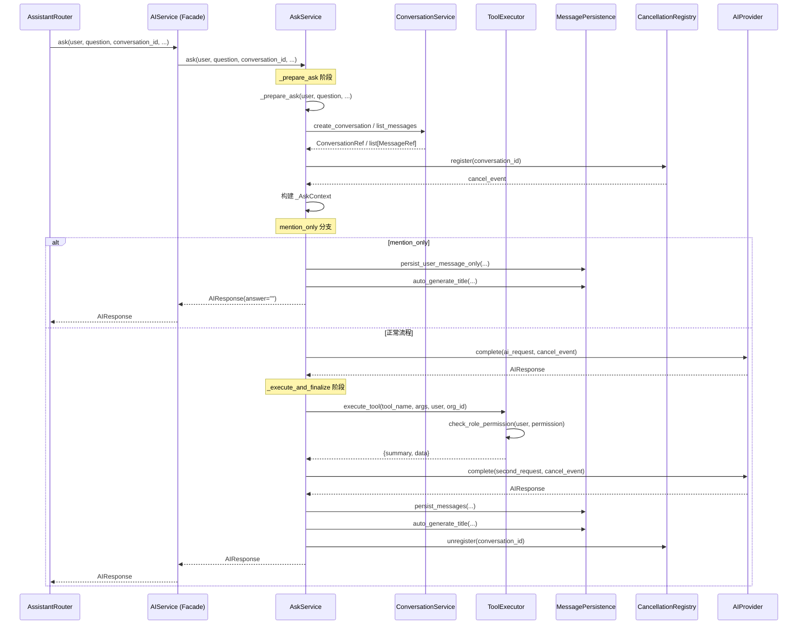
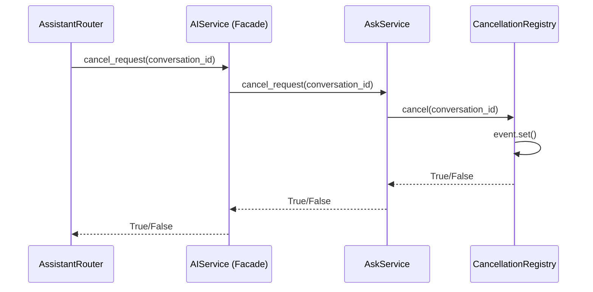
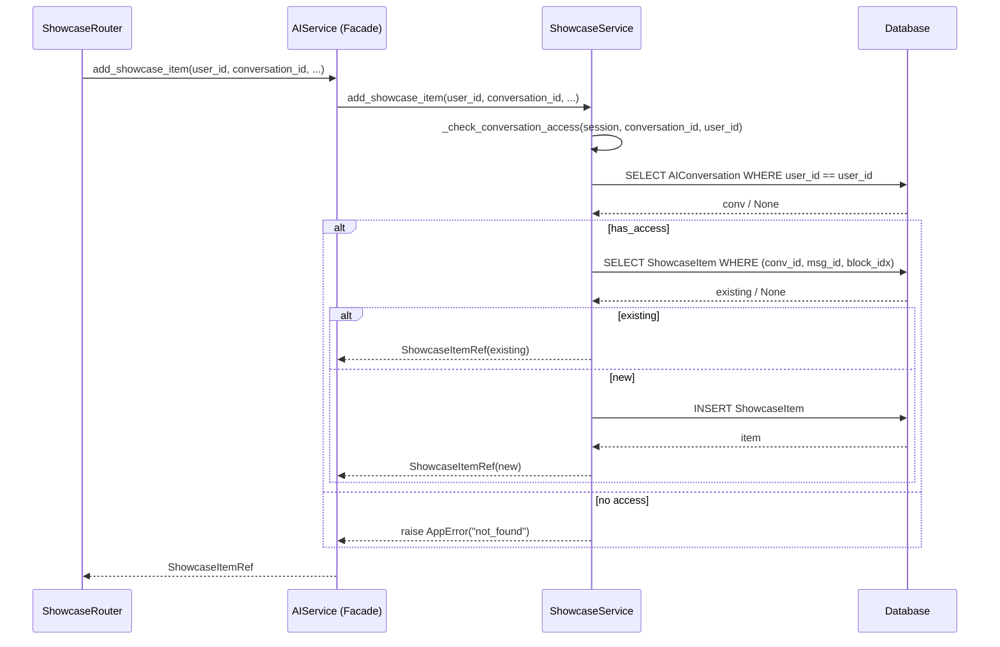
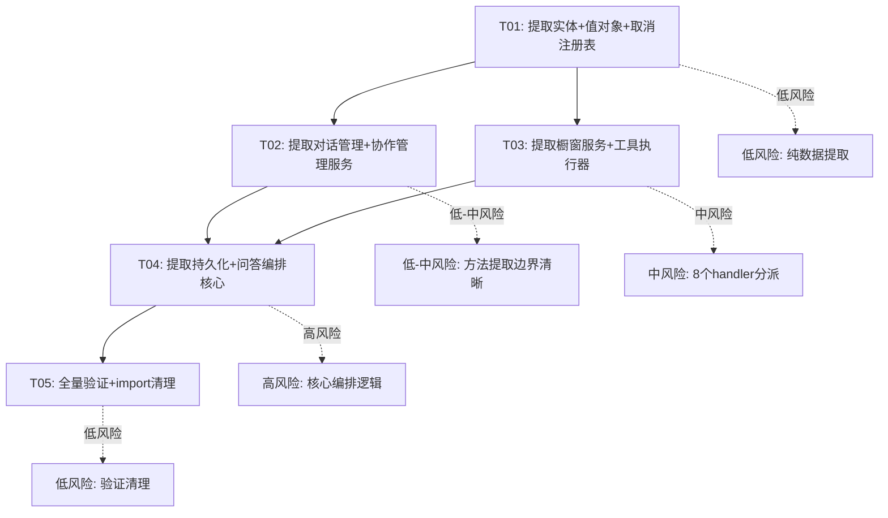

# AI Service 拆分系统设计

> **模块**: `packages/ai/service.py` (3025 行) → 6+2 模块拆分
> **约束**: 纯重构，不改变任何业务行为，保持所有现有测试通过
> **策略**: 低风险先行 — entities → 纯函数/独立服务 → 核心拆分

---

## Part A: System Design

### 1. Implementation Approach

#### 1.1 核心技术挑战

| 挑战 | 描述 | 方案 |
|------|------|------|
| **模块级可变全局状态** | `_active_requests: dict[UUID, asyncio.Event]` 被 `cancel_request`、`_prepare_ask`、`ask`/`stream_ask` 共同读写，是并发安全隐患 | 封装为 `CancellationRegistry` 类，通过实例化注入，消除模块级可变状态 |
| **`AppUser` 循环依赖** | `packages.auth.entities.AppUser` 被 6 处内联 import 引用，顶部 import 会触发循环导入 | 保持各子服务内部延迟 import，与原始代码行为一致 |
| **`_AskContext` 数据契约** | `_prepare_ask` → `_AskContext` → `ask`/`stream_ask`/`_execute_and_finalize` 共享，跨方法传递 | 定义在 `AskService` 所在模块，作为内部 dataclass |
| **`_provider._thinking_enabled` 直接访问** | `_prepare_ask` 和 `_execute_and_finalize` 直接读写 provider 私有属性 | 原样保持，不引入额外抽象（纯重构约束） |
| **向后兼容** | `AIService` 被 4 个路由文件 + 3 个测试文件 + 2 个基础设施文件引用 | `AIService` 保持为门面（facade），内部组合子服务，公开 API 签名不变 |

#### 1.2 架构模式

采用 **Facade + Composition** 模式：
- `AIService` 保持原有 `__init__` 签名和所有公开方法签名，作为门面
- 内部按职责拆分为 6 个子服务 + 1 个注册表 + 1 个实体模块
- 子服务通过构造函数注入依赖，`AIService.__init__` 负责组装

#### 1.3 拆分原则

1. **每个子服务对应一个职责簇**，簇间不互相调用（除 `AskService` 编排其他服务）
2. **实体/值对象先行提取**，降低后续拆分的 diff 噪音
3. **每步拆分可独立验证** — 运行 `pytest tests/` 全量通过
4. **import 兼容** — `service.py` 重新导出所有移出的符号，外部 `from packages.ai.service import X` 不受影响

---

### 2. File List

#### 新建文件

| 文件路径 | 职责 | 来源行范围 |
|----------|------|------------|
| `packages/ai/entities.py` | ORM 实体 + 值对象 | service.py L48-185 |
| `packages/ai/cancellation.py` | 取消注册表 | service.py L188-190 |
| `packages/ai/conversation_service.py` | 对话管理服务 | service.py L282-657 |
| `packages/ai/collaboration_service.py` | 协作管理服务 | service.py L661-1239 |
| `packages/ai/showcase_service.py` | 橱窗卡片服务 | service.py L1241-1690 |
| `packages/ai/tool_executor.py` | 工具执行器 | service.py L2337-2715 |
| `packages/ai/persistence.py` | 消息持久化 | service.py L2717-2976 |
| `packages/ai/ask_service.py` | 问答编排核心 | service.py L1694-2333, L2978-3025 |

#### 修改文件

| 文件路径 | 修改内容 |
|----------|----------|
| `packages/ai/service.py` | 改为门面类，删除实体/方法定义，重新导出符号 |
| `packages/ai/__init__.py` | 无需修改（当前为空 docstring） |

#### 不修改但受影响的文件（通过 re-export 保持兼容）

| 文件路径 | 引用方式 | 兼容策略 |
|----------|----------|----------|
| `apps/api/routers/assistant.py` | `from packages.ai.service import AIService` | service.py re-export AIService |
| `apps/api/routers/collaboration.py` | `from packages.ai.service import AIService` | 同上 |
| `apps/api/routers/showcase.py` | 复用 assistant.py 的 AIServiceDep | 同上 |
| `apps/api/composition/ai.py` | `from packages.ai.service import AIService` | 同上 |
| `migrations/env.py` | `import packages.ai.service` (模型注册) | service.py re-export AIConversation, AIMessage |
| `tests/conftest.py` | `import packages.ai.service` (模型注册) | 同上 |
| `tests/unit/test_dept_tenant_upgrade.py` | `import packages.ai.service` | 同上 |
| `tests/unit/ai/test_tool_management.py` | `from packages.ai.service import AIService` | 同上 |
| `tests/integration/ai/test_collaboration_service.py` | `from packages.ai.service import AIService` | 同上 |

---

### 3. Data Structures and Interfaces

```mermaid
classDiagram
    class AIConversation {
        +UUID id
        +UUID user_id
        +str title
        +str provider_mode
        +bool pinned
        +bool archived
        +str|None system_context
        +datetime created_at
        +datetime updated_at
    }

    class AIMessage {
        +UUID id
        +UUID conversation_id
        +str role
        +str content
        +list tool_calls_json
        +list citations_json
        +list mentions
        +UUID|None sender_user_id
        +str|None sender_display_name
        +str|None sender_avatar_url
        +str|None uncertainty
        +datetime created_at
    }

    class ConversationRef {
        +UUID id
        +str title
        +str provider_mode
        +bool pinned
        +bool archived
        +datetime created_at
        +datetime updated_at
        +str|None system_context
        +UUID user_id
        +list~dict~ participants
    }

    class MessageRef {
        +UUID id
        +UUID conversation_id
        +str role
        +str content
        +list~dict~ tool_calls
        +list~dict~ citations
        +str|None uncertainty
        +datetime created_at
        +list~str~ mentions
        +UUID|None sender_user_id
        +str|None sender_display_name
        +str|None sender_avatar_url
    }

    class CancellationRegistry {
        -_active: dict~UUID, asyncio.Event~
        +register(conversation_id: UUID) asyncio.Event
        +cancel(conversation_id: UUID) bool
        +unregister(conversation_id: UUID) void
        +get(conversation_id: UUID) asyncio.Event|None
    }

    class ConversationService {
        -_factory: async_sessionmaker
        -_clock: Clock
        +create_conversation(user_id, department_id, title, provider_mode) ConversationRef
        +list_conversations(user_id, department_id, limit, include_archived, archived_only) list~ConversationRef~
        +toggle_pin(conversation_id, user_id, pinned) bool
        +toggle_archive(conversation_id, user_id, archived) bool
        +delete_conversation(conversation_id, user_id) None
        +list_messages(conversation_id, user_id) list~MessageRef~
        +search_conversations(user_id, department_id, keyword, ...) list~ConversationRef~
    }

    class CollaborationService {
        -_factory: async_sessionmaker
        -_clock: Clock
        +list_conversations_with_tab(user_id, department_id, tab, ...) list~ConversationRef~
        +add_participant(conversation_id, inviter_user_id, target_user_id) ParticipantRef
        +remove_participant(conversation_id, owner_user_id, target_user_id) None
        +leave_conversation(conversation_id, user_id) None
        +list_participants(conversation_id, user_id) list~ParticipantRef~
        +list_mentionable_users(user_id, department_id, roles) list~MentionableUserRef~
    }

    class ShowcaseService {
        -_factory: async_sessionmaker
        -_clock: Clock
        -_check_conversation_access(session, conversation_id, user_id) bool
        +add_showcase_item(user_id, conversation_id, ...) ShowcaseItemRef
        +list_showcase_items(conversation_id, user_id) list~ShowcaseItemRef~
        +update_showcase_item(item_id, user_id, title) ShowcaseItemRef
        +delete_showcase_item(item_id, user_id) None
        +reorder_showcase_items(conversation_id, user_id, item_ids) None
        +generate_summary(conversation_id, user_id) tuple~str, int~
    }

    class ToolExecutor {
        -_tool_registry: ToolRegistry
        -_fact_service: Any
        -_parameter_service: Any
        -_model_service: Any
        -_provenance_service: Any
        -_factory: async_sessionmaker
        +check_role_permission(user, action) bool
        +build_tool_schemas() tuple~dict~
        +execute_tool(tool_name, args, user, org_id) dict
        -_handle_search_facts(args, org_id) dict
        -_handle_search_standards(args, org_id) dict
        -_handle_search_parameters(args, org_id) dict
        -_handle_explain_provenance(args, org_id) dict
        -_handle_compare_experiments(args, org_id) dict
        -_handle_run_model(args, user, org_id) dict
        -_handle_draft_report(args, org_id) dict
        -_handle_extract_data(args, org_id) dict
    }

    class MessagePersistence {
        -_factory: async_sessionmaker
        -_clock: Clock
        -_provider: AIProvider
        +redact_credentials(text) str
        +persist_user_message_only(conversation_id, user_id, question, mentions, ...) None
        +persist_messages(conversation_id, user_id, question, response, mentions, ...) None
        +auto_generate_title(conversation_id, question, answer) None
    }

    class _AskContext {
        +UUID user_id
        +UUID org_id
        +UUID conversation_id
        +str question
        +list history_messages
        +list msg_list
        +dict user_context
        +tuple tool_names
        +tuple tool_schemas
        +AIRequest ai_request
        +asyncio.Event cancel_event
        +list mentions
        +bool thinking_enabled
        +str provider_name
        +bool mention_only
    }

    class AskService {
        -_provider: AIProvider
        -_tool_registry: ToolRegistry
        -_tool_executor: ToolExecutor
        -_persistence: MessagePersistence
        -_conversation_svc: ConversationService
        -_cancellation: CancellationRegistry
        -_factory: async_sessionmaker
        -_clock: Clock
        +ask(user, question, conversation_id, ...) AIResponse
        +stream_ask(user, question, conversation_id, ...) AsyncIterator~dict~
        -_prepare_ask(user, question, ...) _AskContext
        -_execute_and_finalize(response, ctx, user) AIResponse
        +cancel_request(conversation_id) bool
        +reload_tools() None
        +get_provider_status() dict
    }

    class AIService {
        -_cancellation: CancellationRegistry
        -_conversation_svc: ConversationService
        -_collaboration_svc: CollaborationService
        -_showcase_svc: ShowcaseService
        -_tool_executor: ToolExecutor
        -_persistence: MessagePersistence
        -_ask_svc: AskService
        -_provider: AIProvider
        -_tool_registry: ToolRegistry
        -_factory: async_sessionmaker
        -_clock: Clock
        +__init__(provider, tool_registry, fact_service, ...) None
        +create_conversation(...) ConversationRef
        +list_conversations(...) list~ConversationRef~
        +ask(...) AIResponse
        +stream_ask(...) AsyncIterator
        +cancel_request(...) bool
        +... (all public methods as delegates)
    }

    AIConversation <.. AIService : manages (via sub-services)
    AIMessage <.. AIService : manages (via sub-services)
    ConversationRef <.. ConversationService : returns
    MessageRef <.. ConversationService : returns
    CancellationRegistry <-- AskService : uses
    ConversationService <-- AskService : delegates create/list
    ToolExecutor <-- AskService : delegates tool exec
    MessagePersistence <-- AskService : delegates persist
    ConversationService <-- AIService : delegates
    CollaborationService <-- AIService : delegates
    ShowcaseService <-- AIService : delegates
    AskService <-- AIService : delegates
    CancellationRegistry <-- AIService : owns
    _AskContext <.. AskService : internal data contract
```



---

### 4. Program Call Flow

#### 4.1 `ask()` 调用流程（拆分后）



#### 4.2 `cancel_request()` 调用流程（拆分后）



#### 4.3 橱窗卡片 `add_showcase_item()` 调用流程（拆分后）



---

### 5. Anything UNCLEAR

#### 5.1 已确认的假设

| # | 假设 | 依据 |
|---|------|------|
| A1 | `_provider._thinking_enabled` 的直接属性访问在拆分后保持不变 | 纯重构约束，引入抽象会改变行为 |
| A2 | `AppUser` 的延迟 import 在各子服务内保持为函数内局部 import | 避免 `packages.ai` → `packages.auth` 的循环依赖 |
| A3 | `AIService.__init__` 签名保持不变（参数列表完全一致） | 外部 composition/ai.py 和测试文件直接构造 AIService |
| A4 | `service.py` 重新导出所有移出的符号（`AIConversation`, `AIMessage`, `ConversationRef`, `MessageRef`） | migrations/env.py 和 conftest.py 通过 `import packages.ai.service` 注册 ORM 模型 |
| A5 | `_AskContext` 定义在 `ask_service.py` 模块内，不单独提取 | 仅为 `AskService` 内部使用，无外部引用 |

#### 5.2 待明确事项

| # | 问题 | 影响 | 建议 |
|---|------|------|------|
| Q1 | `ToolExecutor` 是否需要 `session_factory`？`_handle_search_facts` 和 `_handle_draft_report` 中有直接 SQL 查询使用 `scoped_session(self._factory, ...)` | ToolExecutor 依赖列表 | 需要，传入 `session_factory` |
| Q2 | `MessagePersistence.auto_generate_title` 读取 `self._provider._api_key/_base_url/_model`，是否应传入 provider？ | MessagePersistence 依赖列表 | 是，传入 provider 引用 |
| Q3 | `AskService._prepare_ask` 调用 `self.create_conversation` 和 `self.list_messages`，这些方法在 `ConversationService` 上。是否通过注入 `ConversationService` 实例？ | AskService 依赖列表 | 是，注入 ConversationService |
| Q4 | `ShowcaseService._check_conversation_access` 查询 `AIConversation` 和 `ConversationParticipant`，与 `ConversationService.list_messages` 的权限检查逻辑重复。是否提取为共享 helper？ | 代码重复 vs 纯重构约束 | **不提取** — 纯重构不改变逻辑结构，保持各自独立 |
| Q5 | `AIService` facade 的方法委托是否有性能影响（多一层方法调用）？ | 性能 | Python 方法调用开销 ~100ns，AI 请求为秒级，可忽略 |

---

## Part B: Task Decomposition

### 6. Required Packages

本项目无新增第三方依赖。所有拆分使用 Python 标准库 + 现有项目依赖：

```
# 现有依赖（无变化）
- sqlalchemy>=2.0: ORM + 异步会话
- asyncpg: PostgreSQL 异步驱动
- httpx: _auto_generate_title 中的 HTTP 调用
- pydantic: 路由层模型（不涉及本次拆分）
```

---

### 7. Task List (ordered by dependency)

#### T01: 提取实体、值对象和取消注册表

**Task ID**: T01
**Task Name**: 提取 ORM 实体、值对象和取消注册表到独立模块
**Source Files**:
- `packages/ai/entities.py` (新建) — AIConversation, AIMessage, ConversationRef, MessageRef
- `packages/ai/cancellation.py` (新建) — CancellationRegistry
- `packages/ai/service.py` (修改) — 删除上述定义，改为 re-export，`AIService.__init__` 内部创建 `CancellationRegistry` 实例

**具体内容**:
1. 将 `service.py` L48-185 的 `AIConversation`, `AIMessage`, `ConversationRef`, `MessageRef` 原样移至 `entities.py`，补全 import
2. 将 `service.py` L188-190 的 `_active_requests` 封装为 `CancellationRegistry`：
   ```python
   class CancellationRegistry:
       def __init__(self) -> None:
           self._active: dict[UUID, asyncio.Event] = {}
       def register(self, conversation_id: UUID) -> asyncio.Event:
           event = asyncio.Event()
           self._active[conversation_id] = event
           return event
       def cancel(self, conversation_id: UUID) -> bool:
           event = self._active.get(conversation_id)
           if event is not None:
               event.set()
               return True
           return False
       def unregister(self, conversation_id: UUID) -> None:
           self._active.pop(conversation_id, None)
       def get(self, conversation_id: UUID) -> asyncio.Event | None:
           return self._active.get(conversation_id)
   ```
3. `service.py` 顶部改为 `from packages.ai.entities import AIConversation, AIMessage, ConversationRef, MessageRef` 和 `from packages.ai.cancellation import CancellationRegistry`
4. `service.py` 末尾添加 `__all__` 或通过 re-export 保持 `from packages.ai.service import AIConversation` 兼容
5. `AIService.__init__` 中创建 `self._cancellation = CancellationRegistry()`
6. 所有原 `_active_requests[...]` 操作改为 `self._cancellation.register/unregister/get/cancel`

**Dependencies**: 无
**Priority**: P0
**Risk**: 低 — 纯数据/类定义提取，无逻辑变更
**Verification**:
```bash
# 1. import 检查
python -c "from packages.ai.service import AIService, AIConversation, AIMessage, ConversationRef, MessageRef"
python -c "from packages.ai.entities import AIConversation, AIMessage, ConversationRef, MessageRef"
python -c "from packages.ai.cancellation import CancellationRegistry"
# 2. 模型注册检查
python -c "import packages.ai.service; from packages.common.database import Base; print('ai_conversation' in Base.metadata.tables)"
# 3. 全量测试
pytest tests/ -x -q
```

---

#### T02: 提取对话管理服务和协作管理服务

**Task ID**: T02
**Task Name**: 提取 ConversationService 和 CollaborationService 到独立模块
**Source Files**:
- `packages/ai/conversation_service.py` (新建) — ConversationService 类
- `packages/ai/collaboration_service.py` (新建) — CollaborationService 类
- `packages/ai/service.py` (修改) — AIService 内部创建子服务实例，公开方法委托

**具体内容**:
1. **`conversation_service.py`**:
   - 移入方法: `create_conversation`, `list_conversations`, `toggle_pin`, `toggle_archive`, `delete_conversation`, `list_messages`, `search_conversations` (service.py L282-657)
   - 构造函数: `__init__(self, session_factory, clock)`
   - import: `from packages.ai.entities import AIConversation, AIMessage, ConversationRef, MessageRef`
   - import: `from packages.ai.collaboration_entities import ConversationParticipant`
   - `list_messages` 中的 `ConversationParticipant` 查询保持不变

2. **`collaboration_service.py`**:
   - 移入方法: `list_conversations_with_tab`, `add_participant`, `remove_participant`, `leave_conversation`, `list_participants`, `list_mentionable_users` (service.py L661-1239)
   - 构造函数: `__init__(self, session_factory, clock)`
   - import: `from packages.ai.entities import AIConversation, AIMessage, ConversationRef`
   - import: `from packages.ai.collaboration_entities import ConversationParticipant, ParticipantRef, MentionableUserRef`
   - **保持 `from packages.auth.entities import AppUser` 为函数内延迟 import**（6 处）

3. **`service.py`** 修改:
   - `AIService.__init__` 中创建:
     ```python
     self._conversation_svc = ConversationService(self._factory, self._clock)
     self._collaboration_svc = CollaborationService(self._factory, self._clock)
     ```
   - 公开方法委托:
     ```python
     async def create_conversation(self, user_id, department_id, title="", provider_mode="offline"):
         return await self._conversation_svc.create_conversation(user_id, department_id, title, provider_mode)
     # ... 其余方法同理
     ```

**Dependencies**: T01
**Priority**: P0
**Risk**: 低-中 — 方法提取边界清晰，但 `list_messages` 引用 `ConversationParticipant` 需确认 import
**Verification**:
```bash
pytest tests/integration/ai/test_collaboration_service.py -x -v
pytest tests/unit/ai/ -x -q
pytest tests/ -x -q
```

---

#### T03: 提取橱窗服务和工具执行器

**Task ID**: T03
**Task Name**: 提取 ShowcaseService 和 ToolExecutor 到独立模块
**Source Files**:
- `packages/ai/showcase_service.py` (新建) — ShowcaseService 类
- `packages/ai/tool_executor.py` (新建) — ToolExecutor 类
- `packages/ai/service.py` (修改) — AIService 内部创建子服务实例，公开方法委托

**具体内容**:
1. **`showcase_service.py`**:
   - 移入方法: `_check_conversation_access`, `add_showcase_item`, `list_showcase_items`, `update_showcase_item`, `delete_showcase_item`, `reorder_showcase_items`, `generate_summary` (service.py L1241-1690)
   - 构造函数: `__init__(self, session_factory, clock)`
   - import: `from packages.ai.entities import AIConversation`
   - import: `from packages.ai.collaboration_entities import ConversationParticipant`
   - import: `from packages.ai.showcase_entities import ShowcaseItem, ShowcaseItemRef`
   - `_check_conversation_access` 保持为实例方法（被 5 个 showcase 方法调用）

2. **`tool_executor.py`**:
   - 移入方法: `check_role_permission`, `build_tool_schemas`, `execute_tool`, `_handle_search_facts`, `_handle_search_standards`, `_handle_search_parameters`, `_handle_explain_provenance`, `_handle_compare_experiments`, `_handle_run_model`, `_handle_draft_report`, `_handle_extract_data` (service.py L2337-2715)
   - 构造函数: `__init__(self, tool_registry, fact_service, parameter_service, model_service, provenance_service, session_factory)`
   - import: `from packages.ai.tools import ToolRegistry`
   - import: `from packages.auth.permissions import BUILTIN_ROLES` (延迟 import，保持原样)
   - import: `from packages.common.database import scoped_session`
   - 注意: `_handle_*` 方法的参数签名保持不变，`execute_tool` 的分派 if-elif 逻辑保持不变
   - 方法名从 `_execute_tool` → `execute_tool`（去掉下划线，因为不再是 AIService 的内部方法），`_check_role_permission` → `check_role_permission`，`_build_tool_schemas` → `build_tool_schemas`

3. **`service.py`** 修改:
   - `AIService.__init__` 中创建:
     ```python
     self._tool_executor = ToolExecutor(
         tool_registry=tool_registry,
         fact_service=fact_service,
         parameter_service=parameter_service,
         model_service=model_service,
         provenance_service=provenance_service,
         session_factory=session_factory,
     )
     self._showcase_svc = ShowcaseService(self._factory, self._clock)
     ```
   - 公开方法委托（showcase 方法 + `get_provider_status`/`reload_tools` 中对 `build_tool_schemas` 的调用）

**Dependencies**: T01
**Priority**: P1
**Risk**: 中 — 工具执行器有 8 个 handler 方法和复杂的分派逻辑，但各 handler 相互独立
**Verification**:
```bash
pytest tests/unit/ai/test_tool_management.py -x -v
pytest tests/ -x -q
```

---

#### T04: 提取持久化服务和问答编排核心

**Task ID**: T04
**Task Name**: 提取 MessagePersistence 和 AskService 到独立模块，完成 AIService 门面化
**Source Files**:
- `packages/ai/persistence.py` (新建) — MessagePersistence 类
- `packages/ai/ask_service.py` (新建) — AskService 类 + _AskContext
- `packages/ai/service.py` (修改) — 最终门面化，删除所有已移出的方法体

**具体内容**:
1. **`persistence.py`**:
   - 移入方法: `redact_credentials`, `persist_user_message_only`, `persist_messages`, `auto_generate_title` (service.py L2717-2976)
   - 构造函数: `__init__(self, session_factory, clock, provider)`
   - import: `from packages.ai.entities import AIConversation, AIMessage`
   - import: `from packages.ai.providers import AIResponse`
   - import: `from packages.ai.citation import CitationGenerator, SignedCitation`
   - import: `from packages.ai.citations import Citation`
   - **保持 `from packages.auth.entities import AppUser` 为函数内延迟 import**（2 处）
   - **保持 `from packages.common.safe_http import SafeHTTPClient` 为函数内延迟 import**（1 处）
   - 方法名: `_redact_credentials` → `redact_credentials`, `_persist_user_message_only` → `persist_user_message_only`, `_persist_messages` → `persist_messages`, `_auto_generate_title` → `auto_generate_title`
   - `auto_generate_title` 读取 `self._provider._api_key/_base_url/_model` — 保持不变

2. **`ask_service.py`**:
   - 移入 `_AskContext` dataclass (service.py L193-215)
   - 移入方法: `_prepare_ask`, `_execute_and_finalize`, `ask`, `stream_ask`, `cancel_request`, `reload_tools`, `get_provider_status` (service.py L1694-2333, L2978-3025)
   - 构造函数:
     ```python
     def __init__(self, provider, tool_registry, tool_executor, persistence,
                  conversation_service, cancellation_registry,
                  session_factory, clock):
         self._provider = provider
         self._tool_registry = tool_registry
         self._tool_executor = tool_executor
         self._persistence = persistence
         self._conversation_svc = conversation_service
         self._cancellation = cancellation_registry
         self._factory = session_factory
         self._clock = clock
     ```
   - import: `from packages.ai.entities import AIConversation, AIMessage`
   - import: `from packages.ai.collaboration_entities import ConversationParticipant`
   - import: `from packages.ai.providers import AIProvider, AIRequest, AIResponse`
   - import: `from packages.ai.citation import CitationGenerator, SignedCitation`
   - import: `from packages.ai.cancellation import CancellationRegistry`
   - import: `from packages.ai.conversation_service import ConversationService`
   - import: `from packages.ai.tool_executor import ToolExecutor`
   - import: `from packages.ai.persistence import MessagePersistence`
   - `_prepare_ask` 中的 `self.create_conversation` → `self._conversation_svc.create_conversation`
   - `_prepare_ask` 中的 `self.list_messages` → `self._conversation_svc.list_messages`
   - `_prepare_ask` 中的 `self._build_tool_schemas` → `self._tool_executor.build_tool_schemas`
   - `_execute_and_finalize` 中的 `self._check_role_permission` → `self._tool_executor.check_role_permission`
   - `_execute_and_finalize` 中的 `self._execute_tool` → `self._tool_executor.execute_tool`
   - `_execute_and_finalize` 中的 `self._redact_credentials` → `self._persistence.redact_credentials`
   - `_execute_and_finalize` 中的 `self._persist_messages` → `self._persistence.persist_messages`
   - `_execute_and_finalize` 中的 `self._auto_generate_title` → `self._persistence.auto_generate_title`
   - `ask`/`stream_ask` 中的 `self._persist_user_message_only` → `self._persistence.persist_user_message_only`
   - `ask`/`stream_ask` 中的 `self._persist_messages` → `self._persistence.persist_messages`
   - `ask`/`stream_ask` 中的 `self._auto_generate_title` → `self._persistence.auto_generate_title`
   - `ask`/`stream_ask` 中的 `_active_requests.pop(...)` → `self._cancellation.unregister(...)`
   - `_prepare_ask` 中的 `_active_requests[conversation_id] = cancel_event` → `self._cancellation.register(conversation_id)`
   - `cancel_request` 中的 `_active_requests.get(...)` → `self._cancellation.cancel(...)`
   - `get_provider_status` 中的 `self._tool_registry.list_enabled_tools()` 保持不变
   - `reload_tools` 中的 `self._tool_registry.reload_from_db(session)` 保持不变
   - **`_provider._thinking_enabled` 直接访问保持不变**

3. **`service.py`** 最终门面化:
   - `AIService.__init__` 中创建:
     ```python
     self._cancellation = CancellationRegistry()
     self._conversation_svc = ConversationService(self._factory, self._clock)
     self._collaboration_svc = CollaborationService(self._factory, self._clock)
     self._showcase_svc = ShowcaseService(self._factory, self._clock)
     self._tool_executor = ToolExecutor(
         tool_registry=tool_registry,
         fact_service=fact_service,
         parameter_service=parameter_service,
         model_service=model_service,
         provenance_service=provenance_service,
         session_factory=session_factory,
     )
     self._persistence = MessagePersistence(self._factory, self._clock, provider)
     self._ask_svc = AskService(
         provider=provider,
         tool_registry=tool_registry,
         tool_executor=self._tool_executor,
         persistence=self._persistence,
         conversation_service=self._conversation_svc,
         cancellation_registry=self._cancellation,
         session_factory=session_factory,
         clock=clock or SystemClock(),
     )
     ```
   - 所有公开方法委托到对应子服务
   - 删除所有已移出的方法体

**Dependencies**: T01, T02, T03
**Priority**: P0
**Risk**: 高 — 问答编排是最核心的逻辑，涉及 `_AskContext` 共享、`_active_requests` 全局状态替换、多服务协作
**Verification**:
```bash
# 1. 单元测试
pytest tests/unit/ai/ -x -v
# 2. 集成测试（重点）
pytest tests/integration/ai/ -x -v
# 3. 全量测试
pytest tests/ -x -q
# 4. import 兼容检查
python -c "from packages.ai.service import AIService, AIConversation, AIMessage, ConversationRef, MessageRef; print('OK')"
python -c "import packages.ai.service; print('model registration OK')"
```

---

#### T05: 全量验证、import 清理和文档更新

**Task ID**: T05
**Task Name**: 全量测试验证、import 清理和 __init__.py 更新
**Source Files**:
- `packages/ai/service.py` (修改) — 最终清理，确认无残留代码
- `packages/ai/__init__.py` (修改) — 可选添加 `__all__` 声明
- `migrations/env.py` (验证) — 确认 `import packages.ai.service` 仍注册模型
- `tests/conftest.py` (验证) — 同上
- `tests/unit/test_dept_tenant_upgrade.py` (验证) — 同上

**具体内容**:
1. 检查 `service.py` 是否仍有未清理的残留 import（移出后不再使用的 import）
2. 确认 `service.py` re-export 所有外部需要的符号:
   ```python
   from packages.ai.entities import AIConversation, AIMessage, ConversationRef, MessageRef  # noqa: F401
   from packages.ai.cancellation import CancellationRegistry  # noqa: F401
   from packages.ai.conversation_service import ConversationService  # noqa: F401
   from packages.ai.collaboration_service import CollaborationService  # noqa: F401
   from packages.ai.showcase_service import ShowcaseService  # noqa: F401
   from packages.ai.tool_executor import ToolExecutor  # noqa: F401
   from packages.ai.persistence import MessagePersistence  # noqa: F401
   from packages.ai.ask_service import AskService  # noqa: F401
   ```
3. 确认 `migrations/env.py` 中 `import packages.ai.service` 仍能正确注册 `ai_conversation` 和 `ai_message` 表到 `Base.metadata`
4. 确认所有测试文件的 `from packages.ai.service import AIService` 仍正常工作
5. 运行全量测试 + mypy 类型检查（如有）
6. 检查 `AIService.__init__` 参数签名与原始完全一致

**Dependencies**: T01, T02, T03, T04
**Priority**: P0
**Risk**: 低 — 验证和清理工作
**Verification**:
```bash
# 全量测试
pytest tests/ -x -q
# import 兼容性检查
python -c "
from packages.ai.service import (
    AIService, AIConversation, AIMessage,
    ConversationRef, MessageRef
)
print('All imports OK')
"
# 模型注册检查
python -c "
import packages.ai.service
from packages.common.database import Base
assert 'ai_conversation' in Base.metadata.tables
assert 'ai_message' in Base.metadata.tables
print('Model registration OK')
"
# 构造函数签名检查
python -c "
import inspect
from packages.ai.service import AIService
sig = inspect.signature(AIService.__init__)
params = list(sig.parameters.keys())
expected = ['self', 'provider', 'tool_registry', 'fact_service', 'parameter_service',
            'model_service', 'provenance_service', 'auth_service', 'session_factory', 'clock']
assert params == expected, f'Signature mismatch: {params}'
print('Constructor signature OK')
"
```

---

### 8. Shared Knowledge

#### 8.1 跨文件约定

```
# _AskContext 定义位置
packages/ai/ask_service.py — _AskContext 是 AskService 的内部 dataclass，不对外暴露

# ORM 模型注册
所有 ORM 模型（AIConversation, AIMessage）定义在 packages/ai/entities.py，
通过 service.py re-export 保持 migrations/env.py 和 conftest.py 的模型注册兼容

# CancellationRegistry 实例化
CancellationRegistry 在 AIService.__init__ 中创建一次，注入到 AskService。
不使用模块级单例，避免全局可变状态。

# 子服务依赖注入
AIService.__init__ 负责创建所有子服务实例并注入依赖。
子服务之间不直接引用彼此（AskService 例外，它编排其他服务）。

# _check_conversation_access
ShowcaseService 内部的 _check_conversation_access 不提取为共享方法。
ConversationService.list_messages 有自己的权限检查逻辑（不同实现），保持独立。
```

#### 8.2 Import 规范

```
# 顶部 import（无循环依赖风险）
- packages.ai.entities → AIConversation, AIMessage, ConversationRef, MessageRef
- packages.ai.collaboration_entities → ConversationParticipant, ParticipantRef, MentionableUserRef
- packages.ai.showcase_entities → ShowcaseItem, ShowcaseItemRef
- packages.ai.providers → AIProvider, AIRequest, AIResponse
- packages.ai.tools → ToolRegistry
- packages.common.database → Base, scoped_session
- packages.common.db_types → GUID, UTCDateTime
- packages.common.errors → AppError
- packages.common.ids → new_id
- packages.common.clock → Clock, SystemClock
- packages.ai.citation → CitationGenerator, SignedCitation
- packages.ai.citations → Citation

# 延迟 import（循环依赖规避，保持原样）
- packages.auth.entities.AppUser → 6 处函数内局部 import
  (collaboration_service.py: list_conversations_with_tab, add_participant,
   list_participants, list_mentionable_users; persistence.py: persist_user_message_only,
   persist_messages)
- packages.auth.permissions.BUILTIN_ROLES → 1 处函数内局部 import
  (tool_executor.py: check_role_permission)
- packages.common.safe_http.SafeHTTPClient → 1 处函数内局部 import
  (persistence.py: auto_generate_title)
```

#### 8.3 方法重命名规范

```
# 从 AIService 内部方法（_前缀）变为子服务公开方法（无_前缀）
AIService._execute_tool       → ToolExecutor.execute_tool
AIService._check_role_permission → ToolExecutor.check_role_permission
AIService._build_tool_schemas → ToolExecutor.build_tool_schemas
AIService._redact_credentials  → MessagePersistence.redact_credentials
AIService._persist_user_message_only → MessagePersistence.persist_user_message_only
AIService._persist_messages    → MessagePersistence.persist_messages
AIService._auto_generate_title → MessagePersistence.auto_generate_title
AIService._prepare_ask         → AskService._prepare_ask (保持内部)
AIService._execute_and_finalize → AskService._execute_and_finalize (保持内部)

# _handle_* 方法保持 _ 前缀（ToolExecutor 内部方法）
ToolExecutor._handle_search_facts, _handle_search_standards, ... (不变)
```

#### 8.4 AIService 门面内部方法兼容委托（重要）

测试文件 `tests/unit/ai/test_tool_management.py` 直接通过 AIService 实例调用
`service._build_tool_schemas()`（L315, L343）。为保持测试不变，AIService 门面
**必须保留这些内部方法名作为委托方法**：

```python
# AIService 门面上的兼容委托方法（保持 _ 前缀，委托到子服务）
def _build_tool_schemas(self) -> tuple[dict[str, Any], ...]:
    """委托到 ToolExecutor.build_tool_schemas()（向后兼容）。"""
    return self._tool_executor.build_tool_schemas()

def _check_role_permission(self, user: Any, action: str) -> bool:
    """委托到 ToolExecutor.check_role_permission()（向后兼容）。"""
    return self._tool_executor.check_role_permission(user, action)

async def _execute_tool(self, tool_name: str, args: dict, user: Any, org_id: UUID) -> dict:
    """委托到 ToolExecutor.execute_tool()（向后兼容）。"""
    return await self._tool_executor.execute_tool(tool_name, args, user, org_id)

def _redact_credentials(self, text: str) -> str:
    """委托到 MessagePersistence.redact_credentials()（向后兼容）。"""
    return self._persistence.redact_credentials(text)

async def _persist_user_message_only(self, *args, **kwargs) -> None:
    """委托到 MessagePersistence.persist_user_message_only()（向后兼容）。"""
    await self._persistence.persist_user_message_only(*args, **kwargs)

async def _persist_messages(self, *args, **kwargs) -> None:
    """委托到 MessagePersistence.persist_messages()（向后兼容）。"""
    await self._persistence.persist_messages(*args, **kwargs)

async def _auto_generate_title(self, *args, **kwargs) -> None:
    """委托到 MessagePersistence.auto_generate_title()（向后兼容）。"""
    await self._persistence.auto_generate_title(*args, **kwargs)
```

这些委托方法仅在 AIService 门面上保留，子服务使用无 `_` 前缀的公开方法名。

---

### 9. Task Dependency Graph



---

### 10. 拆分后文件依赖关系（Mermaid）

```mermaid
graph TD
    subgraph "packages/ai/"
    entities[entities.py<br/>AIConversation, AIMessage<br/>ConversationRef, MessageRef]
    cancellation[cancellation.py<br/>CancellationRegistry]
    conv_svc[conversation_service.py<br/>ConversationService]
    collab_svc[collaboration_service.py<br/>CollaborationService]
    showcase_svc[showcase_service.py<br/>ShowcaseService]
    tool_exec[tool_executor.py<br/>ToolExecutor]
    persistence[persistence.py<br/>MessagePersistence]
    ask_svc[ask_service.py<br/>AskService + _AskContext]
    service[service.py<br/>AIService Facade]
    end

    subgraph "packages/ai/ (已有)"
    providers[providers.py<br/>AIProvider, AIRequest, AIResponse]
    tools[tools.py<br/>ToolRegistry]
    collab_entities[collaboration_entities.py<br/>ConversationParticipant, ParticipantRef]
    showcase_entities[showcase_entities.py<br/>ShowcaseItem, ShowcaseItemRef]
    citation[citation.py<br/>CitationGenerator, SignedCitation]
    end

    subgraph "packages/common/ (已有)"
    common_db[database.py<br/>Base, scoped_session]
    common_clock[clock.py<br/>Clock, SystemClock]
    common_errors[errors.py<br/>AppError]
    end

    service -->|re-export| entities
    service -->|re-export| cancellation
    service -->|creates+delegates| conv_svc
    service -->|creates+delegates| collab_svc
    service -->|creates+delegates| showcase_svc
    service -->|creates+delegates| tool_exec
    service -->|creates+delegates| persistence
    service -->|creates+delegates| ask_svc

    conv_svc --> entities
    conv_svc --> collab_entities
    conv_svc --> common_db
    conv_svc --> common_clock

    collab_svc --> entities
    collab_svc --> collab_entities
    collab_svc --> common_db
    collab_svc --> common_clock

    showcase_svc --> entities
    showcase_svc --> collab_entities
    showcase_svc --> showcase_entities
    showcase_svc --> common_db
    showcase_svc --> common_clock

    tool_exec --> tools
    tool_exec --> common_db
    tool_exec --> common_errors

    persistence --> entities
    persistence --> providers
    persistence --> citation
    persistence --> common_db
    persistence --> common_clock

    ask_svc --> entities
    ask_svc --> providers
    ask_svc --> tools
    ask_svc --> cancellation
    ask_svc --> conv_svc
    ask_svc --> tool_exec
    ask_svc --> persistence
    ask_svc --> collab_entities
    ask_svc --> citation
    ask_svc --> common_db
    ask_svc --> common_clock

    style service fill:#f9f,stroke:#333,stroke-width:2px
    style ask_svc fill:#fcc,stroke:#333,stroke-width:2px
    style entities fill:#cfc,stroke:#333
    style cancellation fill:#cfc,stroke:#333
```



---

### 11. 向后兼容策略详解

#### 11.1 AIService 门面模式

```python
# service.py (拆分后) — 门面类
"""AI 编排服务（门面）。

向后兼容：保持原有 __init__ 签名和所有公开方法签名不变。
内部委托到 6 个子服务 + 1 个取消注册表。
"""

from __future__ import annotations

from packages.ai.entities import AIConversation, AIMessage, ConversationRef, MessageRef  # noqa: F401
from packages.ai.cancellation import CancellationRegistry  # noqa: F401
from packages.ai.conversation_service import ConversationService
from packages.ai.collaboration_service import CollaborationService
from packages.ai.showcase_service import ShowcaseService
from packages.ai.tool_executor import ToolExecutor
from packages.ai.persistence import MessagePersistence
from packages.ai.ask_service import AskService
# ... 其他 re-export

from packages.ai.providers import AIProvider
from packages.ai.tools import ToolRegistry
from packages.common.clock import Clock, SystemClock
from sqlalchemy.ext.asyncio import async_sessionmaker, AsyncSession
from typing import Any
from uuid import UUID
from collections.abc import AsyncIterator


class AIService:
    def __init__(
        self,
        provider: AIProvider,
        tool_registry: ToolRegistry,
        fact_service: Any | None = None,
        parameter_service: Any | None = None,
        model_service: Any | None = None,
        provenance_service: Any | None = None,
        auth_service: Any | None = None,
        session_factory: async_sessionmaker[AsyncSession] | None = None,
        clock: Clock | None = None,
    ) -> None:
        self._provider = provider
        self._tool_registry = tool_registry
        self._factory = session_factory
        self._clock = clock or SystemClock()

        # 创建子服务
        self._cancellation = CancellationRegistry()
        self._conversation_svc = ConversationService(self._factory, self._clock)
        self._collaboration_svc = CollaborationService(self._factory, self._clock)
        self._showcase_svc = ShowcaseService(self._factory, self._clock)
        self._tool_executor = ToolExecutor(
            tool_registry=tool_registry,
            fact_service=fact_service,
            parameter_service=parameter_service,
            model_service=model_service,
            provenance_service=provenance_service,
            session_factory=session_factory,
        )
        self._persistence = MessagePersistence(self._factory, self._clock, provider)
        self._ask_svc = AskService(
            provider=provider,
            tool_registry=tool_registry,
            tool_executor=self._tool_executor,
            persistence=self._persistence,
            conversation_service=self._conversation_svc,
            cancellation_registry=self._cancellation,
            session_factory=session_factory,
            clock=self._clock,
        )

    # ---- 对话管理（委托 ConversationService）----
    async def create_conversation(self, *args, **kwargs):
        return await self._conversation_svc.create_conversation(*args, **kwargs)

    async def list_conversations(self, *args, **kwargs):
        return await self._conversation_svc.list_conversations(*args, **kwargs)

    # ... 其余委托方法同理

    # ---- 问答（委托 AskService）----
    async def ask(self, *args, **kwargs):
        return await self._ask_svc.ask(*args, **kwargs)

    async def stream_ask(self, *args, **kwargs):
        return self._ask_svc.stream_ask(*args, **kwargs)

    # ---- Provider 状态（委托 AskService）----
    def cancel_request(self, conversation_id: UUID) -> bool:
        return self._ask_svc.cancel_request(conversation_id)

    async def reload_tools(self) -> None:
        await self._ask_svc.reload_tools()

    def get_provider_status(self) -> dict:
        return self._ask_svc.get_provider_status()
```

#### 11.2 外部调用者影响

| 调用者 | 调用方式 | 影响 | 兼容措施 |
|--------|----------|------|----------|
| `apps/api/routers/assistant.py` | `from packages.ai.service import AIService` | 无 | service.py re-export AIService |
| `apps/api/routers/collaboration.py` | `from packages.ai.service import AIService` | 无 | 同上 |
| `apps/api/routers/showcase.py` | 复用 assistant.py 的 `AIServiceDep` | 无 | 同上 |
| `apps/api/composition/ai.py` | `AIService(provider=..., tool_registry=..., session_factory=...)` | 无 | __init__ 签名不变 |
| `migrations/env.py` | `import packages.ai.service` (模型注册) | 无 | service.py re-export AIConversation, AIMessage |
| `tests/conftest.py` | `import packages.ai.service` | 无 | 同上 |
| `tests/integration/ai/test_collaboration_service.py` | `AIService(provider=OfflineProvider(), tool_registry=ToolRegistry(tools=()), session_factory=...)` | 无 | __init__ 签名不变 |
| `tests/unit/ai/test_tool_management.py` | `AIService(...)` + `service._build_tool_schemas()` (L315, L343 直接调用) | 无 | AIService 门面保留 `_build_tool_schemas` 委托方法（见 §8.4） |
