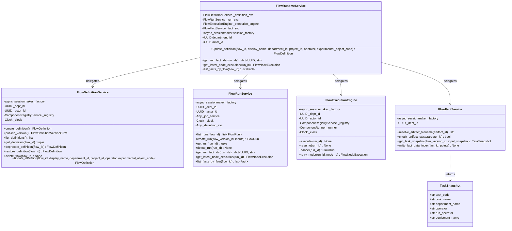
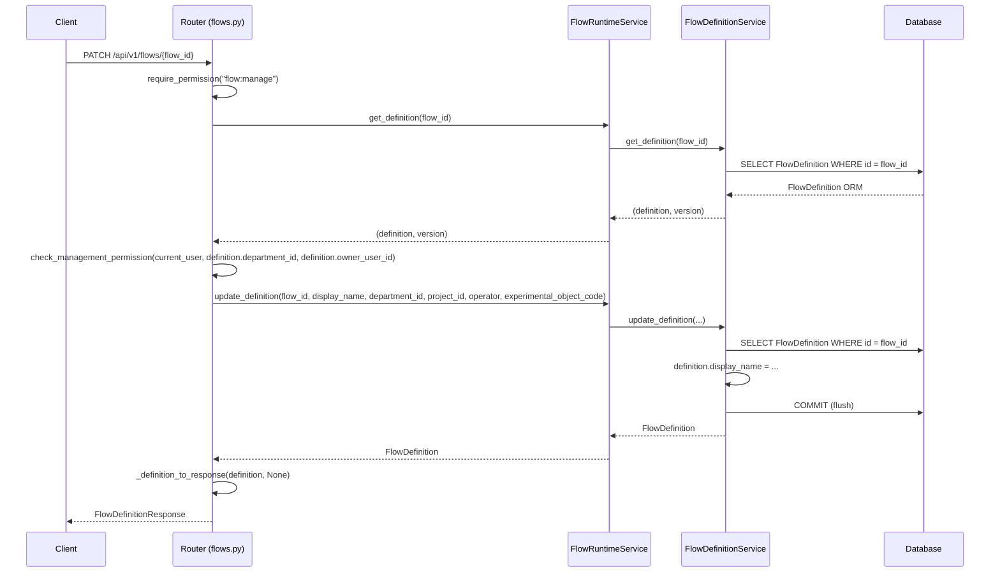
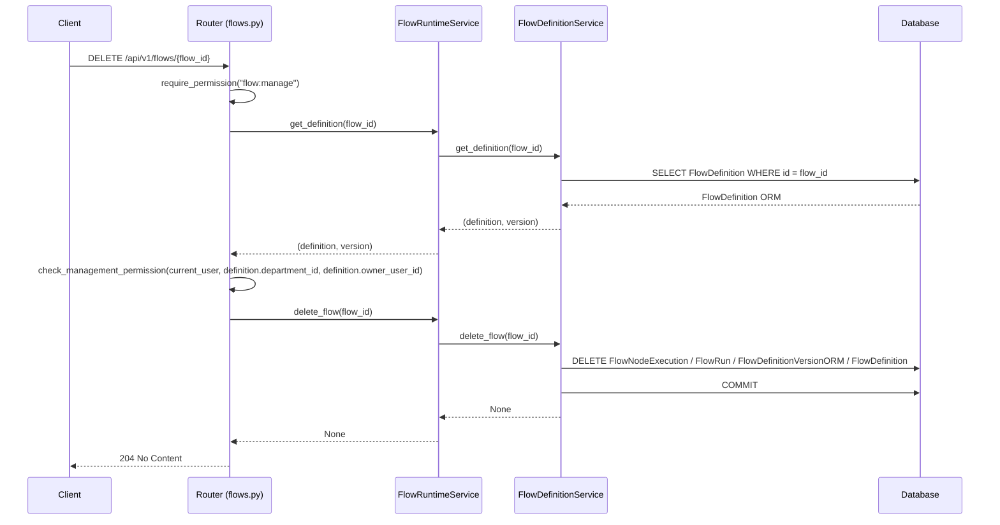
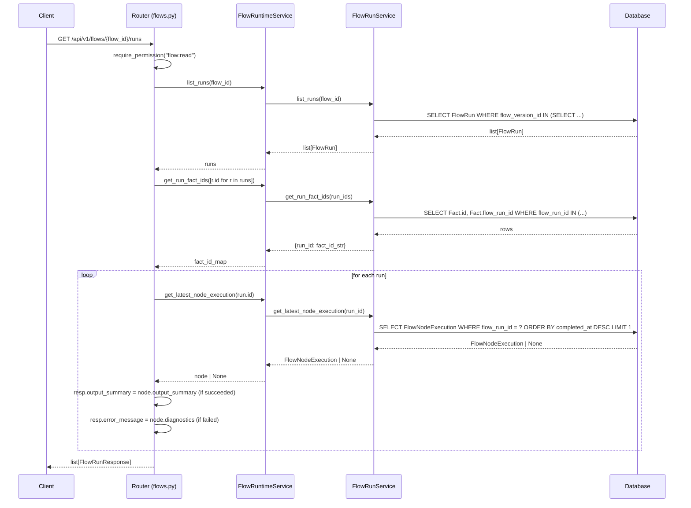
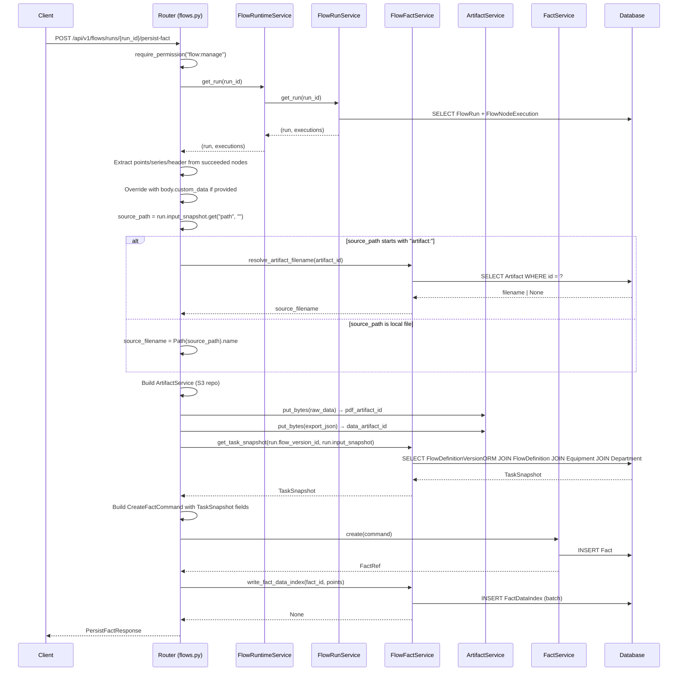
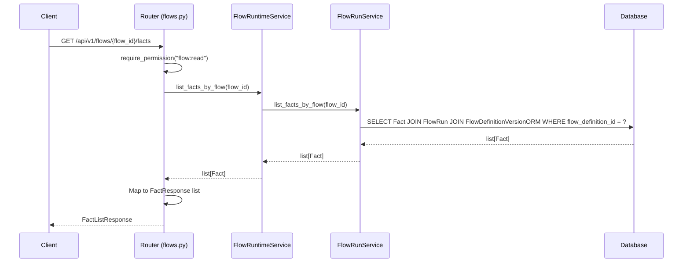
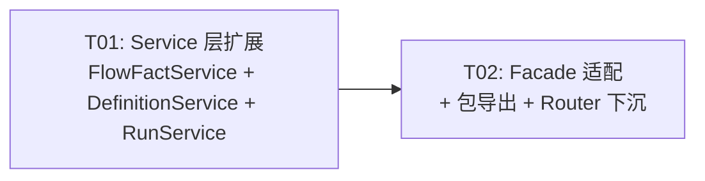

# flows.py Router 下沉系统设计

> **模块**: `apps/api/routers/flows.py` (1298 行, 19 处直接 ORM)
> **约束**: 纯重构 — 不改变任何业务行为，保持所有现有测试通过
> **参考**: 已完成的 `facts.py` / `governance.py` / `object_types.py` 下沉模式
> **策略**: Service 层先行 — 新增/扩展 Service 方法 → Facade 适配 → Router 下沉

---

## Part A: System Design

### 1. Implementation Approach

#### 1.1 现状概览

`flows.py` 共 1298 行，17 个端点。其中 12 个端点已通过 `FlowRuntimeService` Facade
委托到子服务（`FlowDefinitionService` / `FlowRunService` / `FlowExecutionEngine`），
不含直接 ORM。剩余 5 个端点仍有 19 处直接 `session.execute` / `session.scalar` /
`sa.select` / `sa.insert` 调用。

**已清洁端点（12 个）**：

| 端点 | 行范围 | 调用 Service | 状态 |
|------|--------|-------------|------|
| `create_flow` | 340-391 | `service.create_definition()` | ✅ 无 ORM |
| `publish_flow` | 394-430 | `service.publish_version()` + `service.get_definition()` | ✅ 无 ORM |
| `list_flows` | 433-458 | `service.list_definitions()` | ✅ 无 ORM |
| `get_flow` | 461-484 | `service.get_definition()` | ✅ 无 ORM |
| `archive_flow` | 487-507 | `service.deprecate_definition()` | ✅ 无 ORM |
| `restore_flow` | 510-530 | `service.restore_definition()` | ✅ 无 ORM |
| `create_run` | 703-763 | `service.get_definition()` + `service.create_run()` | ✅ 无 ORM |
| `resume_run` | 766-790 | `service.resume()` + `service.get_run()` | ✅ 无 ORM |
| `cancel_run` | 793-816 | `service.cancel()` | ✅ 无 ORM |
| `retry_node` | 819-845 | `service.retry_node()` | ✅ 无 ORM |
| `get_run` | 848-881 | `service.get_run()` | ✅ 无 ORM |
| `delete_run` | 884-891 | `service.delete_run()` | ✅ 无 ORM |

**需下沉端点（5 个，19 处直接 ORM）**：

| 端点 | 行范围 | 直接 ORM 数 | ORM 用途 |
|------|--------|------------|---------|
| `delete_flow` | 533-564 | 2 | `sa.select(FlowDefinition)` 权限检查前查定义 |
| `update_flow` | 567-633 | 4 | `sa.select(FlowDefinition)` 权限检查 + 字段更新 |
| `list_runs` | 639-700 | 3 | `sa.select(Fact)` 批量查持久化状态 + `sa.select(FlowNodeExecution)` 逐 run 查最新节点 |
| `persist_run_as_fact` | 915-1250 | 8 | `sa.select(Artifact)` 文件名解析/存在性校验 + `sa.select(FlowDefinitionVersionORM/FlowDefinition/Equipment/Department)` 任务快照 + `sa.insert(FactDataIndex)` 数据索引写入 |
| `list_facts_by_flow` | 1253-1298 | 2 | `sa.select(Fact).join(FlowRun).join(FlowDefinitionVersionORM)` 关联查询 |

#### 1.2 核心技术挑战

| 挑战 | 描述 | 方案 |
|------|------|------|
| **`update_flow` 无对应 Service 方法** | `FlowDefinitionService` 有 create/get/deprecate/restore/delete，缺少 `update_definition` | 新增 `update_definition()` 方法到 `FlowDefinitionService` |
| **`list_runs` 跨域查询 Fact** | 需查 `Fact` 表判断 run 是否已入库，属 flow→fact 跨域 | 在 `FlowRunService` 新增 `get_run_fact_ids()` 封装跨域查询 |
| **`persist_run_as_fact` 逻辑最重** | 8 处直接 ORM + 复杂多表 JOIN + Artifact/FactService 编排 | 新建 `FlowFactService` 封装全部 DB 操作；Router 保留 S3/Artifact 编排 |
| **`list_facts_by_flow` 跨域 JOIN** | Fact→FlowRun→FlowDefinitionVersionORM 三表 JOIN | 在 `FlowRunService` 新增 `list_facts_by_flow()` 方法 |
| **`_scoped_session` 私有访问** | Router 通过 `service._scoped_session()` 直接操作 session | 全部改为 Service 方法封装，Router 不再访问 `_scoped_session` |
| **向后兼容** | `FlowRuntimeService` 作为 Facade 被 DI 注入，签名不可变 | 新增方法通过 Facade 委托，保持 `FlowRuntimeService` 公开 API 兼容 |

#### 1.3 架构模式

采用 **Facade + Composition** 模式（与已有 `flow_runtime.py` 一致）：
- `FlowRuntimeService` 保持为 Facade，新增方法委托到子服务
- 新建 `FlowFactService` 作为第四个子服务，封装 persist-fact 的 DB 操作
- Router 仅保留：权限依赖、请求/响应模型、映射函数、S3/Artifact 编排、Service 调用
- 所有 `sa.*` / `session.execute` / `session.scalar` / `session.add` 调用移入 Service 层

---

### 2. File List

#### 新建文件

| 文件路径 | 职责 |
|----------|------|
| `packages/components/flow/flow_fact_service.py` | FlowFactService — persist-fact 端点的全部 DB 操作（Artifact 查询、任务快照、数据索引写入） |

#### 修改文件

| 文件路径 | 修改内容 |
|----------|----------|
| `packages/components/flow/definition_service.py` | 新增 `update_definition()` 方法 |
| `packages/components/flow/run_service.py` | 新增 `get_run_fact_ids()`, `get_latest_node_execution()`, `list_facts_by_flow()` 方法 |
| `packages/components/flow/flow_runtime.py` | Facade 新增委托方法：`update_definition`, `get_run_fact_ids`, `get_latest_node_execution`, `list_facts_by_flow`；`__init__` 中创建 `FlowFactService` 实例 |
| `packages/components/flow/__init__.py` | 导出 `FlowFactService`（可选，保持包级访问一致性） |
| `apps/api/routers/flows.py` | 移除全部 19 处直接 ORM，改为 Service 调用 |

#### 不修改但受影响的文件（通过 Facade 保持兼容）

| 文件路径 | 引用方式 | 兼容策略 |
|----------|----------|----------|
| `apps/api/composition/flows.py` | `from packages.components.flow_runtime import FlowRuntimeService` | shim re-export，无需修改 |
| `apps/worker/tasks/flows.py` | `from packages.components.flow_runtime import ...` | shim re-export，无需修改 |
| `tests/integration/components/test_flow_runtime.py` | `from packages.components.flow_runtime import FlowRuntimeService` | shim re-export，测试通过 Facade 调用 |

---

### 3. Data Structures and Interfaces



#### 3.1 新增方法签名

##### FlowDefinitionService.update_definition

```python
async def update_definition(
    self,
    flow_id: UUID,
    display_name: str,
    department_id: str | None = None,
    project_id: str | None = None,
    operator: str | None = None,
    experimental_object_code: str | None = None,
) -> FlowDefinition:
    """更新流程定义（display_name + 可选 department_id/project_id/operator/experimental_object_code）。

    Args:
        flow_id: 流程定义 ID。
        display_name: 新显示名称。
        department_id: 新部门 ID（字符串 UUID，空串清空为 None）。
        project_id: 新项目 ID（字符串 UUID，空串清空为 None）。
        operator: 新执行人（None 不修改）。
        experimental_object_code: 新实验对象编码（空串清空为 None）。

    Returns:
        FlowDefinition: 更新后的定义。

    Raises:
        AppError: code="not_found"，当定义不存在。
    """
```

##### FlowRunService.get_run_fact_ids

```python
async def get_run_fact_ids(
    self,
    run_ids: list[UUID],
) -> dict[UUID, str]:
    """批量查询 run 已入库的 fact_id 映射。

    Args:
        run_ids: 运行记录 ID 列表。

    Returns:
        dict[UUID, str]: {run_id: fact_id_str} 映射（仅包含已入库的 run）。
    """
```

##### FlowRunService.get_latest_node_execution

```python
async def get_latest_node_execution(
    self,
    run_id: UUID,
) -> FlowNodeExecution | None:
    """查询 run 的最新节点执行记录（按 completed_at 降序取第一条）。

    Args:
        run_id: 运行记录 ID。

    Returns:
        FlowNodeExecution | None: 最新节点执行记录，无记录时返回 None。
    """
```

##### FlowRunService.list_facts_by_flow

```python
async def list_facts_by_flow(
    self,
    flow_id: UUID,
) -> list[Fact]:
    """查询某个流程定义产出的所有事实。

    通过 flow_definition → flow_definition_version → flow_run → fact
    四表 JOIN 反查。

    Args:
        flow_id: 流程定义 ID。

    Returns:
        list[Fact]: 事实列表（按 created_at 降序）。
    """
```

##### FlowFactService（新建）

```python
class FlowFactService(ScopedSessionMixin):
    """流程执行结果入库为事实的 DB 操作服务。

    封装 persist_run_as_fact 端点中的全部数据库查询/写入：
    - Artifact 文件名解析与存在性校验
    - 任务信息快照（多表 JOIN）
    - FactDataIndex 批量写入

    Attributes:
        _factory: 异步会话工厂。
        _dept_id: 当前部门 ID。
    """

    def __init__(
        self,
        session_factory: async_sessionmaker[AsyncSession],
        department_id: UUID,
    ) -> None: ...

    async def resolve_artifact_filename(self, artifact_id: UUID) -> str | None:
        """根据 artifact_id 查询文件名。"""

    async def check_artifact_exists(self, artifact_id: UUID) -> bool:
        """校验 artifact 是否仍存在。"""

    async def get_task_snapshot(
        self,
        flow_version_id: UUID,
        input_snapshot: dict[str, Any],
    ) -> TaskSnapshot:
        """查询任务信息快照（task_code/task_name/department_name/operator/equipment_name）。

        通过 FlowDefinitionVersionORM → FlowDefinition JOIN 查询，
        从 nodes_json 获取 component_name 后关联 Equipment 表查设备名，
        关联 Department 表查部门名。
        异常时返回空 TaskSnapshot（不阻塞入库流程）。
        """

    async def write_fact_data_index(
        self,
        fact_id: UUID,
        points: list[dict[str, Any]],
    ) -> None:
        """将 points 展平写入 FactDataIndex 通用数据索引表。"""
```

##### TaskSnapshot（值对象）

```python
@dataclass
class TaskSnapshot:
    """任务信息快照（入库时保存，避免后续反查 JOIN）。"""

    task_code: str | None = None
    task_name: str | None = None
    department_name: str | None = None
    operator: str | None = None
    run_operator: str | None = None
    equipment_name: str | None = None
```

---

### 4. Program Call Flow

#### 4.1 update_flow 下沉后调用流程



#### 4.2 delete_flow 下沉后调用流程



#### 4.3 list_runs 下沉后调用流程



#### 4.4 persist_run_as_fact 下沉后调用流程



#### 4.5 list_facts_by_flow 下沉后调用流程



---

### 5. Anything UNCLEAR

1. **`FlowFactService` 的 RLS 上下文**：`FlowFactService` 继承 `ScopedSessionMixin`，
   需要 `_factory` 和 `_dept_id` 属性。Router 构造时传入 `service.session_factory`
   和 `service.department_id`。但 `_actor_id` 未传入（persist-fact 中 Artifact 查询
   不需要 user GUC）。假设：`_actor_id` 设为 None，RLS 在 dept 级别隔离即可。
   **需 Engineer 验证**：Artifact / FlowDefinition / Department 表是否需要 user GUC。

2. **`get_task_snapshot` 异常容忍行为**：原始代码用 `try/except Exception: pass`
   包裹整个任务快照查询，失败时所有字段为 None。新 `FlowFactService.get_task_snapshot`
   需保持此行为 — 内部 catch 异常并返回空 `TaskSnapshot`，不向上抛出。

3. **`write_fact_data_index` 异常容忍行为**：原始代码用 `try/except Exception`
   包裹 FactDataIndex 写入，失败时仅 warning 日志。新方法需保持此行为 —
   内部 catch 异常并 warning，不向上抛出。

4. **`list_runs` 中逐 run 查询性能**：原始代码对每个 run 独立开 `_scoped_session`
   查询最新节点执行。下沉后改为 `service.get_latest_node_execution(run_id)`，
   每次也开独立 session。行为一致但 N+1 查询模式保留。如未来需优化可改为
   批量查询，但本次重构不改变行为。

5. **`persist_run_as_fact` 中的 DEBUG 日志**：原始代码有 `_dbg_log.warning("DEBUG persist-fact body:...")`
   等调试日志。下沉时保留这些日志在 Router 层（它们不涉及 ORM），Service 层不添加额外日志。

6. **`FlowFactService` 是否需要加入 Facade**：`FlowFactService` 由 Router 直接构造
   （类似 `FactService` 的构造方式），不通过 `FlowRuntimeService` Facade 委托。
   这样设计是因为 persist-fact 端点需要 `current_user.user_id` 来构造
   `ArtifactService`，而 Facade 中不持有 `current_user`。如 Team 认为应统一走 Facade，
   可在 Facade 新增 `persist_run_as_fact` 方法并传入 `current_user`，但会增加 Facade 职责。

---

## Part B: Task Decomposition

### 6. Required Packages

本项目为 Python 后端，无新增第三方依赖。所有使用的包已在项目中存在：
- `sqlalchemy` — ORM 查询
- `pydantic` — 请求/响应模型
- `fastapi` — 路由框架

---

### 7. Task List (ordered by dependency)

#### T01: Service 层 — 新建 FlowFactService + 扩展 DefinitionService/RunService

**目标**：为 Router 下沉提供全部所需的 Service 方法，使 Router 能通过 Service 调用完成所有 DB 操作。

**涉及文件**：

| 操作 | 文件 |
|------|------|
| 新建 | `packages/components/flow/flow_fact_service.py` |
| 修改 | `packages/components/flow/definition_service.py` — 新增 `update_definition()` |
| 修改 | `packages/components/flow/run_service.py` — 新增 `get_run_fact_ids()`, `get_latest_node_execution()`, `list_facts_by_flow()` |

**详细变更**：

1. **`flow_fact_service.py`（新建）**：
   - `class FlowFactService(ScopedSessionMixin)`
   - `__init__(session_factory, department_id)`
   - `resolve_artifact_filename(artifact_id) -> str | None` — 查 Artifact.filename
   - `check_artifact_exists(artifact_id) -> bool` — 查 Artifact.id 存在性
   - `get_task_snapshot(flow_version_id, input_snapshot) -> TaskSnapshot` — 多表 JOIN
   - `write_fact_data_index(fact_id, points) -> None` — 批量 INSERT FactDataIndex
   - `@dataclass TaskSnapshot` — 值对象

2. **`definition_service.py`（修改）**：
   - 新增 `update_definition(flow_id, display_name, department_id, project_id, operator, experimental_object_code) -> FlowDefinition`
   - 逻辑：SELECT FlowDefinition → not_found 检查 → 更新字段 → flush → return

3. **`run_service.py`（修改）**：
   - 新增 `get_run_fact_ids(run_ids) -> dict[UUID, str]` — 批量查 Fact.flow_run_id → Fact.id
   - 新增 `get_latest_node_execution(run_id) -> FlowNodeExecution | None` — 查最新节点执行
   - 新增 `list_facts_by_flow(flow_id) -> list[Fact]` — 四表 JOIN 查 Fact

**验收标准**：
- `pytest tests/integration/components/test_flow_runtime.py -x` 全部通过（现有测试不受影响）
- `python -c "from packages.components.flow.flow_fact_service import FlowFactService"` 成功
- `python -c "from packages.components.flow.definition_service import FlowDefinitionService; assert hasattr(FlowDefinitionService, 'update_definition')"` 成功

**依赖**：无
**优先级**：P0

---

#### T02: Facade 适配 + 包导出 + Router 下沉

**目标**：在 Facade 中新增委托方法，更新包导出，将 Router 中全部 19 处直接 ORM 替换为 Service 调用。

**涉及文件**：

| 操作 | 文件 |
|------|------|
| 修改 | `packages/components/flow/flow_runtime.py` — Facade 新增委托方法 + `__init__` 创建 `FlowFactService` |
| 修改 | `packages/components/flow/__init__.py` — 导出 `FlowFactService` + `TaskSnapshot` |
| 修改 | `apps/api/routers/flows.py` — 移除全部 19 处直接 ORM，改为 Service 调用 |

**详细变更**：

1. **`flow_runtime.py`（修改）**：
   - `__init__` 中新增 `self._fact_svc = FlowFactService(session_factory, department_id)`
   - 新增 Facade 委托方法：
     - `update_definition(...)` → 委托 `self._definition_svc.update_definition(...)`
     - `get_run_fact_ids(run_ids)` → 委托 `self._run_svc.get_run_fact_ids(run_ids)`
     - `get_latest_node_execution(run_id)` → 委托 `self._run_svc.get_latest_node_execution(run_id)`
     - `list_facts_by_flow(flow_id)` → 委托 `self._run_svc.list_facts_by_flow(flow_id)`
   - 新增 `@property flow_fact_service` → 返回 `self._fact_svc`（供 Router 直接使用）

2. **`__init__.py`（修改）**：
   - 添加 `from packages.components.flow.flow_fact_service import FlowFactService, TaskSnapshot` re-export

3. **`flows.py`（修改）** — 逐端点下沉：

   | 端点 | 原始直接 ORM | 下沉后 |
   |------|-------------|--------|
   | `delete_flow` | `sa.select(FlowDefinition)` + `session.execute()` | `service.get_definition(flow_id)` 取 definition 做权限检查 → `service.delete_flow(flow_id)` |
   | `update_flow` | 2× `sa.select(FlowDefinition)` + `session.execute()` + 字段更新 | `service.get_definition(flow_id)` 做权限检查 → `service.update_definition(...)` |
   | `list_runs` | `sa.select(Fact)` + `sa.select(FlowNodeExecution)` + `session.execute()` | `service.list_runs(flow_id)` → `service.get_run_fact_ids(run_ids)` → 逐 run `service.get_latest_node_execution(run_id)` |
   | `persist_run_as_fact` | 6× `sa.select(Artifact/FlowDefinitionVersionORM/FlowDefinition/Equipment/Department)` + `sa.insert(FactDataIndex)` | `service.get_run(run_id)` → `service.flow_fact_service.resolve_artifact_filename()` / `check_artifact_exists()` / `get_task_snapshot()` / `write_fact_data_index()` — Router 保留 S3/Artifact 上传编排 + FactService 创建 |
   | `list_facts_by_flow` | `sa.select(Fact).join().join()` + `session.execute()` | `service.list_facts_by_flow(flow_id)` → Router 映射为 `FactResponse` 列表 |

   - 移除所有 `import sqlalchemy as sa` 内联导入
   - 移除所有 `async with service._scoped_session() as session` 调用
   - 保留所有请求/响应模型、映射函数、权限依赖
   - 保留 `persist_run_as_fact` 中的 S3 上传编排（`_build_s3_repo` + `ArtifactService.put_bytes`）

**验收标准**：
- `grep -n "sa\.\|session\.execute\|session\.scalar\|session\.add\|_scoped_session" apps/api/routers/flows.py` 零命中
- `pytest tests/integration/components/test_flow_runtime.py -x` 全部通过
- `pytest tests/unit/components/test_flow_validation.py -x` 全部通过
- `python -c "from packages.components.flow import FlowFactService"` 成功
- `python -c "from packages.components.flow_runtime import FlowRuntimeService"` 成功（shim 兼容）

**依赖**：T01
**优先级**：P0

---

### 8. Shared Knowledge

- **纯重构原则**：不改变任何业务行为，所有端点的请求/响应格式、错误码、状态码保持不变
- **scoped_session GUC**：Service 层统一使用 `ScopedSessionMixin._scoped_session()` 获取带 GUC 的事务会话，Router 不再直接访问 `_scoped_session`
- **权限检查保留在 Router**：`require_permission("flow:manage/read/execute")` + `check_management_permission()` 均保留在 Router 层
- **Facade 委托模式**：`FlowRuntimeService` 作为 Facade，所有新方法通过委托到子服务实现，公开 API 签名保持兼容
- **FlowFactService 构造方式**：由 Router 直接构造（类似 `FactService`），传入 `service.session_factory` 和 `service.department_id`；不通过 DI 注入
- **异常容忍行为保持**：`get_task_snapshot` 和 `write_fact_data_index` 内部 catch 异常（与原始代码一致），不向上抛出
- **跨域查询封装**：`FlowRunService.list_facts_by_flow` 和 `get_run_fact_ids` 封装了 flow→fact 跨域查询，避免 Router 直接 import `Fact` 实体
- **shim 兼容**：`packages/components/flow_runtime.py`（shim）继续 re-export 所有符号，外部调用方零改动
- **`_definition_to_response` 等映射函数**：保留在 Router，它们访问 ORM 属性（如 `definition.display_name`）但不执行 SQL，属于纯映射逻辑

---

### 9. Task Dependency Graph


