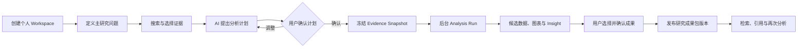
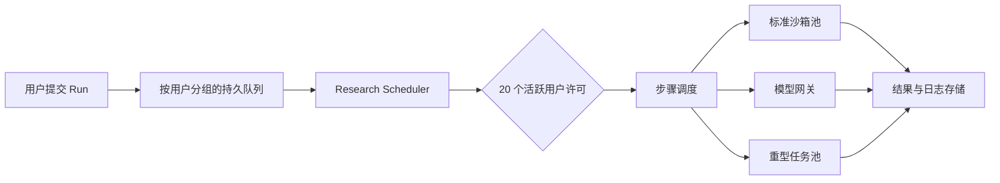
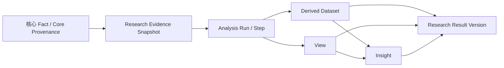
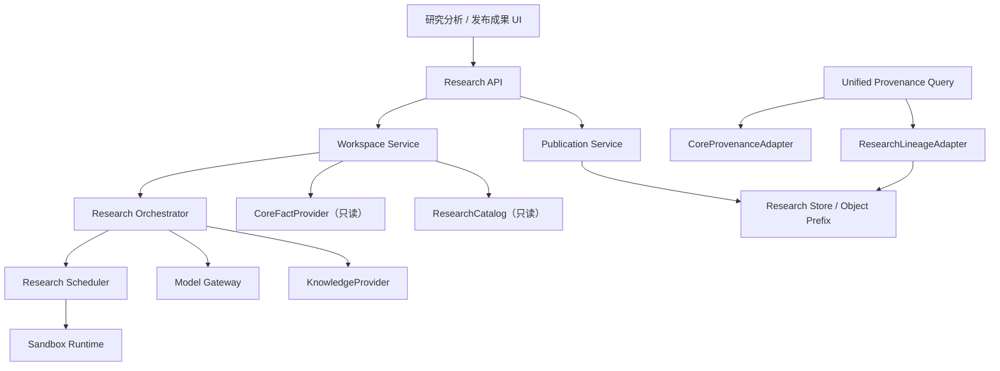

# IRIP“研究分析与发布成果”设计方案

> 状态：评审稿
>
> 日期：2026-08-05
>
> 范围：仅定义产品与技术方案，不包含实施计划和代码改动
>
> 基线：当前 IRIP 主体架构（FastAPI、PostgreSQL、Redis/Celery、MinIO、React）

## 1. 执行摘要

本方案将实验室运营中的原“衍生数据”入口改造为“研究分析”，将当前空白的“模型发布”入口改造为“发布成果”。两者共同构成一个独立、可拔除的新功能模块：研究人员可以从任意有权限的任务中选取事实数据，围绕科研问题建立个人 Workspace，在 AI 协助下使用受控 Python 环境完成探索、计算和绘图，并将确认过的数据、图表与结论发布为可复用、可追溯的研究成果包。

这个模块遵守三个最重要的边界：

1. **Fact 只保存实验事实。** 研究分析不修改 Fact，不把分析结论伪装成实验事实。
2. **新模块不反向侵入老系统。** 它只通过只读接口使用原数据；独立保存 Workspace、Run、成果和研究侧溯源；关闭或删除新模块后，原系统仍可正常运行。
3. **灵活分析必须留下证据。** AI 可以生成任意 Python，但输入快照、代码、环境、模型调用、输出和人工修订都必须形成可检查的完整链路。

最终采用的核心方案是：

- 产品和查询层面统一使用“数据溯源（Provenance）”概念；
- 原系统 Provenance 与研究模块内部 Lineage 分别存储；
- 通过联邦式查询层拼成一张完整溯源图；
- 研究模块产生“研究成果包”，内部包含 Derived Dataset、View 和 Insight；
- 发布成果仍使用 `metadata / points / series` 三段式数据结构；
- 首期支持结构化指标、普通表格、时间序列、曲线和多批次数据；
- 光谱和图像输入、多人共同编辑、交互式正式图表等能力后置。

## 2. 项目现状与设计依据

当前 IRIP 已具备本方案需要复用的基础思想和部分基础设施：

- Fact 已采用不可随意修改的实验事实语义，并提供 `metadata / points / series` 数据详情结构。
- 现有 L2.5 Provenance 已包含 EvidenceSet、不可变 EvidenceSetVersion、DerivationRun 和 ProvenanceEdge。
- 现有权限模型支持 `private / tree / explicit / all` 可见范围。
- 现有 Job、Worker、对象存储、审计、AI 助手和交互图表可以作为基础能力参考。
- 当前“模型发布”Tab 只是空白占位，可以安全让出为“发布成果”入口。

但现有 L2.5 推导不能直接承担研究分析：它围绕预定义 TransformationRecipe、确定性回放和 ParameterCandidate/ParameterVersion 设计，而研究分析需要个人 Workspace、开放科研问题、AI 动态规划、任意 Python、多步骤迭代和多种成果输出。强行复用同一组表，会把两套不同生命周期耦合在一起，也会破坏新模块可整体移除的目标。

因此，本方案复用现有平台能力和数据契约，但不复用现有 Provenance 的业务表来保存研究过程。

## 3. 产品定位

### 3.1 一句话定义

> 研究分析是一个以科研问题为中心、以事实数据为证据、由 AI 协助完成探索并产出可复现衍生数据的个人研究空间。

### 3.2 它是什么

- 面向研究人员的个人分析 Workspace。
- 任意有权限任务数据的跨任务研究入口。
- AI 主动提出分析思路、生成代码、解释结果的科研助手。
- 结构化保存分析输入、过程、输出和结论的成果生产环境。
- 让已有实验积累能够被比较、复用并产生新问题的知识循环。

### 3.3 它不是什么

- 不是 Fact 的编辑器。
- 不是固定统计公式或固定报表的集合。
- 不是让用户自己管理 Python 环境的在线 Notebook。
- 不是多人共同编辑 Workspace 的协作平台。
- 不是把模型回答直接当作科研事实的结论生成器。
- 不是现有 Parameter、Model 或 Provenance 模块的重写。

## 4. 目标、非目标与成功标准

### 4.1 首期目标

1. 用户能够创建个人 Workspace，并加入任意有权限的 Fact 或已发布衍生数据。
2. AI 能围绕主研究问题理解证据、提出计划并在授权范围内持续执行。
3. 平台能运行任意受控 Python，支持结构化表格和时间序列分析。
4. 每次正式运行都绑定不可变输入快照，并可追溯到代码、环境和模型调用。
5. 用户能把选定结果发布为版本化研究成果包。
6. 已发布成果能被有权限的用户检索，并再次作为新 Workspace 的输入。
7. 生产环境支持 20 个用户同时拥有活跃分析，超出后公平排队。
8. 新模块关闭或移除时，不影响实验项目、Fact 和核心 Provenance 的正常工作。

### 4.2 首期非目标

- 光谱文件和科研图像的通用输入协议。
- 多人共同编辑同一个 Workspace。
- 用户自行安装依赖或维护 Python 环境。
- 研究结果自动回写 Fact、Parameter 或核心 Provenance。
- 强制双人审批或复杂发布工作流。
- 已发布交互图表的长期兼容。
- 全局字段本体、行业术语治理和自动语义合并。
- CNKI、Google Scholar、ScienceDirect 等公共文献平台直连。
- 自动定时分析、无人值守批处理和自动发布。

### 4.3 验收级成功标准

- 所有已发布成果均能展示完整研究侧溯源，并能联邦追溯至可见的源 Fact。
- 新模块没有对 Fact、Parameter、Model 和核心 Provenance 的业务写入。
- 同一 Evidence Snapshot、代码和环境能够重放确定性 Python 步骤；LLM 步骤保留原始输入与输出以供核查。
- 任意成果的权限不会超过其源数据当前有效权限交集，除非存在专门的放宽授权记录。
- 20 个标准用户任务可同时活跃，第 21 个任务进入公平队列。
- 单次模型调用的数据输入不超过 500K tokens，且系统不会静默抽样。

## 5. 方案比较与最终选择

### 5.1 方案一：直接扩展现有 L2.5 推导体系

做法是把 Workspace、AI Run 和成果继续写入现有 EvidenceSet、DerivationRun 和 ProvenanceEdge。

优点是表面上复用最多，短期少建一组实体。缺点是现有体系强调预定义配方、确定性输出和参数审批，研究分析强调开放问题、动态代码和多种输出；两者生命周期、权限和删除边界不同。最终会导致研究模块无法独立移除，并增加老系统回归风险。

结论：不采用。

### 5.2 方案二：独立研究模块，联邦式统一溯源

研究模块独立保存 Workspace、Evidence Snapshot、Analysis Run、成果包和研究侧溯源。核心 Provenance 只读接入，上层提供统一图查询与统一 UI。

优点是边界清楚、可拔除、适合 AI 动态分析，同时保留全链路溯源体验。代价是需要一个适配与拼图层，并维护研究侧的数据模型。

结论：**采用。**

### 5.3 方案三：外部分析服务，只回传静态文件

把分析完全放在外部系统，IRIP 只保存图片或下载链接。

优点是隔离最强。缺点是权限、版本、检索、复用和溯源都被割裂，无法形成数据积累闭环，也难以复用当前平台身份和数据结构。

结论：不采用。

## 6. 导航与页面结构

### 6.1 实验室运营入口

功能开启时，实验室运营保留三个 Tab：

1. **实验项目**：保持原系统行为不变。
2. **研究分析**：个人 Workspace 列表与分析工作区。
3. **发布成果**：已发布研究成果包的检索、查看和复用入口。

“研究分析”占用原“衍生数据”位置；“发布成果”占用当前空白“模型发布”位置。现有 Parameter 与 Model 后端能力不删除、不迁移，只是不再由这两个 Tab 承担展示。功能开关开启时挂载两个研究页面；功能开关关闭时恢复当前 `parameters` Tab 的 ParameterPage 和 `models` Tab 的原占位行为。老系统业务代码不导入研究模块类型，也不依赖研究模块数据。

### 6.2 研究分析首页

- 新用户看到空状态和“新建 Workspace”主操作。
- 已有用户默认看到最近 Workspace，可按活跃、归档、更新时间筛选。
- Workspace 只属于创建者本人，不设置成员列表和共同编辑权限。
- 每个 Workspace 只有一个主研究问题，可包含多个子问题和分析分支。
- 明显无关的新方向通过“分叉 Workspace”承接；分叉继承数据引用和必要上下文，但后续独立运行、独立发布。

### 6.3 Workspace 三栏布局

- **左栏：Evidence Set**——数据搜索、AI 推荐、已选数据、版本与权限状态。
- **中栏：研究画布**——研究问题、分析计划、Run 进度、交互图表、候选数据与候选 Insight。
- **右栏：AI 科研助手**——持续对话、主动建议、计划说明、错误解释和后续研究方向。

现有 AI 对话中的 ECharts/Plotly 等交互能力继续用于探索。正式发布时，将用户确认的视图固化为静态图，不要求交互组件承担长期复现责任。

### 6.4 发布成果页

默认展示当前用户有权查看的全部成果包，提供：

- 全部成果、我发布的、我收藏的；
- 研究问题、发布者、时间、来源任务、数据类型和标签筛选；
- 关键词与语义检索；
- 成果包详情、版本历史、权限状态和数据溯源；
- “加入当前 Workspace”或“基于此成果新建 Workspace”。

首期不修改老任务详情页，也不在 Fact 列表中插入“相关研究成果”反向入口。

### 6.5 成果详情页

成果详情沿用 FactDetail 的阅读习惯，但不复用 Fact 实体：

- 左侧“衍生来源”展示 Workspace、研究问题、源 Fact/Derived、Evidence Snapshot、Analysis Run、代码与日志入口、环境、发布者和版本。
- 右侧依次提供 `metadata`、`points`、`series`、View、Insight 和数据溯源 Tab。
- 数据溯源是独立结构化图，不塞进 `metadata`。
- 无权访问的上游在图中按受限节点规则处理，左侧来源信息也使用同一权限裁剪结果。

## 7. 端到端研究流程



### 7.1 建立问题

Workspace 必须有一个主研究问题。AI 可以帮助澄清问题、拆分子问题和指出数据缺口，但重大问题变更要形成问题版本，避免旧分析被错误解释为回答了新问题。

### 7.2 选择证据

用户可以跨任务搜索所有当前有权访问的 Fact 和已发布衍生数据。AI 可以根据主问题推荐语义相关的历史数据，并说明推荐原因；用户最终决定是否加入。

加入 Workspace 时保存稳定数据引用。第一次正式执行前，系统重新校验权限并冻结 Evidence Snapshot，记录：

- 源对象命名空间与 ID；
- 源版本或可验证状态；
- 内容哈希；
- 获取时间；
- 当时的权限包络；
- 本次实际使用的字段、行列或对象清单。

源数据后续变化不会改变已完成的 Run。Workspace 只提示存在新版本，用户主动刷新后生成新的 Evidence Snapshot 和新的 Run。

### 7.3 AI 提出计划

AI 主动检查数据结构与质量，提出步骤化分析计划。计划至少说明：

- 每一步要回答的问题；
- 使用哪些证据；
- 使用 Python、LLM、知识库或混合方式；
- 是否全量、分块或抽样；
- 预期输出；
- 主要假设、风险和计算资源类型。

用户按“计划级授权”确认。确认后，AI 可以在计划范围内连续编写 Python、运行、修复错误和调整图表，不必每一步打断用户。新增数据、改变研究目标、首次调用知识库、扩大资源级别、发布成果和高影响权限操作需要重新确认。

### 7.4 持久化后台运行

Analysis Run 在后台持续运行，用户关闭页面或退出登录后不会中断。重新进入 Workspace 可以查看实时进度、阶段输出和日志。用户可以取消；取消后已完成结果只作为临时记录，不能直接发布。

20 分钟限制作用于单个标准 Python 沙箱步骤，不限制由多个 Python、LLM 和知识检索步骤组成的整个 Analysis Run。长 Run 通过持久状态和步骤检查点持续推进。

### 7.5 形成候选成果

运行可以产生：

- Derived Dataset：可再次计算的数据；
- View：图表和展示；
- Insight Candidate：AI 提出的科研解释；
- 运行日志、代码和中间工件。

AI 的自然语言回答不会自动成为正式 Insight。每条候选 Insight 必须包含结论、适用范围、证据引用、分析方法、置信说明和限制条件，并标明依据来自实验数据、内部知识库还是模型推测。只有用户接受或修改确认后的 Insight 才能发布。

### 7.6 发布与复用

用户勾选本次需要发布的成果，组成一个研究成果包。包内数据对象具有独立 ID，可被后续 Workspace 单独引用；包作为整体承担版本、权限和叙事上下文。

发布不需要双人审批，但需要 `research:publish` 权限。发布动作永远由用户主动确认，AI 不能自动完成。

## 8. 领域模型

### 8.1 逻辑实体

| 实体 | 作用 | 可变性 |
|---|---|---|
| ResearchWorkspace | 个人研究空间稳定身份 | 草稿期可变，可归档 |
| ResearchQuestionVersion | 主研究问题的版本记录 | 创建后不可变 |
| WorkspaceEvidenceRef | Workspace 当前选择的数据引用 | 草稿期可增删 |
| ResearchEvidenceSnapshot | 一次运行实际使用的证据快照 | 不可变 |
| AnalysisPlanVersion | 用户确认的分析计划 | 不可变 |
| AnalysisRun | 一次后台分析编排 | 完成后不可变 |
| AnalysisStep | 计划中的 DAG 步骤及状态 | 完成后不可变 |
| RunArtifact | 代码、日志、图表、数据和中间工件 | 按保留策略处理 |
| DerivedDataset | 可复用衍生数据的稳定身份 | 版本化 |
| DerivedDatasetVersion | 三段式数据与字段说明 | 不可变 |
| ResearchView | 静态图及其数据、代码引用 | 版本化 |
| Insight | 用户确认的结构化解释 | 版本化 |
| ResearchResult | 研究成果包稳定身份 | 状态可变 |
| ResearchResultVersion | 某次正式发布内容 | 不可变 |
| ResultAclRevision | 成果包权限变更记录 | 仅追加 |
| ResearchLineageEdge | 研究侧溯源关系 | 仅追加 |
| ResearchMemoryDocument | AI 后台连续记忆 | 自动维护、可重建 |

建议所有研究实体使用独立 `research_*` 命名空间、数据库表和对象存储前缀。原系统不能通过外键依赖这些表；跨模块关系保存为带命名空间的逻辑引用，而不是从核心表建立到研究表的强外键。

### 8.2 研究成果包

ResearchResult 是稳定身份，ResearchResultVersion 是不可变发布版本。一个版本包含：

- 标题、摘要、标签和发布说明；
- 一个或多个 Derived Dataset Version；
- 一个或多个 View；
- 零个或多个用户确认的 Insight；
- 本版本使用的 Evidence Snapshot 和 Analysis Run 引用；
- 发布者、发布时间和内容哈希。

成果包内部对象可以独立引用，但统一继承成果包 ACL。若某项内容需要不同可见范围，应拆成另一个成果包。

### 8.3 三段式衍生数据

衍生数据继续采用与 Fact 详情一致的规范：

```json
{
  "metadata": {
    "description": "批次曲线特征提取结果",
    "analysis_scope": "2026-Q2"
  },
  "points": [
    {"name": "平均峰值", "value": 18.4, "unit": "MPa"}
  ],
  "series": [
    {
      "name": "批次特征表",
      "columns": ["batch_id", "peak", "area", "status"],
      "rows": [["B-001", 17.8, 52.1, "normal"]]
    }
  ]
}
```

- `metadata` 保存报告级描述，不保存大量分析结果。
- `points` 保存独立单值指标。
- `series` 保存普通表格、时间序列、曲线、多批次和重复测量。

首期在三段式数据旁保存轻量 `field_manifest`，只记录字段名、自动推断类型、可选单位、一句话说明、来源步骤、列顺序和基本形状。首期不建设全局字段注册中心、本体、自动单位换算或语义合并。

### 8.4 数据与描述编辑

- 标题、摘要、标签、图注和展示顺序可以编辑。
- Insight 可以由用户修改，并保留 AI 原稿和修改记录。
- `points / series` 中的数值和行列内容不能无痕手改。
- 计算方法变更必须产生新 Analysis Run。
- 必要的人工数据修订要作为显式步骤记录修改前后差异、理由和操作者。

## 9. 生命周期与版本规则

### 9.1 Workspace

- Draft Workspace 可持续修改。
- 没有发布成果引用时允许删除。
- 已产生发布成果后只能归档，不能彻底删除其必要记录。
- 每个 Workspace 同一时间只能有一个运行中的 Analysis Run。

### 9.2 Analysis Run

- 状态包括 queued、planning、running、partially_succeeded、succeeded、failed、cancelled。
- 完成后的输入、计划、步骤、代码、环境清单和正式输出不可修改。
- 重跑创建新 Run，不覆盖旧 Run。
- LLM 具有非确定性；系统承诺保留当时的完整输入和输出，不承诺再次调用产生逐字相同回答。

### 9.3 部分失败

分析计划以 DAG 保存。某一步失败后，其依赖步骤停止；无依赖关系且已成功的分支仍可使用。只有依赖闭包全部成功的输出才具备发布资格。若从部分失败 Run 发布独立成功结果，成果详情必须标明源 Run 为部分成功，并保留失败步骤的审计摘要。

### 9.4 发布版本

- 发布版本不可修改。
- 修正正式内容产生 v2，v1 仍保留在溯源中。
- 旧版本可以标记 superseded 或 withdrawn，但不物理删除。
- ACL 修改不产生数据版本，而产生独立 ACL Revision 和审计事件。

## 10. AI 分析与上下文路由

### 10.1 平台自动选择模型

用户不直接选择模型。平台根据规划、代码生成、长上下文、Insight 分析和模型可用性自动路由。每次调用记录供应商、模型、模型版本、提示词版本、工具版本和时间。发生备用模型切换时必须显式记录。

### 10.2 任意 Python

AI 可以根据科研问题生成任意 Python，而不是只能调用固定公式。代码默认隐藏，用户可以展开只读查看；修改代码通过继续向 AI 提要求完成。用户不需要理解或管理依赖。

### 10.3 自动分析模式

“全量参与分析”和“所有原始值一次性进入 LLM”必须区分。系统按分析步骤自动选择：

| 需求 | 模式 | 覆盖语义 |
|---|---|---|
| 精确统计、拟合、峰值、时序运算 | 全量计算 | Python 读取全部数据，LLM 解释结果 |
| 每条记录都需语义判断 | 分块全量扫描 | 每条记录进入至少一次模型调用 |
| 需要同时比较全局数据 | 直接全量上下文 | 在有效预算内一次性输入 |
| 只需寻找问题相关局部现象 | 检索探索 | LLM 通过工具按需读取 |
| 数值与语义混合 | 混合分析 | Python 全量计算并结合 LLM 阅读 |

每个步骤都保存：是否要求全量、是否逐条语义阅读、是否存在跨记录推理、是否允许抽样、预计 token、最终模式和选择原因。

### 10.4 500K 单次数据硬上限

500K tokens 是单次模型调用中“数据部分”的硬上限。有效数据预算按以下规则计算：

```text
effective_data_budget = min(
  500K,
  model_context_limit
  - system_and_tool_tokens
  - research_context_tokens
  - reserved_output_tokens
  - safety_margin
)
```

- 若全量数据适合整体推理且不超过有效预算，直接输入。
- 若超过预算且记录可独立判断，自动切块全量扫描，再分层归并。
- 若需要精确数值全局判断，Python 全量计算，LLM 读取完整结果和必要片段。
- 若必须由 LLM 同时理解全部原始内容但超过模型能力，只能采用分层分析，并明确其局限。
- 只有研究目标允许抽样时才可抽样，系统不能因预算不足静默抽样。

Analysis Run 不设置累计 token 软上限。系统持续展示数据覆盖率、LLM 原始记录阅读率、批次数、调用量和费用估算，但不因累计 token 达到某个值而阻断合理分析。为避免错误循环，分析必须沿已确认的有限 DAG 执行，单步骤自动重试次数有限，进一步尝试形成可见的新 Attempt。

### 10.5 覆盖声明

每次分析向用户显示简洁声明，例如：

> 自动模式：混合分析｜数据覆盖率 100%｜LLM 阅读率 100%｜预计 4 批｜是否抽样：否

“数据覆盖率”和“LLM 阅读率”分别记录，避免把 Python 全量计算和 LLM 逐条阅读混为一谈。

### 10.6 后台研究记忆

每个 Workspace 维护一份纯后台 Research Memory Document，包括主问题、当前范围、证据、已确认计划、关键方法、已完成 Run、接受或否决的 Insight、限制和下一步。它由事件自动更新，不在首期 UI 中展示。

这份文档只是可重建的 AI 上下文缓存，不是事实或正式成果。若其内容与原始事件冲突，以 Evidence Snapshot、用户确认记录、Run 和发布版本为准。

## 11. Python 沙箱与执行安全

### 11.1 安全边界

每次 Python 执行运行在独立容器或 Pod 中：

- 默认完全断网；
- 非 root 用户；
- 只读基础镜像；
- 只读挂载本次 Evidence Snapshot 输入包；
- 仅允许写入临时工作目录；
- 不持有核心数据库、对象存储或知识库凭据；
- 不继承 API/Worker 的环境秘密；
- 对 CPU、内存、时间、临时磁盘和输出大小设置硬限制；
- 结束后由控制面收集白名单输出，再销毁容器。

沙箱不直接读取老系统。Research Orchestrator 在权限校验后生成一次性输入包并预置到沙箱；输出由平台扫描、校验和持久化。

### 11.2 依赖管理

- 平台维护固定版本的科学计算镜像。
- 统一预装 NumPy、Pandas、SciPy、statsmodels、scikit-learn、Matplotlib、Seaborn 等常用库。
- 用户不执行 `pip install`，也不管理虚拟环境。
- 新增库通过平台镜像版本发布，旧 Run 永久记录原镜像摘要。
- 不同镜像版本重跑时产生新 Run。

### 11.3 资源档位

首期标准执行步骤建议：

- 2 vCPU；
- 4 GB 内存；
- 单个沙箱步骤最多 20 分钟；
- 5–10 GB 临时磁盘；
- 输出总量受限；
- 步骤结束后可保温约 3 分钟，以支持连续图表调整，空闲后释放。

需要更多 CPU、内存或执行时间的任务识别为重型任务，进入独立低并发队列和资源池。重型计算划分基于资源需求，不基于累计 LLM token。

## 12. 并发与公平调度

### 12.1 服务承诺

- 最多 20 个不同用户同时拥有活跃 Analysis Run。
- 每个用户最多 1 个活跃 Run。
- 每个 Workspace 最多 1 个活跃 Run。
- 第 21 个用户进入等待队列。
- 浏览页面、查看成果和普通 AI 对话不占 Python 沙箱槽，但活跃 Run 仍受 20 用户上限管理。

### 12.2 调度策略



- 用户之间采用轮询公平调度，用户内部 FIFO。
- 等待时间形成优先级老化，避免长期饥饿。
- 交互步骤优先于后台重算和刷新。
- 同一 Run 内的 AI 修错与重试不重新排到队尾，但受步骤重试和运行状态机约束。
- 取消、超时、心跳丢失或执行器崩溃后及时回收许可和计算资源。
- 排队 UI 显示位置、前方用户数、预计等待时间，并允许取消。

### 12.3 基础设施建议

沙箱运行时通过 `SandboxRuntime` 接口隔离，生产优先使用 Kubernetes Pod；资源较简单时可使用具备同等隔离和回收能力的容器调度器。现有 PostgreSQL 继续保存权威状态，Redis/Celery 只承担唤醒和异步传递，不成为 Run 状态的唯一来源。

若 20 个标准沙箱同时满负载，计算池约需 40 vCPU 和 80 GB 内存。考虑调度、系统组件和峰值余量，建议为标准分析池准备约 48–56 vCPU、96–112 GB 内存。数据库、对象存储和模型网关不与沙箱争抢同一配额。重型任务资源池另行配置，不计入上述标准并发保障。

## 13. 内部知识库接口

研究分析不直接维护行业文献库，只消费用户在其他系统维护的只读 `KnowledgeProvider`。

建议接口至少返回：

- document_id；
- document_version；
- title；
- section、page、chunk_id；
- relevance_score；
- source_uri；
- content_hash；
- 精确检索片段。

默认只向知识库发送研究问题和用户确认的关键词，不发送完整 Fact 原始数据。模型引用知识库时，研究模块保存被实际引用的段落快照、文档版本和哈希，而不是复制整篇文献。这样即使外部知识库更新，已发布 Insight 仍能解释当时依据。

知识库、实验数据和模型推测必须使用不同证据标签，不能混写成一个无来源的结论。

## 14. 研究成果与图表

### 14.1 成果包内容

一次发布可以包含多个数据集、图表和 Insight。用户只选择有价值的输出，不把草稿、中间文件或失败结果全部发布。

- Derived Dataset 可以作为后续分析输入，形成 `Fact → Derived → Derived` 链路。
- View 必须绑定具体数据版本、绘图代码和 Analysis Run。
- Insight 必须绑定证据和方法，可以不存在；数据可以在没有强行结论的情况下发布。

### 14.2 图表策略

- Workspace 内复用现有 ECharts、Plotly 和引用式图表能力进行交互探索。
- 正式成果保存高分辨率 PNG，可选导出 PDF。
- 发布静态图时同时保存代码、环境、输入引用和图表说明。
- 首期不发布任意 HTML/JavaScript 交互图表。
- 调整坐标、配色或标注通过 AI 重新生成，并形成新 View 版本。

## 15. 权限模型

### 15.1 权限点

- `research:use`：创建 Workspace、选择数据和运行分析。
- `research:publish`：自行发布成果，不需要双人审批。
- `research:declassify`：在说明理由并审计后突破源数据默认权限上限。
- `research:manage`：撤回成果、处理归属和异常内容。

### 15.2 成果可见范围

成果包沿用 `private / tree / explicit / all`，且发布后可修改。ACL 修改独立于数据版本并记录 Revision。包内对象不设置独立 ACL，全部继承成果包权限。

新成果包默认选择 `private`；发布人在发布确认页可以选择其他范围，但最终范围必须通过权限包络校验。

默认权限上限是所有源数据当前权限包络的交集：

```text
effective_result_access =
requested_result_acl
∩ current_source_permission_envelopes
```

源权限收紧后，成果的有效可见范围同步收紧，不生成数据新版本。扩大到交集之外必须持有 `research:declassify`，填写理由并留下审计记录。

聊天中分享的是动态成果版本引用，不复制内容。接收者权限被撤销后，引用显示“无权访问”。

### 15.3 运行期权限变化

- 选择证据、冻结快照、开始关键步骤和发布前都重新校验权限。
- 源权限在 Run 中途被撤销时，后续步骤在检查点停止。
- 已产生输出进入隔离状态，直到权限重新满足；不能直接发布。
- 搜索索引和成果列表按当前权限过滤，不能依赖创建时的静态授权快照直接放行。

## 16. 联邦式统一数据溯源

### 16.1 统一概念，不合并存储

用户界面只使用“数据溯源（Provenance）”。“Lineage”仅作为研究模块内部实现术语，不对用户形成第二套概念。



### 16.2 查询架构

统一 Provenance Query Service 由两个只读适配器组成：

- `CoreProvenanceAdapter`：查询 Fact、现有 DerivationRun、ParameterVersion 等核心节点。
- `ResearchLineageAdapter`：查询 Evidence Snapshot、Analysis Run、Derived Dataset、View、Insight 和成果版本。

跨边界边由研究模块保存，例如 `core:fact:<id> → research:evidence_snapshot:<id>`。核心表不写入研究节点，也不建立到研究表的外键。

节点使用命名空间 ID，避免不同模块 UUID 语义冲突。统一服务负责图拼接、循环保护、深度限制、权限裁剪和展示标签。

### 16.3 受限节点

用户无权访问某个上游节点时，图中保留不含名称、ID、属性和内容的“受限来源”占位节点，使已可见成果的链路不至于无解释地断裂。若连节点存在本身也不应暴露，权限策略可以直接截断该分支。占位节点是本次查询生成的临时表示，不提供稳定可枚举标识。

## 17. 模块边界与接口



### 17.1 主要边界

- `CoreFactProvider`：只读搜索和获取 Fact 输入，不暴露核心数据库会话。
- `ResearchCatalog`：在研究域内搜索和获取已发布 Derived 输入。
- `WorkspaceService`：个人归属、问题版本、证据选择和草稿状态。
- `ResearchOrchestrator`：计划、步骤、上下文路由、模型与沙箱编排。
- `ResearchScheduler`：20 用户许可、公平队列和资源档位。
- `SandboxRuntime`：容器创建、输入挂载、执行、取消和输出收集。
- `ModelGateway`：平台模型路由、500K 限制、调用记录和故障切换。
- `KnowledgeProvider`：外部内部知识库的只读检索合同。
- `PublicationService`：成果选择、校验、版本、ACL 和撤回。
- `UnifiedProvenanceQuery`：跨核心与研究模块拼接溯源图。

新模块使用由现有 Alembic 生命周期统一管理的研究域迁移、独立 `research_*` 表、独立对象存储前缀、独立队列名和独立功能开关，不建立第二套数据库迁移机制。删除模块时，只需移除研究入口、研究 API/Worker、研究表和研究对象；核心系统不需要数据回填或兼容读取。

## 18. 错误处理与降级

| 场景 | 处理方式 |
|---|---|
| 源数据无权访问 | 不加入或不冻结，显示权限原因，不泄露内容 |
| 源数据出现新版本 | 提示刷新；旧 Run 继续绑定旧快照 |
| 权限在 Run 中途撤销 | 检查点停止，输出隔离，禁止发布 |
| Python 语法或依赖错误 | AI 在计划范围内有限自动修复，记录每次 Attempt |
| 沙箱超时或资源超限 | 终止步骤，保留错误分类；可改为重型任务重跑 |
| 模型供应商故障 | 按平台策略重试或切换备用模型，并记录实际模型 |
| 知识库不可用 | 非必要步骤降级为仅数据分析并标注；必要步骤失败 |
| 分块 LLM 某批失败 | 对失败批重试；覆盖声明显示未完成记录，未达 100% 不得声称全量 |
| 部分分析分支失败 | 依赖闭包成功的独立结果仍可发布，并标注 Run 部分成功 |
| 图表渲染失败 | 数据结果可保留；View 不可发布，重新渲染后再选择 |
| 发布并发冲突 | 使用版本号和乐观锁，冲突方重新加载确认 |
| 功能关闭 | 隐藏研究入口，停止新任务；老系统保持正常 |

## 19. 保留与清理策略

- 已发布成果及其复现所需快照、代码、环境和引用：长期保留。
- Workspace 中已完成且仍被引用的 Run：随 Workspace 保留。
- 临时代码、缓存和无引用预览：7 天后自动删除。
- failed/cancelled Run 的日志、中间数据和输出：30 天后全部删除。
- 清理前在 Workspace 显示到期时间。
- 首期不提供“保留失败现场”功能。
- 失败 Run 清理后只保留最小审计事件：Run ID、状态、时间、操作者和错误分类，不保留具体数据和完整日志。

## 20. 运行观测与审计

### 20.1 必须观测的指标

- 活跃 Run 数、等待用户数、各用户等待时间和槽位利用率；
- 沙箱启动时间、步骤耗时、CPU、内存、临时磁盘和超限次数；
- 模型调用次数、单次数据 tokens、累计调用 tokens、失败率和供应商限流；
- 数据覆盖率、LLM 阅读率、分块完成率和抽样声明；
- Run 成功、部分成功、失败、取消和重试分布；
- 成果发布、撤回、版本更新、权限收紧和放宽次数；
- 临时内容与失败内容的清理成功率和积压量；
- Provenance 查询耗时、受限节点比例和权限裁剪失败。

累计 tokens 作为观测与费用核算指标保存，但不作为产品侧自动阻断阈值。

### 20.2 必须审计的事件

- Workspace 创建、归档和删除；
- 证据加入、移除、快照冻结和刷新；
- 分析计划确认与范围扩大；
- Run 提交、取消、模型切换、沙箱超限和异常终止；
- Insight 接受、修改和否决；
- 成果发布、发布新版本、撤回和替代；
- ACL 修改、权限包络自动收紧和 `research:declassify` 使用；
- 临时数据和失败数据的自动清理。

审计记录只保存解释行为所需的摘要和引用，不复制大体积输入、模型上下文或已按保留策略删除的失败内容。

## 21. 测试与验收设计

### 21.1 单元与契约测试

- 三段式数据与 `field_manifest` 校验。
- 分析模式路由与 500K 有效预算计算。
- 权限包络交集、ACL Revision 和放宽授权。
- DAG 依赖闭包和部分失败可发布性。
- 成果版本不可变、修订生成新版本。
- KnowledgeProvider、SandboxRuntime 和两个 Provenance Adapter 的合同测试。

### 21.2 集成测试

- Fact 只读选择到 Evidence Snapshot 的完整链路。
- Fact 与 Derived 混合输入，以及 Derived 再衍生。
- 页面退出后 Run 继续、重新进入恢复进度、取消回收资源。
- 静态图、数据集和 Insight 组成成果包并发布。
- 发布成果搜索、权限过滤、版本引用和再次加入 Workspace。
- 核心 Provenance 与研究 Lineage 拼图，包含受限占位节点。
- 关闭功能开关后，实验项目和原核心 API 不受影响。

### 21.3 安全测试

- 沙箱无法访问互联网、核心数据库、MinIO 凭据和宿主机敏感路径。
- 输入只读、输出目录受限、进程非 root、资源超限被终止。
- 伪造源对象 ID、跨部门引用和失效签名被拒绝。
- 源权限收紧后，成果搜索、详情、下载、聊天引用和溯源同步收紧。
- 受限溯源节点不泄露名称、稳定 ID和属性。
- 任意图表或文本输出经过安全渲染，不能注入脚本。

### 21.4 并发与恢复测试

- 20 个不同用户任务可同时活跃。
- 第 21 个用户排队，槽位释放后按公平策略进入。
- 同一用户多个任务不会并行占用多个许可。
- 长任务不会让其他用户永久饥饿。
- Scheduler、Worker 或 Pod 异常重启后，PostgreSQL 状态可以恢复任务归属。
- 取消、超时和心跳丢失都能回收许可与临时资源。

### 21.5 科研可信性验收

- 不允许未标明抽样的数据声称全量分析。
- LLM 全量语义扫描能够证明每条记录属于某个成功批次。
- Insight 能区分实验数据、知识库和模型推测。
- 已发布数值能定位到代码步骤或显式人工修订步骤。
- LLM 重跑结果变化不会覆盖原始 Run 和原始 Insight。

## 22. 首期范围与后续演进

### 22.1 首期必须交付的完整闭环

1. 独立研究模块壳、功能开关和两个新入口。
2. 个人 Workspace、主问题、Evidence Set 和不可变快照。
3. 结构化指标、表格、时间序列、曲线与多批次数据。
4. AI 主动规划、计划级授权、任意 Python 和固定科学镜像。
5. 自动上下文路由、单次 500K 数据硬上限、分块全量扫描。
6. 20 用户公平调度、后台 Run、取消和恢复查看。
7. Derived Dataset、静态 View、Insight Candidate 与用户确认。
8. 研究成果包、版本、权限、搜索和再次作为输入。
9. 联邦式统一 Provenance 和受限来源占位。
10. KnowledgeProvider 只读接入合同和引用快照。
11. 自动后台研究记忆文档。
12. 清理、审计、隔离和验收测试。

### 22.2 推荐的设计分解顺序

这不是一个适合一次性交付的大页面，应拆成五个边界清晰的子项目：

1. **研究域基础**：模块壳、Workspace、证据快照、权限和只读核心适配。
2. **可信执行**：计划、Run、DAG、上下文路由、沙箱和 20 用户调度。
3. **研究产物**：Derived Dataset、View、Insight 和静态图。
4. **发布与复用**：成果包版本、ACL、搜索、引用和再次输入。
5. **统一溯源与知识接口**：联邦图、受限占位和 KnowledgeProvider 引用。

每个子项目都必须保持新模块可关闭，且不能要求核心 Fact 或核心 Provenance 反向理解研究实体。

### 22.3 后续能力

- 光谱与图像输入协议及专用预览。
- 受控交互式正式图表格式。
- 用户可见、可编辑和可锁定的研究记忆文档。
- 字段标准库、单位系统和行业本体。
- 失败现场延长保留。
- 高级用户模型偏好。
- 可选发布审批流。
- 老任务页面的可拔除“相关研究成果”小组件。
- 经批准的外部数据源和文献连接器。

## 23. 自评与主要风险

### 23.1 设计的优点

- **边界正确。** Fact 仍是实验事实，研究结果有独立去处，避免污染事实层。
- **科研可信。** 输入快照、代码、环境、模型、Insight 和人工修改都有来源。
- **AI 足够灵活。** 任意 Python 与自动上下文路由能适配不固定的科研问题。
- **能够形成积累。** 已发布 Derived 可以再次进入研究，逐步形成跨任务知识链。
- **失败可控。** 新模块可整体关闭或删除，老系统没有反向依赖。
- **与现有系统相容。** 三段式数据、可见范围、对象存储、Job 和交互图表都能延续既有认知。

### 23.2 设计的不足和成本

- **它不是小功能。** Workspace、沙箱、调度、发布、权限和联邦溯源共同构成一个新的业务域，必须分阶段建设。
- **任意 Python 增加运维难度。** 固定镜像、资源治理、容器隔离和重放环境都需要持续维护。
- **LLM 不等于科学正确。** 即使全量阅读，模型仍可能误解；方案只能通过证据绑定、用户确认和明确不确定性降低风险，不能替代科研判断。
- **500K 且无累计上限会带来不可预测的耗时与费用。** 本方案遵从该产品选择，只做可见性、分块和错误循环控制，不做累计阻断；生产运维必须持续监测供应商限流和成本。
- **跨任务语义仍可能不一致。** 首期轻量字段说明只能让数据可理解，不能自动解决行业字段同义、单位换算和实验条件不可比问题。
- **联邦溯源比单表查询复杂。** 它增加适配和权限裁剪成本，但换来了最重要的模块隔离，代价是合理的。
- **LLM 步骤只能审计性复现。** 可以保存当时输入输出，却不能保证未来模型重跑逐字一致。

### 23.3 综合判断

设计方向是成立的，而且与 IRIP“事实—证据—推导—成果”的长期理念一致。真正需要警惕的不是产品逻辑，而是把它误当成一个页面功能一次性实现。按照本方案的子项目边界推进，首期聚焦结构化数据和时间序列，先完成“选证据—可信分析—发布—复用—溯源”的闭环，具有现实落地性。

## 24. 最终决策清单

- 研究分析为个人 Workspace；多人协作继续使用现有聊天。
- Workspace 可加入任意有权限任务数据和已发布衍生数据。
- 一个 Workspace 一个主问题，允许子问题，无关方向分叉。
- AI 主动规划；计划级授权；越界再确认；发布必确认。
- AI 可生成任意 Python；代码默认隐藏、展开只读。
- 平台统一维护依赖和自动选择模型。
- 沙箱默认断网，不持有核心凭据，通过受控输入包取数。
- 首期支持结构化指标、表格、时间序列、曲线和多批次。
- 单次模型数据输入硬上限 500K tokens；不设累计软上限。
- 分析模式自动区分；不允许静默抽样。
- Run 离开页面继续，可恢复查看和取消。
- 生产允许 20 个用户同时活跃，超出公平排队。
- 临时内容 7 天清理，失败/取消内容 30 天清理。
- 后台研究记忆自动维护，首期不展示。
- Fact 不回写；研究成果进入独立衍生数据域。
- 成果采用 `metadata / points / series` 加轻量字段说明。
- 描述可编辑；数据修改必须形成可追踪步骤。
- 成果按研究成果包发布，内部对象可独立引用、统一 ACL。
- 发布不做审批，有 `research:publish` 即可自行发布。
- 发布版本不可变；修正形成新版本；ACL 可独立修改。
- 默认权限上限为全部源数据权限交集；放宽需专门权限和审计。
- Workspace 中复用现有交互图表；正式发布静态 PNG/PDF。
- 产品统一称“数据溯源”；底层采用核心 Provenance 与研究 Lineage 联邦查询。
- 无权查看的上游以不泄露信息的受限节点表示。
- 内部知识库由外部系统维护，研究模块只读接入并保存引用片段快照。
- 老系统能不碰就不碰；新模块可通过功能开关整体关闭或删除。
