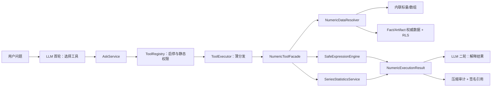

# IRIP AI 数值计算工具技术设计

**状态：** 已批准，待实施

**设计日期：** 2026-08-07

**代码基线：** `ba869d7`

**首版范围：** `evaluate_expression`、`describe_series`

**核心约束：** 纯只读计算；不执行模型提供的代码；同时支持内联数据与平台数据引用

## 1. 背景与目标

IRIP 已经能够让大语言模型调用 AI Tool 检索事实、解释溯源和运行已发布模型，但精确数值计算仍可能由模型自行完成。对“100 个随机数求和、均值、方差”等任务，模型生成文本的能力不能替代确定性的数值引擎：结果可能算错、统计口径可能不明确，也缺少可复核的输入摘要和结果摘要。

本设计为现有 AI Tool 链路增加一组高内聚、受控、可审计的数值计算能力。第一版只增加两个工具：

- `evaluate_expression`：标量和序列上的受限数学表达式、逐元素运算及常用聚合；
- `describe_series`：口径明确的序列描述统计。

设计目标如下：

1. 精确计算由确定性后端完成，LLM 只负责选择工具、组织参数和解释结果；
2. 同时支持模型直接提供的小型内联数组，以及通过 Fact/Artifact 标识引用的平台数据；
3. 所有表达式仅经白名单 AST 解释执行，不使用 `eval`、`exec` 或通用代码沙箱；
4. 默认采用严格的数值、空值、定义域、广播和单位策略，错误不得被静默吞掉；
5. 复用当前 ToolRegistry、ToolExecutor、AskService、二次模型回答、审计和引用链路；
6. 第一版保持纯只读，不创建 Fact、DerivedDataset、研究任务结果或其他业务对象；
7. 大型输入和结果不进入通用会话审计 JSON，避免数据库膨胀及敏感数据扩散。

## 2. 非目标

第一版明确不实现：

- `transform_series`：滑动窗口、插值、滤波、重采样、异常值处理等；
- `fit_model`、`detect_anomalies`；
- `execute_analysis_code` 或任何 Python/R/JavaScript 沙箱；
- 自动单位换算和完整量纲代数；
- 复数运算；
- 自动持久化计算结果、派生序列或图表；
- 将 `sin`、`sum`、`variance` 等每个函数注册成独立 AI Tool；
- 以聊天上下文中的 JSON 作为平台数据的权威副本；
- 承诺在当前主分支已知基础故障未修复时完成全链路生产验收。

## 3. 当前实现与接入点

### 3.1 AI Tool 注册与启停

`packages/ai/tools.py` 定义不可变的 `ToolSpec`，并通过 `WHITELIST_TOOLS`、`CANDIDATE_TOOLS`、`PLUGIN_TOOLS` 和 `ALL_TOOLS` 汇总工具。`ToolRegistry` 从 `ai_tool` 表加载启停状态，在每次 ask 前重新加载，并只向模型暴露已启用且类别为 `ai_tool` 的工具。

新工具必须继续通过此注册表进入模型 schema，不能绕过统一启停和权限检查。

### 3.2 工具执行

`packages/ai/tool_executor.py` 当前负责：

- 将启用的 ToolSpec 转成 OpenAI function schema；
- 按工具名执行硬编码分发；
- 做内置角色权限判断；
- 调用业务服务或数据库查询；
- 返回 `summary` 和 `data`。

直接将解析、统计和数据读取继续堆入 ToolExecutor 会进一步扩大其职责，因此数值能力采用独立子模块，ToolExecutor 只保留薄分发和依赖注入。

### 3.3 对话执行、审计与引用

`packages/ai/ask_service.py` 当前流程为：

1. 刷新 ToolRegistry；
2. 构建系统上下文与工具 schema；
3. 调用模型取得工具调用；
4. 校验工具启用状态和静态权限；
5. 调用 ToolExecutor；
6. 将工具结果作为第二轮模型输入；
7. 记录工具参数与结果，并生成签名引用。

该流程可以复用，但数值工具可能接收 10,000 个内联值或读取 100,000 行平台数据，不能把原始输入、完整向量结果复制进通用审计字段。因此执行结果要拆成 LLM 数据、审计数据和引用参数三部分。

### 3.4 平台序列数据

`packages/facts/query_service.py` 的 `get_fact_data` 通过当前用户的作用域会话和 RLS 获取 Fact，再读取权威 JSON artifact，返回 `metadata`、`points`、`series`、`task_info` 和 `source_file`。

前端 `apps/web/src/features/assistant/assistant-page/hooks/useAssistantMutations.ts` 当前把所选 Fact 的完整 `metadata`、`points`、`series` 写入 `system_context`，主要服务于模型理解和图表引用，但缺少稳定的 `fact_id`。数值工具不能把这份上下文当作授权后数据源；平台引用必须在服务端重新读取并检查权限。

### 3.5 工具种子数据

`packages/ai/tool_seeding.py` 当前只在 `ai_tool` 表为空时批量播种。已有环境的表通常非空，因此仅把新 ToolSpec 加入代码不会让新工具出现在这些环境中。本设计同时引入增量迁移，并把启动播种改为逐个补齐缺失的内置工具。

## 4. 方案选择

评审过三种方案：

1. 把两个新工具的全部实现直接写进 ToolExecutor：改动快，但继续放大现有类并使单元测试困难；
2. 新建独立数值子模块，由 ToolExecutor 做薄适配：职责清晰，能复用现有工具链，测试边界明确；
3. 复用 research Docker 沙箱：能力过重，启动成本高，并扩大基础计算的攻击面和运维复杂度。

采用方案 2。

## 5. 总体架构



建议新增目录：

```text
packages/ai/numeric/
├── __init__.py
├── contracts.py
├── data_resolver.py
├── expression.py
├── statistics.py
├── units.py
└── service.py
```

模块职责：

| 模块 | 职责 |
| --- | --- |
| `contracts.py` | 请求、解析后数据、选项、执行结果、来源证明等内部类型 |
| `data_resolver.py` | 校验并解析 scalar、inline、fact_series、artifact_series |
| `expression.py` | AST 校验、白名单解释、广播、聚合、结果限制 |
| `statistics.py` | 描述统计、统计口径、空值策略和告警 |
| `units.py` | 轻量单位标签检查与结果标签传播 |
| `service.py` | `NumericToolFacade`，编排解析、计算、摘要、审计和引用 |

## 6. 公共工具契约

### 6.1 为什么使用变量数组

工具 schema 使用固定字段组成的 `variables` 数组，而不是以变量名为动态 key 的对象，也不依赖复杂的嵌套 `oneOf`。这更容易被兼容 OpenAI function calling 的不同模型稳定生成，也方便服务端逐项给出路径化错误。

所有外部参数先由 JSON Schema 做结构校验，再由 `contracts.py` 做语义校验。后端白名单是最终安全边界；数据库中可编辑的 schema 不能扩大后端接受范围。

### 6.2 共享数据源

#### 标量

```json
{
  "name": "T",
  "source_type": "scalar",
  "value": 900,
  "unit": "K"
}
```

#### 内联序列

```json
{
  "name": "x",
  "source_type": "inline",
  "values": [1.2, 2.5, 3.7],
  "unit": "MPa"
}
```

#### Fact 序列

```json
{
  "name": "x",
  "source_type": "fact_series",
  "fact_id": "018f0000-0000-7000-8000-000000000001",
  "series_index": 0,
  "column_name": "value"
}
```

#### Artifact 序列

```json
{
  "name": "x",
  "source_type": "artifact_series",
  "artifact_id": "018f0000-0000-7000-8000-000000000002",
  "series_index": 0,
  "column_name": "value"
}
```

字段约束：

- `name`：匹配 `^[A-Za-z_][A-Za-z0-9_]{0,63}$`，同一请求中唯一；
- `source_type`：仅允许 `scalar`、`inline`、`fact_series`、`artifact_series`；
- `value`：仅用于 scalar，必须是有限 JSON number；
- `values`：仅用于 inline，元素可以是有限 JSON number 或 `null`；
- `unit`：仅允许 scalar/inline 提供，长度不超过 64；省略表示“单位未知”，字符串 `"1"` 表示“明确无量纲”；
- `fact_id`/`artifact_id`：对应平台来源所需 UUID；
- `series_index`：非负整数，必须显式提供，不依据显示名称猜测；
- `column_name`：1 至 128 字符，必须解析到数值列；
- 平台来源的单位来自权威 artifact，调用者不能覆盖。

未知字段默认拒绝，以暴露模型参数漂移，而不是悄悄忽略。

### 6.3 `evaluate_expression`

典型请求：

```json
{
  "expression": "sum(log(x + 1) * sqrt(T))",
  "variables": [
    {
      "name": "x",
      "source_type": "fact_series",
      "fact_id": "018f0000-0000-7000-8000-000000000001",
      "series_index": 0,
      "column_name": "value"
    },
    {
      "name": "T",
      "source_type": "scalar",
      "value": 900,
      "unit": "K"
    }
  ],
  "options": {
    "angle_unit": "radian",
    "null_policy": "fail",
    "numeric_coercion": "strict"
  }
}
```

顶层字段：

- `expression`：必填，1 至 512 个字符；
- `variables`：必填，1 至 16 个变量；
- `options`：可选；省略时使用严格默认值。

选项及默认值：

```json
{
  "angle_unit": "radian",
  "null_policy": "fail",
  "numeric_coercion": "strict",
  "broadcast_policy": "scalar_only",
  "domain_error": "fail",
  "numeric_type": "float64"
}
```

第一版固定支持的枚举值：

- `angle_unit`：`radian`、`degree`；
- `null_policy`：`fail`、`propagate`；
- `numeric_coercion`：仅 `strict`；
- `broadcast_policy`：仅 `scalar_only`；
- `domain_error`：仅 `fail`；
- `numeric_type`：仅 `float64`。

保留固定字段可以让未来兼容扩展显式发生；传入尚未支持的值必须报错。

### 6.4 `describe_series`

典型请求：

```json
{
  "series": {
    "name": "strength",
    "source_type": "inline",
    "values": [1, 2, 3, 4, 5],
    "unit": "MPa"
  },
  "statistics": [
    "count",
    "missing_count",
    "sum",
    "mean",
    "variance",
    "std",
    "min",
    "max",
    "median",
    "quantile",
    "skewness",
    "kurtosis"
  ],
  "quantiles": [0.25, 0.5, 0.75],
  "variance_mode": "both",
  "null_policy": "fail"
}
```

字段约束：

- `series`：必填，共享数据源对象，但不接受 scalar；
- `statistics`：可选；默认返回全部上述统计项；去重后按服务端固定顺序输出；
- `quantiles`：可选，默认 `[0.25, 0.5, 0.75]`，每项必须位于 `[0, 1]`，最多 20 项；
- `variance_mode`：`population`、`sample`、`both`，默认 `both`；
- `null_policy`：`fail`、`omit`、`propagate`，默认 `fail`。

## 7. 内部接口

```python
@dataclass(frozen=True)
class NumericPrincipal:
    user_id: UUID
    department_id: UUID
    roles: tuple[str, ...]


@dataclass(frozen=True)
class NumericSourceProvenance:
    source_type: str
    fact_id: UUID | None
    artifact_id: UUID | None
    artifact_sha256: str | None
    series_index: int | None
    column_name: str | None
    row_count: int


@dataclass(frozen=True)
class ResolvedNumericInput:
    name: str
    values: NDArray[np.float64]
    null_mask: NDArray[np.bool_]
    unit: str | None
    source_provenance: NumericSourceProvenance
    input_digest: str


@dataclass(frozen=True)
class NumericExecutionResult:
    summary: str
    llm_data: dict[str, Any]
    audit_data: dict[str, Any]
    citation_params: dict[str, Any]
```

主要服务接口：

```python
class NumericDataResolver:
    def resolve(
        self,
        source: NumericSource,
        principal: NumericPrincipal,
    ) -> ResolvedNumericInput: ...


class SafeExpressionEngine:
    def evaluate(
        self,
        expression: str,
        variables: Mapping[str, ResolvedNumericInput],
        options: ExpressionOptions,
    ) -> NumericValue: ...


class SeriesStatisticsService:
    def describe(
        self,
        source: ResolvedNumericInput,
        request: DescribeSeriesRequest,
    ) -> StatisticsResult: ...


class NumericToolFacade:
    def evaluate_expression(
        self,
        args: Mapping[str, Any],
        principal: NumericPrincipal,
    ) -> NumericExecutionResult: ...

    def describe_series(
        self,
        args: Mapping[str, Any],
        principal: NumericPrincipal,
    ) -> NumericExecutionResult: ...
```

所有对外方法同步返回。CPU 计算在 API 的有界工作线程中执行，并受统一超时和并发限制，避免阻塞事件循环。

## 8. 数据解析与授权

### 8.1 内联数据

解析步骤：

1. 校验数组长度、JSON 类型、变量名和单位标签；
2. 将数字转换为 `float64`，保留独立 null mask；
3. 拒绝 bool、字符串、对象、嵌套数组、NaN 和 Infinity；
4. 基于规范二进制表示和 null mask 计算 SHA-256；
5. 审计只记录元素数、单位和摘要，不记录原始数组。

JSON 本身不合法的 `NaN`/`Infinity` 应在 API 解析层拒绝；即使某个调用路径产生 Python 非有限浮点，数值契约层仍须再次拒绝。

### 8.2 Fact 引用

解析步骤：

1. 要求调用者具备 `fact:read`；
2. 以 `NumericPrincipal` 创建当前用户/部门的作用域会话；
3. 通过 FactQueryService 或等价的领域读取接口加载 Fact；
4. 由服务端读取 Fact 指向的权威 JSON artifact；
5. 通过 `series_index` 和 `column_name` 定位列；
6. 校验为一维数值序列并应用规模限制；
7. 从 artifact 元数据提取单位、artifact id、SHA-256 和行数。

不得直接信任前端发送到 `system_context` 的 points/series。它们只用于模型理解和图表展示，不能替代服务端授权、租户隔离与版本确认。

### 8.3 Artifact 引用

Artifact 直引要求 `artifact:read`，并通过当前租户的 artifact repository 和对象存储客户端读取。服务端必须校验：

- artifact 存在且属于调用者可见的部门/租户；
- 媒体类型和结构属于首版支持的序列 JSON；
- 指定 series 和 column 确实存在；
- 列为可接受的数值数据。

越权和不存在对外统一表现为 not found，避免通过错误差异枚举其他租户对象。

### 8.4 前端上下文清单

前端所选 Fact 的上下文增加稳定清单，同时暂时保留原有完整数据以兼容 chart-ref：

```json
{
  "fact_id": "...",
  "label": "样品 A",
  "series": [
    {
      "series_index": 0,
      "name": "stress-strain",
      "columns": ["strain", "stress"],
      "row_count": 1000,
      "units": {"strain": null, "stress": "MPa"}
    }
  ]
}
```

系统提示词指导模型优先把清单中的稳定 ID 传给工具，而不是复制大型数组。该清单不是授权凭据；后端仍完整重查。

## 9. 受限表达式引擎

### 9.1 解析方式

使用 `ast.parse(expression, mode="eval")` 只生成表达式 AST。随后执行两个独立阶段：

1. `ExpressionValidator` 遍历整棵树，验证节点种类、总节点数、深度、标识符和函数调用；
2. `ExpressionInterpreter` 递归解释已验证节点，对标量或 NumPy float64 数组调用内部白名单函数。

禁止调用 `compile`、`eval`、`exec`，也不将 NumPy 模块或 Python builtins 暴露给表达式环境。即使验证器有遗漏，解释器也只对显式支持的节点分支执行，不存在通用求值回退。

### 9.2 允许的语法

- 数值字面量：整数、有限浮点；
- 变量名；
- 常量：`pi`、`e`；
- 一元运算：`+x`、`-x`；
- 二元运算：`+`、`-`、`*`、`/`、`**`、`%`；
- 函数调用：只能是白名单中的裸函数名，不能是属性；
- 比较：`<`、`<=`、`>`、`>=`、`==`、`!=`，结果只允许作为 `where` 的条件；
- 布尔组合：第一版不支持 `and`、`or`、`not`，复杂条件用嵌套 `where` 分解。

### 9.3 函数白名单

初等函数：

```text
abs sqrt exp log log10
sin cos tan asin acos atan atan2
floor ceil round
```

逐元素函数：

```text
minimum maximum clip where
```

聚合函数：

```text
count sum mean min max median var std quantile
```

语义约束：

- `round(x, digits)` 的 digits 必须是 `[-15, 15]` 内的整数字面量；
- `clip(x, low, high)` 要求边界为标量且 `low <= high`；
- `where(condition, a, b)` 只允许标量广播或同长度数组；
- `var(x)` 和 `std(x)` 默认总体口径；可用 `var(x, 0)`、`var(x, 1)` 显式指定 ddof，ddof 只能为 0 或 1；
- `quantile(x, q)` 的 q 必须是 `[0, 1]` 内的标量；
- `count(x)` 返回非 null 元素数；它是 `null_policy=propagate` 下唯一不会因输入含 null 而返回 null 的聚合函数；
- 名称大小写敏感，不提供别名。

### 9.4 禁止的语法

包括但不限于：

- 属性访问，如 `x.__class__`、`np.sin(x)`；
- 下标与切片；
- list、tuple、dict、set 字面量；
- import、赋值、命名表达式；
- lambda、函数定义、类定义；
- 循环、推导式、生成器；
- f-string、字符串和 bytes；
- 任意关键字参数和 `*args`/`**kwargs`；
- 非白名单函数及间接调用；
- 超过限制的整数、指数或嵌套表达式。

### 9.5 资源限制

| 限制 | 首版值 |
| --- | ---: |
| 表达式长度 | 512 字符 |
| AST 节点数 | 128 |
| AST 深度 | 16 |
| 变量数 | 16 |
| 内联序列长度 | 每个变量 10,000 |
| 平台序列长度 | 每个变量 100,000 |
| 向量间广播 | 仅相同长度 |
| 标量广播 | 允许 |
| 完整向量返回阈值 | 1,000 个值 |
| 单次计算超时 | 3 秒 |

幂运算额外限制指数绝对值和中间数组大小；任何操作都不能产生超过输入最大向量长度的新向量。第一版不允许构造矩阵。

### 9.6 结果形态

标量结果完整返回：

```json
{
  "result_type": "scalar",
  "value": 5050.0,
  "unit": null
}
```

长度不超过 1,000 的向量完整返回。更长向量只返回：

```json
{
  "result_type": "vector_preview",
  "count": 100000,
  "head": [0.1, 0.2, 0.3, 0.4, 0.5],
  "tail": [9.6, 9.7, 9.8, 9.9, 10.0],
  "sha256": "...",
  "unit": "MPa",
  "truncated": true
}
```

首版纯只读且不生成结果 artifact，因此截断向量不能被后续工具按 ID 继续引用。系统提示词应鼓励模型在需要最终数值时把聚合写进表达式，而不是请求大向量。

## 10. 数值与统计口径

### 10.1 通用数值规则

- 内部数据类型固定为 IEEE 754 `float64`；
- 求和采用稳定算法；标量内联数据优先使用 `math.fsum`，数组规约使用等价的成对/补偿求和实现；
- 任何最终结果中的 NaN 或 Infinity 均视为失败；
- 除零直接报错，不返回 Infinity；
- `sqrt(x)` 要求 `x >= 0`；
- `log(x)`、`log10(x)` 要求 `x > 0`；
- `asin(x)`、`acos(x)` 要求 `-1 <= x <= 1`；
- 实数域下负数的非整数幂报定义域错误；
- 三角函数默认弧度；当 `angle_unit=degree` 时，在调用三角函数前转成弧度，反三角结果转成度；
- 输入或中间结果溢出、下溢到非有限值时失败；有限的次正规值允许；
- 输出 JSON 中 `-0.0` 规范化为 `0.0`。

### 10.2 广播与长度

- 标量可以与任意序列广播；
- 两个序列必须长度完全一致；
- 不允许长度 1 的序列冒充标量；
- 不允许按名称、时间戳或索引自动对齐；
- 空序列仅允许 `count` 和 `missing_count`，其他统计返回口径错误或 null+warning，按下文定义执行。

### 10.3 空值策略

`evaluate_expression`：

- `fail`（默认）：任一参与变量包含 null 时立即失败；
- `propagate`：逐元素运算传播 null；除 `count` 外，聚合函数若输入含 null，则结果为 null，并附 warning，不隐式忽略；定义域、除零和非有限检查只检查未被 null mask 遮蔽的元素。

`describe_series`：

- `fail`（默认）：存在 null 即失败；
- `omit`：统计前排除 null，同时返回原始 count、有效 count 和 missing count；
- `propagate`：`count` 与 `missing_count` 正常返回，其他所请求统计值返回 null，并附 warning。

### 10.4 描述统计定义

令空值策略处理后的有效样本为 \(x_1,\dots,x_n\)，均值为 \(\bar{x}\)。

- `count`：原始元素总数；
- `valid_count`：有效数值数，固定随结果返回；
- `missing_count`：null 数量；
- `sum`：稳定求和；
- `mean`：\(\sum x_i/n\)；
- 总体方差：\(\sigma^2=\sum(x_i-\bar{x})^2/n\)；
- 样本方差：\(s^2=\sum(x_i-\bar{x})^2/(n-1)\)；
- 标准差：对应方差的非负平方根；
- `min`、`max`：有效样本极值；
- `median`：0.5 分位数；
- `quantile`：线性插值，与 NumPy `method="linear"` 对齐；
- `skewness`：bias-corrected Fisher–Pearson 样本偏度，要求 `n >= 3`；
- `kurtosis`：无偏 Fisher excess kurtosis，正态分布目标值为 0，要求 `n >= 4`。

当 `variance_mode=both` 时返回：

```json
{
  "variance": {
    "population": 833.25,
    "sample": 841.6666666666666
  },
  "std": {
    "population": 28.86607004772212,
    "sample": 29.011491975882016
  }
}
```

样本数不足的处理：

- 总体方差/标准差要求 `n >= 1`；
- 样本方差/标准差要求 `n >= 2`；
- 偏度要求 `n >= 3`；
- 峰度要求 `n >= 4`；
- 对不足样本的单项返回 `null` 并附结构化 warning，不使其他可计算指标整体失败；
- 对零方差序列，偏度和峰度返回 `null` 并附 `undefined_for_constant_series` warning。

## 11. 轻量单位策略

第一版采用三态 `UnitTag`：已知单位、明确无量纲、单位未知。请求中的 `unit="1"` 表示明确无量纲；省略 unit 表示未知。该模块只做安全检查和标签传播，不做自动换算，也不试图实现完整物理量系统。

规则：

- `+`、`-`、`%`、`minimum`、`maximum`、`clip` 边界、比较和 `where` 数值分支：两个已知单位必须完全相同，否则拒绝；取模结果保留左操作数单位；
- 一个是已知单位、另一个单位未知时允许计算，但结果附 `unit_unverified` warning；
- `*`：两个已知单位组合为 `left*right`；任一单位未知时结果单位未知并附 warning；
- `/`：两个已知单位组合为 `left/right`；相同已知单位相除标为无量纲；任一单位未知时结果单位未知并附 warning；
- `**`：指数必须无量纲；标量整数指数可生成 `unit^n`，其他指数返回未简化标签并附 warning；
- `sqrt`：已知单位标为 `sqrt(unit)`，不化简；
- `abs`、`floor`、`ceil`、`round`、聚合、方差和标准差保留或按统计规则派生单位；方差为 `unit^2`，标准差保留原单位；
- `log`、`log10`、`exp`、三角函数要求输入无量纲；有明确单位时拒绝；单位缺失时允许并附 `unit_unverified`；
- `atan2(y, x)` 要求两个输入单位兼容；单位均未知时允许并附 warning；
- 反三角函数返回由 `angle_unit` 决定的 `rad` 或 `deg`；
- 数值字面量、`pi`、`e` 和显式 `unit="1"` 的输入为无量纲；省略 unit 的输入仍是单位未知；
- 平台来源单位不能由工具参数覆盖。

单位字符串只作为经过长度和字符集校验的标签处理。大小写敏感，不把 `MPa` 和 `mpa` 视为相同单位。

## 12. 权限模型

ToolSpec 的静态权限保持 `assistant:use`，使工具能沿用当前注册表和角色检查。数据来源再做动态权限：

| 来源 | 动态要求 |
| --- | --- |
| scalar / inline | 无额外对象读取权限 |
| fact_series | `fact:read` + 当前用户 RLS/租户作用域 |
| artifact_series | `artifact:read` + 当前用户 RLS/租户作用域 |

`NumericPrincipal` 必须来自已认证请求上下文，不能从模型参数构造。协作参与者也以自己的身份重新授权，不能继承分享者对数据的读取能力。

工具被管理员禁用时：

- 不出现在下一次 ask 构建的模型 tools 列表中；
- 即使模型或客户端伪造工具名，ToolRegistry 校验也拒绝执行；
- 后端领域校验始终保留，修改数据库 JSON Schema 不能绕过 AST、规模、来源或单位限制。

## 13. 执行结果、审计与引用

### 13.1 返回契约演进

ToolExecutor 当前工具仍可返回：

```python
{"summary": "...", "data": {...}}
```

AskService 增加兼容归一化：

```python
{
    "summary": "...",
    "data": {...},
    "audit": {...},
    "citation_params": {...},
}
```

对于旧工具：

- `audit` 缺失时沿用当前持久化行为；
- `citation_params` 缺失时沿用当前工具参数。

对于数值工具：

- `data` 仅进入第二轮 LLM tool message；
- `audit` 写入 `executed_tool_calls`；
- `citation_params` 交给 CitationService 签名；
- 原始内联数组、完整平台序列和超阈值向量结果不得写入持久化审计。

### 13.2 审计字段

数值工具审计至少包含：

```json
{
  "engine_version": "numeric-v1",
  "tool": "evaluate_expression",
  "expression": "sum(x)",
  "expression_sha256": "...",
  "sources": [
    {
      "name": "x",
      "source_type": "inline",
      "count": 100,
      "unit": null,
      "input_sha256": "..."
    }
  ],
  "policies": {
    "null_policy": "fail",
    "numeric_type": "float64",
    "broadcast_policy": "scalar_only"
  },
  "result": {
    "result_type": "scalar",
    "sha256": "...",
    "truncated": false
  },
  "warnings": [],
  "duration_ms": 1.3
}
```

表达式本身长度有限且属于业务逻辑，可记录原文；同时保存 digest 便于稳定关联。若未来表达式允许敏感字符串，必须先升级审计策略。

### 13.3 引用参数

签名内容使用经净化、稳定排序的参数：

- `engine_version`；
- 工具名；
- 表达式或统计项；
- 来源类型、对象 ID、artifact hash、series index、column、input digest；
- 数值/空值/方差/分位数/角度策略；
- 结果 digest；
- 计算时间戳。

引用不嵌入原始数组。用户可根据平台对象版本和 hash 复核平台数据；对内联数组，digest 证明本次计算输入，但系统不承诺从审计记录恢复原始值。

## 14. 错误模型

新增稳定错误代码：

| 错误代码 | HTTP | 场景 |
| --- | ---: | --- |
| `numeric_expression_rejected` | 422 | AST、函数、长度、深度或语法不允许 |
| `numeric_invalid_source` | 422 | 来源字段组合、series 定位或结构无效 |
| `numeric_field_not_found` | 422 | 已授权对象内找不到 series/column |
| `numeric_non_numeric` | 422 | 数据含不允许的类型或无法严格解析为数值 |
| `numeric_domain_error` | 422 | log/sqrt/反三角/幂等定义域错误 |
| `numeric_divide_by_zero` | 422 | 标量或任一序列元素除零 |
| `numeric_unit_conflict` | 422 | 已知单位不兼容或函数要求无量纲 |
| `numeric_size_limit` | 413 | 表达式、变量、序列、AST 或结果超过限制 |
| `numeric_non_finite_result` | 422 | 输入、中间值或结果出现 NaN/Infinity |
| `numeric_timeout` | 422 | 超过 3 秒计算时限 |
| `numeric_internal_error` | 500 | 未预期内部故障，对模型隐藏细节 |

访问对象时沿用统一的 403/404 语义；跨租户和不可见对象统一返回 not found。错误对象应包含：

```json
{
  "code": "numeric_domain_error",
  "message": "log input must be greater than zero",
  "path": "expression.log",
  "details": {"invalid_count": 2}
}
```

`details` 不包含原始值，只包含安全的数量、变量名或字段路径。预期计算错误可作为结构化工具结果交给第二轮模型解释；未预期异常记录 request/tool correlation id 后，只返回通用失败信息。

## 15. ToolSpec 与模型提示词

### 15.1 工具描述原则

`evaluate_expression` 描述必须强调：

- 用于精确的标量/序列数学计算；
- 可引用所选 Fact/Artifact 的序列；
- 表达式只允许文档列出的函数；
- 不要复制大型平台数组；
- 需要单个最终值时应在表达式中聚合。

`describe_series` 描述必须强调：

- 用于 count、sum、mean、总体/样本方差、标准差、分位数、偏度、峰度和缺失值；
- 方差口径不明确时使用 `both`；
- 默认严格处理缺失值。

### 15.2 系统提示词规则

追加以下行为约束：

1. 用户要求精确算术、聚合或统计量时必须优先调用数值工具，不得靠语言模型心算；
2. 已有 Fact/Artifact 引用时优先传稳定 ID，不复制上下文数组；
3. 用户未说明“总体还是样本方差”时，`describe_series` 使用 `variance_mode=both` 并在回答中解释差异；
4. 不得在工具失败后自行猜测数值结果；应说明错误和可修正的输入；
5. 结果带 warning、单位未验证或向量被截断时，回答必须明确披露；
6. 引用只证明特定输入摘要、政策和引擎版本下的这次计算。

## 16. 依赖注入与代码改动

### 16.1 ToolExecutor

构造函数增加可选 `numeric_tools: NumericToolFacade | None`，保留默认值以避免一次性破坏既有单元测试和调用点。新增两个分发分支：

```python
if tool_name == "evaluate_expression":
    return self._require_numeric_tools().evaluate_expression(args, principal)
if tool_name == "describe_series":
    return self._require_numeric_tools().describe_series(args, principal)
```

`principal` 从当前执行上下文构造，不混入工具参数。工具 schema 仍由 ToolSpec/ToolRegistry 构建。

### 16.2 AIService 与 composition root

`packages/ai/service.py` 接受或构建 `NumericToolFacade`，`apps/api/composition/ai.py` 显式注入：

- scoped session factory；
- Fact 查询能力；
- Artifact repository；
- S3/object storage client；
- 根部门/租户作用域配置；
- 数值执行限制配置。

生产 composition 不允许默默缺失数值依赖；只有测试可通过可选参数构造不含数值工具的旧式 AIService。

### 16.3 AskService

增加工具结果归一化器，分别得到：

- `llm_payload`；
- `persisted_audit_payload`；
- `citation_payload`。

旧工具的行为保持不变，新工具采用压缩审计。第二轮模型输入仍包含足够的标量统计或向量预览。

### 16.4 错误码和配置

`packages/common/error_codes.py` 增加本设计中的数值错误码。规模、超时和预览限制应集中在不可由模型覆盖的服务端配置对象中；第一版按本文默认值部署。

## 17. 数据库迁移与播种

下一迁移编号为 `0079`。迁移使用固定 UUID 插入两个工具：

- `evaluate_expression`；
- `describe_series`。

升级要求：

- `INSERT ... ON CONFLICT (name) DO NOTHING`；
- 不覆盖管理员已编辑的显示名、描述、schema 或 enabled；
- 默认 `enabled=true`，便于部署后使用；若产品发布希望灰度，可在部署配置中立即关闭，而不是改变迁移的确定性；
- category 为 `ai_tool`，required_permission 为 `assistant:use`。

降级仅按 name 删除这两个内置工具，不影响其他记录。

`seed_tools_if_empty()` 改为 `seed_missing_builtin_tools()`：遍历 `ALL_TOOLS`，逐个按 name 插入缺失项，冲突不更新。这样：

- 已有数据库通过 0079 得到两个新工具；
- 新安装在跑完迁移后仍能补齐全部代码内置工具；
- 管理员修改不会在应用启动时被覆盖；
- 未来新增工具不再依赖“表必须为空”的偶然条件。

迁移和代码中的 canonical schema 必须来自同一份可审查定义或有一致性测试，防止两份手写 JSON 漂移。

## 18. 可观测性与性能

指标：

```text
irip_ai_numeric_tool_calls_total{tool,status,source_type}
irip_ai_numeric_tool_duration_seconds{tool,source_type}
irip_ai_numeric_input_values{tool,source_type}
```

结构化日志包含：

- request/conversation/tool correlation id；
- 工具名、引擎版本、来源类型；
- 输入数量、结果类型、是否截断；
- 错误代码、warning 代码和耗时；
- Fact/Artifact ID 和 hash（按现有日志敏感级别规则）。

日志不得包含原始内联数组、完整平台序列或完整向量结果。

初版性能目标，在排除对象存储下载时间后：

- 10,000 个内联值的常用描述统计，计算阶段 P95 小于 100 ms；
- 100,000 个平台值的常用描述统计，计算阶段 P95 小于 500 ms；
- 单次 CPU 计算硬超时 3 秒；
- 使用有界线程池/并发信号量，防止大量并行数值请求耗尽 API worker。

性能目标是验收门槛，不是用不安全的表达式执行换取速度的理由。

## 19. 测试策略

### 19.1 契约测试

- 四种来源的合法/非法字段组合；
- 变量名、重复名、未知字段、长度和数量限制；
- 非法 UUID、series index、column name；
- JSON bool、字符串、嵌套数组、NaN、Infinity；
- ToolSpec schema 与后端契约一致性。

### 19.2 AST 安全测试

必须覆盖并拒绝：

```text
__import__('os').system('id')
x.__class__
(1).__class__.__mro__
open('/etc/passwd')
[v for v in x]
(lambda: 1)()
x[0]
globals()
```

还应对随机 AST、超深括号、巨大整数、巨大指数、嵌套 `where` 和未知函数做性质/模糊测试，断言只有显式白名单节点能进入解释器。

### 19.3 表达式正确性

- 标量四则、优先级、一元运算、幂、模；
- 标量与序列广播、等长序列运算、长度不一致拒绝；
- 全部白名单函数；
- degree/radian；
- log/sqrt/asin/acos 定义域；
- 除零、溢出和非有限中间值；
- 聚合、ddof、quantile；
- 向量返回和截断摘要；
- 稳定求和的灾难性抵消样例。

使用 Hypothesis 生成有限浮点输入，并对适用函数分别与 `math.fsum`、Python `statistics` 和 NumPy 的明确口径进行交叉验证。

### 19.4 统计正确性

- 空序列、单元素、双元素、常量序列；
- 正负数、极大/极小数、重复值；
- population/sample variance；
- linear quantile；
- adjusted Fisher–Pearson skewness；
- unbiased Fisher excess kurtosis；
- 三种 null policy；
- 样本不足时 null + warning，其他指标仍成功。

### 19.5 单位测试

- 同单位加减成功；
- `MPa + K` 拒绝；
- 已知与未知单位运算产生 warning；
- 乘除和幂标签；
- 方差单位平方、标准差单位不变；
- 有单位输入调用 log/exp/trig 拒绝；
- 平台单位不可覆盖。

### 19.6 Resolver 与权限测试

- inline 不读数据库；
- Fact 经当前用户 scoped session/RLS 读取；
- Artifact 直引检查 `artifact:read`；
- 跨租户、无权限和不存在对外一致；
- artifact hash、行数、series/column 正确进入 provenance；
- 非数值列和不支持 artifact 结构拒绝；
- system_context 数据被篡改时仍以服务端 artifact 为准。

### 19.7 审计与引用测试

- `data`、`audit`、`citation_params` 正确分流；
- 审计不含原始内联数组和完整平台序列；
- digest 对相同规范输入稳定，对输入变化敏感；
- citation 包含引擎版本、来源 hash、策略和结果 digest；
- 旧工具 `{summary,data}` 行为回归不变；
- 向量截断状态和 warnings 进入审计。

### 19.8 迁移测试

- 空数据库升级能得到全部内置工具；
- 已有部分工具的数据库升级只补缺失项；
- 同名管理员编辑不被覆盖；
- 0079 upgrade/downgrade 可重复验证；
- ToolRegistry reload 后启停即时生效。

### 19.9 AskService 集成测试

CI 使用 fake provider，不依赖真实 LLM：

1. 第一轮固定返回数值工具调用；
2. 验证 schema、权限和 dispatcher；
3. 验证第二轮只收到允许的 `data`；
4. 验证持久化使用压缩 `audit`；
5. 验证 citation 使用净化参数；
6. 验证工具禁用后不出现在 schema 且伪造调用失败。

真实模型只做人工 smoke test，不作为确定性 CI 门槛。

## 20. 验收场景

### 20.1 基准序列

对 `[1, 2, ..., 100]`：

| 指标 | 期望值 |
| --- | ---: |
| count | 100 |
| sum | 5050.0 |
| mean | 50.5 |
| population variance | 833.25 |
| sample variance | 841.6666666666666 |
| population std | 28.86607004772212 |
| sample std | 29.011491975882016 |

以上结果必须通过内联来源和指向相同数据的 Fact 来源分别得到，数值在规定 float64 容差内一致，来源 provenance 不同。

### 20.2 强制边界场景

- `log([-1, 1])` 返回 `numeric_domain_error`；
- `[1, 2] / [1, 0]` 返回 `numeric_divide_by_zero`，没有 Infinity；
- 已知单位 `MPa + K` 返回 `numeric_unit_conflict`；
- 10,001 个内联值返回 `numeric_size_limit`；
- 两个非标量序列长度不同被拒绝；
- 跨租户 Fact/Artifact 表现为 not found；
- 引用包含输入 hash、策略、引擎版本和结果 digest；
- `executed_tool_calls` 中不存在原始大型数组；
- 被禁用工具不出现在模型 schema 中且不能被伪造调用；
- 用户未指定方差口径时，工具返回总体和样本两个结果，LLM 回答解释二者。

## 21. 实施顺序

1. 为两种工具写失败的契约、统计口径和 AST 安全测试；
2. 实现 `contracts.py` 与集中限制配置；
3. 实现 `units.py` 和对应测试；
4. 实现 `SafeExpressionEngine`，先白名单验证，再递归解释；
5. 实现 `SeriesStatisticsService`；
6. 实现 `NumericDataResolver`，先 inline/scalar，再 Fact/Artifact；
7. 实现 `NumericToolFacade`、摘要、digest、审计和引用参数；
8. 接入 ToolSpec、ToolExecutor、AIService、composition、AskService 与错误码；
9. 增加 0079、补缺播种逻辑和迁移测试；
10. 更新前端 Fact 清单与系统提示词，完成 fake-provider 集成测试和人工 smoke test。

每一步按测试驱动方式提交小变更；不要在第一版实施中顺手加入序列变换、模型拟合或沙箱。

## 22. 兼容性、风险与缓解

| 风险 | 影响 | 缓解 |
| --- | --- | --- |
| 模型生成不稳定参数 | 工具调用失败 | 简单固定 schema、清晰描述、路径化错误、fake-provider 契约测试 |
| AST 绕过 | 任意代码执行 | 两阶段白名单、无 compile/eval、无通用回退、攻击语料与模糊测试 |
| 大数组污染会话/审计 | DB 膨胀、数据泄露 | 平台引用优先、审计分流、输入/结果 digest、预览阈值 |
| 统计口径歧义 | 看似精确但含义错误 | 默认同时返回总体/样本方差，公式和 warning 明确 |
| 单位误用 | 科学结论错误 | 严格同单位加减、量纲函数约束、未知单位 warning、不自动换算 |
| 跨租户读取 | 安全事故 | 服务端重新授权、scoped session/RLS、统一 not found |
| CPU/内存滥用 | API worker 不可用 | AST/数据限制、3 秒超时、有界线程池和并发限制 |
| 迁移未补新工具 | 功能在已有环境不可见 | 0079 增量插入 + 逐项补缺播种 |
| 修改返回契约破坏旧工具 | 回归 | AskService 兼容归一化、旧工具回归测试 |
| 当前主分支基础故障 | 无法证明端到端稳定 | 数值模块先做隔离单测；全链路验收前修复并记录基线故障 |

## 23. 完成定义

功能实现只有同时满足以下条件才可称为完成：

- 两个工具可由 ToolRegistry 启停并经现有 ask 两轮流程调用；
- 内联、Fact 和 Artifact 来源均按本文授权模型解析；
- AST 攻击语料全部被拒绝，代码路径不存在 `eval`/`exec`；
- 数值、统计、空值、广播和单位语义符合本文定义；
- 规模、超时、向量预览和并发限制生效；
- 审计与引用不持久化大型原始数组，并能定位输入版本与结果 digest；
- 0079 与补缺播种覆盖已有环境和新环境；
- 单元、性质、迁移、权限、AskService 集成测试通过；
- 当前主分支阻塞 API/web 全链路的基础故障修复后，人工真实模型 smoke test 通过。

当前代码基线已有与本功能无关的 API 导入、依赖锁、静态检查和前端测试故障。因此在这些基线问题修复前，可以确认数值模块的隔离正确性和 fake-provider 集成正确性，但不能声称整个 IRIP 端到端测试全部通过。
