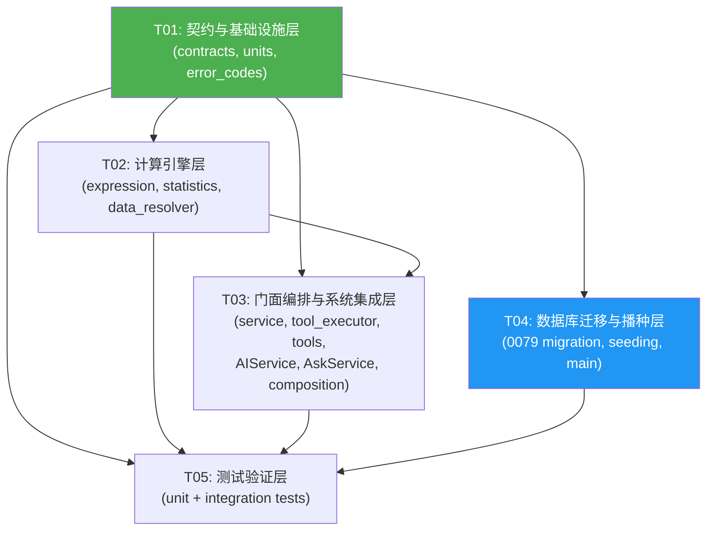

# IRIP AI 数值计算工具 — 任务分解

**状态：** 已完成，待实施

**分解日期：** 2026-08-07

**基于设计文档：** `docs/superpowers/specs/2026-08-07-ai-numeric-tools-design.md`

**代码基线：** `ba869d7`（最新迁移 0078）

---

## 1. 实现方案确认

设计文档选择 **方案 2：独立数值子模块 + ToolExecutor 薄适配**，经审阅现有代码后确认此方案正确且无需调整。理由如下：

1. **ToolExecutor 已有 8 个硬编码分发分支**（`execute_tool` 中 if-elif 链），继续堆入数值解析/统计逻辑会使其成为上帝类，单元测试边界模糊。薄适配方案让 ToolExecutor 只做 `tool_name → facade` 的一行分发，数值逻辑全部隔离在 `packages/ai/numeric/` 子包内。

2. **AskService 的 `_execute_and_finalize` 方法**（约 130 行）已完成"权限检查 → 执行 → 第二轮 → 持久化 → citation"全链路。数值工具只需在返回值中增加 `audit` 和 `citation_params` 两个可选键，AskService 增加兼容归一化即可，不改变现有工具行为。

3. **FactQueryService.get_fact_data** 返回 `{metadata, points, series, task_info, source_file}` 结构，NumericDataResolver 可基于此接口构建（通过 FactQueryService 或等价读取路径），无需改造 FactQueryService 本身。

4. **numpy>=2.0 和 hypothesis>=6.112 已在 pyproject.toml 中**，无需新增第三方依赖。

**一个微调建议：** 设计文档 §17 提到"迁移和代码中的 canonical schema 必须来自同一份可审查定义"。为实现这一点，建议在 `contracts.py` 中定义 `EVALUATE_EXPRESSION_SCHEMA` 和 `DESCRIBE_SERIES_SCHEMA` 两个模块级 dict 常量作为 canonical schema 单一来源，`tools.py` 中的 `ToolSpec.parameters_schema` 直接引用这两个常量，0079 迁移的 INSERT 语句也引用同一常量（通过 Python import 或一致性测试保证）。这样迁移和代码不会漂移。

---

## 2. 文件列表

### 2.1 新建文件

| # | 相对路径 | 说明 |
|---|---------|------|
| 1 | `packages/ai/numeric/__init__.py` | 子包初始化，导出公开接口 |
| 2 | `packages/ai/numeric/contracts.py` | 内部数据类型、canonical schema 常量、限制配置、选项/请求/结果 dataclass |
| 3 | `packages/ai/numeric/units.py` | 轻量单位标签检查与传播（UnitTag 三态系统） |
| 4 | `packages/ai/numeric/expression.py` | SafeExpressionEngine：AST 校验 + 白名单递归解释 |
| 5 | `packages/ai/numeric/statistics.py` | SeriesStatisticsService：描述统计、口径、空值策略 |
| 6 | `packages/ai/numeric/data_resolver.py` | NumericDataResolver：解析 scalar/inline/fact_series/artifact_series |
| 7 | `packages/ai/numeric/service.py` | NumericToolFacade：编排解析→计算→摘要→审计→引用 |
| 8 | `migrations/versions/0079_ai_numeric_tools.py` | 增量迁移：INSERT 两个数值工具 + 降级 |
| 9 | `tests/unit/ai/numeric/__init__.py` | 测试包初始化 |
| 10 | `tests/unit/ai/numeric/test_contracts.py` | 契约测试：字段组合、变量名、限制、schema 一致性 |
| 11 | `tests/unit/ai/numeric/test_units.py` | 单位策略测试 |
| 12 | `tests/unit/ai/numeric/test_expression.py` | AST 安全测试 + 表达式正确性测试 |
| 13 | `tests/unit/ai/numeric/test_statistics.py` | 统计正确性测试 + 空值策略测试 |
| 14 | `tests/unit/ai/numeric/test_data_resolver.py` | Resolver 与权限测试 |
| 15 | `tests/unit/ai/numeric/test_service.py` | NumericToolFacade 审计/引用/digest 测试 |
| 16 | `tests/unit/ai/test_numeric_seeding_migration.py` | 播种与迁移测试 |
| 17 | `tests/integration/ai/test_numeric_tools.py` | AskService fake-provider 集成测试 |

### 2.2 修改文件

| # | 相对路径 | 修改内容 |
|---|---------|---------|
| 1 | `packages/common/error_codes.py` | 新增 11 个 `numeric_*` 错误码枚举成员 |
| 2 | `packages/ai/tools.py` | `WHITELIST_TOOLS` 元组新增 `evaluate_expression` 和 `describe_series` 两个 ToolSpec（schema 引用 contracts.py 常量） |
| 3 | `packages/ai/tool_executor.py` | 构造函数增加 `numeric_tools: NumericToolFacade \| None`；`execute_tool` 增加两个分发分支 + `_require_numeric_tools` |
| 4 | `packages/ai/service.py` | `__init__` 接受/构建 `NumericToolFacade` 并注入 ToolExecutor |
| 5 | `packages/ai/ask_service.py` | `_execute_and_finalize` 增加工具结果归一化（llm_payload / audit / citation_params 三路分流） |
| 6 | `packages/ai/tool_seeding.py` | `seed_tools_if_empty` 改为 `seed_missing_builtin_tools`（逐个补齐缺失项） |
| 7 | `apps/api/composition/ai.py` | 显式注入 NumericToolFacade 依赖（session factory、Fact 查询、artifact repo、S3 client、限制配置） |
| 8 | `apps/api/main.py` | lifespan 调用从 `seed_tools_if_empty` 改为 `seed_missing_builtin_tools` |

---

## 3. 任务列表

### T01: 契约与基础设施层

**任务描述：** 搭建数值子包的基础设施——内部数据类型、canonical schema 常量、资源限制配置、单位标签系统和新增错误码。这是所有后续任务的依赖基石。

**涉及文件：**
- `packages/ai/numeric/__init__.py`（新建）
- `packages/ai/numeric/contracts.py`（新建）
- `packages/ai/numeric/units.py`（新建）
- `packages/common/error_codes.py`（修改）

**依赖：** 无

**预期产出：**
- `contracts.py` 定义以下 dataclass 和常量：
  - `NumericPrincipal`（user_id, department_id, roles）
  - `NumericSourceProvenance`（source_type, fact_id, artifact_id, artifact_sha256, series_index, column_name, row_count）
  - `ResolvedNumericInput`（name, values: NDArray[float64], null_mask: NDArray[bool_], unit, source_provenance, input_digest）
  - `NumericExecutionResult`（summary, llm_data, audit_data, citation_params）
  - `ExpressionOptions`（angle_unit, null_policy, numeric_coercion, broadcast_policy, domain_error, numeric_type）
  - `DescribeSeriesRequest`（statistics, quantiles, variance_mode, null_policy）
  - `NumericLimits`（frozen dataclass：表达式长度 512、AST 节点 128、深度 16、变量 16、内联 10000、平台 100000、预览阈值 1000、超时 3s）
  - `EVALUATE_EXPRESSION_SCHEMA` / `DESCRIBE_SERIES_SCHEMA` canonical dict 常量
  - `NumericSource` 输入解析类型
  - `NumericValue` 结果类型（scalar | vector）
  - 常量 `NUMERIC_ENGINE_VERSION = "numeric-v1"`
- `units.py` 实现 `UnitTag` 三态系统（KNOWN / DIMENSIONLESS / UNKNOWN）和全部运算传播规则
- `error_codes.py` 新增 11 个错误码：
  - `numeric_expression_rejected` (422)
  - `numeric_invalid_source` (422)
  - `numeric_field_not_found` (422)
  - `numeric_non_numeric` (422)
  - `numeric_domain_error` (422)
  - `numeric_divide_by_zero` (422)
  - `numeric_unit_conflict` (422)
  - `numeric_size_limit` (413)
  - `numeric_non_finite_result` (422)
  - `numeric_timeout` (422)
  - `numeric_internal_error` (500)
- `__init__.py` 导出公开接口

---

### T02: 计算引擎层

**任务描述：** 实现三个核心计算组件——受限表达式引擎（AST 校验 + 白名单解释）、描述统计服务、数据解析器。这是数值工具的计算核心，全部为纯 CPU 逻辑，可独立单元测试。

**涉及文件：**
- `packages/ai/numeric/expression.py`（新建）
- `packages/ai/numeric/statistics.py`（新建）
- `packages/ai/numeric/data_resolver.py`（新建）

**依赖：** T01（contracts.py 的类型定义、limits 配置、units.py 的单位检查）

**预期产出：**
- `expression.py` 实现 `ExpressionValidator`（遍历 AST 验证节点种类/数量/深度/标识符/函数）和 `ExpressionInterpreter`（递归解释已验证节点），封装为 `SafeExpressionEngine.evaluate(expression, variables, options) → NumericValue`：
  - 使用 `ast.parse(expression, mode="eval")` 只生成表达式 AST
  - 白名单函数：abs/sqrt/exp/log/log10/sin/cos/tan/asin/acos/atan/atan2/floor/ceil/round/minimum/maximum/clip/where/count/sum/mean/min/max/median/var/std/quantile
  - 常量 pi、e；运算符 +、-、*、/、**、%、比较（仅 where 条件）
  - 资源限制执行（节点数 128、深度 16、超时 3s）
  - 广播规则（标量广播、等长序列、长度不一致拒绝）
  - null_policy fail/propagate
  - 稳定求和（math.fsum 标量、numpy 成对求和数组）
  - 除零/定义域/非有限检查
  - 结果截断（>1000 返回 head/tail/sha256 预览）
  - 不使用 compile/eval/exec，不暴露 NumPy 模块或 builtins
- `statistics.py` 实现 `SeriesStatisticsService.describe(source, request) → StatisticsResult`：
  - count/valid_count/missing_count/sum/mean/min/max/median/quantile/skewness/kurtosis
  - population/sample variance/std，variance_mode=both 时返回两者
  - 线性插值分位数（与 NumPy method="linear" 对齐）
  - bias-corrected Fisher–Pearson skewness（n>=3）
  - unbiased Fisher excess kurtosis（n>=4）
  - 样本不足时单项返回 null + warning
  - 零方差序列偏度/峰度返回 null + warning
  - null_policy: fail/omit/propagate
  - 空序列仅 count/missing_count
- `data_resolver.py` 实现 `NumericDataResolver.resolve(source, principal) → ResolvedNumericInput`：
  - scalar：校验有限 JSON number，转 float64
  - inline：校验数组长度/类型，转 float64 + null_mask，计算 SHA-256 input_digest
  - fact_series：要求 fact:read，创建当前用户 scoped session（RLS），通过 FactQueryService 加载 Fact + 权威 artifact，定位 series_index/column_name，提取单位/artifact_id/sha256/row_count
  - artifact_series：要求 artifact:read，通过 artifact repository + 对象存储读取，校验租户可见性
  - 跨租户/不存在统一返回 not_found
  - 拒绝 bool/字符串/嵌套数组/NaN/Infinity

---

### T03: 门面编排与系统集成层

**任务描述：** 实现 NumericToolFacade 编排层，并将数值工具接入现有 AI Tool 链路——ToolSpec 注册、ToolExecutor 薄分发、AIService 依赖注入、AskService 结果归一化、composition root 显式注入。此任务完成后，数值工具可端到端调用（但数据库中尚无种子数据）。

**涉及文件：**
- `packages/ai/numeric/service.py`（新建）
- `packages/ai/tools.py`（修改）
- `packages/ai/tool_executor.py`（修改）
- `packages/ai/service.py`（修改）
- `packages/ai/ask_service.py`（修改）
- `apps/api/composition/ai.py`（修改）

**依赖：** T01（contracts/schema/error_codes）、T02（expression/statistics/data_resolver）

**预期产出：**
- `service.py` 实现 `NumericToolFacade`：
  - `evaluate_expression(args, principal) → NumericExecutionResult`：解析 args → resolve variables → evaluate expression → 生成 summary/llm_data/audit_data/citation_params
  - `describe_series(args, principal) → NumericExecutionResult`：解析 args → resolve series → describe → 生成 summary/llm_data/audit_data/citation_params
  - 审计数据不含原始数组（只含 count/unit/digest/expression/result_type/sha256/truncated/warnings/duration_ms）
  - citation_params 使用净化、稳定排序的参数（engine_version/tool/表达式/来源/digest/策略/结果digest/时间戳）
  - 错误转换为结构化 `NumericError`（code/message/path/details），details 不含原始值
  - CPU 计算通过 `asyncio.to_thread()` 在有界线程中执行
- `tools.py` 修改：
  - `WHITELIST_TOOLS` 元组新增两个 ToolSpec（`evaluate_expression` 和 `describe_series`），`parameters_schema` 引用 `contracts.py` 中的 canonical 常量
  - `required_permission = "assistant:use"`，`category = "ai_tool"`
  - `ALL_TOOLS`、`AI_TOOL_NAMES`、`ALL_TOOL_NAMES` 自动包含新工具
- `tool_executor.py` 修改：
  - `__init__` 增加 `numeric_tools: NumericToolFacade | None = None` 参数
  - `execute_tool` 增加两个分发分支（调用 `self._require_numeric_tools().evaluate_expression/describe_series`）
  - 新增 `_require_numeric_tools()` 辅助方法（numeric_tools 为 None 时抛 internal_error）
  - 从 `user` + `org_id` 构造 `NumericPrincipal`（不从工具参数构造）
- `service.py` (AIService) 修改：
  - `__init__` 增加 `numeric_tools: NumericToolFacade | None = None` 参数
  - 将 `numeric_tools` 注入 `ToolExecutor` 构造
- `ask_service.py` 修改：
  - `_execute_and_finalize` 中工具执行后增加归一化逻辑：
    - 检测结果中是否含 `audit` / `citation_params` 键
    - 含则：`llm_payload = data`，`persisted_audit = audit`，`citation_payload = citation_params`
    - 不含则：保持现有行为（audit = result，citation = tool_args）
  - 第二轮 tool message 只发送 `llm_payload`（不含 audit）
  - `executed_tool_calls` 持久化使用 `persisted_audit`
  - citation 生成使用 `citation_payload`（而非原始 tool_args）
- `composition/ai.py` 修改：
  - `_get_ai_service_dep` 中构建 `NumericToolFacade`（注入 session_factory、Fact 查询能力、artifact repo、S3 client、NumericLimits 配置）
  - 将 `NumericToolFacade` 传入 `AIService` 构造

---

### T04: 数据库迁移与播种层

**任务描述：** 创建 0079 迁移插入两个数值工具种子数据，并将启动播种逻辑从"表空时全量写入"改为"逐个补齐缺失内置工具"。此任务可与 T02/T03 并行推进，仅依赖 T01 中的 canonical schema 定义。

**涉及文件：**
- `migrations/versions/0079_ai_numeric_tools.py`（新建）
- `packages/ai/tool_seeding.py`（修改）
- `apps/api/main.py`（修改）

**依赖：** T01（contracts.py 的 canonical schema 常量）

**预期产出：**
- `0079_ai_numeric_tools.py`：
  - `revision = "0079"`, `down_revision = "0078"`
  - `upgrade()`：使用 `INSERT ... ON CONFLICT (name) DO NOTHING` 插入两个工具，schema 引用 `contracts.py` canonical 常量（通过 import 或序列化为 JSON 字符串），固定 UUID，`enabled=true`，`category='ai_tool'`，`required_permission='assistant:use'`
  - `downgrade()`：按 name 删除这两个内置工具（不影响其他记录）
  - 不覆盖管理员已编辑的显示名/描述/schema/enabled
- `tool_seeding.py` 修改：
  - `seed_tools_if_empty(session)` 改为 `seed_missing_builtin_tools(session)`
  - 遍历 `ALL_TOOLS`，逐个按 name 检查是否存在，缺失则 INSERT，冲突不更新
  - 返回本次新插入的行数
  - 保留 `_insert_one` 辅助函数
- `main.py` 修改：
  - lifespan 中调用从 `seed_tools_if_empty` 改为 `seed_missing_builtin_tools`
  - 更新 import 和注释

---

### T05: 测试验证层

**任务描述：** 编写全部单元测试、安全测试、属性测试、迁移测试和 fake-provider 集成测试，覆盖设计文档 §19 的全部测试策略和 §20 的验收场景。

**涉及文件：**
- `tests/unit/ai/numeric/__init__.py`（新建）
- `tests/unit/ai/numeric/test_contracts.py`（新建）
- `tests/unit/ai/numeric/test_units.py`（新建）
- `tests/unit/ai/numeric/test_expression.py`（新建）
- `tests/unit/ai/numeric/test_statistics.py`（新建）
- `tests/unit/ai/numeric/test_data_resolver.py`（新建）
- `tests/unit/ai/numeric/test_service.py`（新建）
- `tests/unit/ai/test_numeric_seeding_migration.py`（新建）
- `tests/integration/ai/test_numeric_tools.py`（新建）

**依赖：** T01（contracts/units/error_codes）、T02（expression/statistics/resolver）、T03（facade/集成）、T04（migration/seeding）

**预期产出：**
- `test_contracts.py`：
  - 四种来源合法/非法字段组合
  - 变量名、重复名、未知字段、长度/数量限制
  - 非法 UUID、series_index、column_name
  - JSON bool/字符串/嵌套数组/NaN/Infinity 拒绝
  - ToolSpec schema 与 contracts.py canonical 常量一致性
- `test_units.py`：
  - 同单位加减成功；MPa + K 拒绝
  - 已知与未知单位运算产生 warning
  - 乘除和幂标签传播
  - 方差单位平方、标准差单位不变
  - 有单位输入调用 log/exp/trig 拒绝
  - 平台单位不可覆盖
- `test_expression.py`：
  - AST 攻击语料全部拒绝（`__import__`、`x.__class__`、`open`、列表推导、lambda、下标、globals 等）
  - 标量四则/优先级/一元/幂/模
  - 标量与序列广播、等长序列、长度不一致拒绝
  - 全部白名单函数
  - degree/radian 转换
  - log/sqrt/asin/acos 定义域
  - 除零、溢出、非有限中间值
  - 聚合、ddof、quantile
  - 向量返回和截断摘要
  - 稳定求和灾难性抵消样例
  - Hypothesis 有限浮点属性测试（与 math.fsum/NumPy 交叉验证）
  - 随机 AST、超深括号、巨大整数/指数模糊测试
- `test_statistics.py`：
  - 空序列、单元素、双元素、常量序列
  - 正负数、极大/极小数、重复值
  - population/sample variance
  - linear quantile（与 NumPy 交叉验证）
  - adjusted Fisher–Pearson skewness
  - unbiased Fisher excess kurtosis
  - 三种 null policy
  - 样本不足 null + warning，其他指标仍成功
  - 基准序列 [1..100] 验收值（count=100, sum=5050, mean=50.5, pop_var=833.25, sample_var=841.666...）
- `test_data_resolver.py`：
  - inline 不读数据库
  - Fact 经当前用户 scoped session/RLS 读取
  - Artifact 直引检查 artifact:read
  - 跨租户/无权限/不存在统一 not_found
  - artifact hash/行数/series/column 正确进入 provenance
  - 非数值列和不支持 artifact 结构拒绝
  - system_context 数据篡改时仍以服务端 artifact 为准
- `test_service.py`：
  - data/audit/citation_params 正确分流
  - 审计不含原始内联数组和完整平台序列
  - digest 对相同规范输入稳定，对输入变化敏感
  - citation 包含引擎版本、来源 hash、策略和结果 digest
  - 向量截断状态和 warnings 进入审计
  - 旧工具 {summary, data} 行为回归不变
- `test_numeric_seeding_migration.py`：
  - 空数据库升级得到全部内置工具
  - 已有部分工具的数据库升级只补缺失项
  - 同名管理员编辑不被覆盖
  - 0079 upgrade/downgrade 可重复验证
  - seed_missing_builtin_tools 幂等性
- `test_numeric_tools.py`（集成测试，fake provider）：
  - 第一轮固定返回数值工具调用
  - 验证 schema、权限和 dispatcher
  - 验证第二轮只收到允许的 data
  - 验证持久化使用压缩 audit
  - 验证 citation 使用净化参数
  - 验证工具禁用后不出现在 schema 且伪造调用失败
  - 验收场景：log([-1,1]) → domain_error；[1,2]/[1,0] → divide_by_zero；MPa+K → unit_conflict；10001 inline → size_limit

---

## 4. 依赖包列表

| 包名 | 版本约束 | 用途 | 是否新增 |
|------|---------|------|---------|
| `numpy` | `>=2.0,<3` | float64 数组、广播、统计计算 | 否（已有） |
| `hypothesis` | `>=6.112,<7` | 属性测试/模糊测试 | 否（已有） |
| `ast` (stdlib) | — | 表达式 AST 解析 | 否（标准库） |
| `math` (stdlib) | — | math.fsum 稳定求和 | 否（标准库） |
| `hashlib` (stdlib) | — | SHA-256 digest | 否（标准库） |

**无需新增任何第三方依赖。**

---

## 5. 共享知识（跨文件约定）

### 5.1 错误码命名

所有数值错误码使用 `numeric_` 前缀，在 `ErrorCode` 枚举中注册。运行时通过 `AppError(code="numeric_domain_error", ...)` 抛出，由 `ErrorCode.to_status_map()` 自动映射 HTTP 状态码。错误对象结构：

```python
{
    "code": "numeric_domain_error",
    "message": "log input must be greater than zero",
    "path": "expression.log",
    "details": {"invalid_count": 2}  # 不含原始值
}
```

### 5.2 工具返回值兼容协议

```
旧工具返回：{"summary": str, "data": dict}
新工具返回：{"summary": str, "data": dict, "audit": dict, "citation_params": dict}
```

AskService 归一化逻辑：检测 `audit` 和 `citation_params` 键是否存在，存在则走新路径（三路分流），不存在则走旧路径（保持现有行为）。

### 5.3 Canonical Schema 单一来源

`EVALUATE_EXPRESSION_SCHEMA` 和 `DESCRIBE_SERIES_SCHEMA` 定义在 `packages/ai/numeric/contracts.py` 中。`tools.py` 的 `ToolSpec.parameters_schema` 直接引用这两个常量。0079 迁移通过 Python import 引用同一常量（迁移文件可以 import 应用代码）。一致性测试在 `test_contracts.py` 中验证 ToolSpec schema 与 canonical 常量完全一致。

### 5.4 NumericPrincipal 构造约定

`NumericPrincipal` 必须从已认证请求上下文（`user.user_id`, `user.department_id`, `user.roles`）构造，不能从工具参数（`args`）构造。在 `ToolExecutor.execute_tool` 中构造后传入 `NumericToolFacade`，协作参与者以自己的身份重新授权。

### 5.5 内部数据类型

- 所有数值内部统一使用 `numpy.float64`（IEEE 754 double）
- null 独立存储为 `numpy.bool_` mask 数组，不混入 float 数组
- 输出 JSON 中 `-0.0` 规范化为 `0.0`
- 任何最终结果中的 NaN 或 Infinity 均视为失败

### 5.6 Digest 计算

- 输入 digest：基于规范二进制表示 + null mask 的 SHA-256
- 表达式 digest：表达式原文的 SHA-256
- 结果 digest：结果规范二进制表示的 SHA-256
- digest 仅用于审计和引用关联，不嵌入原始数组

### 5.7 审计数据排除规则

审计字段中 **绝不** 包含：原始内联数组、完整平台序列、超阈值向量结果。只记录：count、unit、digest、expression 原文（长度有限）、result_type、result sha256、truncated、warnings、policies、duration_ms。

### 5.8 引擎版本

常量 `NUMERIC_ENGINE_VERSION = "numeric-v1"`，定义在 `contracts.py`，写入审计和 citation_params。

### 5.9 CPU 计算线程化

`SafeExpressionEngine.evaluate` 和 `SeriesStatisticsService.describe` 是同步 CPU 密集计算。`NumericToolFacade` 通过 `asyncio.to_thread()` 在有界线程中执行，避免阻塞事件循环。并发信号量限制并行数值请求数。

### 5.10 NumericLimits 配置对象

```python
@dataclass(frozen=True)
class NumericLimits:
    max_expression_length: int = 512
    max_ast_nodes: int = 128
    max_ast_depth: int = 16
    max_variables: int = 16
    max_inline_series_length: int = 10_000
    max_platform_series_length: int = 100_000
    vector_preview_threshold: int = 1_000
    computation_timeout_seconds: float = 3.0
```

此配置在 composition root 注入，模型不可覆盖。第一版按默认值部署。

---

## 6. 任务依赖图



**关键路径：** T01 → T02 → T03 → T05

**可并行：** T04（迁移与播种）仅依赖 T01，可与 T02/T03 并行推进。

---

## 7. 待明确事项

### 7.1 有界线程池的并发限制机制

设计文档 §18 提到"使用有界线程池/并发信号量，防止大量并行数值请求耗尽 API worker"。当前代码库未见统一的线程池配置。需要确认：
- 是在 `NumericToolFacade` 内部维护一个 `asyncio.Semaphore` + `asyncio.to_thread()`？
- 还是使用全局的 `ThreadPoolExecutor`？
- 并发上限的具体数值？

**建议：** 在 `NumericToolFacade.__init__` 中接受 `max_concurrent: int = 4` 参数，内部使用 `asyncio.Semaphore` 限制并发，配合 `asyncio.to_thread()` 执行 CPU 计算。composition root 注入配置值。

### 7.2 Fact 数据读取的精确接口

设计文档 §8.2 提到"通过 FactQueryService 或等价的领域读取接口加载 Fact"。当前 `FactQueryService.__init__` 需要 `session_factory`, `department_id`, `actor_id`, `s3_repo` 四个参数，且使用 `ScopedSessionMixin`。

**需要确认：** `NumericDataResolver` 是直接实例化 `FactQueryService`（需要注入 department_id/actor_id），还是通过 composition root 传入一个已配置的 `FactQueryService` 实例？

**建议：** composition root 在收到请求时，基于 `NumericPrincipal` 构建一个 `FactQueryService` 实例（设置正确的 department_id 和 actor_id），传入 `NumericToolFacade`。`NumericDataResolver` 接受 `FactQueryService` 工厂函数而非固定实例。

### 7.3 Artifact 直引的 repository 接口

设计文档 §8.3 提到"通过当前租户的 artifact repository 和对象存储客户端读取"。代码库中 `ArtifactService`（`packages/common/artifacts.py`）提供 `get_bytes(artifact_id)` 方法。

**需要确认：** `artifact_series` 来源在第一版是否需要完整实现，还是可以先只支持 `scalar`/`inline`/`fact_series` 三种来源，`artifact_series` 标记为"暂不支持"返回 `numeric_invalid_source`？

**建议：** 第一版优先实现 `scalar`/`inline`/`fact_series`（覆盖设计文档验收场景）。`artifact_series` 实现 stub（校验 `artifact:read` 权限后返回 `numeric_invalid_source` + "artifact_series not yet supported"），避免在不清楚 artifact repository 完整接口的情况下引入安全风险。

### 7.4 前端 Fact 清单改动范围

设计文档 §8.4 和 §21 step 10 提到前端 `system_context` 增加稳定 Fact 清单。但前端文件（`apps/web/src/features/assistant/`）的改动是否属于本任务分解范围？

**建议：** 前端改动单独列为后续任务，不在本 5 个任务范围内。数值工具的服务端实现不依赖前端清单——即使前端未改动，模型仍可通过 `fact_id`（从对话历史或其他途径获得）调用数值工具。前端清单只是优化模型参数生成质量的增强项。

### 7.5 ToolSpec 描述与系统提示词的具体文案

设计文档 §15 定义了工具描述原则和系统提示词规则，但具体文案需要撰写。这些文案直接影响模型生成参数的质量。

**建议：** 在 T03 实现时，工具描述文案直接写入 `ToolSpec.description` 字段（跟随 canonical schema 定义在 contracts.py 或直接在 tools.py 的 ToolSpec 中）。系统提示词规则如果需要追加到现有 system prompt 构建逻辑，需确认 system prompt 的构建位置和注入方式。

### 7.6 当前主分支基线故障

设计文档 §23 和 §22 多次提到"当前代码基线已有与本功能无关的 API 导入、依赖锁、静态检查和前端测试故障"。这意味着：

- 数值模块的隔离单测可以独立通过
- fake-provider 集成测试需要确认不依赖基线故障的模块
- 端到端验收在基线故障修复前无法完成

**建议：** T05 中的集成测试使用最小化依赖（只依赖 AIService/AskService/ToolExecutor/ToolRegistry，不依赖基线故障的模块）。如果基线故障阻断了集成测试运行，优先修复基线问题后再运行 T05 集成测试部分。
