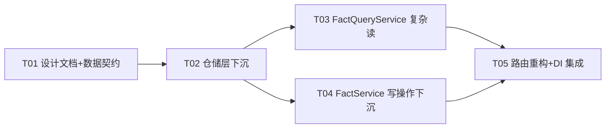

# facts.py 下沉方案与任务分解（系统设计）

> 架构师：高见远 ｜ 目标文件：`apps/api/routers/facts.py`（1246 行，73 处直接 ORM）
> 约束：纯重构——不改变任何业务行为，API URL / 请求体 / 响应体不变；保持 `FactService.__init__` 签名兼容；保持 `scoped_session` GUC 设置方式；权限检查保留在 Router 层；参考已完成的 `governance.py` / `object_types.py` 下沉模式。

---

## Part A：系统设计

### 1. 实现方案（Implementation Approach）

#### 1.1 核心技术难点

1. **"上帝 Router"**：`facts.py` 9 个端点中 8 个直接使用 `session.execute / sa.select / sa.insert / sa.update / sa.delete / sa.text`，共 73 处。`GET /facts/{id}/data` 单个端点约 400 行，含跨包 JOIN（FlowRun→FlowDefinitionVersion→FlowDefinition→ExperimentProject→AppUser→Department→ComponentVersion→IndustrialObject→Equipment）与**绕过 RLS 的 alembic-URL 超管引擎**逻辑。
2. **快照富化（Snapshot Enrichment）重复 4 次**：`list_facts` / `search_facts` / `search_facts_by_data` / `get_fact` 各自手写 `Fact ⟕ FlowRun ⟕ FlowDefinitionVersion ⟕ FlowDefinition (⟕ ExperimentProject)` 的 JOIN，用 `coalesce(FlowDefinition.display_name, Fact.task_name)` 覆盖 `task_name`。差异点：① `list` 版多 JOIN `ExperimentProject` 取 `project_name`，且 JOIN 条件为**双路径** `sa.or_(FV.flow_definition_id==FD.id, Fact.task_code==FD.code)`（无 flow_run 时按 task_code 兜底）；② `search`/`search-data`/`get` 仅单路径 `FV.flow_definition_id==FD.id`，不取 `project_name`。
3. **group_counts 两种语义**：`list`/`search` 用全局 `GROUP BY task_code`（不受分页限制）；`search-data` 用 `fact_id IN (...)` 过滤后的 group count。
4. **data_summary 重复 2 次**：`list` / `search-data` 都执行"查 JSON Artifact → 下载 → 解析 points/series → 拼摘要串"。逻辑相同，且都在**独立 session** 中执行以避免 `ResourceClosedError`（Artifact 下载走 `ArtifactService.get_bytes`，内部自开 session）。
5. **JSON Artifact 查找逻辑重复 3 次**：`list` / `search-data` / `get_fact_data` 都做"优先 `source_artifact_id` 且 `media_type=application/json`，否则 fallback 用 `flow_run_id` 查 `extract_{run_id}.json`"。
6. **写操作的 S3 依赖**：`delete_fact` / `delete_facts_by_task` 需删 MinIO Artifact，依赖 `ArtifactService`（需 `s3_repo`）。但 `FactService.__init__` 签名必须保持兼容，不能注入 `s3_repo`。
7. **archive 的 session 语义特殊**：`archive_fact` 当前用 `session_scope(service.session_factory)`（**不设 GUC**）+ 显式 `Fact.department_id == service.department_id` 过滤；其余写操作用 `service._scoped_session()`（**设 GUC**）。两种 session 语义必须分别保留。

#### 1.2 框架/库选型

| 用途 | 选型 | 理由 |
|------|------|------|
| ORM | SQLAlchemy 2.x async（现有） | 项目既有栈，不引入新依赖 |
| 会话/GUC | `ScopedSessionMixin._scoped_session()` / `scoped_session()` / `session_scope()`（`packages/common/database.py`） | 复用治理层已验证的 RLS GUC 模式 |
| 对象存储 | `ArtifactService` + `S3Repository`（现有） | data_summary 读取 / 删除复用既有服务 |
| 分页 | keyset cursor（`_encode_cursor` / `_decode_cursor`，已在 repository） | 保持现有分页协议不变 |
| 值对象 | `@dataclass(frozen=True)`（`packages/facts/observations.py`） | 与现有 `FactRef` 风格一致 |

#### 1.3 架构模式

沿用 `governance.py` 下沉后的分层（Router → Service → Repository），但**读侧拆分**出独立的 `FactQueryService`：

- **Router**（`apps/api/routers/facts.py`）：权限依赖（`require_permission`）、请求/响应模型、`_ref_to_response` 映射、归属校验（`check_management_permission`）、MinIO Artifact 删除编排。**不含任何 `sa.*` / `session.execute`**。
- **FactService**（`packages/facts/service.py`，写 + 基础 ref）：保持 `__init__(session_factory, department_id, actor_id)` 签名不变；新增写操作（archive）与元数据/删除（DB 侧）。
- **FactQueryService**（`packages/facts/query_service.py`，**新建**，复杂读）：快照富化、group_counts、data_summary、`search_by_data`、`get_fact_data`（含 alembic-URL RLS 绕过）。依赖 `s3_repo`（DI 注入，不破坏 FactService 签名）。
- **FactRepository**（`packages/facts/repository.py`，数据访问）：封装所有 `sa.select/insert/update/delete`，方法为 `async` + 接收 `AsyncSession`。

**为什么新建 FactQueryService 而非全塞进 FactService**：`get_fact_data` 的跨包多级 JOIN + alembic-URL 超管引擎约 300 行，data_summary 需 `s3_repo` 依赖，与 FactService 的纯 DB 写侧关注点不同；合并会使 FactService 再次退化为 god-service。读/写分离后 FactService 保持精简（create + 基础 ref + 写），FactQueryService 承担所有读投影。

---

### 2. 文件列表（File List）

> 相对路径均相对项目根 `/Users/shuipei/Desktop/snowSP/irip/`。

#### 修改文件

| # | 路径 | 改动概要 |
|----|------|----------|
| M1 | `apps/api/routers/facts.py` | 8 个端点瘦身为"权限 + 模型 + 调 service/query_service + 映射"；新增 `get_fact_query_service` DI 占位与 `FactQueryServiceDep`；删除全部直接 ORM。预计 1246 → ~280 行 |
| M2 | `packages/facts/service.py` | FactService 新增：`archive` / `get_fact_meta` / `delete_fact_record` / `get_facts_meta_by_task` / `delete_facts_records`；保留 `create` / `get` / `search` / `list_facts` |
| M3 | `packages/facts/repository.py` | FactRepository 新增静态方法：`fetch_snapshots` / `count_group_by_task` / `search_data_index` / `get_fact_meta` / `get_facts_meta_by_task` / `find_fact_in_dept` / `find_json_artifact` / `find_source_file_artifact` / `delete_facts` / `delete_flow_runs` / `update_fact_status` |
| M4 | `packages/facts/observations.py` | 新增值对象：`FactDetailRow` / `FactMeta` / `FactSnapshotRow`（内部行类型） |
| M5 | `apps/api/composition/facts.py` | 新增 `_get_fact_query_service_dep`（用 `ctx.s3_repo` 构建 `FactQueryService`，含 `_rls_dept_id` 设置），注册到 `dependency_overrides` |

#### 新建文件

| # | 路径 | 内容 |
|----|------|------|
| N1 | `packages/facts/query_service.py` | `FactQueryService`：`list_facts_detail` / `search_facts_detail` / `search_by_data` / `get_fact_detail` / `get_fact_data` + 私有 `_build_data_summary` / `_resolve_task_info` |

#### 设计产物（本次产出）

| # | 路径 | 内容 |
|----|------|------|
| D1 | `docs/system_design.md` | 本文件 |
| D2 | `docs/class-diagram.mermaid` | 类图 |
| D3 | `docs/sequence-diagram.mermaid` | 时序图 |

---

### 3. 数据结构与接口（Data Structures and Interfaces）

> 完整 Mermaid 见 `docs/class-diagram.mermaid`。此处给出方法清单与关系摘要。

#### 3.1 值对象（`packages/facts/observations.py`，新增）

```python
@dataclass(frozen=True)
class FactDetailRow:          # 读投影（list/search/search-data/get-detail 返回）
    fact_id: UUID
    fact_type: str
    subject_id: str
    status: str
    task_code: str | None = None
    task_name: str | None = None
    project_name: str | None = None      # 仅 list_facts_detail 填充
    department_name: str | None = None
    operator: str | None = None
    run_operator: str | None = None
    equipment_name: str | None = None
    data_summary: str | None = None
    created_at: datetime | None = None

@dataclass(frozen=True)
class FactMeta:               # 写侧元数据（delete 前置查询）
    fact_id: UUID
    source_artifact_id: UUID | None
    department_id: UUID | None
    owner_user_id: UUID | None
    flow_run_id: UUID | None

class FactSnapshotRow(NamedTuple):  # 仓储内部行（fetch_snapshots 返回元素）
    fact_id: UUID
    fact_type: str | None
    subject_id: str | None
    status: str | None
    task_code: str | None
    task_name: str | None
    project_name: str | None
    department_name: str | None
    operator: str | None
    run_operator: str | None
    equipment_name: str | None
    created_at: datetime | None
```

#### 3.2 FactRepository（`packages/facts/repository.py`，新增静态方法）

| 方法 | 签名 | 说明 |
|------|------|------|
| `fetch_snapshots` | `(session, fact_ids: list[UUID], *, include_project=False, include_base=False, with_task_code_fallback=False) -> dict[UUID, FactSnapshotRow]` | 统一的快照 JOIN（FlowRun→FlowDefinitionVersion→FlowDefinition，可选→ExperimentProject）。`include_base` 时额外取 `fact_type/subject_id/status`（search-data / get-detail 用）。`with_task_code_fallback=True` 时 JOIN 条件用 `sa.or_(FV.flow_definition_id==FD.id, Fact.task_code==FD.code)`（仅 `list` 版原行为）；其余用单路径 `FV.flow_definition_id==FD.id` |
| `count_group_by_task` | `(session, fact_ids: list[UUID] \| None = None) -> dict[str, int]` | `fact_ids=None`→全局 group count（list/search）；否则按 `IN(...)` 过滤（search-data） |
| `search_data_index` | `(session, *, q, key, value, min_value, max_value, page_size) -> list[UUID]` | FactDataIndex 去重 fact_id 查询；无匹配条件返回 `None`（由调用方校验） |
| `find_fact_in_dept` | `(session, fact_id, dept_id) -> Fact \| None` | dept 范围内查 Fact（archive 用，保留原 `Fact.department_id==dept AND id==fact_id` 语义） |
| `update_fact_status` | `(session, fact_id, status) -> None` | archive 状态更新 |
| `get_fact_meta` | `(session, fact_id) -> FactMeta \| None` | 取 `source_artifact_id/department_id/owner_user_id/flow_run_id` |
| `get_facts_meta_by_task` | `(session, task_code) -> list[FactMeta]` | 批量取（`id, source_artifact_id, flow_run_id`） |
| `find_json_artifact` | `(session, fact_id) -> Artifact \| None` | JSON Artifact 查找（source_artifact_id 优先，fallback `extract_{flow_run_id}.json`） |
| `find_source_file_artifact` | `(session, fact_id) -> Artifact \| None` | 非 JSON 原始文件（PDF 等） |
| `delete_facts` | `(session, fact_ids: list[UUID]) -> None` | `sa.delete(Fact).where(id.in_(...))`（FK CASCADE 自动删 FactDataIndex） |
| `delete_flow_runs` | `(session, flow_run_ids: list[UUID]) -> None` | `sa.delete(FlowRun).where(id.in_(...))` |

> 保留既有：`insert_fact` / `get_fact` / `search_facts` / `list_facts` / `find_by_idempotency_key`。

#### 3.3 FactService（`packages/facts/service.py`，新增方法）

> `__init__(session_factory, department_id, actor_id)` **签名不变**。保留 `create` / `get` / `search` / `list_facts`。

| 方法 | 签名 | session 语义 | 说明 |
|------|------|-------------|------|
| `archive` | `(fact_id: UUID) -> None` | `session_scope(self._factory)`（**不设 GUC**，保留原行为） | `find_fact_in_dept` → not_found → `update_fact_status("archived")` |
| `get_fact_meta` | `(fact_id: UUID) -> FactMeta` | `self._scoped_session()` | `repo.get_fact_meta` → None 则 raise `not_found` |
| `delete_fact_record` | `(fact_id: UUID, flow_run_id: UUID \| None = None) -> None` | **两个独立 session**（保留原 Fact/FlowRun 分离事务边界） | session1: `delete_facts([fact_id])`；session2: `delete_flow_runs([flow_run_id])` |
| `get_facts_meta_by_task` | `(task_code: str) -> list[FactMeta]` | `self._scoped_session()` | `repo.get_facts_meta_by_task` |
| `delete_facts_records` | `(fact_ids: list[UUID], flow_run_ids: list[UUID]) -> None` | **两个独立 session**（保留原分离边界） | session1: `delete_facts`；session2: `delete_flow_runs` |

#### 3.4 FactQueryService（`packages/facts/query_service.py`，新建）

```python
class FactQueryService(ScopedSessionMixin):
    def __init__(self, session_factory, department_id, actor_id, s3_repo) -> None: ...
    # 公开只读属性：department_id / session_factory / actor_id（同 FactService）
    def _artifact_service(self) -> ArtifactService: ...   # 用 s3_repo + session_factory + dept + actor 构建
    async def list_facts_detail(self, *, filters, cursor, page_size) -> tuple[list[FactDetailRow], str | None, dict[str, int]]: ...
    async def search_facts_detail(self, *, query, filters, cursor, page_size) -> tuple[list[FactDetailRow], str | None, dict[str, int]]: ...
    async def search_by_data(self, *, q, key, value, min_value, max_value, page_size) -> tuple[list[FactDetailRow], dict[str, int]]: ...
    async def get_fact_detail(self, fact_id: UUID) -> FactDetailRow: ...
    async def get_fact_data(self, fact_id: UUID) -> dict: ...
    # 私有
    async def _build_data_summary(self, fact_id, session, artifact_service) -> str | None: ...
    async def _resolve_task_info(self, fact_record, session) -> dict: ...   # 含 alembic-URL 绕过 + fallback
```

| 方法 | 行为要点 |
|------|----------|
| `list_facts_detail` | ① `repo.list_facts` → 基础 dict + fact_ids；② session A：`fetch_snapshots(fact_ids, include_project=True, with_task_code_fallback=True)` + `count_group_by_task(None)`；③ session B（独立，避免 ResourceClosedError）：逐项 `find_json_artifact` + `ArtifactService.get_bytes` → `_build_data_summary`；④ 组装 `FactDetailRow` |
| `search_facts_detail` | ① `repo.search_facts` → fact_ids；② session A：`fetch_snapshots(fact_ids, include_project=False)` + `count_group_by_task(None)`；③ **不做 data_summary**（与原 `search` 一致） |
| `search_by_data` | ① session：`search_data_index` → fact_ids（空则直接返回空）；② `fetch_snapshots(fact_ids, include_project=False, include_base=True)` → items；③ `count_group_by_task(fact_ids)`；④ `find_json_artifact` + data_summary |
| `get_fact_detail` | ① `repo.get_fact`（not_found 抛出）；② `fetch_snapshots([fact_id], include_base=True)` → 组装 `FactDetailRow` |
| `get_fact_data` | 完整保留原 `get_fact_data` 逻辑：`find_json_artifact` → 下载解析 → `_resolve_task_info`（快照优先 → flow_run_id 的 alembic-URL 超管引擎补查 data_source_list → fallback 用 fact 自身 GUC 反查）→ `find_source_file_artifact` → 返回 `result_data` dict |

#### 3.5 Router（`apps/api/routers/facts.py`，重构后）

保留：`CreateFactRequest` / `FactResponse` / `FactListResponse` / `_ref_to_response` / `WriteUserDep` / `ReadUserDep` / `get_fact_service` / `FactServiceDep`。
新增：`get_fact_query_service`（DI 占位） / `FactQueryServiceDep`。

| 端点 | 重构后职责 |
|------|------------|
| `POST /facts` | **不变**（`service.create`） |
| `GET /facts` | `query_service.list_facts_detail` → 映射 `FactDetailRow`→`FactResponse` |
| `GET /facts/search` | `query_service.search_facts_detail` → 映射 |
| `GET /facts/search-data` | 参数校验（至少一个条件，保留）→ `query_service.search_by_data` → 映射 |
| `GET /facts/{id}` | `query_service.get_fact_detail` → 映射 |
| `GET /facts/{id}/data` | `query_service.get_fact_data` → 原样返回 dict |
| `POST /facts/{id}/archive` | `service.archive` |
| `DELETE /facts/{id}` | `meta = service.get_fact_meta` → `check_management_permission`（router）→ 删 MinIO（router，`ArtifactService`）→ `service.delete_fact_record(fact_id, meta.flow_run_id)` |
| `DELETE /facts/by-task/{task_code}` | `metas = service.get_facts_meta_by_task` → 删 MinIO（router 循环）→ `service.delete_facts_records(fact_ids, flow_run_ids)` |

---

### 4. 程序调用流（Program Call Flow）

> 完整 Mermaid 见 `docs/sequence-diagram.mermaid`。此处列三个关键流程摘要。

#### 4.1 `GET /facts`（list_facts_detail）
Router → `FactQueryService.list_facts_detail` → `FactRepository.list_facts`（分页）→ session A：`fetch_snapshots` + `count_group_by_task` → session B：`find_json_artifact` + `ArtifactService.get_bytes` + `_build_data_summary` → 返回 `(items, next_cursor, group_counts)` → Router 映射 `FactResponse`。

#### 4.2 `GET /facts/{id}/data`（get_fact_data）
Router → `FactQueryService.get_fact_data` → `find_json_artifact` → `ArtifactService.get_bytes`（下载 JSON）→ `_resolve_task_info`：快照字段命中？→ 是：alembic-URL 超管引擎补查 data_source_list；否：fact 自身 GUC 反查 FlowRun 链 → `find_source_file_artifact` → 返回 dict。

#### 4.3 `DELETE /facts/{id}`（delete_fact）
Router → `FactService.get_fact_meta`（not_found 校验）→ Router `check_management_permission` → Router 删 MinIO Artifact（`ArtifactService.delete_artifact`）→ `FactService.delete_fact_record`（session1 删 Fact / session2 删 FlowRun）。

---

### 5. 待明确事项（Anything UNCLEAR）

1. **archive 的 session 语义**：原 `archive_fact` 用 `session_scope(service.session_factory)` **不设 GUC** + 显式 `Fact.department_id==service.department_id` 过滤。设计中新 `FactService.archive` **保留此行为**（不切换到 `_scoped_session`）。若评审认为应统一为带 GUC 的 `_scoped_session`，需确认 fact 表当前是否已启用 RLS（启用后无 GUC 会 fail-closed）。**假设：保持原样，不改 session 语义。**

2. **delete 的事务边界**：原 `delete_fact` / `delete_facts_by_task` 将"删 Fact"与"删 FlowRun"放在**两个独立 `_scoped_session`**（两个独立事务）中。设计中新 `FactService.delete_fact_record` / `delete_facts_records` **保留两段独立 session**，以严格"不改变行为"。若评审希望改为单事务原子删除，需明确批准（属行为变更：失败回滚语义不同）。**假设：保留分离边界。**

3. **`get_fact_data` 的 not_found 分支**：原代码 `fact = await service.get(fact_id); if fact is None: return empty`，但 `service.get` 在 fact 不存在时**抛 `not_found`**，故 `if fact is None` 为死分支（实际会 404）。设计中 `FactQueryService.get_fact_data` 用 `repo.get_fact`（抛 not_found）保持"实际 404"行为；如需保留字面"返回空 dict"死分支，请明示。**假设：按实际行为（404）实现，不保留死分支。**

4. **`get_fact_data` 的 alembic-URL 超管引擎**：该逻辑读 `IRIP_ALEMBIC_DATABASE_URL` 环境变量、替换驱动为 `psycopg_async`、开独立 engine 绕过 RLS 补查跨部门元数据。**设计中原样搬迁至 `FactQueryService._resolve_task_info`，不改任何连接/SQL/GUC 细节**。此为最高风险点，建议搬迁后做端到端回归（含跨部门 fact 的 data 接口）。

5. **`s3_repo` 注入**：`FactQueryService.__init` 新增 `s3_repo` 参数（`ctx.s3_repo` 注入）。`FactService.__init` **不**新增 `s3_repo`（保持兼容）；写侧删 MinIO 仍由 Router 用 `ArtifactService` 编排。如希望写侧也下沉 MinIO 删除，需放宽"FactService.__init__ 兼容"约束或改用方法参数注入。**假设：写侧 MinIO 删除保留在 Router。**

6. **`FactService.list_facts` / `search` / `get` 去留**：这些既有方法目前仍被 Router 调用（取基础 ref）。重构后 Router 改用 `FactQueryService`，这些方法**是否仍有其他调用方**未全量排查。设计选择**保留不删**（向后兼容），仅 Router 不再调用 `list_facts`/`search`；`get` 在 `get_fact_detail` 内部可继续复用或改走 repository。**假设：保留全部既有方法，不删除。**

7. **`search-data` 的参数校验位置**：原 Router 内 `if not conditions: raise AppError(validation_failed)`。设计**保留在 Router**（与权限/模型校验同层）。若希望全部下沉到 service，可调整。**假设：保留在 Router。**

8. **`data_summary` 的 session 隔离**：原 `list` 注释"在独立 session 中执行，避免 ResourceClosedError"（Artifact 下载后原 session 结果集已关闭）。设计中 `list_facts_detail` / `search_by_data` 的 snap+count 与 data_summary **分别用独立 session**，保留此隔离。

---

## Part B：任务分解

### 6. 依赖包（Required Packages）

无新增第三方包。全部基于项目既有栈：

```
- sqlalchemy>=2.0: ORM（已有）
- fastapi: 路由/依赖注入（已有）
- pydantic: 请求/响应模型（已有）
- packages.common.artifacts.ArtifactService: 对象存储读写（已有）
- packages.common.database.ScopedSessionMixin/scoped_session/session_scope: 会话/GUC（已有）
```

### 7. 任务列表（按依赖排序）

| Task | 名称 | 源文件 | 依赖 | 优先级 |
|------|------|--------|------|--------|
| T01 | 设计文档 + 数据契约（DTO） | `docs/system_design.md`、`docs/class-diagram.mermaid`、`docs/sequence-diagram.mermaid`、`packages/facts/observations.py` | — | P0 |
| T02 | 仓储层下沉（Repository） | `packages/facts/repository.py`、`packages/facts/observations.py`、`packages/facts/query_service.py`（模块骨架+导入） | T01 | P0 |
| T03 | FactQueryService（复杂读） | `packages/facts/query_service.py`、`packages/facts/repository.py`、`packages/facts/observations.py` | T02 | P0 |
| T04 | FactService 写操作下沉 | `packages/facts/service.py`、`packages/facts/repository.py`、`packages/facts/observations.py` | T02 | P1 |
| T05 | 路由重构 + DI 集成 | `apps/api/routers/facts.py`、`apps/api/composition/facts.py`、`packages/facts/query_service.py` | T03、T04 | P0 |

**任务说明**：

- **T01 — 设计文档 + 数据契约**：产出 3 份设计文档；在 `observations.py` 新增 `FactDetailRow` / `FactMeta` / `FactSnapshotRow` 值对象（所有后续任务的返回类型契约）。
- **T02 — 仓储层下沉**：在 `repository.py` 实现全部新静态方法（`fetch_snapshots` / `count_group_by_task` / `search_data_index` / `find_fact_in_dept` / `update_fact_status` / `get_fact_meta` / `get_facts_meta_by_task` / `find_json_artifact` / `find_source_file_artifact` / `delete_facts` / `delete_flow_runs`）；创建 `query_service.py` 模块骨架（导入 + 类占位），供 T03 填充。
- **T03 — FactQueryService**：实现 `list_facts_detail` / `search_facts_detail` / `search_by_data` / `get_fact_detail` / `get_fact_data` + 私有 `_build_data_summary` / `_resolve_task_info`（含 alembic-URL 绕过原样搬迁）。
- **T04 — FactService 写操作下沉**：`service.py` 新增 `archive` / `get_fact_meta` / `delete_fact_record` / `get_facts_meta_by_task` / `delete_facts_records`；`__init__` 签名不变。
- **T05 — 路由重构 + DI 集成**：`facts.py` 8 个端点瘦身（删除全部直接 ORM，保留权限/模型/归属校验/MinIO 删除编排）；`composition/facts.py` 新增 `FactQueryService` DI（`ctx.s3_repo`）；校验 `facts.py` 内 `sa.select/insert/update/delete/text/session.execute` 归零。

### 8. 共享知识（Shared Knowledge）

```
- 分层约定：Router 不含任何 sa.* / session.execute；Service 不含 HTTP/Pydantic；Repository 不含业务规则。
- session 语义：
  · 写/读带 RLS → ScopedSessionMixin._scoped_session()（设 dept+user GUC）
  · archive 例外 → session_scope(self._factory)（不设 GUC，保留原行为）
  · delete_fact_record / delete_facts_records → Fact 删除与 FlowRun 删除分两个独立 session（保留原事务边界）
- FactService.__init__(session_factory, department_id, actor_id) 签名不可变；_rls_dept_id 由 composition 注入。
- FactQueryService.__init__(session_factory, department_id, actor_id, s3_repo) — s3_repo 由 composition 用 ctx.s3_repo 注入。
- 快照富化统一走 FactRepository.fetch_snapshots(fact_ids, include_project=, include_base=)；task_name = coalesce(FlowDefinition.display_name, Fact.task_name)。
- group_counts：list/search 用全局 count_group_by_task(None)；search-data 用 count_group_by_task(fact_ids)。
- data_summary 与 snap/count 分独立 session（避免 Artifact 下载导致 ResourceClosedError）。
- JSON Artifact 查找统一走 FactRepository.find_json_artifact（source_artifact_id 优先，fallback extract_{flow_run_id}.json）。
- 权限：require_permission("fact:read"/"fact:write") 保留 Router；delete_fact 的 check_management_permission 保留 Router。
- MinIO Artifact 删除（delete_fact/delete_facts_by_task）保留 Router 编排（FactService 不注入 s3_repo）。
- get_fact_data 的 alembic-URL 超管引擎逻辑原样搬迁至 FactQueryService._resolve_task_info，不改连接/SQL/GUC。
- API URL / 请求体 / 响应体 / 状态码 / 错误码完全不变。
- 所有时间字段序列化为 ISO 8601（created_at.isoformat()）。
```

### 9. 任务依赖图（Task Dependency Graph）



> T03 与 T04 仅依赖 T02，可并行；T05 汇聚两者。关键路径：T01 → T02 → T03 → T05。
