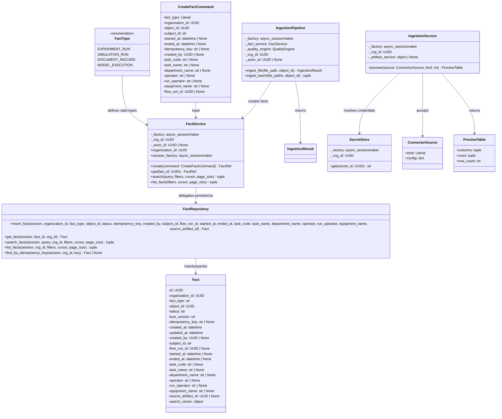
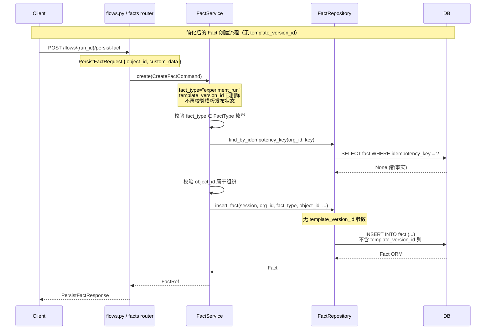
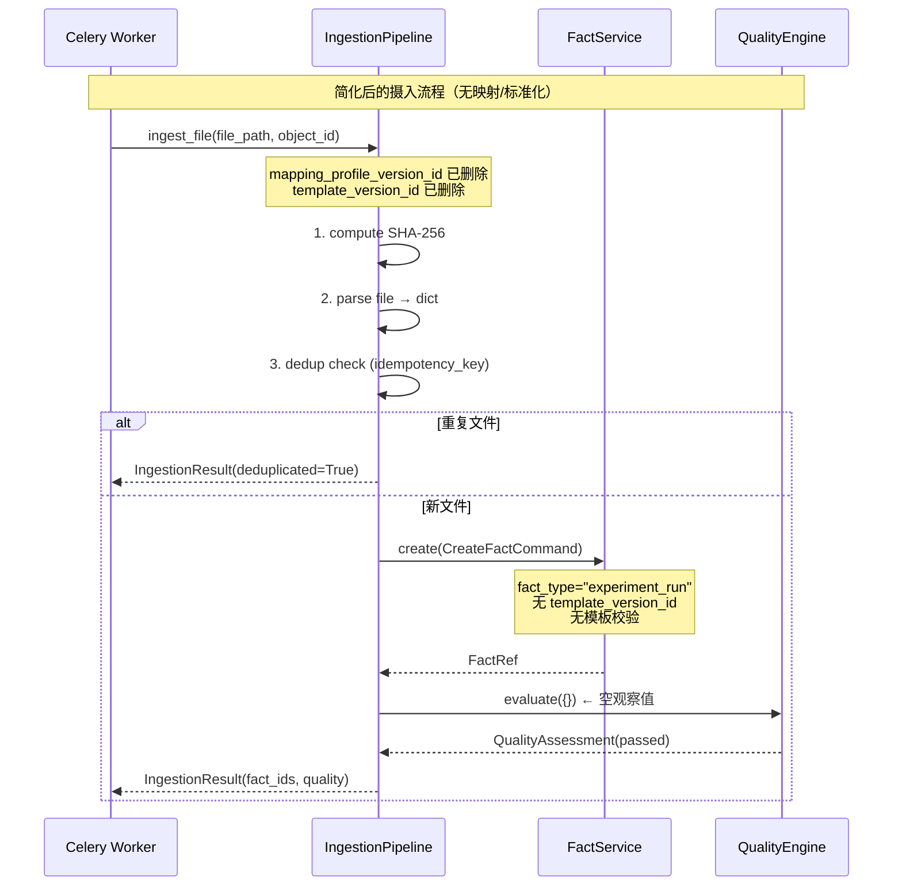
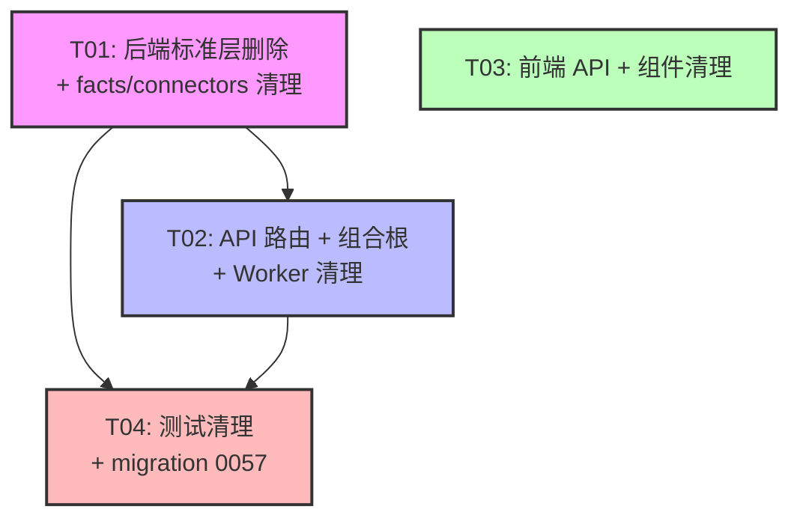

# IRIP 标准层空表清理 — 系统设计文档

## Part A: System Design

### 1. Implementation Approach

#### 1.1 核心技术挑战

本次任务的核心挑战不是"建表"，而是"删表 + 全链路引用清理"。10 张表（variable / variable_version / variable_alias / standard_package / standard_package_version / fact_template / fact_template_version / equipment_variable / mapping_profile / mapping_profile_version）全部 0 条数据，但代码中存在大量跨模块引用：

- **ORM 层**：3 个子包（variables/ templates/ packages/）定义了全部 ORM 模型 + 服务 + 仓库
- **连接器层**：`IngestionPipeline.ingest_file()` 依赖 `MappingProfileVersion` + `VariableVersion` 做映射标准化；`MappingService` / `MappingProfileService` 依赖 `Variable` / `VariableVersion` / `VariableAlias` / `MappingProfile` / `MappingProfileVersion` 做评分和生命周期管理
- **事实层**：`Fact.template_version_id` 列 + `FactService.create()` 校验 `FactTemplateVersion` 已发布 + `FactType` 枚举定义在 templates 子包
- **API 层**：3 个路由文件（standards.py / fact_templates.py / ingestions.py 部分）+ 2 个 composition provider + main.py 路由注册
- **前端**：standards-objects.ts / standards.ts / types.ts / equipment-flows.ts / IngestionWizard.tsx
- **测试**：standards/ 目录 + connectors/ 目录 + facts/conftest.py + 多个集成测试
- **Worker**：Celery ingestion task payload 包含 `mapping_profile_version_id` / `template_version_id`

#### 1.2 关键设计决策

**决策 1：IngestionPipeline 映射逻辑简化 — 方案 A（完全删除映射逻辑）**

`ingest_file()` 当前流程：download → parse → **map（加载映射规则 + VariableVersion）** → **normalize（单位转换）** → persist_fact → quality → finalize

采用方案 A：
- 删除 `_load_mapping_rules()` 方法（查询 `MappingProfileVersion` + `VariableVersion`）
- 删除 `_try_convert_unit()` 函数（依赖 `UnitConverter`）
- 删除映射循环 + 单位转换 + quality_observations 构建
- `ingest_file()` 简化为：download → parse → dedup check → persist_fact → return
- 移除 `mapping_profile_version_id` 和 `template_version_id` 参数
- `ingest_batch()` 同步移除上述参数
- 质量评估返回空通过结果（`QualityAssessment(overall_status="passed")`）

理由：mapping_profile / variable 表全部删除，映射逻辑失去数据支撑。flows.py 的 `persist_run_as_fact` 不依赖映射逻辑（它直接从节点输出提取数据创建 fact），不受影响。

**决策 2：FactType 枚举迁移**

`FactType` 枚举（experiment_run / simulation_run / document_record / model_execution）当前定义在 `packages/standards/templates/templates.py`，被 `packages/facts/service.py` 引用。

迁移方案：将 `FactType` 枚举移至 `packages/facts/service.py` 顶部（与 `_VALID_FACT_TYPES` 同文件），删除对 `packages.standards.templates` 的导入。

**决策 3：fact 表 template_version_id 列 — 直接删列**

50 条 fact 数据 `template_version_id` 全为 NULL，无 FK 约束（ORM 中定义为 `mapped_column(GUID, nullable=True)` 无 `sa.ForeignKey`）。直接 DROP COLUMN。

同步清理：
- `Fact.template_version_id` ORM 属性删除
- `CreateFactCommand.template_version_id` 字段删除
- `FactService.create()` 删除模板发布校验逻辑（step 3）
- `FactRepository.insert_fact()` 删除 `template_version_id` 参数
- `flows.py` 的 `PersistFactRequest.template_version_id` 字段删除
- `flows.py` 的 `persist_run_as_fact` 中 `CreateFactCommand` 构造删除 `template_version_id`

**决策 4：ingestion_job 表列删除**

- `ingestion_job.template_version_id` — 删除（0 条数据，无 FK）
- `ingestion_job.mapping_profile_version_id` — 删除（0 条数据，mapping_profile 表已删，引用失去意义）

**决策 5：UnitConverter 处理 — 完全删除**

`UnitConverter` 定义在 `packages/standards/variables/units.py`，被以下位置引用：
1. `packages/connectors/ingestion_service.py` — `_try_convert_unit()` → 随映射逻辑删除
2. `packages/connectors/mapping.py` — `MappingService._same_dimension()` → 随 MappingService 删除
3. `apps/api/routers/standards.py` — units/convert 端点 → 随 standards router 删除

采用方案 A 后，所有引用点均被删除。`UnitConverter` 不再需要，连同 `packages/standards/units.py`（shim）和 `packages/standards/variables/units.py`（实现）一起删除。

**决策 6：packages/standards/ 目录保留**

删除 variables/ templates/ packages/ 三个子目录 + state_machine.py + service.py + repository.py + units.py 后，standards/ 目录保留：
- `objects/` — IndustrialObject / ObjectTypeDict / ObjectGraphService（6 条数据在用）
- `methods/` — 空目录（0056 已废弃，保留空 `__init__.py`）
- `__init__.py` — 精简为只导出 objects 子包内容
- 顶层 shim 文件 `object_graph.py` / `object_type_dict.py` — 保留（其他模块可能通过顶层路径导入）

**决策 7：state_machine.py 删除**

`StandardStatus` 和 `assert_transition` 被 variables/service.py、templates/templates.py、packages/packages.py、connectors/mapping.py 引用。前三个文件删除，mapping.py 中引用它的 MappingProfileService 也删除。清理后无任何引用，安全删除。

**决策 8：connectors/mapping.py 拆分保留**

mapping.py 包含 4 个组件：
1. `SecretStore` — **保留**（连接器密钥管理，不依赖标准表）
2. `MappingService` — **删除**（依赖 VariableVersion / Variable / VariableAlias / MappingProfileVersion）
3. `MappingProfileService` — **删除**（依赖 MappingProfile / MappingProfileVersion）
4. `IngestionService` — **保留**（数据源预览，不依赖标准表）

同时删除：辅助函数 `_rule_to_dict` / `_rule_from_dict` / `_rules_to_json` / `_rules_from_json` / `_validate_profile_document` / `_load_schema` / `_encode_list_cursor` / `_decode_list_cursor`（仅被 MappingProfileService 使用）

**决策 9：connectors/contracts.py 清理**

删除 `MappingRule` 和 `MappingCandidate` 数据类（仅被 MappingService / MappingProfileService / ingestions router 的 mapping 端点使用）。保留 `ConnectorSource` / `PreviewTable` / `SourceRecord` / `Connector` 协议。

**决策 10：connectors/entities.py 清理**

删除 `MappingProfile` / `MappingProfileVersion` ORM + `ProfileStatus` 枚举。保留 `Secret` / `SecretKind`（SecretStore 依赖）。

**决策 11：ingestions router 精简**

保留 `POST /api/v1/ingestions/preview` 端点（IngestionService.preview）。
删除所有 mapping/rank + mapping-profiles 端点（MappingService / MappingProfileService 已删）。
删除相关请求/响应模型：`RankRequest` / `RuleSpec` / `CreateProfileRequest` / `UpdateRulesRequest` / `CandidateReasons` / `RankResponse` / `ProfileVersionResponse` / `ProfileDetailResponse` / `ProfileListResponse`。
删除相关辅助函数：`_rules_to_contract` / `_rules_from_detail` / `_profile_to_response`。
删除 DI 占位函数：`get_mapping_service` / `get_mapping_profile_service` 及对应 Dep 类型别名。

**决策 12：equipment_variable 表 — 删除**

`equipment_variable` 表由 migration 0016 创建，但代码库中无 ORM 类、无 service/repository 代码、无 API 端点。前端 `equipment-flows.ts` 有 `apiGetEquipmentVariables` / `apiSetEquipmentVariables` 函数调用 `/equipment/{id}/variables` 端点，但后端无对应路由。属于完全死代码，直接 DROP TABLE + 删除前端函数。

**决策 13：前端清理**

- `standards-objects.ts` — 删除 Standards/Variables/Templates/Packages/Ingestions(mapping) 相关 API 函数，保留 Objects + Object Types API（在用）
- `standards.ts` — 删除对已删函数的 re-export
- `types.ts` — 删除 `VariableSummary` / `VariableDetail` / `VariableVersion` / `TemplateSummary` / `PackageSummary` / `MappingCandidate` / `MappingRankResponse` 类型
- `equipment-flows.ts` — 删除 `EquipmentVariable` 类型 + `apiGetEquipmentVariables` / `apiSetEquipmentVariables` 函数
- `IngestionWizard.tsx` — 删除 `apiRankMappings` 导入和使用
- `IngestionWizard.test.tsx` — 删除 `apiRankMappings` mock 和相关测试

#### 1.3 架构模式

本项目采用分层架构 + 依赖注入：
- **ORM 层**（entities.py）：纯数据模型，继承 `Base`
- **仓库层**（repository.py）：数据访问，不含业务逻辑
- **服务层**（service.py）：业务编排，依赖注入 session_factory
- **路由层**（routers/）：FastAPI 端点，通过 DI 注入服务
- **组合根**（composition/）：依赖覆盖注册

本次改动遵循现有架构，不引入新模式。删除操作按"从外到内"顺序：路由 → 组合根 → 服务 → 仓库 → ORM → 迁移。

### 2. File List

#### 2.1 删除的文件/目录

| 文件/目录 | 说明 |
|-----------|------|
| `packages/standards/variables/` | 整个目录（variables.py, service.py, repository.py, units.py, __init__.py） |
| `packages/standards/templates/` | 整个目录（templates.py, __init__.py） |
| `packages/standards/packages/` | 整个目录（packages.py, __init__.py） |
| `packages/standards/state_machine.py` | 标准状态机 |
| `packages/standards/service.py` | StandardService shim |
| `packages/standards/repository.py` | StandardsRepository shim |
| `packages/standards/units.py` | UnitConverter shim |
| `apps/api/routers/fact_templates.py` | 模板+包路由（整个文件） |
| `apps/api/routers/standards.py` | 标准变量路由（整个文件） |
| `tests/unit/standards/` | 整个测试目录 |
| `tests/unit/connectors/test_mapping_scores.py` | 映射评分测试 |
| `tests/unit/connectors/test_ingestion_service_async.py` | 摄入管线测试（依赖映射逻辑） |
| `tests/contract/test_mapping_profile_schema.py` | 映射配置 schema 测试 |

#### 2.2 修改的文件

| 文件 | 修改内容 |
|------|----------|
| `packages/standards/__init__.py` | 移除 variables/templates/packages/state_machine 导入，仅保留 objects 导出 |
| `packages/connectors/ingestion_service.py` | 删除映射逻辑、_load_mapping_rules、_try_convert_unit；简化 ingest_file/ingest_batch 签名 |
| `packages/connectors/mapping.py` | 删除 MappingService/MappingProfileService + 辅助函数；保留 SecretStore/IngestionService |
| `packages/connectors/contracts.py` | 删除 MappingRule/MappingCandidate 数据类 |
| `packages/connectors/entities.py` | 删除 MappingProfile/MappingProfileVersion/ProfileStatus；保留 Secret/SecretKind |
| `packages/connectors/__init__.py` | 移除已删类/服务的导出 |
| `packages/facts/entities.py` | 删除 template_version_id 列 + standards.templates/variables noqa 导入 |
| `packages/facts/service.py` | 移入 FactType 枚举；删除 FactTemplateVersion 导入 + 模板校验逻辑 + CreateFactCommand.template_version_id |
| `packages/facts/repository.py` | 删除 insert_fact 的 template_version_id 参数 |
| `packages/equipment/entities.py` | 删除 equipment_variable 相关 docstring 注释 |
| `apps/api/main.py` | 移除 standards_router/templates_router/packages_router 导入和注册 |
| `apps/api/composition/standards.py` | 删除 StandardService/TemplateService/PackageService DI 注册；保留 ObjectGraph/Department/Equipment/UserDepartment |
| `apps/api/composition/__init__.py` | 无修改（register_standards 仍调用，standards.py provider 精简后保留） |
| `apps/api/routers/ingestions.py` | 删除 mapping/rank + mapping-profiles 端点 + 相关模型 + DI 占位 |
| `apps/api/routers/flows.py` | 删除 PersistFactRequest.template_version_id + persist_run_as_fact 中 CreateFactCommand 的 template_version_id |
| `apps/api/composition/flows.py` | 无修改（不依赖标准表） |
| `apps/worker/tasks/ingestion.py` | 删除 payload 中 mapping_profile_version_id/template_version_id 提取 + ingest_batch 调用参数 |
| `apps/web/src/api/standards-objects.ts` | 删除 Variables/Templates/Packages/Mapping API 函数；保留 Objects/ObjectTypes/Preview API |
| `apps/web/src/api/standards.ts` | 删除已删函数的 re-export |
| `apps/web/src/api/types.ts` | 删除 VariableSummary/VariableDetail/VariableVersion/TemplateSummary/PackageSummary/MappingCandidate/MappingRankResponse 类型 |
| `apps/web/src/api/equipment-flows.ts` | 删除 EquipmentVariable 类型 + apiGetEquipmentVariables/apiSetEquipmentVariables |
| `apps/web/src/features/ingestions/IngestionWizard.tsx` | 删除 apiRankMappings 导入和使用 |
| `apps/web/src/features/ingestions/IngestionWizard.test.tsx` | 删除 apiRankMappings mock 和相关测试 |
| `tests/unit/facts/conftest.py` | 删除 VariableVersion/FactTemplateVersion fixture |
| `tests/unit/facts/test_fact_invariants.py` | 删除 template_version_id 相关测试 |
| `tests/unit/connectors/conftest.py` | 删除 MappingProfile/VariableVersion fixture |
| `tests/integration/ingestion/test_particle_ingestion.py` | 删除 mapping_profile_version_id/template_version_id 参数 |
| `tests/integration/parameters/conftest.py` | 删除 standards 相关 fixture（如有） |
| `tests/integration/provenance/test_replay.py` | 删除 standards 相关 fixture（如有） |
| `tests/acceptance/test_documented_commands.py` | 删除 standards/templates/packages 端点测试（如有） |
| `tests/conftest.py` | 删除 standards 相关 fixture（如有） |

#### 2.3 新建的文件

| 文件 | 说明 |
|------|------|
| `migrations/versions/0057_drop_standards_empty_tables.py` | DROP 10 张表 + DROP fact.template_version_id + DROP ingestion_job.template_version_id + DROP ingestion_job.mapping_profile_version_id |

### 3. Data Structures and Interfaces



**删除的 ORM 类（不再存在于代码中）：**
- `Variable`, `VariableVersion`, `VariableAlias`（variable / variable_version / variable_alias 表）
- `FactTemplate`, `FactTemplateVersion`（fact_template / fact_template_version 表）
- `StandardPackage`, `StandardPackageVersion`（standard_package / standard_package_version 表）
- `MappingProfile`, `MappingProfileVersion`（mapping_profile / mapping_profile_version 表）
- `EquipmentVariable`（equipment_variable 表 — 无 ORM 类，仅 DB 表）

**删除的服务/仓库/辅助类：**
- `StandardService`, `StandardsRepository`, `UnitConverter`
- `TemplateService`, `TemplateValidator`
- `PackageService`
- `MappingService`, `MappingProfileService`
- `StandardStatus`, `assert_transition`（state_machine）
- `FactType`（从 templates 迁移至 facts/service.py）
- `Cardinality`, `ObservervationRequirement`, `ValidationReport`
- `PackageStatus`, `PackageReference`, `PackageValidationReport`
- `ProfileStatus`, `MappingRule`, `MappingCandidate`

### 4. Program Call Flow





### 5. Anything UNCLEAR

1. **IngestionWizard 前端组件**：`IngestionWizard.tsx` 使用 `apiRankMappings` 做映射评分。删除后该组件的映射步骤需要移除或替换为占位逻辑。需确认该组件是否仍在使用，或是否可以整体删除。

2. **测试文件完整影响范围**：部分测试文件（`tests/integration/parameters/conftest.py`、`tests/integration/provenance/test_replay.py`、`tests/acceptance/test_documented_commands.py`、`tests/conftest.py`）可能引用 standards 相关 fixture。需在实现阶段逐一检查并清理。

3. **RLS 策略**：被删除的 10 张表可能在 migration 0032 中有 RLS policy 定义。migration 0057 需同步清理这些 policy（DROP TABLE 会自动删除关联的 RLS policy，但需确认）。

4. **schemas/ 目录**：`packages/connectors/mapping.py` 引用 `schemas/mapping-profile/v1.schema.json`。删除 MappingProfileService 后该 schema 文件可删除，需确认无其他引用。

5. **前端页面路由**：删除前端 API 函数后，可能有页面路由引用这些函数。需在实现阶段搜索前端路由配置确认。

---

## Part B: Task Decomposition

### 6. Required Packages

本次改动不新增第三方包。现有依赖已满足所有需求：
- `sqlalchemy` — ORM + 迁移
- `alembic` — 数据库迁移
- `fastapi` — API 路由
- `pydantic` — 请求/响应模型

### 7. Task List (ordered by dependency)

| Task ID | Task Name | Source Files | Dependencies | Priority |
|---------|-----------|--------------|--------------|----------|
| T01 | 后端标准层删除 + facts/connectors 清理 | `packages/standards/` (删除 variables/ templates/ packages/ + state_machine.py + service.py + repository.py + units.py + 修改 __init__.py), `packages/facts/entities.py`, `packages/facts/service.py`, `packages/facts/repository.py`, `packages/connectors/ingestion_service.py`, `packages/connectors/mapping.py`, `packages/connectors/contracts.py`, `packages/connectors/entities.py`, `packages/connectors/__init__.py`, `packages/equipment/entities.py` | 无 | P0 |
| T02 | API 路由 + 组合根 + Worker 清理 | `apps/api/routers/fact_templates.py` (删除), `apps/api/routers/standards.py` (删除), `apps/api/routers/ingestions.py` (精简), `apps/api/routers/flows.py` (修改), `apps/api/main.py` (修改), `apps/api/composition/standards.py` (修改), `apps/worker/tasks/ingestion.py` (修改) | T01 | P0 |
| T03 | 前端 API + 组件清理 | `apps/web/src/api/standards-objects.ts`, `apps/web/src/api/standards.ts`, `apps/web/src/api/types.ts`, `apps/web/src/api/equipment-flows.ts`, `apps/web/src/features/ingestions/IngestionWizard.tsx`, `apps/web/src/features/ingestions/IngestionWizard.test.tsx` | 无 | P1 |
| T04 | 测试文件清理 + migration 0057 | `tests/unit/standards/` (删除), `tests/unit/connectors/` (删除/修改), `tests/unit/facts/conftest.py`, `tests/unit/facts/test_fact_invariants.py`, `tests/integration/ingestion/test_particle_ingestion.py`, `tests/integration/parameters/conftest.py`, `tests/integration/provenance/test_replay.py`, `tests/acceptance/test_documented_commands.py`, `tests/conftest.py`, `migrations/versions/0057_drop_standards_empty_tables.py` (新建) | T01, T02 | P0 |

### 8. Shared Knowledge

```
# 跨文件约定 — 工程师实现时必须遵循

## 1. FactType 枚举新位置
- 从 packages/standards/templates/templates.py 迁移至 packages/facts/service.py
- 定义为: class FactType(StrEnum): EXPERIMENT_RUN = "experiment_run" ...
- _VALID_FACT_TYPES 集合直接引用 FactType 枚举值，无需外部导入

## 2. CreateFactCommand 变更
- 删除 template_version_id 字段
- 所有构造 CreateFactCommand 的调用方必须移除 template_version_id= 参数
- 涉及: flows.py (persist_run_as_fact), ingestion_service.py (ingest_file)

## 3. FactRepository.insert_fact 变更
- 删除 template_version_id 参数
- Fact ORM 实例构造中不再设置 template_version_id

## 4. IngestionPipeline.ingest_file/ingest_batch 签名变更
- 旧: ingest_file(file_path, mapping_profile_version_id, template_version_id, object_id)
- 新: ingest_file(file_path, object_id)
- 旧: ingest_batch(file_paths, mapping_profile_version_id, template_version_id, object_id)
- 新: ingest_batch(file_paths, object_id)

## 5. Celery ingestion task payload 变更
- 不再从 payload 提取 mapping_profile_version_id / template_version_id
- ingest_batch 调用不传这两个参数

## 6. packages/standards/__init__.py 精简后内容
- 仅导入 objects 子包: IndustrialObject, ObjectType, ObjectTypeDict, ObjectGraphService 等
- 删除 variables/templates/packages/state_machine 的所有导入

## 7. packages/connectors/__init__.py 精简后内容
- 保留: Connector, ConnectorSource, PreviewTable, SourceRecord, FileConnector, PostgresConnector, RestConnector, Secret, SecretKind, SecretStore, IngestionService, build_connector
- 删除: MappingRule, MappingCandidate, MappingProfile, MappingProfileVersion, ProfileStatus, MappingService, MappingProfileService

## 8. packages/connectors/mapping.py 精简后内容
- 保留: SecretStore, IngestionService
- 删除: MappingService, MappingProfileService, 以及所有仅被这两个类使用的辅助函数

## 9. ingestions router 精简后保留的端点
- 仅保留: POST /api/v1/ingestions/preview
- 删除: POST /api/v1/ingestions/mapping/rank
- 删除: POST/GET /api/v1/ingestions/mapping-profiles (全部 CRUD + 生命周期端点)

## 10. Migration 0057 操作顺序
- 先 DROP COLUMN (fact.template_version_id, ingestion_job.template_version_id, ingestion_job.mapping_profile_version_id)
- 再 DROP TABLE (按 FK 依赖逆序: variable_version → variable, fact_template_version → fact_template, ...)
- equipment_variable 无 FK 依赖，可直接 DROP

## 11. ORM metadata 注册
- packages/facts/entities.py 中删除 `import packages.standards.templates` 和 `import packages.standards.variables` 的 noqa 导入
- 保留 `import packages.standards.objects` 的 noqa 导入（Fact.object_id FK → industrial_object.id）

## 12. 前端 standards-objects.ts 保留的函数
- 保留: Objects API (apiCreateObject, apiListObjects, apiGetObject, apiUpdateObject, apiUpdateObjectStatus, apiDeleteObject)
- 保留: Object Types API (apiListObjectTypes, apiCreateObjectType, apiUpdateObjectType, apiDeleteObjectType)
- 保留: apiPreviewIngestion, apiPreviewSource
- 删除: Variables API, Templates API, Packages API, Mapping API (apiRankMappings, apiCreateMappingProfile 等)
```

### 9. Task Dependency Graph



**依赖说明：**
- T01 是基础：先删除后端 ORM/服务/仓库层，确保 import 链断裂在源头
- T02 依赖 T01：路由层导入的服务类在 T01 中已删除
- T03 无依赖：前端清理可并行执行（仅修改 .ts 文件）
- T04 依赖 T01+T02：测试需适配修改后的后端代码；migration 可独立编写但需在代码清理后执行验证
