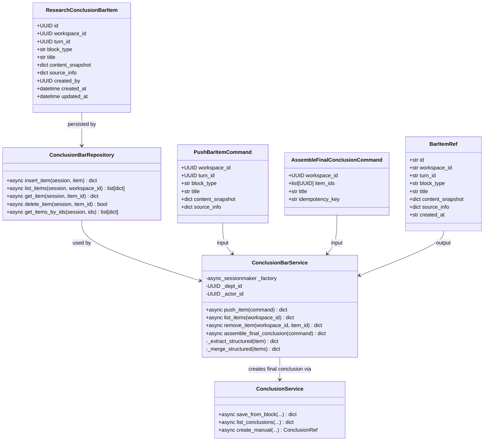
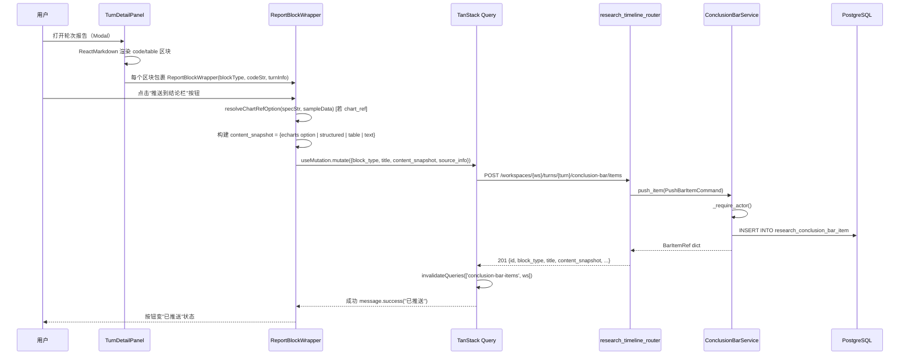
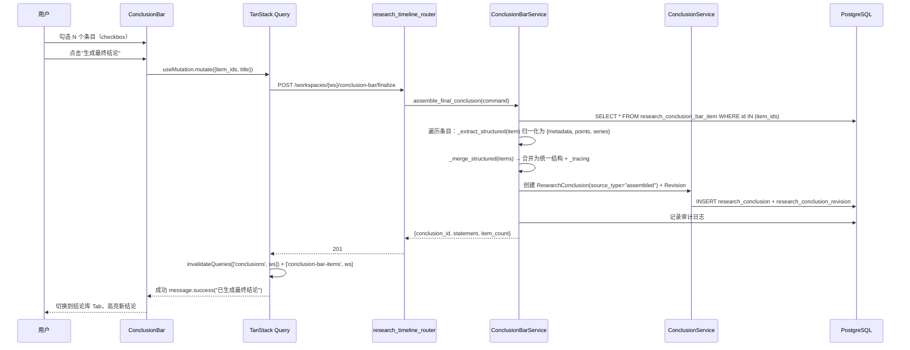
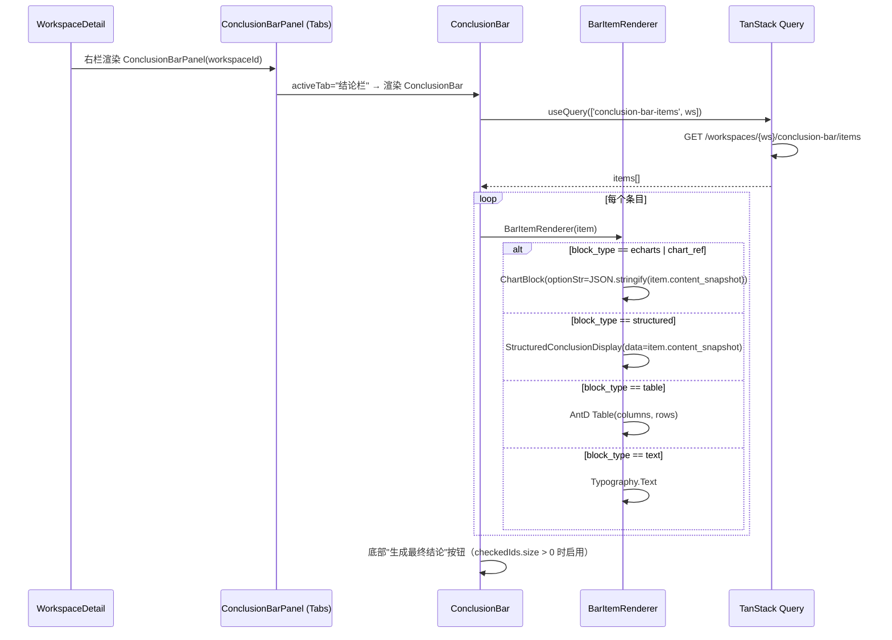
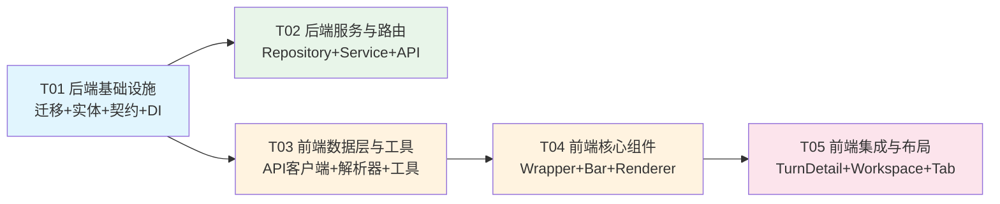

# 推送结论栏 — 系统设计 + 任务分解

> 架构师：高见远（Gao）
> 输入：PRD「研究分析模块推送结论栏功能」+ 已确认决策
> 技术栈：React 18 + TypeScript + Ant Design 5 + TanStack Query / FastAPI + SQLAlchemy + PostgreSQL(JSONB)

---

## Part A: 系统设计

### 1. 实现方案与框架选型

#### 1.1 核心技术挑战

| # | 挑战 | 解决思路 |
|---|------|----------|
| C1 | **报告区块标识与按钮注入**：`TurnDetailPanel` 用 `ReactMarkdown` 的 `code` 组件内联渲染各区块（echarts/chart-ref/data/table/text），无稳定 DOM 标识 | 在 `code`/`table`/`p` 组件映射中包裹一层 `ReportBlockWrapper`，用自增 `blockIndex` + `blockType` 生成稳定标识，注入"推送"按钮 |
| C2 | **图表数据快照锁定**：`chart-ref` 区块只存轻量指令（引用 `fact_samples` 中按样品名解析），底层数据变化后图表会变 | 推送时刻在**前端**将 chart-ref 指令解析为完整 ECharts option（含 series 数据），以 option JSON 作为 `content_snapshot` 存库；结论栏中以 `ChartBlock` 渲染，不再依赖 fact_samples |
| C3 | **跨轮次聚合 + Workspace 范围**：结论栏条目来自不同 turn，需按 Workspace 聚合 | 新建 `research_conclusion_bar_item` 表，以 `workspace_id` 为聚合维度，`turn_id` 仅作溯源 |
| C4 | **后端组装最终结论**：勾选条目后由服务端组装结构化数据 + 溯源 | 新增 `ConclusionBarService.assemble_final_conclusion()`，加载勾选条目 → 提取/归一化各类型的数据 → 合并 `{metadata, points, series, _tracing}` → 复用 `ResearchConclusion` + `ResearchConclusionRevision`（`source_type="assembled"`）落库 |
| C5 | **右栏 Tab 切换**：结论栏与结论库共存于右栏 | 在 `WorkspaceDetail` 右栏用 Ant Design `Tabs`，Tab1=结论栏（新），Tab2=结论库（现有 `ConclusionLibrary`） |

#### 1.2 框架与库选型

| 领域 | 选型 | 理由 |
|------|------|------|
| 前端数据获取 | **TanStack Query** | 项目已有（ShowcasePanel 用法），bar items 列表用 `useQuery`，推送/删除/finalize 用 `useMutation` + 乐观更新 |
| 前端状态 | **useState（提升至 WorkspaceDetail）** | 勾选状态仅影响右栏，无需引入全局 store；与现有 `selectedRevisionIds` 模式一致 |
| 图表渲染 | **echarts（动态 import）** | 复用现有 `ChartBlock`，不新增依赖 |
| 后端 ORM | **SQLAlchemy 2.0 Mapped** | 与 `entities.py` 现有 9 张表一致 |
| 数据库迁移 | **Alembic** | 项目已有 `migrations/versions/` 编号体系（当前 0086），新增 0087 |
| API 校验 | **Pydantic v2 BaseModel** | 与 `research_timeline.py` 现有 Request/Response 模型一致 |

#### 1.3 架构模式

- **后端**：Service / Repository 分层（与 `conclusion_service.py` + `conclusion_repository.py` 一致）
- **前端**：Container / Component + TanStack Query 数据层（与 ShowcasePanel / BlockWrapper 一致）
- **数据流**：前端推送 → 后端持久化 bar_item → 前端轮询/缓存刷新 → 勾选 → 后端组装 → 落库为 ResearchConclusion

---

### 2. 文件列表

#### 后端（新建 3 + 修改 4）

| # | 文件路径 | 操作 | 说明 |
|---|----------|------|------|
| B1 | `migrations/versions/0087_conclusion_bar.py` | **新建** | Alembic 迁移：建 `research_conclusion_bar_item` 表 |
| B2 | `packages/research/timeline/entities.py` | **修改** | 新增 `ResearchConclusionBarItem` ORM 实体 |
| B3 | `packages/research/timeline/contracts.py` | **修改** | 新增 `BarItemRef`、`PushBarItemCommand`、`AssembleFinalConclusionCommand` 契约 |
| B4 | `packages/research/timeline/conclusion_bar_repository.py` | **新建** | Bar item 数据访问层 |
| B5 | `packages/research/timeline/conclusion_bar_service.py` | **新建** | Bar item CRUD + 最终结论组装服务 |
| B6 | `apps/api/routers/research_timeline.py` | **修改** | 新增 4 个路由端点 |
| B7 | `apps/api/composition/research.py` | **修改** | 注册 `ConclusionBarService` DI 覆盖 |

#### 前端（新建 6 + 修改 2）

| # | 文件路径 | 操作 | 说明 |
|---|----------|------|------|
| F1 | `apps/web/src/api/researchConclusionBar.ts` | **新建** | 结论栏 API 类型定义 + 请求函数 |
| F2 | `apps/web/src/features/research/chartRefResolver.ts` | **新建** | chart-ref 指令 → 完整 ECharts option 解析工具（从 ChartRefBlock 提取复用） |
| F3 | `apps/web/src/features/research/blockUtils.ts` | **新建** | 区块类型判定 + content_snapshot 构建工具 |
| F4 | `apps/web/src/features/research/ReportBlockWrapper.tsx` | **新建** | 报告区块包装器，注入"推送到结论栏"按钮 |
| F5 | `apps/web/src/features/research/BarItemRenderer.tsx` | **新建** | 结论栏中单条目渲染（echarts/structured/table/text） |
| F6 | `apps/web/src/features/research/ConclusionBar.tsx` | **新建** | 结论栏面板：条目列表 + 勾选 + 生成最终结论 |
| F7 | `apps/web/src/features/research/ConclusionBarPanel.tsx` | **新建** | 右栏 Tab 容器（结论栏 / 结论库） |
| F8 | `apps/web/src/features/research/TurnDetailPanel.tsx` | **修改** | 集成 ReportBlockWrapper，区块渲染改造 |
| F9 | `apps/web/src/features/research/WorkspaceDetail.tsx` | **修改** | 右栏替换为 ConclusionBarPanel（Tab 切换） |

---

### 3. 数据结构与接口

#### 3.1 新增数据表：`research_conclusion_bar_item`

```sql
CREATE TABLE research_conclusion_bar_item (
    id              UUID PRIMARY KEY DEFAULT gen_random_uuid(),
    workspace_id    UUID NOT NULL REFERENCES research_workspace(id) ON DELETE CASCADE,
    turn_id         UUID NOT NULL REFERENCES research_turn(id) ON DELETE CASCADE,
    block_type      TEXT NOT NULL,          -- echarts | chart_ref | structured | table | text
    title           TEXT NOT NULL,          -- 展示标题
    content_snapshot JSONB NOT NULL,        -- 数据快照（echarts option / structured data / table / text）
    source_info     JSONB NOT NULL DEFAULT '{}'::jsonb,
                    -- 溯源：{turn_number, snapshot_number, question_text, block_index}
    created_by      UUID NOT NULL REFERENCES app_user(id),
    created_at      TIMESTAMPTZ NOT NULL DEFAULT now(),
    updated_at      TIMESTAMPTZ NOT NULL DEFAULT now()
);
CREATE INDEX idx_bar_item_workspace ON research_conclusion_bar_item(workspace_id, created_at DESC);
```

#### 3.2 最终结论：复用 `research_conclusion` + `research_conclusion_revision`

- `research_conclusion.source_type` 新增值 `"assembled"`
- `research_conclusion_revision.statement` 存放组装后的结构化 JSON：

```json
{
  "metadata": {
    "title": "最终结论",
    "source_count": 3,
    "assembled_at": "2026-08-20T10:00:00Z"
  },
  "points": [
    {"name": "指标A", "value": 123, "unit": "℃", "描述": "来自轮次#1"}
  ],
  "series": [
    {"name": "拉曼光谱", "columns": ["位移","强度"], "rows": [[100, 0.5]]}
  ],
  "_tracing": [
    {"bar_item_id": "uuid", "turn_number": 1, "block_type": "echarts", "title": "拉曼光谱图"}
  ]
}
```

#### 3.3 类图



#### 3.4 API 端点定义

| 方法 | 路径 | 说明 |
|------|------|------|
| `GET` | `/api/v1/research/workspaces/{ws}/conclusion-bar/items` | 列出结论栏条目（Workspace 范围，按 created_at DESC） |
| `POST` | `/api/v1/research/workspaces/{ws}/turns/{turn}/conclusion-bar/items` | 推送一个区块到结论栏 |
| `DELETE` | `/api/v1/research/workspaces/{ws}/conclusion-bar/items/{item}` | 从结论栏移除条目 |
| `POST` | `/api/v1/research/workspaces/{ws}/conclusion-bar/finalize` | 勾选条目 → 生成最终结论 |

**推送请求体（PushBarItemRequest）：**
```python
class PushBarItemRequest(BaseModel):
    block_type: str        # echarts | chart_ref | structured | table | text
    title: str
    content_snapshot: dict # 已解析的数据快照
    block_index: int
    source_info: dict      # {turn_number, snapshot_number, question_text}
```

**Finalize 请求体（FinalizeRequest）：**
```python
class FinalizeRequest(BaseModel):
    item_ids: list[str] = Field(min_length=1, max_length=20)
    title: str | None = None
    idempotency_key: str = Field(min_length=1, max_length=128)
```

---

### 4. 程序调用流程

#### 4.1 推送区块到结论栏



#### 4.2 生成最终结论



#### 4.3 结论栏条目渲染流程



---

### 5. 待澄清/假设

| # | 问题 | 假设/决策 |
|---|------|----------|
| Q1 | chart-ref 推送后是否仍可交互（缩放/导出PNG）？ | 假设**可以**：结论栏中仍用 `ChartBlock` 渲染，保留导出PNG；dataZoom 由 ChartBlock 自身处理 |
| Q2 | Markdown 表格区块如何识别？ | 通过 ReactMarkdown 的 `table` 组件映射捕获，将 table 的 DOM 结构转 `{columns, rows}` 作为 snapshot |
| Q3 | 最终结论是否进入现有结论库？ | **是**：复用 `ResearchConclusion`，出现在结论库列表中，`source_type="assembled"` 以徽标区分 |
| Q4 | 推送后条目是否可编辑/重排序？ | P0 **不支持**重排序；支持删除。编辑留待 P1 |
| Q5 | 同一区块重复推送如何处理？ | P0 **允许重复**（每次推送生成新条目），不做幂等去重；UI 上已推送的区块按钮变为"再推送" |
| Q6 | 最终结论组装时图表数据如何归一化为 points/series？ | echarts option 中的 `series[].data` 提取为 series；structured 直接合并；text 作为 metadata 备注 |

---

## Part B: 任务分解

### 6. 依赖包列表

```
# 前端（均为项目已有，无需新增）
- react@^18.2.0: UI 框架
- antd@^5.14.0: 组件库（Tabs/Checkbox/Button/Table/Collapse）
- @tanstack/react-query@^5.0.0: 数据获取与缓存
- echarts@^5.4.0: 图表渲染（动态 import，已有）
- react-markdown@^9.0.0: Markdown 渲染（已有）
- axios: HTTP 客户端（已有，通过 @/api/client）

# 后端（均为项目已有，无需新增）
- fastapi@^0.110: Web 框架
- sqlalchemy@^2.0: ORM
- pydantic@^2.0: 数据校验
- alembic@^1.13: 数据库迁移
```

> **无新增第三方依赖**。所有功能基于现有技术栈实现。

---

### 7. 任务列表（按依赖顺序）

#### T01: 后端基础设施 — 迁移 + 实体 + 契约 + DI

- **源文件**：
  - `migrations/versions/0087_conclusion_bar.py`（新建）
  - `packages/research/timeline/entities.py`（修改：新增 `ResearchConclusionBarItem`）
  - `packages/research/timeline/contracts.py`（修改：新增 `PushBarItemCommand`、`AssembleFinalConclusionCommand`、`BarItemRef`）
  - `apps/api/composition/research.py`（修改：注册 `ConclusionBarService` DI）
- **依赖**：无（首个任务）
- **优先级**：P0
- **说明**：建立数据库表结构、ORM 实体、命令/引用契约和依赖注入骨架。迁移文件参照 `0084` 风格编写 `upgrade()`/`downgrade()`。`ResearchConclusionBarItem` 继承 `Base`，字段见 §3.1。`contracts.py` 新增三个 frozen dataclass 并在 `__post_init__` 中校验（`item_ids` 1-20 去重、`idempotency_key` 1-128 字符）。

#### T02: 后端服务与路由 — Repository + Service + API 端点

- **源文件**：
  - `packages/research/timeline/conclusion_bar_repository.py`（新建）
  - `packages/research/timeline/conclusion_bar_service.py`（新建）
  - `apps/api/routers/research_timeline.py`（修改：新增 4 个端点 + Request/Response 模型）
- **依赖**：T01
- **优先级**：P0
- **说明**：
  - `ConclusionBarRepository`：`insert_item`/`list_items`/`get_item`/`delete_item`/`get_items_by_ids`，SQLAlchemy async 操作。
  - `ConclusionBarService`：继承 `ScopedSessionMixin`（与 `ConclusionService` 一致）。核心方法：
    - `push_item(command)` → 校验 turn 归属 → 插入 bar_item → 审计
    - `list_items(workspace_id)` → 返回 workspace 范围条目列表
    - `remove_item(workspace_id, item_id)` → 校验归属 → 软删/硬删
    - `assemble_final_conclusion(command)` → 加载勾选条目 → `_extract_structured()` 归一化 → `_merge_structured()` 合并 `{metadata, points, series, _tracing}` → 调用 `ResearchConclusion` + `ResearchConclusionRevision` 落库（`source_type="assembled"`）
  - `research_timeline.py` 新增端点：`GET/POST/DELETE conclusion-bar/items`、`POST conclusion-bar/finalize`，复用 `ResearchUserDep` 权限门控。

#### T03: 前端数据层与工具 — API 客户端 + chart-ref 解析器 + 区块工具

- **源文件**：
  - `apps/web/src/api/researchConclusionBar.ts`（新建）
  - `apps/web/src/features/research/chartRefResolver.ts`（新建）
  - `apps/web/src/features/research/blockUtils.ts`（新建）
- **依赖**：T01（需要契约类型对齐）
- **优先级**：P0
- **说明**：
  - `researchConclusionBar.ts`：定义 `BarItem`、`PushBarItemPayload`、`FinalizePayload` 类型 + `apiListBarItems`/`apiPushBarItem`/`apiRemoveBarItem`/`apiFinalizeConclusion` 请求函数（复用 `http` 客户端，参照 `showcase.ts` 模式）。
  - `chartRefResolver.ts`：从 `ChartRefBlock.tsx` 提取 `parseSamplesFromContext`/`findSample`/option 构建逻辑为纯函数 `resolveChartRefOption(specStr, sampleData)`，返回完整 ECharts option 对象。ChartRefBlock 后续可改为调用此工具（但 T03 不改 ChartRefBlock，仅提取工具）。
  - `blockUtils.ts`：`buildContentSnapshot(blockType, codeStr, sampleData)` — 根据区块类型构建 `content_snapshot`：
    - `echarts` → 宽松解析 option JSON
    - `chart_ref` → 调 `resolveChartRefOption()` 返回完整 option
    - `structured`/`data`/`json` → `JSON.parse(codeStr)`
    - `table`/`text` → 原文

#### T04: 前端核心组件 — ReportBlockWrapper + ConclusionBar + BarItemRenderer

- **源文件**：
  - `apps/web/src/features/research/ReportBlockWrapper.tsx`（新建）
  - `apps/web/src/features/research/ConclusionBar.tsx`（新建）
  - `apps/web/src/features/research/BarItemRenderer.tsx`（新建）
- **依赖**：T03
- **优先级**：P0
- **说明**：
  - `ReportBlockWrapper`：参照 `BlockWrapper.tsx` 模式，接收 `blockType`/`codeStr`/`turnInfo`/`workspaceId`/`turnId`，hover 显示"推送到结论栏"按钮。点击时调 `buildContentSnapshot()` 构建 snapshot → `useMutation` 推送 → `invalidateQueries(['conclusion-bar-items'])`。已推送状态通过 query 缓存判断（source turn_id + block_index 匹配）。
  - `ConclusionBar`：用 `useQuery(['conclusion-bar-items', ws])` 加载条目列表，`Checkbox` 勾选状态用 `useState<Set<string>>`，底部"生成最终结论"按钮（checkedIds.size > 0 启用），`useMutation` 调 finalize。
  - `BarItemRenderer`：按 `block_type` 分支渲染：
    - `echarts`/`chart_ref` → `<ChartBlock optionStr={JSON.stringify(item.content_snapshot)} />`
    - `structured` → `<StructuredConclusionDisplay data={item.content_snapshot} />`（从 ConclusionLibrary 提取复用）
    - `table` → `<Table columns rows />`
    - `text` → `<Typography.Text>`

#### T05: 前端集成与布局 — TurnDetailPanel 改造 + WorkspaceDetail Tab + 结论栏面板

- **源文件**：
  - `apps/web/src/features/research/TurnDetailPanel.tsx`（修改）
  - `apps/web/src/features/research/WorkspaceDetail.tsx`（修改）
  - `apps/web/src/features/research/ConclusionBarPanel.tsx`（新建）
- **依赖**：T04
- **优先级**：P0
- **说明**：
  - `TurnDetailPanel.tsx`：在 ReactMarkdown 的 `code` 组件映射中，用 `ReportBlockWrapper` 包裹各区块渲染输出。用 `useRef` 维护 `blockIndex` 自增计数器，为每个 code/table 区块生成稳定标识。传入 `workspaceId`/`turnId`/`turnNumber`/`snapshotNumber`/`questionText` 供推送溯源。
  - `WorkspaceDetail.tsx`：右栏 `<Col lg={6}>` 内容替换为 `<ConclusionBarPanel>`，移除原有直接渲染的 `ConclusionLibrary` + `SynthesisComposer`（移入 Tab2 内容）。
  - `ConclusionBarPanel.tsx`：Ant Design `Tabs`，items=[{key:'bar', label:'结论栏', children:`<ConclusionBar>`}, {key:'library', label:'结论库', children:`<ConclusionLibrary> + <SynthesisComposer>`}]。finalize 成功后自动切换到 library Tab 并刷新 conclusions。

---

### 8. 共享知识（跨文件约定）

```
# API 约定
- 所有结论栏 API 响应使用 {code, data, message} 格式（由全局异常处理包装）
- 端点前缀统一为 /api/v1/research/workspaces/{workspace_id}/conclusion-bar/...
- 权限门控复用 ResearchUserDep（require_permission("research:use")）
- 幂等键 idempotency_key：1-128 字符，前端用 `web-${Date.now()}-${random}` 生成

# 数据快照约定（content_snapshot）
- echarts/chart_ref → 存储完整 ECharts option JSON 对象（已含 series 数据，不依赖外部数据源）
- structured/data/json → 存储 {metadata, points, series} 三段式结构
- table → 存储 {columns: string[], rows: any[][]}
- text → 存储纯文本字符串
- 推送时刻即锁定，后续底层数据变化不影响已推送条目

# 溯源约定（source_info）
- 每个条目必含 {turn_number, snapshot_number, question_text, block_index}
- 最终结论的 _tracing 数组保留所有来源条目的 bar_item_id + turn_number + block_type + title

# 前端缓存键约定
- ['conclusion-bar-items', workspaceId] → 结论栏条目列表
- ['conclusions', workspaceId] → 结论库列表（现有）
- 推送/删除/finalize 后需 invalidate 对应 key

# 区块标识约定
- blockType 取值：echarts | chart_ref | structured | table | text
- block_index：单次报告渲染内自增，从 0 开始
- 已推送判断：通过 query 缓存匹配 (turn_id, block_index)，允许多次推送

# 最终结论存储约定
- 复用 research_conclusion 表，source_type = "assembled"
- revision.statement 存储组装后的 JSON（含 metadata/points/series/_tracing）
- 结论库中展示时按 JSON 解析为 StructuredConclusionDisplay

# 审计约定
- push_item → action="research.conclusion_bar.push"
- remove_item → action="research.conclusion_bar.remove"
- finalize → action="research.conclusion.assemble"
- 均通过 AuditRecorder.record() 记录
```

---

### 9. 任务依赖图



> **依赖说明**：T02 和 T03 可并行（均仅依赖 T01）。T04 依赖 T03（需要 API 客户端和工具函数）。T05 依赖 T04（需要核心组件）。关键路径：T01 → T03 → T04 → T05。
