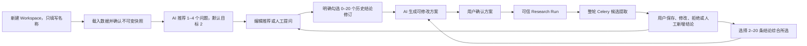
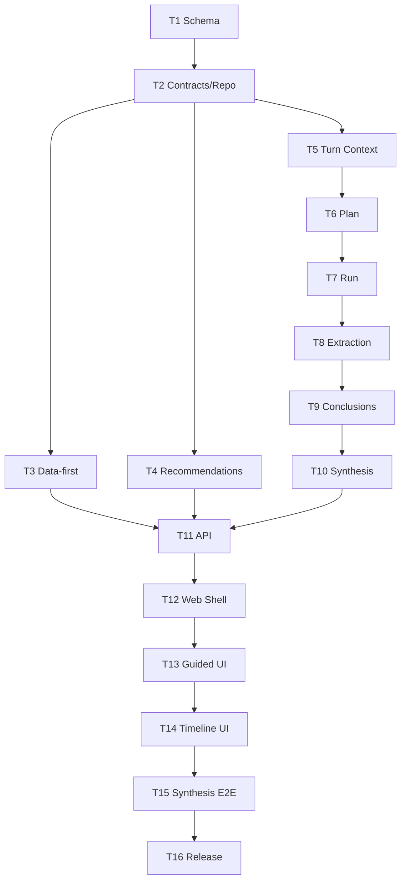

# Research Workspace 多轮研究时间线 Implementation Plan

> **For agentic workers:** REQUIRED SUB-SKILL: Use superpowers:subagent-driven-development (recommended) or superpowers:executing-plans to implement this plan task-by-task. Steps use checkbox (`- [ ]`) syntax for tracking.

**Goal:** 将现有 Research Workspace 重构为以不可变数据快照为起点、支持 AI 推荐问题、用户明确选择历史结论、多轮可信分析和跨轮次综合的生产级研究时间线。

**Architecture:** 保留现有 Workspace、Evidence Snapshot、Plan/Run、统计工具、Artifact、权限和审计基础设施，在其上新增独立的 Turn、Recommendation、Conclusion、Candidate Extraction 和 Timeline Query 模型。页面不使用画布或树图，而以游标分页时间线和结论库呈现；所有模型输入由固定快照、固定问题和用户明确选择的结论修订构成。推荐和整轮候选提取使用持久化任务状态与 Celery，Run SSE 负责实时通知，数据库查询负责刷新与断线恢复。

**Tech Stack:** Python 3.12+, FastAPI, Pydantic 2, SQLAlchemy 2 async, Alembic, PostgreSQL 15+ / JSONB, Celery 5, Redis, existing Research ModelGateway/ContextRouter/Run/Artifact services, React 18, TypeScript 5.7, Ant Design 5, existing Data Ocean tokens/OceanPanel, Vitest, Playwright, Pytest.

## Global Constraints

- 改造现有“实验室运营 → 研究分析”及 `research_workspace`，不得新增 Workcanvas 类型、入口、画布、节点、边、树形目录或 React Flow 依赖。
- 新建 Workspace 只提交名称；没有有效数据快照时不得生成推荐问题或可执行分析方案。
- 确认数据产生不可变 `EvidenceSnapshot`；历史 Turn、Plan、Run、Result 和 ConclusionRevision 永远绑定原快照，不因新增数据重写。
- 每个 RecommendationBatch 允许 1–4 个不重复问题，默认目标 2 个；不得为满足数量填充低价值问题。
- 用户可以编辑 AI 推荐或人工提问；开始生成第一版方案后，问题、快照和明确选择的结论修订全部锁定。
- 每个 Turn 只继承用户明确勾选的 0–20 个当前结论修订；不得自动加入上一轮、整条时间线、隐藏记忆或未保存候选。
- AI 先生成方案，用户修改并确认具体版本后才能执行；重试只新增 execution attempt，不改变固定输入。
- 同一 Workspace 在数据库层最多存在一个 `queued`、`planning` 或 `running` Research Run；不自动排队第二个 Workspace 内 Run。
- 候选结论提取必须是整轮 Run 完成后创建的独立 Celery 任务；页面关闭不取消任务，状态和结果必须持久化。
- 前端优先接收 Run SSE 的 `candidate_extraction.status_changed` 与 `conclusion_candidate.created` 事件，SSE 断线或页面刷新时轮询 Turn 详情恢复。
- 候选不是正式结论；只有用户保存的候选或人工新增内容进入 Conclusion Library 和后续上下文。
- 人工结论允许无证据，但 API、UI 和模型上下文必须标记 `manual_unverified`，不得伪装成数据支持事实。
- “综合所选”创建 `synthesis` Turn，选择 2–20 个明确的 ConclusionRevision，仍经过方案确认、可信 Run、候选提取和人工保存。
- SynthesisResult 的 `summary` 必须非空；`agreements`、`conflicts`、`limitations`、`new_hypotheses` 使用 `{status, items}`，允许 `not_applicable + []`，不得生成占位噪音。
- Timeline API 使用不透明游标，按 `(turn_number, id)` 倒序；默认 20 条、最大 50 条，前端不得全量加载 Workspace 历史。
- UI 必须复用 `tokens.ts`、`themeConfig.ts`、`ocean.css`、AppShell、实验室运营页头、Operations 水印和 OceanPanel；不得新建独立视觉语言。
- 不保存或展示模型思维链；日志不得记录原始实验数据、完整提示词或模型完整输出。
- 旧 Research Workspace 业务数据按明确表清单一次性删除，不迁移、不兼容、不提供旧版只读入口；原始 Fact、用户、部门、权限、审计、模型配置、统计环境、Celery、Redis 和对象存储不得删除。
- `RESEARCH_TIMELINE_ENABLED` 只负责部署窗口内关闭/开放新入口，不提供旧版回退；发布后默认 `true`。
- 所有写操作校验 `research:use`、owner、department、workspace/object 归属，记录审计；可双击或重试的操作必须使用服务端幂等键与唯一约束。
- 实施必须采用测试先行、小提交和逐任务评审；任何任务不得以“后续阶段”为由排除跨轮次综合、异步候选提取、分页、安全或恢复能力。

---

## 1. 交付范围与已合并评审意见

本计划替代历史文件 `docs/superpowers/plans/2026-08-11-workcanvas-complete-delivery.md` 作为当前实施依据。历史文件只保留决策轨迹，不得继续实现其中的 Workcanvas、图节点、图边、React Flow 或独立入口。

完整闭环必须一次性交付到“跨轮次综合（原讨论中的跨分支概括）”：



评审意见转化为以下不可变开发契约：

| 评审点 | 最终决策 | 工程落点 |
|---|---|---|
| 推荐数量不能固定 2 | 接受 1–4，默认目标 2，不凑数 | Pydantic `min_length=1/max_length=4`、规范化去重、提示词质量门和 1/4/5 条边界测试 |
| 综合固定五字段太硬 | 保留稳定骨架，但四个分区可不适用 | `SynthesisSection(status, items)` 交叉校验；`summary` 唯一必填 |
| 候选异步模型不清楚 | 整轮成功后独立 Celery Job，持久化，页面无关 | `CandidateExtractionJob`、任务状态机、Run SSE、Turn 轮询、reconciler |
| 时间线无分页 | `(turn_number,id)` keyset cursor | `page_size=20`、上限 50、Load More、55 条不重不漏测试 |

### 1.1 本次不做

- 自动把所有历史结论或聊天记录加入下一轮。
- 新数据自动复核旧结论；只保存未来复核需要的快照、证据、限制和修订来源。
- 跨 Workspace 结论引用、多人共同评审、实时协作和同一 Workspace 多 Run 并行。
- 新增数据接入类型；继续使用已有 `core:fact`、`research:derived` 等已治理数据引用。
- 旧 Workspace 数据迁移、旧 API 兼容层、旧 UI 只读页或产品级恢复。
- 独立移动端产品；窄屏只做现有 Web 的单列适配。

## 2. 外部团队交付组织

建议合同周期 10–12 周，稳定投入 7 人，峰值 8 人。外部团队可调整人员组合，但不得减少职责覆盖。

| 角色 | 建议投入 | 责任 |
|---|---:|---|
| 交付负责人 / 架构师 | 1.0 | 领域边界、接口、迁移、风险、跨端决策、代码评审 |
| 后端工程师 | 2.0 | 模型、服务、API、Celery/SSE、权限、幂等和迁移 |
| 前端工程师 | 2.0 | 时间线、结论库、数据首屏、方案审查、SSE/轮询和 E2E |
| AI / 数据工程师 | 1.0 | 推荐、上下文、候选、综合 schema、评测和科学质量 |
| QA / 自动化 | 1.0 | 单元、集成、契约、安全、恢复、浏览器和验收证据 |
| UX 设计师 | 0.5 | Data Ocean 组件规范、状态、窄屏和实验人员可用性 |
| DevOps / 安全 | 0.5 | 数据重置、队列、指标、告警、灰度、回滚演练 |

甲方必须提供脱敏真实任务、模型配置、测试环境、Research 现有链路说明和最终业务验收人。外部团队对代码、自动化测试、迁移演练、质量报告和交接文档负责；实验人员对科学可用性签字，不能由模型输出通过率替代人工验收。

## 3. 稳定领域与 API 契约

### 3.1 状态与固定输入

`ResearchTurn.status` 使用以下闭集：

```text
question_draft -> planning -> plan_review -> plan_confirmed -> queued -> running -> succeeded -> conclusion_reviewed
question_draft/planning -> planning_failed
queued/running -> cancelled
running -> run_failed
succeeded -> succeeded_without_saved_conclusion
```

候选提取失败不回滚 `succeeded` Run，也不把 Turn 改成 `run_failed`；失败状态记录在 `CandidateExtractionJob`。Turn 第一次进入 `planning` 时固定 `question_text_snapshot`、`evidence_snapshot_id`、`conclusion_revision_ids`、`prompt_template_version` 和 `output_schema_version`。

### 3.2 Python 服务接口

所有外部团队任务必须复用这些精确签名；如确需改名，先提交 ADR 并同步修改本文件和契约测试。

```python
@dataclass(frozen=True)
class CreateTurnCommand:
    workspace_id: UUID
    question_text: str
    evidence_snapshot_id: UUID
    selected_conclusion_revision_ids: tuple[UUID, ...]
    recommendation_item_id: UUID | None
    idempotency_key: str

@dataclass(frozen=True)
class CreateSynthesisTurnCommand:
    workspace_id: UUID
    evidence_snapshot_id: UUID
    selected_conclusion_revision_ids: tuple[UUID, ...]
    idempotency_key: str

class TurnService:
    async def create_analysis_turn(self, command: CreateTurnCommand) -> TurnRef: ...
    async def create_synthesis_turn(self, command: CreateSynthesisTurnCommand) -> TurnRef: ...
    async def start_planning(self, turn_id: UUID) -> PlanVersionRef: ...

class RecommendationService:
    async def enqueue_initial(self, session: AsyncSession, workspace_id: UUID, snapshot_id: UUID) -> RecommendationBatchRef: ...
    async def request_followup(self, workspace_id: UUID, snapshot_id: UUID, selected_revision_ids: tuple[UUID, ...], idempotency_key: str) -> RecommendationBatchRef: ...
    async def execute_batch(self, batch_id: UUID) -> RecommendationBatchRef: ...
    async def retry_batch(self, batch_id: UUID) -> RecommendationBatchRef: ...

class CandidateExtractionService:
    async def enqueue_for_completed_run(self, session: AsyncSession, run_id: UUID) -> CandidateExtractionRef: ...
    async def execute(self, extraction_id: UUID) -> CandidateExtractionRef: ...
    async def retry(self, extraction_id: UUID) -> CandidateExtractionRef: ...

class ConclusionService:
    async def save_candidates(self, command: SaveCandidatesCommand) -> tuple[ConclusionRef, ...]: ...
    async def create_manual(self, command: CreateManualConclusionCommand) -> ConclusionRef: ...
    async def revise(self, command: ReviseConclusionCommand) -> ConclusionRef: ...
    async def archive(self, workspace_id: UUID, conclusion_id: UUID, expected_lock_version: int) -> None: ...

class TimelineQueryService:
    async def list_timeline(self, workspace_id: UUID, cursor: str | None = None, page_size: int = 20) -> TimelinePage: ...
    async def get_turn_detail(self, workspace_id: UUID, turn_id: UUID) -> TurnDetail: ...
```

上述代码块中的 `...` 表示 Python Protocol/接口体，不是实现占位符；实际实现必须有完整逻辑。

### 3.3 HTTP API

所有路径位于 `/api/v1/research`。会创建资源或投递后台任务的 mutation 接收 `idempotency_key`（1–128 字符）；confirm、cancel、archive 通过目标对象状态实现自然幂等，revision update 使用 `expected_lock_version` 防止覆盖，并都返回服务端对象状态：

| 方法与路径 | 用途 | 关键请求/响应 |
|---|---|---|
| `POST /workspaces` | 只用名称创建 | `{name}` → Workspace |
| `POST /workspaces/{id}/snapshot` | 确认数据 | `{idempotency_key}` → Snapshot；首个快照自动请求 RecommendationBatch |
| `GET /workspaces/{id}/timeline` | 时间线 | `cursor,page_size` → `{items,next_cursor,active_run}` |
| `GET /workspaces/{id}/turns/{turn_id}` | 断线恢复和详情 | 固定输入、Plan、Run、Result、Extraction、Candidates、saved conclusions |
| `POST /workspaces/{id}/recommendations/followup` | 按需推荐 | `{snapshot_id,selected_conclusion_revision_ids,idempotency_key}` |
| `GET /workspaces/{id}/recommendation-batches/{batch_id}` | 推荐状态恢复 | Batch + 1–4 items 或失败状态 |
| `POST /workspaces/{id}/recommendation-batches/{batch_id}/retry` | 推荐失败重试 | 同一 Batch attempt+1，保持幂等 |
| `POST /workspaces/{id}/turns` | 创建普通 Turn | 问题、snapshot、selected revisions、optional recommendation item、幂等键 |
| `POST /workspaces/{id}/synthesis-turns` | 创建综合 Turn | snapshot、2–20 selected revisions、幂等键 |
| `POST /workspaces/{id}/turns/{turn_id}/plan` | 锁定输入并生成计划 | Turn → PlanVersion |
| `PUT /workspaces/{id}/turns/{turn_id}/plans/{plan_id}` | 修订方案 | `{steps,expected_lock_version}` → 新 PlanVersion |
| `POST /workspaces/{id}/turns/{turn_id}/plans/{plan_id}/confirm` | 确认方案 | PlanVersion |
| `POST /workspaces/{id}/turns/{turn_id}/runs` | 执行或重试 | `{plan_version_id,idempotency_key}` → Run |
| `POST /workspaces/{id}/runs/{run_id}/cancel` | 取消 | Run |
| `GET /workspaces/{id}/runs/{run_id}/events` | Run + extraction SSE | 授权后订阅现有 Redis Run channel |
| `POST /workspaces/{id}/turns/{turn_id}/candidate-extraction/retry` | 重试提取 | Extraction |
| `POST /workspaces/{id}/turns/{turn_id}/conclusions/from-candidates` | 保存选中候选 | 1–20 candidate selections → Conclusions |
| `POST /workspaces/{id}/turns/{turn_id}/conclusion-review/complete` | 完成候选审阅 | 有保存结论→`conclusion_reviewed`，否则→`succeeded_without_saved_conclusion` |
| `POST /workspaces/{id}/conclusions/manual` | 人工新增 | statement/scope/limitations + idempotency key |
| `PATCH /workspaces/{id}/conclusions/{conclusion_id}` | 新增不可变修订 | current revision + lock version → Conclusion |
| `POST /workspaces/{id}/conclusions/{conclusion_id}/archive` | 归档结论 | lock version；历史 TurnContext 不改变 |
| `GET /workspaces/{id}/conclusions` | 结论库 | 当前 revision 的游标分页列表 |

服务端从 `recommendation_item_id` 和最终问题文本推导 `question_origin`，客户端不能自报 `initial_ai`、`followup_ai` 或 `ai_edited`。旧 `/question`、`/fork`、`/analyze-data`、`/extract-insight` 端点在切换时删除，不提供兼容别名。

`POST Turn plan` 使用状态自然幂等：`question_draft|planning_failed` 发起生成，`planning` 返回当前进行中状态，已到 `plan_review` 或之后则返回该 Turn 最新 Plan，不重复调用模型。结论库分页按 `(updated_at,id)` 倒序，默认 20、最大 50。

### 3.4 AI 结构化输出

```python
class RecommendedQuestion(BaseModel):
    question: str = Field(min_length=3, max_length=1000)
    rationale: str = Field(min_length=1, max_length=2000)
    evidence_hints: list[str] = Field(default_factory=list, max_length=10)

class RecommendationOutput(BaseModel):
    questions: list[RecommendedQuestion] = Field(min_length=1, max_length=4)

class SynthesisSection(BaseModel):
    status: Literal["present", "not_applicable"]
    items: list[str] = Field(max_length=20)

    @model_validator(mode="after")
    def validate_items(self) -> "SynthesisSection":
        if self.status == "present" and not self.items:
            raise ValueError("present section requires at least one item")
        if self.status == "not_applicable" and self.items:
            raise ValueError("not_applicable section requires empty items")
        return self

class SynthesisResult(BaseModel):
    summary: str = Field(min_length=1, max_length=12000)
    agreements: SynthesisSection
    conflicts: SynthesisSection
    limitations: SynthesisSection
    new_hypotheses: SynthesisSection
```

推荐规范化键为 `unicodedata.normalize("NFKC", question).strip().casefold()`；重复后若剩余 1–4 条则保存，超过 4 条或剩余 0 条触发一次受限重试，第二次仍无效则 Batch 失败。不得静默截断第 5 条，也不得复制问题补足第 2 条。

## 4. 数据模型

新表和现有表变更由单一 `0083` migration 完成。当前仓库 Alembic head 已核实为 `0082`。

| 表 | 核心字段与约束 |
|---|---|
| `research_recommendation_batch` | workspace/snapshot/mode/status/prompt/schema/idempotency/error/timestamps；`UNIQUE(workspace_id,idempotency_key)` |
| `research_recommendation_item` | batch/position/question/rationale/evidence_hints；`UNIQUE(batch_id,position)` |
| `research_turn` | workspace/turn_number/kind/status/question snapshot/origin/recommendation item/snapshot/prompt/schema/idempotency/lock；`UNIQUE(workspace_id,turn_number)` 与 `UNIQUE(workspace_id,idempotency_key)` |
| `research_turn_context` | turn/conclusion_revision/position；两个 ID 复合主键，最多 20 条由服务保证 |
| `research_turn_result` | turn/run/result_kind/summary/structured_output/method_summary/evidence_refs/limitations；turn 和 run 各自唯一 |
| `research_candidate_extraction_job` | workspace/turn/run/status/attempt/heartbeat/error/timestamps；`UNIQUE(run_id)` |
| `research_conclusion_candidate` | extraction/turn/ordinal/statement/scope/evidence/method/confidence/limitations/status/saved conclusion；复合唯一防重复 |
| `research_conclusion` | workspace/current_revision/source turn/run/candidate/source_type/evidence_status/status/creator/lock/timestamps |
| `research_conclusion_revision` | conclusion/revision_number/statement/scope/evidence/limitations/editor/timestamp；不可变且版本唯一 |

现有表变更：

- `research_workspace` 删除 `current_question_version`，新增 nullable `latest_snapshot_id` 和非空 `next_turn_number default 1`；latest snapshot FK 使用 `ON DELETE SET NULL DEFERRABLE INITIALLY DEFERRED`，保留 name/status/owner/department/lock。
- `research_evidence_snapshot` 新增非空 `idempotency_key` 和 `UNIQUE(workspace_id,idempotency_key)`；旧行已在本次重置中删除。
- 删除 `research_question_version` 表；问题只存在于 `ResearchTurn.question_text_snapshot`。
- `research_analysis_plan_version` 新增非空 `turn_id`，版本唯一索引从 workspace 级改为 `(turn_id,version_number)`。
- `research_analysis_run` 新增非空 `turn_id` 和 `attempt_number`，保留 workspace 活跃 Run 部分唯一索引，新增 `(turn_id,attempt_number)` 唯一索引。
- `research_insight_candidate` 保留空表供现有发布域代码短期编译，但新时间线不得再写入；新候选统一写 `research_conclusion_candidate`。

## 5. 文件结构映射

### 5.1 后端新增

| 文件 | 单一职责 |
|---|---|
| `migrations/versions/0083_research_timeline_reset.py` | 明确删除旧业务数据、改现有列/索引、创建时间线表和 RLS/授权 |
| `packages/research/timeline/entities.py` | 新增九个 SQLAlchemy ORM 实体 |
| `packages/research/timeline/contracts.py` | command/ref/page/AI Pydantic 或 frozen dataclass 契约 |
| `packages/research/timeline/state_machine.py` | Turn、Recommendation、Extraction 合法状态转换 |
| `packages/research/timeline/repository.py` | Turn/Recommendation/Result/Extraction 写入与 `(turn_number,id)` keyset 查询 |
| `packages/research/timeline/conclusion_repository.py` | Candidate/Conclusion/Revision 持久化和结论库分页 |
| `packages/research/timeline/context_builder.py` | 只组装固定问题、快照和显式选择的结论修订 |
| `packages/research/timeline/prompts.py` | 推荐、候选和综合的版本化 prompt 与 schema 常量 |
| `packages/research/timeline/recommendation_service.py` | 初始/后续推荐任务创建、解析、去重、执行 |
| `packages/research/timeline/turn_service.py` | 创建 Turn、固定输入、编号和状态推进 |
| `packages/research/timeline/conclusion_service.py` | 候选保存、人工新增、修订和归档 |
| `packages/research/timeline/extraction_service.py` | 持久化提取 Job、整轮提取、重试与事件发布 |
| `packages/research/timeline/timeline_query_service.py` | 时间线/Turn detail/结论库 read model 和访问撤销遮蔽 |
| `apps/api/routers/research_timeline.py` | 新时间线、推荐、Turn、Conclusion 和 synthesis HTTP API |
| `apps/api/composition/research_timeline.py` | 新服务和 ModelGateway 依赖组装 |
| `apps/worker/research_timeline_tasks.py` | Recommendation、Candidate Extraction 和 reconciler Celery 入口 |

### 5.2 现有后端修改

| 文件 | 修改 |
|---|---|
| `packages/research/entities.py` | Workspace 字段调整并导入 timeline metadata；移除 Question ORM |
| `packages/research/dtos.py` | Workspace 只用名称；移除 Question DTO；列表增加 snapshot/turn 摘要 |
| `packages/research/service.py` | 名称创建、详情、归档；删除问题和 fork 编排 |
| `packages/research/snapshots.py` | 幂等冻结、更新 latest snapshot、首快照后请求推荐 |
| `packages/research/repository/workspace.py` | 删除 question version 操作，增加 latest snapshot/turn number 锁 |
| `packages/research/execution/entities_trusted.py` | Plan/Run 绑定 turn 和 attempt |
| `packages/research/execution/repository_trusted.py` | 按 Turn 查询 Plan/Run，创建 attempt |
| `packages/research/execution/run_service.py` | 只从 Turn 取固定 snapshot/context；幂等提交与 Turn 状态同步 |
| `packages/research/execution/orchestrator_core.py` | 完成时写 TurnResult 并请求一次整轮 CandidateExtractionJob |
| `packages/research/execution/step_executor.py` | 删除步骤内 `_extract_insight_candidate` 及调用点 |
| `packages/research/execution/models_trusted.py` | 新增 Recommendation/Synthesis TaskType 和 Turn-aware refs |
| `packages/research/planning/plan_generator.py` | 从 TurnContext 而非 latest question/whole memory 生成方案 |
| `packages/research/planning/plan_reviser.py` | 修订只属于同一 Turn，增加乐观锁 |
| `packages/research/planning/plan_confirmer.py` | 确认 Plan 同步 Turn 状态 |
| `apps/api/routers/research.py` | 名称创建、幂等 snapshot、删除旧 question/fork DTO 与路由 |
| `apps/api/routers/research_run.py` | Turn-aware Plan/Run、SSE 鉴权和候选事件；删除同步旧分析/提取端点 |
| `apps/api/composition/__init__.py`、`apps/api/main.py` | 注册 timeline composition/router 和双 feature flag |
| `apps/worker/celery_app.py` | include 新任务、队列路由、30 秒 reconciler Beat |
| `packages/common/feature_flags.py`、`apps/api/routers/auth.py` | `RESEARCH_TIMELINE_ENABLED` 后端和 `/me` 暴露 |

### 5.3 前端新增与修改

| 文件 | 职责 |
|---|---|
| `apps/web/src/api/researchTimeline.ts` | 新 API 类型、请求、SSE event 联合类型 |
| `apps/web/src/features/research/useResearchTimeline.ts` | 首屏/加载更多/去重/刷新 Turn detail |
| `apps/web/src/features/research/ResearchDataHeader.tsx` | 数据首屏、快照版本和旧快照警告 |
| `apps/web/src/features/research/RecommendationPanel.tsx` | 1–4 个推荐、编辑采用、失败重试 |
| `apps/web/src/features/research/ResearchComposer.tsx` | 人工问题、明确选择结论、创建 Turn |
| `apps/web/src/features/research/WorkspaceTimeline.tsx` | 倒序分页时间线和加载更多 |
| `apps/web/src/features/research/ResearchTurnCard.tsx` | Turn 状态、固定输入、Plan/Run/Result 展开 |
| `apps/web/src/features/research/CandidateReviewPanel.tsx` | 候选等待、保存/编辑/拒绝、提取失败重试 |
| `apps/web/src/features/research/ConclusionLibrary.tsx` | 当前 revisions、来源、证据状态、选择和分页 |
| `apps/web/src/features/research/SynthesisComposer.tsx` | 2–20 条已选结论创建 synthesis Turn |
| `apps/web/src/features/research/WorkspaceDetail.tsx` | 改为两栏时间线页面组装器 |
| `apps/web/src/features/research/CreateWorkspaceModal.tsx` | 只保留名称输入 |
| `apps/web/src/features/research/WorkspaceCard.tsx` | 快照数、Turn 数、活跃状态，删除问题版本 |
| `apps/web/src/features/research/PlanReviewCard.tsx` | Turn-aware 方案修订、确认、执行和快照过期提示 |
| `apps/web/src/features/research/useRunSSE.ts` | 增加 extraction/candidate 事件和 Turn polling fallback |
| `apps/web/src/styles/ocean.css` | 只增加语义类，全部引用现有 token |

---

## 6. 逐任务实施计划

### Task 1: 破坏性数据重置、时间线 Schema 与 ORM

**Files:**
- Create: `migrations/versions/0083_research_timeline_reset.py`
- Create: `packages/research/timeline/__init__.py`
- Create: `packages/research/timeline/entities.py`
- Modify: `packages/research/entities.py`
- Modify: `packages/research/execution/entities_trusted.py`
- Modify: `tests/unit/research/test_research_foundation.py`
- Modify: `tests/unit/research/test_research_trusted_execution.py`
- Test: `tests/unit/research/test_research_timeline_migration.py`
- Test: `tests/integration/research/test_research_timeline_schema.py`
- Test: `tests/recovery/test_research_timeline_reset.py`

**Interfaces:**
- Consumes: Alembic head `0082`; existing GUID/UTCDateTime/Base; existing active Run partial unique index semantics.
- Produces: `ResearchTurn`, `ResearchTurnContext`, `ResearchRecommendationBatch`, `ResearchRecommendationItem`, `ResearchTurnResult`, `CandidateExtractionJob`, `ResearchConclusionCandidate`, `ResearchConclusion`, `ResearchConclusionRevision` and Turn-aware Plan/Run columns.

- [ ] **Step 1: 写 migration 静态失败测试**

```python
def test_0083_has_exact_parent_and_no_wildcard_delete() -> None:
    module = importlib.import_module("migrations.versions.0083_research_timeline_reset")
    source = inspect.getsource(module.upgrade)
    assert module.down_revision == "0082"
    assert "DELETE FROM research_workspace" in source
    assert "LIKE 'research_%'" not in source
    assert "DROP SCHEMA" not in source
```

- [ ] **Step 2: 运行静态测试确认因模块缺失而失败**

Run: `.venv/bin/python -m pytest tests/unit/research/test_research_timeline_migration.py -q`

Expected: FAIL with `ModuleNotFoundError: migrations.versions.0083_research_timeline_reset`.

- [ ] **Step 3: 写完整 `0083` migration**

`upgrade()` 必须先在事务中按以下顺序显式清空旧业务行：

```text
research_knowledge_reference
research_result_favorite
research_result_acl_revision
research_lineage_edge
research_result_version
research_result
research_insight_candidate
research_insight_version
research_insight
research_view_version
research_view
research_derived_dataset_version
research_derived_dataset
research_ai_conversation
research_memory_document
research_run_artifact
research_analysis_step
research_analysis_run
research_analysis_plan_version
research_evidence_snapshot
research_workspace_evidence_ref
research_question_version
research_workspace
```

然后删除旧问题表/列、建立九张新表、修改 Plan/Run、重建索引、为新表启用与现有 research 表一致的 RLS，并向 `irip_runtime`/`irip_app` 授权。不得删除 `fact`、`app_user`、`department`、`audit_event`、`ai_config`、`job`、`outbox_event` 或对象存储记录。

`downgrade()` 只回退 schema，不尝试恢复已删除业务数据，并在模块 docstring 中明确不可恢复性。

- [ ] **Step 4: 写 ORM 字段/约束失败测试**

```python
def test_turn_and_extraction_constraints() -> None:
    assert set(ResearchTurn.__table__.c.keys()) >= {
        "workspace_id", "turn_number", "kind", "status",
        "question_text_snapshot", "evidence_snapshot_id", "idempotency_key",
    }
    assert CandidateExtractionJob.__table__.c.run_id.unique is True
    assert ResearchTurnContext.__table__.primary_key.columns.keys() == [
        "turn_id", "conclusion_revision_id"
    ]
```

- [ ] **Step 5: 实现 focused ORM 并注册 metadata**

每个实体声明数据库可验证的 check/unique/index；JSONB 默认值必须为 SQL literal，不得使用共享 Python mutable 默认值。`ConclusionRevision` 不提供 update repository；`Conclusion.current_revision_id` 使用可空 FK 完成首次结论+revision 插入后再设定。

- [ ] **Step 6: 跑单元和 migration upgrade/downgrade/upgrade 集成测试**

Run: `.venv/bin/python -m pytest tests/unit/research/test_research_timeline_migration.py tests/integration/research/test_research_timeline_schema.py tests/recovery/test_research_timeline_reset.py -q`

Expected: PASS；恢复测试同时断言 Fact、用户、部门和审计样本行未删除。

- [ ] **Step 7: Commit**

```bash
git add migrations/versions/0083_research_timeline_reset.py packages/research/timeline packages/research/entities.py packages/research/execution/entities_trusted.py tests/unit/research/test_research_foundation.py tests/unit/research/test_research_trusted_execution.py tests/unit/research/test_research_timeline_migration.py tests/integration/research/test_research_timeline_schema.py tests/recovery/test_research_timeline_reset.py
git commit -m "feat(research): add timeline domain schema"
```

### Task 2: 稳定契约、状态机、幂等和游标 Repository

**Files:**
- Create: `packages/research/timeline/contracts.py`
- Create: `packages/research/timeline/state_machine.py`
- Create: `packages/research/timeline/repository.py`
- Create: `packages/research/timeline/conclusion_repository.py`
- Modify: `packages/research/repository/workspace.py`
- Test: `tests/unit/research/test_timeline_contracts.py`
- Test: `tests/unit/research/test_turn_state_machine.py`
- Test: `tests/unit/research/test_timeline_repository.py`

**Interfaces:**
- Consumes: Task 1 entities and DB constraints.
- Produces: commands/refs in §3.2; `TurnStateMachine.transition(current, target)`; `TimelineRepository.list_turns(workspace_id, cursor, page_size)`; atomic `allocate_turn_number()`; Candidate/Conclusion persistence primitives.

- [ ] **Step 1: 写 Recommendation 和 Synthesis schema 边界测试**

```python
@pytest.mark.parametrize("count", [1, 2, 3, 4])
def test_recommendation_accepts_one_to_four(count: int) -> None:
    output = RecommendationOutput(
        questions=[RecommendedQuestion(question=f"问题 {i}", rationale="数据可检验") for i in range(count)]
    )
    assert len(output.questions) == count

def test_synthesis_allows_not_applicable_section() -> None:
    section = SynthesisSection(status="not_applicable", items=[])
    assert section.items == []
```

- [ ] **Step 2: 运行测试确认契约尚不存在**

Run: `.venv/bin/python -m pytest tests/unit/research/test_timeline_contracts.py -q`

Expected: FAIL on missing `packages.research.timeline.contracts`.

- [ ] **Step 3: 实现契约和交叉字段校验**

除 §3.4 schema 外，定义 frozen commands/refs；`CreateTurnCommand` 校验 0–20 个唯一 revision ID，`CreateSynthesisTurnCommand` 校验 2–20 个，所有文本去首尾空白后仍须非空。

- [ ] **Step 4: 写状态机失败测试**

```python
def test_candidate_failure_does_not_fail_succeeded_turn() -> None:
    with pytest.raises(InvalidTurnTransition):
        TurnStateMachine.transition("succeeded", "run_failed")

def test_confirmed_plan_can_queue() -> None:
    assert TurnStateMachine.transition("plan_confirmed", "queued") == "queued"
```

- [ ] **Step 5: 实现三个显式状态机**

Turn、RecommendationBatch、CandidateExtractionJob 分别维护 transition map；repository update 使用 `WHERE status=:expected` 的 compare-and-set，受影响行数不是 1 时抛 `state_conflict`。

- [ ] **Step 6: 写 55 Turn 游标分页和并发编号测试**

```python
async def test_timeline_cursor_pages_without_gaps(repo, workspace_id) -> None:
    await seed_turns(repo, workspace_id, count=55)
    first = await repo.list_turns(workspace_id, cursor=None, page_size=20)
    second = await repo.list_turns(workspace_id, cursor=first.next_cursor, page_size=20)
    third = await repo.list_turns(workspace_id, cursor=second.next_cursor, page_size=20)
    ids = [item.id for page in (first, second, third) for item in page.items]
    assert [len(first.items), len(second.items), len(third.items)] == [20, 20, 15]
    assert len(ids) == len(set(ids)) == 55
```

- [ ] **Step 7: 实现不透明整数 keyset cursor**

游标 payload 固定为 `{"turn_number": 37, "id": "uuid"}` 的 compact JSON 再 base64url；查询条件严格使用 `turn_number < n OR (turn_number = n AND id < id)`，排序与之完全一致。Service 接受 1–50，超界或非法游标返回 `validation_failed`；HTTP `Query(20, ge=1, le=50)` 映射为 422，不静默 clamp。

Turn 编号分配必须锁定 Workspace 行，读取并递增 `next_turn_number`，不能用无锁 `MAX()+1`。

- [ ] **Step 8: 跑三组测试并提交**

Run: `.venv/bin/python -m pytest tests/unit/research/test_timeline_contracts.py tests/unit/research/test_turn_state_machine.py tests/unit/research/test_timeline_repository.py -q`

Expected: PASS.

```bash
git add packages/research/timeline/contracts.py packages/research/timeline/state_machine.py packages/research/timeline/repository.py packages/research/timeline/conclusion_repository.py packages/research/repository/workspace.py tests/unit/research/test_timeline_contracts.py tests/unit/research/test_turn_state_machine.py tests/unit/research/test_timeline_repository.py
git commit -m "feat(research): add timeline contracts and repositories"
```

### Task 3: 名称创建、数据优先入口和首快照触发推荐

**Files:**
- Create: `packages/research/timeline/recommendation_service.py`
- Modify: `packages/research/dtos.py`
- Modify: `packages/research/service.py`
- Modify: `packages/research/snapshots.py`
- Modify: `apps/api/routers/research.py`
- Modify: `apps/api/composition/research.py`
- Test: `tests/unit/research/test_workspace_data_first.py`
- Test: `tests/contract/research/test_workspace_timeline_api.py`

**Interfaces:**
- Consumes: Task 2 repository and Outbox writer.
- Produces: `CreateWorkspaceCommand(name: str)`; `WorkspaceRef` with `latest_snapshot_number`, `turn_count`, `active_run_status`; idempotent `freeze_snapshot(workspace_id,idempotency_key)` that writes the initial Recommendation request in the same transaction.

- [ ] **Step 1: 把名称-only 行为写成失败测试**

```python
async def test_create_workspace_does_not_create_question(service) -> None:
    ref = await service.create_workspace(CreateWorkspaceCommand(name="烧结实验复盘"))
    assert ref.name == "烧结实验复盘"
    assert ref.latest_snapshot_number is None
    assert await count_turns(ref.workspace_id) == 0
    assert await count_plans(ref.workspace_id) == 0
```

- [ ] **Step 2: 运行测试确认旧 command 仍要求 `question_text`**

Run: `.venv/bin/python -m pytest tests/unit/research/test_workspace_data_first.py -q`

Expected: FAIL because current command/API requires `question_text`.

- [ ] **Step 3: 删除旧问题/fork 服务与路由，改造 Workspace read model**

`POST /workspaces` 的 JSON schema 只允许 `name`；响应不再出现 `current_question_version`。删除 `PUT /question`、`POST /fork` 及对应 DTO、mapper 和前端未使用契约。Workspace 详情返回 latest snapshot、evidence count、turn count 和 active run，不内嵌全量 snapshots/turns。

- [ ] **Step 4: 写快照幂等与自动推荐 hook 失败测试**

```python
async def test_first_snapshot_requests_initial_recommendation_once(snapshot_service) -> None:
    first = await snapshot_service.freeze_snapshot(workspace_id, "freeze-001")
    repeated = await snapshot_service.freeze_snapshot(workspace_id, "freeze-001")
    assert repeated.snapshot_id == first.snapshot_id
    batch = await get_initial_recommendation_batch(first.snapshot_id)
    assert await count_recommendation_batches(first.snapshot_id) == 1
    assert await count_outbox_events("research.recommendation.requested", batch.id) == 1
```

- [ ] **Step 5: 实现 snapshot 唯一幂等键和同事务推荐请求**

在 `research_evidence_snapshot` 使用 `(workspace_id,idempotency_key)` 唯一键；同 key 返回原对象。先在 `recommendation_service.py` 实现不调用模型的 `enqueue_initial(session, workspace_id, snapshot_id)`：使用确定性幂等键 `initial:{snapshot_id}` 写 queued Batch 和 Outbox。首次 snapshot 的同一事务内依次写 snapshot、Workspace.latest_snapshot_id、RecommendationBatch、`research.recommendation.requested` Outbox event 和审计；复用当前 session，不在事务提交后直接调用 Celery。非首个 snapshot 不自动推荐，后续由用户点击“帮我想下一步”。Task 4 再在同一服务中实现模型执行和重试。

- [ ] **Step 6: 跑 unit + contract 并提交**

Run: `.venv/bin/python -m pytest tests/unit/research/test_workspace_data_first.py tests/contract/research/test_workspace_timeline_api.py -q`

Expected: PASS，OpenAPI 断言 CreateWorkspace 无 `question_text` 且旧 question/fork route 不存在。

```bash
git add packages/research/timeline/recommendation_service.py packages/research/dtos.py packages/research/service.py packages/research/snapshots.py apps/api/routers/research.py apps/api/composition/research.py tests/unit/research/test_workspace_data_first.py tests/contract/research/test_workspace_timeline_api.py
git commit -m "feat(research): make workspaces data first"
```

### Task 4: 质量自适应推荐、持久化任务与 Celery

**Files:**
- Create: `packages/research/timeline/prompts.py`
- Modify: `packages/research/timeline/recommendation_service.py`
- Create: `apps/worker/research_timeline_tasks.py`
- Modify: `packages/research/execution/models_trusted.py`
- Modify: `packages/jobs/dispatcher.py`
- Modify: `apps/worker/celery_app.py`
- Create: `apps/api/composition/research_timeline.py`
- Test: `tests/unit/research/test_recommendation_service.py`
- Test: `tests/unit/jobs/test_research_outbox_routing.py`
- Test: `tests/integration/research/test_recommendation_task.py`

**Interfaces:**
- Consumes: `RecommendationOutput`, Recommendation repository/status machine, ModelGateway, EvidenceSnapshot, transactional Outbox.
- Produces: §3.2 `RecommendationService`; Celery task `research.recommendations.generate(batch_id: str)`; Outbox route `research.recommendation.requested` → task with Batch ID; prompt constants `RECOMMENDATION_PROMPT_VERSION="research-recommendation-v1"` and schema version `recommendation-output-v1`.

- [ ] **Step 1: 写 1–4 条、默认 2 条和去重的失败测试**

```python
async def test_one_high_value_question_is_not_padded(service, gateway) -> None:
    gateway.call.return_value.content = json.dumps({
        "questions": [{"question": "哪些批次的收率显著偏低？", "rationale": "可直接比较批次", "evidence_hints": []}]
    })
    result = await service.execute_batch(batch_id)
    assert [q.question for q in result.items] == ["哪些批次的收率显著偏低？"]

async def test_five_questions_fail_validation_instead_of_truncating(service, gateway) -> None:
    gateway.call.return_value.content = payload_with_question_count(5)
    with pytest.raises(StructuredOutputError):
        await service.execute_batch(batch_id)
```

- [ ] **Step 2: 运行测试确认 service 尚不存在**

Run: `.venv/bin/python -m pytest tests/unit/research/test_recommendation_service.py -q`

Expected: FAIL on missing module/service.

- [ ] **Step 3: 实现 prompt、解析、NFKC 去重和受限重试**

Prompt 必须明确：优先返回 2 个；仅当额外问题与已有方向不重复、可由当前快照检验且有独立价值时返回 3–4 个；只有一个可靠方向时返回 1 个。上下文只含当前 snapshot profile 和用户显式选择的 revision（followup 模式），不含整条 timeline。

第一次结构错误、0 条、5+ 条或去重后 0 条时允许一次模型重试；第二次失败更新 Batch 为 `failed` 并保存脱敏 `error_code`，不保存解析残片。

- [ ] **Step 4: 写任务脱离页面和重复投递失败测试**

```python
async def test_duplicate_delivery_executes_batch_once(worker, seeded_batch) -> None:
    await worker.execute(str(seeded_batch.id))
    await worker.execute(str(seeded_batch.id))
    assert await count_recommendation_items(seeded_batch.id) == 2
    assert await get_batch_status(seeded_batch.id) == "succeeded"
```

- [ ] **Step 5: 扩展 Outbox dispatcher 的显式路由表**

在 `packages/jobs/dispatcher.py` 增加白名单映射，不允许由 payload 注入任意 task 名：

```python
RESEARCH_EVENT_ROUTES = {
    "research.recommendation.requested": ("research.recommendations.generate", "irip-research"),
    "research.run.requested": ("research.run.execute", "irip-research"),
    "research.candidate_extraction.requested": ("research.candidates.extract", "irip-research"),
}
```

匹配时发送 `args=[str(event.aggregate_id)]`；其他事件继续走现有 `jobs.execute` 路由。Snapshot 首次确认和 followup request 必须在写 Batch 的同一事务中 `OutboxDispatcher.enqueue(...)`。

- [ ] **Step 6: 注册 Celery task 和 Beat reconciler**

`research.recommendations.generate` 使用 `acks_late=True`，soft limit 120s、hard limit 180s；执行前 compare-and-set `queued→running`，终态重复投递直接返回。新增每 30 秒 `research.timeline.reconcile`，把 `queued` 且 2 分钟无 delivered outbox 的任务补写 Outbox，把 `running` 且 10 分钟无 heartbeat 的任务标为 `failed/task_lost`。

- [ ] **Step 7: 跑 unit + dispatcher + worker integration**

Run: `.venv/bin/python -m pytest tests/unit/research/test_recommendation_service.py tests/unit/jobs/test_research_outbox_routing.py tests/integration/research/test_recommendation_task.py -q`

Expected: PASS；断言推荐 Worker 不接收浏览器 session/token 参数。

- [ ] **Step 8: Commit**

```bash
git add packages/research/timeline/prompts.py packages/research/timeline/recommendation_service.py apps/worker/research_timeline_tasks.py packages/research/execution/models_trusted.py packages/jobs/dispatcher.py apps/worker/celery_app.py apps/api/composition/research_timeline.py tests/unit/research/test_recommendation_service.py tests/unit/jobs/test_research_outbox_routing.py tests/integration/research/test_recommendation_task.py
git commit -m "feat(research): generate quality-aware question recommendations"
```

### Task 5: Turn 创建、显式结论选择和上下文防泄漏

**Files:**
- Create: `packages/research/timeline/context_builder.py`
- Create: `packages/research/timeline/turn_service.py`
- Test: `tests/unit/research/test_turn_service.py`
- Test: `tests/unit/research/test_turn_context_builder.py`
- Test: `tests/security/test_research_turn_context_isolation.py`

**Interfaces:**
- Consumes: `CreateTurnCommand`, `CreateSynthesisTurnCommand`, atomic turn number allocator, snapshot/conclusion repositories.
- Produces: §3.2 `TurnService`; `TurnContextBuilder.build(turn_id) -> FixedTurnContext`; immutable `FixedConclusionInput` with provenance/evidence labels.

- [ ] **Step 1: 写“未勾选绝不进入上下文”失败测试**

```python
async def test_context_contains_only_selected_revisions(builder, seeded_workspace) -> None:
    selected, unselected = await seed_two_conclusion_revisions(seeded_workspace)
    turn = await seed_turn(selected_revision_ids=(selected.id,))
    context = await builder.build(turn.id)
    assert [item.revision_id for item in context.conclusions] == [selected.id]
    assert str(unselected.id) not in context.to_model_text()
    assert unselected.statement not in context.to_model_text()
```

- [ ] **Step 2: 运行测试确认模块缺失**

Run: `.venv/bin/python -m pytest tests/unit/research/test_turn_context_builder.py -q`

Expected: FAIL on missing context builder.

- [ ] **Step 3: 实现固定上下文 builder**

Builder 只通过 `research_turn_context` join `research_conclusion_revision`；禁止查询 “latest 20 conclusions”、conversation、memory document 或全 timeline。每项携带 source turn/run/snapshot、evidence refs、scope、limitations、source_type 和 evidence_status。人工无证据固定渲染：

```text
[manual_unverified] 用户保存的历史结论；未关联分析证据；尚未基于当前快照复核。
```

- [ ] **Step 4: 写 Turn 幂等、origin 和输入校验测试**

覆盖：同幂等键返回同 Turn；0 个 conclusion 合法；21 个拒绝；跨 Workspace revision 返回统一 `not_found`；推荐原文直接采用为 `initial_ai/followup_ai`，文本修改为 `ai_edited`，无 item 为 `manual`；snapshot 必须属于 Workspace。

- [ ] **Step 5: 实现 TurnService 和固定操作**

创建时写 `question_draft` 和 context rows；`start_planning()` 在一个事务中锁定 Turn，重新核验 snapshot/revisions 权限与归属，写 prompt/schema version，状态改 `planning`。此后没有 update question/context API；更改输入只能创建新 Turn。

- [ ] **Step 6: 写跨 owner/department/workspace 安全测试并实现 fail-closed 查询**

所有对象错配统一返回 `not_found`，避免枚举资源存在性；只有真正缺少 `research:use` 返回 `forbidden`。

- [ ] **Step 7: 跑三组测试并提交**

Run: `.venv/bin/python -m pytest tests/unit/research/test_turn_service.py tests/unit/research/test_turn_context_builder.py tests/security/test_research_turn_context_isolation.py -q`

Expected: PASS.

```bash
git add packages/research/timeline/context_builder.py packages/research/timeline/turn_service.py tests/unit/research/test_turn_service.py tests/unit/research/test_turn_context_builder.py tests/security/test_research_turn_context_isolation.py
git commit -m "feat(research): freeze explicit turn context"
```

### Task 6: 让 Plan 绑定 Turn、支持修订确认并保持输入不变

**Files:**
- Modify: `packages/research/planning/plan_generator.py`
- Modify: `packages/research/planning/plan_reviser.py`
- Modify: `packages/research/planning/plan_confirmer.py`
- Modify: `packages/research/planning/plan_core.py`
- Modify: `packages/research/execution/repository_trusted.py`
- Test: `tests/unit/research/test_turn_plan_service.py`
- Test: `tests/integration/research/test_turn_plan_lifecycle.py`

**Interfaces:**
- Consumes: `TurnContextBuilder.build(turn_id)`, Turn status machine, Task 1 `plan.turn_id`.
- Produces: `generate_plan(workspace_id, turn_id)`, `revise_plan(workspace_id, turn_id, plan_id, revised_steps, expected_lock_version)`, `confirm_plan(workspace_id, turn_id, plan_id)`; Plan versions unique within Turn.

- [ ] **Step 1: 写 Plan 不得读取 latest question 的失败测试**

```python
async def test_plan_uses_frozen_turn_question_even_after_new_turn(service, gateway) -> None:
    old_turn = await seed_locked_turn(question="原问题")
    await seed_locked_turn(question="后来的问题")
    await service.generate_plan(workspace_id, old_turn.id)
    assert "原问题" in gateway.last_request.research_context
    assert "后来的问题" not in gateway.last_request.research_context
```

- [ ] **Step 2: 运行测试观察当前 generator 读取 latest question 而失败**

Run: `.venv/bin/python -m pytest tests/unit/research/test_turn_plan_service.py -q`

Expected: FAIL because current signature is snapshot-based and calls `get_latest_question_version`.

- [ ] **Step 3: 改造 generator 使用 FixedTurnContext**

普通 Turn 仍通过现有 DataProfile、ContextRouter 和 DAG validation 生成计划；synthesis Turn 生成只读综合步骤，输入是明确 revision 列表和 provenance，不允许 Python 代码把无证据人工内容当数据列。生成成功状态 `planning→plan_review`，失败为 `planning_failed`。

- [ ] **Step 4: 写修订版本和乐观锁测试**

断言：修订生成同 Turn v2、v1 superseded；另一个 Turn 的 Plan ID 返回 not_found；旧 `expected_lock_version` 返回 409 `state_conflict`；修订不得修改 snapshot/question/context；confirmed Plan 不可再修订。

- [ ] **Step 5: 实现 Turn 内版本和确认状态同步**

Repository 的 latest/version number 查询全部按 `turn_id`；确认执行 `plan_review→plan_confirmed`。计划 DAG 每步的 evidence refs 必须是固定 snapshot 的 source refs 子集；新数据、目标或结论变化必须由新 Turn 表达。

- [ ] **Step 6: 跑 unit + integration 并提交**

Run: `.venv/bin/python -m pytest tests/unit/research/test_turn_plan_service.py tests/integration/research/test_turn_plan_lifecycle.py -q`

Expected: PASS；现有统计方法选择、coverage declaration 和 DAG validation 回归仍通过。

```bash
git add packages/research/planning/plan_generator.py packages/research/planning/plan_reviser.py packages/research/planning/plan_confirmer.py packages/research/planning/plan_core.py packages/research/execution/repository_trusted.py tests/unit/research/test_turn_plan_service.py tests/integration/research/test_turn_plan_lifecycle.py
git commit -m "feat(research): bind plan versions to turns"
```

### Task 7: Turn-aware Run、单活跃约束、重试和结果固定

**Files:**
- Modify: `packages/research/execution/run_service.py`
- Modify: `packages/research/execution/scheduler.py`
- Modify: `packages/research/execution/orchestrator_base.py`
- Modify: `packages/research/execution/orchestrator_core.py`
- Modify: `packages/research/execution/result_assembler.py`
- Modify: `packages/research/execution/repository_trusted.py`
- Modify: `apps/worker/research_tasks.py`
- Test: `tests/unit/research/test_turn_run_service.py`
- Test: `tests/integration/research/test_turn_run_execution.py`
- Test: `tests/recovery/test_research_run_idempotency.py`

**Interfaces:**
- Consumes: confirmed Turn Plan; Run `turn_id/attempt_number`; active Workspace partial unique index.
- Produces: `AnalysisRunService.submit_run(workspace_id, turn_id, plan_version_id, idempotency_key)`; immutable `ResearchTurnResult`; synchronized Turn queued/running/succeeded/run_failed/cancelled states.

- [ ] **Step 1: 写幂等和单活跃失败测试**

```python
async def test_same_idempotency_returns_same_run(service) -> None:
    first = await service.submit_run(workspace_id, turn_id, plan_id, "run-001")
    repeated = await service.submit_run(workspace_id, turn_id, plan_id, "run-001")
    assert repeated.run_id == first.run_id

async def test_second_turn_cannot_run_while_workspace_active(service) -> None:
    await service.submit_run(workspace_id, turn_a, plan_a, "a")
    with pytest.raises(AppError, match="analysis_busy"):
        await service.submit_run(workspace_id, turn_b, plan_b, "b")
```

- [ ] **Step 2: 运行测试确认旧 signature/幂等行为失败**

Run: `.venv/bin/python -m pytest tests/unit/research/test_turn_run_service.py -q`

Expected: FAIL.

- [ ] **Step 3: 实现提交事务和 attempt 规则**

提交只接受该 Turn 的 confirmed Plan；snapshot 从 Turn 取而不是客户端 body。首次 attempt=1；仅 `run_failed`/`cancelled` Turn 可用相同固定输入重试并 attempt+1。数据库 unique violation 映射为 `analysis_busy`，不得依赖先查后写。Run 创建、Turn 状态、审计和 `research.run.requested` Outbox event 同事务；scheduler 提升 queued Run 时也在状态更新事务中补写同一事件，不再从 Service 直接 `send_task`。

- [ ] **Step 4: 写 TurnResult 固定测试**

Run 结束后断言 Result 记录 final summary、structured output、coverage/method/evidence/limitations 和 artifact refs；后续 Plan/Conclusion 修改不改变该 JSON/引用。`partially_succeeded` 映射为 Turn `succeeded` 但结果显示 partial coverage，不伪装完整成功。

- [ ] **Step 5: 改造 orchestrator 写 Result 与 Turn 状态**

一个事务内先写/更新 `ResearchTurnResult`，再 CAS Run/Turn 终态。成功或部分成功时在同一事务中调用 `CandidateExtractionService.enqueue_for_completed_run(session, run_id)`，写唯一 ExtractionJob 和 Outbox event；事务提交后才发布 `run.status_changed`。取消和异常路径也必须更新 Turn，释放 scheduler slot，保留已生成 Artifact，并提供脱敏 error code。

- [ ] **Step 6: 跑 unit、integration、recovery 并提交**

Run: `.venv/bin/python -m pytest tests/unit/research/test_turn_run_service.py tests/integration/research/test_turn_run_execution.py tests/recovery/test_research_run_idempotency.py -q`

Expected: PASS；并发 10 次提交只有一个 Run，其余得到同幂等对象或 `analysis_busy`。

```bash
git add packages/research/execution/run_service.py packages/research/execution/scheduler.py packages/research/execution/orchestrator_base.py packages/research/execution/orchestrator_core.py packages/research/execution/result_assembler.py packages/research/execution/repository_trusted.py apps/worker/research_tasks.py tests/unit/research/test_turn_run_service.py tests/integration/research/test_turn_run_execution.py tests/recovery/test_research_run_idempotency.py
git commit -m "feat(research): execute immutable research turns"
```

### Task 8: 整轮候选提取 Celery Job、SSE 和轮询恢复

**Files:**
- Create: `packages/research/timeline/extraction_service.py`
- Modify: `apps/worker/research_timeline_tasks.py`
- Modify: `packages/research/execution/orchestrator_core.py`
- Modify: `packages/research/execution/step_executor.py`
- Modify: `packages/research/planning/plan_analyzer.py`
- Modify: `apps/api/routers/research_run.py`
- Modify: `apps/worker/research_tasks.py`
- Modify: `apps/worker/celery_app.py`
- Test: `tests/unit/research/test_candidate_extraction_service.py`
- Test: `tests/integration/research/test_candidate_extraction_task.py`
- Test: `tests/recovery/test_candidate_extraction_recovery.py`
- Test: `tests/security/test_research_run_sse_authorization.py`

**Interfaces:**
- Consumes: successful whole-run Result/Artifacts, `CandidateExtractionJob`, ModelGateway `TaskType.INSIGHT`, Task 4 Outbox route.
- Produces: §3.2 `CandidateExtractionService`; Celery `research.candidates.extract(extraction_id)`; SSE event types `candidate_extraction.status_changed` and `conclusion_candidate.created`.

- [ ] **Step 1: 写“每个 Run 只有一个整轮 Job”的失败测试**

```python
async def test_completed_run_creates_exactly_one_extraction_job(service, session, succeeded_run) -> None:
    first = await service.enqueue_for_completed_run(session, succeeded_run.id)
    second = await service.enqueue_for_completed_run(session, succeeded_run.id)
    assert second.extraction_id == first.extraction_id
    assert await count_jobs(run_id=succeeded_run.id) == 1
```

- [ ] **Step 2: 运行测试确认 service 缺失**

Run: `.venv/bin/python -m pytest tests/unit/research/test_candidate_extraction_service.py -q`

Expected: FAIL on missing extraction service.

- [ ] **Step 3: 实现请求事务与整轮输入**

Run 只有 `succeeded`/`partially_succeeded` 可入队。Task 7 的 Run 完成事务中创建 Job 和 `research.candidate_extraction.requested` Outbox event；唯一约束使重复完成回调返回同一 Job。提取输入为固定 question/context、TurnResult、成功步骤摘要、evidence refs、coverage、limitations 和安全可读 Artifact；不得逐步骤生成候选。

- [ ] **Step 4: 删除两条旧提取写路径**

从 `step_executor.py` 删除 `_extract_insight_candidate` 及两个调用点；从新 UI/API 删除 `/extract-insight` 的同步操作，`plan_analyzer.extract_insight` 不再写新时间线候选。保留旧方法的唯一理由是旧发布域测试编译，必须标为 deprecated 且新 composition 不注入/调用；最终契约测试断言旧路由不存在。

- [ ] **Step 5: 实现 Worker 状态、heartbeat、幂等候选插入和事件**

Worker CAS `queued→running`，每 30 秒 heartbeat；解析严格结构化候选列表（0–20，0 表示没有可支持结论，是成功而非失败），事务内批量插入并标 Job succeeded。候选唯一键使用 `(extraction_id,ordinal)`；重复投递检查终态，不重复调用模型或写候选。

每次状态变更发布到 `research:run:{run_id}:events`：

```json
{"event":"candidate_extraction.status_changed","data":{"extraction_id":"...","status":"running"}}
```

- [ ] **Step 6: 修复 SSE 服务端鉴权并增加 polling read model**

当前 SSE 路由只注入 current_user，没有校验 run/workspace 归属。连接 Redis 前先调用 RunService 的 owner/department 校验；不匹配统一 404。`GET Turn detail` 总是返回 persisted extraction status/candidates，使页面不依赖曾经收到 SSE。

- [ ] **Step 7: 写页面关闭、Redis 断线、Worker 丢失和手动重试恢复测试**

模拟没有 SSE subscriber 时 Worker 完成，重新 GET Turn detail 可见 succeeded+candidates；模拟 running heartbeat 超时由 reconciler 标 failed；retry 创建 attempt+1 但沿用同 Job ID，并清除旧 error、重新写 Outbox。

- [ ] **Step 8: 跑四组测试并提交**

Run: `.venv/bin/python -m pytest tests/unit/research/test_candidate_extraction_service.py tests/integration/research/test_candidate_extraction_task.py tests/recovery/test_candidate_extraction_recovery.py tests/security/test_research_run_sse_authorization.py -q`

Expected: PASS.

```bash
git add packages/research/timeline/extraction_service.py apps/worker/research_timeline_tasks.py packages/research/execution/orchestrator_core.py packages/research/execution/step_executor.py packages/research/planning/plan_analyzer.py apps/api/routers/research_run.py apps/worker/research_tasks.py apps/worker/celery_app.py tests/unit/research/test_candidate_extraction_service.py tests/integration/research/test_candidate_extraction_task.py tests/recovery/test_candidate_extraction_recovery.py tests/security/test_research_run_sse_authorization.py
git commit -m "feat(research): extract conclusions after completed runs"
```

### Task 9: 候选审阅、正式结论和不可变修订

**Files:**
- Create: `packages/research/timeline/conclusion_service.py`
- Modify: `packages/research/timeline/conclusion_repository.py`
- Test: `tests/unit/research/test_conclusion_service.py`
- Test: `tests/integration/research/test_conclusion_lifecycle.py`
- Test: `tests/security/test_research_conclusion_ownership.py`

**Interfaces:**
- Consumes: `ResearchConclusionCandidate`, whole-run provenance, candidate/conclusion repositories.
- Produces: §3.2 `ConclusionService`; `SaveCandidatesCommand`, `CreateManualConclusionCommand`, `ReviseConclusionCommand`; current revision read model used by Turn context and UI.

- [ ] **Step 1: 写候选不自动成为结论的失败测试**

```python
async def test_extracted_candidate_is_not_context_eligible_until_saved(service, candidate) -> None:
    assert await count_conclusions(workspace_id=candidate.workspace_id) == 0
    saved = await service.save_candidates(
        SaveCandidatesCommand(
            workspace_id=candidate.workspace_id,
            turn_id=candidate.turn_id,
            selections=(CandidateSelection(candidate_id=candidate.id),),
            idempotency_key="save-001",
        )
    )
    assert saved[0].source_type == "ai_original"
```

- [ ] **Step 2: 运行测试确认 service 缺失**

Run: `.venv/bin/python -m pytest tests/unit/research/test_conclusion_service.py -q`

Expected: FAIL on missing conclusion service.

- [ ] **Step 3: 实现原样保存、编辑保存、拒绝和幂等**

每个 selection 可提供 edited statement/scope/limitations；与候选规范化后完全相同为 `ai_original`，任一内容变化为 `ai_edited`。一个候选最多 materialize 一条 Conclusion；重复请求返回现有对象。拒绝只把 candidate 标为 rejected，不物理删除、不进入库、不进入上下文。

- [ ] **Step 4: 写人工无证据结论测试**

```python
async def test_manual_conclusion_is_labeled_unverified(service) -> None:
    ref = await service.create_manual(
        CreateManualConclusionCommand(
            workspace_id=workspace_id,
            statement="设备清洗可能影响下一批结果",
            scope=None,
            limitations="来自操作记录，尚未分析",
            idempotency_key="manual-001",
        )
    )
    assert ref.source_type == "manual"
    assert ref.evidence_status == "manual_unverified"
```

- [ ] **Step 5: 实现不可变修订、current pointer 和乐观锁**

修改结论在同一事务中插入 `revision_number+1`、更新 `current_revision_id` 和 `lock_version+1`。旧 revision 不允许 UPDATE/DELETE；已存在的 TurnContext 仍指向旧 revision。archive 只隐藏在默认结论库，不破坏历史引用。

- [ ] **Step 6: 写 provenance 和越权集成测试**

AI 结论必须保留 source Turn/Run/Snapshot/Candidate、evidence/method refs、coverage 和 limitations；手工结论这些字段允许空。跨 Workspace candidate、revision、conclusion ID 统一 not_found；失去 Fact 访问权后元数据可见但 evidence snippet/artifact URL 必须为空并带 `access_restricted=true`。

- [ ] **Step 7: 跑测试并提交**

Run: `.venv/bin/python -m pytest tests/unit/research/test_conclusion_service.py tests/integration/research/test_conclusion_lifecycle.py tests/security/test_research_conclusion_ownership.py -q`

Expected: PASS.

```bash
git add packages/research/timeline/conclusion_service.py packages/research/timeline/conclusion_repository.py tests/unit/research/test_conclusion_service.py tests/integration/research/test_conclusion_lifecycle.py tests/security/test_research_conclusion_ownership.py
git commit -m "feat(research): add reviewed conclusion revisions"
```

### Task 10: “综合所选”Turn 和可空结构化结果

**Files:**
- Create: `packages/research/timeline/synthesis_service.py`
- Modify: `packages/research/timeline/prompts.py`
- Modify: `packages/research/timeline/turn_service.py`
- Modify: `packages/research/planning/plan_generator.py`
- Modify: `packages/research/execution/result_assembler.py`
- Test: `tests/unit/research/test_synthesis_service.py`
- Test: `tests/integration/research/test_synthesis_turn.py`

**Interfaces:**
- Consumes: 2–20 explicit ConclusionRevision IDs, `SynthesisResult`, normal Plan/Run/Extraction lifecycle.
- Produces: `TurnService.create_synthesis_turn(command)`; `SynthesisService.validate_and_store_result(turn_id, raw_output)`; synthesis-specific prompt/schema version `research-synthesis-v1`/`synthesis-result-v1`.

- [ ] **Step 1: 写“不适用分区不得填噪音”的失败测试**

```python
def test_synthesis_accepts_no_conflict_without_placeholder() -> None:
    result = SynthesisResult.model_validate({
        "summary": "两轮分析共同支持温度升高与收率上升有关。",
        "agreements": {"status": "present", "items": ["方向一致"]},
        "conflicts": {"status": "not_applicable", "items": []},
        "limitations": {"status": "present", "items": ["批次数较少"]},
        "new_hypotheses": {"status": "present", "items": ["可能存在阈值效应"]},
    })
    assert result.conflicts.items == []
```

- [ ] **Step 2: 运行 schema/service 测试确认失败**

Run: `.venv/bin/python -m pytest tests/unit/research/test_synthesis_service.py -q`

Expected: FAIL until Synthesis service is implemented.

- [ ] **Step 3: 实现 synthesis Turn 创建规则**

只接受同 Workspace 2–20 个非 archived current revision ID；创建时立即冻结具体 revision，之后即使结论有新修订也不改变综合输入。系统生成 `question_text_snapshot="综合所选的 N 条结论，识别一致、冲突、限制并提出可检验的新假设"`，origin=`synthesis`，但前端仍必须显示选中来源。

- [ ] **Step 4: 实现综合 prompt 和结构化校验**

Prompt 对每条输入明确标注来源快照和 evidence status，并声明“引用历史结论不等于已被最新快照验证”。四个 section 的 status/items 交叉规则按 §3.4；模型不得用 `present: ["无冲突"]` 代替 `not_applicable: []`。结构失败受限重试一次，仍失败则该 Run 失败并保留可重试固定输入。

- [ ] **Step 5: 复用正常 Plan/Run/Extraction 生命周期**

Synthesis 仍生成 plan_review，必须人工确认才 Run；Result 的 `structured_output` 保存完整 `SynthesisResult`。Run 后照常创建 CandidateExtractionJob，用户可将新假设或综合判断选为正式结论，但不会自动保存。

- [ ] **Step 6: 写来源过期与“不自动最新化”集成测试**

创建 synthesis 后修订一个来源结论并新增 snapshot；执行仍使用原 revision/snapshot provenance，UI read model 显示 `newer_revision_available`/`snapshot_outdated`，模型上下文不出现新文本。

- [ ] **Step 7: 跑 unit + integration 并提交**

Run: `.venv/bin/python -m pytest tests/unit/research/test_synthesis_service.py tests/integration/research/test_synthesis_turn.py -q`

Expected: PASS.

```bash
git add packages/research/timeline/synthesis_service.py packages/research/timeline/prompts.py packages/research/timeline/turn_service.py packages/research/planning/plan_generator.py packages/research/execution/result_assembler.py tests/unit/research/test_synthesis_service.py tests/integration/research/test_synthesis_turn.py
git commit -m "feat(research): synthesize selected conclusions"
```

### Task 11: 时间线 Query、HTTP 契约、SSE 鉴权与 Composition

**Files:**
- Create: `packages/research/timeline/timeline_query_service.py`
- Create: `apps/api/routers/research_timeline.py`
- Modify: `apps/api/routers/research_run.py`
- Modify: `apps/api/composition/research_timeline.py`
- Modify: `apps/api/composition/__init__.py`
- Modify: `apps/api/main.py`
- Modify: `packages/common/feature_flags.py`
- Modify: `apps/api/routers/auth.py`
- Test: `tests/unit/research/test_timeline_query_service.py`
- Test: `tests/contract/research/test_research_timeline_api.py`
- Test: `tests/integration/research/test_timeline_api.py`
- Test: `tests/security/test_research_timeline_api_security.py`

**Interfaces:**
- Consumes: Tasks 3–10 services and §3.3 HTTP contract.
- Produces: all new REST routes; `TimelinePage(items,next_cursor,active_run)`; `TurnDetail`; `feature_flags.research_timeline`.

- [ ] **Step 1: 写 timeline page 与 Turn detail read-model 失败测试**

```python
async def test_timeline_defaults_to_twenty_and_descending(query_service) -> None:
    page = await query_service.list_timeline(workspace_id)
    assert len(page.items) == 20
    assert [x.turn_number for x in page.items] == sorted(
        [x.turn_number for x in page.items], reverse=True
    )
    assert page.next_cursor is not None
```

- [ ] **Step 2: 运行测试确认 query service 缺失**

Run: `.venv/bin/python -m pytest tests/unit/research/test_timeline_query_service.py -q`

Expected: FAIL on missing service.

- [ ] **Step 3: 实现两阶段分页组装，避免 join 放大**

先用 keyset query 取最多 51 个 Turn ID，再只为当前页批量加载 context/plan/run/result/extraction/candidate/saved conclusion。不得用一个多重 one-to-many join 加 limit。默认只返回卡片摘要；完整 DAG、Artifact、candidate 文本由 Turn detail 返回。

- [ ] **Step 4: 实现权限撤销遮蔽**

每次读 Turn detail 重新校验 snapshot source refs；撤销后保留 question、turn number、status、时间和来源 ID，但结果正文、evidence snippet、candidate正文和 Artifact URL 返回 null，并设置 `access_restricted=true`。普通 not-found 和越权 ID 不泄露对象存在性。

- [ ] **Step 5: 写 OpenAPI/HTTP 契约失败测试**

断言 §3.3 全部路由、request limits、409 state conflict、422 validation、404 fail-closed、timeline default/max page size 和 SSE content type。断言 `/question`、`/fork`、`/analyze-data`、`/extract-insight` 不存在。

- [ ] **Step 6: 实现 router 和依赖组装**

Pydantic API models 放在 router 或 focused `contracts.py`，不得以 `dict[str,Any]` 代替公开 schema。Composition 复用现有 session_factory、Fact provider、ModelGateway、Redis、Artifact service 和 scheduler；不得在 request 内同步新建模型 client。

- [ ] **Step 7: 加双 feature flag**

`RESEARCH_MODULE_ENABLED && RESEARCH_TIMELINE_ENABLED` 才注册新 timeline/write routes 和前端入口；部署期间 timeline false 时 API 返回 404 且旧写路由也保持关闭，避免产生旧数据。`/me` 暴露 `research_timeline`。

- [ ] **Step 8: 跑 unit/contract/integration/security 并提交**

Run: `.venv/bin/python -m pytest tests/unit/research/test_timeline_query_service.py tests/contract/research/test_research_timeline_api.py tests/integration/research/test_timeline_api.py tests/security/test_research_timeline_api_security.py -q`

Expected: PASS；55 Turn API 翻页不重不漏，`page_size=51` 固定返回 422，不静默 clamp。

```bash
git add packages/research/timeline/timeline_query_service.py apps/api/routers/research_timeline.py apps/api/routers/research_run.py apps/api/composition/research_timeline.py apps/api/composition/__init__.py apps/api/main.py packages/common/feature_flags.py apps/api/routers/auth.py tests/unit/research/test_timeline_query_service.py tests/contract/research/test_research_timeline_api.py tests/integration/research/test_timeline_api.py tests/security/test_research_timeline_api_security.py
git commit -m "feat(research): expose paged timeline APIs"
```

### Task 12: 前端契约、名称-only 创建和 Data Ocean 页面骨架

**Files:**
- Create: `apps/web/src/api/researchTimeline.ts`
- Create: `apps/web/src/features/research/ResearchDataHeader.tsx`
- Modify: `apps/web/src/api/client.ts`
- Modify: `apps/web/src/api/research.ts`
- Modify: `apps/web/src/features/research/CreateWorkspaceModal.tsx`
- Modify: `apps/web/src/features/research/CreateWorkspaceModal.test.tsx`
- Modify: `apps/web/src/features/research/WorkspaceCard.tsx`
- Modify: `apps/web/src/features/research/WorkspaceDetail.tsx`
- Modify: `apps/web/src/features/research/ResearchPage.tsx`
- Modify: `apps/web/src/styles/ocean.css`
- Test: `apps/web/src/features/research/WorkspaceDetail.test.tsx`
- Test: `apps/web/src/api/researchTimeline.test.ts`

**Interfaces:**
- Consumes: Task 11 HTTP/OpenAPI contract and existing `http` client/Data Ocean tokens.
- Produces: typed `researchTimeline` client; data-first two-column Workspace shell; no-snapshot and snapshot summary states.

- [ ] **Step 1: 写创建弹窗只含名称的失败测试**

```tsx
it('creates a workspace without asking for a research question', async () => {
  render(<CreateWorkspaceModal open onClose={vi.fn()} onCreated={vi.fn()} />);
  expect(screen.queryByLabelText('主研究问题')).not.toBeInTheDocument();
  await user.type(screen.getByLabelText('工作空间名称'), '批次稳定性分析');
  await user.click(screen.getByRole('button', { name: '创建' }));
  expect(apiCreateWorkspace).toHaveBeenCalledWith({ name: '批次稳定性分析' });
});
```

- [ ] **Step 2: 运行测试确认旧 UI 仍要求主问题**

Run: `cd apps/web && npm test -- CreateWorkspaceModal.test.tsx`

Expected: FAIL because question field is present/requested.

- [ ] **Step 3: 实现 TypeScript discriminated unions 和 API 函数**

不得把 status 定义为裸 `string`；定义 `TurnStatus`、`ExtractionStatus`、`QuestionOrigin`、`EvidenceStatus`、`SynthesisSection` 和所有 §3.3 函数。mutation 调用者生成并持有 idempotency key，网络重试复用相同 key。

- [ ] **Step 4: 改名称-only modal、Workspace Card 和 feature flag**

Card 显示名称、数据快照版本、轮次数和活跃状态，不再显示“问题版本”。ResearchPage 只在两个 research flags 都开启时呈现新入口；列表分页本任务可继续现有行为，Timeline 不能全量。

- [ ] **Step 5: 写三种 Data Header 状态测试**

覆盖：无 snapshot 显示“先载入实验数据”和唯一主按钮；有 snapshot 显示 vN/source count/captured time；当前 latest v3 而展开 Turn 用 v2 时显示暖色提示但允许继续执行旧方案。

- [ ] **Step 6: 用 OceanPanel/tokens 组装页面骨架**

WorkspaceDetail 顶部保留 Operations 水印/返回/名称/状态，主区占 16 栅格、右栏 8 栅格；窄屏单列。CSS 只能引用 `var(--ocean-*)` 和现有 spacing/radius，禁止硬编码新的品牌色或大圆角设计系统。

- [ ] **Step 7: 跑前端测试、lint 和 build 并提交**

Run: `cd apps/web && npm test -- CreateWorkspaceModal.test.tsx WorkspaceDetail.test.tsx researchTimeline.test.ts`

Run: `cd apps/web && npm run lint && npm run build`

Expected: all PASS.

```bash
git add apps/web/src/api/client.ts apps/web/src/api/research.ts apps/web/src/api/researchTimeline.ts apps/web/src/features/research/CreateWorkspaceModal.tsx apps/web/src/features/research/CreateWorkspaceModal.test.tsx apps/web/src/features/research/WorkspaceCard.tsx apps/web/src/features/research/WorkspaceDetail.tsx apps/web/src/features/research/WorkspaceDetail.test.tsx apps/web/src/features/research/ResearchPage.tsx apps/web/src/features/research/ResearchDataHeader.tsx apps/web/src/styles/ocean.css apps/web/src/api/researchTimeline.test.ts
git commit -m "feat(web): add data-first research workspace shell"
```

### Task 13: 推荐、提问、结论选择和方案审查 UI

**Files:**
- Create: `apps/web/src/features/research/RecommendationPanel.tsx`
- Create: `apps/web/src/features/research/RecommendationPanel.test.tsx`
- Create: `apps/web/src/features/research/ResearchComposer.tsx`
- Create: `apps/web/src/features/research/ResearchComposer.test.tsx`
- Create: `apps/web/src/features/research/ConclusionLibrary.tsx`
- Create: `apps/web/src/features/research/ConclusionLibrary.test.tsx`
- Modify: `apps/web/src/features/research/PlanReviewCard.tsx`
- Create: `apps/web/src/features/research/PlanReviewCard.test.tsx`
- Modify: `apps/web/src/features/research/WorkspaceDetail.tsx`

**Interfaces:**
- Consumes: Recommendation/Turn/Conclusion/Plan APIs and Data Ocean shell.
- Produces: end-user path from recommendations/manual question through explicit context selection and confirmed plan; selection state keyed by `ConclusionRevision.id`.

- [ ] **Step 1: 写推荐数量弹性 UI 失败测试**

```tsx
it.each([1, 2, 3, 4])('renders %i recommendations without empty placeholders', async (count) => {
  mockBatchWith(count);
  render(<RecommendationPanel batchId="batch-1" onAdopt={vi.fn()} />);
  expect(await screen.findAllByRole('button', { name: /采用并编辑/ })).toHaveLength(count);
  expect(screen.queryByText(/推荐问题 5/)).not.toBeInTheDocument();
});
```

- [ ] **Step 2: 运行测试确认组件缺失**

Run: `cd apps/web && npm test -- RecommendationPanel.test.tsx`

Expected: FAIL on missing component.

- [ ] **Step 3: 实现 RecommendationPanel 状态**

支持 queued/running/succeeded/failed；成功渲染实际 1–4 项，不显示“缺少第 2 个”的骨架；失败保留人工提问并提供重试。采用时把原 question 和 recommendation item ID 交给 Composer，输入框可编辑。

- [ ] **Step 4: 写明确选择和刷新草稿测试**

覆盖：默认 0 条选择；checkbox 只改变本地草稿；点击生成方案时 request 只发选中的 revision IDs；取消选择后不发送；20 条达到上限后禁用其余；刷新前未提交选择可丢失，已创建 Turn detail 可恢复固定 context。

- [ ] **Step 5: 实现 ConclusionLibrary + ResearchComposer**

右栏每条显示 statement、source turn/manual、snapshot、source/evidence badge、latest-data review warning；只显示 current revision。Composer 提供人工问题、采用/编辑推荐、“帮我想下一步”和 selected count。创建 Turn 后 selection 以服务端 TurnContext 为准，并清空新的本地草稿。

- [ ] **Step 6: 写 Plan 锁定和过期快照 UI 测试**

PlanReviewCard 必须展示固定问题、snapshot vN、selected conclusion list、AI original vs revised version、coverage/method；只有 draft 可编辑，confirmed 才显示执行；当前快照更新时出现“继续用 vN”与“基于最新快照创建新轮次”，不得暗换 ID。

- [ ] **Step 7: 改造 PlanReviewCard，不调用旧同步 analyze-data**

删除 `apiAnalyzeData` 快捷路径；保存修改调用 Turn Plan revision API，确认调用 confirm，执行调用 Turn Run API。Workspace active run 存在时所有其他执行按钮 disabled + 可读原因，编辑草稿/计划仍可用。

- [ ] **Step 8: 跑三组组件测试、lint、build 并提交**

Run: `cd apps/web && npm test -- RecommendationPanel.test.tsx ResearchComposer.test.tsx ConclusionLibrary.test.tsx PlanReviewCard.test.tsx`

Run: `cd apps/web && npm run lint && npm run build`

Expected: PASS.

```bash
git add apps/web/src/features/research/RecommendationPanel.tsx apps/web/src/features/research/RecommendationPanel.test.tsx apps/web/src/features/research/ResearchComposer.tsx apps/web/src/features/research/ResearchComposer.test.tsx apps/web/src/features/research/ConclusionLibrary.tsx apps/web/src/features/research/ConclusionLibrary.test.tsx apps/web/src/features/research/PlanReviewCard.tsx apps/web/src/features/research/PlanReviewCard.test.tsx apps/web/src/features/research/WorkspaceDetail.tsx
git commit -m "feat(web): add guided research question workflow"
```

### Task 14: 游标分页时间线、Run SSE 和候选审阅 UI

**Files:**
- Create: `apps/web/src/features/research/useResearchTimeline.ts`
- Create: `apps/web/src/features/research/useResearchTimeline.test.tsx`
- Create: `apps/web/src/features/research/WorkspaceTimeline.tsx`
- Create: `apps/web/src/features/research/WorkspaceTimeline.test.tsx`
- Create: `apps/web/src/features/research/ResearchTurnCard.tsx`
- Create: `apps/web/src/features/research/ResearchTurnCard.test.tsx`
- Create: `apps/web/src/features/research/CandidateReviewPanel.tsx`
- Create: `apps/web/src/features/research/CandidateReviewPanel.test.tsx`
- Modify: `apps/web/src/features/research/useRunSSE.ts`
- Modify: `apps/web/src/features/research/RunProgressPanel.tsx`
- Modify: `apps/web/src/features/research/WorkspaceDetail.tsx`

**Interfaces:**
- Consumes: Timeline/Turn detail API, Run event channel, Candidate/Conclusion mutations.
- Produces: 20-item initial timeline, cursor “load more”, per-Turn expandable detail, extraction live/recovery states and candidate review.

- [ ] **Step 1: 写 55 条 timeline 客户端分页失败测试**

```tsx
it('loads 20 then appends by cursor without duplicates', async () => {
  mockTimelinePages([page(20, 'cursor-20'), page(20, 'cursor-40'), page(15, null)]);
  render(<WorkspaceTimeline workspaceId="ws-1" />);
  expect(await screen.findAllByTestId('research-turn-card')).toHaveLength(20);
  await user.click(screen.getByRole('button', { name: '加载更多' }));
  expect(await screen.findAllByTestId('research-turn-card')).toHaveLength(40);
});
```

- [ ] **Step 2: 运行测试确认 hook/component 缺失**

Run: `cd apps/web && npm test -- useResearchTimeline.test.tsx WorkspaceTimeline.test.tsx`

Expected: FAIL.

- [ ] **Step 3: 实现游标 hook 和时间线**

Hook 保存 pages/nextCursor/loading/error，append 时按 Turn ID 去重但保持服务端倒序，不客户端重新按时间排序。刷新从第一页加载；展开某 Turn 时才 GET detail。Load More 失败保留已有 items 并允许重试；`next_cursor=null` 隐藏按钮。

- [ ] **Step 4: 写 SSE extraction event 和轮询 fallback 测试**

```tsx
it('polls turn detail after SSE retries are exhausted', async () => {
  renderHook(() => useRunSSE({ workspaceId: 'w', runId: 'r', turnId: 't', onEvent }));
  fireThreeEventSourceErrors();
  await advanceTimersByTimeAsync(5000);
  expect(apiGetTurnDetail).toHaveBeenCalledWith('w', 't');
});
```

- [ ] **Step 5: 扩展 `useRunSSE` 生命周期**

监听：`run.status_changed`、step/coverage/artifact 旧事件、`candidate_extraction.status_changed`、`conclusion_candidate.created`。Run succeeded 后如果 extraction 为 queued/running，连接继续；只有 Run terminal 且 extraction `succeeded|failed|not_requested` 才关闭。三次失败后每 5 秒 GET Turn detail，只在 extraction/Run 活跃时继续；组件卸载清 timer/EventSource，网络恢复提供 reconnect。

- [ ] **Step 6: 实现 ResearchTurnCard 和 CandidateReviewPanel**

卡片折叠态显示 turn number、kind/origin、question、snapshot、selected conclusion count、status/time；展开态显示固定输入、Plan revisions、Run progress、Result/evidence/limitations/Artifacts 和 candidate review。Extraction queued/running 显示后台任务提示；failed 显示重试+人工新增；succeeded 0 候选显示“未提取到足够支持的结论”，不视作报错。

候选支持多选、逐条编辑、拒绝和一次保存；保存后更新 ConclusionLibrary，不把未选候选加入 context。受限内容显示统一遮罩，不把 null 渲染为旧缓存。

用户点击“完成本轮结论审阅”后调用 conclusion-review/complete：至少保存一条时 Turn 进入 `conclusion_reviewed`，一条也未保存时进入 `succeeded_without_saved_conclusion`；关闭页面不自动替用户完成审阅。

- [ ] **Step 7: 跑组件测试、现有 Run 回归、lint/build 并提交**

Run: `cd apps/web && npm test -- useResearchTimeline.test.tsx WorkspaceTimeline.test.tsx ResearchTurnCard.test.tsx CandidateReviewPanel.test.tsx RunProgressPanel.test.tsx`

Run: `cd apps/web && npm run lint && npm run build`

Expected: PASS；测试验证卸载后无 timer/EventSource 泄漏。

```bash
git add apps/web/src/features/research/useResearchTimeline.ts apps/web/src/features/research/useResearchTimeline.test.tsx apps/web/src/features/research/WorkspaceTimeline.tsx apps/web/src/features/research/WorkspaceTimeline.test.tsx apps/web/src/features/research/ResearchTurnCard.tsx apps/web/src/features/research/ResearchTurnCard.test.tsx apps/web/src/features/research/CandidateReviewPanel.tsx apps/web/src/features/research/CandidateReviewPanel.test.tsx apps/web/src/features/research/useRunSSE.ts apps/web/src/features/research/RunProgressPanel.tsx apps/web/src/features/research/WorkspaceDetail.tsx
git commit -m "feat(web): add paged research timeline and candidate review"
```

### Task 15: 综合所选 UI 与端到端多轮研究

**Files:**
- Create: `apps/web/src/features/research/SynthesisComposer.tsx`
- Create: `apps/web/src/features/research/SynthesisComposer.test.tsx`
- Modify: `apps/web/src/features/research/ConclusionLibrary.tsx`
- Modify: `apps/web/src/features/research/ResearchTurnCard.tsx`
- Modify: `apps/web/src/features/research/WorkspaceDetail.tsx`
- Create: `tests/e2e/research-timeline.spec.ts`
- Create: `tests/acceptance/test_research_timeline_journey.py`

**Interfaces:**
- Consumes: synthesis Turn API and normal Turn UI lifecycle.
- Produces: UI path from 2–20 selected revisions through synthesis plan/run/result/candidates; executable whole-system journey through cross-turn synthesis.

- [ ] **Step 1: 写综合选择边界失败测试**

```tsx
it('requires 2-20 conclusions and sends exact revision ids', async () => {
  render(<SynthesisComposer selectedRevisionIds={['r1', 'r2']} />);
  await user.click(screen.getByRole('button', { name: '综合所选' }));
  expect(apiCreateSynthesisTurn).toHaveBeenCalledWith(expect.objectContaining({
    selected_conclusion_revision_ids: ['r1', 'r2'],
  }));
});
```

- [ ] **Step 2: 运行测试确认组件缺失**

Run: `cd apps/web && npm test -- SynthesisComposer.test.tsx`

Expected: FAIL.

- [ ] **Step 3: 实现综合入口和结果渲染**

少于 2 条禁用并说明原因，20 条后禁选；打开确认区列出每条具体 revision/source/snapshot/evidence badge。创建 synthesis Turn 后进入同一 Timeline，必须方案确认后执行。Result `summary` 始终显示；section `not_applicable` 不渲染空标题/“无”占位，`present` 按列表展示；`new_hypotheses` 使用“待验证假设”而不是“已得结论”视觉标签。

- [ ] **Step 4: 写浏览器 E2E 主旅程**

用 API fixture/mock model 完成：名称创建 → 添加两条 Fact → snapshot → 返回 1 个推荐且无空卡 → 编辑推荐 → 选 0 个结论生成/确认/执行 plan → extraction 在页面关闭模拟后完成 → 重新进入保存一条候选 → 人工新增无证据结论 → 新问题只选择其中一条 → 第二轮执行 → 选择两条 revision 综合 → conflicts not_applicable 不显示噪音 → 保存新假设。

- [ ] **Step 5: 写 55 Turn 分页和数据权限撤销 E2E**

预置 55 Turn，断言首请求 20，三页后 55 且 ID 唯一；撤销一个 source Fact 权限后刷新，相关结果/candidate/artifact 被遮蔽，其他 Turn 正常。

- [ ] **Step 6: 跑组件、Playwright 和后端 acceptance**

Run: `cd apps/web && npm test -- SynthesisComposer.test.tsx ConclusionLibrary.test.tsx ResearchTurnCard.test.tsx`

Run: `cd apps/web && npm run e2e -- research-timeline.spec.ts`

Run: `.venv/bin/python -m pytest tests/acceptance/test_research_timeline_journey.py -q`

Expected: PASS.

- [ ] **Step 7: Commit**

```bash
git add apps/web/src/features/research/SynthesisComposer.tsx apps/web/src/features/research/SynthesisComposer.test.tsx apps/web/src/features/research/ConclusionLibrary.tsx apps/web/src/features/research/ResearchTurnCard.tsx apps/web/src/features/research/WorkspaceDetail.tsx tests/e2e/research-timeline.spec.ts tests/acceptance/test_research_timeline_journey.py
git commit -m "feat(research): complete multi-turn synthesis journey"
```

### Task 16: 可观测性、安全恢复、科学验收、上线和交接

**Files:**
- Modify: `packages/common/metrics.py`
- Modify: `apps/api/routers/health.py`
- Modify: `apps/worker/research_timeline_tasks.py`
- Create: `tests/recovery/test_research_timeline_failures.py`
- Create: `tests/security/test_research_timeline_redaction.py`
- Create: `tests/performance/k6-research-timeline.js`
- Create: `docs/operations/research-timeline-runbook.md`
- Create: `docs/operations/research-timeline-cutover-checklist.md`
- Create: `docs/user-guide/research-workspace-multiturn.md`
- Create: `docs/validation/research-timeline-scientific-protocol.md`
- Modify: `README.md`

**Interfaces:**
- Consumes: entire feature and repository quality gates.
- Produces: production metrics/alerts, reset/cutover/rollback runbook, user guide, scientific protocol and final release evidence.

- [ ] **Step 1: 写指标注册失败测试**

至少包括：

```text
irip_research_recommendation_total{status,count_bucket}
irip_research_recommendation_adoption_total{origin}
irip_research_turn_total{kind,status}
irip_research_turn_duration_seconds{kind}
irip_research_candidate_extraction_total{status}
irip_research_candidate_extraction_duration_seconds
irip_research_timeline_page_seconds
irip_research_active_run_conflict_total
irip_research_context_revision_count
```

不得把 workspace name、question、conclusion text、Fact data 或用户 ID 放入 label。

- [ ] **Step 2: 实现 metrics、health 和告警口径**

Readiness 在 feature 开启时检查 DB migration ≥0083、Redis、Research Worker 最近 heartbeat 和 ModelGateway 配置；候选队列 backlog >50 持续 10 分钟、running heartbeat >10 分钟、推荐失败率 >20%/15 分钟、SSE fallback >30%/15 分钟设告警。

- [ ] **Step 3: 写恢复与安全失败矩阵测试**

覆盖重复 Outbox/Celery delivery、broker 在提交后不可用、Worker 在模型调用中死亡、Redis pub/sub 丢失、SSE 页面关闭、模型 malformed JSON、对象存储暂不可用、Run 取消、乐观锁冲突、数据源权限撤销、跨用户/部门/Workspace ID、日志/错误响应脱敏。

- [ ] **Step 4: 跑恢复和安全测试并修复到绿**

Run: `.venv/bin/python -m pytest tests/recovery/test_research_timeline_failures.py tests/security/test_research_timeline_redaction.py tests/security/test_research_timeline_api_security.py -q`

Expected: PASS，无永久 queued/running 对象、无重复候选/结论、无敏感内容泄漏。

- [ ] **Step 5: 建立性能门槛并执行**

在 staging 预置 100 Workspace、每个 100 Turns、每 Turn 5 context/3 candidates/2 conclusions。目标：timeline page p95 <500ms、Turn detail p95 <800ms、50 VU error rate <1%、首响应不得随总 Turn 数线性增长；用 `EXPLAIN (ANALYZE, BUFFERS)` 证明走 `(workspace_id,turn_number,id)` 索引。

Run: `k6 run tests/performance/k6-research-timeline.js`

Expected: thresholds PASS.

- [ ] **Step 6: 编写运维切换和不可恢复数据重置文档**

Cutover 顺序必须固定：基础设施备份并记录 backup ID → `RESEARCH_TIMELINE_ENABLED=false` → 停旧 Research 写入/等待活跃 Run 终止 → 记录各旧表行数 → 执行 `0083` → 验证保留表行数/哈希 → 部署 API/Worker/Web → smoke 全链路 → 开 flag。禁止在 migration 运行中启动旧 Worker。

回滚只允许回滚应用并修复新 schema；不承诺恢复旧 Research 数据。若必须基础设施恢复，属于运维灾难恢复，整库恢复会影响同时段其他域，必须走重大变更审批。

- [ ] **Step 7: 执行科学有效性验收**

至少 3 名实验人员、10 个真实脱敏任务；双人独立标注问题是否可检验、候选是否受证据支持、限制是否充分，分歧由第三人裁决。硬指标：

```text
AI 推荐直接采用或编辑后采用率 >= 60%
未明确选择的结论进入上下文次数 = 0
Turn 对 snapshot/question/revisions/confirmed plan/method 可追溯率 = 100%
AI 原始候选中缺乏数据支持或夸大证据比例 <= 10%
P0/P1 缺陷 = 0
```

同时记录推荐返回 1/2/3/4 条的分布，重点检查 1 条是否合理、3–4 条是否真正独立；不得把“始终输出 2 条”当质量成功。

- [ ] **Step 8: 运行全仓 release gate**

Run:

```bash
make lint
make typecheck
make test-unit
make test-integration
make test-security
make test-recovery
make test-contract
make test-acceptance
make web-test
make web-build
```

Expected: 全部 exit 0；记录命令、commit SHA、开始/完成时间、环境和测试报告 URL。

- [ ] **Step 9: 文档审查和最终提交**

用户指南必须解释：只选明确结论、人工无证据标签、旧快照提示、提取可在关闭页面后继续、综合分区“不适用”的含义。Runbook 必须包含 outbox backlog、reconciler、SSE/轮询、手动重试和降级处理。

```bash
git add packages/common/metrics.py apps/api/routers/health.py apps/worker/research_timeline_tasks.py tests/recovery/test_research_timeline_failures.py tests/security/test_research_timeline_redaction.py tests/performance/k6-research-timeline.js docs/operations/research-timeline-runbook.md docs/operations/research-timeline-cutover-checklist.md docs/user-guide/research-workspace-multiturn.md docs/validation/research-timeline-scientific-protocol.md README.md
git commit -m "docs(research): add timeline operations and validation"
```

---

## 7. 里程碑、依赖和付款验收建议

任务顺序以接口依赖为准，但外部团队可以在接口冻结后并行执行。建议 10–12 周组织如下：

| 里程碑 | 周次 | 包含任务 | 可运行演示 | 建议付款 |
|---|---:|---|---|---:|
| M0 启动与基线 | 第 1 周 | 环境、ADR、测试数据、Task 1 migration dry-run | 备份/重置/保留表验证 | 10% |
| M1 领域与数据优先 | 第 2–3 周 | Tasks 1–3 | 名称创建、数据确认、空时间线 | 15% |
| M2 推荐与固定上下文 | 第 3–5 周 | Tasks 4–6 | 1–4 推荐、人工问题、显式结论、可改方案 | 20% |
| M3 可信执行与结论 | 第 5–7 周 | Tasks 7–9 | Run、页面关闭后异步候选、结论修订 | 20% |
| M4 时间线与综合 | 第 7–9 周 | Tasks 10–15 | 55 条分页、多轮提问、综合所选完整闭环 | 20% |
| M5 上线与验收 | 第 9–12 周 | Task 16、修复、交接 | 全门禁、真实任务报告、切换演练 | 15% |

付款只与可运行验收和证据绑定，不以“代码完成百分比”计。M4 是合同必交范围，不得作为二期可选项。最后 10% 可从 M5 中设为上线后 30 天质保尾款。

### 7.1 关键依赖



## 8. Definition of Done

单个 Task 完成必须同时满足：

- 对应测试先红后绿，有可审查的失败证据。
- 公开接口、数据库约束、权限、审计、幂等和错误码完整。
- 修改文件没有新增未解释的 `Any`、裸 `dict` API、占位标记、skip 或 mock-only 生产路径。
- 任务列出的 targeted tests、lint/typecheck（适用时）通过。
- 独立小 commit，commit message 与本计划一致，评审结论已处理。

整个项目完成必须同时满足：

- Tasks 1–16 全部完成，完整旅程达到跨轮次“综合所选”并可将候选保存为新结论。
- 推荐真实支持 1–4 条且默认目标 2；没有补空问题或静默截断。
- 综合的四个可选分区能正确表达 `not_applicable + []`，没有强制噪音。
- 候选提取只有一条整轮 Celery 路径；关闭页面、SSE 断线和重复投递均可恢复。
- 55+ Turn 通过 `(turn_number,id)` 游标分页且不重不漏，首屏不全量加载。
- 旧 Workspace 业务数据按清单删除，保留域逐表验证无误。
- 数据之海 UI 设计验收、无障碍键盘路径、窄屏单列和浏览器 E2E 通过。
- 科学验收、安全/恢复/性能门槛和全仓 release gate 全部通过。
- 运维、用户、验证、架构和交接文档齐全，甲乙双方签字。

## 9. 实施前唯一允许的三日技术尽调

外部团队启动后最多用 3 个工作日核实：真实 DB schema/数据量、模型 provider 的 structured output 能力、当前 CI 时长、S3/Redis/Celery staging 配置和 Data Ocean 组件可复用性。尽调只能调整工期、人力、低层实现细节和风险储备，不能删除以下范围：多轮提问、显式结论上下文、方案确认、可信 Run、整轮候选异步、结论版本、时间线分页、综合所选、数据重置、安全恢复和科学验收。

若发现当前代码与本计划接口冲突，先写 ADR，内容必须包括现状证据、两种以上方案、迁移影响、测试影响和推荐决定；甲方技术负责人确认后才能改接口，不能由实现者在代码中静默偏离。
