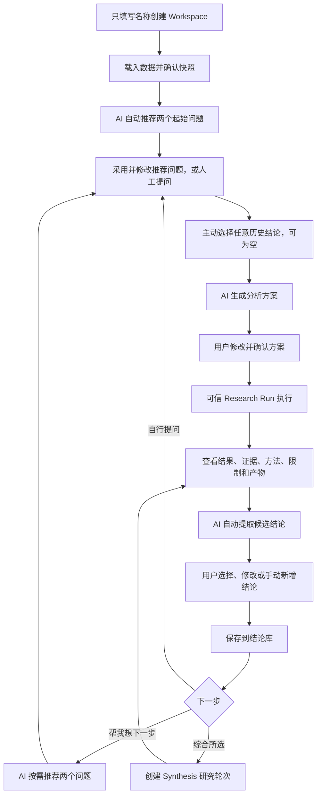

# Research Workspace 多轮研究时间线设计

**日期：** 2026-08-12

**状态：** 已完成方案讨论，等待书面规格复核

**适用范围：** IRIP“实验室运营 → 研究分析”
**设计基线：** 改造现有 Research Workspace，不建设 Workcanvas

## 1. 为什么要改

实验人员拿到多批数据后，常见困难不是不会计算，而是不知道先问什么、下一步追问什么、不同分析之间有什么关系，以及哪些判断值得保留。现有 Workspace 以单一主问题为中心，适合完成一次分析，却不适合持续研究。

本次改造把 Workspace 变成一个以数据为起点的多轮研究空间。AI 帮助提出问题、生成分析方案和整理候选结论；用户决定研究问题、分析方法、哪些结论需要保存，以及哪些历史结论可以参与下一轮。

产品的核心是“基于证据持续追问”，不是画布、节点或树形关系。

## 2. 已确定的产品边界

### 2.1 本次要做

- 直接改造现有 Research Workspace，不新增 Workcanvas 类型、入口或权限。
- 新建 Workspace 时只填写名称；进入后先载入数据。
- 确认数据后创建不可变快照，并自动推荐两个起始问题。
- 用户可以修改推荐问题，也可以自行提出问题。
- 后续推荐不自动出现。用户点击“帮我想下一步”时，系统再推荐两个问题。
- Workspace 支持多轮“问题 → 方案 → 执行 → 结果 → 结论”。
- 用户发起下一轮前，可以从当前 Workspace 的任意历史轮次选择结论。
- 只有用户明确勾选的结论进入下一轮，不自动继承上一轮或整条时间线。
- AI 先生成分析方案，用户可以修改并确认，确认后才执行。
- 分析完成后，AI 自动提取候选结论；用户可以选择、修改、删除，也可以手动新增。
- 人工新增内容允许直接保存为结论，不强制绑定证据；系统记录责任人和来源事实。
- 用户可以选择多条结论执行“综合所选”，结果仍进入研究时间线。
- Workspace 可以继续加入新数据。每次确认产生新快照，历史分析继续绑定旧快照。
- 同一 Workspace 可以保存多个问题草稿和待确认方案，但同时只能执行一个分析。

### 2.2 本次不做

- 不做画布、节点拖拽、连线、树形目录或 React Flow。
- 不建立用户可见的图模型，也不要求研究轮次只有一个父轮次。
- 不迁移、不兼容、不提供只读入口访问旧 Workspace 业务数据。
- 不自动把整段历史对话或全部历史结论塞进模型上下文。
- 暂不使用新数据自动复核旧结论。
- 不支持同一 Workspace 内多个分析并行执行或自动排队。
- 不做跨 Workspace 结论引用和多人共同评审。

### 2.3 与原 Workcanvas 方案的关系

此前 Workcanvas 计划保留为历史材料，不再作为当前开发依据。本设计替代其中的独立入口、Workspace kind、图节点、图边和画布交互方案。可以复用其中关于快照固定、可信分析、结论来源、幂等、安全和科学验收的原则。

## 3. 用户流程

### 3.1 新建和载入数据

新建 Workspace 只要求名称，不再要求主研究问题。新 Workspace 的首屏是数据载入状态；没有数据快照时，不生成推荐问题，也不能创建可执行分析方案。

用户确认数据后，Snapshot Service 创建不可变快照。首次有效快照创建成功后，Recommendation Service 自动生成两个起始问题。推荐失败不会阻止用户手动提问。

### 3.2 提问和方案确认

问题来源分为：

- `initial_ai`：首次数据快照后的 AI 推荐；
- `followup_ai`：用户点击“帮我想下一步”后的 AI 推荐；
- `ai_edited`：用户编辑过的推荐问题；
- `manual`：用户自行提出；
- `synthesis`：用户发起“综合所选结论”。

用户请求生成分析方案时，系统固定本轮问题、当前数据快照和所选历史结论版本。AI 生成方案后，用户可以修改数据范围、步骤、统计方法和预期产出。最终执行必须使用用户确认的方案版本。

### 3.3 分析和结论

执行过程复用现有 Research Plan/Run、统计工具、Artifact 和进度能力。完成后，时间线展示完整结果，并自动开始候选结论提取。

候选结论不是正式结论。只有用户明确保存后，内容才进入 Workspace 结论库，才可以被后续轮次选择。未保存、被删除或被拒绝的候选不得进入后续模型上下文。

### 3.4 新数据和历史记录

用户可以随时管理数据并确认新快照。新问题默认使用最新快照；历史问题、方案、执行和结论继续绑定当时的快照，不重算、不覆盖。

Research Turn 在问题草稿阶段可以自由编辑。一旦开始生成第一版方案，本轮的问题、数据快照和所选结论版本全部锁定。如果之后出现更新快照，界面明确提示：

> 此方案使用数据快照 v2，当前最新数据为 v3。

用户可以继续用 v2 执行，也可以选择基于 v3 创建一个新的研究轮次。系统不得静默替换输入。

## 4. 信息架构与界面

### 4.1 页面结构

Workspace 详情采用两栏布局：

- 主区：当前数据快照、研究时间线和下一轮提问区；
- 右栏：结论库、选择状态、“用于下一轮”和“综合所选”。

时间线按发生时间展示研究轮次，不显示树形层级。每轮可以展开查看：

- 问题及来源；
- 使用的数据快照；
- 主动引用的结论；
- AI 原始方案、人工修改和最终确认方案；
- 排队、执行、失败或完成状态；
- 分析结果、方法、覆盖率、证据、限制和 Artifact；
- 候选结论及最终保存结论。

窄屏下，两栏改为单列，结论库位于时间线和提问区之后。近期不做独立移动端产品。

### 4.2 “数据之海”视觉规范

界面必须复用项目现有设计系统，不另建 Workcanvas 视觉风格：

- 使用 `tokens.ts`、`themeConfig.ts` 和 `ocean.css` 的语义令牌；
- 保留 AppShell、实验室运营页头、`Operations` 水印和现有 Tab；
- 内容使用 `OceanPanel` 的 `default`、`strong`、`structural` 三种材质；
- 主操作用深潮蓝，数据流和活动状态使用潮流青；
- 暖色仅用于警告、证据缺失和未复核状态；
- 快照、轮次、时间和版本使用现有等宽字体；
- 使用 4–8px 圆角和现有 Ant Design 组件 token，不引入另一套大圆角卡片；
- 时间线是克制的结构线，不能重新演变成可操作关系图。

### 4.3 结论库交互

结论库默认展示当前 Workspace 的所有已保存结论，可按发生时间排列。每条至少显示：

- 当前结论文本；
- 来源轮次或“人工新增”；
- 来源数据快照；
- 创建方式；
- 是否关联分析证据；
- 如果来自旧快照，则显示“尚未基于最新数据复核”。

勾选仅改变当前提问草稿的上下文选择。用户必须点击“用于下一轮”或在生成方案时确认选择，选择才固定到 Research Turn。页面刷新前的未提交选择属于前端草稿；已创建的 Turn Context 由服务端恢复。

## 5. 领域模型

本设计不保存画布节点和边。系统保存 Workspace、不可变快照、按时间排列的研究轮次，以及轮次实际引用的结论版本。

### 5.1 核心对象

| 对象 | 用途 | 关键约束 |
|---|---|---|
| `ResearchWorkspace` | 持续研究空间 | 只需要名称即可创建；保存所有者、状态和最新快照指针 |
| `EvidenceSnapshot` | 某次确认后的实验数据 | 不可变；继续复用现有快照体系 |
| `RecommendationBatch` | 一次推荐结果 | 必须恰好包含两个问题；未采用内容不进入正式时间线 |
| `ResearchTurn` | 一轮研究工作 | 类型为 `analysis` 或 `synthesis`；具有独立编号和状态 |
| `TurnContext` | 本轮使用的历史结论 | 只引用用户明确选择的 `ConclusionRevision` |
| `PlanVersion` | AI 原始方案和人工修订 | 每次修改生成新版本；确认版本执行后不可改写 |
| `ResearchRun` | 实际分析执行 | 复用现有可信执行体系；关联一个 Turn 和确认方案 |
| `ConclusionCandidate` | AI 自动提取的待审阅内容 | 不进入结论库，不可直接成为后续上下文 |
| `Conclusion` | 用户保存的逻辑结论 | 保存当前版本指针和责任人 |
| `ConclusionRevision` | 结论的不可变文本版本 | 修改时新增版本，不覆盖历史 Turn 已引用内容 |

### 5.2 Research Turn 固定输入

请求生成方案时，Research Turn 固定：

- `question_text_snapshot`；
- `question_origin`；
- `evidence_snapshot_id`；
- 用户选择的 `conclusion_revision_ids`；
- 各结论的来源轮次、来源快照、证据、限制和创建方式；
- 模型、提示词模板和结构化输出 schema 版本。

开始生成方案后，如果问题、快照或结论选择发生变化，必须创建新的 Research Turn。Plan Version 只记录相同固定输入下对步骤、方法和预期产出的修改。输入变化不能被当成新方案版本或原执行的简单重试。

### 5.3 结论字段

每条保存结论至少记录：

- 当前文本和不可变修订历史；
- 来源类型：`ai_original`、`ai_edited` 或 `manual`；
- 创建人、修改人和时间；
- 来源 Research Turn、Research Run 和数据快照，可为空；
- 证据引用、适用范围、限制和 Artifact，可为空；
- 原始候选 ID，可为空；
- 乐观锁版本和审计记录。

纯人工结论允许没有分析和证据。界面和模型上下文必须如实标记“人工新增、未关联分析证据”，不能把它改写成数据直接支持的事实。

### 5.4 关系原则

- 一个 Turn 只有一个固定数据快照。
- 一个 Turn 可以引用 0–20 个结论修订版本。
- 一个结论修订可以被多个后续 Turn 引用。
- 一个 Turn 可以产出多个候选结论和多个保存结论。
- 同一 Workspace 的轮次编号单调递增，但轮次之间没有唯一父子关系。
- 后续编辑结论不会改变历史 Turn Context。

## 6. 状态与版本规则

### 6.1 Research Turn 状态

正常状态流转为：

`question_draft → planning → plan_review → plan_confirmed → queued → running → succeeded → conclusion_reviewed`

异常或终止状态包括：

- `planning_failed`；
- `run_failed`；
- `cancelled`；
- `succeeded_without_saved_conclusion`。

状态只能通过服务层允许的动作推进。客户端不能直接提交任意状态。

### 6.2 版本固定

- 数据确认产生新快照，不更新旧快照。
- 问题草稿可以修改；开始生成方案后再修改问题，必须创建新的 Research Turn。
- 方案修改产生新 Plan Version；确认后锁定。
- 结论修改产生新 Conclusion Revision。
- 执行重试沿用相同问题、快照、上下文和确认方案，并新增 execution attempt。
- 任一固定输入改变时，创建新的 Research Turn；Plan Version 不承担输入版本管理，也不能伪装成执行重试。

## 7. 服务边界

| 服务 | 职责 |
|---|---|
| Workspace Service | 创建、改名、归档、所有者校验和最新快照状态 |
| Snapshot Service | 数据选择、权限包络、不可变快照和版本列表 |
| Recommendation Service | 首次自动推荐和后续按需推荐两个问题 |
| Turn Service | 轮次创建、输入固定、状态流转和并发控制 |
| Plan Service | 使用固定问题、快照和结论生成可编辑方案 |
| Run Service | 复用 Research Run、统计工具、进度、取消和 Artifact |
| Conclusion Service | 候选提取、人工保存、人工新增和修订历史 |
| Synthesis Service | 综合所选结论并输出固定结构 |
| Timeline Query Service | 组装时间线、当前状态、结论引用和访问限制 |

服务通过 ID 和明确命令协作。Repository 不拥有事务边界；跨对象写入由对应应用服务在单个事务中完成，后台任务只在事务提交后投递。

## 8. AI 上下文和输出约束

模型不会读取整条时间线。每次只接收：

- 当前 Research Turn 的固定问题；
- 本轮数据快照；
- 用户明确选择的结论修订版本；
- 每条结论的来源、原始快照、证据、限制和创建方式；
- 当前任务所需的最少研究上下文。

人工新增且没有证据的内容使用固定标签传入：

> 用户保存的历史结论；未关联分析证据；尚未基于当前快照复核。

推荐问题、分析方案、候选结论和综合结果均采用严格结构化输出。解析失败可以在受限次数内重试；仍失败时进入明确失败状态，不展示残缺对象。系统不保存或展示模型思维链。

## 9. “综合所选结论”

前端将“综合所选”作为结论库的一项快捷操作，后端创建 `synthesis` 类型 Research Turn。它与普通分析共用输入固定、方案确认、Run、错误处理、候选提取和审计流程。

综合输出固定包含：

- 综合判断；
- 共识；
- 冲突；
- 限制；
- 待验证的新想法。

系统不能把旧结论当成已经被最新数据验证的事实。综合结果仍是分析结果；只有用户保存的候选或人工新增内容才进入结论库。

## 10. 并发、幂等与异常处理

### 10.1 单任务规则

同一 Workspace 可以有多个问题草稿和待确认方案，但数据库和服务端必须保证最多一个 `queued` 或 `running` Research Run。前端禁用其他执行按钮只是用户提示，不能代替服务端约束。

### 10.2 幂等

以下动作必须支持幂等键：

- 确认数据并创建快照；
- 生成推荐问题；
- 创建 Research Turn；
- 确认方案并启动执行；
- 保存候选结论；
- 启动综合分析。

双击、请求超时和客户端重试不得创建重复快照、轮次、Run 或结论。

### 10.3 异常处理

- 推荐失败：不创建正式轮次，保留人工提问入口。
- 方案生成失败：保留问题草稿和已选上下文，允许重试。
- 分析失败：保留确认方案、日志摘要和已有 Artifact，允许原输入重试。
- 候选提取失败：分析仍然成功，用户可以重试提取或手动新增结论。
- 后台任务失联：心跳和超时机制将其转为明确失败，不能永久显示运行中。
- 用户取消：记录取消者、时间和已完成步骤；按现有 Run 规则清理临时资源。
- 页面刷新或关闭：所有正式状态从服务端恢复。
- 数据源权限撤销：保留时间线元数据，隐藏受限结果、证据、候选和 Artifact 内容。

## 11. 权限、审计与责任

- Workspace 延续现有 owner、department 和 `research:use` 权限模型。
- 每个 Workspace、Turn、Plan、Run、Conclusion 和 Revision 查询都校验 owner、department 和资源所属关系。
- 跨用户、跨部门和跨 Workspace ID 使用统一 fail-closed 行为。
- 结论记录创建者、修改者、来源方式和修订历史。
- 用户可以保存无证据的人工结论，但系统不能隐藏其来源或伪造证据状态。
- 日志记录 Workspace、Turn、Run、Snapshot 和 Artifact ID、状态、耗时和错误码，不记录原始实验数据、完整提示词或模型完整输出。
- 平台通用审计存储和安全日志属于公共基础设施，不随旧 Workspace 业务数据重置。

## 12. 旧 Research Workspace 数据重置

### 12.1 原则

旧 Research Workspace 数据量很少，且已决定放弃。上线时直接进行一次性破坏性重置，不开发迁移、兼容、旧版只读查询、业务归档或恢复功能。

可以保留一次数据库基础设施级备份作为运维保障，但产品和开发均不承诺从该备份迁移或恢复旧 Research Workspace。

### 12.2 删除范围

清空或替换当前 Research 业务域中的旧数据，包括当前仓库已有的：

- Workspace、问题版本、Workspace 数据引用和 Evidence Snapshot；
- Analysis Plan Version、Analysis Run、Analysis Step 和 Run Artifact；
- AI Conversation 和 Research Memory Document；
- Derived Dataset 及版本；
- Research View 及版本；
- Insight、Insight Version 和 Insight Candidate；
- Result、Result Version、ACL Revision 和 Favorite；
- Research Lineage Edge 和 Knowledge Reference；
- 与上述对象关联的旧发布成果和 Workspace 内派生产物。

实现阶段必须根据当时数据库实际 schema 固定删除清单和外键顺序，不依赖模糊表名前缀或无限制级联。

### 12.3 保留范围

以下不是旧 Workspace 业务数据，不得删除：

- 原始实验数据、Fact 和治理数据源；
- 用户、部门、角色和平台权限配置；
- 平台通用审计、安全和合规日志；
- 模型注册、AI 工具、统计执行环境、Celery/Redis/对象存储基础设施；
- 实验项目及其他非 Research Workspace 业务数据。

### 12.4 切换方式

- 短时间关闭 Research Workspace 写入和入口；
- 执行旧 Research 业务数据重置；
- 应用新表结构或字段变更；
- 部署新 API 和新时间线界面；
- 验证创建、数据快照、推荐、方案、Run、结论和综合链路；
- 重新开放入口。

不做新旧双写，不长期保留两套模型。`RESEARCH_TIMELINE_ENABLED` 只用于部署期间关闭或开放新入口，不承担旧版回退。

## 13. 测试和验收

### 13.1 工程测试

- 单元测试：轮次状态、版本固定、结论修订、推荐数量、并发和幂等规则。
- 集成测试：Snapshot、Plan、Run、Artifact 与 Turn/Conclusion 模型连接。
- 契约测试：Workspace、推荐、问题、方案、执行、结论和时间线 API。
- 安全测试：跨用户、跨部门、跨 Workspace ID、数据访问撤销。
- 恢复测试：重复提交、任务失联、Worker/Redis 中断和页面刷新。
- 前端测试：时间线状态、结论勾选、快照过期提示、方案确认和并发禁用。
- E2E：从创建 Workspace 到多轮分析、保存结论和综合所选。
- 回归测试：可信 Research Run、统计工具、Artifact、权限和审计仍可使用。

发布前执行仓库现有质量门：

`lint → typecheck → test-unit → test-integration → test-security → test-recovery → test-contract → test-acceptance → web-test → web-build`

### 13.2 功能验收

1. 新建 Workspace 只填写名称，进入后没有默认问题。
2. 没有数据快照时不能生成可执行分析方案。
3. 第一次确认数据后恰好得到两个可编辑 AI 推荐问题。
4. 后续推荐只在用户点击“帮我想下一步”后发生，每次仍为两个。
5. 用户可以选择当前 Workspace 任意历史轮次的结论，也可以一个都不选。
6. 未明确选择的结论绝不进入模型上下文。
7. 方案固定具体问题、快照和结论版本；输入变化不会静默影响它。
8. 分析前必须确认方案，执行结果可追溯到实际方案和方法。
9. 同一 Workspace 有运行任务时，其他轮次能编辑但不能执行。
10. 分析完成后自动产生候选结论；只有用户保存的内容进入结论库。
11. 用户可以修改 AI 候选或新增无证据人工结论，并看到真实来源标识。
12. 新数据产生新快照，历史分析和结论继续绑定旧快照。
13. 选择多条结论可以完成结构化综合，并继续保存结论。
14. 页面刷新后恢复快照、轮次、方案、状态、结果和结论。
15. 数据权限撤销后保留记录，但不返回敏感结果和 Artifact。

### 13.3 产品与科学有效性

使用至少 3 名实验人员、10 个真实研究任务进行验收：

- AI 推荐问题直接采用或修改后采用的比例至少为 60%；
- 100% 分析轮次可追溯到快照、问题、所选结论、确认方案和实际方法；
- 未选择结论自动进入上下文的发生次数为 0；
- AI 原始候选结论中缺乏数据支持或夸大证据的比例不超过 10%；
- 人工新增结论单独统计，不混入 AI 候选质量指标；
- 上线前 P0、P1 缺陷均为 0。

同时记录从数据确认到第一个可执行问题的时间、用户识别快照版本的准确率，以及完成一次多轮研究的时间和操作次数，用于后续优化，不作为本次硬性门槛。

## 14. 远期路线图

以下内容不进入本次近期交付：

### 14.1 旧结论自动复核

将自然语言结论转换为结构化待检验命题，分别使用新增数据和最新完整数据进行复核。统计工具负责计算，大模型负责方法规划与解释。结果使用五种状态：

- 再次支持；
- 部分支持；
- 结论受挑战；
- 证据不足；
- 不可自动检验。

近期版本必须从一开始保存快照、证据、方法、限制和结论修订版本，使该能力未来可以加入，不需要重做历史数据模型。

### 14.2 其他远期能力

- 根据真实结论引用生成只读研究脉络图；
- 跨 Workspace 引用正式研究结论；
- Workspace 内多任务排队或并行；
- 多人评论、共同确认和责任签署。

## 15. 完成标准

本次改造完成的判断不是有没有画出分析关系，而是实验人员能否从数据出发得到值得研究的问题，控制每轮分析使用的前提，保留自己认可的判断，并在多轮研究后仍然知道每条结论来自什么数据、什么方法和谁的决定。

所有近期范围、测试、数据重置和验收条件完成后，新的 Research Workspace 才可以替代现有实现正式上线。
