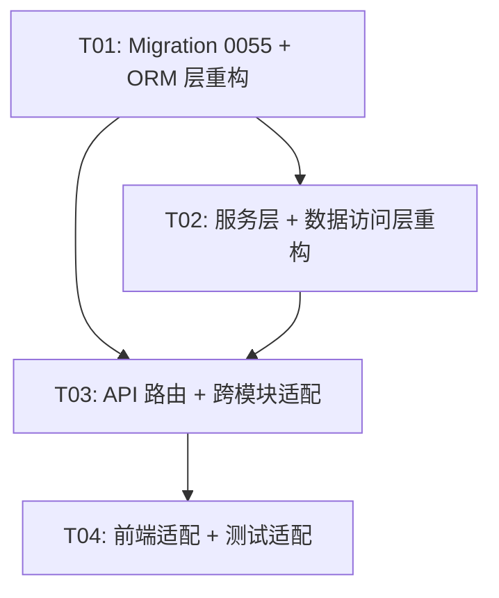

# IRIP Fact 版本链清理 — 系统设计与任务分解

## Part A: System Design

### 1. Implementation Approach

#### 1.1 核心技术挑战

当前 IRIP 的 fact 层设计了一套完整的版本链（fact → fact_revision → raw/normalized_observation, fact_revision_link, fact_artifact），但实际从未使用多版本功能（50条fact，每条恰好1个revision，1:1）。本次重构的目标是：

1. **删除 7 张表**：fact_revision, raw_observation, normalized_observation, quality_assessment, fact_artifact, fact_revision_link, parameter_staleness
2. **字段合并**：将 fact_revision 中的有用字段合并回 fact 表
3. **FactDataIndex FK 改造**：从 fact_revision_id 改为 fact_id
4. **全链路适配**：修改所有引用 FactRevision 的模块（provenance, ai, models, connectors, api routers, flows）
5. **前端适配**：修改 API 类型定义和前端组件
6. **Migration 0055**：DROP 表 + ALTER fact + FK 改造 + 清理 trigger/权限
7. **测试适配**：更新或删除相关测试文件

#### 1.2 框架与库选择

无新增框架/库。沿用现有技术栈：
- **后端**: Python 3.12 + SQLAlchemy 2.0 + Alembic + FastAPI + asyncpg
- **前端**: React + TypeScript + MUI
- **数据库**: PostgreSQL

#### 1.3 架构模式

沿用现有分层架构：
- **entities.py** (ORM 层) → **repository.py** (数据访问层) → **service.py** (业务编排层) → **routers/*.py** (API 层)
- 值对象 (observations.py) 在服务层与 API 层之间传递

---

### 2. File List

#### 2.1 需要修改的文件（后端核心 — facts 模块）

| 文件路径 | 修改说明 |
|---------|---------|
| `packages/facts/entities.py` | 删除 FactRevision, RawObservation, NormalizedObservation, FactArtifact, FactRevisionLink ORM 类；修改 Fact 类（合并字段、删除 current_revision）；修改 FactDataIndex（FK 改为 fact_id） |
| `packages/facts/observations.py` | 删除 RawObservationInput, NormalizedObservationInput, RawObservation, NormalizedObservation 值对象；FactRevisionRef 改为 FactRef（去掉 revision, revision_id） |
| `packages/facts/service.py` | 删除 revise(), list_revisions(), get_observations() 方法；简化 create()（直接写 fact 表）；简化 get(), search(), list_facts()（直接查 fact 表）；删除 ReviseFactCommand；CreateFactCommand 去掉 raw/normalized/artifacts 字段 |
| `packages/facts/repository.py` | 删除 insert_revision, insert_raw_observations, insert_normalized_observations, insert_artifacts, insert_revision_link, get_revision, get_latest_revision, get_revisions, get_raw_observations, get_normalized_observations, get_artifacts, get_revision_link, search_facts, list_facts 中关联 FactRevision 的逻辑；改为直接查 fact 表 |
| `packages/facts/__init__.py` | 更新模块文档字符串 |

#### 2.2 需要修改的文件（后端 — parameters 模块）

| 文件路径 | 修改说明 |
|---------|---------|
| `packages/parameters/entities.py` | 删除 ParameterStaleness ORM 类 |
| `packages/parameters/staleness.py` | **删除整个文件** |
| `packages/parameters/service.py` | 删除 import StalenessChecker/ParameterStaleness；删除 check_staleness() 方法；删除 approve() 中创建 staleness 条目的逻辑 |
| `packages/parameters/__init__.py` | 更新模块文档字符串 |

#### 2.3 需要修改的文件（后端 — provenance 模块）

| 文件路径 | 修改说明 |
|---------|---------|
| `packages/provenance/evidence.py` | EvidenceMember 值对象去掉 fact_revision, fact_revision_id 字段；freeze() 改为查 Fact 表（不再 JOIN FactRevision）；删除 quality_assessment 关联查询 |
| `packages/provenance/graph.py` | 删除 import FactRevision, RawObservation；get_graph() 和 get_paths_to_raw() 中将 fact_revision 节点改为 fact 节点；ProvenanceNode.node_type 的 "fact_revision" 改为 "fact" |
| `packages/provenance/derivations.py` | 删除 import NormalizedObservation；create_run() 中从 EvidenceMember 获取 fact_id（而非 fact_revision_id）；溯源边的 target_type 从 "fact_revision" 改为 "fact" |
| `packages/provenance/entities.py` | 删除 import packages.facts.entities（fact_revision table 注册）；ProvenanceEdge 注释中 "fact_revision" 改为 "fact" |
| `packages/provenance/__init__.py` | 更新模块文档字符串 |

#### 2.4 需要修改的文件（后端 — ai 模块）

| 文件路径 | 修改说明 |
|---------|---------|
| `packages/ai/service.py` | _handle_search_facts() 中的 fallback SQL 从 `fact f JOIN fact_revision fr` 改为直接查 `fact` 表 |
| `packages/ai/tools.py` | 删除 suggest_fact_revision 候选工具定义（fact 不可编辑，无修订概念） |
| `packages/ai/citations.py` | Citation 值对象 object_type 中的 "fact_revision" 改为 "fact"（仅注释/文档变更） |

#### 2.5 需要修改的文件（后端 — models 模块）

| 文件路径 | 修改说明 |
|---------|---------|
| `packages/models/service.py` | _write_execution_fact() 中删除 import RawObservation, NormalizedObservation；CreateFactCommand 去掉 raw/normalized 参数 |

#### 2.6 需要修改的文件（后端 — connectors 模块）

| 文件路径 | 修改说明 |
|---------|---------|
| `packages/connectors/ingestion_service.py` | 删除 import RawObservationInput, NormalizedObservationInput；CreateFactCommand 去掉 raw/normalized 参数；删除 raw/norm 构建逻辑 |

#### 2.7 需要修改的文件（API routers）

| 文件路径 | 修改说明 |
|---------|---------|
| `apps/api/routers/facts.py` | 删除 RawObservationItem, NormalizedObservationItem, ObservationsResponse, RawObservationResponse, NormalizedObservationResponse, ReviseFactRequest 模型；删除 list_revisions, get_revision, get_observations, revise_fact 端点；简化 create_fact（去掉 raw/normalized/artifacts）；FactRevisionResponse 改为 FactResponse（去掉 revision, revision_id）；list_facts/search_facts/search_facts_by_data/get_fact_data/delete_fact/delete_facts_by_task 中所有 FactRevision 引用改为 Fact |
| `apps/api/routers/flows.py` | persist_run_as_fact 中 CreateFactCommand 去掉 raw/normalized；FactDataIndex 写入用 fact_id 替代 revision_id；list_facts_by_flow 中 FactRevision 查询改为 Fact 查询；list_runs 中 FactRevision.flow_run_id 查询改为 Fact.flow_run_id；FactRevisionRef 改为 FactRef |
| `apps/api/routers/provenance.py` | EvidenceMemberResponse 去掉 fact_revision, fact_revision_id；_member_to_response() 适配 |

#### 2.8 需要修改的文件（前端）

| 文件路径 | 修改说明 |
|---------|---------|
| `apps/web/src/api/types.ts` | FactSummary 去掉 revision, revision_id；FactDetail 去掉 revision, revision_id；删除 FactRevision, RawObservation, NormalizedObservation, ObservationsResponse 类型 |
| `apps/web/src/api/facts-provenance.ts` | 删除 apiListFactRevisions, apiGetFactRevision, apiGetFactObservations 函数；FactSummary/FactDetail 适配 |
| `apps/web/src/api/facts.ts` | 删除 FactRevision, RawObservation, NormalizedObservation, ObservationsResponse 的 re-export |

#### 2.9 需要新建的文件

| 文件路径 | 说明 |
|---------|------|
| `migrations/versions/0055_drop_fact_version_chain.py` | 新迁移：DROP 7张表 + ALTER fact 表加字段 + 修改 FactDataIndex FK + 清理 trigger + 清理 RLS/权限 |

#### 2.10 需要修改的文件（测试）

| 文件路径 | 修改说明 |
|---------|---------|
| `tests/integration/facts/test_fact_revisions.py` | **删除整个文件**（版本链功能已删除） |
| `tests/unit/facts/test_fact_invariants.py` | 删除修订相关测试用例（immutable_revisions, revision_preserves_previous）；保留 idempotency 测试 |
| `tests/unit/facts/conftest.py` | 适配 FactService 新签名（去掉 raw/normalized） |
| `tests/integration/parameters/conftest.py` | 删除 quality_assessment 引用 |
| `tests/integration/parameters/test_parameter_approval.py` | 删除 staleness 相关测试用例 |
| `tests/integration/provenance/test_replay.py` | 适配 EvidenceMember 无 fact_revision_id；适配 ProvenanceEdge target_type "fact" |
| `tests/integration/ai/test_offline_citations.py` | 适配 search_facts 返回结构变更 |
| `tests/integration/ingestion/test_particle_ingestion.py` | 适配 CreateFactCommand 新签名 |
| `tests/integration/models/test_model_lifecycle.py` | 适配 CreateFactCommand 新签名 |
| `tests/acceptance/test_v1_invariants.py` | 删除修订相关不变量测试 |
| `tests/unit/provenance/test_evidence_freeze.py` | 适配 EvidenceMember 无 fact_revision_id |
| `tests/unit/ai/test_tool_policy.py` | 删除 suggest_fact_revision 工具测试 |
| `tests/unit/test_migration_files.py` | 更新 0033/0034 immutable_tables 测试（fact_revision 从不可变表列表移除） |
| `tests/conftest.py` | 适配 import 变更 |

---

### 3. Data Structures and Interfaces

#### 3.1 Fact 表新结构（合并后）

```sql
-- fact 表新结构（合并 fact_revision 字段后）
fact {
    -- 原有字段
    id              UUID PK
    organization_id UUID NOT NULL
    template_version_id UUID        -- 原有，保留
    fact_type       TEXT NOT NULL    -- 原有
    object_id       UUID NOT NULL FK -- 原有 → industrial_object
    status          TEXT NOT NULL DEFAULT 'active'  -- 原有
    lock_version    INTEGER NOT NULL DEFAULT 0       -- 原有
    idempotency_key TEXT                             -- 原有
    created_at      TIMESTAMPTZ NOT NULL DEFAULT now() -- 原有
    updated_at      TIMESTAMPTZ NOT NULL DEFAULT now() -- 原有
    created_by      UUID FK → app_user               -- 原有

    -- 从 fact_revision 合并的字段
    subject_id          TEXT NOT NULL               -- 合并
    method_version_id   UUID FK → method_version    -- 合并
    flow_run_id         UUID FK → flow_run           -- 合并
    started_at          TIMESTAMPTZ                  -- 合并
    ended_at            TIMESTAMPTZ                  -- 合并
    task_code           TEXT                         -- 合并
    task_name           TEXT                         -- 合并
    department_name     TEXT                         -- 合并
    operator            TEXT                         -- 合并
    run_operator        TEXT                         -- 合并
    equipment_name      TEXT                         -- 合并
    search_vector       tsvector                     -- 合并（全文搜索向量）

    -- 删除的字段
    -- current_revision  -- 删除（无版本概念）
}
```

**字段合并决策表**：

| fact_revision 字段 | 决策 | 理由 |
|---|---|---|
| subject_id | ✅ 合并 | 前端列表/详情页必需 |
| method_version_id | ✅ 合并 | 关联方法版本 |
| flow_run_id | ✅ 合并 | 关联流程运行（flows.py 必需） |
| started_at | ✅ 合并 | 实验时间 |
| ended_at | ✅ 合并 | 实验时间 |
| task_code | ✅ 合并 | 任务快照（list_facts 分组） |
| task_name | ✅ 合并 | 任务快照 |
| department_name | ✅ 合并 | 部门快照 |
| operator | ✅ 合并 | 操作人快照 |
| run_operator | ✅ 合并 | 运行操作人快照 |
| equipment_name | ✅ 合并 | 设备名快照 |
| search_vector | ✅ 合并 | 全文搜索向量 |
| revision | ❌ 不合并 | 版本号概念已删除 |
| revision_reason | ❌ 不合并 | 无修订概念 |
| revision_summary | ❌ 不合并 | 无修订概念（原为质量评估摘要 JSONB） |
| template_version_id | ❌ 不合并 | fact 表已有此字段 |
| fact_type | ❌ 不合并 | fact 表已有此字段 |
| object_id | ❌ 不合并 | fact 表已有此字段 |
| created_at | ❌ 不合并 | fact 表已有此字段 |
| created_by | ❌ 不合并 | fact 表已有此字段 |

#### 3.2 FactDataIndex 变更

```sql
-- 修改前
fact_data_index {
    id              UUID PK
    fact_revision_id UUID FK → fact_revision  -- 旧
    row_index       INTEGER
    key             TEXT
    value_text      TEXT
    value_number    FLOAT
}

-- 修改后
fact_data_index {
    id              UUID PK
    fact_id          UUID FK → fact  -- 新（FK 从 fact_revision_id 改为 fact_id）
    row_index       INTEGER
    key             TEXT
    value_text      TEXT
    value_number    FLOAT
}
```

#### 3.3 删除的 ORM 类列表

| ORM 类 | 文件 | 对应表 |
|--------|------|-------|
| `FactRevision` | packages/facts/entities.py | fact_revision |
| `RawObservation` | packages/facts/entities.py | raw_observation |
| `NormalizedObservation` | packages/facts/entities.py | normalized_observation |
| `FactArtifact` | packages/facts/entities.py | fact_artifact |
| `FactRevisionLink` | packages/facts/entities.py | fact_revision_link |
| `ParameterStaleness` | packages/parameters/entities.py | parameter_staleness |
| (无 ORM 类，仅 migration 创建) | migrations/versions/0013_quality_ingestion.py | quality_assessment |

#### 3.4 类图

详见 `docs/class-diagram.mermaid`

---

### 4. Program Call Flow

#### 4.1 简化后的 Fact 创建流程

详见 `docs/sequence-diagram.mermaid`

**核心变化**：
- 旧流程：创建 fact → 创建 fact_revision → 创建 raw_observations → 创建 normalized_observations → 创建 fact_artifacts → 返回 FactRevisionRef
- 新流程：创建 fact（含所有合并字段） → 返回 FactRef

#### 4.2 简化后的 Fact 搜索流程

- 旧流程：search_facts() JOIN fact_revision 搜索 search_vector → 返回 FactRevisionRef
- 新流程：search_facts() 直接查 fact 表的 search_vector → 返回 FactRef

---

### 5. Anything UNCLEAR

1. **fact 表的不可变性**：fact_revision 原来是不可变表（有 trigger 阻止 UPDATE/DELETE）。合并字段后，fact 表需要保持不可变吗？**假设**：fact 表本身不是不可变表（status 字段需要更新，如 archive），但实验数据写入后不可编辑。保持现状（fact 表可 UPDATE status，但业务层保证实验数据不修改）。

2. **search_vector 生成列**：fact_revision 的 search_vector 是一个 server_default 生成的 tsvector 列。合并到 fact 表后，需要重建这个生成列。**假设**：在 migration 0055 中 ALTER TABLE fact ADD COLUMN search_vector tsvector GENERATED ALWAYS AS (...) STORED。

3. **FactDataIndex 已有数据**：当前有数据通过 fact_revision_id 关联。由于产品未发布、数据可全删，**假设**：migration 0055 中先 DROP fact_data_index 的 FK 约束，再重建为 fact_id 关联，已有数据忽略（可全删）。

4. **EvidenceMember 的 fact_revision_id 字段**：evidence_set_version.members JSONB 中存储了 fact_revision_id。删除 fact_revision 表后，这些 JSONB 中的引用将失效。**假设**：EvidenceMember 改为存储 fact_id（去掉 fact_revision 和 fact_revision_id 字段），已有数据可全删。

5. **ProvenanceEdge 的 target_type="fact_revision"**：provenance_edge 表中已有的边引用了 fact_revision 类型的节点。**假设**：已有数据可全删，新边使用 target_type="fact"。

6. **quality_assessment 表**：该表没有 ORM 类（仅在 migration 0013 中创建），但 evidence.py 的 freeze() 方法有动态引用（通过 sa.table() 构建临时查询）。删除该表后，需要同时删除 evidence.py 中的 quality 过滤逻辑。

---

## Part B: Task Decomposition

### 6. Required Packages

无新增第三方包。沿用现有依赖。

---

### 7. Task List (ordered by dependency)

#### T01: Migration 0055 + ORM 层重构（entities + observations 值对象）

- **Task Name**: 数据库迁移 + ORM 模型重构
- **Source Files**:
  - `migrations/versions/0055_drop_fact_version_chain.py` (新建)
  - `packages/facts/entities.py` (修改)
  - `packages/facts/observations.py` (修改)
  - `packages/parameters/entities.py` (修改)
  - `packages/facts/__init__.py` (修改)
  - `packages/parameters/__init__.py` (修改)
- **Dependencies**: 无
- **Priority**: P0
- **详细说明**:
  - 创建 migration 0055：DROP 7张表（fact_revision, raw_observation, normalized_observation, quality_assessment, fact_artifact, fact_revision_link, parameter_staleness），ALTER fact 表加字段（subject_id, method_version_id, flow_run_id, started_at, ended_at, task_code, task_name, department_name, operator, run_operator, equipment_name, search_vector），ALTER fact 表删字段（current_revision），ALTER fact_data_index 改 FK（fact_revision_id → fact_id），DROP trigger prevent_modify_fact_revision，恢复 irip_runtime 对 fact 表的 UPDATE 权限
  - 修改 entities.py：删除 6 个 ORM 类（FactRevision, RawObservation, NormalizedObservation, FactArtifact, FactRevisionLink, ParameterStaleness），修改 Fact 类（加合并字段、删 current_revision），修改 FactDataIndex（FK 改为 fact_id）
  - 修改 observations.py：删除 RawObservationInput, NormalizedObservationInput, RawObservation, NormalizedObservation 值对象；FactRevisionRef 改为 FactRef（fact_id, fact_type, subject_id, status + 合并的快照字段）

#### T02: 服务层 + 数据访问层重构（service + repository + parameters staleness）

- **Task Name**: 业务服务层与数据访问层重构
- **Source Files**:
  - `packages/facts/service.py` (修改)
  - `packages/facts/repository.py` (修改)
  - `packages/parameters/staleness.py` (删除)
  - `packages/parameters/service.py` (修改)
- **Dependencies**: T01
- **Priority**: P0
- **详细说明**:
  - service.py：删除 revise(), list_revisions(), get_observations() 方法；删除 ReviseFactCommand；简化 CreateFactCommand（去掉 raw, normalized, artifacts）；简化 create()（直接写 fact 表，不再创建 revision/observations/artifacts）；简化 get()（直接查 fact 表）；简化 search() 和 list_facts()（直接查 fact 表，不再 JOIN FactRevision）；返回值改为 FactRef
  - repository.py：删除所有 revision/observation/artifact/link 相关方法；insert_fact() 方法增加合并字段参数；search_facts() 改为直接查 fact.search_vector；list_facts() 改为直接查 fact 表（不再 JOIN FactRevision 查最新修订）；find_by_idempotency_key() 适配新返回值
  - staleness.py：删除整个文件
  - parameters/service.py：删除 import StalenessChecker/ParameterStaleness；删除 check_staleness() 方法；删除 approve() 中创建 staleness 条目的逻辑（第510-527行）

#### T03: API 路由 + 跨模块适配（routers + provenance + ai + models + connectors）

- **Task Name**: API 路由层与跨模块适配
- **Source Files**:
  - `apps/api/routers/facts.py` (修改)
  - `apps/api/routers/flows.py` (修改)
  - `apps/api/routers/provenance.py` (修改)
  - `packages/provenance/evidence.py` (修改)
  - `packages/provenance/graph.py` (修改)
  - `packages/provenance/derivations.py` (修改)
  - `packages/provenance/entities.py` (修改)
  - `packages/provenance/__init__.py` (修改)
  - `packages/ai/service.py` (修改)
  - `packages/ai/tools.py` (修改)
  - `packages/ai/citations.py` (修改)
  - `packages/models/service.py` (修改)
  - `packages/connectors/ingestion_service.py` (修改)
- **Dependencies**: T01, T02
- **Priority**: P0
- **详细说明**:
  - facts.py：删除修订/观察值相关端点和模型；FactRevisionResponse 改为 FactResponse（去掉 revision, revision_id）；list_facts/search_facts/search_facts_by_data 中 FactRevision 查询改为 Fact 查询（task_code 等快照字段直接从 fact 表读）；get_fact_data 中 FactRevision/FactArtifact/RawObservation 查询改为从 Fact 表和 Artifact 直接查询；delete_fact/delete_facts_by_task 中 FactRevision 查询改为 Fact 查询
  - flows.py：persist_run_as_fact 中 CreateFactCommand 去掉 raw/normalized；FactDataIndex 写入用 fact_id 替代 revision_id；list_facts_by_flow 中 FactRevision 查询改为 Fact 查询；list_runs 中 FactRevision.flow_run_id 查询改为 Fact.flow_run_id；FactRevisionRef 改为 FactRef
  - provenance.py：EvidenceMemberResponse 去掉 fact_revision, fact_revision_id
  - evidence.py：EvidenceMember 去掉 fact_revision, fact_revision_id；freeze() 改为查 Fact 表（不再 JOIN FactRevision）；删除 quality_assessment 关联查询
  - graph.py：ProvenanceNode node_type "fact_revision" 改为 "fact"；get_graph/get_paths_to_raw 中 FactRevision 查询改为 Fact 查询；删除 RawObservation import
  - derivations.py：create_run() 从 EvidenceMember 获取 fact_id；溯源边 target_type "fact_revision" 改为 "fact"；删除 NormalizedObservation import
  - ai/service.py：_handle_search_facts() fallback SQL 从 JOIN fact_revision 改为直接查 fact 表
  - ai/tools.py：删除 suggest_fact_revision 候选工具
  - ai/citations.py：Citation object_type 注释更新
  - models/service.py：_write_execution_fact() 去掉 raw/normalized
  - connectors/ingestion_service.py：去掉 raw/norm 构建，CreateFactCommand 新签名

#### T04: 前端适配 + 测试适配

- **Task Name**: 前端类型与组件适配 + 测试文件适配
- **Source Files**:
  - `apps/web/src/api/types.ts` (修改)
  - `apps/web/src/api/facts-provenance.ts` (修改)
  - `apps/web/src/api/facts.ts` (修改)
  - `tests/integration/facts/test_fact_revisions.py` (删除)
  - `tests/unit/facts/test_fact_invariants.py` (修改)
  - `tests/unit/facts/conftest.py` (修改)
  - `tests/integration/parameters/conftest.py` (修改)
  - `tests/integration/parameters/test_parameter_approval.py` (修改)
  - `tests/integration/provenance/test_replay.py` (修改)
  - `tests/integration/ai/test_offline_citations.py` (修改)
  - `tests/integration/ingestion/test_particle_ingestion.py` (修改)
  - `tests/integration/models/test_model_lifecycle.py` (修改)
  - `tests/acceptance/test_v1_invariants.py` (修改)
  - `tests/unit/provenance/test_evidence_freeze.py` (修改)
  - `tests/unit/ai/test_tool_policy.py` (修改)
  - `tests/unit/test_migration_files.py` (修改)
  - `tests/conftest.py` (修改)
- **Dependencies**: T01, T02, T03
- **Priority**: P1
- **详细说明**:
  - 前端 types.ts：FactSummary 去掉 revision/revision_id；FactDetail 去掉 revision/revision_id；删除 FactRevision/RawObservation/NormalizedObservation/ObservationsResponse 类型
  - 前端 facts-provenance.ts：删除 apiListFactRevisions, apiGetFactRevision, apiGetFactObservations
  - 前端 facts.ts：删除对应 re-export
  - 删除 test_fact_revisions.py
  - 适配所有测试文件中的 FactService 新签名、CreateFactCommand 新签名、FactRef 替代 FactRevisionRef、EvidenceMember 无 fact_revision_id 等

---

### 8. Shared Knowledge

#### 8.1 FactRef 值对象替代 FactRevisionRef

```python
@dataclass(frozen=True)
class FactRef:
    """事实引用（服务返回值），替代原 FactRevisionRef。"""
    fact_id: UUID
    fact_type: str
    subject_id: str
    status: str
```

**约定**：
- 所有原来返回 `FactRevisionRef` 的方法现在返回 `FactRef`
- `FactRef` 去掉了 `revision` 和 `revision_id` 字段（无版本概念）
- API 响应中 `revision` 和 `revision_id` 字段不再返回（前端兼容性：前端类型定义同步删除）

#### 8.2 CreateFactCommand 简化

```python
@dataclass(frozen=True)
class CreateFactCommand:
    fact_type: Literal["experiment_run", "simulation_run", "document_record", "model_execution"]
    template_version_id: UUID | None
    organization_id: UUID
    object_id: UUID
    subject_id: str
    started_at: datetime | None
    ended_at: datetime | None
    method_version_id: UUID | None
    idempotency_key: str | None
    created_by: UUID
    task_code: str | None = None
    task_name: str | None = None
    department_name: str | None = None
    operator: str | None = None
    run_operator: str | None = None
    equipment_name: str | None = None
    flow_run_id: UUID | None = None
```

**约定**：
- 删除了 `raw`, `normalized`, `artifacts` 字段（raw/normalized 表已删除）
- artifact 关联通过独立的 artifact 机制处理（flows.py 的 persist_run_as_fact 中上传 artifact 后，通过 fact.id 关联）

#### 8.3 ProvenanceEdge 节点类型变更

- `source_type` / `target_type` 中 `"fact_revision"` → `"fact"`
- EvidenceMember JSONB 中 `fact_revision_id` / `fact_revision` → `fact_id`

#### 8.4 API 响应字段变更

- FactRevisionResponse → FactResponse
- 删除 `revision`, `revision_id` 字段
- 保留 `fact_id`, `fact_type`, `subject_id`, `status`, `task_code`, `task_name`, `department_name`, `operator`, `run_operator`, `equipment_name`, `data_summary`

#### 8.5 FactDataIndex FK 变更

- `fact_revision_id` → `fact_id`
- 写入时使用 `ref.fact_id`（而非 `ref.revision_id`）

#### 8.6 删除的方法/端点清单

| 方法/端点 | 位置 | 删除原因 |
|----------|------|---------|
| `FactService.revise()` | service.py | fact 不可编辑 |
| `FactService.list_revisions()` | service.py | 无版本链 |
| `FactService.get_observations()` | service.py | raw/normalized 表删除 |
| `ReviseFactCommand` | service.py | 无修订概念 |
| `list_revisions` 端点 | facts.py | 无版本链 |
| `get_revision` 端点 | facts.py | 无版本链 |
| `get_observations` 端点 | facts.py | raw/normalized 表删除 |
| `revise_fact` 端点 | facts.py | fact 不可编辑 |
| `ParameterService.check_staleness()` | parameters/service.py | staleness 模块删除 |
| `StalenessChecker` 类 | staleness.py | staleness 模块删除 |
| `suggest_fact_revision` 工具 | ai/tools.py | fact 不可编辑 |

---

### 9. Task Dependency Graph



**说明**：
- T01 是基础，必须先完成（定义新的数据结构和值对象）
- T02 依赖 T01（服务层使用新的 ORM 类和值对象）
- T03 依赖 T01 和 T02（API 层调用服务层，跨模块引用新的值对象）
- T04 依赖 T01/T02/T03（前端类型和测试需要匹配最终 API 契约）
